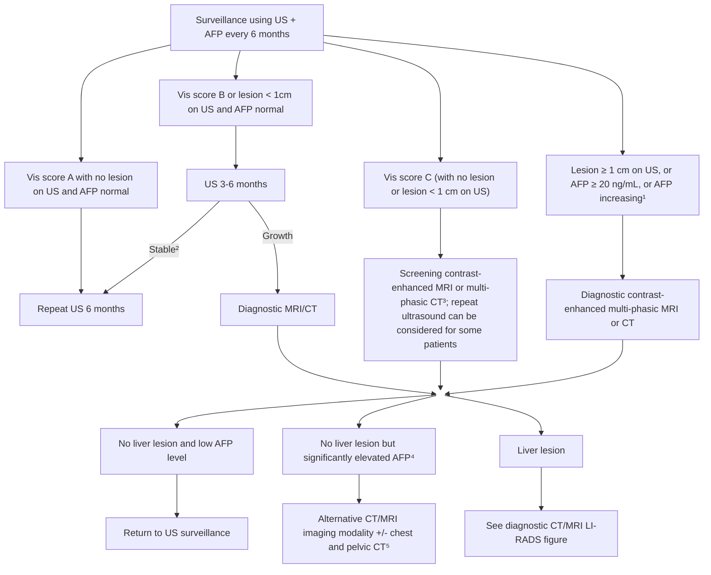
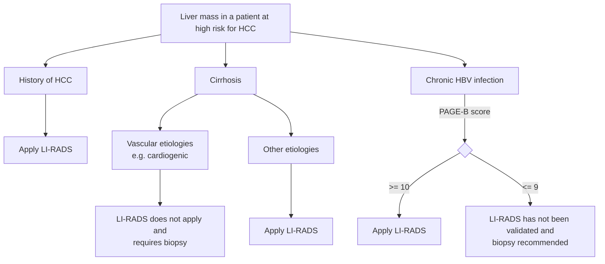
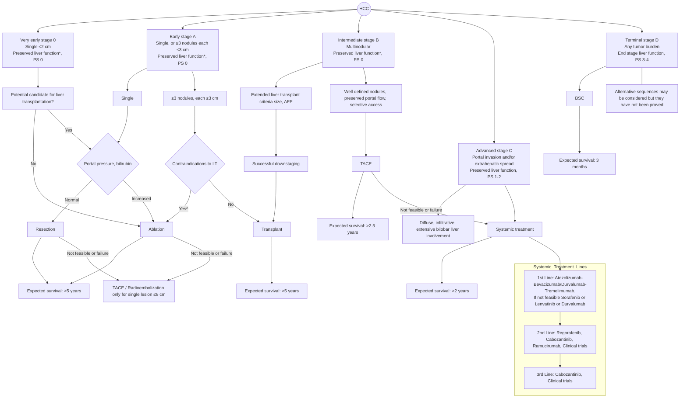
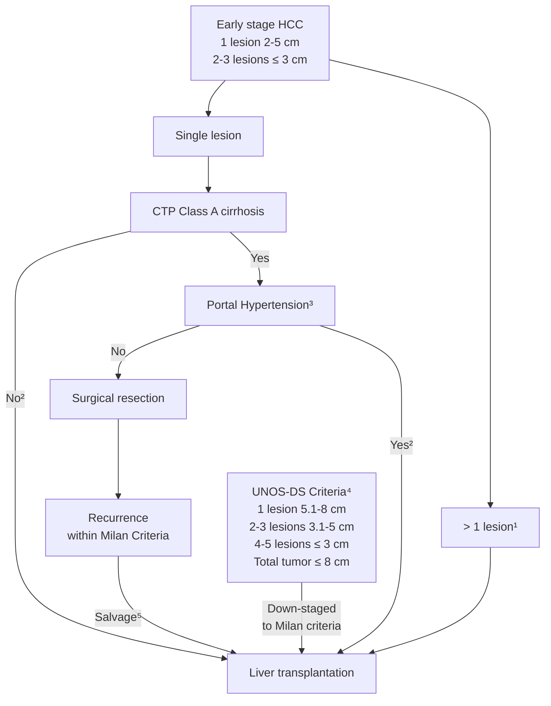
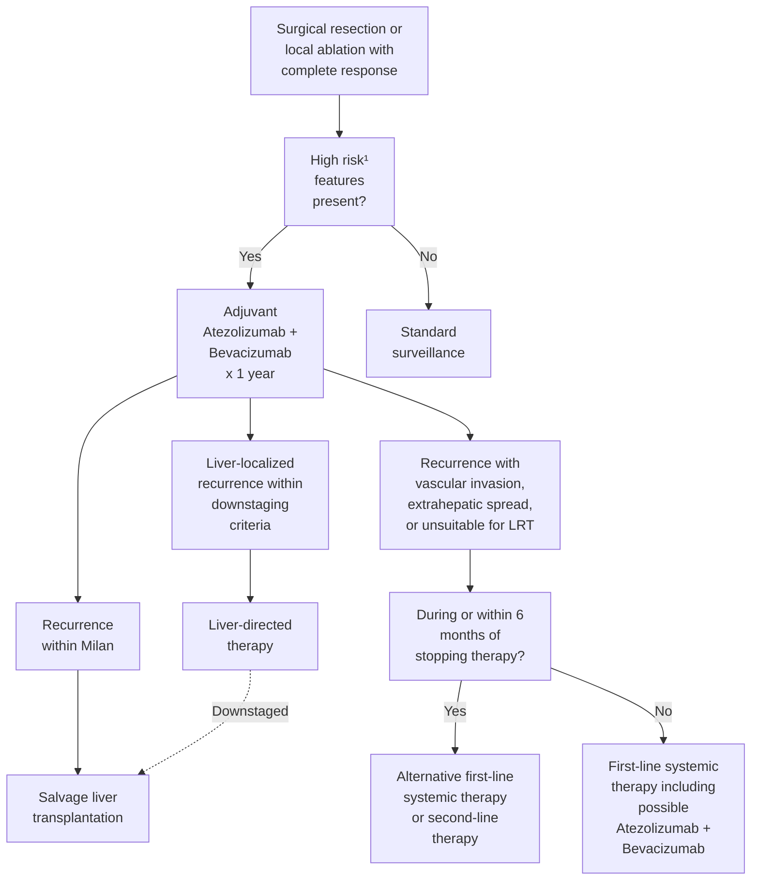
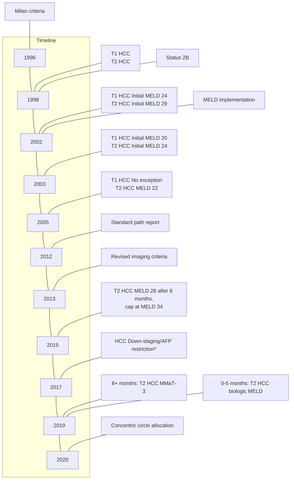
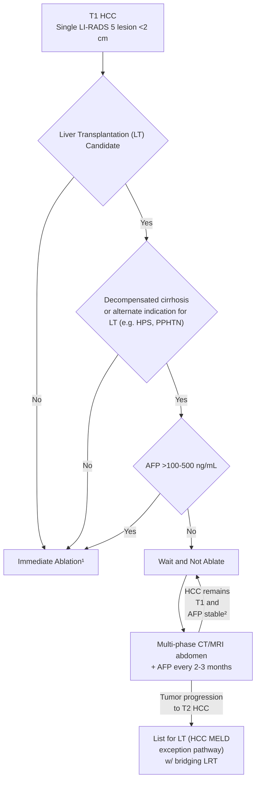
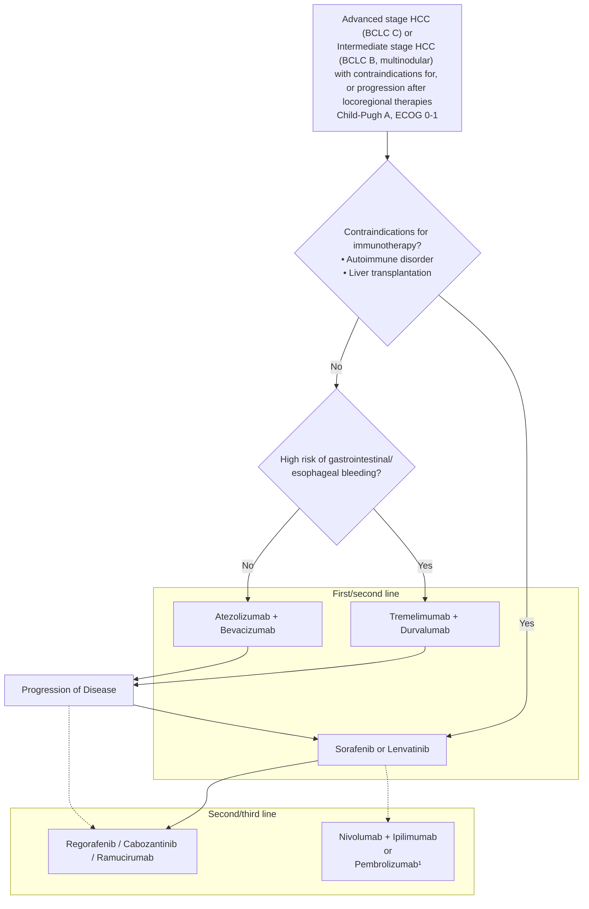

Received: 1 May 2023 | Accepted: 1 May 2023
DOI: 10.1097/HEP.0000000000000466
AASLD AMERICAN ASSOCIATION FOR THE STUDY OF LIVER DISEASES


# PRACTICE GUIDANCE

# AASLD Practice Guidance on prevention, diagnosis, and treatment of hepatocellular carcinoma

**Amit G. Singal<sup>1</sup> | Josep M. Llovet<sup>2,3,4</sup> | Mark Yarchoan<sup>5</sup> | Neil Mehta<sup>6</sup> | Julie K. Heimbach<sup>7</sup> | Laura A. Dawson<sup>8</sup> | Janice H. Jou<sup>9</sup> | Laura M. Kulik<sup>10</sup> | Vatche G. Agopian<sup>11</sup> | Jorge A. Marrero<sup>12</sup> | Mishal Mendiratta-Lala<sup>13</sup> | Daniel B. Brown<sup>14</sup> | William S. Rilling<sup>15</sup> | Lipika Goyal<sup>16</sup> | Alice C. Wei<sup>17</sup> | Tamar H. Taddei<sup>18,19</sup>**

<sup>1</sup>Department of Internal Medicine, University of Texas Southwestern Medical Center, Dallas, Texas, USA
<sup>2</sup>Liver Cancer Program, Division of Liver Diseases, Tisch Cancer Institute, Mount Sinai School of Medicine, New York, New York, USA
<sup>3</sup>Translational Research in Hepatic Oncology, Liver Unit, August Pi i Sunyer Biomedical Research Institute, Hospital Clinic, University of Barcelona, Catalonia, Spain
<sup>4</sup>Institució Catalana de Recerca i Estudis Avançats, Barcelona, Catalonia, Spain
<sup>5</sup>Department of Medical Oncology, Johns Hopkins Sidney Kimmel Comprehensive Cancer Center, Baltimore, Maryland, USA
<sup>6</sup>University of California, San Francisco, San Francisco, California, USA
<sup>7</sup>Transplant Center, Mayo Clinic Rochester, Rochester, Minnesota, USA
<sup>8</sup>Radiation Medicine Program/University Health Network, Department of Radiation Oncology, University of Toronto, Toronto, Canada
<sup>9</sup>Division of Gastroenterology and Hepatology, Oregon Health and Science University, Portland, Oregon, USA
<sup>10</sup>Northwestern Medical Faculty Foundation, Chicago, Illinois, USA
<sup>11</sup>The Dumont–University of California, Los Angeles, Transplant Center, David Geffen School of Medicine, University of California, Los Angeles, Los Angeles, California, USA
<sup>12</sup>Division of Gastroenterology and Hepatology, University of Pennsylvania, Philadelphia, Pennsylvania, USA
<sup>13</sup>Department of Radiology, University of Michigan Medical Center, Ann Arbor, Michigan, USA
<sup>14</sup>Department of Radiology, Vanderbilt University Medical Center, Nashville, Tennessee, USA
<sup>15</sup>Division of Interventional Radiology, Medical College of Wisconsin, Milwaukee, Wisconsin, USA
<sup>16</sup>Department of Medicine, Stanford School of Medicine, Palo Alto, California, USA
<sup>17</sup>Memorial Sloan Kettering Cancer Center, New York City, New York, USA
<sup>18</sup>Department of Medicine (Digestive Diseases), Yale School of Medicine, New Haven, CT, USA
<sup>19</sup>Veterans Affairs Connecticut Healthcare System, West Haven, CT, USA

**Correspondence**
Amit G. Singal, University of Texas Southwestern Medical Center, 5959 Harry Hines Blvd, POB1, Suite 420, Dallas, TX 75235, USA.
Email: amit.singal@utsouthwestern.edu

Tamar H. Taddei, Yale School of Medicine, 333 Cedar St, 1080 LMP, PO Box 208019, New Haven, CT 06520, USA.
Email: tamar.taddei@yale.edu

---

**Abbreviations:** AASLD, American Association for the Study of Liver Diseases; ACP, advance care planning; AE, adverse event; AFP, alpha fetoprotein; ALBI, albumin-bilirubin; APHE, arterial phase hyperenhancement; BCLC, Barcelona Liver Clinic Cancer; CEUS, contrast-enhanced ultrasound; CI, confidence interval; CSPH, clinically significant portal hypertension; CT, computed tomography; ctDNA, circulating tumor DNA; DCP, des gamma carboxy prothrombin; EBRT, external beam radiation therapy; ECOG PS, Eastern Cooperative Oncology Group Performance Status; EGD, esophagogastroduodenoscopy; FDA, Food and Drug Administration; FLR, future liver remnant; GI, gastrointestinal; HBV, hepatitis B virus; HCC, hepatocellular carcinoma; HCV, hepatitis C virus; HR, hazard ratio; ICI, immune checkpoint inhibitor; irAE, immune-related adverse event; LDLT, living donor liver transplantation; LI-RADS, Liver Imaging Reporting and Data System; LT, liver transplant; MELD, Model for End-Stage Liver Disease; MIS, minimally invasive surgery; mRECIST, modified response evaluation criteria in solid tumors; MRI, magnetic resonance imaging; mTKI, multikinase inhibitor; OPTN, Organ Procurement and Transplant Network; ORR, objective response rate; OS, overall survival; PBT, proton beam therapy; PD1, programmed death 1; PD-L1, programmed death ligand 1; PET, positron emission tomography; PFS, progression-free survival; PVTT, portal vein tumor thrombus; RCT, randomized controlled trial; RECIST, response evaluation criteria in solid tumors; RETREAT, Risk Estimation of Tumor Recurrence After Transplant; SVR, sustained virological response; TACE, transarterial chemoembolization; TARE, transarterial radioembolization; TTP, time to progression; UNOS, United Network for Organ Sharing; UNOS-DS, UNOS downstaging; VEGF, vascular endothelial growth factor.

---
Copyright © 2023 American Association for the Study of Liver Diseases.


1922 | www.hepjournal.com Hepatology. 2023;78:1922–1965
Copyright © 2023 American Association for the Study of Liver Diseases. Published by Wolters Kluwer Health, Inc. Unauthorized reproduction of this article prohibited.

AASLD PRACTICE GUIDANCE ON HCC | 1923


# INTRODUCTION

This guidance document provides an updated approach to the prevention, diagnosis, and treatment of hepatocellular carcinoma (HCC). The prior American Association for the Study of Liver Diseases (AASLD) HCC guidance document was updated at this time to reflect clinically significant changes to approaches in several of these areas. Notable examples of these updates include recommendations for use of ultrasound and alpha fetoprotein (AFP) for HCC surveillance, expanded indications for surgical therapies, incorporation of immune checkpoint inhibitor (ICI) therapy for first-line systemic therapy, and explicit recommendations for multidisciplinary care and advance care planning (ACP).

This guidance on HCC was developed with the support and oversight of the AASLD Practice Guidelines Committee. AASLD guidelines are supported by systematic reviews of the literature, formal ratings of evidence quality and strength of recommendations, and, if appropriate, meta-analysis of results using the Grading of Recommendations Assessment Development and Evaluation system. In contrast, this document was developed by consensus of a multidisciplinary expert panel and provides guidance statements based on formal review and analysis of the literature on the topics and questions related to the prevention, diagnosis, and treatment of HCC. Although the literature review for this document is comprehensive and unbiased, the lack of mandatory systematic reviews facilitated more rapid publication. The expert panel rated the level of evidence for each recommendation based on the Oxford Center for Evidence-Based Medicine.<sup>[1]</sup> Additionally, the panel categorized the strength of recommendations based on the level of evidence, risk–benefit ratio, and patient preferences.

# EPIDEMIOLOGY AND PREVENTION

## Incidence and mortality

Primary liver cancer is the sixth most common cancer worldwide and the third leading cause of cancer-related deaths—both worldwide and in the United States as of 2020.<sup>[2]</sup> HCC is the most common type of primary liver cancer, accounting for 75% – 86% of cases.<sup>[3]</sup> Men are affected approximately two to three times more than women, with higher incidence and mortality across most countries.<sup>[4]</sup> There are also notable racial and ethnic disparities in HCC, with a disproportionate burden of disease affecting American Indian, Hispanic, and Black persons more than non-Hispanic White persons.<sup>[5]</sup> In the United States, HCC incidence and mortality rates increased from 1970 to 2010, but incidence began to decrease in 2011, and mortality plateaued in 2013, with one study showing a subsequent ~3% decrease per year.<sup>[6]</sup> This improvement is likely related to changing demographics and risk factors for HCC as well as advances in prevention, early detection, and treatment.

## Emerging etiologic risk factors

The strongest risk factor for developing HCC is cirrhosis from any liver disease etiology, which is present in over 80% of patients with HCC.<sup>[7]</sup> Patients with cirrhosis from any etiology typically have a ~2% annual risk of developing HCC.<sup>[8]</sup> Chronic hepatitis B virus (HBV) and hepatitis C virus (HCV) infections remain the predominant etiologic risk factors in many parts of the world, although the proportion of patients with HCC with HBV or HCV infection is declining in areas with dedicated viral hepatitis elimination programs (Figure 1).<sup>[10]</sup> For example, universal newborn HBV vaccination programs in Asia are associated with significant decreases in HCC incidence.<sup>[11]</sup> Areas without robust viral hepatitis elimination programs continue to have a disproportionately high burden of HBV-associated HCC. For example, HCC develops at substantially younger ages (median age 46 y) in Sub-Saharan Africa because of vertical transmission, and projections suggest HCC incidence will double by 2040.<sup>[12,13]</sup> This age disparity persists in people who are HBV-infected and emigrate elsewhere, such that more than one third of persons from Africa who develop HCC are diagnosed before age 40 years.<sup>[14]</sup> Antiviral therapy for HBV and HCV also significantly reduces HCC risk, although patients with cirrhosis (and possibly those with advanced fibrosis) continue to have persistent risk of developing HCC. Accordingly, viral hepatitis-related HCC has plateaued in most of the developed world, including the United States.

In parallel, alcohol and NAFLD-related HCC have increased in both incidence and mortality,<sup>[6]</sup> highlighting a need for public policies targeting these emerging risk factors to promote continued declines in HCC incidence. Alcohol-associated cirrhosis is a known risk factor for HCC development, and alcohol use as a cofactor with other etiologies increases HCC risk as much as 5-fold.<sup>[15]</sup> NAFLD has become a significant public health concern, related to significant increases in the prevalence of obesity and metabolic syndrome,<sup>[16]</sup> and is currently the fastest growing cause of HCC in liver transplant (LT) candidates.<sup>[17]</sup> NAFLD has also become the leading cause of HCC in the absence of cirrhosis, with approximately one-fourth to one-third of NAFLD-related HCC occurring in the absence of cirrhosis; however, further data are still needed to identify which patients with noncirrhotic NAFLD have sufficient risk to warrant HCC surveillance.<sup>[18–21]</sup>

## Cofactors for HCC

A long list of other cofactors can increase or decrease individual HCC risk in at-risk patients with chronic liver


Copyright © 2023 American Association for the Study of Liver Diseases. Published by Wolters Kluwer Health, Inc. Unauthorized reproduction of this article prohibited.

1924 | HEPATOLOGY


The image shows a world map illustrating the worldwide incidence of Hepatocellular Carcinoma (HCC) and its most common risk factors. The map is color-coded by Age Standardized Incidence Rate (ASR) per 100,000 people, and regional pie charts show the relative contribution of different etiologies.

**Legend for Aetiology:**
*   Alcohol (Blue)
*   HBV (Orange)
*   HCV (Green)
*   Other (i.e., NASH) (Yellow)

**Legend for ASR (world) per 100,000:**
*   $\ge 8.4$ (Dark Blue)
*   $5.8-8.4$ (Medium Blue)
*   $4.7-5.8$ (Light Blue)
*   $3.3-4.7$ (Lighter Blue)
*   $< 3.3$ (Very Light Blue)
*   Data not applicable (Grey)
*   No data (Dark Grey)

**Estimated Regional Etiology of HCC (based on pie charts):**

<table>
  <tbody>
    <tr>
        <td>Region</td>
        <td>Alcohol</td>
        <td>HBV</td>
        <td>HCV</td>
        <td>Other (i.e., NASH)</td>
    </tr>
    <tr>
        <td>North America</td>
        <td>25%</td>
        <td>15%</td>
        <td>35%</td>
        <td>25%</td>
    </tr>
    <tr>
        <td>Andean Latin America</td>
        <td>20%</td>
        <td>10%</td>
        <td>20%</td>
        <td>50%</td>
    </tr>
    <tr>
        <td>South Latin America</td>
        <td>30%</td>
        <td>10%</td>
        <td>30%</td>
        <td>30%</td>
    </tr>
    <tr>
        <td>Western Europe</td>
        <td>35%</td>
        <td>10%</td>
        <td>35%</td>
        <td>20%</td>
    </tr>
    <tr>
        <td>Central Europe</td>
        <td>45%</td>
        <td>15%</td>
        <td>25%</td>
        <td>15%</td>
    </tr>
    <tr>
        <td>Eastern Europe</td>
        <td>40%</td>
        <td>20%</td>
        <td>25%</td>
        <td>15%</td>
    </tr>
    <tr>
        <td>Western Africa</td>
        <td>10%</td>
        <td>60%</td>
        <td>20%</td>
        <td>10%</td>
    </tr>
    <tr>
        <td>North Africa, Middle East</td>
        <td>5%</td>
        <td>30%</td>
        <td>50%</td>
        <td>15%</td>
    </tr>
    <tr>
        <td>Southern Africa</td>
        <td>15%</td>
        <td>55%</td>
        <td>15%</td>
        <td>15%</td>
    </tr>
    <tr>
        <td>Oceania</td>
        <td>25%</td>
        <td>25%</td>
        <td>25%</td>
        <td>25%</td>
    </tr>
    <tr>
        <td>Japan</td>
        <td>10%</td>
        <td>15%</td>
        <td>65%</td>
        <td>10%</td>
    </tr>
    <tr>
        <td>East Asia</td>
        <td>5%</td>
        <td>75%</td>
        <td>10%</td>
        <td>10%</td>
    </tr>
    <tr>
        <td>Southeast Asia</td>
        <td>10%</td>
        <td>65%</td>
        <td>15%</td>
        <td>10%</td>
    </tr>
  </tbody>
</table>

**FIGURE 1** Worldwide incidence of HCC and most common risk factors. ASR, age standardized incidence rate; HBV, hepatitis B virus; HCV, hepatitis C virus; NASH, nonalcoholic steatohepatitis; Reprinted with permission from Llovet et al.<sup>[9]</sup> and the International Agency for Research on Cancer/World Health Organization.

disease, and combinations of risk factors are often synergistic rather than additive. Lifestyle factors, such as alcohol and tobacco use, increase risk of many cancers, including HCC.<sup>[15]</sup> Smoking is associated with a 20%–86% increased risk of HCC, which can return nearly to baseline after 30 years of smoking cessation.<sup>[22]</sup> Obesity is associated with a 1.5–4.5 times higher risk of HCC and contributes to nearly 10% of HCC worldwide.<sup>[23–25]</sup> Similarly, metabolic syndrome components, including diabetes, nearly double HCC risk in the absence of overweight/obesity.<sup>[26–28]</sup> In the United States, state-level HCC incidence has a moderate correlation with regional obesity and lack of physical activity, suggesting a possible benefit of public policy interventions.<sup>[29]</sup> Although no studies have demonstrated that weight loss significantly reduces HCC risk, this intervention has known beneficial effects on NAFLD activity and fibrosis, so it should be recommended in patients with overweight or obesity and chronic liver disease.<sup>[30]</sup> Physical activity also likely has beneficial effects in primary HCC prevention, as well as after cancer diagnosis, beyond the confounding effect of weight loss.<sup>[23]</sup> Dietary exposure to aflatoxin B1 and aristolochic acid are known cofactors for HCC in patients with HBV infection.<sup>[31,32]</sup>

## HCC risk stratification

Ideally, risk assessment would move beyond broad population-based estimates and instead assess individual-level risk based on specific patient characteristics. This is particularly important in populations with unclear benefits of HCC surveillance but large within-group variation in HCC risk, such as post–sustained virological response (SVR) patients with advanced fibrosis or those with noncirrhotic NAFLD. Multiple risk scores have been developed in patients with cirrhosis, using clinical features and/or laboratory data to risk stratify patients; however, most require validation in large populations and further refinement.<sup>[33–35]</sup> There are also several risk stratification models in patients with HBV, although fewer have been validated in Western populations in the setting of antiviral therapy. One model that has been more widely validated is the PAGE-B score, composed of sex, age, and platelets, with scores $\le 9$, 10–17, and $\ge 18$ equating to low, intermediate, and high risk of HCC, respectively.<sup>[36]</sup> Thus far, it is unclear which risk scores, if any, are adequately accurate, and none are currently recommended for regular use in routine practice.

## Primary prevention of HCC

Antiviral treatment significantly decreases HCC risk in patients with and without cirrhosis from HBV or HCV infection and remains one of the most effective methods of primary prevention for HCC (Figure 2).<sup>[37]</sup> HBV vaccination has also been shown to significantly reduce HCC risk, so this should be performed in all newborns as well as high-risk adults who failed to undergo vaccination at birth. Efforts to develop an HCV vaccine are ongoing, but one does not exist at this time.

Other chemoprevention measures in at-risk patients, particularly those with nonviral etiologies of liver disease, remain an area of significant need. A meta-analysis of case-control and cohort studies demonstrated that at


Copyright © 2023 American Association for the Study of Liver Diseases. Published by Wolters Kluwer Health, Inc. Unauthorized reproduction of this article prohibited.

AASLD PRACTICE GUIDANCE ON HCC | 1925


least one cup of coffee consumption is dose-dependently associated with a significant reduction in HCC risk.<sup>[38]</sup> Decaffeinated coffee appears to have similar benefits, although to a lesser magnitude.<sup>[39]</sup> Given the relatively low risks associated with coffee intake, and multiple studies suggesting possible benefits, coffee consumption may be recommended in patients with chronic liver disease. However, it remains unclear what preparation and quantity of coffee is most beneficial, and patients should be cautioned against additives such as cream and sugar.

Medications, including aspirin and statins, also have potential chemoprevention effects (Figure 2). Studies from Sweden and the United States demonstrated a 43%–60% reduction in HCC risk with aspirin use exceeding 5 years.<sup>[40,41]</sup> Similarly, meta-analyses found statin use may be associated with reduced HCC risk, with a relative risk of 0.54, regardless of underlying disease.<sup>[42,43]</sup> The type of statin may be important, with one study showing a potential benefit from lipophilic but not hydrophilic statins.<sup>[44]</sup> Lastly, antidiabetic medications, including metformin, have been explored as HCC chemoprevention agents; however, data have been conflicting.<sup>[45,46]</sup> Although supporting data for aspirin, statins, and metformin are similar to that of coffee—that is, observational data with risk of confounding—these medications have higher potential risks of toxicity and adverse events (AEs). Therefore, these medications are not currently recommended for HCC chemoprevention alone but can be considered in patients with relevant indications for their use. Notably, statins need not be avoided by patients with chronic liver disease, including those with cirrhosis. Ongoing prospective trials are anticipated to provide further insights into their roles in patients with cirrhosis, including for potential chemoprevention.

> ### Guidance statements
> 1. Public health policies and interventions should be implemented to address the significant mortality of HCC in the United States **(Level 5, Strong Recommendation)**.
> 2. Vaccination for HBV infection should be given in all newborns as well as high-risk adults who failed to receive vaccination at birth to reduce the risk of HCC **(Level 2, Strong Recommendation)**.
> 3. Antivirals should be given in all patients who meet criteria for treatment according to AASLD Guidance documents for HBV and HCV infection. In patients with chronic viral hepatitis, suppression of HBV and eradication of HCV infection decreases the risk of HCC development **(Level 2, Strong Recommendation)**.
> 4. Patients with chronic liver disease should be counseled to maintain a healthy weight, have a balanced diet, avoid tobacco and alcohol, and achieve adequate control of comorbid conditions including components of the metabolic syndrome. A healthy lifestyle has

<table>
  <thead>
    <tr>
        <th>Types of prevention</th>
        <th>Primary prevention</th>
        <th>Secondary prevention</th>
        <th>Tertiary prevention</th>
    </tr>
  </thead>
  <tbody>
    <tr>
        <td>Definition</td>
        <td>Interventions to prevent disease before it occurs</td>
        <td>Interventions to reduce the impact of a disease by detecting it early</td>
        <td>Interventions to decrease the impact of an ongoing disease</td>
    </tr>
    <tr>
        <td>Proven strategies</td>
        <td>HBV vaccination&lt;br/&gt;Anti-viral treatment for HBV and HCV</td>
        <td>Ultrasound and AFP</td>
        <td>Anti-viral therapy after curative therapy&lt;br/&gt;Adjuvant therapy</td>
    </tr>
    <tr>
        <td>Examples of emerging strategies that are undergoing evaluation</td>
        <td>Coffee&lt;sup&gt;1&lt;/sup&gt;&lt;br/&gt;Aspirin&lt;br/&gt;Statins&lt;br/&gt;Metformin</td>
        <td>GALAD&lt;br/&gt;Liquid biopsy panels</td>
        <td>Neoadjuvant therapy</td>
    </tr>
  </tbody>
</table>

**FIGURE 2** Proven and emerging primary prevention strategies for hepatocellular carcinoma. Abbreviations: AFP, alpha fetoprotein; GALAD, Gender, Age, AFP-L3%, AFP, and DCP model; HBV, hepatitis B virus; HCV, hepatitis C virus. <sup>1</sup>Included in guidance statements given more favorable risk-benefit ratio compared with other potential strategies.


Copyright © 2023 American Association for the Study of Liver Diseases. Published by Wolters Kluwer Health, Inc. Unauthorized reproduction of this article prohibited.

1926 | HEPATOLOGY


> multiple benefits and may decrease HCC risk (**Level 3, Strong Recommendation**).
>
> 5. Coffee consumption may be recommended for patients with chronic liver disease, as it has associated with decreased risk of HCC development (**Level 5, Weak Recommendation, 12 of 15 agree**).
>    a. There are insufficient data to recommend a specific dose, although studies suggest a dose–response curve.
>
> 6. AASLD does not advise use of other chemoprevention therapies such as statins, aspirin, and metformin solely to reduce HCC risk, despite some evidence of risk reduction (**Level 5, Weak Recommendation**).
>    a. In patients with other indications, these agents may be used in the setting of chronic liver disease (**Level 3, Weak Recommendation**).

# SURVEILLANCE

## Target populations for HCC surveillance

HCC surveillance should be performed in at-risk individuals, including subsets with chronic HBV infection or those with cirrhosis from any etiology (Table 1). Among these broader populations, surveillance should be targeted to those who would be potentially eligible for curative treatment that can improve survival. Two of the most important factors to consider are the severity of the underlying liver disease and presence of comorbid conditions (Figure 4). In contrast, there are few data showing a difference in surveillance benefit by patient demographics, including age, sex, race, or ethnicity. Surveillance is associated with improved survival in patients with Child-Turcotte-Pugh A or B cirrhosis but has no benefit in most patients with Child-Turcotte-Pugh C cirrhosis—outside of liver transplantation—given the high competing risk of liver-related mortality.<sup>[47]</sup> Therefore, patients with Child-Turcotte-Pugh C cirrhosis on the LT list should undergo regular surveillance because early-stage HCC can lead to higher priority on the transplant waitlist and larger tumor burden may preclude liver transplantation; however, surveillance should not be performed in those with Child-Turcotte-Pugh C cirrhosis who are not eligible for transplantation. Similarly, AASLD recommends against surveillance in patients with life-limiting comorbid conditions (life expectancy less than 1–2 y) that cannot be remedied by liver transplantation or other directed therapies.

**TABLE 1** At-risk population for surveillance

<table>
  <thead>
    <tr>
        <th>Population group</th>
        <th>Incidence of HCC</th>
        <th></th>
    </tr>
  </thead>
  <tbody>
    <tr>
        <td colspan="2">Sufficient risk to warrant surveillance</td>
        <td></td>
    </tr>
    <tr>
        <td>Child-Pugh A–B cirrhosis, any etiology&lt;br/&gt;Hepatitis B&lt;br/&gt;Hepatitis C (viremic or post-SVR)&lt;br/&gt;Alcohol associated cirrhosis&lt;br/&gt;Nonalcoholic steatohepatitis&lt;br/&gt;Other etiologies</td>
        <td>≥ 1.0% per year</td>
        <td></td>
    </tr>
    <tr>
        <td>Child-Pugh C cirrhosis, transplant candidate</td>
        <td></td>
        <td></td>
    </tr>
    <tr>
        <td>Non-cirrhotic chronic hepatitis B&lt;br/&gt;Man from endemic country&lt;sup&gt;a&lt;/sup&gt;&lt;br/&gt;age &gt; 40 y&lt;br/&gt;Woman from endemic country&lt;sup&gt;a&lt;/sup&gt;&lt;br/&gt;age &gt; 50 y&lt;br/&gt;Person from Africa at earlier age&lt;sup&gt;b&lt;/sup&gt;&lt;br/&gt;Family history of HCC&lt;br/&gt;PAGE-B score ≥ 10&lt;sup&gt;c&lt;/sup&gt;</td>
        <td>≥ 0.2% per year</td>
        <td></td>
    </tr>
    <tr>
        <td colspan="2">Insufficient risk and in need of risk stratification models/biomarkers</td>
        <td></td>
    </tr>
    <tr>
        <td>Hepatitis C and stage 3 fibrosis</td>
        <td>&lt; 0.2% per year</td>
        <td></td>
    </tr>
    <tr>
        <td>Noncirrhotic NAFLD</td>
        <td colspan="2"></td>
    </tr>
  </tbody>
</table>
Abbreviation: HCC, hepatocellular carcinoma.
<sup>a</sup>Endemic country as defined by AASLD hepatitis B virus guidance.
<sup>b</sup>Surveillance can be initiated as early as third decade of life given median age 46 years at HCC diagnosis.
<sup>c</sup>Other risk calculators can be considered, although PAGE-B has been validated in Western populations on antiviral therapy.

Two of the most common etiologies of liver disease leading to HCC in contemporary cohorts from North America and Europe are eradicated HCV and NAFLD.<sup>[48,49]</sup> Although the target population has been unchanged for years, there are some populations with evolving data informing the value of HCC surveillance: (A) patients with HCV cirrhosis after SVR, (B) patients with noncirrhotic HCV after SVR, and (C) patients with noncirrhotic NAFLD. As a framework, recent modeling studies have questioned the annual HCC incidence required for surveillance to be cost-effective, with recent studies suggesting a threshold of approximately 1.0% for initiating surveillance in patients with cirrhosis—lower than the traditional threshold of 1.5% per year.<sup>[50,51]</sup> Available data demonstrate patients with HCV cirrhosis remain at an increased HCC risk for up to 10 years after SVR, so surveillance should be continued indefinitely unless future data demonstrate sufficiently reduced HCC incidence.<sup>[52]</sup> HCC incidence is significantly lower in post-SVR patients without cirrhosis, and surveillance is not cost-effective or recommended in this population.<sup>[53]</sup> Patients with noncirrhotic NAFLD have posed a dilemma for surveillance programs because nearly one fourth of NAFLD-related HCC occurs in the absence of cirrhosis; however, these patients have a very low annual HCC incidence of 0.008 per 100 person-years, so surveillance is not cost-effective in this population.<sup>[20,54]</sup> Patients with HCV and NAFLD without cirrhosis, particularly those with advanced fibrosis, would benefit from risk stratification


Copyright © 2023 American Association for the Study of Liver Diseases. Published by Wolters Kluwer Health, Inc. Unauthorized reproduction of this article prohibited.

AASLD PRACTICE GUIDANCE ON HCC | 1927


### Figure 3: Data supporting benefits of hepatocellular carcinoma (HCC) surveillance

**Left Panel: Survival by Stage and Screening Status**

<table>
  <thead>
    <tr>
        <th>months</th>
        <th>stage I screening</th>
        <th>stage II screening</th>
        <th>stage II control</th>
        <th>stage III screening</th>
        <th>stage III control</th>
    </tr>
  </thead>
  <tbody>
    <tr>
        <td>0</td>
        <td>100</td>
        <td>100</td>
        <td>100</td>
        <td>100</td>
        <td>100</td>
    </tr>
    <tr>
        <td>6</td>
        <td>95</td>
        <td>80</td>
        <td>60</td>
        <td>30</td>
        <td>25</td>
    </tr>
    <tr>
        <td>12</td>
        <td>92</td>
        <td>50</td>
        <td>20</td>
        <td>10</td>
        <td>5</td>
    </tr>
    <tr>
        <td>18</td>
        <td>90</td>
        <td>50</td>
        <td>20</td>
        <td>-</td>
        <td>-</td>
    </tr>
    <tr>
        <td>24</td>
        <td>82</td>
        <td>50</td>
        <td>20</td>
        <td>-</td>
        <td>-</td>
    </tr>
    <tr>
        <td>30</td>
        <td>80</td>
        <td>50</td>
        <td>-</td>
        <td>-</td>
        <td>-</td>
    </tr>
    <tr>
        <td>36</td>
        <td>80</td>
        <td>50</td>
        <td>-</td>
        <td>-</td>
        <td>-</td>
    </tr>
    <tr>
        <td>42</td>
        <td>80</td>
        <td>50</td>
        <td>-</td>
        <td>-</td>
        <td>-</td>
    </tr>
    <tr>
        <td>48</td>
        <td>80</td>
        <td>50</td>
        <td>-</td>
        <td>-</td>
        <td>-</td>
    </tr>
    <tr>
        <td>54</td>
        <td>70</td>
        <td>50</td>
        <td>-</td>
        <td>-</td>
        <td>-</td>
    </tr>
    <tr>
        <td>60</td>
        <td>68</td>
        <td>50</td>
        <td>-</td>
        <td>-</td>
        <td>-</td>
    </tr>
  </tbody>
</table>

**Right Panel: Forest Plot of Hazard Ratios for HCC Mortality**

<table>
  <thead>
    <tr>
        <th>Author, year</th>
        <th>Hazard ratio (95% CI)</th>
    </tr>
  </thead>
  <tbody>
    <tr>
        <td>Chaiteerakij 2017</td>
        <td>0.57 (0.43-0.76)</td>
    </tr>
    <tr>
        <td>Choi 2019</td>
        <td>0.75 (0.69-0.82)</td>
    </tr>
    <tr>
        <td>Costentin 2018</td>
        <td>0.46 (0.24-0.86)</td>
    </tr>
    <tr>
        <td>Debes 2017</td>
        <td>0.62 (0.48-0.78)</td>
    </tr>
    <tr>
        <td>Kwon 2020</td>
        <td>0.76 (0.71-0.82)</td>
    </tr>
    <tr>
        <td>Mittal 2016</td>
        <td>0.92 (0.79-1.07)</td>
    </tr>
    <tr>
        <td>Pinero 2019</td>
        <td>0.51 (0.38-0.69)</td>
    </tr>
    <tr>
        <td>Singal 2017</td>
        <td>0.59 (0.37-0.93)</td>
    </tr>
    <tr>
        <td>Thein 2015</td>
        <td>0.76 (0.64-0.91)</td>
    </tr>
    <tr>
        <td>Toyoda 2018</td>
        <td>0.60 (0.55-0.66)</td>
    </tr>
    <tr>
        <td>Van Meer 2015</td>
        <td>0.51 (0.39-0.67)</td>
    </tr>
    <tr>
        <td>Wu 2016</td>
        <td>0.66 (0.64-0.68)</td>
    </tr>
    <tr>
        <td>Pooled overall survival (I² = 78.1%)</td>
        <td>0.67 (0.61-0.72)</td>
    </tr>
    <tr>
        <td colspan="2">← Favors screening</td>
    </tr>
  </tbody>
</table>

**FIGURE 3** Data supporting benefits of hepatocellular carcinoma (HCC) surveillance. HCC surveillance has been shown to significantly reduce HCC-related mortality in a randomized controlled trial among patients with chronic HBV infection (left panel) and in several cohort studies among patients with cirrhosis from any etiology (right panel). Reprinted with permission from Zhang et al.<sup>[55]</sup> and Singal et al.<sup>[56]</sup>

tools to identify those at highest risk to whom surveillance could be targeted in the future. In the interim, surveillance may be considered in select patients with advanced fibrosis on a case-by-case basis, particularly for those in whom there is clinical suspicion for understaging of fibrosis by noninvasive markers or biopsy.

## Data supporting HCC surveillance

The highest quality data for HCC surveillance come from a large randomized controlled trial (RCT) in patients with HBV infection, in which surveillance significantly improved clinical outcomes, including reduced HCC mortality (hazard ratio [HR], 0.63; 95% confidence interval [CI], 0.41–0.98) (Figure 3).<sup>[55]</sup> Prior attempts at an RCT comparing surveillance with no surveillance in patients with cirrhosis failed given poor enrollment, so there are no similar Level 1 data in patients with cirrhosis.<sup>[57]</sup> Meta-analyses of cohort studies demonstrate surveillance is associated with improved early detection, curative treatment, and improved survival (Figure 3).<sup>[56,58,59]</sup> These studies have several potential limitations, including lead time bias, length time bias, risk of overdiagnosis, and residual confounding, although the benefits of surveillance remained in studies that statistically accounted for these biases.<sup>[60,61]</sup>

The overall value of HCC surveillance programs must balance surveillance benefits against potential physical, financial, and psychological harms (Figure 4). To date, few data exist on surveillance harms, including few data quantifying psychological or financial harms.<sup>[62,63]</sup> Available data suggest HCC surveillance harms that are due to false positives and indeterminate tests occur in ~10% of patients with cirrhosis and most harms are mild in severity.<sup>[56]</sup> Therefore, the benefit of HCC surveillance appears to outweigh potential harms.

## Recommended surveillance tests

Abdominal ultrasound has been the cornerstone of surveillance testing for over 20 years, although it is highly operator dependent and has worse performance in patients with obesity.<sup>[64–67]</sup> The incremental benefit of adding AFP has long been debated. A meta-analysis of available data showed the sensitivity and specificity of ultrasound alone for early-stage HCC detection is only 53% (95% CI, 35%–70%) and 91% (95% CI, 86%–94%), respectively,<sup>[68]</sup> whereas ultrasound plus AFP achieves a sensitivity of 63% for early-stage HCC (95% CI, 48%–75%). Although a small decrease in specificity offsets this increased sensitivity, the diagnostic odds ratio of the combination was higher than ultrasound alone. A cost-effective analysis comparing the strategies found ultrasound plus AFP was the most cost-effective approach.<sup>[50]</sup> Therefore, AASLD recommends HCC surveillance using a combination of liver ultrasound and AFP.

Several promising biomarkers are being evaluated for HCC surveillance, although most are in early phases of evaluation and still require validation in large Phase III and Phase IV biomarker cohort studies (Table 2).<sup>[69–74]</sup> Two well-studied biomarkers include the Lens culinaris lectin binding subfraction of the AFP, or AFP-L3%, which measures a subfraction of AFP,<sup>[75]</sup> and des gamma carboxy prothrombin (DCP), also called protein induced by vitamin K absence/antagonist-II (PIVKA-II), a variant of prothrombin that is also specifically produced at high levels by a proportion of HCCs.<sup>[76,77]</sup> These biomarkers are currently Food and Drug Administration (FDA) approved for risk stratification but not HCC surveillance in the United States. AFP-L3% and DCP have insufficient sensitivity to detect early-stage HCC when used alone; however, these biomarkers may be complimentary to AFP, underscoring the potential of biomarker panels to improve surveillance


Copyright © 2023 American Association for the Study of Liver Diseases. Published by Wolters Kluwer Health, Inc. Unauthorized reproduction of this article prohibited.

1928 | HEPATOLOGY


<table>
  <thead>
    <tr>
        <th>Benefits</th>
        <th>Harms</th>
    </tr>
  </thead>
  <tbody>
    <tr>
        <td>Early HCC Detection&lt;br/&gt;Curative Treatment Receipt&lt;br/&gt;Improved Survival</td>
        <td>Physical Complications&lt;br/&gt;Psychological Distress&lt;br/&gt;Financial Burden</td>
    </tr>
    <tr>
        <td colspan="2">**Alter Balance**</td>
    </tr>
    <tr>
        <td colspan="2">Risk of HCC&lt;br/&gt;Liver Dysfunction&lt;br/&gt;Medical Comorbidities&lt;br/&gt;Older Age&lt;br/&gt;Patient Preference / Goals of Care</td>
    </tr>
  </tbody>
</table>

**FIGURE 4** Overall value of hepatocellular carcinoma (HCC) surveillance is determined by balance of benefits and harms.

test performance. A biomarker panel incorporating patient gender, age, AFP-L3%, AFP, and DCP (GALAD) levels achieved sensitivities of 60%–80% for early HCC detection in a multinational case-control study.<sup>[78]</sup> GALAD was subsequently evaluated in a large Phase III biomarker study, the Hepatocellular carcinoma Early Detection Strategy (HEDS) study, in which it was found to have a sensitivity and specificity of 65% and 82% for HCC, respectively.<sup>[79]</sup> There has also been interest in use of liquid biopsy (e.g., circulating tumor DNA [ctDNA]) for early HCC detection, with multicenter case-control studies demonstrating encouraging accuracy of methylated DNA marker panels, although available data are too premature to recommend routine use in clinical practice.<sup>[70,80]</sup>

Although there are emerging data for computed tomography (CT)– and magnetic resonance imaging (MRI)–based surveillance, the AASLD does not recommend routine use of these modalities in at-risk patients. Cohort studies from South Korea demonstrated that both two-phase CT and hepatobiliary contrast-enhanced MRI have superior sensitivity for early-stage HCC detection compared with US-based surveillance (83% and 86% vs. 28%–29%, respectively).<sup>[81,82]</sup> However, neither have been validated in cohorts of Western patients without HBV. Further, CT-based surveillance is limited by concerns about radiation and contrast exposure, particularly if repeated semiannually. MRI is not hampered by these same concerns, but questions have been raised about radiology service capacity, patient acceptance, and cost-effectiveness. Although a decision analysis suggested MRI-based surveillance may be cost-effective in select populations, there were large variations in the incremental cost-effectiveness ratio based on HCC incidence, costs, and cirrhosis etiology.<sup>[83]</sup> To potentially reduce cost, abbreviated MRI examination protocols with shorter in-scanner time are being tested and have achieved encouraging sensitivities and specificities of 80%–90% and 91%–98%, respectively, in small cohort studies.<sup>[84,85]</sup> Early data suggest MRI-based surveillance may have poorer performance in patients with Child-

**TABLE 2** Status of surveillance tests for the early detection of hepatocellular carcinoma
<table>
  <thead>
    <tr>
        <th>Test</th>
        <th>Early detection research network (EDRN) phase of validation</th>
        <th colspan="2">Performance characteristics</th>
        <th colspan="2"></th>
    </tr>
  </thead>
  <tbody>
    <tr>
        <td rowspan="2">US plus AFP&lt;sup&gt;[55]&lt;/sup&gt;</td>
        <td rowspan="2">5</td>
        <td>Sensitivity</td>
        <td>61%</td>
        <td colspan="2"></td>
    </tr>
    <tr>
        <td></td>
        <td></td>
        <td>Specificity</td>
        <td>92%</td>
        <td colspan="2"></td>
    </tr>
    <tr>
        <td rowspan="2">AFP-L3%&lt;sup&gt;[69]&lt;/sup&gt;</td>
        <td rowspan="2">3</td>
        <td>Sensitivity</td>
        <td>62%</td>
        <td colspan="2"></td>
    </tr>
    <tr>
        <td></td>
        <td></td>
        <td>Specificity</td>
        <td>90%</td>
        <td colspan="2"></td>
    </tr>
    <tr>
        <td rowspan="2">DCP&lt;sup&gt;[69]&lt;/sup&gt;</td>
        <td rowspan="2">3</td>
        <td>Sensitivity</td>
        <td>40%</td>
        <td colspan="2"></td>
    </tr>
    <tr>
        <td></td>
        <td></td>
        <td>Specificity</td>
        <td>81%</td>
        <td colspan="2"></td>
    </tr>
    <tr>
        <td rowspan="2">Multitarget algorithm&lt;sup&gt;[70]&lt;/sup&gt;</td>
        <td rowspan="2">2</td>
        <td>Sensitivity</td>
        <td>82%</td>
        <td colspan="2"></td>
    </tr>
    <tr>
        <td></td>
        <td></td>
        <td>Specificity</td>
        <td>87%</td>
        <td colspan="2"></td>
    </tr>
    <tr>
        <td rowspan="2">GALAD&lt;sup&gt;[71]&lt;/sup&gt;</td>
        <td rowspan="2">2/3</td>
        <td>Sensitivity</td>
        <td>54–72%</td>
        <td colspan="2"></td>
    </tr>
    <tr>
        <td></td>
        <td></td>
        <td>Specificity</td>
        <td>90%</td>
        <td colspan="2"></td>
    </tr>
    <tr>
        <td rowspan="2">Doylestown plus&lt;sup&gt;[72]&lt;/sup&gt;</td>
        <td rowspan="2">2/3</td>
        <td>Sensitivity</td>
        <td>90%</td>
        <td colspan="2"></td>
    </tr>
    <tr>
        <td></td>
        <td></td>
        <td>Specificity</td>
        <td>95%</td>
        <td colspan="2"></td>
    </tr>
  </tbody>
</table>
Abbreviations: AFP, alpha fetoprotein; AFP-L3%, Lens culinaris lectin binding subfraction of AFP; DCP, des-gamma carboxyprothrombin; GALAD, gender, age, AFP-L3%, AFP, and DCP model; US, ultrasound.


Copyright © 2023 American Association for the Study of Liver Diseases. Published by Wolters Kluwer Health, Inc. Unauthorized reproduction of this article prohibited.

AASLD PRACTICE GUIDANCE ON HCC | 1929


Turcotte-Pugh B or C cirrhosis, so this may be a population in which blood-based biomarkers are particularly important.<sup>[86]</sup> Ongoing studies may clarify the most appropriate niche for cost-effective and safe use of CT- or MRI-based surveillance, perhaps in patients in whom ultrasound performs least reliably, such as those with truncal obesity or marked parenchymal heterogeneity.

## Recommended surveillance interval

HCC surveillance should be performed at semiannual (approximately every 6 months) intervals. This recommendation was initially based on HCC tumor doubling time,<sup>[87,88]</sup> although subsequent analyses demonstrated semiannual surveillance is associated with earlier tumor stage and improved survival compared with annual surveillance after adjusting for lead time bias (40.3 vs. 30 mo, $p = 0.03$).<sup>[89]</sup> A subsequent multicenter RCT demonstrated quarterly surveillance did not improve early HCC detection or survival compared with semiannual surveillance.<sup>[90]</sup>

## Organized surveillance programs

Several studies have demonstrated underutilization of surveillance, even among patients followed by hepatology subspecialists, because of patient and provider barriers.<sup>[91–93]</sup> Several models of organized surveillance programs have been proposed to improve surveillance implementation. Outreach efforts using mailed surveillance invitations as well as "in-reach" efforts, such as electronic medical record reminders and provider education, have been shown to significantly improve surveillance utilization.<sup>[91,94,95]</sup> The AASLD recommends use of these evidence-based interventions to increase surveillance utilization in clinical practice.

### Guidance statements

7. Patients at high risk of developing HCC (see Table 1) should be entered into HCC surveillance programs, provided they would be candidates for HCC treatment (**Level 2, Strong Recommendation**).
    a. Patients with Child-Turcotte-Pugh class C cirrhosis should not be enrolled in surveillance programs unless they are eligible for liver transplantation (**Level 3, Strong Recommendation**).
    b. All patients listed for liver transplantation should undergo semiannual HCC surveillance because identification of early-stage HCC changes priority for transplantation (**Level 3, Strong Recommendation**).
    c. AASLD recommends against HCC surveillance in patients with life-limiting comorbid conditions that cannot be remedied by liver transplantation or other directed therapies (**Level 5, Strong Recommendation**).
8. AASLD recommends against routine use of HCC surveillance in patients with HCV infection post-SVR with advanced fibrosis but without cirrhosis (**Level 3, Weak Recommendation**).
9. AASLD recommends against routine use of HCC surveillance in patients with NAFLD who have advanced fibrosis but without cirrhosis (**Level 3, Weak Recommendation**).
10. HCC surveillance should be performed using ultrasound and AFP at semiannual (approximately every 6 months) intervals (**Level 2, Strong Recommendation**).
    a. AASLD recommends use of interventions such as best practice alerts or outreach programs to increase HCC surveillance adherence given the underuse of surveillance in clinical practice (**Level 2, Strong Recommendation**).
11. AASLD does not recommend routine use of CT- or MRI-based imaging and tumor biomarkers, outside of AFP, for HCC surveillance in at-risk patients with cirrhosis or chronic HBV (**Level 5, Weak Recommendation**).
    a. Alternative imaging modalities, such as contrast-enhanced MRI, may be considered for HCC surveillance in select patients in whom US-based surveillance is suboptimal (**Level 3, Weak Recommendation**).

## RECALL AND MANAGEMENT OF SURVEILLANCE RESULTS

Recall procedures for subsequent surveillance or diagnostic testing in patients undergoing HCC surveillance are based on ultrasound visualization, presence of liver lesions, and AFP levels (Figure 5). Patients with adequate sonographic visualization (Liver Imaging Reporting and Data System [LI-RADS] visualization score A), no liver lesion (US LI-RADS 1, US-1), and normal AFP levels should continue to be observed with semi-annual surveillance using ultrasound and AFP.<sup>[96]</sup> Patients with a subcentimeter liver lesion on ultrasound


Copyright © 2023 American Association for the Study of Liver Diseases. Published by Wolters Kluwer Health, Inc. Unauthorized reproduction of this article prohibited.

1930 | HEPATOLOGY




**FIGURE 5** Recall algorithm for hepatocellular carcinoma (HCC) surveillance. Abbreviations: AFP, alpha fetoprotein; CT, computed tomography; LI-RADS, Liver Imaging Reporting and Data System; MRI, magnetic resonance imaging; PET, positron emission tomography; US, ultrasound; Vis, visualization. <sup>1</sup>Increasing AFP represents doubling of AFP, increase on two consecutive tests, or $\ge$ 20 ng/ml. <sup>2</sup>Can return to US q6 months if lesion stable on two exams. <sup>3</sup>CT/MRI may be preferred particularly in patients with obesity, alcohol or NASH-related cirrhosis, or Child Pugh class B or C cirrhosis. <sup>4</sup>Significantly elevated AFP: although no clear threshold has been established, AFP $\ge$ 200 ng/ml or $\ge$ 400 ng/ml may be considered significant elevations depending on clinical context. <sup>5</sup>Can perform chest and pelvic imaging in addition to alternative modality. If these are negative, other workup, including PET, can be considered.

(US-2) can be safely observed with repeat short-interval surveillance using ultrasound and AFP in 3-6 months given a low risk of HCC, suboptimal performance of CT or MRI to accurately diagnose HCC in lesions <1 cm, and expected tumor doubling time if the lesion were HCC.<sup>[87,97,98]</sup> If the liver lesion remains stable on two or more follow-up ultrasound exams, the risk of HCC is likely sufficiently low for the patient to return to semi-annual surveillance. Visualization limitations (LI-RADS visualization scores B or C) may be observed in ~20% of patients, particularly patients with obesity and those with nonviral etiologies of cirrhosis, and the optimal recall strategy in these patients is unknown.<sup>[66]</sup> A single-center study found severe visualization limitations (LI-RADS visualization score C) are associated with lower sensitivity for early HCC detection, suggesting these patients may warrant other surveillance strategies, such as MRI.<sup>[67]</sup> Patients with a new or enlarging solid liver lesion $\ge$ 1 cm on ultrasound (US-3) and those with elevated AFP independent of ultrasound results have a high risk of HCC and should undergo diagnostic imaging with multiphase CT or contrast-enhanced MRI. An AFP cutoff of 20 ng/ml provides a sensitivity of ~60% and specificity of ~90% and is the most common threshold for HCC surveillance, although the optimal cutoff may be lower in those with nonviral etiologies of cirrhosis.<sup>[77,99]</sup> Longitudinal changes in AFP may also increase test performance characteristics versus AFP interpreted at a single threshold, so patients with rising AFP on two consecutive tests or doubling of AFP levels may also warrant diagnostic imaging, but this strategy still requires validation for how it can be best implemented.<sup>[100]</sup> The optimal recall strategy is unknown for patients with markedly elevated AFP levels (e.g., AFP $\ge$ 200 ng/ml) but without a liver mass on diagnostic abdominal imaging; however, repeat abdominal imaging with an alternative modality (e.g., multiphasic MRI if patient first underwent CT) and dedicated imaging of the chest and pelvis may be considered. For cases in which these additional tests do


Copyright © 2023 American Association for the Study of Liver Diseases. Published by Wolters Kluwer Health, Inc. Unauthorized reproduction of this article prohibited.

AASLD PRACTICE GUIDANCE ON HCC | 1931


not demonstrate any etiology for the marked AFP elevation, positron emission tomography (PET) CT may be considered.

> ### Guidance statements
> 12. US visualization should be assessed and reported for surveillance exams given its impact on recommended recall procedures (Level 5, Strong Recommendation).
>     a. Patients with limited ultrasound visualization may undergo surveillance contrast-enhanced MRI or multiphase CT (Level 5, Weak Recommendation).
> 13. AASLD advises repeat short-interval ultrasound and AFP in approximately 3-6 months for patients with a <1 cm lesion on abdominal ultrasound (Level 3, Strong Recommendation).
>     a. Patients with stability for two or more follow-up ultrasound exams may be returned to semi-annual surveillance using ultrasound and AFP (Level 5, Weak Recommendation).
> 14. Patients with any suspicious lesion ≥ 1 cm on ultrasound should undergo diagnostic evaluation with multiphasic contrast-enhanced CT or MRI (Level 1, Strong Recommendation).
> 15. AASLD advises diagnostic evaluation with multiphasic contrast-enhanced CT or MRI in patients with AFP ≥20 ng/ml or rising AFP (Level 3, Strong Recommendation).

# DIAGNOSIS

## Imaging-based diagnosis

In most at-risk patients, including those with HBV infection or cirrhosis from any etiology, the diagnosis of HCC should be based on noninvasive imaging criteria or pathology. Biomarkers, such as AFP, are not sufficiently accurate to make a diagnosis of HCC.

Unlike most cancers, the diagnosis of HCC can be established in at-risk patients based on specific non-invasive imaging criteria without need for histologic confirmation.<sup>[101,102]</sup> In these patients (Figure 6), arterial phase hyperenhancement (APHE) and washout on portal venous or delayed phases of contrast-enhanced multiphase CT or MRI are considered radiological

### CT/MRI Diagnostic Table

<table>
  <thead>
    <tr>
        <th colspan="2">Arterial phase hyperenhancement (APHE)</th>
        <th colspan="2">No APHE</th>
        <th colspan="3">Nonrim APHE</th>
        <th></th>
    </tr>
    <tr>
        <th colspan="2">Observation size (mm)</th>
        <th>&lt; 20</th>
        <th>≥ 20</th>
        <th>&lt; 10</th>
        <th>10-19</th>
        <th>≥ 20</th>
        <th></th>
    </tr>
    <tr>
        <th rowspan="3">Count additional major features:&lt;br/&gt;• Enhancing capsule&lt;br/&gt;• Nonperipheral washout&lt;br/&gt;• Threshold growth</th>
        <th>None</th>
        <th>LR-3</th>
        <th>LR-3</th>
        <th>LR-3</th>
        <th>LR-3</th>
        <th>LR-4</th>
        <th></th>
    </tr>
    <tr>
        <th></th>
        <th>One</th>
        <th>LR-3</th>
        <th>LR-4</th>
        <th>LR-4</th>
        <th>LR-4&lt;br/&gt;LR-5</th>
        <th>LR-5</th>
    </tr>
    <tr>
        <th></th>
        <th>≥ Two</th>
        <th>LR-4</th>
        <th>LR-4</th>
        <th>LR-4</th>
        <th>LR-5</th>
        <th>LR-5</th>
        <th></th>
    </tr>
  </thead>
</table>

**LR-4 / LR-5** Observations in this cell are categorized based on one additional major feature:
* LR-4 — if enhancing "capsule"
* LR-5 — if nonperipheral "washout" OR threshold growth

**FIGURE 6** Liver Reporting and Data System (LI-RADS) classification of computed tomography (CT) or magnetic resonance imaging (MRI) liver observations in patients who are at risk. LR, LI-RADS. Reprinted with permission from the American College of Radiology Committee on LI-RADS.<sup>[103]</sup>

hallmarks of HCC given high specificity and positive predictive value in lesions ≥1 cm in size.<sup>[104,105]</sup> A recent meta-analysis suggests MRI has higher sensitivity (82% vs. 66%), with similar specificity (92% vs. 91%) than CT for diagnosing HCC.<sup>[98]</sup> However, both techniques are equally recommended by AASLD, considering this small difference in accuracy is dependent on site expertise and MRI is associated with higher cost, technical complexity, and potential quality issues related to contrast timing, motion, and breathing.<sup>[106]</sup> Extracellular and hepatobiliary MRI contrast agents are both equally recommended based on current data,<sup>[98,107]</sup> although prospective head-to-head comparisons are encouraged. Recent studies demonstrate sufficiently high test performance for CEUS as a diagnostic modality, including acceptable specificity for LR-5 lesions.<sup>[108,109]</sup> However, compared to CT and MRI, CEUS has limitations of operator dependency, impact of patient/tumor factors on visualization (similar to ultrasound), lack of full staging data, and insufficient information for treatment planning.<sup>[110,111]</sup> CEUS can be used as a second-line modality in cases where MRI and CT are inconclusive, unavailable, or contraindicated, particularly when tumor biopsy is not feasible.

AASLD supports the LI-RADS diagnostic algorithm for HCC, which is based on imaging features including tumor size, APHE, delayed phase washout, and capsule appearance (Figure 6).<sup>[103,112]</sup> LI-RADS categorizes liver nodules on a scale from LR-1 (benign) to LR-5 (HCC). APHE and delayed washout are the characteristics most strongly associated with HCC.<sup>[113]</sup> LI-RADS criteria consider tumor size because accuracy for imaging techniques decreases in lesions < 2 cm.<sup>[97,98,114]</sup> Therefore, for nodules ≥2 cm, APHE and one additional criteria (washout, enhancing capsule, or threshold growth) suffices for HCC diagnosis. For nodules 10–19 mm in size, APHE and either washout or threshold growth are required, or APHE and two major criteria.

LI-RADS criteria have only been validated in populations warranting HCC surveillance, including patients with cirrhosis, noncirrhotic HBV infection with intermediate or high risk of HCC, or history of prior HCC (Figure 7). LI-RADS criteria are highly sensitive and specific for HCC


Copyright © 2023 American Association for the Study of Liver Diseases. Published by Wolters Kluwer Health, Inc. Unauthorized reproduction of this article prohibited.

1932 | HEPATOLOGY




**FIGURE 7** Applicability of Liver Reporting and Data System (LI-RADS) in surveillance populations. Abbreviations: HBV, hepatitis B virus; HCC, hepatocellular carcinoma; PAGE-B score, platelet, age, and gender-hepatitis B score.

diagnosis in patients with cirrhosis and appear to have acceptable accuracy in those with noncirrhotic HBV. In a study analyzing 280 patients with noncirrhotic HBV infection, the probability an LR-5 lesion was HCC was $>90\%^{[115]}$ in patients with HBV infection and PAGE-B score $\ge 10$ (i.e., intermediate to high risk of HCC).$^{[116]}$

The probability of HCC and recommended management strategies differ by LI-RADS category (Figure 8). Multiple studies, including meta-analyses, demonstrate that LR-5 lesions have a 95%–99% probability of being HCC.$^{[108,117–120]}$ Conversely, HCC probability is $\sim 75\%$ for LR-4 lesions, so these patients are advised to undergo biopsy or close-interval follow-up imaging at 3 months, depending on the clinical scenario.$^{[120,121]}$ Given several factors that should be considered in these circumstances, AASLD advises multidisciplinary discussion to determine optimal follow-up for patients with LR-4 observations. LR-3 observations have a $\sim 30\%$ probability of HCC, so AASLD advises continued surveillance with repeat CT or MRI in 3–6 months.$^{[122,123]}$ LR-M observations have radiological features suggesting malignancy; 93%–100% of cases are malignant on tissue sampling, but only 29%–44% are HCC.$^{[106,108,120,123–125]}$ Among LR-M cases, rim APHE suggests non-HCC malignancy.$^{[124]}$ Therefore, biopsy should be performed for patients with LR-M observations. Similarly, the positive predictive value of LR-TIV for being HCC is lower, and biopsy is recommended in those patients.

# Pathological diagnosis

Pathological diagnosis of HCC should be obtained for liver nodules in patients without cirrhosis or without HBV infection because LI-RADS criteria are not applicable to this population. With the advent of molecular therapies and precision oncology, AASLD also advises performing biopsies in the setting of clinical trials for all LR-4–5 lesions, and this practice can be considered by multidisciplinary teams even outside clinical trials to confirm diagnosis and enable molecular analyses, as endorsed by a recent AASLD consensus conference.$^{[126]}$ Although no biomarker has yet been linked to treatment-related clinical benefit, except for AFP levels $\ge 400$ ng/ml and ramucirumab in advanced HCC,$^{[127]}$ systematic collection of histological specimens can facilitate precision treatment initiatives. Aside from diagnostic purposes, HCC biopsies can be informative of molecular and immune classes of HCC,$^{[9]}$ oncogenic mutations associated with immune excluded phenotypes,$^{[128]}$ and gene signatures predictive of response to immunotherapy.$^{[129]}$ Even if in few circumstances, histology can capture mixed HCC-cholangiocarcinoma among LR-5 cases, a feature with significant clinical implications.

Pathological diagnosis of HCC should be based on the definitions of the International Consensus Group for Hepatocellular Neoplasia.$^{[130]}$ This group proposed major histologic features of HCC, which include stromal invasion, increased cell density, intratumoral portal tracts, unpaired arteries, pseudoglandular pattern, and diffuse fatty changes. Biopsies should be assessed by an expert hepatopathologist, and use of special stains may help resolve diagnostic uncertainties. Positive staining in two of four markers (glypican 3 [GPC3], glutamine synthetase, heat shock protein 70 [HSP70], and clathrin heavy chain) is highly specific for HCC.$^{[131,132]}$ Additional staining can be considered to detect progenitor cell features (K19 and epithelial cellular adhesion molecule) or neovascularization (CD34).$^{[133,134]}$

Sensitivity of liver biopsy ranges between 70% and 93% for most tumors but has been reported as low as $\sim 60\%$ in tumors $<2$ cm.$^{[97,135–137]}$ A negative biopsy does not eliminate the possibility of HCC, and a second biopsy is recommended when findings are inconclusive,


Copyright © 2023 American Association for the Study of Liver Diseases. Published by Wolters Kluwer Health, Inc. Unauthorized reproduction of this article prohibited.

AASLD PRACTICE GUIDANCE ON HCC | 1933


```mermaid
graph TD
    Root[Multiphase CT or MRI] --> Negative
    Root --> LR-NC
    Root --> LR-1
    Root --> LR-2
    Root --> LR-3
    Root --> LR-4
    Root --> LR-5
    Root --> LR-M
    Root --> LR-TIV

    Negative[Negative] --> C1[No observation]
    LR-NC[LR-NC] --> C2[Not characterized given exam limitations]
    LR-1[LR-1] --> C3[Definitely benign]
    LR-2[LR-2] --> C4[Probably benign]
    LR-3[LR-3] --> C5[Intermediate probability of HCC, 20-40%]
    LR-4[LR-4] --> C6[Probably HCC, 60-70%]
    LR-5[LR-5] --> C7[Definitely HCC, ~95%<sup>1</sup>]
    LR-M[LR-M] --> C8[Probably malignancy, not specific for HCC (~35% are HCC)]
    LR-TIV[LR-TIV] --> C9[Tumor in Vein]

    C1 --> D1[Return to ultrasound-based surveillance in 6 months]
    C2 --> D2[Repeat or alternative diagnostic imaging in ≤ 3 months]
    C3 --> D3[Return to ultrasound-based surveillance in 6 months]
    C4 --> D4[Return to ultrasound surveillance in 6 months, although repeat diagnostic imaging can be considered]
    C5 --> D5[Repeat or alternative diagnostic imaging in 3-6 months<br/><br/>Return to ultrasound surveillance can be considered in cases of prolonged stability]
    C6 --> D6[Multi-disciplinary discussion for tailored workup<br/><br/>May include biopsy]
    C7 --> D7[HCC confirmed<br/><br/>Multi-disciplinary discussion for consensus management<br/><br/>May include biopsy]
    C8 --> D8[Multi-disciplinary discussion for tailored workup<br/><br/>Often includes biopsy]
    C9 --> D9[Multi-disciplinary discussion for tailored workup<br/><br/>May include biopsy]

    D6 -- If biopsy --> Path[Pathology diagnosis]
    D7 -- If biopsy --> Path
    D8 -- If biopsy --> Path
    D9 -- If biopsy --> Path
```

**FIGURE 8** Risk of hepatocellular carcinoma (HCC) and recommended management strategy. Abbreviations: CT, computed tomography; LR, LI-RADS; MRI, magnetic resonance imaging.

particularly if tumor growth or change in enhancement pattern are identified during follow-up but the lesion is still not categorized as LR-5.<sup>[97]</sup> Risk of complications after liver biopsy, such as tumor seeding and bleeding, has been reported to be ~3%, although this has substantially decreased with coaxial needle technique.<sup>[138]</sup>

### Diagnostic biomarkers

AFP, at a threshold of 400 ng/ml, was previously recommended as a diagnostic criterion for HCC, although over 40% of HCC have normal AFP levels, and elevated AFP levels can be observed in other cancers, including intrahepatic cholangiocarcinoma, gastric cancer, and germ cell tumors.<sup>[139]</sup> Given insufficient accuracy, AFP is no longer recommended for HCC diagnosis.<sup>[135,140]</sup> Therefore, patients with non-characteristic imaging are advised to undergo biopsy, independent of AFP level.

Liquid biopsy entails the analysis of tumor components released by cancer cells, including circulating tumor cells, ctDNA, and extracellular vesicles. Several ctDNA-based tests are currently approved by the FDA in oncology.<sup>[141]</sup> Alterations in ctDNA, ctDNA methylation profiles,<sup>[142]</sup> and extracellular RNA signatures from exosomes<sup>[143,144]</sup> have been explored in case-control studies for early detection and diagnosis. These findings still require validation in Phase III–IV biomarker cohort studies, and until then, AASLD advises against the diagnosis of HCC based on biomarkers or liquid biopsy.

> #### Guidance statements
> 16. In at-risk patients with cirrhosis or chronic HBV infection, the diagnosis of HCC should be based on noninvasive imaging criteria and/or pathology (**Level 1, Strong Recommendation**).
>     a. Noninvasive imaging criteria as defined by LI-RADS (see Figure 6) should be applied for HCC diagnosis in at-risk patients with cirrhosis or chronic HBV infection (**Level 5, Weak Recommendation**).
>     b. Pathological diagnosis of HCC should be based on the International Consensus recommendations using the required histological and immunohistochemical analyses (**Level 5, Strong Recommendation**).
>     c. AASLD advises against use of biomarkers, including AFP alone or liquid biopsy, to make a diagnosis of HCC given insufficient accuracy (**Level 3, Weak Recommendation**).


Copyright © 2023 American Association for the Study of Liver Diseases. Published by Wolters Kluwer Health, Inc. Unauthorized reproduction of this article prohibited.

1934 | HEPATOLOGY


17. In the absence of cirrhosis or at-risk chronic HBV infection, the diagnosis of HCC should be confirmed by pathology. Noninvasive imaging criteria have insufficient accuracy in these patient populations (**Level 1, Strong Recommendation**).
18. The noninvasive diagnosis of HCC should be based on either dynamic contrast-enhanced MRI or multiphasic CT (**Level 1, Strong Recommendation**).
19. In patients with an LR-3 observation, AASLD advises repeat cross-sectional imaging in 3–6 months (**Level 2, Weak Recommendation**).
20. In patients with an LR-4 observation, AASLD advises multidisciplinary discussion to determine optimal follow-up, including repeat imaging with contrast-enhanced MRI or multiphasic CT within 3 months or immediate biopsy (**Level 2, Strong Recommendation**).
    - a. For patients in whom an immediate diagnosis would make an impact on management decisions, the AASLD advises biopsy over repeat imaging (**Level 5, Strong Recommendation**).
21. AASLD advises multidisciplinary consideration of biopsies for LR-4 and LR-5 observations to confirm the diagnosis or enable molecular analysis (**Level 3, Weak Recommendation**).
22. Biopsy should be performed in patients with an LR-M observation given the risk of mixed tumors and malignant non-HCC tumors (**Level 1, Strong Recommendation**).

# STAGING

All patients with HCC should undergo high-quality multiphase CT or contrast-enhanced MRI for assessment of tumor extent. Patients, particularly those with tumors $\ge 2$ cm, are also advised to have a noncontrast chest CT to assess for lung metastases as part of initial tumor staging. Fluorodeoxyglucose PET CT is not recommended as part of staging given the low sensitivity of only 50%–65%.<sup>[145]</sup> Similarly, routine staging with CT of the pelvis or technetium-99m methylene diphosphonate bone scans is not cost-effective but can be considered in patients with AFP > 1000 ng/ml, macrovascular invasion, or multifocal bilobar disease to assess for asymptomatic bone metastases.<sup>[146]</sup>

AASLD advises review of staging imaging studies by a multidisciplinary tumor board with an expert diagnostic radiologist (see **Multidisciplinary Care**). Information for tumor staging, including the degree of tumor burden, degree of liver dysfunction, and performance status should be documented for all patients at the time of HCC diagnosis prior to making treatment recommendations.

Despite its use in staging other solid tumors, the tumor-node-metastasis classification, based solely on tumor burden, is of less utility in HCC. There are multiple proposed staging systems for HCC including the Barcelona Liver Clinic Cancer (BCLC), Italian Liver Cancer, Hong Kong Liver Cancer (HKLC), and Chinese Liver Cancer systems, but none are universally accepted. The BCLC staging system is most commonly applied and remains the staging system recommended by the AASLD given its incorporation of liver dysfunction and Eastern Cooperative Oncology Group performance status (ECOG PS) into staging assessments, external validation in multiple cohorts, and ease of use in clinical practice.<sup>[147]</sup> The BCLC staging system, initially created in 1999, is a dynamic classification that stratifies patients according to prognostic stages and provides evidence-based actualized treatment allocation.<sup>[148]</sup> The BCLC system classifies tumors as very early stage (Stage 0) followed by Stages A–D, with Stage D referring to terminal stage. The BCLC was updated in 2022 (Figure 9) to refine prognostication by highlighting the benefit of using objective scores, such as Model for End-Stage Liver Disease (MELD) and albumin-bilirubin (ALBI) score to assess liver dysfunction as well as biomarkers, including AFP levels.<sup>[149]</sup> It also recognizes the heterogeneity among patients with BCLC Stage B and incorporates concepts of downstaging and stage migration over time. Additionally, the BCLC update underscores the importance of personalized decision-making on a case-by-case basis by an expert multidisciplinary group.

Given heterogeneity within BCLC stages, other staging systems have been proposed for more accurate prognostication, although these have typically been more complex in nature and are not as widely validated. For example, the Italian Liver Cancer (ITA.LI.CA) system subclassifies patients with BCLC Stage B into Stages B1, B2, and B3 to account for heterogeneity within patients with BCLC Stage B.<sup>[150]</sup> The HKLC system initially had nine stages, which were condensed to five stages to allow more nuanced stratification in intermediate- and advanced-stage HCC.<sup>[151]</sup> Both of these staging systems...


Copyright © 2023 American Association for the Study of Liver Diseases. Published by Wolters Kluwer Health, Inc. Unauthorized reproduction of this article prohibited.

AASLD PRACTICE GUIDANCE ON HCC | 1935




**Clinical decision-making:** Treatment stage migration primes lower priority options due to non-liver related clinical profile (Age, comorbidities, patient values and availability).

\*Except for those with tumor burden acceptable for transplant
^Resection may be considered for single peripheral HCC with adequate remnant liver volume

**FIGURE 9** Updated Barcelona Clinic Liver Cancer Staging System 2022. Abbreviations: AFP, alpha fetoprotein; ALBI, albumin-bilirubin; BSC, best supportive care; ECOG-PS, Eastern Cooperative Oncology Group-performance status; HCC, hepatocellular carcinoma; LT, liver transplant; MELD, Model for End-Stage Liver Disease; TACE, transarterial chemoembolization. Reprinted with permission from Reig et al.<sup>[147]</sup>

systems have been externally validated in HBV-HCC populations but have few data in North American populations.

> ### Guidance statements
> 23. All patients with HCC should undergo staging with multiphase CT or contrast-enhanced MRI of the abdomen (**Level 2, Strong Recommendation**).
>     a. Patients with HCC beyond BCLC Stage 0 should undergo noncontrast CT of the chest to evaluate for metastatic disease (**Level 5, Strong Recommendation**).
>     b. AASLD advises against routine use of PET scan and bone scan for staging given low sensitivity for HCC (**Level 3, Weak Recommendation**).
> 24. Tumor staging including tumor burden, degree of liver dysfunction, and ECOG PS should be performed and documented at time of initial treatment evaluation in all patients with HCC (**Level 5, Strong Recommendation**).
> 25. Although there are several available staging systems, AASLD advises use of the BCLC system (**Level 5, Strong Recommendation**).
> 26. Patients should be discussed in a multi-disciplinary tumor board to capture tumor stage because this practice has been shown to alter radiologic interpretation (**Level 3, Strong Recommendation**).

# MULTIDISCIPLINARY CARE
Treatment options for patients with HCC include surgical, locoregional, and systemic therapies, depending on tumor burden, degree of liver dysfunction, and patient performance status. Although decisions for some patients are well delineated by guidelines, with widespread consensus among providers, other patients are eligible for multiple therapies, with decisions requiring input from different specialties. A growing number of trials evaluating


Copyright © 2023 American Association for the Study of Liver Diseases. Published by Wolters Kluwer Health, Inc. Unauthorized reproduction of this article prohibited.

1936 | HEPATOLOGY


combination therapies and transitions between types of therapies during follow-up—related to tumor progression or response—also highlight the importance of close collaboration and communication between disciplines. Accordingly, multidisciplinary care is critical for HCC management, with a goal to review clinical data to verify HCC diagnosis and staging, facilitate provider communication, determine optimal treatments, and thereby improve clinical outcomes. This process extends beyond initial HCC presentation and continues over time as treatment strategies evolve based on changes in HCC tumor burden and patient status.

Multidisciplinary care most commonly occurs in the form of a tumor board, in which providers review imaging with radiology and discuss management among a broad base of consultants. Presentation at a multidisciplinary tumor board can change imaging and histological interpretation in 18.4% and 10.9% of patients, respectively, with management plans altered in 41.7% of all patients.<sup>[152]</sup> Core disciplines typically include but are not limited to hepatologists; radiologists; pathologists; interventional radiologists; transplant and hepatobiliary surgeons; and medical, radiation, and surgical oncologists. Essential to the discussion are nurses, nurse navigators, case managers/care coordinators, social workers, and palliative care providers. Some centers have transitioned to an interactive multidisciplinary team structure, such as a fluid referral system, in which patients are seen sequentially by specialists from different disciplines as needed, or co-located clinics, in which patients are seen concurrently by multiple specialties in a single visit.<sup>[153]</sup>

Multidisciplinary care for patients with HCC significantly increases patient satisfaction, improves timely guideline concordant care, and increases overall survival (OS), highlighting this approach as a best practice that should be considered standard of care for the management of patients with HCC.<sup>[154]</sup> A single-center study showed a multidisciplinary co-located clinic paired with a multidisciplinary tumor board increased receipt of curative treatment, decreased time to treatment, and improved stage-by-stage survival.<sup>[155]</sup> Similarly, a multicenter study from the national Veterans Affairs health system found multispecialty evaluation was associated with higher likelihood of receiving HCC therapy, and review by a multidisciplinary tumor board was associated with reduced mortality.<sup>[156]</sup> Based on these data, patients with HCC should be discussed and managed in a multidisciplinary care setting.

<table>
  <thead>
    <tr>
        <th>Guidance statement</th>
        <th></th>
    </tr>
  </thead>
  <tbody>
    <tr>
        <td>27. Patients with HCC should be discussed and managed in a multidisciplinary care setting (Level 3</td>
        <td>Strong Recommendation).</td>
    </tr>
  </tbody>
</table>

# Surgical resection

## Patient selection for surgical resection

Surgical resection is the curative treatment of choice for patients with localized HCC in the absence of cirrhosis. Noncirrhotic HCC has historically accounted for only ~10% of cases in the Western world, although up to 30% of NAFLD-related HCC develop in the absence of cirrhosis.<sup>[157,158]</sup> Patients without cirrhosis have lower post-operative liver-related morbidity, lower cumulative HCC recurrence rates, and higher disease-specific survival compared with those with underlying cirrhosis who undergo resection.<sup>[159]</sup> Although comorbidities associated with NASH may prevent potentially curative therapies in a higher proportion of patients compared with viral-related HCC, outcomes are similar among those who undergo resection.<sup>[160]</sup> Despite higher rates of perioperative complications (post-hepatectomy liver failure, prolonged length of hospitalization) and morbidity, a meta-analysis of nine studies comparing outcomes of curative therapy in NAFLD and non-NAFLD HCC reported improved disease-free and OS after liver resection in patients with NAFLD HCC.<sup>[161]</sup> Although there are significant limitations in these retrospective studies, including selection bias and heterogeneity in the populations, current evidence suggests that acceptable postresection outcomes can be achieved in well-selected patients with NAFLD HCC.

In patients with HCC and underlying liver cirrhosis, recommendations for surgical resection must consider a multidimensional assessment of tumor characteristics and nontumor factors, such as degree of liver dysfunction. From an oncologic perspective, tumor number,<sup>[162,163]</sup> anatomic location, presence of vascular invasion, and planned extent of hepatectomy<sup>[164,165]</sup> are important determinants of feasibility for surgical resection. Of equal importance is an assessment of the anticipated future liver remnant (FLR) size,<sup>[166]</sup> underlying liver dysfunction, and presence of clinically significant portal hypertension (CSPH). Balancing oncologic outcomes and potential postoperative liver decompensation requires experienced, multidisciplinary team assessment to optimize outcomes (Figure 10). Although numerous algorithms incorporating tumor size, extent of resection, and measures of liver dysfunction have been proposed to predict postresection outcomes,<sup>[164,167]</sup> most data support surgical resection of a single lesion in a patient with compensated cirrhosis without CSPH and an adequate FLR (typically > 30% in the absence of cirrhosis and > 40% in patients with cirrhosis).<sup>[168]</sup> In these patients, surgical resection affords 5-year survival exceeding 70% and postoperative mortality of <3%. Although larger tumor size has been associated with increased risk of recurrence, eligibility for resection is not restricted by tumor size, provided the FLR is sufficient.

The most widely utilized assessment of liver reserve remains the Child-Turcotte-Pugh score, with surgical


Copyright © 2023 American Association for the Study of Liver Diseases. Published by Wolters Kluwer Health, Inc. Unauthorized reproduction of this article prohibited.

AASLD PRACTICE GUIDANCE ON HCC | 1937


resection reserved to those with Child-Turcotte-Pugh class A cirrhosis.<sup>[169]</sup> The presence of CSPH, defined as a hepatic venous pressure gradient $\ge 10$ mmHg, is associated with post-hepatectomy liver failure<sup>[170]</sup> and can be directly measured by calculating the difference between the free and wedged hepatic venous pressures. Because this may not routinely be measured, lack of ascites, portosystemic varices, and platelet count $> 100,000$ per microliter are useful surrogates in clinical practice indicating the absence of CSPH. Other measures including the MELD score or MELD including sodium (MELD-Na), ALBI score,<sup>[171]</sup> indocyanine green kinetics,<sup>[172]</sup> and liver stiffness measurement by transient elastography<sup>[173]</sup> are associated with risk of postresection hepatic decompensation and may also be used to refine patient selection. An assessment of the FLR is easily made with contrast-enhanced CT or magnetic resonance volumetric imaging, allowing for precise measurements of the liver volume that is expected to remain behind. If there are concerns regarding the adequacy of the FLR, preoperative portal vein embolization can increase the size of the contralateral hepatic lobe to allow for safer resection.<sup>[174]</sup> Transarterial radioembolization (TARE) with Yttrium-90 has recently been established as an acceptable treatment for solitary unresectable HCC,<sup>[175]</sup> and there are increasing data for its utilization to enhance FLR<sup>[176]</sup> and allow for surgical resection.<sup>[177]</sup> Other emerging methods to augment the FLR and allow surgical resection, such as associating liver partition and portal vein ligation for staged hepatectomy<sup>[178,179]</sup> and liver venous deprivation with portal vein and hepatic vein embolization,<sup>[180]</sup> are under investigation.

## Minimally invasive surgery

Minimally invasive surgical (MIS) approaches, including laparoscopy and robotic assisted hepatectomy, may be appropriate in well-selected patients with HCC.<sup>[181]</sup> Although many centers commonly perform limited minor resections in anatomically favorable locations (Segments 2, 3, 5, and 6) using MIS techniques,<sup>[182]</sup> major hepatectomy via an MIS approach should only be performed in high-volume, experienced centers.<sup>[183]</sup> For HCC, MIS approaches may permit safer surgery because of decreased physiologic disruption, leading to lower risk of postoperative complications.<sup>[184]</sup> Thus, MIS approaches may extend resectability criteria, allowing patients with mild portal hypertension to safely undergo minor liver resection (Figure 10).<sup>[185,186]</sup>

## Extended indications for resection criteria

Although surgical resection for HCC is mainly limited to BCLC Stage 0/A HCC, data support the role of surgical resection in select patients with multifocal HCC beyond BCLC Stage A criteria (Figure 10). A meta-analysis of 18 studies comparing surgical resection with transarterial chemoembolization (TACE) reported a significant survival advantage for surgical resection in BCLC Stage B HCC (HR, 0.56; 95% CI, 0.35–0.90).<sup>[187]</sup> Similarly, a Western multicenter study also reported a 52.8% 5-year survival in multinodular HCC beyond Milan criteria.<sup>[188]</sup> Resection of patients with HCC with macrovascular portal vein tumor thrombus (PVTT) is more controversial because these patients have higher risk of metastatic disease and are typically recommended to undergo systemic therapy. Although most data for hepatic resection in PVTT comes from Asia,<sup>[189,190]</sup> limited available data from Western centers support the role of surgical resection in selected patients,<sup>[191,192]</sup> particularly in subsegmental (Vp1) and segmental (Vp2), in which meaningful long-term survival has been reported.<sup>[193]</sup> With significant improvement in systemic therapy for advanced-stage disease, future studies are necessary to best define which subpopulation of patients with multifocal disease or PVTT may benefit from surgical resection. While awaiting these data, extended indications for surgical resection should only be performed in high-volume centers after multidisciplinary discussion.

## Risk of HCC recurrence and use of (neo) adjuvant therapy

The risk of recurrence following surgical resection remains high, approaching 50%–70% at 5 years, with

### Algorithm for surgical treatment of early stage HCC



**FIGURE 10** Algorithm for surgical treatment of early-stage hepatocellular carcinoma (HCC). Abbreviations: CTP, Child-Turcotte-Pugh; UNOS-DS, United Network for Organ Sharing Down-Staging.
<sup>1</sup>In non-liver transplant (LT) candidate, can consider surgical resection if $>1$ lesion in the same lobe.
<sup>2</sup>In non-LT candidate, can consider minor surgical resection if CTP score B7 and/or mild portal hypertension.
<sup>3</sup>E.g., varices, splenomegaly, platelets $< 100 \times 10^9$/L, hepatic venous pressure gradient $>10$ mmHg.
<sup>4</sup>Living donor liver transplant can be considered on a case-by-case basis for patients beyond UNOS-DS criteria.
<sup>5</sup>Eligible for Model for End-Stage Liver Disease exception without 6-month wait period.


Copyright © 2023 American Association for the Study of Liver Diseases. Published by Wolters Kluwer Health, Inc. Unauthorized reproduction of this article prohibited.

1938 | HEPATOLOGY


the highest risk in the first year after resection.<sup>[162,194]</sup> Factors associated with recurrence include older age; male sex; degree of liver dysfunction; and tumor size, number, and grade/differentiation; microvascular and macrovascular invasion; presence of satellite lesions; and AFP level. Given the higher HCC risk than those without prior HCC, patients should undergo surveillance following surgical resection with cross-sectional imaging of the abdomen and chest plus serum AFP every 3–6 months. The optimal timing and duration of surveillance after surgical resection is unknown, although AASLD recommends indefinite surveillance. Although risk prediction models to stratify individualized risk of postsurgical resection have been proposed,<sup>[195,196]</sup> current evidence does not support a survival benefit of more frequent surveillance.<sup>[197]</sup>

There is a need for effective (neo)adjuvant therapy to reduce risk of HCC recurrence after surgical resection. In HCV-associated HCC, two large multicenter studies from North America<sup>[198]</sup> and Italy<sup>[199]</sup> confirmed that eradication of HCV with direct-acting antiviral therapy does not increase risk of HCC recurrence and improves survival. Preoperative TACE in patients with large resectable HCC does not improve recurrence-free survival and may increase risk of interval tumor progression, precluding surgical resectability.<sup>[200]</sup> Current data do not support use of neoadjuvant systemic therapies in patients with HCC undergoing surgical resection outside of a clinical trial, although recent data have demonstrated benefit of adjuvant therapy in patients at high risk of recurrence. An RCT of adjuvant sorafenib in patients with HCC undergoing resection or thermal ablation did not improve recurrence-free survival in patients compared with placebo (HR, 0.94; 95% CI, 0.78–1.13).<sup>[201]</sup> The open-label phase III RCT comparing atezolizumab plus bevacizumab versus active surveillance (IMbrave 050) in the adjuvant setting for HCC patients at high-risk of recurrence after tumor resection or local ablation was the first to demonstrate positive results.<sup>[202]</sup> High-risk features for resection patients included tumor size >5 cm, more than 3 tumors, microvascular or macrovascular invasion, and poor tumor differentiation. Patients randomized to atezolizumab plus bevacizumab were started on therapy within 12 weeks of the surgery and treated for 12 months unless the patient experienced disease recurrence or dose-limiting toxicity. After a median follow-up of 17.4 months, the trial hit its primary endpoint for superiority of recurrence-free survival (RFS 0.72, 95%CI 0.56–0.93), with 12-month recurrence-free survival estimates of 78% versus 65% for the intervention and surveillance arms, respectively. The median duration of treatment for atezolizumab plus bevacizumab was 11 months, with 34.9% of patients experiencing grade 3-4 treatment related adverse events. Data evaluating overall survival (a secondary endpoint) were immature at the interim analysis and continued follow-up is ongoing.

The optimal management of patients with recurrence during or after adjuvant therapy is currently unclear, so recommendations are based on extrapolation of prior data and expert opinion (Figure 11). Although salvage transplantation has been recommended for patients with post-surgical recurrence within Milan Criteria, it is possible that tumor biology and post-transplant outcomes may be worse in patients with recurrence after adjuvant therapy. Therefore, a period of observation on the transplant list may be beneficial to assess tumor biology despite eligibility for immediate MELD exception points. Patients with liver-localized recurrence beyond Milan Criteria can be treated with liver directed therapy, with consideration of liver transplantation in those who are



**FIGURE 11** Management of patients with recurrence during or after adjuvant therapy. ¹High-risk features include tumor size >5 cm, more than 3 tumors, microvascular or macrovascular invasion, and poor tumor differentiation.


Copyright © 2023 American Association for the Study of Liver Diseases. Published by Wolters Kluwer Health, Inc. Unauthorized reproduction of this article prohibited.

AASLD PRACTICE GUIDANCE ON HCC | 1939


successfully downstaged. Patients with vascular invasion, extrahepatic spread, or TACE unsuitable disease should be considered for systemic therapy, although choice of systemic therapy would likely depend on timing of recurrence. Patients who recur during or shortly after adjuvant therapy would be regarded as having a failure of atezolizumab plus bevacizumab and would be best treated with alternative systemic therapy options. Alternatively, in those with late recurrences, i.e., at least greater than 6 months after discontinuation of atezolizumab plus bevacizumab, reinitating atezolizumab plus bevacizumab or starting alternative first-line systemic treatment options may be considered. Recent proof-of-principle studies utilizing neoadjuvant systemic therapies prior to surgical resection have been reported, and there are several ongoing adjuvant and neoadjuvant phase II–III RCTs. In a single-arm phase Ib study, neoadjuvant cabozantinib plus nivolumab in 15 patients with borderline resectable HCC allowed for margin-negative resection in 80% of patients, with 42% having a major pathologic response.<sup>[203]</sup> AASLD advises against the use of neoadjuvant systemic therapies in patients undergoing liver resection outside of a clinical trial setting, based on currently available data <sup>[204]</sup>

### Guidance statements

**28.** Surgical resection should be the treatment of choice for localized HCC in the absence of underlying cirrhosis (Level 2, Strong Recommendation).

**29.** In patients with cirrhosis, surgical resection should be considered the treatment of choice for patients with limited tumor burden, well-compensated cirrhosis without clinically significant portal hypertension, and an adequate FLR (Level 2, Strong Recommendation).

**30.** Minimally invasive liver resection (laparoscopic and robotic) may be performed to enhance recovery and lower risk of perioperative morbidity in selected patients (Level 3, Weak Recommendation).

**31.** Routine postoperative surveillance should be performed to detect recurrence using contrast-enhanced multiphasic CT or MRI every 3–6 months for all patients with HCC following liver resection (Level 3, Strong Recommendation).

**32.** AASLD recommends use of adjuvant immune checkpoint inhibitor-based systemic therapy in patients at high risk of recurrence after liver resection or local ablation (Level 2, Strong Recommendation).

> a. The optimal timing and duration of surveillance after surgical resection is unknown, although AASLD recommends indefinite surveillance (Level 5, Weak Recommendation).

> a. AASLD advises post-progression treatment after adjuvant therapy based on pattern of recurrence (Figure 11) (Level 4, Weak Recommendation).
>
> b. AASLD advises against the use of neoadjuvant systemic therapies in patients undergoing liver resection outside of a clinical trial setting, based on currently available data (Level 2, Weak Recommendation).

## Liver transplantation

### Patient selection for liver transplantation

For patients with early-stage HCC who are ineligible for resection because of liver dysfunction or tumor multifocality, LT is an optimal treatment strategy because it provides a cure for both HCC and the underlying liver disease. LT is also associated with a median survival of 10 years and a significantly lower risk of recurrent cancer compared with resection or ablation (5-year incidence: ~10% vs. 50%–60%).<sup>[205]</sup> The Milan criteria (one lesion between 1 and 5 cm or two to three lesions between 1 and 3 cm) has been well established as the standard for optimal patient selection.<sup>[206]</sup> Based on the excellent observed outcomes in patients with HCC within the Milan criteria, proposals for patients with larger tumor burden have been developed including the University of California, San Francisco (UCSF) criteria (8% 5-year survival), total tumor volume cutoff of 115 cm (75% 4-year survival), up to seven criteria (71% 5-year survival), extended Toronto criteria (68% 5-year survival), and Kyoto criteria (85% 5-year survival) (Table 3).<sup>[207–211]</sup>

The main barrier to LT is a shortage of available liver allografts compared with demand, prompting an allocation system that directs access to deceased donor organs for patients both with and without HCC. In the United States, the allocation system is based on the sickest-first principle and utilizes MELD-Na to rank candidates with decompensated cirrhosis according to risk of death on the waiting list. Access to LT for patients


Copyright © 2023 American Association for the Study of Liver Diseases. Published by Wolters Kluwer Health, Inc. Unauthorized reproduction of this article prohibited.

1940 | HEPATOLOGY


**TABLE 3** Proposed expanded criteria for liver transplantation and associated outcomes

<table>
  <thead>
    <tr>
        <th colspan="2">Examples of expanded criteria&lt;sup&gt;a&lt;/sup&gt;</th>
        <th>Post-transplant survival</th>
    </tr>
  </thead>
  <tbody>
    <tr>
        <td>UCSF criteria&lt;sup&gt;[207]&lt;/sup&gt;</td>
        <td>One tumor $\le$ 6.5 cm or&lt;br/&gt;2–3 tumors, each $\le$ 4.5 cm, with total tumor volume $\le$ 8 cm</td>
        <td>81% 5-year survival</td>
    </tr>
    <tr>
        <td>Total tumor volume &lt; 115 cm&lt;sup&gt;[208]&lt;/sup&gt;</td>
        <td>Sum of volume for each tumor $\le$ 115 cm&lt;sup&gt;3&lt;/sup&gt;</td>
        <td>75% 4-year survival</td>
    </tr>
    <tr>
        <td>Up-to-seven criteria&lt;sup&gt;[209]&lt;/sup&gt;</td>
        <td>Diameter or largest tumor (cm) + number of tumors $\le$ 7</td>
        <td>71% 5-year survival</td>
    </tr>
    <tr>
        <td>Extended Toronto criteria&lt;sup&gt;[210]&lt;/sup&gt;</td>
        <td>Biopsy demonstrating well-to-moderate differentiation for patients beyond Milan criteria and&lt;br/&gt;ECOG performance status 0–1</td>
        <td>68% 5-year survival</td>
    </tr>
    <tr>
        <td>Kyoto criteria&lt;sup&gt;[211]&lt;/sup&gt;</td>
        <td>Number or tumors $\le$ 10, maximum diameter of each tumor $\le$ 5 cm, and serum DCP $\le$ 400 mAU/ml</td>
        <td>65% 5-year survival</td>
    </tr>
  </tbody>
</table>

Abbreviations: DCP, des-gamma carboxyprothrombin; ECOG, Eastern Cooperative Oncology Group; UCSF, University of California, San Francisco.
<sup>a</sup>All criteria include absence of vascular invasion and metastatic spread.

with HCC continues to evolve in terms of priority access (Figure 12). Currently, patients within Milan criteria or downstaged to within Milan criteria from United Network for Organ Sharing (UNOS) downstaging criteria (UNOS-DS: one lesion 5.1–8 cm; two to three lesions < 5 cm; and four to five lesions < 3 cm with total tumor diameter < 8 cm) are eligible to receive an exception score after a 6-month waiting period.<sup>[212]</sup> If a patient has an AFP $\ge$ 1000 ng/ml at baseline, this level must fall below 500 ng/ml to be eligible for exception. Since May 2019, patients receive an exception score of 3 points lower than the median MELD at transplant (MMaT-3) for the area of distribution, which is currently based on a concentric circle around the donor hospital.<sup>[213–215]</sup>

Since 2012, there have been stringent HCC imaging criteria to receive MELD exception points for LT. Arterial phase hyperenhancing lesions $\ge$ 2 cm were designated as Organ Procurement and Transplant Network (OPTN) class 5 (consistent with HCC) if they exhibited venous or delayed phase washout or peripheral rim enhancement on delayed phase, whereas arterial phase enhancing lesions between 1 and 2 cm required washout and peripheral rim enhancement or threshold growth. Changes adopted to LI-RADS in 2018 created alignment of LR-5 with OPTN class 5 for lesions $\ge$ 2 cm; however, lesions between 1 and 2 cm with APHE and venous or delayed phase washout now meet the definition of LR-5 but not OPTN-5, so a proposed OPTN revision is under consideration to allow for alignment of such lesions (i.e., OPTN class 5).<sup>[216]</sup> Notably, patients will still be required to have UNOS T2 HCC (e.g., unifocal lesion $\ge$ 2 cm or two synchronous lesions < 2 cm) to be eligible for MELD exception points.

## Salvage liver transplantation

Salvage LT has been espoused as a strategy for patients with HCC who have undergone resection and develop



**FIGURE 12** United Network for Organ Sharing (UNOS) hepatocellular carcinoma (HCC) policy timeline. Abbreviations: AFP, alpha fetoprotein; MMaT-3, Median MELD at Transplant-3; MELD, Model for End-Stage Liver Disease. *Before completing local-regional therapy, tumor burden meets one of the following criteria: One lesion > 5 cm and $\le$ 8 cm; two or three lesions that meet all of the following: at least one lesion > 3 cm, each lesion $\le$ 5 cm, and a total diameter of all lesions $\le$ 8 cm; or four or five lesions each < 3 cm, and a total diameter of all lesions $\le$ 8 cm; AFP levels $\ge$ 1000 ng/mL are required to show a reduction in AFP level to < 500 ng/mL before liver transplantation. (Boxes shaded in gray denote historical policies; boxes in white reflect current policy.).


Copyright © 2023 American Association for the Study of Liver Diseases. Published by Wolters Kluwer Health, Inc. Unauthorized reproduction of this article prohibited.

AASLD PRACTICE GUIDANCE ON HCC | 1941


either liver decompensation or tumor recurrence within acceptable LT criteria. Numerous studies have reported equivalent post-LT graft and patient outcomes in patients undergoing salvage LT.<sup>[217,218]</sup> A large comparative analysis of primary LT (n = 340) versus resection with intent for salvage LT (n = 130) revealed superior OS in primary LT versus salvage LT; however, the smaller subset of recipients who underwent resection and successful salvage LT for recurrence had the highest 5-year survival of 87%.<sup>[218]</sup> A more recent intention-to-treat analysis of 110 patients enrolled in a salvage LT strategy reported a 69% 5-year OS, with 55% of the cohort either cured by resection or undergoing successful LT for tumor recurrence.<sup>[219]</sup> A criticism of salvage LT strategies has been that less than 50% of patients with HCC who develop postresection recurrence are deemed candidates for salvage LT, primarily because of development of extrahepatic recurrences or intrahepatic recurrence beyond Milan criteria. Numerous studies have demonstrated that poor pathologic features, such as microvascular invasion and satellites, which are typically unknown prior to surgical therapy, are the most important factors predicting untransplantable recurrence following resection.<sup>[220,221]</sup> As such, it can be argued that these same patients may also be at higher risk for developing posttransplant recurrence and thus likely to have failed a primary LT approach (either waitlist dropout or post-LT recurrence). So as to not disadvantage the salvage LT approach, patients with HCC meeting Milan criteria who undergo resection and develop recurrence within Milan criteria are eligible to bypass the 6-month observation period before receiving MELD exception.<sup>[212]</sup> As above, a period of observation may be beneficial to assess tumor biology in patients who received adjuvant immunotherapy after resection despite eligibility for immediate MELD exception points.

## Living donor liver transplantation

Living donor liver transplantation (LDLT) is also an option for patients with HCC, including those beyond typical LT criteria. Although the use of LDLT for treatment of patients with HCC has continued to flourish worldwide, growth of LDLT in the United States both for patients with and without HCC has been slower.<sup>[222,223]</sup> Initial concerns of increased HCC recurrence risk in the setting of LDLT for HCC have been determined to be primarily related to patient selection, and recent reports have demonstrated improved survival for LDLT compared with deceased donor LT when analyzed on an intention-to-treat basis because of reduced risk of waitlist dropout.<sup>[224–226]</sup> Because of the ongoing critical organ shortage and recent allocation changes, LDLT is increasing in the United States, with a recent analysis of OPTN data demonstrating excellent post-LT survival in the setting of LDLT for HCC.<sup>[227,228]</sup>

## Use of bridging therapy

Given the mandatory 6-month wait time prior to the awarding of MELD exception, neoadjuvant locoregional therapy (LRT) such as with TACE, TARE, ablation, and external beam radiation therapy (EBRT) is typically used as a bridge to control tumor growth and reduce the risk of waitlist dropout.<sup>[229]</sup> Because tumor progression despite LRT is associated with worse post-LT outcome,<sup>[230–232]</sup> observing tumor behavior after LRT may allow for a more refined selection of candidates for LT.<sup>[213,233]</sup> Although a recent UNOS national analysis suggested ablation or TARE as initial LRT may be associated with reduced waitlist dropout compared with TACE,<sup>[234]</sup> currently no one type of LRT is recommended over another for bridging therapy. AASLD does not recommend the routine use of systemic therapies as bridging therapy for transplantation; however, their use does not preclude LT eligibility. Although immune checkpoint inhibitors (ICIs) may increase risk of rejection and graft loss, increasing case series suggest this practice is safe in some patients. Several questions remain including optimal time of discontinuation prior to LT, post-LT immunosuppression to reduce risk of early rejection, and any long-term sequelae of this approach. If patients receive ICIs prior to LT, we recommend discontinuation of these agents at least 3 months prior to LT, while awaiting further safety data for use closer to the time of LT.<sup>[235]</sup>

## Downstaging to liver transplantation

Tumor downstaging is defined as a reduction in the size of viable tumor using LRT to meet acceptable LT criteria. This process likely serves as a selection tool to identify a subgroup with favorable tumor biology. In patients with HCC exceeding Milan criteria but meeting well-defined upper limits of tumor size and number, post-LT outcome in those successfully downstaged to Milan criteria do not significantly differ from those always within Milan criteria.<sup>[236–239]</sup> Additionally, recent multicenter prospective studies have further confirmed the feasibility of tumor downstaging as well as the clear survival benefit of downstaging.<sup>[240]</sup> In an RCT of 74 patients who presented beyond Milan criteria, were downstaged, and then subsequently randomized to LT versus non-LT therapies, 5-year survival was 77% in the LT group versus 31% for controls (HR, 0.32; 95% CI, 0.11–0.92).<sup>[241]</sup> Based on these data, patients who are otherwise transplant eligible except with initial tumor burden exceeding the Milan criteria, particularly those within UNOS downstaging (UNOS-DS) criteria, should be considered for LT following successful downstaging to within Milan criteria.

The risk of hepatic decompensation because of LRT should be considered when selecting patients for


Copyright © 2023 American Association for the Study of Liver Diseases. Published by Wolters Kluwer Health, Inc. Unauthorized reproduction of this article prohibited.

1942 | HEPATOLOGY


bridging/downstaging therapy. It has been proposed that only patients with adequate hepatic function (e.g., Child-Turcotte-Pugh class A or B and bilirubin $\le$ 3 mg/dL) should undergo attempted downstaging.<sup>[242]</sup> As noted above, patients with HCC meeting UNOS-DS criteria who are successfully downstaged to Milan criteria are eligible to receive automatic MELD exception after a period of observation (Table 4). However, liberalizing downstaging criteria results in a lower rate of successful downstaging and a higher rate of waitlist dropout<sup>[243]</sup> as well as inferior post-LT survival.<sup>[238]</sup> Therefore, patients in the United States initially exceeding UNOS-DS criteria are considered for MELD exception after successful downstaging on a case-by-case basis by the National Liver Review Board.

**TABLE 4** Application of UNOS-DS criteria for liver transplantation

<table>
  <thead>
    <tr>
        <th>Inclusion criteria</th>
        <th colspan="2"></th>
    </tr>
    <tr>
        <th>Criteria for successful downstaging</th>
        <th colspan="2"></th>
    </tr>
    <tr>
        <th>Criteria for downstaging failure and exclusion from liver transplant</th>
        <th colspan="2"></th>
    </tr>
    <tr>
        <th>Timing of liver transplant in relation to downstaging</th>
        <th colspan="2"></th>
    </tr>
  </thead>
  <tbody>
    <tr>
        <td>HCC exceeding Milan criteria but meeting one of the following:&lt;br/&gt;1. Single lesion 5.1–8 cm&lt;br/&gt;2. 2–3 lesions each ≤ 5 cm with the sum of the maximal tumor diameters ≤ 8 cm&lt;br/&gt;3. 4–5 lesions each ≤ 3 cm with the sum of the maximal tumor diameters ≤ 8 cm&lt;br/&gt;AND absence of vascular invasion or extrahepatic disease based on cross-sectional imaging</td>
        <td colspan="2"></td>
    </tr>
    <tr>
        <td>Residual tumor size and diameter within Milan criteria (1 lesion ≤ 5 cm</td>
        <td>2–3 lesions ≤ 3 cm)&lt;br/&gt;(a) Only viable tumor(s) are considered; tumor diameter measurements should not include the area of necrosis from tumor-directed therapy.&lt;br/&gt;(b) If there is more than one area of residual tumor enhancement</td>
        <td>then the diameter of the entire lesion should be counted toward the overall tumor burden.</td>
    </tr>
    <tr>
        <td>1. Progression of tumor(s) to beyond inclusion/eligibility criteria for downstaging (as defined above)&lt;br/&gt;2. Tumor invasion of a major hepatic vessel based on cross-sectional imaging&lt;br/&gt;3. Lymph node involvement by tumor or extrahepatic spread of tumor&lt;br/&gt;4. Infiltrative tumor growth pattern&lt;br/&gt;5. Persistent AFP elevations &gt; 500 ng/ml in patients who had prior AFP ≥ 1000 ng/ml</td>
        <td colspan="2"></td>
    </tr>
    <tr>
        <td>1. There should be a minimum observation period of 3 mo of disease stability from successful downstaging to liver transplant&lt;br/&gt;2. Per current UNOS policy</td>
        <td>the patient must remain within Milan criteria for 6 mo after successful downstaging before receiving MELD exception points</td>
        <td></td>
    </tr>
  </tbody>
</table>
Abbreviations: AFP, alpha fetoprotein; HCC, hepatocellular carcinoma; MELD, Model for End-Stage Liver Disease; UNOS, United Network for Organ Sharing; UNOS-DS, UNOS Down-Staging.

## Management of T1 HCC

To allow a pathway for MELD exception in patients with unresectable Stage T1 HCC (single lesion <2 cm) who would otherwise be eligible for and benefit from LT (e.g., presence of hepatic decompensation), close monitoring with cross-sectional imaging at least every 3 months until the tumor meets T2 criteria is advised before pursuing LRT (Figure 13). Risk of progression to beyond Milan criteria, observed in ~10% of patients, should be discussed carefully with the patient to facilitate shared decision-making. Patients with T1 HCC whose AFP is $\le$ 20 ng/ml appear to have low risk of rapid progression; however, those with significant AFP elevation (e.g., > 100 ng/ml) are more likely to have rapid tumor growth and progress to beyond Milan criteria during an observation period<sup>[88,244]</sup> and therefore immediate LRT may be considered. Patients with a T1 HCC who are not eligible for LT or would not otherwise need LT (e.g., compensated cirrhosis) should undergo immediate treatment given the lower risk of microvascular invasion and recurrence in tumors <2 cm.

## Role of biomarkers for liver transplantation

Worldwide, nearly all LT selection criteria now include markers of tumor biology in addition to tumor size and number. Elevated AFP levels, as low as >20 ng/ml, have been consistently associated with increased post-LT recurrence.<sup>[245,246]</sup> Both the Metroticket 2.0<sup>[247]</sup> and French AFP models<sup>[248]</sup> demonstrated that a combination of AFP and tumor burden predicts post-LT outcome better than tumor burden alone. Additionally, patients with an elevated AFP who have a biochemical response to LRT have significantly improved post-LT outcomes compared with AFP nonresponders.<sup>[249,250]</sup> As noted above, candidates with an AFP $\ge$ 1000 ng/ml in the United States are not eligible for MELD exception points until AFP decreases to below 500 ng/ml with LRT. Additional serum biomarker cutoffs associated with high-risk explant pathology and worse post-LT outcome include AFP-L3 $\ge$ 15%, des-$\gamma$ carboxyprothrombin (DCP) $\ge$ 7.5 ng/ml, and neutrophil-to-lymphocyte ratio (NLR) $\ge$ 5,<sup>[48–51]</sup> although these thresholds have not yet been validated.

## Posttransplant recurrence and surveillance

Even with adherence to the Milan criteria, HCC recurs post-LT in 10%–15%<sup>[246,251,252]</sup> and is the most common cause of death in this population. HCC recurrence after LT typically carries a poor prognosis with <20% eligible for resection, ineligibility for ICIs, and a median survival of approximately 1 year from recurrence.<sup>[253]</sup> A multicenter analysis has proposed and validated a risk stratification score, Risk Estimation of Tumor Recurrence After Transplant (RETREAT), which incorporates AFP at LT, vascular invasion, the sum of the largest viable tumor


Copyright © 2023 American Association for the Study of Liver Diseases. Published by Wolters Kluwer Health, Inc. Unauthorized reproduction of this article prohibited.

AASLD PRACTICE GUIDANCE ON HCC | 1943


LT,<sup>[256]</sup> the subgroup within Milan criteria had improved recurrence-free survival with mTOR inhibitor-based immunosuppression.<sup>[257]</sup>



**FIGURE 13** Management algorithm for unresectable T1 lesion/BCLC 0 in patient with cirrhosis. Abbreviations: AFP, alpha fetoprotein; CT, computed tomography; HPS, hepatopulmonary syndrome; LRT, locoregional therapy; MELD, Model for End-Stage Liver Disease; MRI, magnetic resonance imaging; PPHTN, portopulmonary hypertension. <sup>1</sup>If lesion not amenable to ablation, alternate options include transarterial chemoembolization (TACE), radiation segmentectomy, or stereotactic body radiation therapy (SBRT). <sup>2</sup>Patient has higher risk of rapid tumor progression, defined as > 0.3 cm per month increase in tumor diameter.

diameter, and number of viable tumors on explant.<sup>[88]</sup> RETREAT stratifies 5-year recurrence risk from <3% in patients without viable tumor on explant or microvascular invasion and AFP <20 ng/ml (i.e., RETREAT 0) up to 75% in the highest-risk patients (RETREAT ≥ 5).<sup>[88]</sup> Other risk stratification scores for post-LT recurrence include the post-MORAL score and the UCLA prognostic nomogram, which incorporate tumor differentiation, vascular invasion, and tumor number and size.<sup>[251,252]</sup>

Because the two most common sites of posttransplant recurrence are the lung (~40%) followed by the liver (33%), surveillance using contrast-enhanced abdominal CT or MRI and chest CT scan is advised. Cross-sectional imaging is recommended over ultrasound given the high risk of recurrence in these patients. In patients who present with significantly elevated AFP or other tumor markers but without overt recurrence on abdominal and chest imaging, repeat abdominal imaging with an alternative modality (e.g., MRI if the patient first underwent abdominal CT), pelvic CT, or PET scan may be considered. A multicenter study found that increasing the number of post-LT surveillance scans was associated with receipt of potentially curative treatment and improved postrecurrence survival.<sup>[254]</sup> The optimal timing and duration of posttransplant surveillance is uncertain. Risk stratification scores may assist in determining surveillance intervals, though this approach still requires validation. In terms of immunosuppression, calcineurin inhibitors have been associated with increased HCC recurrence,<sup>[255]</sup> whereas mTOR inhibitors appear to have antineoplastic properties. Although the prospective international phase III SiLVER trial failed to demonstrate an overall benefit of sirolimus in improving long-term recurrence-free survival beyond 5 years after

> ### Guidance statements
> 33. Liver transplantation should be the treatment of choice for transplant-eligible patients with early-stage HCC occurring in the setting of clinically significant portal hypertension and/or decompensated cirrhosis (**Level 2, Strong Recommendation**).
>     a. Liver transplantation should be the treatment of choice for transplant-eligible patients with HCC that recur within Milan criteria after surgical resection (**Level 3, Strong Recommendation**).
> 34. AASLD advises the use of pre-transplant locoregional bridging therapy for patients being evaluated or listed for liver transplantation, if they have adequate hepatic reserve, to reduce the risk of waitlist dropout in the context of anticipated prolonged wait times for transplant (**Level 3, Strong Recommendation**).
>     a. AASLD does not advise one LRT over another for bridging therapy. The choice of locoregional modality should be based on tumor size, location, and center expertise (**Level 3, Weak Recommendation**).
>     b. AASLD does not recommend the routine use of systemic therapy as bridging therapy for transplantation; however, its use does not preclude LT eligibility (**Level 5, Weak Recommendation**).
> 35. AASLD advises patients with decompensated cirrhosis who develop T1 HCC and are eligible for LT be monitored with cross-sectional imaging at least every 3 months until criteria are met for MELD exception before pursuing LRT (**Level 3, Weak Recommendation**).
>     a. Immediate LRT may be considered if AFP is significantly elevated or if the patient is not otherwise eligible for liver transplantation (**Level 3, Weak Recommendation**).
> 36. Patients who are otherwise transplant-eligible except with initial tumor burden exceeding the Milan criteria, especially those meeting UNOS downstaging criteria, should be considered for LT following successful downstaging to within Milan criteria after a


Copyright © 2023 American Association for the Study of Liver Diseases. Published by Wolters Kluwer Health, Inc. Unauthorized reproduction of this article prohibited.

1944 | HEPATOLOGY


> 3-to-6-month period of observation (**Level 2, Strong Recommendation**).
> a. Patients with AFP > 1000 ng/ml must be downstaged to AFP < 500 ng/ml to be considered downstaged (**Level 2, Strong Recommendation**).
>
> 37. AASLD advises surveillance for detection of post-transplant HCC recurrence using multi-phasic contrast-enhanced abdominal CT or MRI and chest CT scan (**Level 2, Strong Recommendation**).
> a. The optimal timing and duration of post-transplant surveillance is uncertain; however, risk scores may be considered to guide decisions.

## Local ablative therapy

Patients with solitary HCC who are ineligible for or decline surgery should be considered for curative ablative therapies. An ablation-first strategy may be considered for patients with centrally located tumors requiring major hepatectomy or those with very-early-stage HCC because RCTs demonstrate ablation affords similar survival and is cost-effective compared with resection in patients with HCC < 2 cm; however, resection has superior survival for those with larger tumors.<sup>[258–263]</sup> Eligibility for ablation is determined by tumor size and location and the ability to achieve adequate ablation margins. HCC > 3 cm and those located near critical structures (e.g., large vessels, diaphragm, heart, or central bile ducts) may be best treated with other locoregional modalities, including radiation segmentectomy or EBRT.

### Thermal ablation

The first local ablative modality was percutaneous ethanol injection, although this has since been replaced by radiofrequency ablation, microwave ablation, and cryoablation — all of which induce superior objective responses with fewer sessions.<sup>[264–268]</sup> Although there have been no randomized head-to-head studies showing superiority of one thermal ablative modality over another, microwave ablation may be less susceptible to heat sink effects near large vessels.<sup>[269]</sup> Thermal ablation yields OS and recurrence-free survival of 76% and ∼46%, respectively, at 3 years for unifocal HCC ≤3 cm.<sup>[263]</sup> Ablation is associated with lower objective response rates (ORRs), higher recurrence rates, and worse OS in HCC > 3 cm compared with smaller tumors,<sup>[270,271]</sup> although some studies suggest efficacy may be improved by combining ablation with TACE in these cases.<sup>[272–274]</sup> Use of CEUS after ablation to assess for any viable disease and enable retreatment as needed can optimize complete response.<sup>[275]</sup> Adverse effects after thermal ablation are rare but can include pain, fever, bleeding, abscess, and pleural effusion.<sup>[276]</sup>

As detailed above, the IMbrave 050 phase III RCT recently demonstrated superior recurrence-free survival using atezolizumab plus bevacizumab in the adjuvant setting for HCC patients at high-risk of recurrence after surgical resection or local ablation. High-risk features for patients undergoing ablation in this trial included tumor size >2 cm but ≤5 cm and multifocal HCC.<sup>[202]</sup>

### Radiation segmentectomy

Selective TARE or radiation segmentectomy is defined as the administration of an ablative dose of Y90 microspheres to a single angiographic hepatic segment or two adjacent angiographic segments. Radiation segmentectomy can be performed for subcapsular tumors in anatomic locations that may be challenging for ablation, such as subdiaphragmatic and peri-cardiac tumors and is also effective at treating microsatellites. Radiation segmentectomy can provide durable local tumor control, significantly prolong time to progression (TTP), and serve as an effective bridging therapy to liver transplantation (see **TARE**).

### EBRT

In patients who are not amenable to thermal ablation, EBRT, including proton beam therapy (PBT) and stereotactic body radiation therapy (SBRT) delivered in five or fewer sessions, is another method of achieving durable local control. In contrast to ablation, EBRT can be used for central tumors and for tumors adjacent to vascular structures, with no age or absolute size limits (although most data are for HCC < 8 cm). EBRT should be avoided in patients with significant liver dysfunction (e.g., Child-Turcotte-Pugh score ≥ 8, uncontrolled ascites, or uncontrolled hepatic encephalopathy) given the risk of radiation-induced liver injury. HCC adjacent to stomach or bowel is also not well suited for EBRT given risk of ulceration.<sup>[277]</sup>

EBRT has mostly been studied in single-arm studies. Propensity-matched analyses show similar if not higher local tumor control compared with thermal ablation, particularly for lesions >2 cm in maximum diameter; however, studies comparing survival have been discordant.<sup>[278]</sup> A phase III noninferiority RCT comparing PBT and radiofrequency ablation among patients with recurrent/residual HCC demonstrated noninferior 2-year


Copyright © 2023 American Association for the Study of Liver Diseases. Published by Wolters Kluwer Health, Inc. Unauthorized reproduction of this article prohibited.

AASLD PRACTICE GUIDANCE ON HCC | 1945


local progression-free survival (PFS: 92.8% vs. 83.2%, respectively) and a lower proportion of patients with increased Child-Turcotte-Pugh score following PBT versus ablation (7.5% vs. 19.6%, respectively).<sup>[279]</sup> EBRT has also been used as a bridge to liver transplantation, with high observed response rates and comparable dropout rates with thermal ablation or TACE.<sup>[280]</sup> The RTOG1112 Trial reported higher survival with SBRT followed by sorafenib compared to sorafenib alone in patients with locally advanced HCC, although this difference did not reach statistical significance (15.8 vs. 12.3 mo; 1-sided $p = 0.055$).<sup>[281]</sup> The trial was prematurely terminated given changes in preferred first-line systemic therapy and may have been underpowered.

> **Guidance statements**
> 38. Patients with solitary tumors $\le$5 cm should be treated with curative intent using local ablative therapies if they are ineligible for or decline surgical therapy (**Level 1, Strong Recommendation**).
> 39. Thermal ablation (radiofrequency or microwave ablation) should be considered the treatment of choice for patients with early-stage HCC $\le$3 cm who are ineligible for or decline surgery (**Level 1, Strong Recommendation**).
>     - a. AASLD does not advise one thermal ablative modality over another.
> 40. Targeted radioembolization (radiation segmentectomy) or EBRT may be used as alternative therapies to thermal ablation for patients with BCLC stage A HCC who are not candidates for surgical resection, including those with tumors >3 cm in size (**Level 3, Strong Recommendation**).

# Transarterial therapies

## TACE

TACE is the primary treatment option for patients with BCLC Stage B HCC.<sup>[282,283]</sup> TACE leverages the arterial blood supply of HCC, compared with portal venous blood flow to the background liver, and can be performed with lipiodol (conventional TACE) or drug-eluting beads (DEB-TACE). Meta-analyses of RCTs comparing TACE and best supportive care demonstrate significant improvements in OS among patients with BCLC Stage B HCC,<sup>[284]</sup> leading to adoption of TACE in management guidelines. A systematic review of 101 articles evaluating outcomes of conventional TACE reported ORRs of 52.5% (95% CI, 43.6%–61.5%) and median survival of 19.4 (95% CI, 16.2–22.6) months.<sup>[285]</sup> Patients who achieve objective response by modified response evaluation criteria in solid tumors (mRECIST) have prolonged survival compared with those without response (HR, 0.39; 95% CI, 0.26–0.619).<sup>[286]</sup> The most common AEs were liver enzyme abnormalities (18.1%), fever (17.2%), bone marrow toxicity (13.5%), pain (11%), and vomiting (6%), although mortality was low at 0.6%. RCTs comparing conventional and DEB-TACE methods show similar responses and safety profiles and have not consistently identified one approach as superior.<sup>[287–289]</sup>

Patient selection and vascular selectivity are critical factors to optimize TACE outcomes. TACE should be performed using selective catheterization of segmental or distal branches, with c-arm CT when possible to ensure localization. This approach maximizes delivery of therapy to the tumor(s) to maximize chance of response and minimizes ischemic injury to noncancerous background liver. Patient selection for TACE eligibility must carefully consider degree of liver dysfunction and tumor burden to minimize risk of toxicity. Patients with significant liver dysfunction, PVTT, or large intrahepatic tumor burden have a lower chance of achieving objective responses and have a higher risk of hepatic decompensation after TACE, so these patients may be considered TACE unsuitable (Table 5); however, established cutoffs for liver dysfunction or tumor burden have not been well defined.<sup>[147]</sup> Several prognostic scoring systems have been proposed (e.g., beyond UNOS-DS, 6-and-12 model, or beyond up-to-7 criteria) based on factors including tumor number, tumor size, ALBI score, and AFP levels; however, further validation is needed to identify the subset of patients who are TACE unsuitable.<sup>[290–292]</sup> Patients considered unsuitable for TACE may be better treated with systemic therapy, particularly considering improved responses and survival reported in the advanced-stage setting.<sup>[293]</sup>

Several trials comparing TACE alone versus TACE with multikinase inhibitors (mTKIs) failed to show significant improvements in PFS or OS.<sup>[294–298]</sup> Based on current data, the AASLD advises against combination therapy outside of clinical trials. However, several ongoing phase II and phase III RCTs are examining the potential benefit of immunotherapy with intra-arterial therapy, and if positive, these findings would alter clinical practice.

## TARE

TARE can be used an accepted alternative intra-arterial therapy for intermediate-stage HCC.<sup>[299,300]</sup> In a small


Copyright © 2023 American Association for the Study of Liver Diseases. Published by Wolters Kluwer Health, Inc. Unauthorized reproduction of this article prohibited.

1946 | HEPATOLOGY


### TABLE 5 Baseline factors that contribute to unsuitability for TACE

<table>
  <thead>
    <tr>
        <th>Proposed factors for TACE unsuitability</th>
        <th></th>
    </tr>
    <tr>
        <th>Proposed factors for Y90 unsuitability</th>
        <th></th>
    </tr>
  </thead>
  <tbody>
    <tr>
        <td>Tumor size</td>
        <td>Beyond UNOS-DS criteria</td>
    </tr>
    <tr>
        <td>Tumor appearance</td>
        <td>Multinodular, bilobar, with &gt; 50% liver involvement&lt;br/&gt;Infiltrative or nodular with poorly defined margins</td>
    </tr>
    <tr>
        <td>Tumor marker</td>
        <td>Marked AFP elevations&lt;sup&gt;a&lt;/sup&gt;</td>
    </tr>
    <tr>
        <td>PVTT</td>
        <td>Large vessel vascular invasion, e.g., main PVTT or hepatic vein tumor thrombus</td>
    </tr>
    <tr>
        <td>Liver function</td>
        <td>ALBI 2–3, especially if tumor exceeds segmental treatment zone&lt;br/&gt;Deteriorating liver function over time</td>
    </tr>
    <tr>
        <td>Lung shunt</td>
        <td>&gt; 25 Gray in a single treatment&lt;br/&gt;&gt; 30 Gray cumulative in multiple treatments</td>
    </tr>
    <tr>
        <td>Nontarget treatment</td>
        <td>Infusion zone includes gastric/duodenal branches unable to correct with embolization</td>
    </tr>
    <tr>
        <td>PVTT</td>
        <td>Large vessel vascular invasion, e.g., main PVTT/Vp4 or hepatic vein tumor thrombus&lt;br/&gt;Inability to deliver boosted dose and/or lack of uptake in the PVTT on &lt;sup&gt;99m&lt;/sup&gt;Tc macroaggregated albumin scan</td>
    </tr>
    <tr>
        <td>Liver function</td>
        <td>ALBI 2–3, especially if tumor exceeds segmental treatment zone&lt;br/&gt;Deteriorating liver function over time</td>
    </tr>
  </tbody>
</table>

Abbreviations: AFP, alpha fetoprotein; ALBI, albumin-bilirubin; PVTT, portal vein tumor thrombosis; TACE, transarterial chemoembolization; Y90, yttrium-90.
<sup>a</sup>No specific cutoff has been identified although marked elevations or increasing AFP may suggest increased risk of metastatic spread and/or poor response to locoregional therapy.

single-center RCT, Y90 glass microspheres produced significantly prolonged TTP, but similar OS, compared with TACE.<sup>[299]</sup> TARE using Y90 was granted FDA approval in 2021 based on results of the LEGACY Trial,<sup>[175]</sup> a single-arm retrospective analysis of 162 patients with Child-Turcotte-Pugh A cirrhosis and solitary HCC up to 8 cm (median size 2.7 cm). TARE produced an ORR of 88.3% (mRECIST, best response) and duration of response (DoR) $\geq$ 6 months in 76.1% (localized mRECIST) using a radiation segmentectomy approach. Another single-center study in solitary lesions not amenable to radiofrequency ablation showed an ORR of 100%; 90% of patients had a sustained complete response after a single treatment.<sup>[301]</sup>

The choice of intra-arterial therapy has largely been driven by center expertise and availability. An interim analysis of the TRACE trial, a phase II RCT comparing Y90 glass microspheres and DEB-TACE among 72 patients with BCLC A-B reported improved TTP (17.1 vs. 9.5 months, respectively; HR, 0.36; 95% CI, 0.18–0.70; mRECIST) and OS (median 30.2 vs. 15.6 months, respectively; HR, 0.48; 95% CI, 0.28–0.82) with TARE and comparable safety profiles between the two therapies.<sup>[302]</sup> This trial was terminated early after the interim analysis demonstrated the primary endpoint of TTP was met. The TRACE trial and earlier RCTs comparing Y90 and TACE employed standard dosimetry to calculate the radiation dose delivered to the targeted tumor, which results in inferior results compared with personalized dosimetry with the goal of > 205 Gy to the targeted area.<sup>[303]</sup> In the DOSISPHERE-01 trial, patients with unresectable HCC randomized to the personalized dosimetry arm had significantly improved objective responses (76.6% vs. 22.2%), downstaging to surgical treatments (35% vs. 3.5%) and survival (median 26.6 vs. 10.7 mo) compared with standard dosimetry.<sup>[304]</sup> Therefore, future trials evaluating Y90 and comparing with other treatment modalities should incorporate personalized dosimetry.

### Downstaging using embolic therapies

Downstaging to Milan criteria is a viable option in intermediate HCC for patients who are otherwise transplant eligible.<sup>[240]</sup> Attempts to downstage with a goal of transplantation must be weighted with the probability of success using locoregional therapy. Considerations include tumor burden, liver function, AFP level, and ability to treat selectively. In the case of Y90, an additional consideration is the goal of a boosted dose to the tumor (>205 Gy) without excessive radiation delivery to surrounding nontumorous tissue, in doing so minimizing the chances of inducing liver dysfunction.<sup>[304]</sup> Such decisions should be made in the context of a multidisciplinary tumor board.<sup>[155]</sup>

### Radiological assessment of response

Patients treated with TACE should undergo multiphase CT or contrast-enhanced MRI approximately 6 weeks after treatment, whereas those treated with TARE or EBRT should undergo imaging to assess response approximately 12 weeks after treatment (Figure 14). Repeat treatment is provided on demand in those with continued viable disease, whereas repeat imaging every 3–6 months is recommended in those without definite viable disease. Patients who achieve objective responses to TACE for at least 6 months but then have local progression are likely to respond to additional locoregional therapy.<sup>[305]</sup> In contrast, patients who fail to have initial treatment response or have observed progression after one to two TACE/TARE sessions should be considered TACE/TARE refractory (Table 6) and alternative treatments, including systemic therapy, should be considered.<sup>[306–308]</sup>

Response evaluation criteria in solid tumors (RECIST) v1.1 is the standard tool to measure response and progression in oncology.<sup>[309]</sup> mRECIST criteria has been proposed to adapt RECIST criteria to particularities


Copyright © 2023 American Association for the Study of Liver Diseases. Published by Wolters Kluwer Health, Inc. Unauthorized reproduction of this article prohibited.

AASLD PRACTICE GUIDANCE ON HCC | 1947


```mermaid
graph TD
    A[BCLC Stage B] --> B[TACE up to two sessions]
    B --> C[Imaging 4-6 weeks post treatment]
    C --> D{Complete Response}
    D -- Yes --> E[Repeat imaging in 3 months]
    E --> D
    D -- No --> F[Consider advance care planning]
    F --> G{CTP score ≤ B8<br/>and ECOG 0-1}
    G -- No --> H{Transplant eligible}
    H -- No --> I[Consider best supportive care]
    H -- Yes --> J[Multidisciplinary discussion to consider<br/>retreatment based on factors including:<br/>• Treatment intent<br/>• Liver dysfunction<br/>• ECOG PS<br/>• AEs from prior TACE<br/>• Patient preferences<br/>• Residual tumor burden]
    G -- Yes --> K[Partial Response]
    G -- Yes --> L[Stable Disease]
    G -- Yes --> M[Progressive Disease]
    K --> J
    L --> N[Retreat]
    N --> O[Partial Response]
    N --> P[Complete Response]
    N --> Q[>50% residual disease]
    O --> J
    P --> E
    Q --> R[TACE Refractory<br/>(Assess for systemic therapy)]
    M --> S[Assess type of progression]
    S --> T[Vascular invasion<br/>or distant spread]
    S --> U[New intrahepatic<br/>HCC lesion]
    T --> V[Assess for<br/>systemic therapy]
    U --> J
```

**FIGURE 14** Radiologic assessment of treatment response and recall strategy. Abbreviations: AE, adverse event; BCLC, Barcelona Clinic Liver Cancer; CTP, Child-Turcotte-Pugh; ECOG, Eastern Cooperative Oncology Group; HCC, hepatocellular carcinoma; PS, performance status; TACE, transarterial chemoembolization.

of HCC, enabling capture of antitumoral response without observed shrinkage after local and systemic therapies.<sup>[310,311]</sup> mRECIST has become the standard tool to assess radiological response after locoregional therapy for patients with early and intermediate stages of HCC, whereas both RECIST 1.1 and mRECIST are recommended for patients with advanced-stage HCC undergoing systemic therapy.<sup>[311]</sup>

### TABLE 6 Factors suggesting TACE or TARE-refractory HCC

<table>
  <thead>
    <tr>
        <th>TACE or TARE refractoriness</th>
        <th></th>
    </tr>
  </thead>
  <tbody>
    <tr>
        <td>Lack of objective response: &gt; 50% definite viable disease after 2 TACE treatments or 1 TARE treatment</td>
        <td></td>
    </tr>
    <tr>
        <td>Development of new HCC within treatment zone after 2 consecutive TACE</td>
        <td></td>
    </tr>
    <tr>
        <td>Lack of improvement for tumor markers (e.g.</td>
        <td>AFP) after 2 consecutive TACE or 1 TARE</td>
    </tr>
    <tr>
        <td>Stage migration to advanced HCC</td>
        <td>including new vascular invasion or extrahepatic metastases</td>
    </tr>
  </tbody>
</table>
Abbreviations: AFP, alpha fetoprotein; HCC, hepatocellular carcinoma; TACE, transarterial chemoembolization; TARE, transarterial radioembolization.

> ### Guidance statements
> 41. Patients with BCLC Stage B HCC should be treated with transarterial chemoembolization (**Level 1, Strong Recommendation**).
> 42. AASLD advises radioembolization as an alternative therapy to chemoembolization in patients with BCLC Stage B HCC (**Level 3, Strong Recommendation**).
> 43. Transarterial therapies should be performed in a selective/segmental fashion (over lobar treatment) whenever possible given a lower risk of hepatic dysfunction (**Level 5, Strong Recommendation**).


Copyright © 2023 American Association for the Study of Liver Diseases. Published by Wolters Kluwer Health, Inc. Unauthorized reproduction of this article prohibited.

1948 | HEPATOLOGY


> 44. AASLD advises against the combination of systemic therapy with transarterial therapies for BCLC Stage B HCC outside of a clinical trial setting (Level 2, Strong Recommendation).
>
> 45. AASLD advises systemic therapy in patients with intermediate HCC who are unsuitable for or refractory to locoregional therapies due to contraindications, worsening hepatic dysfunction, progression of HCC, or lack of objective response (Level 3, Strong Recommendation).

# Systemic therapy

Systemic therapy is currently reserved for patients with unresectable HCC who are not suitable for locoregional therapy, including patients with advanced-stage HCC (BCLC Stage C), some patients with intermediate-stage HCC (BCLC Stage B), and those who have disease progression despite locoregional therapy. In clinical practice, systemic therapy can be administered by hepatologists or oncologists depending on available expertise locally; however, treatment decisions and administration are best performed in a multidisciplinary manner given the interplay between liver and tumor factors.

Approved systemic therapies broadly fall into two groups: (1) antiangiogenic targeted therapies and (2) ICIs. Antiangiogenic targeted therapies include the mTKIs (sorafenib, lenvatinib, cabozantinib, regorafenib) and monoclonal antiangiogenic antibodies (ramucirumab and bevacizumab). ICIs currently include inhibitors of programmed death 1 (PD1) (pembrolizumab and nivolumab) or its ligand (PD-L1) (durvalumab and atezolizumab), and cytotoxic T lymphocyte–associated protein 4 (CTLA4) inhibitors (tremelimumab and ipilimumab) (Figure 15). As discussed below, the efficacy of these therapies has primarily been evaluated in select populations including those with preserved liver function (Child-Turcotte-Pugh A) and good performance status. Although each of these agents has a distinct AE profile (Tables 7 and 8), the mTKIs have an AE profile most commonly characterized by hand-foot skin reaction, diarrhea, fatigue, and weight loss. Hemorrhage, proteinuria, hypertension, thromboembolism, and gastrointestinal (GI) perforation are possible side effects of both antiangiogenic mTKIs and antiangiogenic antibodies. ICIs are often well tolerated but can be associated with immune-related AEs (irAEs) that can involve any organ system. The risks of irAEs are higher when two ICIs are used together, as with the combination of ipilimumab plus nivolumab. Given this risk, ICIs are not recommended in patients with moderate to severe autoimmune disease, and AASLD advises against use of ICIs in posttransplant patients given high risk of graft loss and mortality.

**FIGURE 15** Timeline of systemic therapies for hepatocellular carcinoma (HCC) and resultant survival.

<table>
  <thead>
    <tr>
        <th>Year</th>
        <th>Line</th>
        <th>Therapy</th>
        <th>Study</th>
        <th>Median OS (mo)</th>
        <th>Phase</th>
    </tr>
  </thead>
  <tbody>
    <tr>
        <td>2007</td>
        <td>First line</td>
        <td>Sorafenib (1L) v. Placebo</td>
        <td>SHARP</td>
        <td>10.7 v. 7.9</td>
        <td>Phase 3</td>
    </tr>
    <tr>
        <td>2017</td>
        <td>Second line</td>
        <td>Regorafenib (2L) v. Placebo</td>
        <td>RESORCE</td>
        <td>10.6 v. 7.8</td>
        <td>Phase 3</td>
    </tr>
    <tr>
        <td>2018</td>
        <td>First line</td>
        <td>Lenvatinib (1L) v. SOR</td>
        <td>REFLECT</td>
        <td>13.6 v. 12.3</td>
        <td>Phase 3</td>
    </tr>
    <tr>
        <td>2018</td>
        <td>Second line</td>
        <td>Ramucirumab (2L) v. Placebo</td>
        <td>REACH-2</td>
        <td>8.5 v. 7.3</td>
        <td>Phase 3</td>
    </tr>
    <tr>
        <td>2019</td>
        <td>Second line</td>
        <td>Cabozantinib (2L) v. Placebo</td>
        <td>CELESTIAL</td>
        <td>10.5 v. 8</td>
        <td>Phase 3</td>
    </tr>
    <tr>
        <td>2020</td>
        <td>First line</td>
        <td>Bevacizumab + Atezolizumab (1L) v. SOR</td>
        <td>IMBRAVE-150</td>
        <td>19.2 v. 13.4</td>
        <td>Phase 3</td>
    </tr>
    <tr>
        <td>2020</td>
        <td>Second line</td>
        <td>Nivolumab + Ipilimumab (2L)</td>
        <td>CHECKMATE-040</td>
        <td>22.8, 12.5, 12.7</td>
        <td>Phase 2</td>
    </tr>
    <tr>
        <td>2022</td>
        <td>First line</td>
        <td>Durvalumab + Tremelimumab (1L) v. SOR</td>
        <td>HIMALAYA</td>
        <td>16.43 v. 13.7</td>
        <td>Phase 3</td>
    </tr>
    <tr>
        <td>2022</td>
        <td>Second line</td>
        <td>Pembrolizumab (2L)&lt;sup&gt;1&lt;/sup&gt;</td>
        <td>KEYNOTE-224</td>
        <td>13.2</td>
        <td>Phase 2</td>
    </tr>
  </tbody>
</table>

(First line therapies are above the timeline; second line therapies are below the timeline.)<sup>1</sup> KEYNOTE 224 was a non-randomized phase 2 trial. Phase 3 studies of pembrolizumab versus sorafenib have had conflicting results, with improved median OS noted in an Asian population.


Copyright © 2023 American Association for the Study of Liver Diseases. Published by Wolters Kluwer Health, Inc. Unauthorized reproduction of this article prohibited.

AASLD PRACTICE GUIDANCE ON HCC


# TABLE 7 Summary efficacy data for selected first line phase III randomized controlled trials compared with sorafenib

<table>
  <thead>
    <tr>
        <th>Aspect</th>
        <th colspan="2">IMbrave150&lt;sup&gt;[312]&lt;/sup&gt;</th>
        <th colspan="3">HIMALAYA&lt;sup&gt;[323]&lt;/sup&gt;</th>
        <th colspan="2">REFLECT&lt;sup&gt;[313]&lt;/sup&gt;</th>
    </tr>
    <tr>
        <th>Study drugs</th>
        <th>Atezolizumab + bevacizumab</th>
        <th>Sorafenib</th>
        <th>Durvalumab + tremelimumab</th>
        <th>Durvalumab</th>
        <th>Sorafenib</th>
        <th>Lenvatinib</th>
        <th>Sorafenib</th>
    </tr>
  </thead>
  <tbody>
    <tr>
        <td>Median OS, months (95% CI)</td>
        <td>19.2 (17.0–23.7)</td>
        <td>13.4 (11.4–16.9)</td>
        <td>16.4 (14.2–19.6)</td>
        <td>16.6 (14.1–19.1)</td>
        <td>13.8 (12.3–16.1)</td>
        <td>13.6 (12.1–14.9)</td>
        <td>12.3 (10.4–13.9)</td>
    </tr>
    <tr>
        <td>HR for death (95% CI)</td>
        <td colspan="2">0.66 (0.52–0.85)</td>
        <td colspan="3">Durvalumab + tremelimumab vs. sorafenib: 0.78 (0.65–0.92)&lt;br/&gt;Durvalumab vs. sorafenib: 0.86 (0.73–1.03)</td>
        <td colspan="2">0.92 (0.79–1.06)</td>
    </tr>
    <tr>
        <td>Median PFS, months (95% CI)</td>
        <td>6.8 (5.7–8.3)</td>
        <td>4.3 (4.0–5.6)</td>
        <td>3.8 (3.7–5.3)</td>
        <td>3.7 (3.2–3.8)</td>
        <td>4.1 (3.8–5.5)</td>
        <td>7.3 (5.6–7.5)</td>
        <td>3.6 (3.6–3.9)</td>
    </tr>
    <tr>
        <td>ORR by RECIST 1.1</td>
        <td>29.8</td>
        <td>11.3</td>
        <td>20.1</td>
        <td>17.0</td>
        <td>5.1</td>
        <td>18.8</td>
        <td>6.5</td>
    </tr>
    <tr>
        <td>Common AEs&lt;sup&gt;a&lt;/sup&gt;</td>
        <td>Hypertension (30%), fatigue (20%), proteinuria (20%), AST increase (20%), pruritis (20%), diarrhea (19%)</td>
        <td>Diarrhea (49%), PPE (48%), hypertension (24%), decreased appetite (24%), fatigue (19%), AST increase (17%)</td>
        <td>Diarrhea (27%), pruritis (23%), rash (22%), decreased appetite (17%), fatigue (17%)</td>
        <td>Diarrhea (15%), pruritis (14%), constipation (11%), AST increased (14%), decreased appetite (14%)</td>
        <td>PPE (47%), diarrhea (45%), fatigue (19%), hypertension (18%), decreased appetite (18%)</td>
        <td>Hypertension (42%), diarrhea (39%), decreased appetite (34%), decreased weight (31%), fatigue (30%), PPE (27%), proteinuria (25%), hypothyroidism (16%)</td>
        <td>PPE (52%), diarrhea (46%), hypertension (30%), decreased appetite (27%), fatigue (25%), decreased weight (22%)</td>
    </tr>
  </tbody>
</table>

Abbreviations: AE, adverse event; AST, aspartate aminotransferase; CI, confidence interval; HR, hazard ratio; ORR, objective response rate; OS, overall survival; PFS, progression-free survival; PPE, palmar plantar erythrodysesthesia.
<sup>a</sup>AEs and frequencies for HIMALAYA and REFLECT are treatment-emergent AEs.


Copyright © 2023 American Association for the Study of Liver Diseases. Published by Wolters Kluwer Health, Inc. Unauthorized reproduction of this article prohibited.
1949

Copyright © 2023 American Association for the Study of Liver Diseases. Published by Wolters Kluwer Health, Inc. Unauthorized reproduction of this article prohibited.
1950


## TABLE 8 Summary efficacy data for selected second line studies after prior sorafenib therapy

<table>
  <thead>
    <tr>
        <th>Aspect</th>
        <th>CELESTIAL&lt;sup&gt;[314]&lt;/sup&gt;</th>
        <th>RESORCE&lt;sup&gt;[315]&lt;/sup&gt;</th>
        <th>REACH-2&lt;sup&gt;[127]&lt;/sup&gt;</th>
        <th>KEYNOTE-240&lt;sup&gt;[316]&lt;/sup&gt;</th>
        <th>KEYNOTE-394&lt;sup&gt;[317]&lt;/sup&gt;</th>
        <th>CheckMate 040&lt;sup&gt;[318]&lt;/sup&gt;</th>
    </tr>
  </thead>
  <tbody>
    <tr>
        <td>Study design</td>
        <td>Phase III: cabozantinib vs. placebo</td>
        <td>Phase III: regorafenib vs. placebo</td>
        <td>Phase III: ramucirumab vs. placebo</td>
        <td>Phase III: pembrolizumab vs. placebo</td>
        <td>Phase III: pembrolizumab vs. placebo</td>
        <td>Phase II: ipilimumab + nivolumab</td>
    </tr>
    <tr>
        <td>Population</td>
        <td>Prior sorafenib, second or third line</td>
        <td>Tolerated and progressed on sorafenib, second line</td>
        <td>Prior sorafenib, second line, AFP &gt; 400 only</td>
        <td>Prior sorafenib, second line</td>
        <td>Prior sorafenib, second line, Asia only</td>
        <td>Prior sorafenib, multiple prior lines allowed</td>
    </tr>
    <tr>
        <td>Median OS</td>
        <td>10.2 vs. 8.0 m</td>
        <td>10.6 vs. 7.8 m</td>
        <td>8.5 vs. 7.3 m</td>
        <td>13.9 vs. 10.6 m</td>
        <td>14.6 vs. 13.0 m</td>
        <td>22.8 m</td>
    </tr>
    <tr>
        <td>OS HR</td>
        <td>0.76 (0.63 to 0.92)</td>
        <td>0.63 (0.50 to 0.79)</td>
        <td>0.71 (0.53 to 0.95)</td>
        <td>0.78 (0.61 to 0.998)</td>
        <td>0.79 (0.63 to 0.99)</td>
        <td>N/A</td>
    </tr>
    <tr>
        <td>PFS</td>
        <td>5.2 vs. 1.9 m</td>
        <td>3.1 vs. 1.5 m</td>
        <td>2.8 vs. 1.6 m</td>
        <td>3.0 vs. 2.8 m</td>
        <td>2.6 vs. 2.3 m</td>
        <td>Not reported</td>
    </tr>
    <tr>
        <td>ORR</td>
        <td>4% vs. 1%</td>
        <td>10% vs. 4%</td>
        <td>5% vs. 1%</td>
        <td>18.3% vs. 4.4%</td>
        <td>12.7% vs. 1.3%</td>
        <td>32%</td>
    </tr>
    <tr>
        <td>Common AEs&lt;sup&gt;a&lt;/sup&gt;</td>
        <td>Diarrhea (54%), decreased appetite (48%), PPE (46%), fatigue (45%), nausea (31%), hypertension (29%), vomiting (26%)</td>
        <td>PPE (53%), diarrhea (41%), fatigue (40%), hypertension (31%), anorexia (31%), increased blood bilirubin (29%), abdominal pain (28%), increased AST (25%)</td>
        <td>Fatigue (24%), peripheral edema (24%), decreased appetite (22%), liver injury or failure (21%), nausea (19%), bleeding (19%), proteinuria (18%), hypertension (12%)</td>
        <td>AST increased (23%), blood bilirubin increased (19%), fatigue (19%), pruritis (18%), ALT increased (18%), decreased appetite (17%), diarrhea (17%)</td>
        <td>Immune-related AEs (18.1%), severe grade 3–5 immune-related AEs (3%)</td>
        <td>Pruritis (45%), rash (29%), diarrhea (24%), AST increased (20%), hypothyroidism (20%), fatigue (18%), ALT increase (16%), lipase increased (14%), adrenal insufficiency (14%), rash maculopapular (14%)</td>
    </tr>
  </tbody>
</table>

Abbreviations: AE, adverse event; AFP, alpha fetoprotein; ALT, alanine aminotransferase; AST, aspartate aminotransferase; HR, hazard ratio; OS, overall survival; PFS, progression-free survival; PPE, palmar plantar erythrodysesthesia.

<sup>a</sup>AEs and frequencies for RESORCE, REACH2 are treatment-emergent AEs; AEs and frequencies for CHECKMATE 040 are treatment-related AEs.


HEPATOLOGY

AASLD PRACTICE GUIDANCE ON HCC | 1951


# First-line therapy

Sorafenib was the first systemic therapy to demonstrate a survival advantage versus placebo for patients with advanced-stage HCC, and it has served as the control arm of multiple subsequent first-line clinical trials (Table 7). Sorafenib is an mTKI targeting the vascular endothelial growth factor receptor intracellular kinase pathway and other kinases. The modest absolute survival benefit of sorafenib of approximately 3 months (10.7 vs. 7.9 mo) was demonstrated in the phase III, double-blind, multicenter placebo-controlled SHARP trial,<sup>[319]</sup> and later confirmed in the Asia-Pacific study.<sup>[320]</sup> In 2018, lenvatinib (an oral mTKI targeting vascular endothelial growth factor [VEGFR]2 and other kinases) met its primary endpoint of noninferiority versus sorafenib in a global phase III randomized study, REFLECT.<sup>[313]</sup> Although there was no significant difference in OS between the groups, lenvatinib improved secondary endpoints versus sorafenib such as TTP, PFS, quality of life, and ORR. Hypertension, proteinuria, dysphonia, and hypothyroidism were more common with lenvatinib, whereas hand-foot skin reaction, alopecia, and diarrhea were more common with sorafenib. Both sorafenib and lenvatinib remain first-line treatment options for patients with advanced HCC who are not candidates for newer first-line combination therapies. Nivolumab was well tolerated and showed clinical activity as single-agent PD1 inhibitor therapy as first-line therapy, but it failed to improve OS compared with sorafenib.<sup>[321]</sup>

Subsequently, the open-label, randomized phase III IMbrave150 trial established the combination of atezolizumab, an immunotherapy targeting PD-L1, plus bevacizumab, a monoclonal antibody targeting VEGF, as the preferred first-line treatment option for patients with advanced HCC.<sup>[312]</sup> The median OS of 19.2 months with atezolizumab plus bevacizumab is the longest median OS of any first-line treatment for advanced-stage HCC to date. Additionally, improved PFS, ORR, and time to deterioration of quality of life all favored atezolizumab plus bevacizumab over sorafenib. Given bevacizumab increases the risk of GI bleeding, likely related to VEGF-mediated endothelial disruption, patients were required to have endoscopic evaluation within 6 months before enrollment, and patients who had incompletely treated varices or who were at high risk for bleeding were excluded. Although infrequent in the clinical trial, bleeding of any grade and fatal bleeding were more common with atezolizumab plus bevacizumab than sorafenib, underscoring the importance of appropriate endoscopic evaluation before atezolizumab plus bevacizumab is initiated. In clinical practice, patients with large varices should likely undergo at least one session of band ligation prior to atezolizumab plus bevacizumab initiation, although carvedilol may also be effective.<sup>[322]</sup> The optimal time to wait between band ligation and initiation of atezolizumab plus bevacizumab to minimize risk of bleeding from banding ulcers is unknown, although 2 weeks is likely reasonable given risk of post-banding ulcers.

Data from the open-label, randomized phase III HIMALAYA trial demonstrated improved OS with the immunotherapy combination of durvalumab (a PD-L1 inhibitor) plus tremelimumab (a CTLA4 inhibitor) versus sorafenib (median OS 16.4 vs. 13.7 months, respectively) and noninferior OS with durvalumab monotherapy versus sorafenib.<sup>[323]</sup> Durvalumab plus tremelimumab produced a 36-month survival of 30.7%, compared to 20.2% for sorafenib. Serious irAEs occurred in 12.6% of patients with durvalumab plus tremelimumab and 6.4% of patients with durvalumab alone. Durvalumab plus tremelimumab is another preferred option for patients in the first-line setting, particularly for patients who are not candidates for anti-VEGF therapy. The HIMALAYA trial was not powered to compare durvalumab plus tremelimumab with durvalumab monotherapy, but absolute differences in efficacy endpoints appear to be modest, and durvalumab alone may be a treatment option for select patients in the first-line setting who are not candidates for combination therapies.

In the global LEAP-002 study, the combination of pembrolizumab plus lenvatinib failed to demonstrate superior OS or PFS over lenvatinib monotherapy.<sup>[324]</sup> Interestingly, the median survival for the lenvatinib arm was longer than anticipated at 19.0 months, compared with 21.2 months for the combination of pembrolizumab plus lenvatinib, supporting the role of lenvatinib as a standard of care for patients with advanced HCC who are not candidates for immunotherapy-based combinations. The combination of cabozantinib plus atezolizumab met its PFS endpoint versus sorafenib in the COSMIC-312 study, but OS superiority was not demonstrated.<sup>[325]</sup> AASLD does not recommend lenvatinib plus pembrolizumab or cabozantinib plus atezolizumab as first-line therapies. Results from the anti-PD1/anti-CTLA4 combination of nivolumab plus ipilimumab in the first-line setting are anticipated soon.

Three RCTs from Asia demonstrated superior survival with the combination of camrelizumab and rivoceranib versus sorafenib,<sup>[326]</sup> TACE plus lenvatinib versus lenvatinib<sup>[327]</sup> and noninferior survival of tislelizumab versus sorafenib<sup>[328]</sup>; however, it is unclear if these therapies apply to patients in the Western world or will obtain regulatory approval outside of Asia given fewer than 20% of patients in each trial were recruited outside the region. In addition, the combination of TACE and mTKI therapy failed to improve OS in prior studies of advanced-stage HCC.<sup>[329]</sup> Therefore, AASLD does not currently recommend the routine addition of TACE to systemic therapy for patients with advanced-stage HCC.

# Second-line therapy and beyond

Several multicenter randomized trials addressed systemic therapy options in the second-line setting following


Copyright © 2023 American Association for the Study of Liver Diseases. Published by Wolters Kluwer Health, Inc. Unauthorized reproduction of this article prohibited.

1952 | HEPATOLOGY


progression with sorafenib, including trials of cabozantinib, regorafenib, ramucirumab, and pembrolizumab—all randomized against a placebo control (Table 8). The Phase III trial of cabozantinib (CELESTIAL) included ~25% of patients who received up to two previous systemic regimens for HCC and is the only phase III data evaluating third-line treatment at this time.<sup>[314]</sup> OS was significantly improved versus placebo (10.2 vs. 8.0 mo), as were PFS and ORR. Because of the highly similar AE profiles of sorafenib and regorafenib, the phase III trial of regorafenib, RESORCE, selected patients who had tolerated but progressed on sorafenib.<sup>[315]</sup> OS, PFS, and ORR all significantly favored regorafenib over placebo. Ramucirumab was initially evaluated in the phase III REACH study, which found no significant difference in OS among patients with advanced HCC who were randomly assigned to either ramucirumab or placebo.<sup>[330]</sup> In subgroup analysis, a benefit of ramucirumab for patients with AFP $\geq 400$ ng/ml was noted, which was confirmed in the subsequent REACH-2 study evaluating ramucirumab in the subgroup of patients with AFP $\geq 400$, although the absolute OS benefit was modest.<sup>[127]</sup>

Two randomized phase III studies of pembrolizumab versus placebo were conducted (KEYNOTE 240,<sup>[316]</sup> which enrolled globally, and KEYNOTE-394,<sup>[317]</sup> which exclusively enrolled patients in Asia). In both studies, survival trended in favor of pembrolizumab (HR, 0.78 and HR, 0.79). Whereas KEYNOTE-394 hit its primary OS endpoint, KEYNOTE 240 did not reach statistical significance per the prespecified statistical plan, which accounted for hypothesis testing at multiple time points and coprimary PFS and OS endpoints. Pembrolizumab in second line or beyond may be an option in patients who have not received prior anti-PD1 or anti-PDL1 therapy. The combination of ipilimumab plus nivolumab was evaluated in a phase II study that compared multiple different doses and schedules of these agents.<sup>[318]</sup> ORR (32%) was significantly higher than with anti-PD1 alone (14%–17%). The rate of serious irAEs was high; 53% of patients experienced serious treatment-related AEs. This regimen is now under Phase III investigation in the first-line setting for advanced-stage HCC.

## Selection of treatment sequencing

Systemic therapies with atezolizumab plus bevacizumab or durvalumab plus tremelimumab are considered as preferred first-line therapy options (Figure 16).<sup>[331]</sup> Noninvasive criteria for the presence of varices (e.g., Baveno VI criteria) have not been validated in patients with HCC. Therefore, all patients considered for atezolizumab plus bevacizumab should undergo an



**FIGURE 16** Treatment strategy for HCC with systemic therapies. Abbreviations: BCLC, Barcelona Clinic Liver Cancer; ECOG, Eastern Cooperative Oncology Group; HCC, hepatocellular carcinoma. Solid arrows indicate treatments for which there is clear evidence; gray dotted arrows indicate treatments in the second/third line for which further studies are required. <sup>1</sup>Treatments that got FDA accelerated approval based on phase II studies. Reprinted with permission from Llovet et al.<sup>[331]</sup>


Copyright © 2023 American Association for the Study of Liver Diseases. Published by Wolters Kluwer Health, Inc. Unauthorized reproduction of this article prohibited.

AASLD PRACTICE GUIDANCE ON HCC | 1953


esophagogastroduodenoscopy (EGD) because those with high-risk stigmata for GI bleeding may instead be considered for durvalumab plus tremelimumab. Patients with recent GI bleeding or other contraindications to VEGF therapy (e.g., severe proteinuria) should also be considered for alternative first-line therapy, such as durvalumab plus tremelimumab. Patients with Child-Turcotte-Pugh A cirrhosis in whom immune-based regimes are contraindicated (e.g., severe autoimmune disorders or liver transplantation) should be offered sorafenib or lenvatinib. Posttransplant patients who are started on sorafenib or lenvatinib should be assessed and monitored for drug-drug interactions with their immunosuppression regimen.

All second-line clinical trials were conducted after sorafenib in the first-line setting because this was the standard of care when these trials were initiated. Therefore, no high-quality data have been published on second-line therapy after atezolizumab plus bevacizumab or durvalumab plus tremelimumab. Treatment with an mTKI in the second-line setting may confer clinical benefit for patients with preserved liver function (Child-Turcotte-Pugh A or well-selected Child-Turcotte-Pugh B cirrhosis), ECOG PS 0–1, who develop HCC progression or intolerance with first-line atezolizumab plus bevacizumab or durvalumab plus tremelimumab (Figure 16). Following first-line treatment with atezolizumab plus bevacizumab, AASLD advises treatment with a first-line mTKI (sorafenib or lenvatinib) as preferred agents, although second-line mTKIs (cabozantinib or regorafenib) or ramucirumab (if $AFP \ge 400$ ng/ml) may also be considered. Ipilimumab plus nivolumab may be considered after progression on atezolizumab plus bevacizumab if patients are not eligible for an mTKI or if mTKI-related AEs might be detrimental. Patients who progress on first-line durvalumab plus tremelimumab are naïve to antiangiogenic therapy, so a first-line mTKI (sorafenib or lenvatinib) is likely most appropriate in this setting.

## Systemic therapy in patients with Child-Turcotte-Pugh B cirrhosis

The aforementioned prospective clinical trials were restricted to patients with a good performance status (ECOG 0–1), Child-Turcotte-Pugh A liver disease, and otherwise adequate organ function. There are limited clinical trials to guide systemic treatment for patients with Child-Turcotte-Pugh B liver disease.<sup>[332–334]</sup> Real-world data suggest well-selected patients with Child-Turcotte-Pugh B liver disease, particularly those with Child-Turcotte-Pugh B7 liver disease from cancer-related hyperbilirubinemia and hypoalbuminemia, can sometimes tolerate systemic therapies traditionally reserved for patients with Child-Turcotte-Pugh A liver disease. For the larger group of patients with Child-Turcotte-Pugh B liver disease, careful patient selection is necessary to identify patients likely to benefit from systemic therapy. The safety of sorafenib in this setting is supported by real-world, prospective registry data, although the median survival of patients with Child-Turcotte-Pugh B treated with sorafenib was only 5.2 months.<sup>[335]</sup> There are emerging data for safety of other mTKI agents, such as lenvatinib, in patients with Child-Turcotte-Pugh B liver disease as well. Single-agent anti-PD1 (e.g., nivolumab, pembrolizumab) or anti-PD-L1 (durvalumab) therapy may also be considered in patients with Child-Turcotte-Pugh B liver disease based on retrospective data and a small prospective, single-arm clinical trial. In the Checkmate 040 phase I/II trial, 49 patients with Child-Turcotte-Pugh B7-B8 HCC were treated with nivolumab.<sup>[336]</sup> Objective response was achieved in 12% of patients, median OS was 7.6 months, and grade 3/4 treatment-related AEs were observed in 24% of patients, similar to tolerability observed in patients with Child-Turcotte-Pugh A cirrhosis. In this setting, shared decision-making is particularly important to weigh this safety profile with likely modest observed clinical benefits.

> ### Guidance statements
> #### First line
> 46. Systemic therapy should be offered to patients with preserved liver function (Child-Turcotte-Pugh A or well-selected Child-Turcotte-Pugh B cirrhosis), ECOG PS 0-1, who have BCLC Stage C HCC, or BCLC Stage B HCC not amenable to or progressing after locoregional therapy (**Level 1, Strong Recommendation**).
>     a. Patients with advanced HCC who have Child-Turcotte-Pugh A cirrhosis should be offered atezolizumab plus bevacizumab or durvalumab plus tremelimumab as preferred first-line therapy options (**Level 2, Strong Recommendation**).
>         i. Patients considered for atezolizumab plus bevacizumab should undergo an EGD to assess for high-risk stigmata of variceal or other GI bleeding (**Level 5, Strong Recommendation**).
>         ii. The optimal treatment of large varices prior to atezolizumab plus bevacizumab initiation is unknown, although AASLD recommends at least one session of banding. Carvedilol may be considered as an alternative management of varices prior to atezolizumab plus bevacizumab (**Level 5, Weak Recommendation**).


Copyright © 2023 American Association for the Study of Liver Diseases. Published by Wolters Kluwer Health, Inc. Unauthorized reproduction of this article prohibited.

1954 | HEPATOLOGY


> * iii. Patients with recent GI bleeding within 6 months and those with high-risk stigmata for bleeding on EGD should have varices adequately treated prior to atezolizumab plus bevacizumab initiation, or these patients may be considered for durvalumab plus tremelimumab (**Level 5, Strong Recommendation**).
> * b. Patients with Child-Turcotte-Pugh A cirrhosis in whom atezolizumab plus bevacizumab and durvalumab plus tremelimumab are contraindicated should be offered first-line sorafenib or lenvatinib (**Level 1, Strong Recommendation**).
>
> 47. Well-selected patients with Child-Turcotte-Pugh B cirrhosis may be offered sorafenib, lenvatinib, or single-agent anti-PD1 or anti-PDL1 ICI therapy (**Level 3, Weak Recommendation**).

> ### Guidance statements
> #### Second line and beyond
>
> 48. AASLD advises second-line therapy in patients with preserved liver function (Child-Turcotte-Pugh A or well-selected Child-Turcotte-Pugh B cirrhosis), ECOG PS 0-1, who develop HCC progression or intolerance with first-line systemic therapy (**Level 1, Strong Recommendation**).
> * a. AASLD advises sorafenib or lenvatinib as preferred agents after first-line atezolizumab plus bevacizumab if patients are not eligible for clinical trials (**Level 5, Weak Recommendation**).
>   * i. Cabozantinib, regorafenib, or ipilimumab plus nivolumab may be used in these patients (**Level 5, Weak Recommendation**).
> * b. AASLD advises sorafenib or lenvatinib as preferred agents after first-line durvalumab plus tremelimumab if patients are not eligible for clinical trials (**Level 5, Weak Recommendation**).
> * c. AASLD advises cabozantinib or regorafenib (or ramucirumab in patients with AFP $\ge$ 400 ng/ml) as preferred agents after sorafenib or lenvatinib if patients are not eligible for clinical trials (**Level 1, Strong Recommendation**).

> * i. Pembrolizumab (in patients without prior immunotherapy exposure) or ipilimumab plus nivolumab may be used in these
>
> #### All lines of therapy
>
> 49. AASLD advises against the use of ICIs in patients with recurrent HCC after liver transplantation given increased risk of graft loss and death (**Level 4, Strong Recommendation**).
> * a. AASLD advises sorafenib or lenvatinib as first-line therapy for these patients

# Advance Care Planning

A new diagnosis of HCC represents a significant change in clinical status for most patients and presents an opportunity for education, counseling, and ACP. Although ACP may not be necessary for patients with early-stage HCC and compensated cirrhosis, it should be offered to patients with larger tumor burden and those receiving palliative-intent therapy or best supportive care for HCC, regardless of transplant eligibility.<sup>[337]</sup> Defining goals of care should be done early for these patients to facilitate shared decision-making and incorporate patients’ personal values into treatment choices. ACP allows for the provider and patient to set expectations, discuss uncertainties, and reinforce the importance of timely care and follow-up.<sup>[338]</sup> Further, the treatment cascade for HCC is unpredictable and is governed by many things, including tumor biology and comorbidity, not to mention access and expertise. In cases when the clinical situation changes, initial ACP discussions serve as a foundation to reorient the patient to their goals in this new context. Both the patient and the healthcare system benefit from ACP because the patient remains informed of potential outcomes and the provider can help the patient make informed decisions about potential treatments. Delivering care according to patients’ goals and engaging in ongoing ACP may avoid unnecessary or futile treatment and patient and caregiver stress and reduce strains and costs to health care systems.<sup>[339]</sup>

> 50. Advance care planning should be offered to all patients receiving palliative-intent therapy or best supportive care for HCC, regardless of transplant eligibility (**Level 5, Weak Recommendation**).


Copyright © 2023 American Association for the Study of Liver Diseases. Published by Wolters Kluwer Health, Inc. Unauthorized reproduction of this article prohibited.

AASLD PRACTICE GUIDANCE ON HCC 1955


# ACKNOWLEDGMENTS
The authors are grateful for the valuable contributions of the AASLD Practice Guideline Committee (PGC), particularly Anjana A. Pillai, Elizabeth C. Verna and Cynthia Levy. Members of the PGC include Elizabeth C. Verna (chair), Cynthia Levy (vice chair), Scott W. Biggins, Henry Chang, Po-Hung Chen, Kathleen Corey, Archita Parikh Desai, Albert Do, David S. Goldberg, Saul J. Karpen (board liaison), Lindsay King, Cynthia Levy, Jessica L. Mellinger, Anthony J. Michaels, Andrew Moon, Mindie H. Nguyen, Nadia Ovchinsky, Anjana A. Pillai, Elizabeth Rand, Adrienne Simmons, Ashwani K. Singal, Christopher J. Sonnenday, Matthew Jonathon Stotts, Puneeta Tandon, and Lisa B. VanWagner.

# FUNDING INFORMATION
Funding for the development of this Practice Guidance was provided by the AASLD.

# CONFLICTS OF INTEREST
Amit G. Singal consults for Genentech, AstraZeneca, Eisai, Bayer, Boston Scientific, Exelixis, FujiFilm Medical Sciences, Exact Sciences, Glycotest, and Universal Diagnostics. Joseph M. Llovet consults for and received grants from Eisai, Bayer, and Ipsen. He consults for Merck, Bristol-Myers Squibb, Eli Lilly, Roche, Genentech, Glycotest, Boston Scientific, Exelixis, Bluejay, AstraZeneca, Omega Therapeutics, Mina Alpha, and Captor. Mark Yarchoan consults for and received institutional grants from Genentech. He own stock in and has other interests in Adventris Pharmaceuticals. He consults for Exelixis, Eisai, AstraZeneca, Geneos, Replimune, and Hepion. He received institutional grants from Incyte and Bristol-Myers Squibb. Laura A. Dawson received institutional grants from Merck. Janice H. Jou received grants from Gilead. Laura M. Kulik consults for, advises and is on the speakers’ bureau for Eisai. She consults for and advises Eisai, Exelixis, Genetec, and AstraZeneca. She advises and is on the speakers’ bureau for Gilead. She consults for Merck and Bayer. She advises Hepion and Fujifilm. She received grants from HCC Target and Glycotest. Vatche G. Agopian received grants from Early Diagnostics. Jorge A. Marrero consults for Glycotest and AstraZeneca. Daniel B. Brown received institutional grants from Sirtex Medical and Guerbet. William S. Rilling consults for and advises Boston Scientific. He consults for Varian, Terumo, BD Bard, and AstraZeneca. Lipika Goyal advises and or consults for Alentis Therapeutics, Black Diamond, Exelixis, Genentech, H3Biomedicine, Kinnate, Incyte Corporation, QED Therapeutics, Merck, Servier, Sirtex Medical, Surface Oncology, Taiho Oncology, TranstheraBio, and Tyra Biosciences. She is on the DSMC for AstraZeneca. Alice C. Wei is on the speakers’ bureau for AstraZeneca. She consults for Histosonics and Biosapien. The remaining authors have no conflicts to report.


Copyright © 2023 American Association for the Study of Liver Diseases. Published by Wolters Kluwer Health, Inc. Unauthorized reproduction of this article prohibited.

1956 | HEPATOLOGY


Growing Cause of Hepatocellular Carcinoma in Liver Transplant Candidates. *Clin Gastroenterol Hepatol.* 2019;17:748–755.e743.
18. Ioannou GN. Epidemiology and risk-stratification of NAFLD-associated HCC. *J Hepatol.* 2021;75:1476–84.
19. Loomba R, Lim JK, Patton H, El-Serag HB. AGA Clinical Practice Update on Screening and Surveillance for Hepatocellular Carcinoma in Patients With Nonalcoholic Fatty Liver Disease: Expert Review. *Gastroenterology.* 2020;158:1822–30.
20. Kanwal F, Kramer JR, Mapakshi S, Natarajan Y, Chayanupatkul M, Richardson PA, et al. Risk of Hepatocellular Cancer in Patients With Non-Alcoholic Fatty Liver Disease. *Gastroenterology.* 2018;155:1828–837 e1822.
21. Tan DJH, Ng CH, Lin SY, Pan XH, Tay P, Lim WH, et al. Clinical characteristics, surveillance, treatment allocation, and outcomes of non-alcoholic fatty liver disease-related hepatocellular carcinoma: a systematic review and meta-analysis. *Lancet Oncol.* 2022;23:521–30.
22. Petrick JL, Campbell PT, Koshiol J, Thistle JE, Andreotti G, Beane-Freeman LE, et al. Tobacco, alcohol use and risk of hepatocellular carcinoma and intrahepatic cholangiocarcinoma: The Liver Cancer Pooling Project. *Br J Cancer.* 2018;118:1005–12.
23. Saran U, Humar B, Kolly P, Dufour JF. Hepatocellular carcinoma and lifestyles. *J Hepatol.* 2016;64:203–14.
24. McGlynn KA, Petrick JL, El-Serag HB. Epidemiology of Hepatocellular Carcinoma. *Hepatology.* 2021;73(Suppl 1):4–13.
25. Simon TG, Kim MN, Luo X, Liu X, Yang W, Ma Y, et al. Adiposity, Adulthood Weight Change, and Risk of Incident Hepatocellular Carcinoma. *Cancer Prev Res (Phila).* 2021;14:945–54.
26. Ohkuma T, Peters SAE, Woodward M. Sex differences in the association between diabetes and cancer: a systematic review and meta-analysis of 121 cohorts including 20 million individuals and one million events. *Diabetologia.* 2018;61:2140–54.
27. Nasereldin DS, White LJ, Hodge DO, Roberts LR, Patel T, Antwi SO. Association of metabolic health phenotypes, obesity, and hepatocellular carcinoma risk. *Dig Liver Dis.* 2022;54:964–72.
28. Heredia NI, Gaba R, Liu Y, Jain S, Rungta M, Rungta M, et al. Perceptions of weight status and energy balance behaviors among patients with non-alcoholic fatty liver disease. *Sci Rep.* 2022;12:5695.
29. Lee YT, Wang JJ, Luu M, Tseng HR, Rich NE, Lu SC, et al. State-Level HCC Incidence and Association With Obesity and Physical Activity in the United States. *Hepatology.* 2021;74:1384–94.
30. Lange NF, Radu P, Dufour JF. Prevention of NAFLD-associated HCC: Role of lifestyle and chemoprevention. *J Hepatol.* 2021;75:1217–27.
31. Chen CJ, Yang YH, Lin MH, Lee CP, Tsan YT, Lai MN, et al. Herbal medicine containing aristolochic acid and the risk of hepatocellular carcinoma in patients with hepatitis B virus infection. *Int J Cancer.* 2018;143:1578–87.
32. Niu Y, Fan S, Luo Q, Chen L, Huang D, Chang W, et al. Interaction of Hepatitis B Virus X Protein with the Pregnane X Receptor Enhances the Synergistic Effects of Aflatoxin B1 and Hepatitis B Virus on Promoting Hepatocarcinogenesis. *J Clin Transl Hepatol.* 2021;9:466–76.
33. Ioannou GN, Green P, Kerr KF, Berry K. Models estimating risk of hepatocellular carcinoma in patients with alcohol or NAFLD-related cirrhosis for risk stratification. *J Hepatol.* 2019;71:523–33.
34. Ioannou GN, Green PK, Beste LA, Mun EJ, Kerr KF, Berry K. Development of models estimating the risk of hepatocellular carcinoma after antiviral treatment for hepatitis C. *J Hepatol.* 2018;69:1088–98.
35. Fujiwara N, Kobayashi M, Fobar AJ, Hoshida A, Marquez CA, Koneru B, et al. A blood-based prognostic liver secretome signature and long-term hepatocellular carcinoma risk in advanced liver fibrosis. *Med (N Y).* 2021;2:836–850 e810.
36. Papatheodoridis G, Dalekos G, Sypsa V, Yurdaydin C, Buti M, Goulis J, et al. PAGE-B predicts the risk of developing hepatocellular carcinoma in Caucasians with chronic hepatitis B on 5-year antiviral therapy. *J Hepatol.* 2016;64:800–6.
37. Kanwal F, Kramer J, Asch SM, Chayanupatkul M, Cao Y, El-Serag HB. Risk of Hepatocellular Cancer in HCV Patients Treated With Direct-Acting Antiviral Agents. *Gastroenterology.* 2017;153:996–1005 e1001.
38. Bhurwal A, Rattan P, Yoshitake S, Pioppo L, Reja D, Dellatore P, et al. Inverse Association of Coffee with Liver Cancer Development: An Updated Systematic Review and Meta-analysis. *J Gastrointestin Liver Dis.* 2020;29:421–8.
39. Kennedy OJ, Roderick P, Buchanan R, Fallowfield JA, Hayes PC, Parkes J. Coffee, including caffeinated and decaffeinated coffee, and the risk of hepatocellular carcinoma: a systematic review and dose-response meta-analysis. *BMJ Open.* 2017;7:e013739.
40. Simon TG, Duberg AS, Aleman S, Chung RT, Chan AT, Ludvigsson JF. Association of Aspirin with Hepatocellular Carcinoma and Liver-Related Mortality. *N Engl J Med.* 2020;382:1018–28.
41. Simon TG, Ma Y, Ludvigsson JF, Chong DQ, Giovannucci EL, Fuchs CS, et al. Association Between Aspirin Use and Risk of Hepatocellular Carcinoma. *JAMA Oncol.* 2018;4:1683–90.
42. Islam MM, Poly TN, Walther BA, Yang HC, Jack Li YC. Statin Use and the Risk of Hepatocellular Carcinoma: A Meta-Analysis of Observational Studies. *Cancers (Basel).* 2020;12:671.
43. Goh MJ, Sinn DH. Statin and aspirin for chemoprevention of hepatocellular carcinoma: Time to use or wait further? *Clin Mol Hepatol.* 2022;23:380–95.
44. Simon TG, Duberg AS, Aleman S, Hagstrom H, Nguyen LH, Khalili H, et al. Lipophilic Statins and Risk for Hepatocellular Carcinoma and Death in Patients With Chronic Viral Hepatitis: Results From a Nationwide Swedish Population. *Ann Intern Med.* 2019;171:318–27.
45. Simon TG, Chan AT. Lifestyle and Environmental Approaches for the Primary Prevention of Hepatocellular Carcinoma. *Clinics in Liver Disease.* 2020;24:549–76.
46. Plaz Torres MC, Jaffe A, Perry R, Marabotto E, Strazzabosco M, Giannini EG. Diabetes medications and risk of HCC. *Hepatology.* 2022;76:1880–97.
47. Trevisani F, Santi V, Gramenzi A, Di Nolfo MA, Del Poggio P, Benvegnu L, et al. Surveillance for early diagnosis of hepatocellular carcinoma: is it effective in intermediate/advanced cirrhosis? *Am J Gastroenterol.* 2007;102:2448–57; quiz 2458..
48. Moon AM, Singal AG, Tapper EB. Contemporary Epidemiology of Chronic Liver Disease and Cirrhosis. *Clin Gastroenterol Hepatol.* 2020;18:2650–66.
49. El-Serag HB, Kanwal F, Feng Z, Marrero JA, Khaderi S, Singal AG. Texas Hepatocellular Carcinoma C. Risk Factors for Cirrhosis in Contemporary Hepatology Practices-Findings From the Texas Hepatocellular Carcinoma Consortium Cohort. *Gastroenterology.* 2020;159:376–7.
50. Parikh ND, Singal AG, Hutton DW, Tapper EB. Cost-Effectiveness of Hepatocellular Carcinoma Surveillance: An Assessment of Benefits and Harms. *Am J Gastroenterol.* 2020;115:1642–9.
51. Andersson KL, Salomon JA, Goldie SJ, Chung RT. Cost effectiveness of alternative surveillance strategies for hepatocellular carcinoma in patients with cirrhosis. *Clin Gastroenterol Hepatol.* 2008;6:1418–24.
52. Ioannou GN, Beste LA, Green PK, Singal AG, Tapper EB, Waljee AK, et al. Increased Risk for Hepatocellular Carcinoma Persists Up to 10 Years After HCV Eradication in Patients With Baseline Cirrhosis or High FIB-4 Scores. *Gastroenterology.* 2019;157:1264–278 e1264.


Copyright © 2023 American Association for the Study of Liver Diseases. Published by Wolters Kluwer Health, Inc. Unauthorized reproduction of this article prohibited.

AASLD PRACTICE GUIDANCE ON HCC | 1957


53. Farhang Zangneh H, Wong WWL, Sander B, Bell CM, Mumtaz K, Kowgier M, et al. Cost Effectiveness of Hepatocellular Carcinoma Surveillance After a Sustained Virologic Response to Therapy in Patients With Hepatitis C Virus Infection and Advanced Fibrosis. Clin Gastroenterol Hepatol. 2019;17:1840–49 e1816.
54. Orci LA, Sanduzzi-Zamparelli M, Caballol B, Sapena V, Colucci N, Torres F, et al. Incidence of Hepatocellular Carcinoma in Patients With Nonalcoholic Fatty Liver Disease: A Systematic Review, Meta-analysis, and Meta-regression. Clin Gastroenterol Hepatol. 2022;20:283–292 e210.
55. Zhang BH, Yang BH, Tang ZY. Randomized controlled trial of screening for hepatocellular carcinoma. J Cancer Res Clin Oncol. 2004;130:417–22.
56. Singal AG, Zhang E, Narasimman M, Rich NE, Waljee AK, Hoshida Y, et al. HCC surveillance improves early detection, curative treatment receipt, and survival in patients with cirrhosis: A meta-analysis. J Hepatol. 2022;77:128–39.
57. Poustchi H, Farrell GC, Strasser SI, Lee AU, McCaughan GW, George J. Feasibility of conducting a randomized control trial for liver cancer screening: is a randomized controlled trial for liver cancer screening feasible or still needed? Hepatology. 2011;54: 1998–2004.
58. Singal AG, Pillai A, Tiro J. Early detection, curative treatment, and survival rates for hepatocellular carcinoma surveillance in patients with cirrhosis: a meta-analysis. PLoS Med. 2014;11: e1001624.
59. Kansagara D, Papak J, Pasha AS, O’Neil M, Freeman M, Relevo R, et al. Screening for hepatocellular carcinoma in chronic liver disease: a systematic review. Ann Intern Med. 2014;161:261–9.
60. Rich NE, Singal AG. Overdiagnosis of hepatocellular carcinoma: Prevented by guidelines? Hepatology. 2022;75:740–53.
61. Cucchetti A, Garuti F, Pinna AD, Trevisani F. Italian Liver Cancer g. Length time bias in surveillance for hepatocellular carcinoma and how to avoid it. Hepatol Res. 2016;46: 1275–80.
62. Atiq O, Tiro J, Yopp AC, Muffler A, Marrero JA, Parikh ND, et al. An assessment of benefits and harms of hepatocellular carcinoma surveillance in patients with cirrhosis. Hepatology. 2017;65:1196–205.
63. Narasimman M, Hernaez R, Cerda V, Lee M, Sood A, Yekkaluri S, et al. Hepatocellular carcinoma surveillance may be associated with potential psychological harms of in patients with cirrhosis. Hepatology. 2023 Jul 4. doi: 10.1097/HEP.0000000000000528. Epub ahead of print.
64. Fetzer DT, Browning T, Xi Y, Yokoo T, Singal AG. Associations of Ultrasound LI-RADS Visualization Score With Examination, Sonographer, and Radiologist Factors: Retrospective Assessment in Over 10,000 Examinations. AJR Am J Roentgenol. 2022:1–11.
65. Singal AG, Nehra M, Adams-Huet B, Yopp AC, Tiro JA, Marrero JA, et al. Detection of hepatocellular carcinoma at advanced stages among patients in the HALT-C trial: where did surveillance fail? Am J Gastroenterol. 2013;108:425–32.
66. Schoenberger H, Chong N, Fetzer DT, Rich NE, Yokoo T, Khatri G, et al. Dynamic Changes in Ultrasound Quality for Hepatocellular Carcinoma Screening in Patients With Cirrhosis. Clin Gastroenterol Hepatol. 2022;20:1561–9.
67. Chong N, Schoenberger H, Yekkaluri S, Fetzer DT, Rich NE, Yokoo T, et al. Association between ultrasound quality and test performance for HCC surveillance in patients with cirrhosis: a retrospective cohort study. Aliment Pharmacol Ther. 2022;55: 683–90.
68. Tzartzeva K, Obi J, Rich NE, Parikh ND, Marrero JA, Yopp A, et al. Surveillance Imaging and Alpha Fetoprotein for Early Detection of Hepatocellular Carcinoma in Patients With Cirrhosis: A Meta-analysis. Gastroenterology. 2018;154: 1706–718 e1701.
69. Choi J, Kim GA, Han S, Lee W, Chun S, Lim YS. Longitudinal Assessment of Three Serum Biomarkers to Detect Very Early-Stage Hepatocellular Carcinoma. Hepatology. 2019;69: 1983–94.
70. Chalasani NP, Porter K, Bhattacharya A, Book AJ, Neis BM, Xiong KM, et al. Validation of a Novel Multitarget Blood Test Shows High Sensitivity to Detect Early Stage Hepatocellular Carcinoma. Clin Gastroenterol Hepatol. 2022;20:173–182 e177.
71. Singal AG, Tayob N, Mehta A, Marrero JA, El-Serag H, Jin Q, et al. GALAD demonstrates high sensitivity for HCC surveillance in a cohort of patients with cirrhosis. Hepatology. 2022;75:541–9.
72. Wang M, Sanda M, Comunale MA, Herrera H, Swindell C, Kono Y, et al. Changes in the Glycosylation of Kininogen and the Development of a Kininogen-Based Algorithm for the Early Detection of HCC. Cancer Epidemiol Biomarkers Prev. 2017;26: 795–803.
73. Parikh ND, Mehta AS, Singal AG, Block T, Marrero JA, Lok AS. Biomarkers for the Early Detection of Hepatocellular Carcinoma. Cancer Epidemiol Biomarkers Prev. 2020;29: 2495–503.
74. Singal AG, Hoshida Y, Pinato DJ, Marrero J, Nault JC, Paradis V, et al. International Liver Cancer Association (ILCA) White Paper on Biomarker Development for Hepatocellular Carcinoma. Gastroenterology. 2021;160:2572–84.
75. Leerapun A, Suravarapu SV, Bida JP, Clark RJ, Sanders EL, Mettler TA, et al. The utility of Lens culinaris agglutinin-reactive alpha-fetoprotein in the diagnosis of hepatocellular carcinoma: evaluation in a United States referral population. Clin Gastroenterol Hepatol. 2007;5:394–402; quiz 267.
76. Tsai SL, Huang GT, Yang PM, Sheu JC, Sung JL, Chen DS. Plasma des-gamma-carboxyprothrombin in the early stage of hepatocellular carcinoma. Hepatology. 1990;11:481–8.
77. Marrero JA, Feng Z, Wang Y, Nguyen MH, Befeler AS, Roberts LR, et al. Alpha-fetoprotein, des-gamma carboxyprothrombin, and lectin-bound alpha-fetoprotein in early hepatocellular carcinoma. Gastroenterology. 2009;137:110–8.
78. Berhane S, Toyoda H, Tada T, Kumada T, Kagebayashi C, Satomura S, et al. Role of the GALAD and BALAD-2 Serologic Models in Diagnosis of Hepatocellular Carcinoma and Prediction of Survival in Patients. Clin Gastroenterol Hepatol. 2016; 14:875–886 e876.
79. Marrero JA, Marsh TL, Parikh ND, Roberts LR, Schwartz ME, Nguyen MH, et al. GALAD score improves early detection of HCC prior to the diagnosis of HCC: A phase 3 biomarker validation study. Abstract #138. Hepatology. 2021;74:92A.
80. Lin N, Lin Y, Xu J, Liu D, Li D, Meng H, et al. A multi-analyte cell-free DNA-based blood test for early detection of hepatocellular carcinoma. Hepatol Commun. 2022;6:1753–63.
81. Yoon JH, Lee JM, Lee DH, Joo I, Jeon JH, Ahn SJ, et al. A Comparison of Biannual Two-Phase Low-Dose Liver CT and US for HCC Surveillance in a Group at High Risk of HCC Development. Liver Cancer. 2020;9:503–17.
82. Kim SY, An J, Lim YS, Han S, Lee JY, Byun JH, et al. MRI With Liver-Specific Contrast for Surveillance of Patients With Cirrhosis at High Risk of Hepatocellular Carcinoma. JAMA Oncol. 2017;3:456–63.
83. Kim HL, An J, Park JA, Park SH, Lim YS, Lee EK. Magnetic Resonance Imaging Is Cost-Effective for Hepatocellular Carcinoma Surveillance in High-Risk Patients With Cirrhosis. Hepatology. 2019;69:1599–613.
84. Gupta P, Soundararajan R, Patel A, Kumar MP, Sharma V, Kalra N. Abbreviated MRI for hepatocellular carcinoma screening: A systematic review and meta-analysis. J Hepatol. 2021; 75:108–19.
85. Park HJ, Kim SY, Singal AG, Lee SJ, Won HJ, Byun JH, et al. Abbreviated magnetic resonance imaging vs ultrasound for surveillance of hepatocellular carcinoma in high-risk patients. Liver Int. 2022;42:2080–92.


Copyright © 2023 American Association for the Study of Liver Diseases. Published by Wolters Kluwer Health, Inc. Unauthorized reproduction of this article prohibited.

1958 | HEPATOLOGY


86. Yokoo T, Singal AG, Diaz de Leon A, Ananthakrishnan L, Fetzer DT, Pedrosa I, et al. Prevalence and clinical significance of discordant LI-RADS® observations on multiphase contrast-enhanced MRI in patients with cirrhosis. Abdom Radiol (NY). 2020;45:177–87.
87. Nathani P, Gopal P, Rich N, Yopp A, Yokoo T, John B, et al. Hepatocellular carcinoma tumour volume doubling time: a systematic review and meta-analysis. Gut. 2021;70:401–7.
88. Rich NE, John BV, Parikh ND, Rowe I, Mehta N, Khatri G, et al. Hepatocellular Carcinoma Demonstrates Heterogeneous Growth Patterns in a Multicenter Cohort of Patients With Cirrhosis. Hepatology. 2020;72:1654–65.
89. Santi V, Trevisani F, Gramenzi A, Grignaschi A, Mirici-Cappa F, Del Poggio P, et al. Semiannual surveillance is superior to annual surveillance for the detection of early hepatocellular carcinoma and patient survival. J Hepatol. 2010;53:291–7.
90. Trinchet JC, Chaffaut C, Bourcier V, Degos F, Henrion J, Fontaine H, et al. Ultrasonographic surveillance of hepatocellular carcinoma in cirrhosis: a randomized trial comparing 3- and 6-month periodicities. Hepatology. 2011;54:1987–97.
91. Wolf E, Rich NE, Marrero JA, Parikh ND, Singal AG. Use of Hepatocellular Carcinoma Surveillance in Patients With Cirrhosis: A Systematic Review and Meta-Analysis. Hepatology. 2021;73:713–25.
92. Singal AG, Tiro JA, Murphy CC, Blackwell JM, Kramer JR, Khan A, et al. Patient-Reported Barriers Are Associated With Receipt of Hepatocellular Carcinoma Surveillance in a Multicenter Cohort of Patients With Cirrhosis. Clin Gastroenterol Hepatol. 2021;19:987–995 e981.
93. Simmons OL, Feng Y, Parikh ND, Singal AG. Primary Care Provider Practice Patterns and Barriers to Hepatocellular Carcinoma Surveillance. Clin Gastroenterol Hepatol. 2019;17:766–73.
94. Singal AG, Reddy S, Radadiya Aka Patel H, Villarreal D, Khan A, Liu Y, et al. Multicenter Randomized Clinical Trial of a Mailed Outreach Strategy for Hepatocellular Carcinoma Surveillance. Clin Gastroenterol Hepatol. 2022;20:2818–25.e1.
95. Beste LA, Ioannou GN, Yang Y, Chang MF, Ross D, Dominitz JA. Improved surveillance for hepatocellular carcinoma with a primary care-oriented clinical reminder. Clin Gastroenterol Hepatol. 2015;13:172–9.
96. Rodgers SK, Fetzer DT, Gabriel H, Seow JH, Choi HH, Maturen KE, et al. Role of US LI-RADS in the LI-RADS Algorithm. Radiographics. 2019;39:690–708.
97. Singal AG, Ghaziani T, Zhou K, Grinspan L, Benhammou J, Moon A, et al. Recall patterns and risk of primary liver cancer for sub-centimeter ultrasound liver observations: A multicenter study. Hepatology Communications. 2023;7(3):e0073.
98. Roberts LR, Sirlin CB, Zaiem F, Almasri J, Prokop LJ, Heimbach JK, et al. Imaging for the diagnosis of hepatocellular carcinoma: A systematic review and meta-analysis. Hepatology. 2018;67:401–21.
99. Gopal P, Yopp AC, Waljee AK, Chiang J, Nehra M, Kandunoori P, et al. Factors that affect accuracy of alpha-fetoprotein test in detection of hepatocellular carcinoma in patients with cirrhosis. Clin Gastroenterol Hepatol. 2014;12:870–7.
100. Tayob N, Lok AS, Do KA, Feng Z. Improved Detection of Hepatocellular Carcinoma by Using a Longitudinal Alpha-Fetoprotein Screening Algorithm. Clin Gastroenterol Hepatol. 2016;14:469–475 e462.
101. Marrero JA, Kulik LM, Sirlin CB, Zhu AX, Finn RS, Abecassis MM, et al. Diagnosis, Staging, and Management of Hepatocellular Carcinoma: 2018 Practice Guidance by the American Association for the Study of Liver Diseases. Hepatology. 2018;68:723–50.
102. Manini MA, Sangiovanni A, Fornari F, Piscaglia F, Biolato M, Fanigliulo L, et al. Clinical and economical impact of 2010 AASLD guidelines for the diagnosis of hepatocellular carcinoma. J Hepatol. 2014;60:995–1001.
103. Mitchell DG, Bruix J, Sherman M, Sirlin CB. LI-RADS (Liver Imaging Reporting and Data System): summary, discussion, and consensus of the LI-RADS Management Working Group and future directions. Hepatology. 2015;61:1056–65.
104. Bolondi L, Gaiani S, Celli N, Golfieri R, Grigioni WF, Leoni S, et al. Characterization of small nodules in cirrhosis by assessment of vascularity: the problem of hypovascular hepatocellular carcinoma. Hepatology. 2005;42:27–34.
105. Matsui O, Kobayashi S, Sanada J, Kouda W, Ryu Y, Kozaka K, et al. Hepatocelluar nodules in liver cirrhosis: hemodynamic evaluation (angiography-assisted CT) with special reference to multi-step hepatocarcinogenesis. Abdom Imaging. 2011;36:264–72.
106. Hanna RF, Miloushev VZ, Tang A, Finklestone LA, Brejt SZ, Sandhu RS, et al. Comparative 13-year meta-analysis of the sensitivity and positive predictive value of ultrasound, CT, and MRI for detecting hepatocellular carcinoma. Abdom Radiol (NY). 2016;41:71–90.
107. Lee YJ, Lee JM, Lee JS, Lee HY, Park BH, Kim YH, et al. Hepatocellular carcinoma: diagnostic performance of multi-detector CT and MR imaging-a systematic review and meta-analysis. Radiology. 2015;275:97–109.
108. Terzi E, Iavarone M, Pompili M, Veronese L, Cabibbo G, Fraquelli M, et al. Contrast ultrasound LI-RADS LR-5 identifies hepatocellular carcinoma in cirrhosis in a multicenter restropective study of 1,006 nodules. J Hepatol. 2018;68:485–92.
109. Li S, Zhou L, Chen R, Chen Y, Niu Z, Qian L, et al. Diagnostic efficacy of contrast-enhanced ultrasound versus MRI Liver Imaging Reporting and Data System (LI-RADS) for categorising hepatic observations in patients at risk of hepatocellular carcinoma. Clin Radiol. 2021;76:61.e1–161.e10.
110. Zhou H, Zhang C, Du L, Jiang J, Zhao Q, Sun J, et al. Contrast-enhanced ultrasound liver imaging reporting and data system in diagnosing hepatocellular carcinoma: diagnostic performance and interobserver agreement. Ultraschall Med. 2022;43:64–71.
111. Bartolotta T, Taibbi A, Midiri M, Lagalla R. Contrast-enhanced ultrasound of hepatocellular carcinoma: where do we stand?. Ultrasonography. 2019;38:200–14.
112. Tang A, Bashir MR, Corwin MT, Cruite I, Dietrich CF, Do RKG, et al. Evidence Supporting LI-RADS Major Features for CT- and MR Imaging-based Diagnosis of Hepatocellular Carcinoma: A Systematic Review. Radiology. 2018;286:29–48.
113. van der Pol CB, McInnes MDF, Salameh JP, Levis B, Chernyak V, Sirlin CB, et al. CT/MRI and CEUS LI-RADS Major Features Association with Hepatocellular Carcinoma: Individual Patient Data Meta-Analysis. Radiology. 2022;302:326–35.
114. Abd Alkhalik Basha M, Abd El Aziz El Sammak D, El Sammak AA. Diagnostic efficacy of the Liver Imaging-Reporting and Data System (LI-RADS) with CT imaging in categorising small nodules (10-20 mm) detected in the cirrhotic liver at screening ultrasound. Clin Radiol. 2017;72:901 e901–11.
115. Moctezuma-Velazquez C, Lewis S, Lee K, Amodeo S, Llovet JM, Schwartz M, et al. Non-invasive imaging criteria for the diagnosis of hepatocellular carcinoma in non-cirrhotic patients with chronic hepatitis B. JHEP Rep. 2021;3:100364.
116. Kim SE, Lee HC, Shim JH, Park HJ, Kim KM, Kim PN, et al. Noninvasive diagnostic criteria for hepatocellular carcinoma in hepatic masses >2 cm in a hepatitis B virus-endemic area. Liver Int. 2011;31:1468–76.
117. Liu W, Qin J, Guo R, Xie S, Jiang H, Wang X, et al. Accuracy of the diagnostic evaluation of hepatocellular carcinoma with LI-RADS. Acta Radiol. 2018;59:140–6.
118. Kim YY, An C, Kim S, Kim MJ. Diagnostic accuracy of prospective application of the Liver Imaging Reporting and Data System (LI-RADS) in gadoxetate-enhanced MRI. Eur Radiol. 2018;28:2038–46.


Copyright © 2023 American Association for the Study of Liver Diseases. Published by Wolters Kluwer Health, Inc. Unauthorized reproduction of this article prohibited.

AASLD PRACTICE GUIDANCE ON HCC | 1959


119. Ronot M, Fouque O, Esvan M, Lebigot J, Aube C, Vilgrain V. Comparison of the accuracy of AASLD and LI-RADS criteria for the non-invasive diagnosis of HCC smaller than 3cm. J Hepatol. 2018;68:715–23.
120. van der Pol CB, Lim CS, Sirlin CB, McGrath TA, Salameh JP, Bashir MR, et al. Accuracy of the Liver Imaging Reporting and Data System in Computed Tomography and Magnetic Resonance Image Analysis of Hepatocellular Carcinoma or Overall Malignancy-A Systematic Review. Gastroenterology. 2019;156:976–86.
121. Onyirioha K, Joshi S, Burkholder D, Yekkaluri S, Parikh ND, Singal AG. North American Liver Cancer C. Clinical Outcomes of Patients with Suspicious (LI-RADS 4) Liver Observations. Clin Gastroenterol Hepatol. 2023;21:1649–51.e2.
122. Arvind A, Joshi S, Zaki T, Burkholder D, Parikh ND, Singal AG. North American Liver Cancer C. Risk of Hepatocellular Carcinoma in Patients With Indeterminate (LI-RADS 3) Liver Observations. Clin Gastroenterol Hepatol. 2023;21:1091–3.e3.
123. Kanneganti M, Marrero J, Parikh ND, Kanwal F, Yokoo T, et al. Clinical Outcomes of Patients with Liver Imaging Reporting and Data System 3 or Liver Imaging Reporting and Data System 4 Observations in Patients with Cirrhosis. Liver Transplantation. 2022;28(12):1865–75.
124. Shin J, Lee S, Hwang JA, Lee JE, Chung YE, Choi JY, et al. MRI-diagnosis of category LR-M observations in the Liver Imaging Reporting and Data System v2018: a systematic review and meta-analysis. Eur Radiol. 2022;32:3319–26.
125. Fowler KJ, Tang A, Santillan C, Bhargavan-Chatfield M, Heiken J, Jha RC, et al. Interreader Reliability of LI-RADS Version 2014 Algorithm and Imaging Features for Diagnosis of Hepatocellular Carcinoma: A Large International Multireader Study. Radiology. 2018;286:173–85.
126. Llovet JM, Villanueva A, Marrero JA, Schwartz M, Meyer T, Galle PR, et al. Trial Design and Endpoints in Hepatocellular Carcinoma: AASLD Consensus Conference. Hepatology. 2021;73(Suppl 1):158–91.
127. Zhu AX, Kang YK, Yen CJ, Finn RS, Galle PR, Llovet JM, et al. Ramucirumab after sorafenib in patients with advanced hepatocellular carcinoma and increased alpha-fetoprotein concentrations (REACH-2): a randomised, double-blind, placebo-controlled, phase 3 trial. Lancet Oncol. 2019;20:282–96.
128. Montironi C, Castet F, Haber PK, Pinyol R, Torres-Martin M, Torrens L, et al. Inflamed and non-inflamed classes of HCC: a revised immunogenomic classification. Gut. 2023;72:129–40.
129. Sangro B, Melero I, Wadhawan S, Finn RS, Abou-Alfa GK, Cheng AL, et al. Association of inflammatory biomarkers with clinical outcomes in nivolumab-treated patients with advanced hepatocellular carcinoma. J Hepatol. 2020;73:1460–9.
130. International Consensus Group for Hepatocellular NeoplasiaThe International Consensus Group for Hepatocellular N. Pathologic diagnosis of early hepatocellular carcinoma: a report of the international consensus group for hepatocellular neoplasia. Hepatology. 2009;49:658–64.
131. Di Tommaso L, Destro A, Seok JY, Balladore E, Terracciano L, Sangiovanni A, et al. The application of markers (HSP70 GPC3 and GS) in liver biopsies is useful for detection of hepatocellular carcinoma. J Hepatol. 2009;50:746–54.
132. Di Tommaso L, Destro A, Fabbris V, Spagnuolo G, Laura Fracanzani A, Fargion S, et al. Diagnostic accuracy of clathrin heavy chain staining in a marker panel for the diagnosis of small hepatocellular carcinoma. Hepatology. 2011;53:1549–57.
133. Shioga T, Kondo R, Ogasawara S, Akiba J, Mizuochi S, Kusano H, et al. Usefulness of Tumor Tissue Biopsy for Predicting the Biological Behavior of Hepatocellular Carcinoma. Anticancer Res. 2020;40:4105–13.
134. Bai Y, Lian Y, Chen X, Wu J, Lai J, Qiu F, et al. Immunohistochemical Signature Add Prognostic Value in Patients With Early and Intermediate Hepatocellular Carcinoma Underwent Curative Liver Resection. Front Oncol. 2020;10:616263.
135. European Association For The Study Of The L, European Organisation For R, Treatment Of C. EASL-EORTC clinical practice guidelines: management of hepatocellular carcinoma. J Hepatol. 2012;56:908–43.
136. Mullhaupt B, Durand F, Roskams T, Dutkowski P, Heim M. Is tumor biopsy necessary? Liver Transpl. 2011;17(Suppl 2):S14–25.
137. Roskams T, Kojiro M. Pathology of early hepatocellular carcinoma: conventional and molecular diagnosis. Semin Liver Dis. 2010;30:17–25.
138. Silva MA, Hegab B, Hyde C, Guo B, Buckels JA, Mirza DF. Needle track seeding following biopsy of liver lesions in the diagnosis of hepatocellular cancer: a systematic review and meta-analysis. Gut. 2008;57:1592–6.
139. Arif D, Mettler T, Adeyi OA. Mimics of hepatocellular carcinoma: a review and an approach to avoiding histopathological diagnostic missteps. Hum Pathol. 2021;112:116–27.
140. Heimbach JK, Kulik LM, Finn RS, Sirlin CB, Abecassis MM, Roberts LR, et al. AASLD guidelines for the treatment of hepatocellular carcinoma. Hepatology. 2018;67:358–80.
141. Commissioner. Oot. FDA approves first blood test to detect gene mutation associated with non-small cell lung cancer [Internet]; 2016.
142. Qu C, Wang Y, Wang P, Chen K, Wang M, Zeng H, et al. Detection of early-stage hepatocellular carcinoma in asymptomatic HBsAg-seropositive individuals by liquid biopsy. Proc Natl Acad Sci U S A. 2019;116:6308–12.
143. von Felden J, Garcia-Lezana T, Dogra N, Gonzalez-Kozlova E, Ahsen ME, Craig A, et al. Unannotated small RNA clusters associated with circulating extracellular vesicles detect early stage liver cancer. Gut. 2021Jul 28; doi: 10.1136/gutjnl-2021-325036. Epub ahead of print.
144. Sun N, Lee YT, Zhang RY, Kao R, Teng PC, Yang Y, et al. Purification of HCC-specific extracellular vesicles on nano-substrates for early HCC detection by digital scoring. Nat Commun. 2020;11:4489.
145. Sacks A, Peller PJ, Surasi DS, Chatburn L, Mercier G, Subramaniam RM. Value of PET/CT in the management of primary hepatobiliary tumors, part 2. AJR Am J Roentgenol. 2011;197:W260–5.
146. Witjes CD, Verhoef C, Kwekkeboom DJ, Dwarkasing RS, de Man RA, Ijzermans JN. Is bone scintigraphy indicated in surgical work-up for hepatocellular carcinoma patients? J Surg Res. 2013;181:256–61.
147. Reig M, Forner A, Rimola J, Ferrer-Fabrega J, Burrel M, Garcia-Criado A, et al. BCLC strategy for prognosis prediction and treatment recommendation: The 2022 update. J Hepatol. 2022;76(3):681–93.
148. Llovet JM, Bru C, Bruix J. Prognosis of hepatocellular carcinoma: the BCLC staging classification. Semin Liver Dis. 1999;19:329–38.
149. Johnson PJ, Berhane S, Kagebayashi C, Satomura S, Teng M, Reeves HL, et al. Assessment of liver function in patients with hepatocellular carcinoma: a new evidence-based approach-the ALBI grade. J Clin Oncol. 2015;33:550–8.
150. Farinati F, Vitale A, Spolverato G, Pawlik TM, Huo TL, Lee YH, et al. Development and Validation of a New Prognostic System for Patients with Hepatocellular Carcinoma. PLoS Med. 2016;13:e1002006.
151. Yau T, Tang VY, Yao TJ, Fan ST, Lo CM, Poon RT. Development of Hong Kong Liver Cancer staging system with treatment stratification for patients with hepatocellular carcinoma. Gastroenterology. 2014;146:1691–1700 e1693.
152. Zhang J, Mavros MN, Cosgrove D, Hirose K, Herman JM, Smallwood-Massey S, et al. Impact of a single-day


Copyright © 2023 American Association for the Study of Liver Diseases. Published by Wolters Kluwer Health, Inc. Unauthorized reproduction of this article prohibited.

1960 | HEPATOLOGY


multidisciplinary clinic on the management of patients with liver tumours. *Curr Oncol.* 2013;20:e123–31.

153. Seif El Dahan K, Reczek A, Daher D, Rich N, Yang JD, Hsiehchen D, et al. Multidisciplinary care for patients with HCC: A systematic review and meta-analysis. *Hepatology Communications.* 2023;7:e0143.
154. Asrani SK, Ghabril MS, Kuo A, Merriman RB, Morgan T, Parikh ND, et al. Quality measures in HCC care by the Practice Metrics Committee of the American Association for the Study of Liver Diseases. *Hepatology.* 2022;75:1289–99.
155. Yopp AC, Mansour JC, Beg MS, Arenas J, Trimmer C, Reddick M, et al. Establishment of a multidisciplinary hepatocellular carcinoma clinic is associated with improved clinical outcome. *Ann Surg Oncol.* 2014;21:1287–95.
156. Serper M, Taddei TH, Mehta R, D’Addeo K, Dai F, Aytaman A, et al. Association of Provider Specialty and Multidisciplinary Care With Hepatocellular Carcinoma Treatment and Mortality. *Gastroenterology.* 2017;152:1954–64.
157. Villanueva A. Hepatocellular Carcinoma. *N Engl J Med.* 2019;380:1450–62.
158. Stine JG, Wentworth BJ, Zimmet A, Rinella ME, Loomba R, Caldwell SH, et al. Systematic review with meta-analysis: risk of hepatocellular carcinoma in non-alcoholic steatohepatitis without cirrhosis compared to other liver diseases. *Aliment Pharmacol Ther.* 2018;48:696–703.
159. Foerster F, Gairing SJ, Muller L, Galle PR. NAFLD-driven HCC: Safety and efficacy of current and emerging treatment options. *J Hepatol.* 2022;76:446–57.
160. Haber PK, Puigvehi M, Castet F, Lourdusamy V, Montal R, Tabrizian P, et al. Evidence-Based Management of Hepatocellular Carcinoma: Systematic Review and Meta-analysis of Randomized Controlled Trials (2002-2020). *Gastroenterology.* 2021;161:879–98.
161. Chin KM, Prieto M, Cheong CK, Di Martino M, Ielpo B, Goh BKP, et al. Outcomes after curative therapy for hepatocellular carcinoma in patients with non-alcoholic fatty liver disease: a meta-analysis and review of current literature. *HPB (Oxford).* 2021;23:1164–74.
162. Pinna AD, Yang T, Mazzaferro V, De Carlis L, Zhou J, Roayaie S, et al. Liver Transplantation and Hepatic Resection can Achieve Cure for Hepatocellular Carcinoma. *Ann Surg.* 2018;268:868–75.
163. Tsilimigras DI, Bagante F, Moris D, Merath K, Paredes AZ, Sahara K, et al. Defining the chance of cure after resection for hepatocellular carcinoma within and beyond the Barcelona Clinic Liver Cancer guidelines: A multi-institutional analysis of 1,010 patients. *Surgery.* 2019;166:967–74.
164. Citterio D, Facciorusso A, Sposito C, Rota R, Bhoori S, Mazzaferro V. Hierarchic Interaction of Factors Associated With Liver Decompensation After Resection for Hepatocellular Carcinoma. *JAMA Surg.* 2016;151:846–53.
165. Honmyo N, Kobayashi T, Kuroda S, Oshita A, Onoe T, Kohashi T, et al. A novel model for predicting posthepatectomy liver failure based on liver function and degree of liver resection in patients with hepatocellular carcinoma. *HPB (Oxford).* 2021;23:134–43.
166. Bluthner E, Jara M, Shrestha R, Faber W, Pratschke J, Stockmann M, et al. The predictive value of future liver remnant function after liver resection for HCC in noncirrhotic and cirrhotic patients. *HPB (Oxford).* 2019;21:912–22.
167. Wang YY, Xiang BD, Ma L, Zhong JH, Ye JZ, Wang K, et al. Development and Validation of a Nomogram to Preoperatively Estimate Post-hepatectomy Liver Dysfunction Risk and Long-term Survival in Patients With Hepatocellular Carcinoma. *Ann Surg.* 2021;274:e1209–17.
168. Guglielmi A, Ruzzenente A, Conci S, Valdegamberi A, Iacono C. How much remnant is enough in liver resection? *Dig Surg.* 2012;29:6–17.
169. Child CG, Turcotte JG. Surgery and portal hypertension. *Major Probl Clin Surg.* 1964;1:1–85.
170. Cucchetti A, Cescon M, Golfieri R, Piscaglia F, Renzulli M, Neri F, et al. Hepatic venous pressure gradient in the preoperative assessment of patients with resectable hepatocellular carcinoma. *J Hepatol.* 2016;64:79–86.
171. Pinato DJ, Sharma R, Allara E, Yen C, Arizumi T, Kubota K, et al. The ALBI grade provides objective hepatic reserve estimation across each BCLC stage of hepatocellular carcinoma. *J Hepatol.* 2017;66:338–46.
172. Fu R, Qiu T, Ling W, Lu Q, Luo Y. Comparison of preoperative two-dimensional shear wave elastography, indocyanine green clearance test and biomarkers for post hepatectomy liver failure prediction in patients with hepatocellular carcinoma. *BMC Gastroenterol.* 2021;21:142.
173. Serenari M, Han KH, Ravaioli F, Kim SU, Cucchetti A, Han DH, et al. A nomogram based on liver stiffness predicts post-operative complications in patients with hepatocellular carcinoma. *J Hepatol.* 2020;73:855–62.
174. Huang Y, Ge W, Kong Y, Ding Y, Gao B, Qian X, et al. Preoperative Portal Vein Embolization for Liver Resection: An updated meta-analysis. *J Cancer.* 2021;12:1770–8.
175. Salem R, Johnson GE, Kim E, Riaz A, Bishay V, Boucher E, et al. Yttrium-90 Radioembolization for the Treatment of Solitary, Unresectable HCC: The LEGACY Study. *Hepatology.* 2021;74:2342–52.
176. Gabr A, Abouchaleh N, Ali R, Baker T, Caicedo J, Katariya N, et al. Outcomes of Surgical Resection after Radioembolization for Hepatocellular Carcinoma. *J Vasc Interv Radiol.* 2018;29:1502–510 e1501.
177. Qadan M, Fong ZV, Delman AM, Gabr A, Salem R, Shah SA. Review of Use of Y90 as a Bridge to Liver Resection and Transplantation in Hepatocellular Carcinoma. *J Gastrointest Surg.* 2021;25:2690–9.
178. Chan A, Zhang WY, Chok K, Dai J, Ji R, Kwan C, et al. ALPPS Versus Portal Vein Embolization for Hepatitis-related Hepatocellular Carcinoma: A Changing Paradigm in Modulation of Future Liver Remnant Before Major Hepatectomy. *Ann Surg.* 2021;273:957–65.
179. Tustumi F, Ernani L, Coelho FF, Bernardo WM, Junior SS, Kruger JAP, et al. Preoperative strategies to improve resectability for hepatocellular carcinoma: a systematic review and meta-analysis. *HPB (Oxford).* 2018;20:1109–18.
180. Chebaro A, Buc E, Durin T, Chiche L, Brustia R, Didier A, et al. Liver Venous Deprivation or Associating Liver Partition and Portal Vein Ligation for Staged Hepatectomy?: A Retrospective Multicentric Study. *Ann Surg.* 2021;274:874–80.
181. Buell JF, Cherqui D, Geller DA, O’Rourke N, Iannitti D, Dagher I, et al. The international position on laparoscopic liver surgery: The Louisville Statement, 2008. *Ann Surg.* 2009;250:825–30.
182. Aoki T, Kubota K, Matsumoto T, Nitta H, Otsuka Y, Wakabayashi G, et al. Safety assessment of laparoscopic liver resection: A project study of the Endoscopic Liver Surgery Study Group of Japan. *J Hepatobiliary Pancreat. Sci.* 2021;28:470–8.
183. Ibuki S, Hibi T, Tanabe M, Geller DA, Cherqui D, Wakabayashi G. and I-CSG. Short-term Outcomes of “Difficult” Laparoscopic Liver Resection at Specialized Centers: Report From INSTALL (International Survey on Technical Aspects of Laparoscopic Liver Resection)-2 on 4478 Patients. *Ann Surg.* 2022;275:940–6.
184. Benedetti Cacciaguerra A, Gorgec B, Lanari J, Cipriani F, Russolillo N, Mocchegiani F, et al. Outcome of major hepatectomy in cirrhotic patients; does surgical approach matter? A propensity score matched analysis. *J Hepatobiliary Pancreat Sci.* 2022;29:1226–39.
185. Azoulay D, Ramos E, Casellas-Robert M, Salloum C, Llado L, Nadler R, et al. Liver resection for hepatocellular carcinoma in


Copyright © 2023 American Association for the Study of Liver Diseases. Published by Wolters Kluwer Health, Inc. Unauthorized reproduction of this article prohibited.

AASLD PRACTICE GUIDANCE ON HCC | 1961


patients with clinically significant portal hypertension. JHEP Rep. 2021;3:100190.

186. Troisi RI, Berardi G, Morise Z, Cipriani F, Ariizumi S, Sposito C, et al. Laparoscopic and open liver resection for hepatocellular carcinoma with Child-Pugh B cirrhosis: multicentre propensity score-matched study. Br J Surg. 2021;108:196–204.
187. Hyun MH, Lee YS, Kim JH, Lee CU, Jung YK, Seo YS, et al. Hepatic resection compared to chemoembolization in intermediate- to advanced-stage hepatocellular carcinoma: A meta-analysis of high-quality studies. Hepatology. 2018;68:977–93.
188. Tsilimigras DI, Mehta R, Paredes AZ, Moris D, Sahara K, Bagante F, et al. Overall Tumor Burden Dictates Outcomes for Patients Undergoing Resection of Multinodular Hepatocellular Carcinoma Beyond the Milan Criteria. Ann Surg. 2020;272:574–81.
189. Kokudo T, Hasegawa K, Matsuyama Y, Takayama T, Izumi N, Kadoya M, et al. Survival benefit of liver resection for hepatocellular carcinoma associated with portal vein invasion. J Hepatol. 2016;65:938–43.
190. Zhang XP, Gao YZ, Chen ZH, Chen MS, Li LQ, Wen TF, et al. An Eastern Hepatobiliary Surgery Hospital/Portal Vein Tumor Thrombus Scoring System as an Aid to Decision Making on Hepatectomy for Hepatocellular Carcinoma Patients With Portal Vein Tumor Thrombus: A Multicenter Study. Hepatology. 2019;69:2076–90.
191. Govalan R, Lauzon M, Luu M, Ahn JC, Kosari K, Todo T, et al. Comparison of Surgical Resection and Systemic Treatment for Hepatocellular Carcinoma with Vascular Invasion: National Cancer Database Analysis. Liver Cancer. 2021;10:407–18.
192. Pawlik TM, Poon RT, Abdalla EK, Ikai I, Nagorney DM, Belghiti J, et al. Hepatectomy for hepatocellular carcinoma with major portal or hepatic vein invasion: results of a multicenter study. Surgery. 2005;137:403–10.
193. Lu J, Zhang XP, Zhong BY, Lau WY, Madoff DC, Davidson JC, et al. Management of patients with hepatocellular carcinoma and portal vein tumour thrombosis: comparing east and west. Lancet Gastroenterol Hepatol. 2019;4:721–30.
194. Tabrizian P, Jibara G, Shrager B, Schwartz M, Roayaie S. Recurrence of hepatocellular cancer after resection: patterns, treatments, and prognosis. Ann Surg. 2015;261:947–55.
195. Chan AWH, Zhong J, Berhane S, Toyoda H, Cucchetti A, Shi K, et al. Development of pre and post-operative models to predict early recurrence of hepatocellular carcinoma after surgical resection. J Hepatol. 2018;69:1284–93.
196. Cho CS, Gonen M, Shia J, Kattan MW, Klimstra DS, Jarnagin WR, et al. A novel prognostic nomogram is more accurate than conventional staging systems for predicting survival after resection of hepatocellular carcinoma. J Am Coll Surg. 2008;206:281–91.
197. Mirdad RS, Madison Hyer J, Diaz A, Tsilimigras DI, Azap RA, Paro A, et al. Postoperative imaging surveillance for hepatocellular carcinoma: How much is enough? J Surg Oncol. 2021;123:1568–77.
198. Singal AG, Rich NE, Mehta N, Branch AD, Pillai A, Hoteit M, et al. Direct-Acting Antiviral Therapy for Hepatitis C Virus Infection Is Associated With Increased Survival in Patients With a History of Hepatocellular Carcinoma. Gastroenterology. 2019;157:1253–263 e1252.
199. Cabibbo G, Celsa C, Calvaruso V, Petta S, Cacciola I, Cannavo MR, et al. Direct-acting antivirals after successful treatment of early hepatocellular carcinoma improve survival in HCV-cirrhotic patients. J Hepatol. 2019;71:265–73.
200. Zhou WP, Lai EC, Li AJ, Fu SY, Zhou JP, Pan ZY, et al. A prospective, randomized, controlled trial of preoperative transarterial chemoembolization for resectable large hepatocellular carcinoma. Ann Surg. 2009;249:195–202.
201. Bruix J, Takayama T, Mazzaferro V, Chau GY, Yang J, Kudo M, et al. Adjuvant sorafenib for hepatocellular carcinoma after resection or ablation (STORM): a phase 3, randomised, double-blind, placebo-controlled trial. Lancet Oncol. 2015;16:1344–54.
202. Roche’s Tecentriq plus Avastin is the first treatment combination to reduce the risk of cancer returning in people with certain types of early-stage liver cancer in a Phase III trial. In: Press Release: https://ml-eu.globenewswire.com/Resource/Download/38c62d81-04f6-47bd-bd88-481bf881f859; January 19, 2023.
203. Ho WJ, Zhu Q, Durham J, Popovic A, Xavier S, Leatherman J, et al. Neoadjuvant Cabozantinib and Nivolumab Converts Locally Advanced HCC into Resectable Disease with Enhanced Antitumor Immunity. Nat Cancer. 2021;2:891–903.
204. Kaseb AO, Hasanov E, Cao HST, Xiao L, Vauthey JN, Lee SS, et al. Perioperative nivolumab monotherapy versus nivolumab plus ipilimumab in resectable hepatocellular carcinoma: a randomised, open-label, phase 2 trial. Lancet Gastroenterol Hepatol. 2022;7:208–18.
205. Ivanics T, Murillo Perez CF, Claasen M, Patel MS, Morgenshtern G, Erdman L, et al. Dynamic risk profiling of HCC recurrence after curative intent liver resection. Hepatology. 2022.
206. Mazzaferro V, Regalia E, Doci R, Andreola S, Pulvirenti A, Bozzetti F, et al. Liver transplantation for the treatment of small hepatocellular carcinomas in patients with cirrhosis. N Engl J Med. 1996;334:693–9.
207. Yao FY, Xiao L, Bass NM, Kerlan R, Ascher NL, Roberts JP. Liver transplantation for hepatocellular carcinoma: validation of the UCSF-expanded criteria based on preoperative imaging. Am J Transplant. 2007;7:2587–96.
208. Toso C, Meeberg G, Hernandez-Alejandro R, Dufour JF, Marotta P, Majno P, et al. Total tumor volume and alpha-fetoprotein for selection of transplant candidates with hepatocellular carcinoma: A prospective validation. Hepatology. 2015;62:158–65.
209. Mazzaferro V, Llovet JM, Miceli R, Bhoori S, Schiavo M, Mariani L, et al. Predicting survival after liver transplantation in patients with hepatocellular carcinoma beyond the Milan criteria: a retrospective, exploratory analysis. Lancet Oncol. 2009;10:35–43.
210. Sapisochin G, Goldaracena N, Laurence JM, Dib M, Barbas A, Ghanekar A, et al. The extended Toronto criteria for liver transplantation in patients with hepatocellular carcinoma: A prospective validation study. Hepatology. 2016;64:2077–88.
211. Kaido T, Ogawa K, Mori A, Fujimoto Y, Ito T, Tomiyama K, et al. Usefulness of the Kyoto criteria as expanded selection criteria for liver transplantation for hepatocellular carcinoma. Surgery. 2013;154:1053–60.
212. UNOS. OPTN Policies; 2020.
213. Mazzaferro V. Squaring the circle of selection and allocation in liver transplantation for HCC: An adaptive approach. Hepatology. 2016;63:1707–17.
214. Mehta N, Dodge JL, Goel A, Roberts JP, Hirose R, Yao FY. Identification of liver transplant candidates with hepatocellular carcinoma and a very low dropout risk: implications for the current organ allocation policy. Liver Transpl. 2013;19:1343–53.
215. Mehta N, Dodge JL, Hirose R, Roberts JP, Yao FY. Predictors of low risk for dropout from the liver transplant waiting list for hepatocellular carcinoma in long wait time regions: Implications for organ allocation. Am J Transplant. 2019;19:2210–8.
216. UNOS. Review of National Liver Review Board (NLRB) Diagnoses; 2022.
217. Belghiti J, Cortes A, Abdalla EK, Regimbeau JM, Prakash K, Durand F, et al. Resection prior to liver transplantation for hepatocellular carcinoma. Ann Surg. 2003;238:885–92; discussion 892-3.


Copyright © 2023 American Association for the Study of Liver Diseases. Published by Wolters Kluwer Health, Inc. Unauthorized reproduction of this article prohibited.

1962 | HEPATOLOGY


218. Bhangui P, Allard MA, Vibert E, Cherqui D, Pelletier G, Cunha AS, et al. Salvage Versus Primary Liver Transplantation for Early Hepatocellular Carcinoma: Do Both Strategies Yield Similar Outcomes? Ann Surg. 2016;264:155–63.
219. de Haas RJ, Lim C, Bhangui P, Salloum C, Compagnon P, Feray C, et al. Curative salvage liver transplantation in patients with cirrhosis and hepatocellular carcinoma: An intention-to-treat analysis. Hepatology. 2018;67:204–15.
220. Lee SY, Konstantinidis IT, Eaton AA, Gonen M, Kingham TP, D’Angelica MI, et al. Predicting recurrence patterns after resection of hepatocellular cancer. HPB (Oxford). 2014;16:943–53.
221. Zheng J, Chou JF, Gonen M, Vachharajani N, Chapman WC, Majella Doyle MB, et al. Prediction of Hepatocellular Carcinoma Recurrence Beyond Milan Criteria After Resection: Validation of a Clinical Risk Score in an International Cohort. Ann Surg. 2017;266:693–701.
222. Fisher RA, Kulik LM, Freise CE, Lok AS, Shearon TH, Brown RS Jr, et al. Hepatocellular carcinoma recurrence and death following living and deceased donor liver transplantation. Am J Transplant. 2007;7:1601–8.
223. Lo CM, Fan ST, Liu CL, Chan SC, Ng IO, Wong J. Living donor versus deceased donor liver transplantation for early irresectable hepatocellular carcinoma. Br J Surg. 2007;94:78–86.
224. Kulik LM, Fisher RA, Rodrigo DR, Brown RS Jr, Freise CE, Shaked A, et al. Outcomes of living and deceased donor liver transplant recipients with hepatocellular carcinoma: results of the A2ALL cohort. Am J Transplant. 2012;12:2997–3007.
225. Wong TCL, Ng KKC, Fung JYY, Chan AAC, Cheung TT, Chok KSH, et al. Long-Term Survival Outcome Between Living Donor and Deceased Donor Liver Transplant for Hepatocellular Carcinoma: Intention-to-Treat and Propensity Score Matching Analyses. Ann Surg Oncol. 2019;26:1454–62.
226. Goldaracena N, Gorgen A, Doyle A, Hansen BE, Tomiyama K, Zhang W, et al. Live donor liver transplantation for patients with hepatocellular carcinoma offers increased survival vs. deceased donation. J Hepatol. 2019;70:666–73.
227. Kwong AJ, Kim WR, Lake JR, Smith JM, Schladt DP, Skeans MA, et al. OPTN/SRTR 2019 Annual Data Report: Liver. Am J Transplant. 2021;21(Suppl 2):208–315.
228. Silverstein J, Yao FY, Grab JD, Braun HJ, Roberts J, Dodge JL, et al. National experience with living donor liver transplantation for hepatocellular carcinoma. Liver Transpl. 2022;28:1144–57.
229. Kulik L, Heimbach JK, Zaiem F, Almasri J, Prokop LJ, Wang Z, et al. Therapies for patients with hepatocellular carcinoma awaiting liver transplantation: A systematic review and meta-analysis. Hepatology. 2018;67:381–400.
230. Lai Q, Vitale A, Iesari S, Finkenstedt A, Mennini G, Spoletini G, et al. Intention-to-treat survival benefit of liver transplantation in patients with hepatocellular cancer. Hepatology. 2017;66:1910–9.
231. Kim DJ, Clark PJ, Heimbach J, Rosen C, Sanchez W, Watt K, et al. Recurrence of hepatocellular carcinoma: importance of mRECIST response to chemoembolization and tumor size. Am J Transplant. 2014;14:1383–90.
232. Agopian VG, Harlander-Locke MP, Ruiz RM, Klintmalm GB, Senguttuvan S, Florman SS, et al. Impact of Pretransplant Bridging Locoregional Therapy for Patients With Hepatocellular Carcinoma Within Milan Criteria Undergoing Liver Transplantation: Analysis of 3601 Patients From the US Multicenter HCC Transplant Consortium. Ann Surg. 2017;266:525–35.
233. Roberts JP, Venook A, Kerlan R, Yao F. Hepatocellular carcinoma: Ablate and wait versus rapid transplantation. Liver Transpl. 2010;16:925–9.
234. Kwong AJ, Ghaziani TT, Yao F, Sze D, Mannalithara A, Mehta N. National Trends and Waitlist Outcomes of Locoregional Therapy Among Liver Transplant Candidates With Hepatocellular Carcinoma in the United States. Clin Gastroenterol Hepatol. 2022;20:1142–150 e1144.
235. Tabrizian P, Florman SS, Schwartz ME. PD-1 inhibitor as bridge therapy to liver transplantation? Am J Transplant. 2021;21:1979–80.
236. Yao FY, Mehta N, Flemming J, Dodge J, Hameed B, Fix O, et al. Downstaging of hepatocellular cancer before liver transplant: long-term outcome compared to tumors within Milan criteria. Hepatology. 2015;61:1968–77.
237. Ravaioli M, Grazi GL, Piscaglia F, Trevisani F, Cescon M, Ercolani G, et al. Liver transplantation for hepatocellular carcinoma: results of down-staging in patients initially outside the Milan selection criteria. Am J Transplant. 2008;8:2547–57.
238. Mehta N, Dodge JL, Grab JD, Yao FY. National Experience on Down-Staging of Hepatocellular Carcinoma Before Liver Transplant: Influence of Tumor Burden, Alpha-Fetoprotein, and Wait Time. Hepatology. 2020;71:943–54.
239. Kardashian A, Florman SS, Haydel B, Ruiz RM, Klintmalm GB, Lee DD, et al. Liver Transplantation Outcomes in a U.S. Multicenter Cohort of 789 Patients With Hepatocellular Carcinoma Presenting Beyond Milan Criteria. Hepatology. 2020;72:2014–28.
240. Mehta N, Frenette C, Tabrizian P, Hoteit M, Guy J, Parikh N, et al. Downstaging Outcomes for Hepatocellular Carcinoma: Results From the Multicenter Evaluation of Reduction in Tumor Size before Liver Transplantation (MERITS-LT) Consortium. Gastroenterology. 2021;161:1502–12.
241. Mazzaferro V, Citterio D, Bhoori S, Bongini M, Miceli R, De Carlis L, et al. Liver transplantation in hepatocellular carcinoma after tumour downstaging (XXL): a randomised, controlled, phase 2b/3 trial. Lancet Oncol. 2020;21:947–56.
242. Yao FY, Fidelman N, Mehta N. The Key Role of Staging Definitions for Assessment of Downstaging for Hepatocellular Carcinoma. Semin Liver Dis. 2021;41:117–27.
243. Sinha J, Mehta N, Dodge JL, Poltavskiy E, Roberts J, Yao F. Are There Upper Limits in Tumor Burden for Down-Staging of Hepatocellular Carcinoma to Liver Transplant? Analysis of the All-Comers Protocol. Hepatology. 2019;70:1185–96.
244. Mehta N, Sarkar M, Dodge JL, Fidelman N, Roberts JP, Yao FY. Intention to treat outcome of T1 hepatocellular carcinoma with the “wait and not ablate” approach until meeting T2 criteria for liver transplant listing. Liver Transpl. 2016;22:178–87.
245. Berry K, Ioannou GN. Serum alpha-fetoprotein level independently predicts posttransplant survival in patients with hepatocellular carcinoma. Liver Transpl. 2013;19:634–45.
246. Mehta N, Heimbach J, Harnois DM, Sapisochin G, Dodge JL, Lee D, et al. Validation of a Risk Estimation of Tumor Recurrence After Transplant (RETREAT) Score for Hepatocellular Carcinoma Recurrence After Liver Transplant. JAMA Oncol. 2017;3:493–500.
247. Mazzaferro V, Sposito C, Zhou J, Pinna AD, De Carlis L, Fan J, et al. Metroticket 2.0 Model for Analysis of Competing Risks of Death After Liver Transplantation for Hepatocellular Carcinoma. Gastroenterology. 2018;154:128–39.
248. Duvoux C, Roudot-Thoraval F, Decaens T, Pessione F, Badran H, Piardi T, et al. Liver transplantation for hepatocellular carcinoma: a model including alpha-fetoprotein improves the performance of Milan criteria. Gastroenterology. 2012;143:986–994 e983; quiz e914-985.
249. Mehta N, Dodge JL, Roberts JP, Hirose R, Yao FY. Alpha-Fetoprotein Decrease from >1,000 to < 500 ng/mL in Patients with Hepatocellular Carcinoma Leads to Improved Posttransplant Outcomes. Hepatology. 2019;69:1193–205.
250. Halazun KJ, Rosenblatt RE, Mehta N, Lai Q, Hajifathalian K, Gorgen A, et al. Dynamic alpha-Fetoprotein Response and Outcomes After Liver Transplant for Hepatocellular Carcinoma. JAMA Surg. 2021;156:559–67.
251. Halazun KJ, Najjar M, Abdelmessih RM, Samstein B, Griesemer AD, Guarrera JV, et al. Recurrence After Liver


Copyright © 2023 American Association for the Study of Liver Diseases. Published by Wolters Kluwer Health, Inc. Unauthorized reproduction of this article prohibited.

AASLD PRACTICE GUIDANCE ON HCC | 1963


Transplantation for Hepatocellular Carcinoma: A New MORAL to the Story. Ann Surg. 2017;265:557–64.

252. Agopian VG, Harlander-Locke M, Zarrinpar A, Kaldas FM, Farmer DG, Yersiz H, et al. A novel prognostic nomogram accurately predicts hepatocellular carcinoma recurrence after liver transplantation: analysis of 865 consecutive liver transplant recipients. J Am Coll Surg. 2015;220:416–27.

253. Bodzin AS, Lunsford KE, Markovic D, Harlander-Locke MP, Busuttil RW, Agopian VG. Predicting Mortality in Patients Developing Recurrent Hepatocellular Carcinoma After Liver Transplantation: Impact of Treatment Modality and Recurrence Characteristics. Ann Surg. 2017;266:118–25.

254. Lee DD, Sapisochin G, Mehta N, Gorgen A, Musto KR, Hajda H, et al. Surveillance for HCC After Liver Transplantation: Increased Monitoring May Yield Aggressive Treatment Options and Improved Postrecurrence Survival. Transplantation. 2020;104:2105–12.

255. Rodriguez-Peralvarez M, Tsochatzis E, Naveas MC, Pieri G, Garcia-Caparros C, O’Beirne J, et al. Reduced exposure to calcineurin inhibitors early after liver transplantation prevents recurrence of hepatocellular carcinoma. J Hepatol. 2013;59:1193–9.

256. Geissler EK, Schnitzbauer AA, Zulke C, Lamby PE, Proneth A, Duvoux C, et al. Sirolimus Use in Liver Transplant Recipients With Hepatocellular Carcinoma: A Randomized, Multicenter, Open-Label Phase 3 Trial. Transplantation. 2016;100:116–25.

257. Schnitzbauer AA, Filmann N, Adam R, Bachellier P, Bechstein WO, Becker T, et al. mTOR Inhibition Is Most Beneficial After Liver Transplantation for Hepatocellular Carcinoma in Patients With Active Tumors. Ann Surg. 2020;272:855–62.

258. Izumi N, Hasegawa K, Nishioka Y, Takayama T, Yamanaka N, Kudo M, et al. A multicenter randomized controlled trial to evaluate the efficacy of surgery vs. radiofrequency ablation for small hepatocellular carcinoma (SURF trial). Journal of Clinical Oncology. 2019;37:4002.

259. Doyle A, Gorgen A, Muaddi H, Aravinthan AD, Issachar A, Mironov O, et al. Outcomes of radiofrequency ablation as first-line therapy for hepatocellular carcinoma less than 3cm in potentially transplantable patients. J Hepatol. 2019;70:866–73.

260. Chen MS, Li JQ, Zheng Y, Guo RP, Liang HH, Zhang YQ, et al. A prospective randomized trial comparing percutaneous local ablative therapy and partial hepatectomy for small hepatocellular carcinoma. Ann Surg. 2006;243:321–8.

261. Ng KKC, Chok KSH, Chan ACY, Cheung TT, Wong TCL, Fung JYY, et al. Randomized clinical trial of hepatic resection versus radiofrequency ablation for early-stage hepatocellular carcinoma. Br J Surg. 2017;104:1775–84.

262. Feng K, Yan J, Li X, Xia F, Ma K, Wang S, et al. A randomized controlled trial of radiofrequency ablation and surgical resection in the treatment of small hepatocellular carcinoma. J Hepatol. 2012;57:794–802.

263. Cucchetti A, Piscaglia F, Cescon M, Colecchia A, Ercolani G, Bolondi L, et al. Cost-effectiveness of hepatic resection versus percutaneous radiofrequency ablation for early hepatocellular carcinoma. J Hepatol. 2013;59:300–7.

264. Livraghi T, Goldberg SN, Lazzaroni S, Meloni F, Solbiati L, Gazelle GS. Small hepatocellular carcinoma: treatment with radio-frequency ablation versus ethanol injection. Radiology. 1999;210:655–61.

265. Seki T, Wakabayashi M, Nakagawa T, Imamura M, Tamai T, Nishimura A, et al. Percutaneous microwave coagulation therapy for patients with small hepatocellular carcinoma: comparison with percutaneous ethanol injection therapy. Cancer. 1999;85:1694–702.

266. Lencioni RA, Allgaier HP, Cioni D, Olschewski M, Deibert P, Crocetti L, et al. Small hepatocellular carcinoma in cirrhosis: randomized comparison of radio-frequency thermal ablation versus percutaneous ethanol injection. Radiology. 2003;228:235–40.

267. Shiina S, Teratani T, Obi S, Sato S, Tateishi R, Fujishima T, et al. A randomized controlled trial of radiofrequency ablation with ethanol injection for small hepatocellular carcinoma. Gastroenterology. 2005;129:122–30.

268. Lin SM, Lin CJ, Lin CC, Hsu CW, Chen YC. Randomised controlled trial comparing percutaneous radiofrequency thermal ablation, percutaneous ethanol injection, and percutaneous acetic acid injection to treat hepatocellular carcinoma of 3 cm or less. Gut. 2005;54:1151–6.

269. An C, Li WZ, Huang ZM, Yu XL, Han YZ, Liu FY, et al. Small single perivascular hepatocellular carcinoma: comparisons of radiofrequency ablation and microwave ablation by using propensity score analysis. Eur Radiol. 2021;31:4764–73.

270. Mazzaferro V, Battiston C, Perrone S, Pulvirenti A, Regalia E, Romito R, et al. Radiofrequency ablation of small hepatocellular carcinoma in cirrhotic patients awaiting liver transplantation: a prospective study. Ann Surg. 2004;240:900–9.

271. Lu DS, Yu NC, Raman SS, Limanond P, Lassman C, Murray K, et al. Radiofrequency ablation of hepatocellular carcinoma: treatment success as defined by histologic examination of the explanted liver. Radiology. 2005;234:954–60.

272. Sheta E, El-Kalla F, El-Gharib M, Kobtan A, Elhendawy M, Abd-Elsalam S, et al. Comparison of single-session transarterial chemoembolization combined with microwave ablation or radiofrequency ablation in the treatment of hepatocellular carcinoma: a randomized-controlled study. Eur J Gastroenterol Hepatol. 2016;28:1198–203.

273. Liu C, Li T, He JT, Shao H. TACE combined with microwave ablation therapy vs. TACE alone for treatment of early- and intermediate-stage hepatocellular carcinomas larger than 5 cm: a meta-analysis. Diagn Interv Radiol. 2020;26:575–83.

274. Katsanos K, Kitrou P, Spiliopoulos S, Maroulis I, Petsas T, Karnabatidis D. Comparative effectiveness of different transarterial embolization therapies alone or in combination with local ablative or adjuvant systemic treatments for unresectable hepatocellular carcinoma: A network meta-analysis of randomized controlled trials. PLoS One. 2017;12:e0184597.

275. Faccia M, Garcovich M, Ainora ME, Riccardi L, Pompili M, Gasbarrini A, et al. Contrast-Enhanced Ultrasound for Monitoring Treatment Response in Different Stages of Hepatocellular Carcinoma. Cancers (Basel). 2022;14.

276. Park JG, Park SY, Tak WY, Kweon YO, Jang SY, Lee YR, et al. Early complications after percutaneous radiofrequency ablation for hepatocellular carcinoma: an analysis of 1,843 ablations in 1,211 patients in a single centre: experience over 10 years. Clin Radiol. 2017;72:692.e699–15.

277. De La Pinta Alonso C. Radiation-induced liver disease in the era of SBRT: a review. Expert Rev Gastroenterol Hepatol. 2020;14:1195–201.

278. Rajyaguru DJ, Borgert AJ, Smith AL, Thomes RM, Conway PD, Halfdanarson TR, et al. Radiofrequency Ablation Versus Stereotactic Body Radiotherapy for Localized Hepatocellular Carcinoma in Nonsurgically Managed Patients: Analysis of the National Cancer Database. J Clin Oncol. 2018;36:600–8.

279. Kim TH, Koh YH, Kim BH, Kim MJ, Lee JH, Park B, et al. Proton beam radiotherapy vs. radiofrequency ablation for recurrent hepatocellular carcinoma: A randomized phase III trial. J Hepatol. 2021;74:603–12.

280. Sapisochin G, Barry A, Doherty M, Fischer S, Goldaracena N, Rosales R, et al. Stereotactic body radiotherapy vs. TACE or RFA as a bridge to transplant in patients with hepatocellular carcinoma. An intention-to-treat analysis. J Hepatol. 2017;67:92–9.

281. Dawson LA, Winter K, Knox J, Zhu AX, Krishnan S, Guha C, et al. ORAL SCIENTIFIC SESSIONS LBA 01: NRG/RTOG 1112: Randomized Phase III Study of Sorafenib vs. Stereotactic Body Radiation Therapy (SBRT) Followed by Sorafenib in


Copyright © 2023 American Association for the Study of Liver Diseases. Published by Wolters Kluwer Health, Inc. Unauthorized reproduction of this article prohibited.

1964 | HEPATOLOGY


Hepatocellular Carcinoma (HCC) (NCT01730937). Int J Radiation Oncol, Biol. Physics. 2022;114:P1057.

282. Lo CM, Ngan H, Tso WK, Liu CL, Lam CM, Poon RT, et al. Randomized controlled trial of transarterial lipiodol chemoembolization for unresectable hepatocellular carcinoma. Hepatology. 2002;35:1164–71.
283. Llovet JM, Real MI, Montana X, Planas R, Coll S, Aponte J, et al. Arterial embolisation or chemoembolisation versus symptomatic treatment in patients with unresectable hepatocellular carcinoma: a randomised controlled trial. Lancet. 2002;359:1734–9.
284. Llovet JM, Bruix J. Systematic review of randomized trials for unresectable hepatocellular carcinoma: Chemoembolization improves survival. Hepatology. 2003;37:429–42.
285. Lencioni R, de Baere T, Soulen MC, Rilling WS, Geschwind JF. Lipiodol transarterial chemoembolization for hepatocellular carcinoma: A systematic review of efficacy and safety data. Hepatology. 2016;64:106–16.
286. Vincenzi B, Di Maio M, Silletta M, D’Onofrio L, Spoto C, Piccirillo MC, et al. Prognostic Relevance of Objective Response According to EASL Criteria and mRECIST Criteria in Hepatocellular Carcinoma Patients Treated with Loco-Regional Therapies: A Literature-Based Meta-Analysis. PLoS One. 2015;10:e0133488.
287. Golfieri R, Giampalma E, Renzulli M, Cioni R, Bargellini I, Bartolozzi C, et al. Randomised controlled trial of doxorubicin-eluting beads vs conventional chemoembolisation for hepatocellular carcinoma. Br J Cancer. 2014;111:255–64.
288. Lammer J, Malagari K, Vogl T, Pilleul F, Denys A, Watkinson A, et al. Prospective randomized study of doxorubicin-eluting-bead embolization in the treatment of hepatocellular carcinoma: results of the PRECISION V study. Cardiovasc Intervent Radiol. 2010;33:41–52.
289. Brown KT, Do RK, Gonen M, Covey AM, Getrajdman GI, Sofocleous CT, et al. Randomized Trial of Hepatic Artery Embolization for Hepatocellular Carcinoma Using Doxorubicin-Eluting Microspheres Compared With Embolization With Microspheres Alone. J Clin Oncol. 2016;34:2046–53.
290. Lee IC, Hung YW, Liu CA, Lee RC, Su CW, Huo TI, et al. A new ALBI-based model to predict survival after transarterial chemoembolization for BCLC stage B hepatocellular carcinoma. Liver Int. 2019;39:1704–12.
291. Ni JY, Fang ZT, Sun HL, An C, Huang ZM, Zhang TQ, et al. A nomogram to predict survival of patients with intermediate-stage hepatocellular carcinoma after transarterial chemoembolization combined with microwave ablation. Eur Radiol. 2020;30:2377–90.
292. Nam JY, Choe AR, Sinn DH, Lee JH, Kim HY, Yu SJ, et al. A differential risk assessment and decision model for Transarterial chemoembolization in hepatocellular carcinoma based on hepatic function. BMC Cancer. 2020;20:504.
293. Kudo M, Ueshima K, Chan S, Minami T, Chishina H, Aoki T, et al. Lenvatinib as an Initial Treatment in Patients with Intermediate-Stage Hepatocellular Carcinoma Beyond Up-To-Seven Criteria and Child-Pugh A Liver Function: A Proof-Of-Concept Study. Cancers (Basel). 2019;11:1084.
294. Kudo M, Imanaka K, Chida N, Nakachi K, Tak WY, Takayama T, et al. Phase III study of sorafenib after transarterial chemoembolisation in Japanese and Korean patients with unresectable hepatocellular carcinoma. Eur J Cancer. 2011;47:2117–27.
295. Kudo M, Han G, Finn RS, Poon RT, Blanc JF, Yan L, et al. Brivanib as adjuvant therapy to transarterial chemoembolization in patients with hepatocellular carcinoma: A randomized phase III trial. Hepatology. 2014;60:1697–707.
296. Lencioni R, Llovet JM, Han G, Tak WY, Yang J, Guglielmi A, et al. Sorafenib or placebo plus TACE with doxorubicin-eluting beads for intermediate stage HCC: The SPACE trial. J Hepatol. 2016;64:1090–8.
297. Kudo M, Cheng AL, Park JW, Park JH, Liang PC, Hidaka H, et al. Orantinib versus placebo combined with transcatheter arterial chemoembolisation in patients with unresectable hepatocellular carcinoma (ORIENTAL): a randomised, double-blind, placebo-controlled, multicentre, phase 3 study. Lancet Gastroenterol Hepatol. 2018;3:37–46.
298. Meyer T, Fox R, Ma YT, Ross PJ, James MW, Sturgess R, et al. Sorafenib in combination with transarterial chemoembolisation in patients with unresectable hepatocellular carcinoma (TACE 2): a randomised placebo-controlled, double-blind, phase 3 trial. Lancet Gastroenterol Hepatol. 2017;2:565–75.
299. Salem R, Gordon AC, Mouli S, Hickey R, Kallini J, Gabr A, et al. Y90 Radioembolization Significantly Prolongs Time to Progression Compared With Chemoembolization in Patients With Hepatocellular Carcinoma. Gastroenterology. 2016;151:1155–163 e1152.
300. Yang Y, Si T. Yttrium-90 transarterial radioembolization versus conventional transarterial chemoembolization for patients with hepatocellular carcinoma: a systematic review and meta-analysis. Cancer Biol Med. 2018;15:299–310.
301. Kim E, Sher A, Abboud G, Schwartz M, Facciuto M, Tabrizian P, et al. Radiation segmentectomy for curative intent of unresectable very early to early stage hepatocellular carcinoma (RASER): a single-centre, single-arm study. Lancet. Gastroenterol Hepatol. 2019;11:1084.
302. Dhondt E, Lambert B, Hermie L, Huyck L, Vanlangenhove P, Geerts A, et al. (90)Y Radioembolization versus Drug-eluting Bead Chemoembolization for Unresectable Hepatocellular Carcinoma: Results from the TRACE Phase II Randomized Controlled Trial. Radiology. 2022;303:699–710.
303. Garin E, Rolland Y, Pracht M, Le Sourd S, Laffont S, Mesbah H, et al. High impact of macroaggregated albumin-based tumour dose on response and overall survival in hepatocellular carcinoma patients treated with (90) Y-loaded glass microsphere radioembolization. Liver Int. 2017;37:101–10.
304. Garin E, Tselikas L, Guiu B, Chalaye J, Edeline J, de Baere T, et al. Personalised versus standard dosimetry approach of selective internal radiation therapy in patients with locally advanced hepatocellular carcinoma (DOSISPHERE-01): a randomised, multicentre, open-label phase 2 trial. Lancet Gastroenterol Hepatol. 2021;6:17–29.
305. Zhang Y, Zhang M, Chen M, Mei J, Xu L, Guo R, et al. Association of Sustained Response Duration With Survival After Conventional Transarterial Chemoembolization in Patients With Hepatocellular Carcinoma. JAMA Netw Open. 2018;1:e183213.
306. Frantz S, Matsuoka L, Vaheesan K, Petroziello M, Golzarian J, Wang E, et al. Multicenter Evaluation of Survival and Toxicities of Hepatocellular Carcinoma following Radioembolization: Analysis of the RESiN Registry. J Vasc Interv Radiol. 2021;32:845–52.
307. Kudo M, Izumi N, Kokudo N, Matsui O, Sakamoto M, Nakashima O, et al. Management of hepatocellular carcinoma in Japan: Consensus-Based Clinical Practice Guidelines proposed by the Japan Society of Hepatology (JSH) 2010 updated version. Dig Dis. 2011;29:339–64.
308. Sieghart W, Hucke F, Pinter M, Graziadei I, Vogel W, Muller C, et al. The ART of decision making: retreatment with transarterial chemoembolization in patients with hepatocellular carcinoma. Hepatology. 2013;57:2261–73.
309. Eisenhauer EA, Therasse P, Bogaerts J, Schwartz LH, Sargent D, Ford R, et al. New response evaluation criteria in solid tumours: revised RECIST guideline (version 1.1). Eur J Cancer. 2009;45:228–47.
310. Lencioni R, Llovet JM. Modified RECIST (mRECIST) assessment for hepatocellular carcinoma. Semin Liver Dis. 2010;30:52–60.
311. Llovet JM, Lencioni R. mRECIST for HCC: Performance and novel refinements. J Hepatol. 2020;72:288–306.


Copyright © 2023 American Association for the Study of Liver Diseases. Published by Wolters Kluwer Health, Inc. Unauthorized reproduction of this article prohibited.

AASLD PRACTICE GUIDANCE ON HCC | 1965


312. Finn RS, Qin S, Ikeda M, Galle PR, Ducreux M, Kim TY, et al. Atezolizumab plus Bevacizumab in Unresectable Hepatocellular Carcinoma. N Engl J Med. 2020;382:1894–905.
313. Kudo M, Finn RS, Qin S, Han KH, Ikeda K, Piscaglia F, et al. Lenvatinib versus sorafenib in first-line treatment of patients with unresectable hepatocellular carcinoma: a randomised phase 3 non-inferiority trial. Lancet. 2018;391:1163–73.
314. Abou-Alfa GK, Meyer T, Cheng AL, El-Khoueiry AB, Rimassa L, Ryoo BY, et al. Cabozantinib in Patients with Advanced and Progressing Hepatocellular Carcinoma. N Engl J Med. 2018;379:54–63.
315. Bruix J, Qin S, Merle P, Granito A, Huang YH, Bodoky G, et al. Regorafenib for patients with hepatocellular carcinoma who progressed on sorafenib treatment (RESORCE): a randomised, double-blind, placebo-controlled, phase 3 trial. Lancet. 2017;389:56–66.
316. Finn RS, Ryoo BY, Merle P, Kudo M, Bouattour M, Lim HY, et al. Pembrolizumab As Second-Line Therapy in Patients With Advanced Hepatocellular Carcinoma in KEYNOTE-240: A Randomized, Double-Blind, Phase III Trial. J Clin Oncol. 2020;38:193–202.
317. Qin S, Chen Z, Fang W, Ren Z, Xu R, Ryoo B-Y, et al. Pembrolizumab plus best supportive care versus placebo plus best supportive care as second-line therapy in patients in Asia with advanced hepatocellular carcinoma (HCC): Phase 3 KEYNOTE-394 study. Journal of Clinical Oncology. 2022;40:383.
318. Yau T, Kang YK, Kim TY, El-Khoueiry AB, Santoro A, Sangro B, et al. Efficacy and Safety of Nivolumab Plus Ipilimumab in Patients With Advanced Hepatocellular Carcinoma Previously Treated With Sorafenib: The CheckMate 040 Randomized Clinical Trial. JAMA Oncol. 2020;6:e204564.
319. Llovet JM, Ricci S, Mazzaferro V, Hilgard P, Gane E, Blanc JF, et al. Sorafenib in advanced hepatocellular carcinoma. N Engl J Med. 2008;359:378–90.
320. Cheng AL, Kang YK, Chen Z, Tsao CJ, Qin S, Kim JS, et al. Efficacy and safety of sorafenib in patients in the Asia-Pacific region with advanced hepatocellular carcinoma: a phase III randomised, double-blind, placebo-controlled trial. Lancet Oncol. 2009;10:25–34.
321. Yau T, Park JW, Finn RS, Cheng AL, Mathurin P, Edeline J, et al. Nivolumab versus sorafenib in advanced hepatocellular carcinoma (CheckMate 459): a randomised, multicentre, open-label, phase 3 trial. Lancet Oncol. 2022;23:77–90.
322. de Franchis R, Bosch J, Garcia-Tsao G, Reiberger T, Ripoll C. Baveno VII. Baveno VII - Renewing consensus in portal hypertension. J Hepatol. 2022;76:959–74.
323. Abou-Alfa GK, Chan SL, Kudo M, Lau G, Kelley RK, Furuse J, et al. Phase 3 randomized, open-label, multicenter study of tremelimumab (T) and durvalumab (D) as first-line therapy in patients (pts) with unresectable hepatocellular carcinoma (uHCC): HIMALAYA. Journal of Clinical Oncology. 2022;40:379.
324. Finn R, Kudo M, P PM, Meyer T, Qin S, Ikeda M, et al. LBA34 - Primary results from the phase III LEAP-002 study: Lenvatinib plus pembrolizumab versus lenvatinib as first-line (1L) therapy for advanced hepatocellular carcinoma (aHCC). Annals of Oncology. 2022;33:S808–69.
325. Kelley RK, Cheng A-L, Braiteh FS, Park J-W, Benzaghou F, Milwee S, et al. Phase 3 (COSMIC-312) study of cabozantinib (C) in combination with atezolizumab (A) versus sorafenib (S) in patients (pts) with advanced hepatocellular carcinoma (aHCC) who have not received previous systemic anticancer therapy. Journal of Clinical Oncology. 2019;37:TPS4157.
326. Qin S, Chan SL, Gu S, Bai Y, Ren Z, Lin X, et al. LBA35 - Camrelizumab (C) plus rivoceranib (R) vs. sorafenib (S) as first-line therapy for unresectable hepatocellular carcinoma (uHCC): A randomized, phase III trial. Annals of Oncology. 2022;33:S808–69.
327. Peng Z, Fan W, Zhu B, Wang G, Sun J, Xiao C, et al. Lenvatinib Combined With Transarterial Chemoembolization as First-Line Treatment for Advanced Hepatocellular Carcinoma: A Phase III, Randomized Clinical Trial (LAUNCH). Journal of Clinical Oncology;0:JCO.22.00392.
328. BeiGene. BeiGene Announces Positive Global Phase 3 Trial Results for PD-1 Inhibitor Tislelizumab in First-Line Unresectable Hepatocellular Cancer. In: Businesswire: Berkshire Hathaway; 2022.
329. Park JW, Kim YJ, Kim DY, Bae SH, Paik SW, Lee YJ, et al. Sorafenib with or without concurrent transarterial chemoembolization in patients with advanced hepatocellular carcinoma: The phase III STAH trial. J Hepatol. 2019;70:684–91.
330. Zhu AX, Park JO, Ryoo BY, Yen CJ, Poon R, Pastorelli D, et al. Ramucirumab versus placebo as second-line treatment in patients with advanced hepatocellular carcinoma following first-line therapy with sorafenib (REACH): a randomised, double-blind, multicentre, phase 3 trial. Lancet Oncol. 2015;16:859–70.
331. Llovet JM, Pinyol R, Kelley RK, El-Khoueiry A, Reeves HL, Wang XW, et al. Molecular pathogenesis and systemic therapies for hepatocellular carcinoma. Nat Cancer. 2022;3:386–401.
332. Leal CRG, Magalhaes C, Barbosa D, Aquino D, Carvalho B, Balbi E, et al. Survival and tolerance to sorafenib in Child-Pugh B patients with hepatocellular carcinoma: a prospective study. Invest New Drugs. 2018;36:911–8.
333. Ye SL, Chen X, Yang J, Bie P, Zhang S, Liu F, et al. Safety and efficacy of sorafenib therapy in patients with hepatocellular carcinoma: final outcome from the Chinese patient subset of the GIDEON study. Oncotarget. 2016;7:6639–48.
334. Ogasawara S, Chiba T, Ooka Y, Kanogawa N, Saito T, Motoyama T, et al. Sorafenib treatment in Child-Pugh A and B patients with advanced hepatocellular carcinoma: safety, efficacy and prognostic factors. Invest New Drugs. 2015;33:729–39.
335. Marrero JA, Kudo M, Venook AP, Ye SL, Bronowicki JP, Chen XP, et al. Observational registry of sorafenib use in clinical practice across Child-Pugh subgroups: The GIDEON study. J Hepatol. 2016;65:1140–7.
336. El-Khoueiry AB, Sangro B, Yau T, Crocenzi TS, Kudo M, Hsu C, et al. Nivolumab in patients with advanced hepatocellular carcinoma (CheckMate 040): an open-label, non-comparative, phase 1/2 dose escalation and expansion trial. Lancet. 2017;389:2492–502.
337. Tandon P, Walling A, Patton H, Taddei T. AGA Clinical Practice Update on Palliative Care Management in Cirrhosis: Expert Review. Clin Gastroenterol Hepatol. 2021;19:646–656 e643.
338. Brisebois A, Ismond KP, Carbonneau M, Kowalczewski J, Tandon P. Advance care planning (ACP) for specialists managing cirrhosis: A focus on patient-centered care. Hepatology. 2018;67:2025–40.
339. Rogal SS, Hansen L, Patel A, Ufere NN, Verma M, Woodrell CD, et al. AASLD Practice Guidance: Palliative care and symptom-based management in decompensated cirrhosis. Hepatology. 2022;76:819–53.

> **How to cite this article:** Singal AG, Llovet JM, Yarchoan M, Mehta N, Heimbach JK, Dawson LA, et al. AASLD practice guidance on prevention, diagnosis, and treatment of hepatocellular carcinoma. Hepatology. 2023;78:1922–1965. https://doi.org/10.1097/HEP.0000000000000466


Copyright © 2023 American Association for the Study of Liver Diseases. Published by Wolters Kluwer Health, Inc. Unauthorized reproduction of this article prohibited.