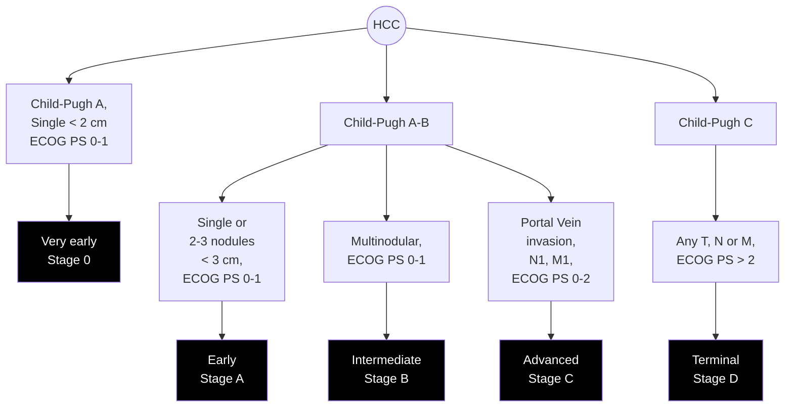

PRACTICE GUIDANCE | HEPATOLOGY, VOL. 68, NO. 2, 2018


# Diagnosis, Staging, and Management of Hepatocellular Carcinoma: 2018 Practice Guidance by the American Association for the Study of Liver Diseases

Jorge A. Marrero,<sup>1</sup> Laura M. Kulik,<sup>2</sup> Claude B. Sirlin,<sup>3</sup> Andrew X. Zhu,<sup>4</sup> Richard S. Finn,<sup>5</sup> Michael M. Abecassis,<sup>2</sup> Lewis R. Roberts,<sup>6</sup> and Julie K. Heimbach<sup>6</sup>

## Purpose and Scope

This guidance provides a data-supported approach to the diagnosis, staging, and treatment of patients diagnosed with hepatocellular carcinoma (HCC). A guidance document is different from a guideline. Guidelines are developed by a multidisciplinary panel of experts who rate the quality (level) of the evidence and the strength of each recommendation using the Grading of Recommendations Assessment, Development, and Evaluation system (GRADE). A guidance document is developed by a panel of experts in the topic, and guidance statements, not recommendations, are put forward to help clinicians understand and implement the most recent evidence.

Guidelines for HCC were recently developed according to the GRADE approach.<sup>1</sup> The Guidelines for HCC were developed using clinically relevant questions, which were then answered by systematic reviews of the literature, and followed by data-supported recommendations.<sup>(2)</sup> The Guidelines focused on surveillance, diagnosis, and treatment of HCC. However, some areas of HCC lacked sufficient data to perform systematic reviews, and here the authors will update the 2010 American Association for the Study of Liver Diseases (AASLD) Guidelines,<sup>(3)</sup> hereto referred as the guidance for HCC.

> Abbreviations: AASLD, American Association for the Study of Liver Diseases; AFP, alpha-fetoprotein; ALD, alcoholic liver disease; BCLC, Barcelona Clinic Liver Cancer; CCA, cholangiocarcinoma; CEUS, contrast-enhanced ultrasound; CI, confidence interval; CSPH, clinically significant portal hypertension; CT, computed tomography; DAA, direct-acting antiviral; DCP, des gamma carboxy prothrombin; DEBs, drug-eluting beads; ECOG, Eastern Cooperative Oncology Group; FDA, U.S. Food and Drug Administration; HBV, hepatitis B virus; HCC, hepatocellular carcinoma; HCV, hepatitis C virus; HKLC, Hong Kong Liver Cancer; HR, hazard ratio; IFN, interferon; LC, liver cirrhosis; LI-RADS, Liver Imaging Reporting and Data System; LRT, locoregional therapy; LT, liver transplant; MELD, Model for End-Stage Liver Disease; MRI, magnetic resonance imaging; NAFLD, nonalcoholic fatty liver disease; OPTN, Organ Procurement and Transplantation Network; OS, overall survival; PAF, population attributable fraction; PBC, primary biliary cholangitis; PD-1, programmed cell death protein 1; PH, portal hypertension; PS, performance status; RCTs, randomized controlled trials; RFA, radiofrequency ablation; SBRT, stereotactic body radiotherapy; TARE, transarterial radioembolization; SVR, sustained virological response; TACE, transarterial chemoembolization; TTP, time to progression; US, ultrasound.
>
> Received 12 March 2018; Accepted 13 March 2018
>
> The funding for the development of this Practice Guidance was provided by the American Association for the Study of Liver Diseases.
>
> This Practice Guidance was approved by the American Association for the Study of Liver Diseases on February 23, 2018.
>
> © 2018 by the American Association for the Study of Liver Diseases.
>
> View this article online at wileyonlinelibrary.com.
>
> DOI 10.1002/hep.29913
>
> Potential conflict of interest: Dr. Finn consults for Bayer, Bristol-Myers Squibb, Eisai, Eli Lilly, Merck, Pfizer, and Novartis. Dr. Marrero advises for Eisai and Grail. He is on the data safety board for AstraZeneca. Dr. Zhu consults for Bayer, Eisai, Bristol-Myers Squibb, Merck, and Exelixis. Dr. Roberts consults for and received grants from Wako. He consults for Medscape and Axis. He advises for Bayer, Grail, and Tavec. He received grants from Ariad, BTG, Gilead, and Redhill. Dr. Kulik consults for Bristol-Myers Squibb, Bayer, Eisai, BTG, and Grail. Dr. Sirlin is on the speakers' bureau for and received grants from GE Healthcare, MRI, Digital, US, and Bayer. He consults for Boehringer Ingelheim. He advises for AMRA and Guerbet. He received grants from Siemens, Gilead, Virtualscopic, Shire, Intercept, Philips, ICON/Enanta, and ACR Innovation.


723

MARRERO ET AL. HEPATOLOGY, August 2018


Intended for use by health care providers, this guidance is meant to supplement the recently published HCC Guidelines in order to provide updated information on the aspects of clinical care for patients with HCC. As with other guidance documents, it is not intended to replace clinical judgment, but rather to provide general guidance applicable to the majority of patients. They are intended to be flexible, in contrast to formal treatment recommendations, and clinical considerations may justify a course of action that differs from this guidance.

# Epidemiology

HCC is now the fifth-most common cancer in the world and the third cause of cancer-related mortality as estimated by the World Health Organization (globocan.iarc.fr). It is estimated that in 2012, there were 782,000 cases worldwide, of which 83% were diagnosed in less developed regions of the world. The annual incidence rates in eastern Asia and Sub-Saharan Africa exceed 15 per 100,000 inhabitants, whereas figures are intermediate (between 5 and 15 per 100,000) in the Mediterranean Basin, Southern Europe, and North America and very low (below 5 per 100,000) in Northern Europe.<sup>(4)</sup> Vaccination against hepatitis B virus (HBV) has resulted in a decrease in HCC incidence in countries where this virus was highly prevalent.<sup>(5)</sup> These data suggest that the geographical heterogeneity is primarily related to differences in the exposure rate to risk factors and time of acquisition, rather than genetic predisposition. Studies in migrant populations have demonstrated that first-generation immigrants carry with them the high incidence of HCC that is present in their native countries, but in the subsequent generations the incidence decreases.<sup>(6)</sup>

The age at which HCC appears varies according to sex, geographical area, and risk factor associated with cancer development. In high-risk countries with major HBV prevalence, the mean age at diagnosis is usually below 60 years; however, it is not infrequent to observe HCC from childhood to early adulthood, underlying the impact of viral exposures early in life.<sup>(7)</sup> In intermediate- or low-incidence areas, most cases appear beyond 60 years of age. In African and Asian countries, the diagnosis of HCC at earlier ages is attributed to a synergy between HBV and dietary aflatoxins, which is thought to induce mutations in the TP53 gene.<sup>(8)</sup> Other factors such as insertional mutagenesis and family history could play a role in the development of HCC at earlier ages. In all areas, males have a higher prevalence than females, the sex ratio usually ranging between 2:1 and 4:1, and, in most areas, the age at diagnosis in females is higher than in males.<sup>(4)</sup> Sex differences in sex hormones appear to be important as a risk factor for HCC. Testosterone is a positive regulator of hepatocyte cell-cycle regulators, which, in turn, accelerates hepatocarcinogenesis, in contrast estradiol suppresses cell-cycle regulators thereby suppressing the development of liver cancer.<sup>(9)</sup>

The incidence of HCC has been rapidly rising in the United States over the last 20 years.<sup>(10)</sup> According to estimates from the Surveillance Epidemiology End Result (SEER) program of the National Cancer Institute (NCI), the United States will witness an estimated 39,230 cases of HCC and 27,170 HCC deaths in 2016 (seer.cancer.gov). In addition, a recent study using the SEER registry projects that the incidence of HCC will continue to rise until 2030, with the highest increase in Hispanics, followed by blacks, and then whites, with a decrease noted among Asian Americans.<sup>(11)</sup>

# Surveillance

## AT-RISK POPULATION

Preexisting cirrhosis is found in more than 80% of individuals diagnosed with HCC.<sup>(3)</sup> Thus, any etiological agent leading to chronic liver injury and, ultimately,

<table>
  <thead>
    <tr>
        <th colspan="2">ARTICLE INFORMATION:</th>
    </tr>
    <tr>
        <th colspan="2">ADDRESS CORRESPONDENCE AND REPRINT REQUESTS TO:</th>
    </tr>
  </thead>
  <tbody>
    <tr>
        <td colspan="2">From the &lt;sup&gt;1&lt;/sup&gt; UT Southwestern Medical Center, Dallas, TX; &lt;sup&gt;2&lt;/sup&gt; Northwestern Medicine, Chicago, IL; &lt;sup&gt;3&lt;/sup&gt; University of California San Diego, San Diego, CA; &lt;sup&gt;4&lt;/sup&gt; Massachusets General Hospital, Boston, MA; &lt;sup&gt;5&lt;/sup&gt; UCLA Medical Center, Los Angeles, CA; &lt;sup&gt;6&lt;/sup&gt; Mayo Clinic, Rochester, MN</td>
    </tr>
    <tr>
        <td>Jorge A. Marrero, M.D., M.S., M.S.H.M.&lt;br/&gt;UT Southwestern Medical Center&lt;br/&gt;Professional Office Building 1&lt;br/&gt;Suite 520L</td>
        <td>5959 Harry Hines Boulevard&lt;br/&gt;Dallas, TX 75390-8887&lt;br/&gt;E-mail: jorge.marrero@utsouthwestern.edu&lt;br/&gt;Tel: +1-214-645-6216</td>
    </tr>
  </tbody>
</table>


724

HEPATOLOGY, Vol. 68, No. 2, 2018
MARRERO ET AL.


### TABLE 1. PATIENTS AT THE HIGHEST RISK FOR HCC

<table>
  <thead>
    <tr>
        <th>Population Group</th>
        <th>Threshold Incidence for Efficacy of Surveillance&lt;br/&gt;(&gt;0.25 LYG; % per year)</th>
        <th>Incidence of HCC</th>
    </tr>
  </thead>
  <tbody>
    <tr>
        <td colspan="3">Surveillance benefit</td>
    </tr>
    <tr>
        <td>Asian male hepatitis B carriers over age 40</td>
        <td>0.2</td>
        <td>0.4%-0.6% per year</td>
    </tr>
    <tr>
        <td>Asian female hepatitis B carriers over age 50</td>
        <td>0.2</td>
        <td>0.3%-0.6% per year</td>
    </tr>
    <tr>
        <td>Hepatitis B carrier with family history of HCC</td>
        <td>0.2</td>
        <td>Incidence higher than without family history</td>
    </tr>
    <tr>
        <td>African and/or North American blacks with hepatitis B</td>
        <td>0.2</td>
        <td>HCC occurs at a younger age</td>
    </tr>
    <tr>
        <td>Hepatitis B carriers with cirrhosis</td>
        <td>0.2-1.5</td>
        <td>3%-8% per year</td>
    </tr>
    <tr>
        <td>Hepatitis C cirrhosis</td>
        <td>1.5</td>
        <td>3%-5% per year</td>
    </tr>
    <tr>
        <td>Stage 4 PBC</td>
        <td>1.5</td>
        <td>3%-5% per year</td>
    </tr>
    <tr>
        <td>Genetic hemochromatosis and cirrhosis</td>
        <td>1.5</td>
        <td>Unknown, but probably &gt;1.5% per year</td>
    </tr>
    <tr>
        <td>Alpha-1 antitrypsin deficiency and cirrhosis</td>
        <td>1.5</td>
        <td>Unknown, but probably &gt;1.5% per year</td>
    </tr>
    <tr>
        <td>Other cirrhosis</td>
        <td>1.5</td>
        <td>Unknown</td>
    </tr>
    <tr>
        <td colspan="3">Surveillance benefit uncertain</td>
    </tr>
    <tr>
        <td>Hepatitis B carriers younger than 40 (males) or 50 (females)</td>
        <td>0.2</td>
        <td>&lt;0.2% per year</td>
    </tr>
    <tr>
        <td>Hepatitis C and stage 3 fibrosis</td>
        <td>1.5</td>
        <td>&lt;1.5% per year</td>
    </tr>
    <tr>
        <td>NAFLD without cirrhosis</td>
        <td>1.5</td>
        <td>&lt;1.5% per year</td>
    </tr>
  </tbody>
</table>
Abbreviation: LYG, life-years gained.

cirrhosis should be considered as a risk factor for HCC. The major causes of cirrhosis, and hence HCC, are HBV, hepatitis C virus (HCV), alcohol, and nonalcoholic fatty liver disease (NAFLD), but less-prevalent conditions, such as hereditary hemochromatosis, primary biliary cholangitis (PBC), and Wilson's disease, have also been associated with HCC development. As the obesity epidemic progresses, the number of patients developing HCC on the background of NAFLD may increase.<sup>(12)</sup>

The decision to enter a patient into a surveillance program is determined by the level of risk for HCC while also taking into account the patient's age, overall health, functional status, and willingness and ability to comply with surveillance requirements. The level of HCC risk, in turn, is indicated by the estimated incidence of HCC. However, there are no experimental data to indicate the threshold incidence of HCC to trigger surveillance. Instead, decision analysis has been used to provide some guidelines as to the incidence of HCC at which surveillance may become effective. In general, an intervention is considered effective if it provides an increase in longevity of around 100 days (i.e., around 3 months).<sup>(13)</sup> Interventions that can be achieved at a cost of less than approximately USD (U.S. dollars) 50,000/year of life gained are considered cost-effective.<sup>(14)</sup> Several published decision analysis/cost-effectiveness models for HCC surveillance have reported that surveillance is cost-effective, although in some cases only marginally so, and most find that the effectiveness of surveillance depends on the incidence of HCC. For example, in a theoretical cohort of patients with Child-Pugh A cirrhosis, Sarasin et al.<sup>(15)</sup> reported that surveillance increased longevity by around 3 months if the incidence of HCC was 1.5%/year; if the incidence was lower, surveillance did not prolong survival. Conversely, Lin et al.<sup>(16)</sup> found that surveillance with alpha-fetoprotein (AFP) and ultrasound (US) was cost-effective regardless of HCC incidence. Thus, although there is some disagreement between published models, surveillance should be offered for patients with cirrhosis of varying etiologies when the risk of HCC is 1.5%/year or greater. The above cost-effectiveness analyses, which were restricted to populations with cirrhosis, cannot be applied to hepatitis B carriers without cirrhosis. A cost-effectiveness analysis of surveillance for hepatitis B carriers using US and AFP levels suggested that surveillance became cost-effective once the incidence of HCC exceeds 0.2%/year.<sup>(3)</sup>

Table 1 shows the populations at risk for developing HCC. Incidence rates for HCC among patients with cirrhosis range from 1% to 8% per year, and precision tools that better predict the development of HCC in individual patients are needed. Unfortunately, previous predictive algorithms based on typical clinical risk factors, such as age, sex, and degree of liver dysfunction, have suboptimal performance when externally validated.<sup>(17)</sup> Recently, a tissue-based gene expression


725

MARRERO ET AL.
HEPATOLOGY, August 2018


profile that predicts clinical progression in persons with HCV-induced cirrhosis<sup>(18)</sup> and the development of HCC in individuals with cirrhosis has been developed.<sup>(19)</sup> For the 186-gene expression panel that predicts clinical progression, classification in the high-risk group was associated with significantly increased risks of hepatic decompensation (hazard ratio [HR] = 7.36; P < 0.001), overall death (HR = 3.57; P = 0.002), liver-related death (HR = 6.49; P < 0.001), and all liver-related adverse events (HR = 4.98; P < 0.001).<sup>(18)</sup> For prediction of HCC development, the 186-gene panel was reduced to a 32-gene signature implemented on the Nanostring platform. In an independent cohort of 263 surgically treated, early-stage HCC patients, the probability of developing HCC was nearly 4-fold higher in patients with a high-risk prediction score (41%/year) compared to those with a low-risk prediction score (11%/year).<sup>(19)</sup> This panel looks promising to better define which patients with cirrhosis are at risk for development of HCC; however, it needs validation in serum as well as in different racial/ethnic groups and in different etiologies of liver disease before widespread use. In addition, multiple potential functional biomarkers have been identified and are currently undergoing validation for early detection and prediction of HCC. These include the following markers: epithelial cell adhesion molecule, osteopontin, surface marker vimentin, transforming growth factor beta/sirtuin, and DNA repair pathway members. These novel biomarkers reflect biological significance in HCC.<sup>(20-24)</sup>

## HBV

The evidence linking HBV with HCC is unquestioned.<sup>(25)</sup> Active viral replication is associated with higher risk of HCC, and long-standing active infection with inflammation resulting in cirrhosis is the major event resulting in increased risk.<sup>(26,27)</sup> The incidence of HCC in inactive HBV carriers without liver cirrhosis (LC) is less than 0.3% per year. The role of specific HBV genotypes or mutations in hepatocarcinogenesis is not well established, especially outside Asia. HBV DNA integrates into the host cellular genome in the majority of cases of chronic hepatitis B (CHB) and induces genetic damage. DNA integration in nontumoral cells in patients with HCC suggests that genomic integration and damage precede the development of tumor. Thus, infection with HBV may be correlated with the emergence of HCC even in the absence of LC. However, most studies does show that the risk of HCC increases markedly in those with cirrhosis.<sup>(28)</sup>

HCC incidence among patients without cirrhosis ranged from 0.1 to 0.8 per 100 person-years whereas incidence in patients with cirrhosis ranged from 2.2 to 4.3 per 100 person-years. There is strong evidence from prospective cohort studies that persistent HBV e antigen and high levels of HBV serum DNA increase the risk of HCC. There is a multiplicative effect of heavy smoking and alcohol drinking in those with HBV infection, increasing the risk of HCC 9-fold.<sup>(29)</sup> The implementation of vaccination against HBV, as well as antiviral treatment of HBV infection, has resulted in a significant decrease of HCC incidence,<sup>(30)</sup> proof of the importance of this virus in the genesis of HCC. Family history of HCC in patients with CHB are at a significantly higher risk for developing HCC and should undergo surveillance.<sup>(31)</sup>

## HCV

HCV is the most common cause of HCC in Western countries. Prevalence of HCV in HCC cohorts varies according to the prevalence of HCV within each geographical area. A large, prospective, population-based study evaluated the risk of HCC in patients with HCV.<sup>(32)</sup> This study included 12,000 men and described a 20-fold increased risk of HCC in infected individuals. Case series have suggested that HCC can develop in HCV-infected patients without cirrhosis, but HCC incidence in the absence of advanced fibrosis (AF) is below 1% a year.<sup>(33)</sup> HCC risk sharply increases after cirrhosis develops, with annual incidence ranging between 2% and 8%.<sup>(34)</sup> In addition, in patients with cirrhosis the risk of HCC decreases, but is not completely eliminated even after a sustained response to interferon (IFN)-based antiviral treatment.<sup>(35)</sup>

Currently, well-tolerated combinations of direct-acting antivirals (DAAs) have largely replaced IFN-based therapy. The rates of sustained virological response (SVR) with combinations of DAAs exceed 95%.<sup>(36)</sup> Importantly, DAA therapy may lead to decreases in portal hypertension (PH) and change the natural history of patients with cirrhosis.<sup>(37)</sup> After initial concern that the incidence of HCC following successful DAA therapy appears to be higher than that observed after IFN therapies, more recent and larger studies have demonstrated that successful DAA therapy is associated with a 71% reduction in HCC risk.<sup>(38)</sup> However, patients with cirrhosis have continued risk of HCC, with HCC being reported even 10 years after SVR. DAA therapy against HCV infection reduces the risk of developing HCC. A recent study evaluated DAA


726

HEPATOLOGY, Vol. 68, No. 2, 2018
MARRERO ET AL.


therapy for those who have already developed HCC. The single-center study included patients with HCV infection and treated HCC who achieved a complete response.<sup>(39)</sup> A total of 58 patients with treated HCC received DAA and after a median follow-up of 5.7 months; 3 patients died and 16 developed HCC recurrence. This study was followed by an analysis of three prospective French multicenter cohorts of more than 6,000 patients treated with DAA, of which 660 had curative therapy for HCC.<sup>(40)</sup> The authors found that there was no increased risk of HCC recurrence after DAA treatment when compared to non-DAA-treated controls. A systematic review performed on a total of 41 studies (n = 13,875 patients) showed no evidence of increased HCC recurrence risk in patients who achieved DAA-induced SVR compared to IFN-based SVR.<sup>(41)</sup> At this time, treating HCV infection should be performed after HCC is completely treated with no evidence of recurrence after an observation period of 3-6 months.<sup>(42)</sup>

## NAFLD

It has been estimated that the world-wide prevalence of NAFLD is around 25% and it is likely to continue to increase.<sup>(43)</sup> An association between NAFLD and HCC is well established.<sup>(12)</sup> In a study comparing the incidence of HCC among patients with HCV infection and NAFLD,<sup>(44)</sup> 315 patients with cirrhosis secondary to HCV and 195 with cirrhosis attributed to NAFLD were followed for a median of 3.2 years. Cumulative incidence of HCC was 2.6% in the NAFLD group compared to 4% in the HCV group ($P = 0.09$). In a large Japanese study, those with NAFLD and AF had a 25-fold increase in development of HCC compared to those without fibrosis.<sup>(45)</sup> The best available evidence suggests that NAFLD-related cirrhosis is a risk factor for HCC, but at a lower rate compared to HCV-related cirrhosis though the annual incidence rate in nonalcoholic steatohepatitis cirrhosis remains higher than 1%. HCC has also been observed in NAFLD patients without cirrhosis, but incidence rates at lower than 1% a year.<sup>(46,47)</sup> Additional high-quality prospective studies are needed to confirm these observations. Although it is clear that NAFLD portends a lower risk for HCC than HBV or HCV, the high prevalence of NAFLD in the population underlies the importance of NAFLD in the development of HCC.

The population attributable fraction (PAF) is the quantifiable contribution of a risk factor to a disease such as HCC. It is important for pursuing prevention of disease or interventions that may reduce disease burdens. A population-based study of 6,991 patients with HCC older than 68 years evaluated the PAF.<sup>(48)</sup> The study showed that eliminating diabetes and obesity has the potential for a 40% reduction in the incidence of HCC, and the impact would be higher than eliminating other factors, including HCV. Therefore, targeting the features of metabolic syndrome could be an important area for the prevention of HCC.

## OTHER ETIOLOGIES OF LIVER DISEASE

Alcohol-related cirrhosis is also associated with the development of HCC. The proportion of HCC attributed to alcoholic liver disease (ALD) has been constant, between 20% and 25%.<sup>(49)</sup> The risk of HCC among patients with alcoholic cirrhosis (AC) ranges from 1.3% to 3% annually.<sup>(50)</sup> The PAF for ALD is estimated to be between 13% and 23%, but this effect is modified by race and sex. Importantly, the effect of alcohol as an independent risk factor for HCC is potentiated by the presence of concurrent factors, especially viral hepatitis.<sup>(48)</sup> Therefore, cirrhosis related to ALD remains an important risk factor for developing HCC.

Other causes of cirrhosis can also increase the risk of HCC. In a population-based cohort of patients with hereditary hemochromatosis and 5,973 of their first-degree relatives, the authors found that 62 patients developed HCC with a standardized incidence ratio of 21 ($95\%$ confidence interval [CI], 16-22).<sup>(51)</sup> Men were at higher risk than women, and there was no incident risk for nonhepatic malignancies. Cirrhosis from PBC is also an important risk factor. In a study of 273 patients with cirrhosis from PBC followed up for 3 years, the incidence rate was 5.9%.<sup>(51)</sup> In a recent systematic review, a total of 6,528 patients with autoimmune hepatitis (AIH) had a median follow-up of 8 years were evaluated for HCC incidence.<sup>(52)</sup> The pooled incidence rate in the study was 3.1 per 1,000 person-years, indicating that AIH-related cirrhosis is a risk factor for HCC. In a prospective study of patients with cirrhosis attributed to alpha-1 antitrypsin deficiency, the annual incidence rate of HCC was 0.9% after a median follow-up time of 5.2 years.<sup>(53)</sup>

Given that the goal of HCC surveillance is to improve survival, this should be performed in patients who are eligible for HCC-related treatments. Therefore, past studies have suggested that HCC surveillance should be performed in patients with Child A or B cirrhosis, but is not beneficial in Child C patients outside of liver transplant


727

MARRERO ET AL. HEPATOLOGY, August 2018


(LT) eligibility. Moreover, if a patient's age, medical comorbidities, or poor performance status (PS; i.e., wheelchair bound) are clinically significant, then it is unlikely that these patients would have a survival benefit from surveillance for HCC. There are no studies that have indicated the best surveillance strategy for those on the LT waiting list, though clearly surveillance for HCC is indicated given the potential for curative therapy with LT.

Pediatric HCC is the second-most common hepatic malignancy in this population and often occurs in the absence of cirrhosis. A population-based study identified 218 cases of HCC in a pediatric population aged <18 years, and the overall incidence rate was 0.05 per 100,000 individuals.<sup>(54)</sup> Importantly, the authors show that over the past four decades, the incidence of HCC has remained stable in this population. HCC has been detected in pediatric patients with HBV, biliary atresia, primary sclerosing cholangitis, Fanconi's syndrome, hereditary tyrosinemia, and glycogen storage disease type IA. However, the annual incidence in these patients appears to be low.

**Guidance Statements**

*   **Adult patients with cirrhosis are at the highest risk for developing HCC and should undergo surveillance.**
*   **The risk of HCC for patients with HCV-related cirrhosis who develop SVR after DAA treatment is lowered, but not eliminated, and therefore patients with cirrhosis and treated HCV should continue to undergo surveillance.**
*   **The risk of HCC is significantly lower in those with HCV or NAFLD and no cirrhosis compared to those with cirrhosis, and surveillance is not recommended for these patients.**

# SURVEILLANCE TESTING

**1A. The AASLD recommends surveillance of adults with cirrhosis because it improves overall survival (OS).**
Quality/Certainty of Evidence: Moderate
Strength of Recommendation: Strong

**1B. The AASLD recommends surveillance using US, with or without AFP, every 6 months.**
Quality/Certainty of Evidence: Low
Strength of Recommendation: Conditional

**1C. The AASLD recommends not performing surveillance of patients with cirrhosis with Child’s class C unless they are on the transplant waiting list, given the low anticipated survival for patients with Child's C cirrhosis.**
Quality/Certainty of the Evidence: Low
Strength of Recommendation: Conditional

**Technical Remarks**

1.  It is not possible to determine which type of surveillance test, US alone or the combination of US plus AFP, leads to a greater improvement in survival.
2.  The optimal interval of surveillance ranges from 4 to 8 months.
3.  Modification in surveillance strategy based on etiology of liver diseases or risk-stratification models cannot be recommended at this time.

Based on a recent systematic review of the available evidence, the current AASLD Guideline recommends surveillance for individuals with cirrhosis as shown in Table 1.<sup>(2)</sup> The modalities recommended for surveillance are liver US with or without AFP every 6 months. US, with or without AFP, is recommended for surveillance because most of the studies showed a benefit of the combination of US and AFP in improving OS.<sup>(55)</sup> Comparing AFP and US is not possible in the current available studies, and future studies should evaluate the true complementary nature of US and AFP. A recent study showed that the harms of surveillance (mostly related to false positives and indeterminate tests) were more often associated with US when compared to AFP.<sup>(56)</sup> It has been estimated that 20% of US are classified as inadequate for surveillance, and alternative surveillance modalities may be needed in those with inadequate surveillance US such as in obesity, alcohol, and NAFLD-related cirrhosis.<sup>(57)</sup>

Recently, guidelines have been developed for how surveillance US exams should be performed, interpreted, and reported.<sup>(58)</sup> In this system, an US exam is considered negative if there are no focal abnormalities or if only definitely benign lesions such as cysts are identified. An exam is considered nondiagnostic if there are lesions measuring <10 mm that are not definitely benign. An exam is considered positive if there are lesions measuring ≥10 mm. A 10-mm threshold is used because lesions <10 mm are rarely malignant. Even if malignant, such nodules are difficult to diagnose reliably because of their small size and, so long as the patient is in regular surveillance, they may be followed safely. By comparison, lesion(s) ≥10 mm have a substantial likelihood of being malignant,<sup>(59)</sup> they are easier to diagnose reliably, and there is greater risk of harm from delaying the diagnosis.

AFP is considered positive if its value is >20 ng/mL and negative if lower. Based on receiver operating curve


728

HEPATOLOGY, Vol. 68, No. 2, 2018
MARRERO ET AL.


analysis, this threshold provides a sensitivity of around 60% and a specificity of around 90%.<sup>(60)</sup> Assuming a 5% prevalence of HCC (around that expected in the HCC surveillance population), this is expected to provide 25% positive predictive value for HCC. Moreover, the addition of AFP is expected to increase the sensitivity of surveillance US, although the magnitude of the incremental gain is not yet known. More recent data suggest that longitudinal changes in AFP may increase sensitivity and specificity than AFP interpreted at a single threshold of 20 ng/mL.<sup>(61)</sup> Other suggested strategies to increase AFP accuracy have included use of different cutoffs by cirrhosis etiology and AFP-adjusted algorithms.<sup>(62)</sup>

In addition to AFP, a number of other biomarkers have been evaluated for surveillance. These include the *Lens culinaris* lectin-binding subfraction of the AFP, or AFP-L3%, which measures a subfraction of AFP shown to be more specific, although generally less sensitive than the AFP,<sup>(63)</sup> and des gamma carboxy prothrombin (DCP), also called protein induced by vitamin K absence/antagonist-II, a variant of prothrombin that is also specifically produced at high levels by a proportion of HCCs.<sup>(64-67)</sup> These biomarkers are U.S. Food and Drug Administration (FDA) approved for risk stratification, but not HCC surveillance, in the United States. In the past few years, a diagnostic model has been proposed that incorporates the levels of each of the three biomarkers, AFP, AFP-L3%, and DCP, along with patient sex and age, into the Gender, Age, AFP-L3%, AFP, and DCP (GALAD) model.<sup>(68)</sup> GALAD has been shown to be promising in phase II (case-control) biomarker studies, but still requires phase III and IV studies to evaluate its performance in large cohort studies.

There is also active development of novel cancer biomarker assays, including assays for cancer-specific DNA mutations, differentially methylated regions of DNA, microRNAs, long noncoding RNAs, native and posttranslationally modified proteins, and biochemical metabolites. Recent results suggest that there is differential expression of many biomolecules in exosomes released from tumor cells compared to those from normal cells.<sup>(69)</sup>

The NCI's Early Detection Research Network has provided a guide for the clinical development of surveillance.<sup>(70)</sup> Therefore, the prospective-specimen-collection, retrospective blind evaluation (PRoBE) design is recommended for developing new biomarkers as clinical tools, including the ones discussed above, before a recommendation to their use be given.

Despite their high diagnostic performance, cross-sectional, multiphase, contrast-enhanced computed tomography (CT) or magnetic resonance imaging (MRI) are not recommended for HCC surveillance given the paucity of data on their efficacy and cost-effectiveness. However, a recent cohort study of 407 patients with cirrhosis compared US to MRI (liver-specific contrast) for the surveillance of HCC.<sup>(71)</sup> A total of 43 patients developed HCC, with 1 detected by US only, 26 by MRI alone, 11 by both, and 5 missed by both modalities. MRI had a lower false-positive rate compared to US (3 vs. 5.6%; $P = 0.004$). This is a provocative study that requires further validation as the primary surveillance test. Future studies should evaluate whether surveillance MRI may be better suited in those in which US's performance will be suboptimal because of body habitus or other criteria. To maximize the value of cross-sectional MRI while minimizing contrast exposure, scanning time, and cost, abbreviated MRI examination protocols have been developed and are being tested.<sup>(71-74)</sup> The abbreviated protocols typically include T1-weighted imaging obtained in the hepatobiliary phase post–gadoxetate disodium injection, often supplemented with T2-weighted imaging and diffusion-weighted imaging. These protocols achieve sensitivities of 80%-90% and specificities of 91%-98% in small cohort studies. Ongoing studies may clarify the most appropriate niche for cost-effective and safe use of CT and MRI, including abbreviated MRI protocols, perhaps particularly in those settings where US performs the least reliably, such as in individuals with truncal obesity or marked parenchymal heterogeneity attributed to cirrhosis.

### Guidance Statements

* **Novel biomarkers, outside of AFP, have shown promising results in case-control studies, but require further evaluation in phase III and IV biomarker studies before routine use.**
* **CT and MRI are not recommended as the primary modality for the surveillance of HCC in patients with cirrhosis. However, in select patients with a high likelihood of having an inadequate US or if US is attempted but inadequate, CT or MRI may be utilized.**

# Diagnosis

2. **The AASLD recommends diagnostic evaluation for HCC with either multiphase CT or**


729

MARRERO ET AL. HEPATOLOGY, August 2018


```mermaid
graph TD
    subgraph SURVEILLANCE
        S1[Surveillance ultrasound with or without AFP] --> S2[Interpretation]
        S2 --> S3[Negative]
        S2 --> S4[Subthreshold <br/> < 10 mm lesions]
        S2 --> S5[Positive <br/> ≥ 10 mm lesions or <br/> AFP ≥ 20 ng/mL]
        S3 --> S6[Repeat US <br/> with or without AFP <br/> in 6 mo]
        S4 --> S7[Repeat US <br/> with or without AFP <br/> in 3-6 mo]
    end

    S5 --> D1
    S8[Multiphase CT or MRI in select patients <sup>a</sup>] --> D1

    subgraph DIAGNOSIS
        D1[Diagnostic imaging for HCC with multiphase CT or MRI] --> D2[Interpretation]
        D2 --> D3[No observation detected]
        D2 --> D4[Categorize each observation detected]
        
        D3 --> D5[Negative <br/> No observation]
        D4 --> D6[LI-RADS NC <br/> Noncategorizable <sup>b</sup>]
        D4 --> D7[LI-RADS 1 <br/> Definitely Benign]
        D4 --> D8[LI-RADS 2 <br/> Probably Benign]
        D4 --> D9[LI-RADS 3 <br/> Intermediate]
        D4 --> D10[LI-RADS 4 <br/> Probably HCC]
        D4 --> D11[LI-RADS 5 <br/> Definitely HCC]
        D4 --> D12[LI-RADS M <br/> Malignant, not definitely HCC]

        D5 --> D13[Return to <br/> surveillance in 6 mo]
        D6 --> D14[Repeat or <br/> alternative <br/> diagnostic imaging <br/> in ≤ 3 mo]
        D7 --> D15[Return to <br/> surveillance <br/> imaging in 6 mo]
        D8 --> D16[Return to <br/> surveillance <br/> imaging in 6 mo <br/><br/> Consider repeat <br/> diagnostic imaging <br/> in ≤ 6 mo]
        D9 --> D17[Repeat or <br/> alternative <br/> diagnostic imaging <br/> in 3-6 mo]
        D10 --> D18[Recommend <br/> multidisciplinary <br/> discussion for <br/> tailored workup that <br/> may include biopsy <br/> (select cases), or <br/> repeat or alternative <br/> diagnostic imaging <br/> in ≤ 3 mo]
        D11 --> D19[HCC confirmed]
        D12 --> D20[Recommend <br/> multidisciplinary <br/> discussion for <br/> tailored workup that <br/> may include biopsy <br/> (most cases), or <br/> repeat or alternative <br/> diagnostic imaging <br/> in ≤ 3 mo]

        D18 --> D21[If biopsy]
        D20 --> D22[If biopsy]
        D21 --> D23[Pathology <br/> diagnosis]
        D22 --> D24[Pathology <br/> diagnosis]
    end
```

**Footnotes**

<table>
  <thead>
    <tr>
        <th>Footnotes</th>
        <th></th>
    </tr>
  </thead>
  <tbody>
    <tr>
        <td>a. Multiphase CT or MRI in select patients</td>
        <td>Some high-risk patients may undergo multiphase CT or MRI for HCC surveillance (depending on patient body habitus, visibility of liver at ultrasound, being on the transplant waiting list and other factors).</td>
    </tr>
    <tr>
        <td>b. Noncategorizable</td>
        <td>These are due to technical problem such as image omission or severe degradation</td>
    </tr>
  </tbody>
</table>

**FIG. 1. AASLD surveillance and diagnostic algorithm.**

multiphase MRI because of similar diagnostic performance characteristics.

**Quality/Certainty of Evidence:** Low for CT versus MRI
**Strength of Recommendation:** Strong

**3A. AASLD suggests several options in patients with cirrhosis and an indeterminate nodule, including follow-up imaging, imaging with an alternative modality or alternative contrast agent, or biopsy, but cannot recommend one option over the other.**

**Quality/Certainty of Evidence:** Very low
**Strength of Recommendation:** Conditional

**3B. The AASLD suggests against routine biopsy of every indeterminate nodule.**

**Quality/Certainty of Evidence:** very low
**Strength of Recommendation:** conditional

### Technical Remarks

1. The selection of the optimal modality and contrast agent for a particular patient depends on multiple factors beyond diagnostic accuracy. These include modality availability, scan time, throughput, scheduling backlog, institutional technical capability, exam costs and charges, radiologist expertise, patient preference, and safety considerations.
2. All studies were performed at academic centers. Because of the greater technical complexity of multiphasic MRI compared to multiphasic CT, generalizability to practices without liver MRI expertise is not yet established.
3. Biopsy may be required in selected cases, but its routine use is not suggested. Biopsy has the potential to establish a timely diagnosis in cases in which a diagnosis is required to affect therapeutic decision making; however,


730

HEPATOLOGY, Vol. 68, No. 2, 2018
MARRERO ET AL.


### TABLE 2. LI-RADS 5 CRITERIA

<table>
  <thead>
    <tr>
        <th>Size</th>
        <th>Criteria</th>
        <th>Comments</th>
        <th colspan="2"></th>
    </tr>
  </thead>
  <tbody>
    <tr>
        <td>≥20 mm</td>
        <td>APHE (nonrim) **AND** one or more of following:&lt;br/&gt;• “Washout” (nonperipheral)&lt;br/&gt;• Enhancing “capsule”&lt;br/&gt;• Threshold growth</td>
        <td>Equivalent to OPTN 5B or 5X</td>
        <td colspan="2"></td>
    </tr>
    <tr>
        <td rowspan="3">10-19 mm</td>
        <td>APHE (nonrim) **AND** the following:&lt;br/&gt;• “Washout” (nonperipheral)&lt;br/&gt;• Enhancing “capsule”&lt;br/&gt;• Threshold growth</td>
        <td>Equivalent to OPTN 5A</td>
        <td colspan="2"></td>
    </tr>
    <tr>
        <td rowspan="3"></td>
        <td>APHE (nonrim)&lt;br/&gt;**AND** “Washout” (nonperipheral)</td>
        <td>Equivalent to 2010 AASLD criteria</td>
        <td></td>
    </tr>
    <tr>
        <td rowspan="3"></td>
        <td>APHE (nonrim)&lt;br/&gt;**AND** threshold growth</td>
        <td>Equivalent to OPTN 5A-5G</td>
        <td></td>
    </tr>
  </tbody>
</table>

Threshold growth = size increase of a mass by ≥ 50% in ≤ 6 months; “Washout” = washout appearance; “Capsule” = capsule appearance.
Abbreviation: APHE, arterial phase hyperenhancement.

biopsy has a risk of bleeding, tumor seeding, and the possibility that a negative biopsy is attributed to the failure to obtain tissue representative of the nodule rather than a truly benign nodule.

## IMAGING

Imaging plays a critical role in HCC diagnosis. Unlike most solid cancers, the diagnosis of HCC can be established, and treatment rendered, based on noninvasive imaging without biopsy confirmation. Even when biopsy is needed, imaging usually is required for guidance. AFP and other serum biomarkers generally have a minor role in the diagnosis of HCC.

The diagnostic evaluation for HCC is discussed in Fig. 1. In at-risk patients with abnormal surveillance test results or a clinical suspicion of HCC, multiphase CT or MRI is recommended for initial diagnostic testing. Since 2011, the American College of Radiology has published guidelines for how multiphase CT and MR exams should be performed, interpreted, and reported through its CT/MRI Liver Imaging Reporting And Data System (CT/MRI LI-RADS).<sup>(75)</sup>

In the Liver Imaging Reporting and Data System (LI-RADS) system, observations (i.e., lesions or pseudolesions) >10 mm visible on multiphase exams are assigned category codes reflecting their relative probability of being benign, HCC, or other hepatic malignant neoplasm (e.g., cholangiocarcinoma [CCA] or combined HCC-CCA). LI-RADS 1 and LI-RADS 2 indicate definitely and probably benign, respectively. Definitely benign observations include cysts and typical hemangiomas. Probably benign observations include atypical hemangiomas and focal parenchymal abnormalities likely attributable to underlying cirrhosis. LI-RADS 3 indicates a low probability of HCC. One common example is a small nodular area of arterial phase hyperenhancement, which is not present on other phases. The differential diagnosis includes both benign and malignant entities, such as, respectively, vascular pseudolesions (usually attributed to arterioportal shunts) and small HCCs. Another example is a distinctive solid nodule with some, but not all, the imaging features present for HCC diagnosis. LI-RADS 4 indicates probable HCC. An example is a ≥2-cm encapsulated lesion with arterial phase hyperenhancement, but without “washout.” Another example is a ≥2-cm lesion that enhances to the same degree as liver in the arterial phase, but enhances less (i.e., is hypoenhanced) in the postarterial phases. HCC is probable, but not definite, in these two examples, given that the differential diagnosis includes dysplastic nodule, other benign entities, and rarely non-HCC malignant neoplasms. LI-RADS 5 indicates definite HCC. Importantly, the LI-RADS 5 criteria are consistent with Organ Procurement and Transplantation Network (OPTN) Class 5 criteria and with the 2011 AASLD criteria as shown in Table 2. Several ancillary imaging features, such as T2 hyperintensity, diffusion restriction, and excess intralesional fat, can increase the radiologist's confidence of HCC, but cannot, in the absence of the major features, establish the diagnosis. Biopsy is not needed to confirm the diagnosis of HCC in these cases. LI-RADS M is assigned to observations with features highly suggestive or even diagnostic of


731

MARRERO ET AL. HEPATOLOGY, August 2018


malignancy, but not specific for HCC. Examples of such features include rim arterial phase hyperenhancement, peripheral washout appearance, delayed central enhancement, targetoid diffusion restriction, and—if a hepatobiliary agent is given—targetoid appearance in the hepatobiliary phase. These features are characteristic of intrahepatic CCA (ICC), but can be observed atypically in HCC. Thus, lesions with these types of features should be considered malignant and a biopsy should be performed for the diagnosis in most cases, unless such information would not affect management.

The probability of HCC and other malignancy associated with each LI-RADS category informs the best approach to a hepatic lesion.<sup>(76‒81)</sup> For a LI-RADS 1 observation, the probability of HCC is 0%. LI-RADS 2 observations have an average probability of HCC of 11%.<sup>(76,77,80,81)</sup> LI-RADS 3 observations have an average probability of 33% for HCC.<sup>(76,77,80,81)</sup> A LI-RADS 4 lesion has an average probability of HCC of 80% (64%‒87%).<sup>(76‒78,80,81)</sup> A LI-RADS 5 lesion has an average probability of HCC of 96% (95%‒99%).<sup>(76‒81)</sup> Of the LI-RADS M lesions evaluated, 42% had HCC and 57% had another tumor besides HCC.<sup>(76,77,80,81)</sup>

Another important consideration is the cumulative incidence of progression of untreated observations.<sup>(82‒85)</sup> Of the LI-RADS 1 lesions followed prospectively, none became HCC or other malignancies. Of the LI-RADS 2 lesions, only 0%‒6% were diagnosed as HCC or other malignancy by 24 months of follow-up. Of the LI-RADS 3 lesions followed prospectively, 6%‒15% were diagnosed as HCC or other malignancy by 24 months. Importantly, 46%‒68% of LI-RADS 4 lesions followed prospectively were diagnosed as HCC or other malignancy by 24 months.

If diagnostic CT or MRI is done and no lesion is identified or only LI-RADS 1 or 2 observations are found, then the best intervention in most cases is for patients to return to US-based surveillance. For LI-RADS 2 observations, follow-up CT or MRI in around 6 months or less may be considered instead of US because a small, but nonzero, proportion of such lesions are HCC if sampled histologically or progress to HCC during follow-up if untreated. If the diagnostic CT or MRI shows an abnormality that is not categorizable, the best intervention is to repeat the diagnostic test or use an alternative diagnostic test (e.g., MRI if CT initially performed). An abnormality is considered not categorizable if, because of omission or severe degradation of dynamic imaging phases, it cannot be assessed as more likely benign or malignant. Approximately one third of histologically sampled LI-RADS 3 observations are HCC and up to 15% of untreated LI-RADS 3 observations eventually become LI-RADS 5 within 2 years of follow-up. Such observations >10 mm merit close monitoring with follow-up CT or MRI in 6 months rather than return to US-based surveillance. The duration of the close monitoring period has not been studied, but a maximum of 18 months is reasonable. Around 80% of histologically sampled LI-RADS 4 observations are HCC, with another 3% being non-HCC malignancy and up to 68% of untreated LI-RADS 4 observations eventually become LI-RADS 5 within 2 years of follow-up. Therefore, reasonable options for LI-RADS 4 observations are biopsy if such a procedure is feasible and if the histological information will impact patient management, or to repeat the imaging in a short time frame of around 3 months. LI-RADS 5 connotes diagnostic certainty for HCC, and biopsy is usually not necessary for confirmation. Similarly, almost all LI-RADS M lesions are malignant, but biopsy is recommended to establish the exact diagnosis. It is important to stress the importance of a multidisciplinary team for all liver lesions, but particularly for LI-RADS 4 and LI-RADS M lesions measuring 1 cm or more in diameter, to develop patient-tailored approaches.

Another challenge is lesions with macrovascular invasion. Although HCC is the most common hepatic tumor associated with tumor in vein, the differential diagnosis includes ICC and rarely other malignancies. Because imaging criteria to distinguish HCC with tumor in vein from other cancers with tumor in vein have not been developed, multidisciplinary discussion is recommended to individualize the workup for the management of these patients.

The AASLD recommends multiphase CT or multiphase MRI for the diagnostic evaluation of patients with HCC because of similar performance characteristics.<sup>(2)</sup> A recent meta-analysis reported sensitivity of MRI with extracellular or hepatobiliary agents for HCC diagnosis exceeds that of CT.<sup>(86)</sup> However, the advantage is not sufficient to definitively recommend MRI over CT, given that the quality of the reviewed evidence was low and so many factors beyond diagnostic performance are relevant to modality selection in individual patients. For MRI, two types of contrast agents are available. Analogous to those used in CT, extracellular MRI agents detect and characterize lesions based mainly on blood flow. By comparison, hepatobiliary agents provide information on hepatocellular function in addition to blood flow. There currently is insufficient evidence to recommend one contrast agent type over


732

HEPATOLOGY, Vol. 68, No. 2, 2018
MARRERO ET AL.


the other. In the absence of evidence to recommend a particular method, practitioners are encouraged to select the modality and contrast agent type that, in their judgment, will be best in individual patients. Relevant factors may include the following: patient preference; other patient factors: breath-holding ability, claustrophobia, presence of ascites, presence and degree of MRI contraindications, presence and degree of renal failure, and history of past contrast reactions to iodinated (CT) or gadolinium-based (MRI) agents; and institutional factors: quality of equipment, radiologist expertise, and scheduling availability. Institutions are encouraged to develop their own approach through multidisciplinary discussion and consensus.

It should be emphasized that the interpretation and accuracy of diagnostic tests such as multiphase CT and MRI depends on the pretest probability of disease. In high-risk populations, such tests permit noninvasive confirmation of HCC. In populations without cirrhosis, such tests usually lack this capability. Congenital hepatic fibrosis and uncommon vascular forms of PH (Budd-Chiari, hereditary hemorrhagic telangiectasia, cardiac cirrhosis, nodular regenerative hyperplasia, chronic occlusion, or congenital absence of the portal vein) may be associated with benign hyperplastic nodules with imaging features that overlap those of HCC<sup>(87)</sup>; it is not known whether imaging can reliably diagnose HCC in patients with these forms of cirrhosis, and biopsy may be needed to evaluate suspicious lesions in affected patients.

Another method that may be used for HCC diagnosis in expert centers is contrast-enhanced ultrasound (CEUS). A recent meta-analysis of CEUS for HCC showed a pooled sensitivity of 85% (95% CI, 84-85) and a specificity of 91% (95% CI, 90-92).<sup>(88)</sup> However, the meta-analysis noted significant issues, including small cohort sizes, potential selection bias for patients with adequate quality USs, lack of generalizability with differences of studies in Asia versus Western countries, and publication bias. It is also unknown whether these results would be replicated outside of expert centers given the operator dependent nature of ultrasonography. Prospective studies in U.S. populations are needed to independently verify these results and further assess the role of CEUS in the diagnosis of HCC.

# PATHOLOGY

Liver biopsy should be considered in patients with a liver mass whose appearance is not typical for HCC on contrast-enhanced imaging, especially for observations categorized as LR-4 or LR-M. A high-grade dysplastic nodule is characterized by the presence of cytologic atypia and architectural changes, but the atypia is insufficient for a diagnosis of HCC. They often exhibit a combination of increased cell density, irregular trabeculae, small cell change, and unpaired arteries, but should not have any evidence of stromal invasion.<sup>(89)</sup> Immunostaining for keratins 7 or 19 may be used in difficult cases to differentiate stromal invasion versus ductular reaction and pseudoinvasion. Reliable criteria for the pathological diagnosis of HCC has been developed by experts.<sup>(90)</sup>

Staining for several biomarkers, including glypican-3 (GPC3), heat shock protein 70 (HSP70), and glutamine synthetase (GS), on histology has been proposed to help distinguish HCC from high-grade dysplastic nodules (*HEPATOLOGY* 2007;45:725-734). The diagnostic accuracy of a panel of these three markers was assessed among a cohort of 186 patients with regenerative nodules (n = 13), low-grade dysplastic nodules (n = 21), high-grade dysplastic nodules (n = 50), very well-differentiated HCC (n = 17), well-differentiated HCC (n = 40), and poorly-differentiated HCC (n = 35).<sup>(91)</sup> When at least two of the markers were positive, the overall accuracy for HCC detection was 78.4%, with 100% specificity. This panel was subsequently prospectively validated among a cohort of 60 patients who underwent biopsy for liver nodules smaller than 2 cm.<sup>(92)</sup> When at least two of the markers were positive, the sensitivity and specificity were 60% and 100%, respectively. Further studies are needed to determine the additive value of these markers over routine hematoxylin and eosin interpretation.

## Guidance Statements

*   **A lesion of >1 cm on US should trigger recall procedures for the diagnosis of HCC. If using AFP with US, then an AFP >20 ng/mL should trigger recall procedures for diagnosis of HCC.**
*   **Stringent criteria on multiphase imaging should be applied to enable noninvasive diagnosis of HCC in high-risk patients. For multiphase CT and MRI, key imaging features include size ≥1 cm, arterial phase hyperenhancement, and, depending on exact size, a combination of washout, threshold growth, and capsule appearance. If these criteria are not present but HCC or other malignancy is considered probable, then a liver biopsy should be considered for diagnosis.**
*   **Diagnosis of HCC cannot be made by imaging in patients without cirrhosis, even if enhancement and washout are present, and biopsy is required in these cases.**
*   **Histological markers GPC3, HSP70, and GS can be assessed to distinguish high-grade dysplasia**


733

MARRERO ET AL. HEPATOLOGY, August 2018



**FIG. 2.** BCLC HCC staging system. Abbreviations: N, nodal metastasis; M, extrahepatic metastasis.

from HCC on histology if HCC cannot be diagnosed based on routine histology.

# Staging

Given that cirrhosis underlies HCC in most of the patients, prognosis depends not only on tumor burden, but also on the degree of liver dysfunction and the patient's PS. In the majority of solid tumors, staging is determined at the time of surgery by pathological examination of resected specimens, leading to the tumor-node-metastasis (TNM) classification. However, the TNM staging system fails to account for the degree of liver dysfunction and patient PS, which determine the feasibility of treatment and need to be considered in making clinical decisions for patients with HCC. Several alternative staging systems have been proposed, including the Barcelona Clinic Liver Cancer (BCLC), Cancer of the Liver Italian Program, Japan Integrated Staging, Chinese University Prognostic Index, among others.<sup>(93)</sup>

Although there is not one universally accepted staging system, the BCLC (Fig. 2) may offer the most prognostic information because it includes an assessment of tumor burden, liver function, and patient PS and thereby has been endorsed by the societies that specialized in liver disease.<sup>(3,94)</sup> The prognostic ability of the BCLC has been validated in European, American, and Asian populations.<sup>(95-97)</sup> The value of the BCLC is in its ability to stratify the survival of patients with HCC among the substrata of 0, A, B, C, and D, and therefore it can be easily applied directly to patient care.

The Hong Kong Liver Cancer (HKLC) staging classification has been proposed as a more granular staging system for HCC with improved discriminatory ability.<sup>(98)</sup> Compared with the BCLC, the HKLC potentially distinguishes differential prognosis between patients with mild tumor-related symptoms and those with more severe symptoms. Furthermore, the HKLC may be able to identify patients with intermediate or advanced HCC who still may be eligible for more aggressive treatments. However, there are several issues with the HKLC classification. It utilizes nine substrata with significant overlap, and therefore its clinical use may not be easily applicable. While a subsequent study changed the substrata from 9 to 5,<sup>(99)</sup> this change still requires external validation. It is also not yet validated in non-HBV populations and is linked to a treatment strategy that also may not be generalizable.

Evidence-based criteria have been developed for the assement of prognosis,<sup>(100)</sup> and the BCLC staging system is the only staging system that meets all the criteria. Figure 2 shows the BCLC staging system, with minor modications. The PS for BCLC stages 0, A, and B has been changed to 0-1 to better reflect clinical practice, given the significant overlap that exists between PS0 and PS1 and the potential bias of patient-reported and physician-reported PS.<sup>(101)</sup> For BCLC stage C, most criteria for phase 3 trials include patients with PS of 0-1; therefore, expansion of the PS to include 0-2 is warranted. The BCLC staging has been recently modified.<sup>(102)</sup> Because the prognositic ability of this modification has not been prospectively validated, we have kept the previous iteration of the BCLC staging that has been prospectively validated.

**Guidance Statement**

* **The BCLC staging should be utilized in the evaluation of patients with HCC.**

# Treatment

There have been significant advances in HCC treatment over the past 10 years, with improvements in both technology and patient selection. Available therapeutic options can be divided into curative and noncurative interventions. Curative therapies include surgical resection, orthotopic LT, and ablative techniques such as thermal ablation. Each of these approaches offers the chance of long-term response and improved survival. Noncurative therapies, which attempt to prolong survival by slowing tumor progression, include transarterial chemoembolization (TACE), transarterial radioembolization (TARE), stereotactic body radiation therapy (SBRT), and systemic chemotherapy.


734

HEPATOLOGY, Vol. 68, No. 2, 2018
MARRERO ET AL.


# BARCELONA STAGE

The following diagram and table represent treatment recommendations according to the BCLC (Barcelona Clinic Liver Cancer) staging system, categorized by the level of evidence.

[The diagram shows five liver illustrations corresponding to STAGE 0, STAGE A, STAGE B, STAGE C, and STAGE D, with arrows pointing to the treatment recommendation table below.]

<table>
  <thead>
    <tr>
        <th>Level of Evidence</th>
        <th>STAGE 0</th>
        <th>STAGE A</th>
        <th>STAGE B</th>
        <th>STAGE C</th>
        <th>STAGE D</th>
    </tr>
  </thead>
  <tbody>
    <tr>
        <td>1</td>
        <td>Resection</td>
        <td></td>
        <td>TACE</td>
        <td>Sorafenib (1L)&lt;br/&gt;Lenvatinib (1L)&lt;br/&gt;Regorafenib (2L)&lt;br/&gt;Cabozantinib (2L)</td>
        <td></td>
    </tr>
    <tr>
        <td>2</td>
        <td>RFA&lt;br/&gt;MWA</td>
        <td>Resection&lt;br/&gt;OLT&lt;br/&gt;RFA&lt;br/&gt;MWA&lt;br/&gt;TARE&lt;br/&gt;TACE&lt;br/&gt;SBRT</td>
        <td>TARE&lt;br/&gt;Downsize OLT</td>
        <td>Nivolumab (2L)</td>
        <td>OLT&lt;br/&gt;BSC</td>
    </tr>
    <tr>
        <td>3</td>
        <td></td>
        <td></td>
        <td></td>
        <td>TARE</td>
        <td></td>
    </tr>
  </tbody>
</table>

**FIG. 3.** Treatment recommendations according to BCLC Stage. Abbreviations: MWA, microwave ablation; BSC, best supportive care; 1L, first-line therapy; 2L, second-line therapy.

***

Figure 3 shows the treatments recommended for each HCC stage and according to the strength of the level of evidence.

# CURATIVE THERAPIES

4. **The AASLD suggests that adults with Child's A cirrhosis and resectable T1 or T2 HCC undergo resection over radiofrequency ablation (RFA).**
   Quality/Certainty of Evidence: Moderate
   Strength of Recommendation: Conditional

5. **The AASLD suggests against the routine use of adjuvant therapy for patients with HCC following successful resection or ablation.**
   Quality/Certainty of Evidence: Low
   Strength of Recommendation: Conditional

### Technical Remarks

1. Direct comparative studies of resection versus other types of locoregional therapy (LRT)—such as TARE and TACE or other forms of thermal ablation, such as radiation and microwave—are not available, though indirect evidence favors resection.
2. The definition of resectability is not uniform across studies or in clinical practice, and variability is observed not only in what is defined as resectable from a purely technical standpoint, but also in patient-related factors such as acceptable degree of PH and PS. This variability leads to challenges in comparing study findings.
3. Stage T1 and T2 HCC include a wide range of tumor sizes from <1 to 5 cm, and the effectiveness of available therapies depend, in large part, on the size, number, and location of the tumors. Whereas smaller, single tumors (<2.5 cm) that are favorably located may be equally well treated by either resection or ablation, tumors larger than 2.5-3.0 cm, multifocal, or near major vascular or biliary structures may have limited ablative options. Multiple tumors which are bilobar or centrally located may not be resectable.
4. Randomized trials performed to date comparing RFA to resection have been performed primarily in East Asian patients, in whom there is a higher etiological prevalence of HBV (including noncirrhotic HBV–associated HCC) and a lower prevalence of other liver diseases such as NAFLD or HCV compared to Western patients. The impact of these demographic differences on oncological outcomes of different therapies is unknown.
5. The modified Response Evaluation Criteria in Solid Tumors (mRECIST) may be the most common criteria used to evaluate radiological response in patients affected by HCC and treated with LRT, though other classification systems are also used.


735

MARRERO ET AL.    HEPATOLOGY, August 2018

6. The risk of recurrence after surgical resection or ablation is related to characteristics of the tumor at the time of surgery, such as size, degree of differentiation, and the presence or absence of lymphovascular invasion.

## RESECTION

Surgical resection is the treatment of choice for resectable HCC occurring in patients without cirrhosis, which accounts for 5%-10% of HCC in Western counties but a higher percentage in Asia. As detailed in the Guidelines, surgical resection is also favored in patients without clinically significant portal hypertension (CSPH) and Child's class A. LT is the treatment of choice for patients with more AC with CSPH and hepatic decompensation with early-stage HCC within Milan criteria (1 tumor up to 5 cm, or two to three tumors with the largest being <3 cm).<sup>(103)</sup>

Determination of whether a lesion is resectable is based on anatomic considerations, including the number and location of tumors, as well as ensuring adequate hepatic reserve, which depends on the anticipated volume of resection as well as the underlying liver function. For patients with single tumors, well-preserved liver function, and no evidence of PH (normal bilirubin and hepatic venous pressure gradient <10 or platelet count >100,000) surgical resection offers a low perioperative mortality and is associated with survival rates of nearly 70% at 5 years. There is technically no size cutoff for tumor diameter, and large tumors can be safely resected if there is sufficient functional liver remnant. In cases where a large volume of resection is anticipated such as with greater than three segments, portal vein embolization can be utilized to increase the size of the contralateral lobe and thus reduce the risk of hepatic insufficiency.<sup>(104–106)</sup> An increase of 20%-25% in the contralateral lobe may be anticipated 4-6 weeks following bland embolization. A niche area for TARE may be for resection among otherwise appropriate candidates where the volume of the future liver remnant may be inadequate. Lobar TARE has been shown to simultaneously treat the tumor and lead to hypertrophy of the opposite lobe.<sup>(107)</sup> A systematic review of seven studies reported an increase in the future liver remnant 26%-47% after a median of 44 days to 9 months after TARE.<sup>(108)</sup>

Laparoscopic liver resection may offer benefits in terms of shorter length of hospitalization, and potentially decreased risk of postoperative decompensation and other complications.<sup>(109–113)</sup> In addition,

laparoscopic resection has been successfully performed in patients with PH requiring smaller resection volume.<sup>(114)</sup> Patient survival and risk of HCC recurrence appears to be similar in case-control studies. Thus far, there have not been any randomized trials comparing open versus laparoscopic resection of HCC.

The risk of recurrence following resection is up to 70% at 5 years, with the most important predictors being tumor differentiation, micro- and macrovascular invasion, and the presence of satellite nodules.<sup>(115,116)</sup> Tumor size is not an independent predictor of recurrence, though increasing tumor size is associated with increased frequency of microvascular invasion and other poor histological features. DAAs likely offer an opportunity to prevent HCC recurrence given the high likelihood of a sustained viral response, and it is discussed further in the HCV section. Patients with HCV-related HCC who have complete response after resection should undergo antiviral therapy with DAA after a period of observation of 3-6 months in which no recurrence is found.

There are currently no other adjuvant therapies which have been demonstrated to be effective in the postresection or postablation setting to prevent recurrence. A randomized phase III study compared sorafenib (n = 556 patients) to placebo (n = 558) with the aim of recurrence-free survival (RFS) in patients who had a complete response after resection or thermal ablation.<sup>(117)</sup> There was no difference in the median RFS among the two groups (33.3 months in the sorafenib group vs. 33.7 months in the placebo group; $P = 0.26$). Patients should undergo surveillance after resection with imaging and AFP at least every 3-6 months, with consideration of shorter intervals during the first year given higher risk of recurrence during that time.

## LIVER TRANSPLANT

6. The AASLD suggests observation with follow-up imaging over treatment for patients with cirrhosis awaiting LT who develop T1 HCC.

Quality/Certainty of Evidence: Very Low  
Strength of Recommendation: Conditional

7A. The AASLD suggests bridging to transplant in patients listed for LT within OPTN T2 (Milan) criteria to decrease progression of disease and subsequent dropout from the waiting list.

Quality/Certainty of Evidence: Very low  
Strength of Recommendation: Conditional

7B. The AASLD does not recommend one form of liver-directed therapy over another for

736

HEPATOLOGY, Vol. 68, No. 2, 2018
MARRERO ET AL.


**the purposes of bridging to LT for patients within OPTN T2 (Milan) criteria.**
Quality/Certainty of Evidence: Very low
Strength of Recommendation: Conditional

**8. The AASLD suggests that patients beyond the Milan criteria (T3) should be considered for LT after successful downstaging into the Milan criteria.**
Quality/Certainty of Evidence: Very low
Strength of Recommendation: Conditional

### Technical Remarks

1. This recommendation is intended for patients with decompensated cirrhosis who are already on the LT waitlist—and thus with an indication for transplantation in addition to HCC—and is based on current organ allocation policies in the United States. Future allocation policy revisions may impact this recommendation.
2. The choice of observation with follow-up imaging versus treatment depends on several factors, including patient preference, anticipated waiting time, rate of growth of the lesion, degree of liver decompensation, and AFP.
3. Bridging is defined as the use of LRT—such as TACE, Y90, ablative therapy, or a combination of different types of LRT such as TACE and ablation—to induce tumor death and deter tumor progression beyond the Milan criteria.
4. The risk of hepatic decompensation because of LRT must be considered when selecting patients for bridging therapy.
5. Patients in the United States with HCC within Milan criteria have been granted access to LT by Model for End-Stage Liver Disease (MELD) exception point allocation since February 2002. Although patients with T2 HCC have continued to have access to deceased donor LT, multiple changes to the policy to reduce access combined with ever-increasing waiting times have impacted the interpretation of studies before and in the early days following adoption of MELD allocation compared to current practice.
6. Given that organ availability is variable, the practices for LT for HCC may differ based on geographical location and access to living and deceased donor organs.
7. The MELD allocation system with additional prioritization for HCC is not practiced worldwide.
8. The optimal form of liver-directed therapy for the purposes of downstaging cannot be determined based on the available data.
9. Currently, in the United States, MELD exception may be granted by appeal to the regional review board system for patients initially presenting with T3 HCC after successful downstaging to within T2/Milan criteria, or they may appeal with a T3 tumor, though this is not a practice which is widely accepted. HCC organ allocation policy may be revised in the future to allow access to standardized MELD exception for downstaged patients rather than requiring appeal.
10. There is no standard, agreed-upon waiting period following downstaging to determine efficacy of downstaging and subsequent optimal timing for LT.
11. Many studies define downstaging as a reduction in tumor burden to within Milan criteria based on radiographical findings, though some studies define downstaging as a complete absence of tumor by radiographical findings. Other studies use explant pathology to define successful downstaging, which is not useful in patient selection and makes direct comparison of results challenging.

LT is a highly effective, efficient therapy for early-stage HCC because it offers optimal treatment of both the underlying liver disease and the tumor, and is associated with excellent long-term survival rates for HCC within Milan criteria occurring in the setting of decompensated liver disease.<sup>(103)</sup> However, LT is limited by the extreme shortage of available liver allografts and the need for lifelong immunosuppression. Because of this critical shortage, organ allocation systems in the United States and elsewhere have developed prioritization criteria which attempted to balance the benefit of transplantation and the risk of posttransplant HCC recurrence and subsequent reduced survival. Since the adoption of the MELD allocation system in 2002,<sup>(118)</sup> numerous changes to the allocation system for HCC in the United States have been adopted and are summarized in Fig. 4.

HCC stage I (1 lesion between 1 and 2 cm) and stage II (Milan criteria) were initially given assigned MELD exception scores of 24 points and 29 points, respectively. This was quickly determined to be an overprioritization and was reduced to 20 and 24, and then further reduced to no points for T1, because of low waitlist dropout and concerns over the accuracy of imaging for the diagnosis of small HCC, and an assigned exception score of 22 for HCC within Milan criteria.<sup>(119,120)</sup> In 2008 a United Network for Organ Sharing (UNOS) HCC consensus conference was held and, based upon the recommendations of this conference, a standardized system for explant pathology was adopted and more rigorous imaging criteria were established.<sup>(121)</sup> Despite these changes, patients with HCC still had a


737

MARRERO ET AL. HEPATOLOGY, August 2018


<table>
  <thead>
    <tr>
        <th>Year</th>
        <th>Policy / Event Details</th>
    </tr>
  </thead>
  <tbody>
    <tr>
        <td>1994</td>
        <td>Milan criteria</td>
    </tr>
    <tr>
        <td>1998</td>
        <td>T1 HCC&lt;br/&gt;T2 HCC</td>
    </tr>
    <tr>
        <td>2002</td>
        <td>Status 2B&lt;br/&gt;**MELD implementation**&lt;br/&gt;T1 HCC initial MELD 24&lt;br/&gt;T2 HCC initial MELD 29</td>
    </tr>
    <tr>
        <td>2003</td>
        <td>T1 HCC initial MELD 20&lt;br/&gt;T2 HCC initial MELD 24</td>
    </tr>
    <tr>
        <td>2005</td>
        <td>T1 HCC no exception&lt;br/&gt;T2 HCC MELD 22</td>
    </tr>
    <tr>
        <td>2012</td>
        <td>Standard path report</td>
    </tr>
    <tr>
        <td>2013</td>
        <td>Share 35&lt;br/&gt;Revised imaging criteria</td>
    </tr>
    <tr>
        <td>2015</td>
        <td>**HCC cap 34**&lt;br/&gt;6-9 months: T2 HCC MELD 28&lt;br/&gt;3-6 months: T2 HCC biologic MELD&lt;br/&gt;0-3 months: T2 HCC biologic MELD</td>
    </tr>
    <tr>
        <td>2017</td>
        <td>HCC Down-sizing/AFP restriction Approved&lt;br/&gt;NLRB Approved</td>
    </tr>
  </tbody>
</table>

**FIG. 4.** UNOS HCC policy timeline. T1 and T2 = tumor stage 1 or 2.

lower waitlist dropout and a higher transplant rate and slightly inferior long-term outcomes than non-HCC patients, and thus, in 2015, a system of delaying the MELD score assignment for 6 months, then assigning at the score they would have had after 6 months (28 points), was adopted in an attempt to use natural selection over time to more optimally allocate available liver allografts.<sup>(122)</sup>

Multiple studies have continued to report acceptable long-term outcomes for patients who were downsized to within Milan criteria, and an OPTN analysis demonstrated a wide variety of downsizing criteria being utilized across the various regional review boards.<sup>(123,124)</sup> In order to standardize policy so patients would be granted the same access to MELD exception scores across all regions, OPTN policy was changed in 2017 to grant a standard MELD score exception for patients who originally presented with up to five tumors, with the largest being 4.5 cm and the sum of the tumor diameters being less than 8 cm, who were successfully downsized to within Milan criteria, as per the criteria used by University of California, San Francisco.<sup>(123)</sup>

At the same time, HCC exception policy was revised to prevent a MELD score exception for patients presenting with an AFP >1,000 regardless of tumor size from receiving MELD score exception unless the AFP was reduced to <500 after liver-directed therapy such as embolization or ablation. Although there was concern that the AFP policy was not restrictive enough given the high risk of recurrence and poor outcomes in this population, there was previously no restriction on AFP in granting MELD exception (though many transplant centers and UNOS regions had adopted their own internal policies) and thus it was adopted as a starting point. Consensus on specific imaging criteria for downsizing and recurrence after downsizing is still lacking, though this may be more easily determined after adoption of a standard policy given the requirements for mandatory reporting of explant pathology and imaging for those transplanted with an HCC exception.

Salvage LT for patients who have developed HCC recurrence (or liver decompensation) following resection has been debated.<sup>(125,126)</sup> Proponents note that patients with poor biology can be excluded from transplantation, while it avoids transplantation of those who may be cured with resection, thus reducing the demand for a critically scarce resource. Opponents cite the low number of transplant-eligible patients who are actually able to be transplanted when they develop recurrence, given that the recurrence may be detected at a stage beyond Milan criteria, or there may be other issues which preclude transplantation. A recent intention to treat analysis from France included 110 patients treated with resection with planned salvage transplant for recurrence or decompensation from 1994 to 2012. Only 56% were able to be cured using this protocol, with 36% of patients cured from resection alone and 19% after undergoing salvage LT following resection and recurrence,<sup>(127)</sup> indicating that resection should be considered in transplant-eligible patients.

Recurrence of HCC following LT has been estimated to be 11%-18%.<sup>(128)</sup> Factors predictive of recurrence are elevated AFP >50 ng/mL pretransplant and unfavorable explant pathology (poorly differentiated tumors and/or presence of lymphovascular invasion).<sup>(129)</sup>


738

HEPATOLOGY, Vol. 68, No. 2, 2018
MARRERO ET AL.


Median time to recurrence is 20.5 months, with recurrence observed earlier with the presence of lymphovascular invasion (median time, 7.5 months). The most common site of recurrence is lung (38%) followed by the liver (33%). A multicenter analysis using data from three large transplant centers, which was subsequently externally validated, has proposed a risk-stratafication score (RETREAT) which uses explant pathology findings, including size of largest viable tumor plus microvascular invasion plus AFP at transplant, to determine a score from 0 to 5, wherein patients with a score of 0 had a 5-year recurrence risk of less than 3% whereas those with a score of 5 had a more than 75% chance of recurrence.<sup>(130)</sup> This score is useful in determining the optimal screening intervals as well as determining which patients may benefit from adjuvant treatment strategies, though there are no established therapies to date. The type of immunosuppression, calcineurin, or mechanistic target of rapamycin inhibitors, have not been shown to play a significant role in preventing recurrence after LT.

## Guidance Statements

*   **Resection is the treatment of choice for localized HCC occurring in the absence of cirrhosis, or resectable HCC occurring in the setting of cirrhosis with intact liver function and absence of CSPH.**
*   **Transplantation is the treatment of choice for patients with early-stage HCC occurring in the setting of CSPH and/or decompensated cirrhosis, though access is limited by the extreme organ shortage.**
*   **Surveillance for HCC recurrence in posttransplant patients should include abdominal and chest CT scan for better evaluation of the soft tissue, though optimal timing and duration, as well as the impact of surveillance, is not certain.**

# ABLATION

Ablative techniques are a therapeutic option that has rapidly grown during the last decade and are considered potentially curative. Destruction or ablation of tumor cells can be achieved by the injection of chemical substances (ethanol, acetic acid, and boiling saline) or by modifying local tumor temperature (radiofrequency [RFA], microwave, laser, cryotherapy). The procedure can be done percutaneously with minimal invasiveness or during laparoscopy, and is currently considered the best option for patients with BCLC stage A who are not candidates for surgical intervention.

Several randomized controlled trials (RCTs) have confirmed the superiority of RFA over ethanol injection in terms of survival, particularly in BCLC stage A with nodules between 2 and 4 cm.<sup>(131,132)</sup> RFA can be performed through single or multiple cooled-tip electrodes, percutaneously, or surgically. In addition, the number of treatment sessions is reduced, and, overall, RFA has become the preferred approach for the ablation of HCC over ethanol injection. However, there are specific locations (near to the main biliary tree, abdominal organs, or heart) where the application of RFA is contraindicated because of the risk of severe complications, as well as the heat-sink effect leading to a loss of efficacy, and thus other kinds of ablation may be a better choice. Recently, microwave ablation has been utilized more frequently because of the application of higher temperatures in a shorter period of time leading to excellent local tumor controls and less concerns for heat sink.<sup>(133)</sup> However, there are no prospective randomized trials comparing RFA to microwave ablation. The use of ablation should be dependent on the local expertise.

A group of experts in ablation of HCC developed general considerations for this approach.<sup>(134)</sup> Ideally, a 360-degree, 0.5- to 1.0-cm ablative margin should be produced all around the target tumor. For RFA, histological studies have shown that a tumor diameter >3 cm and a perivascular location result in a substantial reduction in the rate of tumor ablation.<sup>(135)</sup> For microwave ablation, the microwave antennas can be powered simultaneously to take advantage of thermal syngergy when placed in proximity to a tumor >3 cm and therefore may be able to treat larger tumors more effectively. Microwave ablation has potential advantages over RFA, but larger studies are required for safety and efficacy data.<sup>(134)</sup>

An area of interest is whether the combination of RFA plus TACE for the same lesion would provide improved efficacy. A meta-analysis identified seven RCTs that evaluated this question, but there were issues of sample size (studies ranging from 19 to 69 patients), tumor size (ranging from 1.7 to 6.7 cm), and trials inadequately powered for outcomes.<sup>(136)</sup> In addition, this meta-analysis included a retracted article,<sup>(137)</sup> which could have influenced its pooled results and conclusions. A recent meta-analysis included small RCTs from Asia that were significantly underpowered to evaluate survival or response rates.<sup>(138)</sup> At this time, the combination of RFA with TACE requires further study.

The recurrence rate after thermal ablation is similar to that observed after surgical resection, and


739

MARRERO ET AL. HEPATOLOGY, August 2018


recurrence presents as separate nodules in the same lesion occurring nearby or in separate liver segments.<sup>(139)</sup> It has been shown that local recurrence is related to size and higher with tumors that are >3 cm.<sup>(140)</sup> HCC recurrence can occur at new sites in the liver in around 40% of individuals. Treating local and new sites of recurrence with ablation appears to be effective.<sup>(141)</sup> Adjuvant therapy with sorafenib does not prevent HCC recurrence after ablation.<sup>(117)</sup> Surveillance after ablation should be performed with CT or MRI every 3 months at least for a year and then at least every 6 months thereafter given the high risk of recurrence.

SBRT is a developing form of LRT. SBRT had complete and partial responses of 15% and 45%, respectively, for small HCC and can be considered an alternative to thermal ablative techniques.<sup>(142)</sup> A recent retrospective study analyzed SBRT versus TACE and RFA in an intent-to-treat fashion.<sup>(143)</sup> A total of 379 patients with HCC were treated with SBRT (n = 39), TACE (n = 99), and RFA (n = 244) with 45% meeting Milan criteria. All the groups had similar OSs (SBRT and RFA 61% and 56% for TACE) and similar dropout rates from the transplant waiting list (SBRT 16.7%, RFA 16.8%, and TACE 20.2%). Another retrospective analysis compared results for 229 patients undergoing RFA and SBRT for predominantly early-stage HCC.<sup>(144)</sup> Both had similar overall local control and 1- and 2-year freedom from liver progression for SBRT compared with RFA of 95% versus 84% (P = 0.005) and 83% versus 79% (P = 0.69), respectively. An interim analysis of an ongoing single-center randomized trial comparing SBRT to TACE has been reported including outcomes for 69 patients and demonstrating similar 2-year survival rates (59%) in each treatment arm.<sup>(145)</sup> SBRT is an alternative to treatment of patients mostly those within the Milan criteria. Comparative randomized trials are needed among modalities.

> ### Guidance Statements
>
> * **Thermal ablation is superior to ethanol injection.**
> * **Thermal ablative techniques have the best efficacy in tumors with maximum diameter less than 3 cm, although microwave ablation potentially provides better tumoral response than RFA.**
> * **SBRT is an alternative to thermal ablation, with prospective comparative randomized studies needed.**
> * **Patients postablation are at high risk for recurrence and surveillance should be performed with contrast-enhanced CT or MRI every 3-6 months.**

# Noncurative Therapy

**9A. The AASLD recommends LRT over no treatment in adults with cirrhosis and HCC (T2 or T3, no vascular involvement) who are not candidates for resection or transplantation.**
* Quality/Certainty of Evidence:
    * TACE: Moderate
    * Transarterial bland embolization: Very low
    * TARE: Very low
    * External radiation: Very low
* Strength of Recommendation: Strong

**9B. The AASLD does not recommend one form of LRT over another.**
* Quality/Certainty of Evidence: Very low
* Strength of Recommendation: Conditional

### Technical Remarks

1. The available evidence is for Child's A and highly selected Child's B. There are no data to support the use of LRT for patients with Child's C or poor PS, and use of LRT should be weighed against the risk of harm.
2. The data for the use of TARE and external beam radiotherapy is emerging. As discussed below, the results to date are encouraging, but inadequate to make a recommendation.
3. RFA is another treatment strategy that may be utilized for selected patients with unresectable T2 HCC, depending on the size, location, and number of lesions.

The vascular nature of HCC lends itself to therapies delivered by the hepatic artery. TACE and selective radioembolization are the two most commonly used. We will divide these treatments according to tumor staging to better delineate their efficacy.

## PATIENTS WITH BCLC STAGE B

The AASLD recommends LRT over no treatment for patients with BCLC stage B HCC, and TACE appears to be the treatment with the best quality of the evidence. Median OS in BCLC B patients treated with TACE in RCTs has increased from 20 to 26 months because of improved patient selection with acknowledgement that Child-Pugh may not be sufficient to determine patients with expected survival benefit associated with chemoembolization.<sup>(146,147)</sup> Additionally, technical advancements, including embolization in a superselective manner to minimize ischemic injury to nontumorous tissue, has improved outcomes with


740

HEPATOLOGY, Vol. 68, No. 2, 2018
MARRERO ET AL.


TACE.<sup>(148)</sup> Drug-eluting beads (DEBs) may offer advantages over conventional TACE, including a greater standardization of therapy, increased/sustained tumoral concentration, and lower systemic absorption of chemotherapy.<sup>(149)</sup> Nonrandomized cohorts have reported OS exceeding 40 months with DEBs; however, DEB-TACE has not been shown to improve OS compared to conventional TACE in randomized trials or meta-analysis.<sup>(150,151)</sup>

A lack of clinical benefit of combining systemic agents (sorafenib or brivinib) with TACE in intermediate HCC compared to TACE alone was demonstrated in large, phase III RCTs, and therefore combination therapy has not been recommended.<sup>(148,152)</sup> An area of interest remains the timing of initiation of systemic therapy after disease progression post-TACE. HCC stage progression (vascular invasion and/or metastatic disease) is associated with inferior OS compared to intrahepatic progression that may be amenable to additional TACE.<sup>(153)</sup> Prognostic models to determine a subset of patients that may tolerate and benefit from repeat TACE have been described. The Assessment for Retreatment with TACE score uses a composite score based on tumor response to initial TACE, liver function (Child-Pugh increase 1 vs. ≥2 points) and an increase in aspartate aminotransaminase ≥25%. Those with a score >2.5 points identify patients in whom repeat TACE should be deferred because of concern for decompensation and/or lack of benefit.<sup>(154)</sup> However, this requires further independent validation before routine use. The appropriate time for discontinuation of TACE and initiation of systemic therapy remains a challenge. The use of sorafenib for tumors not amenable to LRT, among patients with intermediate HCC with high tumor burden or post-TACE progression, has reported OS around 12 months.<sup>(155)</sup>

TARE has emerged as an alternative therapy to TACE. In contrast to TACE, radioembolization is microembolic and therefore the hepatic artery maintains its patency. The therapeutic action of TARE is predominately radiation with yttrium 90 as opposed to embolization. The use of TARE over TACE by some centers has included patients who are BCLC B and poor candidates for TACE, larger tumors (>2 segments) with portal vein invasion, and progressive disease post-TACE.<sup>(156)</sup>

The reported experience with TARE in large, prospective, nonrandomized trials has shown consistent results, particularly among those with BCLC B with OS of 16.4-18.0 months.<sup>(157,158)</sup> Small randomized trials comparing TACE to TARE have shown results similar to larger retrospective studies with equivalency in OS and progression-free survival {Pitton, 2014 #969}.<sup>(159)</sup> TACE and TARE were evaluated in a small phase 2 randomized trial.<sup>(160)</sup> This study demonstrated a significant improvement in time to progression (TTP), the primary endpoint, but there was no significant difference in OS, a secondary endpoint of the trial. A recent meta-analysis comprised of 10 trials (two RCTs, eight retrospective) comparing TACE to TARE found no significant difference in OS at 1-year, but 2- and 3-year OS was significantly improved in the TARE group.<sup>(161)</sup> The results of randomized trials comparing TACE/DEB to TARE with a primary endpoint of TTP are pending (NCT01381211). Head-to-head comparison of TACE versus TARE with the primary endpoint of OS is needed.

### Guidance Statements

*   **LRT should be considered for patients with intermediate-stage HCC who are not eligible for curative treatments. Studies comparing TACE with TARE are needed.**
*   **Patients who are ineligible for or progress after TACE/TARE should be considered for systemic therapy.**

# PATIENTS WITH BCLC STAGE C

Sorafenib is the standard of care in patients with advanced HCC with vascular invasion and/or extrahepatic metastasis with significantly improved OS compared to supportive care.<sup>(162,163)</sup>

TARE was shown to have potential efficacy in patients with advanced HCC in retrospective cohort studies.<sup>(164)</sup> This led to two randomized trials that compared TARE compared to sorafenib in advanced HCC. The first of these trials was the SARAH (SorAfenib Versus Radioembolization in Advanced Hepatocellular Carcinoma) trial.<sup>(165)</sup> A total of 459 patients with locally advanced HCC (28% BCLC B and 68% BCLC C in each arm), unresponsive to other treatments or failed two sessions of TACE, were randomized to TARE (resin) or sorafenib 400 two times a day. There was no significant difference in survival between the two treatment groups (8.0 vs. 9.9 months, respectively; $P = 0.18$). Secondary endpoints that include response rates, progression within the liver as first event, adverse events, and tolerability significantly favored TARE. The SIRveNIB (selective internal radiation therapy v sorafenib) study<sup>(166)</sup> is another


741

MARRERO ET AL. | HEPATOLOGY, August 2018


randomized trial that compared resin TARE versus sorafenib in 360 patients with locally advanced HCC (55%-61% BCLC B and 38%-44.5% BCLC C). There was no significant difference in OS between sorafenib and TARE (8.8 vs. 10.0 months, respectively; *P* = 0.36). Secondary endpoints of tumor response rate and tolerability favored TARE. Randomized studies with glass-based microspheres, in contrast to the studies reported above which were with resin-based microspheres, compared to sorafenib are ongoing.

## Guidance Statements

* **Sorafenib is the first-line therapy for patients with advanced HCC**
* **Current data do not demonstrate benefit of TARE compared to sorafenib in patients with advanced HCC. Further trials are needed to establish whether microsphere-based TARE can be considered as an option for patients with advanced HCC.**

## SYSTEMIC THERAPY

**10: The AASLD recommends the use of systemic therapy over no therapy for patients with Child-Pugh A cirrhosis or well-selected patients with Child-Pugh B cirrhosis plus advanced HCC with macrovascular invasion and/or metastatic disease.**

Quality/Certainty of Evidence: Moderate
Strength of Recommendation: Strong

### Technical Remarks

1. It was not possible to make a recommendation for systemic therapy over LRT because there is inadequate evidence to inform the balance of benefit versus harm.

2. Advanced HCC is a heterogeneous group. The selection of treatment type may vary depending on the extent of macrovascular invasion and/or metastatic disease, the degree of underlying cirrhosis, and patient's PS, and when patients have very poor PS and/or advanced cirrhosis, no therapy may be the best option.

3. It is not possible to identify a preferred type of LRT based on the available evidence.

4. Most patients involved in the studies had Child-Pugh A cirrhosis, although studies were mixed and included some patients with Child-Pugh B.

Unresectable HCC is clinically a heterogeneous group of patients, which includes those with intermediate stage (BCLC B) and advanced stage (BCLC C). Whereas some patients will initially present with clear advanced features, including extrahepatic spread and macrovascular invasion (defined as evidence of tumor invasion into the hepatic vasculature observed on imaging), more commonly patients will stage migrate from an intermediate (BCLC B) to advanced stage (BCLC C), at which time the continued use of local-regional approaches are not recommended. The challenge to the treating clinician is to apply the best evidence-based therapeutic strategies, which often are limited, from various commonly used treatment options. It is also important to keep in mind that clinical trial candidates do not necessarily reflect the typical patient in clinical practice. Specifically, all the phase 3 trials in HCC that showed an improvement in survival with sorafenib are restricted to those with a good PS (Eastern Cooperative Oncology Group [ECOG] <2), Child-Pugh A liver disease, and otherwise adequate organ function. With that in mind, participation in a clinical trial can be considered for all eligible patients. Table 3 summarizes the positive phase 3 randomized trials for systemic therapy in HCC.

Sorafenib is an oral multikinase inhibitor that initially demonstrated a survival advantage in the front-line setting in a phase 3 double-blind, placebo-controlled trial<sup>(167)</sup> (Table 3). The magnitude of benefit was confirmed in a similarly designed phase 3 study performed in the Asia-Pacific region exclusively.<sup>(163)</sup> Since this time, phase 3 studies of novel combinations or single agents have not been able to demonstrate a survival advantage over sorafenib. Though modest, the median absolute survival benefit of approximately 3 months is associated with a side-effect profile characterized most commonly by hand-foot skin reaction, diarrhea, weight loss, and hypertension. Recently, data from an open-label, randomized phase 3 trial of the multikinase inhibitor, lenvatinib, versus sorafenib was reported<sup>(168)</sup> (Table 3). This study met its primary endpoint of non-inferiority, but was not superior, for OS. Common side effects with lenvatinib include hypertension, diarrhea, weight loss, and anorexia. Lenvatinib did improve secondary endpoints such as time to progression, PFS, quality of life, and overall response rate as assessed by mRECIST. Lenvatinib is not yet approved for the treatment of HCC at present, but it is expected that lenvatinib will become another option for patients in the front-line setting in the future.

Regorafenib, a similar small-molecule multikinase inhibitor, has been studied as a second-line agent in those with tumor progression on sorafenib. In a double-blind, placebo-controlled trial, regorafenib demonstrated an improvement in OS for those patients that had documented radiological progression during


742

HEPATOLOGY, Vol. 68, No. 2, 2018
MARRERO ET AL.


### TABLE 3. SYSTEMIC THERAPIES WITH A SURVIVAL BENEFIT IN HCC

<table>
  <thead>
    <tr>
        <th>Study</th>
        <th>Treatment</th>
        <th>Control</th>
        <th>Primary Endpoint</th>
        <th>HR</th>
        <th>Reference</th>
    </tr>
  </thead>
  <tbody>
    <tr>
        <td>SHARP</td>
        <td>Sorafenib</td>
        <td>Placebo</td>
        <td>OS</td>
        <td>0.69&lt;br/&gt;(95% CI, 0.55-0.87; P &lt; 0.001)</td>
        <td>Llovet NEJM&lt;br/&gt;2008</td>
    </tr>
    <tr>
        <td>Asia-Pacific</td>
        <td>Sorafenib</td>
        <td>Placebo</td>
        <td>OS</td>
        <td>0.68&lt;br/&gt;(95% CI, 0.50-0.93; P = 0.014)</td>
        <td>Cheng&lt;br/&gt;Lancet&lt;br/&gt;2009</td>
    </tr>
    <tr>
        <td>REFLECT</td>
        <td>Lenvatinib</td>
        <td>Sorafenib</td>
        <td>OS&lt;br/&gt;(noninferior)</td>
        <td>0.92&lt;br/&gt;(95% CI, 0.79-1.06)</td>
        <td>Kudo Lancet&lt;br/&gt;2018</td>
    </tr>
    <tr>
        <td>RESORCE</td>
        <td>Regorafenib</td>
        <td>Placebo</td>
        <td>OS</td>
        <td>0.63&lt;br/&gt;(95% CI, 0.50-0.79; P &lt; 0.0001)</td>
        <td>Bruix Lancet&lt;br/&gt;2017</td>
    </tr>
    <tr>
        <td>CELESTIAL</td>
        <td>Cabozantinib</td>
        <td>Placebo</td>
        <td>OS</td>
        <td>0.76&lt;br/&gt;(95% CI, 0.63-0.92; P = 0.0049)</td>
        <td>Abou-Alfa&lt;br/&gt;ASCO GI&lt;br/&gt;2018</td>
    </tr>
  </tbody>
</table>

Abbreviations: REFLECT, randomized, open-label, phase 3 trial to compare the efficacy and safety of lenvatinib versus sorafenib in first-line treatment of subjects with unresectable hepatocellular carcinoma; RESORCE, Regorafenib for patients with hepatocellular carcinoma who progressed on sorafenib treatment; SHARP, sorafenib hepatocellular carcinoma assessment randomized protocol; CELESTIAL, study of cabozantinib vs placebo in subjects with hepatocellular carcinoma who have received prior sorafenib.

sorafenib treatment<sup>(169)</sup> (Table 3). Regorafenib had a median survival of 10.6 months compared to 7.8 months with the placebo group (HR, 0.63; *P* < 0.0001). The side-effect profile of regorafenib is similar to the other drugs in this class, including hypertension, hand-foot skin reaction, fatigue, and diarrhea. Currently, regorafenib is FDA approved as a second-line agent for HCC.

Recently, there has been increased interest in agents targeting programmed cell death protein 1 (PD-1) and its ligands (PD-L1 and PD-L2), which have made a significant impact in the treatment of traditionally difficult-to-treat diseases such as melanoma and non-small-cell lung cancer as well as others.<sup>(170)</sup> The anti-PD-1 monoclonal antibody, nivolumab, has demonstrated significant activity in a single-arm dose-escalation and -expansion study that included both sorafenib naïve and sorafenib-pretreated patients with various underlying etiology.<sup>(171)</sup> A total of 182 sorafenib-experienced patients were treated with dose escalation of nivolumab 0.1-10.0 mg/kg (n = 37) and dose expansion of nivolumab 3 mg/kg (n = 145). The median OS in sorafenib-experienced patients in the phase II study was 16.7 months with an overall response rate of 14.5%. As reported, the incidence of significant side effects was generally low, but nivolumab can be associated with immune-mediated adverse events, including immune-mediated hepatitis. Nivolumab has been approved by the FDA as a second-line agent for advanced HCC. A randomized open-label phase 3 study of nivolumab versus sorafenib in the front-line setting has completed enrollment and results are awaited (NCT NCT02576509). A randomized phase 3 study of the anti-PD-1 monoclonal antibody, pembrolizimab, versus placebo in the second-line setting is also actively ongoing (NCT NCT02702401).

Another agent that has been studied is cabozantinib, an oral small-molecule tyrosine kinase inhibitor that primarily affects MET (hepatocyte growth factor receptor), vascular endothelial growth facotr receptor II, Axl, and RET (rearranged during transfection) receptor tyrosine kinase.<sup>(172)</sup> In a recent phase II study of 41 patients with HCC, the overall response rate was 5% with a week 12 disease control rate of 66% and reductions in AFP.<sup>(173)</sup> A phase III randomized trial of cabozantinib in advanced HCC patients as a second-line agent has been completed<sup>(174)</sup> (Table 3). A total of 707 patients with advanced HCC randomized in a 2:1 ratio received cabozantinib at 60 mg daily (n = 470) or placebo (n = 237). All patients with Child's class A and had progressed on at least one previous systemic therapy for advanced HCC. The median OS with cabozantinib was 10.2 months compared to 8.0 months with placebo (HR, 0.76; 95% CI, 0.63-0.92). Cabozantinib has not been approved as a second-line agent for HCC.

Immune checkpoint inhibitors targeted against cytotoxic T-lymphocyte antigen-4, programmed death-1, and programmed death-1 ligand are being investigated in combination therapy. Feasibility of this combination was demonstrated with tremelimumab in combination with ablation therapy (RFA/cryotherapy) or TACE in 28 patients with BCLC B (n = 7)/BCLC C (n = 21) HCC who all demonstrated evidence of


743

MARRERO ET AL. | HEPATOLOGY, August 2018


tumor progression at time of enrollment.<sup>175</sup> TTP was 7.4 months, and median OS was 12.3 months. Further study is needed to determine whether local therapy augments immune stimulation beyond checkpoint inhibition alone. There are ongoing studies evaluating potential benefit of immune therapy with LRTs.

## Guidance Statements

* **Patients with BCLC stage B HCC progressing after TACE should be considered for systemic therapy with either sorafenib, or lenvatinib upon approval, as first-line options for these patients.**
* **Patients with BCLC stage CHCC should be treated with sorafenib, or lenvatinib upon approval, as first-line options for these patients.**
* **Upon radiological progression to sorafenib, regorafenib and nintedanib should be considered as second-line options. There are no specific data in HCC to support the use of regorafenib or nintedanib after progression on lenvatinib, but the sequential use of multikinase tyrosine kinase inhibitors with similar mechanisms of action may be considered.**

## Multidisciplinary Approach to HCC

The management of HCC encompasses multiple disciplines that includes hepatologists, diagnostic radiologists, pathologists, transplant surgeons, surgical oncologists, interventional radiologists, medical oncologists, radiation oncologists, nurses, and palliative care professionals. A recent study showed that the development of a true multidisciplinary clinic with a dedicated tumor board review for HCC patients increased survival.<sup>176</sup> Therefore, HCC patients should be seen in these clinics whenever it is feasible, and, if not, a referral to a center with a true multidisciplinary clinic should be considered.

## Acknowledgments

This Practice Guidance was developed under the direction of the AASLD Practice Guidelines Committee, which approved the scope of the guidance and provided the peer review. Members of the Committee include Joseph Ahn, M.D.; Alfred Sidney Barrett IV, M.D., M.S.C.R.; James R Burton, Jr., M.D.; Udeme Ekong, M.D.; Michael W. Fried, M.D., FAASLD (Board Liaison); Ruben Hernandez, M.D., M.P.H., Ph.D.; George Ioannou, M.D., FAASLD; Whitney E. Jackson, M.D.; Patricia D. Jones, M.D., M.S.C.R.; Patrick S Kamath, M.D.; David G Koch, M.D.; Raphael B. Merriman, M.D., FACP, FRCPI; Lopa Mishra, M.D., FAASLD, (Board Liaison); David J. Reich, M.D., FACS; Barry Schlansky, M.D., M.P.H.; Amit G. Singal, M.D., M.S.; James R. Spivey, M.D.; Helen S. Te, M.D., FAASLD; and Tram T. Tran, M.D., FAASLD; Elizabeth C. Verna, M.D., M.S.; and Michael Volk, M.D.


744

HEPATOLOGY, Vol. 68, No. 2, 2018
MARRERO ET AL.


14) Laupacis A, Feeny D, Detsky AS, Tugwell PX. How attractive does a new technology have to be to warrant adoption and utilization? Tentative guidelines for using clinical and economic evaluations. CMAJ 1992;146:473-481.
15) Sarasin FP, Giostra E, Hadengue A. Cost-effectiveness of screening for detection of small hepatocellular carcinoma in western patients with Child-Pugh class A cirrhosis. Am J Med 1996;101:422-434.
16) Lin OS, Keeffe EB, Sanders GD, Owens DK. Cost-effectiveness of screening for hepatocellular carcinoma in patients with cirrhosis due to chronic hepatitis C. Aliment Pharmacol Ther 2004;19:1159-1172.
17) Singal AG, Nehra M, Adams-Huet B, Yopp AC, Tiro JA, Marrero JA, et al. Detection of hepatocellular carcinoma at advanced stages among patients in the HALT-C trial: where did surveillance fail? Am J Gastroenterol 2013;108:425-432.
18) King LY, Canasto-Chibuque C, Johnson KB, Yip S, Chen X, Kojima K, et al. A genomic and clinical prognostic index for hepatitis C-related early-stage cirrhosis that predicts clinical deterioration. Gut 2015;64:1296-1302.
19) Nakagawa S, Wei L, Song WM, Higashi T, Ghoshal S, Kim RS, et al. Molecular liver cancer prevention in cirrhosis by organ transcriptome analysis and lysophosphatidic acid pathway inhibition. Cancer Cell 2016;30:879-890.
20) Matsumoto T, Takai A, Eso Y, Kinoshita K, Manabe T, Seno H, et al. Proliferating EpCAM-positive ductal cells in the inflamed liver give rise to hepatocellular carcinoma. Cancer Res 2017;77:6131-6143.
21) Duarte-Salles T, Misra S, Stepien M, Plymoth A, Muller D, Overvad K, et al. et al. Circulating osteopontin and prediction of hepatocellular carcinoma development in a large European population. Cancer Prev Res (Phila) 2016;9:758-765.
22) Mitra A, Satelli A, Xia X, Cutrera J, Mishra L, Li S. Cell-surface Vimentin: A mislocalized protein for isolating csVimentin+CD133-novel stem-like hepatocellular carcinoma cells expressing EMT markers. Int J Cancer 2014;137:491-496.
23) Chen J, Zaidi S, Rao S, Chen JS, Phan L, Farci P, et al. Analysis of genomes and transcriptomes of hepatocellular carcinomas identifies mutations and gene expression changes in the transforming growth factor-$\beta$ pathway. Gastroenterology 2018;154:195-210.
24) Yang S, Wang XQ. XLF-mediated NHEJ activity in hepatocellular carcinoma therapy resistance. BMC Cancer 2017;17:344.
25) Bréchot C. Pathogenesis of hepatitis B virus—related hepatocellular carcinoma: old and new paradigms. Gastroenterology 2004;127(5):S56-S61.
26) Chen C, Yang HI, Su J, Jen CL, You SL, Lu SN, et al. Risk of hepatocellular carcinoma across a biological gradient of serum hepatitis B virus DNA level. JAMA 2006;295:65-73.
27) Yang HI, Lu SN, Liaw YF, You SL, Sun CA, Wang LY, Hepatitis B e antigen and the risk of hepatocellular carcinoma. N Engl J Med 2002;347:168-174.
28) Fattovich G, Stroffolini T, Zagni I, Donato F. Hepatocellular carcinoma in cirrhosis: incidence and risk factors. Gastroenterology 2004;127(5 Suppl 1):S35-S50.
29) Kuper H, Tzonou A, Kaklamani E, Hsieh CC, Laglou P, Adami HO, et al. Tobacco smoking, alcohol consumption and their interaction in the causation of hepatocellular carcinoma. Int J Cancer 2000;85:498-502.
30) Lok AS. Does antiviral therapy for hepatitis B and C prevent hepatocellular carcinoma? J Gastroenterol Hepatol 2011;26:221-217.
31) Loomba R, Liu J, Yang HI, Lee MH, Lu SN, Wang LY, et al. Synergistic effects of family history of hepatocellular carcinoma and hepatitis B virus infection on risk for incident hepatocellular carcinoma. Clin Gastroenterol Hepatol 2013;11:1636-1645.e3.
32) Sun CA, Wu DM, Lin CC, Lu SN, You SL, Wang LY, et al. Incidence and cofactors of hepatitis C virus-related hepatocellular carcinoma: a prospective study of 12,008 men in Taiwan. Am J Epidemiol 2003;157:674-682.
33) Masuzaki R, Tateishi R, Yoshida H, Yoshida H, Sato S, Kato N, et al. Risk assessment of hepatocellular carcinoma in chronic hepatitis C patients by transient elastography. J Clin Gastroenterol 2008;42:839-843.
34) Goodgame B, Shaheen NJ, Galanko J, El-Sherag HB. The risk of end stage liver disease and hepatocellular carcinoma among persons infected with hepatitis C virus: publication bias? Am J Gastroenterol 2003;98:2535-2542.
35) Yoshida H, Shiratori Y, Moriyama M, Arakawa Y, Ide T, Sata M, et al. Interferon therapy reduces the risk for hepatocellular carcinoma: national surveillance program of cirrhotic and noncirrhotic patients with chronic hepatitis C in Japan. Ann Intern Med 1999;131:174.
36) Falade-Nwulia O, Suarez-Cuervo C, Nelson DR, Fried MW, Segal JB, Sulkowski MS. Oral direct-acting agent therapy for hepatitis C virus infection. Ann Intern Med 2017;166:637.
37) Mandorfer M, Kozbial K, Schwabl P, Freissmuth C, Schwarzer R, Stern R, et al. Sustained virologic response to interferon-free therapies ameliorates HCV-induced portal hypertension. J Hepatol 2016;65:692-699.
38) Ioannou GN, Green PK, Berry K. HCV eradication induced by direct-acting antiviral agents reduces the risk of hepatocellular carcinoma. J Hepatol 2017 Sep 5. pii: S0168-8278(17)32273-0. doi: 10.1016/j.jhep.2017.08.030. [Epub ahead of print]
39) Reig M, Mariño Z, Perelló C, Iñarrairaegui M, Ribeiro A, Lens S, et al. Unexpected high rate of early tumor recurrence in patients with HCV-related HCC undergoing interferon-free therapy. J Hepatol 2016;65:719-726.
40) ANRS collaborative study group on hepatocellular carcinoma. Lack of evidence of an effect of direct-acting antivirals on the recurrence of hepatocellular carcinoma: data from three ANRS cohorts. J Hepatol 2016;65:734-740.
41) Waziry R, Hajarizadeh B, Grebely J, Amin J, Law M, Danta M, et al. Hepatocellular carcinoma risk following direct-acting antiviral HCV therapy: a systematic review, meta-analyses, and meta-regression. J Hepatol. 2017;67:1204-1212.


745

MARRERO ET AL. HEPATOLOGY, August 2018


42) Marrero JA, Singal AG. Direct-acting antivirals and recurrence of hepatocellular carcinoma. Liver Transpl 2017;23:1099-1100.

43) Younossi ZM, Koenig AB, Abdelatif D, Fazel Y, Henry L, Wymer M. Global epidemiology of nonalcoholic fatty liver disease-Meta-analytic assessment of prevalence, incidence, and outcomes. Hepatology 2016;64:73-84.

44) Ascha M, Hanouneh IA, Lopez R, Tamimi TA, Feldstein AF, Zein NN. The incidence and risk factors of hepatocellular carcinoma in patients with nonalcoholic steatohepatitis. Hepatology 2010;51:1972-1978.

45) Kawamura Y, Arase Y, Ikeda K, Seko Y, Imai N, Hosaka T, et al. Large-scale long-term follow-up study of Japanese patients with non-alcoholic Fatty liver disease for the onset of hepatocellular carcinoma. Am J Gastroenterol 2012;107:253-261.

46) Leung C, Yeoh SW, Patrick D, Ket S, Marion K, Gow P, Angus PW. Characteristics of hepatocellular carcinoma in cirrhotic and non-cirrhotic non-alcoholic fatty liver disease. World J Gastroenterol 2015;21:1189-1196.

47) Perumpail RB, Wong RJ, Ahmed A, Harrison SA. Hepatocellular carcinoma in the setting of non-cirrhotic nonalcoholic fatty liver disease and the metabolic syndrome: US experience. Dig Dis Sci 2015;60:3142-3148.

48) Welzel TM, Graubard BI, Quraishi S, Zeuzem S, Davila JA, El-Serag HB, McGlynn KA. Population-attributable fractions of risk factors for hepatocellular carcinoma in the United States. Am J Gastroenterol 2013;108:1314-1321.

49) Massarweh NN, El-Serag HB. Epidemiology of hepatocellular carcinoma and intrahepatic cholangiocarcinoma. Cancer Control. 2017;24:1073274817729245.

50) Morgan TR, Mandayam S, Jamal MM. Alcohol and hepatocellular carcinoma. Gastroenterology 2004;127(5 Suppl 1):S87-S96.

51) Elmberg M, Hultcrantz R, Ekbom A, Brandt L, Olsson S, Olsson R, et al. Cancer risk in patients with hereditary hemochromatosis and in their first-degree relatives. Gastroenterology 2003;125:1733-1741.

52) Tansel A, Katz LH, El-Serag HB, Thrift AP, Parepally M, Shakhatreh MH, Kanwal F. Incidence and determinants of hepatocellular carcinoma in autoimmune hepatitis: a systematic review and meta-analysis. Clin Gastroenterol Hepatol 2017;15:1207-1217.e4.

53) Antoury C, Lopez R, Zein N, Stoller JK, Alkhouri N. Alpha-1 antitrypsin deficiency and the risk of hepatocellular carcinoma in end-stage liver disease. World J Hepatol 2015;7:1427.

54) Allan BJ, Wang B, Davis JS, Parikh PP, Perez EA, Neville HL, Sola JE. A review of 218 pediatric cases of hepatocellular carcinoma. J Pediatr Surg 2014;49:166-171.

55) Singal AG, Pillai A, Tiro J. Early detection, curative treatment, and survival rates for hepatocellular carcinoma surveillance in patients with cirrhosis: a meta-analysis. PLoS Med 2014;11:e1001624.

56) Atiq O, Tiro J, Yopp AC, Muffler A, Marrero JA, Parikh ND, et al. An assessment of benefits and harms of hepatocellular carcinoma surveillance in patients with cirrhosis. Hepatology 2016;65:1196-1205.

57) Simmons O, Fetzer DT, Yokoo T, Marrero JA, Yopp A, Kono Y, et al. Predictors of adequate ultrasound quality for hepatocellular carcinoma surveillance in patients with cirrhosis. Aliment Pharmacol Ther 2016;45:169-177.

58) Fetzer DT, Rodgers SK, Harris AC, Kono Y, Wasnik AP, Kamaya A, Sirlin C. Screening and surveillance of hepatocellular carcinoma: an introduction to Ultrasound Liver Imaging Reporting and Data System. Radiol Clin North Am 2017;55:1197-1209.

59) Willatt JM, Hussain HK, Adusumilli S, Marrero JA. MR imaging of hepatocellular carcinoma in the cirrhotic liver: challenges and controversies. Radiology 2008;247:311-330.

60) Gupta S, Bent S, Kohwles J. Test characteristics of α-fetoprotein for detecting hepatocellular carcinoma in patients with hepatitis C. Ann Intern Med 2003;139:46.

61) Tayob N, Lok ASF, Do KA, Feng Z. Improved detection of hepatocellular carcinoma by using a longitudinal alpha-fetoprotein screening algorithm. Clin Gastroenterol Hepatol 2016;14:469-475.e2.

62) White DL, Richardson P, Tayoub N, Davila JA, Kanwal F, El-Serag HB. The updated model: an adjusted serum alpha-fetoprotein-based algorithm for hepatocellular carcinoma detection with hepatitis C virus-related cirrhosis. Gastroenterology 2015;149:1986-1987.

63) Leerapun A, Suravarapu SV, Bida JP, Clark RJ, Sanders EL, Mettler TA, et al. The utility of Lens culinaris agglutinin-reactive alpha-fetoprotein in the diagnosis of hepatocellular carcinoma: evaluation in a United States referral population. Clin Gastroenterol Hepatol 2007;5:394-402.

64) Wallin R PH, Prydz H. Studies on a subcellular system for vitamin K-dependent carboxylation. Thromb Haemost 1979;41:529-536.

65) Liebman HA, Furie BC, Tong MJ, Blanchard RA, Lo KJ, Lee SD, et al. Des-γ-carboxy (abnormal) prothrombin as a serum marker of primary hepatocellular carcinoma. N Engl J Med 1984;310:1427-1431.

66) Tsai SL, Huang GT, Yang PM, Sheu JC, Sung JL, Chen DS. Plasma des-gamma-carboxyprothrombin in the early stage of hepatocellular carcinoma. Hepatology 1990;11:481-488.

67) Marrero JA, Feng Z, Wang Y, Nguyen MH, Befeler AS, Roberts LR, et al. Alpha-fetoprotein, des-gamma carboxyprothrombin, and lectin-bound alpha-fetoprotein in early hepatocellular carcinoma. Gastroenterology 2009;137:110-118.

68) Johnson PJ, Pirrie SJ, Cox TF, Berhane S, Teng MJ, Palmer DH, et al. The detection of hepatocellular carcinoma using a prospectively developed and validated model based on serological biomarkers. Cancer Epidemiol Biomarkers Prev 2013;23:144-153.

69) Taouli B, Hoshida Y, Kakite S, Chen X, Tan PS, Sun X, et al. Imaging-based surrogate markers of transcriptome subclasses and signatures in hepatocellular carcinoma: preliminary results. Eur Radiol 2017;27:4472-4481.

70) Pepe MS, Feng Z, Janes H, Bossuyt PM, Potter JD. Pivotal evaluation of the accuracy of a biomarker used for classification or prediction: standards for study design. J Natl Cancer Inst 2008;100:1432-1438.


746

HEPATOLOGY, Vol. 68, No. 2, 2018 MARRERO ET AL.


71) Kim SY, An J, Lim YS, Han S, Lee JY, Byun JH, et al. MRI with liver-specific contrast for surveillance of patients with cirrhosis at high risk of hepatocellular carcinoma. JAMA Oncol 2017;3:456.
72) Marks RM, Ryan A, Heba ER, Tang A, Wolfson TJ, Gamst AC, et al. Diagnostic per-patient accuracy of an abbreviated hepatobiliary phase gadoxetic acid-enhanced MRI for hepatocellular carcinoma surveillance. Am J Roentgenol 2015;204:527-535.
73) Besa C, Lewis S, Pandharipande PV, Chhatwal J, Kamath A, Cooper N, et al. Hepatocellular carcinoma detection: diagnostic performance of a simulated abbreviated MRI protocol combining diffusion-weighted and T1-weighted imaging at the delayed phase post gadoxetic acid. Abdom Radiol (NY) 2017;42:179-190.
74) Sutherland T, Watts J, Ryan M, Galvin A, Temple F, Vuong J, Little AF. Diffusion-weighted MRI for hepatocellular carcinoma screening in chronic liver disease: direct comparison with ultrasound screening. J Med Imaging Radiat Oncol 2016;61:34-39.
75) Tang A, Bashir MR, Corwin MT, Cruite I, Dietrich CF, Do RKG, et al. Evidence supporting LI-RADS major features for CT- and MR imaging-based diagnosis of hepatocellular carcinoma: a systematic review. Radiology 2018;286:29-48.
76) Abd Alkhalik Basha M, Abd El Aziz El Sammak D, El Sammak AA. Diagnostic efficacy of the Liver Imaging-Reporting and Data System (LI-RADS) with CT imaging in categorising small nodules (10-20 mm) detected in the cirrhotic liver at screening ultrasound. Clin Radiol 2017;72:901.e1-901.e11.
77) Minamoto N, Oki K, Tomita M, Kinjo T, Suzuki Y. Isolation and characterization of rotavirus from feral pigeon in mammalian cell cultures. Epidemiol Infect 1988;100:481-492.
78) Choi SH, Byun JH, Kim SY, Lee SJ, Won HJ, Shin YM, Kim PN. Liver Imaging Reporting and Data System v2014 with gadoxetate disodium-enhanced magnetic resonance imaging. Invest Radiol 2016;51:483-490.
79) Lee SE, An C, Hwang SH, Choi J-Y, Han K, Kim M-J. Extracellular contrast agent-enhanced MRI: 15-min delayed phase may improve the diagnostic performance for hepatocellular carcinoma in patients with chronic liver disease. Eur Radiol 2018;28:1551-1559.
80) Liu W, Qin J, Guo R, Xie S, Jiang H, Wang X, et al. Accuracy of the diagnostic evaluation of hepatocellular carcinoma with LI-RADS. Acta Radiol 2017;59:140-146.
81) Kim Y-Y, An C, Kim S, Kim M-J. Diagnostic accuracy of prospective application of the Liver Imaging Reporting and Data System (LI-RADS) in gadoxetate-enhanced MRI. Eur Radiol 2018;28:2038-2046.
82) Burke LMB, Sofue K, Alagiyawanna M, Nilmini V, Muir AJ, Choudhury KR, et al. Natural history of liver imaging reporting and data system category 4 nodules in MRI. Abdom Radiol (NY) 2016;41:1758-1766.
83) Tanabe M, Kanki A, Wolfson T, Costa EA, Mamidipalli A, Ferreira MP, et al. Imaging Outcomes of Liver Imaging Reporting and Data System Version 2014 category 2, 3, and 4 observations detected at CT and MR imaging. Radiology 2016;281:152173.
84) Sofue K, Burke LM, Nilmini V, Alagiyawanna M, Muir AJ, Choudhury KR, et al. Liver imaging reporting and data system category 4 observations in MRI: risk factors predicting upgrade to category 5. J Magn Reson Imaging 2017;46:783-792.
85) Hong CW, Park CC, Mamidipalli A, Hooker JC, Fazeli Dehkordy S, Igarashi S, et al. Imaging Outcomes of LI-RADS v2014 Category 1, 2, 3, and 4 Observations on CT and MRI. In: Scientific Meeting of Radiological Society of North America, November 26, 2017.
86) Roberts LR, Sirlin CB, Zaiem F, Almasri J, Prokop LJ, Heimbach JK, et al. Imaging for the diagnosis of hepatocellular carcinoma: A systematic review and meta-analysis. Hepatology 2018;67:401-421.
87) Grazioli L, Ambrosini R, Frittoli B, Grazioli M, Morone M. Primary benign liver lesions. Eur J Radiol 2017;95:378-398.
88) Zhang J, Yu Y, Li Y, Wei L. Diagnostic value of contrast-enhanced ultrasound in hepatocellular carcinoma: a meta-analysis with evidence from 1998 to 2016. Oncotarget 2017;8:75418-75426.
89) Watanabe S, Okita K, Harada T, Kodama T, Numa Y, Takemoto T, Takahashi T. Morphologic studies of the liver cell dysplasia. Cancer 1983;51:2197-2205.
90) International Consensus Group for Hepatocellular Neoplasia. Pathologic diagnosis of early hepatocellular carcinoma: a report of the International Consensus Group for Hepatocellular Neoplasia. Hepatology 2008;49:658-664.
91) Chen IP, Ariizumi-S, Nakano M, Yamamoto M. Positive glypican-3 expression in early hepatocellular carcinoma predicts recurrence after hepatectomy. J Gastroenterol 2013;49:117-125.
92) Tremosini S, Forner A, Boix L, Vilana R, Bianchi L, Reig M, et al. Prospective validation of an immunohistochemical panel (glypican 3, heat shock protein 70 and glutamine synthetase) in liver biopsies for diagnosis of very early hepatocellular carcinoma. Gut 2012;61:1481-1487.
93) Marrero JA, Kudo M, Bronowicki JP. The challenge of prognosis and staging for hepatocellular carcinoma. Oncologist 2010;15(Suppl 4):23-33.
94) European Association For The Study Of The Liver; European Organisation For Research And Treatment Of Cancer. EASL-EORTC Clinical Practice Guidelines: management of hepatocellular carcinoma. J Hepatol 2012;56:908-943.
95) Marrero JA, Fontana RJ, Barrat A, Askari F, Conjeevaram HS, Su GL, Lok AS. Prognosis of hepatocellular carcinoma: comparison of 7 staging systems in an American cohort. Hepatology 2005;41:707-715.
96) Cillo U, Vitale A, Grigoletto F, Farinati F, Brolese A, Zanus G, et al. Prospective validation of the Barcelona Clinic Liver Cancer staging system. J Hepatol 2006;44:723-731.
97) Chen CH, Hu FC, Huang GT, Lee PH, Tsang YM, Cheng AL, et al. Applicability of staging systems for patients with hepatocellular carcinoma is dependent on treatment method – Analysis of 2010 Taiwanese patients. Eur J Cancer 2009;45:1630-1639.


747

MARRERO ET AL. HEPATOLOGY, August 2018


98) Yau T, Tang VY, Yao TJ, Fan ST, Lo CM, Poon RT. Development of Hong Kong Liver Cancer Staging System with treatment stratification for patients with hepatocellular carcinoma. Gastroenterology 2014;146:1691-1700.e3.
99) Sohn JH, Duran R, Zhao Y, Fleckenstein F, Chapiro J, Sahu S, et al. Validation of the Hong Kong Liver Cancer Staging System in determining prognosis of the North American patients following intra-arterial therapy. Clin Gastroenterol Hepatol 2017;15:746-755.e4.
100) Laupacis A, Wells G, Richardson WS, Tugwell P. Users' guides to the medical literature. V. How to use an article about prognosis. Evidence-Based Medicine Working Group. JAMA 1994;272:234-237.
101) Schnadig ID, Fromme EK, Loprinzi CL, Sloan JA, Mori M, Li H, Beer TM. Patient-physician disagreement regarding performance status is associated with worse survivorship in patients with advanced cancer. Cancer 2008;113:2205-2214.
102) Forner A, Reig M, Bruix J. Hepatocellular carcinoma. Lancet 2018;391:1301-1314.
103) Mazzaferro V, Regalia E, Doci R, Andreola S, Pulvirenti A, Bozzetti F, et al. Liver transplantation for the treatment of small hepatocellular carcinomas in patients with cirrhosis. N Engl J Med 1996;334:693-700.
104) Denys A, Lacombe C, Schneider F, Madoff DC, Doenz F, Qanadli SD. Portal vein embolization with N-butyl cyanoacrylate before partial hepatectomy in patients with hepatocellular carcinoma and underlying cirrhosis or advanced fibrosis. J Vasc Interv Radiol 2005;16:1667-1674.
105) Palavecino M, Chun YS, Madoff DC, Zorzi D, Kishi Y, Kaseb AO. Major hepatic resection for hepatocellular carcinoma with or without portal vein embolization: perioperative outcome and survival. Surgery 2009;145:399-405.
106) Okabe H, Beppu T, Ishiko T, Masuda T, Hayashi H, Otao R, et al. Preoperative portal vein embolization (PVE) for patients with hepatocellular carcinoma can improve resectability and may improve disease-free survival. J Surg Oncol 2011;104:641-646.
107) Kallini JR, Gabr A, Kulik L, Salem R, Lewandowski RJ. The utility of unilobar technetium-99m macroaggregated albumin to predict pulmonary toxicity in bilobar hepatocellular carcinoma prior to yttrium-90 radioembolization. J Vasc Interv Radiol 2016;27:1453-1456.
108) Theysohn JM, Ertle J, Müller S, Schlaak JF, Nensa F, Sipilae S, et al. Hepatic volume changes after lobar selective internal radiation therapy (SIRT) of hepatocellular carcinoma. Clin Radiol 2014;69:172-178.
109) Cheung TT, Poon RT, Yuen WK, Chok KS, Jenkins CR, Chan SC. Long-term survival analysis of pure laparoscopic versus open hepatectomy for hepatocellular carcinoma in patients with cirrhosis: a single-center experience. Ann Surg 2013;257:506-511.
110) Memeo R, de'Angelis N, Compagnon P, Salloum C, Cherqui D, Laurent A, Azoulay D. Laparoscopic vs. open liver resection for hepatocellular carcinoma of cirrhotic liver: a case-control study. World J Surg 2014;38:2919-2926.
111) Takahara T, Wakabayashi G, Beppu T, Aihara A, Hasegawa K, Gotohda N, et al. Long-term and perioperative outcomes of laparoscopic versus open liver resection for hepatocellular carcinoma with propensity score matching: a multi-institutional Japanese study. J Hepatobiliary Pancreat Sci 2015;22:721-727.
112) Shehta A, Han HS, Yoon YS, Cho JY, Choi Y. Laparoscopic liver resection for hepatocellular carcinoma in cirrhotic patients: 10-year single-center experience. Surg Endosc 2016;30:638-648.
113) Yoon YI, Kim KH, Kang SH, Kim WJ, Shin MH, Lee SK, et al. Pure laparoscopic versus open right hepatectomy for hepatocellular carcinoma in patients with cirrhosis: a propensity score matched analysis. Ann Surg 2017;265:856-863.
114) Vitale A, Peck-Radosavljevic M, Giannini EG, Vibert E, Sieghart W, Van Poucke S, Pawlik TM. Personalized treatment of patients with very early hepatocellular carcinoma. J Hepatol 2017;66:412-423.
115) Poon RT, Fan ST, Lo CM, Liu CL, Wong J. Long-term survival and pattern of recurrence after resection of small hepatocellular carcinoma in patients with preserved liver function. Ann Surg 2002;235:373-382.
116) Tabrizian P, Jibara G, Schrager B, Schwartz M, Roayaie S. Recurrence of hepatocellular cancer after resection: patterns, treatments, and prognosis. Ann Surg 2015;261:947-955.
117) Bruix J, Takayama T, Mazzaferro V, Chau GY, Yang J, Kudo M, et al. Adjuvant sorafenib for hepatocellular carcinoma after resection or ablation (STORM): a phase 3, randomised, double-blind, placebo-controlled trial. Lancet Oncol 2015;16:1344-1354.
118) Kamath P, Wiesner RH, Malinchoc M, Kremers W, Therneau TM, Kosberg CL, et al. A model to predict survival in patients with end-stage liver disease. Hepatology 2001;33:464-470.
119) Freeman RB, Jr, Wiesner RH, Roberts JP, McDiarmid S, Dykstra DM, Merion RM. Improving liver allocation: MELD and PELD. Am J Transplant 2004(4 Suppl 9):114-131.
120) Wiesner RH, Freeman RB, Mulligan DC. Liver transplantation for hepatocellular cancer: the impact of the MELD allocation policy. Gastroenterology. 2004;127(5 Suppl 1):S261-S267.
121) Wald C, Russo MW, Heimbach JK, Hussain HK, Pomfret EA, Bruix J. New OPTN/UNOS policy for liver transplant allocation: standardization of liver imaging, diagnosis, classification, and reporting of hepatocellular carcinoma. Radiology 2013;266:376-382.
122) Washburn K, Edwards E, Harper A, Freeman R. Hepatocellular carcinoma patients are advantaged in the current liver transplant allocation system. Am J Transplant 2010;10:1643-1648.
123) Yao FY, Mehta N, Flemming J, Dodge J, Hameed B, Fix O, et al. Downstaging of hepatocellular cancer before liver transplant: long-term outcome compared to tumors within Milan criteria. Hepatology 2015;61:1968-1977.
124) Ravaioli M, Grazi GL, Piscaglia F, Trevisani F, Cescon M, Ercolani G, et al. Liver transplantation for hepatocellular carcinoma: results of down-staging in patients initially outside the Milan selection criteria. Am J Transplant 2008;8:2547-2557.


748

HEPATOLOGY, Vol. 68, No. 2, 2018
MARRERO ET AL.


125) Clavien PA, Lesurtel M, Bossuyt PMM, Gores GJ, Langer B, Perrier A, OLT for HCC Consensus Group. Recommendations for liver transplantation for hepatocellular carcinoma: an International Consensus Conference report. *Lancet Oncol* 2012;13:e11-e22.
126) Poon RT, Fan ST, Lo CM, Liu CL, Wong J. Difference in tumor invasiveness in cirrhotic patients with hepatocellular carcinoma fulfilling the Milan criteria treated by resection and transplantation: impact on long-term survival. *Ann Surg* 2007;245:51-8.
127) de Haas RJ, Lim C, Bhangui P, Salloum C, Compagnon P, Feray C, et al. Curative salvage liver transplantation in patients with cirrhosis and hepatocellular carcinoma: an intention-to-treat analysis. *Hepatology* 2018;67:204-215.
128) Halazun KJ, Najjar M, Abdelmessih RM, Samstein B, Griesemer AD, Guarrera JV, et al. Recurrence after liver transplantation for hepatocellular carcinoma: a new MORAL to the story. *Ann Surg* 2017;265:557-564.
129) Escartin A, Sapisochin G, Bilbao I, Vilallonga R, Bueno J, Castells L, et al. Recurrence of hepatocellular carcinoma after liver transplantation. *Transplant Proc.* 2007;39(7):2308-10. doi: 10.1016/j.transproceed.2007.06.042.
130) Mehta N, Heimbach J, Harnois DM, Sapisochin G, Dodge JL, Lee D, et al. Validation of a Risk Estimation of Tumor Recurrence After Transplant (RETREAT) score for hepatocellular carcinoma recurrence after liver transplant. *JAMA Oncol* 2017;3:493-500.
131) Germani G, Pleguezuelo M, Gurusamy K, Meyer T, Isgro G, Burroughs AK. Clinical outcomes of radiofrequency ablation, percutaneous alcohol and acetic acid injection for hepatocellular carcinoma: a meta-analysis. *J Hepatol* 2010;52:380-388.
132) Cho YK, Kim JK, Kim MY, Rhim H, Han JK. Systematic review of randomized trials for hepatocellular carcinoma treated with percutaneous ablation therapies. *Hepatology* 2009;49:453-459.
133) Boutros C, Somasundar P, Garrean S, Saied A, Espat NJ. Microwave coagulation therapy for hepatic tumors: review of the literature and critical analysis. *Surg Oncol* 2010;19:e22-e32.
134) Lencioni R, de Baere T, Martin RC, Nutting CW, Narayanan G. Image-guided ablation of malignant liver tumors: recommendations for clinical validation of novel thermal and non-thermal technologies: a Western perspective. *Liver Cancer* 2015;4:208-214.
135) Lencioni R, Crocetti L. Local-regional treatment of hepatocellular carcinoma. *Radiology* 2012;262:43.
136) Lu Z, Wen F, Guo Q, Liang H, Mao X, Sun H. Radiofrequency ablation plus chemoembolization versus radiofrequency ablation alone for hepatocellular carcinoma: a meta-analysis of randomized-controlled trials. *Eur J Gastroenterol Hepatol* 2013;25:187.
137) DeAngelis CD, Fontanarosa PB. Retraction: Cheng BQ, et al. Chemoembolization combined with radiofrequency ablation for patients with hepatocellular carcinoma larger than 3 cm: a randomized controlled trial. *JAMA* 2008;299:1669-1677. *JAMA* 2009;301:1931.
138) Chen QW, Ying HF, Gao S, Shen YH, Meng ZQ, Chen H, Radiofrequency ablation plus chemoembolization versus radiofrequency ablation alone for hepatocellular carcinoma: a systematic review and meta-analysis. *Clin Res Hepatol Gastroenterol* 2016;40:309-314.
139) Sala M, Llovet JM, Vilana R, Bianchi L, Solé M, Ayuso C, et al. Initial response to percutaneous ablation predicts survival in patients with hepatocellular carcinoma. *Hepatology* 2004;40:1352-1360.
140) N’Kontchou G, Mahamoudi A, Aout M, Ganne-Carrié N, Grando V, Coderc E, et al. Radiofrequency ablation of hepatocellular carcinoma: long-term results and prognostic factors in 235 Western patients with cirrhosis. *Hepatology* 2009;50:1475-1483.
141) Xie X, Jiang C, Peng Z, Liu B, Hu W, Wang Y, et al. Local recurrence after radiofrequency ablation of hepatocellular carcinoma: treatment choice and outcome. *J Gastrointest Surg* 2015;19:1466-1475.
142) Yoon SM, Lim YS, Park MJ, Kim SY, Cho B, Shim JH, et al. Stereotactic body radiation therapy as an alternative treatment for small hepatocellular carcinoma. *PLoS One* 2013;8:e79854.
143) Sapisochin G, Barry A, Doherty M, Fischer S, Goldaracena N, Rosales R, et al. Stereotactic body radiotherapy vs. TACE or RFA as a bridge to transplant in patients with hepatocellular carcinoma. An intention-to-treat analysis. *J Hepatol* 2017;67:92-99.
144) Wahl DR, Stenmark MH, Tao Y, Pollom EL, Caoili EM, Lawrence TS, et al. Outcomes after stereotactic body radiotherapy or radiofrequency ablation for hepatocellular carcinoma. *J Clin Oncol* 2016;34:452-459.
145) Bush DA, Smith JC, Slater JD, Volk ML, Reeves ME, Cheng J, et al. Randomized clinical trial comparing proton beam radiation therapy with transarterial chemoembolization for hepatocellular carcinoma: results of an interim analysis. *Int J Radiat Oncol Biol Phys* 2016;95:477-482.
146) Llovet JM, Real MI, Montaña X, Planas R, Coll S, Aponte J, et al. Arterial embolisation or chemoembolisation versus symptomatic treatment in patients with unresectable hepatocellular carcinoma: a randomised controlled trial. *Lancet* 2002;359:1734-1739.
147) Lo C, Ngan H, Tso WK, Liu CL, Lam CM, Poon RT, et al. Randomized controlled trial of transarterial lipiodol chemoembolization for unresectable hepatocellular carcinoma. *Hepatology* 2002;35:1164-1171.
148) Kudo M, Han G, Finn RS, Poon RT, Blanc JF, Yan L, et al. Brivanib as adjuvant therapy to transarterial chemoembolization in patients with hepatocellular carcinoma: a randomized phase III trial. *Hepatology* 2014;60:1697-1707.
149) Burrel M, Reig M, Forner A, Barrufet M, Lope CR, Tremosini S, et al. Survival of patients with hepatocellular carcinoma treated by transarterial chemoembolisation (TACE) using Drug Eluting Beads. Implications for clinical practice and trial design. *J Hepatol* 2012;56:1330-1335.
150) Lammer J, Malagari K, Vogl T, Pilleul F, Denys A, Watkinson A, et al. Prospective randomized study of doxorubicin-eluting-bead embolization in the treatment of hepatocellular carcinoma: results of the PRECISION V Study. *Cardiovasc Intervent Radiol* 2010;33:41-52.


749

MARRERO ET AL. HEPATOLOGY, August 2018


151) Facciorusso A, Di Maso M, Muscatiello N. Drug-eluting beads versus conventional chemoembolization for the treatment of unresectable hepatocellular carcinoma: a meta-analysis. Dig Liver Dis 2016;48:571-577.
152) Lencioni R, Llovet JM, Han G, Tak WY, Yang J, Guglielmi, et al. Sorafenib or placebo plus TACE with doxorubicin-eluting beads for intermediate stage HCC: the SPACE trial. J Hepatol 2016;64:1090-1098.
153) Kim HY, Park JW, Joo J, Jung SJ, An S, Woo SM, et al. Severity and timing of progression predict refractoriness to transarterial chemoembolization in hepatocellular carcinoma. J Gastroenterol Hepatol 2012;27:1051-1056.
154) Sieghart W, Hucke F, Pinter M, Graziadei I, Vogel W, Müller C, et al. The ART of decision making: retreatment with transarterial chemoembolization in patients with hepatocellular carcinoma. Hepatology 2013;57:2261-2273.
155) Geschwind JF, Kudo M, Marrero JA, Venook AP, Chen XP, Bronowicki JP, et al. TACE Treatment in patients with sorafenib-treated unresectable hepatocellular carcinoma in clinical practice: final analysis of GIDEON. Radiology 2016;279:630-640.
156) Sangro B, Iñarrairaegui M, Bilbao JI. Radioembolization for hepatocellular carcinoma. J Hepatol 2012;56:464-473.
157) Salem R, Lewandowski RJ, Kulik L, Wang E, Riaz A, Ryu RK, et al. Radioembolization results in longer time-to-progression and reduced toxicity compared with chemoembolization in patients with hepatocellular carcinoma. Gastroenterology 2011;140:497-507.
158) Moreno-Luna LE, Yang JD, Sanchez W, Paz-Fumagalli R, Harnois DM, Mettler TA, et al. Efficacy and safety of transarterial radioembolization versus chemoembolization in patients with hepatocellular carcinoma. Cardiovasc Intervent Radiol 2013;36:714-723.
159) Kolligs FT, Bilbao JI, Jakobs T, Iñarrairaegui M, Nagel JM, Rodriguez M, et al. Pilot randomized trial of selective internal radiation therapy vs. chemoembolization in unresectable hepatocellular carcinoma. Liver Int 2015;35:1715-1721.
160) Salem R, Gordon AC, Mouli S, Hickey R, Kallini J, Gabr A, et al. Y90 radioembolization significantly prolongs time to progression compared with chemoembolization in patients with hepatocellular carcinoma. Gastroenterology 2016;151:1155-1163.e2.
161) Facciorusso A, Serviddio G, Muscatiello N. Transarterial radioembolization vs chemoembolization for hepatocarcinoma patients: a systematic review and meta-analysis. World J Hepatol 2016;8:770-778.
162) Llovet JM, Ricci S, Mazzaferro V, Hilgard P, Gane E, Blanc JF, et al. Sorafenib in advanced hepatocellular carcinoma. N Engl J Med 2008;359:378-390.
163) Cheng AL, Kang YK, Chen Z, Tsao CJ, Qin S, Kim JS, et al. Efficacy and safety of sorafenib in patients in the Asia-Pacific region with advanced hepatocellular carcinoma: a phase III randomised, double-blind, placebo-controlled trial. Lancet Oncol 2009;10:25-34.
164) Gramenzi A, Golfieri R, Mosconi C, Cappelli A, Granito A, Cucchetti A, et al. Yttrium-90 radioembolization vs sorafenib for intermediate-locally advanced hepatocellular carcinoma: a cohort study with propensity score analysis. Liver Int 2014;35:1036-1047.
165) Vilgrain V, Pereira H, Assenat E, et al. Efficacy and safety of selective internal radiotherapy with yttrium-90 resin microspheres compared with sorafenib in locally advanced and inoperable hepatocellular carcinoma (SARAH): an open-label randomised controlled phase 3 trial. Lancet Oncol 2017;18:1624-1636.
166) Chow PKH, Gandhi M, Tan SB, Khin MW, Khasbazar A, Ong J, et al.; SIRveNIB: selective internal radiation therapy versus sorafenib in Asia-Pacific patients with hepatocellular carcinoma. J Clin Oncol 2018 Mar 2. JCO2017760892. doi: 10.1200/JCO.2017.76.0892. [Epub ahead of print]
167) Llovet JM, Ricci S, Mazzaferro V, Hilgard P, Gane E, Blanc JF, et al. Sorafenib in advanced hepatocellular carcinoma. N Engl J Med 2008;359:378-390.
168) Kudo M, Finn RS, Qin S, Han KH, Ikeda K, Piscaglia F, et al. Lenvatinib versus sorafenib in first-line treatment of patients with unresectable hepatocellular carcinoma: a randomised phase 3 non-inferiority trial. Lancet 2018;391:1163-1173.
169) Bruix J, Qin S, Merle P, Granito A, Huang YH, Bodoky G, et al. Regorafenib for patients with hepatocellular carcinoma who progressed on sorafenib treatment (RESORCE): a randomised, double-blind, placebo-controlled, phase 3 trial. Lancet 2017;389:56-66.
170) Postow MA, Callahan MK, Wolchok JD. Immune checkpoint blockade in cancer therapy. J Clin Oncol 2015;33:1974-1982.
171) El-Khoueiry AB, Sangro B, Yau T, Crocenzi TS, Kudo M, Hsu C, et al. Nivolumab in patients with advanced hepatocellular carcinoma (CheckMate 040): an open-label, non-comparative, phase 1/2 dose escalation and expansion trial. Lancet 2017;389:2492-2502.
172) Grüllich C. Cabozantinib: a MET, RET, and VEGFR2 tyrosine kinase inhibitor. Recent Results Cancer Res 2014;201:207-214.
173) Kelley RK, Verslype C, Cohn AL, Yang TS, Su WC, Burris H, et al. Cabozantinib in hepatocellular carcinoma: results of a phase 2 placebo-controlled randomized discontinuation study. Ann Oncol 2017;28:528-534.
174) Abou-Alfa GK, Meyer T, Cheng A-L, El-Khoueiry AB, Rimassa L, Ryoo B-Y, et al. Cabozantinib (C) versus placebo (P) in patients (pts) with advanced hepatocellular carcinoma (HCC) who have received prior sorafenib: results from the randomized phase III CELESTIAL trial. J Clin Oncol 2018;36(4 Suppl):207-207.
175) Duffy AG, Ulahannan SV, Makorova-Rusher O, Rahma O, Wedemeyer H, Pratt D, et al. Tremelimumab in combination with ablation in patients with advanced hepatocellular carcinoma. J Hepatol 2017;66:545-551.
176) Yopp AC, Mansour JC, Beg MS, Arenas J, Trimmer C, Reddick M, et al. Establishment of a multidisciplinary hepatocellular carcinoma clinic is associated with improved clinical outcome. Ann Surg Oncol 2013;21:1287-1295.


750