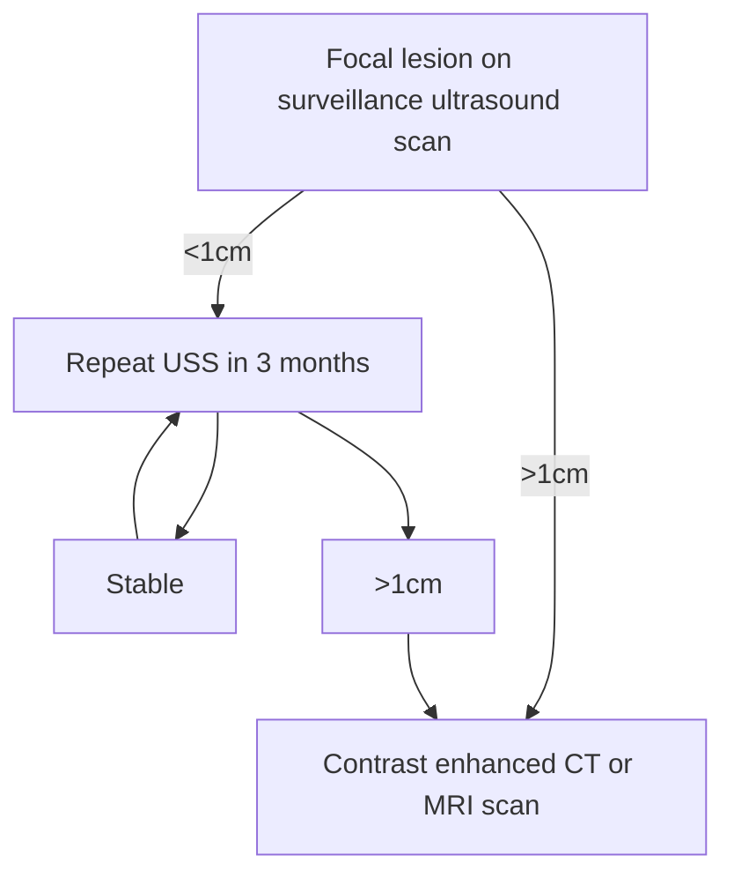
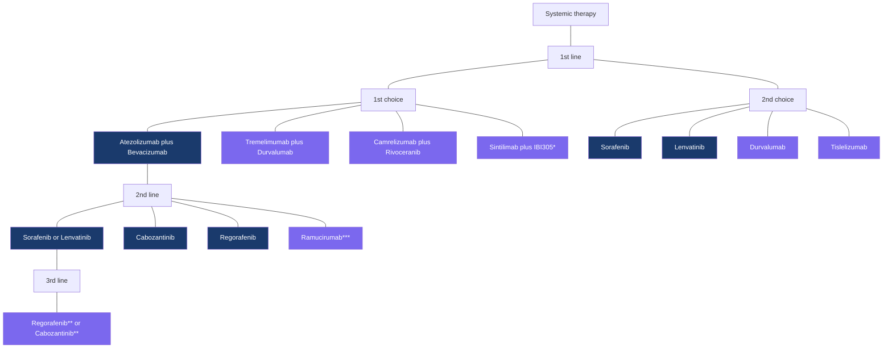
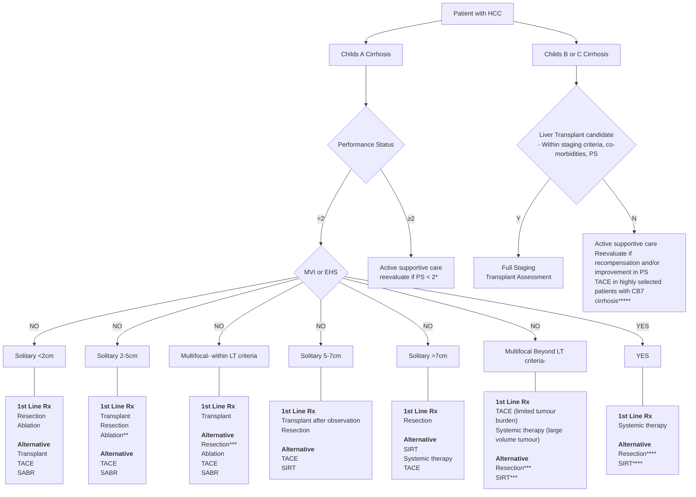

Guideline

# British Society of Gastroenterology guidelines for the management of hepatocellular carcinoma in adults

Abid Suddle 1, Helen Reeves 2, Richard Hubner 3, Aileen Marshall 4, Ian Rowe 5,6, Dina Tiniakos 7, Stefan Hubscher 8, Mark Callaway 9, Dinesh Sharma 10, Teik Choon See 11, Maria Hawkins 12, Suzanne Ford-Dunn 13, Sarah Selemani 1, Tim Meyer 14

**OPEN ACCESS**

* Additional supplemental material is published online only. To view, please visit the journal online (https://doi.org/10.1136/gutjnl-2023-331695).
* For numbered affiliations see end of article.

**Correspondence to**
Dr Abid Suddle;
abid.suddle@nhs.net

Received 6 December 2023
Accepted 19 March 2024
Published Online First 16 April 2024

**Check for updates**

© Author(s) (or their employer(s)) 2024. Re-use permitted under CC BY-NC. No commercial re-use. See rights and permissions. Published by BMJ.

**To cite:** Suddle A, Reeves H, Hubner R, et al. *Gut* 2024;**73**:1235–1268.

**BMJ Group**

### ABSTRACT
Deaths from the majority of cancers are falling globally, but the incidence and mortality from hepatocellular carcinoma (HCC) is increasing in the United Kingdom and in other Western countries. HCC is a highly fatal cancer, often diagnosed late, with an incidence to mortality ratio that approaches 1. Despite there being a number of treatment options, including those associated with good medium to long-term survival, 5-year survival from HCC in the UK remains below 20%. Sex, ethnicity and deprivation are important demographics for the incidence of, and/or survival from, HCC. These clinical practice guidelines will provide evidence-based advice for the assessment and management of patients with HCC. The clinical and scientific data underpinning the recommendations we make are summarised in detail. Much of the content will have broad relevance, but the treatment algorithms are based on therapies that are available in the UK and have regulatory approval for use in the National Health Service.

---

### EXECUTIVE SUMMARY OF RECOMMENDATIONS
#### Prevention of hepatocellular carcinoma
* National policies should be implemented to prevent transmission of viral hepatitis, reduce alcohol abuse and encourage lifestyle changes to minimise risks of obesity and metabolic syndrome (evidence high; recommendation strong).
* Vaccination against hepatitis B virus (HBV) should be carried out in all infants (as part of the childhood immunisation programme), people at high risk of exposure to the virus or complications of the disease (including those who inject drugs) and individuals already exposed to the virus (including infants born to HBV-positive mothers, people with needle stick injury) (evidence high; recommendation strong).
* Chronic liver diseases should be treated with the aim of preventing inflammation and progression of fibrosis (evidence high; recommendation strong).
* Patients with chronic hepatitis B infection should be treated with antiviral therapy to maintain suppression of viral replication (evidence high; recommendation strong).
* Patients with chronic hepatitis C infection should be treated with the aim of achieving viral eradication (evidence high, recommendation strong).
* In cirrhotic patients with chronic viral hepatitis, effective antiviral treatment reduces (but does not eliminate) the risk of hepatocellular carcinoma (HCC) and is recommended (evidence moderate; recommendation strong).
* Effective antiviral therapy should be maintained or instituted in patients with hepatitis C and hepatitis B who undergo surgical or ablative treatments for HCC (evidence high; recommendation strong).
* Adjuvant therapy with atezolizumab and bevacizumab might improve recurrence-free survival after surgery or ablation, but longer-term follow-up is required before it can be recommended (evidence moderate; recommendation moderate).

#### Surveillance for hepatocellular carcinoma
* HCC surveillance with 6-monthly US scan and $\alpha$-fetoprotein (AFP) measurement should be considered in people with cirrhosis, and certain subgroups of patients with chronic HBV infection (evidence strong, recommendation strong).
* The absolute risk of HCC and the potential harms of surveillance should be discussed individually before a person is enrolled in surveillance (evidence moderate; recommendation strong).
* Surveillance is not recommended in patients who are not fit for cancer-specific therapy. Examples include those with decompensated cirrhosis (Child B8 or worse) who would not be candidates for liver transplant if HCC was diagnosed, and those with very impaired performance status (Eastern Cooperative Oncology Group (ECOG) category 2 or worse) (evidence moderate; recommendation strong).

#### Diagnosis of HCC
**Radiological diagnosis of HCC**
* Non-invasive radiological criteria for the diagnosis of HCC are only applicable in cirrhotic patients (evidence high; recommendation strong).
* Non-invasive criteria can only be applied to nodules in a cirrhotic liver measuring 1 cm or more in diameter. Radiological assessment of HCC should be with either multiphase CT, multiphase MRI or contrast-enhanced ultrasound scan. A CT or MR scan should be used initially owing to imaging of the whole liver and greater sensitivity compared with contrast-enhanced US (evidence high; recommendation strong).

Gut: first published as 10.1136/gutjnl-2023-331695 on 16 April 2024. Downloaded from http://gut.bmj.com/ on January 21, 2026 by guest. Protected by copyright, including for uses related to text and data mining, AI training, and similar technologies.

Suddle A, et al. Gut 2024;73:1235–1268. doi:10.1136/gutjnl-2023-331695 | bsg BRITISH SOCIETY OF GASTROENTEROLOGY | 1235

Guideline

* The non-invasive diagnosis of HCC is based on the identification of the typical hallmarks of HCC on multiphase CT or MR imaging. For lesions >1 cm in size, these include the combination of hypervascularity in the late arterial phase (arterial phase hyperenhancement) and washout on portal venous and/or delayed phases. Depending on the exact size of a nodule, other hallmarks include threshold growth and capsule appearance. If these criteria are not present but HCC (or other malignancy) is considered probable, then a liver biopsy should be considered for diagnosis *(evidence high; recommendation strong)*.
* The Liver Imaging Reporting and Data System classification system may be used to standardise reporting of radiological findings and guide further management *(evidence moderate; recommendation moderate)*.

# Pathological assessment of HCC
* The pathological diagnosis, grading and subtyping of HCC and its differential diagnosis from high-grade dysplastic hepatocellular nodules should be carried out using appropriate histological and immunohistochemical methods according to the 2019 WHO classification *(evidence high; recommendation strong)*.
* The diagnosis of combined hepatocellular-cholangiocarcinoma should be based on the presence of both hepatocellular and cholangiocytic differentiation in routinely stained sections *(evidence moderate; recommendation strong)*.
* In liver resection and explant specimens, pathological staging of HCC should be carried out according to the 2017 TNM classification *(evidence moderate; recommendation strong)*.
* Recognition of distinct HCC subgroups with prognostic and predictive implications should be based on morphomolecular classification *(evidence moderate; recommendation moderate)*.

# Recommendations on the use of liver biopsy for the diagnosis of HCC
* In cirrhotic patients, lesional biopsy should be considered for the diagnosis of HCC if non-invasive radiological criteria are not fulfilled *(evidence high; recommendation strong)*.
* In non-cirrhotic patients, the diagnosis of HCC should be based on pathology *(evidence high; recommendation strong)*.
* The diagnosis of HCC should be confirmed by pathology if systemic therapy is being considered *(evidence moderate; recommendation strong)*.

# Staging of hepatocellular carcinoma
* Staging systems for prognostication and treatment allocation for patients with HCC need to incorporate tumour burden, underlying liver function and performance status *(evidence high, recommendation strong)*.
* The Barcelona Clinic Liver Cancer (BCLC) staging system has been extensively validated and is the most widely used in Europe and the United States. It is recommended for staging and prognostication *(evidence high, recommendation strong)*.

# Treatment of hepatocellular carcinoma
## Surgical resection
* Surgical resection is the preferred treatment for HCC occurring in a non-cirrhotic liver *(evidence moderate; recommendation strong)*.
* The assessment for resection of HCC in a cirrhotic liver is a multiparametric evaluation considering liver function linked to severity of portal hypertension, extent of hepatectomy, volume of future liver remnant, as well as the patient’s comorbidity profile and performance status *(evidence high; recommendation strong)*.
* Surgical resection is considered a first-line treatment for solitary HCC in a cirrhotic liver of any size when liver function is maintained and an adequate remnant liver volume can be preserved *(evidence moderate; recommendation strong)*.
* Laparoscopic resection of tumours should be recommended in suitable patients *(evidence moderate; recommendation weak)*.
* Clinical scenarios where resection may be considered include: multifocal disease in patients not suitable for liver transplant, tumours associated with vascular invasion (highly selected cases) and after rupture of HCC into the peritoneal cavity *(evidence weak; recommendation weak)*.
* Adjuvant therapy with atezolizumab and bevacizumab improves recurrence free survival but longer term follow up is required *(evidence moderate, recommendation moderate)*.

## Liver transplant
* Liver transplant (LT) is the recommended first-line treatment for patients with decompensated cirrhosis and HCC tumour burden within accepted criteria *(evidence high; recommendation strong)*.
* Liver transplant is recommended for multifocal HCC within accepted criteria *(evidence low recommendation moderate)*.
* Liver transplant is considered a second-line treatment (to resection or thermal ablation) in the case of a solitary <2 cm HCC complicating compensated cirrhosis. LT may be justified in certain patients if technical and/or anatomical considerations limit the applicability and/or efficacy of first-line treatment *(evidence moderate; recommendation strong)*.
* Tumour-related vascular invasion and extrahepatic metastases are absolute contraindications for LT in HCC *(evidence high; recommendation strong)*.
* On the basis of current data, no definitive recommendation can be made regarding expanded criteria and downstaging. Patients with tumour burden beyond criteria may be considered for LT after downstaging, within protocols clearly defining entry criteria and criteria for successful downstaging *(evidence low; recommendation weak)*.
* Patients listed for transplant should be considered for neoadjuvant locoregional therapy while on the waiting list if this is technically possible. Such treatments aim to reduce waiting list dropout due to disease progression, and might provide valuable information about tumour biology *(evidence moderate; recommendation strong)*.
* Living donation LT can be considered as an option for selected patients with HCC. Transplant criteria are the same as for cadaveric LT *(evidence low; recommendation moderate)*.

## Ablative therapy
* Thermal ablative therapy, with radiofrequency or microwave, is recommended as a first-line treatment for selected patients with solitary <2 cm HCC in compensated cirrhosis. The choice between ablation and resection for patients with this tumour stage is based on evaluation of tumour location, liver function linked to the extent of portal hypertension and performance status *(evidence strong; recommendation strong)*.
* Thermal ablation can be considered as an alternate first-line treatment to surgery (resection or transplant) in patients with solitary tumours 2–3 cm in size; dependent upon tumour location, liver function linked to portal hypertension and patient comorbidity profile/performance status *(evidence strong; recommendation strong)*.

> Gut: first published as 10.1136/gutjnl-2023-331695 on 16 April 2024. Downloaded from http://gut.bmj.com/ on January 21, 2026 by guest. Protected by copyright, including for uses related to text and data mining, AI training, and similar technologies.

1236 Suddle A, et al. Gut 2024;73:1235–1268. doi:10.1136/gutjnl-2023-331695

Guideline

*   Thermal ablation is first-line treatment in patients not suitable for surgery with up to three HCC tumours <3 cm in size (*evidence strong; recommendation strong*).
*   Radiofrequency and microwave ablation are equally effective (*evidence strong; recommendation strong*).
*   Percutaneous ethanol injection can be considered in selected patients with solitary HCC <2 cm in whom thermal ablation is not technically feasible (*evidence strong; recommendation strong*).
*   Adjuvant therapy with atezolizumab and bevacizumab may improve recurrence-free survival after ablation, but longer-term follow-up is required before it can be recommended (*evidence moderate; recommendation moderate*).
*   Stereotactic radiotherapy is an option to ablate tumours in patients not suitable for surgery or conventional ablative techniques (*evidence low; recommendation weak*).

# Intra-arterial treatment
*   Intra-arterial treatment—transarterial embolisation (TAE), conventional transarterial chemoembolisation (cTACE) or TACE with drug-eluting beads—is the standard of care for patients with intermediate stage HCC (*evidence high; recommendation strong*).
*   The best candidates for treatment are those with limited tumour burden (solitary nodule <7 cm, fewer than four tumours), preserved liver function (Child A or B7 without ascites) and preserved performance status (ECOG category <2) (*evidence high; recommendation strong*).
*   TACE or TAE should not be used in patients with decompensated liver disease, advanced kidney dysfunction, macroscopic vascular invasion or extrahepatic spread (*evidence high; recommendation strong*).
*   The evidence for TACE or TAE is not strong in large-volume intrahepatic disease; some patients with this profile, despite having intermediate-stage disease, might be best served with systemic therapy or selective internal radiation therapy (SIRT) as first-line treatment (*evidence low; recommendation weak*).
*   There is insufficient evidence to define whether TAE, conventional TACE or TACE with drug-eluting beads represents the optimal intra-arterial therapy. Therefore all these techniques can be considered as standard (*evidence high; recommendation strong*).
*   TA(C)E should not be combined with multikinase inhibitors. Despite promising early signals from a recent trial, there is insufficient evidence to recommend the combination of TACE with immune checkpoint inhibitors (*evidence high; recommendation strong*).
*   The subgroup of patients who will benefit from SIRT has yet to be clearly defined (*evidence moderate*).
*   Patients in whom SIRT may be considered include those with large solitary tumours, and patients with tumours associated with local macrovascular tumour invasion in whom tolerance to systemic therapy is, or is likely to be, a concern (*evidence low; recommendation weak*).

# Systemic therapy for advanced stage hepatocellular carcinoma
## First-line therapy
*   Based on superior efficacy, the combination of atezolizumab and bevacizumab is now considered the first-choice standard of care. Patients need to be carefully assessed to identify potential contraindications to either drug, and the risk of variceal bleeding should be assessed and managed accordingly. Patients with portal hypertension should have had upper GI endoscopy within 6 months and adequately treated varices. For those who have contraindications or decline intravenous therapy in favour of oral therapy, sorafenib and lenvatinib are alternative first-line therapies. Given the non-inferiority of overall survival for lenvatinib compared with sorafenib, the decision on which of these to use might be influenced by consideration of secondary endpoints such as response rate and progression-free survival (PFS), and toxicity profile (*evidence high; recommendation strong*).
*   In the absence of data demonstrating overall survival (OS) benefit, the combination of cabozantinib and atezolizumab or lenvatinib and pembrolizumab is not recommended (*evidence high; recommendation strong*).
*   The combination of durvalumab and tremelimumab will be an effective alternative first-line combination therapy but has not been approved by The National Institute for Health and Care Excellence (NICE). The risk of variceal bleeding appears reduced compared with atezolizumab plus bevacizumab (*evidence high; recommendation strong*).
*   The combinations of sintilimab plus the bevacizumab biosimilar IBI305 and camrelizumab plus rivoceranib have been shown to be effective first-line treatments and superior to sorafenib but have not been extensively tested in the non-hepatitis B population outside Asia and have not been approved by NICE (*evidence high; recommendation strong*).
*   Single-agent durvalumab and tislelizumab have not been approved by NICE but are non-inferior to sorafenib in terms of OS and may be considered a first-line therapy when combination therapy is contraindicated (*evidence high; recommendation strong*).
*   Currently, there are no validated biomarkers to guide treatment selection or predict response to first-line therapy.

## Second-line therapy
*   There are no prospective randomised data to support any second-line treatment after atezolizumab and bevacizumab. However, based on the mechanism of action, it is reasonable to suppose that patients might benefit from a tyrosine kinase inhibitor (TKI). NICE has approved the use of both sorafenib and lenvatinib in those whose disease progresses on atezolizumab and bevacizumab provided they remain CP-A and PS 0–1 (PS 0–2 for sorafenib). Regorafenib and cabozantinib have been approved for those whose disease progresses after first- or second-line sorafenib but there is no evidence for further therapy after lenvatinib (*evidence moderate; recommendation strong*).
*   Ramucirumab has not been approved by NICE but is effective second-line treatment after sorafenib and should be considered if it is approved (*evidence high; recommendation strong*).
*   Currently, there are no validated biomarkers to guide treatment selection or predict response to second-line therapy other than AFP for ramucirumab.

# Palliative care for hepatocellular carcinoma
*   All patients with advanced stage HCC should have early referral to palliative care services, alongside any active treatment of their cancer (*evidence high; recommendation strong*).
*   Patients with advanced HCC should have holistic assessment of their physical, psychological, social and emotional needs. This should deal with issues related to both their cancer and underlying liver disease (*evidence moderate; recommendation strong*).
*   Patients should be offered information about prognosis and opportunities to discuss their preferences and priorities for future care, at multiple times during the course of

Suddle A, et al. Gut 2024;73:1235–1268. doi:10.1136/gutjnl-2023-331695
1237

Guideline

> ### Box 1 Levels of evidence according to study design and endpoints National Cancer Institute2
>
> **Strength of evidence according to study design:**
> **Level 1:** Randomised controlled clinical trials or meta-analyses of randomised studies
> i. Double-blinded
> ii. Non-blinded treatment delivery
> **Level 2:** Non-randomised controlled clinical trials
> **Level 3:** Case series
> i. Population-based, consecutive series
> ii. Consecutive cases (not population-based)
> iii. Non-consecutive cases
>
> **Strength of evidence according to endpoints:**
> A. Total mortality (or overall survival from a defined time)
> B. Cause-specific mortality (or cause-specific mortality from a defined time)
> C. Carefully assessed quality of life
> D. Indirect surrogates
> i. Event-free survival
> ii. Disease-free survival
> iii. Progression-free survival
> iv. Tumour response rate

### Table 1 Grading evidence and recommendations (adapted from GRADE system3)

<table>
  <thead>
    <tr>
        <th>Grading of evidence</th>
        <th>Notes</th>
        <th>Symbol</th>
    </tr>
    <tr>
        <th>Grading recommendation</th>
        <th>Notes</th>
        <th>Symbol</th>
    </tr>
  </thead>
  <tbody>
    <tr>
        <td>High quality</td>
        <td>Further research is very unlikely to change our confidence in the estimate of effect</td>
        <td>A</td>
    </tr>
    <tr>
        <td>Moderate quality</td>
        <td>Further research is likely to have an important impact on our confidence in the estimate or effect and may change the estimate</td>
        <td>B</td>
    </tr>
    <tr>
        <td>Low or very low quality</td>
        <td>Further research is very likely to have an important impact on our confidence in the estimate or effect and is likely to change the estimate. Any estimate of effect is uncertain</td>
        <td>C</td>
    </tr>
    <tr>
        <td>Strong recommendation</td>
        <td>Factors influencing the strength of the recommendation included the quality of the evidence, presumed patient-important outcomes and cost</td>
        <td>1</td>
    </tr>
    <tr>
        <td>Weaker recommendation</td>
        <td>Variability in preferences and values, or more uncertainty: more likely a weak recommendation is warranted&lt;br/&gt;Recommendation is made with less certainty: higher cost or resource consumption</td>
        <td>2</td>
    </tr>
  </tbody>
</table>

...their illness, according to the wishes of the patient (*evidence moderate; recommendation strong*).
* Family caregivers should have access to specific assessment and palliative care support. Families and carers should be provided with information about bereavement support and referred to bereavement services as appropriate (*evidence low; recommendation moderate*).
* A single fraction of radiotherapy to the liver may be considered for pain control, when other anticancer treatments are not indicated (*evidence moderate; recommendation moderate*).

### The multidisciplinary team
* Patients should be discussed in multidisciplinary team meetings which provide access to the full range of treatment options for HCC (*evidence low; recommendation strong*).

# PATIENT SUMMARY
This guideline has been produced on behalf of the British Society of Gastroenterology, to update the previous guideline published in 2003. Since then, many advances in the treatment of liver cancer have been made. This guideline has been written by a team of experts in the management of liver cancer, including hepatologists, liver surgeons, radiologists, pathologists, oncologists, palliative care physicians and clinical nurse specialists. Patients who have been diagnosed with, and treated for, liver cancer have read the guideline and provided their input. The guideline is intended for healthcare professionals involved in the management of patients with liver cancer.

Primary liver cancer develops from within the liver (as opposed to spread from other sites, or secondary liver cancer). Hepatocellular carcinoma is the most common kind of primary liver cancer and originates from the liver cells. There are over 6000 cases of HCC per year in the UK, making it the 18th most common cause of cancer. There are nearly 6000 deaths from HCC each year in the UK, accounting for 3% of all cancer deaths. Since the 1970s, the number of people developing and dying from HCC has increased significantly. This pattern is predicted to continue.

The major risk factor for the development of HCC is chronic damage to the liver, and in particular, cirrhosis. The risk factors for the development of cirrhosis, and therefore also for the development of HCC, are well known and include excess alcohol consumption, infection with viruses such as hepatitis B and C, obesity and diabetes. Many of these causes are related to lifestyle, and implementation of national policies to limit alcohol intake and encourage healthy living could have a real impact in reducing the number of people developing cirrhosis and HCC in the future.

Despite the medical community and policy makers understanding the context in which HCC develops, and there being the potential for treatments that might cure it, survival from this cancer is not good. Only 3 in 10 patients diagnosed with HCC will survive for 1 year or more, and only one in eight will survive more than 5 years. However, if the cancer is diagnosed at an early stage four out of five will survive for more than 1 year.

Surveillance involves performing a test such as a scan or blood test in a group of people at risk of developing a particular cancer with the aim of detecting the cancer at an early stage. The evidence for surveillance for HCC is not absolutely water-tight; but data from several studies show that if ultrasound scans, with or without blood tests, are performed regularly (6 monthly) in patients with cirrhosis, the chances of diagnosing HCC at an early stage is increased. Despite this, there is currently no national surveillance programme for HCC in any part of the UK. Many liver and gastroenterology units do perform screening tests for their patients, but this is not currently part of a national programme.

One of the major challenges in treating HCC is that, as outlined above, it develops most of the time in patients with cirrhosis. When a patient has cirrhosis, the function of the liver can be impaired, sometimes to the point of liver failure, and this can limit treatment options. If HCC is diagnosed at an early stage, treatments are available which can result in good long-term survival and even cure. These include surgery to remove the cancer (resection), liver transplantation and ablation (local destruction of the cancer, usually using heat). If there is too

1238 Suddle A, et al. Gut 2024;73:1235–1268. doi:10.1136/gutjnl-2023-331695

Guideline

Gut: first published as 10.1136/gutjnl-2023-331695 on 16 April 2024. Downloaded from http://gut.bmj.com/ on January 21, 2026 by guest. Protected by copyright, including for uses related to text and data mining, AI training, and similar technologies.

### Figure 1: European age-standardised incidence rates of liver cancer in the UK from 1993 to 2018.9

The following table represents the data from the line chart showing incidence rates per 100,000 people for Females, Males, and all Persons.

<table>
  <thead>
    <tr>
        <th>Year of Diagnosis</th>
        <th>Females</th>
        <th>Males</th>
        <th>Persons</th>
    </tr>
  </thead>
  <tbody>
    <tr>
        <td>1993-1995</td>
        <td>2.5</td>
        <td>5.5</td>
        <td>4.0</td>
    </tr>
    <tr>
        <td>1994-1996</td>
        <td>2.6</td>
        <td>5.7</td>
        <td>4.1</td>
    </tr>
    <tr>
        <td>1995-1997</td>
        <td>2.7</td>
        <td>6.0</td>
        <td>4.3</td>
    </tr>
    <tr>
        <td>1996-1998</td>
        <td>2.8</td>
        <td>6.3</td>
        <td>4.5</td>
    </tr>
    <tr>
        <td>1997-1999</td>
        <td>2.9</td>
        <td>6.6</td>
        <td>4.7</td>
    </tr>
    <tr>
        <td>1998-2000</td>
        <td>3.0</td>
        <td>6.9</td>
        <td>4.9</td>
    </tr>
    <tr>
        <td>1999-2001</td>
        <td>3.1</td>
        <td>7.2</td>
        <td>5.1</td>
    </tr>
    <tr>
        <td>2000-2002</td>
        <td>3.2</td>
        <td>7.5</td>
        <td>5.3</td>
    </tr>
    <tr>
        <td>2001-2003</td>
        <td>3.3</td>
        <td>7.8</td>
        <td>5.5</td>
    </tr>
    <tr>
        <td>2002-2004</td>
        <td>3.5</td>
        <td>8.2</td>
        <td>5.8</td>
    </tr>
    <tr>
        <td>2003-2005</td>
        <td>3.7</td>
        <td>8.6</td>
        <td>6.1</td>
    </tr>
    <tr>
        <td>2004-2006</td>
        <td>3.9</td>
        <td>9.0</td>
        <td>6.4</td>
    </tr>
    <tr>
        <td>2005-2007</td>
        <td>4.1</td>
        <td>9.4</td>
        <td>6.7</td>
    </tr>
    <tr>
        <td>2006-2008</td>
        <td>4.3</td>
        <td>9.8</td>
        <td>7.0</td>
    </tr>
    <tr>
        <td>2007-2009</td>
        <td>4.5</td>
        <td>10.3</td>
        <td>7.4</td>
    </tr>
    <tr>
        <td>2008-2010</td>
        <td>4.8</td>
        <td>10.8</td>
        <td>7.8</td>
    </tr>
    <tr>
        <td>2009-2011</td>
        <td>5.1</td>
        <td>11.4</td>
        <td>8.2</td>
    </tr>
    <tr>
        <td>2010-2012</td>
        <td>5.4</td>
        <td>12.0</td>
        <td>8.7</td>
    </tr>
    <tr>
        <td>2011-2013</td>
        <td>5.7</td>
        <td>12.7</td>
        <td>9.2</td>
    </tr>
    <tr>
        <td>2012-2014</td>
        <td>6.0</td>
        <td>13.4</td>
        <td>9.7</td>
    </tr>
    <tr>
        <td>2013-2015</td>
        <td>6.2</td>
        <td>14.0</td>
        <td>10.1</td>
    </tr>
    <tr>
        <td>2014-2016</td>
        <td>6.4</td>
        <td>14.5</td>
        <td>10.4</td>
    </tr>
    <tr>
        <td>2015-2017</td>
        <td>6.5</td>
        <td>14.8</td>
        <td>10.6</td>
    </tr>
    <tr>
        <td>2016-2018</td>
        <td>6.4</td>
        <td>14.7</td>
        <td>10.5</td>
    </tr>
  </tbody>
</table>

much cancer for these options, treatments are available which will improve survival. These include TAE or TACE, which involve blockage of the blood supply to the cancer, with direct injection of a chemotherapy drug into the cancer at the same time in the case of TACE). Even if the cancer is at an advanced stage, invading blood vessels or spreading outside the liver, as long as the liver is functioning well and the patient is fit, there is an increasing repertoire of treatments which can increase survival: the systemic treatments. An increasing number of these treatments are available. In some patients, the combination of a large cancer, impairment of liver function and reduced fitness means that specific cancer treatments will be difficult for the patient to tolerate and will not improve survival. Palliative care medicine has been shown to significantly improve quality of life in these cases.

Innovative new treatments for HCC are available, these include radioembolisation or SIRT and stereotactic radiotherapy. The exact place of these treatments will be defined in the near future. HCC is a complex cancer to treat, and it is very important that every patient has their case evaluated in detail and is considered for all potential treatment options. This is best achieved by multidisciplinary teams (MDTs): groups of professionals with specialised expertise in HCC working together. Typically an MDT will comprise the same group of specialities as those involved in the writing of this guideline.

# INTRODUCTION
This document was commissioned by the British Society of Gastroenterology (BSG). Hepatocellular carcinoma (HCC) is a major cause for morbidity and mortality in the patient with chronic liver disease, and is a major global health issue. Since the publication of the previous BSG guidelines on this topic in 2003, several important clinical and scientific advances have been made. These clinical practice guidelines will provide evidence-based advice for the management of patients with HCC, as well as summarising in detail the clinical and scientific data underpinning the recommendations made. While much of the content will have broad relevance, the treatment algorithms are based on therapies that are available in the UK and have regulatory approval for use in the NHS.

These BSG guidelines represent a consensus of best practice based on the available evidence at the time of preparation. They might not apply in all situations and should be interpreted in the light of specific clinical situations and resource availability. Further controlled clinical studies may be needed to clarify aspects of these statements, and revision may be necessary as new data appear. Clinical consideration might justify a course of action at variance to these recommendations, but we suggest that the reasons for this are documented in the medical record. BSG guidelines are intended to be an educational device to provide information that may assist in providing care to patients. They are not rules and should not be construed as establishing a legal standard of care or as encouraging, advocating, requiring or discouraging any particular treatment.

# METHODOLOGY
A guideline working group was convened. In keeping with the recommendations of the Appraisal of Guidelines for Research and Evaluation guideline development protocol,1 this comprised a multidisciplinary team of national and international experts in the management of HCC, including hepatologists, surgeons, histopathologists, diagnostic and interventional radiologists, oncologists, palliative medicine specialists and clinical nurse specialists. Important topics to be considered within the guideline were defined. Each section was allocated to one or two members of the guideline working group, who were responsible for performing a comprehensive literature review. Recommendations for each section were made based on a review of the most relevant evidence, and were approved by all members of the working group, who met regularly. No formal Delphi voting process was used, but all recommendations achieved consensus after extensive review and discussion. The working group included two patient representatives who had undergone treatment for liver cancer. Both were involved in initial planning, and reviewed the final document to ensure implementation of a patient-focused document. Although both wished anonymity, their contribution is greatly appreciated.

All members of the guideline working group completed conflict of interest forms. No funding was provided to support the development of this document. The level of evidence and the

Suddle A, et al. Gut 2024;73:1235–1268. doi:10.1136/gutjnl-2023-331695 1239

Guideline

## Figure 2

Average number of new cases of liver cancer per year and age-specific incidence rates per 100,000 population, UK from 2016 to 2018.8

<table>
<thead>
<tr>
<th>Age at Diagnosis</th>
<th>Female Cases (Average per Year)</th>
<th>Male Cases (Average per Year)</th>
<th>Female Incidence Rate (per 100,000)</th>
<th>Male Incidence Rate (per 100,000)</th>
</tr>
</thead>
<tbody>
<tr>
<td>00-04</td>
<td>0</td>
<td>5</td>
<td>0</td>
<td>2</td>
</tr>
<tr>
<td>05-09</td>
<td>0</td>
<td>0</td>
<td>0</td>
<td>0</td>
</tr>
<tr>
<td>10-14</td>
<td>0</td>
<td>5</td>
<td>0</td>
<td>1</td>
</tr>
<tr>
<td>15-19</td>
<td>5</td>
<td>5</td>
<td>1</td>
<td>1</td>
</tr>
<tr>
<td>20-24</td>
<td>5</td>
<td>10</td>
<td>1</td>
<td>2</td>
</tr>
<tr>
<td>25-29</td>
<td>5</td>
<td>10</td>
<td>1</td>
<td>2</td>
</tr>
<tr>
<td>30-34</td>
<td>10</td>
<td>15</td>
<td>2</td>
<td>3</td>
</tr>
<tr>
<td>35-39</td>
<td>10</td>
<td>20</td>
<td>2</td>
<td>4</td>
</tr>
<tr>
<td>40-44</td>
<td>15</td>
<td>30</td>
<td>3</td>
<td>6</td>
</tr>
<tr>
<td>45-49</td>
<td>20</td>
<td>50</td>
<td>4</td>
<td>10</td>
</tr>
<tr>
<td>50-54</td>
<td>30</td>
<td>80</td>
<td>6</td>
<td>16</td>
</tr>
<tr>
<td>55-59</td>
<td>50</td>
<td>130</td>
<td>10</td>
<td>26</td>
</tr>
<tr>
<td>60-64</td>
<td>80</td>
<td>200</td>
<td>16</td>
<td>40</td>
</tr>
<tr>
<td>65-69</td>
<td>120</td>
<td>280</td>
<td>24</td>
<td>56</td>
</tr>
<tr>
<td>70-74</td>
<td>160</td>
<td>320</td>
<td>32</td>
<td>64</td>
</tr>
<tr>
<td>75-79</td>
<td>200</td>
<td>320</td>
<td>40</td>
<td>64</td>
</tr>
<tr>
<td>80-84</td>
<td>200</td>
<td>280</td>
<td>40</td>
<td>56</td>
</tr>
<tr>
<td>85-89</td>
<td>160</td>
<td>200</td>
<td>32</td>
<td>40</td>
</tr>
<tr>
<td>90+</td>
<td>80</td>
<td>120</td>
<td>16</td>
<td>24</td>
</tr>
</tbody>
</table>

## Epidemiology

### Incidence and mortality

The burden of HCC is highest in East Asia and Africa, but incidence and mortality from this cancer are increasing rapidly in the USA, Europe and the UK. Primary liver cancer is the fifth most common cancer worldwide and the third most common cause of cancer death.4,5 HCC represents about 75–85% of primary liver cancers and constitutes a major public health problem.6 It is a highly fatal cancer, often diagnosed late, with an incidence to mortality ratio that approaches 1. While deaths from the majority of other cancers are falling globally, for liver cancer they are rising.8 In the UK liver cancer incidence and mortality have increased significantly for both men and women over the past three decades (figure 1). In 2018 in the UK incidence per 100 000 people reported by Cancer Research UK was 6.2 for women and 14.3 for men, which is similar to that in the USA. HCC is the 18th most common cancer overall in the UK, and the 5-year survival for patients is poor at less than 10%.9,10

### Specific demographics of HCC in the United Kingdom

#### Sex

* **Women:** There are approximately 2100 new cases of liver cancer in women every year, making it the 20th most common cancer.
* **Men:** There are approximately 4100 new cases of liver cancer in men every year making it the 15th most common cancer.

#### Ethnicity

* Incidence rates for liver cancer are higher in the Asian and Black ethnic groups but lower in people of mixed or multiple ethnicities, compared with the White ethnic group.

### Deprivation

* Approximately 1200 cases of liver cancer each year in England are linked to deprivation.
* When adjusted for age, there is a gap of 78% (in women) and 89% (in men) between the incidence rates for liver cancer in the most deprived quintile compared with the least deprived quintile.
* Liver cancer deaths in England are more common in people living in the most deprived areas. When adjusted for age, there is a gap of 63% (in women) and 94% (in men) between the mortality rates for liver cancer in the most deprived quintile compared with the least deprived quintile.
* People who live in more deprived areas are up to five times more likely to die of liver disease than those who live in wealthier areas.

### Age

* The incidence of liver cancer incidence rises from the age of 40 to 44, this rise is steep in men and steady in women. The peak age incidence is in people over 80 years (figure 2).

### Risk factors associated with HCC development

More than 90% of cases of HCC occur in the context of chronic liver disease (CLD). Cirrhosis from any cause is the strongest risk factor for the development of HCC. The reported annual risk of HCC development in cirrhotic patients in long-term follow-up studies is between 1% and 8%11—for example, 2% in hepatitis B virus (HBV)-infected cirrhotic patients, and 2–8% in hepatitis C virus (HCV)-infected cirrhotic patients. The incidence of HCC appears to be less in alcohol-related cirrhosis (ARLD) and metabolic dysfunction-associated liver disease (MAFLD)-related cirrhosis; the incidence appears to be more 1.5% across all aetiologies of cirrhosis.11

Associated risks include increasing age and male sex. Men are between three and five times more likely to develop liver cancer than women, regardless of the aetiology of their underlying CLD.12 The reason for this is not well understood, but possibly reflects the influence of sex on transcription of genes that increase risk.12 Both obesity and type 2 diabetes mellitus can cause CLD, but each also independently increases the risk of

Suddle A, et al. Gut 2024;73:1235–1268. doi:10.1136/gutjnl-2023-331695

Guideline

> Gut: first published as 10.1136/gutjnl-2023-331695 on 16 April 2024. Downloaded from http://gut.bmj.com/ on January 21, 2026 by guest. Protected by copyright, including for uses related to text and data mining, AI training, and similar technologies.

cancer, including that of HCC.13 14 Smoking does not cause CLD but probably also increases risk synergistically in those already predisposed to liver disease and cancer.15 16

Worldwide, HCC is predominantly a consequence of chronic HBV- and HCV-associated liver disease. HBV and HCV affect an estimated 400 million and 170 million people, respectively, and are the risk factors in over 80% of HCC cases globally.17 Chronic HCV infection is the most common underlying liver disease among patients with HCC in North America, Europe and Japan. The risk of HCC is primarily limited to people with cirrhosis or CLD with bridging fibrosis.4 Chronic HBV infection is the major cause of HCC in Asia and Africa and approximately 20% of cases in the West. HBV can integrate into the host genome inducing insertional mutagenesis,18 and increases the risk of HCC even in the absence of cirrhosis. However, the majority of patients with HBV-associated HCC have underlying cirrhosis.

The UK falls into the lowest category of prevalence for HBV, as determined by WHO. The prevalence rate is believed to be between 0.1% and 0.5% of the UK population.19 It is estimated that 0.5–1% of the UK population has a chronic HCV infection, correlating to approximately 143 000 people.19

As a cause of CLD, both ARLD and MASLD are more common in the UK than viral hepatitis. Excess alcohol consumption and the resulting cirrhosis have a causal relationship in the development of HCC. In France, the estimated incidence of HCC in patients with alcohol-related cirrhosis was 2.9 per 100 patient-years in a cohort of 652 French patients during a median follow-up of 29 months.20 In England and Scotland, alcohol excess is the cause of approximately 36% of liver cancers.9 21

MASLD is estimated to affect up to one in five people in the United Kingdom,22–25 and has a similar prevalence in other Western nations. MASLD-associated HCC is estimated to contribute around 10–14% of HCC cases in Western countries.26–29 Data in the UK are limited and subject to regional variation, but in the northeast, where viral hepatitis is less prevalent and social deprivation higher, MASLD-HCC increased over 10–20 fold between 2004 and 2010.30 ARLD and MASLD account for nearly 70% of cases of HCC in northern England, with over 60% of patients with HCC having features of the metabolic syndrome, regardless of the underlying aetiology of their liver disease.31

Patients with other causes of cirrhosis, including primary biliary cholangitis, autoimmune hepatitis and haemochromatosis, are also at an increased risk of HCC. It is estimated that one-third of cirrhotic patients will develop liver cancer during their lifetime.32 In approximately 20% of cases, HCC can occur in a non-cirrhotic liver. This includes patients with CLD but not cirrhosis secondary to HBV33 and MASLD,34 the acute hepatic porphyrias,35 malignant transformation of adenoma36 and nodular HCC in a non-cirrhotic elderly patient.37

# Prevention of hepatocellular carcinoma
The strong association between CLD and HCC and the presence of known causative agents and risk factors suggest that HCC should be amenable to prevention. Prevention can be considered in the following groups: (1) prevention of CLD; (2) prevention of HCC in individuals with liver cirrhosis; (3) prevention of HCC recurrence in patients treated with curative intent.

## Prevention of chronic liver disease
The risk of HCC is highest in those with HBV- or HCV-related cirrhosis. Therefore prevention of viral transmission is an important public health measure. Hepatitis B testing is routinely offered to pregnant women in order to prevent perinatal transmission. WHO recommends universal vaccination of infants, regardless of maternal HBV status, and adults in high risk groups. In the UK, HBV vaccination was introduced into the childhood vaccination schedule in 2017.

Taiwan, previously a country with a high prevalence of HBV and HCC, was one of the first to introduce a policy of universal vaccination in 1984. Initially, vaccination was offered to infants of HBV surface antigen-positive mothers, then extended to all infants aged <12 months in 1997. A 20-year follow-up was reported in 200938; vaccinated cohorts aged 6–19 years had an HCC rate ratio of 0.31 compared with non-vaccinated cohorts.

The UK has signed up to the WHO Global Health Sector Strategy on viral hepatitis in 2016, which commits to elimination of HCV as a major public health threat by 2030.39 Public Health England is focusing on finding patients who are undiagnosed or untreated and on reducing the number of people with newly acquired infection or re-infection. Transmission predominantly occurs between people who inject drugs, and measures to reduce transmission include provision of sterile needles and syringes, access to opioid substitution therapy and raising awareness through targeted HCV information, education and communication. Reducing the prevalence of HCV among people who inject drugs through increasing diagnosis and access to treatment, now highly safe and effective, will reduce transmission. There is currently no vaccine effective against HCV.

Heavy alcohol consumption is associated with the development of ARLD and cirrhosis. The prevalence of obesity and the metabolic syndrome has increased dramatically in Western countries during the past 50 years.40–42 Price-based measures, such as taxation and minimum unit pricing, appear to have the most impact on reducing alcohol-related harm, including cirrhosis, in a UK population.43 44 Scotland introduced minimum unit pricing in 2018, but this measure is not used in other parts of the UK. Public health measures to encourage healthy diets and lifestyles to reduce the incidence of obesity and metabolic syndrome, and development of MASLD are, and will be, important.

## Prevention of HCC in individuals with chronic liver disease or cirrhosis
### Hepatitis B virus
Patients with non-cirrhotic chronic HBV infection also have an increased risk of HCC. Increasing age, male gender, high serum HBV DNA >2000IU/mL,45 high serum hepatitis B surface antigen level >1000IU/mL and a family history of HCC are additional independent risk factors.46

The mainstay of therapy for chronic HBV is interferon, usually in a time-limited course, or long-term treatment with nucleo(t)side analogues that suppress HBV replication. A meta-analysis of nucleo(t)side analogue treatment demonstrated a reduced risk of HCC in treated versus untreated patients overall (2.8 vs 6.4%).47 Within this cohort, the reduction of risk was not apparent in patients with established cirrhosis. However, these patients were commonly treated with the first-generation drugs, lamivudine and adefovir, which were less efficacious in suppressing HBV DNA, and drug resistance developed frequently. A 10-year cohort study of Caucasian patients with chronic HBV treated with entecavir or tenofovir found a significant reduction in HCC risk after 5 years of nucleo(t)side analogue treatment (from 3.22% per year in the first 5 years to 1.57% after 5 years).48 There was no significant difference in HCC incidence in treated patients without cirrhosis (0.49% per year in the first 5 years to 0.47% after 5 years).

Suddle A, et al. Gut 2024;73:1235–1268. doi:10.1136/gutjnl-2023-331695 1241

Guideline

## Hepatitis C virus
The current standard of treatment for HCV is an oral direct acting antiviral regimen (DAA) which leads to successful viral eradication in more than 95% of patients. Use of DAA treatment for hepatitis C is now widespread globally. In the early years after introduction, some data suggested an increased risk of HCC in patients with cirrhosis treated with DAA, either in patients with no previous HCC or after HCC treatment with curative intent. These initial concerns have not been substantiated. A review of studies including 30 000 patients with HCV with all stages of liver disease indicates a 50–78% reduction in the risk of HCC in patients with cirrhosis and 70–80% risk reduction in those without cirrhosis. The absolute risk for the whole cohort with sustained virological response was 0.9% per year; patients who did not achieve sustained virological response remained at high risk of HCC.49

## Lifestyle modification
Theoretically, advice to modify lifestyle and behaviour to reduce weight through diet and exercise, reduce alcohol consumption and avoiding smoking should have beneficial effects on the risk of diabetes, metabolic syndrome and reduction in HCC risk either in patients with alcohol-related liver disease, MASLD or as cofactors in patients with CLD of any cause. Apart from alcohol abstinence in patients with alcohol-related cirrhosis, evidence of reduced HCC risk through lifestyle modification is lacking.43 44

Coffee consumption may protect against HCC. A meta-analysis reports a relative risk of 0.72 for low coffee consumption and 0.44 for high coffee consumption, independent of gender, alcohol consumption or history of liver disease or hepatitis.50

## Chemoprevention
This refers to the use of specific drugs to prevent HCC in patients with cirrhosis. Large-scale epidemiologic data indicate a reduced risk of several cancers, including HCC, in patients taking metformin,51 statins52 or aspirin.53 A meta-analysis of observational studies showed a 50% reduction in HCC incidence with metformin use. In contrast, there was an increased incidence of HCC with sulfonylurea or insulin, and no evidence of a difference with thiazolidinediones.51 For statins, a meta-analysis of 10 studies including almost 1.5 million patients found an odds ratio of 0.63 for HCC incidence in statin users compared with non-users. The effect was greatest in Asian populations.52 The American Association of Retired Persons Diet and Health study53 observed both reduced HCC incidence (risk ratio 0.59) and death from chronic liver disease (risk ratio 0.59) in aspirin users compared with non-users. No effect on HCC or liver disease mortality was seen with other non-steroidal inflammatory drugs.

While these data are promising, it should be noted that all these studies are observational and in general populations, not specifically targeted at patients with liver disease. The effect is seen for a number of cancers, and all three drugs are being evaluated in clinical trials as adjunctive treatment for cancer or to prevent cancer, including lung, breast, prostate, colon and oesophagus cancer, in high-risk patients. At present, the use of these drugs for HCC prevention outside of clinical studies cannot be recommended.

## Prevention of HCC recurrence in patients treated with curative intent
Recurrence of HCC following treatment with ablation, resection or liver transplantation has a major impact on outcome.

## Hepatitis B virus
HBV DNA level remains an important factor, increasing the risk of HCC recurrence following liver resection.54 The influence of continued necroinflammatory activity is well recognised as a mechanism promoting hepatocarcinogenesis. Treatment of chronic hepatitis B improves outcome following ablation or liver resection for HCC. A meta-analysis of 20 studies of HBV treatment following liver resection of HCC demonstrated a reduced risk of recurrence for HCC (RR=0.69, 95% CI 0.59 to 0.8), improved disease-free survival (RR=0.7, 95% CI 0.58 to 0.83) and improved overall survival (RR=0.46, 95% CI 0.32 to 0.68), p<0.001 for all.55 A study including 850 patients from Taiwan treated with ablation for HCC showed a reduction in HCC recurrence in patients treated with nucleoside analogues (HR=0.69, 95% CI 0.5 to 0.95, p<0.05).56

## Hepatitis C virus
Previously, treatment for HCV was an interferon-based regimen. A review of six randomised controlled clinical trials for patients treated for HCV after HCC curative therapy found that five of the six trials reported a reduction in HCC recurrence, especially late recurrence.57

Current hepatitis C treatment regimens are more efficacious and have better side effect profiles. The current evidence indicates a 50–78% reduction in the risk of HCC in patients with cirrhosis and 70–80% risk reduction in those without cirrhosis.49

## Systemic therapies
The STORM Trial randomised patients to receive sorafenib or placebo after resection or ablation for up to 4 years. The median recurrence-free survival was the same in both groups (33.3 months vs 33.7 months).58 The SILVER trial investigated sirolimus-based immunosuppression in patients receiving liver transplants for HCC. The patients were treated for 5 years. Although an improvement in recurrence-free survival and overall survival was seen between 3 and 5 years post-transplant, this improvement was not maintained beyond 5 years. Low-risk patients and younger patients appeared to benefit most from sirolimus-based immunosuppression.59

Recently reported data from the IMbrave 050 study have provided a promising signal for the potential role of immune checkpoint inhibition (ICI) in combination with vascular endothelial growth factor (VEGF) inhibition to reduce the risk of recurrence after potentially curative treatment.60 In this study patients at high risk of recurrence following resection or ablation were randomised to 3-weekly atezolizumab plus bevacizumab or placebo for 1 year. The primary endpoint was met at the first interim analysis after a median follow-up of 17.4 months. The relapse-free survival was superior for atezolizumab plus bevacizumab (HR=0.70; 95% CI 0.54 to 0.91), although there was no significant difference in survival. Further follow-up is required to establish the longer-term benefit of this strategy.

## Recommendations
*   National policies should be implemented to prevent transmission of viral hepatitis, reduce alcohol abuse and encourage lifestyle changes to minimise risks of obesity and metabolic syndrome (*evidence high; recommendation strong*).
*   Vaccination against hepatitis B should be carried out in all infants (as part of the childhood immunisation programme), individuals at high risk of exposure to the virus or complications of the disease (including people who inject drugs), and individuals already exposed to the virus (including infants

Gut: first published as 10.1136/gutjnl-2023-331695 on 16 April 2024. Downloaded from http://gut.bmj.com/ on January 21, 2026 by guest. Protected by copyright, including for uses related to text and data mining, AI training, and similar technologies.

1242 Suddle A, et al. Gut 2024;73:1235–1268. doi:10.1136/gutjnl-2023-331695

Guideline

* born to HBV-positive mothers, people with needle stick injury) (evidence high; recommendation strong).
* Chronic liver diseases should be treated with the aim of preventing inflammation and progression of fibrosis (evidence high; recommendation strong).
* Patients with chronic hepatitis B infection should be treated with antiviral therapy to maintain suppression of viral replication (evidence high; recommendation strong).
* Patients with chronic hepatitis C infection should be treated with the aim of achieving viral eradication (evidence high; recommendation strong).
* In cirrhotic patients with chronic viral hepatitis, effective antiviral treatment reduces (but does not eliminate) the risk of HCC and is recommended (evidence moderate; recommendation strong).
* Effective antiviral therapy should be maintained or instituted in patients with hepatitis C and hepatitis B who undergo surgical or ablative treatments for HCC (evidence high; recommendation strong).
* Adjuvant therapy with atezolizumab and bevacizumab improves recurrence-free survival after surgery or ablation, but longer-term follow-up is required before it can be recommended (evidence moderate; recommendation moderate).

## Surveillance for HCC
Persons with cirrhosis, and subgroups of patients with chronic HBV infection, are at risk of developing HCC and represent a population which might benefit from early detection and treatment. Without early detection HCC often presents when causing symptoms at an advanced stage, at a time when treatment options are limited. This rationale has led to widespread adoption of surveillance using liver ultrasound (US) and α-fetoprotein (AFP) with supporting evidence drawn from a number of sources.

### The intervention
6-monthly US and alpha-fetoprotein measurement is proposed for the early detection of HCC in people with cirrhosis. US has acceptable characteristics for repeated examinations though it is recognised that it is relatively insensitive when compared with other imaging modalities (including CT and MRI).61

### Performance of US and AFP
A Cochrane meta-analysis from 202162 assessed the diagnostic accuracy of US and AFP, alone or in combination for HCC; and included 373 studies. The results were as follows:
* **AFP cut-off point 20 ng/mL:** for any stage HCC (147 studies) sensitivity 60% (95% CI 58% to 62%), specificity 84% (95% CI 82% to 86%); for resectable HCC (six studies) sensitivity 65% (95% CI 62% to 68%), specificity 80% (95% CI 59% to 91%).
* **AFP cut-off point 200 ng/mL:** for any stage HCC (56 studies) sensitivity 36% (95% CI 31% to 41%), specificity 99% (95% CI 98% to 99%); for resectable HCC (two studies) one with sensitivity 4% (95% CI 0% to 19%), specificity 100% (95% CI 96% to 100%), and one with sensitivity 8% (95% CI 3% to 18%), specificity 100% (95% CI 97% to 100%).
* **US:** for any stage HCC (39 studies) sensitivity 72% (95% CI 63% to 79%), specificity 94% (95% CI 91% to 96%); for resectable HCC (seven studies) sensitivity 53% (95% CI 38% to 67%), specificity 96% (95% CI 94% to 97%).
* **Combination of AFP (cut-off point of 20 ng/mL) and ultrasound:** for any stage HCC (six studies) sensitivity 96% (95% CI 88% to 98%), specificity 85% (95% CI 73% to 93%); for resectable HCC (two studies) one with sensitivity 89% (95% CI 73% to 97%), specificity of 83% (95% CI 76% to 88%), and one with sensitivity 79% (95% CI 54% to 94%), specificity 87% (95% CI 79% to 94%).

Similar results were obtained from other meta-analyses.61 63 The sensitivity of CT or MRI based surveillance, on the basis of analysis of 4 studies, was 84%.63 Cost, complexity and in the case of CT radiation exposure limits applicability of these modalities for surveillance (at least for complete examinations, see below for abbreviated MR).

It should be noted that the frequency of false negative examinations (a "normal" US scan when a HCC is present) is high and approximately 1 in 5 patients will have a HCC diagnosed beyond curative stage despite surveillance. AFP measurement 6-monthly increases the sensitivity of surveillance at the cost of reduced specificity and more false positive examinations requiring downstream investigations.61–63

### Benefits of surveillance
Two randomised trials of surveillance are widely cited to support surveillance. These were however performed in the East where the causes of liver disease are different to those in the UK (predominantly HBV); and surveillance was done for both non-cirrhotic and cirrhotic patients.64 65 Furthermore, concerns have been raised regarding the analysis of one of these trials.66 The second strand of evidence comes from multiple case control studies of people who have already developed HCC. These studies often show a survival benefit for surveillance and this was confirmed in one systematic review with meta-analysis67 but not in another systematic review.68 Very few of these non-randomised studies take lead-time and length bias into account and will therefore overestimate the benefit of surveillance. More recently, observational studies considering the benefits of surveillance in a population with cirrhosis have been done with conflicting reports. These studies used a matched case control design and in patients with chronic hepatitis B virus infection there was a cancer related mortality reduction69 but this was not evident in a mixed aetiology cohort.70 Consequently, from trial and non-randomised studies there is some uncertainty regarding the benefits of surveillance.71

Data from health economic evaluations of surveillance that indicate benefit (at acceptable costs) for the intervention share a number of characteristics that are important when considering its overall effectiveness.72–74 First, the incidence of HCC is the critical determinant of the cost-effectiveness of surveillance in patients with cirrhosis. The incidence in non-cirrhotic HBV patients can be lower and surveillance still justified due to the higher chance of providing effective intervention if HCC is diagnosed. Second, all of the published evaluations to date only consider the first treatment after diagnosis of HCC. It is clear that this represents a simplification of the clinical scenario where both multiple treatments and indeed multiple, often metachronous, tumours are frequent. The only cost-effectiveness study done in a UK population indicates benefit (at acceptable cost) of ultrasound based-surveillance in people at high risk of HCC, such as those with hepatitis B virus infection, but not those at lower risk where there is a high risk of competing mortality, notably those with alcohol related liver disease.75

### Harms of surveillance
In common with all screening and surveillance programmes, there are potential harms.76 These result from the imperfect nature of the surveillance intervention and can be categorised as a consequence of false negative and false positive investigations.

Gut: first published as 10.1136/gutjnl-2023-331695 on 16 April 2024. Downloaded from http://gut.bmj.com/ on January 21, 2026 by guest. Protected by copyright, including for uses related to text and data mining, AI training, and similar technologies.

Suddle A, et al. Gut 2024;73:1235–1268. doi:10.1136/gutjnl-2023-331695
1243

Guideline

False negative tests, or missed cancers, result in harm as a cancer that is present is not identified and treated. False positive tests result in further downstream investigations, including liver biopsy that can lead to physical and psychological harms. Furthermore, there is the potential for overdiagnosis of HCC which may not contribute to the person’s decline but are treated with costs to the individual and to society.77

## Surveillance in the non-cirrhotic patient with MASLD
While there is agreement about the application of surveillance in patients with MASLD cirrhosis, there is a lack of consensus regarding the value of HCC surveillance in non-cirrhotic MASLD. This is noteworthy and clinically relevant given the growing literature demonstrating a substantial risk of developing HCC in the absence of cirrhosis in MASLD patients compared with patients with other aetiologies of liver disease.34 However, cohort studies suggest the annual incidence of HCC in non-cirrhotic MASLD falls below the cost effectiveness threshold to justify surveillance. A meta-analysis of 18 studies with 470,404 patients found a pooled annual incidence of 0.03 per 100 person-years (95% CI, 0.01 to 0.07) in non-cirrhotic NAFLD, compared with 3.78 per 100 person-years (95% CI, 2.47 to 5.78) in those with cirrhosis.78 Current data suggests HCC surveillance is unlikely to be cost effective in non-cirrhotic MASLD, outwith of additional risk stratification criteria.

## Emerging tools for HCC surveillance
Abbreviated MRI (AMRI) protocols use a subset of sequences from a full diagnostic protocol, which can shorten the examination time from approximately 45 minutes to 15 minutes, potentially improving cost effectiveness and patient acceptance for this technique as a surveillance tool. Meta analyses of AMRI performance have reported cold sensitivity and specificity estimates of 0.86 and 0.94–0.96 respectively.79 AMRI performance may have been overestimated due to the inclusion of patients without cirrhosis in several studies. Furthermore, several studies simulated AMRI by selecting sequences from a standard MRI examination (as opposed to performing AMRI as the initial investigation). Results from an ongoing randomised control trial (NCT03731923) will likely be reported in the next 1 to 2 years. At the current time, no definitive recommendation can be made regarding AMRI.

Several blood-based biomarkers for HCC surveillance are emerging; panels with multiple biomarkers will probably be required to achieve adequate performance. A phase II study demonstrated that AFP, AFP–L3%, and des-γ-carboxyprothrombin (DCP) each have insufficient sensitivity in isolation.80 A case–control study with 308 patients with HCC and 740 patients with CLD found that AFP and DCP have the highest area under the receiver operating characteristic curve among all biomarkers.81 Adding age, gender and any of four potential biomarkers increased performance. Of these potential combinations, the most extensively evaluated is GALAD, which incorporates gender, age, AFP–L3%, AFP and DCP. A meta-analysis on the performance of the GALAD score, which included 15 cohort studies comprising 19,021 patients,82 demonstrated good overall diagnostic performance of GALAD for detecting HCC, with a sensitivity, specificity and area under the receiver operating characteristic curve values of 0.8 to 0.89 and 0.92, respectively. The values for early-stage HCC were 0.73, 0.87 and 0.86, respectively. Data from phase III validation in larger cohort studies will be critical to evaluate the performance of GALAD versus ultrasound and AFP.

### Table 2 Patients recommended for surveillance11 17 32 72–74 144

<table>
  <thead>
    <tr>
        <th>Patient population</th>
        <th>Expected incidence per population</th>
        <th>Threshold incidence for cost-effectiveness</th>
    </tr>
  </thead>
  <tbody>
    <tr>
        <td colspan="3">Cirrhosis</td>
    </tr>
    <tr>
        <td>Hepatitis B cirrhosis</td>
        <td>3–8% per year</td>
        <td>0.2–1.5%</td>
    </tr>
    <tr>
        <td>Hepatitis C cirrhosis</td>
        <td>3–5% per year</td>
        <td>1.5%</td>
    </tr>
    <tr>
        <td>Alcohol-related cirrhosis</td>
        <td>1.3–3% per year</td>
        <td>1.5%</td>
    </tr>
    <tr>
        <td>NASH cirrhosis</td>
        <td>Unknown, estimated 1–2% per year</td>
        <td>1.5%</td>
    </tr>
    <tr>
        <td>Haemochromatosis</td>
        <td>Unknown, estimated &gt;1.5% per year</td>
        <td>1.5%</td>
    </tr>
    <tr>
        <td>α1-Antitrypsin deficiency</td>
        <td>Unknown, estimated &gt;1.5% per year</td>
        <td>1.5%</td>
    </tr>
    <tr>
        <td>Stage 4 primary PBC</td>
        <td>3–5% per year</td>
        <td>1.5%</td>
    </tr>
    <tr>
        <td>Other cirrhosis</td>
        <td>Unknown</td>
        <td>1.5%</td>
    </tr>
    <tr>
        <td colspan="3">Non-cirrhotic hepatitis B</td>
    </tr>
    <tr>
        <td>Asian male hepatitis B carriers aged &gt;40 years</td>
        <td>0.4–0.6% per year</td>
        <td>0.2%</td>
    </tr>
    <tr>
        <td>Asian female hepatitis B carriers aged &gt;50 years</td>
        <td>0.4–0.6% per year</td>
        <td>0.2%</td>
    </tr>
    <tr>
        <td>Hepatitis B carrier with family history of HCC</td>
        <td>Incidence higher than in those without family history</td>
        <td>0.2%</td>
    </tr>
    <tr>
        <td>African Black people with Heaptitis B</td>
        <td>HCC occurs at younger age</td>
        <td>0.2%</td>
    </tr>
    <tr>
        <td>Patients with sufficient risk by risk score such as Page-B</td>
        <td>&gt;3% 5-year incidence if score &gt;10</td>
        <td>0.2%</td>
    </tr>
  </tbody>
</table>
HCC, hepatocellular carcinoma; NASH, non-alcoholic steatohepatitis; PBC, primary biliary cholangitis.

In parallel with the above, there has been increasing interest in applying liquid biopsy techniques for early HCC detection. Liquid biopsy involves the analysis of tumour components, mainly fragments of circulating tumour DNA, extravesicular vesicles and circulating tumour cells, released into the bloodstream and accessible for molecular characterisation. Circulating tumour DNA-based methylation marker panels showed good sensitivity and specificity for diagnosis of early stage HCC in phase II studies. Both panels are completing phase III evaluation studies.83 84

## Summary
The balance of evidence supports surveillance for HCC in people with cirrhosis and certain subgroups of patients with chronic HBV infection. Surveillance should be with 6-monthly US and AFP. There is no rationale for surveillance if a patient is not fit for cancer-specific treatments, either as a consequence of liver dysfunction and/or comorbidities and performance status.

## Recommendations
* HCC surveillance with 6-monthly US scan and AFP measurement should be considered in people with cirrhosis, and certain subgroups of patients with chronic HBV infection (evidence strong; recommendation strong) (table 2).
* The absolute risk of HCC and the potential harms of surveillance should be discussed individually before a person is enrolled in surveillance (evidence moderate; recommendation strong).
* Surveillance is not recommended in patients who are not fit for cancer-specific therapy. Examples include those with decompensated cirrhosis who would not be candidates for liver transplant if HCC was diagnosed (Child's B8 or worse),

Gut: first published as 10.1136/gutjnl-2023-331695 on 16 April 2024. Downloaded from http://gut.bmj.com/ on January 21, 2026 by guest. Protected by copyright, including for uses related to text and data mining, AI training, and similar technologies.

1244
Suddle A, et al. Gut 2024;73:1235–1268. doi:10.1136/gutjnl-2023-331695

Guideline

Figure 3 Investigation of focal lesion on ultrasound scan.

...and those with very impaired performance status (ECOG category 2 or worse) (*evidence moderate; recommendation strong*).

# Diagnosis of HCC
The clinical context in which HCC is diagnosed includes:
* An abnormality on surveillance investigation, including a focal abnormality on liver US scan and/or elevated AFP.
* Investigation of abnormal liver function, including hepatic decompensation.
* Incidental, during investigation for a seemingly unrelated clinical issue.
* A patient with symptoms, including abdominal pain and weight loss.

## Patients with a focal abnormality on liver ultrasound
For lesions <1 cm in size the sensitivity of further investigation, including radiology and histology, in diagnosing HCC is low. Moreover, a number of these lesions will not be HCC, and a window of opportunity to provide effective intervention will not be lost with a period of close observation. Hence, it is recommended that for lesions <1 cm in size cross-sectional imaging is not carried out in the first instance, and that these lesions are followed up with repeat US in 3 months time. Lesions found with US to be ≥1 cm should be characterised with contrast-enhanced CT or MRI scanning, as outlined below (figure 3).85 86

## Patients with an elevation in AFP
In the absence of an abnormality on US, the magnitude of elevation in AFP or the rate of increase in this biomarker that should trigger further investigation for HCC has not been defined. An elevation of AFP to >200 ng/mL has a specificity approaching 100% but sensitivity less than 40%. The specificity for AFP values <100 ng/mL is significantly lower, even if in clinical practice this level of elevation commonly triggers further imaging studies, as does a persistent increase.62 No firm recommendation can be made on the basis of published data.

## Radiological diagnosis of HCC
HCC, in the right clinical context, can be diagnosed by imaging characteristics alone. Imaging or non-invasive criteria are restricted to patients with underlying cirrhosis. On contrast-enhanced cross-sectional imaging, either CT or MRI, the characteristic features of HCC are hyperenhancement of the lesion in the arterial phase of contrast enhancement, with washout or hypoattenuation within the lesion in the portal venous and/or delayed-phase postcontrast enhancement. In addition, there may also be enhancement of a capsule involving the lesion.87–89 Thoracic and pelvic CT complete staging when the diagnosis of HCC has been made.

While the classic imaging characteristics of HCC have been well reported, these characteristics occur less frequently in HCC that are <2 cm in diameter. A definitive diagnosis of HCC cannot be made by non-invasive criteria in lesions <1 cm in size.88–90 If non-invasive criteria for diagnosis are not fulfilled, lesional biopsy is required.

## Contrast-enhanced CT or gadolinium-enhanced MRI
Studies and meta-analyses have compared the performance of contrast-enhanced CT and MRI.91 92 Most have shown a trend towards greater sensitivity of MRI over CT. However, the differences in pooled diagnostic performance are insufficient to definitively recommend one modality over the other. Compared with CT, MRI has the advantages of providing more detailed evaluation of the nodule and background liver tissue characteristics, and absence of exposure to ionising radiation. However, MRI also has important disadvantages, including greater cost, higher technical complexity, longer scan times, increased tendency to artefact, and less consistent image quality due to patient factors such as difficulty with breath-holding or large volume ascites. MRI also has a larger number of contraindications. CT is more readily available and faster, less likely to provoke claustrophobia and less degraded by artefact, but has the disadvantage of exposing patients to radiation. Both imaging modalities require intravenous access and contrast agents, the use of which may be problematic in patients with renal impairment or allergy to contrast agent.

The choice between multiphasic MRI and CT will be influenced by institutional practice and patient factors. For example, in the encephalopathic patient with large volume ascites, CT images may be less degraded by artefact. In a thin cooperative patient, MRI is likely to provide the best nodule characterisation.92

## Use of MRI hepatobiliary contrast agents
Hepatobiliary contrast agents are gadolinium-based agents combined with a ligand that precipitates uptake of the compound into a functioning hepatocyte via the OATP-3 enzyme pathway; the compound is then excreted into the biliary tree.93 The

Gut: first published as 10.1136/gutjnl-2023-331695 on 16 April 2024. Downloaded from http://gut.bmj.com/ on January 21, 2026 by guest. Protected by copyright, including for uses related to text and data mining, AI training, and similar technologies.

Suddle A, et al. Gut 2024;73:1235–1268. doi:10.1136/gutjnl-2023-331695 1245

Guideline

compound is not taken up by non-functioning hepatocytes or malignant cells, leading to a low signal within an HCC lesion compared with background liver when imaged in the liver-specific phase of contrast enhancement. Studies suggest that the use of hepatobiliary contrast improves the sensitivity of MRI compared with CT especially when detecting small lesions. However, there is still controversy about the use of these agents because of the pseudo-washout effect; this is where the transitional phase agent is misinterpreted as washout. This has led to the LI-Rads recommendation that if these agents are being used, only the portal venous phase of enhancement is used to assess washout. These agents have also been associated with increased respiratory artefact in the dynamic phase.90–93

### The role of FDG-PET in the diagnosis and investigation of HCC
Most HCC show little activity on 18F-fluorodeoxyglucose positron emission tomography (FDG-PET) scanning, with uptake observed in less than 40% of cases. As such there is no role for CT-PET in the initial diagnostic workup of HCC. However, where uptake is observed this has been associated with poorly differentiated cancers, poorer prognosis, increased serum AFP levels, vascular invasion and increased risk of recurrence after surgical treatment.94 Thus, PET-CT may have a role in the further investigation of HCC in selected patients, when a further understanding of tumour biology is important.

### Portal vein thrombosis
The presence of tumour-related portal venous invasion is an important prognostic feature of HCC,95 inferring reduced survival and more limited treatment options. While it is often associated with large HCC, it can occur with smaller lesions. Differentiation from bland or non-tumour portal vein thrombosis, which can occur in up to 16% of patients with decompensated cirrhosis, is important. Imaging characteristics suggesting tumour-related portal vein thrombosis include the presence of enhancement in the arterial phase of contrast enhancement, portal vein expansion and high signal intensity in the vessel on diffusion-weighted MR imaging.84 85 90 92

### The role of contrast enhanced ultrasound
The role of contrast-enhanced ultrasound continues to increase in the diagnosis of HCC, and its use now been adopted by multiple societies. Features demonstrated by HCC on contrast-enhanced US are arterial enhancement in the late arterial phase after injection, followed by late washout after 60s. Using these criteria, the sensitivity of contrast-enhanced US in detecting 10–20mm nodules is competitive compared with CT and MRI.96 However, while contrast-enhanced US performs well on a lesion by lesion analysis, with recent data suggesting almost 100% sensitivity in detecting HCC against other malignancy, the major disadvantage of this modality is the inability to analyse the whole liver following a single injection.97 When assessing the whole liver, contrast-enhanced CT and MRI remain the most sensitive imaging modalities.

### Other imaging characteristics of HCC
Many other imaging features have been described in HCC on both CT and MRI, and although these features have been used to delineate HCC from both dysplastic and regenerative nodules, they are not definitively diagnostic. These features include intralesional fat, corona enhancement, nodule-in-nodule enhancement, intralesional haemorrhage, the presence of a capsule, lesional iron sparing, hyperintensity on T2-weighted and diffusion-weighted MRI.84 85 88–90 98

### Liver reporting and data system (LI-RADS)
The LI-RADS system98–100 was created to standardise the reporting and data collection of CT and MR imaging for HCC. The aim is to decrease the variability in the interpretation of liver lesions in at-risk patients. In this system, observations (ie, lesions or pseudolesions) more than 10mm in diameter identified on contrast-enhanced imaging studies are assigned category codes reflecting their relative probability of being benign, HCC, or other hepatic malignant neoplasms. The classification system is meant to be used in livers that have risk factors for HCC (eg, cirrhotic livers, chronic HBV without cirrhosis). It is not to be used in patients aged <18 years old, those with CLD due to congenital hepatic fibrosis, and those with CLD due to vascular disorders (eg, Budd-Chiari syndrome). As well as standardising reporting, use of the LI-RADS system might assist in harmonising management of liver nodules within multi-disciplinary meetings (see online supplemental appendix 1) (figure 4).

### Pathological diagnosis of HCC
The diagnosis and classification of HCC is based on morphology according to the histological criteria set by the WHO.101 The approach to the histological diagnosis of HCC varies according to whether tumour is arising in a background of CLD (usually cirrhosis) or in a liver with no evidence of any underlying CLD.

The diagnosis of early hepatocellular neoplastic lesions in the cirrhotic liver, including dysplastic nodules and early HCC, is based on criteria proposed by the International Consensus Group for Hepatocellular Neoplasia. Features supporting a diagnosis of hepatocellular malignancy are increasing architectural and cellular atypia (increased cell density and nuclear-cytoplasmic ratio, cytological atypia, pseudoglandular pattern, loss of reticulin framework, trabeculae ≥3 cells thick, presence of unpaired arteries) and the presence of stromal or vascular invasion.102 The specificity of HCC diagnosis in biopsy samples based on histopathology may reach 100% for tumours >2cm in an expert setting, but the sensitivity is reportedly 86–93% and depends on the size, topography and histological differentiation of the tumour, as well as the expertise of the diagnosing pathologist.103 Sensitivity is lower for well-differentiated hepatocellular tumours, measuring <2cm and/or located in the upper and posterior liver segment, reaching 83% for tumours <1cm. The quality of the sample also plays a role, as 2–11% of biopsy specimens might be considered inadequate for diagnosis because of insufficient or absent tumour tissue.103

The use of immunohistochemistry for glypican 3, heat shock protein 70 and glutamine synthetase can support the diagnosis of malignancy in small well-differentiated hepatocellular tumours (<20mm) detected by imaging in cirrhotic liver. Positivity for two or more of these immunohistochemical markers is reported to be 60–72% sensitive and 100% specific for the diagnosis of HCC in needle biopsy samples.104 The usefulness of the combined application of the three aforementioned markers has been confirmed in prospective studies, although it did not appear to increase the sensitivity of diagnosis of small HCC by expert hepatopathologists.105

In the non-cirrhotic liver, the differential diagnosis of HCC depends on the degree of differentiation. Well-differentiated HCC needs to be distinguished from hepatocellular adenoma. The diagnosis of malignancy in this setting is based on histological and immunohistochemical features similar to those that have been described for diagnosing well-differentiated HCC arising in a background of cirrhosis. Rarely, very well-differentiated hepatocellular lesions may be difficult to classify as hepatocellular

Gut: first published as 10.1136/gutjnl-2023-331695 on 16 April 2024. Downloaded from http://gut.bmj.com/ on January 21, 2026 by guest. Protected by copyright, including for uses related to text and data mining, AI training, and similar technologies.

1246 Suddle A, et al. Gut 2024;73:1235–1268. doi:10.1136/gutjnl-2023-331695

Guideline

The image shows six radiological scans of a liver tumor, labeled A through F. Panels A, B, and C are MRI scans showing the arterial phase, portal venous phase, and delayed phase, respectively. Panels D, E, and F are CT scans of the same tumor taken 4 months later, also showing arterial, portal venous, and delayed phases. Arrows in the images highlight specific features such as arterial hyperenhancement, perilesional shunting, washout, and a pseudocapsule.

**Figure 4** Imaging characteristics of hepatocellular carcinoma. (A) Arterial phase T1-weighted MR image demonstrates a large tumour with arterial hyperenhancement (white arrow) and perilesional shunting, resulting in wedge-shaped hyperenhancement within the surrounding parenchyma (black arrow). In the portal venous phase (B) there is early washout, more clearly visible in the delayed phase (C), in which a pseudocapsule is also visible (black arrow). (D)-(F) represent corresponding CT phases 4 months later. Washout is equivocal in the portal phase at CT (E), but more obvious in the 4 min delayed phase (F). This demonstrates the importance of including a delayed-phase acquisition, since washout may not be present in many tumours in the portal phase at CT.

adenoma or HCC, and these atypical cases with borderline features have been termed ‘atypical hepatocellular neoplasms’ or ‘hepatocellular lesions of uncertain malignant potential’.106 For less well-differentiated HCC the differential diagnosis includes other malignant epithelial neoplasms, both primary and metastatic. Immunohistochemical staining demonstrating the expression of markers of hepatocellular differentiation (eg, HepPar1, arginase) and the absence of markers expressed by tumours that can resemble HCC histologically are helpful in establishing a diagnosis of HCC in this setting.

Histological grading of HCC is currently based in most centres on WHO criteria (well, moderate and poor differentiation)101 and can be accurately assessed in adequate-size biopsy samples.107 Other older grading schemes exist and have been applied in prognostic studies over time contributing to heterogeneity in the assessment of histological differentiation of HCC and highlighting the need for standardisation of histological grading.

Histological subtyping of HCC (see online supplemental appendix 2) is based on the updated WHO classification that emphasises the role of molecular pathology in the diagnosis and management of HCC,101 based on recent evidence that HCC histological subtypes are closely related to specific oncogenic pathways.108 Fibrolamellar carcinoma, an HCC subtype common in younger patients without cirrhosis, carries a specific fusion transcript, *DNAJB1–PRKACA*, coding for a chimeric kinase that functions as a driver of carcinogenesis. Fluorescent in situ hybridisation (FISH) for the resulting protein kinase A catalytic subunit A (PRKACA) rearrangement is useful for confirming the diagnosis of fibrolamellar carcinoma.109 New subtypes of HCC have been introduced,101 such as the massive macrotrabecular HCC, accounting for 5–10% of all HCC and characterised by high serum AFP levels, large size >5cm, trabeculae >6 cells thick in >50% of the tumour, *TP53* gene mutations and fibroblast growth factor 19 (*FGF19*) amplification110; the steatohepatitic HCC, which is more common in patients with the metabolic syndrome and steatohepatitis in the background liver and is characterised by steatosis, ballooning with/without Mallory-Denk bodies, fibrosis and inflammatory foci and shows JAK/STAT pathway activation108 111; the chromophobe HCC accounting for 5% of HCC, which is related to HBV infection and is characterised by alternative lengthening of telomere phenotype by telomere fluorescent in situ hybridisation.112 Other subtypes recognised in the WHO 2019 classification are clear cell, scirrhous, neutrophil-rich and lymphocyte-rich HCC.

Primary liver carcinomas with both hepatocytic and cholangiocytic differentiation, now termed combined hepatocellular carcinoma-cholangiocarcinoma (cHCC-CCA), are diagnosed based on histological evidence of both cholangiocytic and hepatocytic differentiation.101 113 The diagnosis of cHCC-CCA is based primarily on morphological criteria in routinely stained sections. Immunohistochemistry might be helpful in confirming the presence of divergent differentiation but should not be used as the sole diagnostic criterion. In contrast, intermediate cell carcinomas are distinct, and immunohistochemistry for hepatocytic (ie, HepPar1) and cholangiocytic markers (ie, keratin 19-K19) is required to highlight their mixed HCC-CCA differentiation.112

In liver resection and explant specimens, pathological staging is based on the current TNM classification.114 Features used to determine the pathological stage of HCC are tumour size, tumour number, vascular invasion and invasion of adjacent organs. Guidelines produced by the International Collaboration on Cancer Reporting recommend that the pathological reporting of HCC resection specimens also includes comments on other features of prognostic importance—these include involvement of the resection margin, tumour satellitosis and tumour rupture.115 Other histopathological factors of poor prognosis are poor histological differentiation (independent of the grading scheme

Gut: first published as 10.1136/gutjnl-2023-331695 on 16 April 2024. Downloaded from http://gut.bmj.com/ on January 21, 2026 by guest. Protected by copyright, including for uses related to text and data mining, AI training, and similar technologies.

Suddle A, et al. Gut 2024;73:1235–1268. doi:10.1136/gutjnl-2023-331695 1247

Guideline

used), macrotrabecular massive histological subtype which is a predictor of HCC recurrence,110 expression of progenitor/stem cell markers, including K19 and Sall-like protein 4 (Sall4),101 and overexpression of glypican 3, a heparin sulfate proteoglycan.116 Artificial intelligence algorithms applied on digital pathology images of HCC may provide additional insight into HCC prognosis in the future.117 118

Molecular classification of HCC has led to the recognition of two main HCC subgroups based on gene signatures, the proliferative subgroup with worse prognosis characterised by expression of stem cell markers, *TP53* and *AXIN1* mutations or *FGF19* amplification, and the non-proliferative subgroup typified by activation of the JAK/STAT pathway or beta catenin (*CTNNB1*) activating mutations.119 Overall, 15–20% of HCC have identifiable, and possibly targetable, molecular alterations and their increasing recognition is paving the way for the development of new targeted therapies.120 121 Trunk mutations of *TERT3* (telomerase reverse transcription 3), *TP53* and *CTNBB1*, significant for tumour progression, show minimal intratumoral (~10%) and intertumoral heterogeneity (~15%) and when captured by needle biopsy can guide treatment decisions in the future.122 Recently, *TSC1/2* (tuberous sclerosis complex 1/2) mutations leading to hyperactivation of the mTOR (mammalian target of rapamycin) signalling pathway were recognised in a subset of HCC with aggressive behaviour and possibly amenable to therapy with mTOR inhibitors,123 while evidence shows that highly proliferative HCC with *MET* gene amplification might respond to specific treatment with MET inhibitors.124

Morphological, immunohistochemical and molecular analysis of the immune microenvironment of HCC might provide additional prognostic and predictive information in the era of cancer immunotherapy. Intratumorous tertiary lymphoid structures are associated with a decreased risk of early HCC after surgery.125 Immune subtypes are significant in high-grade HCC where increased numbers of B cells/plasmacytes/T cells (immune-high phenotype) indicate better prognosis.126 PD-L1 in tumour and immune cells and PD-1 in immune cells are also expressed in immune-high HCC indicating a favourable prognosis.126 127 The immune subtypes of HCC appear to correlate with molecular subtypes, with immune-high HCCs more frequently belonging to the proliferative HCC subgroup, while the immune-low HCCs cluster with the non-proliferative HCC group characterised by *CTNNB1* mutations.126 Further studies have confirmed that *Wnt/CTNNB1* mutations characterise the immune-excluded HCC and are proposed as possible biomarkers predicting resistance to immune checkpoint inhibitors.128

The role of biopsy for the diagnosis and management of HCC has changed over time. Recent guidelines reserve biopsy for focal lesions in cirrhotic liver that remain indeterminate by imaging, and for focal lesions in non-cirrhotic liver, where the main differential diagnosis is metastatic cancer.

The increasing use of molecular pathology in HCC diagnosis and evidence that molecular markers may be used to stratify patients for targeted therapeutic trials, to more accurately determine prognosis and predict resistance to immunotherapy120 121 have led to reconsideration of the role of biopsy in HCC management129 and a proactive biopsy strategy in research settings.130 On the other hand, liver biopsy despite its high sensitivity and specificity for HCC diagnosis, as alluded to above, might have complications, although at a lower rate than previously shown. These include bleeding, which might be severe in 0.5% of cases, and tumour seeding in 2.7%.131 132 Nevertheless, in a retrospective study of 309 patients with transplantable HCC, preoperative tumour biopsy did not alter the oncological course of patients with HCC and in 4% it changed the diagnosis,133 whereas tumour seeding reportedly has no impact on the outcome of patients with HCC.132 133 Clinical guidelines leave the option of liver biopsy open for selected patients, centre-based treatment programmes or recommend it for clinical trials based on national or institutional policy.134 In the UK, biopsy is used for confirming diagnosis in patients with advanced HCC eligible for treatment with systemic therapy independent of tumour size or imaging findings. This practice is supported by the results of a multi-centre audit135 as long as the risk profile for this intervention is acceptable.

### Recommendations for the radiological diagnosis of HCC
* Non-invasive radiological criteria for the diagnosis of HCC are only applicable in cirrhotic patients (*evidence high; recommendation strong*).
* Non-invasive criteria can only be applied to nodules in a cirrhotic liver measuring 1 cm or more in diameter. Radiological assessment of HCC should be with either multiphasic CT, multiphasic MRI or contrast-enhanced ultrasound scan. A CT or MR scan should be used initially owing to analysis of the whole liver and greater sensitivity compared with contrast-enhanced US (*evidence high; recommendation strong*).
* The non-invasive diagnosis of HCC is based on the identification of the typical hallmarks of HCC on multiphase CT or MR imaging. For lesions >1 cm in size, these include the combination of hypervascularity in the late arterial phase (arterial phase hyperenhancement) and washout on portal venous and/or delayed phases. Depending on the exact size of a nodule, other hallmarks include threshold growth, and capsule appearance. If these criteria are not present but HCC (or other malignancy) is considered probable, then a liver biopsy should be considered for diagnosis (*evidence high; recommendation strong*).
* The Liver Imaging Reporting and Data System classification system may be used to standardise reporting of radiological findings and guide further management (*evidence moderate; recommendation moderate*).

### Recommendations for the pathological assessment of HCC
* The pathological diagnosis, grading and subtyping of HCC and its differential diagnosis from high-grade dysplastic hepatocellular nodules should be carried out using appropriate histological and immunohistochemical methods according to the 2019 WHO classification (*evidence high; recommendation strong*).
* The diagnosis of combined hepatocellular-cholangiocarcinoma should be based on the presence of both hepatocellular and cholangiocytic differentiation in routinely stained sections (*evidence moderate; recommendation strong*).
* In liver resection and explant specimens, pathological staging of HCC should be carried out according to the 2017 TNM classification (*evidence moderate; recommendation strong*).
* Recognition of distinct HCC subgroups with prognostic and predictive implications should be based on morphomolecular classification (*evidence moderate; recommendation moderate*).

Gut: first published as 10.1136/gutjnl-2023-331695 on 16 April 2024. Downloaded from http://gut.bmj.com/ on January 21, 2026 by guest. Protected by copyright, including for uses related to text and data mining, AI training, and similar technologies.

1248
Suddle A, et al. Gut 2024;73:1235–1268. doi:10.1136/gutjnl-2023-331695

Guideline

### Recommendations on the use of liver biopsy for the diagnosis of HCC
* In cirrhotic patients, lesional biopsy should be considered for the diagnosis of HCC if non-invasive radiological criteria are not fulfilled (*evidence high; recommendation strong*).
* In non-cirrhotic patients, the diagnosis of HCC should be based on pathology (*evidence high; recommendation strong*).
* The diagnosis of HCC should be confirmed by pathology if systemic therapy is being considered (*evidence moderate; recommendation strong*).

### Staging of hepatocellular carcinoma
The purposes of cancer staging are to accurately predict a patient’s prognosis and to determine the appropriate therapeutic intervention(s). As outlined previously, HCC is a somewhat unique tumour: it usually affects patients with underlying chronic liver disease, and both tumour burden and liver function need to be carefully evaluated at the time of the prognostic prediction and the treatment recommendation. Underlying liver disease and dysfunction has a significant impact on the chosen treatment, and may limit life expectancy more than the cancer. Therefore, an optimal staging system for HCC will need to incorporate tumour burden, liver function, as well as the overall functional status of the patient.

Several groups have developed different systems or scores for stratifying patients with HCC.136–142 Numerous comparisons have been made, but because the patient selection criteria and the preferred treatments in these published studies vary significantly, no final conclusion about the optimal system has been made.143–145 The BCLC classification is endorsed by the European Association for the Study of the Liver88 and the American Association for the Study of Liver Diseases,146 and is widely used in Europe and North America, but not in Asia.147 The classification divides patients with HCC into five stages (0, A, B, C and D) according to pre-established prognostic variables, and allocates recommended therapies.148 149

For the UK population, disease staging according to the BCLC fulfils an important role for prognostication,150 but the recommended treatment algorithm has been modified (see section ‘Treatment allocation’). The TMN staging system,151 widely used for other cancers, is less useful in HCC for prognostic stratification and treatment allocation. This is because liver function is not considered, which as outlined is a key factor in defining both prognosis and treatment.

### Recommendations: staging of hepatocellular carcinoma
* Staging systems for prognostication and treatment allocation for patients with HCC need to incorporate tumour burden, underlying liver function and performance status (*evidence high; recommendation strong*)
* The BCLC staging system has been extensively validated and is the most widely used in Europe and the United States. It is recommended for staging and prognostication (*evidence high; recommendation strong*).

### Treatment of hepatocellular carcinoma
#### Introduction
The selection of treatment modality depends as much on the underlying liver function and degree of portal hypertension as on the oncological stage of the tumour, as well as the patient’s performance status. In patients with decompensated cirrhosis, treatment options apart from liver transplantation are severely restricted. In patients with compensated liver disease, multiple treatment options are potentially available.

#### Surgical resection
Surgery is the mainstay of potentially curative treatment for HCC. Surgical resection and liver transplantation achieve the best results in appropriately selected candidates (5-year survival 60% and higher).152 153

Surgical resection is the preferred treatment for HCC occurring in a non-cirrhotic liver. This accounts for approximately 5% of cases in Western nations, and up to 40% in Asia. In non-cirrhotic patients, major liver resections can be performed with acceptable outcomes (5-year survival rates of up to 50%).154 155 Liver transplant might have a role in highly selected patients, such as those with recurrence after initial resection or with unresectable disease at presentation.156 Defining optimal candidates for resection of HCC in a cirrhotic liver involves a multiparametric assessment of liver function matched to the presence of portal hypertension, oncological staging of the tumour, extent of hepatectomy and future liver remnant after optimal resection, and the potential for a laparoscopic/minimally invasive approach. In addition, the projected outcome needs to be evaluated against other treatment modalities. In principle, resection should be considered for all those with non-metastatic disease and compensated cirrhosis without clinically significant portal hypertension. In practice, only in a minority of patients will this treatment be associated with acceptable perioperative and postoperative outcomes and equivalence or superiority to other treatments.

Initially, among cirrhotic patients in Western countries, the best candidates were defined as those with: a single tumour, bilirubin less than 1 mg/dL and without clinically significant portal hypertension (defined by hepatic venous pressure gradient <10 mm Hg or platelet count more than 100 000/μL). In this situation, overall survival following resection was close to that observed after liver transplant (5-year OS of 74% for liver resection (LR) and 69% for LT).157

The past two decades have seen an expansion of indications for resection. Most would accept the indication for resection in cases of a resectable solitary nodule without macrovascular invasion and extrahepatic spread regardless of nodule size.88 Some groups advocate resection as first-line treatment in patients with Child-Pugh A cirrhosis and resectable multifocal HCC within liver transplant criteria as well as for solitary nodules.158 In the East, all tumours without extrahepatic metastases are potentially resectable regardless of vascular invasion status, number and size of lesion(s).158

No randomised controlled trials have compared the outcome of treatments in patients eligible for both transplant and resection. Traditionally, liver transplant has been the preferred approach, certainly for patients with multifocal disease, as it is considered to provide the optimal oncological resection, treat the underlying cirrhosis and has excellent long-term outcomes, including overall and recurrence-free survival.152 153 Applicability of transplant may be limited by organ shortage. In the past decade, a number of studies have focused on the best approach for these patients. Two meta-analyses have evaluated this question.159 160 Postoperative morbidity and mortality, and short-term (1 year) OS were worse for those treated with a transplant. A comparison of pooled 5-year OS shows that transplant was associated with better outcomes (63% LT vs 58% LR and 61% LT vs 49% LR, respectively, for each study). It should be noted that recurrent disease after resection is high, with 5-year recurrence rates ranging from 18% to 72%.161 162

Suddle A, et al. Gut 2024;73:1235–1268. doi:10.1136/gutjnl-2023-331695 1249

Gut: first published as 10.1136/gutjnl-2023-331695 on 16 April 2024. Downloaded from http://gut.bmj.com/ on January 21, 2026 by guest. Protected by copyright, including for uses related to text and data mining, AI training, and similar technologies.

# Guideline

The following points need consideration when considering optimal therapy for a patient. For multifocal disease within criteria, transplant probably offers superior survival to resection. Resection may be considered in patients not suitable for transplant. For a solitary nodule >2 cm in diameter, transplant probably offers the best outcome long term, but resection is definitively a competitive treatment in carefully selected patients, with good short-term outcomes. The role for an individualised approach was emphasised in a study in which both treatment strategies were compared using a Markov model simulation and included sensitivity analysis-based factors such as patient age, liver function and waiting time for a transplant. Improved outcomes were reported for those receiving a transplant who had advanced liver disease (ie, model for end-stage liver disease (MELD) score ≥10) and/or portal hypertension. However, equivalent survival outcomes for patients with well-compensated cirrhosis (MELD score <10) and improved survival following liver resection for those with T1 lesions (solitary lesion without vascular invasion) were reported.163 These conclusions have been replicated in other studies.164 165

The benefit of liver resection in large (>5 cm) and very large (>10 cm) HCC in appropriately selected patients has been well documented. Postoperative outcomes have been found to be equivalent to those operated on for smaller HCC, and overall postoperative mortality remains low.166 167 Resection for very large HCC has been associated with a 5-year OS ranging from 27% to 53%.168 Resection for HCC in the context of vascular invasion, although controversial, might have a role in highly selected patients. Outcomes vary, with 5-year OS ranging from 10% to 41%.168 Other high-risk scenarios in which liver resection might have a limited role include patients with multifocal disease beyond transplant criteria,169 and following rupture of HCC into the peritoneal cavity.170 The data for these scenarios are limited, and hepatectomy can only be recommended for individualised cases after thorough multidisciplinary assessment.

Initial evaluation of liver function is based on Child-Pugh criteria,171 with only those patients with Child's class A cirrhosis considered for major resection. An alternative measure is the MELD score, with a threshold of <10 points as the cut-off point for safe surgery.172 Portal hypertension is assessed through clinical parameters (ie, ascites, oesophageal varices), laboratory indices (ie, thrombocytopenia) and imaging surrogates (ie, splenomegaly, recanalised umbilical vein). A platelet count of less than 100 000/mcL is a surrogate for clinically significant portal hypertension, and platelet count has been shown to be an independent predictor of survival in resected HCC cases.173 When required, direct hepatic vein–portal vein gradient can be measured to rule out clinically significant portal hypertension (>10 mm Hg) prior to proceeding with liver resection. The indocyanine green retention rate at 15 min is another more sophisticated assessment of liver function, most commonly used in Eastern practice. Generally, liver resection in cirrhotic patients is deemed safe with an indocyanine green retention rate at 15 min of <15% in the context of an adequate functional liver remnant (FLR).174 Volumetric assessment of the FLR with appropriate imaging studies is important. For patients with compensated cirrhosis and no portal hypertension, an FLR ratio ≥40% is ideal and has been shown to be the threshold for safe resection.175

A strategy to allow for safe major liver resection in patients who would otherwise be left with an FLR <40% is the use of preoperative portal vein embolisation (PVE).176 The portal vein branch ipsilateral to the tumour-bearing liver is embolised, inducing regeneration and hypertrophy of the contralateral lobe within 4 to 8 weeks after PVE. The success rate of PVE been reported to be around 85%, but is associated with a 10–20% complication rate and a risk of inducing severe portal hypertension in 1% of cirrhotic patients.177 178

Recent data suggest that the presence of clinically significant portal hypertension in isolation might not be a formal contraindication in highly selected patients, such as those with well-preserved liver function (MELD score <9) and good performance status in whom limited liver resection is planned.179 180 Outcomes are probably not as good as those for transplant in those suitable for this intervention. While further data are awaited, the decision to perform resection in this patient phenotype should be individualised.

Liver resection is a safe operation when performed in the appropriate context and with adequate patient selection. Modern standards of HCC resection in cirrhotic patients are defined as expected 5-year survival rates of 60%, a perioperative mortality of 2–3% and blood transfusion requirements of <10%.151 181 Resection should follow general oncological principles (complete R0 resection) but must also be performed in a way to maximise recovery and preserve liver function. Anatomic liver resections with a 2 cm margin achieve the best results from an oncologic standpoint, and are recommended if adequate liver function can be maintained by the liver remnant.182 183 Non-anatomic resections can be considered if there are concerns about sparing the liver parenchyma when performing complete resection, such as with peripheral HCCs.184 The safety and efficacy of laparoscopic liver resection has been evaluated in several meta-analyses and propensity score analyses. These studies demonstrated equivalent or superior outcomes of laparoscopy compared with open hepatectomy.185 186 In a propensity score analysis, oncological outcomes were not compromised in those undergoing laparoscopic surgery, which was associated with shorter hospital stay, less morbidity, less transient liver dysfunction and fewer wound complications.187 Patient selection remains key. Further advances in liver surgery include robotic-assisted partial hepatectomy.188

Tumour recurrence occurs in up to 70% of patients at 5 years, either as a result of intrahepatic metastases (true recurrent disease) or the development of de novo cancer in the cirrhotic liver.161 162 189 As outlined in a prevention section of this document, there is a promising signal that adjuvant systemic therapy using immunotherapy might reduce tumour recurrence.60

## Recommendations: surgical resection

* Surgical resection is the preferred treatment for HCC occurring in a non-cirrhotic liver (*evidence moderate; recommendation strong*).
* The assessment for resection of HCC in a cirrhotic liver is a multiparametric evaluation considering liver function linked to severity of portal hypertension, extent of hepatectomy, volume of future liver remnant, as well as the patient’s comorbidity profile and performance status (*evidence high; recommendation strong*).
* Surgical resection is considered a first-line treatment for solitary HCC in a cirrhotic liver of any size when liver function is maintained and an adequate remnant liver volume can be preserved (*evidence moderate; recommendation strong*).
* Laparoscopic resection of tumours should be recommended in suitable patients (*evidence moderate; recommendation weak*).
* Clinical scenarios where resection may be considered include multifocal disease in patients not suitable for liver transplant, tumours associated with vascular invasion (highly selected

1250
Suddle A, et al. Gut 2024;73:1235–1268. doi:10.1136/gutjnl-2023-331695

Guideline

*   cases) and after rupture of HCC into the peritoneal cavity (evidence weak; recommendation weak).
*   Adjuvant therapy with atezolizumab and bevacizumab improves recurrence-free survival but longer-term follow-up is required (evidence moderate; recommendation moderate).

## Liver transplantation

Liver transplantation (LT) offers excellent results in selected patients with early stage HCC.152 153 In suitable candidates, LT provides the optimal oncological resection, removes the cirrhotic liver and hence reduces the risk of recurrent/metachronous HCC, and restores liver function. LT is not however a panacea; applicability is limited by organ shortage, which might also compromise intention-to-treat outcomes due to waiting list dropout; other relevant issues include the morbidity and mortality associated with the operation itself and long-term mandatory immunosuppressive therapy.

In the 1980s, many LT procedures were performed for patients with HCC, with broad selection criteria applied for eligibility. Outcomes were poor, due to high recurrence of tumour after transplant (32–54% recurrence at 5 years, 5-year survival <40%).190 These initial experiences helped to identify candidates who might benefit most from LT. Subsequently, a number of groups reported good results in patients with limited tumour burden.191–194 In a seminal study, 4-year post-transplant survival equivalent to non-cancer indications and low recurrence rates of HCC were reported for patients within the ‘Milan criteria’: a solitary HCC nodule ≤5 cm or up to three nodules ≤3 cm in the absence of vascular invasion or extrahepatic disease spread (4-year survival 74%, HCC recurrence 8%).191 The Milan criteria (MC) became the benchmark for defining suitable candidates for LT in terms of tumour morphology, and were incorporated into many national allocation systems.192 193 This was associated with a sequential improvement in outcomes for patients receiving a transplant for HCC, similar to those reported for non-oncologic indications in European and American registries.194 195 A systematic review including 90 studies and a total of 17 780 patients over 15 years, identified the MC as an independent prognostic factor for outcome after LT.153

The MC remain the benchmark, although some feel it is too restrictive in potentially excluding patients who might benefit from a transplant. Several groups have reported results from using extended criteria. In general, if purely morphologic criteria are applied, survival after LT decreases with increasing tumour size and number,196 although modest expansion can achieve post-LT survival comparable to that with the MC; as is the case with the University of California, San Francisco (UCSF)197 or up-to-seven criteria.198

In order to identify those who will benefit most from transplant, particularly in those beyond MC, newer selection criteria commonly include surrogates of tumour biology in addition to morphology.199 High AFP levels have been consistently identified as a negative predictor of post-LT outcome independent of tumour morphology.196 199–203 Tumour progression through, or response to, locoregional treatment also reflects tumour biology.202 203 The most widely used and validated criteria incorporating surrogates of biology are the French AFP model200 and the Metroticket 2.0 model.198

The current UK criteria for transplant204 are essentially a modest expansion of MC, with incorporation of some aspects of tumour biology, in the form of an absolute AFP cut-off point and response to locoregional therapy for larger solitary tumours (which would otherwise be excluded from transplant):

*   One lesion <5 cm in diameter;
*   Up to five lesions, maximum lesion diameter 3 cm;
*   Single tumours 5–7 cm in diameter with no progression over 6 months;
*   AFP level <1000 ng/mL

Reported outcomes using these criteria are similar to those for the MC.205

A major limitation in the applicability of liver transplantation for HCC is organ shortage, and protracted waiting times for transplant lead to delisting of up to 20% of patients owing to tumour progression.206 Strategies to minimise waiting list dropout include the use of locoregional or other bridging therapy, living related liver transplant and prioritisation of patients within allocation policies.

Bridging therapy refers to neoadjuvant treatment for HCC while on the waiting list for transplant. In the main, locoregional treatments, and in particular TACE and thermal ablative therapies, have been used.206 207 Experience with systemic therapies is limited.208 209 Clinical data, acquired mainly from case–control and cohort studies, suggest the following: ablation achieves higher rates of tumour necrosis than TACE; both techniques may reduce the risk of waiting list dropout due to tumour progression; a definitive benefit for post-transplant survival has not been demonstrated, and sorafenib should not be used as bridging therapy.210–214 There is also evidence that response (or non-response) to locoregional therapies in patients awaiting transplant might be a valuable indicator of favourable (or concerning) tumour biology; with response correlating with a low prevalence of unfavourable explant histologic characteristics and recurrence of HCC post-transplant.215 216

Transplant criteria, as outlined above, aim to select candidates who are projected to have similar survival to those with non-oncological indications, an equitable method to allocate organs in a cadaveric programme. With Living Donation, the ethical and scientific grounds might shift, as recipients will not be ‘competing’ with others. However, there is a need to maintain the double equipoise in living donor LT—that is, ensuring both acceptable recipient outcomes and donor safety.217 Internationally, several extended criteria for HCC in living donor LT have been proposed, but none externally validated. Currently, in the UK, expanded criteria for transplant in this context are not accepted.218–224

The principle behind ‘downstaging’ of HCC is to select patients who, at diagnosis, are beyond standard transplant criteria but might still benefit from LT. This involves the use of locoregional therapies to reduce tumour size and number so that the residual tumour is within acceptable criteria for transplant. In most studies, the Milan criteria act as the endpoint for downstaging.225 226 No clear upper limit for eligibility of downstaging was applied consistently, and most studies have employed a relatively modest expansion of MC.227 It is unclear whether successful downstaging is due to the anticancer effects of the neoadjuvant therapy, or if those with good biology tumours are being selected, or if there is a combination of the two. A period of active observation in mandated, between 3 and 6 months.227 Prospective studies suggest that downstaging to MC from patients with liver-only disease treated by radiofrequency or chemoembolisation achieves 5-year survival outcomes similar to those within the Milan criteria.226 228 Level 1 evidence is lacking. In the USA, in an effort to standardise criteria, the University of California, San Francisco downstaging protocol229 has been adopted as a national policy for granting listing for LT. In the UK, a clinical evaluation programme using the French AFP model200 as the endpoint for downstaging is ongoing.205

Gut: first published as 10.1136/gutjnl-2023-331695 on 16 April 2024. Downloaded from http://gut.bmj.com/ on January 21, 2026 by guest. Protected by copyright, including for uses related to text and data mining, AI training, and similar technologies.

Suddle A, et al. Gut 2024;73:1235–1268. doi:10.1136/gutjnl-2023-331695 1251

Guideline

Salvage liver transplantation has been proposed in the past decade as a strategy that combines liver resection and subsequent LT in cases of HCC recurrence within accepted criteria.230–237 The concept is to maximise the number of patients undergoing potentially curative treatment. Results from studies have not been consistent. A clear definition of ‘transplant criteria’ in salvage transplant—that is, criteria that identify the group of patients who benefit most from transplantation for HCC recurrence after liver resection, has not been established.238 Most experts agree that the criteria of patients with a limited recurrence within the Milan criteria is acceptable.239 A recent meta-analysis, which included the highest number of studies comparing the results of primary and salvage transplantation, advocated the safety and feasibility of salvage transplant. Results showed that the salvage approach offered comparable technical outcomes but slightly lower survival outcomes for primary transplant (not statistically significant).240

### Recommendations: liver transplantation
* Liver transplant is the recommended first-line treatment for patients with decompensated cirrhosis and HCC tumour burden within accepted criteria (*evidence high; recommendation strong*).
* Liver transplant is recommended for multifocal HCC within accepted criteria (*evidence low; recommendation moderate*).
* Liver transplant is considered a second-line treatment (to resection or thermal ablation) in the case of a solitary <2cm HCC complicating compensated cirrhosis. LT might be justified in patients if technical and/or anatomical considerations limit the applicability and/or efficacy of first-line treatment (*evidence moderate; recommendation strong*).
* Tumour-related vascular invasion and extrahepatic metastases are absolute contraindications for LT in HCC (*evidence high; recommendation strong*).
* On the basis of current data, no definitive recommendation can be made regarding expanded criteria and downstaging. Patients with tumour burden beyond criteria may be considered for LT after downstaging, within protocols clearly defining entry criteria and criteria for successful downstaging (*evidence low; recommendation weak*).
* Patients listed for transplant should be considered for neoadjuvant locoregional therapy while on the waiting list if this is technically possible. Such treatments aim to reduce waiting list dropout due to disease progression, and might provide valuable information about tumour biology (*evidence moderate; recommendation strong*).
* Living donation LT can be considered as an option for selected patients with HCC. Transplant criteria are the same as for cadaveric LT (*evidence low; recommendation moderate*).

### Local ablative treatment
Over the past 30 years there has been an evolution of therapies that are administered via an image-guided percutaneous approach to directly damage the tumour. Initially this was direct injection of ethanol into the tumour (percutaneous ethanol injection (PEI)); this developed into ablation of the tumour using a method to dissipate heat into the tumorous tissue. These include radiofrequency ablation (RFA) or microwave ablation (MWA). An alternative is freezing the tissue, or cryotherapy. More recently, radiation therapy has emerged as a potential local ablative treatment for patients in whom thermal ablation is not appropriate. Ablation is in general an alternative radical treatment modality to surgery in patients with very early or early-stage HCC.

#### Percutaneous ethanol injection
PEI was the first method of percutaneous ablative therapy, with the injection of ethanol directly into the tumour. It is a relatively simple procedure but is limited by tumour size: while 90% necrosis can be achieved in tumours of <2 cm, it is less effective for larger tumours and multiple treatments may be required.241 This technique has now been largely superseded and all meta-analyses have shown that RFA outperforms PEI in small tumours in overall survival, disease-free interval and local recurrence.242 243 As such the role of PEI is limited.

#### Thermal ablation
Both RFA and MWA deliver localised heating that causes tissue necrosis. This is caused by frictional heating when using RFA and local energy deposition with MWA. Outcome measures in very early-stage tumours, solitary <2 cm in size have been shown to be similar to surgical resection. Overall survival at 3 years is reported to be 76% in tumours <3 cm, with several large studies from Asia, Europe and the USA indicating a 5-year survival comparable to surgery of between 33% and 55%.244 245

Multiple studies have compared outcome with RFA and surgery for very early or early-stage HCC. These include several meta-analyses and a Cochrane review. All have indicated that there is no difference in overall mortality in these two groups of patients; there is more local recurrence but fewer reported adverse effects in the RFA group, whereas the number of serious adverse events and the in-patient hospital stay was greater in the surgical group. Based on the Cochrane review RFA was shown to be the most cost-effective treatment in solitary <2 cm HCC and where there are two or three nodules of ≤3 cm.244–246

#### Position of the tumour
An important consideration in determining if thermal ablation is the appropriate treatment is the location of the HCC, and in particular, if the tumour is in a subcapsular location or adjacent to vasculature or biliary structures. A large study using propensity score matching compared the long-term outcome of RFA in subcapsular or non-capsular tumours, and demonstrated no difference in overall survival, local tumour progression or major complications rates in these two groups.247 Methods used when lesions are in a subcapsular location include using artificial ascites to displace the adjacent structures, such as the bowel or the gall bladder, or using a laparoscopic approach.247 However, even if ablation is technically possible under these circumstances, in daily practice tumour location is highly relevant in the decision regarding optimal treatment. Subcapsular tumours, and those adjacent to vasculature or biliary structures, might be best treated by surgery rather than thermal ablation if liver function allows. An alternative would be to consider stereotactive radiotherapy. If a small tumour is centrally located, suggesting a significant loss of hepatic parenchyma if surgical resection is considered, thermal ablation might be the recommended treatment. In most cases, surgical resection and thermal ablation are complementary rather than directly competing interventions, as only a minority of patients will be equally suitable for both treatments.244–246

Gut: first published as 10.1136/gutjnl-2023-331695 on 16 April 2024. Downloaded from http://gut.bmj.com/ on January 21, 2026 by guest. Protected by copyright, including for uses related to text and data mining, AI training, and similar technologies.

1252 Suddle A, et al. Gut 2024;73:1235–1268. doi:10.1136/gutjnl-2023-331695

Guideline

### Comparison of microwave and radiofrequency ablation
A meta-analysis of 14 studies, comparing microwave and radiofrequency ablation found no statistically significant difference in overall survival, but highlighted that the local recurrence rate was lower in laparoscopic microwave ablation. However, the major complication rate following microwave appeared to be higher.248

### Tumour recurrence and adjuvant therapy
As with surgical resection, long-term survival is limited by tumour recurrence: this occurs in between 60% and 85% of patients who undergo ablation for early-stage HCC within the first 5 years.224–226 247 248 As previously outlined, data from the IMbrave 050 study have provided a promising signal for the potential role of immune checkpoint inhibition (ICI) in combination with VEGF inhibition to reduce the risk of recurrence after potentially curative treatment.60 Further data are required.

### Radiation therapy
Radiation therapy including proton therapy is a local ablative treatment option for patients with unresectable or inoperable HCC and patients that are not suitable for ‘conventional’ ablative therapies. Stereotactic ablative radiotherapy (SABR) is an advanced form of focal administration of a high dose of radiation with the ability to spare the uninvolved liver parenchyma, and by this limiting the risk of radiation-induced liver disease.249 250

There is growing evidence, primarily from prospective single-arm trials, supporting the usefulness of SABR for local treatment in patients who are unable to receive surgery, ablation or who have recurrent HCC.251 252 In the absence of randomised evidence there are multiple meta-analyses investigating outcomes of RFA versus SABR. One meta-analysis253 included 8429 patients. RFA provided better OS and freedom from local progression for treating HCC, whereas SABR achieved superior local control. Another meta-analysis254 revealed equivalent OS and better local control for SABR than with RFA. Current data highlight that SABR could be an alternative ablative treatment option for HCC.

Most tumours, irrespective of their location, might be amenable to SABR. This treatment can therefore be considered when anatomical considerations limit the applicability of thermal ablation. NHS England has commissioned SABR255 for patients with tumours <5 cm, no more than five HCC lesions within the liver, no extrahepatic disease and compensated liver function (Child class A). Three to five fractions of doses ranging from 40 to 50 Gy are recommended, depending on the volume of uninvolved liver and the ability to respect liver radiation tolerance and other normal tissues.

> #### Recommendations: ablative therapy
> * Thermal ablative therapy, with radiofrequency or microwave, is recommended as a first-line treatment for selected patients with solitary <2cm HCC in compensated cirrhosis. The choice between ablation and resection for patients with this tumour stage is based on evaluation of tumour location, liver function linked to extent of portal hypertension and performance status (evidence strong; recommendation strong).
> * Thermal ablation can be considered as an alternate first-line treatment to surgery (resection or transplant) in patients with solitary tumours 2–3cm in size; dependent on tumour location, liver function linked to portal hypertension and patient comorbidity profile/performance status (evidence strong; recommendation strong).
> * Thermal ablation is first-line treatment in patients not suitable for surgery, with up to three HCC tumours <3cm in size (evidence strong; recommendation strong).
> * Radiofrequency and microwave ablation are equally effective (evidence strong; recommendation strong).
> * Percutaneous ethanol injection can be considered in selected patients with solitary HCC<2 cm in whom thermal ablation is not technically feasible (evidence strong; recommendation strong).
> * Adjuvant therapy with atezolizumab and bevacizumab might improve recurrence-free survival after ablation, but longer-term follow-up is required before it can be recommended (evidence moderate; recommendation moderate).
> * Stereotactic radiotherapy is an option to ablate tumours in patients not suitable for surgery or conventional ablative techniques (evidence low; recommendation weak).

### Intra-arterial embolic therapy
In general, the first-line treatment for intermediate stage HCC (multinodular HCC beyond liver transplant criteria, with preserved liver function and performance status), and the most common treatment for unresectable HCC, is intra-arterial embolic therapy. The treatment uses the differential blood supply of tumour versus normal liver: the major blood supply to HCC is typically via the hepatic artery, whereas the majority to the background liver is via the portal vein. There are various methods of administering embolic therapy: including conventional transarterial chemoembolisation (cTACE), embolisation of the HCC without chemotherapy (TAE) and TACE with drug-eluting beads. The most common technique is cTACE.

These treatments are aimed at prolonging survival in patients with intermediate-stage HCC. Patient selection is an important consideration. The survival benefits of TACE compared with best supportive care have been shown by two randomised controlled trials and multiple meta-analyses256–258; but benefit is largely restricted to those with the clinical phenotype outlined below. The heterogeneity of patients with intermediate-stage HCC means that not all patients within this group will benefit from first-line treatment with TACE, and some might be best treated with systemic therapy or SIRT.

Intra-arterial embolic treatment can also be considered as bridging therapy for patients awaiting liver transplant, and can be considered as primary treatment in early-stage disease in patients not suitable for surgical or ablative treatments due to comorbidities or tumour characteristics.142

### Patient selection
The optimal candidate for intra-arterial therapy is the patient with preserved performance status (ECOG category 0–1), limited tumour burden (solitary nodule <7cm, fewer than four tumours), arterialised tumour and preserved liver function (Child grade A or B7 without ascites).259 260 Ascites not suppressed by low-dose diuretic treatment should, in general, be considered a contraindication.260 Advanced kidney dysfunction (estimated glomerular filtration rate <30 mL/min) is at least a relative contraindication.260 TACE should not be used in patients with macrovascular venous invasion of the tumours, including where the tumour has invaded the subsegmental veins. There

Gut: first published as 10.1136/gutjnl-2023-331695 on 16 April 2024. Downloaded from http://gut.bmj.com/ on January 21, 2026 by guest. Protected by copyright, including for uses related to text and data mining, AI training, and similar technologies.

Suddle A, et al. Gut 2024;73:1235–1268. doi:10.1136/gutjnl-2023-331695
1253

Guideline

is no evidence for survival benefit with TACE in this group of patients.256–260

Regarding performance status of the patient, the randomised trial from Lo *et al*257 comprised enough patients to compare TACE against best supportive care depending on performance status or symptoms respectively, in a small subanalysis. Performance status alone was not significant even on univariate analysis, but patients who received TACE and displayed symptoms did worse than patients without symptoms, but still significantly better than symptomatic patients who only received best supportive care. Many experts in the field will consider patients with ECOG category 1 for TACE on this basis of these data and clinical experience (obviously taking other considerations into account).

When there is an incompetent sphincter of Oddi—for example, following a sphincterotomy or in the presence of a biliary stent—as well as where there is a surgical biliary-enteric anastomosis, there is an increased risk of hepatic abscess postprocedure, and thus periprocedure antibiotics should be used.260

# Procedure
The advent of supraselective catheters has allowed the catheter to be placed in the feeding vessels to the tumour, maximising delivery of the chemotherapeutic agent and providing the ability to embolise the often-multiple feeding vessels. The techniques used are extremely variable, with some operators favouring supraselective catheterisation and some lobar treatments. The evidence in this area is poor with most being obtained via consensus panels with the recommendation favouring subsegmental approaches over lobar treatments

# Transarterial embolisation
Transarterial embolisation refers to embolisation of the HCC with no inclusion of a chemotherapeutic agent. Meta-analyses comparing TAE with TACE show no difference in overall survival of patients treated with either modality.261 262 A prospective randomised trial, which included 289 patients, compared transarterial embolisation with ethiodised oil, with or without doxorubicin and demonstrated no difference in 3-year survival rate (33.6% vs 34.9%, p>0.5), but there was a greater reduction in the AFP in the doxorubicin group.262

# Conventional TACE (cTACE)
cTACE is the most common embolic treatment for HCC. A chemotherapeutic agent is emulsified with the fatty contrast medium lipiodol and administered directly into the tumour via the hepatic artery, followed by embolisation of the vascularity with a particulate embolic material. No single chemotherapeutic agent has been shown to be more effective than others used, with the most common agents used, doxorubicin, cisplatin or miriplatin.263

A 2016 systematic review on cTACE included 101 articles, with a total of 10 108 patients.264 The overall survival (OS) was 70.3% at 1 year, 51.8% at 2 years, 40.4% at 3 years and 32.4% at 5 years, with a median OS of 19.4 months (95% CI 16.2 to 22.6). The most common adverse included liver enzyme abnormalities (18.1%), fever (17.2%), haematological/bone marrow toxicity (13.5%), pain (11%) and vomiting (6%), related to the occurrence of postembolisation syndrome. Overall mortality rate was 0.6%.

# Drug-eluting bead TACE
Given the lack of standardisation of conventional TACE—with multiple chemotherapeutic agents and embolic materials used—there has been much interest in the use of drug-eluting beads to facilitate consistent administration of the chemotherapeutic agent and providing a consistent approach to embolisation at the same time. Most of the studies have been using the combination of doxorubicin and various sized beads to allow a controlled delivery of the agent into the tumour. Despite theoretical advantages, the scientific data do not show a definitive benefit for TACE with drug-eluting beads. Randomised studies and meta-analyses comparing efficacy with cTACE have shown no definitive survival benefit, but potentially better clinical tolerance (both for systemic side effects and liver function) and better objective radiological response in the drug-eluting bead TACE group.265 266

# Treatment schedule
There is no evidence that scheduled TAE or TACE at predefined intervals is more or less effective than on-demand treatment—defined by radiological response to treatment—for overall survival. Scheduled TA(C)E might induce liver dysfunction more frequently.267 Current recommendations are for TA(C)E to be performed on demand. The requirement for further TA(C)E subsequent to the first cycle should be defined by viable disease demonstrable on contrast-enhanced imaging. The decision when to discontinue TA(C)E and move on to alternate treatment is complex. With the increasing range of such treatments for intermediate- and advanced-stage disease, it is important to maintain liver function and minimise the risks of hepatic decompensation by avoiding TA(C)E when it is unlikely to be effective. TA(C)E should not be repeated if two cycles of treatment have not resulted in significant tumour necrosis, or if there has been clear disease progression. Scoring systems have been developed to aid decision-making.268 269

# Combination of TACE and ablation
The combination of TACE and thermal ablation for HCC is associated with a higher overall survival and recurrence-free survival than TACE alone, particularly in tumours between 3 cm and 5 cm in diameter.270 No increase in significant complications have been reported. There is uncertainty about the optimum timing and schedule of treatments; certainly synchronous TACE and ablation is demanding in terms of resources.

# Combination of TACE and systemic therapy
Four randomised phase III trials and one randomised phase II trial have explored the combination of TACE plus multikinase inhibitors (sorafenib, brivanib and orantinib) compared with TACE alone in intermediate-stage disease.271–275 None have shown an improvement in overall survival, and this combination cannot be recommended. There are many ongoing trials evaluating the combination of immune checkpoint inhibitors in combination with TACE but to date only EMERALD-1 has been reported.276 In this placebo-controlled phase III trial, patients were randomised to durvalumab plus bevacizumab plus TACE, durvalumab plus TACE or TACE alone. The trial reported a positive outcome for the primary endpoint comparing durvalumab plus bevacizumab plus TACE vs TACE: median PFS 15.0 vs 8.2 months; HR=0.77; 95% CI 0.61 to 0.98; p=0.032 (threshold 0.0434). The survival data are not mature and the impact of up-front systemic therapy on overall survival in this setting is

> Gut: first published as 10.1136/gutjnl-2023-331695 on 16 April 2024. Downloaded from http://gut.bmj.com/ on January 21, 2026 by guest. Protected by copyright, including for uses related to text and data mining, AI training, and similar technologies.

1254 Suddle A, et al. Gut 2024;73:1235–1268. doi:10.1136/gutjnl-2023-331695

Guideline

Gut: first published as 10.1136/gutjnl-2023-331695 on 16 April 2024. Downloaded from http://gut.bmj.com/ on January 21, 2026 by guest. Protected by copyright, including for uses related to text and data mining, AI training, and similar technologies.

not clear and is not recommended until further follow-up is available.

## Selective internal radiation therapy
Selective internal radiation therapy (SIRT), also called radio-embolisation, is a locoregional treatment involving the administration of microspheres containing yttrium-90 radioisotope via the feeding artery into the tumour, resulting in internal radiation therapy. In March 2021, NICE recommended the use of SIRT as an option for treating unresectable advanced HCC in adults in patients with compensated chronic liver disease (Child–Pugh grade A) when conventional transarterial therapies are inappropriate.277

On the basis of current scientific data, it is difficult to make clear recommendations about the subgroup of patients who will benefit most from SIRT, compared with the other treatment options. Randomised controlled trials comparing SIRT with TACE for intermediate-stage HCC are limited by small sample size. A meta-analysis of these studies showed that overall survival and progression-free survival at 1 year, liver transplantation rate and disease control rate were all not statistically different between the two therapeutic groups.278 Another meta-analysis which incorporated 12 retrospective cohort studies, one randomised control study and four prospective control studies indicated that SIRT was associated with a delayed time to progression, but this did not correlate with better overall survival.279 Single-centre cohort case series and studies have suggested better overall survival with SIRT when treating large solitary tumours than would be expected with TACE, but the data are not controlled.280 281 Good results were reported in a multicentre retrospective study for solitary tumours <8cm in diameter, including success as a neoadjuvant therapy for subsequent surgery, but again the study was single armed.282

For locally advanced-stage HCC (ie, intrahepatic HCC associated with vascular infiltration), two randomised controlled trials compared SIRT with sorafenib.283 284 Both failed to meet their primary endpoint and showed no difference in overall survival or progression-free survival despite SIRT being associated with a better tumour response rate. More adverse events were reported with sorafenib than with SIRT. The SORAMIC trial concluded that addition of SIRT to sorafenib did not result in a significant improvement in overall survival compared with sorafenib alone.285 Criticisms have been made about the studies directly comparing SIRT with sorafenib. These include inclusion of patients with a broad range of characteristics that might have been expected to infer suboptimal outcomes with SIRT, including those with impaired liver function and large tumour burden.286 Standard rather than personalised dosimetry was employed. There is recent evidence that personalised dosimetry improves response rate and overall survival.287 A post hoc analysis of one of the RCTs283 suggested the best results for SIRT were in those with limited tumour burden and very good liver function.288 Overall, these trials were important in being since the first RCTs confirming the safety and efficacy of SIRT in patients with locally advanced HCCs, and both studies suggested that SIRT might be better tolerated than sorafenib. However, equivalence cannot be inferred from the results, and it should be noted the comparator arm has now been superseded by more effective systemic therapy.

Potential indications for SIRT, based on uncontrolled case series, include: radiation segmentectomy as an alternative to conventional ablative therapy when this is not possible, neo-adjuvant therapy to downstage tumours for subsequent (potentially) curative surgical treatment and radiation lobectomy for those unsuitable for surgical treatment. The decision to offer SIRT is not guided by clear data, and should be subject to robust multidisciplinary team discussion.289

## Recommendations: intra-arterial therapy
*   Intra-arterial treatment—TAE, conventional TACE or TACE with drug-eluting beads—is the standard of care for patients with intermediate stage HCC (*evidence high; recommendation strong*).
*   The best candidates for treatment are those with limited tumour burden (solitary nodule <7cm, fewer than four tumours), preserved liver function (Child’s A or B7 without ascites) and preserved performance status (ECOG category <2) (*evidence high; recommendation strong*).
*   TACE or TAE should not be used in patients with decompensated liver disease, advanced kidney dysfunction, macroscopic vascular invasion or extrahepatic spread (*evidence high; recommendation strong*).
*   The evidence for TACE or TAE is not strong in large-volume intrahepatic disease; some patients with this profile, despite having intermediate-stage disease, might be best served with systemic therapy or SIRT as first-line treatment (*evidence low; recommendation weak*).
*   There is insufficient evidence to define whether TAE, conventional TACE or TACE with drug-eluting beads represents the optimal intra-arterial therapy. Therefore all these techniques can be considered as standard (*evidence high; recommendation strong*).
*   TA(C)E should not be combined with multikinase inhibitors. Despite promising early signals from a recent trial, there is insufficient evidence to recommend the combination of TACE with immune checkpoint inhibitors (*evidence high; recommendation strong*).
*   The subgroup of patients who will benefit from SIRT has yet to be clearly defined (*evidence moderate*).
*   Patients in whom SIRT may be considered include those with large solitary tumours, and patients with tumours associated with local macrovascular tumour invasion in whom tolerance to systemic therapy is, or is likely to be, a concern (*evidence low; recommendation weak*).

# Systemic therapy for hepatocellular carcinoma
## Introduction
Systemic therapy for advanced HCC has been transformed in the past decade, initially with approval of sorafenib and subsequently, the publication of positive phase III trials for lenvatinib, regorafenib, cabozantinib, ramucirumab. More recently, immune checkpoint inhibitor-based combinations have demonstrated superiority over sorafenib in the first-line setting and are now standard of care. Single agent PD-1 inhibitors have also been shown to be non-inferior to sorafenib and represent another alternative. The following section summarises the evidence for these treatments and figure 5 illustrates the current therapeutic algorithm based on data from phase III trials and NICE approvals at the time of writing.

NHS England require a histological diagnosis of HCC to access funding for systemic therapy unless biopsy has been deemed very high risk or unfeasible by a specialist multidisciplinary team meeting. A recent UK audit has confirmed the safety of biopsy in this population and demonstrated its importance for diagnostic accuracy.135

Suddle A, et al. Gut 2024;73:1235–1268. doi:10.1136/gutjnl-2023-331695 1255

Guideline

> Gut: first published as 10.1136/gutjnl-2023-331695 on 16 April 2024. Downloaded from http://gut.bmj.com/ on January 21, 2026 by guest. Protected by copyright, including for uses related to text and data mining, AI training, and similar technologies.

**Legend**
*   ■ NICE approved (Dark Blue)
*   ■ Level 1A evidence but not NICE approved (Light Purple)

**Figure 5** First- and second-line systemic therapy for advanced hepatocellular carcinoma. *Bevacizumab biosimilar and trial conducted exclusively in China. **Following sorafenib. ***If α-fetoprotein ≥400 ng/mL.

### Tyrosine kinase inhibitors
#### Sorafenib
Sorafenib is an oral small molecule which exerts antiangiogenic and antiproliferative effects through inhibition of multiple kinases, and was the first systemic therapy to demonstrate an unequivocal survival advantage for patients with advanced HCC in a large-scale randomised trial. The SHARP trial290 randomised 602 patients from Western populations to either sorafenib (400 mg twice daily) or placebo. Importantly, patients were required to have CP-A liver disease and PS≤2. There was a significant benefit for the primary overall survival (OS) endpoint for sorafenib-treated patients compared with placebo (10.7 months vs 7.9 months, HR=0.69, 95% CI 0.55 to 0.87, p<0.001), although the objective response rate (ORR) was low (2% for sorafenib by Response Evaluation Criteria in Solid Tumours (RECIST)). The most common treatment related side effects were diarrhoea (39%), fatigue (22%), hand and foot skin reaction (21%) and rash (16%). The survival benefit for sorafenib was confirmed in the Asia-Pacific trial291 in patients with predominant HBV cirrhosis aetiology (71%). Subsequent phase III trials in which sorafenib has been the control arm, have resulted in median OS up to 14 months for sorafenib probably due to more frequent use of post-sorafenib therapy including immune checkpoint inhibitors.292 There are no predictive biomarkers for sorafenib, although patients with HCV cirrhosis aetiology and liver-only disease might derive greater benefit.293 Approximately 25% of patients are suitable for consideration of subsequent systemic therapy following disease progression or intolerance of sorafenib.294

In UK patients treated with sorafenib between 2007 and 2013 (n=448), 62% of patients started sorafenib at the recommended dose of 400 mg twice daily, with most others receiving 400 mg total daily dose, 52% requiring a dose reduction, 31% a dose interruption, and 25% stopping treatment owing to toxicity.295

Sorafenib is recommended by NICE as first-line systemic therapy or second-line treatment following progression with atezolizumab and bevacizumab, for patients with advanced HCC with CP-A and PS 0–2. Sorafenib is also approved by the Scottish Medicines Consortium (SMC).

#### Lenvatinib
Lenvatinib is an oral multikinase inhibitor that was assessed in the first-line setting compared with sorafenib in the phase III REFLECT trial296; a large, global, open-label, non-inferiority study which randomised 954 patients with unresectable HCC, CP-A and PS 0–1. Notably, eligible patients also had blood pressure ≤150/90 mm Hg, no tumour invasion of the bile duct or main portal vein and ≤50% liver occupation by tumour.

Non-inferior OS with lenvatinib compared with sorafenib was confirmed (respectively 13.6 months and 12.3 months, HR=0.92, 95%CI 0.79 to 1.06), and significant benefits with lenvatinib were observed for secondary endpoints of progression-free survival (PFS) and ORR (24% vs 9%, by modified RECIST). There was evidence of a quality-of-life benefit for lenvatinib-treated patients who experienced a significantly delayed deterioration in role functioning, pain, diarrhoea, nutrition and body image. Reported adverse effects (AEs) showed some differences between lenvatinib and sorafenib, with more instances of any grade hypertension (42% vs 30%), proteinuria (25% vs 11%), dysphonia (24% vs 12%) and hypothyroidism (16% vs 2%), and fewer instances of palmar-plantar erythrodysaesthesia (27% vs 52%), diarrhoea (39% vs 46%) and alopecia (3% vs 25%). Lenvatinib is recommended by NICE and SMC as an option for advanced, unresectable HCC in adults with CP-A liver impairment and PS 0–1 either in the first-line setting or second-line setting following progression on atezolizumab and bevacizumab.

1256
Suddle A, et al. Gut 2024;73:1235–1268. doi:10.1136/gutjnl-2023-331695

Guideline

# Regorafenib
Regorafenib is an oral multikinase inhibitor with more potent pharmacological activity than sorafenib in preclinical studies. The RESORCE trial297 compared regorafenib with placebo in a 2:1 randomisation (n=573) in the second-line setting after sorafenib failure in patients who had tolerated sorafenib at ≥400mg daily for 20 of the 28 days before discontinuation, and were CP-A and PS 0–1. Treatment arms were well balanced for duration and pattern of progression on prior sorafenib therapy. Median OS was longer in regorafenib-treated patients than with placebo (10.6 months vs 7.8 months for placebo, HR=0.63, 95% CI 0.50 to 0.79, p<0.0001), ORR with regorafenib was 11% (modified RECIST) and PFS was 3.1 months. Dose interruption or reduction was required in 68% of regorafenib-treated patients, 25% discontinued regorafenib owing to AEs, and grade 3–4 AEs included hypertension (15%), hand and foot skin reaction (13%), fatigue (9%) and diarrhoea (2%). There were no clinically meaningful differences in health-related quality-of-life. Regorafenib is approved by both NICE and SMC for patients with advanced HCC who have previously received sorafenib and are PS 0–1 and CP-A.

# Cabozantinib
Cabozantinib is an oral inhibitor of multiple kinases, including MET. Increased expression of MET has been associated with a poor prognosis in HCC, prior sorafenib therapy and sorafenib resistance.298–300 Cabozantinib was compared with placebo in a phase III trial of 707 patients with advanced HCC who had received up to two prior systemic therapies, including sorafenib, and were PS 0–1 and CP-A.301 Median OS was significantly longer for cabozantinib than with placebo (10.2 months vs 8.0 months, HR=0.76, 95% CI 0.63 to 0.92, p=0.005), ORR with cabozantinib was 4% (RECIST1.1) and PFS 5.2 months. Dose reductions were required in 62% of cabozantinib-treated patients, 16% discontinued owing to treatment-related AEs, and grade 3–4 AEs were experienced by 68% overall, including palmar-plantar erythrodysaesthesia (17%), hypertension (16%), fatigue (10%) and diarrhoea (10%). Cabozantinib has been approved by NICE for patients with HCC who have previously received sorafenib and are PS 0–1 and CP-A. Cabozantinib has been evaluated in the first-line setting as part of the COSMIC-312 trial,302 in which PFS for single-agent cabozantinib and sorafenib is a secondary endpoint. To date, only the interim analysis has been reported showing a PFS of 5.8 months for cabozantinib and 4.3 months for sorafenib (HR=0.71, 99% CI 0.51 to 1.01, p=0.011). Current data are not sufficient to recommend cabozantinib as an alternative to sorafenib in the first-line setting.

# Ramucirumab
Ramucirumab is a human IgG1 monoclonal antibody which inhibits ligand activation of vascular endothelial growth factor receptor 2. A phase III randomised comparison of ramucirumab versus placebo in unselected patients with advanced HCC who had received prior sorafenib (REACH trial) reported no significant OS advantage, but indicated a potential differential benefit in patients with serum AFP≥400ng/mL.303 The REACH-2 trial304 (n=292) retested the same comparison but restricted eligibility to patients with AFP≥400ng/mL, and demonstrated a significant OS benefit with ramucirumab (8.5 months vs 7.3 months, HR=0.71, 95% CI 0.53 to 0.95, p=0.0199). Pooled data (n=542) for REACH-2 and patients with AFP≥400ng/mL from REACH reported median OS for ramucirumab and placebo of 8.1 and 5.0 months, respectively, HR=0.69, 95% CI 0.57 to 0.84, p=0.0002. However, it should be noted that both regorafenib and cabozantinib are similarly effective in the AFP≥400ng/mL subgroup. The relatively poor absolute survival is probably due to the negative prognostic influence of elevated AFP. The ORR with ramucirumab in REACH-2 was 5%. Ramucirumab was well tolerated, with treatment discontinuation required in 11% of patients, and grade 3–4 treatment-related AEs occurring with a frequency of <2%, apart from hypertension (8%). Patients with a history of oesophago-gastric varices requiring endoscopic therapy or uncontrolled hypertension were excluded from REACH-2.

Ramucirumab is approved by the European Medicines Agency (EMA) for patients with advanced HCC and AFP≥400ng/mL who have been previously treated with sorafenib, but there has been no evidence submission to NICE or SMC.

# Immune checkpoint inhibitors
## Single-agent immune checkpoint inhibitors
The PD-1 inhibitors nivolumab and pembrolizumab have both been evaluated as single agents in advanced HCC. The initial phase 1/2 trials established the safety of this class of drugs in patients with HCC and demonstrated encouraging response rates of 20% and 17%, respectively. Similar response rates were observed across all cohorts, including those with a background of HBV or HCV and those without viral hepatitis. Tumour expression of PD-L1 was not predictive of response and subsequent phase III trials have not selected for PD-L1 expression. Nivolumab has since been compared with sorafenib in the first-line, phase III, CheckMate 459 trial.305 The trial confirmed the nivolumab response rate at 15% but failed to meet its primary endpoint, reporting a median OS of 16.4 vs 14.7 months respectively for nivolumab and sorafenib (HR=0.85, 95% CI 0.72 to 1.02, p=0.0752). Grade 3/4 treatment-related AEs were less frequent in nivolumab-treated patients compared with sorafenib (22% vs 49%) and health-related quality of life was also better for nivolumab. Pembrolizumab was evaluated in the second-line, placebo-controlled KEYNOTE-240 trial,306 for which OS and PFS were co-primary endpoints. Again, the response rate was confirmed at 18.3%, but the study failed to meet the predefined statistical threshold with median OS 13.9 months vs 10.6 months (HR=0.781, 95% CI 0.611 to 0.998, p=0.0238) and median PFS 3.0 months vs 2.8 months (HR=0.775, 95% CI 0.609 to 0.987, p=0.0186). By contrast, a similar study was conducted in Asia, again in the second-line setting, but OS was the single primary endpoint. This trial met its primary endpoint, demonstrating an improvement in OS from 13.0 to 14.6 months (HR=0.79, 95% CI 0.63 to 0.99, p=0.0180).307 The hazard ratios reported by the two trials were consistent, but the outcome was determined by the statistical design.

More recently, as a secondary objective in the HIMALAYA trial, single-agent durvalumab has been reported to be non-inferior to sorafenib for survival with a median OS of 16.56 months vs 13.77 months and objective response rates of 17% and 5.1% (HR=0.86, 95% CI 0.73 to 1.03).308 It remains to be seen if single-agent durvalumab will receive regulatory approval and where it will fit in the emerging algorithm if it is approved. Additionally, the RATIONALE-301 trial reported non-inferiority for the single agent PD-1 inhibitor tislelizumab compared with sorafenib with median OS 15.9 months vs 14.1 months (HR=0.85, 95% CI 0.712 to 1.019).309

Suddle A, et al. Gut 2024;73:1235–1268. doi:10.1136/gutjnl-2023-331695
1257

Guideline

# Combination therapy
Broadly, two combination strategies have been explored. The first has combined checkpoint inhibition with antiangiogenics or TKIs and the second has combined PD-1 and CTLA-4 inhibition. To date, five such randomised phase III trials have now reported all of which have been in the first-line setting. Sorafenib has been the control arm in four and lenvatinib in one.

## Checkpoint inhibition with multikinase inhibitors or antiangiogenics
### Bevacizumab and atezolizumab
The IMbrave 150 trial310 compared the combination of the PD-L1 inhibitor atezolizumab plus the VEGF inhibitor bevacizumab (AB), with sorafenib in an open-label phase III trial. The trial met its primary endpoint, reporting a significant reduction in risk of death in favour of AB (HR=0.58, 95% CI 0.42 to 0.79, p<0.0001) and a superior 12 month OS 67.2% vs 54.6%. The median OS for sorafenib was 13.2 months which is consistent with other studies, and that for the combination was initially not evaluable but was reported at an updated OS analysis with further follow-up as 19.2 months. Secondary endpoints including PFS, response rate and time to deterioration of quality-of-life were also superior for AB. The ORR of 27.3% is the highest reported in a phase III trial of drug therapy for advanced HCC. Overall, the rate of grade 3/4 and grade 5 AEs was similar in both arms. Despite the requirement for endoscopy and active management of varices, 16 (4.8%) patients had variceal or gastrointestinal haemorrhage and four died. This compares with one patient with variceal and three with gastrointestinal haemorrhage (2.4%) in the sorafenib-treated group of which none were fatal. Based on the IMbrave 150 trial data, AB is considered a standard of care in the first-line setting for eligible patients and has been approved by EMA and NICE. SMC approval was pending at the time of writing.

### Cabozantinib and atezolizumab
The combination of atezolizumab and cabozantinib (AC) was compared with sorafenib in the open-label COSMIC-312 trial.302 Co-primary endpoints were PFS and OS, and the trial met it primary endpoint for PFS, reporting a median PFS of 6.8 vs 4.2 months (HR=0.63, 95% CI 0.44 to 0.91, p<0.0012). The final OS analysis has not been reported, but the interim analysis demonstrated a median OS for AC of 15.4 months versus 15.5 months for sorafenib (HR=0.90, 95% CI 0.69 to 1.18, p=0.438). Objective response rate (RECIST 1.1) and disease control rate were higher for AC; 11% vs 3.7% and 78% versus 65%, respectively. Treatment related grade 5 AEs occurred in 1.9% and 0.5%, respectively, and 14% discontinued either cabozantinib or atezolizumab while 7.7% discontinued sorafenib due to AEs. In the absence of positive data for OS, this combination is unlikely to be recommended as a first-line option, and the result of the final OS analysis is awaited.

### Pembrolizumab and lenvatinib
The double blind LEAP-002 phase III trial randomised 794 patients 1:1 to the combination of pembrolizumab (200 mg once every 3 weeks) plus lenvatinib (PL) (8 or 12 mg orally once daily according to weight) versus lenvatinib alone plus placebo.311 Patients with Vp4 portal vein involvement were excluded. Median overall survival was 21.2 months vs 19 months, respectively, and the trial failed to meet its primary endpoint for overall survival (HR=0.840, 95% CI 0.708 to 0.997, p=0.0227). The response rate according to RECIST 1.1 by blinded independent centralised review was 26.1% and 17.5% and PFS 8.2 months vs 8.1 months, respectively. Grade 3/4 treatment-related AEs were similar between arms at 61.5 and 56.7%; the most common all grade AEs for PL being hypertension (43.3%), diarrhoea (40.3%), hypothyroidism (40.0%) and palmar-plantar erythrodysaesthesia syndrome (PPE) (33.2%). Notably this trial reported the longest survival to date for the control arm which might be partly explained by the fact that 22% patients on the lenvatinib alone arm subsequently received a checkpoint inhibitor. Given the negative primary outcome this combination will not be approved, but the mOS and ORR are clearly indicative of an active regimen, which is being explored in the perioperative UK trial PRIMER 1 (NCT05185739).

### Camrelizumab and rivoceranib
Camrelizumab is an anti-PD-1 antibody and rivoceranib is a VEGR2-targeted TKI. The combination of these agents (CR) was compared with sorafenib in an open-label randomised trial of 543 patients.312 Camrelizumab was given 200 mg once every 3 weeks and rivoceranib 250 mg orally once a day. The dual primary endpoints of OS and PFS were both met. For CR versus sorafenib, respectively, the median OS was 22.1 months and 15.2 months (HR=0.62, (95% CI 0.49 to 0.80, p<0.0001) while PFS was 5.6 months and 3.7 months (HR=0.52, (95% CI 0.41 to 0.65, p<0.0001); response rate according to blinded independent centralised review using RECIST 1.1 was 25.4% vs 5.9%. Grade 3/4 treatment-related AEs were more common in the CR group at 80.5% compared with 52% in the sorafenib group. The most common AEs in the CR group of any grade were hypertension (69.5%), increased aspartate transaminase (AST) (54%), and proteinuria (49.3%). In total 33.5% patients in the sorafenib arm went on to receive immunotherapy. This is the only trial to date that has reported a positive outcome for the combination of a PD-1 inhibitor and a TKI. Unlike other similar trials mentioned here, Asian patients constituted 82.7% of the recruitment and 75% had HBV infection; the relevance of the trial to the UK population is not clear.

### ORIENT-32
The ORIENT-32 trial was an open-label randomised phase II–III trial conducted exclusively in China, in which 94% of patients had HBV infection. In total, 595 patients were randomised (2:1) to receive either sintilimab (anti-PD-1 antibody) plus IBI305 (bevacizumab biosimilar) (SI) or sorafenib.313 The median PFS was 4.6 months vs 2.8 months (stratified HR=0.56, 95% CI 0.46 to 0.70, p<0.0001), and in the first interim analysis survival was superior for SI with median survival not reached vs 10.4 months for sorafenib (HR=0.57, 95% CI 0.43 to 0.75, p<0.0001). The objective response rate by RECIST v1.1 evaluated by independent radiological review committee was 21% and 4%. Grade 3/4 treatment-related AEs occurred in 34% and 36% and fatal treatment-related AEs occurred in 2% of SI treated patients and 1% in the sorafenib group. The most common grade 3/4 treatment-related AEs were hypertension (13%), proteinuria (5%) and reduced platelet count (5%) for SI, and palmar-plantar erythrodysaesthesia syndrome (12%) and hypertension (5%) for sorafenib. Although the trial met its endpoint, the follow-up was very short and the applicability to the UK population is unclear given that the occurrence of HBV-driven HCC is <10%.

## Durvalumab and tremelimumab
The HIMALAYA314 315 trial is the first to report outcomes for checkpoint inhibitor combinations. Here, the combination of the PD-L1 inhibitor durvalumab and the CTLA4 inhibitor

Gut: first published as 10.1136/gutjnl-2023-331695 on 16 April 2024. Downloaded from http://gut.bmj.com/ on January 21, 2026 by guest. Protected by copyright, including for uses related to text and data mining, AI training, and similar technologies.

1258 Suddle A, et al. Gut 2024;73:1235–1268. doi:10.1136/gutjnl-2023-331695

Guideline

tremelimumab were evaluated in a four-arm, first-line trial in which sorafenib was the control arm and a single-agent durvalumab arm was also included. One combination arm was discontinued after analysis of a phase II study and the primary experimental arm consisted of a single dose of tremelimumab (300 mg) and 4-weekly durvalumab 1500 mg (T300+D), the so-called STRIDE regimen. The trial met its primary endpoint demonstrating superior OS for T300+D compared with sorafenib (HR=0.78, 95% CI 0.65 to 0.92, p=0.0035) with median OS of 16.4 vs 13.8 months. Interestingly, PFS was not significantly improved (HR=0.9, 95% CI 0.77 to 1.05), challenging the proposal that PFS is a valuable surrogate for OS in this disease.101 The objective response rate (RECIST 1.1) was 20.1% vs 5.1% and disease control rate similar at 60.1% and 60.7%. Treatment-related deaths occurred in 2.3% and 0.8% and treatment was discontinued owing to AEs in 2.3 and 0.8%. Upper gastrointestinal endoscopy was not mandated, and no variceal haemorrhage was reported in either arm. Grade 3/4 immune-mediated events occurred in 12.6%, and 20.1% required high-dose steroids. The combination of TD represents another effective first-line therapy and will be considered by the regulatory authorities in the course.

## Ongoing combination trials

CheckMate-9DW (NCT04039607) which compares the combination of nivolumab and ipilimumab with sorafenib or lenvatinib has completed recruitment and the final report is awaited. In the second-line setting, IMbrave 251 trial randomises patients to atezolizumab plus either sorafenib or lenvatinib, or single agent sorafenib or lenvatinib in patients with disease progressing on atezolizumab plus bevacizumab (NCT04770896).

## Recommendations: systematic therapy

### General considerations

All phase III trials leading to regulatory approvals for HCC have restricted recruitment to patients with CTP A, PS 0–1 with the exception of SHARP which allowed PS 0–1. Subgroup analysis and field of practice studies have consistently shown that these patients with impaired liver function and/or poor PS have worse overall survival and the absolute benefit from systemic therapy is therefore reduced.12–15 For these reasons, NICE has defined CP-A and PS 0–1 as eligibility criteria for NHS-funded systemic therapy. Additionally, some studies specifically excluded those with VPA portal vein tumour invasion and high tumour burden, or tried to mitigate the risk of bleeding by mandating variceal assessment and control. In selecting treatment, careful consideration should be given to these specific factors as well as the overall risks and benefits, all of which should be discussed with the patient. With exception of an AFP threshold for ramucirumab, there are no validated predictors of response to systemic therapy in HCC. PD-L1 expression has been consistently shown to be a poor predictor of response to ICIs and is not recommended in routine practice. Some evidence has been presented suggesting that patients with non-alcoholic steatohepatitis are less likely to benefit from ICIs.116 but a recent meta-analysis of randomised trials demonstrated that patients with non-viral causes of chronic liver disease benefit from ICIs.118 As systemic therapy becomes more effective, it is likely that those patients with more advanced BCLC B disease will receive systemic therapy rather than embolic therapy and that the number of embolic procedures performed before patients transition to systemic therapy will reduce. Such decisions should be made within the context of a dedicated HCC MDT, MDT,

### First-line therapy

► Based on superior efficacy, the combination of atezolizumab and bevacizumab is now considered the first-choice standard of care. Patients need to be carefully assessed to identify potential contraindications to either drug, and the risk of variceal bleeding should be assessed and managed accordingly. Patients with portal hypertension should have had upper GI endoscopy within 6 months and adequately treated varices. For those who have contraindications or decline intravenous therapy in favour of oral therapy, sorafenib and lenvatinib are alternative first-line treatments. Given the non-inferiority of overall survival for lenvatinib compared with sorafenib, the decision on which of these to use might be influenced by consideration of early endophenotypic, as response rate and PFS, and toxicity profile (<ins>evidence high; recommendation strong</ins>).

► In the absence of data demonstrating OS benefit, the combination of cabozantinib and atezolizumab or lenvatinib and pembrolizumab is not recommended (<ins>evidence high; recommendation strong</ins>).

► The combination of durvalumab and tremelimumab will be an effective alternative first-line combination therapy but has not been approved by NICE. The risk of variceal bleeding appears reduced compared with atezolizumab plus bevacizumab (<ins>evidence high; recommendation strong</ins>).

► The combinations of sintilimab plus the bevacizumab biosimilar IBI305 and camrelizumab plus rivocceranib have been shown to be effective first-line treatments and superior to sorafenib but have not been extensively tested in the non-hepatitis B population outside Asia and have not been approved by NICE (<ins>evidence high; recommendation strong</ins>).

► Single-agent durvalumab and tislelizumab have not been approved by NICE but are non-inferior to sorafenib in terms of OS and may be considered a first-line therapy when combination therapy is contraindicated (<ins>evidence high; recommendation strong</ins>).

► Currently, there are no validated biomarkers to guide treatment selection or predict response to first-line therapy (figure 5).

### Second-line therapy

► There are no prospective randomised data to support any second-line treatment after atezolizumab and bevacizumab. However, based on the mechanism of action, it is reasonable to suppose that patients might benefit from a TKI. NICE has approved the use of both sorafenib and lenvatinib in those whose disease progresses on atezolizumab and bevacizumab provided they remain CP-A and PS 0–1 (PS 0–2 for sorafenib). Regorafenib and cabozantinib have been approved for those whose disease progresses first- or second-line sorafenib, but there is no evidence for further therapy after lenvatinib (<ins>evidence moderate; recommendation strong</ins>).

► Ramucirumab has not been approved by NICE but is effective second-line treatment after sorafenib and should be

Suddle A, et al. Gut 2024;73:1235–1268. doi:10.1136/gutjnl-2023-331695
1259

Guideline

# Patient with HCC

**Figure 6** UK treatment algorithm for hepatocellular carcinoma (HCC). EHS, extrahepatic disease spread; LT, liver transplantation; MVI, macrovascular tumour infiltration; PS, performance status; SABR, stereotactic ablative radiotherapy; SIRT, selective internal radiation therapy; TACE, transarterial chemoembolisation. *Sorafenib can be considered in PS=2. **Tumour <3 cm. ***Disease confined to one lobe. ****Solitary tumour, branch portal vein thrombosis, no EHS. *****No ascites, PS=0.

*   considered if it is approved (*evidence high; recommendation strong*).
*   Currently, there are no validated biomarkers to guide treatment selection or predict response to second-line therapy other than AFP for ramucirumab.

## Palliative care in hepatocellular carcinoma
There is now robust evidence from multiple large clinical trials that early palliative care (within 8 weeks of diagnosis of advanced or terminal-stage disease) improves quality of life, reduces depression and symptom intensity and improves satisfaction with care.319 Temel et al compared early palliative care with standard care for patients with non-small cell lung cancer. Patients in the intervention arm had higher quality-of-life, less aggressive end of life care, lower rates of depression and longer survival of 2.7 months.320 Although the best model for providing palliative care is not certain, early palliative care can help with symptom management, facilitation of coping, accepting and planning and improve medical understanding by the patient.321 This enables the patient to establish his or her own goals and preferences for care. The American Society of Clinical Oncology now recommends routine inclusion of palliative care in the standard oncology care of people with cancer.322

Because HCC occurs in the context of underlying liver disease, patients might experience the symptoms of both end-stage liver disease and cancer. It is known that symptom burden is high: patients with HCC report a wide range of physical symptoms, the the most common being fatigue, pain, drowsiness and problems with sexual interest/activity.323 The range of symptoms can easily be under-reported without specific questioning. Patients with advanced liver disease have worse health-related quality-of-life than other life limiting conditions; symptoms in advanced liver disease include fatigue, abdominal distension (ascites), cognitive impairment (encephalopathy), itch, muscle cramps and sexual dysfunction.324

Patients may experience pain due to the primary tumour, metastatic spread or due to anticancer treatments,325 and the presence of pain is known to adversely affect outcome.326 Any pharmacological management of symptoms must take into consideration the complexities of prescribing in a patient with underlying liver disease, as well as other relevant issues such as history of drug or alcohol misuse/dependency.327 There is some emerging evidence that a single fraction of radiotherapy to the whole liver can provide symptom benefit for pain in HCC where other anti-cancer treatments are not indicated.328

It is known that patients with advanced liver disease report more psychological distress than other organ failure patients and psychological distress may be the best predictor of quality of life.329 Depression is more prevalent in advanced liver disease and leads to more adverse outcomes while hepatic encephalopathy can have profound impact on quality of life. Patients with HCC and advanced liver disease constitute a young population, hence there is widespread impact of the disease on employment, family life and adjustment to the diagnosis. There is higher prevalence of homelessness in some causes of liver disease, as well as higher rates of family breakdown and social isolation.329

Helping the patient to understand their prognosis and the choices available to them enables patients to make advance care plans about their end of life care. Evidence shows that patients under palliative care teams are less likely to die in hospital and more likely to die at home in their preferred place of care.330 They are less likely to have aggressive interventions at the end of life (less vasopressor treatment, less ventilation, less

1260 Suddle A, et al. Gut 2024;73:1235–1268. doi:10.1136/gutjnl-2023-331695

Guideline

cardiopulmonary resuscitation and less artificial nutrition) yet have greater satisfaction with care.331

Although few studies have looked specifically at family carer burden or intervention in HCC, it is recognised that needs of family members are likely to be significant. The young nature of the patients has a significant financial impact on the family, and the high prevalence of alcohol or drug misuse affects children and family relationships.332 Of particular note is the stigma associated with liver disease—patients and families may feel guilt or feel ostracised, and caregivers feel isolation and shame. Family caregivers also report a need for more information about treatment options and disease progression.333

Bereavement can give rise to a wide range of needs for families and carers (practical, financial, social, emotional and spiritual) and they may need additional support to cope with the impact of loss by death.334 Different forms of bereavement support are available. Healthcare professionals should be able to identify those needing increased support and follow-up, including appropriate referral to mental health services.335

## Recommendations: palliative care
* All patients with advanced stage HCC should have early referral to palliative care services, alongside any active treatment of their cancer (*evidence high; recommendation strong*).
* Patients with advanced HCC should have holistic assessment of their physical, psychological, social and emotional needs. This should deal with issues related to both their cancer and underlying liver disease (*evidence moderate; recommendation strong*).
* Patients should be offered information about prognosis and opportunities to discuss their preferences and priorities for future care, at multiple times during the course of their illness, according to the wishes of the patient (*evidence moderate; recommendation strong*).
* Family caregivers should have access to specific assessment and palliative care support. Families and carers should be provided with information about bereavement support and referred to bereavement services, as appropriate (*evidence low; recommendation moderate*).
* A single fraction of radiotherapy to the liver may be considered for pain control, when other anticancer treatments are not indicated (*evidence moderate; recommendation moderate*).

## Treatment allocation
The recommended treatment allocation for HCC is outlined in figure 6.

## The role of the multidisciplinary team in managing HCC
It will be apparent that patients with HCC represent a heterogeneous group, and that optimal management requires an understanding of underlying liver disease, tumour staging and overall health of the patient. These factors influence prognosis and the suitability and applicability of the various treatment options. Management requires a multifaceted treatment approach including surgical, locoregional, systemic and supportive treatment options encompassing the specialties of surgery (transplant and hepatobiliary), radiology (diagnostic and interventional), oncology, hepatology, pathology and palliative care. The creation of multidisciplinary disease teams (MDTs) is considered the optimal mechanism to provide care to patients with cancer.336 The implementation of a specialist HCC MDT is associated with improved patient survival.337 Important principles are that the MDT must function so that all patients are diagnosed in a timely manner and considered for all treatment options, as recognised by the recently proposed multiparametric therapeutic hierarchy concept.338

## The clinical nurse specialist
The role of the site-specific cancer specialist nurse is myriad and has been shown to improve patient experience, reinforce safety and increase productivity.339 Within specialist practice the nurse is able to provide nurse-led care and assist in coordinating care and patient needs. The role within tertiary services for dedicated HCC specialist nurses allows for nurse proficiency to develop within HCC and knowledge to enable appropriate nursing input at all points of care. This includes nurse-led specialist clinics for systemic therapy and patient follow-up.340 The clinical nurse specialist is often the glue that holds the service together; acting as the focal point for communication with patients; acting as an aide memoire for overburdened specialists; and providing a shoulder to cry on for patients just given a cancer diagnosis, who often bite their bottom lip while with the doctor is in the clinic room and then open up emotionally over a cup of tea.341

## Recommendation: multidisciplinary team
* Patients should be discussed in multidisciplinary team meetings which provide access to the full range of treatment options for HCC (*evidence low; recommendation strong*).

## Summary
HCC is an important global cause of cancer-related death. In the majority of patients, there are well-characterised and potentially reversible risk factors for its development. If patients are diagnosed at an early stage, treatment options associated with substantial benefit are available. It is particularly frustrating therefore that the majority of patients are diagnosed at an advanced stage, including in the UK where a significant proportion are diagnosed via the emergency medicine pathway. Regrettably, this reflects a neglect of liver disease and cancer surveillance at a national level. It is pleasing to see this is being addressed in various fora, including the Lancet Commission and the work of charities such as the British Liver Trust.342

The major recent therapeutic advances relate to the systemic therapies. The treatment landscape has completely changed for those with advanced-stage disease.

The final message has to be that HCC remains a scourge and a tragedy. A scourge in that survival remains poor, despite the availability of radical treatment options. A tragedy in that the disease is preventable in the majority, at least in principle. It is hoped that national policies will reflect the unacceptability of the current situation.

## Author affiliations
1. King’s College Hospital NHS Foundation Trust, London, UK
2. Newcastle University Translational and Clinical Research Institute, Newcastle upon Tyne, UK
3. Department of Oncology, The Christie NHS Foundation Trust, Manchester, UK
4. Royal Free London NHS Foundation Trust, London, UK
5. University of Leeds, Leeds, UK
6. St James’s University Hospital, Leeds, UK
7. Institute of Cellular Medicine, Newcastle University, Newcastle upon Tyne, UK
8. Department of Pathology, University of Birmingham, Birmingham, UK
9. Division of Diagnostics and Therapies, University Hospitals Bristol NHS Trust, Bristol, UK
10. Royal Free Hospital, London, UK
11. Department of Radiology, Cambridge University Hospitals NHS Foundation Trust, Cambridge, UK

Gut: first published as 10.1136/gutjnl-2023-331695 on 16 April 2024. Downloaded from http://gut.bmj.com/ on January 21, 2026 by guest. Protected by copyright, including for uses related to text and data mining, AI training, and similar technologies.

Suddle A, et al. Gut 2024;73:1235–1268. doi:10.1136/gutjnl-2023-331695 1261

Guideline

12Department of Medical Physics and Biomedical Engineering, University College London, London, UK
13Western Sussex Hospitals NHS Foundation Trust, Worthing, UK
14Department of Oncology, University College, London, UK

**Correction notice** This article has been corrected since it published Online First. Incorrect figure citations have been removed and one of the executive summary of recommendations has been corrected.

X Dina Tiniakos @Dina Tiniakos

**Contributors** All authors contributed by writing specific sections of the document. Sections were assigned to, and written by, coauthor’s as follows: Patient summary: AS. Introduction: AS and TM. Epidemiology: HR. Prevention: AM. Surveillance: IR. Radiological diagnosis: MC. Pathological diagnosis: SH and DT. Staging: AS. Surgical treatment: AS and DS. Locoregional treatment: MC. Selective internal radiation therapy: TKS. Stereotactic radiotherapy: MH. Palliative care: SF-D. Treatment allocation: all authors. Role of multidisciplinary team and Clinical Nurse Specialist: SS. AS and TM edited the document when complete.

**Funding** The authors have not declared a specific grant for this research from any funding agency in the public, commercial or not-for-profit sectors.

**Competing interests** None declared.

**Patient consent for publication** Not applicable.

**Ethics approval** Not applicable.

**Provenance and peer review** Not commissioned; externally peer reviewed.

**Supplemental material** This content has been supplied by the author(s). It has not been vetted by BMJ Publishing Group Limited (BMJ) and may not have been peer-reviewed. Any opinions or recommendations discussed are solely those of the author(s) and are not endorsed by BMJ. BMJ disclaims all liability and responsibility arising from any reliance placed on the content. Where the content includes any translated material, BMJ does not warrant the accuracy and reliability of the translations (including but not limited to local regulations, clinical guidelines, terminology, drug names and drug dosages), and is not responsible for any error and/or omissions arising from translation and adaptation or otherwise.

**Open access** This is an open access article distributed in accordance with the Creative Commons Attribution Non Commercial (CC BY-NC 4.0) license, which permits others to distribute, remix, adapt, build upon this work non-commercially, and license their derivative works on different terms, provided the original work is properly cited, appropriate credit is given, any changes made indicated, and the use is non-commercial. See: http://creativecommons.org/licenses/by-nc/4.0/.

**ORCID iDs**
Abid Suddle http://orcid.org/0000-0002-2415-5352
Tim Meyer http://orcid.org/0000-0003-0782-8647

> Gut: first published as 10.1136/gutjnl-2023-331695 on 16 April 2024. Downloaded from http://gut.bmj.com/ on January 21, 2026 by guest. Protected by copyright, including for uses related to text and data mining, AI training, and similar technologies.

1262 Suddle A, et al. Gut 2024;73:1235–1268. doi:10.1136/gutjnl-2023-331695

Guideline

44. Holmes J, Meng Y, Meier PS, et al. Effects of minimum unit pricing for alcohol on different income and socioeconomic groups: a modelling study. *Lancet* 2014;383:1655–64.
45. Chen C-F, Lee W-C, Yang H-I, et al. Changes in serum levels of HBV DNA and alanine aminotransferase determine risk for hepatocellular carcinoma. *Gastroenterology* 2011;141:1240–8.
46. Tseng T-C, Liu C-J, Yang H-C, et al. High levels of hepatitis B surface antigen increase risk of hepatocellular carcinoma in patients with low HBV load. *Gastroenterology* 2012;142:1140.
47. Papatheodoridis GV, Lampertico P, Manolakopoulos S, et al. Incidence of hepatocellular carcinoma in chronic hepatitis B patients receiving nucleos(T)ide therapy: a systematic review. *J Hepatol* 2010;53:348–56.
48. Papatheodoridis GV, Idilman R, Dalekos GN, et al. The risk of hepatocellular carcinoma decreases after the first 5 years of entecavir or tenofovir in caucasians with chronic hepatitis B. *Hepatology* 2017;66:1444–53.
49. Singal AG, Lim JK, Kanwal F. AGA clinical practice update on interaction between oral direct-acting antivirals for chronic hepatitis C infection and hepatocellular carcinoma. *Gastroenterology* 2019;156:2149–57.
50. Bravi F, Bosetti C, Tavani A, et al. Coffee reduces risk for hepatocellular carcinoma: an updated meta-analysis. *Clin Gastroenterol Hepatol* 2013;11:1413–21.
51. Singh S, Singh PP, Singh AG, et al. Anti-diabetic medications and the risk of hepatocellular cancer: a systematic review and meta-analysis. *Am J Gastroenterol* 2013;108:881–91.
52. Singh S, Singh PP, Singh AG, et al. Statins are associated with a reduced risk of hepatocellular cancer: a systematic review and meta-analysis. *Gastroenterology* 2013;144:323–32.
53. Sahasrabuddhe VV, Gunja MZ, Graubard BI, et al. Nonsteroidal anti-inflammatory drug use, chronic liver disease, and hepatocellular carcinoma. *J Natl Cancer Inst* 2012;104:1808–14.
54. Hung IFN, Poon RTP, Lai C-L, et al. Recurrence of hepatitis B-related hepatocellular carcinoma is associated with high viral load at the time of resection. *Am J Gastroenterol* 2008;103:1663–73.
55. Zhou Y, Zhang Z, Zhao Y, et al. Antiviral therapy decreases recurrence of hepatitis B virus-related hepatocellular carcinoma after curative resection: a meta-analysis. *World J Surg* 2014;38:2395–402.
56. Lee TY, Lin JT, Zeng YS, et al. Association between nucleos(T)ide analog and tumor recurrence in hepatitis B virus-related hepatocellular carcinoma after radiofrequency ablation. *Hepatology* 2016;63:1517–27.
57. Hsu C-S, Chao Y-C, Lin HH, et al. Systematic review: impact of interferon-based therapy on HCV-related hepatocellular carcinoma. *Sci Rep* 2015;5:9954.
58. Bruix J, Takayama T, Mazzaferro V, et al. Adjuvant sorafenib for hepatocellular carcinoma after resection or ablation (STORM): a phase 3, randomised, double-blind, placebo-controlled trial. *Lancet Oncol* 2015;16:1344–54.
59. Geissler EK, Schnitzbauer AA, Zülke C, et al. Sirolimus use in liver transplant recipients with hepatocellular carcinoma: a randomized, multicenter, open-label phase 3 trial. *Transplantation* 2016;100:116–25.
60. Qin S, Chen M, Cheng A-L, et al. Atezolizumab plus bevacizumab versus active surveillance in patients with resected or ablated high-risk hepatocellular carcinoma (IMbrave050): a randomised, open-label, multicentre, phase 3 trial. *Lancet* 2023;402:1835–47.
61. Singal A, Volk ML, Waljee A, et al. Meta-analysis: surveillance with ultrasound for early-stage hepatocellular carcinoma in patients with cirrhosis. *Aliment Pharmacol Ther* 2009;30:37–47.
62. Colli A, Nadarevic T, Miletic D, et al. Abdominal ultrasound and alpha-foetoprotein for the diagnosis of hepatocellular carcinoma in adults with chronic liver disease. *Cochrane Database Syst Rev* 2021;4:CD013346.
63. Tzartzeva K, Obi J, Rich NE, et al. Surveillance imaging and alpha fetoprotein for early detection of hepatocellular carcinoma in patients with cirrhosis: a meta-analysis. *Gastroenterology* 2018;154:1706–18.
64. Chen J-G, Parkin DM, Chen Q-G, et al. Screening for liver cancer: results of a randomised controlled trial in Qidong, China. *J Med Screen* 2003;10:204–9.
65. Yang B, Zhang B, Xu Y, et al. Prospective study of early detection for primary liver cancer. *J Cancer Res Clin Oncol* 1997;123:357–60.
66. Lederle FA, Pocha C. Screening for liver cancer: the rush to judgment. *Ann Intern Med* 2012;156:387.
67. Singal AG, Pillai A, Tiro J. Early detection, curative treatment, and survival rates for hepatocellular carcinoma surveillance in patients with cirrhosis: a meta-analysis. *PLoS Med* 2014;11:e1001624.
68. Kansagara D, Papak J, Pasha AS, et al. Screening for hepatocellular carcinoma in chronic liver disease: a systematic review. *Ann Intern Med* 2014;161:261–9.
69. Su F, Weiss NS, Beste LA, et al. Screening is associated with a lower risk of hepatocellular carcinoma-related mortality in patients with chronic hepatitis B. *J Hepatol* 2021;74:850–9.
70. Moon AM, Weiss NS, Beste LA, et al. No association between screening for hepatocellular carcinoma and reduced cancer-related mortality in patients with cirrhosis. *Gastroenterology* 2018;155:1128–39.
71. Taylor EJ, Jones RL, Guthrie JA, et al. Modelling the benefits and harms of surveillance for hepatocellular carcinoma: information to support informed choices. *Hepatology* 2017;66:1546–55.
72. Andersson KL, Salomon JA, Goldie SJ, et al. Cost effectiveness of alternative surveillance strategies for hepatocellular carcinoma in patients with cirrhosis. *Clin Gastroenterol Hepatol* 2008;6:1418–24.
73. Thompson Coon J, Rogers G, Hewson P, et al. Surveillance of cirrhosis for hepatocellular carcinoma: a cost-utility analysis. *Br J Cancer* 2008;98:1166–75.
74. Parikh ND, Singal AG, Hutton DW, et al. Cost-effectiveness of hepatocellular carcinoma surveillance: an assessment of benefits and harms. *Am J Gastroenterol* 2020;115:1642–9.
75. Atiq O, Tiro J, Yopp AC, et al. An assessment of benefits and harms of hepatocellular carcinoma surveillance in patients with cirrhosis. *Hepatology* 2017;65:1196–205.
76. Farvardin S, Patel J, Khambaty M, et al. Patient-reported barriers are associated with lower hepatocellular carcinoma surveillance rates in patients with cirrhosis. *Hepatology* 2017;65:875–84.
77. Rich NE, Parikh ND, Singal AG. Overdiagnosis: an understudied issue in hepatocellular carcinoma surveillance. *Semin Liver Dis* 2017;37:296–304.
78. Forner A, Vilana R, Ayuso C, et al. Diagnosis of hepatic nodules 20 mm or smaller in cirrhosis: prospective validation of the noninvasive diagnostic criteria for hepatocellular carcinoma. *Hepatology* 2008;47:97–104.
79. Gupta P, Soundararajan R, Patel A, et al. Abbreviated MRI for hepatocellular carcinoma screening: a systematic review and meta-analysis. *J Hepatol* 2021;75:108–19.
80. Marrero JA, Feng Z, Wang Y, et al. Alpha-fetoprotein, des-gamma-carboxyprothrombin, and lectin-bound alpha-fetoprotein in early hepatocellular carcinoma. *Gastroenterology* 2009;137:110–8.
81. Piratvisuth T, Tanwandee T, Thongsawat S, et al. Multimarker panels for detection of early stage hepatocellular carcinoma: a prospective, multicenter, case-control study. *Hepatol Commun* 2022;6:679–91.
82. Guan MC, Zhang SY, Ding Q, et al. The performance of GALAD score for diagnosing hepatocellular carcinoma in patients with chronic liver diseases: a systematic review and meta-analysis. *J Clin Med* 2023;12:949.
83. Chalasani NP, Porter K, Bhattacharya A, et al. Validation of a novel multi-target blood test shows high sensitivity to detect early-stage hepatocellular carcinoma. *Clin Gastroenterol Hepatol* 2022;20:173–82.
84. Lin N, Lin Y, Xu J, et al. A multi-analyte cell free DNA-based blood test for early detection of hepatocellular carcinoma. *Hepatol Commun* 2022;6:1753–63.
85. Vietti Violi N, Lewis S, Hectors S, et al. Chapter 4 radiological diagnosis and characterization of HCC. In: Hoshida Y, ed. *Hepatocellular carcinoma: translational precision medicine approaches*. Cham (CH): Humana Press, 2019. Available: https://www.ncbi.nlm.nih.gov/books/NBK553760/
86. Turshudzhyan A, Wu GY. Persistently rising alpha-fetoprotein in the diagnosis of hepatocellular carcinoma: a review. *J Clin Transl Hepatol* 2022;10:159–63.
87. Chartampilas E, Rafailidis V, Georgopoulou V, et al. Current imaging diagnosis of hepatocellular carcinoma. *Cancers (Basel)* 2022;14:3997.
88. European Association for the Study of the Liver. Electronic address: easloffice@easloffice.eu, European Association for the Study of the Liver. EASL clinical practice guidelines: management of hepatocellular carcinoma. *J Hepatol* 2018;69:182–236.
89. Gaillard F, Ranchod A, DI Muzio B, et al. Hepatocellular carcinoma. reference article. *Radiopaedia*. Available: https://doi.org/10.53347/rID-1442 [Accessed 20 Jul 2023].
90. Navin PJ, Venkatesh SK. Hepatocellular carcinoma: state of the art imaging and recent advances. *J Clin Transl Hepatol* 2019;7:1–14.
91. Tsurusaki M, Sofue K, Isoda H, et al. Comparison of gadoxetic acid-enhanced magnetic resonance imaging and contrast-enhanced computed tomography with histopathological examinations for the identification of hepatocellular carcinoma: a multicenter phase III study. *J Gastroenterol* 2016;51:71–9.
92. Roberts LR, Sirlin CB, Zaiem F, et al. Imaging for the diagnosis of hepatocellular carcinoma: a systematic review and meta-analysis. *Hepatology* 2018;67:401–21.
93. Jhaveri KS. MRI with hepatobiliary contrast. *Cancer Imaging* 2015;15:18.
94. Lu RC, She B, Gao WT, et al. Positron-emission tomography for hepatocellular carcinoma: current status and future prospects. *World J Gastroenterol* 2019;25:4682–95.
95. Mähringer-Kunz A, Steinle V, Kloeckner R, et al. The impact of portal vein tumor thrombosis on survival in patients with hepatocellular carcinoma treated with different therapies: a cohort study. *PLoS One* 2021;16:e0249426.
96. Wu M, Li L, Wang J, et al. Contrast-enhanced US for characterization of focal liver lesions: a comprehensive meta-analysis. *Eur Radiol* 2018;28:2077–88.
97. Fraquelli M, Nadarevic T, Colli A, et al. Contrast-enhanced ultrasound for the diagnosis of hepatocellular carcinoma in adults with chronic liver disease. *Cochrane Database Syst Rev* 2022;9:CD013483.
98. American College of Radiology. LI-RADS archive: version1.0_March 2011. Available: https://www.acr.org/Quality-Safety/Resources/LIRADS/Archive [Accessed 02 Apr 2017].
99. Tang A, Bashir MR, Corwin MT, et al. Evidence supporting LI-RADS major features for CT- and MR imaging-based diagnosis of hepatocellular carcinoma: a systematic review. *Radiology* 2018;286:29–48.

Gut: first published as 10.1136/gutjnl-2023-331695 on 16 April 2024. Downloaded from http://gut.bmj.com/ on January 21, 2026 by guest. Protected by copyright, including for uses related to text and data mining, AI training, and similar technologies.

Suddle A, et al. Gut 2024;73:1235–1268. doi:10.1136/gutjnl-2023-331695 1263

Guideline

Gut: first published as 10.1136/gutjnl-2023-331695 on 16 April 2024. Downloaded from http://gut.bmj.com/ on January 21, 2026 by guest. Protected by copyright, including for uses related to text and data mining, AI training, and similar technologies.

100 Makoyeva A, Kim TK, Jang H-J, et al. Use of CEUS Li-RADS for the accurate diagnosis of nodules in patients at risk for hepatocellular carcinoma: a validation study. *Radiol Imaging Cancer* 2020;2:e190014.
101 Torbenson M, Ng IOL, Park YN, et al. Hepatocellular carcinoma. In: *WHO classification of tumours. Digestive system tumours.* WHO classification of tumours editorial board, ed. Lyon: IARC press, 2019: 229–39.
102 International Consensus Group for Hepatocellular Neoplasia. Pathologic diagnosis of early hepatocellular carcinoma: a report of the international consensus group for hepatocellular neoplasia. *Hepatology* 2009;49:658–64.
103 Müllhaupt B, Durand F, Roskams T, et al. Is tumor biopsy necessary *Liver Transpl* 2011;17 Suppl 2:S14–25.
104 Di Tommaso L, Destro A, Seok JY, et al. The application of markers (HSP70 GPC3 and GS) in liver biopsies is useful for detection of hepatocellular carcinoma. *J Hepatol* 2009;50:746–54.
105 Tremosini S, Forner A, Boix L, et al. Prospective validation of an immunohistochemical panel (Glypican 3, heat shock protein 70 and glutamine synthetase) in liver biopsies for diagnosis of very early hepatocellular carcinoma. *Gut* 2012;61:1481–7.
106 Bedossa P, Burt AD, Brunt E, et al. Well-differentiated hepatocellular neoplasm of uncertain malignant potential. *Hum Pathol* 2015;46:635–6.
107 Colecchia A, Scaioli E, Montrone L, et al. Pre-operative liver biopsy in cirrhotic patients with early hepatocellular carcinoma represents a safe and accurate diagnostic tool for tumour grading assessment. *J Hepatol* 2011;54:300–5.
108 Calderaro J, Couchy G, Imbeaud S, et al. Histological subtypes of hepatocellular carcinoma are related to gene mutations and molecular tumour classification. *J Hepatol* 2017;67:727–38.
109 Graham RP, Yeh MM, Lam-Himlin D, et al. Molecular testing for the clinical diagnosis of fibrolamellar carcinoma. *Mod Pathol* 2018;31:141–9.
110 Ziol M, Poté N, Amaddeo G, et al. Macrotrabecular-massive hepatocellular carcinoma: a distinctive histological subtype with clinical relevance. *Hepatology* 2018;68:103–12.
111 Trapani L, Beaufrère A, Hobeika C, et al. Pathological overview of steatohepatitic hepatocellular carcinoma in a surgical series. *Histopathology* 2023;83:526–37.
112 Torbenson MS. Morphologic subtypes of hepatocellular carcinoma. *Gastroenterol Clin North Am* 2017;46:365–91.
113 Brunt E, Aishima S, Clavien P-A, et al. cHCC-CCA: consensus terminology for primary liver carcinomas with both hepatocytic and cholangiocytic differentiation. *Hepatology* 2018;68:113–26.
114 Amin MB, Edge SB, American Joint Committee on Cancer. *AJCC Cancer Staging Manual.* 8th edn. New York: Springer, 2017.
115 Burt AD, Alves V, Bedossa P, et al. Data set for the reporting of intrahepatic cholangiocarcinoma, perihilar cholangiocarcinoma and hepatocellular carcinoma: recommendations from the International Collaboration on Cancer Reporting (ICCR). *Histopathology* 2018;73:369–85.
116 Zhang J, Zhang M, Ma H, et al. Overexpression of glypican-3 is a predictor of poor prognosis in hepatocellular carcinoma: an updated meta-analysis. *Medicine (Baltimore)* 2018;97:e11130.
117 Saillard C, Schmauch B, Laifa O, et al. Predicting survival after hepatocellular carcinoma resection using deep learning on histological slides. *Hepatology* 2020;72:2000–13.
118 Shi J-Y, Wang X, Ding G-Y, et al. Exploring prognostic indicators in the pathological images of hepatocellular carcinoma based on deep learning. *Gut* 2021;70:951–61.
119 Nault JC, Galle PR, Marquardt JU. The role of molecular enrichment on future therapies in hepatocellular carcinoma. *J Hepatol* 2018;69:237–47.
120 Llovet JM, Montal R, Sia D, et al. Molecular therapies and precision medicine for hepatocellular carcinoma. *Nat Rev Clin Oncol* 2018;15:599–616.
121 Nault J, Martin Y, Caruso S, et al. Clinical impact of genomic diversity from early to advanced hepatocellular carcinoma. *Hepatology* 2020;71:164–82.
122 Torrecilla S, Sia D, Harrington AN, et al. Trunk mutational events present minimal Intra- and inter-tumoral heterogeneity in hepatocellular carcinoma. *J Hepatol* 2017;67:1222–31.
123 Ho DWH, Chan LK, Chiu YT, et al. TSC1/2 mutations define a molecular subset of HCC with aggressive behaviour and treatment implication. *Gut* 2017;66:1496–506.
124 Rebouissou S, La Bella T, Rekik S, et al. Proliferation markers are associated with MET expression in hepatocellular carcinoma and predict tivantinib sensitivity in vitro. *Clin Cancer Res* 2017;23:4364–75.
125 Calderaro J, Petitprez F, Becht E, et al. Intra-tumoral tertiary lymphoid structures are associated with a low risk of early recurrence of hepatocellular carcinoma. *J Hepatol* 2019;70:58–65.
126 Kurebayashi Y, Matsuda K, Ueno A, et al. Immunovascular classification of HCC reflects reciprocal interaction between immune and angiogenic tumor microenvironments. *Hepatology* 2022;75:1139–53.
127 Calderaro J, Rousseau B, Amaddeo G, et al. Programmed death ligand 1 expression in hepatocellular carcinoma: relationship with clinical and pathological features. *Hepatology* 2016;64:2038–46.
128 Pinyol R, Sia D, Llovet JM. Immune exclusion-WNT/CTNNB1 class predicts resistance to Immunotherapies in HCC. *Clin Cancer Res* 2019;25:2021–3.
129 Russo FP, Imondi A, Lynch EN, et al. When and how should we perform a biopsy for HCC in patients with liver cirrhosis in 2018? A review. *Dig Liver Dis* 2018;50:640–6.
130 Forner A, Da Fonseca LG, Díaz-González Á, et al. Controversies in the management of hepatocellular carcinoma. *JHEP Rep* 2019;1:17–29.
131 Midia M, Odedra D, Shuster A, et al. Predictors of bleeding complications following percutaneous image-guided liver biopsy: a scoping review. *Diagn Interv Radiol* 2019;25:71–80.
132 Silva MA, Hegab B, Hyde C, et al. Needle track seeding following biopsy of liver lesions in the diagnosis of hepatocellular cancer: a systematic review and meta-analysis. *Gut* 2008;57:1592–6.
133 Fuks D, Cauchy F, Fusco G, et al. Preoperative tumour biopsy does not affect the oncologic course of patients with transplantable HCC. *J Hepatol* 2014;61:589–93.
134 Vogel A, Cervantes A, Chau I, et al. Hepatocellular carcinoma: ESMO clinical practice guidelines for diagnosis, treatment and follow-up. *Ann Oncol* 2018;29:iv238–55.
135 Childs A, Zakeri N, Ma YT, et al. Biopsy for advanced hepatocellular carcinoma: results of a multicentre UK audit. *Br J Cancer* 2021;125:1350–5.
136 Chevret S, Trinchet JC, Mathieu D, et al. A new prognostic classification for predicting survival in patients with hepatocellular carcinoma. *J Hepatol* 1999;31:133–41.
137 Kudo M, Chung H, Osaki Y. Prognostic staging system for hepatocellular carcinoma (CLIP score): its value and limitations, and a proposal for a new staging system, the Japan integrated staging score (JIS score). *J Gastroenterol* 2003;38:207–15.
138 Leung TWT, Tang AMY, Zee B, et al. Construction of the Chinese University prognostic index for hepatocellular carcinoma and comparison with the TNM staging system, the Okuda staging system, and the Cancer of the Liver Italian Program staging system: a study based on 926 patients. *Cancer* 2002;94:1760–9.
139 Llovet JM, Brú C, Bruix J. Prognosis of hepatocellular carcinoma: the BCLC staging classification. *Semin Liver Dis* 1999;19:329–38.
140 Tateishi R, Yoshida H, Shiina S, et al. Proposal of a new prognostic model for hepatocellular carcinoma: an analysis of 403 patients. *Gut* 2005;54:419–25.
141 A new prognostic system for hepatocellular carcinoma: a retrospective study of 435 patients: the Cancer of the Liver Italian Program (CLIP) investigators. *Hepatology* 1998;28:751–5.
142 Yau T, Tang VYF, Yao T-J, et al. Development of Hong Kong liver cancer staging system with treatment stratification for patients with hepatocellular carcinoma. *Gastroenterology* 2014;146:1691–700.
143 Pons F, Varela M, Llovet JM. Staging systems in hepatocellular carcinoma. *HPB (Oxford)* 2005;7:35–41.
144 Marrero JA, Fontana RJ, Barrat A, et al. Prognosis of hepatocellular carcinoma: comparison of 7 staging systems in an American cohort. *Hepatology* 2005;41:707–16.
145 Parikh ND, Scaglione S, Li Y, et al. A comparison of staging systems for hepatocellular carcinoma in a multicenter US cohort. *Clin Gastroenterol Hepatol* 2018;16:781–2.
146 Singal AG, Llovet JM, Yarchoan M, et al. AASLD practice guidance on prevention, diagnosis, and treatment of hepatocellular carcinoma. *Hepatology* 2023;78:1922–65.
147 de Freitas LBR, Longo L, Santos D, et al. Hepatocellular carcinoma staging systems: Hong Kong liver cancer vs Barcelona clinic liver cancer in a Western population. *World J Hepatol* 2019;11:678–88.
148 Reig M, Forner A, Rimola J, et al. BCLC strategy for prognosis prediction and treatment recommendation: the 2022 update. *J Hepatol* 2022;76:681–93.
149 Llovet JM, Kelley RK, Villanueva A, et al. Hepatocellular carcinoma. *Nat Rev Dis Primers* 2021;7:6.
150 Vitale A, Saracino E, Boccagni P, et al. Validation of the BCLC prognostic system in surgical hepatocellular cancer patients. *Transplant Proc* 2009;41:1260–3.
151 American Joint Committee on Cancer. *AJCC cancer staging manual.* 8th edn. Springer, 2017.
152 Llovet JM, Schwartz M, Mazzaferro V. Resection and liver transplantation for hepatocellular carcinoma. *Semin Liver Dis* 2005;25:181–200.
153 Mazzaferro V, Bhoori S, Sposito C, et al. Milan criteria in liver transplantation for HCC: an evidence-based analysis on 15 years of experience. *Liver Transpl* 2011;17 Suppl 2:S44–57.
154 Belghiti J, Hiramatsu K, Benoist S, et al. Seven hundred forty-seven hepatectomies in the 1990s: an update to evaluate the actual risk of liver resection. *J Am Coll Surg* 2000;191:38–46.
155 Lang H, Sotiropoulos GC, Dömland M, et al. Liver resection for hepatocellular carcinoma in non-cirrhotic liver without underlying viral hepatitis. *Br J Surg* 2005;92:198–202.
156 Bredt LC, Felisberto IBG, Felisberto DEG. Is there a role for liver transplantation in the treatment of hepatocellular carcinoma in non-cirrhotic liver? *World Journal of Meta-Analysis* 2022;10:46–51.
157 Llovet JM, Fuster J, Bruix J. Intention-to-treat analysis of surgical treatment for early hepatocellular carcinoma: resection versus transplantation. *Hepatology* 2023;30:1434–40.
158 Omata M, Cheng A-L, Kokudo N, et al. Asia–Pacific clinical practice guidelines on the management of hepatocellular carcinoma: a 2017 update. *Hepatol Int* 2017;11:317–70.
159 Xu XS, Liu C, Qu K, et al. Liver transplantation versus liver resection for hepatocellular carcinoma: a meta-analysis. *Hepatobiliary Pancreat Dis Int* 2014;13:234–41.

1264 | Suddle A, et al. Gut 2024;73:1235–1268. doi:10.1136/gutjnl-2023-331695

Guideline

Gut: first published as 10.1136/gutjnl-2023-331695 on 16 April 2024. Downloaded from http://gut.bmj.com/ on January 21, 2026 by guest. Protected by copyright, including for uses related to text and data mining, AI training, and similar technologies.

160 Proneth A, Zeman F, Schlitt HJ, et al. Is resection or transplantation the ideal treatment in patients with hepatocellular carcinoma in cirrhosis if both are possible? A systematic review and meta-analysis. *Ann Surg Oncol* 2014;21:3096–107.
161 Ho CM, Lee PH, Chen CL, et al. Long-term outcomes after resection versus transplantation for hepatocellular carcinoma within UCSF criteria. *Ann Surg Oncol* 2012;19:826–33.
162 Poon RT-P, Fan ST, Lo CM, et al. Long-term survival and pattern of recurrence after resection of small hepatocellular carcinoma in patients with preserved liver function: implications for a strategy of salvage transplantation. *Ann Surg* 2002;235:373–82.
163 Cucchetti A, Cescon M, Ercolani G, et al. Comparison between observed survival after resection of transplantable hepatocellular carcinoma and predicted survival after listing through a Markov model simulation. *Transpl Int* 2011;24:787–96.
164 Koniaris LG, Levi DM, Pedroso FE, et al. Is surgical resection superior to transplantation in the treatment of hepatocellular carcinoma? *Ann Surg* 2011;254:527–37.
165 Vitale A, Huo T, Cucchetti A, et al. Survival benefit of liver transplantation versus resection for hepatocellular carcinoma: impact of MELD score. *Ann Surg Oncol* 2015;22:1901–7.
166 Ettorre GM, Levi Sandri GB, Colasanti M, et al. Liver resection for hepatocellular carcinoma ≥5 cm. *Transl Gastroenterol Hepatol* 2017;2:22.
167 Pandey D, Lee KH, Wai CT, et al. Long term outcome and prognostic factors for large hepatocellular carcinoma (10 cm or more) after surgical resection. *Ann Surg Oncol* 2007;14:2817–23.
168 Guglielmi A, Ruzzenente A, Conci S. Hepatocellular carcinoma: surgical perspectives beyond the barcelona clinic liver cancer recommendations. *WJG* 2014;20:7525.
169 Ishizawa T, Hasegawa K, Aoki T, et al. Neither multiple tumors nor portal hypertension are surgical contraindications for hepatocellular carcinoma. *Gastroenterology* 2008;134:1908–16.
170 Orcutt ST, Sultenfuss MA, Anaya DA. A large liver mass with acute hemorrhage. *JAMA Surg* 2016;151:83–4.
171 Pugh RNH, Murray-Lyon IM, Dawson JL, et al. Transection of the oesophagus for bleeding oesophageal varices. *Br J Surg* 2005;60:646–9.
172 Malinchoc M, Kamath PS, Gordon FD, et al. A model to predict poor survival in patients undergoing transjugular intrahepatic portosystemic shunts. *Hepatology* 2000;31:864–71.
173 Cucchetti A, Piscaglia F, Caturelli E, et al. Comparison of recurrence of hepatocellular carcinoma after resection in patients with cirrhosis to its occurrence in a surveilled cirrhotic population. *Ann Surg Oncol* 2009;16:413–22.
174 Makuuchi M, Kosuge T, Takayama T, et al. Surgery for small liver cancers. *Semin Surg Oncol* 1993;9:298–304.
175 Bruix J, Castells A, Bosch J, et al. Surgical resection of hepatocellular carcinoma in cirrhotic patients: prognostic value of preoperative portal pressure. *Gastroenterology* 1996;111:1018–22.
176 Anaya DA, Blazer DG, Abdalla EK. Strategies for resection using portal vein embolization: hepatocellular carcinoma and hilar cholangiocarcinoma. *Semin Intervent Radiol* 2008;25:110–22.
177 Orcutt ST, Kobayashi K, Sultenfuss M, et al. Portal vein embolization as an oncosurgical strategy prior to major hepatic resection: anatomic, surgical, and technical considerations. *Front Surg* 2016;3:14.
178 Shindoh J, Tzeng C-WD, Aloia TA, et al. Safety and efficacy of portal vein embolization before planned major or extended hepatectomy: an institutional experience of 358 patients. *J Gastrointest Surg* 2014;18:45–51.
179 Citterio D, Facciorusso A, Sposito C, et al. Hierarchic interaction of factors associated with liver decompensation after resection for hepatocellular carcinoma. *JAMA Surg* 2016;151:846–53.
180 Azoulay D, Ramos E, Casellas-Robert M, et al. Liver resection for hepatocellular carcinoma in patients with clinically significant portal hypertension. *JHEP Reports* 2021;3:100190.
181 Benson AB III, D’Angelica MI, Abbott DE, et al. NCCN guidelines insights: hepatobiliary cancers, version 1.2017. *J Natl Compr Canc Netw* 2017;15:563–73.
182 Zhou Y, Xu D, Wu L, et al. Meta-analysis of anatomic resection versus nonanatomic resection for hepatocellular carcinoma. *Langenbecks Arch Surg* 2011;396:1109–17.
183 Ye JZ, Miao ZG, Wu FX, et al. Recurrence after anatomic resection versus nonanatomic resection for hepatocellular carcinoma: a meta-analysis. *Asian Pac J Cancer Prev* 2012;13:1771–7.
184 Dahiya D, Wu TJ, Lee CF, et al. Minor versus major hepatic resection for small hepatocellular carcinoma (HCC) in cirrhotic patients: a 20-year experience. *Surgery* 2010;147:676–85.
185 Jiang B, Yan X-F, Zhang J-H. Meta-analysis of laparoscopic versus open liver resection for hepatocellular carcinoma. *Hepatol Res* 2018;48:635–63.
186 Chen K, Pan Y, Zhang B, et al. Laparoscopic versus open surgery for hepatocellular carcinoma: a meta-analysis of high-quality case-matched studies. *Can J Gastroenterol Hepatol* 2018;2018:1746895.
187 Sposito C, Battiston C, Facciorusso A, et al. Propensity score analysis of outcomes following laparoscopic or open liver resection for hepatocellular carcinoma. *Br J Surg* 2016;103:871–80.
188 Khan S, Beard RE, Kingham PT, et al. Long-term oncologic outcomes following robotic liver resections for primary hepatobiliary malignancies: a multicenter study. *Ann Surg Oncol* 2018;25:2652–60.
189 Imamura H, Matsuyama Y, Tanaka E, et al. Risk factors contributing to early and late phase intrahepatic recurrence of hepatocellular carcinoma after hepatectomy. *J Hepatol* 2003;38:200–7.
190 Iwatsuki S, Starzl TE, Sheahan DG, et al. Hepatic resection versus transplantation for hepatocellular carcinoma. *Ann Surg* 1991;214:221–8.
191 Mazzaferro V, Regalia E, Doci R, et al. Liver transplantation for the treatment of small hepatocellular carcinomas in patients with cirrhosis. *N Engl J Med* 1996;334:693–9.
192 Freeman RB, Wiesner RH, Harper A, et al. The new liver allocation system: moving toward evidence-based transplantation policy. *Liver Transpl* 2002;8:851–8.
193 Clavien P-A, Lesurtel M, Bossuyt PMM, et al. Recommendations for liver transplantation for hepatocellular carcinoma: an international consensus conference report. *Lancet Oncol* 2012;13:e11–22.
194 ELTR – European Liver Transplant Registry. n.d. Available: www.eltr.org
195 OPTN – Organ Procurement and Transplantation Network. n.d. Available: http://www.ustransplant.org/annual_reports/current/
196 Mazzaferro V, Sposito C, Zhou J, et al. Metroticket 2.0 model for analysis of competing risks of death after liver transplantation for hepatocellular carcinoma. *Gastroenterology* 2018;154:128–39.
197 Yao FY, Xiao L, Bass NM, et al. Liver transplantation for hepatocellular carcinoma: validation of the UCSF-expanded criteria based on preoperative imaging. *Am J Transplant* 2007;7:2587–96.
198 Mazzaferro V, Llovet JM, Miceli R, et al. Predicting survival after liver transplantation in patients with hepatocellular carcinoma beyond the Milan criteria: a retrospective, exploratory analysis. *Lancet Oncol* 2009;10:35–43.
199 Mehta N, Yao FY. What are the optimal liver transplantation criteria for hepatocellular carcinoma *Clinical Liver Disease* 2019;13:20–5.
200 Duvoux C, Roudot-Thoraval F, Decaens T, et al. Liver transplantation for hepatocellular carcinoma: a model including alpha-fetoprotein improves the performance of milan criteria. *Gastroenterology* 2012;143:986–94.
201 Mehta N, Dodge JL, Roberts JP, et al. Validation of the prognostic power of the RETREAT score for hepatocellular carcinoma recurrence using the UNOS database. *Am J Transplant* 2018;18:1206–13.
202 Mehta N, Dodge JL, Grab JD, et al. National experience on down-staging of hepatocellular carcinoma before liver transplant: influence of initial tumor burden, alpha-fetoprotein, and wait time. *Hepatology* 2020;71:943–54.
203 Lai Q, Vitale A, Iesari S, et al. Intention-to-treat survival benefit of liver transplantation in patients with hepatocellular cancer. *Hepatology* 2017;66:1910–9.
204 Liver transplantation: selection criteria and recipient registration. n.d. Available: https://www.odt.nhs.uk/
205 Wallace D, Cowling TE, Walker K, et al. Short- and long-term mortality after liver transplantation in patients with and without hepatocellular carcinoma in the UK. *Br J Surg* 2020;107:896–905.
206 Llovet JM, Mas X, Aponte JJ, et al. Cost effectiveness of adjuvant therapy for hepatocellular carcinoma during the waiting list for liver transplantation. *Gut* 2002;50:123–8.
207 Yao FY, Bass NM, Nikolai B, et al. A follow-up analysis of the pattern and predictors of dropout from the waiting list for liver transplantation in patients with hepatocellular carcinoma: implications for the current organ allocation policy. *Liver Transpl* 2003;9:684–92.
208 Vitale A, Volk ML, Pastorelli D, et al. Use of sorafenib in patients with hepatocellular carcinoma before liver transplantation: a cost–benefit analysis while awaiting data on sorafenib safety. *Hepatology* 2010;51:165–73.
209 Truesdale AE, Caldwell SH, Shah NL, et al. Sorafenib therapy for hepatocellular carcinoma prior to liver transplant is associated with increased complications after transplant. *Transpl Int* 2011;24:991–8.
210 Mazzaferro V, Battiston C, Perrone S, et al. Radiofrequency ablation of small hepatocellular carcinoma in cirrhotic patients awaiting liver transplantation: a prospective study. *Ann Surg* 2004;240:900–9.
211 Lu DSK, Yu NC, Raman SS, et al. Percutaneous radiofrequency ablation of hepatocellular carcinoma as a bridge to liver transplantation. *Hepatology* 2005;41:1130–7.
212 Majno PE, Adam R, Bismuth H, et al. Influence of preoperative transarterial lipiodol chemoembolization on resection and transplantation for hepatocellular carcinoma in patients with cirrhosis. *Ann Surg* 1997;226:688–701.
213 Decaens T, Roudot-Thoraval F, Bresson-Hadni S, et al. Impact of pretransplantation transarterial chemoembolization on survival and recurrence after liver transplantation for hepatocellular carcinoma. *Liver Transpl* 2005;11:767–75.
214 Porrett PM, Peterman H, Rosen M, et al. Lack of benefit of pre-transplant locoregional hepatic therapy for hepatocellular cancer in the current MELD era. *Liver Transpl* 2006;12:665–73.
215 Mazzaferro V. Squaring the circle of selection and allocation in liver transplantation for HCC: an adaptive approach. *Hepatology* 2016;63:1707–17.
216 Mehta N, Guy J, Frenette CT, et al. Excellent outcomes of liver transplantation following down-staging of hepatocellular carcinoma to within Milan criteria: a multicenter study. *Clin Gastroenterol Hepatol* 2018;16:955–64.

Suddle A, et al. Gut 2024;73:1235–1268. doi:10.1136/gutjnl-2023-331695
1265

Guideline

217 Pomfret EA, Lodge JPA, Villamil FG, et al. Should we use living donor grafts for patients with hepatocellular carcinoma? Ethical considerations. Liver Transpl 2011;17 Suppl 2:S128–32.

218 Sugawara Y, Tamura S, Makuuchi M. Living donor liver transplantation for hepatocellular carcinoma: Tokyo University series. Dig Dis 2007;25:310–2.

219 Lee S-G, Hwang S, Moon D-B, et al. Expanded indication criteria of living donor liver transplantation for hepatocellular carcinoma at one large-volume center. Liver Transpl 2008;14:935–45.

220 Ito T, Takada Y, Ueda M, et al. Expansion of selection criteria for patients with hepatocellular carcinoma in living donor liver transplantation. Liver Transpl 2007;13:1637–44.

221 Soejima Y, Taketomi A, Yoshizumi T, et al. Extended indication for living donor liver transplantation in patients with hepatocellular carcinoma. Transplantation 2007;83:893–9.

222 Gondolesi GE, Roayaie S, Muñoz L, et al. Adult living donor liver transplantation for patients with hepatocellular carcinoma: extending UNOS priority criteria. Ann Surg 2004;239:142–9.

223 Kaihara S, Kiuchi T, Ueda M, et al. Living-donor liver transplantation for hepatocellular carcinoma. Transplantation 2003;75:S37–40.

224 Shimamura T, Akamatsu N, Fujiyoshi M, et al. Japanese Liver Transplantation Society. Expanded living-donor liver transplantation criteria for patients with hepatocellular carcinoma based on the Japanese nationwide survey: the 5-5-500 rule - a retrospective study. Transpl Int 2019;32:356–68.

225 Yao FY, Fidelman N. Reassessing the boundaries of liver transplantation for hepatocellular carcinoma: where do we stand with tumor down-staging Hepatology 2016;63:1014–25.

226 Yao FY, Kerlan RK, Hirose R, et al. Excellent outcome following down-staging of hepatocellular carcinoma prior to liver transplantation: an intention-to-treat analysis. Hepatology 2008;48:819–27.

227 Parikh ND, Waljee AK, Singal AG. Downstaging hepatocellular carcinoma: a systematic review and pooled analysis. Liver Transpl 2015;21:1142–52.

228 Ravaioli M, Grazi GL, Piscaglia F, et al. Liver transplantation for hepatocellular carcinoma: results of down-staging in patients initially outside the Milan selection criteria. Am J Transplant 2008;8:2547–57.

229 Yao FY, Mehta N, Flemming J, et al. Downstaging of hepatocellular cancer before liver transplant: long-term outcome compared to tumors within Milan criteria. Hepatology 2015;61:1968–77.

230 Kaido T, Mori A, Ogura Y, et al. Living donor liver transplantation for recurrent hepatocellular carcinoma after liver resection. Surgery 2012;151:55–60.

231 Liu F, Wei Y, Wang W, et al. Salvage liver transplantation for recurrent hepatocellular carcinoma within UCSF criteria after liver resection. PLoS ONE 2012;7:e48932.

232 Moon JI, Kwon CHD, Joh JW, et al. Primary versus salvage living donor liver transplantation for patients with hepatocellular carcinoma: impact of microvascular invasion on survival. Transplant Proc 2012;44:487–93.

233 De Carlis L, Di Sandro S, Giacomoni A, et al. Liver transplantation for hepatocellular carcinoma recurrence after liver resection: why deny this chance of cure J Clin Gastroenterol 2013;47:352–8.

234 Guerrini GP, Gerunda GE, Montalti R, et al. Results of salvage liver transplantation. Liver Int 2014;34:e96–104.

235 Abe T, Tashiro H, Teraoka Y, et al. Efficacy and feasibility of salvage living donor liver transplantation after initial liver resection in patients with hepatocellular carcinoma. Dig Surg 2016;33:8–14.

236 Bhangui P, Allard MA, Vibert E, et al. Salvage versus primary liver transplantation for early hepatocellular carcinoma: do both strategies yield similar outcomes? Ann Surg 2016;264:155–63.

237 Vasavada B, Chan C-L. Salvage transplantation for post-resection recurrence in hepatocellular carcinoma associated with hepatitis C virus etiology: a feasible strategy? Hepatoma Res 2015;1:36.

238 Lee SG. Salvage living-donor liver transplantation to previously hepatectomized hepatocellular carcinoma patients: is it a reasonable strategy? Hepatobiliary Pancreat Dis Int 2013;12:10–1.

239 Fuks D, Dokmak S, Paradis V, et al. Benefit of initial resection of hepatocellular carcinoma followed by transplantation in case of recurrence: an intention-to-treat analysis. Hepatology 2012;55:132–40.

240 Guerrini GP, Esposito G, Olivieri T, et al. Salvage versus primary liver transplantation for hepatocellular carcinoma: a twenty-year experience meta-analysis. Cancers 2022;14:3465.

241 Pompili M, De Matthaeis N, Saviano A, et al. Single hepatocellular carcinoma smaller than 2 cm: are ethanol injection and radiofrequency ablation equally effective Anticancer Res 2015;35:325–32.

242 Germani G, Pleguezuelo M, Gurusamy K, et al. Clinical outcomes of radiofrequency ablation, percutaneous alcohol and acetic acid injection for hepatocellular carcinoma: a meta-analysis. J Hepatol 2010;52:380–8.

243 Cho YK, Kim JK, Kim MY, et al. Systematic review of randomized trials for hepatocellular carcinoma treated with percutaneous ablation therapies. Hepatology 2009;49:453–9.

244 Cucchetti A, Piscaglia F, Cescon M, et al. Cost-effectiveness of hepatic resection vs. percutaneous radiofrequency ablation for early hepatocellular carcinoma. J Hepatol 2013;59:300–7.

245 Izzo F, Granata V, Grassi R, et al. Radiofrequency ablation and microwave ablation in liver tumors: an update. Oncologist 2019;24:e990–1005.

246 Kang TW, Lim HK, Lee MW, et al. Long-term therapeutic outcomes of radiofrequency ablation for subcapsular vs. nonsubcapsular hepatocellular carcinoma: a propensity score matched study. Radiology 2016;280:300–12.

247 Leoni S, Piscaglia F, Serio I, et al. Adherence to AASLD guidelines for the treatment of hepatocellular carcinoma in clinical practise: experience of the Bologna Oncology Group. Dig Liver Dis 2014;46:549–55.

248 Tan W, Deng Q, Lin S, et al. Comparison of microwave ablation and radiofrequency ablation for hepatocellular carcinoma: a systematic review and meta-analysis. Int J Hyperthermia 2019;36:264–72.

249 Hawkins MA, Dawson LA. Radiation therapy for hepatocellular carcinoma: from palliation to cure. Cancer 2006;106:1653–63.

250 Hoffe SE, Finkelstein SE, Russell MS, et al. Nonsurgical options for hepatocellular carcinoma: evolving role of external beam radiotherapy. Cancer Control 2010;17:100–10.

251 Kwon JH, Bae SH, Kim JY, et al. Long-term effect of stereotactic body radiation therapy for primary hepatocellular carcinoma ineligible for local ablation therapy or surgical resection. stereotactic radiotherapy for liver cancer. BMC Cancer 2010;10:475.

252 Kimura T, Takeda A, Sanuki N, et al. Multicenter prospective study of stereotactic body radiotherapy for previously untreated solitary primary hepatocellular carcinoma: the STRSPH study. Hepatol Res 2021;51:461–71.

253 Zhang H, Chang N, Han T, et al. Radiofrequency ablation versus stereotactic body radiotherapy for hepatocellular carcinoma: a meta-analysis. Future Oncol 2021;17:4027–40.

254 Eriguchi T, Takeda A, Tateishi Y, et al. Comparison of stereotactic body radiotherapy and radiofrequency ablation for hepatocellular carcinoma: systematic review and meta-analysis of propensity score studies. Hepatol Res 2021;51:813–22.

255 NHS England. Clinical commissioning policy stereotactic ablative radiotherapy (SABR) for hepatocellular carcinoma (adults). n.d. Available: https://www.england.nhs.uk/wp-content/uploads/2020/04/1913-stereotactic-ablative-radiotherapy-sbar-for-hepatocellular.pdf

256 Llovet JM, Bruix J. Systematic review of randomized trials for unresectable hepatocellular carcinoma: chemoembolization improves survival. Hepatology 2003;37:429–42.

257 Lo C-M, Ngan H, Tso W-K, et al. Randomized controlled trial of transarterial lipiodol chemoembolization for unresectable hepatocellular carcinoma. Hepatology 2002;35:1164–71.

258 Cammà C, Schepis F, Orlando A, et al. Transarterial chemoembolization for unresectable hepatocellular carcinoma: meta-analysis of randomized controlled trials. Radiology 2002;224:47–54.

259 Piscaglia F, Ogasawara S. Patient selection for transarterial chemoembolization in hepatocellular carcinoma: importance of benefit/risk assessment. Liver Cancer 2018;7:104–19.

260 Silva JP, Berger NG, Tsai S, et al. Transarterial chemoembolization in hepatocellular carcinoma with portal vein tumor thrombosis: a systematic review and meta-analysis. HPB 2017;19:659–66.

261 Massarweh NN, Davila JA, El-Serag HB, et al. Transarterial bland versus chemoembolization for hepatocellular carcinoma: rethinking a gold standard. J Surg Res 2016;200:552–9.

262 Meyer T, Kirkwood A, Roughton M, et al. A randomised phase II/III trial of 3-weekly cisplatin-based sequential transarterial chemoembolisation vs. embolisation alone for hepatocellularcarcinoma. Br J Cancer 2013;108:1252–9.

263 Marelli L, Stigliano R, Triantos C, et al. Transarterial therapy for hepatocellular carcinoma: which technique is more effective? A systematic review of cohort and randomized studies. Cardiovasc Intervent Radiol 2007;30:6–25.

264 Lencioni R, de Baere T, Soulen MC, et al. Lipiodol transarterial chemoembolization for hepatocellular carcinoma: a systematic review of efficacy and safety data. Hepatology 2016;64:106–16.

265 Lammer J, Malagari K, Vogl T, et al. Prospective randomized study of doxorubicin-eluting-bead embolization in the treatment of hepatocellular carcinoma: results of the PRECISION V study. Cardiovasc Intervent Radiol 2010;33:41–52.

266 Liang B, Makamure J, Shu S, et al. Treatment response, survival, and safety of transarterial chemoembolization with callispheres® microspheres versus conventional transarterial chemoembolization in hepatocellular carcinoma: a meta-analysis. Front Oncol 2021;11:576232.

267 Sieghart W, Hucke F, Pinter M, et al. The ART of decision making: retreatment with transarterial chemoembolization in patients with hepatocellular carcinoma. Hepatology 2013;57:2261–73.

268 Hucke F, Sieghart W, Pinter M, et al. The ART-strategy: sequential assessment of the ART score predicts outcome of patients with hepatocellular carcinoma re-treated with TACE. J Hepatol 2014;60:118–26.

269 Adhoute X, Penaranda G, Naude S, et al. Retreatment with TACE: the ABCR SCORE, an aid to the decision making process. J Hepatol 2015;62:855–62.

> Gut: first published as 10.1136/gutjnl-2023-331695 on 16 April 2024. Downloaded from http://gut.bmj.com/ on January 21, 2026 by guest. Protected by copyright, including for uses related to text and data mining, AI training, and similar technologies.

1266 Suddle A, et al. Gut 2024;73:1235–1268. doi:10.1136/gutjnl-2023-331695

Guideline

270. Kim W, Cho SK, Shin SW, et al. Combination therapy of transarterial chemoembolization (TACE) and radiofrequency ablation (RFA) for small hepatocellular carcinoma: comparison with TACE or RFA monotherapy. *Abdom Radiol* 2019;44:2283–92.
271. Meyer T, Fox R, Ma YT, et al. Sorafenib in combination with transarterial chemoembolisation in patients with unresectable hepatocellular carcinoma (TACE 2): a randomised placebo-controlled, double-blind, phase 3 trial. *Lancet Gastroenterol Hepatol* 2017;2:565–75.
272. Lencioni R, Llovet JM, Han G, et al. Sorafenib or placebo plus TACE with doxorubicin-eluting beads for intermediate stage HCC: the SPACE trial. *J Hepatol* 2016;64:1090–8.
273. Kudo M, Han G, Finn RS, et al. Brivanib as adjuvant therapy to transarterial chemoembolization in patients with hepatocellular carcinoma: a randomized phase III trial. *Hepatology* 2014;60:1697–707.
274. Kudo M, Cheng AL, Park JW, et al. Orantinib versus placebo combined with transcatheter arterial chemoembolisation in patients with unresectable hepatocellular carcinoma (ORIENTAL): a randomised, double-blind, placebo-controlled, multicentre, phase 3 study. *Lancet Gastroenterol Hepatol* 2018;3:37–46.
275. Kudo M, Ueshima K, Ikeda M, et al. Final results of TACTICS: a randomized, prospective trial comparing transarterial chemoembolization plus sorafenib to transarterial chemoembolization alone in patients with unresectable hepatocellular carcinoma. *Liver Cancer* 2022;11:354–67.
276. Lencioni R, Kudo M, Erinjeri J, et al. EMERALD-1: a phase 3, randomized, placebo-controlled study of transarterial chemoembolization combined with durvalumab with or without bevacizumab in participants with unresectable hepatocellular carcinoma eligible for embolization. *JCO* 2024;42:LBA432.
277. NICE. Selective internal radiation therapies for treating hepatocellular carcinoma technology appraisal guidance [TA688]. 2021. Available: https://www.nice.org.uk/guidance/ta688
278. Casadei Gardini A, Tamburini E, Iñarrairaegui M, et al. Radioembolization versus chemoembolization for unrescetable hepatovellular carcinoma: a meta-analysis of randomized trials. *Onco Targets Ther* 2018;11:7315–21.
279. Brown AM, Kassab I, Massani M, et al. TACE versus TARE for hepatocellular carcinoma: overall and patient level meta-analysis. *Cancer Med* 2023;12:2590–9.
280. Van Thai N, Thinh NT, Ky TD, et al. Efficacy and safety of selective internal radiation therapy with yttrium-90 for the treatment of unresectable hepatocellular carcinoma. *BMC Gastroenterol* 2021;21:216.
281. Reeves HL, Reicher J, Priona G, et al. Selective internal radiation therapy (SIRT) for hepatocellular carcinoma (HCC)- informing clinical practise for multi-disciplinary teams in England. *Frontline Gastroenterol* 2023;14:45–51.
282. Salem R, Johnson GE, Kim E, et al. Yttrium-90 radioembolisation for the treatment of solitary unresectable HCC: the LEGACY study. *Hepatology* 2021;74:2342–52.
283. Vilgrain V, Pereira H, Assenat E, et al. Efficacy and safety of selective internal radiotherapy with yttrium-90 resin microspheres compared with sorafenib in locally advanced and inoperable hepatocellular carcinoma (SARAH): an open-label randomised controlled phase 3 trial. *Lancet Oncol* 2017;18:1624–36.
284. Chow PKH, Gandhi M, Tan S-B, et al. Sirvenib: selective internal radiation therapy versus sorafenib in Asia-Pacific patients with hepatocellular carcinoma. *J Clin Oncol* 2018;36:1913–21.
285. Ricke J, Klümpen HJ, Amthauer H, et al. Impact of combined selective internal radiation therapy and sorafenib on survival in advanced hepatocellular carcinoma. *J Hepatol* 2019;71:1164–74.
286. Sposito C, Mazzaferro V. The Sirvenib and SARAH trials, radioembolization and sorafenib in advanced HCC patients: reasons for a failure, and perspectives for the future. *Hepatobiliary Surg Nutr* 2018;7:487–9.
287. Garin E, Tselikas L, Guiu B, et al. Personalised versus standard dosimetry approach of selective internal radiation therapy in patients with locally advanced hepatocellular carcinoma (DOSISPHERE-01): a randomised, multicentre, open-label phase 2 trial. *Lancet Gastroenterol Hepatol* 2021;6:17–29.
288. Palmer D, Hawkins N, Vilgrain V, et al. Selection of patients with hepatocellular carcinoma for selective internal radiation therapy based on tumour burden and liver function: a post-hoc analysis of the SARAH trial. *Future Oncology* 2021;16.
289. Liu DM, Leung TW, Chow PK, et al. Clinical consensus statement: selective internal radiation therapy with yttrium-90 resin microspheres for hepatocellular carcinoma in Asia. *Int J Surg* 2022;102:106094.
290. Llovet JM, Ricci S, Mazzaferro V, et al. Sorafenib in advanced hepatocellular carcinoma. *N Engl J Med* 2008;359:378–90.
291. Cheng A-L, Kang Y-K, Chen Z, et al. Efficacy and safety of sorafenib in patients in the Asia-Pacific region with advanced hepatocellular carcinoma: a phase III randomised, double-blind, placebo-controlled trial. *Lancet Oncol* 2009;10:25–34.
292. Yau T, Park JW, Finn RS, et al. Checkmate 459: a randomized, multi-center phase III study of nivolumab (NIVO) vs sorafenib (SOR) as first-line (1L) treatment in patients (pts) with advanced hepatocellular carcinoma (aHCC). *Ann Oncol* 2019;30:v874–5.
293. Bruix J, Cheng A-L, Meinhardt G, et al. Prognostic factors and predictors of sorafenib benefit in patients with hepatocellular carcinoma: analysis of two phase III studies. *J Hepatol* 2017;67:999–1008.
294. Fung AS, Tam VC, Meyers DE, et al. Real world eligibility for cabozantinib (C), regorafenib (reg), and ramucirumab (ram) in hepatocellular carcinoma (HCC) patients after sorafenib (S). *J Clin Oncol* 2019;37:422.
295. King J, Palmer DH, Johnson P, et al. Sorafenib for the treatment of advanced hepatocellular cancer - a UK audit. *Clin Oncol (R Coll Radiol)* 2017;29:256–62.
296. Kudo M, Finn RS, Qin S, et al. Lenvatinib versus sorafenib in first-line treatment of patients with unresectable hepatocellular carcinoma: a randomised phase 3 non-inferiority trial. *Lancet* 2018;391:1163–73.
297. Bruix J, Qin S, Merle P, et al. Regorafenib for patients with hepatocellular carcinoma who progressed on sorafenib treatment (RESORCE): a randomised, double-blind, placebo-controlled, phase 3 trial. *Lancet* 2017;389:56–66.
298. Liu J, Wang K, Yan Z, et al. Axl expression Stratifies patients with poor prognosis after hepatectomy for hepatocellular carcinoma. *PLoS One* 2016;11:e0154767.
299. Rimassa L, Abbadessa G, Personeni N, et al. Tumor and circulating biomarkers in patients with second-line hepatocellular carcinoma from the randomized phase II study with tivantinib. *Oncotarget* 2016;7:72622–33.
300. Firtina Karagonlar Z, Koc D, Iscan E, et al. Elevated hepatocyte growth factor expression as an autocrine c-met activation mechanism in acquired resistance to sorafenib in hepatocellular carcinoma cells. *Cancer Sci* 2016;107:407–16.
301. Abou-Alfa GK, Meyer T, Cheng A-L, et al. Cabozantinib in patients with advanced and progressing hepatocellular carcinoma. *N Engl J Med* 2018;379:54–63.
302. Kelley RK, Rimassa L, Cheng AL, et al. Cabozantinib plus atezolizumab versus sorafenib for advanced hepatocellular carcinoma (COSMIC-312): a multicentre, open-label, randomised, phase 3 trial. *Lancet Oncol* 2022;23:995–1008.
303. Zhu AX, Park JO, Ryoo B-Y, et al. Ramucirumab versus placebo as second-line treatment in patients with advanced hepatocellular carcinoma following first-line therapy with sorafenib (REACH): a randomised, double-blind, multicentre, phase 3 trial. *Lancet Oncol* 2015;16:859–70.
304. Zhu AX, Kang Y-K, Yen C-J, et al. Ramucirumab after sorafenib in patients with advanced hepatocellular carcinoma and increased alpha-fetoprotein concentrations (REACH-2): a randomised, double-blind, placebo-controlled, phase 3 trial. *Lancet Oncol* 2019;20:282–96.
305. Yau T, Park J-W, Finn RS, et al. Nivolumab versus sorafenib in advanced heaptocellular carcinoma: a randomised, multicentre, open label phase 3 trial. *Lancet Oncol* 2022;23:77–90.
306. Finn RS, Ryoo B-Y, Merle P, et al. Pembrolizumab as second-line therapy in patients with advanced hepatocellular carcinoma in KEYNOTE-240: a randomized, double-blind. *JCO* 2020;38:193–202.
307. Qin S, Chen Z, Fang W, et al. Pembrolizumab versus placebo as second-line therapy in patients from Asia with advanced hepatocellular carcinoma: a randomized, double-blind. *JCO* 2023;41:1434–43.
308. Abou-Alfa GK, Chan SL, Kudo M, et al. Phase 3 randomized, open-label, multicenter study of tremelimumab (T) and durvalumab (D) as first-line therapy in patients (pts) with unresectable hepatocellular carcinoma (uHCC): HIMALAYA. *J Clin Oncol* 2022;40:379.
309. Qin S, Kudo M, Meyer T, et al. Tislelizumab vs sorafenib as first-line treatment for unresectable hepatocellular carcinoma: a phase 3 randomized clinical trial. *JAMA Oncol* 2023;9:1651–9.
310. Finn RS, Qin S, Ikeda M, et al. Atezolizumab plus bevacizumab in unresectable hepatocellular carcinoma. *N Engl J Med* 2020;382:1894–905.
311. Llovet JM, Kudo M, Merle P, et al. Lenvatinib plus pembrolizumab versus lenvatinib plus placebo for advanced hepatocellular carcinoma (LEAP-002): a randomised, double-blind, phase 3 trial. *Lancet Oncol* 2023;24:1399–410.
312. Qin S, Chan SL, Gu S, et al. Camrelizumab plus rivoceranib versus sorafenib as first-line therapy for unresectable hepatocellular carcinoma (CARES-310): a randomised, open-label, international phase 3 study. *Lancet* 2023;402:1133–46.
313. Ren Z, Xu J, Bai Y, et al. Sintilimab plus a bevacizumab biosimilar (IBI305) versus sorafenib in unresectable hepatocellular carcinoma (ORIENT-32): a randomised, open-label, phase 2-3 study. *Lancet Oncol* 2021;22:977–90.
314. Sangro B, Chan SL, Kelley RK, et al. HIMALAYA investigators. four-year overall survival update from the phase III HIMALAYA study of tremelimumab plus durvalumab in unresectable hepatocellular carcinoma. *Ann Oncol* 2024.
315. Vogel A, Kelley RK, Johnson P, et al. Predictive and prognostic potential of liver function assessment in patients with advanced hepatocellular carcinoma: a systematic literature review. *Liver Cancer* 2023;12:372–91.
316. Marrero JA, Kudo M, Venook AP, et al. Observational registry of sorafenib use in clinical practice across Child-Pugh subgroups: the GIDEON study. *J Hepatol* 2016;65:1140–7.
317. Pfister D, Núñez NG, Pinyol R, et al. NASH limits anti-tumour surveillance in immunotherapy-treated HCC. *Nature* 2021;592:450–6.
318. Meyer T, Galani S, Lopes A, et al. Aetiology of liver disease and response to immune checkpoint inhibitors: an updated meta-analysis CONFIRMS benefit in those with non-viral liver disease. *J Hepatol* 2023;79:e73–6.
319. Haun MW, Estel S, Rücker G, et al. Early palliative care for adults with advanced cancer review. *Cochrane Database Syst Rev* 2017;2017:1–107.
320. Temel JS, Greer JA, Muzikansky A, et al. Early palliative care for patients with metastatic non small cell lung cancer. *N Engl J Med* 2010;363:733–42.

Gut: first published as 10.1136/gutjnl-2023-331695 on 16 April 2024. Downloaded from http://gut.bmj.com/ on January 21, 2026 by guest. Protected by copyright, including for uses related to text and data mining, AI training, and similar technologies.

Suddle A, et al. Gut 2024;73:1235–1268. doi:10.1136/gutjnl-2023-331695
1267

Guideline

321 Back AL, Park ER, Greer JA, et al. Clinician roles in early integrated palliative care for patients with advanced cancer: a qualitative study. *J Palliat Med* 2014;17:1244–8.
322 Ferrell BR, Temel JS, Temin S, et al. Integration of palliative care into standard oncology care: American Society of Clinical Oncology clinical practice guideline update. *J Clin Oncol* 2017;35:96–112.
323 Hansen L, Dieckmann N, Kolbeck K, et al. Symptom distress in patients with hepatocellular carcinoma towards the end of life. *Oncol Nurse Forum* 2017;44:665–73.
324 Peng J-K, Hepgul N, Higginson IJ, et al. Symptom prevalence and quality of life of patients with end-stage liver disease: a systematic review and meta-analysis. *Palliat Med* 2019;33:24–36.
325 Benzakoun J, Ronot M, Lagadec M, et al. Risk factors for severe pain after selective liver transarterial chemoembolization. *Liver Int* 2017;37:583–91.
326 Kaiser K, Mallick R, Butt Z, et al. Important and relevant symptoms including pain concerns in hepatocellular carcinoma: a patient interview study. *Support Care Cancer* 2014;22:919–26.
327 Carr BI, Pujol L. Pain at presentation and survival in hepatocellular carcinoma. *J Pain* 2010;11:988–93.
328 Dawson LA, Fairchild AM, Dennis K, et al. Canadian cancer trials group HE.1: a phase III study of palliative radiotherapy for symptomatic hepatocellular carcinoma and liver metastases. *J Clin Oncol* 2023;41:LBA492.
329 Lewis JH, Stine JG. Review article: prescribing medications in people with cirrhosis – a practical guide. *Aliment Pharmacol Ther* 2013;37:1132–56.
330 Chandok N, Watt KDS. Pain management in the cirrhotic patient: the clinical challenge. *Mayo Clin Proc* 2010;85:451–8.
331 Kimbell B, Murry S. What is the patient experience in advanced liver disease? A scoping review of the literature. *BMJ Supp Pall Care* 2015;47:471–480.
332 Gomes B, Calanzani N, Curiale V, et al. Effectiveness and cost-effectiveness of home-based palliative care services for adults with advanced illness and their caregivers. *Cochrane Database Syst Rev* 2013;2013:CD007760.
333 Mudumbi SK, Bourgeois CE, Hoppman NA, et al. Palliative care and hospice interventions in decompensated cirrhosis and hepatocellular carcinoma: a rapid review of the literature. *J Palliat Med* 2018;21:1177–84.
334 Hansen L, Rosenkranz SJ, Wherity K, et al. Living with hepatocellular carcinoma near the end of life: family Caregivers perspectives. *Oncol Nurs Forum* 2017;44:562–70.
335 Bristol Myers Squibb. US survey of liver cancer caregivers. 2017.
336 Lamb BW, Brown KF, Nagpal K, et al. Quality of care management decisions by multidisciplinary cancer teams: a systematic review. *Ann Surg Oncol* 2011;18:2116–25.
337 Yopp AC, Mansour JC, Beg MS, et al. Establishment of a multidisciplinary hepatocellular carcinoma clinic is associated with improved clinical outcome. *Ann Surg Oncol* 2014;21:1287–95.
338 Vitale A, Cabibbo G, Iavarone M, et al. Personalised management of patients with hepatocellular carcinoma: a multiparametric therapeutic hierarchy concept. *Lancet Oncol* 2023;24:e312–22.
339 Kimbell B, Boyd K, Kendall M, et al. Managing uncertainty in advanced liver disease: a qualitative, multiperspective serial interview study. *BMJ Open* 2015;5:e009241.
340 NICE. Improving supportive and palliative care for adults with cancer. 2004.
341 Macmillan. Thinking differently: MacMillan vision for the future cancer workforce in England. London Macmillan Cancer Support; 2017.
342 Williams R, Aithal G, Alexander GJ, et al. Unacceptable failures: the final report of the Lancet Commission into liver disease in the UK. *Lancet* 2020;395:226–39.

Gut: first published as 10.1136/gutjnl-2023-331695 on 16 April 2024. Downloaded from http://gut.bmj.com/ on January 21, 2026 by guest. Protected by copyright, including for uses related to text and data mining, AI training, and similar technologies.

1268 Suddle A, et al. Gut 2024;73:1235–1268. doi:10.1136/gutjnl-2023-331695