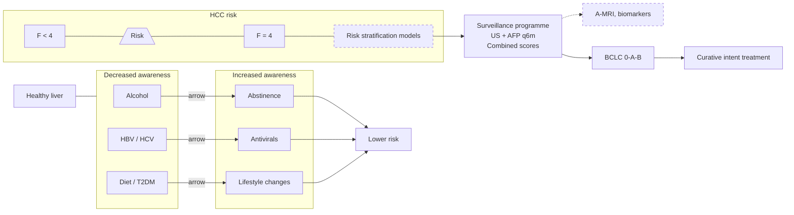
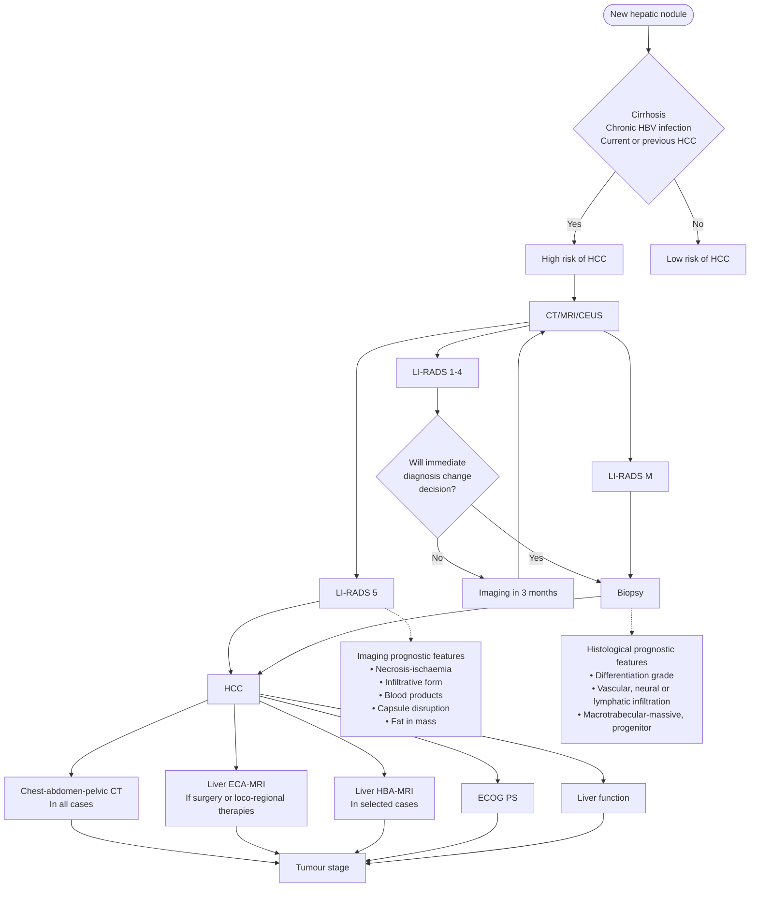
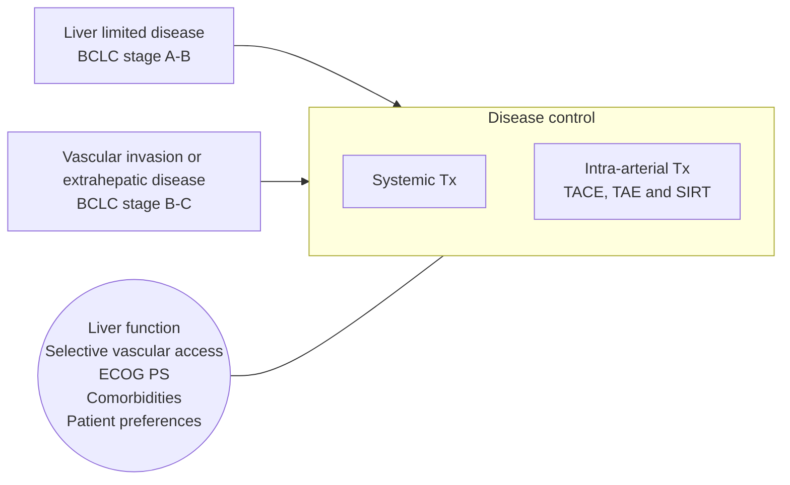

Clinical Practice Guidelines
JOURNAL OF HEPATOLOGY


# EASL Clinical Practice Guidelines on the management of hepatocellular carcinoma<sup>☆</sup>

European Association for the Study of the Liver*

## Summary
Liver cancer is the third leading cause of cancer-related deaths worldwide, with hepatocellular carcinoma (HCC) accounting for approximately 90% of primary liver cancers. Advances in diagnostic and therapeutic tools, along with improved understanding of their application, are transforming patient treatment. Integrating these innovations into clinical practice presents challenges and necessitates guidance. These clinical practice guidelines offer updated advice for managing patients with HCC and provide a comprehensive review of pertinent data. Key updates from the 2018 EASL guidelines include personalised surveillance based on individual risk assessment and the use of new tools, standardisation of liver imaging procedures and diagnostic criteria, use of minimally invasive surgery in complex cases together with updates on the integrated role of liver transplantation, transitions between surgical, locoregional, and systemic therapies, the role of radiation therapies, and the use of combination immunotherapies at various stages of disease. Above all, there is an absolute need for a multiparametric assessment of individual risks and benefits, considering the patient’s perspective, by a multidisciplinary team encompassing various specialties.

© 2024 European Association for the Study of the Liver. Published by Elsevier B.V. All rights are reserved, including those for text and data mining, AI training, and similar technologies.

## Introduction
Liver cancer is the sixth leading cause of cancer and the third leading cause of cancer-related deaths globally (GLOBOCAN).<sup>1</sup> Hepatocellular carcinoma (HCC) represents about 90% of primary liver cancers and constitutes a major global health problem. The management of patients with HCC is complex due the coexistence of a chronic liver disease, the multiplicity of diagnostic and therapeutic tools, and the relative lack of strong scientific evidence for some common practices, among other factors. Physicians or allied health-professionals, hospital managers and policy makers, and patients themselves are frequently confronted with difficult decisions. Providing the best possible care to patients requires updated information, deep understanding of the disease and access to multidisciplinary expertise. Over the last decade, the European Association for the Study of the Liver (EASL) has provided several guiding documents on the management of HCC, the last one in 2018.<sup>2</sup> Since then, we have gained significant knowledge that is transforming all aspects of HCC management, from personalised surveillance to improved diagnosis, from minimally invasive surgery to immune-based systemic therapy across tumour stages. Thus, updated EASL Clinical Practice Guidelines (CPGs) on the management of HCC were needed.

The present guidelines are intended for clinicians of all specialties who may deal with the management and care of patients with HCC. The main goal of this multidisciplinary effort has been to provide useful guidance that could help physicians, nurses and other allied health providers, health-policy makers and of course patients make individual or collective decisions that are based on scientific evidence and result in the delivery of optimal patient care. Optimal care includes the management of the underlying chronic liver disease present in most cases, and the EASL CPGs on HBV infection,<sup>3</sup> HCV infection,<sup>4</sup> alcohol-related liver disease,<sup>5</sup> non-invasive tests for evaluation of liver disease severity and prognosis,<sup>6</sup> decompensated cirrhosis,<sup>7</sup> acute-on-chronic liver failure,<sup>8</sup> as well as the Baveno VII consensus on portal hypertension<sup>9</sup> complement this CPG. While these guidelines do not specifically address the roles of nurses and palliative care specialists, the panel acknowledges their crucial and growing importance in the management of HCC and anticipates that their roles will continue to expand in the coming years. HCC is a global health problem that needs to be handled in very different social and health care environments. Readers should therefore adjust the recommendations made herein to their local context in terms of human and financial resources, technological availability, regulations, and team competence. Also, the 2018 EASL CPG recommendations should be followed in those scenarios that due to the constraints of a limited number of PICO questions have not been covered in this update. Owing to the rapid improvements in HCC management, the authors expect that frequent updates will be needed in the future.

***

\* Corresponding author: European Association for the Study of the Liver (EASL). The EASL Building - Home of Hepatology, 7 rue Daubin, CH1203 Geneva, Switzerland. Tel +41(0)22 807 03 60. E-mail address: easloffice@easloffice.eu
<sup>☆</sup> Clinical Practice Guideline Panel: Chair: Bruno Sangro; Secretary to the Chair: Josepmaria Argemi; Panel members: Maxime Ronot, Valerie Paradis, Tim Meyer, Vincenzo Mazzaferro, Peter Jepsen, Rita Golfieri<sup>†</sup>, Peter R. Galle, Laura A. Dawson; EASL Governing Board Representative: Maria Reig.
<sup>†</sup> Deceased
https://doi.org/10.1016/j.jhep.2024.08.028


ELSEVIER
Journal of Hepatology, February 2025. vol. 82 | 315–374
EASL™ The Home of Hepatology

# Methods used to develop these guidelines
The EASL Governing Board selected a panel of experts to develop the current guidelines, according to a standard operating procedure set out by EASL that meets the international standards set out by the Guidelines International Network.<sup>10</sup>

The CPG panel drafted questions according to the PICO format (patient, problem, or population; intervention; comparison, control or comparator; outcome) on five main topics of prevention and early detection, diagnosis and staging, other locoregional therapies, and systemic therapies. Two or three experts were more directly involved in drafting the questions for each subtopic. PICO questions were submitted to the Delphi panel, composed of 30 experts, including patient representatives (Zorana Maravic, Digestive Cancers Europe; Teresa Casanovas, European Liver Patients’ Association). Questions which received less than 75% agreement regarding their relevance and phrasing were revised and re-submitted for approval in a second round. An extensive literature search was then performed by panellists using PubMed, and expanding to other databases if needed, according to their expert judgement. Sometimes, when data from clinical trials of new therapeutic options had not yet been fully reported, the abstracts presented at international meetings were used as bibliographic references.

The quality of evidence was scored according to the Oxford Centre for Evidence-based Medicine (OCEBM) (adapted from The Oxford 2011 Levels of Evidence) (Table 1) and the strength of the recommendations was graded according to the OCEBM into two categories, strong or weak (Table 2).<sup>11</sup> For each PICO question, one or more recommendations were drafted by the same experts who formulated the questions and were agreed on by the panel in a process that involved extensive discussion and two virtual meetings. In addition, the panel chose to formulate general statements at the beginning of each section to provide a general conceptual framework. The Delphi panel voted on the recommendations, and consensus strength was defined as strong consensus (>95% agreement), consensus (>75-95% agreement), majority agreement (50-75% agreement) or no consensus (<50% agreement). As per the EASL methodology, there was no need to re-write the recommendations that found consensus (100% did) although corrections were often made to the document for fine tuning based on the comments from the Delphi panellists. During the process of elaborating the recommendations, the CPG panel identified some questions that could be added, merged or amended, and the agreement from the Delphi panel to these questions was sought at the time of consensus agreement. The final version of the CPGs was then finally sent to the EASL Governing Board for approval.

# Prevention and surveillance
HCC is the most prevalent primary liver cancer, and it poses a significant global health challenge due to its increasing incidence and often dire prognosis. Most HCCs develop in a cirrhotic liver, so policy interventions to reduce the prevalence of cirrhosis will lead to significant reductions in the incidence of HCC. Complementary clinical efforts aim to 1) reduce the risk of HCC development among patients with cirrhosis through pharmacological treatments and lifestyle modifications, and to 2) use screening to diagnose HCC early if it develops anyway (Fig. 1). Thus, screening does not reduce the incidence of HCC, but it aims to reduce the risk of death from HCC by allowing the HCC to be diagnosed and treated at an earlier disease stage with better chances of cure. The term “HCC surveillance” refers to the repeated application of screening for HCC, e.g. every 6 months. The target population for HCC surveillance, the choice of screening test, and the practical implementation of HCC surveillance are subjects of constant debate and gradual improvement. Like all other cancer screening, HCC surveillance aims to reduce deaths from HCC without causing unnecessary harm from incorrect HCC diagnoses or overdiagnosis of HCC (a correct diagnosis of an HCC that would never have caused harm to the patient if left undiagnosed).

## *Should patients with chronic viral infection (HBV or HCV) receive antiviral therapy to reduce the risk of HCC?*

### Recommendations
* Patients with HBV infection should be treated with nucleoside or nucleotide analogues to reduce the risk of developing HCC (both *de novo* and recurrence) and the type and time of treatment should follow EASL guidelines on HBV infection **(LoE 2, strong recommendation, strong consensus)**
* Patients with HCV infection and liver fibrosis should be treated with direct-acting antivirals to reduce the risk of cirrhosis-related complications, including HCC **(LoE 2, strong recommendation, strong consensus).**
* Patients with HCV infection and a diagnosis of HCC under complete tumour response after surgical or locoregional therapies can be treated with antiviral therapy although the impact on the risk of HCC recurrence is inconclusive **(LoE 3, weak recommendation, strong consensus).**
* Patients with HBV and HCV co-infection can be treated following the same criteria as for mono-infected patients **(LoE 3, weak recommendation, strong consensus).**

# Hepatitis B
The pivotal randomised-controlled trial (RCT) with lamivudine demonstrated that direct nucleoside or nucleotide analogues (NUCs) significantly decrease the risk of HCC development in patients with chronic hepatitis B virus (HBV) infection.<sup>12</sup> This information was validated in patients treated with NUCs other than lamivudine.<sup>13,14</sup> However, the risk is not eliminated.<sup>13,15</sup> In a recent meta-analysis, it was shown that NUC-treated patients have a significantly lower risk of HCC development in comparison to untreated ones (relative risk [RR] 0.48; 95% CI 0.30–0.75) although heterogeneity was very high ($I^2 = 91\%$); it also showed that the incidence of HCC was significantly lower in patients treated with recommended NUCs (entecavir and tenofovir) than in those treated with non-first-line NUCs (lamivudine, adefovir, and telbivudine) (RR, 0.85; 95% CI 0.75–0.97, $I^2 = 0\%$).<sup>16</sup>

Tenofovir and entecavir are most commonly used to treat chronic HBV infection. The impact of the choice of NUC on the development of HCC has not been studied in prospective studies. Both NUCs showed comparable antiviral efficacy and


316 Journal of Hepatology, February 2025. vol. 82 | 315–374

Clinical Practice Guidelines


**Table 1. Level of evidence based on the Oxford Centre for Evidence-based Medicine.**

<table>
  <thead>
    <tr>
        <th>Level</th>
        <th>Criteria</th>
        <th>Simple model for high, intermediate and low evidence</th>
        <th></th>
    </tr>
  </thead>
  <tbody>
    <tr>
        <td>1</td>
        <td>Systematic reviews (SR) (with homogeneity) of randomised-controlled trials (RCT)</td>
        <td rowspan="2">Further research is unlikely to change our confidence in the estimate of benefit and risk</td>
        <td></td>
    </tr>
    <tr>
        <td>2</td>
        <td>RCT or observational studies with dramatic effects; SR of lower quality studies (i.e. non-randomised, retrospective)</td>
        <td></td>
        <td></td>
    </tr>
    <tr>
        <td>3</td>
        <td>Non-randomised-controlled cohort/follow-up study/control arm of randomised trial (systematic review is generally better than an individual study)</td>
        <td rowspan="2">Further research (if performed) is likely to have an impact on our confidence in the estimate of benefit and risk and may change the estimate</td>
        <td></td>
    </tr>
    <tr>
        <td>4</td>
        <td>Case-series, case-control, or historically controlled studies (systematic review is generally better than an individual study)</td>
        <td></td>
        <td></td>
    </tr>
    <tr>
        <td>5</td>
        <td>Expert opinion (mechanism-based reasoning)</td>
        <td>Any estimate of effect is uncertain</td>
        <td></td>
    </tr>
  </tbody>
</table>

**Table 2. Grades of recommendation.**

<table>
  <thead>
    <tr>
        <th>Grade</th>
        <th>Wording</th>
        <th>Criteria</th>
    </tr>
  </thead>
  <tbody>
    <tr>
        <td>Strong</td>
        <td>Shall, should, is recommended.&lt;br/&gt;Shall not, should not, is not recommended.</td>
        <td rowspan="2">Evidence, consistency of studies, risk-benefit ratio, patient preferences, ethical obligations, feasibility</td>
    </tr>
    <tr>
        <td>Weak or open</td>
        <td>Can, may, is suggested.&lt;br/&gt;May not, is not suggested.</td>
        <td></td>
    </tr>
  </tbody>
</table>

safety in randomised trials conducted mostly in patients without cirrhosis.<sup>17,18</sup> All but two systematic reviews and a meta-analysis showed a significantly lower risk of HCC or a trend towards lower risk in patients receiving tenofovir.<sup>19–22</sup> However, all studies included a limited number of patients with cirrhosis and showed high heterogeneity. In one study a trend towards lower risk of HCC was observed in patients with cirrhosis (adjusted hazard ratio [HR] 0.87, 95% CI 0.74–1.01) and not in patients without cirrhosis (adjusted HR 1.14, 95% CI 0.81–1.60).<sup>23</sup> An individual patient meta-analysis which included 42,939 patients (6,979 receiving tenofovir and 35,960 receiving entecavir) concluded that tenofovir was not associated with a lower risk of HCC compared with entecavir (HR 0.81, 95% CI 0.65-1.01).<sup>24</sup> Regarding HCC recurrence, a recent meta-analysis concluded that tenofovir reduces the risk of late recurrence compared to entecavir (adjusted HR 0.58, 95% CI 0.45–0.76, $I^2 = 0.0\%$) but not early recurrence (adjusted HR 0.88, 95% CI 0.76–1.02, $I^2 = 34.8\%$).<sup>25</sup>

### Hepatitis C

No RCTs have evaluated the impact of direct-acting antivirals (DAAs) on HCC development, *de novo* or recurrent, in patients with chronic hepatitis C virus (HCV) infection. DAAs are recommended to reduce the risk of developing cirrhosis or cirrhosis complications. Several cohort studies (retrospective and prospective) or systematic reviews and aggregated meta-analyses have assessed the risk of HCC development after DAA treatment.<sup>26–30</sup> However, only one individual data meta-



**Fig. 1. Opportunities for the prevention of premature death related to HCC.** AFP, alpha-fetoprotein; A-MRI, abbreviated magnetic resonance imaging; BCLC, Barcelona Clinic Liver Cancer; F, fibrosis; HBV, hepatitis B virus; HCC, hepatocellular carcinoma; HCV, hepatitis C virus; q6m, every six months; T2DM, type 2 diabetes mellitus; US, ultrasound. Dotted line boxes represent areas of ongoing research.


Journal of Hepatology, February 2025. vol. 82 | 315–374 317

analysis has been published since the last version of the EASL guidelines.<sup>30</sup> All these cohort studies indicate that the risk of HCC after DAA treatment is multifactorial and that a key mechanism for the beneficial effect of DAAs on HCC development is their ability to reduce the risk of developing cirrhosis.<sup>28,31–36</sup>

Indeed, different scores have been proposed to stratify HCC risk among patients with advanced chronic liver disease treated with DAAs.<sup>37–48</sup> However, the study design significantly influences the results. In a meta-analysis assessing the impact of liver stiffness on HCC occurrence in patients with chronic HCV infection treated with DAAs, the pooled HRs of HCC occurrence in patients with high vs. normal liver stiffness measurement were different for the four retrospective studies (HR 2.29, 95% CI 0.96–5.45 and I<sup>2</sup> = 79.87%) and the four prospective studies (HR 4.61, 95% CI 2.44–8.71 and I<sup>2</sup> = 0%).<sup>28</sup> In brief, factors such as the absence of sustained virological response achievement, the presence of cirrhosis, low albumin, alpha-fetoprotein (AFP), low platelet count<sup>45,49–51</sup> or the presence of non-characterised liver nodules<sup>52,53</sup> before starting DAA therapy have been associated with a higher risk of HCC occurrence. Many of those factors reflect the degree of liver fibrosis and/or portal hypertension (i.e. presence/absence of cirrhosis, albumin, platelet count etc.).<sup>54</sup>

A multicentric and retrospective study in Spain initially reported that 27.6% of patients who achieved complete radiological response after HCC resection, ablation or chemoembolisation developed HCC recurrence after receiving treatment with DAAs.<sup>55</sup> Similar results were reported in Italy.<sup>56</sup> Later, many groups around the world analysed the topic and different meta-analyses have reported no differential risk of HCC occurrence or recurrence after DAAs.<sup>26,27,29,57,58</sup> In an individual patient data meta-analysis with pooled data from 21 studies including 977 patients, HCC recurrence after DAAs in patients with early HCC was 20 per 100 patient-years (95% CI 13.9–29.8), which was not statistically significantly lower than the recurrence rate in DAA-unexposed patients after propensity score-matched analysis (relative risk = 0.64, 95% CI 0.37–1.1; p = 0.1).<sup>30</sup> However, data heterogeneity was very high (I<sup>2</sup> = 74.6%) making results inconclusive and indicating the need to prospectively collect data on these specific patients. Although most patients have already been treated, the interferon-free DAA treatment rate was 52.3% and this data supports the need for continued research in this field. In brief, these data are inconclusive and might suggest that the risk of HCC recurrence persists even when the infection is eliminated by DAA treatment. However, the benefit of reduced risk of hepatic decompensation and improved overall survival (OS)<sup>59,60</sup> likely outweighs the potential increased risk of HCC occurrence or recurrence.

### HCV and HBV co-infection
There is some concern about the risk of HBV reactivation in the context of HCV therapy with DAAs and the US FDA issued a specific warning note, but the impact on HCC development in this population is limited. Changes in hepatitis B surface or core antibodies did not predict HCC recurrence among 378 patients with HCC who achieved HCV clearance with DAAs.<sup>61</sup> Also, the incidence of HCC was not significantly different (p = 0.6366) between co-infected (n = 52) or HCV mono-infected (n = 8,549) patients treated with DAAs.<sup>62</sup>

## Should lifestyle modifications be recommended for patients with cirrhosis to reduce their risk of HCC?

> ### Recommendations
> * Weight loss in patients with obesity, alcohol cessation, and tobacco cessation are recommended to reduce the risk of liver-related and other adverse outcomes and may be recommended to reduce the risk of HCC (LoE 3, weak recommendation, strong consensus).
> * Coffee consumption may be recommended to reduce the risk of HCC (LoE 3, weak recommendation, consensus).

Many lifestyle factors are risk factors for HCC because they are risk factors for cirrhosis.<sup>63</sup> Here, we will focus our attention on risk factors for HCC among those who already have cirrhosis.

### Alcohol consumption
Three studies have examined the effect of alcohol use on HCC risk in patients with alcohol-related cirrhosis.<sup>64–66</sup> A study published in 1993 followed Japanese patients with cirrhosis or chronic hepatitis and found that the risk of HCC was higher in former than in current daily drinkers.<sup>65</sup> A more recent study from Spain followed 727 patients with Child-Pugh class A or B alcohol-related cirrhosis and compared HCC incidence between 354 patients who maintained abstinence during a median follow-up of 5–6 years and 373 who were non-abstinent during follow-up. In the total cohort, abstinence during follow-up was not associated with a lower risk of HCC (HR 0.87, 95% CI 0.59–1.28). In the subset of patients without a history of decompensation, the risk of HCC was lower in patients who maintained abstinence, but only from around 6 years after inclusion. Three methodological points make this study difficult to interpret: First, 59 patients were lost to follow-up, adding uncertainty about the outcome. Second, patients were censored if they developed a severe comorbidity (n = 49) or transitioned to Child-Pugh class C and had contraindications for liver transplant(ation) (LT) (n = 9). An implication of this censoring is that the results of the analyses apply to a hypothetical world where the censoring events cannot occur, and that is not the clinical reality. Third, the classification as abstinent or non-abstinent was based on drinking patterns during the entire follow-up period, but in real life it is not possible to know whether your patient will or will not drink alcohol in the future, so it is difficult to convert the research findings into clinical practice. Finally, a recently published study concluded that hazardous alcohol use in patients with alcohol-related cirrhosis is associated with higher mortality and, consequently, a lower HCC risk.<sup>66</sup> The impact of alcohol consumption on HCC risk remains poorly defined. Nonetheless, there are many reasons to advise patients to abstain from alcohol.

### Tobacco smoking
A 2009 meta-analysis of 38 cohort studies and 58 case-control studies found an overall association between tobacco smoking and HCC.<sup>67</sup> However, only few studies were restricted to patients with cirrhosis or chronic liver disease. Of those that were,


318 Journal of Hepatology, February 2025. vol. 82 | 315–374

Clinical Practice Guidelines


four were Japanese,<sup>65,68–70</sup> including one that reported a HR for current smokers vs. never-smokers of 2.30 (95% CI 0.90 to 5.86).<sup>65</sup> The one remaining study was from Germany and included 86 cases with HCC and the same number of controls; it reported no association between smoking and HCC.<sup>71</sup> A newer study from the US found a confounder-adjusted HR for current smokers vs. never-smokers of 1.63 (95% CI 1.01–2.63).<sup>72</sup> Thus, the effect of tobacco smoking on HCC risk among patients with cirrhosis is poorly defined, but there are multiple reasons to recommend smoking cessation to patients with cirrhosis.

## Coffee

Two Japanese cohort studies examined the association between coffee consumption and HCC risk in patients with a ‘history of liver disease’ that was not further specified.<sup>73,74</sup> Compared with those who never drank coffee, patients who drank coffee occasionally had an incidence rate ratio of HCC of 0.51 (95% CI 0.27 to 0.97) in one study and 0.94 (95% CI 0.53 to 1.66) in the other. Those who drank coffee daily had incidence rate ratios of 0.52 (95% CI 0.25 to 1.07) and 0.44 (95% CI 0.22 to 0.88), respectively. A third Japanese cohort study of patients with current or previous chronic viral hepatitis found similar results,<sup>75</sup> so these studies suggest the presence of a dose-response protective effect of coffee on HCC risk. Other studies have found a lower HCC risk among coffee drinkers, but they were not restricted to patients with liver disease.<sup>76–78</sup> Studies of the effect of coffee on the development of liver disease have found similar results in European and Asian populations.<sup>79</sup> A US study found that coffee consumption reduced disease progression among patients with chronic HCV infection,<sup>80</sup> with ‘disease progression’ defined as progressive fibrosis or development of cirrhosis complications including HCC. The protective effect of coffee consumption was unchanged when HCC was excluded from the definition of disease progression, demonstrating that coffee had benefits other than protection from HCC development.<sup>80</sup> A study conducted in European patients on the LT waitlist reported that coffee consumption improved survival among those with alcohol-related liver disease or primary sclerosing cholangitis, but not among those with other chronic liver diseases. None of the included patients had HCC.<sup>81</sup> The evidence thus suggests that coffee reduces the risk of HCC, but observational studies of the effects of foods/drinks on HCC risk are difficult to interpret causally because people who drink coffee likely differ from non-drinkers of coffee in multiple ways, each of which may affect HCC risk. It thus remains uncertain whether the beneficial effects attributed to coffee are in fact caused by coffee, but at least there are no indications that coffee is harmful to patients with liver disease. Importantly, the potential effect of coffee is much less strong than that of alcohol and smoking cessation and does not apply to high-fat, high-sugar, latte type coffee. The effect of an active recommendation of coffee consumption in patients at high risk of HCC has not been prospectively evaluated.

## Weight loss

The effect of weight loss on HCC risk among patients with cirrhosis has not been examined specifically, but weight loss has been associated with reduced disease activity among patients with metabolic dysfunction-associated steatotic liver disease (MASLD) and overweight or obesity.<sup>63,82</sup> Therefore, weight loss could lead to a decreased risk of developing cirrhosis and HCC.

### Should prescription drugs be recommended for patients with cirrhosis to reduce their risk of HCC?

### Recommendation

*   Owing to a lack of evidence, the use of statins, aspirin and metformin cannot currently be recommended to reduce the risk of HCC development (**LoE 3, weak recommendation, strong consensus**).

The benefits of using drugs to reduce the risk of HCC developing among patients with cirrhosis remain unclear. Although a recent meta-analysis<sup>83</sup> concluded that the use of statins prevents HCC development, the high heterogeneity precludes a robust conclusion. Heterogeneity is associated with several factors including that a) none of the studies were designed for that specific purpose; b) one study was focused on patients without cirrhosis<sup>84</sup>; c) another was a case-control study<sup>85</sup>; and d) the indication for statins was related to comorbidities. Indeed, statin users were older and had more comorbidities, including diabetes and cardiovascular disease, than non-users.<sup>86</sup> An observational study using an emulated trial design sought to eliminate confounding from these and other factors but concluded that only a true randomised trial can determine the causal effect of statins on HCC risk.<sup>87</sup> Thus, the current data on statin use does not allow for conclusive recommendations.

In several observational studies and a few RCTs, aspirin has been shown to have a chemopreventive effect on several cancers. The impact on HCC is still unclear despite the three prospective studies focused on this topic.<sup>88–90</sup> Their main limitations are related to the lack of information about HBV and HCV status of the participants and the fact that males represented the greatest proportion of aspirin users. An observational study restricted to patients with alcohol-related cirrhosis used an emulated trial design and concluded that aspirin does not affect HCC risk.<sup>87</sup>

Finally, in a meta-analysis that evaluated chemoprevention of HCC with statins, aspirin and metformin,<sup>91</sup> the authors observed a moderate to high degree of heterogeneity in all analyses for the association between statin use and HCC risk (except in the subgroup analysis for follow-up time <60 months); moderate to high degree of heterogeneity in all analyses for the association between aspirin use and HCC risk (except in the subgroup analyses for male sex and duration of follow-up); and high degree of heterogeneity in all analyses for the association between metformin use and HCC risk. In addition, the visual inspection of funnel plots suggests publication bias in the overall analysis for both statins and aspirin, while publication bias could not be assessed for metformin due to insufficient studies. Much caution is therefore needed when interpreting these data.


Journal of Hepatology, February 2025. vol. 82 | 315–374 319

## Should HBV vaccination be given to all high-risk seronegative people?

**Recommendation**
* High-risk seronegative people should be vaccinated against HBV to decrease HCC incidence and HCC-related death and improve overall survival **(LoE 3, strong recommendation, strong consensus)**.

HBV vaccines effectively prevent infection and vaccination of all neonates is recommended by the World Health Organization.<sup>92</sup> In adults, vaccination of HBV seronegative persons is also recommended by the EASL clinical practice guidelines on HBV infection<sup>3</sup> and this recommendation includes high-risk seronegative people. According to the Centers for Disease Control and Prevention guidelines,<sup>93,94</sup> the following groups are at high risk of HBV infection: people whose sex partners have HBV infection; sexually active persons who are not in a long-term monogamous relationship; persons seeking evaluation or treatment for a sexually transmitted disease; men who have sexual contact with other men; people who share needles, syringes, or other drug-injection equipment; people who have household contact with someone infected with HBV; health care and public safety workers at risk of exposure to blood or body fluids; residents and staff of facilities for developmentally disabled persons; persons in correctional facilities; victims of sexual assault or abuse; travellers to regions with increased rates of HBV infection; people with chronic liver disease, kidney disease, HIV infection, or diabetes. There are no clinical trials or prospective studies focused on this topic.

## Should patients with cirrhosis be offered surveillance for HCC?

**Recommendation**
* Patients with cirrhosis should be offered surveillance for HCC unless they have a relatively high risk of death from non-HCC causes, or they could not be offered a curative-intent treatment for HCC (e.g., patients with Child-Pugh class C cirrhosis ineligible for liver transplantation) **(LoE 2, strong recommendation, strong consensus)**.

The recommendation to offer surveillance for HCC to patients with cirrhosis is based on a strong rationale, one randomised trial from China<sup>95</sup> and evidence from non-randomised studies. No observational studies have compared survival from cirrhosis diagnosis to HCC diagnosis between patients under surveillance and those not under surveillance. The rationale for HCC surveillance is indeed strong. Roughly 80–90% of HCCs develop in patients with cirrhosis, and survival is improved when HCC is diagnosed at an early stage. HCC screening offered to patients with cirrhosis meets Dobrow’s modernised criteria for a screening programme.<sup>96</sup> Screening should only be offered to patients who are candidates for curative-intent treatments.

A meta-analysis of 49 studies found that surveilled patients were more likely to have their HCC diagnosed at an early stage (relative risk 1.86, 95% CI 1.73–1.98).<sup>97</sup> Surveillance was also associated with increased survival from HCC diagnosis, including in studies which adjusted for lead-time bias (hazard ratio 0.67, 95% CI 0.61–0.72). The results of this meta-analysis favour HCC surveillance, but they do not quantify the benefit of surveillance in terms of clinical endpoints from the time surveillance is initiated. Furthermore, the meta-analysis did not examine the association between surveillance and HCC-related mortality. A US case-control study found that surveillance with ultrasound and/or AFP did not reduce HCC-related mortality.<sup>98</sup>

Studies comparing countries or eras with different surveillance strategies provide other pieces of evidence favouring surveillance. Survival from HCC diagnosis was markedly longer in Taiwan and Japan than in Europe and other countries where fewer patients with cirrhosis undergo HCC surveillance.<sup>99</sup> Similar evidence comes from a South Korean study that compared survival from HCC diagnosis between different eras and reported improved survival after surveillance was introduced.<sup>100</sup> These studies are consistent with a beneficial effect of HCC surveillance on survival time but do not rule out alternative explanations.

Simulation studies provide another line of evidence in favour of HCC surveillance.<sup>101–106</sup> They rely on assumptions about the rate of transition between modelled health states, the value of being in a particular health state, and other factors. A simulation study was the basis for the 1.5% per year threshold that has often been cited as the lower limit for cost-effective surveillance.<sup>106,107</sup>

Harms of surveillance remain an understudied issue.<sup>108</sup> They were reported in only four studies in the aforementioned meta-analysis and only physical harms were reported, not financial or psychological harms.<sup>97</sup> Up to 10% of patients experienced physical harm, often due to multiple follow-up computed tomography (CT) and/or magnetic resonance imaging (MRI) examinations, and rarely due to liver biopsy.

Not all patients with cirrhosis carry the same risk of developing HCC, and the net benefit of surveillance increases with increasing risk of HCC (assuming that overdiagnosis does not occur). The risk of HCC depends on the ‘carcinogenicity’ of the underlying disease and the patient’s chances of living long enough to develop HCC. The incidence rate of HCC is higher in cirrhosis from chronic viral hepatitis than in cirrhosis from alcohol-related liver disease,<sup>109,110</sup> and highly variable in cirrhosis from MASLD.<sup>111,112</sup> Several models are emerging to stratify patients according to their risk of developing HCC.<sup>41,113–117</sup> This is a promising avenue of research, particularly if the models are validated in different settings, and their risk strata can be linked with differing surveillance strategies, e.g., a no-surveillance strategy for a low-risk stratum and an ‘intensified surveillance’ strategy for a high-risk stratum. EASL endorses risk-based surveillance for HCC among patients with cirrhosis.<sup>118</sup>

## Should patients with chronic liver disease and advanced fibrosis without cirrhosis be offered surveillance for HCC?

**Recommendation**
* Patients with chronic liver disease and advanced fibrosis without cirrhosis have a higher risk of HCC than the general population, but HCC surveillance cannot currently be recommended in this group owing to insufficient evidence **(LoE 3, weak recommendation, strong consensus)**.


320 Journal of Hepatology, February 2025. vol. 82 | 315–374

Clinical Practice Guidelines


The risk of developing HCC and the benefit of surveillance among patients with advanced fibrosis have been studied mostly in patients with MASLD and in patients with HCV infection who have achieved a sustained virological response. Studies have examined the incidence rate of HCC but not the effect of HCC surveillance on patient survival or diagnosis at an early stage.

## MASLD

HCC may occur at earlier stages in MASLD than in other chronic liver diseases. A meta-analysis of 61 studies showed that the prevalence of cirrhosis was lower in patients with HCC associated with non-alcoholic fatty liver disease (NAFLD) – hereafter referred to as MASLD according to the updated nomenclature – than in patients with HCC from other causes (61.5% vs. 85.4%). The degree of fibrosis defines the risk of HCC. A large US cohort study of 1,773 patients with MASLD reported an incidence rate of HCC in patients with advanced F3 fibrosis (0.34 per 100 person-years, based on six HCC cases among 369 patients) that was higher than the incidence rate in patients with F0–F2 fibrosis or cirrhosis.<sup>112</sup> Yet, it was not specified whether these patients were screened for HCC or not. Other studies have shown that patients with MASLD without cirrhosis had a markedly lower HCC incidence than those with cirrhosis, although not distinguishing between patients with F3 or F0–F2 fibrosis.<sup>111,119</sup>

## Hepatitis C after eradication

Several studies have demonstrated that the risk of *de novo* HCC persists after successful cure of HCV infection in patients with advanced hepatic fibrosis without cirrhosis.<sup>37,45,49,120</sup> A meta-analysis including eight studies of patients with F3 fibrosis reported a pooled HCC incidence rate of 0.5 per 100 person-years.<sup>121</sup> The incidence rate was similar whether patients had achieved sustained virological response with interferon-based therapy (three studies, HCC incidence rate 0.4 per 100 person-years) or DAA therapy (five studies, HCC incidence rate 0.5 per 100 person-years).<sup>121</sup> Patients in these two studies were not surveilled for HCC after HCV eradication.

Studies in which patients with F3 fibrosis were offered surveillance after sustained virological response did not find a higher incidence rate of HCC. A prospective Spanish study surveilled a very well selected and homogeneous group of 63 patients with F3 fibrosis and 122 patients with cirrhosis after DAA cure who had non-characterised liver nodules at baseline.<sup>122</sup> No patient with F3 fibrosis developed HCC during follow-up, whereas the incidence rate among patients with cirrhosis was 2.24 per 100 person-years. Another Spanish study found that the incidence rate of HCC was 0.47 per 100 person-years among 506 patients with F3 fibrosis who were under HCC surveillance after HCV eradication with DAAs.<sup>120</sup> Finally, a French study showed an incidence rate of HCC of 0.52 per 100 person-years among 1,086 patients with advanced fibrosis with HCV infection eradicated with DAAs.<sup>39</sup>

In light of the available evidence, performing prospective studies on HCC surveillance in this population is encouraged to generate data for future guidelines. It should be noted that it is the assessment of fibrosis before and not after disease-modifying therapies like antivirals or abstinence from alcohol that should be used to establish the recommendation for HCC surveillance.

## Which is the best test (or combination of tests) for HCC screening?

### Recommendation
> * An ultrasound examination of the liver every 6 months is recommended for screening of HCC. The combined use of ultrasound with AFP increases sensitivity while decreasing specificity and is a reasonable option. There is limited data to support the use of other promising imaging modalities such as abbreviated MR or serum biomarkers (**LoE 3, strong recommendation, consensus**).

## Ultrasound

An RCT conducted in China established the basis for using ultrasound and AFP to survey patients at high risk of developing HCC.<sup>95</sup> However, a meta-analysis published in 2018 indicated that ultrasound exhibits low sensitivity in detecting small lesions. The sensitivity is notably impacted by studies conducted in the US (36%, 95% CI 27%–47%), as opposed to studies conducted elsewhere (47%, 95% CI 28%–67%).<sup>123</sup> An update of this meta-analysis reinforces the low sensitivity and a notable heterogeneity in all pooled estimates which reflects the need for further studies in the field.<sup>97</sup>

A recent study identified alcohol-related and non-alcohol-related fatty liver disease (odds ratio 6.1, 95% CI 1.7-21.3, *p* = 0.005) and ascites (odds ratio 3.9, 95% CI 1.2-12.6, *p* = 0.021) as independent factors associated with limited visualisation during ultrasound.<sup>124</sup> Similar data were reported in other studies and consequently the ultrasound LI-RADS (Liver Imaging Reporting and Data System) was introduced as a standardisation tool for ultrasound interpretation.<sup>125</sup> This algorithm incorporates both a detection score and visualisation scores. The visualisation score could serve as a means to identify patients who might not be ideal candidates for HCC screening with ultrasound. However, in a meta-analysis of 25,698 ultrasound examinations across 12 studies, the pooled proportions of visualisation scores A (no or minimal limitations), B (moderate limitations), and C (severe limitations) were 56.7% (*I*<sup>2</sup> = 99.2%), 30.3% (*I*<sup>2</sup> = 98.8%), and 6.9% (*I*<sup>2</sup> = 97.7%), respectively.<sup>126</sup> Studies that enrolled patients with cirrhosis and those focused on MASLD demonstrated significantly higher proportions of visualisation score C (*p* <0.05). Given that a considerable number of patients at risk exhibit cirrhosis, the utility of ultrasound LI-RADS in this context appears to be limited.<sup>126</sup> In addition, another study reported a limited agreement between primary and secondary sonographers and the primary sonographer and radiologist (weighted kappa of 0.73 and 0.48, respectively) for visualisation.<sup>127</sup> Thus, these data reflect that the sensitivity of ultrasound is operator-dependent and the incorporation of ultrasound LI-RADS does not solve it. Including the quality of liver


Journal of Hepatology, February 2025. vol. 82 | 315–374 321

visualisation in the ultrasound report may help physicians decide whether to use other imaging tools in individual patients.

### Regular and abbreviated magnetic resonance imaging
A prospective study from Korea demonstrated that the full MRI has higher sensitivity than ultrasound (84.8% vs. 27.3%) and a significantly higher positive predictive value than ultrasound for identifying single lesions <2 cm. It reported that MRI also showed a significantly lower rate of false-positive results.<sup>128</sup> A French study<sup>129</sup> also showed this result, but the main limitation of full MRI is the time and cost of the procedure and interpretation of results.<sup>130</sup> Although abbreviated MRI has been proposed as an alternative, most studies in this field are simulations or review a subset of sequences in patients who underwent a full MRI; or the study cohorts included patients who did not represent the screening population. In addition, no longitudinal study has directly compared the different abbreviated MRI approaches with each other or abbreviated MRI with ultrasound.<sup>130</sup> Thus, it is reasonable to wait for the results of the ongoing clinical trials (NCT05828446; NCT05716620; NCT05657249; NCT05486572; NCT05095714; NCT04455932; NCT04288323) before making a specific recommendation.

### AFP and combined strategies
The most recent meta-analysis<sup>131</sup> showed that the sensitivity of AFP alone for the detection of early-stage HCC was poor (49.1%; 95% CI 40.7%–56.1%) with a specificity of 87.9% (95% CI 83.4%–92.5%). When AFP is combined with ultrasound, the sensitivity increases, but the specificity decreases. The sensitivity for early-stage HCC detection was 51.6% (95% CI 43.3%–60.5%) for ultrasound vs. 74.1% (95% CI 62.6%–82.4%) for ultrasound plus AFP, with a specificity of 87.9% for ultrasound vs. 83.9% for ultrasound plus AFP. In the same line, according to a 2018 meta-analysis,<sup>123</sup> the sensitivity of ultrasound to diagnose early-stage HCC increases from 45% to 63% when AFP is added, and the specificity falls from 92% to 84%. When only prospective studies were analysed (n = 6), the sensitivity for the detection of early-stage HCC was 60% (95% CI 45%–74%) for ultrasound plus AFP compared to 40% (22%–58%) for ultrasound alone. Despite the better performance of the combination strategy, it misses over one-third of HCCs at an early stage, with a pooled sensitivity of only 63%.<sup>123</sup> Thus, the decision to use AFP is a trade-off between false-negatives and false-positives. A recent survey of US patients with cirrhosis found that patients favoured sensitivity over specificity.<sup>132</sup>

Other blood tests have claimed to improve the performance of AFP, including des-gamma carboxy-prothrombin (DCP) and lectin-bound AFP (AFP-L3).<sup>133,134</sup> A meta-analysis of studies focused on AFP-L3 for early HCC diagnosis showed a significant heterogeneity in sensitivity, specificity, and diagnostic ratio (I<sup>2</sup> values of 83.5%, 89.4%, and 68.4%, respectively) that limits the interpretability of the results.<sup>135</sup> There are also proposals to combine AFP with both clinical and serum biomarkers in different models such as VA,<sup>136</sup> ASAP,<sup>137</sup> male-ABCD,<sup>138</sup> HEB,<sup>139</sup> HES<sup>140</sup> or GALAD. GALAD is the most accepted one and includes AFP, AFP-L3, DCP, age, and gender. The performance of the GALAD score in identifying Barcelona-Clínic Liver Cancer (BCLC) stage 0/A HCC and detecting early HCC in patients with cirrhosis was analysed in a meta-analysis that included 19,021 patients.<sup>141</sup> A high or unclear patient selection bias was observed in 16 study cohorts, primarily attributed to the retrospective case-control design. GALAD showed a sensitivity of 0.73 (95% CI 0.66–0.79), specificity of 0.87 (95% CI 0.81–0.91), and false-positive rates ranging from 4.2% to 27.2% for the detection of early HCC. These results change only slightly when the analysis is restricted to identifying HCC within BCLC 0/A stages in the population of patients with cirrhosis, where GALAD demonstrated a pooled sensitivity, pooled specificity, and estimated AUC of 0.78 (95% CI 0.66–0.87), 0.80 (95% CI 0.72–0.87), and 0.86 (95% CI 0.83–0.89), respectively. Additionally, better performance was observed in retrospective studies than in prospective studies, which also reflects the selection bias in retrospective studies.

Thus, despite the promising performance of GALAD and those models which included DCP and AFP, their main limitations for implementation in clinical practice are the selection bias and the threshold values of these models for detecting early-stage HCC. Consequently, these scores should be further validated by more high-quality studies before being recommended as routine screening tools.

# Diagnosis and staging

## Diagnosis
Accurate diagnosis and staging are pivotal for guiding effective therapeutic decisions in oncology, influencing treatment strategies and patient outcomes. Histopathology plays a crucial role not only by providing true confirmation of the malignant nature of a given liver tumour, but also by providing essential insights into tissue characteristics such as cellular differentiation, vascular and lymphatic invasion, and metastatic potential. HCC most commonly develops in a liver that suffers from chronic tissue damage, and a model of stepwise carcinogenesis is widely accepted, where premalignant lesions occur. In the pathway from benign to dysplastic to malignant liver nodules, changes in vascularisation occur that can be captured by contrast-enhanced imaging and are the basis of the non-invasive diagnosis of HCC. In patients with cirrhosis, HBV infection or a previous diagnosis of HCC, a liver nodule can be diagnosed non-invasively as HCC when major features are observed with dynamic contrast-enhanced CT, MRI or ultrasound (CEUS) (Fig. 2). The terminology and criteria used to describe liver nodules should follow the LI-RADS v2018 recommendations. Non-invasive diagnosis can be sufficient in clinical scenarios where the additional information provided by histopathology will not influence a therapeutic decision. HCC diagnosis should be confirmed by tumour biopsy when the non-invasive imaging-based diagnostic criteria are not met. Non-invasive criteria have not been pathologically validated in advanced stage tumours.


322 Journal of Hepatology, February 2025. vol. 82 | 315–374

Clinical Practice Guidelines


# For the non-invasive diagnosis of HCC, should LI-RADS criteria be used to define contrast-enhanced imaging techniques (CT, MRI or ultrasound)?

## Recommendations

* The LI-RADS should be used to favour standardisation in the acquisition, description and reporting of liver imaging examinations (**LoE 3, strong recommendation, strong consensus**).
* Non-invasive diagnosis of HCC should be based on the LI-RADS CT/MR v2018 or the LI-RADS CEUS v2017 criteria. With CT/MRI, the following major imaging features are combined to reach the diagnosis: tumour size, rim and non-rim arterial hyperenhancement, peripheral and non-peripheral washout (in the portal venous or delayed phases on CT and MRI using extracellular contrast agents or gadobenate dimeglumine, or in the portal venous phase only with MRI using gadoxetic acid), enhancing capsule and threshold growth. With CEUS, non-rim arterial hyperenhancement with late-onset (>60 s) and washout of mild intensity are combined to reach the diagnosis (**LoE 1, strong recommendation, strong consensus**).

Imaging is essential to HCC diagnosis, contributing to primary liver tumour characterisation and HCC staging. Historically, pathologists have shown that HCC is subject to significant neo-angiogenesis. Its occurrence is the turning point in hepatocarcinogenesis in the context of chronic liver disease. It is visible as contrast uptake on contrast-enhanced imaging during the arterial phase. In 2001, experts introduced the concept of non-invasive imaging-based diagnosis based on the presence of arterial phase hyperenhancement (APHE) on two different imaging modalities (CT, MRI, angiography or ultrasound) in patients with cirrhosis with nodules >20 mm.<sup>142</sup> The very high pre-test probability of HCC was the reason why such non-invasive criteria were initially restricted to patients with cirrhosis. The main problem was that numerous other lesions and pseudo-lesions might cause focal APHE in patients with cirrhosis. For instance, in one study of 61 nodules showing APHE on CT before LT, only 17 (28%) were HCCs.<sup>143</sup> Other nodules were mostly benign regenerative or dysplastic nodules. Therefore, APHE lacked specificity. In 2005, a new radiological hallmark (i.e., washout on the portal venous and/or delayed phase) was introduced to gain specificity.<sup>144</sup> For 10-20 mm nodules, hallmarks had to be depicted on two imaging modalities (CT, MRI, or CEUS). Since then, numerous radiological-pathological correlation studies have challenged these criteria and led to substantial updates and modifications.

Regarding the challenging group of 10-20 mm nodules, a study addressing the diagnostic accuracy of MRI in a series of transplanted patients reported a false-positive rate of more than 10% when using only one imaging technique.<sup>145</sup> Prospective studies have shown that combining two imaging modalities resulted in high specificity at the cost of very low sensitivity (around 30%). The consequence was that more than two-thirds of nodules would still require pathological examination.<sup>146</sup> Furthermore, a prospective study reported a false-positive rate above 10% with either one or two imaging techniques, with a specificity of 81% and 85%, respectively.<sup>147</sup> 2012 EASL guidelines advocated the use of two coincidental techniques in non-expert centres and only one in expert centres for 10-20 mm nodules.<sup>148</sup> However, this statement was not evaluated, and expert centres were not defined.

In 2010, a study suggested that a sequential algorithm would maintain excellent specificity with increased sensitivity, avoiding a significant number of biopsies for 10-20 mm nodules.<sup>149</sup> This elegant approach also considered the respective value of different imaging techniques (MRI, CT or CEUS). The performance was confirmed by a prospective multicentric study including 381 patients with 544 nodules which reported a sensitivity and specificity in 10-20 mm nodules of 70.6% and 83.2% for MRI using extracellular contrast agents and 67.9% and 76.8% for CT.<sup>150</sup> Again, the concurrent use of CT and MRI had a specificity of 100% but a sensitivity of 55.1%. Interestingly, a very high specificity was reached when CEUS was used as a second-line test after a first inconclusive CT or MRI.<sup>150</sup> This became possible only because other studies had refined and identified the typical hallmarks for HCC at CEUS (i.e., APHE and late [>60 s] and mild washout).<sup>151,152</sup> This perspective justified the two-step 2018 EASL non-invasive diagnostic algorithm.<sup>2</sup>

In 2011 the American College of Radiology introduced the LI-RADS to standardise the terminology, acquisition technique, interpretation, reporting and data collection of liver imaging exams and characterise liver observations in patients at high risk of HCC.<sup>153</sup> LI-RADS includes four parts, screening and surveillance, diagnosis, staging and decision-making, and treatment response assessment.

Two diagnostic LI-RADS algorithms have been developed, one for CT/MRI and another one for CEUS. These algorithms are categorical and algorithmic systems where liver observations are assigned a category corresponding to the estimated probability of HCC or malignancy. The LI-RADS has undergone several updates to clarify definitions and concepts, address limitations, and incorporate new evidence, and has gained worldwide acceptance, at least in academic centres and scientific studies. The latest version (released in 2018) is aligned with the Organ Procurement and Transplant Network.

The LI-RADS CT/MR diagnostic algorithm can be used in patients with cirrhosis or chronic HBV infection or current or prior HCC, regardless of lesion size. It cannot be applied to patients <18 years old, patients with cirrhosis due to congenital hepatic fibrosis vascular disorders such as hereditary haemorrhagic telangiectasia, Budd-Chiari syndrome, chronic portal vein occlusion, cardiac congestion, or diffuse nodular regenerative hyperplasia. It cannot be applied either to pathologically proven tumours. The CT/MR algorithm combines five major features, i.e., tumour size, APHE, washout, an enhancing capsule, and tumour growth. APHE is further categorised into rim (confined to the observation’s periphery) or non-rim APHE. Similarly, washout is further categorised into peripheral and non-peripheral washout (not mainly in the observation’s periphery). The capsule corresponds to a smooth, uniform, sharp border on CT or MRI around most or all of the observation, and the threshold for growth is a ≥50% increase in size in ≤6 months. A definite HCC (i.e., LR-5) is present if a lesion ≥20 mm shows non-rim APHE and at least one additional major feature among a non-peripheral washout, an enhancing capsule, and threshold growth. The LR-5 category also applies to lesions 10-19 mm in size showing non-rim APHE


Journal of Hepatology, February 2025. vol. 82 | 315–374 323



<table>
  <thead>
    <tr>
        <th>Very early BCLC 0</th>
        <th>Early BCLC A</th>
        <th>Intermediate BCLC B</th>
        <th>Advanced BCLC C</th>
        <th>Terminal BCLC D</th>
    </tr>
  </thead>
</table>

**Fig. 2. A framework for the diagnosis and staging of patients with HCC.** BCLC, Barcelona Clinic Liver Cancer; CEUS, contrast-enhanced ultrasound; CT, computed tomography; ECA, extracellular contrast agent; ECOG PS, Eastern Cooperative Oncology Group performance status; HBA, hepatobiliary agent; HBV, hepatitis B virus; HCC, hepatocellular carcinoma; LI-RADS, liver reporting and data system; MRI, magnetic resonance imaging.

and either non-peripheral washout or threshold growth. Notably, LI-RADS also considers the presence of unequivocal enhancing soft tissue in a vein, regardless of visualisation of a parenchymal mass, as highly specific of HCC, and reports it as ‘tumour-in-vein’ (LR-TIV). The LI-RADS TIV category has only moderate sensitivity but excellent specificity for diagnosing macroscopic vascular invasion. In a retrospective study including 1,322 patients with (n = 101) or without (n = 1,221) macroscopic vascular invasion at pathology, the sensitivity and specificity of TIV on imaging were 62% and 99% for CT and 64% and 99% for MRI.<sup>154</sup> Finally, the LR-M category (probably or definitely malignant but not necessarily HCC) is introduced, mainly for lesions displaying a target-like morphology, i.e. concentric arrangement of internal components that likely reflects peripheral hypercellularity and central stromal fibrosis or ischaemia.

The CEUS diagnostic algorithm can be used in the same high-risk patients as the CT/MR algorithm. It can only be applied to lesions visible at pre-contrast ultrasound. It applies to CEUS examinations performed with pure blood-pool agents (Lumason® in the US, SonoVue® outside the US; Definity® in the US and Canada, Luminity® outside the US or Canada), but not to CEUS exams performed with combined blood-pool and Kupffer-cell agents such as Sonazoid®. The same categories of the CT/MR algorithm are used, but the major imaging features differ and include size, rim, APHE (non-rim and not peripheral discontinuous), and washout (refined into early [<60 s] or late [≥60 s] and into marked or mild). The rim APHE is also applied for LR-M categorisation. A definite HCC (LR-5) is present if a lesion ≥10 mm shows non-rim and non-peripheral discontinuous globular APHE plus late and mild washout. The algorithm also considers the LR-TIV and LR-M categories. This CPG endorses the use of the LI-RADS CT/MR and CEUS criteria for the non-invasive diagnosis of HCC.

If the criteria for the non-invasive diagnosis of HCC are not met, a tumour biopsy is mandatory. When performed, the aim of a tumour biopsy should be to reach an accurate diagnosis and determine relevant prognostic factors. Accordingly, its adequacy is critical, and several recommendations should be followed: (i) it should be obtained using percutaneous access under CT or ultrasound guidance,<sup>155</sup> (ii) it should provide


324 Journal of Hepatology, February 2025. vol. 82 | 315–374

Clinical Practice Guidelines


sufficient tissue material from the target nodule and eventually from the background liver when sampled, (iii) extensive sampling of the tumour biopsy through serial sections and routine staining should be performed to explore cytological aspects (H&E) and architectural patterns (reticulin),<sup>156,157</sup> while additional immunostainings may be useful to differentiate dysplastic nodules from early HCC.<sup>158,159</sup> While the specificity and positive predictive value of biopsy are excellent (100%) for hepatocellular nodules <2 cm, it has a variable sensitivity (66%-93%), which depends on tumour size, experience of the operator and pathologist, and needle size.<sup>155</sup> Repeated biopsies may be necessary for patients with imaging features that raise suspicion of malignancy and negative tumour biopsy.<sup>160</sup> However, such an invasive strategy should be nuanced by well-known limits of biopsy, including low risks of complications (track seeding and bleeding), sampling error, and the various likelihoods of malignancy for indeterminate liver nodules.<sup>161,162</sup> These limitations are mostly driven by tumour location.

### Is the LI-RADS more accurate than the 2018 EASL algorithm for the non-invasive diagnosis of HCC?

> **Recommendation**
> * The LR-5 category and the 2018 EASL algorithm have similar performance for the non-invasive diagnosis of HCC. However, LI-RADS should be preferred because it introduces valuable refinements (e.g., LR-M and LR-TIV categories) and allows for an estimation of the probability of HCC in nodules that do not meet the LR-5 category (**LoE 3, strong recommendation, strong consensus**).

One of the main benefits of LI-RADS over pre-existing systems is that it categorises liver observations according to the risk of HCC or malignancy and endorses management suggestions. To be valid, this approach requires that this risk be known for each LI-RADS category. Since 2018, more than 20 systematic reviews and meta-analyses have been published to assess LI-RADS performance. All have consistently validated the excellent specificity of the LR-5 category (definitely HCC) and the value of the LR-TIV (macrovascular venous invasion) and LR-M (malignancy but not specific for HCC) categories.<sup>163–165</sup> Notably, the proportion of HCC and malignancy across categories was shown not to be affected by the imaging modality (i.e., CT or MRI) or contrast agent used (i.e., extracellular or liver-specific).<sup>164</sup>

Of course, the system is not perfect. While systematic reviews have confirmed that the likelihood of an observation being an HCC corresponds to the ordinal LI-RADS category,<sup>163–165</sup> a recent meta-analysis (49 studies, 9,620 patients with 11,562 observations, comprising 7,921 HCCs, 1,132 non-HCC malignancies, and 2,509 benign entities) reported a relative range of proportions of HCC for LR-2 (probably benign, HCC in 2% to 18%), LR-3 (intermediate probability of malignancy, HCC in 32% to 60%), and LR-4 (probably HCC, HCC in 67% to 93%), which calls for improvements.<sup>164</sup> In this meta-analysis, 97% of LR-5 cases were confirmed as HCC by pathology or imaging follow-up. Additionally, the agreement for LI-RADS categorisation remains moderate<sup>166</sup> despite recent updates and clarification in the LI-RADS lexicon.<sup>167,168</sup>

A direct comparison of EASL v2018 and LI-RADS v2018 is challenging because these systems do not share the same definition of high-risk patients. Therefore, a proper comparison should be performed in populations considered by both systems (i.e. only in patients with cirrhosis). Most comparative studies include Asian populations with a predominance of patients with chronic HBV infection<sup>169</sup> and show similar performance of the LR-5 and EASL criteria for diagnosing HCC. A systematic review assessed the adherence to LI-RADS and EASL high-risk population criteria in 219 original studies (215 used LI-RADS only, 4 EASL only, and 15 LI-RADS and EASL).<sup>170</sup> Inadequate adherence to high-risk population criteria was observed in 8.4% of LI-RADS and 42.1% of EASL studies, regardless of imaging modality. This shows that EASL criteria are often misused and applied to patients with chronic HBV infection without evidence of cirrhosis or patients without cirrhosis with different aetiologies of chronic liver disease.

Broadening the definition of the high-risk population, especially by including HBV patients without cirrhosis, is a matter of debate. The 2018 EASL guidelines limited non-invasive diagnosis to patients with cirrhosis, but patients with HBV and cirrhosis at intermediate or high risk of HCC according to PAGE-B classes are candidates for surveillance. Using platelets, age and gender, PAGE-B classifies individuals with HBV infection into three classes according to their risk of developing HCC (at 5 years, low risk, almost 0%; intermediate risk, 3%; high risk, 17%).<sup>171</sup> The performance of EASL and LI-RADS criteria for diagnosing HCC in patients with HBV without cirrhosis has recently been analysed. Among 280 patients with 338 observations (76% HCC, 12% non-HCC malignant lesions, and 12% benign lesions), when the pre-test probability of HCC was >70% (estimated as a PAGE-B score ≥10), EASL or LR-5/LR-TIV criteria were associated with a >90% probability of HCC.<sup>172</sup> In populations at lower risk, the probability of HCC was lower, between 80% and 85%. Altogether, EASL and LR-5/TIV seem to offer the same diagnostic specificity. Nevertheless, LI-RADS diagnostic algorithms provide a more granular assessment of liver nodules, introduce valuable refinements (e.g., non-rim APHE, LR-M) and standardise definitions and features. Future studies are needed to quantify the clinical benefit of adopting LI-RADS in clinical practice.

### Should contrast-enhanced MRI be preferred to contrast-enhanced CT for the non-invasive diagnosis of HCC?

> **Recommendation**
> * Multiphasic CT or dynamic contrast-enhanced MRI are recommended, without preference, for the non-invasive diagnosis of HCC (**LoE 1, strong recommendation, consensus**).

A prospective study evaluated the diagnostic accuracy of CEUS, CT and MRI performed in the assessment of liver nodules detected in every consecutive patient with compensated cirrhosis under surveillance with ultrasound. Among 64 patients with 67 de novo liver nodules (44 HCC, 34 HCC 1-2 cm), the sensitivity of CEUS, CT and MRI for 1-2 cm HCC was 26%,


Journal of Hepatology, February 2025. vol. 82 | 315–374 325

44% and 44%, with 100% specificity.<sup>149</sup> More recently, a multicentre prospective trial investigated patients with 1-3 cm nodules who had CEUS, CT and MRI using extracellular contrast agents performed within a month.<sup>150</sup> Among 381 patients with 544 nodules (342 HCC, 187 HCC 1-2 cm), the sensitivity and specificity for the diagnosis of HCC were 71% and 85% for MRI, 70% and 81% for CT, and 46% and 93% for CEUS. For 10-20 mm nodules, the sensitivity and specificity were 71% and 83% for MRI, 68% and 77% for CT and 40% and 93% for CEUS.

***Is hepatospecific contrast-enhanced MRI more accurate than extracellular contrast-enhanced MRI for the non-invasive diagnosis of HCC?***

> ### Recommendation
> * Extracellular contrast agents should be favoured over gadoxetic acid for the non-invasive diagnosis of HCC using MRI (**LoE 1, strong recommendation, consensus**).

A significant development in liver imaging was the introduction of liver-specific MR contrast agents, also called hepatobiliary agents (HBAs). These agents are gadolinium chelates that, contrary to extracellular contrast agents (ECAs), are taken up by functioning hepatocytes. Radiological-pathological studies have shown that their internalisation is mediated by organic anion transporting polypeptides (OATP) expressed on the sinusoidal membrane of functional hepatocytes.<sup>173</sup> The level of expression of OATP is significantly decreased in impaired hepatocytes. Consequently, these contrast agents are accurate markers of such hepatocellular function. On dedicated T1-weighted images obtained when the liver and bile ducts are markedly enhanced (in the so-called ‘hepatobiliary [HB] phase’), non-hepatocellular tumours, tumours containing impaired hepatocytes (such as most HCC), vessels and cysts appear hypointense. Loss of hepatocellular function occurs early during hepatocarcinogenesis, even before neoangiogenesis. This is why 80% to 90% of HCC are hypointense on the HB phase, while most non-HCC, cirrhosis–associated regenerative or dysplastic nodules appear iso- or hyperintense. Therefore, liver-specific agent-enhanced MRI has a higher sensitivity for detecting nodules. A meta-analysis focusing on the diagnostic performance of MRI for diagnosing HCC up to 2 cm showed that HBA-MRI had significantly increased sensitivity compared to ECA-MRI (92% and 67%, respectively).<sup>174</sup> It may be tempting to consider hypointensity on HB phase as a new imaging hallmark of HCC and to expect an improvement in diagnostic performance, the same way the criterion of washout did. In a study including 420 nodules >1 cm in 228 patients,<sup>175</sup> the authors developed a classification and regression tree using three MRI findings independently associated with HCC (i.e., HB phase hypointensity, arterial hyperintensity, and diffusion restriction). This algorithm demonstrated, both in the entire study population and for nodules ≤2 cm, higher sensitivity but slightly lower specificity than classical criteria. However, the algorithm was not externally validated.<sup>176</sup> The significance of hypointensity on the transitional phase and/or the HB phase is not the same as that of washout. This is why other studies have shown that hypointensity on HB phase used as an alternative to washout led to a significant increase in sensitivity for the diagnosis of HCC but at the cost of an unacceptable decrease in specificity.<sup>177,178</sup>

Several meta-analyses have studied the sensitivity of ECA- and HBA-MRI.<sup>177,179</sup> All have found that HBA-MRI is associated with higher sensitivity than ECA-MRI, particularly in small HCC. On the other hand, several head-to-head studies consistently showed the superiority of ECA-MRI over HBA-MRI for diagnosing HCC. Among 91 patients with chronic liver disease who underwent ECA-MRI and HBA-MRI within a 1-month interval for a first detected hepatic nodule on ultrasound, 117 observations (95 HCCs, 19 benign lesions, and 3 other malignancies; median size, 18 mm) were identified after surgical resection. ECA-MRI had higher sensitivity (77.9% vs. 66.3%) and accuracy (82.1% vs. 72.6%) than HBA-MRI in the LR-5 category v2017.<sup>180</sup> In a multicentric prospective study of 171 patients with cirrhosis who underwent ECA-MRI and HBA-MRI within a month, 225 observations were made (153 HCCs), each with 1 to 3 nodules measuring 1-3 cm. The sensitivities of both MRI techniques were similar, but specificity was 83.3% (95% CI 72.7-91.1) for ECA-MRI and 68.1% (95% CI 56.0-78.6) for HBA-MRI.<sup>181</sup>

Another prospective study included 125 patients with chronic liver disease (163 observations, 124 HCCs, 13 non-HCC malignancies, and 26 benign lesions; mean size, 20.7 mm) who underwent CT, ECA-MRI, or HBA-MRI (with gadoxetic acid) before surgery for a nodule initially detected by ultrasound. ECA-MRI detected HCC with 83.1% sensitivity and 86.6% accuracy, compared to 64.4% sensitivity and 71.8% accuracy for CT (p <0.001) and 71.2% sensitivity (p = 0.005) and 76.5% accuracy for HBA-MRI (p = 0.005).<sup>182</sup> Interestingly, adding CT to either ECA-MRI (89.2% sensitivity, 91.4% accuracy; both p <0.05) or HBA-MRI (82.8% sensitivity, 86.5% accuracy; both p <0.05) significantly increased its diagnostic performance in the detection of HCC compared with MRI alone. The same group compared ECA-MRI and HBA-MRI in 179 participants with cirrhosis (n = 105) or HBV infection without cirrhosis (n = 74) using LI-RADS v2018 as a reference. LR-5 with ECA-MRI provided the highest sensitivity (80.7%), followed by EASL v2018 with ECA-MRI (76.2%), LR-5 with HBA-MRI (67.3%), and EASL v2018 with HBA-MRI (63.0%, all p <0.05). The specificities were comparable (89.4% to 91.5%). When the analysis was limited to participants with pathological cirrhosis (123 observations), the sensitivity of LR-5 with ECA-MRI was similar to that of EASL v2018 with ECA-MRI (82.7% vs. 80.2%, p = 0.156) but higher than LR-5 with HBA-MRI (65.1%) or EASL v2018 with HBA-MRI (62.8%, both p <0.001), with comparable specificities (87.5% to 91.7%).<sup>183</sup> Finally, in a study that assessed and compared the reliability of LI-RADS v2018 and EASL v2018 criteria for diagnosing HCC using ECA-MRI of HBA-MRI, the inter-reader agreement for definite HCC diagnosis was substantial and similar between ECA-MRI and HBA-MRI for EASL and LI-RADS criteria.<sup>166</sup>

### Specific issues with gadoxetic-enhanced MRI
Biokinetics of gadoxetic acid, with half the dose excreted into the bile ducts and the other half excreted by the kidneys, has several diagnostic consequences. First, hypointensity on the


326 Journal of Hepatology, February 2025. vol. 82 | 315–374

Clinical Practice Guidelines


transitional or the HB phase should be regarded as ancillary findings favouring malignancy (not specifically HCC), not as equivalent to washout. As most HCCs (80%–90%) are hypointense on the HB phase, this feature may contribute to the differentiation between HCC and benign nodules developed on chronic liver diseases<sup>184</sup> but not as a major feature. Second, hypointensity on the transitional phase appears before APHE. As a result, non-hyperenhancing but HB phase hypointense nodules are depicted, which correspond mainly to early HCC or dysplastic nodules. These nodules have a higher risk of progression to typical HCC than iso- or hyperintense nodules on HB phase.<sup>185</sup> Third, injecting gadoxetic acid is associated with an increased risk of transient respiratory motion artefacts in the arterial phase (occurring in 2.4% to 18% of cases) that could reduce image quality.<sup>186,187</sup> Whether these artefacts hamper the detection of lesion hyperenhancement on the arterial phase remains debated. Nevertheless, ECA-MRI identified APHE in a significantly higher proportion of patients than CT (97.6% vs. 81.5%; p <0.001) or HBA-MRI (89.5%; p = 0.002).<sup>182</sup> In another study, ECA-MRI and HBA-MRI identified APHE in 90% and 78% of cases, respectively.<sup>181</sup>

### *Should CEUS be used as a first-line examination for the non-invasive diagnosis of HCC?*

> ### Recommendations
> * CT or MRI should be preferred over CEUS as a first-line examination for the non-invasive diagnosis of HCC because of their higher sensitivity and their utility for analysis of the whole liver **(LoE 3, strong recommendation, consensus)**.
> * When used for the non-invasive diagnosis of HCC, CEUS should be performed according to the LI-RADS technical recommendations **(LoE 4, strong recommendation, strong consensus)**.

As mentioned above, the use of CEUS for the non-invasive diagnosis of HCC has been debated because of a theoretical risk of misdiagnosis, especially with intrahepatic cholangiocarcinoma, which appeared to occur at a rate of 2–5% of all new nodules in cirrhosis.<sup>188,189</sup> Indeed, APHE followed by washout at CEUS is not specific for HCC and occurs in about 50% of mass-forming intrahepatic cholangiocarcinomas in cirrhosis.<sup>188,189</sup> However, the onset of washout takes place earlier than 60 s after contrast injection in 50% to 85% of intrahepatic cholangiocarcinomas,<sup>190,191</sup> while this is rarely observed in HCC. Also, the intensity of washout in the portal phase is more marked in intrahepatic cholangiocarcinoma than in HCC.<sup>192</sup> Hence, the main imaging features for HCC at CEUS are APHE followed by late (>60 s) washout of mild intensity.<sup>151,152</sup>

Using these criteria, a large retrospective study of more than 1,000 lesions in cirrhosis reported a positive predictive value for HCC of almost 99% and a positive likelihood ratio of 15.5, with no case of misdiagnosis with intrahepatic cholangiocarcinoma.<sup>193</sup> Such improved diagnostic capacity was associated with only a slight decrease in sensitivity compared to the EASL and AASLD criteria (from 67% to 62%).<sup>193</sup> Furthermore, in a prospective multicentric study, CEUS had a specificity of 92.9% vs. 76.8% for CT and 83.2% for MRI in 10–20 mm nodules.<sup>150</sup> However, when CEUS is compared with either CT or MRI, its sensitivity is significantly lower, especially in nodules of 10 to 20 mm, because of a lower detection rate of a washout than with CT or MRI.<sup>146,194</sup> CEUS can be used when CT or MRI are inconclusive. When the diagnosis of HCC is based on CEUS, disease staging should include chest CT and abdominal CT or MRI.

### *Should imaging-based non-invasive criteria for the diagnosis of HCC be used in patients without cirrhosis?*

> ### Recommendation
> * The non-invasive criteria should only be applied to patients with cirrhosis, chronic HBV infection or a history of HCC. In other patients, the diagnosis of HCC should be confirmed by biopsy **(LoE 1, strong recommendation, consensus)**.

Evidence suggests that the imaging appearance of HCC is similar in patients with or without cirrhosis. However, knowledge of imaging presentations of HCC in patients without cirrhosis is limited. The main reason is that very few studies, all including small series of patients, have described the clinical, pathological, and imaging features of HCCs developing on non-cirrhotic livers. Interestingly, these studies consistently reported that the main imaging features of HCC are present in most patients. However, these studies did not differentiate between HCCs developing in the context of advanced fibrosis and those developing in non-fibrotic livers, and did not specifically categorise patients by aetiologies of chronic liver disease, e.g., MASLD from metabolic dysfunction-associated steatohepatitis (MASH) or MASLD from other causes of liver disease.

A critical (and often overlooked) factor is that the non-invasive diagnosis of HCC can only be applied to patients who are considered at high risk of developing HCC. The definition of high-risk patients is needed to maintain a high specificity for diagnosing HCC due to several HCC mimickers in patients without risk factors. Indeed, the accuracy of a diagnostic test (e.g., imaging) is affected by the pre-test probability of the disease. In a population that does not have a sufficiently high pre-test probability of having HCC, typical imaging features can be observed in other benign and malignant non-HCC lesions, leading to an unacceptable number of false-positive diagnoses and a reduced specificity for HCC. The non-invasive diagnosis of HCC cannot be made in patients without cirrhosis or chronic HBV infection and with no history of HCC (e.g., in patients with MASLD without cirrhosis). In these patients, a biopsy is required. Indeed, despite an unequivocally increased risk of HCC in patients with MASLD without cirrhosis, the pre-test probability in these populations has not yet been precisely established.

Data regarding the performance of the non-invasive diagnosis in MASLD patients without cirrhosis is scarce because


Journal of Hepatology, February 2025. vol. 82 | 315–374 327

328 Journal of Hepatology, February 2025. vol. 82 | 315–374


most studies addressing the performance of the non-invasive diagnosis of HCC adhere to the definition of high-risk populations. One study has specifically focused on the performance and reliability of LI-RADS for distinguishing HCC from non-HCC primary liver carcinomas in patients who did not meet strict LI-RADS high-risk criteria.<sup>195</sup> It studied 131 patients, including 19% with steatosis without fibrosis, 7% with steatosis and fibrosis, 6% with MASH but without fibrosis, and 25% with MASH and fibrosis. In the entire cohort, the specificity of LR-5 as a predictor of HCC was 97%-100%, and the combination of LR-5 or LR-TIV as a predictor of HCC did not change the specificity. However, the authors did not provide the result for the subgroup of patients with MASLD. The same group published another study focusing on non-HCC malignancies.<sup>196</sup> They suggested that non-HCC malignancies were more likely to mimic HCCs on CT and MRI in the LI-RADS target population than in patients without LI-RADS-defined HCC risk factors. However, again, no subgroup analysis in patients with MASLD was provided. Other studies have also focused on patients without LI-RADS-defined HCC risk factors, but no patients with MASLD were included.<sup>197</sup>

### *Specifics of patients with MASLD without cirrhosis*

Most HCCs developing in patients with MASLD without cirrhosis present as solitary lesions or as a dominant mass with satellite nodules. Infiltrating forms are anecdotal. The vast majority of HCCs present with non-rim APHE and non-peripheral washout. No evidence suggests any differences between patients with and without cirrhosis, except for larger tumour size in patients without cirrhosis, probably due to surveillance programmes. A systematic review and meta-analysis of five studies including 170 patients with MASLD and 193 HCCs showed that the pooled percentages of APHE, washout, and enhancing capsule were 94.0% (95% CI 89.1–96.7%), 72.7% (95% CI 63.3–80.4%), and 57.5% (95% CI 45.1–69.1%), respectively.<sup>197</sup> The percentages of these three major features did not significantly differ between MASLD and MASH. MRI showed similar pooled percentages of APHE (94.3% vs. 93.4%, p = 0.82) and washout (70.4% vs. 77.2%, p = 0.38) to CT, but a higher pooled percentage of enhancing capsule (67.1% vs. 44.7%, p = 0.02). The better ability of MRI to depict an enhancing capsule was also shown in another study.<sup>198</sup>

The detection and characterisation of focal liver lesions are modified by steatosis. It may lead to underestimation of the tumour burden, particularly with CT. It can also make the characterisation of the lesion more difficult. MRI is the most appropriate imaging examination to address this limitation. In a study that assessed the effect of hepatic steatosis on major features of HCC at MRI in patients with MASLD, an 18% and 22% increase in the odds of absent washout and capsule appearance was reported for every 1% increase in hepatic fat fraction.<sup>199</sup>

### *Steatohepatitic HCC*

Steatohepatitic HCC (sh-HCC) is one of the many variants of HCC listed in the WHO classification. It was described in 2010 as an HCC presenting histological features of steatohepatitis (i.e., ballooning, steatosis, fibrosis, inflammatory infiltrates, Mallory-Denk bodies).<sup>200</sup> It is one of the most frequent subtypes, accounting for about 20% of HCCs. It was initially described in patients with HCV and alcohol aetiologies, but its association with the metabolic syndrome and MASLD is now well established. The diagnosis relies on depicting a steatohepatitic component in ≥50% of the total viable tumour area on pathology. A less than 50% component will classify the tumour as classic HCC (non-otherwise specified HCC) with a steatohepatitic component.<sup>201</sup>

There are still few radiological descriptions of sh-HCC. They are usually smaller than other HCCs and classically develop on a background of hepatic steatosis. Therefore, tumours may be difficult to distinguish from the surrounding liver parenchyma in patients with severe hepatic steatosis. On CT and MRI, fat in mass is significantly more frequent in sh-HCCs than in other subtypes. This is depicted as a diffuse or low focal attenuation on CT and intralesional signal loss on opposed-phase MR images.<sup>202–204</sup> However, the presence of fat in mass is insufficient to reliably predict the sh-HCC subtype because this feature is also observed in other HCC subtypes, in early HCC and other fat-containing liver lesions. In high-risk patients, most sh-HCCs are categorised as LR-5 since most tumours show APHE, washout, and a capsule.<sup>204</sup> The majority of tumours also show hypointensity in the HB phase. Steatohepatitic HCC uncommonly exhibits TIV. Notably, the possible non-invasive diagnosis of sh-HCC should be considered only in the appropriate clinical context (e.g., HCC showing fat in mass in patients with steatosis, metabolic syndrome).

### ***If a biopsy is obtained, should HCC subtyping be performed on biopsy material, including immunostainings with hepatocellular and cholangiocellular markers?***

> ### Recommendations
> * Pathological diagnosis of HCC should be based on the International Consensus recommendations using the required histological and immunohistochemical analyses **(LoE 1, strong recommendation, strong consensus)**.
> * If a biopsy is obtained, relevant prognostic features should be reported, including tumour differentiation and HCC subtyping per the WHO classification **(LoE 1, strong recommendation, strong consensus)**.

HCC is histologically defined by the malignant proliferation of tumour cells that may present varying degrees of hepatocellular differentiation (i.e., resembling more or less normal hepatocytes). Based on the arrangement of tumour proliferation, three main architectural patterns are described (i) a trabecular pattern where malignant hepatocytes are arranged in plates with variable thickness (from 2 to over 20 cells); (ii) a compact or solid pattern when tumour plates are closely aligned and sinusoids become compressed and unapparent; and (iii) an acinar or pseudoglandular pattern where tumour cells are arranged in glandular structures that may contain bile. The large majority of HCC do not display significant fibrous stroma. The recent WHO classification identifies HCC with no morphological particularity as ‘not otherwise specified HCC’

Clinical Practice Guidelines


(NOS-HCC). Additionally, eight different morphological subtypes are recognised (i.e., fibrolamellar, scirrhous, clear cell, steatohepatitic, macrotrabecular/massive, chromophobe, neutrophil-rich and lymphocytic-rich).

Integrative molecular analysis based on genomic, transcriptomic and epigenomic screening has enabled refinement of the molecular landscape of HCC and the identification of distinct molecular classes associated with specific biological behaviours.<sup>205</sup> By correlating molecular and morphological features, a pathomolecular classification of HCC has been proposed.<sup>206</sup> According to this classification, some histotypes (e.g., the macrotrabecular/massive and progenitor phenotypes) are associated with a poor prognosis, while others (e.g., the lymphocyte-rich subtype) have a better prognosis. Beyond subtyping, the histological grading of differentiation (well/moderately/poor) is commonly used in practice and has been shown to bear prognostic value in surgical and transplantation series.

## Differential diagnosis

Hepatocellular nodules <2 cm in size encompass a broad spectrum of lesions from regenerative to dysplastic nodules (i.e., low grade and high-grade dysplastic nodules) and early HCC.<sup>156</sup> Discriminating premalignant high-grade dysplastic nodules from malignant well-differentiated HCC is the main challenge. Differential diagnosis relies on cytological and architectural features.<sup>157</sup> The most informative features include the presence of unpaired arteries, increased sinusoidal capillarisation, stromal invasion and reticulin loss.<sup>157</sup> As these features can be missed in biopsy specimens, further immunohistochemical analysis is helpful to demonstrate markers associated with malignancy. A panel of three immunohistochemical markers (glypican-3, glutamine synthetase and heat shock protein 70) was shown to have 100% specificity and 72% sensitivity for the diagnosis of HCC when all three markers are positive, while the use of single markers can be misleading.<sup>158,159</sup> Notably, such a panel does not significantly improve the performance of tumour biopsy for diagnosing HCC in an expert setting.<sup>159</sup> In malignant nodules <2 cm, two distinct subtypes are defined, early HCC and progressed HCC, based on their growth development (vaguely nodular vs. distinctly nodular), and histological differentiation (well vs. moderately to poorly differentiated).<sup>207</sup> Fatty change is a common feature observed in around 40% of early HCC, and its prevalence decreases as size increases.<sup>208</sup> Compared to early HCC, progressed HCC is associated with vascular invasion and intrahepatic metastasis.<sup>207</sup>

Among primary liver cancers, differential diagnosis includes intrahepatic cholangiocarcinoma and combined tumours (i.e., tumours showing both hepatocellular and cholangiocellular components within the same nodule). Both types of tumours may arise in patients with or without cirrhosis. Morphological analysis is always supported by immunohistochemical markers indicative of hepatocellular differentiation (HepPar-1, Arginase-1, CD10, pCEA, glypican 3 and BSEP) or cholangiocytic differentiation (cytokeratin 7 and 19). A higher performance for HCC diagnosis in terms of specificity and sensitivity has been reported for CD10, pCEA, and BSEP,<sup>209</sup> compared to HepPar-1 and glypican 3. In addition, markers of progenitor phenotype (cytokeratin 19, EpCAM, NCAM, CD133, SALL4, and nestin) may be helpful to support the diagnosis of a subtype of combined tumours (with stem cell features).

Beyond the diagnosis of HCC, histological analysis of the tumour biopsy offers an exhaustive characterisation of HCC through its pathomolecular subtyping, highlighting the significant heterogeneity of HCC between patients and nodules within a given nodule. Such intratumoral heterogeneity, which is a frequent observation, may consequently hamper the reliability of the biopsy, especially in large tumours.<sup>210–212</sup> Nevertheless, an excellent inter-observer agreement between three pathologists (Cohen kappa 0.82) has been reported for identifying the macrotrabecular/massive subtype from a tumour biopsy, supporting its significant performance and usefulness in clinical practice.<sup>213</sup> Interestingly, endothelial-specific molecule 1 or ESM1 has been identified as a reliable surrogate marker of the macrotrabecular/massive subtype, with 93% sensitivity and 91% specificity as well as a good interobserver agreement (Cohen Kappa 0.76) in a validation set.<sup>214</sup> While the prognostic value of the tumour biopsy has not yet been fully recognised, the recognition of the worst prognostic subtypes (i.e., macrotrabecular/massive and progenitor subtypes) and poorly differentiated tumour areas should be reported. They may be considered in patient management, at least for LT candidates<sup>215</sup> or after hepatic resection or ablation.

### Should the non-tumoural liver parenchyma be systematically sampled in patients undergoing biopsy for the diagnosis of HCC?

<table>
  <thead>
    <tr>
        <th>Recommendation</th>
        <th colspan="3"></th>
    </tr>
  </thead>
  <tbody>
    <tr>
        <td>* In patients undergoing tumour biopsy for the diagnosis of HCC</td>
        <td>it is suggested to simultaneously obtain a sample of the non-tumoural liver parenchyma to facilitate the diagnosis (LoE 3</td>
        <td>weak recommendation</td>
        <td>consensus).</td>
    </tr>
  </tbody>
</table>

In patients with suspected or even confirmed HCC, a biopsy of the non-tumoural liver allows for a comparative histological analysis of the tumour nodule and the background liver, which can be very helpful for differential diagnosis between early HCC (malignant) and high-grade dysplastic nodules (pre-malignant).<sup>216</sup> It will further provide an exhaustive assessment of non-tumoural damage (severity of the disease based on fibrosis stage and activity grade) and the potential presence of comorbid factors. This may be particularly informative in patients with MASLD, where non-invasive tests for fibrosis evaluation are less performant. A meta-analysis including 82 studies and 14,609 patients with MASLD showed that the sensitivity and specificity of transient elastography for detecting any degree of fibrosis were 78% and 72%, respectively (80% and 77% for advanced fibrosis).<sup>217</sup>

### Should biopsy sampling systematically include material for further molecular biology techniques?

<table>
  <thead>
    <tr>
        <th>Recommendation</th>
        <th colspan="3"></th>
    </tr>
  </thead>
  <tbody>
    <tr>
        <td>* Until therapeutic decisions can be reliably informed by molecular analysis of tumours</td>
        <td>routine molecular analysis is not recommended (LoE 3</td>
        <td>strong recommendation</td>
        <td>strong consensus).</td>
    </tr>
  </tbody>
</table>


Journal of Hepatology, February 2025. vol. 82 | 315–374 329

330 Journal of Hepatology, February 2025. vol. 82 | 315–374


No evidence supports the need for systematic molecular analysis for predicting clinical outcomes. However, despite the absence of clinically validated specific molecular theranostic signatures, future progress in HCC patient management towards precision medicine will require the integration of molecular analysis, as already performed in various cancers (e.g., melanoma, lung, breast cancers). This is expected to be particularly relevant for patients in adjuvant settings, even though the number of targetable drivers in HCC remains limited. As technology evolves, routine biopsies (formalin-fixed and paraffin-embedded archival tissue samples) may be used for molecular testing, avoiding collecting additional frozen tissue samples. In addition, with the development of targeted therapies, increasing indications for molecular profiling are expected. In any case, performing tumour biopsy for research purposes is an absolute need to advance the field.

# Staging

Once a definitive diagnosis of HCC has been obtained by non-invasive criteria (irrespective of the imaging procedure used for this purpose) or histological confirmation, tumour burden inside and outside the liver must be mapped in order to make sound therapeutic decisions. Initial tumour staging should always include contrast-enhanced chest, abdominal and pelvic scans and CT offers advantages over MRI in terms of time and availability. Bone scintigraphy and brain MRI are not necessary in the absence of organ-related symptoms. When surgical, thermal or radiation-based ablation is considered, MRI sometimes provides valuable additional information that helps in accurately determining tumour number, size, location and relation to vessels and bile ducts. After mapping the tumour burden, tumour stage should be defined since this helps in establishing the prognosis and providing the best treatment recommendation.

## Should HBA contrast-enhanced MRI be performed for initial tumour staging?

> ### Recommendation
> * Gadoxetic acid-enhanced MRI is suggested in patients who are candidates for curative-intent treatments (i.e., transplantation, liver resection, thermal or radiation ablation) as it may improve local tumour staging (LoE 3, weak recommendation, consensus).

The importance of specificity in the non-invasive diagnosis of HCC is matched by the importance of sensitivity in staging. In patients who are candidates for curative-intent treatments (i.e., BCLC stage 0 or A and subgroups of BCLC stage B), accurate tumour staging is mandatory to improve patient selection and treatment planning. While ECAs were shown to be superior to HBAs for the non-invasive diagnosis of HCC, evidence shows that MRI using HBAs is associated with higher sensitivity than with extracellular agents, particularly in small HCC, which may lead to better local tumour staging. A meta-analysis including 29 studies and 2,696 HCCs has shown that the sensitivity of HBA-MRI with HB phase in detecting HCC ≤3 cm was significantly higher than that without HB phase (84% vs. 68%, p = 0.01).<sup>218</sup> In a retrospective analysis of 700 patients with a single nodule HCC on dynamic CT, 323 underwent additional evaluation with HBA-MRI and 74 additional HCC nodules were detected in 53 patients (16.4%).<sup>219</sup> These additional nodules resulted in BCLC upstaging and modified treatment plans in 43 patients (13.3%). On multivariable analyses, the group explored with HBA-MRI had a significantly lower rate of HCC recurrence (HR 0.72; 95% CI 0.54–0.96) and lower overall mortality (HR 0.65; 95% CI 0.44–0.96) than the group explored by CT only. In an analysis of 285 pairs of patients matched based on the propensity score, the HBA-MRI group had significantly lower overall mortality (HR 0.66; 95% CI 0.44-0.99). In a group of 63 LT candidates, adding HB phase images improved the detection of 1-2 cm HCC and HBA-MRI showed 92.1% accuracy in patient allocation based on the Milan criteria (i.e., single nodule of HCC ≤5 cm in diameter or multiple, up to 3, nodules of HCC, each ≤3 cm in diameter, without evidence of macroscopic vascular tumour invasion, in patients with chronic liver diseases) and UNOS (United Network for Organ Sharing) guidelines.<sup>220</sup> HBA-MRI also enables detection of premalignant dysplastic nodules or early HCC that appear hypointense on HB phase images without APHE. These nodules are independent predictors of recurrence after ablation or resection<sup>221,222</sup> and independent risk factors for de novo HCC.<sup>223,224</sup> Finally, when the cost-effectiveness of the two strategies (dynamic CT vs. dynamic CT followed by HBA-MRI) was compared for the initial workup of patients with early-stage HCC, who were candidates for curative-intent treatment other than LT, the latter was cost-effective for detecting additional HCC.<sup>225</sup>

Current algorithmic systems provide an accurate non-invasive diagnosis of HCC using composite features applied to high-risk patients, but these systems do not include imaging features that may predict outcomes. Many studies have focused on imaging features that predict the important pathological factors of tumour grade, subtype and invasiveness. Larger size, disrupted capsule, peritumoral APHE, low apparent diffusion coefficient (ADC), and HB phase hypointensity correlate with worse tumour grade.<sup>226,227</sup> Substantial necrosis, low ADC, and larger size may indicate macrotrabecular/massive HCC.<sup>204,228</sup> Macrotrabecular/massive HCC and vessel encapsulating tumour clusters (or VETC) patterns share common imaging features, and a larger tumour size and necrosis are associated with a VETC pattern.<sup>229</sup> Little is known about the imaging appearance of other subtypes, like scirrhous, neutrophil-rich or progenitor-type HCC. These subtypes may have distinctive features, with a higher incidence of targetoid dynamic enhancement pattern (LR-M), more marked HB phase hypointensity, lower ADC, and non-smooth tumour margin.<sup>204,228</sup>

Much attention has been paid to predicting microscopic vascular invasion in HCC. Associated imaging features include

Clinical Practice Guidelines


non-smooth tumour margin,<sup>230</sup> capsule disruption,<sup>231</sup> low ADC, large size, peritumoral APHE and HB phase hypointensity.<sup>232</sup> Various prognostic nomograms or feature clusters for predicting microscopic vascular invasion have been proposed.<sup>233–235</sup> Unfortunately, considerable interobserver variability in assessing these features using MRI seems present even for experienced readers.<sup>236</sup> Not all imaging features are associated with a poor prognosis. For example, hyperintensity on HB phase has been associated with a better prognosis, possibly related to upregulation of *OATP1B3* by activating mutations in the *CTNNB1* gene, which encodes for $\beta$-catenin.<sup>237</sup>

Strict rules for incorporating prognostic or predictive markers into clinical practice have been published.<sup>238</sup> According to these rules, acceptable biomarkers should be obtained from randomised investigations. In particularly compelling circumstances, prognostic or predictive markers tested in cohort studies can be adopted in clinical practice. A panel of experts recommends that the following requirements should be met to incorporate biomarkers into the management of HCC: i) demonstration of prognostic prediction in adequately powered randomised studies or training and validation sets from cohort studies; ii) demonstration of independent prognostic value in multivariable analysis including known clinicopathological predictive variables; iii) confirmation of the results using the same technology in an external cohort reported by independent investigators. None of the imaging features tested so far fulfil these criteria in HCC. There is room for further refinement of prognostic evaluation. Therefore, the panel encourages the reporting of prognostic imaging features but acknowledges that more evidence is needed before they can be confidently implemented into recommendations.

## Should 18F-FDG-PET/CT be performed for prognostication at initial tumour staging?

> **Recommendation**
> * 18F-FDG and 18F-FCH PET/CT are not recommended for tumour staging (**LoE 3, strong recommendation, strong consensus**).

[<sup>18</sup>F]Fluorodeoxyglucose (18F-FDG) uptake is observed in less than 40% of HCCs,<sup>239</sup> and most well-differentiated HCCs are 18F-FDG-PET negative. [<sup>18</sup>F]Fluorocholine (18F-FCH), which uses a precursor of phospholipid synthesis, is taken up by well-differentiated HCCs. The overall detection rate of PET-CT using these tracers cannot be compared to that of contrast-enhanced CT or MRI.<sup>240</sup> However, 18F-FDG uptake is associated with poor prognosis, increased serum AFP<sup>241</sup> and microscopic vascular invasion.<sup>242</sup> Therefore, authors have suggested that 18F-FDG-PET may facilitate the selection of patients for liver resection or transplantation. Most published series include a single modality with a single radioactive tracer (most often 18F-FDG) and have been conducted in Asian countries. Some demonstrated a limited contribution of 18F-FDG to staging (less than 2.5% changes in tumour stage) or predicting the risk of tumour recurrence after curative treatment.<sup>243</sup> Others have shown a potential benefit in patients with an unexplained increase in serum AFP (18F-FDG uptake in 71%) or for the identification of extrahepatic disease that was not detected on conventional imaging (6% of patients with HCC).<sup>244,245</sup> The usefulness of 18F-FCH PET-CT in HCC has been tested individually or in combination with 18F-FDG PET-CT in small retrospective series mixing benign liver tumours on healthy liver and malignant tumours in patients with cirrhosis. Studies have suggested that 18F-FCH PET-CT has better sensitivity for detecting HCC (78–88% positivity) than 18F-FDG PET-CT.<sup>239,246</sup> A small retrospective study suggested that 18F-FCH PET-CT identified 50% additional tumour lesions leading to treatment modification in 52% of patients.<sup>247</sup> In a retrospective study of 192 patients with HCC assessed by 18F-FDG plus 18F-FCH, dual-tracer PET-CT identified new tumours in 21% of patients, resulting in tumour stage modification in 11% and treatment modification in 15%.<sup>248</sup> Half of the new lesions detected by dual-tracer PET-CT were extrahepatic metastases, mainly in bone, while the other new lesions detected were either intrahepatic or tumour portal thrombosis. No significant change was observed in BCLC 0 stages. However, this retrospective study may carry selection bias and calls for prospective validation.

## Should serum biomarker (AFP, PIVKA-II, others) levels be systematically measured at diagnosis?

> **Recommendation**
> * Measurement of AFP once a definitive HCC diagnosis has been made is recommended as it may provide useful prognostic information (**LoE 3, strong recommendation, strong consensus**).

High serum levels of AFP, AFP-L3 and DCP are associated with biologically aggressive HCC and correlated with histoprognostic factors, including microscopic vascular invasion and poor differentiation.<sup>249</sup> Such increased levels are associated with worse prognosis and predict tumour recurrence following liver resection<sup>250</sup> and transplantation.<sup>251</sup> They also predict worse survival after locoregional therapies like radiofrequency ablation (RFA) (111) and transarterial chemoembolisation (TACE) (116) and after all systemic therapies included those approved as first-line treatments.<sup>252–255</sup> Other serum tumour biomarkers have been proposed (v.g., osteopontin, vascular endothelial growth factor [VEGF], angiopoietin-2, glypican 3) but less well studied. Technical limitations should be stressed concerning DCP, which cannot be accurately quantified in several settings, such as in patients with vitamin K deficiency, those using oral anticoagulants, or those with a poor nutritional status associated with alcohol abuse. Several HCC staging systems and many phase III clinical trials have considered AFP as a stratification factor. Indeed, worse survival has been shown for patients with AFP $\ge$ 400 ng/dl in all pivotal trials of agents or combinations approved for the systemic


Journal of Hepatology, February 2025. vol. 82 | 315–374 331

treatment of HCC.<sup>252,253,256,257</sup> However, the presence of normal levels of AFP or other serum biomarkers does not rule out HCC aggressiveness or worse outcomes.

Among patients who progressed or were intolerant to sorafenib, ramucirumab only improved survival in patients with AFP ≥400 ng/dl.<sup>258</sup> However, increased AFP by itself does not define a subgroup of patients who would benefit from ramucirumab better than other options and the benefit of ramucirumab is unknown among patients previously treated with immunotherapy combinations. Early changes in AFP levels during treatment with atezolizumab plus bevacizumab also provide prognostic information.<sup>254</sup>

### *Should the BCLC classification be used for tumour staging?*

> #### Recommendation
> * The BCLC classification is recommended for tumour staging and provides important prognostic information (**LoE 1, strong recommendation, consensus**).

Once the diagnosis of HCC is established, prognostic assessment is critical in managing HCC. Cancer classification is intended to establish the prognosis and enable the selection of adequate treatment for the best candidates. In addition, it helps researchers exchange information and design clinical trials with comparable criteria. In patients with HCC, unlike most solid tumours, the co-existence of two life-threatening conditions, such as cancer and cirrhosis, complicates prognostic assessments. In addition, cancer-related symptoms have consistently been shown to impact survival. Finally, any system aimed at being clinically meaningful should link prognostic prediction to treatment indication.

Some staging systems for HCC have integrated data from two sources. Prognostic variables were obtained from studies describing the natural history of cancer and cirrhosis. Treatment-dependent variables were obtained from evidence-based studies that provide the rationale for assigning a given therapy to patients in each subclass. The main clinical prognostic factors in patients with HCC are tumour burden (defined by the number and size of nodules and the presence of vascular invasion or extrahepatic spread), liver function (defined by Child-Pugh class, bilirubin, albumin, clinically relevant portal hypertension or ascites) and general HCC-related health status (v.g. the Eastern Cooperative Oncology Group [ECOG] classification or presence of symptoms). Aetiology has not been identified as an independent prognostic factor.<sup>259</sup>

Several staging systems have been proposed for a clinical classification of HCC. In oncology, the standard is TNM staging. In HCC, the 8th TNM edition<sup>260</sup> has several limitations. It requires pathological information to assess microvascular invasion, only universally available in surgical patients; considers only tumour burden but not liver function or health status; and has limited prognostic value in non-early tumours. Six more comprehensive staging systems have been broadly tested (i.e., French,<sup>261</sup> CLIP [Cancer of the Liver Italian Program],<sup>262</sup> BCLC,<sup>263</sup> CUPI [Chinese University Prognostic Index],<sup>264</sup> Hong-Kong Liver Cancer [HKLC],<sup>265</sup> and JIS [Japan Integrated Staging]<sup>266</sup>). Most of them have been externally validated. Three include the three types of prognostic variables mentioned above (BCLC, CUPI, and HKLC), and two assign treatment options to every stage (BCLC and HKLC).

BCLC has been externally validated in different regions and clinical settings and has evolved over the years.<sup>267–270</sup> The most recent version has introduced several significant changes, including a refinement of the intermediate (BCLC B) stage with the definition of three subgroups that differ in terms of tumour burden and recommended treatment.<sup>263</sup> As a treatment allocation tool besides its staging aim, BCLC includes a clinical decision-making section where the characterisation of the non-liver profile and the concepts of treatment stage migration and untreatable progression are described.<sup>263</sup>

## A multidisciplinary approach to treatment
HCC is a complex disease, often lacking a direct link between stage and a specific therapy. Such complexity is captured in recent proposals for therapeutic decision-making.<sup>271,272</sup> However, the tumour stage serves as the foundation for determining the initial treatment approach, which is then contextualised on the basis of liver function and other determinants in an often-demanding exercise of clinical decision-making (Fig. 3). Different therapies must be considered based on individual patient scenarios, and therapeutic options frequently overlap. Therefore, optimal management of HCC requires the opinion and expertise of various specialists, making a coordinated multidisciplinary team (MDT) essential.

MDTs should include at least a hepatobiliary and/or transplant surgeon, a medical oncologist or hepatologist specialised in liver cancer, a radiation oncologist, an interventional radiologist, a diagnostic radiologist, a pathologist, and a dedicated nurse, when available. Every patient with HCC should be assessed by an expert MDT at the time of initial presentation and whenever a change in treatment objectives is anticipated. All decisions should be documented to ensure cohesive care. Patient preferences ought to be an essential part of the decision-making process. During MDT meetings, clinicians should be aware of potential biases that may play a role in decision-making as illustrated in Table 3. To avoid these biases, the responsibilities of individual participants in MDT

<table>
  <thead>
    <tr>
        <th>Tumour stage</th>
        <th>Very early BCLC 0</th>
        <th>Early BCLC A</th>
        <th>Intermediate BCLC B</th>
        <th>Advanced BCLC C</th>
    </tr>
  </thead>
  <tbody>
    <tr>
        <td>Main initial treatment aim</td>
        <td colspan="4">Tumour ablation -------------------------------------------------------------------------------------&gt; Disease control</td>
    </tr>
    <tr>
        <td>Other determinants</td>
        <td colspan="4">Liver function - Portal hypertension - Performance status - Comorbidities - Patient preferences</td>
    </tr>
    <tr>
        <td colspan="5">Multidisciplinary assessment and clinical decision making</td>
    </tr>
  </tbody>
</table>

**Fig. 3. Main determinants of the process of clinical decision-making.** BCLC, Barcelona Clinic Liver Cancer.


332 Journal of Hepatology, February 2025. vol. 82 | 315–374

Clinical Practice Guidelines


**Table 3. Potential biases in multidisciplinary meetings.**

<table>
  <thead>
    <tr>
        <th>Bias</th>
        <th>Definition</th>
        <th>Example</th>
    </tr>
  </thead>
  <tbody>
    <tr>
        <td>Excessive empiricism</td>
        <td>Too much weight is given to the clinicians’ personal experiences and viewpoints</td>
        <td>“My last patient with similar characteristics received X treatment and had adverse events resulting in death, thus this patient should not receive X”</td>
    </tr>
    <tr>
        <td>Excessive rationalism</td>
        <td>Too much weight is given to a parameter that can be quantified in a straightforward way</td>
        <td>“Patients with max tumour diameter of 5.1 cm cannot be considered for the same treatment as patients with tumours ≤5 cm in diameter”</td>
    </tr>
    <tr>
        <td>Uneven perception of gain and loss (or loss aversion)</td>
        <td>The risk of adverse events is weighted more than the probability of clinical benefit</td>
        <td>“This patient has a 20% chance of serious adverse events with treatment X, so treatment X should be avoided even though it has a 30% of increasing the patient’s survival”</td>
    </tr>
    <tr>
        <td>Lack of clustered principle</td>
        <td>A treatment is considered only on its own and not as part of a multi-step process</td>
        <td>“Treatment X has low chances of increasing the patient’s survival, so it should not be offered even though it may lead to conversion to treatment Y, which has high chances of increasing the patient’s survival.”</td>
    </tr>
  </tbody>
</table>

### Fig. 4. Therapeutic approach of patients with the aim of tumour ablation.

The following tables and lists represent the information contained in Figure 4.

**Treatment Pathways by Disease Burden**

<table>
  <thead>
    <tr>
        <th>Disease Burden</th>
        <th>BCLC Stage</th>
        <th>Primary Treatment Options</th>
        <th>Alternative/Transition Options</th>
    </tr>
  </thead>
  <tbody>
    <tr>
        <td>Small burden of disease</td>
        <td>0-A-B</td>
        <td>Ablation (Surgery [LR-LT], Thermal ablation, SIRT/SBRT)</td>
        <td>-</td>
    </tr>
    <tr>
        <td>Large burden of disease</td>
        <td>B-C</td>
        <td>Intra-arterial therapy</td>
        <td>Systemic therapy (lower evidence), Downstaging - Downsizing to Ablation</td>
    </tr>
  </tbody>
</table>

**Factors for Decision Making (Ablation Hub):**
- Portal hypertension
- Liver function
- Future liver remnant
- Risk of recurrence
- Patient preferences
- ECOG PS
- Etiology and comorbidities

**Trends in Risk and Potential Benefit:**

<table>
  <thead>
    <tr>
        <th>Parameter</th>
        <th>Trend (from Small to Large burden)</th>
    </tr>
  </thead>
  <tbody>
    <tr>
        <td>Risk of recurrence (Size, number, satellites, poor differentiation, mVI, AFP)</td>
        <td>Increasing</td>
    </tr>
    <tr>
        <td>Potential benefit from adjuvant therapy</td>
        <td>Increasing</td>
    </tr>
  </tbody>
</table>

*AFP, alpha-fetoprotein; BCLC, Barcelona Clinic Liver Cancer; ECOG PS, Eastern Cooperative Oncology Group performance status; LR, liver resection; LT, liver transplantation; mVI, microscopic vascular invasion; SBRT, stereotactic body radiation therapy; SIRT, selective internal radiation therapy. Dotted-line boxes represent options with lower levels of supporting evidence.*

meetings should be clearly delineated, and feedback on each treatment-related decision should be obtained on a regular basis.

# Surgery

Surgical interventions for HCC are liver resection (LR) and LT, which are both performed with curative intent (Fig. 4). Indeed, LT is the only single therapy that can cure both HCC and the underlying chronic and carcinogenic hepatic damage. Liver surgery is a demanding technical procedure that requires a significant level of expertise and should be conducted in specialised centres with experience and proficiency in hepatobiliary surgery. All patients with HCC free from distant metastasis should be considered for surgical interventions by the MDT. As mentioned, such MDT should at least include a hepatobiliary and/or transplant surgeon, plus the other specialists. MDTs taking care of patients with HCC in centres without a transplant service should have an established network with a transplant centre to facilitate prompt referral of any potential candidate.

## Preoperative assessment of surgical candidacy for liver resection

**Should eligibility for liver resection be based on a comprehensive multi-parametric pre-operative assessment of liver function, portal hypertension, remnant liver volume and function and prediction of early post-operative patient outcome?**

> ### Recommendation
> * Indications for resection of HCC in cirrhosis should be based on multi-parametric composite assessment of liver function, portal hypertension, extent of hepatectomy, expected volume of the future liver remnant, performance status and patient’s comorbidities to ensure perioperative mortality is lower than 3% and morbidity is lower than 20% **(LoE 2, strong recommendation, strong consensus)**.


Journal of Hepatology, February 2025. vol. 82 | 315–374 333

334 Journal of Hepatology, February 2025. vol. 82 | 315–374


Great progress has been made in the past decades in lowering the risk of postoperative mortality after LR, thanks to a combination of better surgical technique, perioperative management, and risk stratification. Large series from Europe,<sup>273</sup> Asia,<sup>274,275</sup> and North America<sup>276</sup> have demonstrated that surgery in patients with HCC and cirrhosis can be safely performed with mortality under 3%. Accurate preoperative risk stratification and patient selection are key for maintaining good perioperative outcomes. Postoperative liver function is driven by a simple principle, i.e., the liver remnant must have enough residual volume/function and be of sufficient quality to sustain the body’s demands after surgery. Many risk assessment tools are available, as summarised in Table 4. We recommend including at least volumetry, indocyanine green liver retention test and one laboratory value-based test (e.g. Child-Pugh, model for end-stage liver disease [MELD], albumin-bilirubin [ALBI], aspartate aminotransferase-to-platelet ratio index) for risk assessment in all LR candidates. In case a major hepatectomy is planned, scintigraphy should also be added.

***In patients with otherwise resectable HCC according to multi-parametric assessment, are clinically significant portal hypertension (defined as HVPG >10 mmHg) or Child-Pugh class B absolute contraindications to liver resection?***

> ### Recommendations
> * Clinically significant portal hypertension (HVPG >10 mmHg) and Child-Pugh class B cirrhosis are not absolute contraindications for limited resections approached with minimally invasive techniques. However, the risks and benefits of resection should be weighed against those of alternative options such as LT or locoregional therapies. **(LoE 3, weak recommendation, strong consensus).**
> * Clinically significant portal hypertension and Child-Pugh class B cirrhosis should be regarded as an absolute contraindication to major resections (i.e., >2 segments) **(LoE 3, strong recommendation, strong consensus).**

Portal hypertension is a major predictor of post-hepatectomy liver failure (PHLF), perioperative mortality,<sup>295,306</sup> and long-term survival.<sup>296,307</sup> Caution should be exercised when recommending LR to a patient with clinically significant portal hypertension. However, portal hypertension should be considered an important element of a broader risk assessment and not a stand-alone absolute contraindication. Overall, a precise hierarchic interaction of three main factors determines the risk of PHLF,<sup>295</sup> with portal hypertension exerting the highest decisional influence, followed by extent of LR and grade of liver function (Fig. 5). Indeed, postoperative mortality increases and 1-year survival decreases in parallel with portal hypertension in patients with cirrhosis undergoing elective extrahepatic surgery<sup>308</sup>.

A major advance in LR of the cirrhotic liver is the implementation of minimally invasive liver surgery (MILS) through laparoscopic/robotic approaches. Several authors have reported acceptable rates of PHLF, perioperative morbidity and mortality in patients with clinically significant portal hypertension,<sup>309–312</sup> especially in those with Child-Pugh A cirrhosis,<sup>309,311,313</sup> undergoing limited resections<sup>311,312</sup> performed with MILS.<sup>314,315</sup>

It must be noted that the definition of portal hypertension varies among studies and often does not rely on hepatic venous pressure gradient (HVPG) but on indirect radiological signs. A prospective study assessed portal hypertension through transjugular HVPG measurement in 40 patients with cirrhosis before LR for HCC and found that HVPG correlated with PHLF and mortality, while commonly used indirect signs (presence of oesophageal varices or splenomegaly with platelet count <100,000/mm<sup>3</sup>) did not.<sup>297</sup> These findings indicate a relevant caveat of indirect assessment of portal hypertension. Transvenous HVPG measurement carries a known risk that should be considered when accurate measurement of HVPG is mandatory, particularly in patients with other relative contraindications to LR, such as Child-Pugh A6-B cirrhosis, or those who require extended LRs. Overall, portal hypertension remains a limiting factor for major surgical resection while not being an absolute contraindication in trained centres with full availability of MILS and access to LT.

Some evidence suggests that appropriately selected patients with Child-Pugh B cirrhosis may achieve good postoperative results after LR, especially those with Child-Pugh B7 undergoing MILS.<sup>316–318</sup> In a retrospective Asian study on 119 patients with Child-Pugh B cirrhosis who underwent LR for HCC,<sup>319</sup> bilirubin ≥1.5 mg/dl, AFP ≥400 ng/ml, presence of ascites and non-curative hepatectomy were identified as adverse prognostic factors. Survival in patients with no or one adverse prognostic factor was 45.8% at 5 years, vs. 7% for patients with at least two adverse prognostic factors. These findings highlight the interplay between liver function and HCC prognosis on long-term survival. While Child-Pugh class B should not be considered an absolute contraindication to LR, the decision to recommend LR should be balanced against possible therapeutic alternatives. Patients with Child-Pugh B cirrhosis, HCC within LT criteria and no other contraindications to LT should strongly be considered for LT, as they may not have another window for LT in case of cirrhosis progression or HCC recurrence. For patients who are not LT candidates, a therapeutic alternative to LR is locoregional therapy. Large retrospective studies offer contradictory results regarding the survival benefit of LR vs. locoregional therapy in patients with Child-Pugh B cirrhosis.<sup>320</sup> Recently, a nomogram to predict perioperative morbidity, OS and disease-free survival in patients with Child-Pugh B cirrhosis undergoing LR was derived from large retrospective series.<sup>316</sup> According to the hierarchic approach to decision-making on LR in cirrhosis,<sup>295</sup> marginal liver function, as in Child-Pugh B cirrhosis, can be managed in patients without portal hypertension undergoing minor LR with MILS.

***Should prediction of years of life lost with respect to the general population be an additional parameter to assess in elderly (>70 years old) candidates for liver resection after multi-parametric assessment?***

> ### Recommendation
> * Advanced age should not be considered as an absolute contraindication to liver resection **(LoE 3, strong recommendation, consensus).**

Journal of Hepatology, February 2025. vol. 82 | 315–374


Table 4. Risk assessment tools for liver function and post-hepatectomy liver failure.

<table>
  <tbody>
    <tr>
        <td>Instrument</td>
        <td>Description</td>
        <td>Invasive grade</td>
        <td>Parameters</td>
        <td>Evidence</td>
    </tr>
    <tr>
        <td colspan="5">**Liver function**</td>
    </tr>
    <tr>
        <td>ALBI grade</td>
        <td>Laboratory values</td>
        <td>—</td>
        <td>$(Log_{10} \text{ total bilirubin} \times 0.66) - (\text{albumin} \times 0.085)$</td>
        <td>Simple method that can identify different subcategories of patients with HCC with different prognoses and PHLF&lt;sup&gt;277–279&lt;/sup&gt;</td>
    </tr>
    <tr>
        <td>APRI</td>
        <td>Laboratory values</td>
        <td>—</td>
        <td>$(\text{AST/the upper limit of normal value}) \times 100 \div \text{platelet } (10^9/L)$</td>
        <td>Predictor of PHLF&lt;sup&gt;280&lt;/sup&gt;</td>
    </tr>
    <tr>
        <td>Breitenstein score</td>
        <td>Algorithm</td>
        <td>—</td>
        <td>One point for ASA III and IV, two points for major (extensive) liver resection, three points for AST $\ge 40$ U/L, four points for extrahepatic procedures</td>
        <td>Predictor of post-hepatectomy serious complications (Clavien-Dindo grade III, IV or V)&lt;sup&gt;281,282&lt;/sup&gt;</td>
    </tr>
    <tr>
        <td>ICG-R15</td>
        <td>ICG clearance</td>
        <td>+</td>
        <td>% of ICG clearance measured via spectrophotometry after IV ICG infusion</td>
        <td>Can be used as marker of portal hypertension in compensated cirrhosis.&lt;sup&gt;283,284&lt;/sup&gt; Correlates with PHLF,&lt;sup&gt;285&lt;/sup&gt; perioperative mortality,&lt;sup&gt;286&lt;/sup&gt; and maximum extent of resection in Makuuchi criteria.&lt;sup&gt;287,288&lt;/sup&gt;</td>
    </tr>
    <tr>
        <td>Heidelberg score</td>
        <td>Algorithm</td>
        <td>—</td>
        <td>One point for age $\ge 60$ years, right trisectionectomy, preoperative INR $\ge 1.1$, preoperative GGT $\ge 60$ U/L, intrahepatic cholangiocarcinoma, ASA III. Two points for preoperative platelet count $\le 120/nl$, and perihilar cholangiocarcinoma. Three points for preoperative creatinine value $\ge 2$ mg/dl. Five points for ASA IV</td>
        <td>Predictor of perioperative mortality&lt;sup&gt;289&lt;/sup&gt;</td>
    </tr>
    <tr>
        <td>Child-Pugh</td>
        <td>Algorithm</td>
        <td>—</td>
        <td>Serum bilirubin, albumin, INR, ascites, encephalopathy</td>
        <td>Good predictor of short- and long-term outcomes after liver resection,&lt;sup&gt;290,291&lt;/sup&gt; but subject to “floor effect” (poor discrimination in Child-Pugh 5-6)</td>
    </tr>
    <tr>
        <td>MELD</td>
        <td>Laboratory values</td>
        <td>—</td>
        <td>$3.78 \times \ln[\text{serum bilirubin (mg/dl)}] + 11.2 \times \ln[\text{INR}] + 9.57 \times \ln[\text{serum creatinine (mg/dl)}] + 6.43$</td>
        <td>Predictor of perioperative mortality&lt;sup&gt;292&lt;/sup&gt;</td>
    </tr>
    <tr>
        <td>FIB-4</td>
        <td>Algorithm</td>
        <td>—</td>
        <td>$\text{Age} \times \text{AST} / \text{platelet count } [\times 10^3/\mu l] \times \text{ALT}^{1/2}$</td>
        <td>Simple predictor of postoperative outcomes when combined to future liver remnant volume&lt;sup&gt;293&lt;/sup&gt;</td>
    </tr>
    <tr>
        <td>Transient elastography</td>
        <td>Imaging</td>
        <td>—</td>
        <td>Combination of ultrasound and low-frequency elastic waves to assess liver fibrosis</td>
        <td>Predictor of PHLF.&lt;sup&gt;294&lt;/sup&gt; Requires dedicated equipment. Operator dependent.</td>
    </tr>
    <tr>
        <td>HVPG</td>
        <td>Interventional radiology</td>
        <td>++</td>
        <td>Measurement of portal hypertension</td>
        <td>Portal hypertension is a major predictor of PHLF and perioperative outcomes&lt;sup&gt;295–297&lt;/sup&gt;</td>
    </tr>
    <tr>
        <td>Makuuchi criteria</td>
        <td>Algorithm</td>
        <td>+ (requires ICG-R15)</td>
        <td>Ascites&lt;br/&gt;Total bilirubin&lt;br/&gt;ICG-R15</td>
        <td>Simple algorithm with good correlation to PHLF&lt;sup&gt;298&lt;/sup&gt;</td>
    </tr>
    <tr>
        <td>Hierarchic interaction</td>
        <td>Algorithm</td>
        <td>—</td>
        <td>Portal hypertension&lt;br/&gt;Extent of hepatectomy&lt;br/&gt;MELD score</td>
        <td>Simple algorithm with risk stratification for low-, intermediate- and high-risk of PHLF&lt;sup&gt;295&lt;/sup&gt;</td>
    </tr>
    <tr>
        <td colspan="5">**Volume, extent of resection**</td>
    </tr>
    <tr>
        <td>CT volumetry</td>
        <td>Imaging</td>
        <td>—</td>
        <td>Liver remnant volume calculated on CT scan with dedicated software</td>
        <td>Reliable predictor of post-hepatectomy remnant liver volume.&lt;sup&gt;287&lt;/sup&gt; Easily available.</td>
    </tr>
    <tr>
        <td>3D reconstruction</td>
        <td>Imaging</td>
        <td>—</td>
        <td>Three-dimensional CT scan</td>
        <td>Better correlation of future remnant liver volume than conventional volumetry.&lt;sup&gt;299,300&lt;/sup&gt; Useful for planning complex resections and LDLT surgery.&lt;sup&gt;301&lt;/sup&gt; Needs dedicated software</td>
    </tr>
    <tr>
        <td colspan="5">**Function plus extent of resection**</td>
    </tr>
    <tr>
        <td>Liver scintigraphy</td>
        <td>Nuclear imaging</td>
        <td>+</td>
        <td>Assessment of liver function per liver segment</td>
        <td>Predictor of PHLF. May be more informative than CT volumetry,&lt;sup&gt;302,303&lt;/sup&gt; but requires presence of nuclear imaging and dedicated expertise.</td>
    </tr>
    <tr>
        <td>Liver MRI with hepatobiliary contrast agents</td>
        <td>Imaging</td>
        <td>+</td>
        <td>Assessment of liver function per liver volume</td>
        <td>Predictor of PHLF. May be more informative than ICG clearance but results are heterogenous&lt;sup&gt;304,305&lt;/sup&gt;</td>
    </tr>
  </tbody>
</table>

Invasiveness: - none or requiring routine laboratory values; + mildly invasive, requiring procedures that are not otherwise performed.
ALBI, albumin-bilirubin; APRI, AST-to-platelet ratio index; AST, aspartate aminotransferase; GGT, gamma-glutamyltransferase; HCC, hepatocellular carcinoma; HVPG, hepatic venous pressure gradient; INR, international normalised ratio; LDLT, living donor liver transplantation; MELD, model for end-stage liver disease; PHLF, post-hepatectomy liver failure.


335
Clinical Practice Guidelines

336 Journal of Hepatology, February 2025. vol. 82 | 315–374


### Multiparametric preoperative assessment for patients eligible for liver resection

The figure shows a human torso with a diseased liver, surrounded by four assessment categories.

#### Liver function
*   **A** Assess albumin, bilirubin, INR, creatinine, sodium, platelets
*   **B** Calculate at least one between Child-Pugh score, MELD, ALBI score, APRI score
*   **C** Include ICG-R15 in routine assessment
*   **D** Consider HVPG to assess portal hypertension

#### Patient-related factors
*   **A** Assess age, frailty, comorbidities, nutritional status
*   **B** Consider years-of-life-lost calculation in patients aged >70
*   **C** Consider preoperative optimisation of patient status and modifiable risk factors (e.g., if malnutrition or MASLD)

#### Future liver remnant
*   **A** Calculate CT volumetry
*   **B** Consider liver scintigraphy in case of major resection

#### Multiparametric assessment results
<table>
  <thead>
    <tr>
        <th>Metric</th>
        <th>Threshold</th>
        <th>Favours resection (Green zone)</th>
        <th>Favours other strategies (Red zone)</th>
    </tr>
  </thead>
  <tbody>
    <tr>
        <td>Expected mortality</td>
        <td>&lt;3%</td>
        <td>0 to 3</td>
        <td>&gt;3 to 25</td>
    </tr>
    <tr>
        <td>Expected morbidity</td>
        <td>&lt;20%</td>
        <td>0 to 20</td>
        <td>&gt;20 to 25</td>
    </tr>
    <tr>
        <td>Expected PHLF</td>
        <td>&lt;5%</td>
        <td>0 to 5</td>
        <td>&gt;5 to 25</td>
    </tr>
  </tbody>
</table>

**Fig. 5. Multiparametric preoperative assessment for patients eligible for liver resection.** ALBI, albumin-bilirubin; APRI, aspartate aminotransferase-to-platelet ratio index; CT, computed tomography; HVPG, hepatic venous pressure gradient; ICG-R15, indocyanine green retention test; INR, international normalised ratio; MASLD, metabolic dysfunction-associated steatotic liver disease; MELD, model for end-stage liver disease; PHLF, post-hepatectomy liver failure.

Whether increasing age is associated with higher perioperative morbidity and mortality is controversial. The National Surgical Quality Improvement Program (NSQIP) of the American College of Surgeons collects 135 clinical variables including preoperative risk factors, intraoperative variables, and 30-day postoperative mortality and morbidity outcomes for patients undergoing major surgical procedures. An analysis of 7,621 patients (11.7% aged $\ge$75) found a higher rate of major complications and perioperative mortality in older patients.<sup>321</sup> Similarly, an analysis of over 27,000 patients undergoing hepatectomy for HCC in Japan showed that mortality and morbidity were higher in patients older than 70 years compared to younger patients but plateaued in octogenarians and nonagenarians.<sup>322</sup> PHLF after right hepatectomy was more frequent in patients aged $\ge$75 years, while the incidence of major morbidity was higher in patients aged >70 years.<sup>323</sup> Conversely, several smaller studies and two meta-analyses found no difference in perioperative outcomes between elderly and younger patients,<sup>324–329</sup> even after major hepatectomies.<sup>330,331</sup> Age should thus not be considered an absolute contraindication to LR, nor should arbitrary age cut-offs be applied. In a retrospective study of 803 patients undergoing LR, ischaemic heart disease, major hepatectomy, cirrhosis, and transfusion with $\ge$3 units of red blood cells were predictors of mortality while age was not, although elderly patients with more than two of these risk factors had higher mortality than younger patients.<sup>332</sup> The importance of comorbidities and blood loss has also been highlighted in other studies.<sup>333,334</sup> Regarding surgical approach, elderly patients seem to benefit from MILS just as much as, if not more than, younger patients.<sup>325,331,335</sup>

HCC recurrence does not seem to occur more frequently in elderly patients.<sup>330,336,337</sup> Some authors have reported worse OS in elderly patients compared to younger patients; however, this may be due to death from other causes and is not necessarily associated with cancer-related outcomes.<sup>337,338</sup> Prediction of years of life lost is a measure of premature death that considers age-specific life expectancy<sup>339</sup> (briefly, if life expectancy in a particular patient cohort is 85 years, a patient aged 60 and a patient aged 80 who survive for three years after LR will have, respectively, (85-83) = 2 and (85-63) = 22 years of life lost). Years of life lost may help determine whether the predicted difference in life expectancy after LR is enough to overcome the potential risks of surgery, as demonstrated in competing risk analysis-based studies.<sup>340,341</sup>

Clinical Practice Guidelines


### Should patients with resectable HCC arising in MASLD and/or metabolic syndrome be assessed with additional parameters?

#### Recommendation
* Since patients with MASLD and HCC may experience better long-term survival outcomes but higher perioperative morbidity compared to those with viral aetiologies, a thorough pre-operative assessment of metabolic-related conditions should be performed in such patients and pre-operative optimisation of modifiable metabolic-related risk factors is recommended (LoE 3, strong recommendation, strong consensus).

The rising incidence of MASLD worldwide implies that an increasingly high percentage of patients undergoing LR will have MASLD or the metabolic syndrome. Patients with MASLD or the metabolic syndrome undergoing LR for HCC have a higher rate of perioperative morbidity<sup>342,343</sup> and mortality.<sup>344,345</sup> A NSQIP analysis of 2,927 major hepatectomies (30% with MASLD) reported a major morbidity rate of 32% in patients with MASLD vs. 24% in those without MASLD after propensity score matching.<sup>346</sup> Similarly, another study from the US on 13,898 patients undergoing hepatectomy found more frequent complications, readmissions and perioperative deaths in patients with the metabolic syndrome, who were also less likely to achieve a textbook outcome.<sup>345</sup> However, long-term survival outcomes appear to be comparable or even superior in MASLD compared to non-MASLD aetiologies,<sup>342,343,347–349</sup> although there are some inconsistent reports. These findings were further confirmed by a recent meta-analysis of 15 retrospective studies,<sup>350</sup> which found higher morbidity but similar survival outcomes in patients with metabolic syndrome compared to other aetiologies. The largest published series of resected HCC in patients with MASLD confirms the benefit of optimising those metabolic-related risk factors that are modifiable before surgery.<sup>351</sup>

The good long-term survival of patients with MASLD or the metabolic syndrome in the face of worse perioperative outcomes calls for greater efforts to optimise these patients in the preoperative period. Modifiable risk factors should be addressed with targeted and evidence-based interventions, including nutritional prehabilitation, balanced weight loss, smoking and alcohol cessation, preoperative physical rehabilitation, and optimisation of pre-existing comorbidities. Since patients with HCC do not routinely receive neoadjuvant treatment outside clinical trials, they have a limited window of intervention. However, studies have demonstrated that a reduction in liver steatosis can be achieved with lifestyle changes and therapy in as little as 2 weeks.<sup>352–354</sup>

## Liver resection in the non-cirrhotic liver

### Should liver resection be the preferred therapeutic option in a patient with single HCC arising in non-cirrhotic liver?

#### Recommendation
* Liver resection is recommended as the preferred therapeutic option in patients with single HCC (with or without satellites) arising on a non-cirrhotic liver (LoE 3, strong recommendation, consensus).

### Should liver resection be the preferred therapeutic option in a patient with multiple, unilobar HCC arising in non-cirrhotic liver?

#### Recommendation
* Multifocal tumours involving multiple segments require bridging or downstaging therapies to allow a positive test of time before considering surgical resection (LoE 3, weak recommendation, consensus).

### Should patients without cirrhosis exceeding the tumour burden-related eligibility criteria for resection and transplantation used in the cirrhotic setting (e.g. Milan criteria for transplantation) be treated with resection or transplantation?

#### Recommendation
* Liver transplantation is not recommended in patients without cirrhosis who have unresectable HCC that is beyond the Milan criteria. Exceptions should be based on sustained response to non-surgical therapies and assessment of transplant benefit (LoE 4, weak recommendation, strong consensus).

Less than 20% of HCCs develop in patients without cirrhosis<sup>355</sup> and although reported as arising in “healthy liver” these tumours are frequently associated with some form of chronic inflammation or underlying fibrosis. LR is the mainstay of the treatment of resectable HCC in patients without cirrhosis regardless of tumour size and number.<sup>356–358</sup> Thanks to preserved liver function and lower risk of PHLF, surgical treatment can be more aggressive than in patients with cirrhosis and in fact more extensive parenchymal resections are common in patients without cirrhosis. In case of curative LR with clean margins and in the absence of tumour vascular invasion, post-surgical prognosis is usually more favourable than in patients with cirrhosis<sup>359–361</sup> and is mainly related to tumour characteristics rather than the underlying liver disease.<sup>362,363</sup> While satellite nodules do not represent a contraindication to


Journal of Hepatology, February 2025. vol. 82 | 315–374
337

resection of single tumours in the non-cirrhotic liver, true multifocal tumours involving multiple segments of a liver lobe require a positive test of time with bridging or downstaging therapies before they are considered for LR. In HCCs meeting the Milan criteria, long-term survival of patients without cirrhosis undergoing LR is comparable to that of patients with cirrhosis undergoing LT.<sup>359,361,364–366</sup> Patients who experience intrahepatic recurrence should be considered for further LR<sup>357,365,367</sup> if liver function and remnant liver volume allow, even though LT may be proposed.

The role of LT in these patients is debated; it is more often proposed in younger patients and as a salvage option in patients with unresectable disease or unresectable intrahepatic recurrence. An analysis of the UNOS database on 4,373 patients without cirrhosis undergoing first-time LT for HCC showed similar post-transplant survival as reported for patients with cirrhosis.<sup>368</sup> However, patients without cirrhosis represent a less favoured population than those with cirrhosis since the former usually bear unresectable, large tumours or multifocal recurrence.<sup>369</sup> These considerations justify LT as salvage treatment in patients without cirrhosis, especially in the absence of adverse prognostic factors such as macrovascular invasion, lymph node involvement, and early post-resection recurrence.<sup>369</sup>

## Liver resection in the cirrhotic liver

***Should liver resection be preferred to ablation as initial treatment in well-compensated patients with cirrhosis and a solitary HCC $\le$2 cm located in unfavourable anatomical sites?***

### Recommendation
* Liver resection, particularly by minimally invasive means, and thermal ablation are recommended, without preference, in compensated patients with cirrhosis and a solitary HCC $\le$2 cm who are otherwise not candidates for liver transplantation. Ablation should be preferred when a major hepatectomy is needed (LoE 2, strong recommendation, strong consensus).

***Should one thermal ablation technique be recommended over the others?***

### Recommendation
* No one thermal ablation technique (radiofrequency or microwave) is recommended over the others (LoE 2, strong recommendation, strong consensus).

Several pieces of evidence show that LR competes with thermal ablation with respect to cancer-related outcomes in patients with early HCC.<sup>370–375</sup> In particular, patients with peripherally located, single HCC $\le$2 cm are ideal candidates for minimally invasive LR.<sup>373</sup> However, LR is associated with higher morbidity than thermal ablation<sup>372,373,375</sup> and this must be considered when dealing with patients with a high-risk surgical profile, poor hepatic function, or centrally located tumours which would require extensive LR. In such cases, thermal ablation is preferable to both LR and intra-arterial therapies. No thermal ablation strategy has been demonstrated to be significantly superior to the others.<sup>376,377</sup> The decision on which ablation strategy to use should be based upon technology and device availability, expertise, and patient and tumour characteristics.

***Should resection be preferred to other locoregional therapies in patients with cirrhosis and HCC within or beyond Milan criteria if multi-parametric assessment predicts a favourable patient outcome?***

### Recommendations
* Liver resection is recommended for single HCC >2 cm in patients with cirrhosis when hepatic function is preserved and sufficient remnant liver volume can be maintained (LoE 2, strong recommendation, consensus).
* Owing to insufficient evidence, resection cannot currently be recommended over locoregional therapies or vice versa for patients with cirrhosis and multiple tumours when resection is feasible after multiparametric assessment (LoE 2, weak recommendation, strong consensus).

Despite advances in both locoregional and systemic therapies, complete tumour removal remains a pillar of any potentially curative strategy in HCC. Therefore, if an acceptable surgical risk is predicted, LR or LT should be considered within any strategy aimed at curing HCC in chronic liver diseases. In retrospective series, LR offers better survival outcomes than locoregional treatment for both patients within<sup>378,379</sup> and beyond Milan criteria<sup>380–382</sup> or both,<sup>383</sup> including in a meta-analysis of 18 high-quality studies including 5,986 patients.<sup>381</sup> In a single-centre trial, 173 patients with resectable HCC outside Milan criteria (90% had 2 or 3 tumours) were randomised to LR or TACE and OS was superior in the LR arm (median OS 41 vs. 14 months).<sup>384</sup> However, the small sample size and the suboptimal survival performance of TACE are important limitations of this trial. Therefore, prospective studies on this group of patients are encouraged.

## Surgical technique in liver resection and multimodal treatment

***Should minimally invasive liver surgery for HCC conducted via a laparoscopic-robotic approach be favoured over open laparotomic resections whenever feasible?***

### Recommendation
* In properly trained centres, liver resection should be performed via laparoscopic or minimally invasive approaches whenever feasible, especially for tumours in anterolateral and superficial locations (LoE 3, strong recommendation, strong consensus).

The advantages of minimally invasive surgery on early postoperative outcomes have been demonstrated in several fields of abdominal surgery, with LR being no exception.


338 Journal of Hepatology, February 2025. vol. 82 | 315–374

Clinical Practice Guidelines


Laparoscopic LR has been associated with improved early postoperative outcomes,<sup>385–387</sup> including reduced morbidity,<sup>386–388</sup> blood loss,<sup>386–388</sup> length of hospital stay,<sup>386–388</sup> and perioperative mortality<sup>388</sup> compared to open surgery. Similar findings have been shown for major hepatectomies<sup>386,389</sup> and in elderly patients.<sup>390</sup> The only advantage of open surgery seems to be reduced operative time,<sup>385,386,389</sup> especially in major resections. Long-term survival outcomes appear to be similar,<sup>385,388,391</sup> or slightly superior in MILS vs. open surgery.<sup>392,393</sup> Given the improved early outcomes and comparable long-term outcomes, centres should strive to perform LR for HCC with a minimally invasive approach, especially for small tumours in favourable locations. No definitive advantage of robotic over laparoscopic LR has been established.<sup>394</sup> Currently, the choice of MILS approach should be based on availability of techniques and surgical expertise.

A controversial aspect of MILS is the contention that it is associated with less anatomical resection compared to open surgery and that it may also be associated with reduced tumour-free margins.<sup>395</sup> However, reports are inconsistent.<sup>396</sup> The advance of dye-guided techniques<sup>397</sup> and 3D reconstruction<sup>398</sup> has, however, increased the number of anatomical resections performed using precise segmental anatomy.<sup>399</sup> Anatomical MILS resections are feasible, and they seem to be non-inferior to open anatomical LR.<sup>400</sup> MILS also seems to induce a lower postoperative inflammatory response compared to open LR.<sup>401</sup> This may be beneficial in the early postoperative recovery and may also have a positive influence on the tumour microenvironment,<sup>402</sup> potentially reducing the risk of perioperative tumour cell engraftment. For this reason, MILS may potentially reduce cancer recurrence although definitive demonstration of such an effect is lacking.

### Should patients with resectable HCC receive preoperative locoregional and/or systemic neoadjuvant treatment prior to resection?

<table>
  <thead>
    <tr>
        <th>Recommendation</th>
        <th colspan="3"></th>
    </tr>
  </thead>
  <tbody>
    <tr>
        <td>* Neoadjuvant therapies should only be considered in the context of prospective studies</td>
        <td>as evidence of a survival advantage with pre-surgical treatments is lacking (LoE 3</td>
        <td>strong recommendation</td>
        <td>strong consensus).</td>
    </tr>
  </tbody>
</table>

The rationale for perioperative or preoperative neoadjuvant therapy is to increase the resectability of a tumour and reduce postoperative recurrence, and consequently improve long-term survival. This strategy has shown significant benefit in the pre-transplant setting in patients with intermediate to advanced HCC beyond conventional criteria and a similar hypothesis could be proposed for LR. However, no neoadjuvant strategy has proven any recurrence-free survival (RFS) or OS benefit so far. Current developments in systemic treatments for HCC are reaching the neoadjuvant setting. A single-arm trial of neoadjuvant cemiplimab,<sup>403</sup> a programmed cell death protein 1 (PD-1) blocker, in resectable HCC showed tumour necrosis in 4 out of 20 (20%) resected patients, giving hope for future breakthroughs. In a randomised phase II trial comparing perioperative nivolumab (up to 3 doses before surgery and up to 2 years after surgery) with or without ipilimumab (one dose before surgery and up to four doses after surgery) in 27 patients with resectable HCC, no patients in either group had their surgery cancelled due to treatment-related adverse events, a major pathological response (i.e., ≥70% necrosis) was observed in 33% of patients with nivolumab monotherapy vs. 27% of those with nivolumab plus ipilimumab, and median RFS was 9.4 and 19.5 months, respectively (HR 0.99).<sup>404</sup> In a phase Ib study of neoadjuvant cabozantinib and nivolumab, 5 out of 12 (42%) resected patients had major pathologic responses, responding tumours being enriched in T effector cells, tertiary lymphoid structures and plasma cells.<sup>405</sup> Reported and ongoing trials vary widely in terms of the drugs or combinations used and exposure to systemic therapy before and eventually after resection. Patient enrolment in prospective trials assessing the combination of locoregional and systemic therapies prior to LR is encouraged.

### Should patients who achieve downsizing/downstaging after locoregional and/or systemic treatment be considered for liver resection or transplantation?

<table>
  <thead>
    <tr>
        <th>Recommendations</th>
        <th colspan="3"></th>
    </tr>
  </thead>
  <tbody>
    <tr>
        <td>* Patients who achieve downsizing/downstaging after locoregional treatment should be considered for liver resection or transplantation (LoE 2</td>
        <td>strong recommendation</td>
        <td>strong consensus).</td>
        <td></td>
    </tr>
    <tr>
        <td>* Patients who achieve downsizing/downstaging after systemic treatment may also be considered for liver resection or transplantation</td>
        <td>preferably in prospective studies (LoE 3</td>
        <td>weak recommendation</td>
        <td>strong consensus).</td>
    </tr>
  </tbody>
</table>

High-quality evidence demonstrates that patients who undergo surgical treatment after downstaging have better outcomes than with any other treatment modality,<sup>406–412</sup> and can achieve outcomes that compare well with those of patients who received upfront surgery (resection or transplantation)<sup>413–417</sup> (Fig. 6). While downstaging with locoregional therapy is well established, more evidence is needed to confirm immunotherapy as a successful downstaging modality, although preliminary studies suggest that patients who achieve downstaging with immunotherapy can safely undergo resection or transplantation with good early outcomes.<sup>418–420</sup>

### Should patients with HCC treated with successful resection or ablation receive adjuvant treatment after resection or ablation?

<table>
  <thead>
    <tr>
        <th>Recommendation</th>
        <th colspan="2"></th>
    </tr>
  </thead>
  <tbody>
    <tr>
        <td>* Adjuvant treatment after resection or ablation is not recommended (LoE 2</td>
        <td>strong recommendation</td>
        <td>strong consensus).</td>
    </tr>
  </tbody>
</table>

The use of adjuvant therapy after LR or ablation aims at eradicating any residual microscopic disease to reduce recurrence rates and improve disease-free and OS. Different pharmaceutical agents have been tested as adjuvant treatments in


Journal of Hepatology, February 2025. vol. 82 | 315–374 339

```mermaid
graph TD
    HCC[HCC] --> Resectable{Resectable, any size?}
    HCC --> MDT[MDT decision with transplant and resective surgeon]

    Resectable -- Yes --> Resection1[Resection<br/>(MILS if feasible)]
    Resectable -- No --> LRT_ST1[LRT and/or ST<br/>Consider LT evaluation]

    MDT --> ResectionCand[Resection candidate]
    MDT --> TransplantCand[Transplant candidate]
    ResectionCand <--> TransplantCand

    ResectionCand --> Solitary[Solitary nodule, any size]
    Solitary --> Resection2[Resection<br/>(MILS if feasible)<br/>Consider ablation]

    ResectionCand --> Nodules3[≤3 nodules<br/>≤3 cm in size]
    Nodules3 --> Resection3[Resection<br/>(MILS if feasible)<br/>vs. LT]
    Nodules3 --- WithinMC[Within MC]

    ResectionCand --> Multiple[Multiple nodules]
    Multiple --> Downstaging1[Downstaging<br/>(LRT and/or ST)<br/>Consider resection]
    Multiple --- BeyondMilan[Beyond Milan, within extended criteria]
    Multiple --- BeyondExtended[Beyond extended criteria]

    TransplantCand --> WithinMC
    TransplantCand --> BeyondMilan
    TransplantCand --> BeyondExtended

    WithinMC --> Bridge[Consider bridge treatment]
    BeyondMilan --> Downstaging2[Downstaging with<br/>LRT and/or ST]
    BeyondExtended --> Downstaging3[Downstaging within<br/>experimental protocols]

    Bridge --> Transplant[Transplant]
    Downstaging2 --> Transplant
    Downstaging3 -.-> Transplant
```

**Fig. 6. Decision-making pathway in patients with HCC who are surgical candidates.** HCC, hepatocellular carcinoma; LRT, loco-regional therapy; ST, systemic therapy; LT, liver transplantation; MC, Milan criteria; MDT, multidisciplinary team; MILS, minimally invasive liver surgery.

RCTs, including interferon,<sup>421,422</sup> vitamin K,<sup>423</sup> preretinoid<sup>424</sup> and sorafenib,<sup>425</sup> but none has demonstrated a significant survival advantage.

Most data on adjuvant locoregional treatments come from Eastern countries, limiting the generalizability of their results. An RCT from China on adjuvant radioactive iodine (<sup>131</sup>I)-labelled metuximab<sup>426</sup> met its primary endpoint of improved 5-year RFS (43.4% vs. 21.7% in the control group). However, we lack data on Western patients. A meta-analysis of 9 RCTs and 15 non-randomised studies including 6,912 patients who underwent either surgery alone or surgery followed by TACE showed improved OS (HR 0.67, 95% CI 0.60–0.76) and disease-free survival (HR 0.71, 95% CI 0.61–0.84) with adjuvant TACE.<sup>427</sup> A network meta-analysis on eight adjuvant treatments from 23 RCTs found improved survival with hepatic artery infusion chemotherapy (HR 0.44, 95% CI 0.21–0.87), internal radiotherapy (HR 0.54, 95% CI 0.36–0.81), and TACE (HR 0.62, 95% CI 0.44–0.88) compared to observation alone.<sup>428</sup> Trials recruiting a significant proportion of Western patients are needed to shed light on the efficacy of these adjuvant locoregional treatments for the European population.

Lymphokine activated killer cells are autologous lymphocytes activated *in vitro* with recombinant interleukin-2 and antibody to CD3. In an RCT including 150 patients after curative LR,<sup>429</sup> this form of adoptive immunotherapy significantly lowered the risks of overall recurrence by 41% compared to no adjuvant treatment. The difference in OS was not significant (*p* = 0.09) although the estimated 3-year survival rates were 88% and 74%, respectively.

The role of immunotherapy in the treatment of HCC is growing and several ongoing trials are evaluating immunotherapy in the adjuvant setting, including Checkmate-9DX (nivolumab vs. placebo, NCT03383458), KEYNOTE-937 (pembrolizumab vs. placebo, NCT03867084), and EMERALD-2 (adjuvant durvalumab with or without bevacizumab vs. placebo, NCT03847428).

In an open-label phase II trial in China, 198 resected patients with microscopic vascular invasion were randomised to receive sintilimab (a PD1 inhibitor) or active surveillance.<sup>430</sup> RFS was significantly prolonged with sintilimab (median RFS 27.7 vs. 15.5 months; HR 0.534, 95% CI 0.36–0.79) while OS was not reported.

At the pre-specified interim analysis, the phase III IMbrave 050 trial reported having met its primary endpoint of improved RFS in patients with HCC at high risk of recurrence treated with atezolizumab plus bevacizumab for 1 year after surgery.<sup>431</sup> High risk of recurrence after surgery was defined as i) ≤3 tumours with the largest tumour >5 cm irrespective of vascular invasion or poor differentiation, ii) ≥4 tumours with largest tumour ≤5 cm irrespective of vascular invasion or poor differentiation, or iii) ≤3 tumours with largest tumour ≤5 cm with vascular invasion and/or poor differentiation. Patients in the control arm were allowed to switch to atezolizumab plus bevacizumab upon recurrence. After a median follow-up of 17.4 months, the HR for RFS was 0.72 (95% CI 0.56-0.93) with median RFS not reached for any of the two arms. Since the trial met its primary endpoint earlier than expected, the data were not mature enough to analyse secondary endpoints, including OS. However, in a further analysis with a median follow-up of 35.1 months, the initial RFS benefit was not sustained.<sup>432</sup> The updated RFS HR was 0.90 (95% CI 0.72–1.12) and median RFS was 33.2 months (95% CI 24.3–NE) with atezolizumab plus


340 Journal of Hepatology, February 2025. vol. 82 | 315–374

Clinical Practice Guidelines


bevacizumab and 36.0 (95% CI 22.7, NE) with active surveillance. At the second interim analysis, OS remained immature (HR 1.26; 95% CI 0.85–1.87).

### Should resected patients at high-risk of recurrence based on pathological findings (i.e., satellites, microvascular invasion, poor differentiation) be considered for liver transplantation?

**Recommendation**

* Resected patients with pathological findings associated with a high risk of recurrence other than Milan criteria (i.e., satellites, microvascular invasion, poor differentiation) may be considered for liver transplantation if a predicted transplant benefit in survival can be shown and adequate observation time (>6 months) has elapsed **(LoE 4, weak recommendation, consensus)**.

HCC recurrence after resection (defined as early or late if detected before or after 2 years from surgery, respectively) is strongly related to tumour biology and pathological characteristics assessed in the resected tumour. Patients with high-risk pathology findings after LR may benefit from “pre-emptive” or *ab initio* LT, i.e. LT before HCC recurrence. The concept of pre-emptive LT has been tested in multiple studies. The BCLC group<sup>433</sup> reported excellent survival in patients who underwent pre-emptive LT after discovery of high-risk features of HCC at final pathology, such as microvascular invasion and detection of additional nodules.<sup>434</sup> Similarly, in a study evaluating 121 patients listed for LT after LR for HCC, better 5-year survival was observed in patients undergoing pre-emptive vs. salvage LT.<sup>435</sup> Patients who would most benefit from pre-emptive LT are those at high risk of recurrence beyond Milan criteria, i.e. those who would not be eligible for salvage LT in case of recurrence. Recurrence beyond Milan is associated with microvascular invasion,<sup>436,437</sup> poor differentiation,<sup>437</sup> AFP >400 ng/ml,<sup>438</sup> lympho-vascular invasion,<sup>438</sup> extent of disease<sup>436</sup> and tumour burden score.<sup>438,439</sup> Two prediction models for recurrence beyond Milan criteria are available<sup>436,438</sup> on top of several models predicting survival after LT.<sup>440</sup> Those models may help in determining the difference in survival with transplant vs. no-transplant strategies, since a predicted durable benefit in survival achieved with LT is required to justify the use of donated organs. Accordingly, pre-emptive LT should not be used as a strategy to enlist patients who would otherwise be outside transplant criteria. To avoid this, an observation period of at least 3 to 6 months should elapse before listing a patient for LT is considered, to exclude early post-transplant HCC recurrences and therefore futile LT.

### Should liver resection be applied to downstage HCC to liver transplantation eligibility criteria?

**Recommendation**

* Liver resection should not be considered as a downstaging procedure for HCC beyond Milan criteria to meet liver transplantation eligibility criteria **(LoE 4, strong recommendation, consensus)**.

LR should not be considered as a standalone bridge-to-transplant treatment. While resection of some nodules can certainly diminish the tumour burden to within Milan criteria, such a strategy of surgical downsizing does not consider tumour biology. True tumour downstaging should treat intra- and eventually extrahepatic micrometastases, increase margins of resection and achieve tumour response as a surrogate of risk of recurrence. Therefore, only in patients who have achieved partial response after locoregional or systemic therapy can LR be employed to reach complete response before LT.<sup>406</sup>

As mentioned previously, HCC beyond Milan criteria is not an absolute contraindication to LR in patients with a favourable surgical risk profile. Patients beyond Milan can achieve good survival outcomes if successfully downstaged,<sup>402,441</sup> especially if they have a low tumour burden score.<sup>442</sup> In transplant candidates who are also good LR candidates with tumours beyond Milan criteria, a downstaging attempt with locoregional or systemic therapy is worthwhile. In this way, the final decision between resection vs. transplant strategies could incorporate response to therapy and effective downstaging as prognostic criteria.<sup>406</sup>

## Patient selection for liver transplantation and tumour downstaging strategies

### Should liver transplantation be the preferred therapeutic option for a patient with HCC within Milan criteria unsuitable for resection?

**Recommendation**

* Patients with HCC within Milan criteria who are unsuitable for resection (due to tumour location, marginal liver function or other liver-related contraindications) should be considered for liver transplantation. An ablate-and-wait strategy can be recommended for solitary HCC ≤2 cm **(LoE 2, strong recommendation, strong consensus)**.

LT is the only solid organ transplant widely accepted to treat solid forms of cancers and the success of LT in treating HCC has generated a new field named transplant oncology. Survival rates after LT for patients with HCC within Milan criteria approach 80% at 5 years,<sup>443</sup> justifying the use of cadaveric organs in this patient population. All patients with HCC within Milan criteria who are unsuitable for resection (either due to tumour location, marginal liver function or other kinds of contraindications) should therefore be considered for LT and eventually listed if contraindications to transplant and better hepato-oncology alternatives are not found (Fig. 7).

The decision is more complex in patients within Milan criteria who are also potential candidates for LR. Overall, large series and a meta-analysis have demonstrated that the potential for cure is significantly lower for locoregional alternatives compared to LT.<sup>444</sup> The main limitation of LT is the limited number of donated organs. When different strategies are feasible, the choice between LT, LR and other locoregional or systemic therapies depends not only on the predicted absolute post-transplant survival but also on the predicted gain in life-years after LT compared to the other


Journal of Hepatology, February 2025. vol. 82 | 315–374 341

342 Journal of Hepatology, February 2025. vol. 82 | 315–374


# A Spectrum of recommended surgical options according to severity of liver disease

<table>
  <thead>
    <tr>
        <th>Healthy liver</th>
        <th>MASLD</th>
        <th>Advanced fibrosis</th>
        <th>Cirrhosis&lt;br/&gt;No CSPH, Child-Pugh A</th>
        <th>Cirrhosis&lt;br/&gt;CSPH, Child-Pugh B</th>
    </tr>
  </thead>
  <tbody>
    <tr>
        <td>• Offer resection whenever feasible&lt;br/&gt;• Consider transplant only in unresectable cases</td>
        <td>• Offer resection whenever feasible&lt;br/&gt;• Consider transplant only in unresectable cases&lt;br/&gt;• Modify risk factors according to aetiology of liver disease</td>
        <td>• Offer resection whenever feasible&lt;br/&gt;• Consider transplant only in unresectable cases&lt;br/&gt;• Modify risk factors according to aetiology of liver disease</td>
        <td>• Offer resection in non-transplantable cases&lt;br/&gt;• Consider risk/benefit between resection and transplant</td>
        <td>• Recommend transplant if feasible&lt;br/&gt;• Minimally invasive resection may be offered</td>
    </tr>
  </tbody>
</table>

**Favours resection** <————————————————————————————————————————————> **Favours transplant**

# B Factors to consider in patients eligible for both resection and transplant

<table>
  <thead>
    <tr>
        <th>Resection</th>
        <th>Factors</th>
        <th>Transplantation</th>
    </tr>
  </thead>
  <tbody>
    <tr>
        <td rowspan="2">**Advantages**&lt;br/&gt;• Elective&lt;br/&gt;• No or infrequent long-term side effects and lifestyle modifications&lt;br/&gt;• No pressure on donor pool&lt;br/&gt;• Repeatable</td>
        <td>Scarcity of liver grafts (Favours Resection)</td>
        <td rowspan="2">**Advantages**&lt;br/&gt;• Cures cirrhosis&lt;br/&gt;• Most radical therapy</td>
    </tr>
    <tr>
        <td>Non-liver related comorbidities (Favours Resection)</td>
        <td colspan="2"></td>
    </tr>
    <tr>
        <td rowspan="2">**Disadvantages**&lt;br/&gt;• Does not cure cirrhosis&lt;br/&gt;• Risk of PHLF&lt;br/&gt;• Risk of non-transplantable recurrence&lt;br/&gt;• May miss microscopic disease</td>
        <td>Possibility of MILS resection (Favours Resection)</td>
        <td rowspan="2">**Disadvantages**&lt;br/&gt;• Need for immunosuppressive therapy&lt;br/&gt;• Lifestyle modifications and frequent long-term side effects&lt;br/&gt;• Non-elective&lt;br/&gt;• Risk of progression on waitlist</td>
    </tr>
    <tr>
        <td>Availability of living donor (Favours Transplantation)</td>
        <td colspan="2"></td>
    </tr>
    <tr>
        <td>Severity of cirrhosis (Favours Transplantation)</td>
        <td colspan="2"></td>
    </tr>
    <tr>
        <td>High-risk of relapse features (Favours Transplantation)</td>
        <td colspan="2"></td>
    </tr>
    <tr>
        <td>Patient preference (Neutral/Both)</td>
        <td colspan="2"></td>
    </tr>
  </tbody>
</table>

**Fig. 7. Surgical decision-making framework for patients with HCC who are surgical candidates.** CSPH, clinically significant portal hypertension; HCC, hepatocellular carcinoma; MASLD, metabolic dysfunction-associated steatotic liver disease; MILS, minimally invasive liver surgery; PHLF, post-hepatectomy liver failure.

therapies. LT should be the first option to pursue when a substantial transplant benefit is achievable. This might not be the case for potential LR candidates.<sup>445</sup> Very early HCC (single tumour not larger than 2 cm) can be cured by LR or ablation and LT in such instances could be futile from a transplant benefit perspective, especially in patients with good liver function.<sup>446</sup> When resectable tumours within Milan criteria occur in patients with good liver function, principles of LR should be scrutinised (see recommendations on LR) and the potential for rescue LT in case of recurrence after LR (i.e., salvage LT) should be considered.<sup>435</sup> In patients with resectable HCC, the choice of upfront LT is therefore multifactorial and must also consider patient’s age, tumour characteristics and biology, AFP level and variations, tumour response to locoregional and systemic treatment, as well as the conditions of the local donor pool and waitlist composition. Transplant allocation based on an exclusive approach to one of the principles guiding the optimal use of the limited resource of organs (i.e., urgency, utility and benefit) may lead to miscalibration of the survival prediction with and without transplant and to the unintended consequence of frequent adjustments of the adopted models.<sup>447</sup>


342 Journal of Hepatology, February 2025. vol. 82 | 315–374

Clinical Practice Guidelines


## *Should patients with HCC meeting expanded criteria with/out downstaging be treated with liver transplantation (considering tumour-related, patient-related, donor-related as well as non-cancer waitlist-related conditions, also including the principles of utility, cancer-related urgency and transplant benefit)?*

> ### Recommendations
> * Patients with HCC beyond the transplant criteria adopted by each centre should be considered for liver transplantation after successful downstaging to within Milan criteria. Patients who do not achieve downstaging are poor candidates for liver transplantation (LoE 2, strong recommendation, strong consensus).
> * The choice of downstaging strategies should be based on patient and tumour characteristics and no single locoregional procedure is recommended over the others. There is insufficient evidence to recommend systemic therapy as a downstaging treatment (LoE 3, strong recommendation, strong consensus).

## *Should patients reaching Milan criteria and AFP <1,000 ng/ml for at least 3 months at the end of preoperative downstaging treatment be listed for liver transplantation?*

> ### Recommendation
> * AFP >1,000 ng/ml should be considered an absolute contraindication to liver transplantation regardless of tumour burden. Patients downstaged to within Milan criteria should have an AFP level ≤1,000 ng/ml for at least 3 months before they are listed (LoE 3, strong recommendation, strong consensus).

High-quality evidence supports transplant listing for patients with HCC beyond Milan and UCSF (University of California, San Francisco) criteria (i.e., 1 tumour ≤6.5 cm or ≤3 tumours with the largest tumour diameter ≤4.5 cm and total tumour diameter ≤8 cm) if they achieve downstaging to within Milan,<sup>406,417</sup> as such patients have comparable outcomes to patients within Milan at presentation<sup>413–415,448–450</sup> and better outcomes than with any other treatments.<sup>441</sup> Aggressive downstaging protocols are thus recommended for patients with HCC beyond Milan.

Success of downstaging strategies has changed the conventional paradigm of patient eligibility for LT. Rather than expanding the LT indication *per se* – an effort that has continued without consensus for decades – LT beyond conventional criteria is increasingly proposed once other therapies (locoregional or systemic, alone or in combinations or sequences) has achieved the target of valuable tumour response, sufficient to predict a positive post-transplant outcome.<sup>406,448,451</sup> Several models have been published that assess the prognosis of downstaged HCC listed for LT.<sup>452–455</sup> In a network meta-analysis of validated prognostic calculators, Metroticket 2.0 and the AFP-French models offered the best prediction of post-transplant outcomes.<sup>456</sup>

No single locoregional or systemic therapy has been unequivocally associated with higher pre-transplant downstaging efficacy. The downstaging strategy should be tailored to each patient and a multimodal, sequential approach is recommended when downstaging is not achieved with a single treatment option.<sup>457</sup> When a properly delivered downstaging therapy results in partial tumour response according to modified RECIST (mRECIST) criteria,<sup>458</sup> patients can still be considered for transplant, although at a higher risk of list-dropout due to tumour progression compared to post-downstaging complete tumour responses.<sup>459,460</sup> According to the transplant benefit principle, those patients in partial response after downstaging with a good post-transplant prediction of survival should receive additional waitlist priority with respect to those with complete tumour response.<sup>461–464</sup>

Assessment of downstaging efficacy should include both morphometric and tumour biology parameters, particularly AFP. An AFP level >1,000 ng/ml may be considered a surrogate marker for vascular invasion and poor tumour differentiation and is unequivocally associated with high post-LT HCC recurrence.<sup>412,465,466</sup> Thus, an AFP level >1,000 ng/ml should be considered an absolute contraindication to transplant listing, and a level >400 ng/ml a strong relative contraindication.<sup>467,468</sup> Indeed, the true single AFP level that appears to be prognostic is the last one measured before transplant, although initial AFP and AFP dynamics should be considered.<sup>468,469</sup> Conversely, successful downstaging with sustained response lasting for more than 3 months from treatment completion and a parallel and equally sustained drop in AFP is associated with good post-transplant outcomes, making these patients eligible for LT.

If the patient cannot receive tumour downstaging because of concomitant end-stage liver disease, transplant listing based on biologic MELD and MELD adjustments<sup>470–472</sup> may be considered for HCC within or slightly beyond Milan criteria, providing a 5-year predicted HCC-specific survival above a given threshold for minimum accepted survival.<sup>473</sup> If so, prognostication tools<sup>440,452–455,474</sup> may help determine the transplant benefit by estimating survival without cancer treatment and comparing it with the expected survival based on liver decompensation status. This approach may help in the multifactorial determination of transplant eligibility. However, it should be considered with caution in such a borderline indication, as advanced cirrhosis in patients with HCC is associated with higher waitlist dropout and post-transplant recurrence, especially if increased levels of AFP are detected.<sup>412</sup>

Overall, failure of tumour downstaging after multimodal treatment is associated with poor post-transplant outcomes, and therefore listing of such patients is not recommended.<sup>414,475</sup>

## *Should neoadjuvant locoregional therapy be prescribed in patients who will likely remain on the waitlist for >6 months?*

> ### Recommendation
> * Pre-transplant locoregional therapies should be considered, if not contraindicated due to liver dysfunction, in patients who will likely remain on the waitlist for >6 months (LoE 4, strong recommendation, strong consensus).


Journal of Hepatology, February 2025. vol. 82<sup>j</sup> | 315–374 343

344 Journal of Hepatology, February 2025. vol. 82 | 315–374


Patients with HCC eligible for LT upfront or after successful downstaging are at risk of waitlist dropout, mainly because of cancer progression. The European Hepatocellular Cancer Liver Transplant Study Group assessed the risk of HCC-dependent LT failure (defined as pretransplant tumour-related delisting or post-transplant recurrence) in patients within Milan criteria according to pre-transplant therapy using inverse probability of treatment weighting.<sup>476</sup> A significant reduction in treatment failure was observed in patients who received up to three locoregional treatments while on the waitlist, while the benefit was lost if more locoregional treatments were required. Although such studies are at high risk of selection bias as highlighted in a meta-analysis,<sup>477</sup> it is unlikely that risks related to locoregional treatments outweigh the potential benefits of therapy while on the waitlist. Therefore, although randomised evidence is lacking, offering locoregional treatments to patients awaiting LT is recommended whenever feasible, with the aim of sustaining disease stability and reducing the risk of dropout. While little can be said at the moment regarding the role of systemic therapy in waitlisted patients, anecdotal case series suggest that LT may also be feasible in those patients who experience tumour response to immunotherapy with immune checkpoint inhibitors (ICIs).<sup>418,419,478</sup> Such strategies need to be explored in auditable prospective studies.

In the context of limited graft availability, policies for organ allocation must ensure that the allocation system is equitable and fair, with the aim of maximising graft and patient outcomes while avoiding futility, defined as unacceptable post-transplant outcomes (i.e., 5-year survival <60% or survival lower than non-cancer indications) and non-competitive transplant benefit with respect to other therapies (see previous sections). It is recommended that patients with HCC be listed and maintained on the list only if their predicted post-transplant survival exceeds the minimum accepted survival.<sup>473</sup> After listing, organ allocation should consider and balance the principles listed in Table 5, namely utility (i.e., allocation to the patient with the best predicted post-transplant survival); urgency (i.e., allocation to the patient with the highest predicted waitlist mortality); and benefit (i.e., allocation to the patient with the highest predicted difference in survival considering transplant vs. other therapies).<sup>462</sup> Transplant benefit combined with post-transplant absolute survival has been shown to reduce waitlist mortality in HCC while maximising the cumulative survival of the waitlisted population.<sup>479,480</sup> The ultimate aim of LT allocation is to ensure, within a common waitlist, a fair distribution between patients with cancer vs. non-cancer indications.<sup>481</sup>

# List priority, living donation, marginal graft and dynamic preservation techniques in liver transplantation for HCC

### *Should patients with HCC on the liver transplant waitlist be prioritised according to the differential post-treatment response, with the aim of balancing the transplant offer in cancer vs. non-cancer indications?*

**Recommendations**

* Prioritising a cadaveric graft allocation for patients with or without HCC within a common waitlist is complex, and no system can serve all regions. Prioritisation criteria for HCC should at least include tumour burden, AFP, waiting time and response to tumour treatment **(LoE 4, strong recommendation, strong consensus)**.
* Transplant benefit for patients with HCC should be considered in combination with the conventional transplant principles of urgency and utility in the allocation policies of donated organs in each region **(LoE 4, strong recommendation, strong consensus)**.

### *Should living donor LT for HCC be considered an alternative to deceased donor LT?*

**Recommendation**

* Living donor liver transplantation should be considered for selected patients with HCC, if performed in experienced centres according to the local context of waitlist time and providing adherence to donor-recipient double equipoise principles **(LoE 3, strong recommendation, strong consensus)**.

Extensive experiences from Eastern and selected Western centres have shown that living donor LT is safe for donors and can be safely and effectively offered as an alternative when the availability of grafts from deceased donors is scarce<sup>482,483</sup> since living donor LT decreases the waitlist dropout rate.<sup>484</sup> Patients with HCC have comparable post-transplant outcomes after LT with living or deceased donors,<sup>485</sup> particularly in intention-to-treat analysis considering waitlist dropout.<sup>486,487</sup> Living donation should thus be considered an alternative to deceased donation for patients with HCC if the chances of LT with a deceased donor are low due to graft shortages and

**Table 5. Principles of equitable organ allocation.**

<table>
  <tbody>
    <tr>
        <td>Principle</td>
        <td>Definition</td>
        <td>Measure</td>
        <td>Objective</td>
    </tr>
    <tr>
        <td>Urgency</td>
        <td>The organ should go to the patient with the highest predicted waitlist mortality (i.e., the sicker patient first)</td>
        <td>Waitlist mortality</td>
        <td>Minimise waitlist dropout/mortality</td>
    </tr>
    <tr>
        <td>Utility</td>
        <td>The organ should go to the patient with the best predicted post-transplant outcome</td>
        <td>Post-transplant survival</td>
        <td>Maximise outcomes</td>
    </tr>
    <tr>
        <td>Transplant benefit*</td>
        <td>The organ should go to the patient with the highest predicted gain in life-years after transplant.</td>
        <td>Post-transplant survival minus survival achieved with non-transplant therapies</td>
        <td>Maximise outcomes while considering alternative treatment and waitlist dropout</td>
    </tr>
    <tr>
        <td>Justice</td>
        <td>Patients with the same predicted post-transplant outcomes should have the same chance of receiving an organ.</td>
        <td></td>
        <td>Ensure equity</td>
    </tr>
  </tbody>
</table>

\*Transplant benefit principle considers post-transplant life expectancy minus waitlist life expectancy/life expectancy with alternative treatments. For example, if patient A has a predicted survival of 10 years with transplant and 8 years with an alternative treatment (waitlist life expectancy), while patient B has a survival of 8 years with transplant and 2 years with the alternative treatment, allocation to patient A has higher utility (10 vs. 8 years) but lower transplant benefit (2 vs. 6 years). Notably, transplant benefit should be considered only when a predetermined minimal threshold in absolute post-transplant survival is determined, to avoid futility.

Clinical Practice Guidelines


waitlist competition. In many contexts, living donor LT is frequently offered to patients with HCC outside the conventional criteria for deceased donor LT together with less stringent tumour biology and downstaging assessment. Even in such conditions the principle of donor-recipient double equipoise is strongly recommended, as living donation should only be considered if the transplant benefit in the recipient is substantially higher than the potential risk to the donor.<sup>488</sup>

### **_Should liver transplantation in HCC be investigated in the context of marginal grafts and advanced graft reconditioning/preservation techniques?_**

> **Recommendation**
> * Any approach aimed at widening the availability of liver grafts (e.g. marginal cadaveric grafts from donation after brain death or cardiac death, the use of machine perfusion and dynamic preservation techniques) should be considered in patients with HCC (**LoE 3, strong recommendation, strong consensus**).

Increasing the donor pool remains a priority in LT. Several efforts have been undertaken during the last years, such as increasing organ utilisation rates by expanding criteria for acceptable donors and using machine perfusion and dynamic preservation techniques to either evaluate or recondition organs.<sup>489,490</sup> The use of grafts under extended criteria requires careful recipient selection, as the lower functional reserve of a marginal donated organ should be compensated for by a non-end-stage functional reserve in the recipient. Patients with HCC, who often have low MELD scores and compensated cirrhosis, are generally good candidates for extended criteria grafts,<sup>491–493</sup> while such grafts are contraindicated in patients with severely compromised liver function. In fact, adequate post-transplant outcomes for patients with HCC have been observed with elderly donors,<sup>491</sup> donation after cardiac death<sup>493</sup> and other expanded criteria donors.<sup>492</sup> Use of machine perfusion and dynamic preservation techniques represents a breakthrough in LT. The most common strategies to increase the donor pool and use perfusion machines are illustrated in Table 6. Other less commonly utilised strategies such as controlled oxygenated rewarming of mixed perfusion strategies (e.g. sequential perfusion, with hypothermic perfusion followed by normothermic perfusion) can also be selectively performed. Normothermic regional perfusion is used to decrease organ discard rates and improve the quality of grafts from donation after circulatory death. Normothermic machine perfusion and HOPE (hypothermic oxygenated machine perfusion) can be used to both assess and recondition the grafts and have been associated with improved early post-transplant outcomes.<sup>494,495</sup> Some retrospective evidence suggests that HOPE may reduce post-transplant HCC recurrence.<sup>496</sup> The underlying mechanism may be linked to the reduction of ischaemia/reperfusion injury and subsequently activated cascades that favour circulating tumour cell escape and engraftment.<sup>497</sup> Prospective trials investigating the role of machine perfusion in HCC beyond conventional transplant criteria are warranted.

**Table 6. Strategies to increase the donor pool.**

<table>
  <thead>
    <tr>
        <th>Strategy</th>
        <th>Method/definition</th>
    </tr>
  </thead>
  <tbody>
    <tr>
        <td>Use of extended criteria donors</td>
        <td>Donor age &gt;65; organ dysfunction at procurement; graft steatosis &gt;40%; BMI &gt;30 kg/m&lt;sup&gt;2&lt;/sup&gt;; HCV/HBV positivity; cold ischaemia time &gt;12 hours; non-trauma related cause of death; donation after cardiac death; split liver graft for two recipients</td>
    </tr>
    <tr>
        <td>Normothermic regional perfusion (NRP)</td>
        <td>Dynamic preservation technique that consists in the regional perfusion of abdominal organs in the donor after circulatory death, thus allowing for viability assessment during organ procurement as well as mitigation of warm and cold ischaemic injury during procurement</td>
    </tr>
    <tr>
        <td>Normothermic machine perfusion (NMP)</td>
        <td>Ex situ graft perfusion with warm oxygenated perfusate, allowing for near-physiological metabolic activity and viability assessment during preservation</td>
    </tr>
    <tr>
        <td>Hypothermic oxygenated machine perfusion (HOPE)</td>
        <td>Ex situ graft perfusion with hypothermic oxygenated perfusate, which reduces post-transplant ischaemia/reperfusion injury by restoring the levels of oxygen before full metabolic reactivation.</td>
    </tr>
  </tbody>
</table>

## **Other locoregional therapies**

Non-surgical locoregional therapies include percutaneous ablation, intraarterial embolising therapies and external beam radiation therapy (EBRT). Thermal percutaneous ablation is usually performed using radiofrequency and microwave as the source of heating energy. Embolising techniques rely on the predominantly arterial vascularisation of HCC and include bland transarterial embolisation (TAE), conventional TACE (cTACE), drug-eluting beads TACE (DEB-TACE) and selective internal radiation therapy (SIRT), also called transarterial radioembolisation. TAE results in ischaemic damage of tumour cells after the occlusion of tumour-feeding arteries. The rationale for TACE lies in further enhancing tumour cell killing through the local delivery of chemotherapeutic agents that are emulsified with lipiodol in cTACE or loaded inside the embolising beads in DEB-TACE. Microspheres used in SIRT are made of resin, glass or polylactic acid, carry radioactive isotopes (yttrium 90, a pure beta emitter, or holmium 166, a beta and gamma emitter) and act as internal sources of radiation with minimal ischaemic effect. The amount and distribution of radiation depends on the amount of activity used, the place from where beads are released into the bloodstream and the local haemodynamics; they can be simulated prior to treatment using macroaggregated albumin or a scout amount of polylactic acid beads. EBRT is delivered from a linear accelerator that delivers multiple beams of ionizing radiation to deposit high dose to the tumor, with rapid dose fall off to the surrounding normal tissues. EBRT may be delivered using photon RT, that is often delivered in five or fewer highly focused treatments, referred to as stereotactic body radiation therapy (SBRT), or proton RT, which is associated with more dose sparing to non-tumour tissues. SBRT and proton RT have been used to treat HCC in case series, propensity-matched studies and RCTs. In EBRT, the amount and distribution of radiation in tumour and non-tumour tissues is accurately planned prior to treatment.

Complete tumour ablation may be the aim of locoregional therapies in the presence of limited disease and they may therefore be considered as an alternative to surgery in certain clinical scenarios. Technical success in this setting should be


Journal of Hepatology, February 2025. vol. 82 | 315–374 345

346 Journal of Hepatology, February 2025. vol. 82 | 315–374


assessed at the local level, in terms of local failure. In other scenarios, locoregional therapies aim to reduce the tumour burden, delay tumour progression and, in this way, prolong survival. Consequently, they can be applied to a wide population of patients across tumour stages, either as an alternative or in preference to surgery or systemic therapies or integrated in multidisciplinary strategies that aim to combine or sequence individual treatments to improve patient outcomes. Multidisciplinary team discussion is mandatory (Fig. 8). Selective delivery of the tumour cell-killing effect is essential to achieve treatment success while preserving liver function for all locoregional therapies. Response evaluation criteria that specifically assess tumour necrosis, such as mRECIST, are recommended for locoregional therapies.

### ***In candidates for TACE, should DEB-TACE be preferred to cTACE?***

> **Recommendation**
> * In candidates for TACE, DEB-TACE and cTACE should be considered equivalent (LoE 2, strong recommendation, strong consensus).

As mentioned, embolising techniques include TAE, cTACE and DEB-TACE. cTACE improved OS compared to best supportive care in two RCTs.<sup>498,499</sup> A meta-analysis including seven trials with a supportive care control arm and either TAE or cTACE as the experimental arm demonstrated a 2-year benefit for intervention.<sup>500</sup> Supported by this evidence, cTACE has since been considered the standard treatment of patients in the intermediate stage and of those in earlier stages who were not candidates for surgery or thermal ablation. DEB-TACE allows for better standardisation of the technique, and lower peak plasma concentrations of doxorubicin may reduce its toxic effects.<sup>501</sup> However, two retrospective studies have reported a higher risk of hepatic and biliary injury after DEB-TACE compared to cTACE.<sup>502,503</sup> Despite the differences between techniques, RCTs have not demonstrated superiority of DEB-TACE vs. cTACE.<sup>504–507</sup> This effect was not explained by suboptimal performance or patient selection. For instance, in one trial complete response occurred in 70.6% of patients with cTACE vs. 51.5% with DEB-TACE.<sup>504</sup> In another, median OS was 19.6 months with cTACE vs. 20.8 months with DEB-TACE (HR 1.11; p = 0.64).<sup>505</sup> The results of individual studies have been confirmed in a meta-analysis including 1,449 patients from four randomised and eight observational studies, which confirms the absence of superiority of DEB-TACE over cTACE in terms of tumour response and survival.<sup>508</sup> A pharmacoeconomic analysis indicates that the higher cost of DEB-TACE compared to cTACE can be offset by a shorter hospital stay and better quality of life.<sup>509</sup>

### ***In candidates for TACE, is bland TAE an acceptable alternative to cTACE and DEB-TACE?***

> **Recommendation**
> * In candidates for TACE, bland TAE should be considered an alternative to cTACE or DEB-TACE (LoE 1, strong recommendation, consensus).

No RCTs have demonstrated superiority of TACE or DEB-TACE compared to TAE. Furthermore, five meta-analyses of trials comparing TACE to TAE have shown no difference in OS.<sup>510–514</sup> Importantly, no evidence of heterogeneity was found at any time points evaluated, no publication bias was detected and restricting the analysis to high-quality studies or excluding each article once per time did not change the results. Propensity score analyses have also failed to show a difference in outcomes between TAE and TACE (cTACE or DEB-TACE) in terms of response rate, OS, progression-free survival (PFS) or transplantation-free survival.<sup>515,516</sup> Additionally, a RCT of DEB-TACE vs. TAE using the same particles (loaded or unloaded with doxorubicin) showed no difference in the rate of adverse events (38% for TAE vs. 40% for DEB-TACE), PFS (median 6.2 vs. 2.8 months, HR 1.36; p = 0.11), and OS (19.6 vs. 20.8 months; HR 1.11; p = 0.64).<sup>517</sup> That said, cTACE and DEB-TACE add cost and complexity and a meta-analysis of five trials showed increased risk of severe adverse events with TACE (cTACE or DEB-TACE) vs. TAE (RR = 1.33, 1.03–1.73, p = 0.03) and no difference in 2-year survival rate (RR 0.88, 0.74–1.06, p = 0.18).<sup>514</sup>

### ***Is SIRT an acceptable alternative to percutaneous ablation for patients with single tumours within Milan criteria that are unsuitable for resection or transplantation?***

> **Recommendation**
> * Radiation segmentectomy can be considered an alternative to percutaneous ablation for single tumours within Milan criteria that are unsuitable for resection or transplantation, when there is a significant risk of post-ablation recurrence based on size (>3 cm) or location (v.g. in contact with large vessels) (LoE 3, weak recommendation, strong consensus).

There are many single-institution series and trials describing the use of SIRT for the treatment of single HCC within Milan criteria that are unsuitable for resection of transplantation, with high local control and long-term survival.<sup>518</sup> However, there are no RCTs comparing SIRT to local ablation.

Selective injection of a high number of microspheres into a tumour-feeding or segmental artery results in the delivery of exceedingly high doses of radiation (in excess of 400 Gy) to the tumour and the non-tumour surrounding liver tissue in what is called radiation segmentectomy.<sup>519</sup> Performed in this way, SIRT aims at complete tumour ablation since it allows for delivery of tumoricidal doses to both the tumours and the potential microsatellites, thus maximising the antitumor effect.<sup>520</sup> In the initial report among patients with tumours <5 cm not suitable for ablation, an 86% EASL response rate at 6 months and a median time-to-progression (TTP) of 2.4 years were reported after radiation segmentectomy.<sup>520</sup> More recently, the LEGACY study included 162 patients with single nodules ≤8 cm, Child-Pugh A and ECOG performance status 0/1 undergoing radiation segmentectomy.<sup>521</sup> Median tumour size was 2.6 cm (range 0.9–8.1) and >90% of patients had one 3-5 cm nodule. Objective response rate by mRECIST for patients with BCLC A HCC was 90% (95% CI 82.4-92.4), and response lasted for ≥6 months in 66% of patients. At 2 years, the local progression rate was 0, similar to ablation, and the local PFS rate was 93.9%.

Clinical Practice Guidelines




**Fig. 8. Therapeutic approach of with the aim of disease control.** BCLC, Barcelona Clinic Liver Cancer; ECOG PS, Eastern Cooperative Oncology Group performance status; SIRT, selective internal radiation therapy; TACE, transarterial chemoembolisation; TAE, transarterial embolization; TX, therapy.

Dosimetry is key in achieving good outcomes. In a radiology-pathology correlation of 33 patients transplanted after radiation segmentectomy of single tumours $\le$5 cm not amenable to RFA, complete pathological necrosis was observed in 17 (52%) and extensive 50-99% necrosis in 16 (48%).<sup>522</sup> When the dose of radiation absorbed by the targeted segment was >190 Gy, complete pathological necrosis occurred in 67% vs. 25% with lower doses. In a confirmatory analysis of 45 patients bridged to LT or LR, 86% of patients who had a dose >190 Gy achieved complete pathological necrosis compared to 65% of those who had <190 Gy (p = 0.001); all 11 patients with $\ge$400 Gy had complete pathological necrosis.<sup>523</sup> Recent recommendations for glass<sup>524</sup> or resin microspheres<sup>525</sup> should be followed to personalise dosimetry targeting and thereby maximise the ablative effect of SIRT.

**Is EBRT an acceptable alternative to percutaneous ablation for patients with single tumours within Milan criteria that are unsuitable for resection or transplantation?**

<table>
  <thead>
    <tr>
        <th>Recommendation</th>
        <th colspan="3"></th>
    </tr>
  </thead>
  <tbody>
    <tr>
        <td>* EBRT can be considered an alternative to percutaneous ablation for single tumours within Milan criteria unsuitable for resection or transplantation</td>
        <td>when there is a significant risk of post-ablation recurrence based on size (&gt;3 cm) or location (v.g. in contact with large vessels) (LoE 4</td>
        <td>weak recommendation</td>
        <td>consensus).</td>
    </tr>
  </tbody>
</table>

SBRT and proton RT have been used to treat HCC in case series, propensity-matched studies and RCTs. One RCT and many case series have studied EBRT for HCC within Milan criteria. A phase III non-inferiority RCT of proton RT vs. RFA was conducted in 154 patients with recurrent, small HCCs <2.5 cm (median 1.2 cm). Patients were heavily pre-treated, with 45% of patients having received prior TACE. This study met its primary endpoint of superior 2-year local PFS with EBRT (93% after EBRT and 83% after RFA), and no difference in survival (2- and 4-year survival rates of 91% and 76%, respectively).<sup>526</sup>

There are no RCTs of SBRT vs. thermal ablation for patients with HCC within Milan criteria. A pooled analysis of 297 patients without macroscopic vascular invasion from two American centres revealed a 3-year local control rate of 87%. The median HCC diameter was 2.7 cm, and 23% of patients had tumours >5 cm. The median survival was 25.6 months.<sup>527</sup> A systematic review and meta-analysis has studied 32 observational studies involving 1,950 patients with HCC (82.3% Child-Pugh class A) treated with SBRT.<sup>526</sup> Four studies included at least 30% of patients with macroscopic vascular invasion and the median tumour size was 3.3 cm (range: 1.6 to 8.6 cm). Three-year OS following SBRT was 48.3% and 3-year local control rate was 83.9%. Pooled hepatic and gastrointestinal grade 3 or higher toxicity was seen in 4.7% and 3.9% of patients, respectively. A network meta-analysis indicated a similar survival and tumour control for SBRT, SIRT and RFA,<sup>528</sup> suggesting that SBRT, SIRT and TACE may be considered for the treatment of unresectable HCC with curative intent when RFA is not possible.

**Is SIRT an acceptable alternative to TACE in patients with single tumours unsuitable for, or recurrent after, ablation?**

<table>
  <thead>
    <tr>
        <th>Recommendation</th>
        <th colspan="3"></th>
    </tr>
  </thead>
  <tbody>
    <tr>
        <td>* SIRT can be considered an alternative to TACE in patients with a single HCC unsuitable for thermal ablation or recurrent after ablation</td>
        <td>particularly when the intention is to bridge to transplant or facilitate a subsequent liver resection in patients with initially unresectable HCC (LoE 3</td>
        <td>weak recommendation</td>
        <td>strong consensus).</td>
    </tr>
  </tbody>
</table>

Four RCTs have compared SIRT vs. TACE but only one (PREMIER) recruited more than 50% of patients with single tumours. Among 45 patients with BCLC A or B HCC, TTP was significantly longer with SIRT vs. TACE (>26 vs. 6.8 months), although OS did not differ (18.6 vs. 17.7 months).<sup>529</sup> Meanwhile, a retrospective study comparing segmental TACE and radiation segmentectomy showed that radiation segmentectomy resulted in a higher response rate by mRECIST (84% vs.


Journal of Hepatology, February 2025. vol. 82 | 315–374 347

58%) and longer PFS (564 vs. 271 days) than TACE.<sup>530</sup> Robust evidence from large RCTs comparing SIRT vs. TACE and ablation is still missing. As mentioned earlier, individual series and a network meta-analysis indicate similar survival and long-term tumour control for SBRT, SIRT and RFA.<sup>528</sup> This suggests that SBRT, SIRT and TACE may be considered for the treatment of unresectable HCC with curative intent when RFA is not possible. Importantly, large tumour size (>7 cm) is associated with increased risk of adverse events after TACE<sup>531</sup> but not after SIRT.<sup>532</sup>

Furthermore, SIRT has been used to downstage or bridge patients to transplant – especially important if time on the waitlist is >6 months<sup>533</sup> – or resection<sup>534–536</sup>.<sup>537-539</sup> In bridging to LT, initial clinical results indicate better local tumour control, allowing for a higher transplantation rate in comparison to TACE.<sup>529</sup> In downstaging intent, a systematic review demonstrated similar efficacy and post-treatment outcomes for TACE and SIRT.<sup>540</sup> Conversely, better tumour shrinkage enabling LT has been described with SIRT compared to TACE in patients beyond Milan criteria.<sup>537,541,542</sup>

When bridging to resection, the dual aim of so-called radiation lobectomy is to effectively treat the entire tumour volume and to induce atrophy of the treated lobe and compensatory hypertrophy of the untreated lobe.<sup>543</sup> In this way the amount of future liver remnant is increased while tumour response or disease control provides a positive test of time that reduces the chance of early postoperative tumour progression.<sup>544</sup> Among 31 patients treated with LR (16 right hepatectomy, 9 trisegmentectomy, 6 partial hepatectomy) a median of 2.9 months after SIRT, disease control was achieved in all patients, complete and major (50%–99%) pathologic tumour necrosis was observed in 45% and 32% of tumours, median RFS was 34.2 months, and the 3-year survival rate was 86%.<sup>545</sup>

SBRT in 209 patients with HCC, propensity score analysis found that 2-year local control rate was higher with SBRT than with TACE (91% vs. 23%, p <0.001), with no significant difference in OS after adjustment for age, Child-Pugh score, cirrhosis, LT, time from diagnosis, and minor portal vein invasion (HR 0.76, p = 0.21).<sup>548</sup> At the time of LT, pathologic complete response was observed in 58% of evaluable lesions after SBRT and 24% after TACE (p = 0.054). In a prospective study of 40 patients receiving SBRT as bridging therapy to LT, tumour control rate at 1 year was 92.3% and pathological complete response was observed in 48.1%.<sup>549</sup>

Three small RCTs compared TACE to EBRT. One study of proton RT vs. TACE (n = 74, early terminated) reported a similar 2-year OS rate (68% and 65%, respectively), improved PFS with proton RT (median not reached vs. 12 months with TACE, p = 0.002) and improved local control with proton RT (HR 5.64; 95% CI 1.78-17.9, p = 0.003), with a cost saving also suggested with proton RT.<sup>550</sup> Furthermore, in patients who went on to undergo LT, pathological complete response was more often seen following proton RT vs. TACE (25% vs. 10%).<sup>551</sup> In two other small RCTs that were also stopped early due to poor accrual, a benefit of SBRT compared to TACE alone<sup>552</sup> or SBRT following incomplete TAE/TACE vs. exclusive TAE/TACE<sup>553</sup> was also observed. The TRENDY trial of 30 patients reported a median duration of local control of >40 months post SBRT vs. 12 months post TACE (p = 0.075). Median OS was 44.1 months vs. 36.8 months, respectively (p = 0.36).<sup>552</sup> In the Italian study of 40 patients, local control was superior following SBRT after TAE/TACE vs. TAE/TACE alone (median not reached vs. 8 months, p = 0.0002), 2-year PFS was 21% vs. 6%, respectively (p = 0.002), and 2-year OS was 64% vs. 57%, respectively (p = 0.8).<sup>553</sup> The patient group most likely to benefit from EBRT instead of TACE are patients at high risk of complications from TACE.

### Is EBRT an acceptable alternative to TACE in patients with single tumours unsuitable for, or recurrent after, ablation?

<table>
  <thead>
    <tr>
        <th>Recommendation</th>
        <th colspan="2"></th>
    </tr>
  </thead>
  <tbody>
    <tr>
        <td>* EBRT can be considered an alternative to TACE in selected patients with single unresectable tumours which are unsuitable for thermal ablation or recurrent after ablation. Patients most likely to benefit from EBRT are those at high risk of complications from TACE/TAE (LoE 3</td>
        <td>weak recommendation</td>
        <td>consensus).</td>
    </tr>
  </tbody>
</table>

### In candidates for TACE, should TACE plus EBRT be preferred to TACE alone?

<table>
  <thead>
    <tr>
        <th>Recommendation</th>
        <th colspan="4"></th>
    </tr>
  </thead>
  <tbody>
    <tr>
        <td>* In candidates for TACE</td>
        <td>there is insufficient evidence in Western patients to support the combination of EBRT and TACE in favour of TACE alone. Therefore</td>
        <td>combination therapy is not recommended. (LoE 3</td>
        <td>strong recommendation</td>
        <td>strong consensus).</td>
    </tr>
  </tbody>
</table>

EBRT is associated with prolonged local tumour control in HCC. A single-centre study of 318 patients with 375 nodules (60% BCLC 0 or A) showed that 2 and 5 years after SBRT, local control rates were 94% and 94%, PFS rates were 62% and 13%, and OS rates were 72% and 11%, respectively.<sup>546</sup> A meta-analysis of 32 (mostly Asian) studies involving 1,950 patients with HCC across tumour stages with a median value of median tumour size of 3.3 cm (range 1.6-8.6 cm) showed a pooled 3-year local control rate of 83.9% (86% for tumours <5 cm).<sup>547</sup> In one large single-institution comparison of TACE and

The combination of TACE plus EBRT has been used extensively in Asia and less in Western countries. One small (n = 32) phase II trial run in the US reported a 63% complete response rate in the target lesion and median PFS of 35 months.<sup>554</sup> TACE plus EBRT has not been compared to TACE alone in a RCT. However, a RCT compared intensity modulated EBRT followed by TACE vs. TACE followed by EBRT in 120 patients with HCC and portal vein tumour thrombus, with OS as the primary endpoint.<sup>555</sup> OS was longer in patients with EBRT followed by TACE although the difference was not statistically significant (median 15.4 vs. 11.5 months, HR = 0.68, 95% CI 0.46–1.01, p = 0.054). PFS was also significantly longer with


348 Journal of Hepatology, February 2025. vol. 82 | 315–374

Clinical Practice Guidelines


this sequence (6.6 vs. 4.2 months, HR 0.66, 95% CI 0.46–0.96, $$p = 0.030$$), suggesting that RT should be delivered before TACE, if the combination is to be used. Thus, EBRT followed by TACE is an option for selected patients who would otherwise be treated with TACE alone. However, it is unknown if TACE and EBRT improves outcomes over EBRT alone.

**Should patients not showing an objective response to TACE after one or two treatments be considered TACE refractory and better suited for other therapies?**

### Recommendation
* In patients with lesions not showing a response to one or two consecutive TACE treatments and with preserved liver function other therapies should be considered (LoE 3, strong recommendation, strong consensus).

In large RCTs of TACE in patients with BCLC A and B HCC, response rates vary between 36% and 42%, and median OS ranges from 19 to 31 months.<sup>556–558</sup> Combination systemic therapy, predominantly in patients with BCLC C HCC, is associated with response rates of up to 30% and median survival of up to 21 months.<sup>255,559,560</sup> Objective response is an independent prognostic marker of survival after intra-arterial therapies. Responders have a 42% to 59% reduction in the risk of death compared to non-responders.<sup>503,561,562</sup> Patients with a best overall response of complete response have the best outcome followed by those with partial response, stable disease, and progressive disease.<sup>563,564</sup>

In the clinical trials that have proven the benefit of systemic immunotherapy combinations, OS was similar in those who had undergone TACE compared with those who had not,<sup>559</sup> but eligibility criteria exclude those with altered ECOG performance status or liver function.<sup>255,559</sup> Deterioration of liver function following TACE impairs prognosis.<sup>565,566</sup> Following each TACE session, hepatic function deteriorates from Child-Pugh class A to B in 9-14% and from ALBI grade 1 to 2 in 18-21%.<sup>567</sup> Liver function is an important prognostic factor for systemic therapy and deterioration in liver function associated with repeated TACE may preclude the benefit from subsequent systemic therapy.<sup>568</sup> Therefore, preservation of liver function is an important issue in sequencing intra-arterial and systemic therapy.

**Should TACE be considered unsuitable and systemic therapy more appropriate in patients with tumour nodules in >2 liver segments, with diffuse tumours with unclear border, and outside the Up-to-7 criteria?**

### Recommendation
* TACE/TAE should be preferred to systemic therapy for liver-confined disease when a selective approach is possible (based on low tumour size and number, no infiltrative gross appearance, and preserved portal flow) (LoE 4, strong recommendation, strong consensus).

Over the last 40 years, TACE has evolved from a non-selective procedure where the main branches of the hepatic artery were occluded to a superselective technique where only the tumour-feeding arteries are catheterized. This results in fewer complications and better outcomes.<sup>569</sup> Both size and number of tumours have been shown to be prognostic in patients treated with TACE. In a study of 114 UK patients, the risk of death was almost double for tumours >7 cm compared to those ≤7 cm (median OS 6.6 vs. 18.0 months, HR 1.99, $$p = 0.02$$).<sup>570</sup> Among 280 Korean patients, multiplicity was an independent prognostic factor with a HR of 2.32 (95% CI 1.71–3.15) for ≥2 vs. single tumours.<sup>571</sup> In an Italian study of 361 patients in which a bootstrap resampling procedure based on Cox regression analysis was used to select the most significant prognostic variables, tumour number was selected in 100% of all repeats.<sup>572</sup> Finally, tumour size and number are combined in the Up-to-7 criterion (tumour number + size of the largest tumour in cm ≥7). Among 131 Austrian patients, median OS was 28.3 months for those within Up-to-7 vs. 12.0 months for those beyond Up-to-7 (HR 2.2, 95% CI 1.4-3.4).<sup>573</sup> Worse prognosis is at least in part due to the reduced efficacy of TACE for large or multiple tumours. Among 314 Korean patients, achievement of complete response by mRECIST as the initial response to TACE was the most important prognostic factor.<sup>562</sup> Complete response rate was 83% for patients within Milan, 59% for those beyond Milan but within Up-to-7, and only 14% for those beyond Up-to-7 criteria.

Meanwhile, outcomes after systemic therapy have improved significantly in the past few years. Among 90 intermediate stage, patients with Child-Pugh A cirrhosis beyond Up-to-7 treated with lenvatinib or cTACE and matched by propensity score, those treated with lenvatinib had longer median PFS (median 16.0 vs. 3.0 months; $$p <0.001$$) and OS (median 37.9 vs. 21.3 months; $$p <0.01$$).<sup>574</sup> RCTs comparing TACE vs. systemic therapy are ongoing.

**Should prognostic or predictive scores be used to determine whether patients receive systemic or locoregional therapy?**

### Recommendation
* Neither prognostic nor predictive scores should be used to support clinical decision-making between embolic and systemic therapy, though these scores may be useful for identifying those patients unlikely to derive meaningful benefit from either (LoE 3, strong recommendation, strong consensus).

Therapeutic algorithms recommend TACE/TAE for liver-confined disease in patients not suitable for curative interventions and in the absence of portal vein invasion.<sup>263</sup> But it is acknowledged that such disease is heterogeneous<sup>575</sup> and that patients with more extensive liver-confined disease may achieve better outcomes with systemic therapy.

Scores that assess liver function, including Child-Pugh and ALBI, are prognostic for patients treated with TACE<sup>568,576</sup> and systemic therapy but available data do not support their use for


Journal of Hepatology, February 2025. vol. 82 | 315–374 349

350 Journal of Hepatology, February 2025. vol. 82 | 315–374


decision-making on treatment modality. In fact, the majority of RCTs exploring the use of TACE/TAE and systemic therapies, including those with positive results, have only recruited patients with Child-Pugh class A cirrhosis. Several TACE-specific prognostic scores have been developed and are based on pre-treatment parameters assessing liver function, tumour burden and tumour biology. HAP, mHAPII and mHAPIII<sup>570–572</sup> or ART<sup>566</sup> scores allow for the stratification of TACE candidates into groups with different prognosis. Similarly, scores like CRAFITY<sup>577</sup> and PNI<sup>578</sup> can stratify patients receiving atezolizumab and bevacizumab into subgroups with different prognosis. However, none of these scores can predict if an individual patient will benefit more from TACE over systemic therapy or vice versa. Demonstrating such capacity would require a trial in which patients selected by the predictive score were randomised to receive TACE or systemic therapy. That said, HAP has shown good prognostic discrimination in patients treated with sorafenib and patients within each HAP score showed worse survival with sorafenib than with TACE.<sup>579</sup> However, selection bias precludes any meaningful interpretation and HAP cannot be recommended for treatment selection.

## In patients in the intermediate stage not fit for TACE, is SIRT an acceptable alternative to systemic therapy?

> ### Recommendation
> * In patients with multiple tumours in the intermediate stage who are not fit for TACE/TAE or surgery, SIRT cannot currently be recommended as an alternative to systemic therapy, although it is an acceptable option if systemic therapy is contraindicated, provided a lobar approach is possible (**LoE 4, weak recommendation, consensus**).

Two phase III RCTs have failed to show a survival benefit of SIRT compared to sorafenib in patients with intermediate or advanced HCC. In the SARAH trial of 459 French patients with BCLC C HCC, OS was not improved with SIRT vs. sorafenib (median OS 8.0 vs. 9.9 months, respectively; HR 1.15, 95% CI 0.94-1.4, *p* = 0.18).<sup>580</sup> In the SIRveNlb study of 360 Asian patients with BCLC B or C HCC, OS was also not improved with SIRT vs. sorafenib (median OS 8.8 vs. 10.0 months, respectively; HR 1.1; 95% CI 0.9-1.4; *p* = 0.36).<sup>581</sup> Among patients with BCLC B HCC in the SIRveNIB trial, median OS was 13.5 months with SIRT and 14.8 months with sorafenib.

It has been argued that several issues could have influenced these negative results including the limited experience of some participating centres, poor patient selection and outdated dosimetric procedures.<sup>582</sup> The 20.4 month (95% CI 14.9-24.9) median OS reported among 115 patients with BCLC B in the CIRT registry<sup>583</sup> may reflect these nuances. A single-centre analysis of an experienced group showed that survival was worse in the initial period (2005–2011, 68 patients, median OS 11.2 months) than afterwards (2012-2020, 185 patients, 25.7 months).<sup>584</sup> Clinical trials exploring the role of SIRT in TACE-ineligible patients should take these issues into consideration.

## In patients in the advanced stage due to segmental or lobar portal vein invasion but free from extrahepatic spread, is EBRT an acceptable alternative to systemic therapy?

> ### Recommendation
> * In patients in the advanced stage due to segmental or lobar portal vein invasion but free from extrahepatic spread, EBRT cannot currently be recommended as an alternative to systemic therapy with immune checkpoint-based combinations, and there is limited data to recommend EBRT or the combination of EBRT with TKIs in preference to TKIs alone (**LoE 3, weak recommendation, consensus**).

Prospective phase I or II trials<sup>585,586</sup> and retrospective studies<sup>587,588</sup> have shown that EBRT and tyrosine kinase inhibitors (TKIs) may be delivered safely to patients unfit for TACE (60-100% with vascular invasion) and result in consistent response rates above 50% and encouraging local control endpoints (*v.g.*, time to local control failure of 14 months<sup>587</sup>). SBRT followed by TKI treatment appears to be associated with less toxicity compared to concurrent use.

Two RCTs have compared EBRT (alone or in combination with TACE) to systemic therapy or to the combination of EBRT plus systemic therapy in patients with macroscopic vascular invasion. In a phase II single-centre RCT, 90 treatment-naive patients with portal vein invasion were randomised to sorafenib or TACE (every 6 weeks) plus hypofractionated EBRT (within 3 weeks after the first TACE) with a primary endpoint of 12-week PFS rate by independent review using RECIST v1.1.<sup>589</sup> TACE + RT resulted in improved 12-week PFS rate (86.7% vs. 34.3%; *p* <0.001); higher response rate at 24 weeks (33.3% vs. 2.2%; *p* <0.001), longer TTP (median 31.0 vs. 11.7 weeks, *p* <0.001) and longer OS (median 55 vs. 43 weeks; *p*=0.04). The NRG/RTOG1112 phase III trial randomised patients with locally advanced HCC to sorafenib vs. SBRT followed by sorafenib.<sup>590</sup> The study closed earlier than expected with 177 eligible patients accrued out of the 292 planned. Patients were mainly BCLC stage C (84%) and 74% had vascular invasion (63% had tumour thrombus in the first-order branches or the main trunk of the portal vein). The addition of SBRT was associated with an improvement in OS (median 15.8 vs. 12.3, HR 0.77, one-sided *p* = 0.0554). On a pre-planned multivariable analysis, in addition to performance status, Child-Pugh score, presence of extrahepatic disease and the degree of vascular invasion, the addition of SBRT was associated with improved OS (HR 0.72, 95% CI 0.52-0.99, two-sided *p* = 0.042). PFS was improved with the addition of SBRT (median 9.2 vs. 5.5 months, 95% CI 0.40-0.75, HR 0.55, two-sided *p* = 0.0001) and there was no difference in the frequency of treatment-related adverse events of CTC grade 3 or higher (47% vs. 42%, *p* = 0.52). These results speak in favour of the safety and potential efficacy of combining SBRT and sorafenib in this setting although the caveats around the only randomised trial preclude a formal recommendation.

Clinical Practice Guidelines


**In patients in the advanced stage due to segmental or lobar portal vein invasion but free from extrahepatic spread, is SIRT an acceptable alternative to systemic therapy?**

### Recommendation
* In patients in the advanced stage due to segmental or lobar portal vein invasion but free from extrahepatic spread, SIRT is not recommended as an alternative to systemic therapy (LoE 3, strong recommendation, consensus).

As mentioned earlier, the RCTs SARAH<sup>580</sup> and SIRveNIB<sup>581</sup> failed to show a survival benefit of SIRT compared to sorafenib in patients with intermediate or advanced HCC. The proportion of patients in the BCLC C stage was 68% (including 63% with macroscopic vascular invasion) in SARAH and 48% in SIRveNIB. In SARAH, HRs for OS were similar for patients with (1.19, 95% CI 0.92–1.54) or without (1.05 95% CI 0.75–1.47) macroscopic vascular invasion. In SIRveNIB, pre-planned subgroup analyses in the treated population showed that OS was significantly better with SIRT compared to sorafenib in BCLC C (median OS 9.2 vs. 5.8 months, HR 0.67, 95% CI 0.4-1.0, p = 0.047) but not in patients with portal vein thrombosis (median OS 7.5 vs. 4.9 months, HR 0.73, 95% CI 0.4-1.2, p = 0.20) or in the intention-to-treat population.

Also discussed earlier, these negative results may not reflect the experience gained over the last years in the way SIRT is performed, particularly regarding patient selection and dosimetric procedures. Along this line, a post hoc analysis of the impact of tumour-absorbed dose (estimated from the macroaggregated albumin scan) on outcomes among patients treated with SIRT in the SARAH trial<sup>591</sup> showed that patients who received ≥100 Gy had longer OS than those who received <100 Gy (median OS 14.1 vs. 6.1 months, p <0.001) and tumour-absorbed dose was higher in patients with disease control vs. progressive disease (median 121 vs. 85 Gy, p = 0.02). More recently, the DOSISPHERE-01 trial randomised 60 patients with locally advanced HCC without extrahepatic disease eligible for SIRT to receive either standard dosimetry (120 ± 20 Gy) targeted to the perfused lobe or personalised dosimetry (≥205 Gy targeted to the index lesion), with the primary endpoint being investigator-assessed objective response rate (ORR) in the index lesion by EASL criteria at 3 months among actually treated patients.<sup>592</sup> ORR was 71% with personalised dosimetry and 36% with standard dosimetry (p = 0.0074). Median OS was 26.6 months (95% CI 13.5–NR) among patients who received a tumour dose of ≥205 Gy vs. 7.1 months (95% CI 4.6–14.8) in those who received a tumour dose of <205 Gy (HR 0.33, 95% CI 0.15–0.71, p = 0.0029). Serious adverse events were reported in similar proportions in both arms. These encouraging results call for a RCT that compares SIRT (as currently performed) to systemic therapy in this population.

**In patients in the intermediate stage with a large tumour burden, should intra-arterial therapy (TACE or SIRT) be combined with systemic therapy?**

### Recommendation
* In patients in the intermediate stage with a large tumour burden, intra-arterial therapy (TACE/TAE or SIRT) should not be combined with systemic therapy using TKIs. There is insufficient evidence to provide a recommendation for the combination of intra-arterial therapy (TACE/TAE or SIRT) with immunotherapy using checkpoint inhibitors (LoE 2, strong recommendation, consensus).

Multiple RCTs investigating the combination of TACE and sorafenib or other TKIs vs. TACE alone have failed to show a survival benefit for the addition of such systemic agents to patients eligible for embolisation.<sup>556–558,593</sup> Recently, the TACTICS trial, which included 55% of intermediate-stage patients, showed an improvement in TACE-specific PFS with TACE plus sorafenib vs. TACE alone (median 22.8 and 13.5 months, respectively) and no significant OS benefit (median 36.2 vs. 30.8 months, respectively).<sup>594</sup> In TACE-specific PFS using the RECICL criteria,<sup>595</sup> progression was defined as the inability of a patient to further receive or benefit from TACE for reasons that included intrahepatic tumour progression (25% increase of viable area in the five largest liver lesions), appearance of macroscopic vascular invasion or extrahepatic disease, but not the appearance of new intrahepatic lesions. The surrogacy for OS of TACE-specific PFS is not widely confirmed and thus no treatment recommendations can be made based on the results of the TACTICS trial. In a meta-analysis of 27 studies that were mostly non-comparative or non-randomised, TACE plus sorafenib resulted in longer TTP and a higher disease control rate but no significant difference in OS.<sup>596</sup> In the LAUNCH phase III RCT (n = 338), an improved OS was observed with lenvatinib plus TACE compared to lenvatinib alone (17.8 vs. 11.5 months, HR 0.45; p <0.001) but these were patients eligible for systemic therapy usually in the advanced stage (72% with portal vein invasion, 55% with extrahepatic disease).<sup>597</sup>

In the SORAMIC trial that recruited 424 patients at BCLC stages B or C, combining sorafenib with SIRT did not improve OS compared to sorafenib alone (median 12.1 vs. 11.4 months, respectively; HR 1.01; 95% CI 0.81-1.25; p = 0.95).<sup>598</sup> The subgroup of patients with diffuse or very large tumours beyond up-to-seven criteria, Child-Pugh score ≤6 and no previous TACE showed a trend towards improved survival with SIRT plus sorafenib (14.5 vs. 10.5 months). In the STOP-HCC trial, patients with unresectable HCC were randomised to sorafenib or SIRT followed by sorafenib.<sup>599</sup> The study showed no difference in OS between patients at BCLC stages B or C treated with the combination of sorafenib with SIRT or sorafenib alone (HR 1.08, 95% CI 0.89-1.31) (data accessible at https://clinicaltrials.gov/study/NCT01556490). In an analysis of the per protocol population (222 out of 526 randomised patients),


Journal of Hepatology, February 2025. vol. 82 | 315–374 351

352 Journal of Hepatology, February 2025. vol. 82 | 315–374


median OS was 13.2 months with SIRT plus sorafenib and 13.8 months with sorafenib alone despite a longer TTP by RECIST v1.1 of 8.1 vs. 5.6 months (HR 0.76, 95% CI 0.59-0.96).

Hypothetically, locoregional treatment might be a good partner for immunotherapy using ICIs. Tumour necrosis induced by TACE might lead to a release of tumour-associated antigens, which could activate the tumour microenvironment and stimulate the specific immune response<sup>600</sup> that will then be stimulated by ICIs. Furthermore, TACE-induced hypoxia increases the production of VEGF,<sup>601</sup> which catalyses tumour growth due to increased re-vascularisation and contributes to an immunosuppressive environment. Hence, there is a strong rationale for combining TACE with ICIs and/or VEGF inhibitors. Several small retrospective studies have reported outcomes in patients with BCLC B or C HCC treated with TACE plus ICIs with or without TKIs in a wide variety of combinations and schedules that make it difficult to draw any definitive conclusion.<sup>602–606</sup> PFS ranged from 8.5 to 16.3 months and OS ranged from 23.3 to 24.8 months.

The double-blind phase III EMERALD-1 trial met its primary endpoint of improved PFS in TACE-eligible patients treated with TACE plus durvalumab and bevacizumab vs. TACE plus placebo.<sup>607</sup> Patients were recruited irrespective of tumour size and number provided all lesions could be treated within a 16-week period. In the final analysis for PFS after a median follow-up of 17.4 months in the combination arm, the HR for PFS was 0.77 (95% CI 0.61-0.98), with a median PFS (by RECIST v1.1 using blinded independent central review) of 15 months for TACE plus durvalumab and bevacizumab and 8.2 months for TACE plus placebos. The interim analysis co-occurred but OS was not statistically different, and the trial is ongoing for the final analysis of OS.

The double-blind phase III LEAP-012 trial also met its primary endpoint of improved PFS in TACE-eligible patients treated with TACE plus pembrolizumab and lenvatinib vs. TACE plus placebo.<sup>608</sup> Patients were recruited provided all lesions could be treated with TACE in one or two sessions. In the final analysis for PFS after a median follow-up of 25.6 months in the combination arm, the HR for PFS was 0.66 (95% CI 0.51-0.84), with a median PFS (by RECIST v1.1 using blinded independent central review) of 14.6 months for TACE plus pembrolizumab and lenvatinib and 10 months for TACE plus placebos. With only around 30% of death events, OS was not statistically different (HR 0.80, 95% CI 0.57-1.11), and the trial is ongoing for the final analysis of OS.

Radiation therapy may also induce immunogenic cell death and SIRT could therefore be a good partner for ICIs too. A recent study retrospectively analysed the immune tumour microenvironment of tumours resected without preoperative treatment (n = 32) or after preoperative TACE (n = 16) or SIRT (n = 12).<sup>609</sup> SIRT promoted the recruitment of CD3+, CD4+ and CD8+ T cells in the tumour microenvironment, and granzyme B expression compared to TACE or no preoperative treatment. Evaluation of the optimal doses and schedule for SIRT and best immunotherapy to be combined with will require further evaluation in prospective studies. So far, two phase II trials have assessed the combination of SIRT followed 3 weeks later by nivolumab. The NASIR-HCC trial recruited 42 patients who were not candidates for TACE (BCLC A or B beyond the Up-to-7 rule or BCLC C unilobar tumours with segmental or lobar portal vein invasion) and showed an ORR of 38% (12% CR), median TTP of 8.8 months (95% CI 7.0-10.5) and median OS of 20.6 months (95 % CI 17.3-24.0).<sup>610</sup> The CA 209-678 trial recruited 36 patients with mostly BCLC C tumours including 36% with extrahepatic spread, and showed an ORR of 31%, median TTP of 5.6 months (95% CI 2.1–8.8), and median OS of 16.9 months (95% CI 8.1–27.6).<sup>611</sup> Larger non-controlled trials are ongoing.

# Systemic therapies

Systemic therapy of HCC is performed using immune therapies (aimed at eliciting an antitumor immune response or strengthening an ongoing one) or targeted therapies (with drugs that target specific molecular pathways that are essential for HCC cell growth). The systemic administration of cytotoxic drugs (that kill dividing cells in a non-selective manner) has not proven any substantial benefit in prospective trials. Immune checkpoints include co-inhibitory molecules expressed by effector lymphocytes that prevent their overactivation. ICIs abrogate this effect and reinvigorate effector cells. ICIs used in RCTs target PD-1 (nivolumab, pembrolizumab, sintilimab) or its ligand PD-L1 (atezolizumab, durvalumab, tislelizumab); and cytotoxic T lymphocyte-associated antigen 4 or CTLA-4 (ipilimumab, tremelimumab). VEGF is produced in the tumour microenvironment by tumour or stromal cells. It favours tumour growth by stimulating angiogenesis and via a number of immune-modulating effects that comprise the inhibition of dendritic cell functions or the generation of immunosuppressive myeloid-derived stromal cells and regulatory T cells, among others. Anti-VEGF drugs may abolish these effects by binding to circulating VEGF (bevacizumab), or by selectively inhibiting its cellular receptors like VEGFR-2 (rivoceranib and ramucirumab). Targeted therapies used in HCC consist of multi-TKIs that share an anti-angiogenic effect through the blockade of the VEGF and platelet-derived growth factor receptors and differ in the inhibition of molecules involved in diverse molecular pathways (RAF, FGFR, RET, KIT, TIE2 or MET, among others). Given the multiple mechanisms of action, the effects of multi-TKIs on the immune system are not fully understood.

By definition, systemic therapies target tumour sites irrespective of their size, number and location in the organism. In HCC, a positive impact on patient survival has only been demonstrated for patients in the most advanced stages, with extrahepatic disease, macroscopic vascular invasion or with a large burden of liver disease that is considered not ideal for locoregional therapies, or for patients who failed to respond to locoregional therapies. Combination immunotherapies and TKIs are the mainstay of systemic therapy of HCC in this setting. Their benefit has been established in large RCTs with control arms that have evolved over time. When making therapeutic decisions, direct cross-trial comparisons may suggest misleading analogies or differences and physicians should pay attention to patient profile, relative contraindications and treatment availability, all in conversation with the patient and, once again, in the setting of an MDT discussion.

Clinical Practice Guidelines


Biomarkers are not currently useful in the decision-making process.

### **_Should patients in the advanced stage be offered combination systemic therapy including at least one PD1 or PD-L1 inhibitor?_**

#### **Recommendation**
* In patients with advanced HCC, preserved liver function (Child-Pugh A) and ECOG performance status 0-1, combinations including at least one PD-1 or PD-L1 inhibitor should be offered, provided there are no contraindications (**LoE 1, strong recommendation, strong consensus**).

Sorafenib was approved over a decade ago as the first-line systemic therapy for advanced HCC based on the results of the SHARP<sup>252</sup> and Asia Pacific<sup>612</sup> trials. Subsequently, lenvatinib was shown to be non-inferior to sorafenib in the REFLECT trial<sup>253</sup> and both have been regarded as standard-of-care first-line therapy. Most recently, three global RCTs have demonstrated the superiority of regimens containing ICIs targeting the PD-1/PD-L1 axis compared to sorafenib or to the investigators choice between lenvatinib or sorafenib.

IMbrave 150 was a global study which randomised 501 patients to the combination of atezolizumab and bevacizumab given 3 weekly or sorafenib in a 2:1 ratio.<sup>256</sup> The co-primary endpoints were OS and PFS and both were met. Atezolizumab plus bevacizumab provided superior OS vs. sorafenib (HR 0.58, 95% CI 0.42-0.79; *p* <0.001) and PFS (HR 0.59, 95% CI 0.47-0.76; *p* <0.001). The independently assessed response rate for atezolizumab plus bevacizumab was 27.3% and that for sorafenib was 11.9% according to RECIST v1.1 criteria. On further follow-up the median OS was reported as 19.2 months for atezolizumab plus bevacizumab and 13.4 months for sorafenib.<sup>559</sup>

The HIMALAYA trial evaluated the combination of tremelimumab and durvalumab vs. sorafenib in a randomised global study which also included a third arm with single agent durvalumab.<sup>257</sup> The so-called STRIDE regimen comprised a single priming dose of tremelimumab plus durvalumab given at 4 weekly intervals. Overall, 1,171 patients were randomised 1:1:1 and the primary endpoint of OS for STRIDE vs. sorafenib was met. STRIDE provided superior OS vs. sorafenib (median OS 16.43 vs. 13.77 months; HR 0.78, 95% CI 0.65-0.93; *p* = 0.0035). The independently assessed response rate for STRIDE and sorafenib using RECIST v1.1 was 20.1% and 5.1%, respectively. PFS was not statistically significantly different with a HR 0.9 (95% CI 0.77-1.05). OS was noninferior with durvalumab monotherapy compared to sorafenib (HR 0.86; 95.67% CI, 0.73 to 1.03; noninferiority margin, 1.08).

In the CheckMate 9DW trial, 668 patients were randomised 1:1 to the combination of nivolumab and ipilimumab or the investigator's choice of lenvatinib (85%) or sorafenib (15%).<sup>613</sup> Ipilimumab was given for up to four 3-weekly courses and nivolumab was given for a maximum of 2 years. The primary endpoint of OS was met. Nivolumab plus ipilimumab provided a superior OS vs. sorafenib (median OS 23.7 vs. 20.6 months; HR 0.79; 95% CI 0.65–0.96; *p* = 0.0180). Using RECIST v1.1, the independently assessed response rate (36% vs. 13%; *p* <0.0001), complete response rate (7% vs. 2%) and duration of response (median 30.4 vs. 12.9 months) were all higher with nivolumab plus ipilimumab than with lenvatinib or sorafenib.

A fourth trial was conducted exclusively in China in which the combination of the PD-1 inhibitor sintilimab was combined with the bevacizumab biosimilar (IBI305) and compared with sorafenib in an open-label randomised phase II-III study.<sup>614</sup> The study met its primary endpoint; sintilimab plus the bevacizumab biosimilar provided superior OS vs. sorafenib (HR 0.57, 95% CI 0.43–0.75; *p* <0.0001) providing conceptual confirmation of the IMbrave 150 trial, although its relevance to the global population is not clear. Finally, in a trial conducted in a predominantly HBV-infected (74%) population in which 82% were recruited in Asia, the combination of camrelizumab and rivoceranib (a TKI that selectively inhibits VEGFR2 and only mildly inhibits c-Kit and c-SRC) was shown to provide superior OS compared to sorafenib (HR 0.62, 95% CI 0.49-0.80).<sup>615</sup>

The combination of PD-1 or PD-L1 inhibitors with multi-TKIs has been explored in both the COSMIC 312 and the LEAP-002 trials. In COSMIC-312, the combination of cabozantinib and atezolizumab was compared with sorafenib and in LEAP-002, the combination of pembrolizumab and lenvatinib was compared with lenvatinib. Whilst the PFS endpoint was met for COSMIC-312, the interim analysis for OS was not encouraging (HR 0.90, 96% CI 0.69–1.18; *p* = 0.44).<sup>616</sup> LEAP-002 also failed to meet its primary OS endpoint despite a response rate of 26.1% by RECIST v1.1 and median OS of 21.2 months (HR 0.84, 95% CI 0.708-0.997).<sup>560</sup>

Single agent PD-1 inhibitors have not been shown to be superior to sorafenib in prolonging OS. Nivolumab failed to meet its primary endpoint of superiority in CheckMate 459<sup>617</sup> but durvalumab and tislelizumab have both demonstrated non-inferiority to sorafenib.<sup>255,618</sup> In the presence of combination therapy, the role of single agent PD-1 inhibitors is likely to be confined to those patients that have contraindications to combination therapy.

Based on the results of the global IMbrave 150 and HIMALAYA trials, combination therapy containing PD-1 or PD-L1 inhibitors should be considered first-line standard of care for those without contraindications to ICIs (and bevacizumab). There is no evidence to support the use of one option in preference to the other. Sorafenib and lenvatinib remain first-line options in these patients and both single agent durvalumab and tislelizumab may also be considered. It is important to note that all positive trials reported to date have included only those patients with Child-Pugh class A liver disease and performance status 0-1. The benefit beyond these criteria is unproven.

### **_Should aetiology influence the choice of systemic immunotherapy?_**

#### **Recommendation**
* The choice of systemic therapy should not be influenced by aetiology (**LoE 1, strong recommendation, strong consensus**).

The aetiology of liver disease is usually reported in clinical trials of systemic therapy for advanced HCC, and clinical outcomes according to aetiology are increasingly reported in


Journal of Hepatology, February 2025. vol. 82 | 315–374 353

subgroup analyses. This has allowed aetiology to be evaluated as a potential stratification factor for treatment selection. For TKIs, no consistent pattern has emerged. A combined analysis of the SHARP<sup>252</sup> and Asia Pacific<sup>612</sup> studies of sorafenib suggested a greater survival benefit in those patients infected with HCV<sup>619</sup> whilst for cabozantinib, those with HCV infection had the worst outcomes.<sup>620</sup> For regorafenib<sup>621</sup> and lenvatinib,<sup>253</sup> those with a background of HBV infection had greater benefit. At best, these findings can be regarded as hypothesis generating and prospective evaluation would be required to confirm these associations.

For ICIs, the association of outcome with aetiology is similarly inconsistent. Preclinical experiments have suggested that MASH-induced HCC may be resistant to ICIs and a meta-analysis of the CheckMate 459, IMbrave 150 and Keynote-240 trials suggested no benefit of checkpoint inhibitor over control therapy.<sup>622</sup> Since then, five additional randomised trials have been reported in which ICI monotherapy or ICI-based combinations have been compared with sorafenib or lenvatinib.<sup>255,615,616,618</sup> In subgroup analysis of the HIMALAYA trial, those with HCV infection appeared to have least benefit from the STRIDE regimen<sup>255</sup> and in the RATIONALE 301 trial, those with HBV infection had the least apparent benefit from tislelizumab.<sup>618</sup> Moreover, the initial large phase Ib/II studies of nivolumab and pembrolizumab demonstrated broadly similar response rates across those with HBV, HCV and non-viral aetiologies.<sup>623,624</sup> Interestingly, an update of the IMbrave 150 trial also showed similar response rates across aetiologies; 27% in patients with non-viral liver disease, 32% in HBV infection and 30% in HCV infection.<sup>559</sup> An updated meta-analysis including the recently published trials has confirmed the benefit of ICI-based therapy in those with non-viral liver disease and demonstrated variable outcomes across trials based on aetiology.<sup>625</sup> The lack of differentiation between causes of non-viral liver disease limits interpretation of the data and separation into those with more common aetiologies such as alcohol or MASLD may be helpful, although, in practice, there is frequent overlap between multiple aetiologies.

## Should second-line TKI therapy be recommended following progression on first-line combination PD-1/PD-L1-containing therapy?

### Recommendation
* Following discontinuation of the combination of ICI-based combinations due to tumour progression or treatment-related adverse events, TKIs can be considered in selected patients (**LoE 4, weak recommendation, strong consensus**).

To date, no RCTs have reported the clinical outcomes of second-line therapy following first-line treatment with PD-1/PD-L1-containing combinations. One phase II study has studied 47 patients refractory to prior ICI-based treatment who received cabozantinib as a second- or third-line therapy.<sup>626</sup> The median OS was 9.9 months (95% CI 7.3-14.4) in the entire cohort and 14.3 (95% CI 8.9-NR) months when used in the second line.

Post-progression treatment was frequently administered in the recently reported trials of combination therapy and in most cases a TKI was given. In IMbrave 150, 36% received systemic therapy after discontinuation of atezolizumab plus bevacizumab of whom 32% received TKIs.<sup>559</sup> Similarly, in HIMALAYA, 40.7% received second-line therapy following the STRIDE regimen of whom 36.4% received TKIs.<sup>255</sup> Interestingly, subsequent TKI therapy was also given after combinations which contained TKIs. In LEAP-002, 44.1% had subsequent therapy after lenvatinib and pembrolizumab, and this was a TKI in 35% of cases.<sup>560</sup> In COSMIC 312, post-progression therapy was less common at 20% but in 14% it was a TKI.<sup>616</sup> In most cases the relative outcome of these post-progression subgroups has not been reported but in a post hoc exploratory analysis of IMbrave 150, the median OS for 60 patients treated with ‘other’ therapies post-progression was 6.8 months compared with 2.0 months for those that received no treatment.<sup>627</sup> Such analysis is subject to considerable selection bias as is the case for those retrospective analyses so far reported which in general report similar OS with sorafenib or lenvatinib ranging from 7.5 to 17 months.<sup>628–631</sup> Currently, there are no approved first-line combinations containing TKIs and, given the proven efficacy of lenvatinib and sorafenib and their distinct mechanism of action, it is unlikely that a second-line, placebo-based randomised trial will be acceptable to clinicians and patients. Ongoing trials such as IMbrave 251 (NCT04770896), will at least provide some robust prospective data on second-line TKI therapy and the basis for a control arm in future trials.

## Should patients with mildly decompensated cirrhosis be offered systemic therapy?

### Recommendation
* Patients with decompensated cirrhosis should not be routinely treated with systemic therapy outside a prospective clinical trial. However, systemic therapy may be considered in carefully selected patients with mild liver impairment (Child-Pugh 7-8) (**LoE 3, weak recommendation, strong consensus**).

The SHARP trial set the standard for design of phase III trials in advanced HCC. Critically, recruitment was limited to those with preserved liver function as defined by Child-Pugh class A to reduce the effect of competing risk of death due to background liver disease. Since then, all subsequent trials resulting in drug approval have restricted recruitment to patients with Child-Pugh A. The REACH trial of ramucirumab initially included those with Child-Pugh B liver disease but an increase in adverse events in this subgroup resulted in an amendment to exclude them from further enrolment and they were not included in the final analysis.<sup>632</sup> A subsequent analysis compared the 78 patients with Child-Pugh B to the 565 with Child-Pugh A and confirmed a higher incidence of grade 3 or higher treatment-emergent adverse events for the Child-Pugh B sub-group and no significant difference in survival compared with placebo.<sup>633</sup> Notably, the median OS for patients with a Child-Pugh score of 5 was 11.66 months compared with


354 Journal of Hepatology, February 2025. vol. 82 | 315–374

Clinical Practice Guidelines


4.57 months for the Child-Pugh B cohort. REACH is the only prospective randomised trial data which allows for robust analysis of the efficacy of systemic therapy in patients with Child-Pugh B.

However, there are numerous prospective and retrospective field of practice cohort studies that confirm the poor survival of patients with Child-Pugh B, which is typically less than half that reported in the Child-Pugh A population. For sorafenib, the median OS in patients with Child-Pugh B ranges from 3.6 to 6 months compared with 9.5 to 13.6 months for Child-Pugh A.<sup>634–639</sup> A meta-analysis comprising 33 studies compared the outcome for sorafenib between Child-Pugh A (n = 6,820) and B (n = 1,684). The estimated median OS was 8.8 months and 4.6 months, respectively.<sup>640</sup> Similarly, two retrospective studies have reported outcomes of lenvatinib with median OS of 17.8 months and 21 months for Child-Pugh A but 8.8 months and 9 months for Child-Pugh B, respectively.<sup>641,642</sup> A small retrospective study of cabozantinib reported median OS of 9.7 months vs. 3.2 months for those with Child-Pugh A vs. B.<sup>643</sup>

Patients with impaired liver function treated with ICIs also do poorly with median survivals of 7.3-7.6 months for nivolumab<sup>644,645</sup> and 6-6.7 months for atezolizumab and bevacizumab.<sup>646,647</sup> Regarding safety, the rates of all grade and grade 3 or 4 adverse events in a prospective cohort of 49 patients with Child-Pugh B recruited in the CheckMate040 trial were comparable to those in patients with Child-Pugh A.<sup>644</sup> Clearly patients with Child-Pugh B liver disease and HCC present an unmet need but current data do not support the unrestricted use of any approved therapies in this setting. Appropriately designed trials are needed to develop a robust evidence base for this group.

## *Should patients with recurrence post-transplant be offered systemic therapy if surgical and locoregional interventions are not feasible*

> ### Recommendation
> * In patients with recurrent disease following transplantation, which is not amenable to surgical or locoregional therapy, systemic therapy with sorafenib or lenvatinib can be considered. ICIs are not recommended in view of the risk of organ rejection **(LoE 4, weak recommendation, strong consensus)**.

Patients with HCC recurrence after LT have been systematically excluded from all clinical trials of systemic therapies. In three retrospective European studies, median OS of sorafenib-treated patients ranged between 19 and 21 months.<sup>648–650</sup> However, in a large Korean study of 232 patients, median OS was only 11.8 months and survival rates were not different according to sorafenib therapy.<sup>651</sup> Tolerability is an issue when sorafenib is used in the post-transplant setting. Dose reduction is needed in 30% to 68% of patients<sup>648,650</sup> and the maximum tolerated dose was 200 mg BID in a phase I trial of adjuvant sorafenib in patients at high risk of recurrence,<sup>652</sup> with grade 3-4 hypertension, hand-foot syndrome and diarrhoea all occurring in >10%. The results are similar for lenvatinib. In a retrospective study of 45 patients with recurrent HCC after LT who received lenvatinib, median PFS and OS were 7.6 and 14.5 months, respectively, and dose reduction or interruption occurred in 49%.<sup>653</sup> Finally, in a multicentre retrospective study of 81 LT recipients with HCC recurrence who tolerated but discontinued sorafenib, receiving regorafenib (n = 36) was an independent predictor of reduced mortality (HR 0.37; 95% CI 0.16-0.89; *p* = 0.02); the median OS of regorafenib-treated patients was 13.1 months and the regorafenib dose was reduced in 61% of patients.<sup>654</sup>

Immune checkpoint molecules are important players in graft tolerance.<sup>655</sup> Consequently, ICIs carry a risk of inducing graft rejection. In a pooled analysis of 52 patients treated with ICIs after LT for recurrent HCC or other malignancies, acute graft rejection occurred in 29% and was associated with a 46% mortality rate.<sup>656</sup> Rejection rate was lower with CTLA-4 inhibitors (1/5 patients) than with PD-1 inhibitors (14/46) but the low number of patients in the former group precluded any conclusion. Given the relatively low number of patients with HCC recurrence post-LT and the large number of confounding factors, prospective studies are strongly encouraged to increase our understanding of the safety and efficacy of ICIs in this population.

## *Should patients who develop oligometastatic progression on systemic therapy be offered local therapy while continuing existing systemic therapy*

> ### Recommendation
> * In patients demonstrating a sustained response to systemic therapy, an isolated site of disease progression may be treated with local therapy while continuing systemic therapy **(LoE 5, weak recommendation, strong consensus)**.

Oligometastatic HCC progression is defined as progression of a limited number of metastatic foci. The upper limit to the number of metastases is not well defined and more often includes up to 5.<sup>657</sup> In a propensity-matched study of patients with HCC and 1–4 lung oligometastases, the number of metastases did not worsen the apparent benefit from local therapy.<sup>658</sup> A recent meta-analysis supports the application of local treatment for HCC oligometastases.<sup>659</sup> Only studies with at least five cases treated with local modalities were considered and a total of 10 studies involving 527 patients were included. Most patients received EBRT or RFA. Pooled ORRs of comparative series favoured the use of local treatment (4.664, 95% CI 2.595–8.380, *p* <0.001, I<sup>2</sup> ~0.0%). Pooled rates of 1-year OS were 71.8% (95% CI 59.0–81.9; I<sup>2</sup> = 81.5%), and pooled 2-year OS rates were 43.3% (95% CI 29.1–59.6; I<sup>2</sup> = 85.4%). In a phase II trial including 40 patients with a controlled primary HCC and 1–5 previously untreated metastatic lesions treated with ablative SBRT (62 lesions), the 2-year rates of local progression, objective response and disease control were 91.1%, 75.8%, and 98.4%, respectively.<sup>660</sup> Little is known about patients with oligometastatic progression who continue systemic therapy and receive local therapy in addition. Case reports demonstrate promising tumour control in individual and selected patients.


Journal of Hepatology, February 2025. vol. 82 | 315–374 355

356 Journal of Hepatology, February 2025. vol. 82 | 315–374


### Should patients with sustained response to ICIs be discontinued from treatment after 2 years

> #### Recommendation
> * The consequences of discontinuing ICIs in those patients with a sustained response are currently unknown. The decision to discontinue can be made in discussion with the patient based on available knowledge of risks and benefits **(LoE 4, weak recommendation, strong consensus)**.

Treatment was maintained until disease progression or unacceptable toxicities in pivotal clinical trials of immunotherapy combinations approved in HCC.<sup>255,559</sup> However, long-term use of ICIs is associated with an increased risk of toxicities, the need for continued medical visits and procedures, and an important financial burden to healthcare providers. Treatment discontinuation in the absence of tumour progression or toxicity may be considered in patients with stable disease or partial response, but more frequently in those with complete response. Indeed, the increasing rates of complete responses to systemic therapy (8% in the Imbrave150 trial,<sup>559</sup> 11.7% in the HIMALAYA trial<sup>255</sup> and 7% in the CheckMate 9DW trial<sup>613</sup>) or systemic therapy followed by locoregional therapy with curative intent (e.g. LR, LT or RFA) have stimulated discussions regarding whether drug-free status can be obtained.<sup>661</sup>

In a cohort study of 107 evaluable patients in the intermediate stage treated with atezolizumab plus bevacizumab, "clinical" complete response (defined as complete response per mRECIST v1.1, continuous normalisation of AFP, AFP-L3 and PIVKA-II lasting ≥12–24 weeks, and complete disappearance of intranodular arterial flow by CEUS) were observed in 35 patients after locoregional therapy (7 resection, 12 percutaneous ablation, 15 superselective TACE). Such therapies were applied to a selected group of patients with RECIST-based partial response (n = 25), stable disease (n = 12) or slow progressive disease (n = 2) after ≥6 cycles, drug discontinuation due to toxicity (n = 1), or PET-positive HCC (n = 7).<sup>662</sup> Three additional patients achieved clinical complete response with atezolizumab plus bevacizumab only. Systemic therapy was discontinued in 25/38 (66%) patients and maintained in the rest. Recurrence was not observed in patients who were in a drug-free state and occurred as new sites of disease in three patients on continued therapy. Prospective trials including non-Asian patients are required before such criteria can be considered in clinical practice.

### Should patients continue systemic therapy beyond progression

> #### Recommendation
> * In the absence of an evidence-based subsequent therapy, a patient may continue systemic therapy beyond progression if the patient is perceived to be deriving ongoing clinical benefit **(LoE 3, weak recommendation, consensus)**.

Treatment beyond progression with ICIs in patients with HCC is generally safe and may benefit a subset of patients due to later-onset tumour responses or disease stability. In fact, treatment beyond progression was allowed in the pivotal clinical trials of immunotherapy combinations.

In the Imbrave 150 trial, patients could continue treatment beyond progression per RECIST v1.1 if they met the criteria of evidence of clinical benefit as determined by the investigator and absence of signs and symptoms indicating unequivocal disease progression, decline of ECOG performance status that could be attributed to disease progression, and tumour progression at critical anatomical sites that could not be managed by protocol-allowed interventions.<sup>559</sup> Of the 336 patients enrolled in the atezolizumab plus bevacizumab arm of IMbrave150, 236 (70%) experienced progressive disease. On or after the first progression, these patients then received atezolizumab with or without bevacizumab (n = 130), other non-atezolizumab therapies (n = 60) or no treatment (n = 46). Median OS after progressive disease in these groups was 14.5 months (95% CI 11.5–16.7), 6.8 months (95% CI 4.9–11.5), and 2.0 months (95% CI 1.6–3.0), respectively. Any comparison between arms should be made with great caution given the implicit patient selection bias.

In the HIMALAYA trial, patients with progression by RECIST v1.1 could continue receiving treatment if they did not have clinical progression (i.e. investigator determination that the patient was no longer benefiting from treatment). Furthermore, patients with progressive disease could receive a second dose of tremelimumab. Out of the 388 patients receiving tremelimumab plus durvalumab, 184 (47.4%) were treated beyond RECIST progression and 31 (8%) received an additional dose of tremelimumab.<sup>257</sup> The OS of this subgroup of patients was not reported but the proportion of patients treated beyond progression was similar in the subset of patients that survived for more than 3 years.<sup>255</sup>

## Assessment of clinical endpoints in research and practice

There is a general agreement that OS is the most relevant and objective patient outcome in cancer therapy. Other endpoints may serve as potential surrogates for OS or may provide complementary information related to treatment efficacy. PFS and ORR are particularly interesting in this regard. From a clinical trial perspective, they allow for an earlier identification of efficacy. It is important for the clinician to make a fair assessment of the value of these measures.

### Which radiological criteria should be used to assess response to systemic therapy in clinical trials

> #### Recommendation
> * RECIST v1.1 should be the primary means by which to assess response in clinical trials evaluating systemic therapy. mRECIST and iRECIST can be reported as secondary assessments where appropriate **(LoE 1, strong recommendation, consensus)**.

RECIST v1.1 criteria were designed and are most commonly used to assess tumour response across tumour types.<sup>663</sup> The largest tumour diameter of each lesion is measured in a predefined number of tumour sites and changes are classified based on predetermined ranges. Thermal or chemical ablation and intra-arterial embolising procedures aim to induce extensive acute tumour necrosis, and tumour shrinkage is delayed and may never be complete. To address this issue, the EASL

Clinical Practice Guidelines


criteria introduced the assessment of viable tumour defined as those areas that show contrast uptake in dynamic CT or MRI.<sup>142</sup> In the mRECIST criteria, it is the largest diameter of viable, contrast-enhanced tumour that is measured.<sup>664</sup> mRECIST is now considered the standard tool for assessing imaging endpoints in clinical trials of locoregional therapies and a consistent correlation between ORR by mRECIST and OS has been observed in this setting. In a meta-analysis including 1,357 patients, HR for OS in mRECIST responders vs. non-responders was 0.39 (95% CI 0.26–0.61, $p <0.0001$).<sup>665</sup>

Given the anti-angiogenic effect of TKIs, it was hypothesised that mRECIST could also be used to evaluate their efficacy. The mechanisms of action of systemic therapies nevertheless differ substantially from locoregional therapies, and acute tumour necrosis is not expected. Due to their anti-angiogenic effects, TKIs may induce a vascular shutdown and this explains at least in part the higher response rates reported with mRECIST. In a phase III trial comparing brivanib vs. placebo in advanced HCC, mRECIST response showed promising results as a surrogate of OS ($R = -0.92$; 95% CI $-1$ to $-0.73$, $p <0.001$).<sup>666</sup> In a phase III study of lenvatinib vs. sorafenib, ORR by both mRECIST and RECIST v1.1 showed an association with OS (HR 0.61 and 0.50, respectively) and they both served as independent predictors of OS in multivariable analysis.<sup>667</sup> Similar studies in clinical trials of ICIs have not been reported so far. On the other hand, progression is captured similarly by RECIST v1.1 and mRECIST criteria and there is no difference between the two criteria when assessing TTP or PFS. Finally, iRECIST<sup>668</sup> has not been properly evaluated in HCC.

RECIST v1.1 has been used for response evaluation in all pivotal trials of systemic therapies approved worldwide, it is easier to use and has a good interobserver agreement<sup>669</sup> and is not affected by the heterogeneity in contrast enhancement that usually occurs in advanced HCC. A demonstration of a significant added value would be needed to recommend mRECIST over RECIST v1.1 in advanced HCC treated with systemic therapies.

## Is progression-free survival an appropriate surrogate for overall survival in advanced HCC?

> ### Recommendation
> * **Overall survival should remain the primary endpoint for randomised-controlled trials in advanced HCC (LoE 1, strong recommendation, strong consensus).**

As mentioned, OS has been considered the gold standard endpoint for phase III clinical trials but reasons have been advanced to support the development of surrogate endpoints. These include a desire to reduce the size, cost and duration of trials, to obtain regulatory approval as early as possible and to accelerate the sequential development of new therapies.<sup>670</sup> There is also concern that crossover and post-progression therapies may be a confounding factor for OS. Criteria to establish the strength of surrogacy have been defined by the Institute of Quality and Efficiency in Health Care based on weighted Pearson correlation coefficients (i.e., low: $R \leq 0.7$; moderate/medium: $0.7 < R < 0.85$; high: $R \geq 0.85$)<sup>671</sup> and to date, three meta-analyses have been performed which explore the surrogacy of PFS for OS. The first included 21 randomised phase III trials of which 12 were first-line and 9 second-line.<sup>672</sup> Interventions evaluated included multi-TKIs, SIRT and cytotoxic chemotherapy but not ICIs. A moderate correlation was found between the HR for PFS and OS with a weighted Pearson coefficient of 0.84. However, among the seven studies with significant HR for PFS only three met their OS endpoint. Consequently, a PFS HR of $\leq 0.6$ was recommended as a threshold to predict a positive outcome with respect to OS. But recent phase III trials of ICIs have demonstrated that the relationship between PFS and OS HR is less reliable. The HIMALAYA trial met its primary OS endpoint reporting a HR of 0.78 for STRIDE vs. sorafenib but the HR for PFS was 0.906. Conversely, the COSMIC-312 trial reported a promising HR for PFS of 0.63 but failed to meet its OS endpoint at interim analysis with an HR for OS of 0.908.

Two meta-analyses have compared median PFS and OS rather than HRs and therefore included single-arm studies in addition to randomised trials. One evaluated 49 trials including phase I/II to phase III of which 11 included ICIs and 38 TKIs.<sup>673</sup> The overall correlation between median PFS and OS was weak ($R^2 = 0.20$). However, the correlation improved when comparing 12 month restricted mean survival time for PFS and OS ($R^2 = 0.58$) and the correlation was greater for ICIs ($R^2 = 0.80$) compared with multi-TKI trials ($R^2 = 0.61$). Overall, the authors concluded that the relationship between PFS and OS was variable and depended on treatment class and evaluation time point. The second is a meta-analysis of 26 trials including 41 treatment arms.<sup>674</sup> All studies included ICIs either as monotherapy or in combination. Overall, the weighted Pearson correlation coefficient for median PFS and OS was low ($R = 0.62$). Sensitivity analysis suggested liver function and line of treatment did not impact the result.

In summary, the analyses published to date have applied differing methodology to varying data sets which include a wide range of trial phases, lines of treatment and drug classes. Overall, there is at best a moderate correlation between PFS and OS, but a wide variation is seen between individual trials suggesting that PFS is not a robust surrogate for OS. The identification of a surrogate is most important for first-line trials where OS is longest. For advanced HCC, the OS in recent trials remains around 20 months. By comparison with other tumours this is relatively short, and OS remains appropriate under these circumstances.


Journal of Hepatology, February 2025. vol. 82 | 315–374 357

# Appendix. Delphi round agreement on the recommendations of the present clinical practice guidelines.

<table>
  <thead>
    <tr>
        <th>Recommendation</th>
        <th>Consensus</th>
    </tr>
  </thead>
  <tbody>
    <tr>
        <td>Patients with HBV infection should be treated with nucleoside or nucleotide analogues to reduce the risk of developing HCC (both de novo and recurrence) and the type and time of treatment should follow EASL guidelines on HBV infection **(LoE 2, strong recommendation)**.</td>
        <td>100%</td>
    </tr>
    <tr>
        <td>Patients with HCV infection and liver fibrosis should be treated with direct-acting antivirals to reduce the risk of cirrhosis-related complications, including HCC **(LoE 2, strong recommendation)**.</td>
        <td>100%</td>
    </tr>
    <tr>
        <td>Patients with HBV and HCV co-infection can be treated following the same criteria as for mono-infected patients **(LoE 3, weak recommendation)**.</td>
        <td>100%</td>
    </tr>
    <tr>
        <td>Weight loss in patients with obesity, alcohol cessation, and tobacco cessation are recommended to reduce the risk of liver-related and other adverse outcomes and may be recommended to reduce the risk of HCC **(LoE 3, weak recommendation)**.</td>
        <td>100%</td>
    </tr>
    <tr>
        <td>Coffee consumption may be recommended to reduce the risk of HCC **(LoE 3, weak recommendation)**.</td>
        <td>94%</td>
    </tr>
    <tr>
        <td>Owing to a lack of evidence, the use of statins, aspirin and metformin cannot currently be recommended to reduce the risk of HCC development **(LoE 3, weak recommendation)**.</td>
        <td>96%</td>
    </tr>
    <tr>
        <td>High-risk seronegative people should be vaccinated against HBV to decrease HCC incidence and HCC-related death and improve overall survival **(LoE 3, strong recommendation)**.</td>
        <td>100%</td>
    </tr>
    <tr>
        <td>Patients with cirrhosis should be offered surveillance for HCC unless they have a relatively high risk of death from non-HCC causes, or they could not be offered a curative-intent treatment for HCC (e.g., patients with Child-Pugh class C cirrhosis ineligible for liver transplantation) **(LoE 2, strong recommendation)**.</td>
        <td>96%</td>
    </tr>
    <tr>
        <td>Patients with chronic liver disease and advanced fibrosis without cirrhosis have a higher risk of HCC than the general population, but HCC surveillance cannot currently be recommended in this group owing to insufficient evidence **(LoE 3, weak recommendation)**.</td>
        <td>95%</td>
    </tr>
    <tr>
        <td>An ultrasound examination of the liver every 6 months is recommended for screening of HCC. The combined use of ultrasound with AFP increases sensitivity while decreasing specificity and is a reasonable option. There is limited data to support the use of other promising imaging modalities such as abbreviated MR or serum biomarkers **(LoE 3, strong recommendation)**.</td>
        <td>78%</td>
    </tr>
    <tr>
        <td>The LI-RADS should be used to favour standardisation in the acquisition, description and reporting of liver imaging examinations **(LoE 3, strong recommendation)**.</td>
        <td>96%</td>
    </tr>
    <tr>
        <td>Non-invasive diagnosis of HCC should be based on the LI-RADS CT/MR v2018 or the LI-RADS CEUS v2017 criteria. With CT/MRI, the following major imaging features are combined to reach the diagnosis: tumour size, rim and non-rim arterial hyperenhancement, peripheral and non-peripheral washout (in the portal venous or delayed phases on CT and MRI using extracellular contrast agents or gadobenate dimeglumine, or in the portal venous phase only with MRI using gadoxetic acid), enhancing capsule and threshold growth. With CEUS, non-rim arterial hyperenhancement with late-onset (&gt;60 s) and washout of mild intensity are combined to reach the diagnosis **(LoE 1, strong recommendation)**.</td>
        <td>95%</td>
    </tr>
    <tr>
        <td>The LR-5 category and the 2018 EASL algorithm have similar performance for the non-invasive diagnosis of HCC. However, LI-RADS should be preferred because it introduces valuable refinements (e.g., LR-M and LR-TIV categories) and allows for an estimation of the probability of HCC in nodules that do not meet the LR-5 category **(LoE 3, strong recommendation)**.</td>
        <td>100%</td>
    </tr>
    <tr>
        <td>Multiphasic CT or dynamic contrast-enhanced MRI are recommended, without preference, for the non-invasive diagnosis of HCC **(LoE 1, strong recommendation)**.</td>
        <td>90%</td>
    </tr>
    <tr>
        <td>Extracellular contrast agents should be favoured over gadoxetic acid for the non-invasive diagnosis of HCC using MRI **(LoE 1, strong recommendation)**.</td>
        <td>91%</td>
    </tr>
    <tr>
        <td>CT or MRI should be preferred over CEUS as a first-line examination for the non-invasive diagnosis of HCC because of their higher sensitivity and their utility for analysis of the whole liver **(LoE 3, strong recommendation)**.</td>
        <td>100%</td>
    </tr>
    <tr>
        <td>When used for the non-invasive diagnosis of HCC, CEUS should be performed according to the LI-RADS technical recommendations **(LoE 4, strong recommendation)**.</td>
        <td>95%</td>
    </tr>
    <tr>
        <td>The non-invasive criteria should only be applied to patients with cirrhosis, chronic HBV infection or a history of HCC. In other patients, the diagnosis of HCC should be confirmed by biopsy **(LoE 1, strong recommendation)**.</td>
        <td>88%</td>
    </tr>
    <tr>
        <td>Pathological diagnosis of HCC should be based on the International Consensus recommendations using the required histological and immunohistochemical analyses **(LoE 1, strong recommendation)**.</td>
        <td>100%</td>
    </tr>
    <tr>
        <td>If a biopsy is obtained, relevant prognostic features should be reported, including tumour differentiation and HCC subtyping per the WHO classification **(LoE 1, strong recommendation)**.</td>
        <td>100%</td>
    </tr>
    <tr>
        <td>In patients undergoing tumour biopsy for the diagnosis of HCC, it is suggested to simultaneously obtain a sample of the non-tumoural liver parenchyma to facilitate the diagnosis **(LoE 3, weak recommendation)**.</td>
        <td>84%</td>
    </tr>
    <tr>
        <td>Until therapeutic decisions can be reliably informed by molecular analysis of tumours, routine molecular analysis is not recommended **(LoE 3, strong recommendation)**.</td>
        <td>100%</td>
    </tr>
    <tr>
        <td>Gadoxetic acid-enhanced MRI is suggested in patients who are candidates for curative-intent treatments (i.e., transplantation, liver resection, thermal or radiation ablation) as it may improve local tumour staging **(LoE 3, weak recommendation)**.</td>
        <td>75%</td>
    </tr>
    <tr>
        <td>18F-FDG and 18F–FCH PET/CT are not recommended for tumour staging **(LoE 3, strong recommendation)**.</td>
        <td>96%</td>
    </tr>
    <tr>
        <td>Measurement of AFP once a definitive HCC diagnosis has been made is recommended as it may provide useful prognostic information **(LoE 3, strong recommendation)**.</td>
        <td>96%</td>
    </tr>
    <tr>
        <td>The BCLC classification is recommended for tumour staging and provides important prognostic information **(LoE 1, strong recommendation)**.</td>
        <td>91%</td>
    </tr>
    <tr>
        <td>Indications for resection of HCC in cirrhosis should be based on multi-parametric composite assessment of liver function, portal hypertension, extent of hepatectomy, expected volume of the future liver remnant, performance status and patient’s comorbidities to ensure perioperative mortality is lower than 3% and morbidity is lower than 20% **(LoE 2, strong recommendation)**.</td>
        <td>100%</td>
    </tr>
    <tr>
        <td>Clinically significant portal hypertension (HVPG &gt;10 mmHg) and Child-Pugh class B cirrhosis are not absolute contraindications for limited resections approached with minimally invasive techniques. However, the risks and benefits of resection should be weighed against those of alternative options such as LT or locoregional therapies. **(LoE 3, weak recommendation)**.</td>
        <td>96%</td>
    </tr>
    <tr>
        <td>Clinically significant portal hypertension and Child-Pugh class B cirrhosis should be regarded as an absolute contraindication to major resections (i.e., &gt;2 segments) **(LoE 3, strong recommendation)**.</td>
        <td>96%</td>
    </tr>
  </tbody>
</table>

(continued on next page)


358 Journal of Hepatology, February 2025. vol. 82 | 315–374

Clinical Practice Guidelines


(continued)

<table>
  <thead>
    <tr>
        <th>Recommendation</th>
        <th>Consensus</th>
    </tr>
  </thead>
  <tbody>
    <tr>
        <td>Advanced age should not be considered as an absolute contraindication to liver resection (**LoE 3, strong recommendation**).</td>
        <td>80%</td>
    </tr>
    <tr>
        <td>Since patients with MASLD and HCC may experience better long-term survival outcomes but higher perioperative morbidity compared to those with viral aetiologies, a thorough pre-operative assessment of metabolic-related conditions should be performed in such patients and pre-operative optimisation of modifiable metabolic-related risk factors is recommended (**LoE 3, strong recommendation**).</td>
        <td>96%</td>
    </tr>
    <tr>
        <td>Liver resection is recommended as the preferred therapeutic option in patients with single HCC (with or without satellites) arising on a non-cirrhotic liver (**LoE 3, strong recommendation**).</td>
        <td>92%</td>
    </tr>
    <tr>
        <td>Multifocal tumours involving multiple segments require bridging or downstaging therapies to allow a positive test of time before considering surgical resection (**LoE 3, weak recommendation**).</td>
        <td>80%</td>
    </tr>
    <tr>
        <td>Liver transplantation is not recommended in patients without cirrhosis who have unresectable HCC that is beyond the Milan criteria. Exceptions should be based on sustained response to non-surgical therapies and assessment of transplant benefit (**LoE 4, weak recommendation**).</td>
        <td>96%</td>
    </tr>
    <tr>
        <td>Liver resection, particularly by minimally invasive means, and thermal ablation are recommended, without preference, in compensated patients with cirrhosis and a solitary HCC ≤2 cm who are otherwise not candidates for liver transplantation. Ablation should be preferred when a major hepatectomy is needed (**LoE 2, strong recommendation**).</td>
        <td>100%</td>
    </tr>
    <tr>
        <td>No one thermal ablation technique (radiofrequency or microwave) is recommended over the others (**LoE 2, strong recommendation**).</td>
        <td>96%</td>
    </tr>
    <tr>
        <td>Liver resection is recommended for single HCC &gt;2 cm in patients with cirrhosis when hepatic function is preserved and sufficient remnant liver volume can be maintained (**LoE 2, strong recommendation**).</td>
        <td>86%</td>
    </tr>
    <tr>
        <td>Owing to insufficient evidence, resection cannot currently be recommended over locoregional therapies or vice versa for patients with cirrhosis and multiple tumours when resection is feasible after multiparametric assessment (**LoE 2, weak recommendation**).</td>
        <td>100%</td>
    </tr>
    <tr>
        <td>In properly trained centres, liver resection should be performed via laparoscopic or minimally invasive approaches whenever feasible, especially for tumours in anterolateral and superficial locations (**LoE 3, strong recommendation**).</td>
        <td>100%</td>
    </tr>
    <tr>
        <td>Neoadjuvant therapies should only be considered in the context of prospective studies, as evidence of a survival advantage with pre-surgical treatments is lacking (**LoE 3, strong recommendation**).</td>
        <td>100%</td>
    </tr>
    <tr>
        <td>Patients who achieve downsizing/downstaging after locoregional treatment should be considered for liver resection or transplantation (**LoE 2, strong recommendation**).</td>
        <td>100%</td>
    </tr>
    <tr>
        <td>Patients who achieve downsizing/downstaging after systemic treatment may also be considered for liver resection or transplantation, preferably in prospective studies (**LoE 3, weak recommendation**).</td>
        <td>92%</td>
    </tr>
    <tr>
        <td>Adjuvant treatment after resection or ablation is not recommended (**LoE 2, strong recommendation**).</td>
        <td>95%</td>
    </tr>
    <tr>
        <td>Resected patients with pathological findings associated with a high risk of recurrence other than Milan criteria (i.e., satellites, microvascular invasion, poor differentiation) may be considered for liver transplantation if a predicted transplant benefit in survival can be shown and adequate observation time (&gt;6 months) has elapsed (**LoE 4, weak recommendation**).</td>
        <td>91%</td>
    </tr>
    <tr>
        <td>Liver resection should not be considered as a downstaging procedure for HCC beyond Milan criteria to meet liver transplantation eligibility criteria (**LoE 4, strong recommendation**).</td>
        <td>83%</td>
    </tr>
    <tr>
        <td>Patients with HCC within Milan criteria who are unsuitable for resection (due to tumour location, marginal liver function or other liver-related contraindications) should be considered for liver transplantation. An ablate-and-wait strategy can be recommended for solitary HCC ≤2 cm (**LoE 2, strong recommendation**).</td>
        <td>96%</td>
    </tr>
    <tr>
        <td>Patients with HCC beyond the transplant criteria adopted by each centre should be considered for liver transplantation after successful downstaging to within Milan criteria. Patients who do not achieve downstaging are poor candidates for liver transplantation (**LoE 2, strong recommendation**).</td>
        <td>96%</td>
    </tr>
    <tr>
        <td>The choice of downstaging strategies should be based on patient and tumour characteristics and no single locoregional procedure is recommended over the others. There is insufficient evidence to recommend systemic therapy as a downstaging treatment (**LoE 3, strong recommendation**).</td>
        <td>96%</td>
    </tr>
    <tr>
        <td>AFP &gt;1,000 ng/ml should be considered an absolute contraindication to liver transplantation regardless of tumour burden. Patients downstaged to within Milan criteria should have an AFP level ≤1,000 ng/ml for at least 3 months before they are listed (**LoE 3, strong recommendation**).</td>
        <td>95%</td>
    </tr>
    <tr>
        <td>Pre-transplant locoregional therapies should be considered, if not contraindicated due to liver dysfunction, in patients who will likely remain on the waitlist for &gt;6 months (**LoE 4, strong recommendation**).</td>
        <td>100%</td>
    </tr>
    <tr>
        <td>Prioritising a cadaveric graft allocation for patients with or without HCC within a common waitlist is complex, and no system can serve all regions. Prioritisation criteria for HCC should at least include tumour burden, AFP, waiting time and response to tumour treatment (**LoE 4, strong recommendation**).</td>
        <td>100%</td>
    </tr>
    <tr>
        <td>Transplant benefit for patients with HCC should be considered in combination with the conventional transplant principles of urgency and utility in the allocation policies of donated organs in each region (**LoE 4, strong recommendation**).</td>
        <td>100%</td>
    </tr>
    <tr>
        <td>Living donor liver transplantation should be considered for selected patients with HCC, if performed in experienced centres according to the local context of waitlist time and providing adherence to donor-recipient double equipoise principles (**LoE 3, strong recommendation**).</td>
        <td>100%</td>
    </tr>
    <tr>
        <td>Any approach aimed at widening the availability of liver grafts (e.g. marginal cadaveric grafts from donation after brain death or cardiac death, the use of machine perfusion and dynamic preservation techniques) should be considered in patients with HCC (**LoE 3, strong recommendation**).</td>
        <td>96%</td>
    </tr>
    <tr>
        <td>In candidates for TACE, DEB-TACE and cTACE should be considered equivalent (**LoE 2, strong recommendation**).</td>
        <td>100%</td>
    </tr>
    <tr>
        <td>In candidates for TACE, bland TAE should be considered an alternative to cTACE or DEB-TACE (**LoE 1, strong recommendation**).</td>
        <td>75%</td>
    </tr>
    <tr>
        <td>Radiation segmentectomy can be considered an alternative to percutaneous ablation for single tumours within Milan criteria that are unsuitable for resection or transplantation, when there is a significant risk of post-ablation recurrence based on size (&gt;3 cm) or location (v.g. in contact with large vessels) (**LoE 3, weak recommendation**).</td>
        <td>96%</td>
    </tr>
    <tr>
        <td>EBRT can be considered an alternative to percutaneous ablation for single tumours within Milan criteria unsuitable for resection or transplantation, when there is a significant risk of post-ablation recurrence based on size (&gt;3 cm) or location (v.g. in contact with large vessels) (**LoE 4, weak recommendation**).</td>
        <td>88%</td>
    </tr>
  </tbody>
</table>

(continued on next page)


Journal of Hepatology, February 2025. vol. 82 | 315–374 359

(continued)

<table>
  <thead>
    <tr>
        <th>SIRT can be considered an alternative to TACE in patients with a single HCC unsuitable for thermal ablation or recurrent after ablation, particularly when the intention is to bridge to transplant or facilitate a subsequent liver resection in patients with initially unresectable HCC (LoE 3, weak recommendation).</th>
        <th>96%</th>
    </tr>
    <tr>
        <th>EBRT can be considered an alternative to TACE in selected patients with single unresectable tumours which are unsuitable for thermal ablation or recurrent after ablation. Patients most likely to benefit from EBRT are those at high risk of complications from TACE/TAE (LoE 3, weak recommendation).</th>
        <th>83%</th>
    </tr>
    <tr>
        <th>In candidates for TACE, there is insufficient evidence in Western patients to support the combination of EBRT and TACE in favour of TACE alone. Therefore, combination therapy is not recommended. (LoE 3, strong recommendation).</th>
        <th>96%</th>
    </tr>
    <tr>
        <th>In patients with lesions not showing a response to one or two consecutive TACE treatments and with preserved liver function other therapies should be considered (LoE 3, strong recommendation).</th>
        <th>100%</th>
    </tr>
    <tr>
        <th>TACE/TAE should be preferred to systemic therapy for liver-confined disease when a selective approach is possible (based on low tumour size and number, no infiltrative gross appearance, and preserved portal flow) (LoE 4, strong recommendation).</th>
        <th>96%</th>
    </tr>
    <tr>
        <th>Neither prognostic nor predictive scores should be used to support clinical decision-making between embolic and systemic therapy, though these scores may be useful for identifying those patients unlikely to derive meaningful benefit from either (LoE 3, strong recommendation).</th>
        <th>96%</th>
    </tr>
    <tr>
        <th>In patients with multiple tumours in the intermediate stage who are not fit for TACE/TAE or surgery, SIRT cannot currently be recommended as an alternative to systemic therapy, although it is an acceptable option if systemic therapy is contraindicated, provided a lobar approach is possible (LoE 4, weak recommendation).</th>
        <th>92%</th>
    </tr>
    <tr>
        <th>In patients in the advanced stage due to segmental or lobar portal vein invasion but free from extrahepatic spread, EBRT cannot currently be recommended as an alternative to systemic therapy with immune checkpoint-based combinations, and there is limited data to recommend EBRT or the combination of EBRT with TKIs in preference to TKIs alone (LoE 3, weak recommendation).</th>
        <th>90%</th>
    </tr>
    <tr>
        <th>In patients in the advanced stage due to segmental or lobar portal vein invasion but free from extrahepatic spread, SIRT is not recommended as an alternative to systemic therapy (LoE 3, strong recommendation).</th>
        <th>86%</th>
    </tr>
    <tr>
        <th>In patients in the intermediate stage with a large tumour burden, intra-arterial therapy (TACE/TAE or SIRT) should not be combined with systemic therapy using TKIs. There is insufficient evidence to provide a recommendation for the combination of intra-arterial therapy (TACE/TAE or SIRT) with immunotherapy using checkpoint inhibitors (LoE 2, strong recommendation).</th>
        <th>82%</th>
    </tr>
    <tr>
        <th>In patients with advanced HCC, preserved liver function (Child-Pugh A) and ECOG performance status 0-1, combinations including at least one PD-1 or PD-L1 inhibitor should be offered, provided there are no contraindications (LoE 1, strong recommendation).</th>
        <th>100%</th>
    </tr>
    <tr>
        <th>The choice of systemic therapy should not be influenced by aetiology (LoE 1, strong recommendation).</th>
        <th>100%</th>
    </tr>
    <tr>
        <th>Following discontinuation of the combination of ICI-based combinations due to tumour progression or treatment-related adverse events, TKIs can be considered in selected patients (LoE 4, weak recommendation).</th>
        <th>100%</th>
    </tr>
    <tr>
        <th>Patients with decompensated cirrhosis should not be routinely treated with systemic therapy outside a prospective clinical trial. However, systemic therapy may be considered in carefully selected patients with mild liver impairment (Child-Pugh 7-8) (LoE 3, weak recommendation).</th>
        <th>100%</th>
    </tr>
    <tr>
        <th>In patients with recurrent disease following transplantation, which is not amenable to surgical or locoregional therapy, systemic therapy with sorafenib or lenvatinib can be considered. ICIs are not recommended in view of the risk of organ rejection (LoE 4, weak recommendation).</th>
        <th>100%</th>
    </tr>
    <tr>
        <th>In patients demonstrating a sustained response to systemic therapy, an isolated site of disease progression may be treated with local therapy while continuing systemic therapy (LoE 5, weak recommendation).</th>
        <th>95%</th>
    </tr>
    <tr>
        <th>The consequences of discontinuing ICIs in those patients with a sustained response are currently unknown. The decision to discontinue can be made in discussion with the patient based on available knowledge of risks and benefits (LoE 4, weak recommendation).</th>
        <th>100%</th>
    </tr>
    <tr>
        <th>In the absence of an evidence-based subsequent therapy, a patient may continue systemic therapy beyond progression if the patient is perceived to be deriving ongoing clinical benefit (LoE 3, weak recommendation).</th>
        <th>87%</th>
    </tr>
    <tr>
        <th>RECIST v1.1 should be the primary means by which to assess response in clinical trials evaluating systemic therapy. mRECIST and iRECIST can be reported as secondary assessments where appropriate (LoE 1, strong recommendation).</th>
        <th>92%</th>
    </tr>
    <tr>
        <th>Overall survival should remain the primary endpoint for randomised-controlled trials in advanced HCC (LoE 1, strong recommendation).</th>
        <th>100%</th>
    </tr>
  </thead>
  <tbody>
    <tr>
        <td>Recommendation</td>
        <td>Consensus</td>
    </tr>
  </tbody>
</table>

### Abbreviations
AASLD, American Association for the Study of Liver Diseases; ADC, apparent diffusion coefficient; BCLC, Barcelona Clínic Liver Cancer; CPGs, Clinical Practice Guidelines; CT, computed tomography; DAA, direct-acting antivirals; DCP, des-gamma carboxy-prothrombin; EASL, European Association for the Study of the Liver; EBRT, external beam radiation therapy; ECA, extracellular contrast agents; ECOG, Eastern Cooperative Oncology Group; HBV, hepatitis B virus; HCV, hepatitis C virus; HKLC, Hong-Kong Liver Cancer; HOPE, hypothermic oxygenated machine perfusion; HR, hazard ratio; HVPG, hepatic venous pressure gradient; ICIs, immune checkpoint inhibitors; LR, liver resection; LT, liver transplant(ation); MASH, metabolic dysfunction-associated steatohepatitis; MASLD, metabolic dysfunction-associated steatotic liver disease; MDT, multidisciplinary team; MELD, model for end-stage liver disease; MILS, minimally invasive liver surgery; mRECIST, modified RECIST; MRI, magnetic resonance imaging; NUCs, nucleoside/nucleotide analogues; ORR, objective response rate; OS, overall survival; PD-1, programmed cell death protein 1; PD-L1, programmed cell death ligand 1; PFS, progression-free survival; PHLF, post-hepatectomy liver failure; RCT, randomised-controlled trial; RFS, recurrence-free survival; RR, relative risk; SBRT, stereotactic body radiation therapy; SIRT, selective internal radiation therapy; TAE, transarterial embolisation; TACE, transarterial chemoembolisation; TARE, transarterial radioembolisation; TKIs, tyrosine kinase inhibitors; TTP, time-to-progression; UNOS, United Network for Organ Sharing; VEGF, vascular endothelial growth factor.

### Conflict of interest
Please refer to the accompanying ICMJE disclosure forms for further details.

### Acknowledgments
The authors would like to thank the members of the Delphi Panel of this Clinical Practice Guideline for their valuable contribution: Massimo Roncalli, Irene Ng, Jeong Min Lee, Thierry De Baere, Thomas Helmberger, Laura Crocetti, Morris Sherman, Valérie Vilgrain, Pierre Nahon, Stephen Chan, Jordi Bruix, Amit Singal, Fabio Piscaglia, Masatoshi Kudo, Ian Rowe, Tracey Simon, Alessandro Cucchetti, Myron Schwartz, Gonzalo Sapisochin, Pietro Majno-Hurst, Julie Heimbach, Kiyoshi Hasegawa, Lorenza Rimassa, Tim Greten, Zorana Maravic, Teresa Casanovas, Arndt Vogel. The authors would also like to thank Giuseppe Cabibbo, Josep M. Llovet, Massimo Iavarone and the EASL Governing Board for their valuable contribution to the review process.

We dedicate these Guidelines to the memory of Dr. Rita Golfieri, a valued member of our panel who passed away when the manuscript was almost finished. Her contributions and commitment were instrumental in shaping these guidelines, as much as her expertise and dedication contributed to advancing the role of interventional radiology in liver cancer.

### Supplementary data
Supplementary data to this article can be found online at https://doi.org/10.1016/j.jhep.2024.08.028.


360 Journal of Hepatology, February 2025. vol. 82 | 315–374

Clinical Practice Guidelines


# References

[1] Bray F, et al. Global cancer statistics 2018: GLOBOCAN estimates of incidence and mortality worldwide for 36 cancers in 185 countries. CA: A Cancer J Clinicians 2018;68(6):394–424.
[2] European Association for the Study of the Liver. EASL clinical practice guidelines: Management of hepatocellular carcinoma. J Hepatol 2018;69(1):182–236.
[3] European Association for the Study of the Liver. EASL 2017 Clinical Practice Guidelines on the management of hepatitis B virus infection. J Hepatol 2017;67(2):370–398.
[4] European Association for the Study of the Liver. EASL recommendations on treatment of hepatitis C: Final update of the series(<sup>q</sup>). J Hepatol 2020;73(5):1170–1218.
[5] European Association for the Study of the Liver. EASL Clinical Practice Guidelines: Management of alcohol-related liver disease. J Hepatol 2018;69(1):154–181.
[6] European Association for the Study of the Liver. EASL Clinical Practice Guidelines on non-invasive tests for evaluation of liver disease severity and prognosis - 2021 update. J Hepatol 2021;75(3):659–689.
[7] European Association for the Study of the Liver. EASL Clinical Practice Guidelines for the management of patients with decompensated cirrhosis. J Hepatol 2018;69(2):406–460.
[8] European Association for the Study of the Liver. EASL clinical practice Guidelines on acute-on-chronic liver failure. J Hepatol 2023;79(2):461–491.
[9] de Franchis R, et al. Baveno VII - Renewing consensus in portal hypertension. J Hepatol 2022;76(4):959–974.
[10] Cornberg M, et al. Clinical practice guidelines of the European association for the study of the liver - advancing methodology but preserving practicability. J Hepatol 2019;70(1):5–7.
[11] Group, O.L.o.E.W. The Oxford levels of evidence 2, in Oxford centre for evidence-based medicine. 2011.
[12] Liaw YF, et al. Lamivudine for patients with chronic hepatitis B and advanced liver disease. N Engl J Med 2004;351(15):1521–1531.
[13] Hou JL, et al. Outcomes of long-term treatment of chronic HBV infection with entecavir or other agents from a randomized trial in 24 countries. Clin Gastroenterol Hepatol 2020;18(2):457–467 e21.
[14] Gordon SC, et al. Antiviral therapy for chronic hepatitis B virus infection and development of hepatocellular carcinoma in a US population. Clin Gastroenterol Hepatol 2014;12(5):885–893.
[15] Arends P, et al. Entecavir treatment does not eliminate the risk of hepatocellular carcinoma in chronic hepatitis B: limited role for risk scores in Caucasians. Gut 2015;64(8):1289–1295.
[16] Kong Y, et al. Systematic review and meta-analysis: impact of anti-viral therapy on portal hypertensive complications in HBV patients with advanced chronic liver disease. Hepatol Int 2022;16(5):1052–1063.
[17] Sriprayoon T, et al. Efficacy and safety of entecavir versus tenofovir treatment in chronic hepatitis B patients: a randomized controlled trial. Hepatol Res 2017;47(3):E161–E168.
[18] Cai D, et al. Comparison of the long-term efficacy of tenofovir and entecavir in nucleos(t)ide analogue-naive HBeAg-positive patients with chronic hepatitis B: a large, multicentre, randomized controlled trials. Medicine (Baltimore) 2019;98(1):e13983.
[19] Gu L, et al. Comparison of tenofovir versus entecavir on reducing incidence of hepatocellular carcinoma in chronic hepatitis B patients: a systematic review and meta-analysis. J Gastroenterol Hepatol 2020;35(9):1467–1476.
[20] Li M, et al. Tenofovir versus entecavir in lowering the risk of hepatocellular carcinoma development in patients with chronic hepatitis B: a critical systematic review and meta-analysis. Hepatol Int 2020;14(1):105–114.
[21] Chen MB, et al. Comparative efficacy of tenofovir and entecavir in nucleos(t)ide analogue-naive chronic hepatitis B: a systematic review and meta-analysis. PLoS One 2019;14(11):e0224773.
[22] Zhang Z, et al. The effectiveness of TDF versus ETV on incidence of HCC in CHB patients: a meta analysis. BMC Cancer 2019;19(1):511.
[23] Yuan BH, et al. Lower risk of hepatocellular carcinoma with tenofovir than entecavir treatment in subsets of chronic hepatitis B patients: an updated meta-analysis. J Gastroenterol Hepatol 2022;37(5):782–794.
[24] Choi WM, et al. Hepatocellular carcinoma risk in patients with chronic hepatitis B receiving tenofovir- vs. entecavir-based regimens: individual patient data meta-analysis. J Hepatol 2023;78(3):534–542.
[25] Giri S, et al. Tenofovir versus entecavir for tertiary prevention of hepatocellular carcinoma in chronic hepatitis B infection after curative therapy: a systematic review and meta-analysis. J Viral Hepat 2023;30(2):108–115.
[26] Waziry R, et al. Hepatocellular carcinoma risk following direct-acting antiviral HCV therapy: a systematic review, meta-analyses, and meta-regression. J Hepatol 2017;67(6):1204–1212.
[27] Saraiya N, et al. Systematic review with meta-analysis: recurrence of hepatocellular carcinoma following direct-acting antiviral therapy. Aliment Pharmacol Ther 2018;48(2):127–137.
[28] You MW, et al. Impact of liver-stiffness measurement on hepatocellular carcinoma development in chronic hepatitis C patients treated with direct-acting antivirals: a systematic review and time-to-event meta-analysis. J Gastroenterol Hepatol 2021;36(3):601–608.
[29] Sahakyan Y, et al. Impact of direct-acting antiviral regimens on mortality and morbidity outcomes in patients with chronic hepatitis c: systematic review and meta-analysis. J Viral Hepat 2021;28(5):739–754.
[30] Sapena V, et al. Hepatocellular carcinoma recurrence after direct-acting antiviral therapy: an individual patient data meta-analysis. Gut 2022;71(3):593–604.
[31] Leslie J, et al. Metabolic dysfunction and cancer in HCV: shared pathways and mutual interactions. J Hepatol 2022;77(1):219–236.
[32] Ji D, et al. Non-alcoholic fatty liver disease is a risk factor for occurrence of hepatocellular carcinoma after sustained virologic response in chronic hepatitis C patients: a prospective four-years follow-up study. Metabol Open 2021;10:100090.
[33] Abdelhamed W, El-Kassas M. Hepatocellular carcinoma and hepatitis C virus treatments: the bold and the beautiful. J Viral Hepat 2023;30(2):148–159.
[34] Calvaruso V, Craxi A. Hepatic benefits of HCV cure. J Hepatol 2020;73(6):1548–1556.
[35] Degasperi E, et al. Factors associated with increased risk of de novo or recurrent hepatocellular carcinoma in patients with cirrhosis treated with direct-acting antivirals for HCV infection. Clin Gastroenterol Hepatol 2019;17(6):1183–1191 e7.
[36] Ciancio A, et al. Long-term follow-up of diabetic and non-diabetic patients with chronic hepatitis C successfully treated with direct-acting antiviral agents. Liver Int 2021;41(2):276–287.
[37] Alonso Lopez S, et al. A model Based on noninvasive markers predicts very low hepatocellular carcinoma risk after viral Response in hepatitis C virus-advanced fibrosis. Hepatology 2020;72(6):1924–1934.
[38] Semmler G, et al. HCC risk stratification after cure of hepatitis C in patients with compensated advanced chronic liver disease. J Hepatol 2022;76(4):812–821.
[39] Azzi J, et al. Prediction of hepatocellular carcinoma in Hepatitis C patients with advanced fibrosis after sustained virologic response. Clin Res Hepatol Gastroenterol 2022;46(6):101923.
[40] Abe K, et al. Factors associated with hepatocellular carcinoma occurrence after HCV eradication in patients without cirrhosis or with compensated cirrhosis. PLoS One 2020;15(12):e0243473.
[41] Fan R, et al. aMAP risk score predicts hepatocellular carcinoma development in patients with chronic hepatitis. J Hepatol 2020;73(6):1368–1378.
[42] Hiraoka A, et al. Proposed a simple score for recommendation of scheduled ultrasonography surveillance for hepatocellular carcinoma after Direct Acting Antivirals: multicenter analysis. J Gastroenterol Hepatol 2019;34(2):436–441.
[43] Iio E, et al. TLL1 variant associated with development of hepatocellular carcinoma after eradication of hepatitis C virus by interferon-free therapy. J Gastroenterol 2019;54(4):339–346.
[44] Ioannou GN, et al. Assessment of a deep learning model to predict hepatocellular carcinoma in patients with hepatitis C cirrhosis. JAMA Netw Open 2020;3(9):e2015626.
[45] Pons M, et al. Non-invasive prediction of liver-related events in patients with HCV-associated compensated advanced chronic liver disease after oral antivirals. J Hepatol 2020;72(3):472–480.
[46] Poynard T, et al. LCR1 and LCR2, two multi-analyte blood tests to assess liver cancer risk in patients without or with cirrhosis. Aliment Pharmacol Ther 2019;49(3):308–320.
[47] Tani J, et al. Simple scoring system for prediction of hepatocellular carcinoma occurrence after hepatitis C virus eradication by direct-acting antiviral treatment: all Kagawa Liver Disease Group Study. Oncol Lett 2020;19(3):2205–2212.
[48] Watanabe T, et al. Predictors of hepatocellular carcinoma occurrence after direct-acting antiviral therapy in patients with hepatitis C virus infection. Hepatol Res 2019;49(2):136–146.


Journal of Hepatology, February 2025. vol. 82 | 315–374 361

362 Journal of Hepatology, February 2025. vol. 82 | 315–374


[49] Kanwal F, et al. Risk of hepatocellular cancer in HCV patients treated with direct-acting antiviral agents. Gastroenterology 2017;153(4):996–1005 e1.

[50] Carrat F, et al. Clinical outcomes in patients with chronic hepatitis C after direct-acting antiviral treatment: a prospective cohort study. Lancet 2019;393(10179):1453–1464.

[51] Ciancio A, et al. Who should not Be surveilled for HCC development after successful therapy with DAAS in advanced chronic hepatitis C? Results of a long-term prospective study. Biomedicines 2023;11(1).

[52] Marino Z, et al. Time association between hepatitis C therapy and hepatocellular carcinoma emergence in cirrhosis: relevance of non-characterized nodules. J Hepatol 2019;70(5):874–884.

[53] Sangiovanni A, et al. Undefined/non-malignant hepatic nodules are associated with early occurrence of HCC in DAA-treated patients with HCV-related cirrhosis. J Hepatol 2020;73(3):593–602.

[54] Dajti E, et al. Risk of hepatocellular carcinoma after HCV eradication: determining the role of portal hypertension by measuring spleen stiffness. JHEP Rep 2021;3(3):100289.

[55] Reig M, et al. Unexpected high rate of early tumor recurrence in patients with HCV-related HCC undergoing interferon-free therapy. J Hepatol 2016;65(4):719–726.

[56] Conti F, et al. Early occurrence and recurrence of hepatocellular carcinoma in HCV-related cirrhosis treated with direct-acting antivirals. J Hepatol 2016;65(4):727–733.

[57] Manthravadi S, Paleti S, Pandya P. Impact of sustained viral response postcurative therapy of hepatitis C-related hepatocellular carcinoma: a systematic review and meta-analysis. Int J Cancer 2017;140(5):1042–1049.

[58] Singh S, Nautiyal A, Loke YK. Oral direct-acting antivirals and the incidence or recurrence of hepatocellular carcinoma: a systematic review and meta-analysis. Frontline Gastroenterol 2018;9(4):262–270.

[59] Cabibbo G, et al. Direct-acting antivirals after successful treatment of early hepatocellular carcinoma improve survival in HCV-cirrhotic patients. J Hepatol 2019;71(2):265–273.

[60] Singal AG, et al. Direct-acting antiviral Therapy for hepatitis C virus infection is associated with increased Survival in patients With a History of hepatocellular carcinoma. Gastroenterology 2019;157(5):1253–1263 e2.

[61] Joko K, et al. Relation of reduction of antibodies against hepatitis B virus to hepatocellular carcinoma recurrence in the patients with resolved hepatitis B virus infection following direct-acting antiviral therapy for hepatitis C virus infection. Euroasian J Hepatogastroenterol 2019;9(2):78–83.

[62] Hsu CE, et al. Hepatitis B Co-infection has limited Impact on liver stiffness Regression in chronic hepatitis C patients Treated with direct-acting antivirals. Viruses 2022;14(4).

[63] Lange NF, Radu P, Dufour JF. Prevention of NAFLD-associated HCC: Role of lifestyle and chemoprevention. J Hepatol 2021;75(5):1217–1227.

[64] Rodriguez M, et al. Impact of alcohol abstinence on the risk of hepatocellular carcinoma in patients with alcohol-related liver cirrhosis. Am J Gastroenterol 2021;116(12):2390–2398.

[65] Tsukuma H, et al. Risk factors for hepatocellular carcinoma among patients with chronic liver disease. N Engl J Med 1993;328(25):1797–1801.

[66] Kraglund F, et al. Alcohol use and hepatocellular carcinoma risk in patients with alcohol-related cirrhosis. Scand J Gastroenterol 2023;58(11):1321–1327.

[67] Lee YC, et al. Meta-analysis of epidemiologic studies on cigarette smoking and liver cancer. Int J Epidemiol 2009;38(6):1497–1511.

[68] Shimada S, et al. Analysis of risk factors for hepatocellular carcinoma that is negative for hepatitis B surface antigen (HBsAg). Intern Med 2003;42(5):389–393.

[69] Tanaka K, et al. A long-term follow-up study on risk factors for hepatocellular carcinoma among Japanese patients with liver cirrhosis. Jpn J Cancer Res 1998;89(12):1241–1250.

[70] Kato I, Tominaga S, Ikari A. The risk and predictive factors for developing liver cancer among patients with decompensated liver cirrhosis. Jpn J Clin Oncol 1992;22(4):278–285.

[71] Peters M, et al. Epidemiology of hepatocellular carcinoma. Eval viral other Risk Factors a low-endemic area Hepat B C. Z Gastroenterol 1994;32(3):146–151.

[72] Kanwal F, et al. Risk factors for HCC in contemporary cohorts of patients with cirrhosis. Hepatology 2023;77(3):997–1005.

[73] Shimazu T, et al. Coffee consumption and the risk of primary liver cancer: pooled analysis of two prospective studies in Japan. Int J Cancer 2005;116(1):150–154.

[74] Kurozawa Y, et al. Coffee and risk of death from hepatocellular carcinoma in a large cohort study in Japan. Br J Cancer 2005;93(5):607–610.

[75] Inoue M, et al. Influence of coffee drinking on subsequent risk of hepatocellular carcinoma: a prospective study in Japan. J Natl Cancer Inst 2005;97(4):293–300.

[76] Kennedy OJ, et al. Coffee, including caffeinated and decaffeinated coffee, and the risk of hepatocellular carcinoma: a systematic review and dose-response meta-analysis. BMJ Open 2017;7(5):e013739.

[77] Loftfield E, et al. Prospective investigation of serum metabolites, coffee drinking, liver cancer incidence, and liver disease mortality. J Natl Cancer Inst 2020;112(3):286–294.

[78] Bhurwal A, et al. Inverse association of coffee with liver cancer development: an updated systematic review and meta-analysis. J Gastrointestin Liver Dis 2020;29(3):421–428.

[79] Bravi F, et al. Coffee and the risk of hepatocellular carcinoma and chronic liver disease: a systematic review and meta-analysis of prospective studies. Eur J Cancer Prev 2017;26(5):368–377.

[80] Freedman ND, et al. Coffee intake is associated with lower rates of liver disease progression in chronic hepatitis C. Hepatology 2009;50(5):1360–1369.

[81] Friedrich K, et al. Coffee consumption protects against progression in liver cirrhosis and increases long-term survival after liver transplantation. J Gastroenterol Hepatol 2016;31(8):1470–1475.

[82] Vilar-Gomez E, et al. Weight loss through lifestyle modification significantly reduces features of nonalcoholic steatohepatitis. Gastroenterology 2015;149(2):367–378. e5; quiz e14-5.

[83] Zhang J, et al. Statin can reduce the risk of hepatocellular carcinoma among patients with nonalcoholic fatty liver disease: a systematic review and meta-analysis. Eur J Gastroenterol Hepatol 2023;35(4):353–358.

[84] Herling AW, Ljungstrom M. Effects of verapamil on gastric acid secretion in vitro and in vivo. Eur J Pharmacol 1988;156(3):341–350.

[85] German MN, et al. Statin use is protective against hepatocellular carcinoma in patients with nonalcoholic fatty liver disease: a case-control study. J Clin Gastroenterol 2020;54(8):733–740.

[86] Zou B, Odden MC, Nguyen MH. Statin use and reduced hepatocellular carcinoma risk in patients with nonalcoholic fatty liver disease. Clin Gastroenterol Hepatol 2023;21(2):435–444 e6.

[87] Kraglund F, et al. Effects of statins and aspirin on HCC risk in alcohol-related cirrhosis: nationwide emulated trials. Hepatol Commun 2023;7(1):e0013.

[88] Simon TG, et al. Association of aspirin with hepatocellular carcinoma and liver-related mortality. N Engl J Med 2020;382(11):1018–1028.

[89] Petrick JL, et al. NSAID Use and Risk of hepatocellular Carcinoma and intrahepatic cholangiocarcinoma: the liver cancer pooling project. Cancer Prev Res (Phila) 2015;8(12):1156–1162.

[90] Simon TG, et al. Association between aspirin use and risk of hepatocellular carcinoma. JAMA Oncol 2018;4(12):1683–1690.

[91] Zeng RW, et al. Meta-analysis: Chemoprevention of hepatocellular carcinoma with statins, aspirin and metformin. Aliment Pharmacol Ther 2023;57(6):600–609.

[92] Organization W.H. Global health sector strategy on viral hepatitis 2016–2021 towards ending viral hepatitis. 2016.

[93] Mast EE, et al. A comprehensive immunization strategy to eliminate transmission of hepatitis B virus infection in the United States: recommendations of the Advisory Committee on Immunization Practices (ACIP) Part II: immunization of adults. MMWR Recomm Rep 2006;55(RR-16):1–33. quiz CE1–4.

[94] Centers for Disease. C. And prevention, use of hepatitis B vaccination for adults with diabetes mellitus: recommendations of the advisory committee on immunization practices (ACIP). MMWR Morb Mortal Wkly Rep 2011;60(50):1709–1711.

[95] Zhang BH, Yang BH, Tang ZY. Randomized controlled trial of screening for hepatocellular carcinoma. J Cancer Res Clin Oncol 2004;130(7):417–422.

[96] Dobrow MJ, et al. Consolidated principles for screening based on a systematic review and consensus process. CMAJ 2018;190(14):E422–E429.

[97] Singal AG, et al. HCC surveillance improves early detection, curative treatment receipt, and survival in patients with cirrhosis: a meta-analysis. J Hepatol 2022;77(1):128–139.

[98] Moon AM, et al. No association between screening for hepatocellular carcinoma and reduced cancer-related mortality in patients with cirrhosis. Gastroenterology 2018;155(4):1128–1139 e6.

[99] Yang JD, et al. A global view of hepatocellular carcinoma: trends, risk, prevention and management. Nat Rev Gastroenterol Hepatol 2019;16(10):589–604.

Clinical Practice Guidelines


[100] Choi SI, et al. Better survival of patients with hepatitis B virus-related hepatocellular carcinoma in South Korea: changes in 16-years cohorts. PLoS One 2022;17(3):e0265668.
[101] Cadier B, et al. Early detection and curative treatment of hepatocellular carcinoma: a cost-effectiveness analysis in France and in the United States. Hepatology 2017;65(4):1237–1248.
[102] Thompson Coon J, et al. Surveillance of cirrhosis for hepatocellular carcinoma: systematic review and economic analysis. Health Technol Assess 2007;11(34):1–206.
[103] Taylor EJ, et al. Modeling the benefits and harms of surveillance for hepatocellular carcinoma: information to support informed choices. Hepatology 2017;66(5):1546–1555.
[104] Parikh ND, et al. Cost-Effectiveness of hepatocellular carcinoma surveillance: an Assessment of Benefits and harms. Am J Gastroenterol 2020;115(10):1642–1649.
[105] Ningarhari M, et al. Benefits of tailored hepatocellular carcinoma screening in patients with cirrhosis on cancer-specific and overall mortality: a modeling approach. Hepatol Commun 2022;6(10):2964–2974.
[106] Sarasin FP, Giostra E, Hadengue A. Cost-effectiveness of screening for detection of small hepatocellular carcinoma in western patients with Child-Pugh class A cirrhosis. Am J Med 1996;101(4):422–434.
[107] Jepsen P, West J. We need stronger evidence for (or against) hepatocellular carcinoma surveillance. J Hepatol 2021;74(5):1234–1239.
[108] Atiq O, et al. An assessment of benefits and harms of hepatocellular carcinoma surveillance in patients with cirrhosis. Hepatology 2017;65(4):1196–1205.
[109] West J, et al. Risk of hepatocellular carcinoma among individuals with different aetiologies of cirrhosis: a population-based cohort study. Aliment Pharmacol Ther 2017;45(7):983–990.
[110] Ioannou GN, et al. Incidence and predictors of hepatocellular carcinoma in patients with cirrhosis. Clin Gastroenterol Hepatol 2007;5(8):938–945. 945 e1-4.
[111] Orci LA, et al. Incidence of hepatocellular carcinoma in patients with nonalcoholic fatty liver disease: a systematic review, meta-analysis, and meta-regression. Clin Gastroenterol Hepatol 2022;20(2):283–292. e10.
[112] Sanyal AJ, et al. Prospective study of outcomes in adults with nonalcoholic fatty liver disease. N Engl J Med 2021;385(17):1559–1569.
[113] Khan IM, et al. A novel biomarker Panel for the early Detection and risk Assessment of hepatocellular Carcinoma in Patients with cirrhosis. Cancer Prev Res (Phila) 2021;14(6):667–674.
[114] Innes H, et al. Performance of models to predict hepatocellular carcinoma risk among UK patients with cirrhosis and cured HCV infection. JHEP Rep 2021;3(6):100384.
[115] Audureau E, et al. Personalized surveillance for hepatocellular carcinoma in cirrhosis - using machine learning adapted to HCV status. J Hepatol 2020;73(6):1434–1445.
[116] Ioannou GN, et al. Development of models estimating the risk of hepatocellular carcinoma after antiviral treatment for hepatitis C. J Hepatol 2018;69(5):1088–1098.
[117] Sharma SA, et al. Toronto HCC risk index: a validated scoring system to predict 10-year risk of HCC in patients with cirrhosis. J Hepatol 2017 Aug 24. S0168-8278(17)32248-1.
[118] European Association for the Study of the Liver. EASL Policy Statement: risk-based surveillance for hepatocellular carcinoma among patients with cirrhosis. 2023.
[119] Ioannou GN. Epidemiology and risk-stratification of NAFLD-associated HCC. J Hepatol 2021;75(6):1476–1484.
[120] Sanchez-Azofra M, et al. Hepatocellular carcinoma risk in hepatitis C stage-3 fibrosis after sustained virological response with direct-acting antivirals. Liver Int 2021;41(12):2885–2891.
[121] Lockart I, et al. HCC incidence after hepatitis C cure among patients with advanced fibrosis or cirrhosis: a meta-analysis. Hepatology 2022;76(1):139–154.
[122] Sanduzzi-Zamparelli M, et al. Liver cancer risk after HCV cure in patients with advanced liver disease without non-characterized nodules. J Hepatol 2022;76(4):874–882.
[123] Tzartzeva K, et al. Surveillance imaging and alpha fetoprotein for early detection of hepatocellular carcinoma in patients with cirrhosis: a meta-analysis. Gastroenterology 2018;154(6):1706–1718 e1.
[124] Gillessen J, et al. Evaluation of ultrasound-based surveillance for hepatocellular carcinoma in patients at risk: results from a German multicenter retrospective cohort study. J Clin Transl Hepatol 2023;11(3):626–637.
[125] Morgan TA, et al. US li-rads: ultrasound liver imaging reporting and data system for screening and surveillance of hepatocellular carcinoma. Abdom Radiol (NY) 2018;43(1):41–55.
[126] Kang JH, et al. Ultrasound LI-RADS visualization Scores on surveillance Ultrasound for hepatocellular carcinoma: a systematic review with meta-analysis. Ultrasound Med Biol 2023;49(10):2205–2212.
[127] Dawkins A, et al. Interobserver agreement between primary sonographers and secondary overreaders for screening and surveillance liver ultrasounds using ultrasound liver imaging reporting and data system. Ultrasound Q 2022;38(2):116–123.
[128] Kim SY, et al. MRI with liver-specific contrast for surveillance of patients with Cirrhosis at high risk of hepatocellular carcinoma. JAMA Oncol 2017;3(4):456–463.
[129] Nahon P, et al. Early hepatocellular carcinoma detection using magnetic resonance imaging is cost-effective in high-risk patients with cirrhosis. JHEP Rep 2022;4(1):100390.
[130] Ronot M, Nahon P, Rimola J. Screening of liver cancer with abbreviated MRI. Hepatology 2023;78(2):670–686.
[131] Singal AG, et al. Comparison of a multitarget blood test to ultrasound and alpha-fetoprotein for hepatocellular carcinoma surveillance: results of a network meta-analysis. Hepatol Commun 2022;6(10):2925–2936.
[132] Woolen SA, et al. Patient preferences for hepatocellular carcinoma surveillance parameters. Clin Gastroenterol Hepatol 2022;20(1):204–215 e6.
[133] Tsai SL, et al. Plasma des-gamma-carboxyprothrombin in the early stage of hepatocellular carcinoma. Hepatology 1990;11(3):481–488.
[134] Marrero JA, et al. Alpha-fetoprotein, des-gamma carboxyprothrombin, and lectin-bound alpha-fetoprotein in early hepatocellular carcinoma. Gastroenterology 2009;137(1):110–118.
[135] Zhou JM, Wang T, Zhang KH. AFP-L3 for the diagnosis of early hepatocellular carcinoma: a meta-analysis. Medicine (Baltimore) 2021;100(43): e27673.
[136] El-Serag HB, et al. A new laboratory-based algorithm to predict development of hepatocellular carcinoma in patients with hepatitis C and cirrhosis. Gastroenterology 2014;146(5):1249–1255 e1.
[137] Yang T, et al. A novel online calculator Based on serum Biomarkers to detect hepatocellular Carcinoma among Patients with hepatitis B. Clin Chem 2019;65(12):1543–1553.
[138] Wang Y, et al. A male-ABCD algorithm for hepatocellular carcinoma risk prediction in HBsAg carriers. Chin J Cancer Res 2021;33(3):352–363.
[139] White DL, et al. The updated model: an adjusted serum alpha-fetoprotein-based Algorithm for hepatocellular carcinoma detection with hepatitis C virus-related cirrhosis. Gastroenterology 2015;149(7):1986–1987.
[140] Tayob N, et al. Validation of the updated hepatocellular carcinoma early detection screening algorithm in a community-based cohort of patients with cirrhosis of multiple etiologies. Clin Gastroenterol Hepatol 2021;19(7):1443–1450. e6.
[141] Guan MC, et al. The performance of GALAD score for diagnosing hepatocellular carcinoma in patients with chronic liver diseases: a systematic review and meta-analysis. J Clin Med 2023;12(3).
[142] Bruix J, et al. Clinical management of hepatocellular carcinoma. Conclusions of the barcelona-2000 EASL conference. European association for the study of the liver. J Hepatol 2001;35(3):421–430.
[143] Freeny PC, et al. Significance of hyperattenuating and contrast-enhancing hepatic nodules detected in the cirrhotic liver during arterial phase helical CT in pre-liver transplant patients: radiologic-histopathologic correlation of explanted livers. Abdom Imaging 2003;28(3):333–346.
[144] Bruix J, Sherman M, A.A.f.t.S.o.L.D. Practice guidelines committee, management of hepatocellular carcinoma. Hepatology 2005;42(5):1208–1236.
[145] Yu NC, et al. CT and MRI improve detection of hepatocellular carcinoma, compared with ultrasound alone, in patients with cirrhosis. Clin Gastroenterol Hepatol 2011;9(2):161–167.
[146] Forner A, et al. Diagnosis of hepatic nodules 20 mm or smaller in cirrhosis: prospective validation of the noninvasive diagnostic criteria for hepatocellular carcinoma. Hepatology 2008;47(1):97–104.
[147] Serste T, et al. Accuracy and disagreement of computed tomography and magnetic resonance imaging for the diagnosis of small hepatocellular carcinoma and dysplastic nodules: role of biopsy. Hepatology 2012;55(3):800–806.
[148] European Association for the Study of the Liver, European, European Organisation For Research And Treatment Of Cancer. EASL-EORTC clinical practice guidelines: management of hepatocellular carcinoma. J Hepatol 2012;56(4):908–943.
[149] Sangiovanni A, et al. The diagnostic and economic impact of contrast imaging techniques in the diagnosis of small hepatocellular carcinoma in cirrhosis. Gut 2010;59(5):638–644.
[150] Aube C, et al. EASL and AASLD recommendations for the diagnosis of HCC to the test of daily practice. Liver Int 2017;37(10):1515–1525.


Journal of Hepatology, February 2025. vol. 82 | 315–374 363

364 Journal of Hepatology, February 2025. vol. 82 | 315–374


[151] Piscaglia F, et al. American College of radiology contrast enhanced ultrasound liver imaging reporting and data system (CEUS LI-RADS) for the diagnosis of hepatocellular carcinoma: a pictorial essay. Ultraschall Med 2017;38(3):320–324.

[152] Piscaglia F, et al. Diagnosis of hepatocellular carcinoma with non-invasive imaging: a plea for worldwide adoption of standard and precise terminology for describing enhancement criteria. Ultraschall Med 2017;38(1):9–11.

[153] (ACR), A.C.o.R. The liver imaging reporting and data system (LI-rads). 2018.

[154] Bae JS, et al. LI-RADS Tumor in Vein at CT and hepatobiliary MRI. Radiology 2022;302(1):107–115.

[155] Caturelli E, et al. Ultrasound guided fine needle biopsy of early hepatocellular carcinoma complicating liver cirrhosis: a multicentre study. Gut 2004;53(9):1356–1362.

[156] International Working, P. Terminology of nodular hepatocellular lesions. Hepatology 1995;22(3):983–993.

[157] Kim H, Park YN. Role of biopsy sampling for diagnosis of early and progressed hepatocellular carcinoma. Best Pract Res Clin Gastroenterol 2014;28(5):813–829.

[158] Di Tommaso L, et al. The application of markers (HSP70 GPC3 and GS) in liver biopsies is useful for detection of hepatocellular carcinoma. J Hepatol 2009;50(4):746–754.

[159] Tremosini S, et al. Prospective validation of an immunohistochemical panel (glypican 3, heat shock protein 70 and glutamine synthetase) in liver biopsies for diagnosis of very early hepatocellular carcinoma. Gut 2012;61(10):1481–1487.

[160] Heimbach JK, et al. AASLD guidelines for the treatment of hepatocellular carcinoma. Hepatology 2018;67(1):358–380.

[161] Khalili K, et al. Indeterminate 1-2-cm nodules found on hepatocellular carcinoma surveillance: biopsy for all, some, or none? Hepatology 2011;54(6):2048–2054.

[162] Tanabe M, et al. Imaging outcomes of liver imaging reporting and data system version 2014 category 2, 3, and 4 observations detected at CT and MR imaging. Radiology 2016;281(1):129–139.

[163] van der Pol CB, et al. Accuracy of the liver imaging reporting and data system in computed tomography and magnetic resonance image analysis of hepatocellular carcinoma or overall malignancy-A systematic review. Gastroenterology 2019;156(4):976–986.

[164] Lee S, et al. Percentages of hepatocellular carcinoma in LI-RADS categories with CT and MRI: a systematic review and meta-analysis. Radiology 2023;307(1):e220646.

[165] Huang JY, et al. Diagnostic accuracy of CEUS LI-RADS for the characterization of liver nodules 20 mm or smaller in patients at risk for hepatocellular carcinoma. Radiology 2020;294(2):329–339.

[166] Rimola J, et al. Reliability of extracellular contrast versus gadoxetic acid in assessing small liver lesions using liver imaging reporting and data system v.2018 and European association for the study of the liver criteria. Hepatology 2022;76(5):1318–1328.

[167] Fowler KJ, et al. Universal liver imaging lexicon: imaging atlas for research and clinical practice. Radiographics 2023;43(2):e239001.

[168] Chernyak V, et al. Liver imaging: it is time to adopt standardized terminology. Eur Radiol 2022;32(9):6291–6301.

[169] Clarke CGD, et al. Comparison of LI-RADS with other non-invasive liver MRI criteria and radiological opinion for diagnosing hepatocellular carcinoma in cirrhotic livers using gadoxetic acid with histopathological explant correlation. Clin Radiol 2021;76(5):333–341.

[170] Cannella R, et al. Adherence to LI-RADS and EASL high-risk population criteria: a systematic review. Hepatology 2023 Jun 1;77(6):1958–1967.

[171] Calleja JL, et al. Effectiveness, safety and clinical outcomes of direct-acting antiviral therapy in HCV genotype 1 infection: results from a Spanish real-world cohort. J Hepatol 2017;66(6):1138–1148.

[172] Moctezuma-Velazquez C, et al. Non-invasive imaging criteria for the diagnosis of hepatocellular carcinoma in non-cirrhotic patients with chronic hepatitis B. JHEP Rep 2021;3(6):100364.

[173] Kitao A, et al. The uptake transporter OATP8 expression decreases during multistep hepatocarcinogenesis: correlation with gadoxetic acid enhanced MR imaging. Eur Radiol 2011;21(10):2056–2066.

[174] Kierans AS, Kang SK, Rosenkrantz AB. The diagnostic performance of dynamic contrast-enhanced MR imaging for detection of small hepatocellular carcinoma measuring up to 2 cm: a meta-analysis. Radiology 2016;278(1):82–94.

[175] Renzulli M, et al. New hallmark of hepatocellular carcinoma, early hepatocellular carcinoma and high-grade dysplastic nodules on Gd-EOB-DTPA MRI in patients with cirrhosis: a new diagnostic algorithm. Gut 2018;67(9):1674–1682.

[176] Paisant A, et al. Validation of a diagnostic algorithm for hepatocellular carcinoma at gadoxetic acid-enhanced MRI. Radiology 2021;300(1):184–186.

[177] Lee YJ, et al. Hepatocellular carcinoma: diagnostic performance of multi-detector CT and MR imaging-a systematic review and meta-analysis. Radiology 2015;275(1):97–109.

[178] Joo I, et al. Noninvasive diagnosis of hepatocellular carcinoma on gadoxetic acid-enhanced MRI: can hypointensity on the hepatobiliary phase be used as an alternative to washout? Eur Radiol 2015;25(10):2859–2868.

[179] Feng Z, et al. Diagnostic performance of MRI using extracellular contrast agents versus gadoxetic acid for hepatocellular carcinoma: a systematic review and meta-analysis. Liver Int 2021;41(5):1117–1128.

[180] Min JH, et al. Prospective intraindividual comparison of magnetic resonance imaging with gadoxetic acid and extracellular contrast for diagnosis of hepatocellular carcinomas using the liver imaging reporting and data system. Hepatology 2018;68(6):2254–2266.

[181] Paisant A, et al. Comparison of extracellular and hepatobiliary MR contrast agents for the diagnosis of small HCCs. J Hepatol 2020;72(5):937–945.

[182] Min JH, et al. Magnetic resonance imaging with extracellular contrast detects hepatocellular carcinoma with greater accuracy than with gadoxetic acid or computed tomography. Clin Gastroenterol Hepatol 2020;18(9):2091–2100 e7.

[183] Min JH, et al. EASL versus LI-RADS: intra-individual comparison of MRI with extracellular contrast and gadoxetic acid for diagnosis of small HCC. Liver Int 2021;41(12):2986–2996.

[184] Kitao A, et al. Hepatocellular carcinoma: signal intensity at gadoxetic acid-enhanced MR Imaging–correlation with molecular transporters and histopathologic features. Radiology 2010;256(3):817–826.

[185] Sano K, et al. Outcome of hypovascular hepatic nodules with positive uptake of gadoxetic acid in patients with cirrhosis. Eur Radiol 2017;27(2):518–525.

[186] Davenport MS, et al. Comparison of acute transient dyspnea after intravenous administration of gadoxetate disodium and gadobenate dimeglumine: effect on arterial phase image quality. Radiology 2013;266(2):452–461.

[187] Luetkens JA, et al. Respiratory motion artefacts in dynamic liver MRI: a comparison using gadoxetate disodium and gadobutrol. Eur Radiol 2015;25(11):3207–3213.

[188] Vilana R, et al. Intrahepatic peripheral cholangiocarcinoma in cirrhosis patients may display a vascular pattern similar to hepatocellular carcinoma on contrast-enhanced ultrasound. Hepatology 2010;51(6):2020–2029.

[189] Galassi M, et al. Patterns of appearance and risk of misdiagnosis of intrahepatic cholangiocarcinoma in cirrhosis at contrast enhanced ultrasound. Liver Int 2013;33(5):771–779.

[190] Liu GJ, et al. Contrast-enhanced Ultrasound for the Characterization of hepatocellular Carcinoma and intrahepatic cholangiocarcinoma. Liver Cancer 2015;4(4):241–252.

[191] Wildner D, et al. CEUS in hepatocellular carcinoma and intrahepatic cholangiocellular carcinoma in 320 patients - early or late washout matters: a subanalysis of the DEGUM multicenter trial. Ultraschall Med 2015;36(2):132–139.

[192] Wildner D, et al. Dynamic contrast-enhanced ultrasound (DCE-US) for the characterization of hepatocellular carcinoma and cholangiocellular carcinoma. Ultraschall Med 2014;35(6):522–527.

[193] Terzi E, et al. Contrast ultrasound LI-RADS LR-5 identifies hepatocellular carcinoma in cirrhosis in a multicenter retrospective study of 1,006 nodules. J Hepatol 2018;68(3):485–492.

[194] Furlan A, et al. Enhancement pattern of small hepatocellular carcinoma (HCC) at contrast-enhanced US (CEUS), MDCT, and MRI: intermodality agreement and comparison of diagnostic sensitivity between 2005 and 2010 American Association for the Study of Liver Diseases (AASLD) guidelines. Eur J Radiol 2012;81(9):2099–2105.

[195] Ludwig DR, et al. Expanding the Liver Imaging Reporting and Data System (LI-RADS) v2018 diagnostic population: performance and reliability of LI-RADS for distinguishing hepatocellular carcinoma (HCC) from non-HCC primary liver carcinoma in patients who do not meet strict LI-RADS high-risk criteria. HPB (Oxford) 2019;21(12):1697–1706.

[196] Fraum TJ, et al. Assessment of primary liver carcinomas other than hepatocellular carcinoma (HCC) with LI-RADS v2018: comparison of the LI-RADS target population to patients without LI-RADS-defined HCC risk factors. Eur Radiol 2020;30(2):996–1007.

Clinical Practice Guidelines


[197] Park EJ, Son JH, Choi SH. Imaging features of hepatocellular carcinoma in nonalcoholic fatty liver disease and nonalcoholic steatohepatitis: a systematic review and meta-analysis. Abdom Radiol (NY) 2022;47(6):2089–2098.
[198] Cannella R, et al. Enhancing capsule in hepatocellular carcinoma: intra-individual comparison between CT and MRI with extracellular contrast agent. Diagn Interv Imaging 2021;102(12):735–742.
[199] Thompson SM, et al. Non-alcoholic fatty liver disease-associated hepatocellular carcinoma: effect of hepatic steatosis on major hepatocellular carcinoma features at MRI. Br J Radiol 2018;91(1092):20180345.
[200] Salomao M, et al. Steatohepatitic hepatocellular carcinoma (SH-HCC): a distinctive histological variant of HCC in hepatitis C virus-related cirrhosis with associated NAFLD/NASH. Am J Surg Pathol 2010;34(11):1630–1636.
[201] Trapani L, et al. Pathological overview of steatohepatitic hepatocellular carcinoma in a surgical series. Histopathology 2023;83(4):526–537.
[202] Mule S, et al. MRI features associated with HCC histologic subtypes: a western American and European bicenter study. Eur Radiol 2023;33(2):1342–1352.
[203] Loy LM, et al. Variant hepatocellular carcinoma subtypes according to the 2019 WHO classification: an imaging-focused review. AJR Am J Roentgenol 2022;219(2):212–223.
[204] Cannella R, et al. Imaging features of histological subtypes of hepatocellular carcinoma: implication for LI-RADS. JHEP Rep 2021;3(6):100380.
[205] Llovet JM, et al. Molecular therapies and precision medicine for hepatocellular carcinoma. Nat Rev Clin Oncol 2018;15(10):599–616.
[206] Calderaro J, et al. Histological subtypes of hepatocellular carcinoma are related to gene mutations and molecular tumour classification. J Hepatol 2017;67(4):727–738.
[207] Park YN. Update on precursor and early lesions of hepatocellular carcinomas. Arch Pathol Lab Med 2011;135(6):704–715.
[208] Kutami R, et al. Pathomorphologic study on the mechanism of fatty change in small hepatocellular carcinoma of humans. J Hepatol 2000;33(2):282–289.
[209] Lagana SM, et al. Bile salt export pump: a sensitive and specific immunohistochemical marker of hepatocellular carcinoma. Histopathology 2015;66(4):598–602.
[210] Friemel J, et al. Intratumor heterogeneity in hepatocellular carcinoma. Clin Cancer Res 2015;21(8):1951–1961.
[211] Losic B, et al. Intratumoral heterogeneity and clonal evolution in liver cancer. Nat Commun 2020;11(1):291.
[212] Zhao N, et al. Spatial maps of hepatocellular carcinoma transcriptomes highlight an unexplored landscape of heterogeneity and a novel gene signature for survival. Cancer Cell Int 2022;22(1):57.
[213] Ziol M, et al. Macrotrabecular-massive hepatocellular carcinoma: a distinctive histological subtype with clinical relevance. Hepatology 2018;68(1):103–112.
[214] Calderaro J, et al. ESM1 as a marker of macrotrabecular-massive hepatocellular carcinoma. Clin Cancer Res 2019;25(19):5859–5865.
[215] DuBay D, et al. Liver transplantation for advanced hepatocellular carcinoma using poor tumor differentiation on biopsy as an exclusion criterion. Ann Surg 2011;253(1):166–172.
[216] Kim H, Park YN. Hepatocellular carcinomas expressing 'stemness'-related markers: clinicopathological characteristics. Dig Dis 2014;32(6):778–785.
[217] Selvaraj EA, et al. Diagnostic accuracy of elastography and magnetic resonance imaging in patients with NAFLD: a systematic review and meta-analysis. J Hepatol 2021;75(4):770–785.
[218] Pan J, et al. Performance of adding hepatobiliary phase image in magnetic resonance imaging for detection of hepatocellular carcinoma: a meta-analysis. Eur Radiol 2022;32(11):7883–7895.
[219] Kim HD, et al. Evaluation of early-stage hepatocellular carcinoma by magnetic resonance imaging with gadoxetic acid detects additional lesions and increases overall survival. Gastroenterology 2015;148(7):1371–1382.
[220] Lee DH, et al. Diagnostic performance of gadoxetic acid-enhanced liver MR imaging in the detection of HCCs and allocation of transplant recipients on the basis of the Milan criteria and UNOS guidelines: correlation with histopathologic findings. Radiology 2015;274(1):149–160.
[221] Toyoda H, et al. Non-hypervascular hypointense nodules detected by Gd-EOB-DTPA-enhanced MRI are a risk factor for recurrence of HCC after hepatectomy. J Hepatol 2013;58(6):1174–1180.
[222] Lee DH, et al. Non-hypervascular hepatobiliary phase hypointense nodules on gadoxetic acid-enhanced MRI: risk of HCC recurrence after radiofrequency ablation. J Hepatol 2015;62(5):1122–1130.
[223] Komatsu N, et al. Hepatocellular carcinoma risk assessment using gadoxetic acid-enhanced hepatocyte phase magnetic resonance imaging. Hepatol Res 2014;44(13):1339–1346.
[224] Ichikawa S, et al. Presence of a hypovascular hepatic nodule showing hypointensity on hepatocyte-phase image is a risk factor for hypervascular hepatocellular carcinoma. J Magn Reson Imaging 2014;39(2):293–297.
[225] Suh CH, et al. Performing gadoxetic acid-enhanced MRI after CT for guiding curative Treatment of early-stage hepatocellular carcinoma: a cost-effectiveness analysis. AJR Am J Roentgenol 2018;210(2):W63–W69.
[226] Li X, et al. Correlations between the minimum and mean apparent diffusion coefficient values of hepatocellular carcinoma and tumor grade. J Magn Reson Imaging 2016;44(6):1442–1447.
[227] Witjes CD, et al. Histological differentiation grade and microvascular invasion of hepatocellular carcinoma predicted by dynamic contrast-enhanced MRI. J Magn Reson Imaging 2012;36(3):641–647.
[228] Mule S, et al. Multiphase liver MRI for Identifying the macrotrabecular-massive Subtype of hepatocellular carcinoma. Radiology 2020;295(3):562–571.
[229] Feng Z, et al. Preoperative CT for Characterization of aggressive macrotrabecular-massive Subtype and vessels that encapsulate tumor clusters Pattern in hepatocellular carcinoma. Radiology 2021;300(1):219–229.
[230] Hu H, et al. A non-smooth tumor margin on preoperative imaging assesses microvascular invasion of hepatocellular carcinoma: a systematic review and meta-analysis. Sci Rep 2017;7(1):15375.
[231] Zhu F, et al. Incomplete tumor capsule on preoperative imaging reveals microvascular invasion in hepatocellular carcinoma: a systematic review and meta-analysis. Abdom Radiol (NY) 2019;44(9):3049–3057.
[232] Lee S, et al. Preoperative gadoxetic acid-enhanced MRI for predicting microvascular invasion in patients with single hepatocellular carcinoma. J Hepatol 2017;67(3):526–534.
[233] Renzulli M, et al. Can current preoperative imaging Be used to detect microvascular invasion of hepatocellular carcinoma? Radiology 2016;279(2):432–442.
[234] Banerjee S, et al. A computed tomography radiogenomic biomarker predicts microvascular invasion and clinical outcomes in hepatocellular carcinoma. Hepatology 2015;62(3):792–800.
[235] Jiang H, et al. VICT2 trait: prognostic Alternative to peritumoral hepatobiliary phase Hypointensity in HCC. Radiology 2023;307(2):e221835.
[236] Min JH, et al. Interobserver variability and diagnostic performance of gadoxetic acid-enhanced MRI for predicting microvascular invasion in hepatocellular carcinoma. Radiology 2020;297(3):573–581.
[237] Kitao A, et al. Hepatocellular carcinoma with beta-catenin mutation: imaging and pathologic characteristics. Radiology 2015;275(3):708–717.
[238] Simon RM, Paik S, Hayes DF. Use of archived specimens in evaluation of prognostic and predictive biomarkers. J Natl Cancer Inst 2009;101(21):1446–1452.
[239] Castilla-Lièvre MA, et al. Diagnostic value of combining <sup>11</sup>C-choline and <sup>18</sup>F-FDG PET/CT in hepatocellular carcinoma. Eur J Nucl Med Mol Imaging 2016;43(5):852–859.
[240] Chotipanich C, et al. Diagnosis of hepatocellular carcinoma using C11 choline PET/CT: comparison with F18 FDG, ContrastEnhanced MRI and MDCT. Asian Pac J Cancer Prev 2016;17(7):3569–3573.
[241] Lee SD, et al. <sup>18</sup>F-FDG-PET/CT predicts early tumor recurrence in living donor liver transplantation for hepatocellular carcinoma. Transpl Int 2013;26(1):50–60.
[242] Mano Y, et al. Correlation between biological marker expression and fluorine-18 fluorodeoxyglucose uptake in hepatocellular carcinoma. Am J Clin Pathol 2014;142(3):391–397.
[243] Alotaibi F, et al. Low utility of fluorodeoxyglucose-positron emission tomography/computed tomography for detecting hepatocellular carcinoma in patients before liver transplantation. Exp Clin Transpl 2017;15(Suppl 1):37–41.
[244] Chen YK, et al. Utility of FDG-PET for investigating unexplained serum AFP elevation in patients with suspected hepatocellular carcinoma recurrence. Anticancer Res 2005;25(6C):4719–4725.
[245] Yoon KT, et al. Role of <sup>18</sup>F-fluorodeoxyglucose positron emission tomography in detecting extrahepatic metastasis in pretreatment staging of hepatocellular carcinoma. Oncology 2007;(72 Suppl 1):104–110.
[246] Talbot JN, et al. Detection of hepatocellular carcinoma with PET/CT: a prospective comparison of <sup>18</sup>F-fluorocholine and <sup>18</sup>F-FDG in patients with cirrhosis or chronic liver disease. J Nucl Med 2010;51(11):1699–1706.


Journal of Hepatology, February 2025. vol. 82 | 315–374 365

[247] Bieze M, et al. Diagnostic accuracy of (18)F-methylcholine positron emission tomography/computed tomography for intra- and extrahepatic hepatocellular carcinoma. Hepatology 2014;59(3):996–1006.

[248] Chalaye J, et al. Positron emission tomography/computed tomography with 18F-fluorocholine improve tumor staging and treatment allocation in patients with hepatocellular carcinoma. J Hepatol 2018;69(2):336–344.

[249] Singal AG, et al. International liver cancer association (ILCA) white paper on biomarker development for hepatocellular carcinoma. Gastroenterology 2021;160(7):2572–2584.

[250] Yamamoto K, et al. AFP, AFP-L3, DCP, and GP73 as markers for monitoring treatment response and recurrence and as surrogate markers of clinicopathological variables of HCC. J Gastroenterol 2010;45(12):1272–1282.

[251] Norman JS, et al. AFP-L3 and DCP strongly predict early hepatocellular carcinoma recurrence after liver transplantation. J Hepatol 2023;79(6):1469–1477.

[252] Llovet JM, et al. Sorafenib in advanced hepatocellular carcinoma. N Engl J Med 2008;359(4):378–390.

[253] Kudo M, et al. Lenvatinib versus sorafenib in first-line treatment of patients with unresectable hepatocellular carcinoma: a randomised phase 3 non-inferiority trial. Lancet 2018;391(10126):1163–1173.

[254] Zhu AX, et al. Alpha-fetoprotein as a potential surrogate biomarker for atezolizumab + bevacizumab treatment of hepatocellular carcinoma. Clin Cancer Res 2022;28(16):3537–3545.

[255] Sangro B, et al. Four-year overall survival update from the phase III HIMALAYA study of tremelimumab plus durvalumab in unresectable hepatocellular carcinoma. Ann Oncol 2024;35(5):448–457.

[256] Finn RS, et al. Atezolizumab plus bevacizumab in unresectable hepatocellular carcinoma. N Engl J Med 2020;382(20):1894–1905.

[257] Abou-Alfa GK, et al. Tremelimumab plus durvalumab in unresectable hepatocellular carcinoma. NEJM Evid 2022;1(8). EVIDoa2100070.

[258] Zhu AX, et al. Ramucirumab after sorafenib in patients with advanced hepatocellular carcinoma and increased alpha-fetoprotein concentrations (REACH-2): a randomised, double-blind, placebo-controlled, phase 3 trial. Lancet Oncol 2019;20(2):282–296.

[259] Cabibbo G, et al. A meta-analysis of survival rates of untreated patients in randomized clinical trials of hepatocellular carcinoma. Hepatology 2010;51(4):1274–1283.

[260] Amin MB, et al. The eighth edition AJCC cancer staging manual: continuing to build a bridge from a population-based to a more "personalized" approach to cancer staging. CA Cancer J Clin 2017;67(2):93–99.

[261] Chevret S, et al. A new prognostic classification for predicting survival in patients with hepatocellular carcinoma. Groupe d’Etude et de traitement du carcinome hepatocellulaire. J Hepatol 1999;31(1):133–141.

[262] A new prognostic system for hepatocellular carcinoma: a retrospective study of 435 patients: the Cancer of the Liver Italian Program (CLIP) investigators. Hepatology 1998;28(3):751–755.

[263] Reig M, et al. BCLC strategy for prognosis prediction and treatment recommendation Barcelona Clinic Liver Cancer (BCLC) staging system. The 2022 update. J Hepatol 2022 Mar;76(3):681–693.

[264] Leung TW, et al. Construction of the Chinese University prognostic index for hepatocellular carcinoma and comparison with the TNM staging system, the Okuda staging system, and the cancer of the liver italian program staging system: a study based on 926 patients. Cancer 2002;94(6):1760–1769.

[265] Yau T, et al. Development of Hong Kong liver cancer staging system with treatment stratification for patients with hepatocellular carcinoma. Gastroenterology 2014;146(7):1691–1700 e3.

[266] Kitai S, et al. Validation of a new prognostic staging system for hepatocellular carcinoma: a comparison of the biomarker-combined Japan integrated staging score, the conventional Japan integrated staging score and the BALAD score. Oncology 2008;75(Suppl 1):83–90.

[267] Llovet JM, Bru C, Bruix J. Prognosis of hepatocellular carcinoma: the BCLC staging classification. Semin Liver Dis 1999;19(3):329–338.

[268] Llovet JM, Burroughs A, Bruix J. Hepatocellular carcinoma. Lancet 2003;362(9399):1907–1917.

[269] Forner A, Llovet JM, Bruix J. Hepatocellular carcinoma. Lancet 2012;379(9822):1245–1255.

[270] Forner A, Reig M, Bruix J. Hepatocellular carcinoma. Lancet 2018;391(10127):1301–1314.

[271] Reig M, et al. BCLC strategy for prognosis prediction and treatment recommendation: the 2022 update. J Hepatol 2022;76(3):681–693.

[272] Vitale A, et al. Personalised management of patients with hepatocellular carcinoma: a multiparametric therapeutic hierarchy concept. Lancet Oncol 2023;24(7):e312–e322.

[273] Dokmak S, et al. 2012 Liver resections in the 21st century: we are far from zero mortality. HPB (Oxford) 2013;15(11):908–915.

[274] Imamura H, et al. One thousand fifty-six hepatectomies without mortality in 8 years. Arch Surg 2003;138(11):1198–1206. discussion 1206.

[275] Kenjo A, et al. Risk stratification of 7,732 hepatectomy cases in 2011 from the national clinical database for Japan. J Am Coll Surg 2014;218(3):412–422.

[276] Zaydfudim VM, et al. The impact of chronic liver disease on the risk assessment of ACS NSQIP morbidity and mortality after hepatic resection. Surgery 2016;159(5):1308–1315.

[277] Johnson PJ, et al. Assessment of liver function in patients with hepatocellular carcinoma: a new evidence-based approach-the ALBI grade. J Clin Oncol 2015;33(6):550–558.

[278] Demirtas CO, et al. ALBI grade: Evidence for an improved model for liver functional estimation in patients with hepatocellular carcinoma. JHEP Rep 2021;3(5):100347.

[279] Toyoda H, et al. Long-term impact of liver function on curative therapy for hepatocellular carcinoma: application of the ALBI grade. Br J Cancer 2016;114(7):744–750.

[280] Mai RY, et al. Preoperative aspartate aminotransferase-to-platelet-ratio index as a predictor of posthepatectomy liver failure for resectable hepatocellular carcinoma. Cancer Manag Res 2019;11:1401–1414.

[281] Breitenstein S, et al. Novel and simple preoperative score predicting complications after liver resection in noncirrhotic patients. Ann Surg 2010;252(5):726–734.

[282] Slankamenac K, et al. Development and validation of a prediction score for postoperative acute renal failure following liver resection. Ann Surg 2009;250(5):720–728.

[283] Pind ML, et al. Indocyanine green retention test (ICG-r15) as a noninvasive predictor of portal hypertension in patients with different severity of cirrhosis. Eur J Gastroenterol Hepatol 2016;28(8):948–954.

[284] Lisotti A, et al. Relationship between indocyanine green retention test, decompensation and survival in patients with Child-Pugh A cirrhosis and portal hypertension. Liver Int 2016;36(9):1313–1321.

[285] Wang YY, et al. Comparison of the ability of Child-Pugh score, MELD score, and ICG-R15 to assess preoperative hepatic functional reserve in patients with hepatocellular carcinoma. J Surg Oncol 2018;118(3):440–445.

[286] Lau H, et al. Evaluation of preoperative hepatic function in patients with hepatocellular carcinoma undergoing hepatectomy. Br J Surg 1997;84(9):1255–1259.

[287] Kubota K, et al. Measurement of liver volume and hepatic functional reserve as a guide to decision-making in resectional surgery for hepatic tumors. Hepatology 1997;26(5):1176–1181.

[288] Seyama Y, Kokudo N. Assessment of liver function for safe hepatic resection. Hepatol Res 2009;39(2):107–116.

[289] Knoblich T, et al. Comparison of score-based prediction of 90-day mortality after liver resection. BMC Surg 2020;20(1):19.

[290] Schroeder RA, et al. Predictive indices of morbidity and mortality after liver resection. Ann Surg 2006;243(3):373–379.

[291] Franco D, et al. Resection of hepatocellular carcinomas. Results in 72 European patients with cirrhosis. Gastroenterology 1990;98(3):733–738.

[292] Teh SH, et al. Hepatic resection of hepatocellular carcinoma in patients with cirrhosis: Model of End-Stage Liver Disease (MELD) score predicts perioperative mortality. J Gastrointest Surg 2005;9(9):1207–1215. discussion 1215.

[293] Dong J, et al. The value of the combination of fibrosis index based on the four factors and future liver remnant volume ratios as a predictor on posthepatectomy outcomes. J Gastrointest Surg 2015;19(4):682–691.

[294] Cescon M, et al. Value of transient elastography measured with FibroScan in predicting the outcome of hepatic resection for hepatocellular carcinoma. Ann Surg 2012;256(5):706–712. discussion 712-3.

[295] Citterio D, et al. Hierarchic interaction of factors associated with liver decompensation after resection for hepatocellular carcinoma. JAMA Surg 2016;151(9):846–853.

[296] Berzigotti A, et al. Portal hypertension and the outcome of surgery for hepatocellular carcinoma in compensated cirrhosis: a systematic review and meta-analysis. Hepatology 2015;61(2):526–536.

[297] Boleslawski E, et al. Hepatic venous pressure gradient in the assessment of portal hypertension before liver resection in patients with cirrhosis. Br J Surg 2012;99(6):855–863.


366 Journal of Hepatology, February 2025. vol. 82 | 315–374

Clinical Practice Guidelines


[298] Makuuchi M, et al. Surgery for small liver cancers. Semin Surg Oncol 1993;9(4):298–304.
[299] Yamanaka J, Saito S, Fujimoto J. Impact of preoperative planning using virtual segmental volumetry on liver resection for hepatocellular carcinoma. World J Surg 2007;31(6):1249–1255.
[300] Wigmore SJ, et al. Virtual hepatic resection using three-dimensional reconstruction of helical computed tomography angioportograms. Ann Surg 2001;233(2):221–226.
[301] Mise Y, et al. How has virtual hepatectomy changed the practice of liver surgery?: experience of 1194 virtual hepatectomy before liver resection and living donor liver transplantation. Ann Surg 2018;268(1):127–133.
[302] de Graaf W, et al. Assessment of future remnant liver function using hepatobiliary scintigraphy in patients undergoing major liver resection. J Gastrointest Surg 2010;14(2):369–378.
[303] Serenari M, et al. The role of hepatobiliary scintigraphy combined with SPECT/CT in predicting severity of liver failure before major hepatectomy: a single-center pilot study. Updates Surg 2021;73(1):197–208.
[304] Kim DK, et al. Prediction of posthepatectomy liver failure: MRI with hepatocyte-specific contrast agent versus indocyanine green clearance test. AJR Am J Roentgenol 2018;211(3):580–587.
[305] Wang Q, et al. Predictive value of gadoxetic acid-enhanced MRI for posthepatectomy liver failure: a systematic review. Eur Radiol 2022;32(3):1792–1803.
[306] Bruix J, et al. Surgical resection of hepatocellular carcinoma in cirrhotic patients: prognostic value of preoperative portal pressure. Gastroenterology 1996;111(4):1018–1022.
[307] Giuliante F, et al. Liver resection for hepatocellular carcinoma </=3 cm: results of an Italian multicenter study on 588 patients. J Am Coll Surg 2012;215(2):244–254.
[308] Reverter E, et al. The prognostic role of hepatic venous pressure gradient in cirrhotic patients undergoing elective extrahepatic surgery. J Hepatol 2019;71(5):942–950.
[309] Capussotti L, et al. Portal hypertension: contraindication to liver surgery? World J Surg 2006;30(6):992–999.
[310] Ishizawa T, et al. Neither multiple tumors nor portal hypertension are surgical contraindications for hepatocellular carcinoma. Gastroenterology 2008;134(7):1908–1916.
[311] Ruzzenente A, et al. Hepatocellular carcinoma in cirrhotic patients with portal hypertension: is liver resection always contraindicated? World J Gastroenterol 2011;17(46):5083–5088.
[312] Cucchetti A, et al. Is portal hypertension a contraindication to hepatic resection? Ann Surg 2009;250(6):922–928.
[313] Santambrogio R, et al. Hepatic resection for hepatocellular carcinoma in patients with Child-Pugh's A cirrhosis: is clinical evidence of portal hypertension a contraindication? HPB (Oxford) 2013;15(1):78–84.
[314] Coletta D, et al. Laparoscopic liver surgery: what are the advantages in patients with cirrhosis and portal hypertension? Systematic review and meta-analysis with personal experience. J Laparoendosc Adv Surg Tech A 2020;30(10):1054–1065.
[315] Molina V, et al. Benefits of laparoscopic liver resection in patients with hepatocellular carcinoma and portal hypertension: a case-matched study. Surg Endosc 2018;32(5):2345–2354.
[316] Berardi G, et al. Development of a nomogram to predict outcome after liver resection for hepatocellular carcinoma in Child-Pugh B cirrhosis. J Hepatol 2020;72(1):75–84.
[317] Watanabe Y, et al. Influence of Child-Pugh B7 and B8/9 cirrhosis on laparoscopic liver resection for hepatocellular carcinoma: a retrospective cohort study. Surg Endosc 2023;37(2):1316–1333.
[318] Brytska N, et al. Laparoscopic liver resection for hepatitis B and C virus-related hepatocellular carcinoma in patients with Child B or C cirrhosis. Hepatobiliary Surg Nutr 2015;4(6):373–378.
[319] Nakahara H, et al. Indication of hepatectomy for cirrhotic patients with hepatocellular carcinoma classified as Child-Pugh class B. World J Surg 2005;29(6):734–738.
[320] Vitale A, et al. Survival benefit of liver resection for patients with hepatocellular carcinoma across different Barcelona Clinic Liver Cancer stages: a multicentre study. J Hepatol 2015;62(3):617–624.
[321] Tzeng CW, et al. Predictors of morbidity and mortality after hepatectomy in elderly patients: analysis of 7621 NSQIP patients. HPB (Oxford) 2014;16(5):459–468.
[322] Longbotham D, et al. The impact of age on post-operative liver function following right hepatectomy: a retrospective, single centre experience. HPB (Oxford) 2020;22(1):151–160.
[323] Melloul E, et al. Right hepatectomy in patients over 70 years of age: an analysis of liver function and outcome. World J Surg 2012;36(9):2161–2170.
[324] Aldrighetti L, et al. Impact of advanced age on the outcome of liver resection. World J Surg 2003;27(10):1149–1154.
[325] Chen K, et al. Laparoscopic hepatectomy for elderly patients: major findings based on a systematic review and meta-analysis. Medicine (Baltimore) 2018;97(30):e11703.
[326] Oishi K, et al. Hepatectomy for hepatocellular carcinoma in elderly patients aged 75 years or more. J Gastrointest Surg 2009;13(4):695–701.
[327] Tsujita E, et al. Outcome of hepatectomy in hepatocellular carcinoma patients aged 80 years and older. Hepatogastroenterology 2012;59(117):1553–1555.
[328] Motoyama H, et al. Impact of advanced age on the short- and long-term outcomes in patients undergoing hepatectomy for hepatocellular carcinoma: a single-center analysis over a 20-year period. Am J Surg 2015;209(4):733–741.
[329] Hamaoka M, et al. Evaluation of the risk factors and prognostic factors of hepatectomy for hepatocellular carcinoma in patients aged 80 years or more. J Hepatobiliary Pancreat Sci 2017;24(1):58–64.
[330] Chen ZL, et al. Major hepatectomy in elderly patients with large hepatocellular carcinoma: a multicenter retrospective observational study. Cancer Manag Res 2020;12:5607–5618.
[331] Delvecchio A, et al. Laparoscopic major hepatectomy for hepatocellular carcinoma in elderly patients: a multicentric propensity score-based analysis. Surg Endosc 2021;35(7):3642–3652.
[332] Ruzzenente A, et al. Impact of age on short-term outcomes of liver surgery: lessons learned in 10-years' experience in a tertiary referral hepato-pancreato-biliary center. Medicine (Baltimore) 2017;96(20):e6955.
[333] Menon KV, et al. Outcomes after major hepatectomy in elderly patients. J Am Coll Surg 2006;203(5):677–683.
[334] Schiergens TS, et al. Liver resection in the elderly: significance of comorbidities and blood loss. J Gastrointest Surg 2014;18(6):1161–1170.
[335] Mohamedahmed AYY, et al. Laparoscopic versus open hepatectomy for malignant liver tumours in the elderly: systematic review and meta-analysis. Updates Surg 2021;73(5):1623–1641.
[336] Shimada S, et al. Prognoses, outcomes, and clinicopathological characteristics of very elderly patients with hepatocellular carcinoma who underwent hepatectomy. World J Surg Oncol 2020;18(1):122.
[337] Pu JL, et al. Long-term oncological prognosis after curative-intent liver resection for hepatocellular carcinoma in the young versus the elderly: multicentre propensity score-matching study. BJS Open 2022;6(1).
[338] Kaibori M, et al. Impact of advanced age on survival in patients undergoing resection of hepatocellular carcinoma: report of a Japanese nationwide survey. Ann Surg 2019;269(4):692–699.
[339] Martinez R, et al. Reflection on modern methods: years of life lost due to premature mortality-a versatile and comprehensive measure for monitoring non-communicable disease mortality. Int J Epidemiol 2019;48(4):1367–1376.
[340] Cucchetti A, et al. Effect of age on survival in patients undergoing resection of hepatocellular carcinoma. Br J Surg 2016;103(2):e93-9.
[341] Cucchetti A, et al. Competing risk analysis on outcome after hepatic resection of hepatocellular carcinoma in cirrhotic patients. World J Gastroenterol 2017;23(8):1469–1476.
[342] Chin KM, et al. Outcomes after curative therapy for hepatocellular carcinoma in patients with non-alcoholic fatty liver disease: a meta-analysis and review of current literature. HPB (Oxford) 2021;23(8):1164–1174.
[343] Conci S, et al. Hepatectomy for metabolic associated fatty liver disease (MAFLD) related HCC: propensity case-matched analysis with viral- and alcohol-related HCC. Eur J Surg Oncol 2022;48(1):103–112.
[344] Cauchy F, et al. Surgical treatment of hepatocellular carcinoma associated with the metabolic syndrome. Br J Surg 2013;100(1):113–121.
[345] Paro A, et al. Impact of metabolic syndrome on postoperative outcomes among medicare beneficiaries undergoing hepatectomy. J Gastrointest Surg 2021;25(10):2545–2552.
[346] Fagenson AM, et al. Fatty liver: the metabolic syndrome increases major hepatectomy mortality. Surgery 2021;169(5):1054–1060.
[347] Yang T, et al. Liver resection for hepatocellular carcinoma in non-alcoholic fatty liver disease: a multicenter propensity matching analysis with HBV-HCC. J Gastrointest Surg 2020;24(2):320–329.
[348] Vigano L, et al. Liver resection for hepatocellular carcinoma in patients with metabolic syndrome: a multicenter matched analysis with HCV-related HCC. J Hepatol 2015;63(1):93–101.


Journal of Hepatology, February 2025. vol. 82 | 315–374 367

368 Journal of Hepatology, February 2025. vol. 82 | 315–374


[349] Reddy SK, et al. Outcomes of curative treatment for hepatocellular cancer in nonalcoholic steatohepatitis versus hepatitis C and alcoholic liver disease. Hepatology 2012;55(6):1809–1819.

[350] Murtha-Lemekhova A, et al. Is metabolic syndrome a risk factor in hepatectomy? A meta-analysis with subgroup analysis for histologically confirmed hepatic manifestations. BMC Med 2022;20(1):47.

[351] Berardi G, C A, Sposito C, Ratti F, Nebbia M, D’Souza DM, Pascual F, Dogeas E, Tohme S, Vitale A, D’Amico F, Alessandris R, Panetta V, Simonelli I, Colasanti M, Russolillo N, Moro A, Fiorentini G, Serenari M, Rotellar F, Zimitti G, Famularo S, Ivanics T, Donando FG, Hoffman D, Onkendi E, Essaji Y, Giuliani T, Ben SL, Caula C, Rompianesi G, Chopra A, Hilal MA, Sapisochin G, Torzilli G, Corvera C, Alseidi A, Helton S, Troisi RI, Simo K, Conrad C, Cescon M, Cleary S, David Kwon CH, Ferrero A, Ettorre GM, Cillo U, Geller D, Cherqui D, Serrano PE, Ferrone C, Aldrighetti L, Kingham TP, Mazzaferro V. Recurrence and tumor-related death after resection of hepatocellular carcinoma in patients with metabolic syndrome. JHEP Rep 2024;6(7):101075.

[352] Kirk E, et al. Dietary fat and carbohydrates differentially alter insulin sensitivity during caloric restriction. Gastroenterology 2009;136(5):1552–1560.

[353] Hollingsworth KG, et al. Low-carbohydrate diet induced reduction of hepatic lipid content observed with a rapid non-invasive MRI technique. Br J Radiol 2006;79(945):712–715.

[354] Browning JD, et al. Short-term weight loss and hepatic triglyceride reduction: evidence of a metabolic advantage with dietary carbohydrate restriction. Am J Clin Nutr 2011;93(5):1048–1052.

[355] Trevisani F, et al. Hepatocellular carcinoma in non-cirrhotic liver: a reappraisal. Dig Liver Dis 2010;42(5):341–347.

[356] Lang H, et al. Liver resection for hepatocellular carcinoma in non-cirrhotic liver without underlying viral hepatitis. Br J Surg 2005;92(2):198–202.

[357] Bege T, et al. Prognostic factors after resection for hepatocellular carcinoma in nonfibrotic or moderately fibrotic liver. A 116-case European series. J Gastrointest Surg 2007;11(5):619–625.

[358] Lubrano J, et al. Long-term outcome of liver resection for hepatocellular carcinoma in noncirrhotic nonfibrotic liver with no viral hepatitis or alcohol abuse. World J Surg 2008;32(1):104–109.

[359] Gawrieh S, et al. Characteristics, aetiologies and trends of hepatocellular carcinoma in patients without cirrhosis: a United States multicentre study. Aliment Pharmacol Ther 2019;50(7):809–821.

[360] Tobari M, et al. The characteristics and risk factors of hepatocellular carcinoma in nonalcoholic fatty liver disease without cirrhosis. J Gastroenterol Hepatol 2020;35(5):862–869.

[361] Zhou Y, et al. Outcomes of hepatectomy for noncirrhotic hepatocellular carcinoma: a systematic review. Surg Oncol 2014;23(4):236–242.

[362] Shrager B, et al. Resection of hepatocellular carcinoma without cirrhosis. Ann Surg 2012;255(6):1135–1143.

[363] Dasari BV, et al. Development and validation of a risk score to predict the overall survival following surgical resection of hepatocellular carcinoma in non-cirrhotic liver. HPB (Oxford) 2020;22(3):383–390.

[364] Chang CH, et al. Long-term results of hepatic resection for hepatocellular carcinoma originating from the noncirrhotic liver. Arch Surg 2004;139(3):320–325. discussion 326.

[365] Taura K, et al. Influence of coexisting cirrhosis on outcomes after partial hepatic resection for hepatocellular carcinoma fulfilling the Milan criteria: an analysis of 293 patients. Surgery 2007;142(5):685–694.

[366] Bengtsson B, et al. Characteristics and outcome of hepatocellular carcinoma in patients with NAFLD without cirrhosis. Liver Int 2019;39(6):1098–1108.

[367] Bismuth H, Chiche L, Castaing D. Surgical treatment of hepatocellular carcinomas in noncirrhotic liver: experience with 68 liver resections. World J Surg 1995;19(1):35–41.

[368] Shavelle RM, et al. Life expectancy after liver transplantation for non-cirrhotic hepatocellular carcinoma. Prog Transpl 2021;31(2):117–125.

[369] Mergental H, et al. Liver transplantation for unresectable hepatocellular carcinoma in normal livers. J Hepatol 2012;57(2):297–305.

[370] Shin SW, et al. Liver resection versus local ablation therapies for hepatocellular carcinoma within the milan criteria: a systematic review and meta-analysis. Ann Surg 2021;273(4):656–666.

[371] Li JK, et al. Radiofrequency ablation vs. surgical resection for resectable hepatocellular carcinoma: a systematic review and meta-analysis. Mol Clin Oncol 2020;12(1):15–22.

[372] Jin S, et al. Radiofrequency ablation versus laparoscopic hepatectomy for treatment of hepatocellular carcinoma: a systematic review and meta-analysis. World J Surg Oncol 2020;18(1):199.

[373] Si MB, et al. Efficacy and safety of radiofrequency ablation versus minimally invasive liver surgery for small hepatocellular carcinoma: a systematic review and meta-analysis. Surg Endosc 2019;33(8):2419–2429.

[374] Li X, et al. Laparoscopic hepatectomy versus radiofrequency ablation for hepatocellular carcinoma: a systematic review and meta-analysis. Cancer Manag Res 2019;11:5711–5724.

[375] Conticchio M, et al. Radiofrequency ablation vs. surgical resection in elderly patients with hepatocellular carcinoma in Milan criteria. World J Gastroenterol 2021;27(18):2205–2218.

[376] Glassberg MB, et al. Microwave ablation compared with radiofrequency ablation for treatment of hepatocellular carcinoma and liver metastases: a systematic review and meta-analysis. Onco Targets Ther 2019;12:6407–6438.

[377] Gupta P, et al. Overall survival and local recurrence following RFA, MWA, and cryoablation of very early and early HCC: a systematic review and Bayesian network meta-analysis. Eur Radiol 2021;31(7):5400–5408.

[378] Yang XD, et al. Systematic review of single large and/or multinodular hepatocellular carcinoma: surgical resection improves survival. Asian Pac J Cancer Prev 2015;16(13):5541–5547.

[379] Lim KC, et al. Systematic review of outcomes of liver resection for early hepatocellular carcinoma within the Milan criteria. Br J Surg 2012;99(12):1622–1629.

[380] Delis SG, et al. Hepatic resection for hepatocellular carcinoma exceeding Milan criteria. Surg Oncol 2010;19(4):200–207.

[381] Hyun MH, et al. Hepatic resection compared to chemoembolization in intermediate- to advanced-stage hepatocellular carcinoma: a meta-analysis of high-quality studies. Hepatology 2018;68(3):977–993.

[382] Wang P, et al. Partial hepatectomy vs. transcatheter arterial chemoembolization for multiple hepatocellular carcinomas of BCLC-B stage: a meta-analysis of high-quality studies. Eur J Surg Oncol 2022;48(8):1685–1691.

[383] Vitale A, et al. Liver Resection vs. nonsurgical Treatments for patients with early multinodular hepatocellular carcinoma. JAMA Surg 2024 Aug 1;159(8):881–889.

[384] Yin L, et al. Partial hepatectomy vs. transcatheter arterial chemoembolization for resectable multiple hepatocellular carcinoma beyond Milan Criteria: a RCT. J Hepatol 2014;61(1):82–88.

[385] Ciria R, et al. A systematic Review and meta-analysis Comparing the short- and long-term Outcomes for Laparoscopic and open liver Resections for hepatocellular carcinoma: updated Results from the European guidelines Meeting on laparoscopic liver surgery, southampton, UK, 2017. Ann Surg Oncol 2019;26(1):252–263.

[386] Lu Q, et al. Surgical and oncological outcomes after laparoscopic vs. open major hepatectomy for hepatocellular carcinoma: a systematic review and meta-analysis. Transl Cancer Res 2020;9(5):3324–3338.

[387] Gavriilidis P, et al. A comparison between robotic, laparoscopic and open hepatectomy: a systematic review and network meta-analysis. Eur J Surg Oncol 2020;46(7):1214–1224.

[388] Xiangfei M, et al. Open versus laparoscopic hepatic resection for hepatocellular carcinoma: a systematic review and meta-analysis. Surg Endosc 2019;33(8):2396–2418.

[389] Wang ZY, et al. Laparoscopic versus open major liver resection for hepatocellular carcinoma: systematic review and meta-analysis of comparative cohort studies. BMC Cancer 2019;19(1):1047.

[390] Wang S, et al. Laparoscopic versus open liver resection for hepatocellular carcinoma in elderly patients: a systematic review and meta-analysis of propensity score-matched studies. Front Oncol 2022;12:939877.

[391] Magistri P, et al. Robotic liver resection for hepatocellular carcinoma: a systematic review. Int J Med Robot 2019;15(4):e2004.

[392] Kamarajah SK, et al. Does minimally invasive liver resection improve long-term survival compared to open resection for hepatocellular carcinoma? A systematic review and meta-analysis. Scand J Surg 2022;111(1). 14574969211042455.

[393] Goh EL, Chidambaram S, Ma S. Laparoscopic vs. open hepatectomy for hepatocellular carcinoma in patients with cirrhosis: a meta-analysis of the long-term survival outcomes. Int J Surg 2018;50:35–42.

[394] Zhang L, et al. Comparative clinical outcomes of robot-assisted liver resection versus laparoscopic liver resection: a meta-analysis. PLoS One 2020;15(10):e0240593.

[395] Yoon YI, et al. Long-term perioperative outcomes of pure laparoscopic liver resection versus open liver resection for hepatocellular carcinoma: a retrospective study. Surg Endosc 2020;34(2):796–805.

Clinical Practice Guidelines


[396] Twaij A, et al. Laparoscopic vs. open approach to resection of hepatocellular carcinoma in patients with known cirrhosis: systematic review and meta-analysis. World J Gastroenterol 2014;20(25):8274–8281.

[397] Urade T, et al. Laparoscopic anatomical liver resection using indocyanine green fluorescence imaging. Asian J Surg 2020;43(1):362–368.

[398] Ueno S, et al. Preoperative segmentation of the liver, based on 3D CT images, facilitates laparoscopic anatomic hepatic resection for small nodular hepatocellular carcinoma in patients with cirrhosis. Hepatogastroenterology 2010;57(101):807–812.

[399] Ryu T, et al. Perioperative and oncological outcomes of laparoscopic anatomical hepatectomy for hepatocellular carcinoma introduced gradually in a single center. Surg Endosc 2018;32(2):790–798.

[400] Solaini L, et al. Anatomic laparoscopic liver resection in the scenario of the hepatocellular carcinoma: a systematic review and meta-analysis. J Laparoendosc Adv Surg Tech A 2020;30(10):1076–1081.

[401] Fu XT, et al. Laparoscopic hepatectomy enhances recovery for small hepatocellular carcinoma with liver cirrhosis by postoperative inflammatory response attenuation: a propensity score matching analysis with a conventional open approach. Surg Endosc 2021;35(2):910–920.

[402] Li W, et al. Laparoscopic surgery minimizes the release of circulating tumor cells compared to open surgery for hepatocellular carcinoma. Surg Endosc 2015;29(11):3146–3153.

[403] Marron TU, et al. Neoadjuvant cemiplimab for resectable hepatocellular carcinoma: a single-arm, open-label, phase 2 trial. Lancet Gastroenterol Hepatol 2022;7(3):219–229.

[404] Kaseb AO, et al. Perioperative nivolumab monotherapy versus nivolumab plus ipilimumab in resectable hepatocellular carcinoma: a randomised, open-label, phase 2 trial. Lancet Gastroenterol Hepatol 2022;7(3):208–218.

[405] Ho WJ, et al. Neoadjuvant cabozantinib and nivolumab converts locally advanced HCC into resectable disease with enhanced antitumor immunity. Nat Cancer 2021;2(9):891–903.

[406] Mazzaferro V, et al. Liver transplantation in hepatocellular carcinoma after tumour downstaging (XXL): a randomised, controlled, phase 2b/3 trial. Lancet Oncol 2020;21(7):947–956.

[407] Lau WY, et al. Salvage surgery following downstaging of unresectable hepatocellular carcinoma. Ann Surg 2004;240(2):299–305.

[408] Lau WY, Lai EC. Salvage surgery following downstaging of unresectable hepatocellular carcinoma–a strategy to increase resectability. Ann Surg Oncol 2007;14(12):3301–3309.

[409] Lee HS, et al. Surgical resection after down-staging of locally advanced hepatocellular carcinoma by localized concurrent chemoradiotherapy. Ann Surg Oncol 2014;21(11):3646–3653.

[410] Zhu XD, et al. Downstaging and resection of initially unresectable hepatocellular carcinoma with tyrosine kinase inhibitor and anti-PD-1 antibody combinations. Liver Cancer 2021;10(4):320–329.

[411] Chong JU, et al. Downstaging with localized concurrent chemoradiotherapy can identify optimal surgical candidates in hepatocellular carcinoma with portal vein tumor thrombus. Ann Surg Oncol 2018;25(11):3308–3315.

[412] Mehta N, et al. Excellent outcomes of liver transplantation following downstaging of hepatocellular carcinoma to within milan criteria: a multicenter study. Clin Gastroenterol Hepatol 2018;16(6):955–964.

[413] Yao FY, et al. Downstaging of hepatocellular cancer before liver transplant: long-term outcome compared to tumors within Milan criteria. Hepatology 2015;61(6):1968–1977.

[414] Tabrizian P, et al. Ten-year Outcomes of liver Transplant and Downstaging for hepatocellular carcinoma. JAMA Surg 2022;157(9):779–788.

[415] Gordon-Weeks AN, et al. Systematic review of outcome of downstaging hepatocellular cancer before liver transplantation in patients outside the Milan criteria. Br J Surg 2011;98(9):1201–1208.

[416] Ravaioli M, et al. Liver transplantation for hepatocellular carcinoma: results of down-staging in patients initially outside the Milan selection criteria. Am J Transpl 2008;8(12):2547–2557.

[417] Tan DJH, et al. UNOS down-staging Criteria for liver Transplantation of hepatocellular carcinoma: systematic Review and meta-Analysis of 25 studies. Clin Gastroenterol Hepatol 2023 Jun;21(6):1475–1484.

[418] Tabrizian P, Florman SS, Schwartz ME. PD-1 inhibitor as bridge therapy to liver transplantation? Am J Transpl 2021;21(5):1979–1980.

[419] Woo SM, et al. Immunotherapy use prior to liver transplant in patients with hepatocellular carcinoma. Curr Oncol 2022;29(12):9813–9825.

[420] Rezaee-Zavareh MS, et al. Impact of pre-transplant immune checkpoint inhibitor use on post-transplant outcomes in HCC: a systematic review and individual patient data meta-analysis. J Hepatol 2024 Jul 10. S0168-8278(24)02354-7.

[421] Mazzaferro V, et al. Prevention of hepatocellular carcinoma recurrence with alpha-interferon after liver resection in HCV cirrhosis. Hepatology 2006;44(6):1543–1554.

[422] Chen LT, et al. Long-term results of a randomized, observation-controlled, phase III trial of adjuvant interferon Alfa-2b in hepatocellular carcinoma after curative resection. Ann Surg 2012;255(1):8–17.

[423] Yoshida H, et al. Effect of vitamin K2 on the recurrence of hepatocellular carcinoma. Hepatology 2011;54(2):532–540.

[424] Okita K, et al. Peretinoin after curative therapy of hepatitis C-related hepatocellular carcinoma: a randomized double-blind placebo-controlled study. J Gastroenterol 2015;50(2):191–202.

[425] Bruix J, et al. Adjuvant sorafenib for hepatocellular carcinoma after resection or ablation (STORM): a phase 3, randomised, double-blind, placebo-controlled trial. Lancet Oncol 2015;16(13):1344–1354.

[426] Li J, et al. Adjuvant (131)I-metuximab for hepatocellular carcinoma after liver resection: a randomised, controlled, multicentre, open-label, phase 2 trial. Lancet Gastroenterol Hepatol 2020;5(6):548–560.

[427] Liang L, et al. Survival benefits from adjuvant transcatheter arterial chemoembolization in patients undergoing liver resection for hepatocellular carcinoma: a systematic review and meta-analysis. Therap Adv Gastroenterol 2020;13. 1756284820977693.

[428] Ye Y, et al. Network meta-analysis of adjuvant treatments for patients with hepatocellular carcinoma after curative resection. BMC Gastroenterol 2023;23(1):320.

[429] Takayama T, et al. Adoptive immunotherapy to lower postsurgical recurrence rates of hepatocellular carcinoma: a randomised trial. Lancet 2000;356(9232):802–807.

[430] Wang K, et al. Adjuvant sintilimab in resected high-risk hepatocellular carcinoma: a randomized, controlled, phase 2 trial. Nat Med 2024;30(3):708–715.

[431] Qin S, et al. Atezolizumab plus bevacizumab versus active surveillance in patients with resected or ablated high-risk hepatocellular carcinoma (IMbrave050): a randomised, open-label, multicentre, phase 3 trial. Lancet 2023;402(10415):1835–1847.

[432] Yopp A, et al. Updated efficacy and safety data from IMbrave050: Phase III study of adjuvant atezolizumab + bevacizumab vs active surveillance in patients (pts) with resected or ablated high-risk hepatocellular carcinoma. Ann Oncol 2024;35(suppl_2):1–72. https://doi.org/10.1016/annonc/annonc1623.

[433] Ferrer-Fabrega J, et al. Prospective validation of ab initio liver transplantation in hepatocellular carcinoma upon detection of risk factors for recurrence after resection. Hepatology 2016;63(3):839–849.

[434] Sala M, et al. High pathological risk of recurrence after surgical resection for hepatocellular carcinoma: an indication for salvage liver transplantation. Liver Transpl 2004;10(10):1294–1300.

[435] Tribillon E, et al. When should we propose liver transplant after resection of hepatocellular carcinoma? A comparison of salvage and de principe strategies. J Gastrointest Surg 2016;20(1):66–76. discussion 76.

[436] Zheng J, et al. Prediction of hepatocellular carcinoma recurrence beyond milan criteria after resection: validation of a clinical risk score in an international cohort. Ann Surg 2017;266(4):693–701.

[437] Kim JM, et al. Predicting hepatocellular carcinoma recurrence beyond milan criteria after liver resection for solitary hepatocellular carcinoma. J Gastrointest Surg 2020;24(10):2219–2227.

[438] Tsilimigras DI, et al. Recurrence beyond the Milan criteria after curative-intent resection of hepatocellular carcinoma: a novel tumor-burden based prediction model. J Surg Oncol 2020;122(5):955–963.

[439] Lima HA, et al. TBS-based preoperative score to predict non-transplantable Recurrence and identify candidates for upfront resection versus transplantation for hepatocellular carcinoma. Ann Surg Oncol 2023;30(6):3363–3373.

[440] Mazzaferro V, et al. Metroticket 2.0 model for analysis of competing Risks of death after liver transplantation for hepatocellular carcinoma. Gastroenterology 2018;154(1):128–139.

[441] Di Martino M, et al. Downstaging therapies for patients with hepatocellular carcinoma awaiting liver transplantation: a systematic review and meta-analysis on intention-to-treat outcomes. Cancers (Basel) 2022;14(20).

[442] Tsilimigras DI, et al. Overall tumor burden dictates outcomes for patients undergoing resection of multinodular hepatocellular carcinoma beyond the milan criteria. Ann Surg 2020;272(4):574–581.

[443] Mehta N. Liver transplantation criteria for hepatocellular carcinoma, including posttransplant management. Clin Liver Dis (Hoboken) 2021;17(5):332–336.

[444] Murali AR, et al. Locoregional therapy with curative intent versus primary liver transplant for hepatocellular carcinoma: systematic review and meta-analysis. Transplantation 2017;101(8):e249–e257.


Journal of Hepatology, February 2025. vol. 82 | 315–374 369

[445] Vitale A, Volk M, Cillo U. Transplant benefit for patients with hepatocellular carcinoma. *World J Gastroenterol* 2013;19(48):9183–9188.
[446] Vitale A, et al. Barcelona clinic liver cancer staging and transplant survival benefit for patients with hepatocellular carcinoma: a multicentre, cohort study. *Lancet Oncol* 2011;12(7):654–662.
[447] Attia A, et al. Implausible algorithm output in UK liver transplantation allocation scheme: importance of transparency. *Lancet* 2023;401(10380):911–912.
[448] Mehta N, et al. Downstaging outcomes for hepatocellular carcinoma: results from the multicenter evaluation of reduction in tumor size before liver transplantation (MERITS-LT) consortium. *Gastroenterology* 2021;161(5):1502–1512.
[449] Chapman WC, et al. Liver transplantation for advanced hepatocellular carcinoma after downstaging without up-front stage restrictions. *J Am Coll Surg* 2017;224(4):610–621.
[450] Mehta N, et al. National experience on down-staging of hepatocellular carcinoma before liver transplant: influence of tumor burden, alpha-fetoprotein, and wait time. *Hepatology* 2020;71(3):943–954.
[451] Kardashian A, et al. Liver transplantation outcomes in a U.S. Multicenter cohort of 789 patients with hepatocellular carcinoma presenting beyond milan criteria. *Hepatology* 2020;72(6):2014–2028.
[452] Sapisochin G, et al. The extended Toronto criteria for liver transplantation in patients with hepatocellular carcinoma: a prospective validation study. *Hepatology* 2016;64(6):2077–2088.
[453] Halazun KJ, et al. Is it time to abandon the milan criteria?: results of a bicoastal US collaboration to redefine hepatocellular carcinoma liver transplantation selection policies. *Ann Surg* 2018;268(4):690–699.
[454] Lai Q, et al. A novel prognostic Index in patients with hepatocellular cancer Waiting for liver transplantation: time-radiological-response-alpha-fetoprotein-INflammation (TRAIN) score. *Ann Surg* 2016;264(5):787–796.
[455] Toso C, et al. Reassessing selection criteria prior to liver transplantation for hepatocellular carcinoma utilizing the scientific registry of transplant recipients database. *Hepatology* 2009;49(3):832–838.
[456] Lozanovski VJ, et al. Prognostic role of selection criteria for liver transplantation in patients with hepatocellular carcinoma: a network meta-analysis. *BJS Open* 2022;6(1).
[457] Tran NH, et al. Hepatocellular carcinoma downstaging for liver transplantation in the era of systemic combined therapy with anti-VEGF/TKI and immunotherapy. *Hepatology* 2022;76(4):1203–1218.
[458] Lencioni R, Llovet JM. Modified RECIST (mRECIST) assessment for hepatocellular carcinoma. *Semin Liver Dis* 2010;30(1):52–60.
[459] Cucchetti A, et al. Priority of candidates with hepatocellular carcinoma awaiting liver transplantation can be reduced after successful bridge therapy. *Liver Transpl* 2011;17(11):1344–1354.
[460] Cillo U, et al. A multistep, consensus-based Approach to organ Allocation in liver transplantation: Toward a "blended principle model". *Am J Transpl* 2015;15(10):2552–2561.
[461] Cescon M, et al. Hepatocellular carcinoma locoregional therapies for patients in the waiting list. Impact on transplantability and recurrence rate. *J Hepatol* 2013;58(3):609–618.
[462] Cillo U, et al. Liver transplantation for hepatocellular carcinoma through the lens of transplant benefit. *Hepatology* 2017;65(5):1741–1748.
[463] Toso C, et al. Toward a better liver graft allocation that accounts for candidates with and without hepatocellular carcinoma. *Am J Transpl* 2014;14(10):2221–2227.
[464] Mehta N, et al. Predictors of low risk for dropout from the liver transplant waiting list for hepatocellular carcinoma in long wait time regions: implications for organ allocation. *Am J Transpl* 2019;19(8):2210–2218.
[465] Duvoux C, et al. Liver transplantation for hepatocellular carcinoma: a model including alpha-fetoprotein improves the performance of Milan criteria. *Gastroenterology* 2012;143(4):986–994. e3; quiz e14-5.
[466] Hameed B, et al. Alpha-fetoprotein level >1000 ng/mL as an exclusion criterion for liver transplantation in patients with hepatocellular carcinoma meeting the Milan criteria. *Liver Transpl* 2014;20(8):945–951.
[467] Charriere B, et al. Contribution of alpha-fetoprotein in liver transplantation for hepatocellular carcinoma. *World J Hepatol* 2016;8(21):881–890.
[468] Merani S, et al. The impact of waiting list alpha-fetoprotein changes on the outcome of liver transplant for hepatocellular carcinoma. *J Hepatol* 2011;55(4):814–819.
[469] Mehta N, et al. Alpha-fetoprotein decrease from >1,000 to <500 ng/mL in patients with hepatocellular carcinoma leads to improved posttransplant outcomes. *Hepatology* 2019;69(3):1193–1205.
[470] Goudsmit BFJ, et al. Validation of the model for end-stage liver disease sodium (MELD-Na) score in the eurotransplant region. *Am J Transpl* 2021;21(1):229–240.
[471] Sealock JM, et al. Proposing a sex-adjusted sodium-adjusted MELD score for liver transplant allocation. *JAMA Surg* 2022;157(7):618–626.
[472] Kim WR, et al. MELD 3.0: the model for end-stage liver disease updated for the modern era. *Gastroenterology* 2021;161(6):1887–1895 e4.
[473] Mazzaferro V. Squaring the circle of selection and allocation in liver transplantation for HCC: an adaptive approach. *Hepatology* 2016;63(5):1707–1717.
[474] Sasaki K, et al. Development and validation of the HALT-HCC score to predict mortality in liver transplant recipients with hepatocellular carcinoma: a retrospective cohort analysis. *Lancet Gastroenterol Hepatol* 2017;2(8):595–603.
[475] Thuluvath PJ, To C, Amjad W. Role of locoregional therapies in patients with hepatocellular cancer awaiting liver transplantation. *Am J Gastroenterol* 2021;116(1):57–67.
[476] Lai Q, et al. The intention-to-treat effect of bridging treatments in the setting of milan criteria-in patients waiting for liver transplantation. *Liver Transpl* 2019;25(7):1023–1033.
[477] Huang AC, et al. National experience on waitlist outcomes for down-staging of hepatocellular carcinoma: high dropout rate in all-comers. *Clin Gastroenterol Hepatol* 2023 Jun;21(6):1581–1589.
[478] Katariya NN, et al. Immune checkpoint inhibitors as therapy to down-stage hepatocellular carcinoma prior to liver transplantation. *Cancers (Basel)* 2022;9:14.
[479] Gimson A. Development of a UK liver transplantation selection and allocation scheme. *Curr Opin Organ Transpl* 2020;25(2):126–131.
[480] Ioannou GN. Transplant-related survival benefit should influence prioritization for liver transplantation especially in patients with hepatocellular carcinoma. *Liver Transpl* 2017;23(5):652–662.
[481] Vitale A, et al. A method for establishing allocation equity among patients with and without hepatocellular carcinoma on a common liver transplant waiting list. *J Hepatol* 2014;60(2):290–297.
[482] Lee JG, et al. Donor safety in living donor liver transplantation: the Korean organ transplantation registry study. *Liver Transpl* 2017;23(8):999–1006.
[483] Ivanics T, et al. Low utilization of adult-to-adult LDLT in Western countries despite excellent outcomes: international multicenter analysis of the US, the UK, and Canada. *J Hepatol* 2022;77(6):1607–1618.
[484] Goldaracena N, et al. Live donor liver transplantation for patients with hepatocellular carcinoma offers increased survival vs. deceased donation. *J Hepatol* 2019;70(4):666–673.
[485] Liang W, et al. Living donor liver transplantation versus deceased donor liver transplantation for hepatocellular carcinoma: a meta-analysis. *Liver Transpl* 2012;18(10):1226–1236.
[486] Wong TCL, et al. Long-term survival outcome between living donor and deceased donor liver transplant for hepatocellular carcinoma: intention-to-treat and propensity score matching analyses. *Ann Surg Oncol* 2019;26(5):1454–1462.
[487] Lai Q, et al. Evaluation of the intention-to-treat benefit of living donation in patients with hepatocellular carcinoma awaiting a liver transplant. *JAMA Surg* 2021;156(9):e213112.
[488] Mehta N, et al. Liver transplantation for hepatocellular carcinoma. Working group report from the ILTS transplant oncology consensus conference. *Transplantation* 2020;104(6):1136–1142.
[489] Durand F, et al. Report of the Paris consensus meeting on expanded criteria donors in liver transplantation. *Liver Transpl* 2008;14(12):1694–1707.
[490] Bruzzone P, et al. A preliminary European liver and intestine transplant association-european liver transplant registry study on informed recipient consent and extended criteria liver donation. *Transpl Proc* 2013;45(7):2613–2615.
[491] Hu L, et al. Utilization of elderly donors in liver transplantation for patients with hepatocellular carcinoma: a national retrospective cohort study of China. *Int J Surg* 2022;105:106839.
[492] Lozanovski VJ, et al. Liver grafts with major extended donor criteria may expand the organ pool for patients with hepatocellular carcinoma. *J Clin Med* 2019;8(10).
[493] Nutu A, et al. Liver transplantation for hepatocellular carcinoma using grafts from uncontrolled circulatory death donation. *Sci Rep* 2021;11(1):13520.
[494] Liew B, et al. Liver transplant outcomes after ex vivo machine perfusion: a meta-analysis. *Br J Surg* 2021;108(12):1409–1416.
[495] Ramirez-Del Val A, et al. Does machine perfusion improve immediate and short-term outcomes by enhancing graft function and recipient recovery after liver transplantation? A systematic review of the literature, meta-analysis and expert panel recommendations. *Clin Transpl* 2022;36(10):e14638.


370 Journal of Hepatology, February 2025. vol. 82 | 315–374

Clinical Practice Guidelines


[496] Mueller M, et al. Hypothermic oxygenated liver perfusion (HOPE) prevents tumor recurrence in liver transplantation from donation after circulatory death. Ann Surg 2020;272(5):759–765.

[497] Parente A, et al. Mitochondria and cancer recurrence after liver transplantation-what is the benefit of machine perfusion? Int J Mol Sci 2022;23(17).

[498] Llovet JM, et al. Arterial embolisation or chemoembolisation versus symptomatic treatment in patients with unresectable hepatocellular carcinoma: a randomised controlled trial. Lancet 2002;359(9319):1734–1739.

[499] Lo CM, et al. Randomized controlled trial of transarterial lipiodol chemoembolization for unresectable hepatocellular carcinoma. Hepatology 2002;35(5):1164–1171.

[500] Llovet JM, Bruix J. Systematic review of randomized trials for unresectable hepatocellular carcinoma: chemoembolization improves survival. Hepatology 2003;37(2):429–442.

[501] Lammer J, et al. Prospective randomized study of doxorubicin-eluting-bead embolization in the treatment of hepatocellular carcinoma: results of the PRECISION V study. Cardiovasc Intervent Radiol 2010;33(1):41–52.

[502] Guiu B, et al. Liver/biliary injuries following chemoembolisation of endocrine tumours and hepatocellular carcinoma: lipiodol vs. drug-eluting beads. J Hepatol 2012;56(3):609–617.

[503] Monier A, et al. Liver and biliary damages following transarterial chemoembolization of hepatocellular carcinoma: comparison between drug-eluting beads and lipiodol emulsion. Eur Radiol 2017;27(4):1431–1439.

[504] Sacco R, et al. Conventional versus doxorubicin-eluting bead transarterial chemoembolization for hepatocellular carcinoma. J Vasc Interv Radiol 2011;22(11):1545–1552.

[505] Golfieri R, et al. Randomised controlled trial of doxorubicin-eluting beads vs. conventional chemoembolisation for hepatocellular carcinoma. Br J Cancer 2014;111(2):255–264.

[506] van Malenstein H, et al. A randomized phase II study of drug-eluting beads versus transarterial chemoembolization for unresectable hepatocellular carcinoma. Onkologie 2011;34(7):368–376.

[507] Gjoreski A, et al. Single-center randomized trial comparing conventional chemoembolization versus doxorubicin-loaded polyethylene glycol microspheres for early- and intermediate-stage hepatocellular carcinoma. Eur J Cancer Prev 2021;30(3):258–266.

[508] Facciorusso A, Di Maso M, Muscatiello N. Drug-eluting beads versus conventional chemoembolization for the treatment of unresectable hepatocellular carcinoma: a meta-analysis. Dig Liver Dis 2016;48(6):571–577.

[509] Cucchetti A, et al. Cost-effectiveness of doxorubicin-eluting beads versus conventional trans-arterial chemo-embolization for hepatocellular carcinoma. Dig Liver Dis 2016;48(7):798–805.

[510] Meyer T, et al. A randomised phase II/III trial of 3-weekly cisplatin-based sequential transarterial chemoembolisation vs. embolisation alone for hepatocellular carcinoma. Br J Cancer 2013;108(6):1252–1259.

[511] Camma C, et al. Transarterial chemoembolization for unresectable hepatocellular carcinoma: meta-analysis of randomized controlled trials. Radiology 2002;224(1):47–54.

[512] Xie ZB, et al. Transarterial embolization with or without chemotherapy for advanced hepatocellular carcinoma: a systematic review. Tumour Biol 2014;35(9):8451–8459.

[513] Katsanos K, et al. Comparative effectiveness of different transarterial embolization therapies alone or in combination with local ablative or adjuvant systemic treatments for unresectable hepatocellular carcinoma: a network meta-analysis of randomized controlled trials. PLoS One 2017;12(9):e0184597.

[514] Facciorusso A, et al. Transarterial chemoembolization vs. bland embolization in hepatocellular carcinoma: a meta-analysis of randomized trials. United Eur Gastroenterol J 2017;5(4):511–518.

[515] Massarweh NN, et al. Transarterial bland versus chemoembolization for hepatocellular carcinoma: rethinking a gold standard. J Surg Res 2016;200(2):552–559.

[516] Roth GS, et al. Comparison of trans-arterial chemoembolization and bland embolization for the treatment of hepatocellular carcinoma: a propensity score analysis. Cancers (Basel) 2021;13(4).

[517] Brown KT, et al. Randomized trial of hepatic artery embolization for hepatocellular carcinoma using doxorubicin-eluting microspheres compared with embolization with microspheres alone. J Clin Oncol 2016;34(17):2046–2053.

[518] Das A, et al. Contemporary systematic review of health-related quality of life outcomes in locoregional therapies for hepatocellular carcinoma. J Vasc Interv Radiol 2019;30(12):1924–1933 e2.

[519] Qadan M, et al. Review of use of Y90 as a bridge to liver resection and transplantation in hepatocellular carcinoma. J Gastrointest Surg 2021;25(10):2690–2699.

[520] Lewandowski RJ, et al. Radiation segmentectomy: potential curative therapy for early hepatocellular carcinoma. Radiology 2018;287(3):1050–1058.

[521] Salem R, et al. Yttrium-90 radioembolization for the treatment of solitary, unresectable HCC: the LEGACY study. Hepatology 2021;74(5):2342–2352.

[522] Vouche M, et al. Unresectable solitary hepatocellular carcinoma not amenable to radiofrequency ablation: multicenter radiology-pathology correlation and survival of radiation segmentectomy. Hepatology 2014;60(1):192–201.

[523] Gabr A, et al. Correlation of Y90-absorbed radiation dose to pathological necrosis in hepatocellular carcinoma: confirmatory multicenter analysis in 45 explants. Eur J Nucl Med Mol Imaging 2021;48(2):580–583.

[524] Salem R, et al. Clinical, dosimetric, and reporting considerations for Y-90 glass microspheres in hepatocellular carcinoma: updated 2022 recommendations from an international multidisciplinary working group. Eur J Nucl Med Mol Imaging 2023;50(2):328–343.

[525] Levillain H, et al. International recommendations for personalised selective internal radiation therapy of primary and metastatic liver diseases with yttrium-90 resin microspheres. Eur J Nucl Med Mol Imaging 2021;48(5):1570–1584.

[526] Kim TH, et al. Proton beam radiotherapy vs. radiofrequency ablation for recurrent hepatocellular carcinoma: a randomized phase III trial. J Hepatol 2021;74(3):603–612.

[527] Mathew AS, et al. Long term outcomes of stereotactic body radiation therapy for hepatocellular carcinoma without macrovascular invasion. Eur J Cancer 2020;134:41–51.

[528] Chow R, et al. Radiofrequency ablation vs. radiation therapy vs. transarterial chemoembolization vs. yttrium 90 for local treatment of liver cancer - a systematic review and network meta-analysis of survival data. Acta Oncol 2022;61(4):484–494.

[529] Salem R, et al. Y90 radioembolization significantly prolongs time to progression compared with chemoembolization in patients with hepatocellular carcinoma. Gastroenterology 2016;151(6):1155–1163 e2.

[530] Padia SA, et al. Segmental yttrium-90 radioembolization versus segmental chemoembolization for localized hepatocellular carcinoma: results of a single-center, retrospective, propensity score-matched study. J Vasc Interv Radiol 2017;28(6):777–785 e1.

[531] Kim GH, et al. Chemoembolization for single large hepatocellular carcinoma with preserved liver function: analysis of factors predicting clinical outcomes in a 302 patient cohort. Life (Basel) 2021;(8):11.

[532] Choi JW, et al. Radiation major hepatectomy using ablative dose yttrium-90 radioembolization in patients with hepatocellular carcinoma 5 cm or larger. J Vasc Interv Radiol 2024;35(2):203–212.

[533] Habib A, et al. Locoregional therapy of hepatocellular carcinoma. Clin Liver Dis 2015;19(2):401–420.

[534] Toso C, et al. The place of downstaging for hepatocellular carcinoma. J Hepatol 2010;52(6):930–936.

[535] Mohamed M, et al. Comparison of outcomes between SBRT, yttrium-90 radioembolization, transarterial chemoembolization, and radiofrequency ablation as bridge to transplant for hepatocellular carcinoma. Adv Radiat Oncol 2016;1(1):35–42.

[536] Bryce K, Tsochatzis EA. Downstaging for hepatocellular cancer: harm or benefit? Transl Gastroenterol Hepatol 2017;2:106.

[537] Gabr A, et al. Comparative study of post-transplant outcomes in hepatocellular carcinoma patients treated with chemoembolization or radioembolization. Eur J Radiol 2017;93:100–106.

[538] Kulik LM, et al. Yttrium-90 microspheres (TheraSphere) treatment of unresectable hepatocellular carcinoma: downstaging to resection, RFA and bridge to transplantation. J Surg Oncol 2006;94(7):572–586.

[539] Salem R, et al. Institutional decision to adopt Y90 as primary treatment for hepatocellular carcinoma informed by a 1,000-patient 15-year experience. Hepatology 2018;68(4):1429–1440.

[540] Parikh ND, Waljee AK, Singal AG. Downstaging hepatocellular carcinoma: a systematic review and pooled analysis. Liver Transpl 2015;21(9):1142–1152.

[541] Lewandowski RJ, et al. A comparative analysis of transarterial downstaging for hepatocellular carcinoma: chemoembolization versus radioembolization. Am J Transpl 2009;9(8):1920–1928.

[542] Miller FH, et al. Evolution of radioembolization in treatment of hepatocellular carcinoma: a pictorial review. Radiographics 2021;41(6):1802–1818.


Journal of Hepatology, February 2025. vol. 82 | 315–374 371

372 Journal of Hepatology, February 2025. vol. 82 | 315–374


[543] Vouche M, et al. Radiation lobectomy: time-dependent analysis of future liver remnant volume in unresectable liver cancer as a bridge to resection. J Hepatol 2013;59(5):1029–1036.
[544] Entezari P, et al. Radiation lobectomy: an overview of concept and applications, technical considerations, outcomes. Semin Intervent Radiol 2021;38(4):419–424.
[545] Gabr A, et al. Outcomes of surgical resection after radioembolization for hepatocellular carcinoma. J Vasc Interv Radiol 2018;29(11):1502–1510 e1.
[546] Roquette I, et al. Stereotactic body radiation therapy for the management of hepatocellular carcinoma: efficacy and safety. Cancers (Basel) 2022;14(16):3856.
[547] Rim CH, Kim HJ, Seong J. Clinical feasibility and efficacy of stereotactic body radiotherapy for hepatocellular carcinoma: a systematic review and meta-analysis of observational studies. Radiother Oncol 2019;131:135–144.
[548] Sapir E, et al. Stereotactic body radiation therapy as an alternative to transarterial chemoembolization for hepatocellular carcinoma. Int J Radiat Oncol Biol Phys 2018;100(1):122–130.
[549] Wong TC, et al. Prospective study of stereotactic body radiation therapy for hepatocellular carcinoma on waitlist for liver transplant. Hepatology 2021;74(5):2580–2594.
[550] Bush DA, et al. Proton beam radiotherapy versus transarterial chemoembolization for hepatocellular carcinoma: results of a randomized clinical trial. Cancer 2023;129(22):3554–3563.
[551] Bush DA, et al. Randomized clinical trial comparing proton beam radiation therapy with transarterial chemoembolization for hepatocellular carcinoma: results of an interim analysis. Int J Radiat Oncol Biol Phys 2016;95(1):477–482.
[552] Mendez Romero A, et al. Transarterial chemoembolization with drug-eluting beads versus stereotactic body radiation therapy for hepatocellular carcinoma: outcomes from a multicenter, randomized, phase 2 trial (the TRENDY trial). Int J Radiat Oncol Biol Phys 2023;117(1):45–52.
[553] Comito T, et al. Stereotactic radiotherapy after incomplete transarterial (chemo-) embolization (TAE\TACE) versus exclusive TAE or TACE for treatment of inoperable HCC: a phase III trial (NCT02323360). Curr Oncol 2022;29(11):8802–8813.
[554] Buckstein M, et al. Combination transarterial chemoembolization and stereotactic body radiation therapy for unresectable single large hepatocellular carcinoma: results from a prospective phase 2 trial. Int J Radiat Oncol Biol Phys 2022;114(2):221–230.
[555] Guo L, et al. Radiotherapy prior to or after transcatheter arterial chemoembolization for the treatment of hepatocellular carcinoma with portal vein tumor thrombus: a randomized controlled trial. Hepatol Int 2022;16(6):1368–1378.
[556] Meyer T, et al. Sorafenib in combination with transarterial chemoembolisation in patients with unresectable hepatocellular carcinoma (TACE 2): a randomised placebo-controlled, double-blind, phase 3 trial. Lancet Gastroenterol Hepatol 2017;2(8):565–575.
[557] Lencioni R, et al. Sorafenib or placebo plus TACE with doxorubicin-eluting beads for intermediate stage HCC: the SPACE trial. J Hepatol 2016;64(5):1090–1098.
[558] Kudo M, et al. Orantinib versus placebo combined with transcatheter arterial chemoembolisation in patients with unresectable hepatocellular carcinoma (ORIENTAL): a randomised, double-blind, placebo-controlled, multicentre, phase 3 study. Lancet Gastroenterol Hepatol 2018;3(1):37–46.
[559] Cheng AL, et al. Updated efficacy and safety data from IMbrave150: atezolizumab plus bevacizumab vs. sorafenib for unresectable hepatocellular carcinoma. J Hepatol 2022 Apr;76(4):862–873.
[560] Llovet JM, et al. Lenvatinib plus pembrolizumab versus lenvatinib plus placebo for advanced hepatocellular carcinoma (LEAP-002): a randomised, double-blind, phase 3 trial. Lancet Oncol 2023;24(12):1399–1410.
[561] Gillmore R, et al. EASL and mRECIST responses are independent prognostic factors for survival in hepatocellular cancer patients treated with transarterial embolization. J Hepatol 2011;55(6):1309–1316.
[562] Kim BK, et al. Complete response at first chemoembolization is still the most robust predictor for favorable outcome in hepatocellular carcinoma. J Hepatol 2015;62(6):1304–1310.
[563] Prajapati HJ, et al. mRECIST and EASL responses at early time point by contrast-enhanced dynamic MRI predict survival in patients with unresectable hepatocellular carcinoma (HCC) treated by doxorubicin drug-eluting beads transarterial chemoembolization (DEB TACE). Ann Oncol 2013;24(4):965–973.
[564] Han G, et al. Prediction of survival among patients receiving transarterial chemoembolization for hepatocellular carcinoma: a response-based approach. Hepatology 2020;72(1):198–212.
[565] Sieghart W, et al. The ART of decision making: retreatment with transarterial chemoembolization in patients with hepatocellular carcinoma. Hepatology 2013;57(6):2261–2273.
[566] Hucke F, et al. The ART-strategy: sequential assessment of the ART score predicts outcome of patients with hepatocellular carcinoma re-treated with TACE. J Hepatol 2014;60(1):118–126.
[567] Hiraoka A, et al. Hepatic function during repeated TACE procedures and prognosis after introducing sorafenib in patients with unresectable hepatocellular carcinoma: multicenter analysis. Dig Dis 2017;35(6):602–610.
[568] Vogel A, et al. Predictive and prognostic potential of liver function assessment in patients with advanced hepatocellular carcinoma: a systematic literature review. Liver Cancer 2023;12(4):372–391.
[569] Raoul JL, et al. Updated use of TACE for hepatocellular carcinoma treatment: how and when to use it based on clinical evidence. Cancer Treat Rev 2019;72:28–36.
[570] Kadalayil L, et al. A simple prognostic scoring system for patients receiving transarterial embolisation for hepatocellular cancer. Ann Oncol 2013;24(10):2565–2570.
[571] Park Y, et al. Addition of tumor multiplicity improves the prognostic performance of the hepatoma arterial-embolization prognostic score. Liver Int 2016;36(1):100–107.
[572] Cappelli A, et al. Refining prognosis after trans-arterial chemo-embolization for hepatocellular carcinoma. Liver Int 2016;36(5):729–736.
[573] Hucke F, et al. How to STATE suitability and START transarterial chemoembolization in patients with intermediate stage hepatocellular carcinoma. J Hepatol 2014;61(6):1287–1296.
[574] Kudo M, et al. Lenvatinib as an initial treatment in patients with intermediate-stage hepatocellular carcinoma beyond up-to-seven criteria and child-pugh A liver function: a proof-of-concept study. Cancers (Basel) 2019;11(8).
[575] Bolondi L, et al. Heterogeneity of patients with intermediate (BCLC B) Hepatocellular Carcinoma: proposal for a subclassification to facilitate treatment decisions. Semin Liver Dis 2012;32(4):348–359.
[576] Waked I, et al. Transarterial chemo-embolisation of hepatocellular carcinoma: impact of liver function and vascular invasion. Br J Cancer 2017;116(4):448–454.
[577] Scheiner B, et al. Prognosis of patients with hepatocellular carcinoma treated with immunotherapy - development and validation of the CRAFITY score. J Hepatol 2022;76(2):353–363.
[578] Persano M, et al. Role of the prognostic nutritional index in predicting survival in advanced hepatocellular carcinoma treated with atezolizumab plus bevacizumab. Oncology 2023;101(5):283–291.
[579] Edeline J, et al. Prognostic scores for sorafenib-treated hepatocellular carcinoma patients: a new application for the hepatoma arterial embolisation prognostic score. Eur J Cancer 2017;86:135–142.
[580] Vilgrain V, et al. Efficacy and safety of selective internal radiotherapy with yttrium-90 resin microspheres compared with sorafenib in locally advanced and inoperable hepatocellular carcinoma (SARAH): an open-label randomised controlled phase 3 trial. Lancet Oncol 2017;18(12):1624–1636.
[581] Chow PKH, et al. SIRveNIB: selective internal radiation therapy versus Sorafenib in asia-pacific patients with hepatocellular carcinoma. J Clin Oncol 2018;36(19):1913–1921.
[582] Sposito C, Mazzaferro V. The SIRveNIB and SARAH trials, radioembolization vs. sorafenib in advanced HCC patients: reasons for a failure, and perspectives for the future. Hepatobiliary Surg Nutr 2018;7(6):487–489.
[583] Kolligs F, et al. Factors impacting survival after transarterial radioembolization in patients with hepatocellular carcinoma: results from the prospective CIRT study. JHEP Rep 2023;5(2):100633.
[584] Mosconi C, et al. Improved survival after transarterial radioembolisation for hepatocellular carcinoma gives the procedure added value. J Clin Med 2022;11(24).
[585] Chen SW, et al. Phase 2 study of combined sorafenib and radiation therapy in patients with advanced hepatocellular carcinoma. Int J Radiat Oncol Biol Phys 2014;88(5):1041–1047.
[586] Brade AM, et al. Phase 1 Trial of Sorafenib and stereotactic body radiation Therapy for hepatocellular carcinoma. Int J Radiat Oncol Biol Phys 2016;94(3):580–587.
[587] Cheng JY, et al. Combination of lenvatinib and proton beam therapy in the management of patients with advanced hepatocellular carcinoma. Anticancer Res 2023;43(3):1361–1371.
[588] Ji X, et al. Lenvatinib with or without stereotactic body radiotherapy for hepatocellular carcinoma with portal vein tumor thrombosis: a retrospective study. Radiat Oncol 2023;18(1):101.
[589] Yoon SM, et al. Efficacy and safety of transarterial chemoembolization plus external beam radiotherapy vs. Sorafenib in hepatocellular carcinoma with

Clinical Practice Guidelines


macroscopic vascular invasion: a randomized clinical trial. JAMA Oncol 2018;4(5):661–669.

[590] Dawson Laura A, W KA, Knox Jennifer J, Zhu Andrew X, Krishnan Sunil, Guha Chandan, Kachnic Lisa A, Gillin Michael, Hong Theodore S, Craig Timothy, Hosni Ali, Chen Eric Xueyu, Noonan Anne M, Koay Eugene Jon, Sinha Rishi, Lock Michael, Ohri Nitin, Anne Dorth Jennifer, Moughan Jennifer, Christopher H. Crane NRG/RTOG 1112: Randomized phase III study of sorafenib vs. stereotactic body radiation therapy (SBRT) followed by sorafenib in hepatocellular carcinoma (HCC). J Clin Oncol 2023:41.

[591] Hermann AL, et al. Relationship of tumor radiation-absorbed dose to survival and response in hepatocellular carcinoma treated with transarterial radioembolization with (90)Y in the SARAH study. Radiology 2020;296(3):673–684.

[592] Garin E, et al. Personalised versus standard dosimetry approach of selective internal radiation therapy in patients with locally advanced hepatocellular carcinoma (DOSISPHERE-01): a randomised, multicentre, open-label phase 2 trial. Lancet Gastroenterol Hepatol 2021;6(1):17–29.

[593] Kudo M, et al. Brivanib as adjuvant therapy to transarterial chemoembolization in patients with hepatocellular carcinoma: a randomized phase III trial. Hepatology 2014;60(5):1697–1707.

[594] Kudo M, et al. Final results of TACTICS: a randomized, prospective trial comparing transarterial chemoembolization plus sorafenib to transarterial chemoembolization alone in patients with unresectable hepatocellular carcinoma. Liver Cancer 2022;11(4):354–367.

[595] Kudo M, et al. Response evaluation criteria in cancer of the liver (RECICL) proposed by the liver cancer study group of Japan (2009 revised version). Hepatol Res 2010;40(7):686–692.

[596] Li L, et al. Transarterial chemoembolization plus sorafenib for the management of unresectable hepatocellular carcinoma: a systematic review and meta-analysis. BMC Gastroenterol 2018;18(1):138.

[597] Kobayashi K, et al. A prospective study Exploring the Safety and Efficacy of Lenvatinib for Patients with advanced hepatocellular Carcinoma and high tumor burden: the LAUNCH study. Clin Cancer Res 2023;29(23):4760–4769.

[598] Ricke J, et al. Impact of combined selective internal radiation therapy and sorafenib on survival in advanced hepatocellular carcinoma. J Hepatol 2019;71(6):1164–1174.

[599] Chauhan N, et al. Intra-arterial TheraSphere yttrium-90 glass Microspheres in the Treatment of patients with unresectable hepatocellular carcinoma: Protocol for the STOP-HCC phase 3 randomized controlled trial. JMIR Res Protoc 2018;7(8):e11234.

[600] Llovet JM, et al. Locoregional therapies in the era of molecular and immune treatments for hepatocellular carcinoma. Nat Rev Gastroenterol Hepatol 2021;18(5):293–313.

[601] Wang B, et al. Increased expression of vascular endothelial growth factor in hepatocellular carcinoma after transcatheter arterial chemoembolization. Acta Radiol 2008;49(5):523–529.

[602] Cao F, et al. The efficacy of TACE combined with lenvatinib plus sintilimab in unresectable hepatocellular carcinoma: a multicenter retrospective study. Front Oncol 2021;11:783480.

[603] Liu J, et al. Comprehensive treatment of trans-arterial chemoembolization plus lenvatinib followed by camrelizumab for advanced hepatocellular carcinoma patients. Front Pharmacol 2021;12:709060.

[604] Teng Y, et al. A retrospective Study on therapeutic Efficacy of transarterial chemoembolization combined with immune checkpoint inhibitors plus Lenvatinib in patients with unresectable hepatocellular carcinoma. Technol Cancer Res Treat 2022;21. 15330338221075174.

[605] Ju S, et al. Apatinib plus camrelizumab with/without chemoembolization for hepatocellular carcinoma: a real-world experience of a single center. Front Oncol 2021;11:835889.

[606] Zheng L, et al. Efficacy and safety of TACE combined with sorafenib plus immune checkpoint inhibitors for the treatment of intermediate and advanced TACE-refractory hepatocellular carcinoma: a retrospective study. Front Mol Biosci 2020;7:609322.

[607] Lencioni Riccardo, K M, Erinjeri Joseph, Qin Shukui, Ren Zhenggang, Chan Stephen, Arai Yasuaki, Heo Jeong, Escobar Jose, Lopez Chuken Yamil Alonso, Yoon Jung-Hwan, Tak Won Young, Suttichaimongkol Tanita, Bouattour Mohamed, Lin Shi-Ming, Zotkiewicz Magdalena, Udoye Stephanie, Cohen Gordon, Sangro Bruno. EMERALD-1: a phase 3, randomized, placebo-controlled study of transarterial chemoembolization combined with durvalumab with or without bevacizumab in participants with unresectable hepatocellular carcinoma eligible for embolization. J Clin Oncol 2024;42(LBA432).

[608] Llovet J, et al. Transarterial chemoembolization with or without lenvatinib + pembrolizumab for intermediate-stage hepatocellular carcinoma: Phase III LEAP-012 study. Ann Oncol 2024;35(suppl_2):1–72. https://doi.org/10.1016/annonc/annonc1623.

[609] Craciun L, et al. Retrospective analysis of the immunogenic effects of intra-arterial locoregional therapies in hepatocellular carcinoma: a rationale for combining selective internal radiation therapy (SIRT) and immunotherapy. BMC Cancer 2020;20(1):135.

[610] de la Torre-Alaez M, et al. Nivolumab after selective internal radiation therapy for the treatment of hepatocellular carcinoma: a phase 2, single-arm study. J Immunother Cancer 2022;(11):10.

[611] Tai D, et al. Radioembolisation with Y90-resin microspheres followed by nivolumab for advanced hepatocellular carcinoma (CA 209-678): a single arm, single centre, phase 2 trial. Lancet Gastroenterol Hepatol 2021;6(12):1025–1035.

[612] Cheng AL, et al. Efficacy and safety of sorafenib in patients in the Asia-Pacific region with advanced hepatocellular carcinoma: a phase III randomised, double-blind, placebo-controlled trial. Lancet Oncol 2009;10(1):25–34.

[613] Galle PR, et al. Nivolumab (NIVO) plus ipilimumab (IPI) vs. lenvatinib (LEN) or sorafenib (SOR) as first-line treatment for unresectable hepatocellular carcinoma (uHCC): First results from CheckMate 9DW. In: 2024 ASCO annual meeting; 2024 [Journal of Clinical Oncology].

[614] Ren Z, et al. Sintilimab plus a bevacizumab biosimilar (IBI305) versus sorafenib in unresectable hepatocellular carcinoma (ORIENT-32): a randomised, open-label, phase 2-3 study. Lancet Oncol 2021;22(7):977–990.

[615] Qin S, et al. Camrelizumab plus rivoceranib versus sorafenib as first-line therapy for unresectable hepatocellular carcinoma (CARES-310): a randomised, open-label, international phase 3 study. Lancet 2023;402(10408):1133–1146.

[616] Kelley RK, et al. Cabozantinib plus atezolizumab versus sorafenib for advanced hepatocellular carcinoma (COSMIC-312): a multicentre, open-label, randomised, phase 3 trial. Lancet Oncol 2022;23(8):995–1008.

[617] Yau T, et al. Nivolumab versus sorafenib in advanced hepatocellular carcinoma (CheckMate 459): a randomised, multicentre, open-label, phase 3 trial. Lancet Oncol 2022;23(1):77–90.

[618] Qin S, et al. Tislelizumab vs. Sorafenib as first-line Treatment for unresectable hepatocellular carcinoma: a phase 3 randomized clinical trial. JAMA Oncol 2023;9(12):1651–1659.

[619] Cheng AL, et al. Efficacy and safety of sorafenib in patients with advanced hepatocellular carcinoma according to baseline status: subset analyses of the phase III Sorafenib Asia-Pacific trial. Eur J Cancer 2012;48(10):1452–1465.

[620] Abou-Alfa GK, et al. Cabozantinib in patients with advanced and progressing hepatocellular carcinoma. N Engl J Med 2018;379(1):54–63.

[621] Bruix J, et al. Regorafenib for patients with hepatocellular carcinoma who progressed on sorafenib treatment (RESORCE): a randomised, double-blind, placebo-controlled, phase 3 trial. Lancet 2017;389(10064):56–66.

[622] Pfister D, et al. NASH limits anti-tumour surveillance in immunotherapy-treated HCC. Nature 2021;592(7854):450–456.

[623] El-Khoueiry AB, et al. Nivolumab in patients with advanced hepatocellular carcinoma (CheckMate 040): an open-label, non-comparative, phase 1/2 dose escalation and expansion trial. Lancet 2017;389(10088):2492–2502.

[624] Zhu AX, et al. Pembrolizumab in patients with advanced hepatocellular carcinoma previously treated with sorafenib (KEYNOTE-224): a non-randomised, open-label phase 2 trial. Lancet Oncol 2018;19(7):940–952.

[625] Meyer T, et al. Aetiology of liver disease and response to immune checkpoint inhibitors: an updated meta-analysis confirms benefit in those with non-viral liver disease. J Hepatol 2023;79(2):e73–e76.

[626] Chan SL, et al. Multicentre phase II trial of cabozantinib in patients with hepatocellular carcinoma after immune checkpoint inhibitor treatment. J Hepatol 2024 Aug;81(2):258–264.

[627] Toh Han Chong. P.R.G., Andrew X. Zhu, Alan Nicholas, Vincent Gaillard, Michel Ducreux, Ann-Lii Cheng, and Richard S. Finn, IMbrave150: Exploratory efficacy and safety in patients with unresectable hepatocellular carcinoma (HCC) treated with atezolizumab beyond radiological progression until loss of clinical benefit in a global phase III study. J Clin Oncol 2022:40.

[628] Yoo C, et al. Clinical outcomes with multikinase inhibitors after progression on first-line atezolizumab plus bevacizumab in patients with advanced hepatocellular carcinoma: a multinational multicenter retrospective study. Liver Cancer 2021;10(2):107–114.

[629] Thomas Cheung Yau. V.T., Jess Chan, Gin Wai Kwok, Joanne Chiu, Roland Ching-Yu Leung, Bryan Li, and tan to Cheung, outcomes of tyrosine kinase inhibitors (TKI) after immunotherapy in unresectable or advanced hepatocellular carcinoma (HCC) patients. J Clin Oncol 2019:37.

[630] Persano M, et al. Sequential therapies after atezolizumab plus bevacizumab or lenvatinib first-line treatments in hepatocellular carcinoma patients. Eur J Cancer 2023;189:112933.


Journal of Hepatology, February 2025. vol. 82 | 315–374 373

[631] Chon YE, et al. Sorafenib vs. Lenvatinib in advanced hepatocellular carcinoma after atezolizumab/bevacizumab failure: a real-world study. Clin Mol Hepatol 2024;30(3):345–359.
[632] Zhu AX, et al. Ramucirumab versus placebo as second-line treatment in patients with advanced hepatocellular carcinoma following first-line therapy with sorafenib (REACH): a randomised, double-blind, multicentre, phase 3 trial. Lancet Oncol 2015;16(7):859–870.
[633] Zhu AX, et al. Ramucirumab as second-line Treatment in patients with advanced hepatocellular carcinoma: Analysis of REACH trial Results by child-pugh score. JAMA Oncol 2017;3(2):235–243.
[634] Marrero JA, et al. Observational registry of sorafenib use in clinical practice across Child-Pugh subgroups: the GIDEON study. J Hepatol 2016;65(6):1140–1147.
[635] Edeline J, et al. A multicentre comparison between Child Pugh and Albumin-Bilirubin scores in patients treated with sorafenib for Hepatocellular Carcinoma. Liver Int 2016;36(12):1821–1828.
[636] King J, et al. Sorafenib for the treatment of advanced hepatocellular cancer - a UK audit. Clin Oncol (R Coll Radiol) 2017;29(4):256–262.
[637] Kudo M, et al. Safety and efficacy of sorafenib in Japanese patients with hepatocellular carcinoma in clinical practice: a subgroup analysis of GIDEON. J Gastroenterol 2016;51(12):1150–1160.
[638] Pressiani T, et al. Sorafenib in patients with Child-Pugh class A and B advanced hepatocellular carcinoma: a prospective feasibility analysis. Ann Oncol 2013;24(2):406–411.
[639] Leal CRG, et al. Survival and tolerance to sorafenib in Child-Pugh B patients with hepatocellular carcinoma: a prospective study. Invest New Drugs 2018;36(5):911–918.
[640] McNamara MG, et al. Sorafenib as first-line therapy in patients with advanced Child-Pugh B hepatocellular carcinoma-a meta-analysis. Eur J Cancer 2018;105:1–9.
[641] Tada T, et al. Impact of modified albumin-bilirubin grade on survival in patients with HCC who received lenvatinib. Sci Rep 2021;11(1):14474.
[642] Tsuchiya K, et al. The real-world data in Japanese patients with unresectable hepatocellular carcinoma treated with Lenvatinib from a nationwide multicenter study. Cancers (Basel) 2021;13(11):2608.
[643] Finkelmeier F, et al. Cabozantinib in advanced hepatocellular carcinoma: efficacy and safety data from an international multicenter real-life cohort. Liver Cancer 2021;10(4):360–369.
[644] Kudo M, et al. CheckMate 040 cohort 5: a phase I/II study of nivolumab in patients with advanced hepatocellular carcinoma and Child-Pugh B cirrhosis. J Hepatol 2021;75(3):600–609.
[645] Fessas P, et al. Post-registration experience of nivolumab in advanced hepatocellular carcinoma: an international study. J Immunother Cancer 2020;8(2):e001033.
[646] D’Alessio A, et al. Preliminary evidence of safety and tolerability of atezolizumab plus bevacizumab in patients with hepatocellular carcinoma and Child-Pugh A and B cirrhosis: a real-world study. Hepatology 2022;76(4):1000–1012.
[647] Tanaka T, et al. Therapeutic efficacy of atezolizumab plus bevacizumab treatment for unresectable hepatocellular carcinoma in patients with Child-Pugh class A or B liver function in real-world clinical practice. Hepatol Res 2022;52(9):773–783.
[648] Invernizzi F, et al. Experience with early sorafenib treatment with mTOR inhibitors in hepatocellular carcinoma recurring after liver transplantation. Transplantation 2020;104(3):568–574.
[649] Sposito C, et al. Comparative efficacy of sorafenib versus best supportive care in recurrent hepatocellular carcinoma after liver transplantation: a case-control study. J Hepatol 2013;59(1):59–66.
[650] Gomez-Martin C, et al. Efficacy and safety of sorafenib in combination with mammalian target of rapamycin inhibitors for recurrent hepatocellular carcinoma after liver transplantation. Liver Transpl 2012;18(1):45–52.
[651] Jung DH, et al. Antitumor effect of sorafenib and mammalian target of rapamycin inhibitor in liver transplantation recipients with hepatocellular carcinoma recurrence. Liver Transpl 2018;24(7):932–945.
[652] Siegel AB, et al. Phase I trial of sorafenib following liver transplantation in patients with high-risk hepatocellular carcinoma. Liver Cancer 2015;4(2):115–125.
[653] Bang K, et al. Efficacy and safety of lenvatinib in patients with recurrent hepatocellular carcinoma after liver transplantation. Cancer Med 2023;12(3):2572–2579.
[654] Iavarone M, et al. Regorafenib efficacy after sorafenib in patients with recurrent hepatocellular carcinoma after liver transplantation: a retrospective study. Liver Transpl 2021;27(12):1767–1778.
[655] Montano-Loza AJ, et al. Liver transplantation immunology: immunosuppression, rejection, and immunomodulation. J Hepatol 2023;78(6):1199–1215.
[656] Kayali S, et al. Immune checkpoint inhibitors in malignancies after liver transplantation: a systematic review and pooled analysis. Liver Int 2023;43(1):8–17.
[657] Liu W, Bahig H, Palma DA. Oligometastases: emerging evidence. J Clin Oncol 2022;40(36):4250–4260.
[658] Kim K, et al. Efficacy of local therapy for oligometastatic hepatocellular carcinoma: a propensity score matched analysis. J Hepatocell Carcinoma 2021;8:35–44.
[659] Kim S, Lee J, Rim CH. Local treatment of hepatocellular carcinoma with oligometastases: a systematic review and meta-analysis. Cancers (Basel) 2023;15(13):3415.
[660] Choi SH, et al. Efficacy of stereotactic ablative radiotherapy in patients with oligometastatic hepatocellular carcinoma: a phase II study. J Hepatol 2024 Jul;81(1):84-92.
[661] Kudo M. Drug-off Criteria in Patients with hepatocellular carcinoma who achieved clinical complete Response after combination immunotherapy Combined with locoregional therapy. Liver Cancer 2023;12(4):289–296.
[662] Kudo M, et al. Achievement of complete response and drug-free status by atezolizumab plus bevacizumab combined with or without curative conversion in patients with transarterial chemoembolization-unsuitable, intermediate-stage hepatocellular carcinoma: a multicenter proof-of-concept study. Liver Cancer 2023;12(4):321–338.
[663] Eisenhauer EA, et al. New response evaluation criteria in solid tumours: revised RECIST guideline (version 1.1). Eur J Cancer 2009;45(2):228–247.
[664] Llovet JM, Lencioni R. mRECIST for HCC: Performance and novel refinements. J Hepatol 2020;72(2):288–306.
[665] Vincenzi B, et al. Prognostic relevance of objective response according to EASL criteria and mRECIST criteria in hepatocellular carcinoma patients treated with loco-regional therapies: a literature-based meta-analysis. PLoS One 2015;10(7):e0133488.
[666] Lencioni R, et al. Objective response by mRECIST as a predictor and potential surrogate end-point of overall survival in advanced HCC. J Hepatol 2017;66(6):1166–1172.
[667] Kudo M, et al. Overall survival and objective response in advanced unresectable hepatocellular carcinoma: a subanalysis of the REFLECT study. J Hepatol 2023;78(1):133–141.
[668] Seymour L, et al. iRECIST: guidelines for response criteria for use in trials testing immunotherapeutics. Lancet Oncol 2017;18(3):e143–e152.
[669] Campani C, et al. Impact of radiological response and pattern of progression in patients with HCC treated by atezolizumab-bevacizumab. Hepatology 2024;79(1):49–60.
[670] Zhao F. Surrogate end points and their validation in oncology clinical trials. J Clin Oncol 2016;34(13):1436–1437.
[671] Validity of surrogate endpoints in oncology: executive summary of rapid report A10-05, Version 1.1,. In: Institute for quality and efficiency in health care: executive summaries; 2005 [Cologne, Germany].
[672] Llovet JM, Montal R, Villanueva A. Randomized trials and endpoints in advanced HCC: role of PFS as a surrogate of survival. J Hepatol 2019;70(6):1262–1277.
[673] Cabibbo G, et al. Progression-free survival early assessment Is a robust surrogate Endpoint of overall Survival in immunotherapy Trials of hepatocellular carcinoma. Cancers (Basel) 2021;13(1):13.
[674] Zhu AX, et al. Surrogate end points for survival in patients with advanced hepatocellular carcinoma treated with immune checkpoint inhibitors. Immunotherapy 2022;14(16):1341–1351.

Received 29 August 2024; accepted 29 August 2024; available online 17 December 2024


374 Journal of Hepatology, February 2025. vol. 82 | 315–374