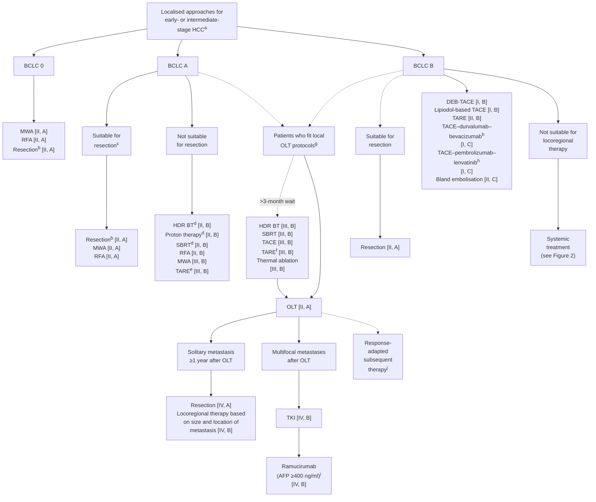
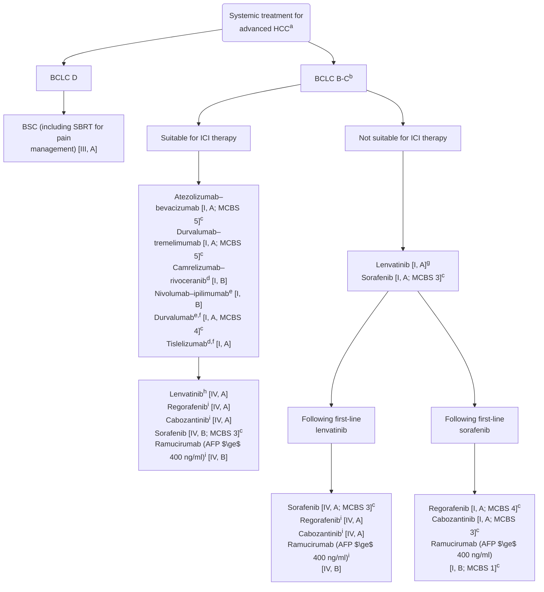

ESMO GOOD SCIENCE BETTER MEDICINE BEST PRACTICE
ANNALS OF ONCOLOGY DRIVING INNOVATION IN ONCOLOGY

# SPECIAL ARTICLE

# Hepatocellular carcinoma: ESMO Clinical Practice Guideline for diagnosis, treatment and follow-up☆

A. Vogel1,2,3, S. L. Chan4, L. A. Dawson5,6, R. K. Kelley7, J. M. Llovet8,9,10, T. Meyer11,12, J. Ricke13, L. Rimassa14,15, G. Sapisochin16, V. Vilgrain17,18, J. Zucman-Rossi19 & M. Ducreux20,21, on behalf of the ESMO Guidelines Committee*

1Department of Gastroenterology, Hepatology and Endocrinology, Hannover Medical School, Hannover, Germany; 2Division of Hepatology, Toronto General Hospital, Toronto; 3Division of Medical Oncology, Princess Margaret Cancer Centre, Toronto, Canada; 4State Key Laboratory of Translational Oncology, Department of Clinical Oncology, Sir YK Pao Centre for Cancer, Prince of Wales Hospital, The Chinese University of Hong Kong, Hong Kong, China; 5Radiation Medicine Program, Princess Margaret Cancer Centre, University Health Network, Toronto; 6Department of Radiation Oncology, University of Toronto, Toronto, Canada; 7Helen Diller Family Comprehensive Cancer Center, University of California, San Francisco; 8Mount Sinai Liver Cancer Program, Division of Liver Diseases, Icahn School of Medicine at Mount Sinai, New York, USA; 9Liver Cancer Translational Research Group, Liver Unit, Institut d’Investigacions Biomèdiques August Pi i Sunyer (IDIBAPS), Hospital Clínic, Universitat de Barcelona, Barcelona; 10Institució Catalana de Recerca i Estudis Avançats (ICREA), Barcelona, Spain; 11Department of Oncology, Royal Free Hospital, London; 12UCL Cancer Institute, University College London, London, UK; 13Klinik und Poliklinik für Radiologie, Ludwig-Maximilians-Universität München, Munich, Germany; 14Department of Biomedical Sciences, Humanitas University, Pieve Emanuele, Milan; 15Medical Oncology and Hematology Unit, Humanitas Cancer Center, IRCCS Humanitas Research Hospital, Rozzano, Milan, Italy; 16Department of Surgery, University of Toronto, Toronto, Canada; 17Centre de Recherche sur l’Inflammation U 1149, Université Paris Cité, Paris; 18Department of Radiology, Beaujon Hospital, APHP Nord, Clichy; 19Centre de Recherche des Cordeliers, Université Paris Cité, Sorbonne Université, INSERM, Paris; 20INSERM U1279, Université Paris-Saclay, Villejuif; 21Department of Cancer Medicine, Gustave Roussy, Villejuif, France

Available online 20 February 2025

> **Key words:** diagnosis, guideline, hepatocellular carcinoma (HCC), imaging, treatment

## INCIDENCE AND EPIDEMIOLOGY

Liver cancer is the sixth most common cancer and the third leading cause of cancer deaths globally.1,2 Hepatocellular cancer (HCC) accounts for 80% of the global liver cancer burden, with >900 000 new cases and an age-standardised rate of 7.3 per 100 000 in 2020.2 Over the past two decades, there has been a reduction in the incidence of HCC in Asian countries including Japan, China and Korea,3 but incidence is rising in Europe and North America.4,5 HCC shows a strong male preponderance and incidence increases progressively with advancing age.2 Information on the aetiology of HCC is available in Supplementary Material Section 1, available at https://doi.org/10.1016/j.annonc.2025.02.006.

### Recommendations

* Due to the association of HCC with chronic liver disease, universal vaccination at birth against hepatitis B virus (HBV) [II, A] and early antiviral treatment for HBV and hepatitis C virus (HCV) [III, A] are recommended.
* Antiviral therapy is recommended in all patients with active HBV who are diagnosed with HCC [II, A].
* Direct-acting antiviral therapy is generally recommended for patients with active HCV who are diagnosed with HCC, but the timing should be individualised [IV, B].

## SURVEILLANCE

Surveillance of HCC involves the repeated application of screening tools in patients at risk for HCC and aims to reduce mortality. The success of surveillance is influenced by the incidence of HCC in the target population, availability and acceptance of efficient diagnostic tests and availability of effective treatment. Surveillance for HCC can be considered when the annual risk of HCC is >1% per year in patients with cirrhosis and >0.2% per year in those without cirrhosis.6 In Asian patients, serum HBV DNA >10 000 copies/ml has been associated with a higher annual risk of HCC compared with patients with a lower viral load.7 The PAGE-B score estimates the risk of HCC in patients with chronic HBV receiving entecavir or tenofovir, based on age, sex and platelet count.8 Patients with HCV and advanced fibrosis remain at increased risk for HCC even after achieving sustained virological response following antiviral treatment and should, therefore, remain in a surveillance programme.9

Liver ultrasound (US) is a standard tool for HCC surveillance but has limited sensitivity and specificity, particularly

---
\*Correspondence to: ESMO Guidelines Committee, ESMO Head Office, Via Ginevra 4, CH-6900 Lugano, Switzerland
E-mail: clinicalguidelines@esmo.org (ESMO Guidelines Committee).

☆Note: Approved by the ESMO Guidelines Committee: October 2018, last update February 2025. This publication supersedes the previously published version—Ann Oncol. 2018;29(suppl 4):IV238-IV255.

0923-7534/© 2025 European Society for Medical Oncology. Published by Elsevier Ltd. All rights are reserved, including those for text and data mining, AI training, and similar technologies.

Volume 36 ■ Issue 5 ■ 2025 https://doi.org/10.1016/j.annonc.2025.02.006 491

Annals of Oncology
A. Vogel et al.

in livers with significant steatosis.10 In Western countries and less experienced centres, the sensitivity of US for identifying early-stage HCC is considerably lower than in more experienced centres.11 Adding measurement of serum $\alpha$-fetoprotein (AFP) to US can provide an improvement in the early HCC detection rate, but at the price of false-positive results.12 Cell-free DNA-based liquid biopsies have shown encouraging preliminary results for the early detection of HCC but remain to be prospectively validated.13 A randomised controlled trial (RCT) compared surveillance (US and serum AFP measurements every 6 months) with no surveillance in Chinese patients with chronic HBV infection.14 Despite low compliance with the surveillance programme (55%), HCC-related mortality was reduced by 37% in the surveillance arm. Regarding the most appropriate surveillance interval, a randomised study comparing 3- and 6-month schedules did not report any differences in detection of early HCC.15

### Recommendations

* Surveillance for HCC is recommended in all patients with cirrhosis, irrespective of its aetiology, if liver function and comorbidities allow tumour treatment [II, A].
* HCC surveillance is recommended for patients with chronic HBV infection and a moderate or high HCC risk score (e.g. PAGE-B) at the onset of nucleoside analogue therapy [II, A].
* HCC surveillance should include abdominal US (or multi-phase cross-sectional imaging if available) every 6 months, with or without AFP evaluation [II, A].
* Liquid biopsy and analysis of circulating tumour DNA (ctDNA) cannot be recommended for HCC surveillance [IV, D].

# DIAGNOSIS, PATHOLOGY AND MOLECULAR BIOLOGY

## Diagnosis

Diagnosis methods vary according to clinical context and whether the patient is at risk for HCC (Supplementary Table S1, available at https://doi.org/10.1016/j.annonc.2025.02.006). High-risk patients include those with cirrhosis and chronic HBV infection. In such settings, non-invasive imaging-based criteria on computed tomography (CT), magnetic resonance imaging (MRI) or contrast-enhanced US (CEUS) can provide a diagnosis without formal pathological proof; therefore, technique optimisation is critical.

For diagnosis of HCC, multiphasic CT and MRI follow the technical recommendations of the CT and MRI Liver Imaging Reporting and Data System (LI-RADS)® v2018. Any magnetic resonance (MR) contrast agent may be used. Multiphasic MRI offers several advantages over CT, including depiction of more ancillary features favouring the diagnosis of HCC or other malignancies, such as fat in mass, moderate T2 hyperintensity and restricted diffusion. It also allows hepatocyte function measurement using hepatobiliary contrast agents; internalisation of hepatobiliary MR contrast agents is mediated by organic anionic transporting polypeptides expressed on the sinusoidal membrane of functional hepatocytes and loss of hepatocellular function occurs early during hepatocarcinogenesis, before tumour neoangiogenesis.16 If imaging criteria are not met on the first imaging examination (e.g. CT), repeat imaging can be considered after 3 months for lesions $\le$1 cm. For larger lesions, imaging should be repeated using a different modality (e.g. MRI) or a biopsy should be carried out. Further details on diagnostic imaging for HCC are available in Supplementary Material Section 2 and Table S2, available at https://doi.org/10.1016/j.annonc.2025.02.006.

## Pathology

The increasing number of HCCs related to metabolic dysfunction-associated steatotic liver disease in the absence of cirrhosis can make diagnosis challenging, as it can be difficult to discriminate between HCC and other liver tumours, particularly less common primary malignant liver tumours such as cholangiocarcinoma, combined hepatocholangiocarcinoma and fibrolamellar HCC.17 Furthermore, differential diagnosis between HCC and benign nodules may be difficult and pathological examination is required to rule out high- or low-grade cirrhotic dysplastic nodules and hepatocellular adenoma, particularly for lesions that are difficult to resect.18 A precise differential diagnosis is, therefore, important since non-HCC patients require specific management and therapeutic strategies.

In the case of specific risk factors for HCC, a biopsy of the non-tumour liver tissue and/or specialised molecular and genetic tests can optimise surveillance of the patient and their relatives. Patients with undiagnosed genetic disease and a mild phenotype (particularly those with a familial context of liver disease or tumour) could benefit from genetic counselling and tests for metabolic diseases (e.g. haemochromatosis, alpha-1 antitrypsin deficiency, porphyria, maturity-onset diabetes of the young). Paired tumour and non-tumour liver biopsy should be carried out in an expert centre by an experienced radiologist or hepatologist using an 18-gauge needle to minimise side-effects such as bleeding and tumour seeding, which are rare.19 Panels of immunohistochemistry markers can help assess diagnosis, prognosis and specific subtypes of tumours.

## Molecular biology

HCC is a heterogeneous disease that includes various pathological and molecular subtypes. Molecular classifications have shown that the varied natural history at the origin of each subtype can be identified by mutations in cancer driver genes, including *TERT*, *TP53*, *CTNNB1*, *ARID1A*, *RB1*, *FGF19* and *CCND1*.20 These oncogenic defects are translated in molecular classification, enabling categorisation of HCC in more homogeneous subgroups according to their specific proliferative rate, level of differentiation and signalling pathway activation. Recent proof-of-concept studies have shown that molecular-guided therapy using next-generation sequencing (NGS) is feasible; some patients

492 https://doi.org/10.1016/j.annonc.2025.02.006 Volume 36 ■ Issue 5 ■ 2025

A. Vogel et al.
Annals of Oncology

progressing after first-line treatment may benefit from this approach to define a second-line targeted therapy based on molecular subtyping.21

## Recommendations

### Diagnosis
* Diagnostic work-up for HCC should include history, clinical examination, laboratory analysis, imaging and tumour biopsy [III, A].
* An HCC diagnosis should be based on histological analysis and/or contrast-enhanced imaging findings [III, A].
* For diagnosis by CT or MRI in patients at high risk for HCC, imaging features including tumour size, non-rim arterial phase hyperenhancement (APHE), peripheral washout, enhancing capsule and tumour growth can be combined [IV, B].
* For diagnosis by CEUS in patients at high risk for HCC, imaging features including non-rim APHE with late-onset (>60 seconds) and mild washout can be combined [IV, B].

### Pathology
* In patients without cirrhosis at low risk or without known risk factors for HCC, histopathological confirmation (obtained via tumour biopsy from the liver or metastatic site, if present) is recommended for diagnosis [IV, A].
* In patients with advanced HCC, histopathological diagnosis of HCC is recommended before initiating systemic therapy [III, A].
* NGS should be carried out for tumours with mixed histology features [IV, A].

### Molecular biology
* To facilitate biomarker development, tumour biopsy is recommended for all patients included in clinical trials [IV, A].
* Systematic germline genetic tests cannot be routinely recommended at diagnosis [IV, D], except in rare cases of familial HCC or suspicion of genetic liver diseases after genetic counselling [IV, B].
* Liquid biopsy and analysis ctDNA cannot be recommended in routine clinical practice for the diagnosis of HCC [IV, D].

# STAGING AND RISK ASSESSMENT

Staging is important to determine the optimal treatment strategy; it includes assessment of tumour extent, liver function, portal hypertension, AFP and clinical performance status (PS).

Contrast-enhanced MRI (CEMRI) or contrast-enhanced CT (CECT) can assess tumour extent, including the number and size of nodules, vascular invasion and extrahepatic spread. CT scans of the chest, abdomen and pelvis can exclude extrahepatic spread. Routine preoperative bone scintigraphy for detecting asymptomatic skeletal metastases in patients with resectable HCC lacks justification, and its utility in advanced HCC remains undetermined.22 Despite evidence linking higher [18F]2-fluoro-2-deoxy-D-glucose (FDG) uptake in FDG–positron emission tomography (PET) scans with poor differentiation, tumour size, serum AFP levels and microvascular invasion, FDG–PET is not a routine staging modality; however, it may be useful in selected cases to further characterise CT or MRI findings.23,24

Liver function is assessed using the Child–Pugh (serum bilirubin, serum albumin, ascites, prothrombin time and hepatic encephalopathy) and/or albumin-bilirubin (ALBI) scoring systems.25 In the context of orthotopic liver transplantation (OLT), the Model of End Stage Liver Disease with sodium (MELD-Na) score (incorporating serum creatinine, serum bilirubin, international normalised ratio and serum sodium) is used to prioritise patients on waiting lists. Over 90% of ALBI grade 1 HCCs are Child–Pugh A5, while ALBI grade 2 comprise a high proportion of Child–Pugh A6.26 The Baveno VII criteria classify portal hypertension using indirect (oesophageal varices and/or splenomegaly, blood platelet count <100 × 109 cells/l) or invasive measures (transjugular hepatic-venous pressure gradient >10 mmHg).27 Patients with portal hypertension and advanced liver fibrosis or cirrhosis should undergo regular oesophagogastroduodenoscopy according to national and international guidelines.

Staging systems that incorporate the above-mentioned items include TNM (tumour–node–metastasis), Okuda, Cancer of the Liver Italian Program, Japanese Integrated Staging score and the Barcelona Clinic Liver Cancer (BCLC) system. The eighth edition of the Union for International Cancer Control TNM classification (Supplementary Table S3, available at https://doi.org/10.1016/j.annonc.2025.02.006) provides a means of standardising histopathological reports in patients treated with resection or transplantation.28,29 The BCLC algorithm is the most prevalent staging system, categorising HCC into five clinical stages: very early stage (BCLC 0), early stage (BCLC A), intermediate stage (BCLC B), advanced stage (BCLC C) and terminal stage (BCLC D).30 Median overall survival (OS) with therapeutic interventions is >5 years for stages 0 and A, 2.5 years for stage B, 2 years for stage C and 3 months for stage D.30 Although the aetiology of concurrent liver disease has not been established as an independent predictive or prognostic factor, identifying and addressing treatable underlying liver conditions is relevant. For example, initiating antiviral therapy for HBV and HCV, administering corticosteroids for autoimmune hepatitis or cessation of alcohol consumption may lead to substantial improvements in liver function and prognosis.

## Recommendations

* HCC staging is recommended for optimal therapy planning and should include assessment of tumour extent, liver function, portal hypertension, AFP and PS [III, A].

Volume 36 ■ Issue 5 ■ 2025
https://doi.org/10.1016/j.annonc.2025.02.006
493

Annals of Oncology
A. Vogel et al.

* FDG-PET cannot be recommended as a routine staging modality [III, D], but may be appropriate in selected cases to further characterise findings on CT or MRI [IV, C].
* Liver function should be assessed by the Child–Pugh and/or ALBI scoring systems [III, A]. MELD-Na should be used to assign priority to liver transplant candidates [IV, A].
* Portal hypertension should be assessed according to the Baveno VII criteria by indirect measures or invasively via the transjugular route [III, A].
* BCLC is the recommended staging system for prognostic prediction and treatment allocation [IV, A].

# MANAGEMENT OF EARLY (BCLC 0-A)- OR INTERMEDIATE (BCLC B)-STAGE HCC

Multidisciplinary decision making (taking into account anatomical complexity, comorbidities, underlying liver dysfunction and heterogeneous tumour biology) is associated with improved HCC outcomes. Liver resection, OLT and local thermal and radiation ablative therapies comprise potentially curative treatment modalities. The predominant arterial vascularisation of HCC is well suited for intra-arterial administration of chemotherapy (ChT), embolising material or radioactive particles to shrink tumours; these therapies are considered palliative but may lead to complete tumour destruction. An algorithm for the management of early- or intermediate-stage HCC is shown in Figure 1.

## Liver resection

Solitary tumours (irrespective of tumour size) should be resected in patients with well-preserved liver function, provided resection with no tumour at the margin (R0) can be achieved. Patients with Child–Pugh C liver function are not suitable for resection. A recent meta-analysis demonstrated that the presence of portal hypertension is not an absolute contraindication for resection.31 Compared with open surgery, minimally invasive surgery via robotic or laparoscopic resection results in reduced intra-operative blood loss, faster post-operative recovery and similar oncological outcomes.32 Well-selected patients with unilobar multifocal disease or peripheral macrovascular invasion (Vp1-Vp2) may benefit from resection; however, there is no high-level evidence to recommend this.33,34

After resection, tumours recur in 50%-70% of patients within 5 years. Recurrence risk depends on a combination of clinical and pathological features, including multifocality, tumour size, histological differentiation, presence of vascular invasion and elevation of pre- and post-operative serum AFP.35,36 Removal of the hepatic segment via anatomic resection (AR) is considered more effective than non-anatomical wedge resection (NAR) in terms of tumour clearance and eradication of micrometastases. In patients with HCC and cirrhosis, AR may not be possible and a tissue-sparing NAR favoured to reduce the risk of post-operative liver failure.37 No clear recommendation for AR or NAR can be given in the absence of high-level evidence.

## Thermal tumour ablation

In tumours <2 cm, radiofrequency ablation (RFA) has demonstrated similar outcomes to resection and is less invasive.38 In early-stage HCC, ablation has been adopted as an alternative first-line option to resection.39,40 Microwave ablation (MWA) has evolved as a popular choice over RFA based on the shorter intervention time, lower susceptibility to cooling effects and potentially superior results for tumours ≤5 cm.41 Thermal ablation has limitations, including heat sink for tumours adjacent to vessels, which reduces local control, and toxicity risk in tumours adjacent to the gallbladder, intestines, liver hilum or bile ducts, which may be mitigated with laparoscopic approaches.42 There is no role for chemical tumour ablation (e.g. ethanol injection) since thermal ablation has better outcomes.

## Adjuvant treatment after liver resection or ablation in high-risk patients

The phase III STORM trial evaluated adjuvant sorafenib versus placebo after resection or ablation of HCC in patients at intermediate or high risk of recurrence.43 There was no difference in recurrence-free survival (RFS) between the treatment arms. The role of adjuvant immune checkpoint inhibitor (ICI)-based therapies has also been studied in selected high-risk patients. The phase III IMbrave050 trial compared adjuvant atezolizumab–bevacizumab for 12 months versus active surveillance after resection or ablation in patients with high-risk features [single tumour >5 cm, multinodular disease, high serum AFP levels, poor differentiation, presence of microvascular invasion or segmental macrovascular invasion (Vp1-Vp2)].44 Although the primary endpoint (RFS) was met at the first interim analysis, the second interim analysis revealed that the benefit was not sustained over time.45 OS was immature at the time of interim analyses.

## Liver transplantation

OLT can cure both HCC and the underlying liver disease; this approach is associated with the best OS (median 10 years) and RFS outcomes. The Milan criteria (one lesion <5 cm or three or fewer lesions, each <3 cm; no extrahepatic manifestations; no evidence of macrovascular invasion) are currently the standard for selecting patients with HCC for OLT.46 Among more liberal proposals [e.g. University of California San Francisco (UCSF) criteria, extended Toronto criteria], only the UCSF criteria (one tumour ≤6.5 cm or three or fewer nodules with the largest ≤4.5 cm and total tumour diameter ≤8 cm) have been prospectively validated and show similar outcomes.46 The XXL RCT compared OLT with locoregional therapy in patients with an expected 5-year OS rate of >50% according to the Metroticket 2.0 criteria.47 The study closed early due to improved outcomes in the OLT arm [hazard ratio (HR) 0.32, 95% confidence interval 0.11-0.92, P = 0.035]. With improved therapies to

494 https://doi.org/10.1016/j.annonc.2025.02.006 Volume 36 ■ Issue 5 ■ 2025

A. Vogel et al.
Annals of Oncology

**Figure 1. Management of early- or intermediate-stage HCC.**
Purple: algorithm title; orange: surgery; blue: systemic anticancer therapy or their combination; turquoise: non-systemic anticancer therapies or combination of treatment modalities; white: other aspects of management and non-treatment aspects; dashed lines: optional therapy.
AFP, α-fetoprotein; BCLC, Barcelona Clinic Liver Cancer; DEB-TACE, doxorubicin-eluting beads transarterial chemoembolisation; EMA, European Medicines Agency; FDA, Food and Drug Administration; HCC, hepatocellular carcinoma; HDR BT, high-dose rate brachytherapy; ICI, immune checkpoint inhibitor; MDT, multidisciplinary team; MWA, microwave ablation; OLT, orthotopic liver transplantation; RFA, radiofrequency ablation; SBRT, stereotactic body radiotherapy; TACE, transarterial chemoembolisation; TARE, transarterial radioembolisation; TKI, tyrosine kinase inhibitor; UCSF, University of California San Francisco.
aMDT management is strongly recommended [II, A].
bSingle tumour >2 cm and no evidence of portal hypertension. Liver resection is also recommended for patients with Child–Pugh A liver function without significant portal hypertension or other contraindications [III, A] and can be considered for well-selected patients with stable Child–Pugh B liver function and/or a minor degree of portal hypertension, with careful consideration of risk of decompensation [III, B].
cThe choice of resection or ablation should consider technical limitations and should be discussed by an MDT [III, A].
dIf unsuitable for or recurrent following thermal ablation.
eSingle tumours ≤8 cm.
fTARE is recommended over TACE for small tumours [II, A].
gOLT is recommended for patients that fit the Milan criteria, when a recurrence rate of <10% and a 5-year survival rate of 70% are expected [II, A] but UCSF criteria can also be considered [III, B]. OLT can be recommended over locoregional therapy in patients with an expected 5-year survival rate >50% [II, B].
hNot EMA or FDA approved.
iOnly EMA and FDA approved for use after first-line sorafenib.
jOLT can be considered in transplant-eligible patients with liver-limited disease following downstaging with systemic therapy, including ICIs, although there may be a higher risk for acute rejection with shorter time since last dose [IV, C].

downstage or downsize HCC, several groups are developing less stringent criteria while reporting excellent outcomes.

The low availability of liver allografts is a major limitation for OLT, resulting in long waiting times and the associated risk of progression. Transarterial chemoembolisation (TACE), transarterial radioembolisation (TARE), radiotherapy (RT) and thermal ablation have been shown to minimise the risk of tumour progression during the waiting period.48

Small, single-institution case series suggest that patients with localised HCC who achieve a prolonged response with ICI-based systemic therapy may be candidates for OLT, although prospective data are limited.49,50 Receipt of an ICI within a shorter timeframe before transplantation may be associated with a higher risk of acute allograft rejection. A United Network for Organ Sharing policy update in 2022 clarified that “the use of immunotherapy does not preclude consideration for an HCC exception”.51

There is no established role for adjuvant therapy after OLT. A randomised phase III trial of patients who had undergone OLT for HCC reported no significant improvement in RFS following adjuvant mammalian target of rapamycin (mTOR)-based immunosuppression versus non-mTOR-based

Volume 36 ■ Issue 5 ■ 2025
https://doi.org/10.1016/j.annonc.2025.02.006
495

Annals of Oncology
A. Vogel et al.

immunosuppression,52 although subgroup analyses suggested a benefit in patients with elevated AFP and HCV-associated HCC.53

For HCC recurrence or a new diagnosis after OLT, treatment depends on the location and extent of disease. They include resection, stereotactic body RT (SBRT), proton therapy, image-guided high-dose-rate (HDR) brachytherapy, thermal ablation or other locoregional therapies for solitary recurrence or metastases and tyrosine kinase inhibitors (TKIs) for multifocal recurrence or metastases. ICIs are relatively contraindicated due to the risk of acute rejection and fatal allograft loss.54-58

## RT

For HCC that is not suitable for (or is recurrent following) thermal ablation, SBRT,59 proton therapy60 and image-guided HDR brachytherapy61 are alternative options. RT may be delivered in one or few treatment fractions for HDR brachytherapy, one to five fractions for SBRT and 5-15 fractions for proton therapy, with favourable safety profiles and tumour control rates >80% at 2-5 years for tumours $\leq$12 cm in diameter.59,60,62 Unlike thermal ablation, RT is not limited by adjacency to large vessels, exophytic growth or central location, and it is less size-dependent. RT is less appropriate for tumours adjacent to luminal gastrointestinal organs. In a phase III randomised trial, proton therapy was non-inferior to thermal ablation regarding local progression-free survival (PFS) for tumours <3 cm.60 In a propensity-matched study, the risks of death and progression were higher following TACE versus HDR brachytherapy.62

## Transarterial therapies

Near-exclusive arterial vascularisation of HCC has led to use of intra-arterial ChT either alone or mixed with lipiodol (which is selectively retained by HCC nodules), embolising material (gelatine sponge pieces or polyvinyl alcohol-calibrated particles) or radioactive beads containing yttrium-90 ($^{90}$Y). Absolute contraindications for transarterial therapies are decompensated cirrhosis or extensive tumour burden. Relative contraindications include bile duct occlusion or incompetent papilla, reduced PS, impaired liver function (Child–Pugh $\geq$B) and high-risk oesophageal varices, as well as portal vein thrombosis for TACE.63

**TACE.** The benefit of TACE in prolonging OS has been demonstrated in selected asymptomatic patients with maintained liver function, BCLC A or early BCLC B disease and a low tumour burden not amenable to surgery or ablation.64 A median OS of 30-45 months can be expected in this population.65 Staged approaches and meticulous liver-sparing techniques have proven decisive for good patient outcomes.66 Poor outcomes have been reported following TACE in patients with Child–Pugh B disease, portal vein invasion, high tumour burden or deteriorating liver function.67-69 Several scores have been developed to identify patients that can benefit from TACE. The hepatoma arterial embolisation prognostic score defines four distinct prognostic groups with respect to OS.67 The TACE Predict model similarly identifies four risk groups, including those undergoing TACE repetition, where response is an additional variable.70

Compared with conventional TACE, doxorubicin-eluting beads (DEB)-TACE is associated with fewer side-effects related to systemic doxorubicin exposure.71 Three randomised phase II trials have compared conventional TACE with bland embolisation72-74; none reported clinical benefit with the addition of ChT and non-inferiority was not formally proven. The optimal duration and frequency of TACE is not defined.

No clinically meaningful benefit has been shown for systemic therapy with TKIs (sorafenib, brivanib or orantinib) in combination with or following TACE compared with TACE alone.75-78 A small, prospective, randomised study and a meta-analysis of RCTs evaluating TACE–lenvatinib demonstrated improved rates of radiographic response but higher rates of toxicity.79,80 EMERALD-1 reported improved PFS by adding durvalumab–bevacizumab to TACE in patients with early- and intermediate-stage HCC.81 Similarly, LEAP-012 demonstrated improved PFS with TACE–pembrolizumab–lenvatinib versus TACE–placebo.82 While no OS data have been reported for EMERALD-1, TACE–pembrolizumab–lenvatinib was not associated with improved OS at first interim analysis of LEAP-012.82 In EMERALD-1, the rate of any grade 3-4 adverse events (AEs) increased from 23% in patients receiving TACE–placebo to 45.5% in those receiving TACE–durvalumab–bevacizumab.81 The rate of grade 5 AEs increased from 5.5% with TACE–placebo to 10.4% with TACE–durvalumab–bevacizumab. Similarly, the rate of grade $\geq$3 AEs increased from 31% with TACE–placebo to 71% with TACE–pembrolizumab–lenvatinib in LEAP-012.82 Considering the immature OS data and increased risk of toxicity, shared decision making is recommended when considering adding durvalumab–bevacizumab or pembrolizumab–lenvatinib to TACE in patients with intermediate-stage HCC.

**TARE.** TARE (injection of $^{90}$Y-loaded microspheres into the liver via the hepatic artery with no or minimal ischaemia) has demonstrated tumour response and high disease control rates with an acceptable safety profile in phase II studies and registries.83 LEGACY and RASER reported clinically meaningful response rates after selective or segmental TARE (radiation segmentectomy) in single tumours $\leq$8 cm.84,85 Use of TARE is based on successful selective tumour uptake during angiographic technetium-99m macroaggregated albumin evaluation to preserve liver function.86

Phase II RCTs have compared TARE with TACE in early- and intermediate-stage HCC, reporting favourable time to progression (TTP) with TARE over TACE.87,88 The TRACE trial was halted at interim analysis as the HR for TTP (primary endpoint) was <0.39 in favour of TARE.89 Median OS was 30.2 months with TARE and 15.6 months with DEB-TACE (HR 0.48). Details of trials comparing TARE with sorafenib

496 https://doi.org/10.1016/j.annonc.2025.02.006 Volume 36 ■ Issue 5 ■ 2025

A. Vogel et al. Annals of Oncology

are provided in Supplementary Material Section 3, available at https://doi.org/10.1016/j.annonc.2025.02.006.

# Recommendations

* Multidisciplinary team (MDT) management is strongly recommended for patients with early- and intermediate-stage HCC [II, A].

## Liver resection

* Liver resection is recommended for patients with a single tumour >2 cm and no evidence of portal hypertension (BCLC 0 to A) [II, A].
    - Liver resection is recommended for patients with Child–Pugh A liver function without significant portal hypertension or other contraindications [III, A]
    - Liver resection can be considered for well-selected patients with stable Child–Pugh B liver function and/or a minor degree of portal hypertension, with careful consideration of the risk of decompensation [III, B].
* Liver resection is recommended as an option in patients with intermediate-stage HCC (BCLC B) who are not suitable for intra-arterial therapies [II, A].
* In patients with liver cirrhosis, minimally invasive resection is the recommended method [III, A].

## Thermal tumour ablation

* MWA or RFA is recommended in very early-stage HCC (BCLC 0) [II, A].
* MWA or RFA is recommended as an alternative to resection in early-stage HCC (BCLC A) [II, A].
    - The choice of resection or ablation should consider technical limitations and should be discussed by an MDT [III, A].
* MWA or RFA can be recommended for solitary tumours 3-5 cm in diameter or multifocal disease (three or fewer tumours ≤3 cm) (BCLC A) in patients who are not candidates for surgical resection or as a bridge to OLT [II, B].

## Adjuvant treatment

* Adjuvant systemic treatment with TKIs or ICI-based combinations after resection or ablation is not recommended [I, E].
* Adjuvant anticancer therapy is not recommended following OLT [IV, E].

## Liver transplantation

* OLT is recommended for patients that fit the Milan criteria, when a recurrence rate of <10% and a 5-year survival rate of 70% are expected [II, A].
* UCSF criteria can also be considered in patients with HCC beyond the Milan criteria [III, B].
* OLT can be recommended over locoregional therapy in patients with an expected 5-year OS rate >50% [II, B].
* When a prolonged waiting time (>3 months) is anticipated, patients can be offered local HDR brachytherapy, SBRT, TACE, TARE or thermal ablation as a bridge to OLT [III, B]. TARE is recommended over TACE for small tumours in patients waiting for OLT [II, A].
* OLT can be considered in transplant-eligible patients with liver-limited disease following downstaging with systemic therapy, including ICIs, although there may be a higher risk for acute rejection with shorter time since last dose [IV, C].
* Switching to mTOR inhibitors cannot be routinely recommended in patients undergoing OLT for HCC [I, D].
* For patients with solitary metastases occurring ≥1 year after OLT, resection is recommended [IV, A]. Locoregional therapy can also be recommended based on size and location of the metastasis [IV, B].
* TKIs can be recommended as first-line systemic therapy for patients with multifocal HCC recurrence or metastases after OLT [IV, B].
* Ramucirumab can be considered after TKI for patients with AFP ≥400 ng/ml [IV, B; only European Medicines Agency (EMA) and Food and Drug Administration (FDA) approved after first-line sorafenib].

## RT

* In early-stage HCC, SBRT, proton therapy and image-guided HDR brachytherapy can be considered as alternatives to thermal ablation for tumours that are not well suited for or are recurrent following thermal ablation (BCLC A) [II, B].

## Transarterial therapies

* In single tumours ≤8 cm, selective or segmental TARE can be an alternative option for patients who are unfavourable for resection (BCLC A) [III, B].
* DEB-TACE or conventional lipiodol-based TACE can be recommended for patients with intermediate-stage HCC (BCLC B), although DEB-TACE can minimise the systemic side-effects of ChT [I, B].
* TARE [II, B] or bland embolisation [II, C] can be considered as alternatives to TACE in intermediate-stage HCC (BCLC B).
* TACE—durvalumab—bevacizumab or TACE—pembrolizumab—lenvatinib may be considered in patients with intermediate-stage HCC (BCLC B), but the long-term benefit has not been established [I, C; not EMA or FDA approved].
* The combination of TACE with a TKI is not recommended [I, E].
* If substantial necrosis is not achieved after the second session, TACE treatment should be stopped [III, A].
* Outside of clinical trials, therapeutic algorithms based on prognostic scores of unknown predictive value cannot be recommended for selecting patients for initial and repeated TACE [III, D].
* Modified RECIST (mRECIST) criteria should be used to assess the efficacy of locoregional therapies in intermediate-stage HCC [III, A].

Volume 36 ■ Issue 5 ■ 2025 https://doi.org/10.1016/j.annonc.2025.02.006 497

Annals of Oncology
A. Vogel et al.

# MANAGEMENT OF ADVANCED HCC

Systemic therapy is recommended for patients with intermediate-stage disease who are not suitable for, or who have progressed despite, local therapies (BCLC B) and for patients with advanced HCC and good liver function (BCLC C). An algorithm for systemic treatment of advanced HCC is shown in Figure 2. External beam RT (EBRT) has demonstrated benefits in patients with painful bone metastases or hepatic pain due to high HCC burden.90

## First-line treatment

**Atezolizumab—bevacizumab.** IMbrave150, which evaluated atezolizumab—bevacizumab in unresectable HCC, was the first phase III study to demonstrate a survival advantage for any agent over sorafenib. Median OS was 19.2 months with atezolizumab—bevacizumab versus 13.4 months with sorafenib (HR 0.66).91 Atezolizumab—bevacizumab achieved an objective response rate (ORR) of 30% versus 11% with sorafenib, including an 8% complete response rate with atezolizumab—bevacizumab versus <1% with sorafenib.91 Treatment-related grade 3-4 AEs were consistent with the known side-effects of each drug and were comparable between arms. There was also a notable delay in the deterioration of quality of life measures in the atezolizumab—bevacizumab group compared with the sorafenib group.92 Due to the increased risk of bleeding associated with bevacizumab, endoscopies were required within 6 months before enrolment.92 ORIENT-32, evaluating a bevacizumab biosimilar in combination with the anti-programmed cell death protein 1 (PD-1) inhibitor sintilimab, has provided confirmatory evidence for the findings of IMbrave150 in an exclusively Chinese population.93

**Durvalumab—tremelimumab.** HIMALAYA was the first trial to report the effectiveness of dual ICI therapy. The study compared durvalumab—tremelimumab, durvalumab monotherapy and sorafenib monotherapy.94 Improved median OS was observed with the single tremelimumab regular interval durvalumab (STRIDE) regimen (tremelimumab 300 mg in one dose plus durvalumab 1500 mg every 4 weeks) compared with sorafenib alone (16.4 versus 13.8 months; HR 0.78).94 The trial also demonstrated that durvalumab monotherapy was non-inferior to sorafenib (secondary endpoint; median OS 16.6 versus 13.8 months; HR 0.86).94 STRIDE and durvalumab monotherapy resulted in 5-year OS rates of 19.6% and 14.4%, respectively, compared with 9.4% for sorafenib.95 Treatment-related AEs (TRAEs) of any grade were less common with durvalumab versus sorafenib, but serious TRAEs occurred with similar frequency.94 Adding tremelimumab doubled serious TRAEs, including immune AEs (35.8% in the durvalumab—tremelimumab arm versus 16.5% in the durvalumab monotherapy arm across all grades). Grade 3-4 AEs occurred in 12.5% of patients in the durvalumab—tremelimumab arm versus 6.4% in the durvalumab monotherapy arm. High-dose steroids were required to treat immune AEs in 20.1% of patients receiving durvalumab—tremelimumab compared with 9.5% receiving durvalumab monotherapy.

**Nivolumab—ipilimumab.** Nivolumab—ipilimumab versus lenvatinib (in 90% of patients) or sorafenib was evaluated in the global phase III CheckMate-9DW study.96 OS was improved with nivolumab—ipilimumab versus TKIs (median OS 23.7 versus 20.6 months; HR 0.79). The OS benefit was generally consistent across patient subgroups; however, the Kaplan—Meier curves crossed after ~12 months, suggesting a potential early detrimental effect of the ICI-based combination. There was no improvement in PFS, but ORR was 36% with nivolumab—ipilimumab compared with 13% for the TKIs. TRAEs of any grade were reported in 84% of patients receiving nivolumab—ipilimumab and 91% of patients receiving a TKI. Grade 3-4 TRAEs, including immune AEs, occurred in 41% and 42% of patients, respectively. Treatment-related death occurred in 4% of patients receiving nivolumab—ipilimumab. Treatment was discontinued in 18% of patients receiving nivolumab—ipilimumab due to AEs and high-dose steroids were required to treat immune AEs in 28%. The B grade of recommendation assigned to nivolumab—ipilimumab reflects the opinion of 66% of authors, whereas 34% favoured an A grade.

**Camrelizumab—rivoceranib.** CARES-310 evaluated the anti-PD-1 antibody camrelizumab and the vascular endothelial growth factor receptor 2-targeted TKI rivoceranib versus sorafenib for the first-line treatment of unresectable HCC.97 To date, this is the only phase III trial to demonstrate significant improvements in both PFS and OS with an ICI—TKI combination versus single-agent TKI in the first-line setting. Median OS was significantly improved with camrelizumab—rivoceranib versus sorafenib (23.8 versus 15.2 months; HR 0.64).98 ORR was also improved with camrelizumab—rivoceranib (27% versus 6% using RECIST v1.1). Grade 3-4 TRAEs occurred in 81% of patients receiving camrelizumab—rivoceranib and in 52% of those receiving sorafenib.97 Common TRAEs included hypertension, hand-foot syndrome and elevated aspartate aminotransferase levels. TRAEs led to discontinuation of camrelizumab in 17.6% and rivoceranib in 16.9% of patients in the camrelizumab—rivoceranib group; discontinuation of both agents occurred in 4.4% of patients. Sorafenib was discontinued due to TRAEs in 4.8% of patients. The B grade of recommendation assigned to camrelizumab—rivoceranib reflects the opinion of 83% of authors, whereas 17% favoured an A grade.

**Tislelizumab.** The phase III RATIONALE-301 trial evaluated tislelizumab, a monoclonal antibody with high affinity and specificity for PD-1, versus sorafenib.99 The primary endpoint of non-inferiority was met with a median OS of 15.9 versus 14.1 months, respectively (HR 0.85). ORR was 14.3% in the tislelizumab arm. Tislelizumab was associated with fewer TRAEs leading to discontinuation (6.2% versus 10.2% with sorafenib) and fewer grade ≥3 TRAEs (22.2% versus 53.4%, respectively).

498 https://doi.org/10.1016/j.annonc.2025.02.006
Volume 36 ■ Issue 5 ■ 2025

A. Vogel et al. Annals of Oncology

**Figure 2. Management of advanced HCC.**
Purple: algorithm title; blue: systemic anticancer therapy or their combination; white: other aspects of management and non-treatment aspects.
AFP, $\alpha$-fetoprotein; BCLC, Barcelona Clinic Liver Cancer; BSC, best supportive care; ECOG, Eastern Cooperative Oncology Group; EMA, European Medicines Agency; FDA, Food and Drug Administration; HCC, hepatocellular carcinoma; ICI, immune checkpoint inhibitor; MCBS, Magnitude of Clinical Benefit Scale; PS, performance status; SBRT, stereotactic body radiotherapy.
aLocoregional therapies may be appropriate for selected patients (see Figure 1).
bPatients with well-preserved liver function and ECOG PS 0-1.
cESMO-MCBS v1.1117 was used to calculate scores for therapies/indications approved by the EMA or FDA. The scores have been calculated and validated by the ESMO-MCBS Working Group and reviewed by the authors (https://www.esmo.org/guidelines/esmo-mcbs/esmo-mcbs-evaluation-forms).
dNot EMA or FDA approved.
eEMA approved, not FDA approved.
fIn patients with contraindications to ICI combinations.
gNon-inferiority established versus sorafenib via ESMO-MCBS v1.1.
hNot EMA or FDA approved for second-line use.
iOnly EMA and FDA approved for use after first-line sorafenib.

**Lenvatinib.** Lenvatinib was compared with sorafenib as first-line therapy in the open-label, global, phase III REFLECT trial.100 The primary endpoint was met, demonstrating non-inferiority for lenvatinib with a median OS of 13.6 months compared with 12.3 months for sorafenib (HR 0.92). The secondary endpoints, however, favoured lenvatinib with a superior ORR (24% versus 9% by mRECIST) and PFS (7.4 versus 3.7 months). There were differences in the AE profile of the two drugs with hypertension, proteinuria, dysphonia and hypothyroidism more common with lenvatinib, while hand-foot syndrome, diarrhoea and alopecia were more common with sorafenib. Subsequently, lenvatinib was used as the control in the phase III LEAP-002 study in which lenvatinib achieved a median OS of 19.0 months.101 Lenvatinib has also been combined with TACE and compared with lenvatinib alone in the open-label LAUNCH trial in China.79 Median OS was 17.8 months with TACE–lenvatinib but only 11.5 months with lenvatinib monotherapy. The global relevance of this study is uncertain.

**Sorafenib.** Sorafenib was the first systemic therapy to demonstrate a survival benefit in advanced HCC in a placebo-controlled phase III trial.102 A confirmatory trial conducted in Asia (including mainly patients with a background of HBV infection) resulted in a similar HR in favour of sorafenib.103 Subsequently, sorafenib has been used as the control arm in multiple trials in the first-line setting, in which the median OS for sorafenib was 13.0-15.5 months, perhaps reflecting the use of second-line agents, patient

Volume 36 ■ Issue 5 ■ 2025 https://doi.org/10.1016/j.annonc.2025.02.006 499

Annals of Oncology
A. Vogel et al.

selection and better management of AEs.104,105 The most common TRAEs are diarrhoea, fatigue, hand-foot syndrome and rash, and around a quarter of patients require dose reduction due to AEs.102

## Second-line treatment

**Regorafenib.** The phase III RESORCE trial compared regorafenib with placebo in patients who had progressed on sorafenib but tolerated sorafenib $\ge$400 mg daily for $\ge$20 of the 28 days before discontinuation.106 Regorafenib was associated with improved OS (median 10.6 versus 7.8 months with placebo; HR 0.63). ORR with regorafenib was 11% by mRECIST and PFS was 3.1 months. Regorafenib was discontinued due to AEs in 25% of patients and the most common grade 3-4 AEs included hypertension, hand-foot syndrome, fatigue and diarrhoea.

**Cabozantinib.** Cabozantinib was compared with placebo in the global, phase III CELESTIAL trial in patients who had received one or two prior therapies including sorafenib.107 Median OS was superior in the cabozantinib arm (10.2 versus 8.0 months with placebo; HR 0.63). PFS was also improved with cabozantinib (5.2 versus 1.9 months). ORR with cabozantinib was 4% by RECIST v1.1. The most common grade 3-4 AEs were hand-foot syndrome, hypertension, fatigue and diarrhoea, and dose reductions were required in 62% of patients. Cabozantinib was subsequently included in COSMIC-312, which evaluated first-line cabozantinib versus sorafenib as a secondary endpoint.105 The final analysis reported a median PFS of 5.8 months for cabozantinib and 4.3 months for sorafenib. In the absence of data demonstrating non-inferior survival, first-line cabozantinib cannot be recommended. A prospective clinical trial of cabozantinib following prior ICI-based regimens reported a median OS of 9.9 months.108

**Ramucirumab.** The phase III REACH trial failed to demonstrate superiority for second-line ramucirumab over placebo in advanced HCC, but a subgroup analysis suggested benefit for patients with serum AFP $\ge$400 ng/ml.109 The subsequent REACH-2 trial restricted enrolment to patients with AFP $\ge$400 ng/ml.110 There was a significant improvement in OS with ramucirumab (median 8.5 versus 7.3 months with placebo; HR 0.71) although absolute survival in both arms was poor, reflecting the adverse prognosis conferred by elevated AFP. ORR by RECIST v1.1 was 5% with ramucirumab.110 Ramucirumab was generally well tolerated; hypertension was the most common grade 3-4 TRAE (8%). The rate of treatment discontinuation due to TRAEs was 11%, and 5% of patients required dose reductions for AEs.

**Immunotherapy.** The FDA granted accelerated approval for second-line nivolumab–ipilimumab and pembrolizumab, based on efficacy data from CheckMate-040 and KEYNOTE-224.111,112 Subsequent phase III trials of second-line pembrolizumab failed to meet their primary endpoints, although the KEYNOTE-394 trial recently reported positive results in an Asian population.104,113 Based on the positive phase III trials, ICI-based combinations are recommended in the first-line setting. There are so far no published data on treatment beyond progression and the continuation of ICI after failure in prior lines.

## ChT

Information on ChT trials in HCC is available in Supplementary Material Section 4, available at https://doi.org/10.1016/j.annonc.2025.02.006.

## Sequencing and decision making for systemic therapy

Systemic therapy selection is influenced by several considerations including efficacy, toxicity, contraindications and predictive factors. Typically, candidates for systemic therapy should have Child–Pugh A liver function and an Eastern Cooperative Oncology Group (ECOG) PS of 0 or 1, consistent with clinical trial patient demographics. The preferred first-line treatment is usually combination therapy including a PD-1 or programmed death-ligand 1 (PD-L1) inhibitor. Direct comparisons between studies should be avoided due to differences in patient populations. All four ICI combinations are, consequently, regarded as viable first-line options, pending approval from the EMA and FDA for nivolumab–ipilimumab and camrelizumab–rivoceranib. Consideration of side-effects is crucial; for instance, as bevacizumab carries an increased risk of variceal bleeding, upper endoscopy is recommended for the diagnosis and treatment of any varices.114 Unlike IMbrave150, HIMALAYA did not require endoscopy; however, it should be noted that patients with advanced portal vein thrombosis classified as Vp4 were excluded from HIMALAYA and CheckMate-9DW, but not from IMbrave150 and CARES-310 (albeit only partial occlusion was permitted in CARES-310). Finally, high rates of TRAEs and treatment discontinuations were observed with nivolumab–ipilimumab and camrelizumab–rivoceranib in pivotal trials. In a network meta-analysis of first-line therapies, camrelizumab–rivoceranib was associated with a significantly higher risk of TRAEs compared with other regimens.115 Overall, all four ICI regimens can be considered as first-line therapy but atezolizumab–bevacizumab should not be given when there is a risk of bleeding.

To date, no validated predictive markers have been identified for ICI therapy in HCC. Initial data suggested potential negative predictive value of non-alcoholic steatohepatitis or non-viral liver disease for ICI efficacy, but this was not confirmed in a meta-analysis of eight randomised trials.116 For patients with contraindications to ICIs, sorafenib or lenvatinib remain suitable first-line treatments.100 Between these two options, lenvatinib is favoured for its higher ORR, better PFS and longer OS in recent phase III trials.96,100,101

In the second-line setting, the only treatments with evidence-based sequencing are regorafenib, cabozantinib or ramucirumab following sorafenib. There is no apparent difference in efficacy between these agents and optimal treatment sequences have yet to be defined, with

500 https://doi.org/10.1016/j.annonc.2025.02.006 Volume 36 ■ Issue 5 ■ 2025

A. Vogel et al.
Annals of Oncology

ramucirumab reserved for patients with AFP >400 ng/ml. The effectiveness of second-line therapies after lenvatinib or ICI combinations remains under investigation. Prospective data collection and registries may also provide further data in due course.

## Recommendations

### First-line treatment
* For patients with well-preserved liver function and ECOG PS 0-1 (BCLC B-C):
    - Atezolizumab–bevacizumab [I, A; ESMO-Magnitude of Clinical Benefit Scale (ESMO-MCBS) v1.1 score: 5] or durvalumab–tremelimumab [I, A; ESMO-MCBS v1.1 score: 5] are recommended.
    - In patients with portal hypertension, screening for varices is strongly recommended before initiation of atezolizumab–bevacizumab [IV, A].
    - Camrelizumab–rivoceranib [I, B; not EMA or FDA approved] or nivolumab–ipilimumab [I, B; EMA approved, not FDA approved] can be recommended.
    - Durvalumab [I, A; ESMO-MCBS v1.1 score: 4; EMA approved, not FDA approved] or tislelizumab [I, A; not EMA or FDA approved] should be considered for patients who have contraindications to ICI combination therapies.
    - Lenvatinib [I, A; non-inferiority established versus sorafenib via ESMO-MCBS v1.1] or sorafenib [I, A; ESMO-MCBS v1.1 score: 3] are recommended for patients who have contraindications to ICI therapy.
* For patients with poor liver function and/or ECOG PS ≥2 (BCLC D), best supportive care is recommended, including SBRT for pain [III, A].

### Second-line treatment
* For patients with well-preserved liver function and ECOG PS 0-1 who have progressed on one or more systemic therapies:
    - Regorafenib [I, A; ESMO-MCBS v1.1 score: 4; EMA and FDA approved after first-line sorafenib] or cabozantinib [I, A; ESMO-MCBS v1.1 score: 3; EMA and FDA approved after first-line sorafenib] should be considered.
    - Ramucirumab can be considered for patients with AFP ≥400 ng/ml [I, B; ESMO-MCBS v1.1 score: 1; EMA and FDA approved after first-line sorafenib].
    - Sorafenib should be considered after first-line lenvatinib [IV, A; ESMO-MCBS v1.1 score: 3].
    - Lenvatinib should be considered after first-line ICI therapy [IV, A; not EMA or FDA approved for second-line use].
    - Sorafenib can be considered after first-line ICI therapy [IV, B; ESMO-MCBS v1.1 score: 3].

## ChT
* Systemic ChT has not been shown to improve survival in randomised trials and cannot be recommended [II, D].

## Sequencing systemic therapy
* The use of all approved drugs is recommended as sequential therapy following ICI combinations or lenvatinib [III, A].

## RT
* EBRT should be used to treat painful bone metastases [III, A] or hepatic pain due to high HCC burden [II, A].

## ENDPOINTS FOR CLINICAL TRIALS
Information on endpoints used in HCC trials is available in Supplementary Material Section 5, available at https://doi.org/10.1016/j.annonc.2025.02.006.

## Recommendations
* Major pathological response should be the primary endpoint for phase II studies in the neoadjuvant setting, with OS as a secondary endpoint [V, A].
* RFS should be the primary endpoint for phase III studies in the neoadjuvant setting, with major pathological response and OS as secondary endpoints [V, A].
* RFS should be the primary endpoint for RCTs in the adjuvant setting, with OS as a secondary endpoint [V, A].
* OS should be the primary endpoint for RCTs in intermediate-stage HCC [V, A]. Coprimary endpoints of OS and PFS can also be recommended, although less strongly [V, B].
* OS should be the primary endpoint for RCTs in advanced HCC, with PFS as a secondary endpoint [V, A]. The use of coprimary endpoints cannot be recommended [V, D].

## RESPONSE ASSESSMENT AND FOLLOW-UP
Information on follow-up for patients with HCC is available in Supplementary Material Section 6 and Table S4, available at https://doi.org/10.1016/j.annonc.2025.02.006.

## Recommendations
* Viable tumour should be assessed using CT or MRI and should be defined as uptake of contrast agent in the arterial phase [III, A].
* mRECIST can be recommended for assessment of response or progression after locoregional therapies [III, B].
* mRECIST criteria can be recommended in daily clinical practice to assess lesion viability for therapy decision making [III, B].
* For patients who have received radical treatments (surgery or thermal ablation), with or without adjuvant therapy, follow-up should include clinical evaluation of liver decompensation and early detection of recurrence by multiphasic CECT or CEMRI every 3 months during the first 2 years, followed by surveillance every 6 months for ≤5 years [III, A].

Volume 36 ■ Issue 5 ■ 2025
https://doi.org/10.1016/j.annonc.2025.02.006
501

Annals of Oncology
A. Vogel et al.

* For patients with advanced HCC who have received local therapies and/or systemic agents, follow-up should include clinical evaluation of liver decompensation and assessment of tumour progression by dynamic CT or MRI every 3-4 months to guide therapy decisions [III, A].

## METHODOLOGY

This Clinical Practice Guideline (CPG) was developed in accordance with the ESMO standard operating procedures for CPG development (https://www.esmo.org/Guidelines/ESMO-Guidelines-Methodology). All recommendations provided are based on current scientific evidence and the authors’ collective expert opinion. Where recommendations for multiple different treatment options exist, prioritisation is illustrated by ordering these options according to: level of evidence (LoE) and grade of recommendation (GoR); where equal, by ESMO-MCBS score; where equal, by alphabetical order. The relevant literature has been selected by the expert authors. A table of ESMO-MCBS scores is included in Supplementary Table S5, available at https://doi.org/10.1016/j.annonc.2025.02.006. ESMO-MCBS v1.1117 was used to calculate scores for new therapies/indications approved by the EMA or FDA (https://www.esmo.org/Guidelines/ESMO-MCBS). The scores have been calculated and validated by the ESMO-MCBS Working Group and reviewed by the authors. The FDA/EMA or other regulatory body approval status of new therapies/indications is reported at the time of writing this CPG. LoEs and GoRs have been applied using the system shown in Supplementary Table S6, available at https://doi.org/10.1016/j.annonc.2025.02.006.118 Statements without grading were considered justified standard clinical practice by the authors. For future updates to this CPG, including eUpdates and Living Guidelines, please see the ESMO Guidelines website: https://www.esmo.org/guidelines/guidelines-by-topic/esmo-clinical-practice-guidelines-gastrointestinal-cancers/hepatocellular-carcinoma-esmo-clinical-practice-guidelines-for-diagnosis-treatment-and-follow-up.

## ACKNOWLEDGEMENTS

Manuscript editing support was provided by Ioanna Ntai and Claire Bramley (ESMO Guidelines staff) and Angela Corstorphine and Sian-Marie Lucas of Kstorfin Medical Communications Ltd (KMC); this support was funded by ESMO. Nathan Cherny, member of the ESMO-MCBS Working Group, and Urania Dafni, Giota Zygoura, Georgia Dimopoulou and Tereza Dellaporta of Frontier Science Foundation Hellas, provided review and validation of the ESMO-MCBS scores. Nicola Latino and Francesca Chiovaro (ESMO Scientific Affairs staff) provided coordination and support of the ESMO-MCBS scores and Angela Corstorphine and Sian-Marie Lucas of KMC provided medical writing and editing support in the preparation of the ESMO-MCBS table; this support was funded by ESMO.

## FUNDING

No external funding has been received for the preparation of this guideline. Production costs have been covered by ESMO from central funds.

## DISCLOSURE

AV reports personal fees for advisory board membership from AbbVie, Amgen, AstraZeneca, Boehringer Mannheim, Eisai, Incyte, Ipsen, Merck, Sharpe & Dohme, (MSD), Roche, Servier, Taiho and Tyra; personal fees as an invited speaker from AstraZeneca, Bristol Myers Squibb (BMS), Eisai, Ipsen, MSD and Roche; and personal fees as a steering committee member from MSD and Roche. SLC reports personal fees for advisory board membership from AstraZeneca, Eisai and MSD; personal fees as an invited speaker from AstraZeneca, BMS, Eisai, Ipsen, MSD and Roche; institutional research grants from Eisai and MSD; and a non-remunerated role as Head of External Relations for the International Liver Cancer Association (ILCA). LAD reports personal fees as an invited speaker from AstraZeneca; personal fees as a consultant for Elekta; institution research grant as co-investigator from Merck; and a past non-remunerated role as Chair on the Board of Directors for the American Society for Radiation Oncology. RKK reports personal fees for advisory board membership from Compass Therapeutics, Elevar, GSK, Jazz, Moderna, Regeneron and Tyra Biosciences; personal fees as an invited speaker from CVS Caremark; personal fees for travel expenses from AstraZeneca and Merck; institutional fees as a steering committee member from Agios, AstraZeneca and Merck; institutional research grant from Partner Therapeutics; institutional funding as local principal investigator (PI) from Agios, AstraZeneca, BMS, Compass, Compass Therapeutics, Eli Lilly, EMD Serono, Genentech/Roche, LOXO Oncology, Merck, Relay Therapeutics, Surface Oncology and Taiho Pharmaceutical; institutional funding as coordinating PI from AstraZeneca, Bayer, Exelixis, Merck, Servier and Tyra Biosciences; non-remunerated activities as PI for AstraZeneca and Exelixis; non-remunerated advisory roles for Genentech/Roche [Chair and Independent Data Monitoring Committee (IDMC) member] and Merck (IDMC member); and a non-remunerated steering committee member role from Compass Therapeutics. JML reports personal fees as a consultant for AbbVie, AstraZeneca, Bayer Healthcare Pharmaceuticals, Eisai Inc., Exelixis, Genentech, Glycotest Merck, Moderna, Roche and Sanofi; an honorarium for a role on the Data Safety Monitoring Board for Industry from BMS; and institutional research grants from Bayer Healthcare Pharmaceuticals and Eisai Inc. TM reports personal fees for advisory board membership from Adaptimmune, AstraZeneca, Bayer, Boston Scientific, Eisai, Ipsen, Roche and Signant Health; and institutional research grants from Bayer, BTG and MSD. JR reports personal fees for advisory board membership from Boston Scientific, Sirtex Medical and Terumo; and institutional research grants as PI from AstraZeneca and Boston Scientific. LR reports personal

502 https://doi.org/10.1016/j.annonc.2025.02.006 Volume 36 ■ Issue 5 ■ 2025

A. Vogel et al. Annals of Oncology

fees for advisory board membership from AbbVie, AstraZeneca, Basilea, Bayer, BMS, Eisai, Elevar Therapeutics, Exelixis, Genenta, Hengrui, Incyte, Ipsen, IQVIA, Jazz Pharmaceuticals, MSD, Nerviano Medical Sciences, Roche, Servier, Taiho Oncology and Zymeworks; personal fees as an invited speaker from AstraZeneca, Bayer, BMS, Guerbet, Incyte, Ipsen, Roche and Servier; personal fees for travel expenses from AstraZeneca and Servier; institutional funding as a local PI from AbbVie, Agios, Eisai, Fibrogen, Jazz Pharmaceuticals, Lilly, MSD, Roche, Servier and Taiho Oncology; institutional funding as a coordinating PI from AstraZeneca, BeiGene, TransThera Sciences and Zymeworks; institutional fees as a steering committee member from AstraZeneca, Exelixis, Incyte, Ipsen, Nerviano Medical Sciences, Roche and Servier; institutional funding from Ipsen; a non-remunerated role as Chair for the European Organisation for Research and Treatment of Cancer, Gastrointestinal Tract Cancer Group, Hepatobiliary, Pancreatic Cancer, and Neuroendocrine Tumours Task Force; a non-remunerated role as Head of External Relations for the ILCA; and a non-remunerated role as Special Expert for the National Cancer Institute Gastrointestinal Steering Committee Hepatobiliary Task Force. GS reports personal fees for advisory board membership from AstraZeneca, HeparRegeniX and Roche; personal fees as an invited speaker from AstraZeneca, Chiesi and Integra; personal fees for research study from Novartis; personal stocks/shares in Amgen, CVS Health, Gilead, Johnson & Johnson, Merck, Pfizer, UnitedHealth; institutional funding as coordinating PI from AstraZeneca; and institutional funding from Roche and Stryker. VV reports personal fees for advisory board membership from Guerbet and Siemens Healthineers; personal fees as an invited speaker from Bayer, Bracco and Canon Medical; personal fees for expert testimony from Guerbet; institutional funding as local PI from Aldream and RHU OPERANDI; and a non-remunerated role as Scientific Director of the European School of Radiology. JZ-R reports a non-remunerated role as Director of the Cordeliers Research Centre; a non-remunerated member of the European Association for the Study of the Liver; and a non-remunerated role as past President of the ILCA. MD reports personal fees for advisory board membership from ABCELY, AstraZeneca, Basilea, Bayer, BeiGene, Boehringer, Daiichi Sankyo, GSK, HalioDx, Ipsen, Lilly, MSD, Pierre Fabre, Rafael, Roche, Scandion, Servier and Zymeworks; personal fees as an invited speaker from Amgen, Bayer, BeiGene, Lilly, Merck KGaA, MSD, Pfizer, Pierre Fabre, Roche and Servier; personal stocks in ABCELY; past membership of the Board of Directors for Scandion (resigned 1 July 2024); institutional fees for advisory board membership from AstraZeneca; institutional funding as local PI from Amgen and Rafael; institutional funding from Bayer, Keocyt and Roche; and spouse employment at Sandoz France.

Volume 36 ■ Issue 5 ■ 2025 https://doi.org/10.1016/j.annonc.2025.02.006 503

Annals of Oncology
A. Vogel et al.

23. Boussouar S, Itti E, Lin SJ, et al. Functional imaging of hepatocellular carcinoma using diffusion-weighted MRI and (18)F-FDG PET/CT in patients on waiting-list for liver transplantation. *Cancer Imaging*. 2016;16:4.
24. Hyun SH, Eo JS, Song BI, et al. Preoperative prediction of microvascular invasion of hepatocellular carcinoma using 18F-FDG PET/CT: a multicenter retrospective cohort study. *Eur J Nucl Med Mol Imaging*. 2018;45(5):720-726.
25. Johnson PJ, Berhane S, Kagebayashi C, et al. Assessment of liver function in patients with hepatocellular carcinoma: a new evidence-based approach-the ALBI grade. *J Clin Oncol*. 2015;33(6):550-558.
26. Edeline J, Blanc JF, Johnson P, et al. A multicentre comparison between Child Pugh and Albumin-Bilirubin scores in patients treated with sorafenib for hepatocellular carcinoma. *Liver Int*. 2016;36(12):1821-1828.
27. de Franchis R, Bosch J, Garcia-Tsao G, et al. Baveno VII - Renewing consensus in portal hypertension. *J Hepatol*. 2022;76(4):959-974.
28. Amin MB, Greene FL, Edge SB, et al. The Eighth Edition AJCC Cancer Staging Manual: continuing to build a bridge from a population-based to a more “personalized” approach to cancer staging. *CA Cancer J Clin*. 2017;67(2):93-99.
29. Union for International Cancer Control. *TNM Classification of Malignant Tumours*. 8th ed. Oxford, UK: John Wiley & Sons, Ltd; 2017.
30. Reig M, Forner A, Rimola J, et al. BCLC strategy for prognosis prediction and treatment recommendation: the 2022 update. *J Hepatol*. 2022;76(3):681-693.
31. Aliseda D, Zozaya G, Marti-Cruchaga P, et al. The impact of portal hypertension assessment method on the outcomes of hepatocellular carcinoma resection: a meta-analysis of matched cohort and prospective studies. *Ann Surg*. 2024;280(1):46-55.
32. Fancellu A, Rosman AS, Sanna V, et al. Meta-analysis of trials comparing minimally-invasive and open liver resections for hepatocellular carcinoma. *J Surg Res*. 2011;171(1):e33-e45.
33. Vitale A, Romano P, Cillo U, et al. Liver resection vs nonsurgical treatments for patients with early multinodular hepatocellular carcinoma. *JAMA Surg*. 2024;159(8):881-889.
34. Kokudo N, Kokudo T, Hasegawa K. Role of liver resection for hepatocellular carcinoma with vascular invasion: emerging evidence from Western countries. *Liver Cancer*. 2021;10(5):404-406.
35. Costentin C, Audureau E, Park YN, et al. ERS: a simple scoring system to predict early recurrence after surgical resection for hepatocellular carcinoma. *Liver Int*. 2023;43(11):2538-2547.
36. Yao LQ, Fan ZQ, Wang MD, et al. Prognostic value of serum alpha-fetoprotein level as an important characteristic of tumor biology for patients undergoing liver resection of early-stage hepatocellular carcinoma (BCLC stage 0/A): a large multicenter analysis. *Ann Surg Oncol*. 2024;31(2):1219-1231.
37. Clavien PA, Petrowsky H, DeOliveira ML, et al. Strategies for safer liver surgery and partial liver transplantation. *N Engl J Med*. 2007;356(15):1545-1559.
38. Cucchetti A, Piscaglia F, Cescon M, et al. Cost-effectiveness of hepatic resection versus percutaneous radiofrequency ablation for early hepatocellular carcinoma. *J Hepatol*. 2013;59(2):300-307.
39. Huang J, Yan L, Cheng Z, et al. A randomized trial comparing radiofrequency ablation and surgical resection for HCC conforming to the Milan criteria. *Ann Surg*. 2010;252(6):903-912.
40. Feng K, Yan J, Li X, et al. A randomized controlled trial of radiofrequency ablation and surgical resection in the treatment of small hepatocellular carcinoma. *J Hepatol*. 2012;57(4):794-802.
41. Zhang L, Du F, Zhang Y, et al. Microwave ablation is superior to radiofrequency ablation in the treatment of hepatocellular carcinoma below 5 cm - a systematic review and meta-analysis. *J Minim Access Surg*. 2023;19(4):453-458.
42. Jiang B, Yan XF, Zhang JH. Meta-analysis of laparoscopic versus open liver resection for hepatocellular carcinoma. *Hepatol Res*. 2018;48(8):635-663.
43. Bruix J, Takayama T, Mazzaferro V, et al. Adjuvant sorafenib for hepatocellular carcinoma after resection or ablation (STORM): a phase 3, randomised, double-blind, placebo-controlled trial. *Lancet Oncol*. 2015;16(13):1344-1354.
44. Qin S, Chen M, Cheng AL, et al. Atezolizumab plus bevacizumab versus active surveillance in patients with resected or ablated high-risk hepatocellular carcinoma (IMbrave050): a randomised, open-label, multicentre, phase 3 trial. *Lancet*. 2023;402(10415):1835-1847.
45. Yopp A, Kudo M, Chen M, et al. LBA39 Updated efficacy and safety data from IMbrave050: phase III study of adjuvant atezolizumab (atezo) + bevacizumab (bev) vs active surveillance in patients (pts) with resected or ablated high-risk hepatocellular carcinoma (HCC). *Ann Oncol*. 2024;35(suppl 2):S1230.
46. Clavien PA, Lesurtel M, Bossuyt PM, et al. Recommendations for liver transplantation for hepatocellular carcinoma: an international consensus conference report. *Lancet Oncol*. 2012;13(1):e11-e22.
47. Mazzaferro V, Citterio D, Bhoori S, et al. Liver transplantation in hepatocellular carcinoma after tumour downstaging (XXL): a randomised, controlled, phase 2b/3 trial. *Lancet Oncol*. 2020;21(7):947-956.
48. Sapisochin G, Barry A, Doherty M, et al. Stereotactic body radiotherapy vs. TACE or RFA as a bridge to transplant in patients with hepatocellular carcinoma. An intention-to-treat analysis. *J Hepatol*. 2017;67(1):92-99.
49. Schnickel GT, Fabbri K, Hosseini M, et al. Liver transplantation for hepatocellular carcinoma following checkpoint inhibitor therapy with nivolumab. *Am J Transplant*. 2022;22(6):1699-1704.
50. Tabrizian P, Florman SS, Schwartz ME. PD-1 inhibitor as bridge therapy to liver transplantation? *Am J Transplant*. 2021;21(5):1979-1980.
51. Organ Procurement and Transplantation Network. Guidance to liver transplant programs and the National Liver Review Board for adult MELD exceptions for hepatocellular carcinoma (HCC). Published 2022. Available at https://optn.transplant.hrsa.gov/media/bidemby1/policy-notice_liver_nlrb_ald_diagnoses.pdf. Accessed October 23, 2024.
52. Geissler EK, Schnitzbauer AA, Zulke C, et al. Sirolimus use in liver transplant recipients with hepatocellular carcinoma: a randomized, multicenter, open-label phase 3 trial. *Transplantation*. 2016;100(1):116-125.
53. Schnitzbauer AA, Filmann N, Adam R, et al. mTOR inhibition is most beneficial after liver transplantation for hepatocellular carcinoma in patients with active tumors. *Ann Surg*. 2020;272(5):855-862.
54. Abu-Sbeih H, Faleck DM, Ricciuti B, et al. Immune checkpoint inhibitor therapy in patients with preexisting inflammatory bowel disease. *J Clin Oncol*. 2020;38(6):576-583.
55. Grover S, Ruan AB, Srivoleti P, et al. Safety of immune checkpoint inhibitors in patients with pre-existing inflammatory bowel disease and microscopic colitis. *JCO Oncol Pract*. 2020;16(9):e933-e942.
56. Kayali S, Pasta A, Plaz Torres MC, et al. Immune checkpoint inhibitors in malignancies after liver transplantation: a systematic review and pooled analysis. *Liver Int*. 2023;43(1):8-17.
57. Runger A, Schadendorf D, Hauschild A, et al. Immune checkpoint blockade for organ-transplant recipients with cancer: a review. *Eur J Cancer*. 2022;175:326-335.
58. Vogel A, Lleo A. Immune checkpoint inhibitors in malignancies after liver transplantation: better safe or sorry? *Liver Int*. 2023;43(1):6-7.
59. Mathew AS, Dawson LA. Current understanding of ablative radiation therapy in hepatocellular carcinoma. *J Hepatocell Carcinoma*. 2021;8:575-586.
60. Kim TH, Koh YH, Kim BH, et al. Proton beam radiotherapy vs. radiofrequency ablation for recurrent hepatocellular carcinoma: a randomized phase III trial. *J Hepatol*. 2021;74(3):603-612.
61. Mohnike K, Steffen IG, Seidensticker M, et al. Radioablation by image-guided (HDR) brachytherapy and transarterial chemoembolization in hepatocellular carcinoma: a randomized phase II trial. *Cardiovasc Intervent Radiol*. 2019;42(2):239-249.

504 https://doi.org/10.1016/j.annonc.2025.02.006 Volume 36 ■ Issue 5 ■ 2025

A. Vogel et al. Annals of Oncology

62. Auer TA, Muller L, Schulze D, et al. CT-guided high-dose-rate brachytherapy versus transarterial chemoembolization in patients with unresectable hepatocellular carcinoma. Radiology. 2024;310(2):e232044.
63. Sangro B, Salem R. Transarterial chemoembolization and radioembolization. Semin Liver Dis. 2014;34(4):435-443.
64. Llovet JM, Bruix J. Systematic review of randomized trials for unresectable hepatocellular carcinoma: chemoembolization improves survival. Hepatology. 2003;37(2):429-442.
65. Xia D, Bai W, Wang Q, et al. Tumor burden with AFP improves survival prediction for TACE-treated patients with HCC: an international observational study. JHEP Rep. 2025;7(1):101216.
66. Golfieri R, Giampalma E, Renzulli M, et al. Randomised controlled trial of doxorubicin-eluting beads vs conventional chemoembolisation for hepatocellular carcinoma. Br J Cancer. 2014;111(2):255-264.
67. Kadalayil L, Benini R, Pallan L, et al. A simple prognostic scoring system for patients receiving transarterial embolisation for hepatocellular cancer. Ann Oncol. 2013;24(10):2565-2570.
68. Sieghart W, Hucke F, Pinter M, et al. The ART of decision making: retreatment with transarterial chemoembolization in patients with hepatocellular carcinoma. Hepatology. 2013;57(6):2261-2273.
69. Kirstein MM, Schweitzer N, Ay N, et al. Experience from a real-life cohort: outcome of 606 patients with hepatocellular carcinoma following transarterial chemoembolization. Scand J Gastroenterol. 2017;52(1):116-124.
70. Han G, Berhane S, Toyoda H, et al. Prediction of survival among patients receiving transarterial chemoembolization for hepatocellular carcinoma: a response-based approach. Hepatology. 2020;72(1):198-212.
71. Lammer J, Malagari K, Vogl T, et al. Prospective randomized study of doxorubicin-eluting-bead embolization in the treatment of hepatocellular carcinoma: results of the PRECISION V study. Cardiovasc Intervent Radiol. 2010;33(1):41-52.
72. Meyer T, Kirkwood A, Roughton M, et al. A randomised phase II/III trial of 3-weekly cisplatin-based sequential transarterial chemoembolisation vs embolisation alone for hepatocellular carcinoma. Br J Cancer. 2013;108(6):1252-1259.
73. Brown KT, Do RK, Gonen M, et al. Randomized trial of hepatic artery embolization for hepatocellular carcinoma using doxorubicin-eluting microspheres compared with embolization with microspheres alone. J Clin Oncol. 2016;34(17):2046-2053.
74. Malagari K, Pomoni M, Kelekis A, et al. Prospective randomized comparison of chemoembolization with doxorubicin-eluting beads and bland embolization with BeadBlock for hepatocellular carcinoma. Cardiovasc Intervent Radiol. 2010;33(3):541-551.
75. Kudo M, Cheng AL, Park JW, et al. Orantinib versus placebo combined with transcatheter arterial chemoembolisation in patients with unresectable hepatocellular carcinoma (ORIENTAL): a randomised, double-blind, placebo-controlled, multicentre, phase 3 study. Lancet Gastroenterol Hepatol. 2018;3(1):37-46.
76. Meyer T, Fox R, Ma YT, et al. Sorafenib in combination with transarterial chemoembolisation in patients with unresectable hepatocellular carcinoma (TACE 2): a randomised placebo-controlled, double-blind, phase 3 trial. Lancet Gastroenterol Hepatol. 2017;2(8):565-575.
77. Kudo M, Han G, Finn RS, et al. Brivanib as adjuvant therapy to transarterial chemoembolization in patients with hepatocellular carcinoma: a randomized phase III trial. Hepatology. 2014;60(5):1697-1707.
78. Lencioni R, Llovet JM, Han G, et al. Sorafenib or placebo plus TACE with doxorubicin-eluting beads for intermediate stage HCC: the SPACE trial. J Hepatol. 2016;64(5):1090-1098.
79. Peng Z, Fan W, Zhu B, et al. Lenvatinib combined with transarterial chemoembolization as first-line treatment for advanced hepatocellular carcinoma: a phase III, randomized clinical trial (LAUNCH). J Clin Oncol. 2023;41(1):117-127.
80. Pei X, Zhao J, Wang Z. Transarterial chemoembolization combined with lenvatinib for hepatocellular carcinoma: a systematic review and meta-analysis of randomized controlled trials. Oncology. 2024;102(8):688-702.
81. Sangro B, Kudo M, Erinjeri JP, et al. Durvalumab with or without bevacizumab with transarterial chemoembolisation in hepatocellular carcinoma (EMERALD-1): a multiregional, randomised, double-blind, placebo-controlled, phase 3 study. Lancet. 2025;405(10474):216-232.
82. Kudo M, Ren Z, Guo Y, et al. Transarterial chemoembolisation combined with lenvatinib plus pembrolizumab versus dual placebo for unresectable, non-metastatic hepatocellular carcinoma (LEAP-012): a multicentre, randomised, double-blind, phase 3 study. Lancet. 2025;405(10474):203-215.
83. Salem R, Mazzaferro V, Sangro B. Yttrium 90 radioembolization for the treatment of hepatocellular carcinoma: biological lessons, current challenges, and clinical perspectives. Hepatology. 2013;58(6):2188-2197.
84. Salem R, Johnson GE, Kim E, et al. Yttrium-90 radioembolization for the treatment of solitary, unresectable HCC: the LEGACY study. Hepatology. 2021;74(5):2342-2352.
85. Kim E, Sher A, Abboud G, et al. Radiation segmentectomy for curative intent of unresectable very early to early stage hepatocellular carcinoma (RASER): a single-centre, single-arm study. Lancet Gastroenterol Hepatol. 2022;7(9):843-850.
86. Ricke J, Schinner R, Seidensticker M, et al. Liver function after combined selective internal radiation therapy or sorafenib monotherapy in advanced hepatocellular carcinoma. J Hepatol. 2021;75(6):1387-1396.
87. Brown AM, Kassab I, Massani M, et al. TACE versus TARE for patients with hepatocellular carcinoma: overall and individual patient level meta analysis. Cancer Med. 2023;12(3):2590-2599.
88. Salem R, Gordon AC, Mouli S, et al. Y90 radioembolization significantly prolongs time to progression compared with chemoembolization in patients with hepatocellular carcinoma. Gastroenterology. 2016;151(6):1155-1163.
89. Dhondt E, Lambert B, Hermie L, et al. 90Y radioembolization versus drug-eluting bead chemoembolization for unresectable hepatocellular carcinoma: results from the TRACE phase II randomized controlled trial. Radiology. 2022;303(3):699-710.
90. Dawson LA, Ringash J, Fairchild A, et al. Palliative radiotherapy versus best supportive care in patients with painful hepatic cancer (CCTG HE1): a multicentre, open-label, randomised, controlled, phase 3 study. Lancet Oncol. 2024;25:1337-1346.
91. Cheng AL, Qin S, Ikeda M, et al. Updated efficacy and safety data from IMbrave150: atezolizumab plus bevacizumab vs. sorafenib for unresectable hepatocellular carcinoma. J Hepatol. 2022;76(4):862-873.
92. Galle PR, Finn RS, Qin S, et al. Patient-reported outcomes with atezolizumab plus bevacizumab versus sorafenib in patients with unresectable hepatocellular carcinoma (IMbrave150): an open-label, randomised, phase 3 trial. Lancet Oncol. 2021;22(7):991-1001.
93. Ren Z, Xu J, Bai Y, et al. Sintilimab plus a bevacizumab biosimilar (IBI305) versus sorafenib in unresectable hepatocellular carcinoma (ORIENT-32): a randomised, open-label, phase 2-3 study. Lancet Oncol. 2021;22(7):977-990.
94. Sangro B, Chan SL, Kelley RK, et al. Four-year overall survival update from the phase III HIMALAYA study of tremelimumab plus durvalumab in unresectable hepatocellular carcinoma. Ann Oncol. 2024;35(5):448-457.
95. Rimassa L, Chan SL, Sangro B, et al. 947MO Five-year overall survival (OS) and OS by tumour response measures from the phase III HIMALAYA study of tremelimumab plus durvalumab in unresectable hepatocellular carcinoma (uHCC). Ann Oncol. 2024;35(suppl 2):S656.
96. Galle PR, Decaens T, Kudo M, et al. Nivolumab (NIVO) plus ipilimumab (IPI) vs lenvatinib (LEN) or sorafenib (SOR) as first-line treatment for unresectable hepatocellular carcinoma (uHCC): first results from CheckMate 9DW. J Clin Oncol. 2024;42(suppl 17):LBA4008.
97. Qin S, Chan SL, Gu S, et al. Camrelizumab plus rivoceranib versus sorafenib as first-line therapy for unresectable hepatocellular carcinoma (CARES-310): a randomised, open-label, international phase 3 study. Lancet. 2023;402(10408):1133-1146.

Volume 36 ■ Issue 5 ■ 2025 https://doi.org/10.1016/j.annonc.2025.02.006 505

Annals of Oncology
A. Vogel et al.

98. Vogel A, Chan SL, Ren Z, et al. Camrelizumab plus rivoceranib vs sorafenib as first-line therapy for unresectable hepatocellular carcinoma (uHCC): final overall survival analysis of the phase 3 CARES-310 study. J Clin Oncol. 2024;42(suppl 16):4110.
99. Qin S, Kudo M, Meyer T, et al. Tislelizumab vs sorafenib as first-line treatment for unresectable hepatocellular carcinoma: a phase 3 randomized clinical trial. JAMA Oncol. 2023;9(12):1651-1659.
100. Kudo M, Finn RS, Qin S, et al. Lenvatinib versus sorafenib in first-line treatment of patients with unresectable hepatocellular carcinoma: a randomised phase 3 non-inferiority trial. Lancet. 2018;391(10126):1163-1173.
101. Llovet JM, Kudo M, Merle P, et al. Lenvatinib plus pembrolizumab versus lenvatinib plus placebo for advanced hepatocellular carcinoma (LEAP-002): a randomised, double-blind, phase 3 trial. Lancet Oncol. 2023;24(12):1399-1410.
102. Llovet JM, Ricci S, Mazzaferro V, et al. Sorafenib in advanced hepatocellular carcinoma. N Engl J Med. 2008;359(4):378-390.
103. Cheng AL, Kang YK, Chen Z, et al. Efficacy and safety of sorafenib in patients in the Asia-Pacific region with advanced hepatocellular carcinoma: a phase III randomised, double-blind, placebo-controlled trial. Lancet Oncol. 2009;10(1):25-34.
104. Qin S, Chen Z, Fang W, et al. Pembrolizumab versus placebo as second-line therapy in patients from Asia with advanced hepatocellular carcinoma: a randomized, double-blind, phase III trial. J Clin Oncol. 2023;41(7):1434-1443.
105. Yau T, Kaseb A, Cheng AL, et al. Cabozantinib plus atezolizumab versus sorafenib for advanced hepatocellular carcinoma (COSMIC-312): final results of a randomised phase 3 study. Lancet Gastroenterol Hepatol. 2024;9(4):310-322.
106. Bruix J, Qin S, Merle P, et al. Regorafenib for patients with hepatocellular carcinoma who progressed on sorafenib treatment (RESORCE): a randomised, double-blind, placebo-controlled, phase 3 trial. Lancet. 2017;389(10064):56-66.
107. Abou-Alfa GK, Meyer T, Cheng AL, et al. Cabozantinib in patients with advanced and progressing hepatocellular carcinoma. N Engl J Med. 2018;379(1):54-63.
108. Chan SL, Ryoo BY, Mo F, et al. Multicentre phase II trial of cabozantinib in patients with hepatocellular carcinoma after immune checkpoint inhibitor treatment. J Hepatol. 2024;81(2):258-264.
109. Zhu AX, Park JO, Ryoo BY, et al. Ramucirumab versus placebo as second-line treatment in patients with advanced hepatocellular carcinoma following first-line therapy with sorafenib (REACH): a randomised, double-blind, multicentre, phase 3 trial. Lancet Oncol. 2015;16(7):859-870.
110. Zhu AX, Kang YK, Yen CJ, et al. Ramucirumab after sorafenib in patients with advanced hepatocellular carcinoma and increased alpha-fetoprotein concentrations (REACH-2): a randomised, double-blind, placebo-controlled, phase 3 trial. Lancet Oncol. 2019;20(2):282-296.
111. El-Khoueiry AB, Sangro B, Yau T, et al. Nivolumab in patients with advanced hepatocellular carcinoma (CheckMate 040): an open-label, non-comparative, phase 1/2 dose escalation and expansion trial. Lancet. 2017;389(10088):2492-2502.
112. Zhu AX, Finn RS, Edeline J, et al. Pembrolizumab in patients with advanced hepatocellular carcinoma previously treated with sorafenib (KEYNOTE-224): a non-randomised, open-label phase 2 trial. Lancet Oncol. 2018;19(7):940-952.
113. Finn RS, Ryoo BY, Merle P, et al. Pembrolizumab as second-line therapy in patients with advanced hepatocellular carcinoma in KEYNOTE-240: a randomized, double-blind, phase III trial. J Clin Oncol. 2020;38(3):193-202.
114. Thomas MB, Morris JS, Chadha R, et al. Phase II trial of the combination of bevacizumab and erlotinib in patients who have advanced hepatocellular carcinoma. J Clin Oncol. 2009;27(6):843-850.
115. Cappuyns S, Corbett V, Yarchoan M, et al. Critical appraisal of guideline recommendations on systemic therapies for advanced hepatocellular carcinoma: a review. JAMA Oncol. 2024;10(3):395-404.
116. Meyer T, Galani S, Lopes A, et al. Aetiology of liver disease and response to immune checkpoint inhibitors: an updated meta-analysis confirms benefit in those with non-viral liver disease. J Hepatol. 2023;79(2):e73-e76.
117. Cherny NI, Dafni U, Bogaerts J, et al. ESMO-Magnitude of Clinical Benefit Scale version 1.1. Ann Oncol. 2017;28(10):2340-2366.
118. Dykewicz CA. Summary of the guidelines for preventing opportunistic infections among hematopoietic stem cell transplant recipients. Clin Infect Dis. 2001;33(2):139-144 [adapted from: Gross PA, Barrett TL, Dellinger EP, et al. Purpose of quality standards for infectious diseases. Clin Infect Dis. 1994;18(3):421].

506 https://doi.org/10.1016/j.annonc.2025.02.006 Volume 36 ■ Issue 5 ■ 2025