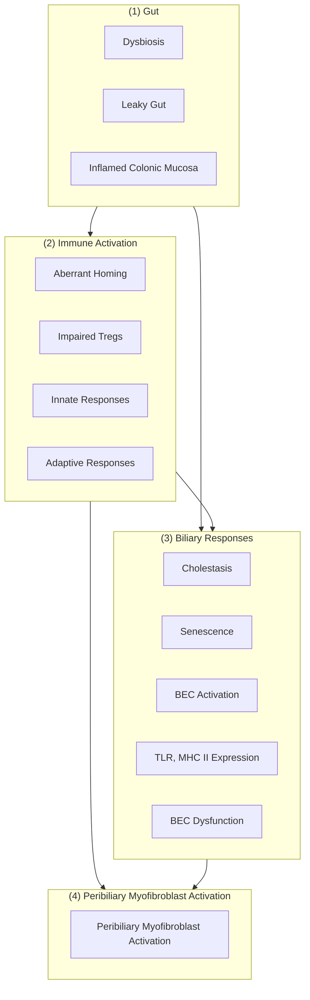
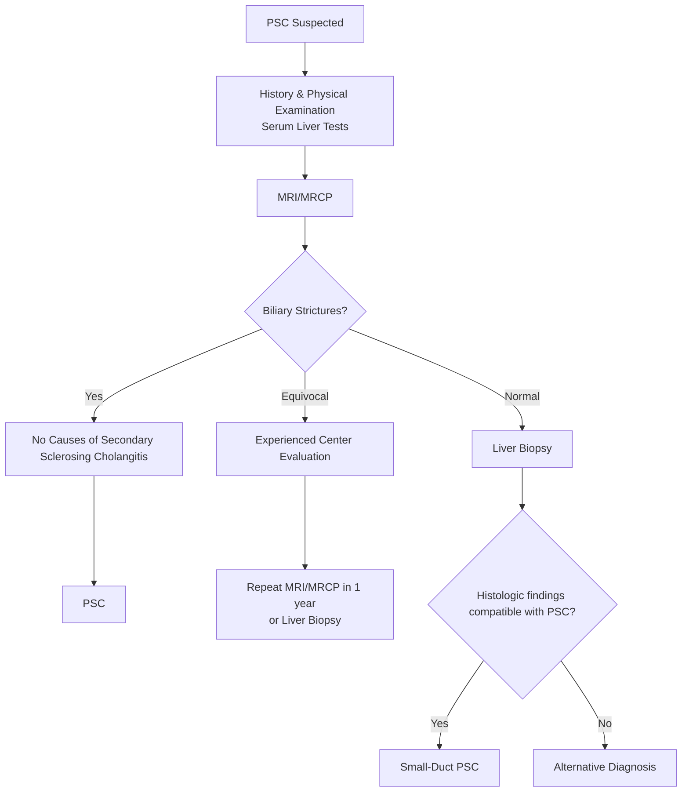
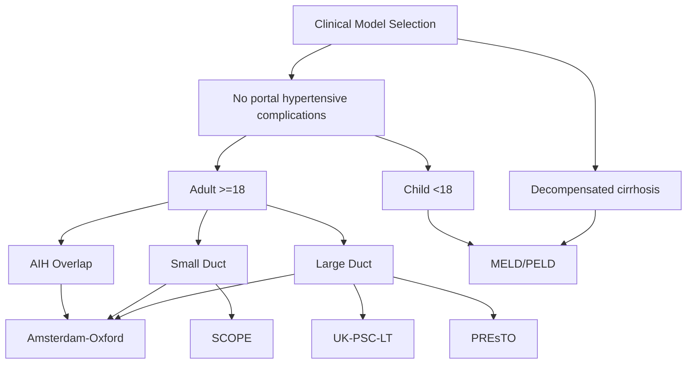
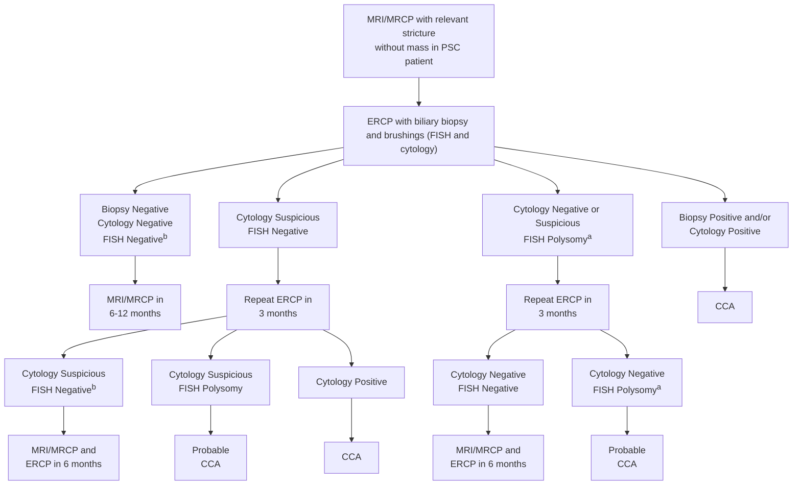
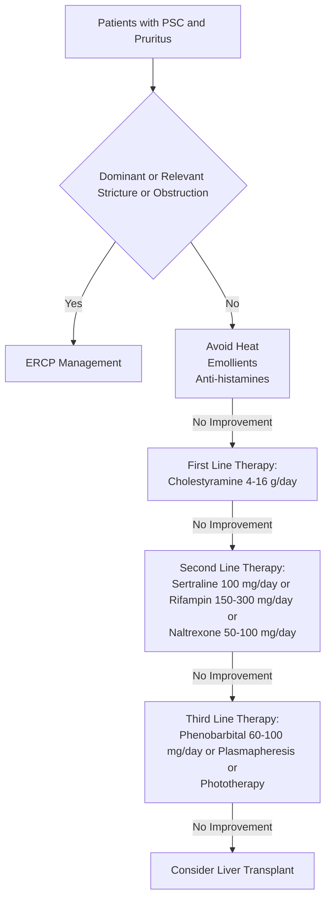
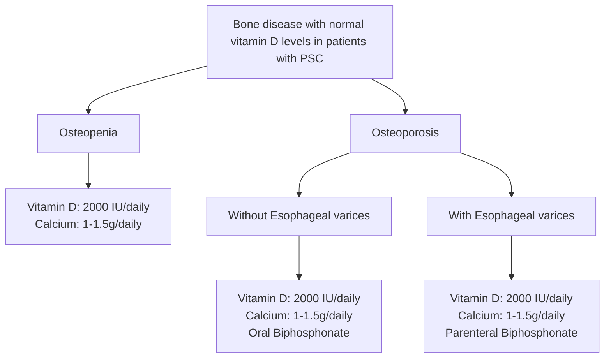
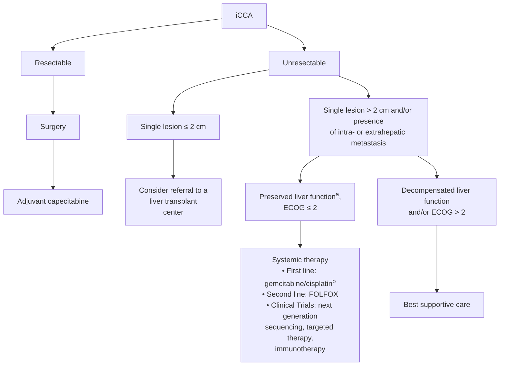
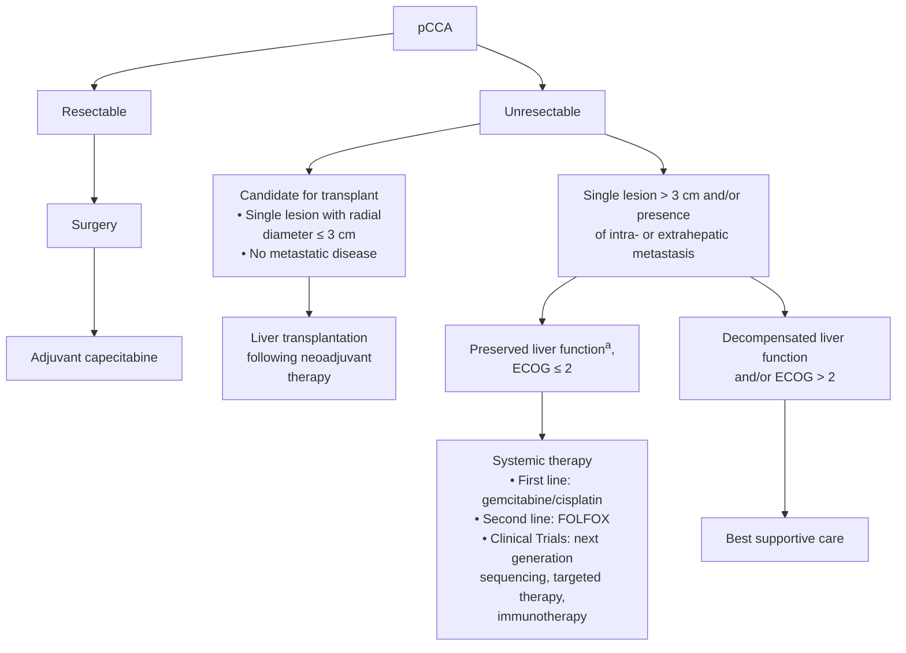
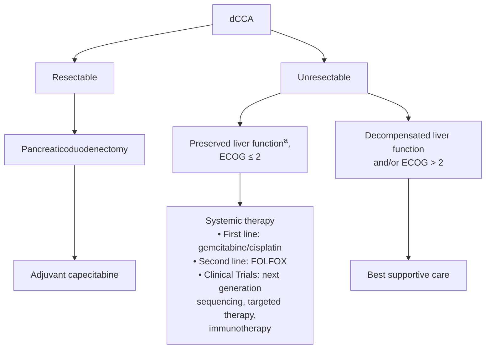

Received: 26 July 2022 | Accepted: 26 July 2022
DOI: 10.1002/hep.32771
PRACTICE GUIDANCE
AASLD AMERICAN ASSOCIATION FOR THE STUDY OF LIVER DISEASES

# AASLD practice guidance on primary sclerosing cholangitis and cholangiocarcinoma

Christopher L. Bowlus1 | Lionel Arrivé2 | Annika Bergquist3 | Mark Deneau4 | Lisa Forman5 | Sumera I. Ilyas6 | Keri E. Lunsford7 | Mercedes Martinez8 | Gonzalo Sapisochin9 | Rachna Shroff10 | James H. Tabibian11 | David N. Assis12

1Division of Gastroenterology, University of California Davis Health, Sacramento, California, USA
2Hôpital Saint-Antoine, Paris, France
3Karolinska Institutet, Karolinska University Hospital, Stockholm, Sweden
4University of Utah, Salt Lake City, Utah, USA
5University of Colorado, Aurora, Colorado, USA
6Mayo Clinic College of Medicine and Science, Rochester, Minnesota, USA
7Rutgers University–New Jersey Medical School, Newark, New Jersey, USA
8Vagelos College of Physicians and Surgeons, Columbia University, New York, New York, USA
9University of Toronto, Toronto, Ontario, Canada
10University of Arizona, Tucson, Arizona, USA
11David Geffen School of Medicine at UCLA, Los Angeles, California, USA
12Yale School of Medicine, New Haven, Connecticut, USA

**Correspondence**
Christopher L. Bowlus, Division of Gastroenterology, University of California, Davis, 4150 V Street, Suite 3500, Sacramento, CA 95817, USA.
Email: clbowlus@ucdavis.edu

## WHAT’S NEW SINCE THE 2010 GUIDELINES?

* Inclusion of guidance for the diagnosis and management of cholangiocarcinoma (CCA) in patients with and without primary sclerosing cholangitis (PSC) (Figures 5, 8, and 9).
* Introduction of the term *relevant stricture*, defined as any biliary stricture of the common hepatic duct or hepatic ducts associated with signs or symptoms of obstructive cholestasis and/or bacterial cholangitis (Table 1).
* In patients with equivocal MRI with cholangiopancreatography (MRI/MRCP) findings, a repeated high-quality MRI/MRCP should be performed for diagnostic purposes. Endoscopic retrograde cholangiopancreatography (ERCP) should be avoided for the diagnosis of PSC (Figure 2).

**Abbreviations:** AASLD, American Association for the Study of Liver Diseases; AIH, autoimmune hepatitis; ALP, alkaline phosphatase; ASIR, age standardized incidence rate; AST, aspartate aminotransferase; BRAF, B-raf proto-oncogene; CA 19-9, carbohydrate antigen 19-9; CCA, cholangiocarcinoma; CRC, colorectal cancer; 3D, three-dimensional; dCCA, distal cholangiocarcinoma; debTACE, drug-eluting bead transarterial chemoembolization; ECOG, Eastern Cooperation Oncology Group; ELF, Enhanced Liver Fibrosis; ERCP, endoscopic retrograde cholangiopancreatography; EUS, endoscopic ultrasound; FDA, Food and Drug Administration; FGFR2, FGF receptor 2; FISH, fluorescent in situ hybridization; FNA, fine-needle aspiration; FOLFOX, 5-FU and oxaliplatin; 5-FU, 5-fluorouracil; FUT, fucosyltransferases; gem/cis, gemcitabine/cisplatin; GGT, γ-glutamyl transferase; HGD, high-grade dysplasia; IBD, inflammatory bowel disease; iCCA, intrahepatic cholangiocarcinoma; ICD, International Classification of Diseases; IDH, isocitrate dehydrogenase; LN, lymph node; LRT, locoregional therapy; LS, liver stiffness; LT, liver transplantation; MELD, Model for End-Stage Liver Disease; MRCP, MRI retrograde cholangiopancreatography; MRE, magnetic resonance elastography; OCA, obeticholic acid; ORR, overall response rate; OS, overall survival; PBC, primary biliary cholangitis; pCCA, perihilar cholangiocarcinoma; PET, positron emission tomography; PFS, progression-free survival; PREsTO, PSC Risk Estimate Tool; PSC, primary sclerosing cholangitis; RFS, recurrence-free survival; rPSC, recurrent PSC; SBRT, stereotactic body radiation therapy; SCOPE, Sclerosing Cholangitis Outcomes in Pediatrics; TACE, transarterial chemoembolization; TARE, transarterial radioembolization; TE, transient elastography; T1w/T2w, T1-weighted/T2-weighted; UDCA, ursodeoxycholic acid; ULN, upper limit of normal; US, ultrasound.

© 2022 American Association for the Study of Liver Diseases.
Hepatology. 2022;00:1–44. wileyonlinelibrary.com/journal/hep **1**

2 PRIMARY SCLEROSING CHOLANGITIS AND CHOLANGIOCARCINOMA

**TABLE 1** Definitions in PSC

<table>
  <tbody>
    <tr>
        <td>PSC</td>
        <td>Chronic, cholestatic liver disease likely of autoimmune origin characterized by inflammation and&lt;br/&gt;fibrosis of intrahepatic and/or extrahepatic bile ducts, leading to the formation of bile duct&lt;br/&gt;strictures, and frequently associated with IBD</td>
    </tr>
    <tr>
        <td>Small-duct PSC</td>
        <td>Less common variant of PSC that is characterized by typical cholestatic and histological features of&lt;br/&gt;PSC but with normal bile ducts on cholangiography</td>
    </tr>
    <tr>
        <td>PSC–AIH overlap</td>
        <td>Concurrent diagnostic features of PSC and clinical, biochemical, and histological features of AIH</td>
    </tr>
    <tr>
        <td>Secondary sclerosing cholangitis</td>
        <td>Biliary strictures due to identifiable causes that can result in secondary biliary cirrhosis</td>
    </tr>
    <tr>
        <td>IgG4 sclerosing cholangitis</td>
        <td>Biliary strictures due to elevated IgG4-positive plasma cells in tissue and serum IgG4 elevation&lt;br/&gt;frequently associated with pancreatic involvement</td>
    </tr>
    <tr>
        <td>Dominant stricture</td>
        <td>A biliary stricture on ERCP with a diameter of ≤1.5 mm in the common bile duct or of ≤1 mm in the&lt;br/&gt;hepatic duct</td>
    </tr>
    <tr>
        <td>High-grade stricture</td>
        <td>A biliary stricture on MRI with cholangiopancreatography with &gt;75% reduction in the common bile&lt;br/&gt;duct or hepatic ducts</td>
    </tr>
    <tr>
        <td>Relevant stricture</td>
        <td>Any biliary stricture of the common bile duct or hepatic ducts associated with signs or symptoms of&lt;br/&gt;obstructive cholestasis and/or bacterial cholangitis</td>
    </tr>
  </tbody>
</table>

* In patients with PSC without known inflammatory bowel disease (IBD), diagnostic colonoscopy with histological sampling should be performed and may be repeated every 5 years if IBD is not initially detected.
* Colon cancer surveillance should begin at age 15 years in patients with PSC and IBD.
* New clinical risk tools for PSC are available for risk stratification, but probabilities of events in individual patients should be interpreted with caution (Figure 4 and Table 3).
* All patients with PSC should be considered for participation in clinical trials; however, ursodeoxycholic acid (13–23 mg/kg/day) can be considered and continued if well tolerated with a meaningful improvement in alkaline phosphatase ($\gamma$-glutamyl transferase in children) and/or symptoms with 12 months of treatment.
* ERCP with biliary brushings for cytology and fluorescent *in situ* hybridization analysis should be obtained in all patients with suspected perihilar or distal CCA.
* There is a new United Network for Organ Sharing policy regarding standardization of Model for End-Stage Liver Disease exceptions for patients with PSC and recurrent cholangitis.
* Liver transplantation following neoadjuvant therapy is recommended for patients with perihilar CCA <3 cm in radial diameter that is unresectable or arising in the setting of PSC and in the absence of intrahepatic or extrahepatic metastasis (Figure 9).

# INTRODUCTION AND SCOPE OF GUIDANCE

Primary sclerosing cholangitis (PSC) is a cholangiopathy characterized by chronic fibroinflammatory damage of the biliary tree and is frequently associated with inflammatory bowel disease (IBD). The majority of patients with PSC have fibrotic biliary strictures on cholangiogram, whereas a minority have small-duct PSC, characterized by a normal cholangiogram but with histological features of PSC on liver biopsy. A small percentage have overlapping features of autoimmune hepatitis (PSC-AIH). PSC affects both male and female individuals and can occur at any age. PSC is considered an autoimmune disease, though the pathophysiology remains poorly understood. PSC frequently results in cholestatic liver damage, cirrhosis, and liver failure and can recur in 20%–30% of patients after transplantation. PSC also significantly increases the risk of cholangiocarcinoma (CCA) and colorectal cancer (CRC). Currently, there is no effective medical therapy for PSC, and clinical research has been challenging, with a PSC-specific International Classification of Diseases (ICD)-10 diagnostic code (K83.01) only approved for use since 2018. A glossary of key definitions, including new terminology defining biliary strictures, is provided in Table 1.

This American Association for the Study of Liver Diseases (AASLD) guidance provides a data-supported approach to the diagnosis and management of PSC and CCA. It differs from AASLD guidelines, which are supported by systematic reviews of the literature, formal rating of the quality of the evidence and strength of the recommendations, and, if appropriate, meta-analysis of results using the Grading of Recommendations Assessment, Development, and Evaluation system. In contrast, this guidance was developed by consensus of an expert panel and provides guidance statements based on formal review and analysis of the literature on the topics, with oversight provided by the AASLD Practice Guidelines Committee at all stages of guidance development. The committee chose to perform a guidance on this topic because a sufficient number of randomized controlled trials were not available to support the development of a

15273350, 0, Downloaded from https://aasldpubs.onlinelibrary.wiley.com/doi/10.1002/hep.32771, Wiley Online Library on [06/01/2023]. See the Terms and Conditions (https://onlinelibrary.wiley.com/terms-and-conditions) on Wiley Online Library for rules of use; OA articles are governed by the applicable Creative Commons License

HEPATOLOGY | 3

meaningful guideline. In addition to the inclusion of CCA, updates to the 2010 guideline include new terminology for the description of biliary strictures, an emphasis on imaging for diagnosis rather than endoscopic retrograde cholangiopancreatography (ERCP) and liver biopsy, use of prognostic models and noninvasive staging for clinical practice, and comprehensive management of PSC.

# EPIDEMIOLOGY OF PSC

Population-based epidemiological studies of PSC have been limited. The majority of studies to date have been based in North America and western Europe, where estimates of incidence and prevalence are approximately 1–1.5 cases per 100,000 person-years and 6–16 cases per 100,000, respectively.[1–10] Some studies have suggested that the prevalence and incidence of PSC may be increasing.[4,11] Limited data from other parts of the world suggest a lower PSC prevalence there compared to the United States and northern Europe.[12–15] Within the United States, African Americans appear to be affected by PSC at rates similar to Whites.[16–18] Peak incidence of PSC is between the ages of 25 and 45 years, with a median age at diagnosis ranging from 36 to 39 years; but PSC can occur at any age.[19–21] In children, the incidence rate has been estimated to be 0.2 per 100,000 person-years.[8,22] Overall, men account for approximately two thirds of patients with PSC; but among patients with PSC without IBD, the male predominance is much lower.[20] Women with PSC are generally older at diagnosis. At least 70%–80% of patients with PSC have concurrent IBD, and the prevalence of PSC in patients with IBD including non-Europeans and children has been estimated to be 0.6%–4.3%.[18,23–35] PSC-AIH overlap occurs in up to 35% of children and 5% of adults with PSC.[36–38] Studies employing universal liver biopsy or cholangiography screening of patients with IBD have yielded PSC prevalence of 8.1%–9.0% in adults[39,40] and 15.1% in children,[41] suggesting that there may be tens of thousands of undiagnosed patients in North America alone.

# ETIOLOGY OF PSC

Multiple simultaneous mechanisms appear to lead to PSC and its progression (Figure 1). There is a clear genetic predisposition involving human leukocyte antigen (HLA) variants,[42–48] and many additional non-HLA loci have been implicated.[46,49] Less is known about environmental risks of PSC other than a possible link to nonsmoking.[25,50,51] Evidence suggests that IBD may drive PSC rather than this being an epiphenomenon.[52,53] A few studies have demonstrated an impaired gut barrier in PSC,[54–56] and an expanding body of evidence has developed on the dysbiosis of the intestinal gut microbial community in PSC.[57–72] Aberrant trafficking of gut lymphocytes[73,74] and/or translocation of microbial constituents or metabolites[67,75,76] have been proposed to induce activation of biliary epithelial cells and peribiliary inflammation, which consists of macrophages,[77,78] eosinophils,[79–81] and T cells.[82–84] However, a specific antigen or immune response has yet to be delineated.[85–87] Unconventional T cells including mucosa-associated invariant T and $\gamma\delta$ T cells important for recognition of bacterial pathogens have also been suggested to play a role in PSC[88] and localize to areas of fibrosis.[84] IL-17 production by $\gamma\delta$ T cells has been implicated in the development of cholestatic fibrosis and inflammation in animal models,[89,90] and IL-17 appears to have a significant role in PSC as well.[88,91,92] The fibrosis of large bile ducts in PSC is associated with peribiliary gland hyperplasia and activation of peribiliary mesenchymal cells, which acquire a myofibroblast phenotype.[93,94] Strictures of large bile ducts, reduced bile flow, increased biliary pressure, and alterations in bile composition associated with cholestasis may further drive disease progression.[95–97] Still unresolved is why immunosuppressive therapy and colectomy do not appear to alter the disease course, perhaps indicating that some mechanisms are involved in the initiation of PSC but have little influence on disease progression.[98–101]

# DIAGNOSIS OF PSC

PSC should be considered in all patients with cholestasis, especially in the setting of IBD. The diagnosis is based on characteristic strictures on cholangiography (Figure 2). Careful exclusion of secondary sclerosing cholangitis is required, especially in the absence of IBD (Table 2). Small-duct PSC is diagnosed based on histological findings that are typical or compatible with PSC in the presence of a normal cholangiogram (see “Histology” section below). In cases of suspected small-duct PSC without IBD, variants of the ATP binding cassette subfamily B member 4, also known as multidrug resistance protein 3, gene should be excluded.[102] In the presence of clinical, biochemical, and histologic features of AIH and cholangiographic findings of PSC, the diagnosis of PSC-AIH overlap, also known as *PSC with overlapping features of AIH*, should be considered. Conversely, PSC-AIH overlap should be considered in patients with AIH and IBD, unexplained cholestatic laboratory findings, or nonresponse to conventional glucocorticoid therapy.[36]

15273350, 0, Downloaded from https://aasldpubs.onlinelibrary.wiley.com/doi/10.1002/hep.32771, Wiley Online Library on [06/01/2023]. See the Terms and Conditions (https://onlinelibrary.wiley.com/terms-and-conditions) on Wiley Online Library for rules of use; OA articles are governed by the applicable Creative Commons License

4 PRIMARY SCLEROSING CHOLANGITIS AND CHOLANGIOCARCINOMA

**FIGURE 1** Pathogenesis of PSC. The current model of the pathogenesis of PSC involves four major themes on a background of underlying genetic and environmental risk factors. (1) Within the intestine, there is an altered microbiome, inflamed mucosa, and an impaired intestinal barrier or “leaky gut.” (2) Intestinal lymphocytes, microbial products, and/or metabolites translocate through the portal vein directly to the liver, activating innate and adaptive immune responses. (3) Microbial components or metabolites from the gut may also act directly to activate biliary epithelial cells and further perpetuate inflammatory responses. (4) Peribiliary glands expand, and peribiliary mesenchymal cells, through a Hedgehog pathway, acquire a myofibroblast phenotype leading to large-duct fibrosis. Abbreviations: BEC, biliary epithelial cell; MHC II, major histocompatibility complex class II; TLR, toll-like receptor; Treg, regulatory T cell.

## Symptoms

Nearly half of adult patients with PSC present with constant or intermittent symptoms, and another 22% develop symptoms within 5 years of diagnosis.[103] Symptoms of PSC include fatigue, abdominal pain, fever, and pruritus, in addition to anxiety and depression.[21] Pruritus and abdominal pain can fluctuate depending on the presence of biliary obstruction and/or acute cholangitis. Emotional distress can be exacerbated by anxiety about the idiopathic nature of the disease, lack of effective therapy, and elevated cancer risk.[104,105] Assessment of PSC symptoms is complex in patients with IBD, which itself causes symptoms such as abdominal pain and fatigue.[106] There is a growing interest in measuring PSC symptoms through patient-reported outcome measures (PROM). Two recent PROMs were developed specifically for patients with PSC: the PSC PRO and the Simple Cholestatic Complaints Score[107,108]; however, they require further validation prior to routine clinical use.

## Biochemical and serological tests

Biochemical markers are sensitive but not specific for the diagnosis of PSC. A cholestatic biochemical profile with elevated liver enzymes, such as alkaline phosphatase (ALP) and γ-glutamyl transferase (GGT), is seen in about 75% of patients.[40] Notably, elevated aminotransferases occur frequently and do not necessarily suggest overlapping AIH, unless they are predominant or more than 5 times the upper limit of normal (ULN).[109] However, precise diagnostic criteria for PSC-AIH overlap have not been established.

Detection of serum autoantibodies, including antinuclear, anti–smooth muscle, and perinuclear antineutrophil antibodies, in patients with PSC is highly variable,

15273350, 0, Downloaded from https://aasldpubs.onlinelibrary.wiley.com/doi/10.1002/hep.32771, Wiley Online Library on [06/01/2023]. See the Terms and Conditions (https://onlinelibrary.wiley.com/terms-and-conditions) on Wiley Online Library for rules of use; OA articles are governed by the applicable Creative Commons License

HEPATOLOGY | 5

## TABLE 2 Etiologies of secondary sclerosing cholangitis

<table>
<thead>
<tr>
<th>Category</th>
<th>Etiologies</th>
</tr>
</thead>
<tbody>
<tr>
<td>Infectious</td>
<td>
HIV-related cholangiopathy 
Recurrent pyogenic cholangitis 
Cholangitis lenta or subacute nonsuppurative cholangitis 
Parasitic cholangiopathy 
• Hydatid cyst 
• Echinococcosis 
• Clonorchiasis and opisthorchiasis 
• Ascariasis 
• Fascioliasis 
• Schistosomiasis
</td>
</tr>
<tr>
<td>Ischemic</td>
<td>
Critically ill patients 
Hereditary hemorrhagic telangiectasis 
Intra-arterial chemotherapy 
Hepatic artery thrombosis
</td>
</tr>
<tr>
<td>Malignant</td>
<td>
Cholangiocarcinoma 
Diffuse intrahepatic metastasis 
Langerhans cell histiocytosis 
Lymphoma
</td>
</tr>
<tr>
<td>Autoimmune</td>
<td>
Eosinophilic cholangitis 
Hepatic inflammatory pseudotumor 
IgG4-associated cholangitis 
Mast cell cholangiopathy 
Sarcoidosis
</td>
</tr>
<tr>
<td>Anatomic</td>
<td>
Choledocholithiasis 
Intrahepatic lithiasis 
Cystic fibrosis liver disease 
Surgical biliary trauma 
Anatomical stricture 
Portal hypertensive biliopathy 
Recurrent pancreatitis 
Sickle cell cholangiopathy 
Choledochal cyst
</td>
</tr>
<tr>
<td>Drug-induced</td>
<td>
Immunotherapy with checkpoint inhibitors 
• Pembrolizumab 
• Nivolumab 
• Atezolizumab
</td>
</tr>
</tbody>
</table>

likely representing an immune dysregulation state.[110,111] In contrast to primary biliary cholangitis (PBC) and AIH, autoantibodies have minimal diagnostic implications for PSC.[112] Elevation of serum IgG4 occurs in up to 15% of patients with PSC, but the clinical significance is unclear.[113,114] High-tier IgG4 (>5.6 g/L) is rare and suggests a diagnosis of IgG4-sclerosing cholangitis, whereas an IgG4/IgG1 ratio <0.24 can exclude IgG4-sclerosing cholangitis when the serum IgG4 is 1.4–2.8 g/L.[114,115]

## Imaging

MRI with cholangiopancreatography should be the first diagnostic imaging modality in patients with suspected PSC.[116] Imaging should be performed on a scanner with a minimum of a 1.5-Tesla field strength. T2 weighted (T2w), three-dimensional (3D) MRI retrograde cholangiopancreatography (MRCP) with 1-mm slices is preferred to two-dimensional MRCP, and axial imaging should include 1-weighted (T1w) and T2w sequences. Enhancement with an extracellular or hepatobiliary contrast agent is recommended at diagnosis and when imaging is done in response to a change in clinical status or due to concerns for CCA.

There is insufficient evidence to recommend one type of contrast agent over another. A high-quality study is one in which there is no artifact or blurring and third-order biliary branches and beyond can be delineated.[117] Before the advent of MRI/MRCP, ERCP was regarded as the gold standard in diagnosing PSC.[118] However, ERCP is associated with serious complications and should only be performed for therapeutic intervention or tissue sampling.[119] Multiple studies have shown that MRI/MRCP has comparable diagnostic accuracy to ERCP.[120] Importantly, in a patient with a high pretest probability of PSC, there remains a 30% probability of PSC even if the MRCP is negative.[120] Thus, in the setting of an MRI/MRCP that is suboptimal or equivocal, the study should be repeated, preferably at an experienced imaging center using 3D MRCP reconstruction.[116,120] Transabdominal ultrasound (US) is usually nondiagnostic, although bile duct wall thickening and/or focal bile duct dilatations may be demonstrated.[121] CT is limited in the assessment of structures of intrahepatic bile ducts.[122] A normal US or CT is not sufficient to rule out PSC.

MRI/MRCP features of PSC are highly variable, probably related to the stage of the disease process (Figure 3).[123,124] Specific terms such as *stenosis*, *stricture*, and *dilatation* are preferred rather than imprecise descriptions such as *beaded*, *pruned-tree appearance*, or *irregularity* of bile ducts.[124] Early in the course of the disease, diffusely distributed, short, intrahepatic strictures alternating with normal or slightly dilated segments are demonstrated.[125,126] Contrast-enhanced T1w images may demonstrate biliary wall thickening and mural contrast enhancement of the biliary ducts.[127] As fibrosis progresses, the strictures worsen and the ducts become obliterated. With worsening of PSC, focal signal abnormalities of the liver parenchyma on T2w and diffusion-weighted images suggest cholestasis and inflammation. Fibrosis may be demonstrated by focal parenchymal atrophy and liver dysmorphy, defined as atrophy of a hepatic lobe, lobulations of the liver surface, and/or increase of the caudate:right lobe ratio.[124]

A *dominant stricture* has been defined as a stenosis with a diameter of ≤1.5 mm in the common bile duct or ≤1 mm in the hepatic duct by ERCP.[128,129] However, in clinical practice, the term has been used without clear consensus on this definition.[130,131] The term *dominant stricture* should not be used in MRI reports because of suboptimal spatial resolution of MRI/MRCP and basic differences with ERCP, which is performed with high-pressure injection. A similar term for common bile duct and hepatic duct strictures observed on MRI is *high-grade stricture*, which is defined by a reduction in the lumen by ≥75%.[117,124] However, there remains a need

6 PRIMARY SCLEROSING CHOLANGITIS AND CHOLANGIOCARCINOMA

**FIGURE 2** Diagnostic algorithm for PSC. Patients with suspected PSC should have a careful clinical evaluation including history, physical examination, and measurement of serum liver tests, followed by MRI/MRCP. The presence of biliary strictures, in the absence of secondary causes of sclerosing cholangitis, is considered diagnostic. Equivocal MRI findings should prompt evaluation at an experienced center with consideration for repeat imaging in a year or liver biopsy. If the initial MRI/MRCP is normal, a liver biopsy should be performed to diagnose small-duct PSC versus alternative diagnoses.

for a term to describe a stricture that has clinical relevance but may not meet the strict criteria of a dominant or high-grade stricture. Therefore, the term *relevant stricture* is introduced to refer to any biliary stricture of the common bile duct or hepatic ducts associated with signs or symptoms of obstructive cholestasis and/or bacterial cholangitis (Table 1).

## Histology

Modern imaging modalities have decreased the need for a liver biopsy to diagnose PSC.[132] Liver biopsy should be considered if there is concern for small-duct PSC or overlap with AIH. Concentric “onion skin” periductal fibrosis is an infrequent histological feature that can be seen in PSC and other obstructive cholangiopathies. Typical histologic features of PSC include periductal fibrosis and fibro-obliterative duct lesions, whereas compatible features include bile duct loss, ductular reaction (also referred to as *ductular proliferation*), a biliary pattern of interface activity, and chronic cholestatic changes in periportal hepatocytes.[133,134] The presence of these features should be the basis for the diagnosis of small-duct PSC when the MRCP is normal.[8,135] Histologic features of AIH, including lymphoplasmacytic interface hepatitis in the setting of PSC, may signify an overlap with AIH.[22,136–138]

## IBD

Over 70% of patients with PSC have IBD, with two thirds diagnosed as ulcerative colitis and the other third as Crohn’s disease or indeterminate colitis.[1,20,33,139,140] IBD in PSC (PSC-IBD) is more frequently localized in the right colon and notable for backwash ileitis.[141,142] It is often asymptomatic despite significant endoscopic and histologic activity.[143,144] In children, 5% of patients with PSC without a prior diagnosis of IBD and no symptoms were found to have quiescent colitis.[145] In addition, histological evidence of IBD without endoscopic changes of IBD is frequent.[146] Therefore, patients with PSC, including children, who do not have known IBD should undergo ileocolonoscopy with biopsies at the time of PSC diagnosis to screen for asymptomatic colitis. If no colitis is detected, ileocolonoscopy with biopsies should be considered at 5-year intervals or if symptoms suggestive of IBD occur because IBD may develop after PSC diagnosis.

15273350, 0, Downloaded from https://aasldpubs.onlinelibrary.wiley.com/doi/10.1002/hep.32771, Wiley Online Library on [06/01/2023]. See the Terms and Conditions (https://onlinelibrary.wiley.com/terms-and-conditions) on Wiley Online Library for rules of use; OA articles are governed by the applicable Creative Commons License

HEPATOLOGY 7

The image consists of four MRI scans showing findings of Primary Sclerosing Cholangitis (PSC).
*   **Top left (MRCP):** Demonstrates multiple severe strictures of intrahepatic biliary ducts (indicated by arrows) and a high-grade stricture of the main biliary duct (indicated by an arrowhead).
*   **Bottom left (T2w MRI):** Demonstrates dysmorphy with marked enlargement of the caudate lobe (labeled C) and atrophy with high signal intensity of the right liver lobe (labeled R).
*   **Top right (Contrast-enhanced MRI):** Demonstrates biliary wall thickening with marked mural contrast enhancement (indicated by arrows).
*   **Bottom right (Contrast-enhanced MRI):** Demonstrates marked contrast enhancement heterogeneity with high signal intensity of the right (R) and left (L) liver lobes in comparison with the caudate lobe (C).

**FIGURE 3** MRI findings of PSC. MRCP (top left) demonstrates multiple severe strictures of intrahepatic biliary ducts (arrows) and high-grade stricture of the main biliary duct (arrowhead). T2w MRI (bottom left) demonstrates dysmorphy with marked enlargement of the caudate lobe and atrophy with high signal intensity of the right liver lobe. Contrast-enhanced MRI (top right) demonstrates biliary wall thickening with marked mural contrast enhancement (arrows). Contrast-enhanced MRI (bottom right) demonstrates marked contrast enhancement heterogeneity with high signal intensity of the right and left liver lobes in comparison with the caudate lobe. Abbreviations: C, caudate lobe; L, left liver lobe; R, right liver lobe.

The clinical course of IBD in patients with PSC-IBD is often less aggressive with less frequent need for immunosuppression.[52,147] Patients with PSC are prone to developing pouchitis after colectomy with ileoanal anastomosis,[148] and patients with portal hypertension have an increased risk of peristomal and stomal varices.[149]

> ### Guidance statements
> 1. In patients with suspected PSC, a 3D MRI/MRCP with T1w and T2w axial images and contrast enhancement should be obtained to evaluate for cholangiographic features of PSC, including intrahepatic and/or extrahepatic strictures alternating with normal or slightly dilated segments.
> 2. In patients with suspected PSC and a normal, high-quality MRI/MRCP, liver biopsy should be considered to rule out small-duct PSC. Patients with an equivocal MRI/MRCP should be referred to an experienced center for consideration of a repeat high-quality MRI/MRCP or liver biopsy. A repeat MRI/MRCP may be considered in 1 year if the diagnosis remains unclear.
> 3. ERCP should be avoided for the diagnosis of PSC.
> 4. In all patients with possible PSC, serum IgG4 levels should be measured to exclude IgG4-sclerosing cholangitis.
> 5. A liver biopsy should not be performed in patients with typical cholangiographic findings on MRI/MRCP, except when there is concern for AIH overlap.
> 6. Ileocolonoscopy with biopsies should be performed in patients with a new diagnosis of PSC and no previous diagnosis of IBD. In patients without IBD, subsequent ileocolonoscopy should be considered at 5-year intervals or whenever symptoms suggestive of IBD occur.

## NATURAL HISTORY OF PSC

PSC is a heterogenous disease with a variable course that can be complicated not only by cirrhosis but also by bacterial cholangitis, CCA, and CRC. Most patients have slowly progressive liver disease with increasing hepatobiliary fibrosis, biliary strictures, intermittent bacterial cholangitis, and eventually cirrhosis and end-stage liver disease. Median time to death or liver transplantation (LT) was reported to be as low as 9 years in studies from referral centers, but more recent population-based studies estimate it to be 21 years or longer.[19] As an increasing proportion of patients are transplanted, deaths from end-stage liver disease

15273350, 0, Downloaded from https://aasldpubs.onlinelibrary.wiley.com/doi/10.1002/hep.32771, Wiley Online Library on [06/01/2023]. See the Terms and Conditions (https://onlinelibrary.wiley.com/terms-and-conditions) on Wiley Online Library for rules of use; OA articles are governed by the applicable Creative Commons License

8 PRIMARY SCLEROSING CHOLANGITIS AND CHOLANGIOCARCINOMA

**TABLE 3** Validated clinical prognostic models of PSC

<table>
  <thead>
    <tr>
        <th colspan="5">Models</th>
    </tr>
    <tr>
        <th>Variables</th>
        <th>Amsterdam-Oxford 2017&lt;sup&gt;[230]&lt;/sup&gt;</th>
        <th>UK-PSC 2019&lt;sup&gt;[231]&lt;/sup&gt;</th>
        <th>PREsTO 2020&lt;sup&gt;[232]&lt;/sup&gt;</th>
        <th>SCOPE 2020&lt;sup&gt;[162]&lt;/sup&gt;</th>
    </tr>
  </thead>
  <tbody>
    <tr>
        <td>Variables</td>
        <td>Age&lt;br/&gt;Bilirubin&lt;br/&gt;Albumin&lt;br/&gt;AST&lt;br/&gt;ALP&lt;br/&gt;Platelets&lt;br/&gt;PSC subtype (large-duct or small-duct)</td>
        <td>Age&lt;br/&gt;Bilirubin&lt;br/&gt;Albumin&lt;br/&gt;ALP&lt;br/&gt;Platelets&lt;br/&gt;Presence of extrahepatic biliary disease&lt;br/&gt;History of variceal hemorrhage</td>
        <td>Age&lt;br/&gt;Bilirubin&lt;br/&gt;Albumin&lt;br/&gt;AST&lt;br/&gt;ALP&lt;br/&gt;Platelets&lt;br/&gt;Hemoglobin&lt;br/&gt;Sodium&lt;br/&gt;Years since PSC diagnosis</td>
        <td>Bilirubin&lt;br/&gt;Albumin&lt;br/&gt;Platelets&lt;br/&gt;GGT&lt;br/&gt;Cholangiography (large-duct or small-duct involvement)</td>
    </tr>
    <tr>
        <td>Endpoint</td>
        <td>LT or liver-related death by 15 years</td>
        <td>Short term: death or LT by 2 years&lt;br/&gt;Long term: death or LT by 10 years</td>
        <td>Hepatic decompensation (ascites, variceal hemorrhage, encephalopathy) by 5 years</td>
        <td>Portal hypertensive complications, biliary complications, CCA, listing for LT, or death from liver disease by 5 years</td>
    </tr>
    <tr>
        <td>Risk thresholds&lt;sup&gt;a&lt;/sup&gt;</td>
        <td>Lower risk: &lt; 1.58&lt;br/&gt;Higher risk: ≥ 1.58</td>
        <td>Lower risk: &lt; 1.46&lt;br/&gt;Higher risk: ≥ 1.46</td>
        <td>Lower risk: &lt; 20%&lt;br/&gt;Higher risk: ≥ 20%</td>
        <td>Lower risk: 0–5&lt;br/&gt;Higher risk: 6–11</td>
    </tr>
    <tr>
        <td>Website</td>
        <td>https://sorted.co/psc-calculator/</td>
        <td>http://www.uk-psc.com/resources/the-uk-psc-risk-scores/</td>
        <td>rtools.mayo.edu/PRESTO_calculator/</td>
        <td>Scopeindex.net</td>
    </tr>
  </tbody>
</table>
aLower-risk group cutoffs were selected to identify patients with approximately 10% or less risk of transplant or death within 5 years. Cutoffs were not reported for the PREsTO model; however, approximately twice as many patients developed decompensation as were transplanted in follow-up, making a 20% risk of decompensation a reasonable approximation of a 10% risk of transplant or death.

have decreased, but deaths from CCA appear to be unchanged.[150]

PSC is increasingly diagnosed in the early stage,[150,151] which is likely due to increased awareness of PSC, use of MRI/MRCP, and screening of liver function tests in the general population and in patients with IBD. However, many people with PSC likely remain undiagnosed.[40,41,152–154]

Patient demographics and PSC phenotype influence disease progression. Younger age at diagnosis and female sex are associated with better outcomes.[20] Patients diagnosed under age 20 have a 2.5 times longer median transplant-free survival and a 17 times lower rate of CCA compared to patients diagnosed over age 60.[155] Patients with PSC-AIH overlap are reported to have a reduced risk for LT or death compared to those with PSC alone.[20] Small-duct PSC also has a more favorable prognosis with longer time until liver cirrhosis and lower risk for hepatobiliary malignancy.[20,135] Twenty-three percent of patients with small-duct disease are reported to develop large-duct disease over 5–14 years.[135] Whether small-duct PSC represents a separate entity or an early/mild form of PSC remains controversial. Nonetheless, patients with small-duct PSC should be monitored by MRI/MRCP every 3–5 years for the development of large-duct disease.

Presence of symptoms and high ALP levels are associated with a worse prognosis. At the time of diagnosis and in earlier stages, patients are often asymptomatic and can remain so despite disease progression.[103,154] Although ALP often fluctuates during the disease course,[151,156] persistently normal/low levels (ALP < 1.5 × ULN) are associated with better prognosis.[157–161] ALP is invalid in children due to wide fluctuations in normal values with age and bone growth, and instead GGT should be used. Like in adults, high rates of spontaneous normalization of GGT early in the disease course are seen in children, and persistently normal/low levels (GGT < 50 U/L) are associated with better prognosis.[162,163]

## Progressive fibrosis/cirrhosis

Accumulation of hepatobiliary fibrosis in PSC appears to be slow. Over the course of a 2-year clinical trial of simtuzumab, direct and indirect measures of fibrosis were stable in most patients; and Ishak fibrosis stage on serial liver biopsies improved in 29%, remained unchanged in 34%, and worsened in 37%.[164] Similarly, among 141 children with PSC who had serial liver biopsies 12–18 months apart, Batts-Ludwig fibrosis stage improved in 17%, remained unchanged in 64%, and worsened in 19%,[165] confirming the results of smaller studies demonstrating no significant change in fibrosis stage over 1–5 years.[166–174]

15273350, 0, Downloaded from https://aasldpubs.onlinelibrary.wiley.com/doi/10.1002/hep.32771, Wiley Online Library on [06/01/2023]. See the Terms and Conditions (https://onlinelibrary.wiley.com/terms-and-conditions) on Wiley Online Library for rules of use; OA articles are governed by the applicable Creative Commons License

HEPATOLOGY | 9

## Cholangitis/gallstones

Although a consensus on the criteria required to diagnose bacterial cholangitis in patients with PSC is lacking, case series report that approximately 6% of patients with PSC have bacterial cholangitis at diagnosis and that nearly 40% experience this complication during the disease course. During a clinical trial, bacterial cholangitis was the most common disease-related complication, occurring in 12% of patients over 2 years.[164] The importance of bacterial cholangitis for disease progression remains unclear. A positive bacterial culture of bile in the presence of a dominant stricture was not associated with a worse prognosis,[175] and bacterial cholangitis was not associated with survival among patients with PSC awaiting LT.[176] In contrast, *Candida* in bile is a poor prognostic sign.[175]

Gallstones, sludge, chronic cholecystitis, and/or gallbladder polyps occur in near half of patients with PSC.[177,178] Intrahepatic bile duct calculi are present in 8% of patients, and some of these patients require repeated interventions with ERCP when stones and sludge contribute to bile duct obstruction.[179]

## Biliary strictures

Development of biliary strictures may occur at all levels in the biliary tree, but strictures of the common bile duct and common hepatic duct have more significant effects on the natural history of PSC. Dominant strictures are present in up to half of patients at the time of diagnosis and may present without symptoms or with increased cholestasis, jaundice, pruritus, and/or fevers. Up to 45% of patients with PSC will develop dominant strictures.[128,129] Patients with the disease limited to intrahepatic ducts seem to have a better outcome. High-grade strictures with prestenotic dilatation at MRI/MRCP are associated with poorer outcomes.[123] In addition, dominant stricture on ERCP[180] or a rapid progression of a stricture at MRI/MRCP increases the risk of CCA.[118] Further, the presence of a dominant stricture, even in the absence of bile duct malignancy, significantly reduces survival.[175]

## Malignancy

### CCA

CCA can occur any time during the disease course, with the highest risk (2.5%) reported within the first year after PSC diagnosis and thereafter 1%–1.5% per year.[19,181] In one large population-based study, the cumulative risk of CCA after 10, 20, and 30 years of PSC was 6%, 14%, and 20%, respectively.[19] Compared to the general population, the risk of CCA is 160–400 times greater.[3,19,182] In the largest population-based study (N = 2588), the risk of CCA was 28 times greater in patients with PSC-IBD compared to patients with IBD without PSC.[33] Rapid worsening of symptoms, cholestasis, or weight loss should raise the suspicion of CCA, although some patients with CCA can be completely asymptomatic. In the presence of cirrhosis, the signs and symptoms of CCA may not differ from those of end-stage liver disease.[183]

**FIGURE 4** Current prognostic models in PSC. Clinical prognostic model selection for patients with PSC should take into account the age of the patient and the presence of small-duct PSC and/or overlap with AIH. Abbreviation: PELD, Pediatric End-Stage Liver Disease score.

15273350, 0, Downloaded from https://aasldpubs.onlinelibrary.wiley.com/doi/10.1002/hep.32771, Wiley Online Library on [06/01/2023]. See the Terms and Conditions (https://onlinelibrary.wiley.com/terms-and-conditions) on Wiley Online Library for rules of use; OA articles are governed by the applicable Creative Commons License

10 | PRIMARY SCLEROSING CHOLANGITIS AND CHOLANGIOCARCINOMA

**FIGURE 5** Diagnostic algorithm for relevant strictures in PSC. The finding of a relevant stricture in a patient with PSC should prompt a diagnostic and management algorithm that begins with an ERCP with sampling of the concerning stricture with a biliary biopsy, brushings for FISH, and cytology. The initial finding of negative biopsy, cytology, and FISH results should prompt a repeat MRI/MRCP in 6–12 months. The initial finding of suspicious cytology with negative FISH should prompt a repeat ERCP in 3 months, a suspicious cytology with negative FISH should prompt a repeat MRI/MRCP and ERCP in 6 months, a suspicious cytology with FISH polysomy would be consistent with a probable CCA, a positive cytology result is diagnostic for CCA. The initial finding of negative cytology, or suspicious cytology, with FISH polysomy should prompt a repeat ERCP in 3 months; a positive cytology result is diagnostic for CCA; a negative cytology with negative FISH should prompt a repeat MRI/MRCP and ERCP in 6 months; a subsequent negative cytology with FISH polysomy would be consistent with a probable CCA. The initial finding of a positive biopsy and/or positive cytology is diagnostic for CCA.

The most consistent risk factor for CCA is older age. CCA is rarely diagnosed in the pediatric population or in those with small-duct PSC. Other risk factors include male sex, dominant stricture, and comorbidity with IBD, along with elevated bilirubin levels.[19,20,33,103,183–187] The impact of environmental factors such as smoking and alcohol is uncertain.[183,188] Like other causes of cirrhosis, PSC cirrhosis increases the risk for HCC. However, the risk is lower than for CCA, with one large study reporting HCC in 2.4% during nearly 10 years of follow-up.[189]

### Gallbladder cancer

Gallbladder cancer in PSC is 9–78 times greater compared to the general population.[3,33] Gallbladder polyps may be a premalignant stage and are present in 6%–16% of patients with PSC.[177,178,190] The risk for malignant development of a gallbladder polyp increases with size, but evidence for a specific size cutoff for malignancy is lacking. In one study, small polyps <10 mm were reported to be a transient finding or were stable in size over time, and only 6% increased in size at follow-up.[178] Underlying malignancy in polyps <5 mm is low.[178,191] The prevalence of adenocarcinoma in cholecystectomy specimens from patients with PSC and a gallbladder polyp or mass lesion varies between 18% and 56%.[177,178,190,191]

### CRC

The risk of CRC in PSC is 5–12 times greater compared to the general population[3,19,181,192] and 4–5 times greater compared to patients with IBD without PSC,[19,33,193,194] with a tendency toward right-sided lesions and younger age at onset.[33,195] A meta-analysis of 1022 patients from 16 studies estimated the risk of CRC/dysplasia to be 3 times greater in patients with PSC-IBD compared with IBD alone.[196] Early studies found a cumulative incidence of CRC in PSC-IBD of up to 40% after 20 years of disease,[197] but more recently the incidence rates of CRC in PSC-IBD seem to have decreased, with one study reporting 5-year and 10-year CRC incidence rates of 7% and 9%, respectively.[32] Children develop CRC at similar rates as adults, with 5% affected at 10 years.[145] In addition, patients with PSC more frequently have endoscopically invisible dysplasia; and when low-grade dysplasia is present, it progresses to high-grade dysplasia (HGD) or CRC more rapidly compared to IBD alone.[198,199]

15273350, 0, Downloaded from https://aasldpubs.onlinelibrary.wiley.com/doi/10.1002/hep.32771, Wiley Online Library on [06/01/2023]. See the Terms and Conditions (https://onlinelibrary.wiley.com/terms-and-conditions) on Wiley Online Library for rules of use; OA articles are governed by the applicable Creative Commons License

HEPATOLOGY 11

Young age at IBD diagnosis is a risk factor for CRC in PSC-IBD.[33,145,199] Children with PSC and IBD onset before age 6 had a greater risk of CRC than those diagnosed in their teenage years.[145] Chronic inflammation may contribute to the CRC risk and is often underestimated in PSC, in both adults and children.[144,199] The risk of CRC in patients with PSC without IBD relative to the average-risk population is unknown, but in one study of 590 patients with PSC, 20 developed CRC and all but one had IBD.[19]

# Staging of PSC and prognostic tools

The characteristics of PSC present challenges to creating distinct definitions of disease stages, and formal criteria do not yet exist. Unlike other liver diseases, clinical complications in PSC are not isolated to those who have developed cirrhosis, and severe symptomatic biliary strictures in PSC can occur before the onset of advanced fibrosis or cirrhosis. CCA and CRCs can occur at any disease stage. Additionally, PSC progression is variable; some patients at a low fibrosis stage may progress rapidly, and some patients with advanced fibrosis may remain asymptomatic and stable for many years. In clinical practice, risk assessment for clinical events such as hepatic decompensation or transplant-free survival, rather than disease staging, may be useful for guidance on follow-up and management strategies.

## Liver biopsy

Advanced fibrosis in PSC is associated with worse prognosis. The Nakanuma, Ishak, and Batts-Ludwig staging systems were each associated with transplant-free survival and time to LT with similar prognostic ability.[200] In the prospective simtuzumab trial, baseline Ishak fibrosis stage was strongly correlated with 2-year outcomes.[164] Liver histology in PSC is hampered by a large sampling variability because high-grade strictures and cholestasis may lead to unequal distribution of fibrosis throughout the liver.[201] A blinded review of paired biopsies obtained from the same liver location showed that Batts-Ludwig stage differed by one stage in 16% and two stages in 11% of patients with PSC.[201] Therefore, liver biopsy is not recommended for staging of fibrosis or prognostication in PSC outside of the clinical trial setting.

## Liver stiffness

Liver stiffness (LS) measurements in PSC by transient elastography (TE) or magnetic resonance elastography (MRE) are reasonably accurate for estimation of liver fibrosis and correlate with long-term patient outcomes.[127,202–207] Cutoff values of 9.6 kPa by TE for extensive fibrosis (F3) and 14.4 kPa for cirrhosis (F4) have a diagnostic accuracy > 0.80.[202] Similarly, LS of 4.6 kPa by MRE has an area under the receiver-operator curve of 0.82 for cirrhosis.[208] Higher LS by TE or MRE has been associated with increasing risk of clinical outcomes.[202,203,206,209] Changes of LS over time increase slowly through early stages of fibrosis and then exponentially as fibrosis progresses to cirrhosis.[202,205] Importantly, LS is affected not only by fibrosis but also by blood flow, inflammation, and cholestasis. In PSC, the impact of transient episodes of cholestasis due to biliary obstruction may influence these results. The optimal frequency and clinical utility of repeated LS measurements remains unclear and needs further study. In 204 patients who underwent serial MRE a median of 1.1 years apart, mean change in LS was only 0.05 kPa/year overall. Larger changes in LS predicted worse clinical outcomes, with the highest risk of hepatic decompensation seen with LS worsened by > 0.34 kPa/year.[205] Mean LS by TE was unchanged over 2 years for nearly all patients in the simtuzumab trial.[164]

## Serum fibrosis tests

The Enhanced Liver Fibrosis (ELF) test is a composite of three serum biomarkers of hepatobiliary fibrosis: hyaluronic acid, procollagen III amino-terminal peptide, and tissue inhibitor of metalloproteinase 1. ELF is strongly associated with transplant-free survival in PSC[210–212] and may be useful as a surrogate marker in clinical trials. Stable versus worsened ELF from baseline to Week 12 in a clinical trial was associated with more favorable outcomes, regardless of treatment.[164] ELF had less variability on serial measurements than ALP.[156] However, the ELF test is not widely available commercially. Serum matrix metalloproteinase 7 was more accurate than GGT or ALP in distinguishing PSC from AIH in children and correlated with histopathologic stage of fibrosis and MRE.[213] Aspartate aminotransferase (AST) to platelet ratio index correlates with fibrosis stage, TE, and clinical outcomes in adults[202,214,215] and children.[155] Fibrosis-4 index, a score based on patient age, AST, alanine aminotransferase (ALT), and platelet count designed to assess the need for biopsy in chronic hepatitis C,[216] performs reasonably well in PSC, though it is inferior to LS measurement.[202,214,215]

## Cholangiography

Despite recent advances in diagnostic imaging, the interpretation of MRI/MRCP examinations of patients with PSC remains challenging, with high interreader disagreement.[131,217] The MRI/MRCP-based Anali scores summarize intrahepatic ductal dilation, dysmorphy, and portal hypertensive features without contrast

15273350, 0, Downloaded from https://aasldpubs.onlinelibrary.wiley.com/doi/10.1002/hep.32771, Wiley Online Library on [06/01/2023]. See the Terms and Conditions (https://onlinelibrary.wiley.com/terms-and-conditions) on Wiley Online Library for rules of use; OA articles are governed by the applicable Creative Commons License

12 | PRIMARY SCLEROSING CHOLANGITIS AND CHOLANGIOCARCINOMA

and hepatic dysmorphy and parenchymal enhancement with long-term outcomes in PSC[123] and may offer complementary prognostic value with LS.[204] Relative contrast enhancement of hepatic parenchyma 20 min after injection is associated with outcomes as Mayo Risk and Amsterdam-Oxford clinical scores[218] and fibrosis stage on biopsy.[219]

Scoring of severity of intrahepatic and extrahepatic stricturing on ERCP correlated with transplant-free survival[219] and was externally validated.[220] In children, the Majore ERCP classification[221] applied to MRCP, based on the worst-affected intrahepatic and extrahepatic regions, was predictive of outcome.[222] However, MRCP and ERCP may correlate poorly with one another.[223] Objective, software-based analyses of MRCP data may offer additional insights,[224] but they are not yet validated or available clinically.

## Clinical prediction tools or models

Noninvasive risk assessment using routinely obtained biochemistry and imaging is possible with clinical prognostic and risk stratification models that have been created for PSC. Patients with a lower risk of progression, especially those who also have a low fibrosis stage, are highly unlikely to experience clinical events in the next 5 years. Conversely, patients with a higher risk of progression, such as those with advanced fibrosis, are more likely to experience complications. Patients, families, and clinicians can use this information to discuss frequency of follow-up, weigh the risks and benefits of future treatment options, and consider the appropriateness of clinical trials. However, specific probabilities of events should be interpreted with caution in the individual patient.

Older models based on physical examination (i.e., splenomegaly) or data obtained from liver biopsy[103,184,225–227] have been replaced by newer models using objective, quantitative data. The Revised Mayo Risk Score predicts short-term mortality and has traditionally been the most widely used.[228] It has several shortcomings including low utility in early stages of the disease, lack of utility in small-duct and AIH-overlap phenotypes, inability to predict long-term outcomes, inability to predict nonmortality endpoints, and poor utility in clinical trials.[229] Four more recent models derived from larger, more population-based cohorts and all-inclusive of serum bilirubin, albumin, and platelet count have outperformed the Mayo risk score (Table 3).[162,230–232] The models accurately classify patients as lower versus higher risk of clinical outcomes such as hepatic decompensation or transplant-free survival, though none of the prognostic models used in adults can assess the risk for or predict CCA, which can occur at any disease stage. Patient-specific probabilities of events provided by the models should also be interpreted with caution in the individual patient.

> ## Guidance statements
>
> 7. Patients with small-duct PSC should be monitored by MRI/MRCP every 3–5 years for the development of large-duct disease.
>
> 8. Risk stratification and fibrosis staging should be done at diagnosis of PSC and regularly during follow-up. Clinical risk tools can be considered for this purpose, but specific probabilities of events should be interpreted with caution in the individual patient.
>
> 9. LS measurement by TE or MRE is currently the preferred method for estimation of fibrosis stage in PSC.
>
> 10. Liver biopsy is not recommended for fibrosis staging in clinical practice.

## MANAGEMENT OF PSC

At present, there is no approved medication for the treatment of PSC, and none has been proven to halt disease progression. Management therefore revolves around recognizing and treating the complications of PSC when they develop. Ultimately, LT is recommended for patients with refractory cholangitis and/or decompensated cirrhosis.

### Medical management

Many choleretic, immunosuppressive, antimicrobial, and antifibrotic agents have been investigated to treat PSC; but no drug has been shown to alter its natural history or offer any clinical benefit. Prednisone,[233] methotrexate,[234] azathioprine,[235] penicillamine,[236] lacrolimus,[240] colchicine,[237] nicotine,[238] mycophenolate mofetil,[167] pentoxifylline,[239] budesonide,[168] metronidazole,[172] silymarin,[240] pirfenidone,[241] and ursodeoxycholic acid[242] have failed to demonstrate evidence of efficacy. Importantly,

© 2023 by the American College of Gastroenterology

HEPATOLOGY | 13

clinical trials in PSC are challenging to conduct due to the uncertainty regarding its pathogenesis, the slow progressive nature of the disease, significant patient heterogeneity, and a lack of established clinical trial endpoints.[243] Due to the low disease prevalence, referral of patients for consideration in clinical trials is imperative to successful drug development.

## Ursodeoxycholic acid

Ursodeoxycholic acid (UDCA) is the most studied drug in PSC. It is a hydrophilic 3,7-dihydroxy bile acid. Potential benefits in PSC include increasing bile flow, direct and indirect cytoprotection, stabilization of cell membranes, immunomodulation, dilution of the hydrophobic bile acid pool, and down-regulation of apoptosis. In addition, UDCA has anti-inflammatory and antisenescent properties.[244] Evidence for its efficacy in PSC has not been consistent. Studies using low-dose UDCA (13–15 mg/kg/day) have shown improvement in ALP by 12 months but no improvement in liver histology or transplant-free survival.[169] Evidence for the use of intermediate-dose UDCA (17–23 mg/kg/day) has been inconclusive.[171,245] In the largest study to date, UDCA at a dose of 17–23 mg/kg did not achieve statistical significance for reduction in the need for LT, CCA, or overall mortality.[246] This study was underpowered, however, with only 63% of predicted patients enrolled. A multicenter controlled trial of 150 patients treated with high-dose UDCA (28–30 mg/kg/day) or placebo was terminated early due to futility.[229] On *post hoc* analysis, UDCA was associated with an increased risk of serious adverse events.[247] Furthermore, in patients with PSC and ulcerative colitis, high-dose UDCA was associated with an increased risk of colorectal neoplasia.[248] Therefore, high-dose UDCA is not recommended and should not be prescribed.

The prior 2010 AASLD guidelines on PSC recommended against the use of UDCA as medical therapy.[249] However, recent data in adults have shown that meaningful reductions in ALP have been associated with significantly better outcomes, including (1) reduction of ALP to < 1.5 × ULN, (2) 40% reduction or normalization of ALP, and (3) normalization of ALP.[157–159,250] In children, a 75% reduction in GGT or a GGT <50 IU was associated with the best outcomes.[163,165] In addition, UDCA withdrawal has been associated with increases in fatigue, pruritus, liver biochemistries, and Mayo PSC Risk score.[251,252] Given these recent data demonstrating the potential benefits of ALP/GGT reduction or normalization, one approach, particularly for patients who are ineligible or uninterested in clinical trials, is to consider treatment with UDCA. Because ALP and GGT can normalize spontaneously, patients should be observed for 6 months prior to starting UDCA to confirm that the elevations are persistent.[165] Although UDCA doses of 28 mg/kg/day or greater should be avoided, there are no data to support lower-dose (13–15 mg/kg/day) or intermediate-dose (17–23 mg/kg/day) UDCA over the other. Therefore, patients with a persistently elevated ALP/GGT can be considered for UDCA treatment at 13–23 mg/kg/day, and treatment can be continued if UDCA is tolerated and there is a meaningful reduction or normalization of ALP (GGT in children) or improvement of symptoms with 12 months of treatment.

## Antibiotics

Given the potential role of gut dysbiosis in biliary injury,[253,254] modulation of the gut microbiome with antibiotics as a treatment of PSC has gained wide interest. Multiple antibiotics have been investigated, including minocycline, metronidazole, and rifaximin, with inconclusive results.[172,255–257] The most studied antibiotic is oral vancomycin, but there have been only two small randomized studies in adults with PSC. In one study, eight patients were treated with 125 mg orally four times daily, and seven patients were treated with 250 mg orally four times daily with an improvement from baseline to 12 weeks reported in the higher-dose group.[255] A second randomized trial of 29 patients, 18 treated with oral vancomycin 125 mg four times daily, suggested a reduction in PSC Mayo risk score.[258] Open-label studies in children and adults have shown improvements in liver enzymes,[259,260] but a more recent study did not supported any benefit.[166] In the largest study to date, 264 patients from the Pediatric PSC Consortium were retrospectively analyzed.[166] Neither treatment with UDCA nor oral vancomycin was associated with improvements in biochemistries, fibrosis, or clinical outcomes compared to observation. Given the potential for antibiotic resistance and lack of adequate randomized clinical trials, at this point, there is insufficient evidence to recommend the use of oral vancomycin for the treatment of PSC. A clinical trial investigating vancomycin is currently ongoing (NCT03710122). The use of vancomycin and other antibiotics for the management of associated IBD is outside the scope of this guidance.

## Drugs in development

Future therapies are being investigated. Cilofexor is a nonsteroidal farnesoid X receptor (FXR) agonist that, in a Phase 2 randomized controlled trial of patients with PSC with an elevated ALP and without cirrhosis, induced a 21% reduction in ALP after 12 weeks of treatment with the 100-mg daily dose.[261] In a Phase 2 randomized controlled trial of nor-UDCA, a side chain–shortened homolog of UDCA, a 1500-mg daily dose similarly reduced ALP by 26% after 12 weeks.[262] Obeticholic acid (OCA), an FXR agonist approved

15273350, 0, Downloaded from https://aasldpubs.onlinelibrary.wiley.com/doi/10.1002/hep.32771, Wiley Online Library on [06/01/2023]. See the Terms and Conditions (https://onlinelibrary.wiley.com/terms-and-conditions) on Wiley Online Library for rules of use; OA articles are governed by the applicable Creative Commons License

14 | PRIMARY SCLEROSING CHOLANGITIS AND CHOLANGIOCARCINOMA

for the treatment of PBC, reduced ALP 14%–25% in a randomized controlled trial in PSC depending upon the dose of OCA (1.5–3 mg daily or 5–10 mg daily) and concomitant use of UDCA.[263] Fibrates, including bezafibrate, a pan–peroxisome proliferator–activated receptor (PPAR) agonist that has shown efficacy in PBC[264] but is not available in the United States, and fenofibrate, have demonstrated encouraging results in PSC; however, randomized clinical trials are lacking.[265–269] Finally, a recent nationwide case–control study in Sweden found that statin use was associated with a reduced risk of all-cause mortality (HR, 0.68; 0.54–0.88) and death or LT (HR, 0.50; 0.28–0.66), leading to an ongoing randomized controlled trial of simvastatin (NCT04133792).[270]

### PSC-AIH overlap and IgG4 disease
Immunosuppression should be considered for the management of patients with predominant manifestations of AIH per AASLD guidelines[36] and patients with IgG4 sclerosing cholangitis.[137,138,271]

### Bacterial cholangitis
Bacterial cholangitis is common in patients with PSC and can be the first presentation of the disease in up to 6%. In addition, bacterial cholangitis may occur after ERCP.[272,273] Bacterial cholangitis should be treated with antibiotics; in rare cases, patients need to be on rotating antibiotics to prevent recurrent episodes. After an initial episode of bacterial cholangitis, MRCP should be considered to assess for the presence of a relevant stricture. Patients with acute bacterial cholangitis who have an inadequate response to medical management should be referred for therapeutic ERCP.

### Portal hypertension/cirrhosis
Because PSC is a progressive disease, many patients will eventually develop end-stage liver disease. The management of portal hypertension and cirrhosis is generally the same in PSC compared to other chronic liver diseases, though PSC is associated with noncirrhotic portal hypertension, and infection of a transjugular intrahepatic portosystemic shunt may rarely occur in patients with chronically infected bile ducts.[274,275] However, like other forms of cirrhosis, Baveno-VI criteria (LS ≤20 kPa and platelet count >150 × 109/L)[276] are accurate at predicting the absence of varices needing treatment in patients with PSC in order to avoid unnecessary esophagogastroduodenoscopy (EGD) screening. In a study of 80 patients with compensated cirrhosis and PSC, Baveno-VI criteria had a 0% false-negative rate for varices needing treatment, and 30% of EGDs could have been avoided.[207] Patients with PSC should be vaccinated against hepatitis A and hepatitis B if not immune, and those with cirrhosis should be counseled to abstain from alcohol.

> #### Guidance statements
> 11. All patients with PSC should be considered for participation in clinical trials.
> 12. In patients not eligible or interested in clinical trials with persistently elevated ALP or GGT, UDCA 13–23 mg/kg/day can be considered for treatment and continued if there is a meaningful reduction or normalization in ALP (GGT in children) and/or symptoms improve with 12 months of treatment.
> 13. Currently, there is insufficient evidence to recommend the use of oral vancomycin for the treatment of PSC.
> 14. Patients with PSC with a diagnosis of concurrent AIH should be treated according to the AASLD AIH guidelines.
> 15. Antibiotics should be used for bacterial cholangitis with consideration for MRCP to rule out relevant strictures.
> 16. ERCP should be performed for bacterial cholangitis if there is an inadequate response to antibiotics.
> 17. Upper endoscopy to screen for varices should be performed if the LS is >20 kPa by TE or the platelet count is ≤150,000/mm3.

## Surveillance for malignancy

### CCA
Clinical practice guidance concerning surveillance of PSC-associated hepatobiliary cancers has varied, especially for CCA, despite the increased recognition of significant long-term risk and impact. This has, in part, been due to (1) a paucity of data regarding the impact of surveillance on clinical outcomes; (2) the heterogeneity of PSC precluding the generalization of surveillance benefit to all patients, specifically those with low risk of CCA such as children with PSC and patients with small-duct PSC; and (3) uncertainty as to how to best risk-stratify patients and individualize surveillance practices. Still, early detection of PSC-associated malignancy can lead to curative surgical intervention.

Although no prospective studies have been performed to support the utility of CCA surveillance in PSC, in a large cohort study, regular surveillance was associated with a higher 5-year survival compared to patients who did not receive regular surveillance (68% vs. 20%, p < 0.0061).[189] Although US has a high specificity (94%) for CCA in patients with PSC, it has a low sensitivity (57%) compared to MRI/MRCP (sensitivity 89%, specificity 75%).[277] In addition, a single study suggested that MRI/MRCP is superior to US for CCA

15273350, 0, Downloaded from https://aasldpubs.onlinelibrary.wiley.com/doi/10.1002/hep.32771, Wiley Online Library on [06/01/2023]. See the Terms and Conditions (https://onlinelibrary.wiley.com/terms-and-conditions) on Wiley Online Library for rules of use; OA articles are governed by the applicable Creative Commons License

HEPATOLOGY | 15

surveillance in asymptomatic patients with PSC.[121] There is, however, concern related to the long-term effects of repeated gadolinium injections with MRI/MRCP and factors such as added cost, lower widespread availability, and risk of false-positive findings, so their downstream health care burden should be considered.

Carbohydrate antigen 19-9 (CA 19-9), a glycolipid expressed by cancer cells, is the most common serum marker associated with CCA, but limitations include the variability in sensitivity and specificity depending upon the cutoff used. A cutoff value of 129 U/ml demonstrated sensitivity of 78% and specificity of 98%,[278] whereas a cutoff of 20 U/ml demonstrated sensitivity of 78% and specificity of 67%.[277] Importantly, up to one third of patients with PSC with an elevated CA 19-9 may not have CCA,[279] and up to 10% of the population do not express CA 19-9.[280] In addition, levels of CA 19-9 between individuals vary by fucosyltransferases (FUTs) 2 and 3 genotype, suggesting that use of different cutoff values based on FUT2 or FUT3 genotype may improve the tumor markers’ sensitivity.[281] Nevertheless, an elevated CA 19-9 may be the only indication of CCA.[189]

The combination of MRI/MRCP plus CA 19-9 with a cutoff of 20 U/ml reaches a sensitivity of 100% but has low specificity (38%).[277,282] Similarly, ERCP plus CA 19-9 at a 20-U/ml cutoff reaches 100% sensitivity for diagnosing CCA but with a low specificity of 43%.[277]

When CCA is suspected, diagnosis of CCA can be challenging for patients with PSC by cytology alone (Figure 5). Fluorescence *in situ* hybridization (FISH) analysis employs fluorescently labeled DNA probes to assess for chromosomal aneuploidy (presence of an abnormal number of chromosomes in a cell), which is a hallmark of cancer and may improve the diagnostic accuracy of CCA in PSC. FISH polysomy indicates the presence of five or more cells with gains detected in two or more probes. FISH trisomy (three copies of chromosome 7) or FISH tetrasomy (four copies of all probes) is considered a negative result.[283] A FISH probe set (1q21, 7p12, 8q24, and 9p21 loci) developed specifically for pancreaticobiliary malignancies, including CCA, has a 93% sensitivity and 100% specificity for detection of malignancy.[284] Compared to conventional cytology, FISH polysomy has enhanced sensitivity and similar specificity for CCA detection.[284] It is important to interpret FISH results in the context of each patient scenario, particularly for patients with PSC. Factors that should be considered include serial or multifocal polysomy, presence of suspicious cytology, and elevated CA 19-9.[285] FISH polysomy confirmed at subsequent ERCP (i.e., serial polysomy) as well as polysomy detected in multiple areas of the biliary tree (i.e., multifocal polysomy) are strong predictors of CCA in patients with PSC.[285,286] FISH polysomy in the setting of a dominant stricture also increases the probability of cancer; in a study of 235 patients with PSC, 73% of patients with dominant stricture in the setting of FISH polysomy had CCA.[284]

Similarly, FISH polysomy plus a CA 19-9 ≥ 129 U/ml indicates a high likelihood of CCA in patients with PSC without a mass lesion.[286,287]

FISH polysomy and suspicious cytology should be confirmed with a follow-up ERCP with brushings at a 3-month interval (Figure 5). In a patient with PSC with a dominant or severe stricture, serial FISH polysomy with or without suspicious cytology indicates probable CCA. These findings signify biliary tract neoplasia (i.e., HGD or invasive adenocarcinoma). However, these cytopathologic tests cannot distinguish between HGD or invasive adenocarcinoma as HGD harbors cytogenetic abnormalities similar to CCA.[288] Although the natural history of biliary tract dysplasia is not well defined, approximately 70% of patients with PSC with serial polysomy are eventually diagnosed with CCA compared to only 18% of patients with subsequent nonpolysomy results.[285]

## Gallbladder cancer

For gallbladder cancer surveillance, the best imaging approach is unknown. US has a sensitivity and specificity for the detection of gallbladder polyps of 84% and 96%, respectively.[289] CT with oral contrast has a reported sensitivity of only 79% on surgically confirmed gallbladder polyps, though all missed lesions were <5 mm.[290] There are limited data on the ability of MRI to identify gallbladder polyps[291] and none specifically in the context of PSC.

The management of gallbladder polyps ≤8 mm in patients with PSC remains controversial due to the varying rates of neoplasia reported and a reported 40% risk of postoperative complications following cholecystectomy in patients with PSC with advanced disease.[177,292] A review of reported cases in the literature found that a cutoff of 8 mm by US had a sensitivity of 96% and specificity of 53% for neoplasia.[191] Therefore, monitoring of gallbladder polyps ≤8 mm by US every 6 months is a reasonable approach. For gallbladder polyps >8 mm, the decision to perform cholecystectomy versus monitoring with US every 6 months should take into consideration the underlying liver function and the risk of perioperative hepatic decompensation and hepatobiliary infection. Patients with advanced liver disease should be referred to an experienced center, preferably with LT capabilities.

## HCC

HCC appears to be relatively rare in PSC unless cirrhosis is present.[19,293,294] HCC surveillance should thus be performed in patients with PSC and cirrhosis analogous to patients with cirrhosis unrelated to PSC.[295]

15273350, 0, Downloaded from https://aasldpubs.onlinelibrary.wiley.com/doi/10.1002/hep.32771, Wiley Online Library on [06/01/2023]. See the Terms and Conditions (https://onlinelibrary.wiley.com/terms-and-conditions) on Wiley Online Library for rules of use; OA articles are governed by the applicable Creative Commons License

16 | PRIMARY SCLEROSING CHOLANGITIS AND CHOLANGIOCARCINOMA

> **Guidance statements**
> 18. CCA and gallbladder carcinoma surveillance should be performed annually and include abdominal imaging, preferably by MRI/MRCP with or without serum CA 19-9. Surveillance is not recommended for patients with PSC under 18 years of age or with small-duct PSC.
> 19. Intraductal tissue sampling for cytology and FISH should be performed routinely during ERCP for relevant strictures.
> 20. Cholecystectomy should be considered for patients with PSC with gallbladder polyps >8 mm, preferably at an experienced center in patients with advanced disease. Polyps ≤8 mm may be monitored with US every 6 months.
> 21. Patients with PSC with cirrhosis should undergo HCC surveillance consistent with current AASLD guidelines.

## Colon cancer

Although there are no data on the effectiveness of CRC surveillance in PSC-IBD, adherence to surveillance guidelines for CRC in patients with IBD, including those with PSC, has been associated with lower CRC rates.[19,296] Various modalities incorporating high-definition white light endoscopy, chromoendoscopy, and other advanced imaging techniques have been proposed to improve the detection of dysplasia in IBD compared to random biopsies; but there is a lack of consensus on the superiority of any modality.[297–300] CRC surveillance for patients with PSC-IBD should include high-definition colonoscopy with biopsies at 1-year to 2-year intervals starting at the time of PSC-IBD diagnosis.[139] In patients with PSC under age 15 years, CRC is rare; therefore, surveillance should begin at age 15 years.[145] Chromoendoscopy should be added when only standard-definition colonoscopy (640 × 480 pixels) is available. Surveillance of biopsy-proven invisible low-grade colonic dysplasia should include high-definition colonoscopy with chromoendoscopy.

> **Guidance statement**
> 22. In patients with PSC in whom IBD is diagnosed, high-definition surveillance colonoscopy with biopsies should start at age 15 years and be repeated at 1-year to 2-year intervals to evaluate for colonic dysplasia.

## Endoscopic and percutaneous therapy

In addition to bacterial cholangitis that has an inadequate response to medical management, indications for ERCP in patients with PSC may include new-onset or worsening pruritus, unexplained weight loss, worsening serum liver test abnormalities, serum CA 19-9 elevation, or noninvasive imaging worrisome for a relevant stricture or CCA. However, the indication for ERCP must be carefully weighed against the potential risks, and MRI/MRCP should generally be considered prior to ERCP to clarify the need for biliary intervention as well as the potential technical approach. For patients in whom ERCP is indicated but unsuccessful, a repeat attempt (by a more experienced endoscopist if possible), percutaneous drainage, or rendezvous-ERCP should be considered.

Bacterial cholangitis following ERCP occurs in 2%–8% of patients with PSC who undergo ERCP.[272,273] Periprocedure antimicrobial prophylaxis should therefore be administered to patients with PSC undergoing ERCP unless they are already on antimicrobial therapy covering biliary tract microflora.[301] The ideal duration of prophylaxis has not yet been defined but is generally 1–3 days depending on various clinical factors.[118,302]

Intraductal tissue sampling with brushing and/or biopsy should be performed in patients with relevant strictures. Sampling for cytology and FISH analysis should also be considered for patients with PSC undergoing ERCP for other indications, depending on the clinical scenario, given the possibility of unsuspected biliary dysplasia. Further information on this is described in the section on CCA.

Whether or not to perform biliary sphincterotomy/papillotomy in patients with PSC is controversial. In general, and in the absence of contraindications, it should be performed for patients with difficult biliary cannulation or an anticipated need for subsequent ERCPs.[303] The benefits of biliary sphincterotomy/papillotomy should be weighed together with the potential risks, particularly in patients with portal hypertension and/or coagulopathy.

The decision to (1) perform balloon dilation and (2) stenting of a stricture should be made by a multidisciplinary care team, including the endoscopist, based on various individual patient considerations, including the perceived adequacy and durability of response to balloon dilation and ability to return for stent removal within an appropriate time window. When performed, balloon dilation of a biliary stricture should not exceed the diameter of the bile ducts immediately delimiting the stricture. If a plastic biliary stent is placed, it should generally be removed within 4 weeks to minimize the risk of adverse events.[304] The role of self-expanding metallic stents in PSC remains unclear, but their use may be considered in select cases.

Repeat therapeutic intervention for a persistent relevant stricture should be performed if the relevant stricture

15273350, 0, Downloaded from https://aasldpubs.onlinelibrary.wiley.com/doi/10.1002/hep.32771, Wiley Online Library on [06/01/2023]. See the Terms and Conditions (https://onlinelibrary.wiley.com/terms-and-conditions) on Wiley Online Library for rules of use; OA articles are governed by the applicable Creative Commons License

HEPATOLOGY | 17

is regarded as a cause of symptoms (cholangitis, pruritus, pain) or significant serum liver test abnormalities. Repeat diagnostic sampling should be serially performed during such procedures to rule out underlying dysplasia. In patients with relevant stricture(s) refractory to endoscopic and/or percutaneous management, referral to an experienced center should be made or LT considered.

Post-ERCP pancreatitis occurs in 1%–9% of patients with PSC undergoing ERCP depending on patient, procedure, and operator factors.[272,302,303,305,306] Three main options for prophylaxis against post-ERCP pancreatitis exist, each with its respective advantages and disadvantages.[302,305] Periprocedure rectal administration of 100 mg of indomethacin (or diclofenac) should be considered in all patients undergoing ERCP in the absence of contraindications. Similarly, lactated Ringer’s i.v. solution should be administered periprocedure.[307] However, to what degree PSC-related complications such as portal hypertension, coagulopathy, renal dysfunction, and volume overload may impact the selection of these prophylactic options remains unclear. A third option is placement of a prophylactic pancreatic duct stent, which should be considered anytime the pancreatic duct is accessed or injected.

> ### Guidance statements
> 23. ERCP may be indicated for the evaluation of relevant strictures as well as new-onset or worsening pruritus, unexplained weight loss, worsening serum liver test abnormalities, rising serum CA 19-9, recurrent bacterial cholangitis, or progressive bile duct dilation. MRI/MRCP should be considered prior to ERCP to clarify the need for biliary intervention and guide the technical approach.
> 24. Antimicrobial prophylaxis should be administered during the periprocedure period in patients with PSC undergoing ERCP.
> 25. The choice between biliary balloon dilation with and without stenting should be left to the endoscopist’s discretion. In cases where a plastic biliary stent is placed, the stent should generally be removed within 4 weeks following placement.

# Symptom management

## Pruritus

Many patients with PSC (30%–60%) suffer from pruritus, or itch, which can be severe and disabling. Both pruritus and fatigue have been shown to impact patients’ health-related quality of life and can lead to social isolation and depression.[308–310] Similar to pruritus associated with PBC, PSC-associated pruritus is often worse at night and exacerbated by heat.

The pathophysiology of pruritus is not well elucidated. Even in the absence of biliary obstruction, pruritus is common. Many potential pruritogens have been proposed in PSC including serotonin, endogenous opioids, histamine, lysophosphatidic acid, autotaxin, bile salts, TNF-α, gut-derived pruritogens, protease-activated receptor 2, and progesterone metabolites.[311–313] Candidate pruritogen receptors include the G protein–coupled receptors Takeda G protein–coupled receptor 5 and MAS related GPR family member X4, both of which have been shown to bind to bile acids.[314,315] However, bile acid levels do not correlate well with itch; and OCA, which decreases levels of circulating bile acids, induces pruritus.[309,316]

There is no approved treatment for cholestasis-associated pruritus, and UDCA has not been shown to be effective. Treatment options for pruritus are limited, with variable rates of response (Figure 6). The new onset or worsening of itch may indicate benign or malignant biliary obstruction. Once this is ruled out by MRI/MRCP, patients should be advised to avoid the heat and hot baths and use topical emollients and antihistamines. If these measures are ineffective, bile acid sequestrants, such as cholestyramine (4–16 mg/day), taken approximately 20 min before a meal for optimal effect, should be used. Second-line therapies for refractory symptoms include sertraline (100 mg/day), naltrexone (50–100 mg/daily), and rifampin (150–300 mg/day). Importantly, rifampin has been associated with hepatotoxicity, hemolytic anemia, renal failure, and thrombotic thrombocytopenic purpura.[311,317–319] Bezafibrate along with other PPAR agonists have been reported to improve cholestatic itch, primarily in PBC.[264,267,320,321] In a randomized controlled trial of 74 patients (46 PSC) with moderate to severe cholestatic itch randomized to bezafibrate 400 mg daily or placebo, 45% of patients treated with bezafibrate achieved the primary endpoint of ≥ 50% reduction of pruritus compared to 11% treated with placebo.[322] However, bezafibrate is not currently approved for use in the United States. For patients unresponsive to these regimens, phenobarbital (60–100 mg/day),[323] phototherapy,[324] and plasmapheresis[325,326] have been reported in small case series as being effective; and in rare cases, LT may be indicated.

## Fatigue

Fatigue is also quite common in patients with PSC, and its etiology is unclear.[21] Similar to pruritus, fatigue is associated with decreased quality of life[308] and is not correlated with PSC disease severity. Other causes of

15273350, 0, Downloaded from https://aasldpubs.onlinelibrary.wiley.com/doi/10.1002/hep.32771, Wiley Online Library on [06/01/2023]. See the Terms and Conditions (https://onlinelibrary.wiley.com/terms-and-conditions) on Wiley Online Library for rules of use; OA articles are governed by the applicable Creative Commons License

18 | PRIMARY SCLEROSING CHOLANGITIS AND CHOLANGIOCARCINOMA

**FIGURE 6** Approach to pruritus in PSC. In a patient with PSC and new-onset pruritus, a relevant biliary stricture should be ruled out with MRI/MRCP and the stricture managed with ERCP if detected. In the absence of a relevant stricture, a stepwise therapeutic approach should be followed starting with heat avoidance, emollients, and/or antihistamines, followed if necessary by first-line (cholestyramine), second-line (sertraline, rifampin, and/or naltrexone), and third-line (phenobarbital, plasmapheresis, and/or phototherapy) therapy, with LT considered for continued refractory symptoms.

fatigue such as hypothyroidism, obstructive sleep apnea, and depression should be excluded and treated appropriately. Lifestyle changes such as regular exercise and improved sleep hygiene may offer some benefit to patients with PSC and fatigue, as also seen in other diseases.

## IBD management

The clinical course of PSC-IBD is often less aggressive, with decreased hospitalizations and less frequent need for immunosuppression.[52,147] However, patients with PSC are prone to developing pouchitis[148] after ileoanal anastomosis, and patients with portal hypertension have an increased risk of peristomal and stomal varices.[149] Refractory bleeding can be treated with transjugular intrahepatic portosystemic shunt, surgical shunts, embolization, and LT.[327]

Management of IBD in patients with PSC is similar to that in those without PSC.[300] A number of studies, including two clinical trials, have examined the effect of anti-TNF-$\alpha$ antibodies in patients with PSC with IBD and found that they are safe but have little effect on liver biochemistries.[174,242,328,329] Vedoluzimab is safe and effectively treats IBD in patients with PSC but does not improve liver enzymes.[330,331]

After LT, a high proportion of patients with IBD will experience variable levels of disease activity that do not always correlate with clinical manifestations.[332,333] Furthermore, following LT, the increased risk of CRC remains and may be further increased with the use of immunosuppression.[334–337] In one retrospective study, 23% developed colorectal dysplasia or cancer posttransplant,[337] and a meta-analysis reported a 10 times higher risk compared to individuals transplanted for reasons other than PSC.[338] Proactive medical management of IBD after transplant is critical due to the increased risk of recurrent PSC (rPSC) associated with poorly controlled or *de novo* IBD.[339] Therefore, endoscopic CRC surveillance should continue. Recent small series support the effectiveness and safety of anti-TNF and anti-integrins for IBD treatment after LT.[340,341]

## Fertility and pregnancy

PSC affects women of childbearing age, but fortunately, available data suggest that overall maternal and fetal outcomes are similar to those of the general population. PSC has not been associated with increased risk of stillbirth, congenital malformations, fetal loss, or low Apgar scores.[342,343] However, an increased rate of preterm birth and cesarean section in pregnant patients with PSC has been associated with increased maternal bile acid levels and ALT levels.[342,344] Pregnancy does

15273350, 0, Downloaded from https://aasldpubs.onlinelibrary.wiley.com/doi/10.1002/hep.32771, Wiley Online Library on [06/01/2023]. See the Terms and Conditions (https://onlinelibrary.wiley.com/terms-and-conditions) on Wiley Online Library for rules of use; OA articles are governed by the applicable Creative Commons License

HEPATOLOGY | 19

not appear to alter the course of PSC, but worsening of liver tests during or postpregnancy can occur in 20% and 32%, respectively.[343] *De novo* pruritus or worsening of pruritus can occur and even lead to elective induction of pregnancy.[345] UDCA is safe in pregnancy and lactation and may be continued in pregnant patients with PSC.[346,347]

Additionally, pregnancy in patients with PSC with portal hypertension has the same risks as pregnancy in patients with portal hypertension from other chronic liver diseases and should be managed accordingly.[347] On the other hand, active IBD is associated with adverse pregnancy outcomes.[343,348]

Patients with PSC should be monitored closely when pregnant with routine blood tests and clinical assessments. In those with suspected biliary obstruction, US is the preferred imaging modality; but MRCP without gadolinium can be safely performed if US is inconclusive.[349] ERCP should be reserved for patients who will likely need an intervention and preferably in the second or third trimester, though relatively low maternal and fetal complications have been reported.[350]

> ### Guidance statements
> 26. Bile acid sequestrants should be used as initial therapy for patients with PSC who have pruritus that does not respond to conservative measures such as heat avoidance, emollients, and antihistamines. Alternatives for refractory pruritus include sertraline 100 mg daily, naltrexone titrated to a dose of 50–100 mg daily, and rifampin 150–300 mg twice daily.
> 27. Management of IBD in patients with PSC is similar to that in those without PSC. Active management of IBD and surveillance of colon cancer should continue in the post-transplant period.
> 28. Nutritional assessments, including but not limited to biometrics and lipid-soluble vitamin levels, should be performed at PSC diagnosis and yearly thereafter with nutritional intervention and vitamin supplementation as needed.
> 29. Bone density examinations should be performed to exclude osteopenia or osteoporosis at diagnosis and at 2-year to 3-year intervals thereafter based on risk factors.

## Nutrition and mineral bone disease in PSC

Patients with PSC are at an increased risk of protein-energy malnutrition and frailty in advanced liver disease.[351–353] Patients with chronic cholestatic liver disease are at increased risk for fat-soluble vitamin deficiencies because of reduced intestinal absorption. Patients with early PSC have been reported to have deficiencies of vitamins A, D, and E of rates of 40%, 14%, and 2%, respectively; and among those with advanced disease the rates were 82%, 57%, and 43%.[354] Thus, vitamins A, D, and E should be measured and supplemented as needed (Table 4). A 2011 single-center longitudinal cohort study of 237 patients with PSC identified osteoporosis in 15%, a 23.8-fold increased risk compared to population controls. Multivariate analysis identified age ≥ 54, body mass index ≤24 kg/m2, and IBD for ≥ 19 years correlating with osteoporosis.[357] In contrast, a recent study of 238 patients with PSC found no correlation between osteoporosis and age, disease duration, or severity of disease but rather a correlation between bone mineral density and bone reabsorption and T helper 17–cell frequency.[358] Bone disease is associated with nontraumatic fractures representing a significant source of morbidity before and after LT as well as reduced quality of life.[359–361] Therefore, all patients with PSC should be screened for metabolic bone disease by bone density measurement at diagnosis and then every 2–3 years in those with normal bone mineral density (Figure 7).[362–364]

## LT for cirrhosis/cholangitis/CCA

PSC accounts for approximately 5% of LTs annually in the United States.[365,366] Typical transplant indications for PSC are life-threatening complications of cirrhosis and portal hypertension, intractable pruritus, recurrent bacterial cholangitis,[176,367–370] and early-stage CCA.[155,371] Patients with PSC with cirrhosis and at least two admissions to the hospital within a 1-year period for acute cholangitis with a documented bloodstream infection or evidence of sepsis including hemodynamic instability requiring vasopressors qualify for MELD exceptions.[372] In addition, patients with PSC with CCA diagnosed by the presence of a malignant-appearing stricture and cytology/biopsy, a CA 19-9 >100 U/ml in the absence of cholangitis, aneuploidy, or a hilar mass <3 cm in radial diameter can qualify for MELD exception points.[372] Alternatively, patients with PSC may benefit from receiving a living donor graft.[176,373] Patient and graft survival in PSC are comparable with those transplanted for other liver diseases.[374] In addition, transplantation results in substantial improvement in all aspects of quality of life,[375–377] although fatigue persists in a significant proportion of female patients.[378]

Given the potential risk of biliary strictures and CCA in the remnant duct, Roux-en-Y choledochojejunostomy has been the preferred method for biliary

15273350, 0, Downloaded from https://aasldpubs.onlinelibrary.wiley.com/doi/10.1002/hep.32771, Wiley Online Library on [06/01/2023]. See the Terms and Conditions (https://onlinelibrary.wiley.com/terms-and-conditions) on Wiley Online Library for rules of use; OA articles are governed by the applicable Creative Commons License

20
15273350, 0, Downloaded from https://aasldpubs.onlinelibrary.wiley.com/doi/10.1002/hep.32771, Wiley Online Library on [06/01/2023]. See the Terms and Conditions (https://onlinelibrary.wiley.com/terms-and-conditions) on Wiley Online Library for rules of use; OA articles are governed by the applicable Creative Commons License

**TABLE 4** Clinical manifestations of vitamin deficiencies and recommended supplementations[355,356]

<table>
  <thead>
    <tr>
        <th rowspan="2">Vitamin</th>
        <th rowspan="2">Clinical symptoms</th>
        <th colspan="2">Recommend daily doses (children)</th>
        <th colspan="2">Recommend daily doses (adults)</th>
        <th rowspan="2">Comments</th>
        <th colspan="3"></th>
    </tr>
    <tr>
        <th></th>
        <th></th>
        <th>Repletion</th>
        <th>Maintenance</th>
        <th>Repletion</th>
        <th>Maintenance</th>
        <th></th>
        <th colspan="3"></th>
    </tr>
  </thead>
  <tbody>
    <tr>
        <td>Vitamin A</td>
        <td>Night blindness, xerophthalmia</td>
        <td>5000–10,000 IU daily</td>
        <td>1500–5000 IU daily</td>
        <td>5000–100,000 IU daily × 2 weeks</td>
        <td>1500–5000 IU daily</td>
        <td>Frequent monitoring to avoid hypervitaminosis A</td>
        <td colspan="3"></td>
    </tr>
    <tr>
        <td>Vitamin D&lt;sup&gt;d&lt;/sup&gt;</td>
        <td>Osteomalacia,&lt;sup&gt;a&lt;/sup&gt; osteoporosis,&lt;sup&gt;b&lt;/sup&gt; Rickets,&lt;sup&gt;c&lt;/sup&gt; tetany in children</td>
        <td>4000–8000 IU daily</td>
        <td>400–2000 IU daily</td>
        <td>Serum 25(OH)D &lt; 12 ng/ml&lt;br/&gt;50,000 IU weekly × 8 weeks&lt;br/&gt;&lt;br/&gt;Serum 25(OH)D 12–20 ng/ml&lt;br/&gt;800–1000 IU daily&lt;br/&gt;&lt;br/&gt;Serum 25(OH)D 20–30 ng/ml&lt;br/&gt;600–800 IU daily</td>
        <td>800 IU daily</td>
        <td>May require higher doses or use of hydroxylated vitamin D metabolites</td>
        <td colspan="3"></td>
    </tr>
    <tr>
        <td>Vitamin E</td>
        <td>Neuropathy, ataxia, progressive neuromuscular disorder, hemolytic anemia</td>
        <td>100–200 mg daily</td>
        <td>15–25 mg daily</td>
        <td>200–2000 mg daily</td>
        <td>15 mg daily</td>
        <td></td>
        <td colspan="3"></td>
    </tr>
    <tr>
        <td>Vitamin K</td>
        <td>Hypoprothrombinemia, bone disease (impaired osteoblast function)</td>
        <td>2–5 mg i.v. × 3 days</td>
        <td>2–5 mg daily</td>
        <td>2.5–10 mg daily</td>
        <td>5–10 mg oral weekly to daily</td>
        <td>Monitor by INR or plasma phylloquinone</td>
        <td colspan="3"></td>
    </tr>
  </tbody>
</table>

Note: Water-miscible formulas are recommended for supplementation.
Abbreviation: INR, international normalized ratio.
aDefective mineralization of the preformed osteoid occurs in both adults and children.
bBone mineral density T-score < -2.5 present in 4%–10% of patients with PSC.
cDefective mineralization of the growth plate in growing children.
dVitamin D3 should be used for treatment and supplementation due to its greater bioavailability and affinity for vitamin D–binding protein.

PRIMARY SCLEROSING CHOLANGITIS AND CHOLANGIOCARCINOMA

HEPATOLOGY | 21

**FIGURE 7** Bone disease management in PSC. In patients with PSC with normal serum vitamin D levels who have osteopenia or osteoporosis, vitamin D (2000 IU/day) and calcium (1–1.5 g/day) supplementation should be administered. Patients with osteoporosis should additionally receive bisphosphonate therapy orally or parenterally (in the presence of esophageal varices). Osteopenia: Characterized by bone mineral density T-score standard deviation of −2.5 to −1. Osteoporosis: Characterized by bone mineral density T-score standard deviation ≤−2.5.

The following diagram illustrates the risk factors for Cholangiocarcinoma (CCA), categorized by intrahepatic (iCCA) and perihilar/distal (pCCA/dCCA), ranked by their odds ratios (OR), along with potential actionable mutations.

### Risk Factors for iCCA (Ranked from Lowest to Greatest OR)
<table>
  <thead>
    <tr>
        <th>Risk Factor</th>
        <th>Odds Ratio (OR)</th>
    </tr>
  </thead>
  <tbody>
    <tr>
        <td>Type II diabetes mellitus</td>
        <td>1.5-1.7</td>
    </tr>
    <tr>
        <td>Hemochromatosis</td>
        <td>2</td>
    </tr>
    <tr>
        <td>NAFLD</td>
        <td>2.2-3.5</td>
    </tr>
    <tr>
        <td>Alcohol consumption</td>
        <td>3.1-3.7</td>
    </tr>
    <tr>
        <td>Hepatitis C</td>
        <td>4.2-4.7</td>
    </tr>
    <tr>
        <td>Hepatitis B</td>
        <td>3.3-3.9</td>
    </tr>
    <tr>
        <td>Cholelithiasis</td>
        <td>3-4.5</td>
    </tr>
    <tr>
        <td>Infection with liver flukes</td>
        <td>4.3-5</td>
    </tr>
    <tr>
        <td>Cirrhosis</td>
        <td>5.3</td>
    </tr>
    <tr>
        <td>Choledocholithiasis</td>
        <td>6.9</td>
    </tr>
    <tr>
        <td>PSC</td>
        <td>21.5</td>
    </tr>
    <tr>
        <td>Choledochal cysts</td>
        <td>15.6-26.7</td>
    </tr>
    <tr>
        <td>Caroli's disease</td>
        <td>38.1</td>
    </tr>
  </tbody>
</table>

### Risk Factors for pCCA/dCCA (Ranked from Lowest to Greatest OR)
<table>
  <thead>
    <tr>
        <th>Risk Factor</th>
        <th>Odds Ratio (OR)</th>
    </tr>
  </thead>
  <tbody>
    <tr>
        <td>Cigarette smoking</td>
        <td>1.7-1.8</td>
    </tr>
    <tr>
        <td>Alcohol consumption</td>
        <td>1.8-2.6</td>
    </tr>
    <tr>
        <td>Hepatitis C</td>
        <td>3.1</td>
    </tr>
    <tr>
        <td>Hepatitis B</td>
        <td>2.1-2.4</td>
    </tr>
    <tr>
        <td>Cirrhosis</td>
        <td>3.8</td>
    </tr>
    <tr>
        <td>Chronic pancreatitis</td>
        <td>6.6</td>
    </tr>
    <tr>
        <td>Cholelithiasis</td>
        <td>5.2-5.9</td>
    </tr>
    <tr>
        <td>Infection with liver flukes</td>
        <td>4.3-5</td>
    </tr>
    <tr>
        <td>Choledocholithiasis</td>
        <td>14.2-18.5</td>
    </tr>
    <tr>
        <td>Choledochal cysts</td>
        <td>27.1-34.9</td>
    </tr>
    <tr>
        <td>PSC</td>
        <td>40.8</td>
    </tr>
    <tr>
        <td>Caroli's disease</td>
        <td>96.8</td>
    </tr>
  </tbody>
</table>

### Potential Actionable Mutations
<table>
  <thead>
    <tr>
        <th>iCCA</th>
        <th>pCCA/dCCA</th>
    </tr>
  </thead>
  <tbody>
    <tr>
        <td>FGFR2 fusion</td>
        <td>ERBB2</td>
    </tr>
    <tr>
        <td>BRAF</td>
        <td>HER2</td>
    </tr>
    <tr>
        <td>IDH1</td>
        <td>BRCA1/2</td>
    </tr>
    <tr>
        <td>Ros kinase</td>
        <td>MSI</td>
    </tr>
    <tr>
        <td>MSI</td>
        <td>BRAF</td>
    </tr>
    <tr>
        <td>IDH2</td>
        <td>TMB</td>
    </tr>
    <tr>
        <td>BRCA1/2</td>
        <td></td>
    </tr>
    <tr>
        <td>TMB</td>
        <td></td>
    </tr>
    <tr>
        <td>NRTK</td>
        <td></td>
    </tr>
  </tbody>
</table>

**FIGURE 8** Risk factors for CCA. A ranked list of risk factors and associated ORs for iCCA and pCCA or dCCA is presented with a list of potentially actionable mutations for iCCA or pCCA/dCCA. Abbreviations: BRCA1/2, breast cancer gene 1/2; ERBB2, Erb-B2 receptor tyrosine kinase 2; HER2, human EGF receptor 2; MSI, microsatellite instability; NRTK, nonreceptor tyrosine kinase; TMB, tumor mutational burden.

reconstruction.[379] Still, due to difficulties in managing biliary strictures in rPSC, there is a trend by some centers to perform duct-to-duct anastomosis if the bile duct appears normal or in the absence of HGD at the time of transplantation.[380–382] Duct-to-duct anastomosis appears to be associated with a lower incidence of posttransplant cholangitis and does not affect overall graft outcomes.[380,381]

Posttransplant complications in patients with PSC are similar to those in patients transplanted for other indications with the exception that PSC is associated with more frequent and steroid-refractory allograft rejection.[369,370,383,384] Hence, an unanswered question is whether patients transplanted for PSC would benefit from modified immunosuppression protocols, such as prolonged dual or triple immunosuppression therapy, delayed steroid withdrawal, or the introduction of regimens that treat IBD.[374,385,386]

## rPSC

rPSC occurs in 10%–37% of transplanted recipients at a mean of 0.5–5 years post-LT.[367,369,373,387,388] The diagnostic criteria of rPSC include a confirmed diagnosis of PSC before transplant, a cholestatic pattern of liver enzyme elevations, cholangiography demonstrating multifocal nonanastomotic biliary strictures, and an absence of chronic ductopenic rejection, hepatic ischemia, or donor–recipient blood type incompatibility, which all

15273350, 0, Downloaded from https://aasldpubs.onlinelibrary.wiley.com/doi/10.1002/hep.32771, Wiley Online Library on [06/01/2023]. See the Terms and Conditions (https://onlinelibrary.wiley.com/terms-and-conditions) on Wiley Online Library for rules of use; OA articles are governed by the applicable Creative Commons License

22 PRIMARY SCLEROSING CHOLANGITIS AND CHOLANGIOCARCINOMA

occur at least 90 days after LT.[389] However, the clinical picture of rPSC, chronic rejection, and biliary complications overlap, renders a diagnosis of rPSC challenging.

Risk factors for rPSC include male sex, extended-criteria grafts, steroid-free antithymocyte globulin induction protocols, primary immunosuppression with tacrolimus, and allograft rejection.[367,370,385,387,388,390–394] Poorly controlled or *de novo* IBD is also a risk factor for rPSC.[340] In contrast, pretransplant colectomy may be protective.[340,391–393] Living donor LTs do not appear to increase the risk of rPSC even with first-degree relative donors.[373]

The impact of rPSC on graft and patient survival remains incompletely delineated. The rate of retransplantation for rPSC overall has been reported to be 12.4% at 10 years, which is higher than the rate of 8.5% for PBC,[395] specifically because the rate of recurrent disease is greater than that for PBC.[396] Given the negative impact of rPSC in the allograft, LT should not be offered without clear indications of a benefit.

> **Guidance statements**
> 
> 30. LT should be considered in all patients with PSC and complications of end-stage liver disease, recurrent cholangitis, intractable pruritus, or early-stage hepatobiliary cancers.
> 31. Patients with elevated liver enzymes after transplant should undergo histological and cholangiographic assessments to distinguish rPSC from allograft rejection and/or biliary complications.

# CCA

The following guidance is applicable for the diagnosis and management of CCA in patients with or without underlying PSC. CCAs are heterogeneous cancers with cholangiocyte differentiation along the intrahepatic or extrahepatic biliary tree (Figure 8). CCAs are classified into three distinct subtypes based on their anatomic location.[397,398] Intrahepatic CCA (iCCA) arises proximal to second-order bile ducts within the hepatic parenchyma, perihilar CCA (pCCA) arises between second-order bile ducts and the cystic duct insertion, and distal CCA (dCCA) arises in the common bile duct below the cystic duct insertion.

## Epidemiology and risk factors

The true incidence and mortality rates of each CCA subtype remain ambiguous due to misclassification of pCCA as iCCA in large databases, as well as collective grouping of pCCA and dCCA as extrahepatic CCA.[399,400] There are significant geographic variations in the epidemiology of CCA. The age-standardized incidence rate (ASIR) per 100,000 of CCA is significantly higher in southeast Asia (ASIR 100 among men in northeast Thailand) where liver fluke infection (*Clonorchis sinensis* and *Opisthorchis viverrini*) is endemic.[401] In the Western world, CCA is relatively rare, with an ASIR of 0.3–3.4.[401] An increase in iCCA incidence has been reported, whereas rates of pCCA and dCCA have remained stable over the past several decades.[402–404] Similarly, mortality rates of iCCA have increased globally from 2000 to 2014 (1.5–2.5/100,000 in men and 1.2–1.7/100,000 in women), with the highest rates reported in Hong Kong, western Europe, and Australia.[405] Mortality rates of pCCA/dCCA, meanwhile, have decreased, with rates below 1/100,000 in most countries.[405] These trends need to be interpreted with caution because prior versions of the ICD did not have a separate code for pCCA and prior versions of the ICD-Oncology (ICD-O) cross-referenced pCCA to iCCA.[400,406,407] The forthcoming versions of both the ICD and the ICD-O will have separate codes for iCCA, pCCA, and dCCA.[408]

Multiple risk factors, particularly those linked to chronic biliary inflammation, are associated with CCA, with some conferring a higher risk than others.[400]

**FIGURE 9** Therapeutic algorithms for CCA. The approach to management of resectable versus unresectable CCA. (A) For patients with iCCA, resectable disease should be surgically resected, followed by adjuvant capecitabine. Patients with unresectable iCCA and a lesion ≤2 cm should be considered for referral to an LT center. Patients with unresectable iCCA with a single lesion >2 cm and/or intrahepatic or extrahepatic metastases, preserved liver function, and ECOG ≤2 should receive systemic therapy (first line, gem/cis; second line, FOLFOX or clinical trials based on next-generation sequencing, targeted therapy, or immunotherapy). Patients with unresectable iCCA with a single lesion >2 cm and/or intrahepatic or extrahepatic metastases, decompensated liver function, and/or ECOG >2 should receive the best supportive care. (B) For patients with pCCA, resectable disease should be surgically resected, followed by adjuvant capecitabine. Patients with unresectable pCCA who are candidates for LT (single lesion with radial diameter ≤3 cm and no metastatic disease) should be referred for LT following neoadjuvant therapy. Patients with unresectable pCCA with a single lesion >3 cm and/or intrahepatic or extrahepatic metastases and preserved liver function with ECOG ≤2 should receive systemic therapy (first line, gem/cis; second line, FOLFOX or clinical trials based on next-generation sequencing, targeted therapy, or immunotherapy). Patients with unresectable pCCA with a single lesion >3 cm and/or intrahepatic or extrahepatic metastases and decompensated liver function and/or ECOG >2 should receive best supportive care. (C) For patients with dCCA, resectable disease should be surgically resected with a pancreaticoduodenectomy followed by adjuvant capecitabine. Patients with unresectable dCCA with preserved liver function and ECOG ≤2 should receive systemic therapy (first line, gem/cis; second line, FOLFOX or clinical trials based on next-generation sequencing, targeted therapy, or immunotherapy). Patients with unresectable dCCA with decompensated liver function and/or ECOG >2 should receive best supportive care.

15273350, 0, Downloaded from https://aasldpubs.onlinelibrary.wiley.com/doi/10.1002/hep.32771, Wiley Online Library on [06/01/2023]. See the Terms and Conditions (https://onlinelibrary.wiley.com/terms-and-conditions) on Wiley Online Library for rules of use; OA articles are governed by the applicable Creative Commons License

HEPATOLOGY | 23

### (A) iCCA

aChild’s Pugh A without ascites
bFor liver limited disease with excellent response to systemic chemotherapy, consider referral for surgical resection or to a liver transplant center with a specific transplant protocol for iCCA

***

### (B) pCCA

aChild’s Pugh A without ascites

***

### (C) dCCA

aChild’s Pugh A without ascites

15273350, 0, Downloaded from https://aasldpubs.onlinelibrary.wiley.com/doi/10.1002/hep.32771, Wiley Online Library on [06/01/2023]. See the Terms and Conditions (https://onlinelibrary.wiley.com/terms-and-conditions) on Wiley Online Library for rules of use; OA articles are governed by the applicable Creative Commons License

24 | PRIMARY SCLEROSING CHOLANGITIS AND CHOLANGIOCARCINOMA

Furthermore, some risk factors are shared by the different subtypes, whereas others are subtype-specific (Figure 8). For instance, Caroli’s disease (ORs, 38 and 97 for iCCA and pCCA, respectively) and choledochal cysts (ORs, 27 and 35 for iCCA and pCCA, respectively) confer a high risk of CCA regardless of subtype.[409,410] Meanwhile, cirrhosis and viral hepatitis (hepatitis B and C) have a stronger association with iCCA.[409] Hepatolithiasis is primarily associated with iCCA, whereas choledocholithiasis is linked to pCCA/dCCA.[411] The geographic distribution of risk factors varies as well because infection with liver flukes occurs primarily in Southeast Asia, whereas PSC is primarily seen in Western countries.[400] Although there are well-known risk factors for CCA, it is important to note that in the Western world almost half of diagnosed cases are sporadic and have no identifiable risk factor.[400]

# iCCA

## Diagnosis

iCCA may be an incidental finding in up to one third of patients[412] and is often diagnosed during routine surveillance imaging for HCC in patients with cirrhosis. Symptoms, such as jaundice or abdominal pain, are typically associated with more advanced disease. Serologic assessment includes routine liver tests as well as CA 19-9, the primary biomarker used in CCA detection. CA 19-9 has subpar specificity for CCA detection because it is elevated in several benign and malignant conditions, including other causes of biliary obstruction and, therefore, by itself is not sufficient to diagnose CCA. However, a significantly elevated CA 19-9 level (>1000 U/ml) may indicate the presence of metastatic disease.[413] Imaging modalities such as multiphasic CT and MRI are essential in assessment of the primary mass, detection of metastases, and disease staging. MRI may provide better assessment of the mass, whereas CT is superior for detection of vascular enhancement and assessment of resectability.[414] HCC surveillance in patients with cirrhosis may facilitate earlier iCCA diagnosis, albeit distinguishing between HCC and iCCA can be challenging in cirrhosis.[415] The typical imaging feature of iCCA is initial rim or peripheral enhancement in the arterial phase followed by progressive homogenous enhancement of the tumor in the delayed phases.[416,417] Contrast-enhanced US, although insufficient as the sole diagnostic modality, may be considered when CT or MRI is inconclusive.[415] Positron emission tomography (PET) scanning is typically not used in primary tumor diagnosis for iCCA due to limited accuracy; however, PET does have reasonable performance in detection of lymph node (LN) and distance metastasis.[418,419] Definitive diagnosis of iCCA requires histopathological assessment of a core needle biopsy specimen.

> ### Guidance statements
> 32. An elevated CA 19-9 alone should not be used to diagnose CCA.
> 33. Histopathological confirmation is required for definitive diagnosis of iCCA.
> 34. Cross-sectional imaging of the liver such as multiphasic CT or MRI is required to facilitate assessment of the primary mass, vascular invasion, presence of intrahepatic or extrahepatic metastasis, and resectability.
> 35. Cross-sectional imaging of the chest and abdomen is necessary to stage the disease.
> 36. A PET scan should not be used for diagnosis of primary tumor in CCA.

## Surgical resection

Liver resection is the recommended treatment option for a solitary iCCA without extrahepatic involvement in patients with adequate functional liver volume (Figure 9A). Following iCCA diagnosis, patients should be referred to a hepatobiliary surgeon for consideration of resection. The goal of surgery for iCCA is to achieve an R0 (negative margin) resection. In general, surgery involves resection of one or more liver segments and a portal lymphadenectomy. Unfortunately, < 40% of patients are resectable at diagnosis.[420] Some cases may require major vascular resection and reconstruction because these tumors tend to abut the hepatic veins and major portal structures. Laparoscopic liver surgery is a safe approach in patients with hepatic malignancies,[421] but anatomic considerations may necessitate open resection. In patients with cirrhosis, decision for surgery also depends on the presence of portal hypertension. Decompensated cirrhosis and/or portal hypertension are contraindications for surgical resection, and the severity of underlying fibrosis may preclude more extensive resections due to concerns for inadequate residual hepatic reserve.

LN involvement is an important predictor of recurrence after resection.[422] In general, metastatic LNs beyond the hepatoduodenal and gastrohepatic ligament are contraindications for surgery, and upfront chemotherapy is preferred. In some cases, “rescue” surgery after chemotherapy can be offered; however, this decision needs to be personalized. The role of neoadjuvant therapies for downstaging of iCCA is not well defined. Although neoadjuvant therapy does not affect the morbidity and mortality of surgery, it may allow resection in some patients with locally advanced iCCA who are initially deemed unresectable.[423,424]

At present, liver surgery performed in large hepatobiliary centers has a low morbidity and mortality.[425]

15273350, 0, Downloaded from https://aasldpubs.onlinelibrary.wiley.com/doi/10.1002/hep.32771, Wiley Online Library on [06/01/2023]. See the Terms and Conditions (https://onlinelibrary.wiley.com/terms-and-conditions) on Wiley Online Library for rules of use; OA articles are governed by the applicable Creative Commons License

HEPATOLOGY 25

The median overall survival (OS) after resection for iCCA is reported to be ~40 months, with a 5-year OS around 25%–70%. Resected patients exhibit a 50%–70% recurrence risk, with a median time to recurrence of 2 years.[426,427] Importantly, most recurrences (60%) after resection occur in the liver; and in some cases, a second liver resection can be performed to increase survival.[428,429]

The BILCAP study, a Phase 3 randomized controlled trial of 6 months of capecitabine versus observation following surgical resection (43 iCCA, 65 pCCA, 76 dCCA), found a significant improvement in OS with capecitabine based on protocol-specified sensitivity analysis adjusted for nodal status, disease grade, and sex.[430] Based on these data, adjuvant capecitabine following resection for CCA has become standard practice.[431]

> **Guidance statements**
>
> 37. Surgical resection is the treatment of choice for patients with a single iCCA nodule in a resectable location without evidence of metastatic disease and who have adequate functional liver volume.
> 38. Patients diagnosed with iCCA should be referred to a center with surgical expertise in hepatobiliary malignancies.
> 39. Adjuvant capecitabine should be considered for all patients with CCA.

# LT for iCCA

Early studies evaluating LT in iCCA demonstrated poor OS and recurrence-free survival (RFS) of 18%–25% after 5 years.[432–434] Despite iCCA being considered a formal contraindication for LT by many, evidence is emerging that select patients with unresectable, liver-limited iCCA may benefit. Multicenter retrospective analysis of patients with incidental iCCA on transplant explant pathology demonstrated a 5-year OS of 62% with a 16.7% risk of recurrence for small (≤2 cm) solitary iCCA.[435] The initial cohort was subsequently expanded with data from 17 international transplant centers, demonstrating that LT in patients with a solitary iCCA ≤2 cm results in a 5-year OS of 65%.[436] A subgroup analysis of patients with well or moderately differentiated tumors ≤3 cm demonstrated 5-year survival of 61% compared to 42% with more advanced disease.[436] Although 2 cm may seem a low threshold for iCCA detection, a later multicenter cohort of patients with incidental iCCA demonstrated a 5-year RFS of 74% tumor with a cumulative diameter of 2–5 cm. Larger tumor size and absence of pretransplant locoregional therapy (LRT) impute the greatest risk for recurrence.[437] Thus, promising data exist for LT in patients with small iCCA that are unresectable due to underlying liver disease, and prospective clinical trials are in progress to further evaluate this option.

Neoadjuvant therapy plus LT for patients with iCCA has also been evaluated in limited prospective case series with promising results.[438] Patients with biopsy-proven, unresectable, locally advanced iCCA with tumor stability on chemotherapy (gemcitabine + cisplatin [gem/cis] or carboplatin) for at least 6 months underwent LT. Initial data demonstrated an OS of 83.3% and an RFS of 50% at 5 years, and patients had a median cumulative tumor diameter of 14.3 cm.[438] Although limited by patient number, this study showcases feasibility and underscores the need for more prospective evaluation of neoadjuvant and multimodal pretransplant therapies in the setting of LT. Biologic tumor characteristics affect success after LT. For patients with more advanced liver-limited iCCA who have favorable response to chemotherapy, consideration may be given for referral to a transplant center with research protocols to evaluate LT for iCCA.

> **Guidance statement**
>
> 40. LT for unresectable liver-limited iCCA should only be considered under research protocols.

# LRT

LRT or liver-directed therapeutic options include transarterial chemoembolization (TACE), drug-eluting bead TACE (debTACE), transarterial bland embolization (TAE), transarterial radioembolization (TARE), and external beam radiation therapy. LRT is often considered for patients with liver-limited, locally advanced, unresectable iCCA. However, to date, no randomized controlled trials have compared different forms of LRT for iCCA. In patients with localized, unresectable iCCA, TACE and debTACE are overall well tolerated and achieve a median survival of 12–15 months.[439–442] Retrospective comparative analysis of TACE and debTACE demonstrated improved OS with debTACE compared to TACE (11.7 months versus 5.7 months).[443] The efficacy of TARE using yttrium-90 microspheres has also been modest in unresectable locally advanced iCCA. In small series of patients with unresectable iCCA, TARE has median survival durations of 9–22 months.[444–447] Multicenter retrospective analysis of LRT (TACE, debTACE, TAE, TARE) in patients with advanced iCCA (n = 198) demonstrated that OS (median OS, 13.2 months) did not differ based on type of LRT.[448] Eastern Cooperation Oncology Group (ECOG) performance status has a significant impact

15273350, 0, Downloaded from https://aasldpubs.onlinelibrary.wiley.com/doi/10.1002/hep.32771, Wiley Online Library on [06/01/2023]. See the Terms and Conditions (https://onlinelibrary.wiley.com/terms-and-conditions) on Wiley Online Library for rules of use; OA articles are governed by the applicable Creative Commons License

26 | PRIMARY SCLEROSING CHOLANGITIS AND CHOLANGIOCARCINOMA

on survival following LRT; patients with an ECOG of 0 have significantly improved survival compared to those with ECOG ≥ 1.[444–446,448]

Advances in radiation therapy such as stereotactic body radiation therapy (SBRT) and delivery of charged particles, such as proton beam, have facilitated delivery of targeted radiation therapy to the tumor while sparing nonmalignant tissues.[449,450] A single-center retrospective analysis of SBRT in patients with locally advanced iCCA with median tumor size 7.9 cm reported a median OS of 30 months, with higher doses correlating with improved OS.[451] In a multi-institutional Phase 2 study of 37 patients with localized, unresectable iCCA, the median OS was 22.5 months with a 2-year local control rate of 94%.[449]

The addition of chemotherapy may enhance efficacy of LRT. A Phase 2 trial of hepatic arterial infusion of floxuridine plus systemic gem/cis in patients with unresectable iCCA reported a 1-year OS of 89% with a median OS of 25 months.[452] There are ongoing studies evaluating the combination of systemic chemotherapy plus SBRT (AB7-07 and EudraCT 2014-003656-31).

> **Guidance statement**
> 41. Data are insufficient to recommend LRT as a standard therapy for locally advanced unresectable iCCA.

# Perihilar and distal CCA

## Diagnosis

Painless jaundice is the most common presentation of pCCA and dCCA. The primary modalities used in the diagnosis of pCCA/dCCA are multiphasic contrasted CT, MRI/MRCP, and ERCP.[453] MRI/MRCP has enhanced diagnostic capability compared to CT for assessment of biliary neoplastic invasion and for distinguishing between benign and malignant causes of hilar obstruction, with a sensitivity and specificity of 87% and 85%, respectively.[454] CA 19-9 level should be obtained, but caution should be employed in interpretation for patients with biliary obstruction. IgG4 levels can also be helpful in excluding IgG4 sclerosing cholangiopathy. In patients with suspected pCCA/dCCA, ERCP can delineate the biliary anatomy and allow for acquisition of biliary brushings for cytology and FISH analysis. Positive biliary cytology or a biliary biopsy positive for adenocarcinoma confirms a diagnosis of pCCA or dCCA.[455] Although conventional biliary cytology has a high specificity (~97%), the sensitivity for detection of CCA is limited, with one meta-analysis demonstrating a pooled sensitivity of 43%.[455] FISH analysis has enhanced sensitivity for CCA detection.[284] Transperitoneal biopsies must be avoided in patients with pCCA who are potential LT candidates because this will exclude them from transplant.

Endoscopic US (EUS) allows for a detailed examination of the extrahepatic bile duct and tissue acquisition through fine-needle aspiration (FNA). EUS-FNA has a higher sensitivity for detection of dCCA compared to pCCA.[456] ERCP with brushings and EUS should be part of the diagnostic workup of dCCA. EUS-guided tissue acquisition of pCCA should be avoided if LT is being considered due to the potential risk of tumor dissemination.[457] EUS-FNA of LNs, on the other hand, can effectively identify the presence of malignant LN in patients with all three CCA subtypes.[458] In patients being evaluated for LT, nodal metastasis is a contraindication to LT, and EUS-FNA of LN is often performed to exclude these patients from LT. Notably, there are no clearly identified LN morphologic criteria to accurately predict the presence of nodal malignancy.[459] A PET scan may play a role in the staging of CCA because it can be used for detection of LN and distant metastasis.[418,419]

> **Guidance statements**
> 42. Cross-sectional imaging and cholangiographic studies are required in patients with suspected pCCA or dCCA for assessment of tumor extent along the biliary tree, identification of mass lesions, contrast enhancement, and vascular encasement.
> 43. ERCP with biliary brushings for cytology and FISH analysis should be obtained in patients with suspected pCCA and dCCA.
> 44. For pCCA, EUS-guided FNA or percutaneous biopsy of a perihilar mass should not be used for diagnosis due to the risk of tumor dissemination precluding LT. If LT is not an option, EUS-guided FNA can be diagnostic.

## Surgical resection

Surgery is the recommended treatment option for patients diagnosed with early-stage pCCA, normal liver function, and sufficient functional liver volume (Figure 9B). Notably, transplant is preferred over resection in all cases of PSC. Surgical resection in this setting is complex; therefore, patients should be referred to a center with surgical expertise in hepatobiliary malignancies for assessment. Even in experienced centers, the morbidity after this intervention is high, and mortality has been reported up to 15% in the first 90 days, especially for more extensive resections.[460–462] In patients with resectable pCCA, preoperative biliary drainage of the future remnant lobe(s) improves postsurgical outcomes, particularly

15273350, 0, Downloaded from https://aasldpubs.onlinelibrary.wiley.com/doi/10.1002/hep.32771, Wiley Online Library on [06/01/2023]. See the Terms and Conditions (https://onlinelibrary.wiley.com/terms-and-conditions) on Wiley Online Library for rules of use; OA articles are governed by the applicable Creative Commons License

HEPATOLOGY | 27

in extended liver resections, and is recommended if the patient is jaundiced.[462–464] Surgery is contraindicated in the presence of intrahepatic or extrahepatic metastases or extraregional LNs (beyond the portal triad); as such, no survival benefit will be obtained. The longitudinal extent of the tumor is vital. If both the distal and proximal common bile ducts are involved, surgery is typically not recommended due to substantial increases in operative morbidity and mortality.

The goal of surgery is to achieve an R0 resection, and resection generally consists of a major hepatectomy (at least three segments) plus the caudate lobe, extrahepatic bile duct resection, reconstruction with an hepaticojejunostomy, and portal lymphadenectomy. In some cases, vascular resection and reconstruction of the portal vein are required to achieve an R0 resection.[465] Inclusion of a pancreaticoduodenectomy has been reported in Asia for patients with more extensive disease.[466–468] Given the extent of surgery in this setting, an adequate future liver remnant (at least 30%) is recommended. Resection is performed up front in most patients, and there are limited data regarding the benefit of neoadjuvant chemotherapy. The 5-year OS after surgery for pCCA is around 30%–45%,[461,469–471] though the risk of recurrence is around 80%, mostly in the first 2 years.[471,472] The main risk factors for a poor outcome are R1 resection (microscopic residual disease), which can be found in up to 50% of cases, and positive portal LNs.

Surgical resection of dCCA consists of a pancreaticoduodenectomy with resection of the bile duct and gallbladder, the head of the pancreas, and the first part of the duodenum (Figure 9C). The 5-year OS after surgery for dCCA is 10%–40% depending on disease extent.[473,474] The primary predictors of poor OS include increasing age, high LN ratio, poor tumor differentiation, and R1 resection.[474] Following surgical resection for pCCA or dCCA, 6 months of adjuvant capecitabine is recommended.[431]

<table>
  <thead>
    <tr>
        <th colspan="2">Guidance statements</th>
    </tr>
  </thead>
  <tbody>
    <tr>
        <td>45.</td>
        <td>In patients undergoing resection for pCCA or dCCA, preoperative endoscopic biliary drainage of the remnant liver is recommended if biliary obstruction is present.</td>
    </tr>
    <tr>
        <td>46.</td>
        <td>Surgical resection is the treatment of choice for early-stage pCCA and dCCA without any evidence of metastatic disease.</td>
    </tr>
    <tr>
        <td>47.</td>
        <td>Patients diagnosed with pCCA/dCCA should be referred to a center with surgical expertise in hepatobiliary malignancies.</td>
    </tr>
  </tbody>
</table>

## Neoadjuvant chemoradiation and LT

Poor historic OS and RFS following LT for pCCA led to this cancer being considered a contraindication for LT; however, strict patient selection criteria in conjunction with combining neoadjuvant chemoradiation therapy with LT has led to an increasingly wide acceptance of LT in pCCA. Currently, the Organ Procurement and Transplantation Network (OPTN) recognizes early pCCA as an indication for LT.[372,475,476]

The neoadjuvant therapy plus LT protocol selects patients with early-stage (≤3 cm in radial diameter) unresectable (due to underlying liver disease or mass location) pCCA without intrahepatic or extrahepatic metastasis. A positive biliary biopsy or positive biliary cytology confirms diagnosis of CCA. In the absence of positive cytology or a positive biliary biopsy, any one of the following diagnostic criteria are definitive for pCCA: (1) malignant-appearing stricture and CA 19-9 >100 U/ml (in the absence of cholangitis or unstented obstructive jaundice), (2) malignant-appearing stricture with suspicious cytology and/or FISH polysomy, or (3) perihilar mass with imaging features of CCA. Pretransplant percutaneous tumor biopsy, EUS-guided FNA, and surgical violation of the tumor plane are contraindications to LT due to risk of peritoneal seeding. LN metastases are also considered to be a contraindication to LT. All patients should undergo EUS-FNA to assess for nodal metastasis prior to initiation of neoadjuvant therapy. The traditional neoadjuvant therapy includes external beam radiation plus concomitant 5-fluorouracil (5-FU) and brachytherapy followed by maintenance capecitabine until transplantation.[477,478] Following completion of neoadjuvant chemoradiation, OPTN policy is for patients to undergo staging laparoscopy prior to LT.[479]

Single-center data demonstrate OS and RFS as high as 82% after LT.[480–485] These initial data were confirmed by a multicenter study from 12 transplant centers in the United States demonstrating 65% OS and 78% RFS at 5 years following LT.[486] Among patients who entered the protocol (n = 287), 71 dropped out primarily due to tumor progression (n = 23) or positive staging (n = 40). Predictors of pretransplant dropout include CA 19-9 levels ≥ 500 U/ml, tumor radial diameter ≥3 cm, and MELD score ≥ 20.[481] Some disparities in LT outcomes for pCCA have been attributed to underlying liver disease etiology; outcomes are more favorable for PSC-associated pCCA, likely due to earlier detection of CCA in patients with PSC undergoing routine surveillance.[478]

15273350, 0, Downloaded from https://aasldpubs.onlinelibrary.wiley.com/doi/10.1002/hep.32771, Wiley Online Library on [06/01/2023]. See the Terms and Conditions (https://onlinelibrary.wiley.com/terms-and-conditions) on Wiley Online Library for rules of use; OA articles are governed by the applicable Creative Commons License

28 PRIMARY SCLEROSING CHOLANGITIS AND CHOLANGIOCARCINOMA

> **Guidance statements**
>
> 48. LT following neoadjuvant therapy should be considered for patients with pCCA (≤3 cm in radial diameter) that is unresectable or arising in the setting of PSC.
> 49. In patients with pCCA being evaluated for LT, EUS-FNA of regional LNs should be performed to exclude patients with metastases before neoadjuvant therapy is initiated. Operative staging after completion of neoadjuvant therapy and before LT to assess regional hepatic LN involvement and peritoneal metastases is required.

# Systemic therapy

Although surgery is the definitive treatment for CCA, the majority of patients present with disease that is not amenable to resection or transplant.[397] In these situations, chemotherapy is the traditional approach and remains palliative in nature with a dismal prognosis.[487] Gem/cis chemotherapy remains the standard of care for advanced biliary tract cancers based on the ABC-02 study.[488] However, this combination only resulted in a median progression-free survival (PFS) of 8 months and a median OS of 11.7 months. The combination of 5-FU, oxaliplatin, and irinotecan did not demonstrate any significant improvement in 6-month PFS compared to gem/cis in a randomized Phase 2 study.[489] A single-arm Phase 2 study of gem/cis plus nab-paclitaxel showed a median OS of 19.4 months and an overall response rate (ORR) of 45%, leading to an ongoing randomized Phase 2 trial (SWOG-1815).[490]

Retrospective data looking at second-line therapy options after progression on gem/cis have demonstrated a median PFS in the 2-month to 3-month range.[491–493] The ABC-06 study demonstrated significant improvement in median OS with 5-FU and oxaliplatin (FOLFOX) with active symptom control to active symptom control alone,[419] but the numerical difference was marginal (5.3 vs. 6.2 months). FOLFOX is now viewed as the gold standard for second-line therapy in advanced biliary tract cancers, but clearly, better therapies are needed for refractory disease.

Over the past decade, there has been significant progress made in understanding the oncogenic drivers and relevant signaling pathways in CCA.[494] With the advent of next-generation sequencing, relevant targetable alterations have been identified that have helped accelerate drug development in this disease. Up to 40% of CCAs may have molecular alterations for which there are Food and Drug Administration (FDA)–approved drugs or targeted therapies in clinical trial. The genomic landscape of iCCA includes FGF receptor 2 (FGFR2) fusions (10%–15%), isocitrate dehydrogenase (IDH) mutations (15%–20%), and B-raf proto-oncogene (BRAF) mutations (3%–7%). pCCA and dCCA, on the other hand, have a higher rate of EGF receptor alterations (10%–15%).[495,496]

The FIGHT-202 study investigated the efficacy of pemigatinib, an oral FGFR inhibitor, in patients with CCA with FGFR2 fusions.[497] This single-arm, Phase 2 study enrolled 146 patients and demonstrated an ORR of 35.5% in a refractory patient population. This drug was well tolerated, and the median PFS was notably 6.9 months. Based on these data, the FDA approved pemigatinib for patients with CCA with FGFR2 fusions, making this the first drug to receive FDA approval for this disease. Subsequently, infigratinib received FDA approval, and futibatinib has shown promise in patients who are FGFR2 fusion–positive. Investigations of all three of these agents in the front-line setting in lieu of gem/cis chemotherapy are ongoing.[498,499] Further support for molecular profiling in CCA has come from other biomarker-driven studies testing drugs such as ivosidenib, an oral IDH inhibitor, and dabrafenib/trametinib, a BRAF/mitogen-activated protein kinase kinase inhibitor combination.[500,501] Ivosidenib received FDA approval for patients with previously treated, locally advanced, or metastatic IDH1 mutant CCA.[502]

Immunotherapy for CCA has thus far shown limited efficacy outside of the rare microsatellite instability high phenotype. The KEYNOTE-158 study demonstrated an ORR of 5.8% with single agent pembrolizumab, a programmed death-ligand 1 (PD-L1) inhibitor, in patients with biliary tract cancers.[503] A multicenter study investigating the activity of nivolumab in CCA had an intriguing ORR of 22% on investigator review, but with central review of response, this dropped to 11%.[504] Hope remains for potentiating the immune response by combining checkpoint inhibitors with other agents, including gem/cis. Early data from Korea combing durvalumab, another PD-L1 inhibitor, with gem/cis are promising, and an ongoing global study will better elucidate the potential for immunotherapy in this disease.[505]

> **Guidance statements**
>
> 50. Systemic chemotherapy is the first-line treatment of advanced CCA. Gem/cis is the standard of care for newly diagnosed patients.
> 51. Upon progression on gemcitabine and platinum chemotherapy, the combination of FOLFOX is appropriate second-line therapy.
> 52. Next-generation sequencing should be considered at diagnosis to guide second-line treatment options.
> 53. Patients with advanced CCA should be considered for referral to a center with expertise in hepatobiliary malignancies and available clinical trials.

15273350, 0, Downloaded from https://aasldpubs.onlinelibrary.wiley.com/doi/10.1002/hep.32771, Wiley Online Library on [06/01/2023]. See the Terms and Conditions (https://onlinelibrary.wiley.com/terms-and-conditions) on Wiley Online Library for rules of use; OA articles are governed by the applicable Creative Commons License

HEPATOLOGY | 29

# FUTURE DIRECTIONS AND AREAS OF ADDITIONAL RESEARCH

Areas for additional research and focus that remain barriers to advancements in the treatment of PSC and CCA include the following:

1. Prospective natural history studies of diverse patient populations of PSC for the development of validated biomarkers, which can serve as surrogate markers of clinical outcomes for use in clinical trials.
2. Development of a PSC-specific tool that accurately measures patient-reported outcomes and encompasses the entire patient experience, including but not limited to abdominal pain, pruritus, and fatigue.
3. Development and validation of new molecular and imaging technologies for the diagnosis and risk stratification of CCA in the presence and absence of PSC.
4. Further profiling of CCA to improve the understanding of the molecular basis and heterogeneity of these tumors with the ultimate goal of providing personalized therapies.

# ACKNOWLEDGMENTS

The authors are grateful for the valuable contributions of the AASLD Practice Guideline Committee (PGC), particularly Anjana A. Pillai and Daniel S. Pratt. Members of the PGC include Elizabeth C. Verna (chair), George Ioannou (chair), Rabab Ali, Scott W. Biggins, Roniel Cabrera, Henry Chang, Michael F. Chang, Po-Hung Chen, Kathleen Corey, Archita Parikh Desai, Albert Do, David S. Goldberg, Saul J. Karpen (board liaison), W. Ray Kim (board liaison), Lindsay King, Cynthia Levy, Jeff McIntyre, Jessica L. Mellinger, Anthony J. Michaels, Andrew Moon, Mindie H. Nguyen, Nadia Ovchinsky, Anjana A. Pillai, Daniel S. Pratt, Elizabeth Rand, Hugo R. Rosen, Adrienne Simmons, Ashwani K. Singal, Christopher J. Sonnenday, Matthew J. Stotts, Puneeta Tandon, and Lisa B. VanWagner.

# AUTHOR CONTRIBUTIONS

All authors contributed to the conceptualization, drafting, and revising of the work and gave final approval.

# FUNDING INFORMATION

Funding for the development of this Practice Guidance was provided by the American Association for the Study of Liver Diseases.

# CONFLICT OF INTEREST

Dr. Bergquist advises Ipsen and received grants from Gilead. Dr. Bowlus received grants from Gilead, Bristol-Myers Squibb, GlaxoSmithKline, Mirum, Genkyotex, Boston Scientific, Intercept, Target, Novartis, BiomX, CymaBay, Genfit, COUR and Pliant. Dr. Assis received grants from Gilead. Dr. Sapisochin consults and advises Integra. He consults and received grants from Roche. He consults for AstraZeneca, Novartis and Evidera. Dr. Forman received grants from Gilead, CymaBay and Mirum. Dr. Deneau consults for Gilead, HighTide and Mirum. Dr. Shroff advises and is on the speakers’ bureau for Servier. She advises and received grants from Merck and QED. She consults for SYROS. She advises AstraZeneca, Boehringer Ingelheim, Genentech, CAMI, Clovis, Incyte and Zymeworks. She received grants from Bayer, Bristol-Myers Squibb, Exelixis, IMV, LOXO, Novocure, NUCANA, Pieris, Rafeal, Seagen and Taiho. Dr. Ilyas consults for AstraZeneca. Dr. Tabibian consults for Olympus.

# ORCID

Christopher L. Bowlus https://orcid.org/0000-0002-3906-6811
Mark Deneau https://orcid.org/0000-0003-0459-9404
Sumera I. Ilyas https://orcid.org/0000-0002-2709-3003
Mercedes Martinez https://orcid.org/0000-0001-6128-0155

15273350, 0, Downloaded from https://aasldpubs.onlinelibrary.wiley.com/doi/10.1002/hep.32771, Wiley Online Library on [06/01/2023]. See the Terms and Conditions (https://onlinelibrary.wiley.com/terms-and-conditions) on Wiley Online Library for rules of use; OA articles are governed by the applicable Creative Commons License

30 PRIMARY SCLEROSING CHOLANGITIS AND CHOLANGIOCARCINOMA

cholangitis: a systematic review and meta-analysis. Hepatology. 2011;53:1590–9.

12. Tanaka A, Takikawa H. Geoepidemiology of primary sclerosing cholangitis: a critical review. J Autoimmun. 2013;46:35–40.
13. Bandyopadhyay D, Bandyopadhyay S, Ghosh P, De A, Bhattacharya A, Dhali GK, et al. Extraintestinal manifestations in inflammatory bowel disease: prevalence and predictors in Indian patients. Indian J Gastroenterol. 2015;34:387–94.
14. Tanaka A, Tazuma S, Okazaki K, Tsubouchi H, Inui K, Takikawa H. Nationwide survey for primary sclerosing cholangitis and IgG4-related sclerosing cholangitis in Japan. J Hepatobiliary Pancreat Sci. 2014;21:43–50.
15. Hadizadeh M, Abedi SH, Malekpour H, Radinnia E, Jabbehdari S, Padashi M, et al. Prevalence of inflammatory bowel disease among patients with primary sclerosing cholangitis in Iran. Arab J Gastroenterol. 2016;17:17–9.
16. Bowlus CL, Li CS, Karlsen TH, Lie BA, Selmi C. Primary sclerosing cholangitis in genetically diverse populations listed for liver transplantation: unique clinical and human leukocyte antigen associations. Liver Transpl. 2010;16:1324–30.
17. Goldberg DS, Levy C, Yimam K, Gordon SC, Forman L, Verna E, et al. Primary sclerosing cholangitis is not rare among blacks in a multicenter North American consortium. Clin Gastroenterol Hepatol. 2018;16:591–3.
18. Koczka CP, Geraldino-Pardilla LB, Lawlor G. Primary sclerosing cholangitis and its relationship to the colon in a Black cohort of inflammatory bowel disease patients. J Clin Gastroenterol. 2014;48:e19–21.
19. Boonstra K, Weersma RK, van Erpecum KJ, Rauws EA, Spanier BW, Poen AC, et al. Population-based epidemiology, malignancy risk, and outcome of primary sclerosing cholangitis. Hepatology. 2013;58:2045–55.
20. Weismüller TJ, Trivedi PJ, Bergquist A, Imam M, Lenzen H, Ponsioen CY, et al. Patient age, sex, and inflammatory bowel disease phenotype associate with course of primary sclerosing cholangitis. Gastroenterology. 2017;152:1975–84.e8.
21. Kuo A, Gomel R, Safer R, Lindor KD, Everson GT, Bowlus CL. Characteristics and outcomes reported by patients with primary sclerosing cholangitis through an online registry. Clin Gastroenterol Hepatol. 2019;17:1372–8.
22. Deneau M, Jensen MK, Holmen J, Williams MS, Book LS, Guthery SL. Primary sclerosing cholangitis, autoimmune hepatitis, and overlap in Utah children: epidemiology and natural history. Hepatology. 2013;58:1392–400.
23. Bernstein CN, Blanchard JF, Rawsthorne P, Yu N. The prevalence of extraintestinal diseases in inflammatory bowel disease: a population-based study. Am J Gastroenterol. 2001;96:1116–22.
24. Broomé U, Glaumann H, Hellers G, Nilsson B, Sörstad J, Hultcrantz R. Liver disease in ulcerative colitis: an epidemiological and follow up study in the county of Stockholm. Gut. 1994;35:84–9.
25. Fraga M, Fournier N, Safroneeva E, Pittet V, Godat S, Straumann A, et al. Primary sclerosing cholangitis in the Swiss Inflammatory Bowel Disease Cohort Study: prevalence, risk factors, and long-term follow-up. Eur J Gastroenterol Hepatol. 2017;29:91–7.
26. Guerra I, Bujanda L, Castro J, Merino O, Tosca J, Camps B, et al. Clinical characteristics, associated malignancies and management of primary sclerosing cholangitis in inflammatory bowel disease patients: a multicentre retrospective cohort study. J Crohns Colitis. 2019;13:1492–500.
27. Khosravi Khorashad A, Khajedaluee M, Mokhtari Amirmajdi E, Bahari A, Farzanehfar MR, Ahadi M, et al. Frequency and risk factors of primary sclerosing cholangitis among patients with inflammatory bowel disease in north-east of Iran. Gastroenterol Hepatol Bed Bench. 2015;8:200–6.
28. Lakatos L, Pandur T, David G, Balogh Z, Kuronya P, Tollas A, et al. Association of extraintestinal manifestations of inflammatory bowel disease in a province of western Hungary with disease phenotype: results of a 25-year follow-up study. World J Gastroenterol. 2003;9:2300–7.
29. Olsson R, Danielsson A, Järnerot G, Lindstrom E, Lööf L, Rolny P, et al. Prevalence of primary sclerosing cholangitis in patients with ulcerative colitis. Gastroenterology. 1991;100:1319–23.
30. Parlak E, Kosar Y, Ulker A, Dagli U, Alkim C, Sahin B. Primary sclerosing cholangitis in patients with inflammatory bowel disease in Turkey. J Clin Gastroenterol. 2001;33:299–301.
31. Rönnblom A, Holmström T, Tanghöj H, Rorsman F, Sjöberg D. Appearance of hepatobiliary diseases in a population-based cohort with inflammatory bowel diseases (Inflammatory Bowel Disease Cohort of the Uppsala Region). J Gastroenterol Hepatol. 2015;30:1288–92.
32. Sørensen JØ, Nielsen OH, Andersson M, Ainsworth MA, Ytting H, Bélard E, et al. Inflammatory bowel disease with primary sclerosing cholangitis: a Danish population-based cohort study 1977–2011. Liver Int. 2018;38:532–41.
33. Trivedi PJ, Crothers H, Mytton J, Bosch S, Iqbal T, Ferguson J, et al. Effects of primary sclerosing cholangitis on risks of cancer and death in people with inflammatory bowel disease, based on sex, race, and age. Gastroenterology. 2020;159:915–28.
34. Terg R, Sambuelli A, Coronel E, Mazzuco J, Cartier M, Negreira S, et al. Prevalence of primary sclerosing cholangitis in patients with ulcerative colitis and the risk of developing malignancies. A large prospective study. Acta Gastroenterol Latinoam. 2008;38:26–33.
35. Valentino PL, Feldman BM, Walters TD, Griffiths AM, Ling SC, Pullenayegum EM, et al. Abnormal liver biochemistry is common in pediatric inflammatory bowel disease: prevalence and associations. Inflamm Bowel Dis. 2015;21:2848–56.
36. Mack CL, Adams D, Assis DN, Kerkar N, Manns MP, Mayo MJ, et al. Diagnosis and management of autoimmune hepatitis in adults and children: 2019 Practice Guidance and Guidelines from the American Association for the Study of Liver Diseases. Hepatology. 2020;72:671–772.
37. Czaja AJ, Carpenter HA. Autoimmune hepatitis overlap syndromes and liver pathology. Gastroenterol Clin North Am. 2017;46:345–64.
38. Mago S, Wu GY. Primary sclerosing cholangitis and primary biliary cirrhosis overlap syndrome: a review. J Clin Transl Hepatol. 2020;8:336–46.
39. Belle A, Laurent V, Pouillon L, Baumann C, Orry X, Lopez A, et al. Systematic screening for primary sclerosing cholangitis with magnetic resonance cholangiography in inflammatory bowel disease. Dig Liver Dis. 2018;50:1012–8.
40. Lunder AK, Hov JR, Borthne A, Gleditsch J, Johannesen G, Tveit K, et al. Prevalence of sclerosing cholangitis detected by magnetic resonance cholangiography in patients with long-term inflammatory bowel disease. Gastroenterology. 2016;151:660–9.e4.
41. Alexopoulou E, Xenophontos PE, Economopoulos N, Spyridopoulos TN, Papakonstantinou O, Panayotou I, et al. Investigative MRI cholangiopancreatography for primary sclerosing cholangitis-type lesions in children with IBD. J Pediatr Gastroenterol Nutr. 2012;55:308–13.
42. Karlsen TH, Franke A, Melum E, Kaser A, Hov JR, Balschun T, et al. Genome-wide association analysis in primary sclerosing cholangitis. Gastroenterology. 2010;138:1102–11.
43. Melum E, Franke A, Schramm C, Weismüller TJ, Gotthardt DN, Offner FA, et al. Genome-wide association analysis in primary sclerosing cholangitis identifies two non-HLA susceptibility loci. Nat Genet. 2011;43:17–9.
44. Srivastava B, Mells GF, Cordell HJ, Muriithi A, Brown M, Ellinghaus E, et al. Fine mapping and replication of genetic risk loci in primary sclerosing cholangitis. Scand J Gastroenterol. 2012;47:820–6.

15273350, 0, Downloaded from https://aasldpubs.onlinelibrary.wiley.com/doi/10.1002/hep.32771, Wiley Online Library on [06/01/2023]. See the Terms and Conditions (https://onlinelibrary.wiley.com/terms-and-conditions) on Wiley Online Library for rules of use; OA articles are governed by the applicable Creative Commons License

HEPATOLOGY | 31

45. Folseraas T, Melum E, Rausch P, Juran BD, Ellinghaus E, Shiryaev A, et al. Extended analysis of a genome-wide association study in primary sclerosing cholangitis detects multiple novel risk loci. *J Hepatol.* 2012;57:366–75.
46. Liu JZ, Hov JR, Folseraas T, Ellinghaus E, Rushbrook SM, Doncheva NT, et al. Dense genotyping of immune-related disease regions identifies nine new risk loci for primary sclerosing cholangitis. *Nat Genet.* 2013;45:670–5.
47. Ellinghaus D, Folseraas T, Holm K, Ellinghaus E, Melum E, Balschun T, et al. Genome-wide association analysis in primary sclerosing cholangitis and ulcerative colitis identifies risk loci at GPR35 and TCF4. *Hepatology.* 2013;58:1074–83.
48. Ji SG, Juran BD, Mucha S, Folseraas T, Jostins L, Melum E, et al. Genome-wide association study of primary sclerosing cholangitis identifies new risk loci and quantifies the genetic relationship with inflammatory bowel disease. *Nat Genet.* 2017;49:269–73.
49. Jiang X, Karlsen TH. Genetics of primary sclerosing cholangitis and pathophysiological implications. *Nat Rev Gastroenterol Hepatol.* 2017;14:279–95.
50. Boonstra K, de Vries EM, van Geloven N, van Erpecum KJ, Spanier M, Poen AC, et al. Risk factors for primary sclerosing cholangitis. *Liver Int.* 2016;36:84–91.
51. Eaton JE, Juran BD, Atkinson EJ, Schlicht EM, Xie X, de Andrade M, et al. A comprehensive assessment of environmental exposures among 1000 North American patients with primary sclerosing cholangitis, with and without inflammatory bowel disease. *Aliment Pharmacol Ther.* 2015;41:980–90.
52. Lundqvist K, Broomé U. Differences in colonic disease activity in patients with ulcerative colitis with and without primary sclerosing cholangitis: a case control study. *Dis Colon Rectum.* 1997;40:451–6.
53. Papatheodoridis GV, Hamilton M, Mistry PK, Davidson B, Rolles K, Burroughs AK. Ulcerative colitis has an aggressive course after orthotopic liver transplantation for primary sclerosing cholangitis. *Gut.* 1998;43:639–44.
54. Coufal S, Galanova N, Bajer L, Gajdarova Z, Schierova D, Jiraskova Zakostelska Z, et al. Inflammatory bowel disease types differ in markers of inflammation, gut barrier and in specific anti-bacterial response. *Cells.* 2019;8:719.
55. Dhillon AK, Kummen M, Trøseid M, Åkra S, Liaskou E, Moum B, et al. Circulating markers of gut barrier function associated with disease severity in primary sclerosing cholangitis. *Liver Int.* 2019;39:371–81.
56. Tornai T, Palyu E, Vitalis Z, Tornai I, Tornai D, Antal-Szalmas P, et al. Gut barrier failure biomarkers are associated with poor disease outcome in patients with primary sclerosing cholangitis. *World J Gastroenterol.* 2017;23:5412–21.
57. Torres J, Palmela C, Brito H, Bao X, Ruiqi H, Moura-Santos P, et al. The gut microbiota, bile acids and their correlation in primary sclerosing cholangitis associated with inflammatory bowel disease. *United European Gastroenterol J.* 2018;6:112–22.
58. Rühlemann MC, Heinsen FA, Zenouzi R, Lieb W, Franke A, Schramm C. Faecal microbiota profiles as diagnostic biomarkers in primary sclerosing cholangitis. *Gut.* 2017;66:753–4.
59. Quraishi MN, Sergeant M, Kay G, Iqbal T, Chan J, Constantinidou C, et al. The gut-adherent microbiota of PSC-IBD is distinct to that of IBD. *Gut.* 2017;66:386–8.
60. Kummen M, Holm K, Anmarkrud JA, Nygård S, Vesterhus M, Høivik ML, et al. The gut microbial profile in patients with primary sclerosing cholangitis is distinct from patients with ulcerative colitis without biliary disease and healthy controls. *Gut.* 2017;66:611–9.
61. Iwasawa K, Suda W, Tsunoda T, Oikawa-Kawamoto M, Umetsu S, Inui A, et al. Characterisation of the faecal microbiota in Japanese patients with paediatric-onset primary sclerosing cholangitis. *Gut.* 2017;66:1344–6.
62. Bajer L, Kverka M, Kostovcik M, Macinga P, Dvorak J, Stehlikova Z, et al. Distinct gut microbiota profiles in patients with primary sclerosing cholangitis and ulcerative colitis. *World J Gastroenterol.* 2017;23:4548–58.
63. Torres J, Bao X, Goel A, Colombel JF, Pekow J, Jabri B, et al. The features of mucosa-associated microbiota in primary sclerosing cholangitis. *Aliment Pharmacol Ther.* 2016;43:790–801.
64. Sabino J, Vieira-Silva S, Machiels K, Joossens M, Falony G, Ballet V, et al. Primary sclerosing cholangitis is characterised by intestinal dysbiosis independent from IBD. *Gut.* 2016;65:1681–9.
65. Kevans D, Tyler AD, Holm K, Jørgensen KK, Vatn MH, Karlsen TH, et al. Characterization of intestinal microbiota in ulcerative colitis patients with and without primary sclerosing cholangitis. *J Crohns Colitis.* 2016;10:330–7.
66. Nakamoto N, Sasaki N, Aoki R, Miyamoto K, Suda W, Teratani T, et al. Gut pathobionts underlie intestinal barrier dysfunction and liver T helper 17 cell immune response in primary sclerosing cholangitis. *Nat Microbiol.* 2019;4:492–503.
67. Kummen M, Thingholm LB, Rühlemann MC, Holm K, Hansen SH, Moitinho-Silva L, et al. Altered gut microbial metabolism of essential nutrients in primary sclerosing cholangitis. *Gastroenterology.* 2021;160:1784–98.
68. Lapidot Y, Amir A, Ben-Simon S, Veitsman E, Cohen-Ezra O, Davidov Y, et al. Alterations of the salivary and fecal microbiome in patients with primary sclerosing cholangitis. *Hepatol Int.* 2021;15:191–201.
69. Lemoinne S, Kemgang A, Ben Belkacem K, Straube M, Jegou S, Corpechot C, et al. Fungi participate in the dysbiosis of gut microbiota in patients with primary sclerosing cholangitis. *Gut.* 2020;69:92–102.
70. Liwinski T, Zenouzi R, John C, Ehlken H, Rühlemann MC, Bang C, et al. Alterations of the bile microbiome in primary sclerosing cholangitis. *Gut.* 2020;69:665–72.
71. Pereira P, Aho V, Arola J, Boyd S, Jokelainen K, Paulin L, et al. Bile microbiota in primary sclerosing cholangitis: impact on disease progression and development of biliary dysplasia. *PLoS One.* 2017;12:e0182924.
72. Rühlemann M, Liwinski T, Heinsen FA, Bang C, Zenouzi R, Kummen M, et al. Consistent alterations in faecal microbiomes of patients with primary sclerosing cholangitis independent of associated colitis. *Aliment Pharmacol Ther.* 2019;50:580–9.
73. Eksteen B, Grant AJ, Miles A, Curbishley SM, Lalor PF, Hübscher SG, et al. Hepatic endothelial CCL25 mediates the recruitment of CCR9+ gut-homing lymphocytes to the liver in primary sclerosing cholangitis. *J Exp Med.* 2004;200:1511–7.
74. Borchers AT, Shimoda S, Bowlus C, Keen CL, Gershwin ME. Lymphocyte recruitment and homing to the liver in primary biliary cirrhosis and primary sclerosing cholangitis. *Semin Immunopathol.* 2009;31:309–22.
75. Liaskou E, Karikoski M, Reynolds GM, Lalor PF, Weston CJ, Pullen N, et al. Regulation of mucosal addressin cell adhesion molecule 1 expression in human and mice by vascular adhesion protein 1 amine oxidase activity. *Hepatology.* 2011;53:661–72.
76. Tietz-Bogert PS, Kim M, Cheung A, Tabibian JH, Heimbach JK, Rosen CB, et al. Metabolomic profiling of portal blood and bile reveals metabolic signatures of primary sclerosing cholangitis. *Int J Mol Sci.* 2018;19:3188.
77. Guicciardi ME, Trussoni CE, Krishnan A, Bronk SF, Lorenzo Pisarello MJ, O'Hara SP, et al. Macrophages contribute to the pathogenesis of sclerosing cholangitis in mice. *J Hepatol.* 2018;69:676–86.
78. Wu CT, Eiserich JP, Ansari AA, Coppel RL, Balasubramanian S, Bowlus CL, et al. Myeloperoxidase-positive inflammatory cells participate in bile duct damage in primary biliary cirrhosis through nitric oxide-mediated reactions. *Hepatology.* 2003;38:1018–25.

15273350, 0, Downloaded from https://aasldpubs.onlinelibrary.wiley.com/doi/10.1002/hep.32771, Wiley Online Library on [06/01/2023]. See the Terms and Conditions (https://onlinelibrary.wiley.com/terms-and-conditions) on Wiley Online Library for rules of use; OA articles are governed by the applicable Creative Commons License

32 PRIMARY SCLEROSING CHOLANGITIS AND CHOLANGIOCARCINOMA

|

79. Barrie A, El Mourabet M, Weyant K, Clarke K, Gajendran M, Rivers C, et al. Recurrent blood eosinophilia in ulcerative colitis is associated with severe disease and primary sclerosing cholangitis. Dig Dis Sci. 2013;58:222–8.
80. Landi A, Weismuller TJ, Lankisch TO, Santer DM, Tyrrell DL, Manns MP, et al. Differential serum levels of eosinophilic eotaxins in primary sclerosing cholangitis, primary biliary cirrhosis, and autoimmune hepatitis. J Interferon Cytokine Res. 2014;34:204–14.
81. Lampinen M, Fredricsson A, Vessby J, Martinez JF, Wanders A, Rorsman F, et al. Downregulated eosinophil activity in ulcerative colitis with concomitant primary sclerosing cholangitis. J Leukoc Biol. 2018;104:173–83.
82. Ponsioen CY, Kuiper H, Ten Kate FJ, van Milligen de Wit M, van Deventer SJ, Tytgat GN. Immunohistochemical analysis of inflammation in primary sclerosing cholangitis. Eur J Gastroenterol Hepatol. 1999;11:769–74.
83. Probert CS, Christ AD, Saubermann LJ, Turner JR, Chott A, Carr-Locke D, et al. Analysis of human common bile duct–associated T cells: evidence for oligoclonality, T cell clonal persistence, and epithelial cell recognition. J Immunol. 1997;158:1941–8.
84. Berglin L, Bergquist A, Johansson H, Glaumann H, Jorns C, Lunemann S, et al. In situ characterization of intrahepatic non-parenchymal cells in PSC reveals phenotypic patterns associated with disease severity. PLoS One. 2014;9:e105375.
85. Stinton LM, Bentow C, Mahler M, Norman GL, Eksteen B, Mason AL, et al. PR3-ANCA: a promising biomarker in primary sclerosing cholangitis (PSC). PLoS One. 2014;9:e112877.
86. Terjung B, Söhne J, Lechtenberg B, Gottwein J, Muennich M, Herzog V, et al. p-ANCAs in autoimmune liver disorders recognise human beta-tubulin isotype 5 and cross-react with microbial protein FtsZ. Gut. 2010;59:808–16.
87. Lo SK, Fleming KA, Chapman RW. A 2-year follow-up study of anti-neutrophil antibody in primary sclerosing cholangitis: relationship to clinical activity, liver biochemistry and ursodeoxycholic acid treatment. J Hepatol. 1994;21:974–8.
88. Gwela A, Siddhanathi P, Chapman RW, Travis S, Powrie F, Arancibia-Cárcamo CV, et al. Th1 and innate lymphoid cells accumulate in primary sclerosing cholangitis-associated inflammatory bowel disease. J Crohns Colitis. 2017;11:1124–34.
89. Tedesco D, Thapa M, Chin CY, Ge Y, Gong M, Li J, et al. Alterations in intestinal microbiota lead to production of interleukin 17 by intrahepatic $\gamma\delta$ T-cell receptor–positive cells and pathogenesis of cholestatic liver disease. Gastroenterology. 2018;154:2178–93.
90. Mathies F, Steffens N, Kleinschmidt D, Stuhlmann F, Huber FJ, Roy U, et al. Colitis promotes a pathological condition of the liver in the absence of Foxp3+ regulatory T cells. J Immunol. 2018;201:3558–68.
91. Katt J, Schwinge D, Schoknecht T, Quaas A, Sobottka I, Burandt E, et al. Increased T helper type 17 response to pathogen stimulation in patients with primary sclerosing cholangitis. Hepatology. 2013;58:1084–93.
92. Kunzmann LK, Schoknecht T, Poch T, Henze L, Stein S, Kriz M, et al. Monocytes as potential mediators of pathogen-induced T-helper 17 differentiation in patients with primary sclerosing cholangitis (PSC). Hepatology. 2020;72:1310–26.
93. Gupta V, Gupta I, Park J, Bram Y, Schwartz RE. Hedgehog signaling demarcates a niche of fibrogenic peribiliary mesenchymal cells. Gastroenterology. 2020;159:624–38.e9.
94. Carpino G, Cardinale V, Renzi A, Hov JR, Berloco PB, Rossi M, et al. Activation of biliary tree stem cells within peribiliary glands in primary sclerosing cholangitis. J Hepatol. 2015;63:1220–8.
95. Fickert P, Zollner G, Fuchsbichler A, Stumptner C, Weiglein AH, Lammert F, et al. Ursodeoxycholic acid aggravates bile infarcts in bile duct–ligated and Mdr2 knockout mice via disruption of cholangioles. Gastroenterology. 2002;123:1238–51.
96. Popov Y, Patsenker E, Fickert P, Trauner M, Schuppan D. Mdr2 (Abcb4)−/− mice spontaneously develop severe biliary fibrosis via massive dysregulation of pro- and antifibrogenic genes. J Hepatol. 2005;43:1045–54.
97. Jahnel J, Fickert P, Langner C, Högenauer C, Silbert D, Gumhold J, et al. Impact of experimental colitis on hepatobiliary transporter expression and bile duct injury in mice. Liver Int. 2009;29:1316–25.
98. Liu X, Wang H, Liu X, Bridle K, Crawford D, Liang X. Efficacy and safety of immune-modulating therapy for primary sclerosing cholangitis: a systematic review and meta-analysis. Pharmacol Ther. 2022;237:108163.
99. Freedman BL, Danford CJ, Patwardhan V, Bonder A. Treatment of overlap syndromes in autoimmune liver disease: a systematic review and meta-analysis. J Clin Med. 2020;9:1449.
100. Peng X, Luo X, Hou JY, Wu SY, Li LZ, Zheng MH, et al. Immunosuppressive agents for the treatment of primary sclerosing cholangitis: a systematic review and meta-analysis. Dig Dis. 2017;35:478–85.
101. Ong J, Bath MF, Swift C, Al-Naeeb Y. Does colectomy affect the progression of primary sclerosing cholangitis? A systematic review and meta-analysis. Gastroenterol Hepatol Bed Bench. 2018;11:277–83.
102. Gotthardt D, Runz H, Keitel V, Fischer C, Flechtenmacher C, Wirtenberger M, et al. A mutation in the canalicular phospholipid transporter gene, ABCB4, is associated with cholestasis, ductopenia, and cirrhosis in adults. Hepatology. 2008;48:1157–66.
103. Broomé U, Olsson R, Lööf L, Bodemar G, Hultcrantz R, Danielsson A, et al. Natural history and prognostic factors in 305 Swedish patients with primary sclerosing cholangitis. Gut. 1996;38:610–5.
104. Isa F, Turner GM, Kaur G, Kyte D, Slade A, Pankhurst T, et al. Patient-reported outcome measures used in patients with primary sclerosing cholangitis: a systematic review. Health Qual Life Outcomes. 2018;16:133.
105. Ranieri V, Kennedy E, Walmsley M, Thorburn D, McKay K. The Primary Sclerosing Cholangitis (PSC) Wellbeing Study: understanding psychological distress in those living with PSC and those who support them. PLoS One. 2020;15:e0234624.
106. Cheung AC, Patel H, Meza-Cardona J, Cino M, Sockalingam S, Hirschfield GM. Factors that influence health-related quality of life in patients with primary sclerosing cholangitis. Dig Dis Sci. 2016;61:1692–9.
107. Younossi ZM, Afendy A, Stepanova M, Racila A, Nader F, Gomel R, et al. Development and validation of a primary sclerosing cholangitis-specific patient-reported outcomes instrument: the PSC PRO. Hepatology. 2018;68:155–65.
108. van Munster KN, Dijkgraaf MGW, van Gennep S, Beuers U, Ponsioen CY. The Simple Cholestatic Complaints Score is a valid and quick patient-reported outcome measure in primary sclerosing cholangitis. Liver Int. 2020;40:2758–66.
109. Boberg KM, Chapman RW, Hirschfield GM, Lohse AW, Manns MP, Schrumpf E, et al. Overlap syndromes: the International Autoimmune Hepatitis Group (IAIHG) position statement on a controversial issue. J Hepatol. 2011;54:374–85.
110. Zeman MV, Hirschfield GM. Autoantibodies and liver disease: uses and abuses. Can J Gastroenterol. 2010;24:225–31.
111. Hov JR, Boberg KM, Karlsen TH. Autoantibodies in primary sclerosing cholangitis. World J Gastroenterol. 2008;14:3781–91.
112. Sebode M, Weiler-Normann C, Liwinski T, Schramm C. Autoantibodies in autoimmune liver disease—clinical and diagnostic relevance. Front Immunol. 2018;9:609.
113. Fischer S, Trivedi PJ, Ward S, Greig PD, Therapondos G, Hirschfield GM. Frequency and significance of IgG4 immunohistochemical staining in liver explants from patients with primary sclerosing cholangitis. Int J Exp Pathol. 2014;95:209–15.

15273350, 0, Downloaded from https://aasldpubs.onlinelibrary.wiley.com/doi/10.1002/hep.32771, Wiley Online Library on [06/01/2023]. See the Terms and Conditions (https://onlinelibrary.wiley.com/terms-and-conditions) on Wiley Online Library for rules of use; OA articles are governed by the applicable Creative Commons License

HEPATOLOGY | 33

114. Boonstra K, Culver EL, de Buy Wenniger LM, van Heerde MJ, van Erpecum KJ, Poen AC, et al. Serum immunoglobulin G4 and immunoglobulin G1 for distinguishing immunoglobulin G4–associated cholangitis from primary sclerosing cholangitis. Hepatology. 2014;59:1954–63.
115. Lian M, Li B, Xiao X, Yang Y, Jiang P, Yan L, et al. Comparative clinical characteristics and natural history of three variants of sclerosing cholangitis: IgG4-related SC, PSC/AIH and PSC alone. Autoimmun Rev. 2017;16:875–82.
116. Schramm C, Eaton J, Ringe KI, Venkatesh S, Yamamura J; MRI Working Group of the IPSCSG. Recommendations on the use of magnetic resonance imaging in PSC—a position statement from the International PSC Study Group. Hepatology. 2017;66:1675–88.
117. Venkatesh SK, Welle CL, Miller FH, Jhaveri K, Ringe KI, Eaton JE, et al. Reporting standards for primary sclerosing cholangitis using MRI and MR cholangiopancreatography: guidelines from MR Working Group of the International Primary Sclerosing Cholangitis Study Group. Eur Radiol. 2022;32:923–37.
118. Aabakken L, Karlsen TH, Albert J, Arvanitakis M, Chazouilleres O, Dumonceau JM, et al. Role of endoscopy in primary sclerosing cholangitis: European Society of Gastrointestinal Endoscopy (ESGE) and European Association for the Study of the Liver (EASL) clinical guideline. Endoscopy. 2017;49:588–608.
119. Fung BM, Tabibian JH. Biliary endoscopy in the management of primary sclerosing cholangitis and its complications. Liver Res. 2019;3:106–17.
120. Dave M, Elmunzer BJ, Dwamena BA, Higgins PD. Primary sclerosing cholangitis: meta-analysis of diagnostic performance of MR cholangiopancreatography. Radiology. 2010;256:387–96.
121. Eaton JE, Welle CL, Bakhshi Z, Sheedy SP, Idilman IS, Gores GJ, et al. Early cholangiocarcinoma detection with magnetic resonance imaging versus ultrasound in primary sclerosing cholangitis. Hepatology. 2021;73:1868–81.
122. Swensson J, Tirkes T, Tann M, Cui E, Sandrasegaran K. Differentiating IgG4-related sclerosing cholangiopathy from cholangiocarcinoma using CT and MRI: experience from a tertiary referring center. Abdom Radiol (NY). 2019;44:2111–5.
123. Lemoinne S, Cazzagon N, El Mouhadi S, Trivedi PJ, Dohan A, Kemgang A, et al. Simple magnetic resonance scores associate with outcomes of patients with primary sclerosing cholangitis. Clin Gastroenterol Hepatol. 2019;17:2785–92.e3.
124. Ruiz A, Lemoinne S, Carrat F, Corpechot C, Chazouillères O, Arrivé L. Radiologic course of primary sclerosing cholangitis: assessment by three-dimensional magnetic resonance cholangiography and predictive features of progression. Hepatology. 2014;59:242–50.
125. Khoshpouri P, Habibabadi RR, Hazhirkarzar B, Ameli S, Ghadimi M, Ghasabeh MA, et al. Imaging features of primary sclerosing cholangitis: from diagnosis to liver transplant follow-up. Radiographics. 2019;39:1938–64.
126. Selvaraj EA, Culver EL, Bungay H, Bailey A, Chapman RW, Pavlides M. Evolving role of magnetic resonance techniques in primary sclerosing cholangitis. World J Gastroenterol. 2019;25:644–58.
127. Keller S, Aigner A, Zenouzi R, Kim AC, Meijer A, Weidemann SA, et al. Association of gadolinium-enhanced magnetic resonance imaging with hepatic fibrosis and inflammation in primary sclerosing cholangitis. PLoS One. 2018;13:e0193929.
128. Stiehl A, Rudolph G, Klöters-Plachky P, Sauer P, Walker S. Development of dominant bile duct stenoses in patients with primary sclerosing cholangitis treated with ursodeoxycholic acid: outcome after endoscopic treatment. J Hepatol. 2002;36:151–6.
129. Björnsson E, Lindqvist-Ottosson J, Asztely M, Olsson R. Dominant strictures in patients with primary sclerosing cholangitis. Am J Gastroenterol. 2004;99:502–8.
130. Hilscher MB, Tabibian JH, Carey EJ, Gostout CJ, Lindor KD. Dominant strictures in primary sclerosing cholangitis: a multicenter survey of clinical definitions and practices. Hepatol Commun. 2018;2:836–44.
131. Zenouzi R, Liwinski T, Yamamura J, Weiler-Normann C, Sebode M, Keller S, et al. Follow-up magnetic resonance imaging/3D-magnetic resonance cholangiopancreatography in patients with primary sclerosing cholangitis: challenging for experts to interpret. Aliment Pharmacol Ther. 2018;48:169–78.
132. Burak KW, Angulo P, Lindor KD. Is there a role for liver biopsy in primary sclerosing cholangitis? Am J Gastroenterol. 2003;98:1155–8.
133. Ludwig J, Barham SS, LaRusso NF, Elveback LR, Wiesner RH, McCall JT. Morphologic features of chronic hepatitis associated with primary sclerosing cholangitis and chronic ulcerative colitis. Hepatology. 1981;1:632–40.
134. Ponsioen CY, Assis DN, Boberg KM, Bowlus CL, Deneau M, Thorburn D, et al. Defining primary sclerosing cholangitis: results from an international Primary Sclerosing Cholangitis Study Group consensus process. Gastroenterology. 2021;161:1764–75.e5.
135. Björnsson E, Olsson R, Bergquist A, Lindgren S, Braden B, Chapman RW, et al. The natural history of small-duct primary sclerosing cholangitis. Gastroenterology. 2008;134:975–80.
136. Olsson R, Glaumann H, Almer S, Broomé U, Lebrun B, Bergquist A, et al. High prevalence of small duct primary sclerosing cholangitis among patients with overlapping autoimmune hepatitis and primary sclerosing cholangitis. Eur J Intern Med. 2009;20:190–6.
137. Al-Chalabi T, Portmann BC, Bernal W, McFarlane IG, Heneghan MA. Autoimmune hepatitis overlap syndromes: an evaluation of treatment response, long-term outcome and survival. Aliment Pharmacol Ther. 2008;28:209–20.
138. Floreani A, Rizzotto ER, Ferrara F, Carderi I, Caroli D, Blasone L, et al. Clinical course and outcome of autoimmune hepatitis/primary sclerosing cholangitis overlap syndrome. Am J Gastroenterol. 2005;100:1516–22.
139. Lindor KD, Kowdley KV, Harrison ME; American College of Gastroenterology. ACG clinical guideline: primary sclerosing cholangitis. Am J Gastroenterol. 2015;110:646–59. quiz 660.
140. Loftus EV Jr, Sandborn WJ, Lindor KD, Larusso NF. Interactions between chronic liver disease and inflammatory bowel disease. Inflamm Bowel Dis. 1997;3:288–302.
141. Boonstra K, van Erpecum KJ, van Nieuwkerk KM, Drenth JP, Poen AC, Witteman BJ, et al. Primary sclerosing cholangitis is associated with a distinct phenotype of inflammatory bowel disease. Inflamm Bowel Dis. 2012;18:2270–6.
142. Loftus EV Jr, Harewood GC, Loftus CG, Tremaine WJ, Harmsen WS, Zinsmeister AR, et al. PSC-IBD: a unique form of inflammatory bowel disease associated with primary sclerosing cholangitis. Gut. 2005;54:91–6.
143. Krugliak Cleveland N, Rubin DT, Hart J, Weber CR, Meckel K, Tran AL, et al. Patients with ulcerative colitis and primary sclerosing cholangitis frequently have subclinical inflammation in the proximal colon. Clin Gastroenterol Hepatol. 2018;16:68–74.
144. Ricciuto A, Fish J, Carman N, Walters TD, Church PC, Hansen BE, et al. Symptoms do not correlate with findings from colonoscopy in children with inflammatory bowel disease and primary sclerosing cholangitis. Clin Gastroenterol Hepatol. 2018;16:1098–105.e1.
145. El-Matary W, Guthery SL, Amir AZ, DiGuglielmo M, Draijer LG, Furuya KN, et al. Colorectal dysplasia and cancer in pediatric-onset ulcerative colitis associated with primary sclerosing cholangitis. Clin Gastroenterol Hepatol. 2021;19:1067–70.e2.

15273350, 0, Downloaded from https://aasldpubs.onlinelibrary.wiley.com/doi/10.1002/hep.32771, Wiley Online Library on [06/01/2023]. See the Terms and Conditions (https://onlinelibrary.wiley.com/terms-and-conditions) on Wiley Online Library for rules of use; OA articles are governed by the applicable Creative Commons License

34 PRIMARY SCLEROSING CHOLANGITIS AND CHOLANGIOCARCINOMA

|

146. Jørgensen KK, Grzyb K, Lundin KE, Clausen OP, Aamodt G, Schrumpf E, et al. Inflammatory bowel disease in patients with primary sclerosing cholangitis: clinical characterization in liver transplanted and nontransplanted patients. Inflamm Bowel Dis. 2012;18:536–45.
147. O'Toole A, Alakkari A, Keegan D, Doherty G, Mulcahy H, O'Donoghue D. Primary sclerosing cholangitis and disease distribution in inflammatory bowel disease. Clin Gastroenterol Hepatol. 2012;10:439–41.
148. Penna C, Dozois R, Tremaine W, Sandborn W, LaRusso N, Schleck C, et al. Pouchitis after ileal pouch-anal anastomosis for ulcerative colitis occurs with increased frequency in patients with associated primary sclerosing cholangitis. Gut. 1996;38:234–9.
149. Wiesner RH, LaRusso NF, Dozois RR, Beaver SJ. Peristomal varices after proctocolectomy in patients with primary sclerosing cholangitis. Gastroenterology. 1986;90:316–22.
150. Takakura WR, Tabibian JH, Bowlus CL. The evolution of natural history of primary sclerosing cholangitis. Curr Opin Gastroenterol. 2017;33:71–7.
151. Bakhshi Z, Hilscher MB, Gores GJ, Harmsen WS, Viehman JK, LaRusso NF, et al. An update on primary sclerosing cholangitis epidemiology, outcomes and quantification of alkaline phosphatase variability in a population-based cohort. J Gastroenterol. 2020;55:523–32.
152. Heikius B, Niemelä S, Lehtola J, Karttunen T, Lähde S. Hepatobiliary and coexisting pancreatic duct abnormalities in patients with inflammatory bowel disease. Scand J Gastroenterol. 1997;32:153–61.
153. Lepistö A, Kärkkäinen P, Järvinen HJ. Prevalence of primary sclerosing cholangitis in ulcerative colitis patients undergoing proctocolectomy and ileal pouch–anal anastomosis. Inflamm Bowel Dis. 2008;14:775–9.
154. Culver EL, Bungay HK, Betts M, Forde C, Buchel O, Manganis C, et al. Prevalence and long-term outcome of sub-clinical primary sclerosing cholangitis in patients with ulcerative colitis. Liver Int. 2020;40:2744–57.
155. Deneau MR, El-Matary W, Valentino PL, Abdou R, Alqoaer K, Amin M, et al. The natural history of primary sclerosing cholangitis in 781 children: a multicenter, international collaboration. Hepatology. 2017;66:518–27.
156. Trivedi PJ, Muir AJ, Levy C, Bowlus CL, Manns MP, Lu X, et al. Inter- and intra-individual variation, and limited prognostic utility, of serum alkaline phosphatase in a trial of patients with primary sclerosing cholangitis. Clin Gastroenterol Hepatol. 2021;19:1248–57.
157. Al Mamari S, Djordjevic J, Halliday JS, Chapman RW. Improvement of serum alkaline phosphatase to <1.5 upper limit of normal predicts better outcome and reduced risk of cholangiocarcinoma in primary sclerosing cholangitis. J Hepatol. 2013;58:329–34.
158. Lindström L, Hultcrantz R, Boberg KM, Friis-Liby I, Bergquist A. Association between reduced levels of alkaline phosphatase and survival times of patients with primary sclerosing cholangitis. Clin Gastroenterol Hepatol. 2013;11:841–6.
159. Stanich PP, Björnsson E, Gossard AA, Enders F, Jorgensen R, Lindor KD. Alkaline phosphatase normalization is associated with better prognosis in primary sclerosing cholangitis. Dig Liver Dis. 2011;43:309–13.
160. Rupp C, Rössler A, Halibasic E, Sauer P, Weiss KH, Friedrich K, et al. Reduction in alkaline phosphatase is associated with longer survival in primary sclerosing cholangitis, independent of dominant stenosis. Aliment Pharmacol Ther. 2014;40:1292–301.
161. de Vries EM, Wang J, Leeflang MM, Boonstra K, Weersma RK, Beuers UH, et al. Alkaline phosphatase at diagnosis of primary sclerosing cholangitis and 1 year later: evaluation of prognostic value. Liver Int. 2016;36:1867–75.
162. Deneau MR, Mack C, Perito ER, Ricciuto A, Valentino PL, Amin M, et al. The Sclerosing Cholangitis Outcomes in Pediatrics (SCOPE) index: a prognostic tool for children. Hepatology. 2021;73:1074–87.
163. Deneau MR, Mack C, Abdou R, Amin M, Amir A, Auth M, et al. Gamma glutamyltransferase reduction is associated with favorable outcomes in pediatric primary sclerosing cholangitis. Hepatol Commun. 2018;2:1369–78.
164. Muir AJ, Levy C, Janssen HLA, Montano-Loza AJ, Shiffman ML, Caldwell S, et al. Simtuzumab for primary sclerosing cholangitis: phase 2 study results with insights on the natural history of the disease. Hepatology. 2019;69:684–98.
165. Deneau MR, Mack C, Mogul D, Perito ER, Valentino PL, Amir AZ, et al. Oral vancomycin, ursodeoxycholic acid, or no therapy for pediatric primary sclerosing cholangitis: a matched analysis. Hepatology. 2021;73:1061–73.
166. Angulo P, Batts KP, Jorgensen RA, LaRusso NA, Lindor KD. Oral budesonide in the treatment of primary sclerosing cholangitis. Am J Gastroenterol. 2000;95:2333–7.
167. Sterling RK, Salvatori JJ, Luketic VA, Sanyal AJ, Fulcher AS, Stravitz RT, et al. A prospective, randomized-controlled pilot study of ursodeoxycholic acid combined with mycophenolate mofetil in the treatment of primary sclerosing cholangitis. Aliment Pharmacol Ther. 2004;20:943–9.
168. LaRusso NF, Wiesner RH, Ludwig J, MacCarty RL, Beaver SJ, Zinsmeister AR. Prospective trial of penicillamine in primary sclerosing cholangitis. Gastroenterology. 1988;95:1036–42.
169. Lindor KD; Mayo Primary Sclerosing Cholangitis–Ursodeoxycholic Acid Study Group. Ursodiol for primary sclerosing cholangitis. N Engl J Med. 1997;336:691–5.
170. van Hoogstraten HJ, Wolfhagen FH, van de Meeberg PC, Kuiper H, Nix GA, Becx MC, et al. Ursodeoxycholic acid therapy for primary sclerosing cholangitis: results of a 2-year randomized controlled trial to evaluate single versus multiple daily doses. J Hepatol. 1998;29:417–23.
171. Mitchell SA, Bansi DS, Hunt N, Von Bergmann K, Fleming KA, Chapman RW. A preliminary trial of high-dose ursodeoxycholic acid in primary sclerosing cholangitis. Gastroenterology. 2001;121:900–7.
172. Färkkilä M, Karvonen AL, Nurmi H, Nuutinen H, Taavitsainen M, Pikkarainen P, et al. Metronidazole and ursodeoxycholic acid for primary sclerosing cholangitis: a randomized placebo-controlled trial. Hepatology. 2004;40:1379–86.
173. Cullen SN, Rust C, Fleming K, Edwards C, Beuers U, Chapman RW. High dose ursodeoxycholic acid for the treatment of primary sclerosing cholangitis is safe and effective. J Hepatol. 2008;48:792–800.
174. Hommes DW, Erkelens W, Ponsioen C, Stokkers P, Rauws E, van der Spek M, et al. A double-blind, placebo-controlled, randomized study of infliximab in primary sclerosing cholangitis. J Clin Gastroenterol. 2008;42:522–6.
175. Rudolph G, Gotthardt D, Klöters-Plachky P, Kulaksiz H, Rost D, Stiehl A. Influence of dominant bile duct stenoses and biliary infections on outcome in primary sclerosing cholangitis. J Hepatol. 2009;51:149–55.
176. Goldberg DS, Camp A, Martinez-Camacho A, Forman L, Fortune B, Reddy KR. Risk of waitlist mortality in patients with primary sclerosing cholangitis and bacterial cholangitis. Liver Transpl. 2013;19:250–8.
177. Said K, Glaumann H, Bergquist A. Gallbladder disease in patients with primary sclerosing cholangitis. J Hepatol. 2008;48:598–605.
178. van Erp LW, Cunningham M, Narasimman M, Ale Ali H, Jhaveri K, Drenth JPH, et al. Risk of gallbladder cancer in patients with primary sclerosing cholangitis and radiographically detected gallbladder polyps. Liver Int. 2020;40:382–92.
179. Dodd GD 3rd, Niedzwiecki GA, Campbell WL, Baron RL. Bile duct calculi in patients with primary sclerosing cholangitis. Radiology. 1997;203:443–7.

15273350, 0, Downloaded from https://aasldpubs.onlinelibrary.wiley.com/doi/10.1002/hep.32771, Wiley Online Library on [06/01/2023]. See the Terms and Conditions (https://onlinelibrary.wiley.com/terms-and-conditions) on Wiley Online Library for rules of use; OA articles are governed by the applicable Creative Commons License

HEPATOLOGY
35

180. Chapman MH, Webster GJ, Bannoo S, Johnson GJ, Wittmann J, Pereira SP. Cholangiocarcinoma and dominant strictures in patients with primary sclerosing cholangitis: a 25-year single-centre experience. Eur J Gastroenterol Hepatol. 2012;24:1051–8.
181. Bergquist A, Ekbom A, Olsson R, Kornfeldt D, Lööf L, Danielsson A, et al. Hepatic and extrahepatic malignancies in primary sclerosing cholangitis. J Hepatol. 2002;36:321–7.
182. Bergquist A, Montgomery SM, Bahmanyar S, Olsson R, Danielsson A, Lindgren S, et al. Increased risk of primary sclerosing cholangitis and ulcerative colitis in first-degree relatives of patients with primary sclerosing cholangitis. Clin Gastroenterol Hepatol. 2008;6:939–43.
183. Bergquist A, Glaumann H, Persson B, Broomé U. Risk factors and clinical presentation of hepatobiliary carcinoma in patients with primary sclerosing cholangitis: a case–control study. Hepatology. 1998;27:311–6.
184. Tischendorf JJ, Hecker H, Krüger M, Manns MP, Meier PN. Characterization, outcome, and prognosis in 273 patients with primary sclerosing cholangitis: a single center study. Am J Gastroenterol. 2007;102:107–14.
185. Gulamhusein AF, Eaton JE, Tabibian JH, Atkinson EJ, Juran BD, Lazaridis KN. Duration of inflammatory bowel disease is associated with increased risk of cholangiocarcinoma in patients with primary sclerosing cholangitis and IBD. Am J Gastroenterol. 2016;111:705–11.
186. Chapman RW, Williamson KD. Are dominant strictures in primary sclerosing cholangitis a risk factor for cholangiocarcinoma? Curr Hepatol Rep. 2017;16:124–9.
187. Rudolph G, Gotthardt D, Kloeters-Plachky P, Rost D, Kulaksiz H, Stiehl A. In PSC with dominant bile duct stenosis, IBD is associated with an increase of carcinomas and reduced survival. J Hepatol. 2010;53:313–7.
188. Chalasani N, Baluyut A, Ismail A, Zaman A, Sood G, Ghalib R, et al. Cholangiocarcinoma in patients with primary sclerosing cholangitis: a multicenter case-control study. Hepatology. 2000;31:7–11.
189. Ali AH, Tabibian JH, Nasser-Ghodsi N, Lennon RJ, DeLeon T, Borad MJ, et al. Surveillance for hepatobiliary cancers in patients with primary sclerosing cholangitis. Hepatology. 2018;67:2338–51.
190. Torabi Sagvand B, Edwards K, Shen B. Frequency, risk factors, and outcome of gallbladder polyps in patients with primary sclerosing cholangitis: a case–control study. Hepatol Commun. 2018;2:1440–5.
191. Eaton JE, Thackeray EW, Lindor KD. Likelihood of malignancy in gallbladder polyps and outcomes following cholecystectomy in primary sclerosing cholangitis. Am J Gastroenterol. 2012;107:431–9.
192. Soetikno RM, Lin OS, Heidenreich PA, Young HS, Blackstone MO. Increased risk of colorectal neoplasia in patients with primary sclerosing cholangitis and ulcerative colitis: a meta-analysis. Gastrointest Endosc. 2002;56:48–54.
193. Wijnands AM, de Jong ME, Lutgens MW, Hoentjen F, Elias SG, Oldenburg B, et al. Prognostic factors for advanced colorectal neoplasia in inflammatory bowel disease: systematic review and meta-analysis. Gastroenterology. 2021;160:1584–98.
194. Olén O, Erichsen R, Sachs MC, Pedersen L, Halfvarson J, Askling J, et al. Colorectal cancer in Crohn's disease: a Scandinavian population-based cohort study. Lancet Gastroenterol Hepatol. 2020;5:475–84.
195. Shetty K, Rybicki L, Brzezinski A, Carey WD, Lashner BA. The risk for cancer or dysplasia in ulcerative colitis patients with primary sclerosing cholangitis. Am J Gastroenterol. 1999;94:1643–9.
196. Zheng HH, Jiang XL. Increased risk of colorectal neoplasia in patients with primary sclerosing cholangitis and inflammatory bowel disease: a meta-analysis of 16 observational studies. Eur J Gastroenterol Hepatol. 2016;28:383–90.
197. Broomé U, Löfberg R, Veress B, Eriksson LS. Primary sclerosing cholangitis and ulcerative colitis: evidence for increased neoplastic potential. Hepatology. 1995;22:1404–8.
198. Venkatesh PG, Jegadeesan R, Gutierrez NG, Sanaka MR, Navaneethan U. Natural history of low grade dysplasia in patients with primary sclerosing cholangitis and ulcerative colitis. J Crohns Colitis. 2013;7:968–73.
199. Shah SC, Ten Hove JR, Castaneda D, Palmela C, Mooiweer E, Colombel JF, et al. High risk of advanced colorectal neoplasia in patients with primary sclerosing cholangitis associated with inflammatory bowel disease. Clin Gastroenterol Hepatol. 2018;16:1106–13.e3.
200. de Vries EM, de Krijger M, Färkkilä M, Arola J, Schirmacher P, Gotthardt D, et al. Validation of the prognostic value of histologic scoring systems in primary sclerosing cholangitis: an international cohort study. Hepatology. 2017;65:907–19.
201. Olsson R, Hägerstrand I, Broomé U, Danielsson A, Järnerot G, Lööf L, et al. Sampling variability of percutaneous liver biopsy in primary sclerosing cholangitis. J Clin Pathol. 1995;48:933–5.
202. Corpechot C, Gaouar F, El Naggar A, Kemgang A, Wendum D, Poupon R, et al. Baseline values and changes in liver stiffness measured by transient elastography are associated with severity of fibrosis and outcomes of patients with primary sclerosing cholangitis. Gastroenterology. 2014;146:970–9. quiz e15–6.
203. Ehlken H, Wroblewski R, Corpechot C, Arrivé L, Rieger T, Hartl J, et al. Validation of transient elastography and comparison with spleen length measurement for staging of fibrosis and clinical prognosis in primary sclerosing cholangitis. PLoS One. 2016;11:e0164224.
204. Cazzagon N, Lemoinne S, El Mouhadi S, Trivedi PJ, Gaouar F, Kemgang A, et al. The complementary value of magnetic resonance imaging and vibration-controlled transient elastography for risk stratification in primary sclerosing cholangitis. Am J Gastroenterol. 2019;114:1878–85.
205. Eaton JE, Sen A, Hoodeshenas S, Schleck CD, Harmsen WS, Gores GJ, et al. Changes in liver stiffness, measured by magnetic resonance elastography, associated with hepatic decompensation in patients with primary sclerosing cholangitis. Clin Gastroenterol Hepatol. 2020;18:1576–83.e1.
206. Eaton JE, Dzyubak B, Venkatesh SK, Smyrk TC, Gores GJ, Ehman RL, et al. Performance of magnetic resonance elastography in primary sclerosing cholangitis. J Gastroenterol Hepatol. 2016;31:1184–90.
207. Moctezuma-Velazquez C, Saffioti F, Tasayco-Huaman S, Casu S, Mason A, Roccarina D, et al. Non-invasive prediction of high-risk varices in patients with primary biliary cholangitis and primary sclerosing cholangitis. Am J Gastroenterol. 2019;114:446–52.
208. Osman KT, Maselli DB, Idilman IS, Rowan DJ, Viehman JK, Harmsen WS, et al. Liver stiffness measured by either magnetic resonance or transient elastography is associated with liver fibrosis and is an independent predictor of outcomes among patients with primary biliary cholangitis. J Clin Gastroenterol. 2021;55:449–57.
209. Tafur M, Cheung A, Menezes RJ, Feld J, Janssen H, Hirschfield GM, et al. Risk stratification in primary sclerosing cholangitis: comparison of biliary stricture severity on MRCP versus liver stiffness by MR elastography and vibration-controlled transient elastography. Eur Radiol. 2020;30:3735–47.
210. de Vries EMG, Färkkilä M, Milkiewicz P, Hov JR, Eksteen B, Thorburn D, et al. Enhanced Liver Fibrosis test predicts transplant-free survival in primary sclerosing cholangitis, a multi-centre study. Liver Int. 2017;37:1554–61.
211. Vesterhus M, Hov JR, Holm A, Schrumpf E, Nygård S, Godang K, et al. Enhanced Liver Fibrosis score predicts transplant-free survival in primary sclerosing cholangitis. Hepatology. 2015;62:188–97.

15273350, 0, Downloaded from https://aasldpubs.onlinelibrary.wiley.com/doi/10.1002/hep.32771, Wiley Online Library on [06/01/2023]. See the Terms and Conditions (https://onlinelibrary.wiley.com/terms-and-conditions) on Wiley Online Library for rules of use; OA articles are governed by the applicable Creative Commons License

36 PRIMARY SCLEROSING CHOLANGITIS AND CHOLANGIOCARCINOMA

212. Nielsen MJ, Thorburn D, Leeming DJ, Hov JR, Nygård S, Moum B, et al. Serological markers of extracellular matrix remodeling predict transplant-free survival in primary sclerosing cholangitis. Aliment Pharmacol Ther. 2018;48:179–89.
213. Lam S, Singh R, Dillman JR, Trout AT, Serai SD, Sharma D, et al. Serum matrix metalloproteinase 7 is a diagnostic biomarker of biliary injury and fibrosis in pediatric autoimmune liver disease. Hepatol Commun. 2020;4:1680–93.
214. Song C, Lewis S, Kamath A, Hectors S, Putra J, Kihira S, et al. Primary sclerosing cholangitis: diagnostic performance of MRI compared to blood tests and clinical scoring systems for the evaluation of histopathological severity of disease. Abdom Radiol (NY). 2020;45:354–64.
215. Krawczyk M, Ligocka J, Ligocki M, Raszeja-Wyszomirska J, Milkiewicz M, Szparecki G, et al. Does transient elastography correlate with liver fibrosis in patients with PSC? Laennec score-based analysis of explanted livers. Scand J Gastroenterol. 2017;52:1407–12.
216. Sterling RK, Lissen E, Clumeck N, Sola R, Correa MC, Montaner J, et al. Development of a simple noninvasive index to predict significant fibrosis in patients with HIV/HCV coinfection. Hepatology. 2006;43:1317–25.
217. Grigoriadis A, Morsbach F, Voulgarakis N, Said K, Bergquist A, Kartalis N. Inter-reader agreement of interpretation of radiological course of bile duct changes between serial follow-up magnetic resonance imaging/3D magnetic resonance cholangiopancreatography of patients with primary sclerosing cholangitis. Scand J Gastroenterol. 2020;55:228–35.
218. Schulze J, Lenzen H, Hinrichs JB, Ringe B, Manns MP, Wacker F, et al. An imaging biomarker for assessing hepatic function in patients with primary sclerosing cholangitis. Clin Gastroenterol Hepatol. 2019;17:192–9.e3.
219. Ponsioen CY, Vrouenraets SM, Prawirodirdjo W, Rajaram R, Rauws EA, Mulder CJ, et al. Natural history of primary sclerosing cholangitis and prognostic value of cholangiography in a Dutch population. Gut. 2002;51:562–6.
220. Ponsioen CY, Reitsma JB, Boberg KM, Aabakken L, Rauws EA, Schrumpf E. Validation of a cholangiographic prognostic model in primary sclerosing cholangitis. Endoscopy. 2010;42:742–7.
221. Majoie CB, Reeders JW, Sanders JB, Huibregtse K, Jansen PL. Primary sclerosing cholangitis: a modified classification of cholangiographic findings. AJR Am J Roentgenol. 1991;157:495–7.
222. Patil K, Ricciuto A, Alsharief A, Al-Rayahi J, Amirabadi A, Church PC, et al. Magnetic resonance cholangiopancreatography severity predicts disease outcomes in pediatric primary sclerosing cholangitis: a reliability and validity study. Hepatol Commun. 2020;4:208–18.
223. Tenca A, Mustonen H, Lind K, Lantto E, Kolho KL, Boyd S, et al. The role of magnetic resonance imaging and endoscopic retrograde cholangiography in the evaluation of disease activity and severity in primary sclerosing cholangitis. Liver Int. 2018;38:2329–39.
224. Gilligan LA, Trout AT, Lam S, Singh R, Tkach JA, Serai SD, et al. Differentiating pediatric autoimmune liver diseases by quantitative magnetic resonance cholangiopancreatography. Abdom Radiol (NY). 2020;45:168–76.
225. Wiesner RH, Grambsch PM, Dickson ER, Ludwig J, MacCarty RL, Hunter EB, et al. Primary sclerosing cholangitis: natural history, prognostic factors and survival analysis. Hepatology. 1989;10:430–6.
226. Farrant JM, Hayllar KM, Wilkinson ML, Karani J, Portmann BC, Westaby D, et al. Natural history and prognostic variables in primary sclerosing cholangitis. Gastroenterology. 1991;100:1710–7.
227. Boberg KM, Rocca G, Egeland T, Bergquist A, Broomé U, Caballeria L, et al. Time-dependent Cox regression model is superior in prediction of prognosis in primary sclerosing cholangitis. Hepatology. 2002;35:652–7.
228. Kim WR, Therneau TM, Wiesner RH, Poterucha JJ, Benson JT, Malinchoc M, et al. A revised natural history model for primary sclerosing cholangitis. Mayo Clin Proc. 2000;75:688–94.
229. Lindor KD, Kowdley KV, Luketic VA, Harrison ME, McCashland T, Befeler AS, et al. High-dose ursodeoxycholic acid for the treatment of primary sclerosing cholangitis. Hepatology. 2009;50:808–14.
230. de Vries EM, Wang J, Williamson KD, Leeflang MM, Boonstra K, Weersma RK, et al. A novel prognostic model for transplant-free survival in primary sclerosing cholangitis. Gut. 2018;67:1864–9.
231. Goode EC, Clark AB, Mells GF, Srivastava B, Spiess K, Gelson WTH, et al. Factors associated with outcomes of patients with primary sclerosing cholangitis and development and validation of a risk scoring system. Hepatology. 2019;69:2120–35.
232. Eaton JE, Vesterhus M, McCauley BM, Atkinson EJ, Schlicht EM, Juran BD, et al. Primary Sclerosing Cholangitis Risk Estimate Tool (PREsTo) predicts outcomes of the disease: a derivation and validation study using machine learning. Hepatology. 2020;71:214–24.
233. Boberg KM, Egeland T, Schrumpf E. Long-term effect of corticosteroid treatment in primary sclerosing cholangitis patients. Scand J Gastroenterol. 2003;38:991–5.
234. Knox TA, Kaplan MM. A double-blind controlled trial of oral-pulse methotrexate therapy in the treatment of primary sclerosing cholangitis. Gastroenterology. 1994;106:494–9.
235. Schramm C, Schirmacher P, Helmreich-Becker I, Gerken G, zum Büschenfelde KH, Lohse AW. Combined therapy with azathioprine, prednisolone, and ursodiol in patients with primary sclerosing cholangitis. A case series. Ann Intern Med. 1999;131:943–6.
236. Talwalkar JA, Gossard AA, Keach JC, Jorgensen RA, Petz JL, Lindor RN. Tacrolimus for the treatment of primary sclerosing cholangitis. Liver Int. 2007;27:451–3.
237. Olsson R, Broomé U, Danielsson A, Hägerstrand I, Järnerot G, Lööf L, et al. Colchicine treatment of primary sclerosing cholangitis. Gastroenterology. 1995;108:1199–203.
238. Angulo P, Bharucha AE, Jorgensen RA, DeSotel CK, Sandborn WJ, Larusso NF, et al. Oral nicotine in treatment of primary sclerosing cholangitis: a pilot study. Dig Dis Sci. 1999;44:602–7.
239. Bharucha AE, Jorgensen R, Lichtman SN, LaRusso NF, Lindor KD. A pilot study of pentoxifylline for the treatment of primary sclerosing cholangitis. Am J Gastroenterol. 2000;95:2338–42.
240. Angulo P, Jorgensen RA, Kowdley KV, Lindor KD. Silymarin in the treatment of patients with primary sclerosing cholangitis: an open-label pilot study. Dig Dis Sci. 2008;53:1716–20.
241. Angulo P, MacCarty RL, Sylvestre PB, Jorgensen RA, Wiesner RH, LaRusso NA, et al. Pirfenidone in the treatment of primary sclerosing cholangitis. Dig Dis Sci. 2002;47:157–61.
242. Epstein MP, Kaplan MM. A pilot study of etanercept in the treatment of primary sclerosing cholangitis. Dig Dis Sci. 2004;49:1–4.
243. Ponsioen CY, Lindor KD, Mehta R, Dimick-Santos L. Design and endpoints for clinical trials in primary sclerosing cholangitis. Hepatology. 2018;68:1174–88.
244. Poupon R. Ursodeoxycholic acid and bile-acid mimetics as therapeutic agents for cholestatic liver diseases: an overview of their mechanisms of action. Clin Res Hepatol Gastroenterol. 2012;36((Suppl 1)):S3–12.
245. Harnois DM, Angulo P, Jorgensen RA, Larusso NF, Lindor KD. High-dose ursodeoxycholic acid as a therapy for patients with primary sclerosing cholangitis. Am J Gastroenterol. 2001;96:1558–62.
246. Olsson R, Boberg KM, Schaffalitsky de Muckadell O, Lindgren S, Hultcrantz R, Folvik G, et al. High-dose ursodeoxycholic acid

15273350, 0, Downloaded from https://aasldpubs.onlinelibrary.wiley.com/doi/10.1002/hep.32771, Wiley Online Library on [06/01/2023]. See the Terms and Conditions (https://onlinelibrary.wiley.com/terms-and-conditions) on Wiley Online Library for rules of use; OA articles are governed by the applicable Creative Commons License

HEPATOLOGY 37

in primary sclerosing cholangitis: a 5-year multicenter, randomized, controlled study. *Gastroenterology*. 2005;129:1464–72.

247. Imam MH, Sinakos E, Gossard AA, Kowdley KV, Luketic VA, Harrison ME, et al. High-dose ursodeoxycholic acid increases risk of adverse outcomes in patients with early stage primary sclerosing cholangitis. *Aliment Pharmacol Ther*. 2011;34:1185–92.
248. Eaton JE, Silveira MG, Pardi DS, Sinakos E, Kowdley KV, Luketic VA, et al. High-dose ursodeoxycholic acid is associated with the development of colorectal neoplasia in patients with ulcerative colitis and primary sclerosing cholangitis. *Am J Gastroenterol*. 2011;106:1638–45.
249. Chapman R, Fevery J, Kalloo A, Nagorney DM, Boberg KM, Shneider B, et al. Diagnosis and management of primary sclerosing cholangitis. *Hepatology*. 2010;51:660–78.
250. Hilscher M, Enders FB, Carey EJ, Lindor KD, Tabibian JH. Alkaline phosphatase normalization is a biomarker of improved survival in primary sclerosing cholangitis. *Ann Hepatol*. 2016;15:246–53.
251. Wunsch E, Trottier J, Milkiewicz M, Raszeja-Wyszomirska J, Hirschfield GM, Barbier O, et al. Prospective evaluation of ursodeoxycholic acid withdrawal in patients with primary sclerosing cholangitis. *Hepatology*. 2014;60:931–40.
252. Black DD, Mack C, Kerkar N, Miloh T, Sundaram SS, Anand R, et al. A prospective trial of withdrawal and reinstitution of ursodeoxycholic acid in pediatric primary sclerosing cholangitis. *Hepatol Commun*. 2019;3:1482–95.
253. Tabibian JH, O'Hara SP, Trussoni CE, Tietz PS, Splinter PL, Mounajjed T, et al. Absence of the intestinal microbiota exacerbates hepatobiliary disease in a murine model of primary sclerosing cholangitis. *Hepatology*. 2016;63:185–96.
254. Buness JG, Ali AH, Tabibian JH, Buness CW, Cox KL, Lindor KD. Potential association of doxycycline with the onset of primary sclerosing cholangitis: a case series. *Am J Ther*. 2022;29:e437–43.
255. Tabibian JH, Weeding E, Jorgensen RA, Petz JL, Keach JC, Talwalkar JA, et al. Randomised clinical trial: vancomycin or metronidazole in patients with primary sclerosing cholangitis—a pilot study. *Aliment Pharmacol Ther*. 2013;37:604–12.
256. Silveira MG, Torok NJ, Gossard AA, Keach JC, Jorgensen RA, Petz JL, et al. Minocycline in the treatment of patients with primary sclerosing cholangitis: results of a pilot study. *Am J Gastroenterol*. 2009;104:83–8.
257. Tabibian JH, Gossard A, El-Youssef M, Eaton JE, Petz J, Jorgensen R, et al. Prospective clinical trial of rifaximin therapy for patients with primary sclerosing cholangitis. *Am J Ther*. 2017;24:e56–63.
258. Rahimpour S, Nasiri-Toosi M, Khalili H, Ebrahimi-Daryani N, Nouri-Taromlou MK, Azizi Z. A triple blinded, randomized, placebo-controlled clinical trial to evaluate the efficacy and safety of oral vancomycin in primary sclerosing cholangitis: a pilot study. *J Gastrointestin Liver Dis*. 2016;25:457–64.
259. Davies YK, Cox KM, Abdullah BA, Safta A, Terry AB, Cox KL. Long-term treatment of primary sclerosing cholangitis in children with oral vancomycin: an immunomodulating antibiotic. *J Pediatr Gastroenterol Nutr*. 2008;47:61–7.
260. Ali AH, Damman J, Shah SB, Davies Y, Hurwitz M, Stephen M, et al. Open-label prospective therapeutic clinical trials: oral vancomycin in children and adults with primary sclerosing cholangitis. *Scand J Gastroenterol*. 2020;55:941–50.
261. Trauner M, Gulamhusein A, Hameed B, Caldwell S, Shiffman ML, Landis C, et al. The nonsteroidal farnesoid X receptor agonist cilofexor (GS-9674) improves markers of cholestasis and liver injury in patients with primary sclerosing cholangitis. *Hepatology*. 2019;70:788–801.
262. Fickert P, Hirschfield GM, Denk G, Marschall HU, Altorjay I, Färkkilä M, et al. *nor*Ursodeoxycholic acid improves cholestasis in primary sclerosing cholangitis. *J Hepatol*. 2017;67:549–58.
263. Kowdley KV, Vuppalanchi R, Levy C, Floreani A, Andreone P, LaRusso NF, et al. A randomized, placebo-controlled, phase II study of obeticholic acid for primary sclerosing cholangitis. *J Hepatol*. 2020;73:94–101.
264. Corpechot C, Chazouillères O, Rousseau A, Le Gruyer A, Habersetzer F, Mathurin P, et al. A placebo-controlled trial of bezafibrate in primary biliary cholangitis. *N Engl J Med*. 2018;378:2171–81.
265. Mizuno S, Hirano K, Isayama H, Watanabe T, Yamamoto N, Nakai Y, et al. Prospective study of bezafibrate for the treatment of primary sclerosing cholangitis. *J Hepatobiliary Pancreat Sci*. 2015;22:766–70.
266. Mizuno S, Hirano K, Tada M, Yamamoto K, Yashima Y, Yagioka H, et al. Bezafibrate for the treatment of primary sclerosing cholangitis. *J Gastroenterol*. 2010;45:758–62.
267. Lemoinne S, Pares A, Reig A, Ben Belkacem K, Kemgang Fankem AD, Gaouar F, et al. Primary sclerosing cholangitis response to the combination of fibrates with ursodeoxycholic acid: French–Spanish experience. *Clin Res Hepatol Gastroenterol*. 2018;42:521–8.
268. Kurihara T, Maeda A, Shigemoto M, Yamashita K, Kamatani N. Efficacy of bezafibrate in a patient with primary sclerosing cholangitis. *J Gastroenterol*. 2003;38:300–1.
269. Ghonem NS, Auclair AM, Hemme CL, Gallucci GM, de la Rosa RR, Boyer JL, et al. Fenofibrate improves liver function and reduces the toxicity of the bile acid pool in patients with primary biliary cholangitis and primary sclerosing cholangitis who are partial responders to ursodiol. *Clin Pharmacol Ther*. 2020;108:1213–23.
270. Stokkeland K, Höijer J, Bottai M, Söderberg-Löfdal K, Bergquist A. Statin use is associated with improved outcomes of patients with primary sclerosing cholangitis. *Clin Gastroenterol Hepatol*. 2019;17:1860–6.e1.
271. Ghazale A, Chari ST, Zhang L, Smyrk TC, Takahashi N, Levy MJ, et al. Immunoglobulin G4–associated cholangitis: clinical profile and response to therapy. *Gastroenterology*. 2008;134:706–15.
272. Bangarulingam SY, Gossard AA, Petersen BT, Ott BJ, Lindor KD. Complications of endoscopic retrograde cholangiopancreatography in primary sclerosing cholangitis. *Am J Gastroenterol*. 2009;104:855–60.
273. Navaneethan U, Jegadeesan R, Nayak S, Lourdusamy V, Sanaka MR, Vargo JJ, et al. ERCP-related adverse events in patients with primary sclerosing cholangitis. *Gastrointest Endosc*. 2015;81:410–9.
274. Kochar N, Tripathi D, Arestis NJ, Ireland H, Redhead DN, Hayes PC. Tipsitis: incidence and outcome—a single centre experience. *Eur J Gastroenterol Hepatol*. 2010;22:729–35.
275. Biggins SW, Angeli P, Garcia-Tsao G, Ginès P, Ling SC, Nadim MK, et al. Diagnosis, evaluation, and management of ascites, spontaneous bacterial peritonitis and hepatorenal syndrome: 2021 practice guidance by the American Association for the Study of Liver Diseases. *Hepatology*. 2021;74:1014–48.
276. de Franchis R; Baveno VI Faculty. Expanding consensus in portal hypertension: report of the Baveno VI Consensus Workshop: stratifying risk and individualizing care for portal hypertension. *J Hepatol*. 2015;63:743–52.
277. Charatcharoenwitthaya P, Enders FB, Halling KC, Lindor KD. Utility of serum tumor markers, imaging, and biliary cytology for detecting cholangiocarcinoma in primary sclerosing cholangitis. *Hepatology*. 2008;48:1106–17.
278. Levy C, Lymp J, Angulo P, Gores GJ, Larusso N, Lindor KD. The value of serum CA 19-9 in predicting cholangiocarcinomas in patients with primary sclerosing cholangitis. *Dig Dis Sci*. 2005;50:1734–40.
279. Sinakos E, Saenger AK, Keach J, Kim WR, Lindor KD. Many patients with primary sclerosing cholangitis and increased serum levels of carbohydrate antigen 19-9 do not

15273350, 0, Downloaded from https://aasldpubs.onlinelibrary.wiley.com/doi/10.1002/hep.32771, Wiley Online Library on [06/01/2023]. See the Terms and Conditions (https://onlinelibrary.wiley.com/terms-and-conditions) on Wiley Online Library for rules of use; OA articles are governed by the applicable Creative Commons License

38 PRIMARY SCLEROSING CHOLANGITIS AND CHOLANGIOCARCINOMA

have cholangiocarcinoma. Clin Gastroenterol Hepatol. 2011;9:434–9.e1.

280. Parra-Robert M, Santos VM, Canis SM, Pla XF, Fradera JMA, Porto RM. Relationship between CA 19.9 and the Lewis phenotype: options to improve diagnostic efficiency. Anticancer Res. 2018;38:5883–8.

281. Wannhoff A, Hov JR, Folseraas T, Rupp C, Friedrich K, Anmarkrud JA, et al. FUT2 and FUT3 genotype determines CA19-9 cut-off values for detection of cholangiocarcinoma in patients with primary sclerosing cholangitis. J Hepatol. 2013;59:1278–84.

282. Razumilava N, Gores GJ, Lindor KD. Cancer surveillance in patients with primary sclerosing cholangitis. Hepatology. 2011;54:1842–52.

283. Bangarulingam SY, Bjornsson E, Enders F, Barr Fritcher EG, Gores G, Halling KC, et al. Long-term outcomes of positive fluorescence in situ hybridization tests in primary sclerosing cholangitis. Hepatology. 2010;51:174–80.

284. Barr Fritcher EG, Voss JS, Brankley SM, Campion MB, Jenkins SM, Keeney ME, et al. An optimized set of fluorescence in situ hybridization probes for detection of pancreatobiliary tract cancer in cytology brush samples. Gastroenterology. 2015;149:1813–24.e1.

285. Barr Fritcher EG, Kipp BR, Voss JS, Clayton AC, Lindor KD, Halling KC, et al. Primary sclerosing cholangitis patients with serial polysomy fluorescence in situ hybridization results are at increased risk of cholangiocarcinoma. Am J Gastroenterol. 2011;106:2023–8.

286. Eaton JE, Barr Fritcher EG, Gores GJ, Atkinson EJ, Tabibian JH, Topazian MD, et al. Biliary multifocal chromosomal polysomy and cholangiocarcinoma in primary sclerosing cholangitis. Am J Gastroenterol. 2015;110:299–309.

287. Barr Fritcher EG, Voss JS, Jenkins SM, Lingineni RK, Clayton AC, Roberts LR, et al. Primary sclerosing cholangitis with equivocal cytology: fluorescence in situ hybridization and serum CA 19-9 predict risk of malignancy. Cancer Cytopathol. 2013;121:708–17.

288. Kerr SE, Barr Fritcher EG, Campion MB, Voss JS, Kipp BR, Halling KC, et al. Biliary dysplasia in primary sclerosing cholangitis harbors cytogenetic abnormalities similar to cholangiocarcinoma. Hum Pathol. 2014;45:1797–804.

289. Wennmacker SZ, Lamberts MP, Di Martino M, Drenth JP, Gurusamy KS, van Laarhoven CJ. Transabdominal ultrasound and endoscopic ultrasound for diagnosis of gallbladder polyps. Cochrane Database Syst Rev. 2018;8(8):CD012233.

290. Lou MW, Hu WD, Fan Y, Chen JH, E ZS, Yang GF. CT biliary cystoscopy of gallbladder polyps. World J Gastroenterol. 2004;10:1204–7.

291. Wennmacker SZ, de Savornin Lohman EAJ, de Reuver PR, Drenth JPH, van der Post RS, Nagtegaal ID, et al. Imaging based flowchart for gallbladder polyp evaluation. J Med Imaging Radiat Sci. 2021;52:68–78.

292. Lewis JT, Talwalkar JA, Rosen CB, Smyrk TC, Abraham SC. Prevalence and risk factors for gallbladder neoplasia in patients with primary sclerosing cholangitis: evidence for a metaplasia-dysplasia-carcinoma sequence. Am J Surg Pathol. 2007;31:907–13.

293. de Valle MB, Björnsson E, Lindkvist B. Mortality and cancer risk related to primary sclerosing cholangitis in a Swedish population-based cohort. Liver Int. 2012;32:441–8.

294. Zenouzi R, Weismüller TJ, Hübener P, Schulze K, Bubenheim M, Pannicke N, et al. Low risk of hepatocellular carcinoma in patients with primary sclerosing cholangitis with cirrhosis. Clin Gastroenterol Hepatol. 2014;12:1733–8.

295. Heimbach JK, Kulik LM, Finn RS, Sirlin CB, Abecassis MM, Roberts LR, et al. AASLD guidelines for the treatment of hepatocellular carcinoma. Hepatology. 2018;67:358–80.

296. Singh K, Al Khoury A, Kurti Z, Gonczi L, Reinglas J, Verdon C, et al. High adherence to surveillance guidelines in inflammatory bowel disease patients results in low colorectal cancer and dysplasia rates, while rates of dysplasia are low before the suggested onset of surveillance. J Crohns Colitis. 2019;13:1343–50.

297. Watanabe T, Ajioka Y, Mitsuyama K, Watanabe K, Hanai H, Nakase H, et al. Comparison of targeted vs random biopsies for surveillance of ulcerative colitis–associated colorectal cancer. Gastroenterology. 2016;151:1122–30.

298. Bessissow T, Dulai PS, Restellini S, Landry T, Bisschops R, Murad MH, et al. Comparison of endoscopic dysplasia detection techniques in patients with ulcerative colitis: a systematic review and network meta-analysis. Inflamm Bowel Dis. 2018;24:2518–26.

299. Laine L, Kaltenbach T, Barkun A, McQuaid KR, Subramanian V, Soetikno R, et al. SCENIC international consensus statement on surveillance and management of dysplasia in inflammatory bowel disease. Gastroenterology. 2015;148:639–51.e28.

300. Rubin DT, Ananthakrishnan AN, Siegel CA, Sauer BG, Long MD. ACG clinical guideline: ulcerative colitis in adults. Am J Gastroenterol. 2019;114:384–413.

301. ASGE Standards of Practice Committee, Khashab MA, Chithadi KV, Acosta RD, Bruining DH, Chandrasekhara V, et al. Antibiotic prophylaxis for GI endoscopy. Gastrointest Endosc. 2015;81:81–9.

302. ASGE Standards of Practice Committee, Chandrasekhara V, Khashab MA, Muthusamy VR, Acosta RD, Agrawal D, et al. Adverse events associated with ERCP. Gastrointest Endosc. 2017;85:32–47.

303. Ismail S, Kylänpää L, Mustonen H, Halttunen J, Lindström O, Jokelainen K, et al. Risk factors for complications of ERCP in primary sclerosing cholangitis. Endoscopy. 2012;44:1133–8.

304. Ponsioen CY, Arnelo U, Bergquist A, Rauws EA, Paulsen V, Cantú P, et al. No superiority of stents vs balloon dilatation for dominant strictures in patients with primary sclerosing cholangitis. Gastroenterology. 2018;155:752–9.e5.

305. Dumonceau JM, Kapral C, Aabakken L, Papanikolaou IS, Tringali A, Vanbiervliet G, et al. ERCP-related adverse events: European Society of Gastrointestinal Endoscopy (ESGE) guideline. Endoscopy. 2020;52:127–49.

306. von Seth E, Arnelo U, Enochsson L, Bergquist A. Primary sclerosing cholangitis increases the risk for pancreatitis after endoscopic retrograde cholangiopancreatography. Liver Int. 2015;35:254–62.

307. Wu M, Jiang S, Lu X, Zhong Y, Song Y, Fan Z, et al. Aggressive hydration with lactated ringer solution in prevention of post-endoscopic retrograde cholangiopancreatography pancreatitis: a systematic review and meta-analysis. Medicine (Baltimore). 2021;100:e25598.

308. Benito de Valle M, Rahman M, Lindkvist B, Bjornsson E, Chapman R, Kalaitzakis E. Factors that reduce health-related quality of life in patients with primary sclerosing cholangitis. Clin Gastroenterol Hepatol. 2012;10:769–75.e2.

309. Beuers U, Kremer AE, Bolier R, Elferink RP. Pruritus in cholestasis: facts and fiction. Hepatology. 2014;60:399–407.

310. Gotthardt DN, Rupp C, Bruhin M, Schellberg D, Weiss KH, Stefan R, et al. Pruritus is associated with severely impaired quality of life in patients with primary sclerosing cholangitis. Eur J Gastroenterol Hepatol. 2014;26:1374–9.

311. Kremer AE, Namer B, Bolier R, Fischer MJ, Oude Elferink RP, Beuers U. Pathogenesis and management of pruritus in PBC and PSC. Dig Dis. 2015;33(Suppl 2):164–75.

312. Wernersson S, Pejler G. Mast cell secretory granules: armed for battle. Nat Rev Immunol. 2014;14:478–94.

313. Sorkin LS, Xiao WH, Wagner R, Myers RR. Tumour necrosis factor-alpha induces ectopic activity in nociceptive primary afferent fibres. Neuroscience. 1997;81:255–62.

314. Meixiong J, Vasavda C, Snyder SH, Dong X. MRGPRX4 is a G protein–coupled receptor activated by bile acids that may

15273350, 0, Downloaded from https://aasldpubs.onlinelibrary.wiley.com/doi/10.1002/hep.32771, Wiley Online Library on [06/01/2023]. See the Terms and Conditions (https://onlinelibrary.wiley.com/terms-and-conditions) on Wiley Online Library for rules of use; OA articles are governed by the applicable Creative Commons License

HEPATOLOGY 39

contribute to cholestatic pruritus. Proc Natl Acad Sci U S A. 2019;116:10525–30.

315. Alemi F, Kwon E, Poole DP, Lieu T, Lyo V, Cattaruzza F, et al. The TGR5 receptor mediates bile acid–induced itch and analgesia. J Clin Invest. 2013;123:1513–30.
316. Hirschfield GM, Mason A, Luketic V, Lindor K, Gordon SC, Mayo M, et al. Efficacy of obeticholic acid in patients with primary biliary cirrhosis and inadequate response to ursodeoxycholic acid. Gastroenterology. 2015;148:751–61.e8.
317. Ghent CN, Carruthers SG. Treatment of pruritus in primary biliary cirrhosis with rifampin. Results of a double-blind, crossover, randomized trial. Gastroenterology. 1988;94:488–93.
318. Imam MH, Gossard AA, Sinakos E, Lindor KD. Pathogenesis and management of pruritus in cholestatic liver disease. J Gastroenterol Hepatol. 2012;27:1150–8.
319. Wolfhagen FH, Sternieri E, Hop WC, Vitale G, Bertolotti M, Van Buuren HR. Oral naltrexone treatment for cholestatic pruritus: a double-blind, placebo-controlled study. Gastroenterology. 1997;113:1264–9.
320. Jones D, Boudes PF, Swain MG, Bowlus CL, Galambos MR, Bacon BR, et al. Seladelpar (MBX-8025), a selective PPAR-δ agonist, in patients with primary biliary cholangitis with an inadequate response to ursodeoxycholic acid: a double-blind, randomised, placebo-controlled, phase 2, proof-of-concept study. Lancet Gastroenterol Hepatol. 2017;2:716–26.
321. Smets L, Verbeek J, Korf H, van der Merwe S, Nevens F. Improved markers of cholestatic liver injury in patients with primary biliary cholangitis treated with obeticholic acid and bezafibrate. Hepatology. 2021;73:2598–600.
322. de Vries E, Bolier R, Goet J, Pares A, Verbeek J, de Vree M, et al. Fibrates for Itch (FITCH) in fibrosing cholangiopathies: a double-blind, randomized, placebo-controlled trial. Gastroenterology. 2021;160:734–43.e6.
323. Bloomer JR, Boyer JL. Phenobarbital effects in cholestatic liver diseases. Ann Intern Med. 1975;82:310–7.
324. Decock S, Roelandts R, Van Steenbergen W, Laleman W, Cassiman D, Verslype C, et al. Cholestasis-induced pruritus treated with ultraviolet B phototherapy: an observational case series study. J Hepatol. 2012;57:637–41.
325. Gibson B, Williams LA 3rd, Marques MB, Pham HP. Therapeutic plasma exchange for intractable pruritus secondary to primary sclerosing cholangitis. J Clin Apher. 2016;31:495–6.
326. Gomez RL, Griffin JW Jr, Squires JE. Prolonged relief of intractable pruritus in primary sclerosing cholangitis by plasmapheresis. J Clin Gastroenterol. 1986;8:301–3.
327. Tabibian JH, Abu Dayyeh BK, Gores GJ, Levy MJ. A novel, minimally invasive technique for management of peristomal varices. Hepatology. 2016;63:1398–400.
328. Tse CS, Loftus EV Jr, Raffals LE, Gossard AA, Lightner AL. Effects of vedolizumab, adalimumab and infliximab on biliary inflammation in individuals with primary sclerosing cholangitis and inflammatory bowel disease. Aliment Pharmacol Ther. 2018;48:190–5.
329. Hedin CRH, Sado G, Ndegwa N, Lytvyak E, Mason A, Montano-Loza A, et al. Effects of tumor necrosis factor antagonists in patients with primary sclerosing cholangitis. Clin Gastroenterol Hepatol. 2020;18:2295–304.e2.
330. Christensen B, Micic D, Gibson PR, Yarur A, Bellaguarda E, Corsello P, et al. Vedolizumab in patients with concurrent primary sclerosing cholangitis and inflammatory bowel disease does not improve liver biochemistry but is safe and effective for the bowel disease. Aliment Pharmacol Ther. 2018;47:753–62.
331. Lynch KD, Chapman RW, Keshav S, Montano-Loza AJ, Mason AL, Kremer AE, et al. Effects of vedolizumab in patients with primary sclerosing cholangitis and inflammatory bowel diseases. Clin Gastroenterol Hepatol. 2020;18:179–87.e176.
332. Verdonk RC, Dijkstra G, Haagsma EB, Shostrom VK, Van den Berg AP, Kleibeuker JH, et al. Inflammatory bowel disease after liver transplantation: risk factors for recurrence and de novo disease. Am J Transplant. 2006;6:1422–9.
333. Ricciuto A, Hansen BE, Ngo B, Aloi M, Walters TD, Church PC, et al. Primary sclerosing cholangitis in children with inflammatory bowel diseases is associated with milder clinical activity but more frequent subclinical inflammation and growth impairment. Clin Gastroenterol Hepatol. 2020;18:1509–17.e7.
334. Dvorchik I, Subotin M, Demetris AJ, Fung JJ, Starzl TE, Wieand S, et al. Effect of liver transplantation on inflammatory bowel disease in patients with primary sclerosing cholangitis. Hepatology. 2002;35:380–4.
335. Goss JA, Shackleton CR, Farmer DG, Arnaout WS, Seu P, Markowitz JS, et al. Orthotopic liver transplantation for primary sclerosing cholangitis. A 12-year single center experience. Ann Surg. 1997;225:472–81. discussion 481–3.
336. Vera A, Gunson BK, Ussatoff V, Nightingale P, Candinas D, Radley S, et al. Colorectal cancer in patients with inflammatory bowel disease after liver transplantation for primary sclerosing cholangitis. Transplantation. 2003;75:1983–8.
337. Jørgensen KK, Lindström L, Cvancarova M, Castedal M, Friman S, Schrumpf E, et al. Colorectal neoplasia in patients with primary sclerosing cholangitis undergoing liver transplantation: a Nordic multicenter study. Scand J Gastroenterol. 2012;47:1021–9.
338. Singh S, Edakkanambeth Varayil J, Loftus EV Jr, Talwalkar JA. Incidence of colorectal cancer after liver transplantation for primary sclerosing cholangitis: a systematic review and meta-analysis. Liver Transpl. 2013;19:1361–9.
339. Ravikumar R, Tsochatzis E, Jose S, Allison M, Athale A, Creamer F, et al. Risk factors for recurrent primary sclerosing cholangitis after liver transplantation. J Hepatol. 2015;63:1139–46.
340. Al Draiweesh S, Ma C, Alkhattabi M, McDonald C, Nguyen TM, Beaton M, et al. Safety of combination biologic and antirejection therapy post-liver transplantation in patients with inflammatory bowel disease. Inflamm Bowel Dis. 2020;26:949–59.
341. Shaikh SA, Fitzgerald L, Tischer S. Safety and efficacy of biologic agents for the management of inflammatory bowel disease after liver transplantation. Pharmacotherapy. 2017;37:1578–85.
342. Ludvigsson JF, Bergquist A, Ajne G, Kane S, Ekbom A, Stephansson O. A population-based cohort study of pregnancy outcomes among women with primary sclerosing cholangitis. Clin Gastroenterol Hepatol. 2014;12:95–100.e1.
343. Wellge BE, Sterneck M, Teufel A, Rust C, Franke A, Schreiber S, et al. Pregnancy in primary sclerosing cholangitis. Gut. 2011;60:1117–21.
344. Cauldwell M, Mackie FL, Steer PJ, Henehghan MA, Baalman JH, Brennand J, et al. Pregnancy outcomes in women with primary biliary cholangitis and primary sclerosing cholangitis: a retrospective cohort study. BJOG. 2020;127:876–84.
345. Janczewska I, Olsson R, Hultcrantz R, Broomé U. Pregnancy in patients with primary sclerosing cholangitis. Liver. 1996;16:326–30.
346. Parízek A, Simják P, Cerný A, Sestinová A, Zdenková A, Hill M, et al. Efficacy and safety of ursodeoxycholic acid in patients with intrahepatic cholestasis of pregnancy. Ann Hepatol. 2016;15:757–61.
347. Sarkar M, Brady CW, Fleckenstein J, Forde KA, Khungar V, Molleston JP, et al. Reproductive health and liver disease: practice guidance by the American Association for the Study of Liver Diseases. Hepatology. 2021;73:318–65.
348. Alstead EM, Nelson-Piercy C. Inflammatory bowel disease in pregnancy. Gut. 2003;52:159–61.
349. Ray JG, Vermeulen MJ, Bharatha A, Montanera WJ, Park AL. Association between MRI exposure during pregnancy and fetal and childhood outcomes. JAMA. 2016;316:952–61.

15273350, 0, Downloaded from https://aasldpubs.onlinelibrary.wiley.com/doi/10.1002/hep.32771, Wiley Online Library on [06/01/2023]. See the Terms and Conditions (https://onlinelibrary.wiley.com/terms-and-conditions) on Wiley Online Library for rules of use; OA articles are governed by the applicable Creative Commons License

40 PRIMARY SCLEROSING CHOLANGITIS AND CHOLANGIOCARCINOMA

350. Cappell MS, Stavropoulos SN, Friedel D. Systematic review of safety and efficacy of therapeutic endoscopic-retrograde-cholangiopancreatography during pregnancy including studies of radiation-free therapeutic endoscopic-retrograde-cholangiopancreatography. World J Gastrointest Endosc. 2018;10:308–21.
351. Mouzaki M, Bronsky J, Gupte G, Hojsak I, Jahnel J, Pai N, et al. Nutrition support of children with chronic liver diseases: a joint position paper of the North American Society for Pediatric Gastroenterology, Hepatology, and Nutrition and the European Society for Pediatric Gastroenterology, Hepatology, and Nutrition. J Pediatr Gastroenterol Nutr. 2019;69:498–511.
352. Nishikawa H, Yoh K, Enomoto H, Ikeda N, Aizawa N, Koriyama T, et al. Anthropometric measurements and frailty in patients with liver diseases. Diagnostics (Basel). 2020;10:433.
353. Cheung K, Lee SS, Raman M. Prevalence and mechanisms of malnutrition in patients with advanced liver disease, and nutrition management strategies. Clin Gastroenterol Hepatol. 2012;10:117–25.
354. Jorgensen RA, Lindor KD, Sartin JS, LaRusso NF, Wiesner RH. Serum lipid and fat-soluble vitamin levels in primary sclerosing cholangitis. J Clin Gastroenterol. 1995;20:215–9.
355. Send SR. Nutritional management of cholestasis. Clin Liver Dis (Hoboken). 2020;15:9–12.
356. McKeever L. Vitamins and trace elements. In: Mueller CM, Lord LM, Marian M, McClave SA, Miller SJ, editors. The ASPEN Adult Nutrition Support Core Curriculum. 3rd ed. Silver Spring, MD: American Society for Parenteral and Enteral Nutrition; 2017. p. 228–39.
357. Angulo P, Grandison GA, Fong DG, Keach JC, Lindor KD, Bjornsson E, et al. Bone disease in patients with primary sclerosing cholangitis. Gastroenterology. 2011;140:180–8.
358. Schmidt T, Schwinge D, Rolvien T, Jeschke A, Schmidt C, Neven M, et al. Th17 cell frequency is associated with low bone mass in primary sclerosing cholangitis. J Hepatol. 2019;70:941–53.
359. Leslie WD, Bernstein CN, Leboff MS. American Gastroenterological Association Clinical Practice Committee. AGA technical review on osteoporosis in hepatic disorders. Gastroenterology. 2003;125:941–66.
360. Goldner D, Vittorio J, Barrios DM, McGuire J, Brodlie S, Brown J, et al. Bone fractures in children with cholestatic liver disease may mimic those seen in child abuse. Pediatr Emerg Care. 2021;37:e636–9.
361. Raszeja-Wyszomirska J, Kucharski R, Zygmunt M, Safranow K, Miazgowski T. The impact of fragility fractures on health-related quality of life in patients with primary sclerosing cholangitis. Hepat Mon. 2015;15:e25539.
362. American Gastroenterological Association. American Gastroenterological Association medical position statement: osteoporosis in hepatic disorders. Gastroenterology. 2003;125:937–40.
363. European Association for the Study of the Liver. EASL clinical practice guidelines on nutrition in chronic liver disease. J Hepatol. 2019;70:172–93.
364. Plauth M, Bernal W, Dasarathy S, Merli M, Plank LD, Schütz T, et al. ESPEN guideline on clinical nutrition in liver disease. Clin Nutr. 2019;38:485–521.
365. Adam R, Karam V, Cailliez V, Grady JG, Mirza D, Cherqui D, et al. 2018 annual report of the European Liver Transplant Registry (ELTR)—50-year evolution of liver transplantation. Transpl Int. 2018;31:1293–317.
366. Mendes F, Couto CA, Levy C. Recurrent and de novo autoimmune liver diseases. Clin Liver Dis. 2011;15:859–78.
367. Miloh T, Anand R, Yin W, Vos M, Kerkar N, Alonso E, et al. Pediatric liver transplantation for primary sclerosing cholangitis. Liver Transpl. 2011;17:925–33.
368. Mieli-Vergani G, Vergani D. Sclerosing cholangitis in children and adolescents. Clin Liver Dis. 2016;20:99–111.
369. Campsen J, Zimmerman MA, Trotter JF, Wachs M, Bak T, Steinberg T, et al. Clinically recurrent primary sclerosing cholangitis following liver transplantation: a time course. Liver Transpl. 2008;14:181–5.
370. Alexander J, Lord JD, Yeh MM, Cuevas C, Bakthavatsalam R, Kowdley KV. Risk factors for recurrence of primary sclerosing cholangitis after liver transplantation. Liver Transpl. 2008;14:245–51.
371. Sapisochin G, Javle M, Lerut J, Ohtsuka M, Ghobrial M, Hibi T, et al. Liver transplantation for cholangiocarcinoma and mixed hepatocellular cholangiocarcinoma: working group report from the ILTS Transplant Oncology Consensus Conference. Transplantation. 2020;104:1125–30.
372. Liver and Intestinal Organ Transplantation Committee. Briefing to the OPTN Board of Directors on updating national liver review board guidance and policy clarification. Organ Procurement and Transplantation Network. Washington, DC: US Department of Health & Human Services; 2021.
373. Gordon FD, Goldberg DS, Goodrich NP, Lok AS, Verna EC, Selzner N, et al. Recurrent primary sclerosing cholangitis in the Adult-to-Adult Living Donor Liver Transplantation Cohort Study: comparison of risk factors between living and deceased donor recipients. Liver Transpl. 2016;22:1214–22.
374. Satapathy SK, Jones OD, Vanatta JM, Kamal F, Kedia SK, Jiang Y, et al. Outcomes of liver transplant recipients with autoimmune liver disease using long-term dual immunosuppression regimen without corticosteroid. Transplant Direct. 2017;3:e178.
375. Gross CR, Malinchoc M, Kim WR, Evans RW, Wiesner RH, Petz JL, et al. Quality of life before and after liver transplantation for cholestatic liver disease. Hepatology. 1999;29:356–64.
376. Ruppert K, Kuo S, DiMartini A, Balan V. In a 12-year study, sustainability of quality of life benefits after liver transplantation varies with pretransplantation diagnosis. Gastroenterology. 2010;139(1619–29):e1–4.
377. Aberg F, Höckerstedt K, Roine RP, Sintonen H, Isoniemi H. Influence of liver-disease etiology on long-term quality of life and employment after liver transplantation. Clin Transplant. 2012;26:729–35.
378. Wunsch E, Stadnik A, Kruk B, Szczepankiewicz B, Kotarska K, Krawczyk M, et al. Chronic fatigue persists in a significant proportion of female patients after transplantation for primary sclerosing cholangitis. Liver Transpl. 2021;27:1032–40.
379. Welsh FK, Wigmore SJ. Roux-en-Y choledochojejunostomy is the method of choice for biliary reconstruction in liver transplantation for primary sclerosing cholangitis. Transplantation. 2004;77:602–4.
380. Pandanaboyana S, Bell R, Bartlett AJ, McCall J, Hidalgo E. Meta-analysis of duct-to-duct versus Roux-en-Y biliary reconstruction following liver transplantation for primary sclerosing cholangitis. Transpl Int. 2015;28:485–91.
381. Prokopič M, Beuers U. Management of primary sclerosing cholangitis and its complications: an algorithmic approach. Hepatol Int. 2021;15:6–20.
382. Sutton ME, Bense RD, Lisman T, van der Jagt EJ, van den Berg AP, Porte RJ. Duct-to-duct reconstruction in liver transplantation for primary sclerosing cholangitis is associated with fewer biliary complications in comparison with hepaticojejunostomy. Liver Transpl. 2014;20:457–63.
383. Edmunds C, Ekong UD. Autoimmune liver disease post–liver transplantation: a summary and proposed areas for future research. Transplantation. 2016;100:515–24.
384. Fosby B, Karlsen TH, Melum E. Recurrence and rejection in liver transplantation for primary sclerosing cholangitis. World J Gastroenterol. 2012;18:1–15.

15273350, 0, Downloaded from https://aasldpubs.onlinelibrary.wiley.com/doi/10.1002/hep.32771, Wiley Online Library on [06/01/2023]. See the Terms and Conditions (https://onlinelibrary.wiley.com/terms-and-conditions) on Wiley Online Library for rules of use; OA articles are governed by the applicable Creative Commons License

HEPATOLOGY | 41

385. Jørgensen KK, Lindström L, Cvancarova M, Karlsen TH, Castedal M, Friman S, et al. Immunosuppression after liver transplantation for primary sclerosing cholangitis influences activity of inflammatory bowel disease. Clin Gastroenterol Hepatol. 2013;11:517–23.
386. Karlsen TH, Folseraas T, Thorburn D, Vesterhus M. Primary sclerosing cholangitis—a comprehensive review. J Hepatol. 2017;67:1298–323.
387. Vera A, Moledina S, Gunson B, Hubscher S, Mirza D, Olliff S, et al. Risk factors for recurrence of primary sclerosing cholangitis of liver allograft. Lancet. 2002;360:1943–4.
388. Venkat VL, Ranganathan S, Mazariegos GV, Sun Q, Sindhi R. Recurrence of primary sclerosing cholangitis in pediatric liver transplant recipients. Liver Transpl. 2014;20:679–86.
389. Graziadei IW, Wiesner RH, Batts KP, Marotta PJ, LaRusso NF, Porayko MK, et al. Recurrence of primary sclerosing cholangitis following liver transplantation. Hepatology. 1999;29:1050–6.
390. Steenstraten IC, Sebib Korkmaz K, Trivedi PJ, Inderson A, van Hoek B, Rodriguez Girondo MDM, et al. Systematic review with meta-analysis: risk factors for recurrent primary sclerosing cholangitis after liver transplantation. Aliment Pharmacol Ther. 2019;49:636–43.
391. Alabraba E, Nightingale P, Gunson B, Hubscher S, Olliff S, Mirza D, et al. A re-evaluation of the risk factors for the recurrence of primary sclerosing cholangitis in liver allografts. Liver Transpl. 2009;15:330–40.
392. Lindström L, Jørgensen KK, Boberg KM, Castedal M, Rasmussen A, Rostved AA, et al. Risk factors and prognosis for recurrent primary sclerosing cholangitis after liver transplantation: a Nordic Multicentre Study. Scand J Gastroenterol. 2018;53:297–304.
393. Rossi RE, Conte D, Massironi S. Primary sclerosing cholangitis associated with inflammatory bowel disease: an update. Eur J Gastroenterol Hepatol. 2016;28:123–31.
394. Martinez M, Perito ER, Valentino P, Mack CL, Aumar M, Broderick A, et al. Recurrence of primary sclerosing cholangitis after liver transplant in children: an international observational study. Hepatology. 2021;74:2047–57.
395. Maheshwari A, Yoo HY, Thuluvath PJ. Long-term outcome of liver transplantation in patients with PSC: a comparative analysis with PBC. Am J Gastroenterol. 2004;99:538–42.
396. Rowe IA, Webb K, Gunson BK, Mehta N, Haque S, Neuberger J. The impact of disease recurrence on graft survival following liver transplantation: a single centre experience. Transpl Int. 2008;21:459–65.
397. Banales JM, Marin JJG, Lamarca A, Rodrigues PM, Khan SA, Roberts LR, et al. Cholangiocarcinoma 2020: the next horizon in mechanisms and management. Nat Rev Gastroenterol Hepatol. 2020;17:557–88.
398. Rizvi S, Khan SA, Hallemeier CL, Kelley RK, Gores GJ. Cholangiocarcinoma—evolving concepts and therapeutic strategies. Nat Rev Clin Oncol. 2018;15:95–111.
399. Cardinale V. Classifications and misclassification in cholangiocarcinoma. Liver Int. 2019;39:260–2.
400. Khan SA, Tavolari S, Brandi G. Cholangiocarcinoma: epidemiology and risk factors. Liver Int. 2019;39(Suppl 1):19–31.
401. Sripa B, Pairojkul C. Cholangiocarcinoma: lessons from Thailand. Curr Opin Gastroenterol. 2008;24:349–56.
402. Jepsen P, Vilstrup H, Tarone RE, Friis S, Sørensen HT. Incidence rates of intra- and extrahepatic cholangiocarcinomas in Denmark from 1978 through 2002. J Natl Cancer Inst. 2007;99:895–7.
403. Lepage C, Cottet V, Chauvenet M, Phelip JM, Bedenne L, Faivre J, et al. Trends in the incidence and management of biliary tract cancer: a French population-based study. J Hepatol. 2011;54:306–10.
404. Saha SK, Zhu AX, Fuchs CS, Brooks GA. Forty-year trends in cholangiocarcinoma incidence in the U.S.: intrahepatic disease on the rise. Oncologist. 2016;21:594–9.
405. Bertuccio P, Malvezzi M, Carioli G, Hashim D, Boffetta P, El-Serag HB, et al. Global trends in mortality from intrahepatic and extrahepatic cholangiocarcinoma. J Hepatol. 2019;71:104–14.
406. Khan SA, Emadossadaty S, Ladep NG, Thomas HC, Elliott P, Taylor-Robinson SD, et al. Rising trends in cholangiocarcinoma: is the ICD classification system misleading us? J Hepatol. 2012;56:848–54.
407. Selvadurai S, Mann K, Mithra S, Bridgewater J, Malik H, Khan SA. Cholangiocarcinoma miscoding in hepatobiliary centres. Eur J Surg Oncol. 2021;47:635–9.
408. Nagtegaal ID, Odze RD, Klimstra D, Paradis V, Rugge M, Schirmacher P, et al. The 2019 WHO classification of tumours of the digestive system. Histopathology. 2020;76:182–8.
409. Clements O, Eliahoo J, Kim JU, Taylor-Robinson SD, Khan SA. Risk factors for intrahepatic and extrahepatic cholangiocarcinoma: a systematic review and meta-analysis. J Hepatol. 2020;72:95–103.
410. Petrick JL, Yang B, Altekruse SF, Van Dyke AL, Koshiol J, Graubard BI, et al. Risk factors for intrahepatic and extrahepatic cholangiocarcinoma in the United States: a population-based study in SEER-Medicare. PLoS One. 2017;12:e0186643.
411. Lee TY, Lee SS, Jung SW, Jeon SH, Yun SC, Oh HC, et al. Hepatitis B virus infection and intrahepatic cholangiocarcinoma in Korea: a case–control study. Am J Gastroenterol. 2008;103:1716–20.
412. Alvaro D, Bragazzi MC, Benedetti A, Fabris L, Fava G, Invernizzi P, et al. Cholangiocarcinoma in Italy: a national survey on clinical characteristics, diagnostic modalities and treatment. Results from the "Cholangiocarcinoma" committee of the Italian Association for the Study of Liver Disease. Dig Liver Dis. 2011;43:60–5.
413. Patel AH, Harnois DM, Klee GG, LaRusso NF, Gores GJ. The utility of CA 19-9 in the diagnoses of cholangiocarcinoma in patients without primary sclerosing cholangitis. Am J Gastroenterol. 2000;95:204–7.
414. Kim MJ, Choi JY, Chung YE. Evaluation of biliary malignancies using multidetector-row computed tomography. J Comput Assist Tomogr. 2010;34:496–505.
415. Wildner D, Bernatik T, Greis C, Seitz K, Neurath MF, Strobel D. CEUS in hepatocellular carcinoma and intrahepatic cholangiocellular carcinoma in 320 patients—early or late washout matters: a subanalysis of the DEGUM multicenter trial. Ultraschall Med. 2015;36:132–9.
416. Iavarone M, Piscaglia F, Vavassori S, Galassi M, Sangiovanni A, Venerandi L, et al. Contrast enhanced CT-scan to diagnose intrahepatic cholangiocarcinoma in patients with cirrhosis. J Hepatol. 2013;58:1188–93.
417. Kim SH, Lee CH, Kim BH, Kim WB, Yeom SK, Kim KA, et al. Typical and atypical imaging findings of intrahepatic cholangiocarcinoma using gadolinium ethoxybenzyl diethylenetriamine pentaacetic acid–enhanced magnetic resonance imaging. J Comput Assist Tomogr. 2012;36:704–9.
418. Petrowsky H, Wildbrett P, Husarik DB, Hany TF, Tam S, Jochum W, et al. Impact of integrated positron emission tomography and computed tomography on staging and management of gallbladder cancer and cholangiocarcinoma. J Hepatol. 2006;45:43–50.
419. Lamarca A, Barriuso J, Chander A, McNamara MG, Hubner RA, O’Reilly D, et al. 18F-Fluorodeoxyglucose positron emission tomography (18FDG-PET) for patients with biliary tract cancer: systematic review and meta-analysis. J Hepatol. 2019;71:115–29.

15273350, 0, Downloaded from https://aasldpubs.onlinelibrary.wiley.com/doi/10.1002/hep.32771, Wiley Online Library on [06/01/2023]. See the Terms and Conditions (https://onlinelibrary.wiley.com/terms-and-conditions) on Wiley Online Library for rules of use; OA articles are governed by the applicable Creative Commons License

42 PRIMARY SCLEROSING CHOLANGITIS AND CHOLANGIOCARCINOMA

420. Tan JC, Coburn NG, Baxter NN, Kiss A, Law CH. Surgical management of intrahepatic cholangiocarcinoma—a population-based study. Ann Surg Oncol. 2008;15:600–8.

421. Lee W, Park JH, Kim JY, Kwag SJ, Park T, Jeong SH, et al. Comparison of perioperative and oncologic outcomes between open and laparoscopic liver resection for intrahepatic cholangiocarcinoma. Surg Endosc. 2016;30:4835–40.

422. Clark CJ, Wood-Wentz CM, Reid-Lombardo KM, Kendrick ML, Huebner M, Que FG. Lymphadenectomy in the staging and treatment of intrahepatic cholangiocarcinoma: a population-based study using the National Cancer Institute SEER database. HPB (Oxford). 2011;13:612–20.

423. Buettner S, Koerkamp BG, Ejaz A, Buisman FE, Kim Y, Margonis GA, et al. The effect of preoperative chemotherapy treatment in surgically treated intrahepatic cholangiocarcinoma patients—a multi-institutional analysis. J Surg Oncol. 2017;115:312–8.

424. Le Roy B, Gelli M, Pittau G, Allard MA, Pereira B, Serji B, et al. Neoadjuvant chemotherapy for initially unresectable intrahepatic cholangiocarcinoma. Br J Surg. 2018;105:839–47.

425. Kim Y, Spolverato G, Amini N, Margonis GA, Gupta R, Ejaz A, et al. Surgical management of intrahepatic cholangiocarcinoma: defining an optimal prognostic lymph node stratification schema. Ann Surg Oncol. 2015;22:2772–8.

426. de Jong MC, Nathan H, Sotiropoulos GC, Paul A, Alexandrescu S, Marques H, et al. Intrahepatic cholangiocarcinoma: an international multi-institutional analysis of prognostic factors and lymph node assessment. J Clin Oncol. 2011;29:3140–5.

427. Hyder O, Marques H, Pulitano C, Marsh JW, Alexandrescu S, Bauer TW, et al. A nomogram to predict long-term survival after resection for intrahepatic cholangiocarcinoma: an Eastern and Western experience. JAMA Surg. 2014;149:432–8.

428. Doussot A, Gonen M, Wiggers JK, Groot-Koerkamp B, DeMatteo RP, Fuks D, et al. Recurrence patterns and disease-free survival after resection of intrahepatic cholangiocarcinoma: preoperative and postoperative prognostic models. J Am Coll Surg. 2016;223:493–505.e2.

429. Zhang XF, Beal EW, Bagante F, Chakedis J, Weiss M, Popescu I, et al. Early versus late recurrence of intrahepatic cholangiocarcinoma after resection with curative intent. Br J Surg. 2018;105:848–56.

430. Primrose JN, Fox RP, Palmer DH, Malik HZ, Prasad R, Mirza D, et al. Capecitabine compared with observation in resected biliary tract cancer (BILCAP): a randomised, controlled, multi-centre, phase 3 study. Lancet Oncol. 2019;20:663–73.

431. Shroff RT, Kennedy EB, Bachini M, Bekaii-Saab T, Crane C, Edeline J, et al. Adjuvant therapy for resected biliary tract cancer: ASCO clinical practice guideline. J Clin Oncol. 2019;37:1015–27.

432. Goldstein RM, Stone M, Tillery GW, Senzer N, Levy M, Husberg BS, et al. Is liver transplantation indicated for cholangiocarcinoma? Am J Surg. 1993;166:768–71. discussion 771–2.

433. Pichlmayr R, Weimann A, Oldhafer KJ, Schlitt HJ, Klempnauer J, Bornscheuer A, et al. Role of liver transplantation in the treatment of unresectable liver cancer. World J Surg. 1995;19:807–13.

434. Becker NS, Rodriguez JA, Barshes NR, O'Mahony CA, Goss JA, Aloia TA. Outcomes analysis for 280 patients with cholangiocarcinoma treated with liver transplantation over an 18-year period. J Gastrointest Surg. 2008;12:117–22.

435. Sapisochin G, de Lope CR, Gastaca M, de Urbina JO, López-Andujar R, Palacios F, et al. Intrahepatic cholangiocarcinoma or mixed hepatocellular–cholangiocarcinoma in patients undergoing liver transplantation: a Spanish matched cohort multicenter study. Ann Surg. 2014;259:944–52.

436. Sapisochin G, Facciuto M, Rubbia-Brandt L, Marti J, Mehta N, Yao FY, et al. Liver transplantation for "very early" intrahepatic cholangiocarcinoma: international retrospective study supporting a prospective assessment. Hepatology. 2016;64:1178–88.

437. De Martin E, Rayar M, Golse N, Dupeux M, Gelli M, Gnemmi V, et al. Analysis of liver resection versus liver transplantation on outcome of small intrahepatic cholangiocarcinoma and combined hepatocellular–cholangiocarcinoma in the setting of cirrhosis. Liver Transpl. 2020;26:785–98.

438. Lunsford KE, Javle M, Heyne K, Shroff RT, Abdel-Wahab R, Gupta N, et al. Liver transplantation for locally advanced intrahepatic cholangiocarcinoma treated with neoadjuvant therapy: a prospective case-series. Lancet Gastroenterol Hepatol. 2018;3:337–48.

439. Aliberti C, Benea G, Tilli M, Fiorentini G. Chemoembolization (TACE) of unresectable intrahepatic cholangiocarcinoma with slow-release doxorubicin-eluting beads: preliminary results. Cardiovasc Intervent Radiol. 2008;31:883–8.

440. Kiefer MV, Albert M, McNally M, Robertson M, Sun W, Fraker D, et al. Chemoembolization of intrahepatic cholangiocarcinoma with cisplatinum, doxorubicin, mitomycin C, ethiodol, and polyvinyl alcohol: a 2-center study. Cancer. 2011;117:1498–505.

441. Park SY, Kim JH, Yoon HJ, Lee IS, Yoon HK, Kim KP. Transarterial chemoembolization versus supportive therapy in the palliative treatment of unresectable intrahepatic cholangiocarcinoma. Clin Radiol. 2011;66:322–8.

442. Vogl TJ, Naguib NN, Nour-Eldin NE, Bechstein WO, Zeuzem S, Trojan J, et al. Transarterial chemoembolization in the treatment of patients with unresectable cholangiocarcinoma: results and prognostic factors governing treatment success. Int J Cancer. 2012;131:733–40.

443. Kuhlmann JB, Euringer W, Spangenberg HC, Breidert M, Blum HE, Harder J, et al. Treatment of unresectable cholangiocarcinoma: conventional transarterial chemoembolization compared with drug eluting bead-transarterial chemoembolization and systemic chemotherapy. Eur J Gastroenterol Hepatol. 2012;24:437–43.

444. Ibrahim SM, Mulcahy MF, Lewandowski RJ, Sato KT, Ryu RK, Masterson EJ, et al. Treatment of unresectable cholangiocarcinoma using yttrium-90 microspheres: results from a pilot study. Cancer. 2008;113:2119–28.

445. Saxena A, Bester L, Chua TC, Chu FC, Morris DL. Yttrium-90 radiotherapy for unresectable intrahepatic cholangiocarcinoma: a preliminary assessment of this novel treatment option. Ann Surg Oncol. 2010;17:484–91.

446. Hoffmann RT, Paprottka PM, Schön A, Bamberg F, Haug A, Dürr EM, et al. Transarterial hepatic yttrium-90 radioembolization in patients with unresectable intrahepatic cholangiocarcinoma: factors associated with prolonged survival. Cardiovasc Intervent Radiol. 2012;35:105–16.

447. Rafi S, Piduru SM, El-Rayes B, Kauh JS, Kooby DA, Sarmiento JM, et al. Yttrium-90 radioembolization for unresectable standard-chemorefractory intrahepatic cholangiocarcinoma: survival, efficacy, and safety study. Cardiovasc Intervent Radiol. 2013;36:440–8.

448. Hyder O, Marsh JW, Salem R, Petre EN, Kalva S, Liapi E, et al. Intra-arterial therapy for advanced intrahepatic cholangiocarcinoma: a multi-institutional analysis. Ann Surg Oncol. 2013;20:3779–86.

449. Hong TS, Wo JY, Yeap BY, Ben-Josef E, McDonnell EI, Blaszkowsky LS, et al. Multi-institutional phase II study of high-dose hypofractionated proton beam therapy in patients with localized, unresectable hepatocellular carcinoma and intrahepatic cholangiocarcinoma. J Clin Oncol. 2016;34:460–8.

450. Tse RV, Hawkins M, Lockwood G, Kim JJ, Cummings B, Knox J, et al. Phase I study of individualized stereotactic body radiotherapy for hepatocellular carcinoma and intrahepatic cholangiocarcinoma. J Clin Oncol. 2008;26:657–64.

451. Tao R, Krishnan S, Bhosale PR, Javle MM, Aloia TA, Shroff RT, et al. Ablative radiotherapy doses lead to a substantial

15273350, 0, Downloaded from https://aasldpubs.onlinelibrary.wiley.com/doi/10.1002/hep.32771, Wiley Online Library on [06/01/2023]. See the Terms and Conditions (https://onlinelibrary.wiley.com/terms-and-conditions) on Wiley Online Library for rules of use; OA articles are governed by the applicable Creative Commons License

HEPATOLOGY 43

prolongation of survival in patients with inoperable intrahepatic cholangiocarcinoma: a retrospective dose response analysis. J Clin Oncol. 2016;34:219–26.

452. Cercek A, Boerner T, Tan BR, Chou JF, Gönen M, Boucher TM, et al. Assessment of hepatic arterial infusion of floxuridine in combination with systemic gemcitabine and oxaliplatin in patients with unresectable intrahepatic cholangiocarcinoma: a phase 2 clinical trial. JAMA Oncol. 2020;6:60–7.

453. Jhaveri KS, Hosseini-Nik H. MRI of cholangiocarcinoma. J Magn Reson Imaging. 2015;42:1165–79.

454. Saluja SS, Sharma R, Pal S, Sahni P, Chattopadhyay TK. Differentiation between benign and malignant hilar obstructions using laboratory and radiological investigations: a prospective study. HPB (Oxford). 2007;9:373–82.

455. Trikudanathan G, Navaneethan U, Njei B, Vargo JJ, Parsi MA. Diagnostic yield of bile duct brushings for cholangiocarcinoma in primary sclerosing cholangitis: a systematic review and meta-analysis. Gastrointest Endosc. 2014;79:783–9.

456. Mohamadnejad M, DeWitt JM, Sherman S, LeBlanc JK, Pitt HA, House MG, et al. Role of EUS for preoperative evaluation of cholangiocarcinoma: a large single-center experience. Gastrointest Endosc. 2011;73:71–8.

457. Heimbach JK, Sanchez W, Rosen CB, Gores GJ. Transperitoneal fine needle aspiration biopsy of hilar cholangiocarcinoma is associated with disease dissemination. HPB (Oxford). 2011;13:356–60.

458. Malikowski T, Levy MJ, Gleeson FC, Storm AC, Vargas EJ, Topazian MD, et al. Endoscopic ultrasound/fine needle aspiration is effective for lymph node staging in patients with cholangiocarcinoma. Hepatology. 2020;72:940–8.

459. Gleeson FC, Rajan E, Levy MJ, Clain JE, Topazian MD, Harewood GC, et al. EUS-guided FNA of regional lymph nodes in patients with unresectable hilar cholangiocarcinoma. Gastrointest Endosc. 2008;67:438–43.

460. Farges O, Regimbeau JM, Fuks D, Le Treut YP, Cherqui D, Bachellier P, et al. Multicentre European study of preoperative biliary drainage for hilar cholangiocarcinoma. Br J Surg. 2013;100:274–83.

461. Nagino M, Ebata T, Yokoyama Y, Igami T, Sugawara G, Takahashi Y, et al. Evolution of surgical treatment for perihilar cholangiocarcinoma: a single-center 34-year review of 574 consecutive resections. Ann Surg. 2013;258:129–40.

462. Nuzzo G, Giuliante F, Ardito F, Giovannini I, Aldrighetti L, Belli G, et al. Improvement in perioperative and long-term outcome after surgical treatment of hilar cholangiocarcinoma: results of an Italian multicenter analysis of 440 patients. Arch Surg. 2012;147:26–34.

463. Coelen RJS, Roos E, Wiggers JK, Besselink MG, Buis CI, Busch ORC, et al. Endoscopic versus percutaneous biliary drainage in patients with resectable perihilar cholangiocarcinoma: a multicentre, randomised controlled trial. Lancet Gastroenterol Hepatol. 2018;3:681–90.

464. Kawashima H, Itoh A, Ohno E, Itoh Y, Ebata T, Nagino M, et al. Preoperative endoscopic nasobiliary drainage in 164 consecutive patients with suspected perihilar cholangiocarcinoma: a retrospective study of efficacy and risk factors related to complications. Ann Surg. 2013;257:121–7.

465. Mizuno T, Ebata T, Yokoyama Y, Igami T, Yamaguchi J, Onoe S, et al. Combined vascular resection for locally advanced perihilar cholangiocarcinoma. Ann Surg. 2022;275:382–90.

466. Hemming AW, Magliocca JF, Fujita S, Kayler LK, Hochwald S, Zendejas I, et al. Combined resection of the liver and pancreas for malignancy. J Am Coll Surg. 2010;210:808–14.

467. Mizuno T, Ebata T, Nagino M. Advanced hilar cholangiocarcinoma: an aggressive surgical approach for the treatment of advanced hilar cholangiocarcinoma: perioperative management, extended procedures, and multidisciplinary approaches. Surg Oncol. 2020;33:201–6.

468. Toyoda Y, Ebata T, Mizuno T, Yokoyama Y, Igami T, Yamaguchi J, et al. Cholangiographic tumor classification for simple patient selection prior to hepatopancreatoduodenectomy for cholangiocarcinoma. Ann Surg Oncol. 2019;26:2971–9.

469. Jarnagin WR, Fong Y, DeMatteo RP, Gonen M, Burke EC, Bodniewicz BJ, et al. Staging, resectability, and outcome in 225 patients with hilar cholangiocarcinoma. Ann Surg. 2001;234:507–19.

470. Lee SG, Song GW, Hwang S, Ha TY, Moon DB, Jung DH, et al. Surgical treatment of hilar cholangiocarcinoma in the new era: the Asan experience. J Hepatobiliary Pancreat Sci. 2010;17:476–89.

471. van Keulen AM, Franssen S, van der Geest LG, de Boer MT, Coenraad M, van Driel L, et al. Nationwide treatment and outcomes of perihilar cholangiocarcinoma. Liver Int. 2021;41:1945–53.

472. Groot Koerkamp B, Wiggers JK, Allen PJ, Besselink MG, Blumgart LH, Busch OR, et al. Recurrence rate and pattern of perihilar cholangiocarcinoma after curative intent resection. J Am Coll Surg. 2015;221:1041–9.

473. Dickson PV, Behrman SW. Distal cholangiocarcinoma. Surg Clin North Am. 2014;94:325–42.

474. Strijker M, Belkouz A, van der Geest LG, van Gulik TM, van Hooft JE, de Meijer VE, et al. Treatment and survival of resected and unresected distal cholangiocarcinoma: a nationwide study. Acta Oncol. 2019;58:1048–55.

475. Organ Procurement and Transplantation Network. Organ Procurement and Transplantation Network (OPTN) policies. Richmond, VA: Organ Procurement and Transplantation Network; 2019. https://optn.transplant.hrsa.gov/media/eavh5bf3/optn_policies.pdf

476. De Vreede I, Steers JL, Burch PA, Rosen CB, Gunderson LL, Haddock MG, et al. Prolonged disease-free survival after orthotopic liver transplantation plus adjuvant chemoirradiation for cholangiocarcinoma. Liver Transpl. 2000;6:309–16.

477. Heimbach JK, Gores GJ, Haddock MG, Alberts SR, Nyberg SL, Ishitani MB, et al. Liver transplantation for unresectable perihilar cholangiocarcinoma. Semin Liver Dis. 2004;24:201–7.

478. Zamora-Valdes D, Heimbach JK. Liver transplant for cholangiocarcinoma. Gastroenterol Clin North Am. 2018;47:267–80.

479. Panjala C, Nguyen JH, Al-Hajjaj AN, Rosser BA, Nakhleh RE, Bridges MD, et al. Impact of neoadjuvant chemoradiation on the tumor burden before liver transplantation for unresectable cholangiocarcinoma. Liver Transpl. 2012;18:594–601.

480. Schüle S, Altendorf-Hofmann A, Uteß F, Rauchfuß F, Freesmeyer M, Knösel T, et al. Liver transplantation for hilar cholangiocarcinoma—a single-centre experience. Langenbecks Arch Surg. 2013;398:71–7.

481. Darwish Murad S, Kim WR, Therneau T, Gores GJ, Rosen CB, Martenson JA, et al. Predictors of pretransplant dropout and posttransplant recurrence in patients with perihilar cholangiocarcinoma. Hepatology. 2012;56:972–81.

482. Marchan EM, Landry JC. Neoadjuvant chemoradiation followed by orthotopic liver transplantation in cholangiocarcinomas: the Emory experience. J Gastrointest Oncol. 2016;7:248–54.

483. Rea DJ, Heimbach JK, Rosen CB, Haddock MG, Alberts SR, Kremers WK, et al. Liver transplantation with neoadjuvant chemoradiation is more effective than resection for hilar cholangiocarcinoma. Ann Surg. 2005;242:451–8. discussion 458–61.

484. Sudan D, DeRoover A, Chinnakotla S, Fox I, Shaw B Jr, McCashland T, et al. Radiochemotherapy and transplantation allow long-term survival for nonresectable hilar cholangiocarcinoma. Am J Transplant. 2002;2:774–9.

485. Hong JC, Petrowsky H, Kaldas FM, Farmer DG, Durazo FA, Finn RS, et al. Predictive index for tumor recurrence after liver

15273350, 0, Downloaded from https://aasldpubs.onlinelibrary.wiley.com/doi/10.1002/hep.32771, Wiley Online Library on [06/01/2023]. See the Terms and Conditions (https://onlinelibrary.wiley.com/terms-and-conditions) on Wiley Online Library for rules of use; OA articles are governed by the applicable Creative Commons License

44 PRIMARY SCLEROSING CHOLANGITIS AND CHOLANGIOCARCINOMA

transplantation for locally advanced intrahepatic and hilar cholangiocarcinoma. J Am Coll Surg. 2011;212:514–20. discussion 520–1.

486. Darwish Murad S, Kim WR, Harnois DM, Douglas DD, Burton J, Kulik LM, et al. Efficacy of neoadjuvant chemoradiation, followed by liver transplantation, for perihilar cholangiocarcinoma at 12 US centers. Gastroenterology. 2012;143:88–98.e3.
487. Sardar M, Shroff RT. Biliary cancer: gateway to comprehensive molecular profiling. Clin Adv Hematol Oncol. 2021;19:27–34.
488. Valle J, Wasan H, Palmer DH, Cunningham D, Anthoney A, Maraveyas A, et al. Cisplatin plus gemcitabine versus gemcitabine for biliary tract cancer. N Engl J Med. 2010;362:1273–81.
489. Phelip JM, Desrame J, Edeline J, Barbier E, Terrebonne E, Michel P, et al. Modified FOLFIRINOX versus CISGEM as first-line chemotherapy for advanced biliary tract cancer: results of AMEBICA PRODIGE 38 randomized phase II trial. Ann Oncol. 2020;31(Suppl_4):S260–73. https://oncologypro.esmo.org/meeting-resources/esmo-virtual-congress-2020/modified-folfirinox-versus-cisgem-as-first-line-chemotherapy-for-advanced-biliary-tract-cancer-results-of-amebica-prodige-38-randomized-phase-ii-t
490. Shroff RT, Javle MM, Xiao L, Kaseb AO, Varadhachary GR, Wolff RA, et al. Gemcitabine, cisplatin, and nab-paclitaxel for the treatment of advanced biliary tract cancers: a phase 2 clinical trial. JAMA Oncol. 2019;5:824–30.
491. Lamarca A, Hubner RA, David Ryder W, Valle JW. Second-line chemotherapy in advanced biliary cancer: a systematic review. Ann Oncol. 2014;25:2328–38.
492. Lowery MA, Goff LW, Keenan BP, Jordan E, Wang R, Bocobo AG, et al. Second-line chemotherapy in advanced biliary cancers: a retrospective, multicenter analysis of outcomes. Cancer. 2019;125:4426–34.
493. Rogers JE, Law L, Nguyen VD, Qiao W, Javle MM, Kaseb A, et al. Second-line systemic treatment for advanced cholangiocarcinoma. J Gastrointest Oncol. 2014;5:408–13.
494. Banales JM, Cardinale V, Carpino G, Marzioni M, Andersen JB, Invernizzi P, et al. Expert consensus document: cholangiocarcinoma: current knowledge and future perspectives consensus statement from the European Network for the Study of Cholangiocarcinoma (ENS-CCA). Nat Rev Gastroenterol Hepatol. 2016;13:261–80.
495. Javle M, Bekaii-Saab T, Jain A, Wang Y, Kelley RK, Wang K, et al. Biliary cancer: utility of next-generation sequencing for clinical management. Cancer. 2016;122:3838–47.
496. Valle JW, Lamarca A, Goyal L, Barriuso J, Zhu AX. New horizons for precision medicine in biliary tract cancers. Cancer Discov. 2017;7:943–62.
497. Abou-Alfa GK, Sahai V, Hollebecque A, Vaccaro G, Melisi D, Al-Rajabi R, et al. Pemigatinib for previously treated, locally advanced or metastatic cholangiocarcinoma: a multicentre, open-label, phase 2 study. Lancet Oncol. 2020;21:671–84.
498. Javle M, Borbath I, Clarke SJ, Hitre E, Louvet C, Mercade TM, et al. Infigratinib versus gemcitabine plus cisplatin multicenter, open-label, randomized, phase 3 study in patients with advanced cholangiocarcinoma with FGFR2 gene fusions/translocations: the PROOF trial. J Clin Oncol. 2019;37(15 Suppl):TPS4155. https://meetings.asco.org/abstracts-presentations/178011
499. Goyal L, Meric-Bernstam F, Hollebecque A, Valle JW, Morizane C, Karasic TB, et al. FOENIX-CCA2: a phase II, open-label, multicenter study of futibatinib in patients (pts) with intrahepatic cholangiocarcinoma (iCCA) harboring FGFR2 gene fusions or other rearrangements. J Clin Oncol. 2020;38:108–8.
500. Abou-Alfa GK, Macarulla T, Javle MM, Kelley RK, Lubner SJ, Adeva J, et al. Ivosidenib in IDH1-mutant, chemotherapy-refractory cholangiocarcinoma (ClarIDHy): a multicentre, randomised, double-blind, placebo-controlled, phase 3 study. Lancet Oncol. 2020;21:796–807.
501. Subbiah V, Lassen U, Élez E, Italiano A, Curigliano G, Javle M, et al. Dabrafenib plus trametinib in patients with BRAF(V600E)-mutated biliary tract cancer (ROAR): a phase 2, open-label, single-arm, multicentre basket trial. Lancet Oncol. 2020;21:1234–43.
502. Zhu AX, Macarulla T, Javle MM, Kelley RK, Lubner SJ, Adeva J, et al. Final results from ClarIDHy, a global, phase III, randomized, double-blind study of ivosidenib (IVO) versus placebo (PBO) in patients (pts) with previously treated cholangiocarcinoma (CCA) and an isocitrate dehydrogenase 1 (IDH1) mutation. J Clin Oncol. 2021;39(3 Suppl):266.
503. Piha-Paul SA, Oh DY, Ueno M, Malka D, Chung HC, Nagrial A, et al. Efficacy and safety of pembrolizumab for the treatment of advanced biliary cancer: results from the KEYNOTE-158 and KEYNOTE-028 studies. Int J Cancer. 2020;147:2190–8.
504. Kim RD, Chung V, Alese OB, El-Rayes BF, Li D, Al-Toubah TE, et al. A phase 2 multi-institutional study of nivolumab for patients with advanced refractory biliary tract cancer. JAMA Oncol. 2020;6:888–94.
505. Oh DY, Lee KH, Lee DW, Kim TY, Bang JH, Nam AR, et al. Phase II study assessing tolerability, efficacy, and biomarkers for durvalumab (D) ± tremelimumab (T) and gemcitabine/cisplatin (GemCis) in chemo-naïve advanced biliary tract cancer (aBTC). J Clin Oncol. 2020;38(15 Suppl):4520.

> **How to cite this article:** Bowlus CL, Arrivé L, Bergquist A, Deneau M, Forman L, Ilyas SI, et al. American Association for the Study of Liver Diseases practice guidance on primary sclerosing cholangitis and cholangiocarcinoma. Hepatology. 2022;00:1–44. https://doi.org/10.1002/hep.32771

15273350, 0, Downloaded from https://aasldpubs.onlinelibrary.wiley.com/doi/10.1002/hep.32771, Wiley Online Library on [06/01/2023]. See the Terms and Conditions (https://onlinelibrary.wiley.com/terms-and-conditions) on Wiley Online Library for rules of use; OA articles are governed by the applicable Creative Commons License