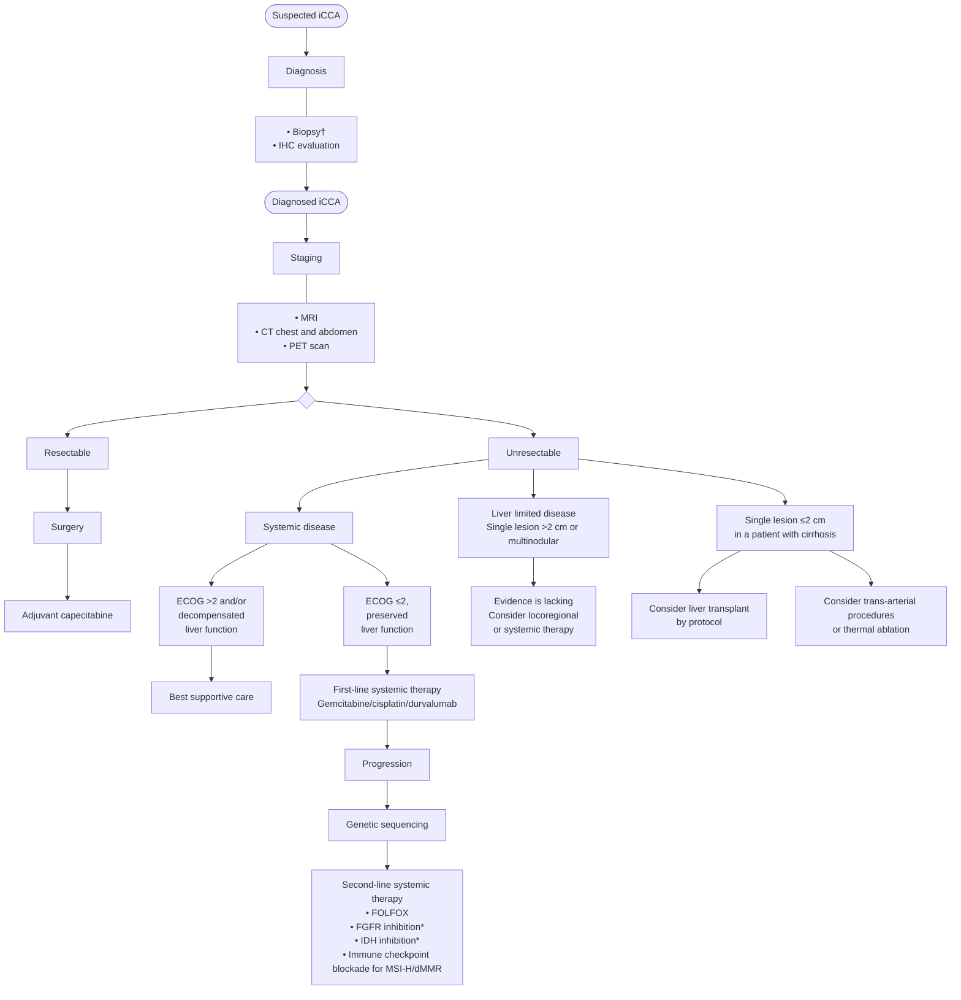

An update to this article is included at the end
Clinical Practice Guidelines
JOURNAL OF HEPATOLOGY

# EASL-ILCA Clinical Practice Guidelines on the management of intrahepatic cholangiocarcinoma☆

European Association for the Study of the Liver*

## Summary
Intrahepatic cholangiocarcinoma (iCCA) develops inside the liver, between bile ductules and the second-order bile ducts. It is the second most frequent primary liver cancer after hepatocellular carcinoma, and its global incidence is increasing. It is associated with an alarming mortality rate owing to its silent presentation (often leading to late diagnosis), highly aggressive nature and resistance to treatment. Early diagnosis, molecular characterisation, accurate staging and personalised multidisciplinary treatments represent current challenges for researchers and physicians. Unfortunately, these challenges are beset by the high heterogeneity of iCCA at the clinical, genomic, epigenetic and molecular levels, very often precluding successful management. Nonetheless, in the last few years, progress has been made in molecular characterisation, surgical management, and targeted therapy. Recent advances together with the awareness that iCCA represents a distinct entity amongst the CCA family, led the ILCA and EASL governing boards to commission international experts to draft dedicated evidence-based guidelines for physicians involved in the diagnostic, prognostic, and therapeutic management of iCCA.

© 2023 European Association for the Study of the Liver. Published by Elsevier B.V. All rights reserved.

## Introduction
Intrahepatic cholangiocarcinoma (iCCA) represents the second most frequent primary liver cancer after hepatocellular carcinoma (HCC). The increase in incidence and mortality reported worldwide (Fig. 1), recent advances in our pathobiological understanding, the identification of actionable molecular targets, and the need to clarify various aspects of clinical management led the European Association for the Study of the Liver (EASL) and International Liver Cancer Association (ILCA) governing boards (GBs) to commission international experts to draft dedicated guidelines. Indeed, the aetiology, risk factors, pathobiology, molecular biology and clinical management of iCCA are completely different with respect to perihilar CCA (pCCA) and distal CCA (dCCA), thus justifying guidelines specifically dedicated to iCCA. That said, guidelines exclusively dedicated to iCCA are rare and need updating. The current guidelines were formulated with the aim of guiding physicians towards an evidence-based approach to managing the diagnostic, prognostic, and therapeutic challenges of iCCA. Clinical recommendations, from diagnostic suspicion to diagnosis and treatment, are formulated in a pragmatic manner that considers the clinical outcomes with the greatest impact as well as patient needs. The target users of these guidelines are general practitioners and specialised clinicians involved in the care of patients with iCCA.

## Methods
The EASL and ILCA GBs nominated (August 2020) two chairs and the members of the guideline expert panel, respecting gender balance, geographic representation and competence. Specifically, representatives from the EASL and ILCA GBs, co-chairs, experts of Pathology, Radiology, Clinical Oncology, Clinical Hepatology, Surgery and a methodologist joined the expert panel. The Delphi panel was then established, consisting of 34 physicians with gender balance, broad geographical representation and competence, and including patient representatives (S. Lindsey, Cholangiocarcinoma Foundation; H. Morement, AMMF, The Cholangiocarcinoma Charity). The development of the clinical practice guidelines followed EASL’s standard operating procedure. Objectives were defined, and target users and key issues were identified. Agreement on the PICO (Population/problem, Intervention, Comparison, and Outcome) format, key questions, level of evidence (LoE) and recommendations was determined, with a threshold of 75% agreement among the expert panel and the Delphi panel required for approval. Relevant evidence from literature specifically focusing on iCCA was retrieved and evaluated to determine the LoE and formulate recommendations in accordance with the Oxford Centre for Evidence-based Medicine (OCEBM) guidelines.

Keywords: diagnosis; intrahepatic cholangiocarcinoma; management; risk factors; staging; targeted therapy.
Received 10 March 2023; accepted 10 March 2023; available online 20 April 2023

* Corresponding author. Address: European Association for the Study of the Liver (EASL), The EASL Building – Home of Hepatology, 7 rue Daubin, CH 1203 Geneva, Switzerland. Tel.: +41 (0) 22 807 03 60; fax: +41 (0) 22 328 07 24. E-mail address: easloffice@easloffice.eu
☆ Clinical Practice Guideline Panel: Chairs: Domenico Alvaro, Gregory J. Gores; Secretary: Joël Walicki; Panel members: Cesare Hassan, Gonzalo Sapisochin, Mina Komuta, Alejandro Forner, Juan W. Valle, Andrea Laghi, Sumera I. Ilyas, Joong-Won Park, Robin K. Kelley. EASL GB representative: Maria Reig; ILCA GB representative: Bruno Sangro.
https://doi.org/10.1016/j.jhep.2023.03.010
The page includes a QR code and logos for Elsevier and EASL (The Home of Hepatology).
Journal of Hepatology, July 2023. vol. 79 | 181–208

The following tables present mortality data for intrahepatic cholangiocarcinoma (iCCA) by country and gender, as shown on the world map in Figure 1.

**Europe**
<table>
  <thead>
    <tr>
        <th>Country</th>
        <th>Men</th>
        <th>Women</th>
        <th>Country</th>
        <th>Men</th>
        <th>Women</th>
        <th>Country</th>
        <th>Men</th>
        <th>Women</th>
        <th>Country</th>
        <th>Men</th>
        <th>Women</th>
    </tr>
  </thead>
  <tbody>
    <tr>
        <td>UK</td>
        <td>1.71</td>
        <td>1.64</td>
        <td>Denmark</td>
        <td>1.01</td>
        <td>0.95</td>
        <td>Czech Republic</td>
        <td>0.67</td>
        <td>0.50</td>
        <td>Norway</td>
        <td>1.36</td>
        <td>1.01</td>
    </tr>
    <tr>
        <td>Netherlands</td>
        <td>1.24</td>
        <td>1.04</td>
        <td>Germany</td>
        <td>1.27</td>
        <td>0.92</td>
        <td>Austria</td>
        <td>4.00</td>
        <td>2.20</td>
        <td>Sweden</td>
        <td>0.81</td>
        <td>0.61</td>
    </tr>
    <tr>
        <td>Belgium</td>
        <td>1.63</td>
        <td>1.03</td>
        <td>Switzerland</td>
        <td>1.39</td>
        <td>0.96</td>
        <td>Hungary</td>
        <td>0.53</td>
        <td>0.37</td>
        <td>Finland*</td>
        <td>1.04</td>
        <td>0.82</td>
    </tr>
    <tr>
        <td>France</td>
        <td>1.89</td>
        <td>1.14</td>
        <td>Italy</td>
        <td>1.11</td>
        <td>0.72</td>
        <td>Croatia</td>
        <td>1.09</td>
        <td>0.72</td>
        <td>Lithuania*</td>
        <td>0.62</td>
        <td>0.61</td>
    </tr>
    <tr>
        <td>Spain</td>
        <td>1.86</td>
        <td>1.09</td>
        <td colspan="6"></td>
        <td>Belarus</td>
        <td>0.58</td>
        <td>0.36</td>
    </tr>
    <tr>
        <td>Portugal</td>
        <td>2.12</td>
        <td>0.99</td>
        <td colspan="9"></td>
    </tr>
  </tbody>
</table>

**Americas**
<table>
  <thead>
    <tr>
        <th>Country</th>
        <th>Men</th>
        <th>Women</th>
    </tr>
  </thead>
  <tbody>
    <tr>
        <td>Canada</td>
        <td>1.69</td>
        <td>1.37</td>
    </tr>
    <tr>
        <td>USA</td>
        <td>1.16</td>
        <td>0.98</td>
    </tr>
    <tr>
        <td>Mexico</td>
        <td>0.49</td>
        <td>0.64</td>
    </tr>
    <tr>
        <td>Puerto Rico</td>
        <td>0.71</td>
        <td>0.41</td>
    </tr>
    <tr>
        <td>Venezuela*</td>
        <td>0.35</td>
        <td>0.37</td>
    </tr>
    <tr>
        <td>Colombia</td>
        <td>0.58</td>
        <td>0.71</td>
    </tr>
    <tr>
        <td>Brazil</td>
        <td>0.42</td>
        <td>0.40</td>
    </tr>
    <tr>
        <td>Chile</td>
        <td>0.83</td>
        <td>0.70</td>
    </tr>
    <tr>
        <td>Argentina</td>
        <td>0.19</td>
        <td>0.14</td>
    </tr>
  </tbody>
</table>

**Middle East**
<table>
  <thead>
    <tr>
        <th>Country</th>
        <th>Men</th>
        <th>Women</th>
    </tr>
  </thead>
  <tbody>
    <tr>
        <td>Israel</td>
        <td>0.87</td>
        <td>0.79</td>
    </tr>
  </tbody>
</table>

**Oceania**
<table>
  <thead>
    <tr>
        <th>Country</th>
        <th>Men</th>
        <th>Women</th>
    </tr>
  </thead>
  <tbody>
    <tr>
        <td>Australia</td>
        <td>1.75</td>
        <td>1.47</td>
    </tr>
    <tr>
        <td>New Zealand</td>
        <td>1.30</td>
        <td>0.81</td>
    </tr>
  </tbody>
</table>

<table>
  <thead>
    <tr>
      <th>Japan</th>
      <th>1.15</th>
      <th>0.58</th>
    </tr>
  </thead>
  <tbody>
    <tr>
      <td>Hong Kong</td>
      <td>2.33</td>
      <td>1.68</td>
    </tr>
  </tbody>
</table>

**Legend**
<table>
  <thead>
    <tr>
        <th>Symbol/Color</th>
        <th>Value/Range</th>
        <th>Description</th>
        <th></th>
    </tr>
  </thead>
  <tbody>
    <tr>
        <td>● (Blue)</td>
        <td>Men</td>
        <td rowspan="2"></td>
        <td></td>
    </tr>
    <tr>
        <td>● (Purple)</td>
        <td>Women</td>
        <td></td>
        <td></td>
    </tr>
    <tr>
        <td>Light Yellow</td>
        <td>0-0.5</td>
        <td rowspan="5">Average mortality rate per 100,000 person-years (2015-2018)</td>
        <td></td>
    </tr>
    <tr>
        <td>Yellow</td>
        <td>0.5-1.0</td>
        <td></td>
    </tr>
    <tr>
        <td>Orange</td>
        <td>1.0-1.5</td>
        <td></td>
    </tr>
    <tr>
        <td>Dark Orange</td>
        <td>1.5-2</td>
        <td></td>
    </tr>
    <tr>
        <td>Red</td>
        <td>&gt;2</td>
        <td></td>
        <td></td>
    </tr>
    <tr>
        <td>*</td>
        <td colspan="2"></td>
        <td>(2012)</td>
    </tr>
  </tbody>
</table>

**Fig. 1. Mortality associated with iCCA in different geographic areas.** Data obtained from: Hucke F. et al. Cancers 2022, 14, 3093. https://doi.org/10.3390/cancers14133093; Turati F. et al. Hepatoma Res 2022;8:19 DOI: 10.20517/2394-5079.2021.130; and Bertuccio P. et al. J Hepatol 2019; 71(1): 104-114. https://doi.org/10.1016/j.jhep.2019.03.013. *for Venezuela, Finland and Lithuania data are related to the year 2012.

**Objectives:** These guidelines were formulated with the objective of guiding physicians towards an evidence-based approach to the diagnostic, prognostic, and therapeutic management of iCCA. Clinical recommendations, from diagnostic suspicion to diagnosis, staging and treatment, are formulated in a pragmatic manner that considers the clinical outcomes with the greatest impact as well as patient needs.

**Target users:** the target users of these guidelines are general practitioners and specialised physicians involved in the care of patients with iCCA.

The expert panellists were involved in identifying key clinical questions. PICOs were detailed and used to formulate the key questions for which evidence was retrieved from the literature. Each key question was developed by a single member of the expert panel, chosen based on specific experience, and reviewed by all members of the expert panel, including a methodologist, and finally voted on by the Delphi panel. A special effort was made to identify key questions not covered by existing guidelines or that required updating based on recent scientific advances. The expert panel decided to consider only key questions for which an agreement >75% was reached among the Delphi panellists.

For the evaluation of evidence, a systematic literature review was carried out using PubMed, Scopus, Embase and/or the Cochrane library. LoE and Recommendations (Table 1 and 2) were developed and graded (according to OCEBM) by a single member of the expert panel and then revised and voted on by all the panellists. When an agreement >75% was reached, LoE and

**Table 1. Level of evidence based on the Oxford Centre for Evidence-based Medicine (adapted from The Oxford 2011 Levels of Evidence).**
<table>
  <thead>
    <tr>
        <th>Level</th>
        <th>Criteria</th>
        <th>Simple model for high, intermediate and low evidence</th>
    </tr>
  </thead>
  <tbody>
    <tr>
        <td>1</td>
        <td>Systematic reviews (SR) (with homogeneity) of randomised controlled trials (RCT)</td>
        <td>Further research is unlikely to change our confidence in the estimate of benefit and risk</td>
    </tr>
    <tr>
        <td>2</td>
        <td>Randomised controlled trials (RCT) or observational studies with dramatic effects; systematic reviews (SR) of lower quality studies (i.e. non-randomised, retrospective)</td>
        <td></td>
    </tr>
    <tr>
        <td>3</td>
        <td>Systematic reviews (SR) of lower quality studies (i.e. non-randomised, retrospective)</td>
        <td>Further research (if performed) is likely to have an impact on our confidence in the estimate of benefit and risk and may change the estimate</td>
    </tr>
    <tr>
        <td>4</td>
        <td>Case-series, case-control, or historically controlled studies (systematic review is generally better than an individual study)</td>
        <td></td>
    </tr>
    <tr>
        <td>5</td>
        <td>Expert opinion (mechanism-based reasoning)</td>
        <td>Any estimate of effect is uncertain</td>
    </tr>
  </tbody>
</table>

182 Journal of Hepatology, July 2023. vol. 79 | 181–208

Clinical Practice Guidelines

**Table 2. Grades of recommendation.**

<table>
  <thead>
    <tr>
        <th>Grade</th>
        <th>Wording</th>
        <th>Criteria</th>
    </tr>
  </thead>
  <tbody>
    <tr>
        <td>Strong</td>
        <td>Shall, should, is recommended.&lt;br/&gt;Shall not, should not, is not recommended</td>
        <td>Evidence, consistency of studies, risk-benefit ratio, patient preferences, ethical obligations, feasibility</td>
    </tr>
    <tr>
        <td>Weak or open</td>
        <td>Can, may, is suggested.&lt;br/&gt;May not, is not suggested.</td>
        <td></td>
    </tr>
  </tbody>
</table>

Recommendations were submitted for voting to the Delphi group where the classification of consensus strength was as follows: Strong consensus if >95% agreement, consensus if >75-95% agreement, majority agreement if >50-75% agreement, no consensus if <50% agreement (see Appendix for Delphi round agreement on the recommendations included herein). The technical solution has been supported by the Clinical Guideline Service group (https://www.guidelineservices.com), which has provided an online platform, where all guideline documents have been uploaded and reviewed.

## Classification

Current anatomic classification of CCA considers iCCA as the subtype arising between the bile ductules and the second-order bile ducts (i.e. segmental bile ducts), pCCA as the subtype arising in the right and/or left hepatic duct and/or at their junction and dCCA as the subtype involving the common bile duct. Recent consensus statements and guidelines agree that this classification is more accurate than the prior classification of CCA as either iCCA or extrahepatic CCA (eCCA), since this eliminates the difficulties in classifying pCCA as iCCA or eCCA. Consistently, the 11th version (ICD-11, 2018) of the International Classification of Diseases codifies these anatomic subtypes of cholangiocarcinoma as follows: iCCA (cod. 2C12.10), pCCA (cod. C18.0), and eCCA (cod. 2C15.0), which refers to adenocarcinoma of the biliary tract and distal bile duct.

Macroscopically, iCCA is categorised into four subtypes: mass-forming (MF; iCCA with nodular aspect), periductal-infiltrating (PI; iCCA infiltrating along the bile duct), MF+PI (i.e. iCCA infiltrating along the bile duct with concurrent invasion into neighbouring liver parenchyma, causing a mass), and intraductal growing;1 however, the intraductal growing type has been reclassified as intraductal papillary neoplasm in the 4th World Health Organization (WHO) classification.

As far as the histological classification is concerned, according to the 5th WHO classification,1 iCCA comprises two distinct subtypes (Fig. 2); the large duct type and the small duct type, both presenting with completely different clinicopathological features and mutation profiles.2–12

At histology, the large duct type shows a clear glandular structure with mucin production associated with desmoplastic reaction. In contrast, the small duct type is a heterogeneous tumour, owing to a varying pattern of ductular proliferation (i.e., ductular reaction like), without mucin production. Clinically, the large duct type occurs in chronic cholangitis caused by primary sclerosing cholangitis (PSC), hepatolithiasis, and liver fluke infection etc., whereas the small duct type often associates with non-biliary chronic liver diseases, such as viral hepatitis and the metabolic syndrome. Long-term outcomes are better in the small duct type compared to the large duct type,2–4 partially because the large bile duct type shows more aggressive pathological features, such as lymphatic and/or perineural invasion. Importantly, there is a significant difference when it comes to treatment choice; the small duct type is known to harbour isocitrate dehydrogenase (IDH)-1 and -2 mutations and fibroblast growth factor receptor (FGFR) fusions which are treatable with currently available targeted therapies. Moreover, the efficacy of these treatments is promising. On the other hand, the large duct type often presents with *KRAS* and *SMAD4* mutations, also observed in the pCCA and dCCA subtypes. These data indicate the utility of subtyping iCCA in terms of clinical outcome and treatment choice. Since there is a clear correlation between pathological iCCA subtypes and genetic alterations2–12 iCCA subtyping is useful to predict genetic alterations in *IDH1/2* and/or *FGFR2*. Therefore, iCCA subtypes should be determined before proceeding with genetic investigations. Certainly, given the typical heterogeneity of iCCA, the accuracy of subclassification is higher in surgical than biopsy specimens.

The available evaluated literature is considered of low quality because of the lack of prospective studies (all studies are retrospective), and the fact that most of the original articles were based on single-centre case studies with limited sample sizes.

Therefore, the subclassification of iCCA into large duct type and small duct type should be considered on the pathology report, given its potential clinical utility, and this subclassification may be used to guide future trial design.

***Should iCCA be subclassified into two subtypes, large duct type and small duct type, as proposed by the 5th WHO classification because genetic alterations of IDH1/2 and FGFR2, which are amenable to targeted therapy, are predominantly observed in the small duct type?***

> ### Recommendations
> Subclassification of iCCA into large duct type and small duct type is suggested, as this may have clinical utility based on its prognostic and therapeutic implications (**LoE 4/5, weak recommendation, consensus**).

***Is iCCA macro classification more reliable and reproducible when considered alongside pathological subclassification, given that the mass-forming+periductal infiltrating subtype is often misrecognised as the mass-forming subtype?***

> ### Recommendations
> iCCA macro classification is suggested in combination with pathological subclassification, as it is more reliable and reproducible (**LoE 4, weak recommendation, consensus**).

Journal of Hepatology, July 2023. vol. 79 | 181–208 183

184 Journal of Hepatology, July 2023. vol. 79 | 181–208

<table>
  <thead>
    <tr>
        <th>Small duct type iCCA</th>
        <th>Large duct type iCCA</th>
    </tr>
  </thead>
  <tbody>
    <tr>
        <td>Normal small bile duct (histology)</td>
        <td>Normal large bile duct (histology)</td>
    </tr>
    <tr>
        <td>Small duct type iCCA (histology)</td>
        <td>Large duct type iCCA (histology)</td>
    </tr>
    <tr>
        <td>Frequent genetic alterations: *IDH1/2*, *FGFR2*, *BAP1*</td>
        <td>Frequent genetic alterations: *KRAS*, *SMAD4*, *TP53*</td>
    </tr>
    <tr>
        <td colspan="2">**Liver Growth Patterns Diagram**&lt;br/&gt;- **Mass forming type (MF)**: localized mass&lt;br/&gt;- **Periductal infiltrating type (PI)**: growth along ducts&lt;br/&gt;- **PI+MF type**: combination of both</td>
    </tr>
  </tbody>
</table>

**Fig. 2. Macroscopic and microscopic classification of iCCA with molecular alterations.** iCCA comprises two distinct subtypes; small duct and large duct types. Small duct type iCCA shows a mass-forming pattern comprising an irregular glandular structure without mucin and apical EMA expression, resembling normal small bile ducts. Importantly, small duct type iCCA harbours actionable mutations, such as *IDH1/2* and *FGFR2* fusions. In contrast, large duct type iCCA shows a periductal-infiltrating growth pattern or a mixed periductal-infiltrating + mass-forming pattern, composed of mucin-producing adenocarcinoma (confirmed by Alcian blue) and cytoplasmic EMA positivity. These features are similar to those of normal large bile ducts. Of note, the intrahepatic bile duct is often dilated in patients with the large duct type iCCA as the tumour infiltrates along the biliary duct, causing biliary stricture/stenosis. EMA, epithelial membrane antigen; iCCA, intrahepatic cholangiocarcinoma.

The distinction between the MF or MF+PI subtype is important as it directs the decision on the type of surgery, as well as reflecting post-surgical outcomes.8,13–18 In brief, the MF+PI subtype is associated with a worse prognosis than the MF subtype because of more frequent lymphatic invasion and perineural invasion in the portal tract.13,16–18 However, being able to distinguish between them is not straightforward as the PI component is not always clearly detectable on imaging. Importantly, macro classification has a clear correlation with iCCA subtype; the iCCA large duct type clearly demonstrates the PI and MF+PI subtypes, whereas the small duct type exclusively presents with the MF subtype. Thus, combination with the pathological iCCA subtype is useful to differentiate MF from MF+PI, as MF+PI presents exclusively in large duct type iCCA. In other words, if large duct iCCA is seen in a MF subtype biopsy, it is almost certainly MF+PI.

The available literature is very limited and the available studies are considered of low quality as most of the original articles were either retrospective and/or single-centre case studies with limited sample sizes.

# Risk factors

Risk factors specific for iCCA with relative odds ratio (OR) are summarized in Table 3. Unfortunately, different studies indicate that no risk factors are identifiable in approximately 60-70% of iCCA;19 hence, prevention and/or surveillance strategies can be only applied to a few patient categories. Nevertheless, monitoring CCA occurrence in at-risk patient subsets is crucial since early diagnosis implies a higher likelihood of diagnosis at early stages, potentially enabling curative treatment and improving survival.

### *Should surveillance for iCCA, using non-invasive imaging (ultrasound, MRI-magnetic resonance cholangiopancreaticography, CT) tools, be recommended in specific populations with established risk factors for iCCA?*

## PSC

<table>
  <thead>
    <tr>
        <th>Recommendations</th>
        <th colspan="2"></th>
    </tr>
  </thead>
  <tbody>
    <tr>
        <td>Annual surveillance with non-invasive radiologic tools is suggested for patients with PSC (**LoE 4</td>
        <td>weak recommendation</td>
        <td>strong consensus**).</td>
    </tr>
  </tbody>
</table>

In the Western world, PSC is the main risk factor for CCA, which represents a relevant cause of mortality in patients with PSC.20–25 The incidence of CCA in patients with PSC is between 0.6-1.5% a year, with a prevalence of 6-13% and a lifetime risk of up to 20%.26 The OR for iCCA in patients with PSC is around 20-25.20–25 Approximately 50% of CCAs are identified within the first year of PSC presentation, though CCA may also constitute the first presentation of previously undiagnosed PSC.20,22,23 The expert panel evaluated studies where the clinical utility (survival, iCCA-related adverse events) of surveillance using non-invasive imaging tools, ultrasound, CT, and MRI+magnetic resonance cholangiopancreaticography (MRI+MRCP), have been assessed. A retrospective study conducted at the Mayo Clinic27 showed the benefit of a surveillance programme consisting of annual imaging with abdominal ultrasound, CT, or MRI+MRCP plus carbohydrate antigen 19-9 (CA19-9) for patients with PSC (11 iCCA cases detected at screening and surveillance). In another retrospective study of 830 patients with PSC, a trend towards higher 5-

Clinical Practice Guidelines

**Table 3. Risk factors for iCCA.**

<table>
  <tbody>
    <tr>
        <td>Risk factors for iCCA</td>
        <td>Study type</td>
        <td>OR/RR</td>
    </tr>
    <tr>
        <td colspan="3">**Liver diseases**</td>
    </tr>
    <tr>
        <td>Choledochal cyst</td>
        <td>Meta-analysis</td>
        <td>OR 26.71</td>
    </tr>
    <tr>
        <td>Choledocholithiasis</td>
        <td>Meta-analysis</td>
        <td>OR 10.08</td>
    </tr>
    <tr>
        <td>Cholelithiasis</td>
        <td>Meta-analysis</td>
        <td>OR 3.38</td>
    </tr>
    <tr>
        <td>Cholecystolithiasis</td>
        <td>Meta-analysis</td>
        <td>OR 1.75</td>
    </tr>
    <tr>
        <td>Caroli disease</td>
        <td>Population-based study</td>
        <td>OR 38</td>
    </tr>
    <tr>
        <td>Primary sclerosing cholangitis</td>
        <td>Population-based study</td>
        <td>OR 22</td>
    </tr>
    <tr>
        <td>Cirrhosis</td>
        <td>Meta-analysis</td>
        <td>OR 15.32</td>
    </tr>
    <tr>
        <td>Chronic hepatitis B</td>
        <td>Meta-analysis</td>
        <td>OR 4.57</td>
    </tr>
    <tr>
        <td>Chronic hepatitis C</td>
        <td>Meta-analysis</td>
        <td>OR 4.28</td>
    </tr>
    <tr>
        <td>Haemochromatosis</td>
        <td>Population-based study</td>
        <td>OR 2.1</td>
    </tr>
    <tr>
        <td>Non-alcoholic fatty liver disease</td>
        <td>Meta-analysis</td>
        <td>OR 2.2</td>
    </tr>
    <tr>
        <td colspan="3">**Extrahepatic comorbidities**</td>
    </tr>
    <tr>
        <td>Inflammatory bowel disease</td>
        <td>Meta-analysis</td>
        <td>OR 2.68</td>
    </tr>
    <tr>
        <td>Chronic pancreatitis</td>
        <td>Population-based study</td>
        <td>OR 2.7</td>
    </tr>
    <tr>
        <td>Type 2 diabetes mellitus</td>
        <td>Meta-analysis</td>
        <td>OR 1.73</td>
    </tr>
    <tr>
        <td>Obesity</td>
        <td>Meta-analysis</td>
        <td>OR 1.14</td>
    </tr>
    <tr>
        <td>Hypertension</td>
        <td>Meta-analysis</td>
        <td>OR 1.10</td>
    </tr>
    <tr>
        <td colspan="3">**Parasitic infections**</td>
    </tr>
    <tr>
        <td>Liver fluke (*Opisthorchis viverrini*, *Clonorchis sinensis*)</td>
        <td>Meta-analysis</td>
        <td>OR 5 iCCA &gt; eCCA</td>
    </tr>
    <tr>
        <td colspan="3">**Lifestyle habits**</td>
    </tr>
    <tr>
        <td>Alcohol consumption</td>
        <td>Meta-analysis</td>
        <td>OR 3.15</td>
    </tr>
    <tr>
        <td>Cigarette smoking</td>
        <td>Meta-analysis</td>
        <td>OR 1.25</td>
    </tr>
    <tr>
        <td colspan="3">**Environmental toxins**</td>
    </tr>
    <tr>
        <td>Thorotrast (until 1969)</td>
        <td>Retrospective study</td>
        <td>RR &gt;300</td>
    </tr>
    <tr>
        <td>1,2- Dichloropropane</td>
        <td>Retrospective study</td>
        <td>RR 15</td>
    </tr>
    <tr>
        <td>Asbestos</td>
        <td>Case-control study</td>
        <td>OR 4.8</td>
    </tr>
    <tr>
        <td>Asbestos</td>
        <td>Case-control study</td>
        <td>OR 1.1–1.7</td>
    </tr>
  </tbody>
</table>
eCCA, extrahepatic cholangiocarcinoma; iCCA, intrahepatic cholangiocarcinoma; OR, odds ratio; RR, relative risk.
Adapted and updated from Banales JM *et al.*249

year iCCA-related survival in the surveillance group compared to the non-surveillance group (21% vs. 8%)28 was reported. More recently,29 the results of a multicentre international retrospective study on surveillance practices (ultrasound and/or MRI, as well as endoscopic retrograde cholangiopancreaticography in two centres) for hepatobiliary cancers, with an average 8 years of follow-up of 2,975 patients with PSC, have been published. Data reported by Bergquist *et al.*29 were very positive since they demonstrated that the overall hazard ratio (HR) for death, adjusted for sex, age and start year of follow-up, were 0.61 for scheduled imaging with and without ERCP. Longitudinal studies evaluating the cost-effectiveness of a specific surveillance programme in patients with PSC are lacking and, due to the rarity of PSC, are unlikely to be feasible.

Acknowledging that these studies are limited by their retrospective nature,27–29 the heterogeneity of PSC populations and surveillance strategies, evidence (Level 4) indicates that annual surveillance for iCCA with non-invasive tools is effective in improving survival of patients with PSC. The accuracy of different non-invasive tests for iCCA surveillance in patients with PSC is covered in the following section.

## Are ultrasound, CT, and MRI accurate for surveillance of CCA in patients with PSC?

> ### Recommendations
> For surveillance of CCA in patients with PSC, among the different imaging modalities, MRI+MRCP is suggested, as it has the highest diagnostic accuracy (LoE 4; weak recommendation, consensus).

There are no papers that strictly match the criteria to answer this question. Early diagnosis of CCA in the setting of PSC is extremely challenging. A rational approach for screening patients with PSC for CCA is interval radiologic assessment using imaging of the biliary tree in combination with CA19-9 every 12 months. The choice of the best radiological method is still under investigation and the amount of evidence that suggests one radiological exam over another is poor. Although CT is generally considered an optimal non-invasive initial investigation for most solid focal liver lesions, there are insufficient data justifying its role for CCA detection in patients with PSC. Walker and colleagues,30 in a recent systematic review that was not focused on iCCA alone, addressed the results of several clinical studies31–33 graded as 1a and 1b according to the LoE outlined by the OCEBM. Out of three studies included in the final evaluation, only one provides data on the diagnostic accuracy of CT: Campbell and co-workers,32 in an attempt to determine the diagnostic yield of CT for diagnosing CCA complicating PSC, reported a mean area under the ROC curve of 0.82 ± 0.07, higher than for cholangiography (0.57 ± 0.08, p = 0.003). MRI data regarding diagnostic accuracy for CCA were not reported in this systematic review. However, the most recent meta-analysis investigating the role of MRI in this setting reported very useful and relevant data. Satiya and colleagues,34 with the primary aim of determining the sensitivity and specificity of MRI+MRCP for the diagnosis of CCA among more than 800 patients with PSC, reported high diagnostic accuracy (sensitivity 98.9%, specificity 99.9%). However, this paper is not focused solely on iCCA.

In conclusion, studies designed to evaluate iCCA alone, in this particular clinical scenario, are still missing and none considered the different subtypes of CCA, which might further

Journal of Hepatology, July 2023. vol. 79 | 181–208 185

186 Journal of Hepatology, July 2023. vol. 79 | 181–208

impact on the diagnostic accuracy of different imaging modalities. However, examining data from studies that include all subtypes of CCA, among different imaging modalities, MRI seems to have higher diagnostic accuracy (and quality of supporting evidence) than ultrasound and CT.

## Cirrhosis

> ### Recommendations
> Ultrasound at 6-monthly intervals is suggested for patients with cirrhosis, as it may be effective for detection of iCCA at an early stage (**LoE 4, weak recommendation, consensus**).

Cirrhosis of any aetiology is an established risk factor for iCCA, with an OR ranging from 9–25. A number of different international guidelines recommend 6-monthly ultrasound surveillance for HCC in patients with cirrhosis of any aetiology, with the goal of diagnosing the disease at early stages. This evidence-based approach certainly facilitates earlier iCCA diagnosis, resulting in identification of patients eligible for effective treatment, including surgical resection and transplantation. Indeed, iCCAs identified during surveillance of patients with cirrhosis are smaller and are more likely to be treated surgically than cancers identified outside of surveillance,35,36 resulting in improved overall survival (OS).35 A recent meta-analysis of 18 studies comprising 355 patients and a registry study of 385 patients, reported that transplantation for very early (single lesions ≤2 cm) iCCA was associated with a pooled 5-year relapse-free survival (RFS) of 67%, indicating a benefit in terms of both survival and recurrence.37 Therefore, evidence (Level 4) indicates that ultrasound at 6-monthly intervals is effective for the early detection of iCCA in patients with cirrhosis, resulting in improved OS.

## Liver flukes

> ### Recommendations
> In patients infected with liver flukes, abdominal ultrasound surveillance, at 6-monthly intervals, is recommended (**LoE 2, strong recommendation, strong consensus**).

Liver fluke infection is the major risk factor for iCCA in Asian countries, where in some geographic areas the incidence is higher than 100/100,000/year. Chronic, recurrent, pyogenic cholangitis along with exogenous carcinogens magnifies the risk of CCA in people living in endemic areas. Vaccines and biomarkers are needed for the primary and secondary prevention of CCA in endemic areas where, most importantly, awareness of liver fluke and the risk of infection should be enhanced. There are currently no strategies to increase early diagnosis of iCCA in patients infected with liver flukes and no international guideline or national policy on CCA screening and surveillance for those living in endemic areas. Siripongsakun S. *et al.*38 compared survival outcomes of patients with CCA recruited through an abdominal ultrasound surveillance programme in Northern Thailand. The surveillance population-based cohort included 4,225 individuals who consented to abdominal ultrasound surveillance at 6-monthly intervals for 5 years. The non-surveillance cohort comprised hospital-based patients. One-hundred and thirty and 22 iCCA cases were detected in the non-surveillance and surveillance groups, respectively. On multivariate analysis, abdominal US surveillance was associated with decreased mortality (HR 0.41). The same group also reported that interval ultrasound surveillance for CCA in an endemic area will place a significant and probably unsustainable workload on small community hospitals.39 Therefore, surveillance approaches that specifically target higher risk populations, to reduce the number of individuals under surveillance, are needed. The CASCAP (CCA screening and care program)40 could achieve important progress by significantly increasing early diagnosis. Participants will undergo ultrasound every 12 months if findings are negative, and every 6 months if periductal fibrosis of the bile duct, fatty liver, or cirrhosis is detected.

The retrieved literature38–40 indicate that in patients infected with liver flukes, abdominal ultrasound surveillance at 6-monthly intervals is associated with decreased mortality.

## Prevention of iCCA in specific at-risk categories of patients

### Liver flukes

**Are health behaviour modification campaigns to be recommended as effective strategies for prevention of liver fluke-associated iCCA in endemic areas?**

> ### Recommendations
> Educational campaigns may be considered as useful tools in changing behaviour to prevent liver fluke infection and re-infection (**LoE 4, weak recommendation, strong consensus**).

The most useful strategy against liver fluke-associated iCCA is prevention of liver fluke infection. In this regard, health education programmes have been increasingly employed (primary prevention) and supported by public health authorities. A programme named "the Lawa model" has been carried out in northeast Thailand, consisting in anthelmintic treatment, novel intensive health education methods (both in the communities and in schools), ecosystem monitoring and active community participation.41,42 The infection rate in more than 10 villages has declined to one-third of the average of 50% estimated at a baseline survey. Specifically, the Cyprinoid fish species, the intermediate host, showed a prevalence <1% with respect to a maximum of 70% at baseline.42 This programme has been underway for over 10 years, and it has been an inspiration for the prevention and control of liver flukes even in different communities in Thailand.43–47 In some regions of Thailand, the objective has been to develop a school-based health education model.48,49 In Khon province for example, a

Clinical Practice Guidelines

motivational theory of protection, including module design, learning materials, student activities and capacity building among teachers was applied and tested in primary school pupils (9–13 years old). Pupils in the intervention group had significantly greater knowledge and better understood the dangers of eating raw fish and of developing CCA than those in the control schools.48

Recently, a randomised clinical trial has been conducted to study the effectiveness of public health interventions in preventing *Opisthorchis viverrini* re-infection in high-prevalence areas of Thailand. This study enrolled individuals who tested positive for OV eggs in faeces and took praziquantel (secondary prevention) before the start of the study. Thirty-four participants were allocated to the experimental group, which received a 12-week public health intervention based on the self-efficacy theory and group process between July and October 2018. The control group received the usual services. The conclusion of this study was that the public health intervention is useful; indeed it educated the experimental group about OV, perceived self-efficacy and self-efficacy expectations in changing behaviour to prevent OV re-infection. As a result, no re-infections were observed after the 12-week intervention nor at the 1-year follow-up.50

Acknowledging the heterogeneity of populations and interventions, the retrieved literature51,52 indicates that educational campaigns could be considered a useful tool in changing behaviour to prevent (primary prevention) liver fluke infection and re-infection, since they significantly decrease infection rates. Although this should reduce iCCA incidence, data on the effects of health behaviour modification campaigns on the incidence of liver fluke-associated iCCA are still lacking.

## Hepatolithiasis

*In patients with hepatolithiasis, could hepatic resection be considered as a strategy to prevent iCCA?*

> **Recommendations**
>
> Given conflicting results, the nature and low quality of published studies (retrospective, observational, single-centre, and limited to specific geographic areas), it is not possible to give a recommendation on hepatic resection as a strategy to prevent iCCA in patients with hepatolithiasis (**LoE 4, no recommendation can be provided, strong consensus**).

Hepatolithiasis is one of the major risk factors for iCCA and is very frequent in Asian countries.19,53,54 Intrahepatic bile duct calculi are associated with recurrent cholangitis, development of biliary strictures, and liver abscess, and are characterised by a high rate of treatment failure and recurrence.55–57 The association between hepatolithiasis and iCCA has been well documented;58,59 with iCCA occurring in 5%–10% of patients with hepatolithiasis.60 Case-control studies have reported very high ORs (5-50) for iCCA in patients with hepatolithiasis. Older age, smoking, a family history of cancer, long symptom duration, bile duct strictures, liver atrophy, left side stone location, residual stone, recurrence of stone, and choledocho-enterostomy are considered independent risk factors.61–65 Hepatectomy significantly reduced the risk of developing iCCA in a Japanese cohort study,64 and similar results were reported in a Western study by Tabrizian *et al.*,65 while two retrospective studies failed to show differences in CCA incidence between patients who underwent hepatectomy and those who did not.62,63 However, the high rates of residual stones, of recurrence of stones, of post-surgical biliary strictures and uncertainty regarding the risk reduction for CCA, has led to the suggestion that hepatectomy could be considered only in selected cases (*i.e.* single lobe hepatolithiasis, atrophy of the affected liver, stricture duration of more than 10 years, long history of biliary-enteric anastomosis).61 However, so far, there are no consistent results regarding strategies to prevent CCA in patients with hepatolithiasis and, even after resection, patients should be carefully followed for development of CCA, because CCA is an independent prognostic factor for survival.61,66–68 The quality of evidence is low since studies62–65 are retrospective, observational, single-centre, and limited to specific geographic areas.

The benefit of surveillance or prevention programmes in patients with the remaining known risk factors for iCCA (Table 3) cannot be evaluated because of the lack of sufficient data in the literature.

## Diagnosis and staging (Fig. 3)

*Is liver tumour biopsy required to make a definitive iCCA diagnosis?*

> **Recommendations**
>
> Tumour biopsy is recommended to obtain a definitive diagnosis. Despite the low quality of evidence, this recommendation was proposed as strong as a definitive diagnosis has critical clinical relevance (**LoE 4, strong recommendation, strong consensus**).

The British Society of Gastroenterology69 and ILCA70 iCCA guidelines recommend obtaining tissue prior to initiating treatment. The need for a biopsy is debated in patients with potentially resectable disease.71 However, tumour biopsy still represents the reference gold standard for evaluation of the diagnostic accuracy of non-invasive tools including imaging.72,73 The biopsy of a suspicious lesion has three major roles: i) confirmation of the iCCA diagnosis, ii) distinguishing iCCA subtypes, and iii) a molecular investigation. In the first instance, iCCA should be distinguished from other primary liver cancers, such as HCC, combined HCC-CCA (cHCC-CCA), and metastatic liver cancers.74–77 The iCCA subtype should then be clarified. These pathological evaluations can be performed by assessing tumour morphology, and immunohistochemistry if necessary.2–5,7,8,75–88 Lastly, a tissue sample can be used for a genetic evaluation, which brings additional value in terms of guiding treatment choice. Complications can occur following tumour biopsy, including tumour dissemination and/or bleeding; however, their occurrence is lower than the calculated incorrect

Journal of Hepatology, July 2023. vol. 79 | 181–208
187

188 Journal of Hepatology, July 2023. vol. 79 | 181–208

**Fig. 3. Diagnosis and management of intrahepatic cholangiocarcinoma.** †Biopsy could be avoided in resectable suspected iCCA since definitive histpathological confirmation can be obtained in the surgical specimens. *For patients harboring these targetable mutations. FGFR, fibroblast growth factor receptor; FOLFOX, oxaliplatin/fluorouracil; iCCA, intrahepatic cholangiocarcinoma; IDH, isocitrate dehydrogenase; PET positron emission tomography.

tumour diagnoses, as imaging alone can result in a false-positive HCC diagnosis in 11.4% to 63% of iCCA cases.72,89 In summary, a definitive diagnosis can only be made with a tumour biopsy.72,73 Specifically, the small duct type iCCA (SD-iCCA), a MF tumour commonly arising from chronic liver diseases, frequently shows clinico-radiological features similar to those of HCC or cHCC-CCA.

The recommendation states that biopsy is recommended to obtain a definitive diagnosis of iCCA. In resectable liver cancer, it is reasonable that a pre-treatment definitive diagnosis is not mandatory and therefore biopsy could be avoided, since definitive histo-pathological confirmation can be obtained in the surgical specimens.

The evaluated studies are of low quality in general due to their retrospective nature, as well as being single-centre studies with limited case numbers.

### Is immunohistochemistry useful to confirm/diagnose iCCA and its subtypes in order to distinguish it from metastatic liver tumours?

<table>
  <thead>
    <tr>
        <th>Recommendations</th>
        <th colspan="2"></th>
    </tr>
  </thead>
  <tbody>
    <tr>
        <td>Immunohistochemistry can be useful to confirm/diagnose iCCA and its subtypes in order to distinguish it from metastatic liver tumours (LoE 4</td>
        <td>weak recommendation</td>
        <td>strong consensus).</td>
    </tr>
  </tbody>
</table>

The utility of immunohistochemistry differs based on iCCA subtypes. The iCCA large duct type should be distinguished from metastatic adenocarcinoma from different sites, such as the colon, lung, breast, and pancreas.75,76,78–86 This is because the liver is one of the most common organs to which tumours metastasise. Moreover, adenocarcinoma is one of the most frequent tumour subtypes in this setting. Therefore, an immunohistochemistry panel is useful to distinguish them, especially in combination with keratin (K) 7/20 plus organ specific markers:1–11 a) iCCA; K7(+), K19(+), K20(-), b) colon; K7(-), K20(+), CDX2/SATB2(+), c) lung; K7(+), K20(-), TTF-1/napsin A (+), d) breast; K7(+), K20(-), GATA3, and e) pancreas; K7(+), K19(+), K20(-), N-cadherin (-). In contrast, the small duct iCCA should be differentiated from HCC and cHCC-CCA.3 Hepatocytic markers, such as Hep Par 1, arginase 1, and ABCB11, are specific for HCC or the hepatocytic component in cHCC-CCA. cHCC-CCA is a tumour composed of both hepatocytic and cholangiocytic differentiation; therefore, recognition of both components, or even just the hepatocytic component, is key.

Finally, determining the iCCA subtype is straightforward in most cases; however, morphology-based interpretation may not be sufficient in the case of poorly differentiated tumours, or a limited tissue sample obtained by needle biopsy. An immunohistochemistry panel is helpful to distinguish the large duct type (S100p and mucicarmine), and the small duct type (CD56 and N-cadherin).2–5,7,8,76,77,87,88

The panel determined the available literature to be of low quality due to the retrospective nature of the studies. In addition, most studies were performed in a single centre, without an external validation cohort, and with limited case numbers.

Clinical Practice Guidelines

### For patients with iCCA, does molecular profiling at time of diagnosis improve the proportion who receive a targeted therapy based upon tumour biomarker results at any time point in disease course?

> **Recommendations**
>
> In patients who are at high risk for recurrence (e.g. node or margin positive, vascular invasion, or multifocal intrahepatic disease), molecular profiling with a comprehensive panel is suggested at the time of diagnosis (**LoE 5; weak recommendation, consensus**).

The clinical utility of a complete molecular profiling (virtually next-generation DNA sequencing [NGS]) at the time of diagnosis is currently debated. Specific debated issues regarding complete molecular profiling are: i) should it only be performed in advanced disease in order to avoid delays in case of non-response to first- and second-line therapies? ii) is this a cost-effective strategy given the very limited number of available therapies? iii) could this strategy help with enrolment in frontline trials for metastatic disease? iv) would a panel reflecting only common targets supported by evidence be a more rational approach?

The guidelines of the European Society for Medical Oncology (ESMO) recommend NGS for all patients with CCA and propose the ESCAT (Scale for Clinical Actionability of Molecular Targets) classification.90 *IDH1* mutations, *FGFR2* fusions, high microsatellite instability and *NTRK* fusions are classified as ESCAT I (ready for routine use), *BRAF* V600E mutations are classified as ESCAT II (undergoing experimentation) since the extent of the benefit is not known and, finally,91–99 the *HER2* alterations are classified as ESCAT III (hypothetical target),100 based on clinical studies in other tumour types or similar molecular alterations.90 Despite the growing importance of the molecular profile in CCA, some challenges remain, mainly concerning the possibility of having an adequate sample of the tumour or a liquid biopsy suitable for complete genomic analysis. Indeed, in clinical practice, it is often difficult to obtain adequate tissue samples for the molecular profile, a frequently encountered problem with pCCA.

In summary, the molecular profile and the corresponding targeted therapies could play an increasingly important role in the management of CCA, but it is necessary to remain aware of the logistical, technical and therapeutic challenges. The key question is whether performing NGS at the time of diagnosis results in better clinical outcomes compared to performing specific molecular analyses only if required for patient enrolment in clinical trials or for treatment with approved drugs (e.g., pemigatinib for iCCA harbouring *FGFR2* fusion/rearrangement or ivosidenib for *IDH1* mutations). Approximately 30-40% of patients with iCCA and lower proportions of patients with pCCA or dCCA harbour potentially actionable molecular aberrations in their tumours.101,102 Based upon evidence of the clinical benefit of inhibitors targeting a selection of these aberrations in molecularly defined subsets of patients with advanced CCA, and in the context of the limited efficacy of second-line chemotherapy, multiple national and international guideline organisations now recommend tumour molecular profiling to guide treatment decisions in patients diagnosed with advanced stages of CCA.90,102,103

The optimal time in a patient’s clinical course to obtain molecular testing and the optimal test platform have not been established in prospective studies. Based upon evidence for greater relative benefit from FGFR-targeted therapy when initiated earlier in the course of treatment for advanced disease, coupled with the potential for delays in obtaining test results due to inadequate or scant biopsy material and the relatively long turnaround time for NGS-based tests, tumour molecular profiling is recommended at the time of diagnosis with advanced or metastatic CCA by multiple guideline panels.90,103 In patients at high risk of recurrence (such as node or margin positive, vascular invasion, or multifocal intrahepatic disease), molecular profiling with a comprehensive panel in earlier stages of disease should be considered.

### Does MRI provide more accurate diagnostic yield and intrahepatic staging of iCCA compared to CT scans?

> **Recommendations**
>
> MRI should be considered instead of CT scanning for staging iCCA within the liver (**LoE 2, strong recommendation, consensus**).

Usually, the first suspicion of iCCA is raised on ultrasound, where iCCA appears as a solid mass with aspecific variable echogenicity (mixed, hypo, or hyperechogenic) with possible dilatation of bile ducts peripheral to the mass.104 The benefit of contrast-enhanced ultrasound in iCCA is controversial, especially in the presence of underlying chronic liver disease.105 At CT, with an unenhanced scan, iCCA appears hypodense with respect to surrounding parenchyma, shows irregular borders and, in some cases, capsular retraction may be observed. At contrast-enhanced scans, the most frequent behaviour is peripheral rim enhancement in the arterial phase (“targetoid” appearance) followed by delayed progression of peripheral to central enhancement caused by tumour fibrosis.106–110 However, arterial enhancement is seen in some small MF-iCCAs, mimicking HCC.107 On MRI, specific sequences such as diffusion-weighted imaging are not helpful in the differential diagnosis between iCCA and HCC and the MRI pattern of enhancement is similar to CT.111–114 When gadoxetic acid or gadobenate dimeglumine are used, the washout should be assessed in the portal phase instead of delayed phases to prevent misclassification with HCC in a cirrhotic liver.111–114 The usefulness of CT/positron emission tomography (PET) is of relevance for lymph node metastasis.115,116 In general, radiologic criteria can only suggest a diagnosis of iCCA in the context of a cirrhotic or non-cirrhotic liver; a definitive diagnosis of iCCA can only be based on histology. Few studies have examined MRI vs. CT for staging iCCA. Most papers look at the role of high-quality MRI or describe the role of CT scanning but very few studies include a head-to-head comparison. The only recent paper using current imaging modalities which addresses this issue was published by Kim et al. in 2021;117 this was a retrospective multicentre study in Korea. When assessing the

Journal of Hepatology, July 2023. vol. 79 | 181–208
189

190 Journal of Hepatology, July 2023. vol. 79 | 181–208

key staging system for iCCA, MRI was superior to CT for T1B, T2, and even T3/T4 tumours. Based on these data, despite a lower LoE, MRI appears to be superior to CT scanning in staging iCCA within the liver.

**Should patients with apparent resectable iCCA routinely undergo PET scanning in order to identify extrahepatic metastasis not apparent on standard CT or MRI during the staging evaluation?**

> ### Recommendations
>
> Given the strong role of PET scanning in identifying lymph node metastasis, patients with apparent resectable iCCA should routinely undergo FDG-PET scanning in order to identify lymph node metastasis not apparent on standard CT scans or MRI during the staging evaluation (**LoE 2, strong recommendation, consensus**).

Two systematic reviews/meta-analyses examined the role of PET staging for CCA. One paper by Lamarca *et al.* in 2019115 examined the role of 18F-fluorodeoxyglucose-PET (FDG-PET) imaging in identifying lymph node or distant metastases. The data are broken down by anatomic subset of CCA including specific data for iCCA. The sensitivity for lymph node metastasis was 37% with a very high specificity of 97%. In the second paper, by Huang *et al.* published in 2020118 no anatomic subset analysis was reported. The paper assessed the role of PET scanning in iCCA/pCCA together and dCCA. The sensitivity for lymph node metastases was higher in this paper at 64% with a lower specificity. This paper also reported information on distant metastases, with a sensitivity of 56% and a very high specificity of 95% for identifying distant metastases. In summary, available data support the use of PET scanning to identify lymph node and/or distant metastases, and consequently guide staging, in patients with iCCA.

**Should patients with apparent resectable iCCA routinely undergo lymph node sampling by endoscopic ultrasound with fine needle aspiration to identify lymph node metastases during the staging evaluation if a positive result would alter management?**

> ### Recommendations
>
> Patients with apparent resectable iCCA should undergo lymph node sampling by endoscopic ultrasound with fine needle aspiration to identify lymph node metastases during the staging evaluation, if a positive result would alter management (**extrapolation from LoE 2 studies, strong recommendation, consensus**).

Although a variety of studies have evaluated the role of endoscopic ultrasound (EUS) in diagnosing pCCA and dCCA by fine needle aspiration, there is very little information available on the role of EUS in identifying lymph node metastases by fine needle aspiration. The primary paper is a single institutional study, retrospective in nature, examining consecutive patients undergoing EUS.119 We emphasise that this is not consecutive patients presenting to the institution. They identified that 17% of patients with iCCA had unsuspected lymph node metastases. Based on these data, we advocate for EUS in this clinical context.

In these patients, lymph node sampling by EUS with fine needle aspiration (usually three accessible lymph nodes are sampled) should be performed after PET (if negative or inconclusive) to guide the decision to proceed or not with surgery. Given the clinical relevance, the recommendation was voted as strong, although additional external confirmatory studies would be welcome.

# Treatment

## Surgery (Fig. 4)

The only curative treatment for iCCA is resection with negative margins that may be achieved after hemihepatectomy, extended hepatectomy, segmentectomy and in some instances resection of the bile duct bifurcation and extrahepatic bile duct. Unfortunately, most patients are unresectable because of late diagnosis: according to the SEER (Surveillance Epidemiology and End Results) database only 15% of patients with iCCA diagnosed between 1983 and 2010 underwent resection.120 Different guidelines and consensus statements strongly recommend R0 surgical resection since this is associated with better clinical outcomes than R1/R2 resections.69,71,103,121 Unfortunately, after diagnosis and staging, anatomo-pathologic conditions compatible with R0 surgical resection occur in a minority of patients and therefore, in tertiary centres, a multidisciplinary discussion on the best treatment option is the norm for most patients with iCCA. The first step in the decisional process is to assess resectability, commonly performed by CT and/or MRI+MRCP. As previously discussed, the occurrence of lymph node metastases frequently requires PET and/or EUS-fine needle aspiration/biopsy for exclusion or confirmation. In patients with iCCA emerging in the context of chronic liver disease, the presence of portal hypertension usually represents a contraindication to liver resection. The residual liver volume (RLV) is critical to avoid post-operative liver failure but also the quality of liver remnant is crucial since atrophy and fibrosis caused by long-lasting cholestasis, or steatosis and fibrosis, may impair the regeneration of the remnant liver after resection. In patients with a normal liver, 25–30% of RLV is sufficient to prevent liver failure in the post-operative phase, while more than 40% of RLV is usually necessary in patients with chronic liver diseases.122

Since post-operative liver failure is the most frequent cause of mortality after extended hepatectomy, strategies to enable this surgical procedure in otherwise resectable tumours have been explored. Currently, portal vein embolisation (PVE) is the most frequent procedure applied in patients undergoing right hepatectomy, extended right hepatectomy, or other parenchymal resections when the RLV is insufficient. Indeed, a recent systematic review showed how PVE resulted in a marked decrease of liver failure and 90-day mortality in patients with CCA undergoing major liver resection.123 Therefore, guidelines

Clinical Practice Guidelines

# Intrahepatic cholangiocarcinoma: Surgical management

Intrahepatic cholangiocarcinoma (iCCA) is a predominantly mass-forming and lymphophilic malignancy of the intrahepatic bile ducts. It is the second most common primary liver cancer after HCC. While relatively rare, the incidence of iCCA is increasing.

**iCCA**
* is increasing in incidence
* is usually diagnosed at a late stage
* has poor prognosis

**Anatomical Classification:**
* Intrahepatic (iCCA)
* Perihilar (pCCA)
* Distal (dCCA)

---

## Liver resection (LR)
LR is the only available curative treatment for iCCA, though only 12-40% of patients referred are resectable. Overall survival at 5-years is 25-40%, and 50-70% face tumor recurrence.

### Selection
Selection of candidates for liver resection is based on oncological-, patient-, and liver-related factors.

<table>
  <thead>
    <tr>
        <th>Indications</th>
        <th>Contraindications</th>
    </tr>
  </thead>
  <tbody>
    <tr>
        <td>• FLR &gt;25% in normal liver</td>
        <td>• FLR &lt;25% in normal liver</td>
    </tr>
    <tr>
        <td>• FLR &gt;40% in chronic liver disease</td>
        <td>• FLR &lt;40% in chronic liver disease</td>
    </tr>
    <tr>
        <td>• High quality FLR</td>
        <td>• Low quality FLR (Steatosis, atrophy, cirrhosis, fibrosis) (relative)</td>
    </tr>
    <tr>
        <td>• Solitary iCCA</td>
        <td>• Peritoneal/distant metastasis</td>
    </tr>
    <tr>
        <td>• Peripheral/accessible location (Low morbidity/mortality)</td>
        <td>• Distant lymph node involvement</td>
    </tr>
    <tr>
        <td></td>
        <td>• Central location (relative) (High morbidity/mortality)</td>
    </tr>
    <tr>
        <td></td>
        <td>• Portal hypertension (relative)</td>
    </tr>
  </tbody>
</table>

### Surgery
Operative technique is a focus for research to improve outcomes and increase resectability.

**Ideal...**
* Anatomic resection
* Laparoscopic resection
* Lymphadenectomy (≥6 nodes for staging)

**Consider...**
* **Vascular resection**
    * For infiltrative iCCA
    * Comparable outcomes
* **Repeat resection**
    * For recurrent iCCA
    * Acceptable morbidity/mortality

---

## Liver transplant (LT)
**! Currently not a standard therapy!**

Retrospective studies are now being conducted with more stringent selection criteria. One major study found a 5-year overall survival of 65% after transplantation for single tumors ≤2 cm.

### Selection
Use of LT in iCCA and selection criteria for these patients is under active study. LT is considered for patients that are unresectable due to location, liver dysfunction, or bilobar disease.

<table>
  <thead>
    <tr>
        <th>Indications</th>
        <th>Contraindications</th>
    </tr>
  </thead>
  <tbody>
    <tr>
        <td>• Unresectable (ex. cirrhotic FLR)</td>
        <td>• Vascular invasion</td>
    </tr>
    <tr>
        <td>• Early stage iCCA (Single tumor ≤2 cm)</td>
        <td>• Extrahepatic disease</td>
    </tr>
    <tr>
        <td>• Locally advanced iCCA</td>
        <td>• Lymph node spread</td>
    </tr>
    <tr>
        <td>- Response to neoadjuvant</td>
        <td>• Locally advanced iCCA</td>
    </tr>
    <tr>
        <td>- Favorable tumor biology</td>
        <td>- No response to neoadjuvant</td>
    </tr>
    <tr>
        <td></td>
        <td>- Unfavorable tumor biology</td>
    </tr>
  </tbody>
</table>

### Surgery
Consider the source of a donor liver and pre-transplant lymph node procurement.

**Living donor liver transplant vs. Deceased donor liver transplant**
* Portal lymphadenectomy
* Staging and prognosis

---

**Fig. 4. Surgical management of iCCA.** dCCA, distal cholangiocarcinoma; DDLT, deceased donor liver transplant; FLR, future liver remnant; iCCA, intrahepatic cholangiocarcinoma; LDLT, living donor liver transplant; LR, liver resection; LT, liver transplant; pCCA, perihilar cholangiocarcinoma; R0 resection, microscopically margin-negative resection.

suggest PVE in patients without jaundice or cirrhosis who are undergoing hepatic resection with insufficient RLV.69,71,103,121 However, two considerations need to be made: i) in patients with chronic liver disease, PVE may not achieve sufficient liver growth and; ii) during the regeneration time tumour spread could occur making resection unfeasible. ALPPS (associating liver partition and portal vein ligation for staged hepatectomy) has also been considered as an approach to induce significant hypertrophy of the remnant liver. However, different studies including an Italian multicentre study124 and a recent case-control study conducted in the ALPPS International Registry,125 showed a high post-operative mortality rate (40-44%) in the setting of iCCA, and therefore ALPPS should be reserved for experienced centres in highly selected patients.121

In cases of small and peripheral lesions, non-anatomical or anatomical resections can be performed while anatomic hepatectomy is usually performed in the case of large iCCAs involving different liver segments.122 However, Si A. et al., analysing data on 702 consecutive patients using a propensity score-matching analysis, concluded that anatomical resection was associated with better survival compared to non-anatomical resection for stage IB or II iCCA without vascular

Journal of Hepatology, July 2023. vol. 79 | 181–208 191

invasion.126 Surgery is often complex for centrally located lesions, due to the close anatomic relationship of the cancer mass with vascular and bile duct structures (*i.e.* first- and second-order portal branches and bile ducts and the suprahepatic veins). In these cases, the bilateral involvement of second-order bile ducts, unilateral liver atrophy with contralateral biliary or vascular involvement, or bile duct infiltration with contralateral vascular involvement usually represent a contraindication to surgical resection. Liver resection together with biliary tree resection is the indicated surgical procedure for tumours invading the ductal bifurcation and/or the main hepatic duct.127,128 Vascular resections are required in some cases of iCCA. Patients undergoing major resections, with resection of the inferior vena cava and portal vein, showed similar outcomes to patients undergoing a conventional resection, indicating that major vascular resections can be considered, without major impact on clinical outcomes, if R0 resection is achievable.129,130

Routine staging laparoscopy is not indicated.121 However, it could be performed to definitively rule-out resectability in patients with iCCA, with multifocal disease, high CA19-9 levels, questionable vascular invasion, or suspicion of peritoneal disease; in this regard, the use of laparoscopic ultrasound may help in identifying intrahepatic metastasis or extensive vascular invasion, undetected by other diagnostic tools.121

Routine portal lymphadenectomy is still a matter of debate; however, most centres would routinely perform this procedure.131,132 The SEER database showed how information on lymph node status was available in only 49% of patients with iCCA undergoing surgical resection.133 Guidelines recommend regional lymphadenectomy as a standard procedure during liver resection for iCCA given that it enables correct staging and better prognostication.69,71,103,121 In this regard, it is relevant to mention how a recent study demonstrated that adequate lymphadenectomy provides better survival outcomes for cN0 patients with node-positive disease on pathology, further supporting the routine use of adequate lymphadenectomy for cN0 iCCA.134 The American Joint Committee on Cancer (AJCC)/Union for International Cancer Control 8th edition of iCCA staging,132 stated that recovery of at least six lymph nodes is recommended for complete nodal staging, similar to the recommendations formulated for gallbladder cancer; indeed, a multi-institutional analysis of 603 patients from 15 centres showed the greatest discriminatory power when more than six lymph nodes were examined and that the analysis of the common hepatic arterial node was highly informative.135

Multifocal iCCA is associated with a dismal prognosis, owing to early and high rates of tumour recurrence after surgery. However, the AJCC classifies iCCA with liver metastases but without lymph node involvement or extrahepatic metastasis as early-stage disease. A modification of AJCC v.8 has recently been proposed by the ENS-CCA (European Network for the Study of Cholangiocarcinoma) group, who proposed a new "M1a stage," (*i.e.* liver metastases: multiple liver lesions, with or without vascular invasion).136 In fact, the authors showed that these patients have a worse prognosis compared to other early stages of disease and a better outcome compared to patients with extrahepatic metastases. This is of relevance because of the need to correctly stratify patients with iCCA and liver metastases in clinical trials. In light of these considerations, although multifocal iCCA cannot be considered an early stage and the benefit of surgery is questionable, the expert panel considered that a key question should be submitted for analysis and evaluation.

***Is surgical resection the treatment option that offers the best outcome in patients with multifocal, unilobar iCCA?***

<table>
  <thead>
    <tr>
        <th>Recommendations</th>
        <th colspan="3"></th>
    </tr>
  </thead>
  <tbody>
    <tr>
        <td>Resection of iCCA may be considered in selected patients with multifocal</td>
        <td>unilobar iCCA (**LoE 4</td>
        <td>weak recommendation</td>
        <td>consensus**).</td>
    </tr>
  </tbody>
</table>

Studies regarding surgical resection in patients with multifocal unilobar iCCA have been evaluated.125,131,136–141 Unfortunately, none of the studies were randomised and the studies examined were mostly retrospective, descriptive and included different types of comparison groups. A study from Yin *et al.*131 demonstrated a longer OS for patients resected than those not resected after propensity score matching, though there was a high risk of selection bias. Another study from Moustafa *et al.*,125 compared liver resection of locally advanced iCCA to palliative chemotherapy and demonstrated better survival for those who underwent surgical resection. This study also used propensity score matching but is also at risk of selection bias. A different study compared patients with multifocal disease who underwent surgical resection to those with single tumours who underwent surgical resection. The median survival of those with multifocal disease was 21.2 months for patients with two tumours and 15.3 months for those with three or more, while it was 43.2 months for those with a single tumour. Another study from Spolverato *et al.*,139 demonstrated similar results, with a 5-year OS rate of 30.5% for patients resected with single tumours and 18.7% for those with multifocal disease. Finally, a retrospective study comparing resection to intra-arterial therapies for multifocal iCCA demonstrated similar median survival for both.140 In summary, data on resection of multifocal iCCA is scarce and the LoE is low. Resection of unilobar multifocal iCCA is feasible but is associated with worse outcomes than resection for a single tumour. Better comparative studies are needed.

This recommendation deserves some commentary, since the decision to offer surgery is a trade-off between surgical risk (age, comorbidities, gross presentation of iCCA and technical issues *etc.*) and oncological benefit. Most surgical guidelines suggest against surgery, but the decision should consider a number of variables including the very high chance of recurrence after surgery, the eventual absence of other options and the possibility of pre-operative chemotherapy to select patients with stable or responsive disease.

***Should patients with iCCA and macroscopic vascular involvement of the inferior vena cava, hepatic vein, or portal vein be considered for surgical resection instead of locoregional and/or systemic treatments?***

192 Journal of Hepatology, July 2023. vol. 79 | 181–208

Clinical Practice Guidelines

> ### Recommendations
> There is insufficient evidence supporting a recommendation for consideration of resection rather than locoregional and/or systemic treatments in patients with iCCA and macroscopic vascular involvement of the inferior vena cava, hepatic vein or portal vein (**LoE 4, no recommendation can be provided, consensus**).

Studies regarding the benefit of surgical resection in patients with macrovascular invasion affecting the inferior vena cava, hepatic vein or portal vein in iCCA have been examined. Unfortunately, none of the studies was randomised and the studies examined were mostly retrospective, descriptive, and single-arm studies that only described the impact of macrovascular invasion after surgical resection on OS/RFS.142–151 Few of them reported the median OS/RFS in this specific population compared to patients without macrovascular invasion (Chan reported median RFS of 6.9 vs. 20.3 months, respectively,143 Bartsch 21-25 months [based on only 27 patients144], and Luo et al. reported 3-year survival of 16.5% vs. 26.8%, respectively151), but most reported that macrovascular invasion had an independent, negative prognostic association with OS/progression free survival (PFS) on multivariate analysis. Only Yoh et al.142 directly compared surgery vs. other treatments, showing significantly better survival in resected patients (23.4 vs. 5.7 months), but this result should be viewed with caution because of the small number of patients (66 vs. 30), the retrospective design, and the risk of selection biases.

In summary, data on resection of iCCA with macrovascular invasion is scarce and the LoE is low. Resection of iCCA with macrovascular invasion is feasible but is associated with significantly worse outcomes than resection for iCCA without vascular invasion, though high-quality comparative studies are lacking. However, in selected cases, resection for iCCA with vascular resections should be considered, after discussion in multidisciplinary boards.

### *Laparoscopic and robotic surgery for iCCA*
In the year 2008, a consensus conference concluded that, among patients with liver cancer, candidates for minimally invasive surgical (MIS) resection should include those with tumour size <5 cm and tumours located in segments 2–6.152 As far as iCCA is concerned, the bulk of literature concerns laparoscopic liver resection, with very few studies using robotic surgery.153,154 Nowadays, MIS resection is increasingly being used resection for iCCA. Studies on laparoscopic resection showed variable results but suggested advantages and benefits of laparoscopic vs. open liver resection for iCCA in terms of improvements in estimated blood loss, perioperative morbidity, and operating room time, with no differences in oncologic outcomes such as R0 resection, rate of lymphadenectomy, and disease-free and overall survival.153,155–158 Robotic surgery could add additional benefits including surgeon comfort, shorter hospital stays and improved short-term outcomes, though there is still very limited data for patients with iCCA. However, it is likely that the robotic approach will also facilitate portal lymphadenectomy159,160 However, the literature is too scarce to enable a comparison of MIS vs. open surgery and this topic is not yet ready to be formally evaluated.

## **Neoadjuvant and adjuvant therapy**
### ***Should systemic neoadjuvant treatment be considered in patients with technically challenging but resectable disease, if an R1 resection is likely to be achievable?***

> ### Recommendations
> Neoadjuvant systemic chemotherapy can be considered in patients with technically challenging but resectable disease, if an R1 resection is likely to be achievable (**LoE 4, weak recommendation, consensus**).

Neoadjuvant systemic chemotherapy may induce a tumour response and render some patients operable after treatment; therefore, neoadjuvant chemotherapy might be considered in patients with initially unresectable disease. No randomised studies were identified comparing neoadjuvant chemotherapy followed by surgery vs. resection alone.122,141,161–177 Decision making currently relies on retrospective series of systemic chemotherapy (n = 5); propensity score-matched analyses (n = 3); two studies of intrahepatic arterial infusion and systemic chemotherapy; and two studies of neoadjuvant chemotherapy prior to transplantation. The largest retrospective series is a French study specifically focused on patients with initially unresectable iCCA.141 Of 186 patients, 74 received chemotherapy (predominantly [59%] gemcitabine and oxaliplatin, or 5-FU (fluorouracil), oxaliplatin and irinotecan [26%], among others); and 39 of those 74 (53%) underwent resection following chemotherapy. The median OS was 24.1 months, which was similar to that observed in patients who had upfront resectable disease (median OS: 25.7 months). The most recent retrospective series reports on 52 patients, of whom 10 received neoadjuvant chemotherapy (gemcitabine+cisplatin [GemCis] in nine and oxaliplatin/5-FU [FOLFOX] in one); three patients had ≥75% necrosis, one had 30% necrosis and three had no evidence of a chemotherapy effect, highlighting the differential effect that can be seen between patients.165

Retrospective series, by their nature, lack a comparator arm to truly gauge the magnitude of benefit. Three propensity score-matched analyses have been reported, all using data from the National Cancer Database. Yadav et al.170 matched 278 patients with stage I-III CCA who received neoadjuvant chemotherapy (203 of whom had iCCA), with 700 patients (487 iCCA) who underwent surgery followed by adjuvant therapy from a pool of 1,450 patients. Patients receiving neoadjuvant chemotherapy had an improved OS (median 40.3 vs. 32.8 months; p = 0.01) and were more likely to have an R0 resection (71.2% vs. 61.6%; p = 0.02); the survival advantage remained significant in the subgroup of patients with iCCA

Journal of Hepatology, July 2023. vol. 79 | 181–208 193

194 Journal of Hepatology, July 2023. vol. 79 | 181–208

(p = 0.04). A second analysis from this Database, spanning the same timeframe (2006–2014) restricted the patient population to iCCA (n = 881; of whom 73 [8.3%] received neoadjuvant chemotherapy). The OS was not statistically significantly different, but there was a significant difference when the analysis was limited to patients with stage II and III disease (HR 0.58; 95% CI 0.37–0.91; p = 0.02), raising the concept of risk-stratification. A third analysis covering an additional 2 years (2006–2016)166 found that neoadjuvant treatment was more likely to be used in patients with radiological evidence of lymph node involvement or T2/T3 disease. After propensity matching for these parameters, they observed a 23% reduction in risk of death from neoadjuvant treatment (HR 0.77; 95% CI 0.61–0.97).

Two studies from the same centre have focused on hepatic arterial infusion (HAI) chemotherapy in combination with systemic chemotherapy. In the first,177 a retrospective series, 104 patients with iCCA confined to the liver received systemic chemotherapy combined with HAI (n = 78) or systemic chemotherapy alone (n = 26). The group receiving combined therapy had a superior OS (30.8 vs. 18.4 months, p <0.001); moreover, eight patients with initially unresectable iCCA were able to undergo surgery following a response to treatment, achieving a median OS of 37 months (range 10.4–92.3 months). A subsequent phase II single-arm study176 was performed to evaluate HAI of floxuridine in combination with systemic gemcitabine and oxaliplatin in patients with unresectable iCCA. The response rate was 58% (22/38 patients) and four patients underwent resection (one achieving a pathological complete response). The median PFS and OS were 11.8 months and 25 months, respectively.

Finally, in three studies, neoadjuvant chemotherapy was followed by liver transplantation rather than resection. In a first study, 21 patients with unresectable iCCA,172 with no extrahepatic disease or vascular involvement, and stable or responding disease for 6 months or more on chemotherapy were referred for transplantation. Of these, 12 were accepted and six underwent liver transplantation. The 5-year survival was 83.3%, although three patients relapsed at a median of 7.6 months. More recently, the same group of authors178 reported outcomes following liver transplantation in patients with disease stability for 6 months on neoadjuvant therapy (GemCis) and with no extrahepatic disease. Among 32 patients listed for liver transplantation, 18 patients underwent liver transplantation with an overall survival at 1-, 3-, and 5-years of 100%, 71%, and 57%, respectively. A third study included patients with both pCCA and iCCA, with tumours <8 cm and no extrahepatic disease. Pre-operative treatment included stereotactic body radiotherapy (if <6 cm) or transarterial chemoembolisation (if >6 cm) followed by 5-FU or capecitabine chemotherapy until transplant; 24 patients were referred and five underwent transplantation (including two patients with iCCA).

In this setting, there is a need for adequately controlled studies that pay careful attention to standardisation of outcomes, duration of therapy and combinations of systemic therapy with radiation, radio- or chemoembolisation and emerging therapies (targeted therapies and immunotherapy). Management of these cases should be discussed by multidisciplinary tumour boards.

**Does adjuvant chemotherapy improve RFS for iCCA after resection compared to no adjuvant therapy?**

> ### Recommendations
> A 6-month course of oral fluoropyrimidine (capecitabine or S1) should be recommended following curative resection of iCCA **(LoE 2, strong recommendation, strong consensus).**

Three randomised clinical trials were identified that specifically address this key question, the PRODIGE 12-ACCORD 18-UNICANCER GI study,179 the BILCAP study180 and the ASCOT study.181 Two additional randomised-controlled studies were excluded: in the KHBO 1208 randomised phase II study182 patients were allocated either gemcitabine or S1 chemotherapy (i.e. there was no control arm of “no chemotherapy”); and in the Takada study,183 which included a mixed population with pancreatic or biliary tract cancer – the biliary tract cohort was not further defined and it was thus not possible to evaluate efficacy specifically in patients with iCCA. Studies which did not include patients with iCCA (i.e. limited the patient population to pCCA and dCCA, gallbladder cancer, or peri-ampullary cancers) were excluded.

Another fluoropyrimidine (S1) has been evaluated in the Japanese ASCOT study181 in which a total of 440 patients were randomised to either surgery alone (n = 222) or adjuvant S1 (n = 218). The study met its primary endpoint (OS) with a HR of 0.694 (95% CI 0.514-0.935; one-sided p = 0.008). The HR for the iCCA subgroup (n = 27 receiving S1 and n = 31 surgery alone) was 0.75 (95% CI 0.30-1.89).

Although none of the cited studies was specifically statistically powered for evaluation of the iCCA subgroup, data support a 6-month course of an oral fluoropyrimidine – capecitabine or S1 (in Japanese patients) following potentially curative resection of iCCA (evidence level 2b – BILCAP; ASCOT). Notably, in the BILCAP study, the HR for iCCA (0.65) was the best among the different CCA subtypes. Recently, the results of the long-term (median follow-up for all patients was 106 months) outcomes of the BILCAP study were published: the median OS was 49.6 months in the capecitabine group compared to 36.1 months in the observation group, without differences depending on the site of CCA (iCCA, dCCA);184 the study was actually negative for the primary endpoint on intention-to-treat analysis, but positive on per protocol analysis.

## Transplantation

**Is early stage iCCA (≤3 cm) an indication for liver transplantation in patients with cirrhosis within a study protocol?**

> ### Recommendations
> Liver transplantation for early stage iCCA (≤3 cm) arising in the setting of cirrhosis can be considered, preferably under study protocols **(LoE 4, weak recommendation, consensus)**

Clinical Practice Guidelines

In many centres, iCCA still represents a contraindication for liver transplant due to high recurrence rates, with microvascular invasion and poor tumour differentiation being associated with tumour recurrence.185,186 While liver transplant remains contraindicated for large iCCA, the scenario is likely going to change for small iCCA.

Studies investigating liver transplantation for early iCCA arising in the context of cirrhosis have been evaluated. The available studies are retrospective, as no prospective, randomised studies have been published to date. In a retrospective, multicentre study, Sapisochin et al. demonstrated that among patients who were found to have iCCA on explant, 15 patients had "very early" iCCA (single tumour ≤2 cm) and 33 patients had "advanced" iCCA (single tumour >2 cm or multifocal disease). The 1-year, 3-year, and 5-year actuarial survival rates were 100%, 73%, and 73%, respectively, in the very early iCCA group compared to 71%, 43%, and 34%, respectively, in the advanced iCCA group.187 A subsequent study led by the same investigators examined liver transplantation for early iCCA vs. advanced iCCA arising in the context of cirrhosis in a larger, international, multicentre cohort. After a median follow-up of 35 months, the 1-year, 3-year, and 5-year actuarial survival rates were 93%, 84%, and 65%, respectively, in the very early iCCA group compared to 79%, 50%, and 45%, respectively, in the advanced iCCA group.188 A subgroup analysis of the patients with advanced iCCA divided patients into intermediate stage (n = 6; single tumours ≤3 cm, not poorly differentiated) and advanced stage (n = 27; all other patients in the advanced group). The 1-, 3-, and 5-year actuarial survival rates were 82%, 61%, 61%, respectively, in the intermediate group compared to 55%, 47%, 42%, respectively, in the advanced group (p <0.5). A multicentre, retrospective study also examined outcomes following liver transplantation in patients with cirrhosis and iCCA >2 cm.189 Among patients with iCCA or cHCC-iCCA ≤2 cm, 1-, 3- and 5-year OS rates were 92%, 87%, and 69%, respectively, compared to 87%, 65%, and 65%, respectively, in patients with iCCA or cHCC-iCCA >2 and ≤5 cm (n = 24).

In summary, the data on liver transplantation for iCCA in patients with cirrhosis are limited and the LoE is low. The available data demonstrate reasonable 5-year survival for a subset of patients with cirrhosis and well-differentiated tumours ≤3 cm. However, prospective, multicentre clinical trials are needed to confirm these results. Therefore, liver transplantation for early stage iCCA (≤3 cm) arising in the setting of cirrhosis should only be considered under study protocols in which multimodal treatment to control tumour progression is implemented.

### Is liver-limited, locally advanced iCCA an indication for liver transplantation in patients without cirrhosis within a study protocol?

<table>
  <thead>
    <tr>
        <th>Recommendations</th>
        <th colspan="2"></th>
    </tr>
  </thead>
  <tbody>
    <tr>
        <td>Liver transplantation for locally advanced iCCA should not be performed outside of clinical trials (LoE 4</td>
        <td>weak recommendation</td>
        <td>consensus).</td>
    </tr>
  </tbody>
</table>

We examined studies regarding liver transplantation in patients with locally advanced iCCA in study protocols. Unfortunately, none of the studies was randomised and the studies examined were mostly retrospective, descriptive and included different types of comparison groups. Several older studies included patients with iCCA as well as pCCA and therefore the results are difficult to interpret. The most relevant study, which was also performed within a study protocol, is the recent study by McMillan et al.178 In these series, they included 32 listed patients who had received neoadjuvant therapy prior, with 18 patients ultimately transplanted. Survival was 49% at 5 years, with a high recurrence rate of ~50%, in the intention-to-treat analysis. In another retrospective analysis recently published by Ito et al.,190 31 patients were transplanted. In this series, the neoadjuvant protocol was less defined. The 5-year actuarial survival was 49%.

In summary, data on liver transplantation for locally advanced iCCA is scarce and the LoE is low. Patients with good and prolonged response to neoadjuvant chemotherapy may benefit from liver transplantation; however, more data within investigational studies is required.

## Treatment of unresectable disease

### Is systemic chemotherapy the first-line option for patients with localised, unresectable iCCA with a good performance status?

<table>
  <thead>
    <tr>
        <th>Recommendations</th>
        <th colspan="3"></th>
    </tr>
  </thead>
  <tbody>
    <tr>
        <td>Patients with unresectable iCCA and good performance status should be treated with GemCis (as first-line chemotherapy)</td>
        <td>with the addition of durvalumab where available (LoE 1</td>
        <td>strong recommendation</td>
        <td>strong consensus).</td>
    </tr>
  </tbody>
</table>

Most patients with iCCA present with large, unresectable tumours and therefore the decision on the best treatment option involves a complex decision-making process requiring multidisciplinary evaluation. Different therapeutic approaches are available for iCCA, including systemic and targeted molecular therapies, locoregional treatments and radiation; however, optimal patient selection for each modality is unclear.

An OS benefit of chemotherapy over best supportive care was demonstrated through a randomised-controlled study in patients with pancreatic and biliary cancer.191 Phase III randomised-controlled studies and a meta-analysis confirmed that GemCis improved OS and PFS significantly compared to gemcitabine alone in patients with advanced biliary tract cancer.192–194 A subgroup analysis from this meta-analysis suggested that patients with good performance status (ECOG PS 0-1) and iCCA benefited from GemCis vs. gemcitabine alone (4). EGFR or VEGFR inhibitors did not improve the efficacy of GemCis.195–197 Recently, durvalumab plus GemCis significantly improved OS (12.8 vs. 11.5 months; HR 0.80; 95% CI 0.66–0.97; p = 0.021) compared with placebo plus GemCis in patients with chemotherapy-naïve advanced biliary tract cancer

Journal of Hepatology, July 2023. vol. 79 | 181–208 195

196 Journal of Hepatology, July 2023. vol. 79 | 181–208

and ECOG PS = 0-1.198 The TOPAZ-1, a double-blind, placebo-controlled, phase III study confirmed the benefit of durvalumab + GemCis in terms of OS, PFS and objective response rate (ORR).199 A phase II study also demonstrated promising results with nab-paclitaxel in addition to GemCis in patients with unresectable biliary tract cancer and an ECOG PS of 0 or 1.200

In summary, evidence indicates that patients with unresectable, advanced iCCA and good performance status should be treated with GemCis (as first-line chemotherapy), with the addition of durvalumab where available.

### Can patients with impaired performance status (e.g. ECOG PS2) be offered modified systemic chemotherapy?

> **Recommendations**
> In patients with iCCA and impaired performance status, gemcitabine monotherapy or plus S-1 combination therapy may provide comparable efficacy with fewer adverse events (**LoE 2, weak recommendation, consensus**).

A randomised phase II trial of chemotherapy-naïve patients with advanced biliary tract cancer and an ECOG PS of 0-2 reported the median time-to-progression or OS were comparable between gemcitabine plus S-1 combination therapy and gemcitabine alone.201 The gemcitabine alone group experienced fewer haematologic adverse events or skin rash. A randomised phase III trial demonstrated that OS of patients treated with gemcitabine plus S-1 was not inferior to that of patients treated with GemCis, with fewer haematologic adverse events.202 A randomised phase II trial reported that PFS/OS were similar in patients receiving cisplatin plus S-1 compared to GemCis, with fewer haematologic adverse events.203 The retrieved literature indicates that gemcitabine plus S-1 or gemcitabine monotherapy can provide comparable efficacy with fewer adverse events. Notably, in these studies,201–203 only a minority of patients (3-14%) had ECOG PS 2 and thus, further studies in this population are needed.

## Locoregional treatment

### Does locoregional therapy with transarterial procedures (selective internal radiation therapy, chemoembolisation and intra-arterial chemotherapy) offer a survival benefit compared to systemic therapy in unresectable, locally advanced iCCA?

> **Recommendations**
> Transarterial procedures (selective internal radiation therapy, chemoembolisation and intra-arterial chemotherapy) are feasible and safe, and may be a reasonable alternative in selected patients with unresectable disease (**LoE 4, weak recommendation, consensus**).

Unfortunately, none of the evaluated studies answering the key question was randomised (there was a randomised-controlled trial evaluating selective internal radiation therapy vs. systemic therapy, the SIRCCA trial, but this was prematurely interrupted because of low recruitment and the preliminary results are not reported) and all studies examined were retrospective, descriptive, and none compared locoregional therapies vs. systemic therapies in locally advanced iCCA. Most studies were performed at a single centre, with small sample sizes and a relevant proportion of patients with advanced iCCA (stage IV), which invalidate any conclusions.176,177,204–216

In summary, data on locoregional therapy with transarterial procedures as an alternative to systemic therapy in unresectable, locally advanced iCCA is scarce and the LoE is low. Transarterial procedures are feasible and safe, and may be a good alternative in some patients with unresectable disease, but comparative studies evaluating survival benefit are needed.

### Is thermal ablation a reliable alternative to surgical treatments for single <2 cm iCCA?

> **Recommendations**
> In unresectable or inoperable patients with a single <2 cm iCCA, thermal ablation can be considered as a good alternative, as it is feasible and safe (**LoE 4, weak recommendation, consensus**).

Unfortunately, none of the studies addressing the key question was randomised and the studies examined were retrospective, descriptive, and only two of them compared ablation vs. resection.217,218 Both studies were retrospective, included a relatively low number of patients, evaluated recurrent iCCA after previous resection, and did not describe the outcome of patients with single tumours <2 cm. In both studies, thermal ablation offered similar outcomes as resection, with the number of nodules serving as an independent prognostic factor. Other studies did not compare ablation vs. resection, and they report a median OS of around 30 months. Only two retrospective, single-centre studies reported with detail the outcomes of patients with single <2 cm iCCAs: Chu *et al.* 2021219 reported a median OS of 33 months in 23 patients with <2 cm tumours and Diaz-González *et al.* 2020220 reported a median OS of 94 months in 10 patients (four of them were alive at the end of follow-up).

In summary, data on the outcomes associated with thermal ablation as an alternative to resection for very early iCCA is scarce and the LoE is low. Ablation is feasible and safe, and may be a good alternative in unresectable patients, but better comparative studies are needed.

Studies on radiofrequency or microwave ablation alone or in combination with chemotherapeutics in patients with advanced unresectable iCCA, or resistance/intolerance to chemotherapeutics are scarce, very heterogeneous and randomised clinical trials are virtually absent. Therefore, the panel has refrained from formulating a key question.

Clinical Practice Guidelines

# Radiation therapy

## Is external beam ablative dose radiation therapy a reliable alternative to systemic therapy in unresectable, liver-limited iCCA?

> ### Recommendations
> Due to insufficient evidence, we cannot recommend in favour or against external beam ablative dose radiation therapy as an alternative to systemic therapy in unresectable liver-limited iCCA (**LoE 4, no recommendation can be provided, consensus**).

None of the studies addressing the key question was randomised and all studies examined were retrospective, descriptive, and none compared external radiotherapy *vs.* systemic therapies in locally advanced iCCA. In addition, most studies were performed at a single centre, with small sample sizes, while the treatment modality was very heterogeneous among the studies, and a relevant proportion of patients had advanced iCCA (stage IV), which invalidate any conclusions.221–230 Only one study was reported as prospective,228 but most patients were already treated with chemotherapy. The reported outcome in terms of OS was very heterogeneous due to the inclusion of different patient profiles.

In summary, data on external beam ablative dose radiation therapy as an alternative to systemic therapy in unresectable, locally advanced iCCA are scarce and the LoE is low. Comparative studies are needed and no recommendation can be made according to the available evidence.

Regarding the potential benefits of external beam radiotherapy, stereotactic body radiotherapy, proton beam therapy alone or in combination with chemotherapy in advanced unresectable iCCA, resistant or intolerant to systemic therapies, the available literature is scarce, of low quality due to the low number of patients enrolled, the heterogeneity of patients and combined treatments, and the retrospective nature of most studies. In addition, the vast majority of studies deal with pCCA rather than iCCA. Therefore, the panel decided to avoid formulation of key questions on combinations of radio- and chemotherapy.

# Targeted therapy and immunotherapy

Recent years have witnessed advances in our understanding of the molecular biology of iCCA, and related target therapies. The most common genes found to be mutated or amplified in iCCA are *ARID1A*, *BAP1*, *EPHA2*, *FGFR2*, *IDH1*, *IDH2*, *KRAS*, *MCL1*, *PTEN*, *PTPN3*, *TP53*, resulting in the overactivation of the related intracellular pathways. Specifically, abnormalities of *FGFR2* and *IDH1/2* genes have recently become more clinical relevant, following FDA and EMA approval of pemigatinib, a selective FGFR2 inhibitor, for locally advanced/metastatic CCA with *FGFR2* rearrangement or fusion, and of FDA approval of infigratinib, a kinase inhibitor active on FGFR2 and futibatinib, a next-generation, covalently binding FGFR1-4 inhibitor. Furthermore, ivosidenib, the IDH1 inhibitor, was recently approved by the FDA for chemotherapy-refractory CCA. Finally, in 2017, the FDA granted swift approval for the use of pembrolizumab in patients with metastatic solid tumours with mismatch repair deficiency (dMMR)/microsatellite instability-high (MSI-H), and more recently of dabrafenib+trametinib for patients carrying the *BRAF*V600E mutation who progressed on prior systemic therapy; this also applies to iCCA.

In general, the panel encourages patients with potentially actionable genetic alterations to enter clinical trials.

## Is checkpoint blockade an option for patients with dMMR/MSI-H, unresectable, advanced iCCA following progression on first-line chemotherapy?

> ### Recommendations
> Immune checkpoint blockade in patients with iCCA and dMMR/MSI-H who have progressed on first-line chemotherapy, should be considered a therapeutic option (**LoE 4, strong recommendation, strong consensus**).

Very limited information is available on the role of immune checkpoint blockade in patients with dMMR/MSI-H, unresectable, advanced iCCA following progression on first-line therapy. The primary study is a prospective, multicentre study that examined the efficacy of PD-1 blockade with pembrolizumab in patients with advanced cancers with dMMR across 12 different solid tumours, including CCA.231 The study enrolled 86 patients who had progressive disease on at least one line of prior therapy. Objective radiographic response was observed in 53% of patients and 21% of patients had complete response. Among the four patients with CCA (description of anatomical site missing) and dMMR/MSI-H, the disease control rate was 100% with one patient having complete response and three patients with stable disease. Thereafter, a variety of basket trials demonstrated durable responses to immune blockade across solid tumours harbouring dMMR/MSI-H. The largest basket trial is the KEYNOTE-158 trial of pembrolizumab in MSI-H (351 patients in total)232 which included 22 patients with biliary tract cancers (subtypes have not been described), among whom the ORR was 41% including three complete responses. The ORR for the overall cohort was 30.8%, indicating that the response of CCA to pembrolizumab is similar to the overall cohort; unfortunately, clinical benefit specifically related to iCCA subtypes was not reported.

The FDA granted accelerated approval of pembrolizumab (May 2017) for MSI-H or dMMR solid tumours and dostarlimab (April 2021) for dMMR solid tumours that have progressed following prior treatment. More recently, in April 2022, the EMA approved pembrolizumab for five different tumour types including biliary tract cancers.

In summary, although the data regarding the role of immune checkpoint blockade in dMMR/MSI-H iCCA that has progressed on prior therapy are limited, the expert panel decided to assign a strong recommendation given the relevant clinical implications. The recommendation is reserved for patients who were treated only with chemotherapeutics in first line, as durvalumab is not available everywhere.

## For iCCA patients with FGFR2 fusions or other rearrangements after progression on standard first-line chemotherapy, does treatment with a FGFR inhibitor improve PFS compared to standard chemotherapy?

Journal of Hepatology, July 2023. vol. 79 | 181–208 197

# Recommendations

> FGFR inhibitors should be recommended for patients with iCCA and *FGFR2* fusions or other rearrangements after progression on standard first-line chemotherapy (LoE 2, strong recommendation, strong consensus).

Three eligible studies addressing the key question were identified. All were large, multicentre phase II trials of pan-FGFR inhibitors in patients with advanced stages of CCA harbouring *FGFR2* gene fusions or rearrangements, after progression on at least one line of prior standard chemotherapy.233–235 Two studies examined ATP-competitive FGFR inhibitors, pemigatinib and infigratinib,233,235 while one examined a covalent, non-ATP-competitive inhibitor, futibatinib.234 In the study of pemigatinib, small cohorts of patients with other types of *FGFR2* gene alterations or wild-type *FGFR2* were also included.233 In these three trials, the primary endpoint was ORR. The reported ORRs for each study were: pemigatinib, 35.5%; infigratinib, 23.1%;235 and futibatinib, 41.7%.234 Across the three studies, the median PFS for patients harbouring *FGFR2* fusions or rearrangements ranged from 6.9 to 9.0 months, with median OS ranging from 12.2 to 21.7 months.233–235 In the phase II study of pemigatinib, which also included small cohorts of patients with other *FGFR2* alterations or without *FGFR2* alterations, the median PFS was 2.1 and 1.7 months and OS was 6.7 and 4.0 months, respectively, and none of these patients experienced an objective response.233–235 In all three studies, subanalyses showed that the ORRs were highest and median PFS and OS were longest in patients with only one or two prior lines of therapy compared to the subgroups with more extensive prior therapy.233–235

Limitations of the existing data include lack of comparative data examining FGFR inhibition vs. chemotherapy in patients with advanced CCA harbouring *FGFR2* fusions or rearrangements. Development of such studies is challenged by the overall low incidence of CCA and the rarity of *FGFR2* fusions or rearrangements, which have been reported to occur in only approximately 5%-10% of iCCAs.195,236,237 Another limitation is that the natural history of *FGFR2* fusion- or rearrangement-positive CCA is not well defined.

In summary, treatment with FGFR inhibition achieves favourable median PFS and OS along with higher ORRs in patients with advanced CCA harbouring *FGFR2* gene fusions or rearrangements when examined in the context of historical studies of second-line chemotherapy in patients with CCA not selected by tumour genotype. Currently no comparative data are available to enable us to evaluate whether FGFR inhibition is superior to chemotherapy for advanced CCA after progression on standard chemotherapy in this population.

Based upon the consistency of evidence that FGFR inhibitors lead to favourable clinical outcomes, in the context of consistent data demonstrating limited efficacy of second-line chemotherapy, multiple national and international guidelines have included FGFR inhibition as a treatment option for advanced CCAs harbouring *FGFR2* fusion or rearrangement after progression on standard chemotherapy.90,102,103

### Is monotherapy with the targeted agent standard of care for second-line therapy in patients with iCCA and targetable mutations?

# Recommendations

> Patients with iCCA with good performance status who progressed on first-line therapy should be treated with: FOLFOX chemotherapy or ivosidenib for those with *IDH1* mutations, FGFR inhibitors for those with *FGFR2* fusions or rearrangements, and immune checkpoint blockade for those with dMMR/MSI-H who have not received durvalumab in first-line (LoE 2, strong recommendation, consensus).

A phase III randomised controlled trial (ABC-06) demonstrated that FOLFOX chemotherapy improved OS significantly compared with active symptom control in patients with biliary tract cancer who progressed on first-line GemCis and had good performance status.238 In addition, irinotecan/5-FU (FOLFIRI) is often used worldwide as a second-line option in patients with contraindications to FOLFOX or as a third-line regimen. In a randomised phase II trial, modified FOLFOX and the modified FOLFIRI showed comparable OS and PFS in patients with biliary tract cancer who progressed after prior GemCis with fewer haematologic adverse events in the modified FOLFIRI group.239 A randomised phase IIb study (NIFTY study) reported that liposomal irinotecan plus 5-FU and leucovorin significantly improved survival compared to 5-FU and leucovorin in Asian patients who progressed on first-line GemCis and had good performance status; the median OS was 7.7 months in patients with iCCA treated with liposomal irinotecan plus 5-FU and leucovorin (n = 35) vs. 5.3 months in those treated with 5-FU and leucovorin (n = 39).240

Mutations of the *IDH* genes are present in 10-28% of iCCAs.94,241,242 *IDH1* mutations are more frequently found than *IDH2* mutations.94,242 A randomised phase III trial (ClarIDHy) of ivosidenib, an oral inhibitor of mutated *IDH1*, proved the significant benefit of PFS over placebo in patients with *IDH1*-mutant CCA and good performance status.243 The OS was also improved; however, it was not statistically significant before adjusting for the crossover design.243,244

Fibroblast growth factor receptor 2 (*FGFR2*) gene alterations are present in about 15% of iCCAs.98,245 A few phase II studies of FGFR inhibitors (pemigatinib, infigratinib, futibatinib and derazantinib) showed promising results with high ORRs and disease control rates in patients with CCA, with *FGFR2* fusions or rearrangements, who progressed on first-line chemotherapy.233,235,246 The most common adverse event was hyperphosphatemia (55-76%).

In summary, the available evidence indicates that patients who progressed on first-line GemCis and have good performance status can be treated with: FOLFOX chemotherapy or ivosidenib for those with *IDH1* mutations, FGFR inhibitors for those with *FGFR2* fusions or rearrangements. Immune checkpoint blockade could be considered for patients for patients with MSI-H/dMMR who have not received durvalumab in first line.

198 Journal of Hepatology, July 2023. vol. 79 | 181–208

Clinical Practice Guidelines

## Assessing recurrence

**After surgery or interventional procedures with curative intent what is the best imaging method to assess recurrence?**

> ### Recommendations
> The choice of the right liver imaging method to assess recurrence after surgery or interventional procedures with curative intent should consider technical issues related to different treatments (e.g. transarterial chemoembolisation, transarterial radioembolisation, surgery). However, we suggest that any imaging evaluation of the liver should always be complemented by a CT scan of the thorax, abdomen and pelvis since recurrence may occur inside or outside the liver **(LoE 4; weak recommendation, consensus).**

There are no papers that strictly match the criteria to answer this key question. The panel examined the literature concerning the assessment of recurrence of iCCA. There are only subpar papers on this topic that are not focused on iCCA alone. Depending on the type of locoregional treatment (chemoembolisation, radiofrequency ablation, radioembolisation, etc), either CT or MRI can be preferred, although no scientific data on iCCA are available and the evidence can be derived from studies on liver metastases and HCC. We identified a single retrospective study assessing the diagnostic utility of dedicated FDG PET and hybrid FDG PET-CT scans in the imaging evaluation of patients with known or suspected recurrent and metastatic CCA.247 An in-depth review of this paper indicated that it is not possible to extrapolate data on iCCA alone. Overall, based on the clinically relevant patient basis for detection of recurrent and metastatic CCA, the sensitivity and specificity of PET (alone and combined with CT) were 94% and 100%, respectively, which is superior to CT alone.

In summary, to the best of our knowledge, there are no significant data suggesting the use of a specific imaging technique for the assessment of recurrence of iCCA. The choice of the right imaging method should consider several technical issues related to different treatments (e.g. transarterial radioembolisation, transarterial chemoembolisation, surgery) and intrinsic limitations of imaging methods. Considering that recurrence after resection may occur inside or outside the liver, a CT scan of the thorax, abdomen and pelvis should always complement any imaging evaluation of the liver during follow-up of patients after potentially curative treatment.248

## Future directions

As with other solid tumours, prevention and early diagnosis represent a priority for iCCA. Hopefully, the next few years will witness progress in the prevention of iCCA in liver fluke endemic areas where awareness of infection risk, health education campaigns (supported by public health authorities), screening and targeting of at high-risk patients could significantly reduce incidence and mortality. Among other known risk factors, metabolic syndrome and its components, including obesity, are emerging as relevant risk factors for iCCA that will require specific campaigns aimed at improving lifestyle. Unfortunately, risk factors are identified in no more than 30% of patients with iCCA, indicating the urgent need to define other causes of disease, including environmental agents and their interaction with genetic determinants. An effective treatment exists for early iCCA, namely surgical resection and likely also liver transplantation, and this should enhance efforts to develop effective strategies for early diagnosis. As in other cancers, circulating biomarkers (non-coding RNA, microRNAs, long non-coding RNAs, circular RNAs, circulating proteins and/or metabolites free or inside extracellular vesicles) are needed to guide diagnosis, and to help predict prognosis and treatment responses. An important advance has recently been achieved in the classification system, since the ICD-11 and ICD-O-4 consider iCCA a completely distinct entity with respect to pCCA; this will certainly improve the accuracy of future epidemiological studies, including risk factors, and will avoid miscoding generated by the old classification of CCA as intrahepatic or extrahepatic. Definitive diagnosis is based on histology and this, paradoxically, represents an advantage with respect to HCC, since this allows for gene profiling, which is becoming important to guide molecularly targeted treatment. Indeed, up to 40% of iCCAs have targetable molecular mutations, amplifications or fusions, creating new opportunities for clinical research. The recently demonstrated efficacy of immunotherapy (*i.e.* durvalumab197,198) in combination with chemotherapy (GemCis) for the treatment of advanced cases heralds the move towards a new treatment paradigm as, in addition to PD-L1 and microsatellite instability, new pathways are currently being investigated with the final aim of better stratifying patients for combination therapies, including those without chemotherapeutics. In general, the ideal management of iCCA requires a multidisciplinary team that should personalise the treatment strategy for each patient by combining genomic, metagenomic, histologic and clinical data on tumour cells, the stroma and patient phenotype, which are the principles of precision medicine. A number of international networks are currently running collaborative multicentre projects, overcoming the limitation of the small number of cases, to: a) develop molecular, histological and radiological registries; b) dissect inter- and intra-tumoural heterogeneity; c) translate findings from animal models to clinical practice; d) identify diagnostic and prognostic biomarkers; e) define driver mutations as well as the metagenomic and transcriptome features of iCCA subtypes and; f) develop new drugs and therapeutic strategies. It is hoped that the results of these multicentre projects will have a significant impact on the management of this cancer, which is still associated with an unacceptably poor prognosis.

Journal of Hepatology, July 2023. vol. 79 | 181–208 199

# Appendix. Delphi round agreement on the recommendations of the present clinical practice guidelines.

<table>
  <thead>
    <tr>
        <th>Recommendation</th>
        <th>Consensus</th>
    </tr>
  </thead>
  <tbody>
    <tr>
        <td>Subclassification of iCCA into large duct type and small duct type is suggested, as this may have clinical utility based on its prognostic and therapeutic implications (LoE 4/5, weak recommendation).</td>
        <td>88%</td>
    </tr>
    <tr>
        <td>iCCA macro classification is suggested in combination with pathological subclassification, as it is more reliable and reproducible (LoE 4, weak recommendation).</td>
        <td>94%</td>
    </tr>
    <tr>
        <td>Annual surveillance with non-invasive radiologic tools is suggested for patients with PSC (LoE 4, weak recommendation).</td>
        <td>97%</td>
    </tr>
    <tr>
        <td>For surveillance of CCA in patients with PSC, among the different imaging modalities, MRI+MRCP is suggested, as it has the highest diagnostic accuracy (LoE 4; weak recommendation).</td>
        <td>93%</td>
    </tr>
    <tr>
        <td>Ultrasound at 6-monthly intervals is suggested for patients with cirrhosis, as it may be effective for detection of iCCA at an early stage (LoE 4, weak recommendation).</td>
        <td>87%</td>
    </tr>
    <tr>
        <td>In patients infected with liver flukes, abdominal ultrasound surveillance, at 6-monthly intervals, is recommended (LoE 2, strong recommendation).</td>
        <td>100%</td>
    </tr>
    <tr>
        <td>Educational campaigns may be considered as useful tools in changing behaviour to prevent liver fluke infection and re-infection (LoE 4, weak recommendation).</td>
        <td>96%</td>
    </tr>
    <tr>
        <td>Given conflicting results, the nature and low quality of published studies (retrospective, observational, single-centre, and limited to specific geographic areas), it is not possible to give a recommendation on hepatic resection as a strategy to prevent iCCA in patients with hepatolithiasis (LoE 4, no recommendation can be provided).</td>
        <td>100%</td>
    </tr>
    <tr>
        <td>Tumour biopsy is recommended to obtain a definitive diagnosis. Despite the low quality of evidence, this recommendation was proposed as strong as a definitive diagnosis has critical clinical relevance (LoE 4, strong recommendation).</td>
        <td>96%</td>
    </tr>
    <tr>
        <td>Immunohistochemistry can be useful to confirm/diagnose iCCA and its subtypes in order to distinguish it from metastatic liver tumours (LoE 4, weak recommendation).</td>
        <td>96%</td>
    </tr>
    <tr>
        <td>In patients who are at high risk for recurrence (e.g. node or margin positive, vascular invasion, or multifocal intrahepatic disease), molecular profiling with a comprehensive panel is suggested at the time of diagnosis (LoE 5, weak recommendation).</td>
        <td>86%</td>
    </tr>
    <tr>
        <td>MRI should be considered instead of CT scanning for staging iCCA within the liver (LoE 2, strong recommendation).</td>
        <td>89%</td>
    </tr>
    <tr>
        <td>Given the strong role of PET scanning in identifying lymph node metastasis, patients with apparent resectable iCCA should routinely undergo FDG-PET scanning in order to identify lymph node metastasis not apparent on standard CT scans or MRI during the staging evaluation (LoE 2, strong recommendation).</td>
        <td>78%</td>
    </tr>
    <tr>
        <td>Patients with apparent resectable iCCA should undergo lymph node sampling by endoscopic ultrasound with fine needle aspiration to identify lymph node metastases during the staging evaluation, if a positive result would alter management (extrapolation from LoE 2 studies, strong recommendation).</td>
        <td>80%</td>
    </tr>
    <tr>
        <td>Resection of iCCA may be considered in selected patients with multifocal, unilobar CCA (LoE 4, weak recommendation).</td>
        <td>88%</td>
    </tr>
    <tr>
        <td>There is insufficient evidence supporting a recommendation for consideration of resection rather than locoregional and/or systemic treatments in patients with iCCA and macroscopic vascular involvement of the inferior vena cava, hepatic vein or portal vein (LoE 4, no recommendation can be provided).</td>
        <td>88%</td>
    </tr>
    <tr>
        <td>Neoadjuvant systemic chemotherapy can be considered in patients with technically challenging but resectable disease, if an R1 resection is likely to be achievable (LoE 4, weak recommendation).</td>
        <td>92%</td>
    </tr>
    <tr>
        <td>A 6-month course of oral fluoropyrimidine (capecitabine or S1) should be considered following potentially curative resection of iCCA (LoE 2, strong recommendation).</td>
        <td>96%</td>
    </tr>
    <tr>
        <td>Liver transplantation for early stage iCCA (≤3 cm) arising in the setting of cirrhosis can be considered, preferably under study protocols (LoE 4, weak recommendation).</td>
        <td>93%</td>
    </tr>
    <tr>
        <td>Liver transplantation for locally advanced iCCA should not be performed outside of clinical trials (LoE 4, weak recommendation).</td>
        <td>81%</td>
    </tr>
    <tr>
        <td>Patients with unresectable iCCA and good performance status should be treated with GemCis (as first-line chemotherapy), with the addition of durvalumab where available (LoE 1, strong recommendation).</td>
        <td>100%</td>
    </tr>
    <tr>
        <td>In patients with iCCA and impaired performance status, gemcitabine monotherapy or plus S-1 combination therapy may provide comparable efficacy with fewer adverse events (LoE 2, weak recommendation).</td>
        <td>95%</td>
    </tr>
    <tr>
        <td>Transarterial procedures (selective internal radiation therapy, chemoembolisation and intra-arterial chemotherapy) are feasible and safe, and may be a reasonable alternative in selected patients with unresectable disease (LoE 4, weak recommendation).</td>
        <td>89%</td>
    </tr>
    <tr>
        <td>In unresectable or inoperable patients with a single &lt;2 cm iCCA, thermal ablation can be considered as a good alternative, as it is feasible and safe (LoE 4, weak recommendation).</td>
        <td>79%</td>
    </tr>
    <tr>
        <td>Due to insufficient evidence, we cannot recommend in favour or against external beam ablative dose radiation therapy as an alternative to systemic therapy in unresectable liver-limited iCCA (LoE 4, no recommendation can be provided).</td>
        <td>87%</td>
    </tr>
    <tr>
        <td>Immune checkpoint blockade in patients with iCCA and dMMR/MSI-H who have progressed on first-line chemotherapy, should be considered a therapeutic option (LoE 4, strong recommendation).</td>
        <td>97%</td>
    </tr>
    <tr>
        <td>FGFR inhibitors should be recommended for patients with iCCA and FGFR2 fusions or other rearrangements after progression on standard first-line chemotherapy (LoE 2, strong recommendation).</td>
        <td>100%</td>
    </tr>
    <tr>
        <td>Patients with iCCA with good performance status who progressed on first-line therapy should be treated with: FOLFOX chemotherapy or ivosidenib for those with IDH1 mutations, FGFR inhibitors for those with FGFR2 fusions or rearrangements, and immune checkpoint blockade for those with dMMR/MSI-H who have not received durvalumab in first-line (LoE 2, strong recommendation).</td>
        <td>93%</td>
    </tr>
    <tr>
        <td>The choice of the right liver imaging method to assess recurrence after surgery or interventional procedures with curative intent should consider technical issues related to different treatments (e.g. transarterial chemoembolisation; transarterial radioembolisation, surgery). However, we suggest that any imaging evaluation of the liver should always be complemented by a CT scan of the thorax, abdomen and pelvis since recurrence may occur inside or outside the liver (LoE 4, weak recommendation).</td>
        <td>85%</td>
    </tr>
  </tbody>
</table>

200 Journal of Hepatology, July 2023. vol. 79 | 181–208

Clinical Practice Guidelines

# Abbreviations
5-FU, fluorouracil; AJCC, American Joint Committee on Cancer; ALPPS, associating liver partition and portal vein ligation for staged hepatectomy; CCA, Cholangiocarcinoma; cHCC-CCA, combined hepatocellular carcinoma-cholangiocarcinoma; dCCA, distal cholangiocarcinoma; dMMR, mismatch repair deficiency; EASL, European Association for the Study of the Liver; eCCA, extrahepatic cholangiocarcinoma; ESCAT, ESMO Scale for Clinical Actionability of molecular targets; ESMO, European Society for Medical Oncology; EUS, endoscopic ultrasound; FDG, fluorodeoxyglucose; FGFR, fibroblast growth factor receptor; FOLFIRI, irinotecan/fluorouracil; FOLFOX, oxaliplatin/fluorouracil; GB, governing board; GemCis, gemcitabine plus cisplatin; HAI, hepatic arterial infusion; HCC, hepatocellular carcinoma; iCCA, intrahepatic cholangiocarcinoma; IDH, isocitrate dehydrogenase; ILCA, International Liver Cancer Association; LoE, Level of evidence; MIS, minimally invasive surgical; MRCP, magnetic resonance cholangiopancreatography; MF, mass-forming; MF+PI, mass-forming+periductal-infiltrating; MSI-H, microsatellite instability-high; NGS, next-generation DNA sequencing; OCEBM, Oxford Centre for Evidence-based Medicine; OR, odds ratio; ORR, objective response rate; OS, overall survival; pCCA, perihilar cholangiocarcinoma; PET, positron emission tomography; PFS, progression-free survival; PICO, Population/problem, Intervention, Comparison, and Outcome; PI, periductal-infiltrating; PVE, portal vein embolisation; PSC, primary sclerosing cholangitis; RLV, residual liver volume; RFS, relapse-free survival; SEER database, Surveillance Epidemiology and End Results database; WHO, World Health Organization.

# Conflict of interest
Please refer to the accompanying EASL disclosure forms for details.

# Acknowledgements
The authors would like to thank the members of the Delphi Panel of this Clinical Practice Guideline for their valuable contribution: Nilo Azad, Maria Antonietta Bali, Chiara Braconi, John Bridgewater, Jordi Bruix, Vincenzo Cardinale, Guido Carpino, Laura Dawson, Julien Edeline, Mary Feng, Junji Furuse, Benjamin Goeppert, Rita Golfieri, Lipika Goyal, Bas Groot Koerkamp, Julie Heimbach, Antoine Hollebecque, Chiun Hsu, Bo Hyun Kim, Angela Lamarca, Stacie Lindsey, Teresa Macarulla, Nancy Man Kwan, Vincenzo Mazzaferro, Joachim Mertens, Helene Morement, Valerie Paradis, Tim Pawlik, Lorenza Rimassa, Maxime Ronot, Riad Salem, Rory Smoot, Parissa Tabrizian, Leonardo da Fonseca. The authors would also like to thank the Governing Board of EASL and ILCA for their valuable contribution to the review process. The authors would additionally like to acknowledge Lorenzo Ridola for the assistance in preparation of the manuscript, Maria Consiglia Bragazzi and Annabel Gravely for support with the figures, and Rosanna Venere and Vincenzo Cardinale for support with the literature search.

# Supplementary data
Supplementary data to this article can be found online at https://doi.org/10.1016/j.jhep.2023.03.010.

Journal of Hepatology, July 2023. vol. 79 | 181–208 201

202 Journal of Hepatology, July 2023. vol. 79 | 181–208

[25] Vinnitskaya E v, Abdulkhakov SR, Abdurakhmanov DT, Alikhanov RB, Bakulin IG, Belousova EA, et al. Important problems in the diagnosis and treatment of primary sclerosing cholangitis (based on the Russian consensus on diagnosis and treatment autoimmune hepatitis. Moscow, 2018). Ter Arkh 2019;91:9–15. https://doi.org/10.26442/00403660.2019.02.000075.

[26] Clements O, Eliahoo J, Kim JU, Taylor-Robinson SD, Khan SA. Risk factors for intrahepatic and extrahepatic cholangiocarcinoma: a systematic review and meta-analysis. J Hepatol 2020;72:95–103. https://doi.org/10.1016/j.jhep.2019.09.007.

[27] Charatcharoenwitthaya P, Enders FB, Halling KC, Lindor KD. Utility of serum tumor markers, imaging, and biliary cytology for detecting cholangiocarcinoma in primary sclerosing cholangitis. Hepatology 2008;48:1106–1117. https://doi.org/10.1002/hep.22441.

[28] Ali AH, Tabibian JH, Nasser-Ghodsi N, Lennon RJ, DeLeon T, Borad MJ, et al. Surveillance for hepatobiliary cancers in patients with primary sclerosing cholangitis. Hepatology 2018;67:2338–2351. https://doi.org/10.1002/hep.29730.

[29] Bergquist A, Weismüller TJ, Levy C, Rupp C, Joshi D, Nayagam JS, et al. Impact on follow-up strategies in patients with primary sclerosing cholangitis. Liver Int 2023;43(1):127–138. https://doi.org/10.1111/liv.15286.

[30] Walker SL, McCormick PA. Diagnosing cholangiocarcinoma in primary sclerosing cholangitis: an “evidence based radiology” review. Abdom Imaging 2008;33:14–17. https://doi.org/10.1007/s00261-007-9314-1.

[31] Campbell WL, Ferris JV, Holbert BL, Thaete FL, Baron RL. Biliary tract carcinoma complicating primary sclerosing cholangitis: evaluation with CT, cholangiography, US, and MR imaging. Radiology 1998;207:41–50. https://doi.org/10.1148/radiology.207.1.9530297.

[32] Campbell WL, Peterson MS, Federle MP, Siqueira ES, Slivka A, Grazioli L, et al. Using CT and cholangiography to diagnose biliary tract carcinoma complicating primary sclerosing cholangitis. Am J Roentgenology 2001;177:1095–1100. https://doi.org/10.2214/ajr.177.5.1771095.

[33] Prytz H, Keiding S, Björnsson E, Broomé U, Almer S, Castedal M, et al. Dynamic FDG-PET is useful for detection of cholangiocarcinoma in patients with PSC listed for liver transplantation. Hepatology 2006;44:1572–1580. https://doi.org/10.1002/hep.21433.

[34] Satiya J, Mousa O, Gupta K, Trivedi S, Oman S, Wijarnpreecha K, et al. Diagnostic yield of magnetic resonance imaging for cholangiocarcinoma in primary sclerosing cholangitis: a meta-analysis. Clin Exp Hepatol 2020;6:35–41. https://doi.org/10.5114/ceh.2020.93054.

[35] Tovoli F, Guerra P, Iavarone M, Veronese L, Renzulli M, de Lorenzo S, et al. Surveillance for hepatocellular carcinoma also improves survival of incidentally detected intrahepatic cholangiocarcinoma arisen in liver cirrhosis. Liver Cancer 2020;9:744–755. https://doi.org/10.1159/000509059.

[36] Jesper D, Heyn SG, Schellhaas B, Pfeifer L, Goertz RS, Zopf S, et al. Effects of liver cirrhosis and patient condition on clinical outcomes in intrahepatic cholangiocarcinoma. Eur J Gastroenterol Hepatol 2018;30:552–556. https://doi.org/10.1097/MEG.0000000000001036.

[37] Ziogas IA, Giannis D, Economopoulos KP, Hayat MH, Montenovo MI, Matsuoka LK, et al. Liver transplantation for intrahepatic cholangiocarcinoma: a meta-analysis and meta-regression of survival rates. Transplantation 2021;105:2263–2271. https://doi.org/10.1097/TP.0000000000003539.

[38] Siripongsakun S, Vidhyarkorn S, Charuswattanakul S, Mekraksakit P, Sungkasubun P, Yodkhunnathum N, et al. Ultrasound surveillance for cholangiocarcinoma in an endemic area: a prove of survival benefits. J Gastroenterol Hepatol 2018;33:1383–1388. https://doi.org/10.1111/jgh.14074.

[39] Sungkasubun P, Siripongsakun S, Akkarachinorate K, Vidhyarkorn S, Worakitsitisatorn A, Sricharunrat T, et al. Ultrasound screening for cholangiocarcinoma could detect premalignant lesions and early-stage diseases with survival benefits: a population-based prospective study of 4,225 subjects in an endemic area. BMC Cancer 2016;16:346. https://doi.org/10.1186/s12885-016-2390-2.

[40] Khuntikeo N, Chamadol N, Yongvanit P, Loilome W, Namwat N, Sithithaworn P, et al. Cohort profile: cholangiocarcinoma screening and care program (CASCAP). BMC Cancer 2015;15:459. https://doi.org/10.1186/s12885-015-1475-7.

[41] Sripa B, Tangkawattana S, Sangnikul T. The Lawa model: a sustainable, integrated opisthorchiasis control program using the EcoHealth approach in the Lawa Lake region of Thailand. Parasitol Int 2017;66:346–354. https://doi.org/10.1016/j.parint.2016.11.013.

[42] Sripa B, Tangkawattana S, Laha T, Kaewkes S, Mallory FF, Smith JF, et al. Toward integrated opisthorchiasis control in northeast Thailand: the Lawa project. Acta Trop 2015;141:361–367. https://doi.org/10.1016/j.actatropica.2014.07.017.

[43] Painsing S, Sripong A, Vensontia O, Pengsaa P, Kompor P, Kootanavanichapong N, et al. Health behavior regarding liver flukes among rural people in Nakhon ratchasima, Thailand. Asian Pac J Cancer Prev 2016;17:2111–2114. https://doi.org/10.7314/APJCP.2016.17.4.2111.

[44] Kompor P, Karn RM, Norkaew J, Kujapun J, Photipim M, Ponphimai S, et al. Population-based intervention for liver fluke prevention and control in meuang Yang district, Nakhon ratchasima province, Thailand. Asian Pac J Cancer Prev 2016;17:685–689. https://doi.org/10.7314/APJCP.2016.17.2.685.

[45] Phatisena P, Eaksanti T, Wichantuk P, Tritipsombut J, Kaewpitoon SJ, Rujirakul R, et al. Behavioral modification regarding liver fluke and cholangiocarcinoma with a health belief model using integrated learning. Asian Pac J Cancer Prev 2016;17:2889–2894.

[46] Kaewpitoon SJ, Thanapatto S, Nuathong W, Rujirakul R, Wakkuwattapong P, Norkaew J, et al. Effectiveness of a health educational program based on self-efficacy and social support for preventing liver fluke infection in rural people of surin province, Thailand. Asian Pac J Cancer Prev 2016;17:1111–1114. https://doi.org/10.7314/APJCP.2016.17.3.1111.

[47] Promthet P, Kessomboon P, Promthet S. Community-based health education and communication model development for opisthorchiasis prevention in a high risk area, Khon Kaen province, Thailand. Asian Pac J Cancer Prev 2015;16:7789–7794. https://doi.org/10.7314/APJCP.2015.16.17.7789.

[48] Laithavewat L, Grundy-Warr C, Khuntikeo N, Andrews RH, Petney TN, Yongvanit P, et al. Analysis of a school-based health education model to prevent opisthorchiasis and cholangiocarcinoma in primary school children in northeast Thailand. Glob Health Promot 2020;27:15–23. https://doi.org/10.1177/1757975918767622.

[49] Bukkhunthod P, Meererksom T, Pechdee P, Ponphimai S, Khiaowichit J, Kaewpitoon N, et al. Animation as supplementary learning material about carcinogenic liver fluke in classes for primary schoolchildren. J Cancer Edu 2020;35:14–21. https://doi.org/10.1007/s13187-018-1434-5.

[50] Songserm N, Namwong W, Woradet S, Sripa B, Ali A. Public health interventions for preventing re-infection of Opisthorchis viverrini : application of the self-efficacy theory and group process in high-prevalent areas of Thailand. Trop Med Int Health 2021;26:962–972. https://doi.org/10.1111/tmi.13598.

[51] Thinkhamrop K, Khuntikeo N, Sithithaworn P, Thinkhamrop W, Wangdi K, Kelly MJ, et al. Repeated praziquantel treatment and Opisthorchis viverrini infection: a population-based cross-sectional study in northeast Thailand. Infect Dis Poverty 2019;8:18. https://doi.org/10.1186/s40249-019-0529-5.

[52] Padchasuwan N, Kaewpitoon SJ, Rujirakul R, Wakkuwattapong P, Norkaew J, Kujapun J, et al. Modifying health behavior for liver fluke and cholangiocarcinoma prevention with the health belief model and social support theory. Asian Pac J Cancer Prev 2016;17:3721–3725.

[53] Ben-Menachem T. Risk factors for cholangiocarcinoma. Eur J Gastroenterol Hepatol 2007;19:615–617. https://doi.org/10.1097/MEG.0b013e328224b935.

[54] Cai H, Kong W-T, Chen C-B, Shi G-M, Huang C, Shen Y-H, et al. Cholelithiasis and the risk of intrahepatic cholangiocarcinoma: a meta-analysis of observational studies. BMC Cancer 2015;15:831. https://doi.org/10.1186/s12885-015-1870-0.

[55] Chen M-F, Jan Y-Y, Hwang T-L, Jeng L-B, Yeh T-S. Impact of concomitant hepatolithiasis on patients with peripheral cholangiocarcinoma. Dig Dis Sci 2000;45:312–316. https://doi.org/10.1023/A:1005460509677.

[56] Chijiiwa K, Ichimiya H, Kuroki S, Koga A, Nakayama F. Late development of cholangiocarcinoma after the treatment of hepatolithiasis. Surg Gynecol Obstet 1993;177:279–282.

[57] Kusano T, Isa T, Ohtsubo M, Yasaka T, Furukawa M. Natural progression of untreated hepatolithiasis that shows no clinical signs at its initial presentation. J Clin Gastroenterol 2001;33:114–117. https://doi.org/10.1097/00004836-200108000-00004.

[58] Chen MF, Jan YY, Wang CS, Jeng LB, Hwang TL, Chen SC. Intrahepatic stones associated with cholangiocarcinoma. Am J Gastroenterol 1989;84:391–395.

[59] Sheen-Chen S-M, Chou F-F, Eng H-L. Intrahepatic cholangiocarcinoma in hepatolithiasis: a frequently overlooked disease. J Surg Oncol 1991;47:131–135. https://doi.org/10.1002/jso.2930470213.

[60] Li H-Y, Zhou S-J, Li M, Xiong D, Singh A, Guo Q-X, et al. Diagnosis and cure experience of hepatolithiasis-associated intrahepatic cholangiocarcinoma in 66 patients. Asian Pac J Cancer Prev 2012;13:725–729. https://doi.org/10.7314/APJCP.2012.13.2.725.

Clinical Practice Guidelines

[61] Kim HJ. Hepatolithiasis and intrahepatic cholangiocarcinoma: a review. World J Gastroenterol 2015;21:13418. https://doi.org/10.3748/wjg.v21.i48.13418.
[62] Cheon YK, Cho YD, Moon JH, Lee JS, Shim CS. Evaluation of long-term results and recurrent factors after operative and nonoperative treatment for hepatolithiasis. Surgery 2009;146:843–853. https://doi.org/10.1016/j.surg.2009.04.009.
[63] Kim HJ, Kim JS, Suh SJ, Lee BJ, Park J-J, Lee HS, et al. Cholangiocarcinoma risk as long-term outcome after hepatic resection in the hepatolithiasis patients. World J Surg 2015;39:1537–1542. https://doi.org/10.1007/s00268-015-2965-0.
[64] Suzuki Y, Mori T, Yokoyama M, Nakazato T, Abe N, Nakanuma Y, et al. Hepatolithiasis: analysis of Japanese nationwide surveys over a period of 40 years. J Hepatobiliary Pancreat Sci 2014;21:617–622. https://doi.org/10.1002/jhbp.116.
[65] Tabrizian P, Jibara G, Shrager B, Schwartz ME, Roayaie S. Hepatic resection for primary hepatolithiasis: a single-center western experience. J Am Coll Surg 2012;215:622–626. https://doi.org/10.1016/j.jamcollsurg.2012.07.005.
[66] Catena M, Aldrighetti L, Finazzi R, Arzu G, Arru M, Pulitanò C, et al. Treatment of non-endemic hepatolithiasis in a western country. The role of hepatic resection. Ann R Coll Surgeons Engl 2006;88:383–389. https://doi.org/10.1308/003588406X98711.
[67] Tsuyuguchi T, Miyakawa K, Sugiyama H, Sakai Y, Nishikawa T, Sakamoto D, et al. Ten-year long-term results after non-surgical management of hepatolithiasis, including cases with choledochoenterostomy. J Hepatobiliary Pancreat Sci 2014;21:795–800. https://doi.org/10.1002/jhbp.134.
[68] Lee T-Y, Chen Y-L, Chang H-C, Chan C-P, Kuo S-J. Outcomes of hepatectomy for hepatolithiasis. World J Surg 2007;31:479–482. https://doi.org/10.1007/s00268-006-0441-6.
[69] Khan SA, Davidson BR, Goldin RD, Heaton N, Karani J, Pereira SP, et al. Guidelines for the diagnosis and treatment of cholangiocarcinoma: an update. Gut 2012;61:1657–1669. https://doi.org/10.1136/gutjnl-2011-301748.
[70] Bridgewater J, Galle PR, Khan SA, Llovet JM, Park J-W, Patel T, et al. Guidelines for the diagnosis and management of intrahepatic cholangiocarcinoma. J Hepatol 2014;60:1268–1289. https://doi.org/10.1016/j.jhep.2014.01.021.
[71] Fong ZV, Brownlee SA, Qadan M, Tanabe KK. The clinical management of cholangiocarcinoma in the United States and Europe: a comprehensive and evidence-based comparison of guidelines. Ann Surg Oncol 2021;28:2660–2674. https://doi.org/10.1245/s10434-021-09671-y.
[72] Mueller C, Waldburger N, Stampfl U, Kauczor H-U, Schirmacher P, Sommer CM, et al. Non-invasive diagnosis of hepatocellular carcinoma revisited. Gut 2018;67:991–993. https://doi.org/10.1136/gutjnl-2017-314981.
[73] Kim DW, Kim SY, Kang HJ, Kang JH, Lee SS, Shim JH, et al. Diagnostic performance of ultrasonography-guided core-needle biopsy according to MRI LI-RADS diagnostic categories. Ultrasonography 2021;40:387–397. https://doi.org/10.14366/usg.20110.
[74] Adam SZ, Parthasarathy S, Miller FH. Intrahepatic cholangiocarcinomas mimicking other lesions. Abdom Imaging 2015;40:2345–2354. https://doi.org/10.1007/s00261-015-0480-2.
[75] Wu J-S, Feng J-L, Zhu R-D, Liu S-G, Zhao D-W, Li N. Histopathological characteristics of needle core biopsy and surgical specimens from patients with solitary hepatocellular carcinoma or intrahepatic cholangiocarcinoma. World J Gastrointest Oncol 2019;11:404–415. https://doi.org/10.4251/wjgo.v11.i5.404.
[76] Kozaka K, Sasaki M, Fujii T, Harada K, Zen Y, Sato Y, et al. A subgroup of intrahepatic cholangiocarcinoma with an infiltrating replacement growth pattern and a resemblance to reactive proliferating bile ductules: ?bile ductular carcinoma? Histopathology 2007;51:390–400. https://doi.org/10.1111/j.1365-2559.2007.02735.x.
[77] Lau SK, Prakash S, Geller SA, Alsabeh R. Comparative immunohistochemical profile of hepatocellular carcinoma, cholangiocarcinoma, and metastatic adenocarcinoma. Hum Pathol 2002;33:1175–1181. https://doi.org/10.1053/hupa.2002.130104.
[78] Hooper JE, Morgan TK, Grompe M, Sheppard BC, Troxell ML, Corless CL, et al. The novel monoclonal antibody HPC2 and N-cadherin distinguish pancreatic ductal adenocarcinoma from cholangiocarcinoma. Hum Pathol 2012;43:1583–1589. https://doi.org/10.1016/j.humpath.2011.11.012.
[79] Vyas M, Davidson B. How do I distinguish cholangiocarcinoma from metastatic carcinoma and why does it matter?. 2021.
[80] Park JH, Kim JH. Pathologic differential diagnosis of metastatic carcinoma in the liver. Clin Mol Hepatol 2019;25:12–20. https://doi.org/10.3350/cmh.2018.0067.
[81] Kälsch J, Padden J, Bertram S, Pott LL, Reis H, Westerwick D, et al. Annexin A10 optimally differentiates between intrahepatic cholangiocarcinoma and hepatic metastases of pancreatic ductal adenocarcinoma: a comparative study of immunohistochemical markers and panels. Virchows Archiv 2017;470:537–543. https://doi.org/10.1007/s00428-017-2114-2.
[82] Wang HL, Kim CJ, Koo J, Zhou W, Choi EK, Arcega R, et al. Practical immunohistochemistry in neoplastic pathology of the gastrointestinal tract, liver, biliary tract, and pancreas. Arch Pathol Lab Med 2017;141:1155–1180. https://doi.org/10.5858/arpa.2016-0489-RA.
[83] Padden J, Ahrens M, Kälsch J, Bertram S, Megger DA, Bracht T, et al. Immunohistochemical markers distinguishing cholangiocellular carcinoma (CCC) from pancreatic ductal adenocarcinoma (PDAC) discovered by proteomic analysis of microdissected cells. Mol Cell Proteomics 2016;15:1072–1082. https://doi.org/10.1074/mcp.M115.054585.
[84] Lok T, Chen L, Lin F, Wang HL. Immunohistochemical distinction between intrahepatic cholangiocarcinoma and pancreatic ductal adenocarcinoma. Hum Pathol 2014;45:394–400. https://doi.org/10.1016/j.humpath.2013.10.004.
[85] Rullier A, le Bail B, Fawaz R, Blanc JF, Saric J, Bioulac-Sage P. Cytokeratin 7 and 20 expression in cholangiocarcinomas varies along the biliary tract but still differs from that in colorectal carcinoma metastasis. Am J Surg Pathol 2000;24:870–876. https://doi.org/10.1097/00000478-200006000-00014.
[86] Shimonishi T, Miyazaki K, Nakanuma Y. Cytokeratin profile relates to histological subtypes and intrahepatic location of intrahepatic cholangiocarcinoma and primary sites of metastatic adenocarcinoma of liver. Histopathology 2000;37:55–63. https://doi.org/10.1046/j.1365-2559.2000.00932.x.
[87] Akita M, Sawada R, Komatsu M, Suleman N, Itoh T, Ajiki T, et al. An immunostaining panel of C-reactive protein, N-cadherin, and S100 calcium binding protein P is useful for intrahepatic cholangiocarcinoma subtyping. Hum Pathol 2021;109:45–52. https://doi.org/10.1016/j.humpath.2020.12.005.
[88] Komuta M, Govaere O, Vandecaveye V, Akiba J, van Steenbergen W, Verslype C, et al. Histological diversity in cholangiocellular carcinoma reflects the different cholangiocyte phenotypes. Hepatology 2012;55:1876–1888. https://doi.org/10.1002/hep.25595.
[89] Joo I, Lee JM, Lee SM, Lee JS, Park JY, Han JK. Diagnostic accuracy of liver imaging reporting and data system (LI-RADS) v2014 for intrahepatic mass-forming cholangiocarcinomas in patients with chronic liver disease on gadoxetic acid-enhanced MRI. J Magn Reson Imaging 2016;44:1330–1338. https://doi.org/10.1002/jmri.25287.
[90] Mosele F, Remon J, Mateo J, Westphalen CB, Barlesi F, Lolkema MP, et al. Recommendations for the use of next-generation sequencing (NGS) for patients with metastatic cancers: a report from the ESMO Precision Medicine Working Group. Ann Oncol 2020;31:1491–1505. https://doi.org/10.1016/j.annonc.2020.07.014.
[91] Wang T, Drill E, Vakiani E, Pak LM, Boerner T, Askan G, et al. Distinct histomorphological features are associated with IDH1 mutation in intrahepatic cholangiocarcinoma. Hum Pathol 2019;91:19–25. https://doi.org/10.1016/j.humpath.2019.05.002.
[92] Lowery MA, Ptashkin R, Jordan E, Berger MF, Zehir A, Capanu M, et al. Comprehensive molecular profiling of intrahepatic and extrahepatic cholangiocarcinomas: potential targets for intervention. Clin Cancer Res 2018;24:4154–4161. https://doi.org/10.1158/1078-0432.CCR-18-0078.
[93] Nakamura H, Arai Y, Totoki Y, Shirota T, Elzawahry A, Kato M, et al. Genomic spectra of biliary tract cancer. Nat Genet 2015;47:1003–1010. https://doi.org/10.1038/ng.3375.
[94] Kipp BR, Voss JS, Kerr SE, Barr Fritcher EG, Graham RP, Zhang L, et al. Isocitrate dehydrogenase 1 and 2 mutations in cholangiocarcinoma. Hum Pathol 2012;43:1552–1558. https://doi.org/10.1016/j.humpath.2011.12.007.
[95] Borger DR, Tanabe KK, Fan KC, Lopez HU, Fantin VR, Straley KS, et al. Frequent mutation of isocitrate dehydrogenase (IDH)1 and IDH2 in cholangiocarcinoma identified through broad-based tumor genotyping. Oncologist 2012;17:72–79. https://doi.org/10.1634/theoncologist.2011-0386.

Journal of Hepatology, July 2023. vol. 79 | 181–208 203

204 Journal of Hepatology, July 2023. vol. 79 | 181–208

[96] Lee H, Ross JS. The potential role of comprehensive genomic profiling to guide targeted therapy for patients with biliary cancer. Therap Adv Gastroenterol 2017;10:507–520. https://doi.org/10.1177/1756283X17698090.

[97] Goeppert B, Folseraas T, Roessler S, Kloor M, Volckmar A, Endris V, et al. Genomic characterization of cholangiocarcinoma in primary sclerosing cholangitis reveals therapeutic opportunities. Hepatology 2020;72:1253–1266. https://doi.org/10.1002/hep.31110.

[98] Graham RP, Barr Fritcher EG, Pestova E, Schulz J, Sitailo LA, Vasmatzis G, et al. Fibroblast growth factor receptor 2 translocations in intrahepatic cholangiocarcinoma. Hum Pathol 2014;45:1630–1638. https://doi.org/10.1016/j.humpath.2014.03.014.

[99] Sia D, Hoshida Y, Villanueva A, Roayaie S, Ferrer J, Tabak B, et al. Integrative molecular analysis of intrahepatic cholangiocarcinoma reveals 2 classes that have different outcomes. Gastroenterology 2013;144:829–840. https://doi.org/10.1053/j.gastro.2013.01.001.

[100] Yan M, Schwaederle M, Arguello D, Millis SZ, Gatalica Z, Kurzrock R. HER2 expression status in diverse cancers: review of results from 37,992 patients. Cancer Metastasis Rev 2015;34:157–164. https://doi.org/10.1007/s10555-015-9552-6.

[101] Bekaii-Saab TS, Bridgewater J, Normanno N. Practical considerations in screening for genetic alterations in cholangiocarcinoma. Ann Oncol 2021;32:1111–1126. https://doi.org/10.1016/j.annonc.2021.04.012.

[102] Verdaguer H, Saurí T, Acosta DA, Guardiola M, Sierra A, Hernando J, et al. ESMO Scale for clinical actionability of molecular targets driving targeted treatment in patients with cholangiocarcinoma. Clin Cancer Res 2022;28:1662–1671. https://doi.org/10.1158/1078-0432.CCR-21-2384.

[103] Benson AB, D’Angelica MI, Abbott DE, Anaya DA, Anders R, Are C, et al. Hepatobiliary cancers, version 2.2021, NCCN clinical practice guidelines in oncology. J Natl Compr Cancer Netw 2021;19:541–565. https://doi.org/10.6004/jnccn.2021.0022.

[104] Hamaoka M, Kozaka K, Matsui O, Komori T, Matsubara T, Yoneda N, et al. Early detection of intrahepatic cholangiocarcinoma. Jpn J Radiol 2019;37:669–684. https://doi.org/10.1007/s11604-019-00860-0.

[105] Galassi M, Iavarone M, Rossi S, Bota S, Vavassori S, Rosa L, et al. Patterns of appearance and risk of misdiagnosis of intrahepatic cholangiocarcinoma in cirrhosis at contrast enhanced ultrasound. Liver Int 2013;33:771–779. https://doi.org/10.1111/liv.12124.

[106] Fujita N, Asayama Y, Nishie A, Ishigami K, Ushijima Y, Takayama Y, et al. Mass-forming intrahepatic cholangiocarcinoma: enhancement patterns in the arterial phase of dynamic hepatic CT - correlation with clinicopathological findings. Eur Radiol 2017;27:498–506. https://doi.org/10.1007/s00330-016-4386-3.

[107] Kim SA, Lee JM, Lee KB, Kim SH, Yoon SH, Han JK, et al. Intrahepatic mass-forming cholangiocarcinomas: enhancement patterns at multiphasic CT, with special emphasis on arterial enhancement pattern—correlation with clinicopathologic findings. Radiology 2011;260:148–157. https://doi.org/10.1148/radiol.11101777.

[108] Kim SJ, Lee JM, Han JK, Kim KH, Lee JY, Choi BI. Peripheral mass–forming cholangiocarcinoma in cirrhotic liver. Am J Roentgenology 2007;189:1428–1434. https://doi.org/10.2214/AJR.07.2484.

[109] Choi J-Y, Kim M-J, Lee JM, Kim KW, Lee JY, Han JK, et al. Hilar cholangiocarcinoma: role of preoperative imaging with sonography, MDCT, MRI, and direct cholangiography. Am J Roentgenology 2008;191:1448–1457. https://doi.org/10.2214/AJR.07.3992.

[110] Iavarone M, Piscaglia F, Vavassori S, Galassi M, Sangiovanni A, Venerandi L, et al. Contrast enhanced CT-scan to diagnose intrahepatic cholangiocarcinoma in patients with cirrhosis. J Hepatol 2013;58:1188–1193. https://doi.org/10.1016/j.jhep.2013.02.013.

[111] Rimola J, Forner A, Reig M, Vilana R, de Lope CR, Ayuso C, et al. Cholangiocarcinoma in cirrhosis: absence of contrast washout in delayed phases by magnetic resonance imaging avoids misdiagnosis of hepatocellular carcinoma. Hepatology 2009;50:791–798. https://doi.org/10.1002/hep.23071.

[112] Chong YS, Kim YK, Lee MW, Kim SH, Lee WJ, Rhim HC, et al. Differentiating mass-forming intrahepatic cholangiocarcinoma from atypical hepatocellular carcinoma using gadoxetic acid-enhanced MRI. Clin Radiol 2012;67:766–773. https://doi.org/10.1016/j.crad.2012.01.004.

[113] Chong DQ, Zhu AX. The landscape of targeted therapies for cholangiocarcinoma: current status and emerging targets. Oncotarget 2016;7:46750–46767. https://doi.org/10.18632/oncotarget.8775.

[114] Choi S-Y, Kim YK, Min JH, Kang TW, Jeong WK, Ahn S, et al. Added value of ancillary imaging features for differentiating scirrhous hepatocellular carcinoma from intrahepatic cholangiocarcinoma on gadoxetic acid-enhanced MR imaging. Eur Radiol 2018;28:2549–2560. https://doi.org/10.1007/s00330-017-5196-y.

[115] Lamarca A, Barriuso J, Chander A, McNamara MG, Hubner RA, ÓReilly D, et al. 18F-fluorodeoxyglucose positron emission tomography (18FDG-PET) for patients with biliary tract cancer: systematic review and meta-analysis. J Hepatol 2019;71:115–129. https://doi.org/10.1016/j.jhep.2019.01.038.

[116] Kim Y-J, Yun M, Lee WJ, Kim KS, Lee JD. Usefulness of 18F-FDG PET in intrahepatic cholangiocarcinoma. Eur J Nucl Med Mol Imaging 2003;30:1467–1472. https://doi.org/10.1007/s00259-003-1297-8.

[117] Kim Y, Yeom S, Shin H, Choi SH, Rhee H, Park JH, et al. Clinical staging of mass-forming intrahepatic cholangiocarcinoma: computed tomography versus magnetic resonance imaging. Hepatol Commun 2021;5:2009–2018. https://doi.org/10.1002/hep4.1774.

[118] Huang X, Yang J, Li J, Xiong Y. Comparison of magnetic resonance imaging and 18-fludeoxyglucose positron emission tomography/computed tomography in the diagnostic accuracy of staging in patients with cholangiocarcinoma. Medicine 2020;99:e20932. https://doi.org/10.1097/MD.0000000000020932.

[119] Malikowski T, Levy MJ, Gleeson FC, Storm AC, Vargas EJ, Topazian MD, et al. Endoscopic ultrasound/fine needle aspiration is effective for lymph node staging in patients with cholangiocarcinoma. Hepatology 2020;72:940–948. https://doi.org/10.1002/hep.31077.

[120] Amini N, Ejaz A, Spolverato G, Kim Y, Herman JM, Pawlik TM. Temporal trends in liver-directed therapy of patients with intrahepatic cholangiocarcinoma in the United States: a population-based analysis. J Surg Oncol 2014;110:163–170. https://doi.org/10.1002/jso.23605.

[121] Alvaro D, Hassan C, Cardinale V, Carpino G, Fabris L, Gringeri E, et al. Italian clinical practice guidelines on cholangiocarcinoma – Part II: treatment. Dig Liver Dis 2020;52:1430–1442. https://doi.org/10.1016/j.dld.2020.08.030.

[122] Mazzaferro V, Gorgen A, Roayaie S, Droz dit Busset M, Sapisochin G. Liver resection and transplantation for intrahepatic cholangiocarcinoma. J Hepatol 2020;72:364–377. https://doi.org/10.1016/j.jhep.2019.11.020.

[123] Glantzounis GK, Tokidis E, Basourakos S-P, Ntzani EE, Lianos GD, Pentheroudakis G. The role of portal vein embolization in the surgical management of primary hepatobiliary cancers. A systematic review. Eur J Surg Oncol (Ejso) 2017;43:32–41. https://doi.org/10.1016/j.ejso.2016.05.026.

[124] Serenari M, Zanello M, Schadde E, Toschi E, Ratti F, Gringeri E, et al. Importance of primary indication and liver function between stages: results of a multicenter Italian audit of ALPPS 2012–2014. HPB 2016;18:419–427. https://doi.org/10.1016/j.hpb.2016.02.003.

[125] Li J, Moustafa M, Linecker M, Lurje G, Capobianco I, Baumgart J, et al. ALPPS for locally advanced intrahepatic cholangiocarcinoma: did aggressive surgery lead to the oncological benefit? An international multi-center study. Ann Surg Oncol 2020;27:1372–1384. https://doi.org/10.1245/s10434-019-08192-z.

[126] Si A, Li J, Yang Z, Xia Y, Yang T, Lei Z, et al. Impact of anatomical versus non-anatomical liver resection on short- and long-term outcomes for patients with intrahepatic cholangiocarcinoma. Ann Surg Oncol 2019;26:1841–1850. https://doi.org/10.1245/s10434-019-07260-8.

[127] Sotiropoulos GC, Bockhorn M, Sgourakis G, Brokalaki EI, Molmenti EP, Neuhäuser M, et al. R0 liver resections for primary malignant liver tumors in the noncirrhotic liver: a diagnosis-related analysis. Dig Dis Sci 2009;54:887–894. https://doi.org/10.1007/s10620-008-0408-6.

[128] Endo I, Gonen M, Yopp AC, Dalal KM, Zhou Q, Klimstra D, et al. Intrahepatic cholangiocarcinoma. Ann Surg 2008;248:84–96. https://doi.org/10.1097/SLA.0b013e318176c4d3.

[129] Reames BN, Ejaz A, Koerkamp BG, Alexandrescu S, Marques HP, Aldrighetti L, et al. Impact of major vascular resection on outcomes and survival in patients with intrahepatic cholangiocarcinoma: a multi-institutional analysis. J Surg Oncol 2017;116:133–139. https://doi.org/10.1002/jso.24633.

[130] Tomimaru Y, Eguchi H, Wada H, Doki Y, Mori M, Nagano H. Surgical outcomes of liver resection combined with inferior vena cava resection and reconstruction with artificial vascular graft. Dig Surg 2019;36:502–508. https://doi.org/10.1159/000493434.

[131] Yin L, Zhao S, Zhu H, Ji G, Zhang X. Primary tumor resection improves survival in patients with multifocal intrahepatic cholangiocarcinoma based on a population study. Sci Rep 2021;11:12166. https://doi.org/10.1038/s41598-021-91823-x.

[132] Sposito C, Droz dit Busset M, Virdis M, Citterio D, Flores M, Bongini M, et al. The role of lymphadenectomy in the surgical treatment of intrahepatic

Clinical Practice Guidelines

cholangiocarcinoma: a review. Eur J Surg Oncol 2022;48:150–159. https://doi.org/10.1016/j.ejso.2021.08.009.

[133] Clark CJ, Wood-Wentz CM, Reid-Lombardo KM, Kendrick ML, Huebner M, Que FG. Lymphadenectomy in the staging and treatment of intrahepatic cholangiocarcinoma: a population-based study using the National Cancer Institute SEER database. HPB 2011;13:612–620. https://doi.org/10.1111/j.1477-2574.2011.00340.x.

[134] Sposito C, Ratti F, Cucchetti A, Giuliante F, Aldrighetti L, Mazzaferro V. Survival benefit of adequate lymphadenectomy in patients undergoing liver resection for clinically node negative intrahepatic cholangiocarcinoma. J Hepatol 2022. Published Online: October 31.

[135] Zhang X-F, Xue F, Dong D-H, Weiss M, Popescu I, Marques HP, et al. Number and station of lymph node metastasis after curative-intent resection of intrahepatic cholangiocarcinoma impact prognosis. Ann Surg 2021;274:e1187–e1195. https://doi.org/10.1097/SLA.0000000000003788.

[136] Lamarca A, Santos-Laso A, Utpatel K, la Casta A, Stock S, Forner A, et al. Liver metastases of intrahepatic cholangiocarcinoma: implications for an updated staging system. Hepatology 2021;73:2311–2325. https://doi.org/10.1002/hep.31598.

[137] Moustafa M, Fasolo E, Bassi D, D’amico FE, Gringeri E, Pawlik TM, et al. The impact of liver resection on survival for locally advanced intrahepatic cholangiocarcinoma tumors: a propensity score analysis. Eur J Surg Oncol 2020;46:632–637. https://doi.org/10.1016/j.ejso.2019.11.502.

[138] Buettner S, ten Cate DWG, Bagante F, Alexandrescu S, Marques HP, Lamelas J, et al. Survival after resection of multiple tumor foci of intrahepatic cholangiocarcinoma. J Gastrointest Surg 2019;23:2239–2246. https://doi.org/10.1007/s11605-019-04184-2.

[139] Spolverato G, Kim Y, Alexandrescu S, Popescu I, Marques HP, Aldrighetti L, et al. Is hepatic resection for large or multifocal intrahepatic cholangiocarcinoma justified? Results from a multi-institutional collaboration. Ann Surg Oncol 2015;22:2218–2225. https://doi.org/10.1245/s10434-014-4223-3.

[140] Wright GP, Perkins S, Jones H, Zureikat AH, Marsh JW, Holtzman MP, et al. Surgical resection does not improve survival in multifocal intrahepatic cholangiocarcinoma: a comparison of surgical resection with intra-arterial therapies. Ann Surg Oncol 2018;25:83–90. https://doi.org/10.1245/s10434-017-6110-1.

[141] le Roy B, Gelli M, Pittau G, Allard M-A, Pereira B, Serji B, et al. Neoadjuvant chemotherapy for initially unresectable intrahepatic cholangiocarcinoma. Br J Surg 2018;105:839–847. https://doi.org/10.1002/bjs.10641.

[142] Yoh T, Hatano E, Yamanaka K, Nishio T, Seo S, Taura K, et al. Is surgical resection justified for advanced intrahepatic cholangiocarcinoma? Liver Cancer 2016;5:280–289. https://doi.org/10.1159/000449339.

[143] Chan K-M, Tsai C-Y, Yeh C-N, Yeh T-S, Lee W-C, Jan Y-Y, et al. Characterization of intrahepatic cholangiocarcinoma after curative resection: outcome, prognostic factor, and recurrence. BMC Gastroenterol 2018;18:180. https://doi.org/10.1186/s12876-018-0912-x.

[144] Bartsch F, Heuft L-K, Baumgart J, Hoppe-Lotichius M, Margies R, Gerber TS, et al. Influence of lymphangio (L), vascular (V), and perineural (pn) invasion on recurrence and survival of resected intrahepatic cholangiocarcinoma. J Clin Med 2021;10:2426. https://doi.org/10.3390/jcm10112426.

[145] Wang T, Zhang J, Wang W, Yang X, Kong J, Shen S, et al. Development and validation of nomograms for predicting cancer-specific survival in elderly patients with intrahepatic cholangiocarcinoma after liver resection: a competing risk analysis. Cancer Manag Res 2020;12:11015–11029. https://doi.org/10.2147/CMAR.S272797.

[146] Sahara K, Tsilimigras DI, Mehta R, Bagante F, Guglielmi A, Aldrighetti L, et al. A novel online prognostic tool to predict long-term survival after liver resection for intrahepatic cholangiocarcinoma: the “metro-ticket” paradigm. J Surg Oncol 2019:25480. https://doi.org/10.1002/jso.25480.

[147] Si A, Li J, Xiang H, Zhang S, Bai S, Yang P, et al. Actual over 10-year survival after liver resection for patients with intrahepatic cholangiocarcinoma. Oncotarget 2017;8:44521–44532. https://doi.org/10.18632/oncotarget.17815.

[148] Bagante F, Spolverato G, Cucchetti A, Gani F, Popescu I, Ruzzenente A, et al. Defining when to offer operative treatment for intrahepatic cholangiocarcinoma: a regret-based decision curves analysis. Surgery 2016;160:106–117. https://doi.org/10.1016/j.surg.2016.01.023.

[149] Cillo U, Spolverato G, Vitale A, Ejaz A, Lonardi S, Cosgrove D, et al. Liver resection for advanced intrahepatic cholangiocarcinoma: a cost-utility analysis. World J Surg 2015;39:2500–2509. https://doi.org/10.1007/s00268-015-3150-1.

[150] Mavros MN, Economopoulos KP, Alexiou VG, Pawlik TM. Treatment and prognosis for patients with intrahepatic cholangiocarcinoma. JAMA Surg 2014;149:565. https://doi.org/10.1001/jamasurg.2013.5137.

[151] Luo X, Yuan L, Wang Y, Ge R, Sun Y, Wei G. Survival outcomes and prognostic factors of surgical therapy for all potentially resectable intrahepatic cholangiocarcinoma: a large single-center cohort study. J Gastrointest Surg 2014;18:562–572. https://doi.org/10.1007/s11605-013-2447-3.

[152] Buell JF, Cherqui D, Geller DA, O’Rourke N, Iannitti D, Dagher I, et al. The international position on laparoscopic liver surgery. Ann Surg 2009;250:825–830. https://doi.org/10.1097/SLA.0b013e3181b3b2d8.

[153] Pearce NW, di Fabio F, Teng MJ, Syed S, Primrose JN, Abu Hilal M. Laparoscopic right hepatectomy: a challenging, but feasible, safe and efficient procedure. Am J Surg 2011;202:e52–e58. https://doi.org/10.1016/j.amjsurg.2010.08.032.

[154] Owen ML, Beal EW. Minimally invasive surgery for intrahepatic cholangiocarcinoma: patient selection and special considerations. Hepat Med 2021;13:137–143. https://doi.org/10.2147/HMER.S319027.

[155] Guerrini GP, Esposito G, Tarantino G, Serra V, Olivieri T, Catellani B, et al. Laparoscopic versus open liver resection for intrahepatic cholangiocarcinoma: the first meta-analysis. Langenbecks Arch Surg 2020;405:265–275. https://doi.org/10.1007/s00423-020-01877-0.

[156] Ratti F, Cipriani F, Ariotti R, Gagliano A, Paganelli M, Catena M, et al. Safety and feasibility of laparoscopic liver resection with associated lymphadenectomy for intrahepatic cholangiocarcinoma: a propensity score-based case-matched analysis from a single institution. Surg Endosc 2016;30:1999–2010. https://doi.org/10.1007/s00464-015-4430-4.

[157] Wu J, Han J, Zhang Y, Liang L, Zhao J, Han F, et al. Safety and feasibility of laparoscopic versus open liver resection with associated lymphadenectomy for intrahepatic cholangiocarcinoma. Biosci Trends 2020;14:376–383. https://doi.org/10.5582/bst.2020.03293.

[158] Cho JY, Han H-S, Wakabayashi G, Soubrane O, Geller D, O’Rourke N, et al. Practical guidelines for performing laparoscopic liver resection based on the second international laparoscopic liver consensus conference. Surg Oncol 2018;27:A5–A9. https://doi.org/10.1016/j.suronc.2017.12.003.

[159] di Benedetto F, Magistri P. First case of full robotic ALPPS for intrahepatic cholangiocarcinoma. Ann Surg Oncol 2021;28:865. https://doi.org/10.1245/s10434-020-08794-y. 865.

[160] Levi Sandri GB, Spoletini G, Mascianà G, Colasanti M, Lepiane P, Vennarecci G, et al. The role of minimally invasive surgery in the treatment of cholangiocarcinoma. Eur J Surg Oncol 2017;43:1617–1621. https://doi.org/10.1016/j.ejso.2017.02.012.

[161] Zhang Z, Huang Q, Yu L, Zhu D, Li Y, Xue Z, et al. The role of miRNA in tumor immune escape and miRNA-based therapeutic strategies. Front Immunol 2022;12. https://doi.org/10.3389/fimmu.2021.807895.

[162] Nara S, Esaki M, Ban D, Takamoto T, Mizui T, Shimada K. Role of adjuvant and neoadjuvant therapy for resectable biliary tract cancer. Expert Rev Gastroenterol Hepatol 2021;15:537–545. https://doi.org/10.1080/17474124.2021.1911645.

[163] Rizzo A, Brandi G. Neoadjuvant therapy for cholangiocarcinoma: a comprehensive literature review. Cancer Treat Res Commun 2021;27:100354. https://doi.org/10.1016/j.ctarc.2021.100354.

[164] Lang H. Should all intrahepatic cholangiocarcinomas receive neoadjuvant chemotherapy before resection? Br J Surg 2021;108:598–599. https://doi.org/10.1093/bjs/znab077.

[165] Sutton TL, Billingsley KG, Walker BS, Enestvedt CK, Dewey EN, Orloff SL, et al. Neoadjuvant chemotherapy is associated with improved survival in patients undergoing hepatic resection for intrahepatic cholangiocarcinoma. Am J Surg 2021;221:1182–1187. https://doi.org/10.1016/j.amjsurg.2021.02.029.

[166] Mason MC, Massarweh NN, Tzeng C-WD, Chiang Y-J, Chun YS, Aloia TA, et al. Time to rethink upfront surgery for resectable intrahepatic cholangiocarcinoma? Implications from the neoadjuvant experience. Ann Surg Oncol 2021;28:6725–6735. https://doi.org/10.1245/s10434-020-09536-w.

[167] Utuama O, Permuth JB, Dagne G, Sanchez-Anguiano A, Alman A, Kumar A, et al. Neoadjuvant chemotherapy for intrahepatic cholangiocarcinoma: a propensity score survival analysis supporting use in patients with high-risk disease. Ann Surg Oncol 2021;28:1939–1949. https://doi.org/10.1245/s10434-020-09478-3.

[168] Le VH, O’Connor VV, Li D, Melstrom LG, Fong Y, DiFronzo AL. Outcomes of neoadjuvant therapy for cholangiocarcinoma: a review of existing evidence assessing treatment response and R0 resection rate. J Surg Oncol 2021;123:164–171. https://doi.org/10.1002/jso.26230.

Journal of Hepatology, July 2023. vol. 79 | 181–208 205

206 Journal of Hepatology, July 2023. vol. 79 | 181–208

[169] Fruscione M, Pickens RC, Baker EH, Martinie JB, Iannitti DA, Hwang JJ, et al. Conversion therapy for intrahepatic cholangiocarcinoma and tumor downsizing to increase resection rates: a systematic review. Curr Probl Cancer 2021;45:100614. https://doi.org/10.1016/j.currproblcancer.2020.100614.

[170] Yadav S, Xie H, Bin-Riaz I, Sharma P, Durani U, Goyal G, et al. Neoadjuvant vs. adjuvant chemotherapy for cholangiocarcinoma: a propensity score matched analysis. Eur J Surg Oncol 2019;45:1432–1438. https://doi.org/10.1016/j.ejso.2019.03.023.

[171] Cillo U, Fondevila C, Donadon M, Gringeri E, Mocchegiani F, Schlitt HJ, et al. Surgery for cholangiocarcinoma. Liver Int 2019;39:143–155. https://doi.org/10.1111/liv.14089.

[172] Lunsford KE, Javle M, Heyne K, Shroff RT, Abdel-Wahab R, Gupta N, et al. Liver transplantation for locally advanced intrahepatic cholangiocarcinoma treated with neoadjuvant therapy: a prospective case-series. Lancet Gastroenterol Hepatol 2018;3:337–348. https://doi.org/10.1016/S2468-1253(18)30045-1.

[173] Kato A, Shimizu H, Ohtsuka M, Yoshidome H, Yoshitomi H, Furukawa K, et al. Surgical resection after downsizing chemotherapy for initially unresectable locally advanced biliary tract cancer: a retrospective single-center study. Ann Surg Oncol 2013;20:318–324. https://doi.org/10.1245/s10434-012-2312-8.

[174] Jarnagin WR. Is there a role for neoadjuvant and adjuvant therapy in biliary cancer? Nat Rev Gastroenterol Hepatol 2012;9:622–623. https://doi.org/10.1038/nrgastro.2012.186.

[175] Glazer ES, Liu P, Abdalla EK, Vauthey J-N, Curley SA. Neither neoadjuvant nor adjuvant therapy increases survival after biliary tract cancer resection with wide negative margins. J Gastrointest Surg 2012;16:1666–1671. https://doi.org/10.1007/s11605-012-1935-1.

[176] Cercek A, Boerner T, Tan BR, Chou JF, Gönen M, Boucher TM, et al. Assessment of hepatic arterial infusion of floxuridine in combination with systemic gemcitabine and oxaliplatin in patients with unresectable intrahepatic cholangiocarcinoma. JAMA Oncol 2020;6:60. https://doi.org/10.1001/jamaoncol.2019.3718.

[177] Konstantinidis IT, Koerkamp BG, Do RKG, Gönen M, Fong Y, Allen PJ, et al. Unresectable intrahepatic cholangiocarcinoma: systemic plus hepatic arterial infusion chemotherapy is associated with longer survival in comparison with systemic chemotherapy alone. Cancer 2016;122:758–765. https://doi.org/10.1002/cncr.29824.

[178] McMillan RR, Javle M, Kodali S, Saharia A, Mobley C, Heyne K, et al. Survival following liver transplantation for locally advanced, unresectable intrahepatic cholangiocarcinoma. Am J Transplant 2022;22:823–832. https://doi.org/10.1111/ajt.16906.

[179] Edeline J, Benabdelghani M, Bertaut A, Watelet J, Hammel P, Joly J-P, et al. Gemcitabine and oxaliplatin chemotherapy or surveillance in resected biliary tract cancer (PRODIGE 12-ACCORD 18-UNICANCER GI): a randomized phase III study. J Clin Oncol 2019;37:658–667. https://doi.org/10.1200/JCO.18.00050.

[180] Primrose JN, Fox RP, Palmer DH, Malik HZ, Prasad R, Mirza D, et al. Capecitabine compared with observation in resected biliary tract cancer (BILCAP): a randomised, controlled, multicentre, phase 3 study. Lancet Oncol 2019;20:663–673. https://doi.org/10.1016/S1470-2045(18)30915-X.

[181] Nakachi K, Ikeda M, Konishi M, Nomura S, Katayama H, Kataoka T, et al. Adjuvant S-1 compared with observation in resected biliary tract cancer (JCOG1202, ASCOT): a multicentre, open-label, randomised, controlled, phase 3 trial. Lancet 2023;21;401(10372):195–203. https://doi.org/10.1016/S0140-6736(22)02038-4.

[182] Kobayashi S, Nagano H, Tomokuni A, Gotoh K, Sakai D, Hatano E, et al. A prospective, randomized phase II study of adjuvant gemcitabine versus S-1 after major hepatectomy for biliary tract cancer (KHBO 1208). Ann Surg 2019;270:230–237. https://doi.org/10.1097/SLA.0000000000002865.

[183] Takada T, Amano H, Yasuda H, Nimura Y, Matsushiro T, Kato H, et al. Is postoperative adjuvant chemotherapy useful for gallbladder carcinoma? Cancer 2002;95:1685–1695. https://doi.org/10.1002/cncr.10831.

[184] Bridgewater J, Fletcher P, Palmer DH, Malik HZ, Prasad R, Mirza D, et al. Long-term outcomes and exploratory analyses of the randomized phase III BILCAP study. J Clin Oncol 2022. https://doi.org/10.1200/JCO.21.02568.

[185] Meyer CG, Penn I, James L. Liver transplantation for cholangiocarcinoma: results in 207 patients1. Transplantation 2000:1633–1637. https://doi.org/10.1097/00007890-200004270-00019.

[186] Robles R, Figueras J, Turrión VS, Margarit C, Moya A, Varo E, et al. Spanish experience in liver transplantation for hilar and peripheral cholangiocarcinoma. Ann Surg 2004;239:265–271. https://doi.org/10.1097/01.sla.0000108702.45715.81.

[187] Sapisochin G, Rodríguez de Lope C, Gastaca M, Ortiz de Urbina J, Suarez MA, Santoyo J, et al. “Very early” intrahepatic cholangiocarcinoma in cirrhotic patients: should liver transplantation Be reconsidered in these patients? Am J Transplant 2014;14:660–667. https://doi.org/10.1111/ajt.12591.

[188] Sapisochin G, Facciuto M, Rubbia-Brandt L, Marti J, Mehta N, Yao FY, et al. Liver transplantation for “very early” intrahepatic cholangiocarcinoma: international retrospective study supporting a prospective assessment. Hepatology 2016;64:1178–1188. https://doi.org/10.1002/hep.28744.

[189] de Martin E, Rayar M, Golse N, Dupeux M, Gelli M, Gnemmi V, et al. Analysis of liver resection versus liver transplantation on outcome of small intrahepatic cholangiocarcinoma and combined hepatocellular-cholangiocarcinoma in the setting of cirrhosis. Liver Transplant 2020;26:785–798. https://doi.org/10.1002/lt.25737.

[190] Ito T, Butler JR, Noguchi D, Ha M, Aziz A, Agopian VG, et al. A 3-decade, single-center experience of liver transplantation for cholangiocarcinoma: impact of era, tumor size, location, and neoadjuvant therapy. Liver Transplant 2022;28:386–396. https://doi.org/10.1002/lt.26285.

[191] Glimelius B, Hoffman K, Sjödén P-O, Jacobsson G, Sellström H, Enander L-K, et al. Chemotherapy improves survival and quality of life in advanced pancreatic and biliary cancer. Ann Oncol 1996;7:593–600. https://doi.org/10.1093/oxfordjournals.annonc.a010676.

[192] Valle J, Wasan H, Palmer DH, Cunningham D, Anthoney A, Maraveyas A, et al. Cisplatin plus gemcitabine versus gemcitabine for biliary tract cancer. New Engl J Med 2010;362:1273–1281. https://doi.org/10.1056/NEJMoa0908721.

[193] Okusaka T, Nakachi K, Fukutomi A, Mizuno N, Ohkawa S, Funakoshi A, et al. Gemcitabine alone or in combination with cisplatin in patients with biliary tract cancer: a comparative multicentre study in Japan. Br J Cancer 2010;103:469–474. https://doi.org/10.1038/sj.bjc.6605779.

[194] Valle JW, Furuse J, Jitlal M, Beare S, Mizuno N, Wasan H, et al. Cisplatin and gemcitabine for advanced biliary tract cancer: a meta-analysis of two randomised trials. Ann Oncol 2014;25:391–398. https://doi.org/10.1093/annonc/mdt540.

[195] Valle JW, Vogel A, Denlinger CS, He AR, Bai L-Y, Orlova R, et al. Addition of ramucirumab or merestinib to standard first-line chemotherapy for locally advanced or metastatic biliary tract cancer: a randomised, double-blind, multicentre, phase 2 study. Lancet Oncol 2021;22:1468–1482. https://doi.org/10.1016/S1470-2045(21)00409-5.

[196] Valle JW, Wasan H, Lopes A, Backen AC, Palmer DH, Morris K, et al. Cediranib or placebo in combination with cisplatin and gemcitabine chemotherapy for patients with advanced biliary tract cancer (ABC-03): a randomised phase 2 trial. Lancet Oncol 2015;16:967–978. https://doi.org/10.1016/S1470-2045(15)00139-4.

[197] Vogel A, Kasper S, Bitzer M, Block A, Sinn M, Schulze-Bergkamen H, et al. PICCA study: panitumumab in combination with cisplatin/gemcitabine chemotherapy in KRAS wild-type patients with biliary cancer—a randomised biomarker-driven clinical phase II AIO study. Eur J Cancer 2018;92:11–19. https://doi.org/10.1016/j.ejca.2017.12.028.

[198] Oh D-Y, Lee K-H, Lee D-W, Yoon J, Kim T-Y, Bang J-H, et al. Gemcitabine and cisplatin plus durvalumab with or without tremelimumab in chemotherapy-naive patients with advanced biliary tract cancer: an open-label, single-centre, phase 2 study. Lancet Gastroenterol Hepatol 2022. https://doi.org/10.1016/S2468-1253(22)00043-7.

[199] Oh D-Y, Ruth He A, Qin S, Chen L-T, Okusaka T, Vogel A, et al. Durvalumab plus gemcitabine and cisplatin in advanced biliary tract cancer. NEJM Evid 2022;1. https://doi.org/10.1056/EVIDoa2200015.

[200] Shroff RT, Javle MM, Xiao L, Kaseb AO, Varadhachary GR, Wolff RA, et al. Gemcitabine, cisplatin, and nab-paclitaxel for the treatment of advanced biliary tract cancers. JAMA Oncol 2019;5:824. https://doi.org/10.1001/jamaoncol.2019.0270.

[201] Sasaki T, Isayama H, Nakai Y, Ito Y, Yasuda I, Toda N, et al. A randomized phase II study of gemcitabine and S-1 combination therapy versus gemcitabine monotherapy for advanced biliary tract cancer. Cancer Chemother Pharmacol 2013;71:973–979. https://doi.org/10.1007/s00280-013-2090-4.

[202] Morizane C, Okusaka T, Mizusawa J, Katayama H, Ueno M, Ikeda M, et al. Combination gemcitabine plus S-1 versus gemcitabine plus cisplatin for advanced/recurrent biliary tract cancer: the FUGA-BT (JCOG1113) randomized phase III clinical trial. Ann Oncol 2019;30:1950–1958. https://doi.org/10.1093/annonc/mdz402.

[203] Kang MJ, Lee J-L, Kim TW, Lee SS, Ahn S, Park DH, et al. Randomized phase II trial of S-1 and cisplatin versus gemcitabine and cisplatin in patients with advanced biliary tract adenocarcinoma. Acta Oncol (Madr) 2012;51:860–866. https://doi.org/10.3109/0284186X.2012.682628.

Clinical Practice Guidelines

[204] Paprottka KJ, Galiè F, Ingrisch M, Geith T, Ilhan H, Todica A, et al. Outcome and safety after 103 radioembolizations with Yttrium-90 resin microspheres in 73 patients with unresectable intrahepatic cholangiocarcinoma—an evaluation of predictors. Cancers (Basel) 2021;13:5399. https://doi.org/10.3390/cancers13215399.

[205] Cai Z, He C, Zhao C, Lin X. Survival comparisons of hepatic arterial infusion chemotherapy with mFOLFOX and transarterial chemoembolization in patients with unresectable intrahepatic cholangiocarcinoma. Front Oncol 2021;11. https://doi.org/10.3389/fonc.2021.611118.

[206] Bargellini I, Mosconi C, Pizzi G, Lorenzoni G, Vivaldi C, Cappelli A, et al. Yttrium-90 radioembolization in unresectable intrahepatic cholangiocarcinoma: results of a multicenter retrospective study. Cardiovasc Intervent Radiol 2020;43:1305–1314. https://doi.org/10.1007/s00270-020-02569-4.

[207] Zhou T-Y, Zhou G-H, Zhang Y-L, Nie C-H, Zhu T-Y, Wang H-L, et al. Drug-eluting beads transarterial chemoembolization with CalliSpheres microspheres for treatment of unresectable intrahepatic cholangiocarcinoma. J Cancer 2020;11:4534–4541. https://doi.org/10.7150/jca.39410.

[208] Buettner S, Braat AJAT, Margonis GA, Brown DB, Taylor KB, Borgmann AJ, et al. Yttrium-90 radioembolization in intrahepatic cholangiocarcinoma: a multicenter retrospective analysis. J Vasc Interv Radiol 2020;31:1035–1043.e2. https://doi.org/10.1016/j.jvir.2020.02.008.

[209] Luo J, Zheng J, Shi C, Fang J, Peng Z, Huang J, et al. Drug-eluting beads transarterial chemoembolization by CalliSpheres is effective and well tolerated in treating intrahepatic cholangiocarcinoma patients. Medicine 2020;99:e19276. https://doi.org/10.1097/MD.0000000000019276.

[210] Köhler M, Harders F, Lohöfer F, Paprottka PM, Schaarschmidt BM, Theysohn J, et al. Prognostic factors for overall survival in advanced intrahepatic cholangiocarcinoma treated with Yttrium-90 radioembolization. J Clin Med 2019;9:56. https://doi.org/10.3390/jcm9010056.

[211] Edeline J, Touchefeu Y, Guiu B, Farge O, Tougeron D, Baumgaertner I, et al. Radioembolization plus chemotherapy for first-line treatment of locally advanced intrahepatic cholangiocarcinoma. JAMA Oncol 2020;6:51. https://doi.org/10.1001/jamaoncol.2019.3702.

[212] Levillain H, Duran Derijckere I, Ameye L, Guiot T, Braat A, Meyer C, et al. Personalised radioembolization improves outcomes in refractory intrahepatic cholangiocarcinoma: a multicenter study. Eur J Nucl Med Mol Imaging 2019;46:2270–2279. https://doi.org/10.1007/s00259-019-04427-z.

[213] White J, Carolan-Rees G, Dale M, Patrick HE, See TC, Bell JK, et al. Yttrium-90 transarterial radioembolization for chemotherapy-refractory intrahepatic cholangiocarcinoma: a prospective, observational study. J Vasc Interv Radiol 2019;30:1185–1192. https://doi.org/10.1016/j.jvir.2019.03.018.

[214] Bourien H, Palard X, Rolland Y, le Du F, Beuzit L, Uguen T, et al. Yttrium-90 glass microspheres radioembolization (RE) for biliary tract cancer: a large single-center experience. Eur J Nucl Med Mol Imaging 2019;46:669–676. https://doi.org/10.1007/s00259-018-4199-5.

[215] Chemoembolization with drug-eluting microspheres loaded with doxorubicin for the treatment of cholangiocarcinoma. Anticancer Res 2017;37:1859–1863. https://doi.org/10.21873/anticanres.11522.

[216] Mouli S, Memon K, Baker T, Benson AB, Mulcahy MF, Gupta R, et al. Yttrium-90 radioembolization for intrahepatic cholangiocarcinoma: safety, response, and survival analysis. J Vasc Interv Radiol 2013;24:1227–1234. https://doi.org/10.1016/j.jvir.2013.02.031.

[217] Xu C, Li L, Xu W, Du C, Yang L, Tong J, et al. Ultrasound-guided percutaneous microwave ablation versus surgical resection for recurrent intrahepatic cholangiocarcinoma: intermediate-term results. Int J Hyperthermia 2019;36:350–357. https://doi.org/10.1080/02656736.2019.1571247.

[218] Zhang K, Yu J, Yu X, Han Z, Cheng Z, Liu F, et al. Clinical and survival outcomes of percutaneous microwave ablation for intrahepatic cholangiocarcinoma. Int J Hyperthermia 2018;34:292–297. https://doi.org/10.1080/02656736.2017.1327678.

[219] Chu HH, Kim JH, Shin YM, Won HJ, Kim P-N. Percutaneous radiofrequency ablation for recurrent intrahepatic cholangiocarcinoma after curative resection: multivariable analysis of factors predicting survival outcomes. Am J Roentgenology 2021;217:426–432. https://doi.org/10.2214/AJR.20.23461.

[220] Díaz-González Á, Vilana R, Bianchi L, García-Criado Á, Rimola J, Rodríguez de Lope C, et al. Thermal ablation for intrahepatic cholangiocarcinoma in cirrhosis: safety and efficacy in non-surgical patients. J Vasc Interv Radiol 2020;31:710–719. https://doi.org/10.1016/j.jvir.2019.06.014.

[221] Shimizu S, Okumura T, Oshiro Y, Fukumitsu N, Fukuda K, Ishige K, et al. Clinical outcomes of previously untreated patients with unresectable intrahepatic cholangiocarcinoma following proton beam therapy. Radiat Oncol 2019;14:241. https://doi.org/10.1186/s13014-019-1451-5.

[222] Smart AC, Goyal L, Horick N, Petkovska N, Zhu AX, Ferrone CR, et al. Hypofractionated radiation therapy for unresectable/locally recurrent intrahepatic cholangiocarcinoma. Ann Surg Oncol 2020;27:1122–1129. https://doi.org/10.1245/s10434-019-08142-9.

[223] Hung S-P, Huang B-S, Hsieh C-E, Lee C-H, Tsang N-M, Chang JT-C, et al. Clinical outcomes of patients with unresectable cholangiocarcinoma treated with proton beam therapy. Am J Clin Oncol 2020;43:180–186. https://doi.org/10.1097/COC.0000000000000646.

[224] Kozak MM, Toesca DAS, von Eyben R, Pollom EL, Chang DT. Stereotactic body radiation therapy for cholangiocarcinoma: optimizing locoregional control with elective nodal irradiation. Adv Radiat Oncol 2020;5:77–84. https://doi.org/10.1016/j.adro.2019.08.003.

[225] Sebastian NT, Tan Y, Miller ED, Williams TM, Noonan AM, Hays JL, et al. Association of liver-directed local therapy with overall survival in adults with metastatic intrahepatic cholangiocarcinoma. JAMA Netw Open 2019;2:e1911154. https://doi.org/10.1001/jamanetworkopen.2019.11154.

[226] Kasuya G, Terashima K, Shibuya K, Toyama S, Ebner DK, Tsuji H, et al. Carbon-ion radiotherapy for cholangiocarcinoma: a multi-institutional study by and the Japan carbon-ion radiation oncology study group (J-CROS). Oncotarget 2019;10:4369–4379. https://doi.org/10.18632/oncotarget.27028.

[227] Jonczyk M, Collettini F, Schnapauff D, Geisel D, Böning G, Feldhaus F, et al. Cholangiocarcinoma: CT-guided high-dose rate brachytherapy (CT-HDRBT) for limited (<4 cm) and large (>4 cm) tumors. Anticancer Res 2018;38:5843–5852. https://doi.org/10.21873/anticanres.12926.

[228] Hong TS, Wo JY, Yeap BY, Ben-Josef E, McDonnell EI, Blaszkowsky LS, et al. Multi-institutional phase II study of high-dose hypofractionated proton beam therapy in patients with localized, unresectable hepatocellular carcinoma and intrahepatic cholangiocarcinoma. J Clin Oncol 2016;34:460–468. https://doi.org/10.1200/JCO.2015.64.2710.

[229] Tao R, Krishnan S, Bhosale PR, Javle MM, Aloia TA, Shroff RT, et al. Ablative radiotherapy doses lead to a substantial prolongation of survival in patients with inoperable intrahepatic cholangiocarcinoma: a retrospective dose response analysis. J Clin Oncol 2016;34:219–226. https://doi.org/10.1200/JCO.2015.61.3778.

[230] Jung DH, Kim M-S, Cho CK, Yoo HJ, Jang W il, Seo YS, et al. Outcomes of stereotactic body radiotherapy for unresectable primary or recurrent cholangiocarcinoma. Radiat Oncol J 2014;32:163. https://doi.org/10.3857/roj.2014.32.3.163.

[231] Le DT, Durham JN, Smith KN, Wang H, Bartlett BR, Aulakh LK, et al. Mismatch repair deficiency predicts response of solid tumors to PD-1 blockade. Science 2017;357:409–413. https://doi.org/10.1126/science.aan6733.

[232] Maio M, Ascierto PA, Manzyuk L, Motola-Kuba D, Penel N, Cassier PA, et al. Pembrolizumab in microsatellite instability high or mismatch repair deficient cancers: updated analysis from the phase II KEYNOTE-158 study. Ann Oncol 2022;33:929–938. https://doi.org/10.1016/j.annonc.2022.05.519.

[233] Abou-Alfa GK, Sahai V, Hollebecque A, Vaccaro G, Melisi D, Al-Rajabi R, et al. Pemigatinib for previously treated, locally advanced or metastatic cholangiocarcinoma: a multicentre, open-label, phase 2 study. Lancet Oncol 2020;21:671–684. https://doi.org/10.1016/S1470-2045(20)30109-1.

[234] Goyal L, Meric-Bernstam F, Hollebecque A, Valle JW, Morizane C, Karasic TB, et al. Futibatinib for FGFR2-Rearranged Intrahepatic Cholangiocarcinoma. N Engl J Med 2023;388(3):228–239. https://doi.org/10.1056/NEJMoa2206834.

[235] Javle M, Roychowdhury S, Kelley RK, Sadeghi S, Macarulla T, Weiss KH, et al. Infigratinib (BGJ398) in previously treated patients with advanced or metastatic cholangiocarcinoma with FGFR2 fusions or rearrangements: mature results from a multicentre, open-label, single-arm, phase 2 study. Lancet Gastroenterol Hepatol 2021;6:803–815. https://doi.org/10.1016/S2468-1253(21)00196-5.

[236] Israel MA, Danziger N, McGregor KA, Murugesan K, Gjoerup O, Sokol ES, et al. Comparative genomic analysis of intrahepatic cholangiocarcinoma: biopsy type, ancestry, and testing patterns. Oncologist 2021;26:787–796. https://doi.org/10.1002/onco.13844.

[237] Silverman IM, Hollebecque A, Friboulet L, Owens S, Newton RC, Zhen H, et al. Clinicogenomic analysis of FGFR2-rearranged cholangiocarcinoma identifies correlates of response and mechanisms of resistance to

Journal of Hepatology, July 2023. vol. 79 | 181–208 207

pemigatinib. Cancer Discov 2021;11:326–339. https://doi.org/10.1158/2159-8290.CD-20-0766.

[238] Lamarca A, Palmer DH, Wasan HS, Ross PJ, Ma YT, Arora A, et al. Second-line FOLFOX chemotherapy versus active symptom control for advanced biliary tract cancer (ABC-06): a phase 3, open-label, randomised, controlled trial. Lancet Oncol 2021;22:690–701. https://doi.org/10.1016/S1470-2045(21)00027-9.

[239] **Choi IS, Kim KH**, Lee JH, Suh KJ, Kim J-W, Park JH, et al. A randomised phase II study of oxaliplatin/5-FU (mFOLFOX) versus irinotecan/5-FU (mFOLFIRI) chemotherapy in locally advanced or metastatic biliary tract cancer refractory to first-line gemcitabine/cisplatin chemotherapy. Eur J Cancer 2021;154:288–295. https://doi.org/10.1016/j.ejca.2021.06.019.

[240] Yoo C, Kim K, Jeong JH, Kim I, Kang MJ, Cheon J, et al. Liposomal irinotecan plus fluorouracil and leucovorin versus fluorouracil and leucovorin for metastatic biliary tract cancer after progression on gemcitabine plus cisplatin (NIFTY): a multicentre, open-label, randomised, phase 2b study. Lancet Oncol 2021;22:1560–1572. https://doi.org/10.1016/S1470-2045(21)00486-1.

[241] **Wang P, Dong Q**, Zhang C, Kuan P-F, Liu Y, Jeck WR, et al. Mutations in isocitrate dehydrogenase 1 and 2 occur frequently in intrahepatic cholangiocarcinomas and share hypermethylation targets with glioblastomas. Oncogene 2013;32:3091–3100. https://doi.org/10.1038/onc.2012.315.

[242] Borger DR, Tanabe KK, Fan KC, Lopez HU, Fantin VR, Straley KS, et al. Frequent mutation of isocitrate dehydrogenase (IDH)1 and IDH2 in cholangiocarcinoma identified through broad-based tumor genotyping. Oncologist 2012;17:72–79. https://doi.org/10.1634/theoncologist.2011-0386.

[243] Abou-Alfa GK, Macarulla T, Javle MM, Kelley RK, Lubner SJ, Adeva J, et al. Ivosidenib in IDH1-mutant, chemotherapy-refractory cholangiocarcinoma (ClarIDHy): a multicentre, randomised, double-blind, placebo-controlled, phase 3 study. Lancet Oncol 2020;21:796–807. https://doi.org/10.1016/S1470-2045(20)30157-1.

[244] Zhu AX, Macarulla T, Javle MM, Kelley RK, Lubner SJ, Adeva J, et al. Final overall survival efficacy results of ivosidenib for patients with advanced cholangiocarcinoma with IDH1 mutation. JAMA Oncol 2021;7:1669. https://doi.org/10.1001/jamaoncol.2021.3836.

[245] Ross JS, Wang K, Gay L, Al-Rohil R, Rand Jv, Jones DM, et al. New routes to targeted therapy of intrahepatic cholangiocarcinomas revealed by next-generation sequencing. Oncologist 2014;19:235–242. https://doi.org/10.1634/theoncologist.2013-0352.

[246] Mazzaferro V, El-Rayes BF, Droz dit Busset M, Cotsoglou C, Harris WP, Damjanov N, et al. Derazantinib (ARQ 087) in advanced or inoperable FGFR2 gene fusion-positive intrahepatic cholangiocarcinoma. Br J Cancer 2019;120:165–171. https://doi.org/10.1038/s41416-018-0334-0.

[247] Jadvar H, Henderson RW, Conti PS. [F-18]Fluorodeoxyglucose positron emission tomography and positron emission tomography. J Comput Assist Tomogr 2007;31:223–228. https://doi.org/10.1097/01.rct.0000237811.88251.d7.

[248] Vogel A, Bridgewater J, Edeline J, Kelley RK, Klümpen HJ, Malka D, et al. On behalf of the ESMO Guidelines Committee. Biliary tract cancer: ESMO Clinical Practice Guideline for diagnosis, treatment and follow-up. Ann Oncol 2022. https://doi.org/10.1016/j.annonc.2022.10.506. S0923-7534(22)04699-3.

[249] Banales JM, Marin JJG, Lamarca A, Rodrigues PM, Khan SA, Roberts LR, et al. Cholangiocarcinoma 2020: the next horizon in mechanisms and management. Nat Rev Gastroenterol Hepatol 2020;17:557–588. https://doi.org/10.1038/s41575-020-0310-z.

208 Journal of Hepatology, July 2023. vol. 79 | 181–208

# <u>Update</u>

## Journal of Hepatology
Volume 79, Issue 5, November 2023, Page 1342

DOI: https://doi.org/10.1016/j.jhep.2023.09.006

Corrigendum
JOURNAL OF HEPATOLOGY

# Corrigendum to “EASL-ILCA clinical practice guidelines on the management of intrahepatic cholangiocarcinoma” [J Hepatol (79) (2023) 181–208]

European Association for the Study of the Liver*

Journal of Hepatology **2023**. vol. 79 | 1342

© 2023 European Association for the Study of the Liver. Published by Elsevier B.V. All rights reserved.

***

It has come to our attention that a copy and paste error has been introduced into the published version of these clinical practice guidelines. Thus, there is an error in Table 1 of the published version of these clinical practice guidelines. The Table has been presented as below:

<table>
  <thead>
    <tr>
        <th>Level</th>
        <th>Criteria</th>
        <th>Simple model for high, intermediate and low evidence</th>
        <th></th>
    </tr>
  </thead>
  <tbody>
    <tr>
        <td>1</td>
        <td>Systematic reviews (SR) (with homogeneity) of randomised controlled trials (RCT)</td>
        <td rowspan="2">Further research is unlikely to change our confidence in the estimate of benefit and risk</td>
        <td></td>
    </tr>
    <tr>
        <td>2</td>
        <td>Randomised controlled trials (RCT) or observational studies with dramatic effects; systematic reviews (SR) of lower quality studies (i.e. non-randomised, retrospective)</td>
        <td></td>
        <td></td>
    </tr>
    <tr>
        <td>3</td>
        <td>Systematic reviews (SR) of lower quality studies (i.e. non-randomised, retrospective)</td>
        <td rowspan="2">Further research (if performed) is likely to have an impact on our confidence in the estimate of benefit and risk and may change the estimate</td>
        <td></td>
    </tr>
    <tr>
        <td>4</td>
        <td>Case-series, case-control, or historically controlled studies (systematic review is generally better than an individual study)</td>
        <td></td>
        <td></td>
    </tr>
    <tr>
        <td>5</td>
        <td>Expert opinion (mechanism-based reasoning)</td>
        <td>Any estimate of effect is uncertain</td>
        <td></td>
    </tr>
  </tbody>
</table>

However, the Criteria for Level 3 are incorrect. The correct version of the Table is included below:

<table>
  <thead>
    <tr>
        <th>Level</th>
        <th>Criteria</th>
        <th>Simple model for high, intermediate and low evidence</th>
        <th></th>
    </tr>
  </thead>
  <tbody>
    <tr>
        <td>1</td>
        <td>Systematic reviews (SR) (with homogeneity) of randomised controlled trials (RCT)</td>
        <td rowspan="2">Further research is unlikely to change our confidence in the estimate of benefit and risk</td>
        <td></td>
    </tr>
    <tr>
        <td>2</td>
        <td>Randomised controlled trials (RCT) or observational studies with dramatic effects; systematic reviews (SR) of lower quality studies (i.e. non-randomised, retrospective)</td>
        <td></td>
        <td></td>
    </tr>
    <tr>
        <td>3</td>
        <td>Non-randomised controlled cohort/follow-up study/control arm of randomised trial (systematic review is generally better than individual study)</td>
        <td rowspan="2">Further research (if performed) is likely to have an impact on our confidence in the estimate of benefit and risk and may change the estimate</td>
        <td></td>
    </tr>
    <tr>
        <td>4</td>
        <td>Case-series, case-control, or historically controlled studies (systematic review is generally better than an individual study)</td>
        <td></td>
        <td></td>
    </tr>
    <tr>
        <td>5</td>
        <td>Expert opinion (mechanism-based reasoning)</td>
        <td>Any estimate of effect is uncertain</td>
        <td></td>
    </tr>
  </tbody>
</table>

We apologise for any inconvenience caused.

***

DOI of original article: https://doi.org/10.1016/j.jhep.2023.03.010.
Clinical Practice Guideline Panel: Chairs: Domenico Alvaro, Gregory J. Gores; Secretary: Joël Walicki; Panel members: Cesare Hassan, Gonzalo Sapisochin, Mina Komuta, Alejandro Forner, Juan W. Valle, Andrea Laghi, Sumera I. Ilyas, Joong-Won Park, Robin K. Kelley. EASL GB representative: Maria Reig; ILCA GB representative: Bruno Sangro.
* Corresponding author. Address: European Association for the Study of the Liver (EASL), The EASL Building – Home of Hepatology, 7 rue Daubin, CH 1203 Geneva, Switzerland. Tel.: +41 (0) 22 807 03 60; fax: +41 (0) 22 328 07 24.
E-mail address: easloffice@easloffice.eu.
https://doi.org/10.1016/j.jhep.2023.09.006

Journal of Hepatology, **November 2023**. vol. 79 | 1342