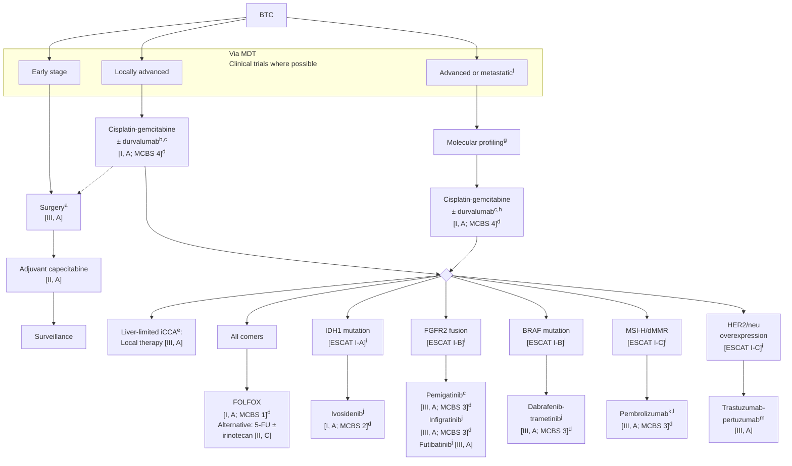

ESMO GOOD SCIENCE BETTER MEDICINE BEST PRACTICE
ANNALS OF ONCOLOGY driving innovation in oncology

SPECIAL ARTICLE

# Biliary tract cancer: ESMO Clinical Practice Guideline for diagnosis, treatment and follow-up☆

A. Vogel1, J. Bridgewater2, J. Edeline3,4, R. K. Kelley5, H. J. Klümpen6, D. Malka7,8, J. N. Primrose9, L. Rimassa10,11, A. Stenzinger12, J. W. Valle13,14 & M. Ducreux8,15, on behalf of the ESMO Guidelines Committee*

1Department of Gastroenterology, Hepatology and Endocrinology, Medical School of Hannover, Hannover, Germany; 2Cancer Institute, University College London (UCL), London, UK; 3Department of Medical Oncology, CLCC Eugène Marquis, Rennes; 4Chemistry, Oncogenesis, Stress and Signaling (COSS), INSERM, University of Rennes, Rennes, France; 5Helen Diller Family Comprehensive Cancer Center, University of California, San Francisco, USA; 6Department of Medical Oncology, Amsterdam UMC, location University of Amsterdam, Amsterdam, The Netherlands; 7Department of Medical Oncology, Institut Mutualiste Montsouris, Paris; 8INSERM U1279, Université Paris-Saclay, Villejuif, France; 9University Department of Surgery, University Hospital Southampton, Southampton, UK; 10Department of Biomedical Sciences, Humanitas University, Pieve Emanuele, Milan; 11Medical Oncology and Hematology Unit, Humanitas Cancer Center, IRCCS Humanitas Research Hospital, Rozzano, Milan, Italy; 12Institute of Pathology, University Hospital Heidelberg, Heidelberg, Germany; 13Division of Cancer Sciences, University of Manchester, Manchester; 14Department of Medical Oncology, The Christie NHS Foundation Trust, Manchester, UK; 15Department of Cancer Medicine, Gustave Roussy, Villejuif, France

Available online 10 November 2022

> **Key words:** cholangiocarcinoma, gallbladder cancer, diagnosis, treatment, follow-up, precision medicine

## INCIDENCE AND EPIDEMIOLOGY

Biliary tract cancers (BTCs) account for <1% of all human cancers. Cholangiocarcinoma (CCA) is the second most common primary liver cancer after hepatocellular carcinoma (HCC), accounting for ~10%-15% of all primary liver cancers.1 The global mortality rate for CCA has increased worldwide during recent decades according to World Health Organization and Pan American Health Organization databases for 32 selected locations in Europe, America, Asia and Oceania.2 The age-standardised incidence rate for CCA is low in Europe, the USA and Australasia (0.3-3.5 cases per 100 000 population); however, in regions where liver fluke infection is common (e.g. Indochina, China and Korea), incidence is up to 40 times higher, reaching 85 cases per 100 000 population in north-eastern Thailand (the highest reported value globally).1,3,4

BTCs refer to a spectrum of invasive tumours, usually adenocarcinomas, arising from the gallbladder or cystic duct [gallbladder carcinoma (GBC)] or the biliary tree (CCA). CCA is subclassified as intrahepatic CCA (iCCA),5 arising from bile ductules proximal to the second-order bile ducts (segmental bile ducts); perihilar CCA (pCCA), arising in the right and/or left hepatic duct and/or at their junction (so-called perihilar bile ducts); and distal CCA (dCCA), arising from the epithelium distal to the insertion of the cystic duct.1,6,7 pCCA and dCCA collectively comprise extrahepatic CCA, although this latter classification is discouraged due to insufficient anatomical specificity.

Combined HCC and CCA is a rare type of liver cancer regarded as an independent entity, which shares features of both HCC and CCA, and is associated with an aggressive disease course and poor prognosis.8,9 Cancers arising from the ampulla of Vater (the junction of the pancreatic and distal common bile ducts) are sometimes included under the term BTC; histologically, they can be pancreatobiliary or intestinal, arising in the biliary epithelium or small bowel epithelium, respectively.10 These cancers have a distinct clinical course and management approach, although they have often been included in studies of chemotherapy (ChT) for advanced disease, given their rarity. Ampullary and mixed HCC/CCA are not discussed in further detail in this clinical practice guideline (CPG).

Estimates of the relative incidence of the BTCs recognised by the new International Classification of Diseases (ICD) 11th revision (ICD11) (iCCA, pCCA, dCCA and GBC) have previously been biased by geography and type of study, as well as changes and inaccuracies in ICD coding. iCCAs occur less commonly in East Asia where fluke-related cancers increase the relative proportion of pCCA.11 iCCAs are more common in studies of advanced disease compared with adjuvant series due to the greater number of actionable alterations, availability of tissue for molecular diagnosis and potentially improved prognosis.12-14 Finally, the changes in

---
\*Correspondence to: ESMO Guidelines Committee, ESMO Head Office, Via Ginevra 4, CH-6900 Lugano, Switzerland
E-mail: clinicalguidelines@esmo.org (ESMO Guidelines Committee).

☆Note: Approved by the ESMO Guidelines Committee: September 2016, last update October 2022. This publication supersedes the previously published version—Ann Oncol 2016;27(suppl 5):v28-v37.

0923-7534/© 2022 European Society for Medical Oncology. Published by Elsevier Ltd. All rights reserved.

Volume 34 ■ Issue 2 ■ 2023 https://doi.org/10.1016/j.annonc.2022.10.506 **127**

Annals of Oncology A. Vogel et al.

ICD and poor classification have further increased uncertainty.15 Although CCA rates in Asia overall have remained static, the incidence of iCCA has been steadily increasing in most Western countries, while the incidence of d/pCCA has remained stable or decreased.16-18 These trends may be explained by cross referencing of pCCA to iCCA by previous versions of the ICD,19 improved diagnostics, changing migration patterns in the West20 and the increasing burden of chronic liver disease.21

The incidence of GBC is low in Western Europe and the United States (1.6-2.0 cases per 100 000 population) and is decreasing, probably due to the increase in routine cholecystectomy.22 Nevertheless, incidence remains high in some regions (e.g. southern Chile, northern India, Poland, south Pakistan and Japan).23

Risk factors for CCA, which vary between regions, share chronic inflammation of the biliary epithelium as a key feature.18,24 Patients with primary sclerosing cholangitis (PSC) in Western countries and those with hepatobiliary flukes or hepatolithiasis in Asian countries are at increased risk of pCCA. Guidelines for surveillance of patients with PSC are available. In the absence of clear evidence regarding the optimal monitoring strategy, annual imaging with magnetic resonance imaging (MRI) or magnetic resonance cholangiopancreatography (MRCP) or ultrasound followed by investigations with endoscopic retrograde cholangiopancreatography (ERCP) and cytology or histology is generally recommended.25 Cirrhosis and hepatotropic viruses are risk factors for iCCA, with odds ratios of 22.92 [95% confidence interval (CI) 18.24-28.79] for cirrhosis, 5.10 (95% CI 2.91-8.95) for hepatitis B virus (HBV) and 4.84 (95% CI 2.41-9.71) for hepatitis C virus (HCV), according to a recent meta-analysis.26 HBV and HCV should be treated according to the respective national and international guidelines. iCCA should be considered in patients with cirrhosis, although development of HCC, for which patients should undergo screening, is more likely. Recently, diabetes, obesity and use of hormonal contraceptives have been associated with an 81%, 62% and 62% increase in risk of iCCA, respectively.27,28 Screening for CCA in these newly-defined at-risk groups has not yet been established.26

Risk of GBC increases with age and it is more common in women than men. Predisposing conditions that cause cholecystitis are associated with a higher incidence of GBC. Gallstones are the strongest risk factor;29 others include porcelain gallbladder, gallbladder polyps, PSC,30,31 chronic *Salmonella typhi* or *Helicobacter bilis* infection,32 congenital biliary tree malformations (e.g. choledochal cysts, congenital biliary dilatation and anomalous pancreaticobiliary ductal junction)33 and obesity.34

# DIAGNOSIS, PATHOLOGY AND MOLECULAR BIOLOGY

## Diagnosis

It is important to confirm the anatomical location of BTC (iCCA, pCCA, dCCA or GBC), as every subtype has specific clinical and molecular features, requiring individualised work-up and assessment for complications, including biliary tract obstruction.35 Biliary tumours should be classified according to ICD11 criteria.

Recommended initial investigations are detailed in Table 1. Liver function should be assessed via blood tests and evaluation for the presence of conditions associated with underlying liver or biliary tract inflammation or injury, including HBV and HCV infection, risk factors for non-alcoholic liver disease (non-alcoholic fatty liver disease or non-alcoholic steatohepatitis) or autoimmune diseases such as inflammatory bowel disease, PSC or primary biliary cholangitis. For all BTCs, cross-sectional imaging of the chest, abdomen and pelvis with multiphase images of the liver is needed to assess the extent of primary disease and evaluate for metastases. For p/dCCA and iCCA causing biliary obstruction, MRCP is helpful to assess biliary tract and vascular anatomy. Endoscopic ultrasonography (EUS) allows assessment of locoregional extension of p/dCCA and GBC.36 It can also identify the location of a biliary obstruction when a discrete mass is not discernible on imaging; and can be used for tissue acquisition from the primary tumour or nodal metastases, depending on their location. Percutaneous transhepatic cholangiography (PTC) or ERCP may be used to relieve biliary obstruction. Endoscopic retrograde techniques using brushings or biopsy are comparable and have limited sensitivity for the diagnosis of malignant biliary strictures; a combination of both only modestly increases sensitivity.37 Intraductal evaluation and biopsy with direct visualisation cholangioscopy may be useful in the assessment of biliary strictures.38

## Pathology

Pathological diagnosis should be confirmed via core biopsy before any nonsurgical treatment. Surgery may be

### Table 1. Diagnostic and staging investigations in BTC

<table>
  <thead>
    <tr>
        <th>Procedure</th>
        <th>Purpose</th>
    </tr>
  </thead>
  <tbody>
    <tr>
        <td>Blood tests</td>
        <td>Assess liver function and the presence of underlying liver or biliary tract disease</td>
    </tr>
    <tr>
        <td>ERCP/PTC ± biopsy (or cholangioscopy)</td>
        <td>Assessment and treatment of biliary obstruction&lt;br/&gt;Obtain tissue for diagnosis, histological classification and NGS</td>
    </tr>
    <tr>
        <td>EUS ± biopsy</td>
        <td>Accurate assessment of: locoregional extension of p/dCCA and GBC; biliary obstruction; hepatic, vascular and lymph node invasion; metastases&lt;br/&gt;Obtain tissue for diagnosis, histological classification and NGS</td>
    </tr>
    <tr>
        <td>MRI, including MRCP</td>
        <td>Accurate assessment of local extension of p/dCCA, including biliary tract and vascular anatomy and identification of hepatic metastases</td>
    </tr>
    <tr>
        <td>CT of thorax + abdomen ± pelvis</td>
        <td>Staging of tumour—to detect local/distant lymphadenopathy and metastatic disease</td>
    </tr>
    <tr>
        <td>PET—CT, if available</td>
        <td>May allow identification of nodal metastases, distant metastases and disease recurrence</td>
    </tr>
  </tbody>
</table>

BTC, biliary tract cancer; CT, computed tomography; dCCA, distal cholangiocarcinoma; ERCP, endoscopic retrograde cholangiopancreatography; EUS, endoscopic ultrasonography; GBC, gallbladder carcinoma; MRCP, magnetic resonance cholangiopancreatography; MRI, magnetic resonance imaging; NGS, next-generation sequencing; pCCA, perihilar cholangiocarcinoma; PET, positron emission tomography; PTC, percutaneous transhepatic cholangiography.

128 https://doi.org/10.1016/j.annonc.2022.10.506 Volume 34 ■ Issue 2 ■ 2023

A. Vogel et al. Annals of Oncology

undertaken to obtain a pathological diagnosis in patients with localised tumours amenable to curative surgery. Non-tumour liver tissue should also be evaluated for underlying liver disease. In patients with biliary obstruction due to p/dCCA without extraductal metastasis, PTC- or ERCP-guided biopsies are preferred over biliary brush cytology and should be carried out whenever possible to ensure adequate tissue for diagnostic pathology and molecular profiling. EUS-guided fine needle aspiration or biopsy (FNA or FNB) may be an option to obtain biopsies of regional nodes (if enlarged) or the primary tumour, depending on their location,39 and may be considered if PTC- or ERCP-guided biopsies are negative or inconclusive. Cases of tumour seeding along the FNA needle track have been reported;40 the exact level of risk is uncertain, but appears to be very low. Thus, in patients with potentially resectable tumours, decisions to undertake primary tumour biopsy via any transperitoneal approach including EUS should be made in a multidisciplinary setting.

## Molecular diagnostics

CCAs, particularly iCCAs displaying small duct histology, are enriched for actionable targets and molecular analysis is recommended in patients with advanced disease suitable for systemic treatment [see ESMO Scale for Clinical Actionability of Molecular Targets (ESCAT) for further details—Supplementary Table S1, available at https://doi.org/10.1016/j.annonc.2022.10.506]. Parallel sequencing of several genes using focused next-generation sequencing (NGS) is preferred over single gene testing. NGS can be carried out on formalin-fixed and paraffin-embedded tumour tissue and is well suited for tissue biopsies. Alternatively, liquid biopsies using cell-free circulating DNA may be considered, if not enough tumour tissue is available for NGS. Currently, the gene panel should include the respective coding DNA regions (target regions) of isocitrate dehydrogenase 1 (*IDH1*), human epidermal growth factor receptor 2 (*HER2*)/neu [v-erb-b2 avian erythroblastic leukaemia viral oncogene homologue 2 (*ERBB2*)] and *BRAF* to test for hotspot mutations, but the rapidly evolving landscape of drug targets and predictive biomarkers may soon necessitate larger panels. For tissue-based testing, gene fusions involving the fibroblast growth factor receptor 2 (*FGFR2*) and neurotrophic tyrosine receptor kinase (*NTRK*) genes should preferably be interrogated at the RNA level using a panel-based method that can identify fusion transcripts of known and unknown fusion partners. Ideally, this approach should be combined with parallel DNA testing to identify break points which mainly involve exons 17 and 18 of *FGFR2*. Both DNA- and RNA-based NGS assays should ideally employ hybrid capture or anchored multiplex PCR technology. Microsatellite instability (MSI) status can be inferred by an immunohistochemistry (IHC) test evaluating tumour tissue expression of the DNA mismatch repair proteins MutL homologue 1 (MLH1), MutS homologue (MSH)2, MSH6 and PMS1 homologue 2 (PMS2). Alternatively, DNA-based assays analysing the composition and length of microsatellites can be used. The preferred technology (e.g. NGS, RNA sequencing, IHC) depends on the targets and the availability of material for testing (e.g. tissue or circulating tumour DNA). Discussion with a molecular pathologist or the molecular tumour board is strongly recommended.

Serum carbohydrate antigen (CA) 19-9, also known as sialylated Lewis A antigen, is a nonspecific marker which can be elevated in patients with BTC and other gastrointestinal malignancies, as well as in some nonmalignant settings such as biliary obstruction. While not diagnostic for BTC, markedly elevated levels of CA 19-9 are associated with poorer prognosis and this marker can also be useful for assessing response to treatment.41 Of note, ~10% of the general population is Lewis blood group antigen-negative (a−, b−) and unable to produce CA 19-9.42 In such patients, CA 19-9 cannot be used in follow-up.

### Recommendations

* BTC should be classified according to ICD11 criteria [III, A].
* A core biopsy should be obtained for diagnostic pathology and molecular profiling before any nonsurgical treatment [III, A].
* In patients with d/pCCA without extraductal metastasis, PTC- or ERCP-guided biopsies should be carried out to obtain adequate tissue for diagnostic pathology and molecular profiling [III, A].
* Depending on location, EUS-guided FNA or FNB may be an option to obtain biopsies of enlarged regional nodes and to obtain a tumour biopsy if ERCP-guided biopsies are negative or inconclusive [II, B].
* Molecular analysis is recommended in advanced disease considered suitable for systemic treatment [I, A].
* Elevated CA 19-9 is associated with poorer prognosis and can be useful for assessing response to treatment [III, C].

# STAGING AND RISK ASSESSMENT

## Staging

Risk assessment should consider the patient’s performance status (PS; European Cooperative Oncology Group score), medical history, comorbidities and liver function tests. Imaging is essential for positive and differential diagnosis (cytological/histological diagnosis can be difficult), assessment of extension and treatment planning. Level of biliary obstruction, hepatic, vascular and lymph node invasion and presence of metastases must be assessed. If possible, staging should be carried out before placement of a biliary stent.

MRI is the reference examination for local extension of p/dCCA and for identification of hepatic metastases. It must combine hepatic MRI sequences with contrast-enhanced and cholangiography sequences (i.e. MRCP). MRCP has a detection sensitivity of 95% and allows evaluation of extension to the bile ducts with a reliability of 90%.43,44 Thoraco-abdomino-pelvic computed tomography (CT)

Volume 34 ■ Issue 2 ■ 2023 https://doi.org/10.1016/j.annonc.2022.10.506 129

Annals of Oncology
A. Vogel et al.

remains the reference examination for lymph node and metastatic extension.45

[18F]-2-fluoro-2-deoxy-D-glucose—positron emission tomography (FDG—PET) has a sensitivity and specificity of ~ 80%-90% for the diagnosis of GBC or nodular CCA ≥1 cm, but its sensitivity is lower in case of infiltrating CCA. Its positive predictive value is poor in case of PSC, biliary prosthesis or granulomatous disease.46 FDG—PET is not recommended for primary diagnosis, but may allow identification of nodal metastases, distant metastases and disease recurrence.47 MRI—PET appears to be helpful to assess extension of infiltrating BTC; however, its limited availability prevents it from being recommended for routine use.48

Staging is carried out according to the Union for International Cancer Control (UICC) TNM (tumour—node—metastasis) 8th edition staging manual and is specific for every subtype of BTC (see Supplementary Tables S2 and S3, available at https://doi.org/10.1016/j.annonc.2022.10.506).49-52 pCCAs are further subclassified according to the Bismuth—Corlette classification to describe their anatomical location (see Supplementary Table S4, available at https://doi.org/10.1016/j.annonc.2022.10.506).53

## Risk assessment

Multiple studies emphasise the importance of pathology in assessing prognosis. Tumour number and size, surgical resection with microscopic tumour at the margin (R1 resection), nodal involvement and microvascular invasion are recognised negative prognostic factors in patients undergoing resection.54-56 A post hoc analysis of the Advanced Biliary tract Cancer (ABC)-01, -02 and -03 studies revealed an increase in median overall survival (OS) of ~ 4 months in patients with iCCA compared with non-iCCA BTCs, suggesting that iCCA has a more favourable natural history, especially in cases with disease limited to the liver.57 Additionally, a recent analysis by the European Network for the Study of Cholangiocarcinoma and the Surveillance, Epidemiology and End Results (SEER) registry reported that patients with iCCA and liver metastases (~ 20% of patients) have a significantly worse prognosis than patients with solitary tumours, regardless of lymph node status.55

## Recommendations

* MRI is the reference examination for local extension of pCCA and dCCA and for identification of hepatic metastases [III, A].
* Thoraco-abdomino-pelvic CT remains the reference examination for lymph node and metastatic extension [III, A].
* FDG—PET is not recommended for primary diagnosis, but may allow identification of nodal metastases, distant metastases and disease recurrence [III, C].
* Staging is carried out according to the 8th edition of the UICC staging manual and is specific to every subtype of BTC. pCCAs are further subclassified according to the Bismuth—Corlette classification to describe their anatomical location [III, A].

# MANAGEMENT OF LOCAL AND LOCOREGIONAL DISEASE

The therapeutic strategy varies for each type of BTC depending on its site of origin. A proposed algorithm for the treatment of BTC is shown in Figure 1.

## *Surgery*

Surgery is, at present, the only modality that can cure BTC and should be agreed by a specialist hepatobiliary multidisciplinary tumour board. Basic surgical principles apply, thus resection with no tumour at the margin (R0) is the aim. In some cases, this proves impossible and the incidence rate of R1 resections is high, especially in pCCA. It is also standard of care (SoC) to resect the appropriate lymph nodes, although the optimal extent of lymphadenectomy varies. Outcomes following resection of BTC at the various sites are similar.14 Surgery involving hepatic resection should also consider the future liver remnant and may require portal vein embolisation or double vein embolisation (hepatic and portal vein).

iCCAs usually arise within a normal background of liver parenchyma, and their radiological appearance is typically a mass-forming arterially enhancing tumour. There are well-known prognostic parameters that should be considered when assessing prognosis, including the presence of lymph node involvement; this has led to the recommendation of routine lymphadenectomy at the level of the hepatoduodenal ligament during surgery.49

In a substantial proportion of patients with pCCA, diagnosis and assessment of resectability according to the Bismuth—Corlette classification can only be determined through surgical exploration. Approximately 15% of patients who undergo surgery for presumed pCCA are found to have an autoimmune cholangiopathy.58 It is important that initial radiological imaging is carried out before ERCP or PTC in patients presenting with jaundice, as the inserted drains or stents can obscure diagnosis and assessment of the extent of disease. Biliary drainage via ERCP or PTC before resection is almost universally practised unless bilirubin is low. Consideration of non-tumour-related factors such as PS and comorbidities is important, as resection carries a significant risk of mortality. The anatomically longer left hepatic duct before segmental distribution makes an extended right hemi-hepatectomy the most common technical approach for pCCA. Commonly, right portal vein embolisation (which may include the segment IV branches) is needed to induce hypertrophy of the future liver remnant (segments II and III). Extended left resection is technically more complex, but the remaining segments (VI and VII) normally represent an adequate remnant. Segment I, which drains into the ductal bifurcation where the cancer lies, must be removed in any curative-intent procedure. Vascular resections at the hilum are possible, but their invasion has an adverse impact on prognosis. Lymphadenectomy should be a standard addition to any radical surgical procedure for CCA.

Liver transplantation in locally unresectable pCCA has been explored using a multidisciplinary approach, including a strategy at the Mayo Clinic consisting of neoadjuvant

130 https://doi.org/10.1016/j.annonc.2022.10.506 Volume 34 ■ Issue 2 ■ 2023

A. Vogel et al. Annals of Oncology

**Figure 1. Treatment algorithm for BTC.**
Purple: general categories or stratification; red: surgery; white: other aspects of management; blue: systemic anticancer therapy.
5-FU, 5-fluorouracil; BTC, biliary tract cancer; ChT, chemotherapy; dCCA, distal cholangiocarcinoma; dMMR, mismatch repair deficiency; EMA, European Medicines Agency; ESCAT, ESMO Scale for Clinical Actionability of Molecular Targets; FDA, Food and Drug Administration; FGFR2, fibroblast growth factor receptor 2; FOLFOX, 5-fluorouracil–leucovorin–oxaliplatin; GBC, gallbladder carcinoma; HER2, human epidermal growth factor receptor 2; iCCA, intrahepatic cholangiocarcinoma; IDH1, isocitrate dehydrogenase 1; MCBS, ESMO-Magnitude of Clinical Benefit Scale; MDT, multidisciplinary team; MSI-H, microsatellite instability-high; NTRK, neurotrophic tyrosine receptor kinase; pCCA, perihilar cholangiocarcinoma; PD-1, programmed cell death protein 1; PS, performance status.
aSpecial considerations: (i) consider the need for preoperative drainage; (ii) avoid percutaneous biopsy in resectable d/pCCA; (iii) assess future liver remnant; (iv) neoadjuvant approach (selected cases); (v) completion surgery for incidental GBC stage ≥T1b.
bSalvage surgery or local therapies should be considered in responding patients with initially inoperable disease.
cEMA and FDA approved.
dESMO-MCBS v1.1111 was used to calculate scores for therapies/indications approved by the EMA or FDA. The scores have been calculated by the ESMO-MCBS Working Group and validated by the ESMO Guidelines Committee (https://www.esmo.org/guidelines/esmo-mcbs/esmo-mcbs-evaluation-forms).
eReconsider surgery in the event of adequate response to treatment.
fClinical trial recommended when available.
gMolecular profiling should be carried out before/during first-line therapy. Gene panel should include *FGFR2*, *IDH1*, *HER2/neu* and *BRAF* to test for hotspot mutations, but may also include genes such as *NTRK* and *c-MET*. The rapidly evolving landscape of drug targets and predictive biomarkers may necessitate larger panels in the future.
hCisplatin–gemcitabine–durvalumab is recommended for first-line treatment [I, A]. Consider gemcitabine monotherapy in patients with a compromised PS or significant debility who are at risk of toxicity from platinum-containing ChT regimens.
iESCAT scores apply to alterations from genomic-driven analyses only. These scores have been defined by the guideline authors and validated by the ESMO Translational Research and Precision Medicine Working Group.110
jFDA approved; not EMA approved.
kAnti-PD-1 therapy is recommended for patients with MSI-H/dMMR who have not been treated with first-line immunotherapy.
lEMA approved for MSI-H/dMMR BTC; FDA approved for all MSI-H/dMMR solid tumours.
mNot EMA approved; not FDA approved.

chemoradiotherapy (CRT) followed by liver transplantation.59 Liver transplantation, however, is not an SoC in pCCA and participation in clinical trials should be encouraged.

In contrast to other forms of CCA, dCCA requires removal of the pancreatic head, usually via a partial duodenopancreatectomy (PDP or Whipple’s procedure) with extended bile duct resection up to the hilum. PDP is a standard procedure that includes draining lymph node dissection and reconstruction of the stomach and the remaining pancreas to achieve macroscopic cure. The prognosis of resected dCCA may be similar to adenocarcinoma of the head of the pancreas.14,60

To decide whether further resection is necessary in incidentally diagnosed GBC, staging is required with appropriate imaging (MRI or CT) and detailed histopathological analysis, including T stage, cystic duct margin, involvement of resected lymph nodes, grade and perineural and/or

Volume 34 ■ Issue 2 ■ 2023 https://doi.org/10.1016/j.annonc.2022.10.506 131

Annals of Oncology A. Vogel et al.

vascular invasion. Every T stage above T1a requires a re-operation to achieve cure, assuming the patient is sufficiently fit. Resection of some or all of segment IVb/V of the liver, depending on the extent of invasion, is carried out together with a lymphadenectomy of the hepatoduodenal ligament.61 If the gallbladder was not removed with a bag during laparoscopic resection or the gallbladder perforated (an adverse prognostic factor), resection of the port sites may also be considered. If GBC is diagnosed during imaging (for symptomatic patients) or when patients present with jaundice, evaluation of potential resectability is the key factor. Advanced T stage (including T4) is not a contraindication for resection, provided the tumour is located in the fundus; these tumours require major liver resection with potential resection of the transverse colon. Achieving a curative-intent resection of an advanced tumour located at the infundibulum is much more difficult, because it requires combined resection of the bile duct, the duodenal bulb and, potentially, the pancreatic head.

## Adjuvant therapy

The high 3-year recurrence rate (up to 80%62,63) after curative-intent resection for BTC has led to an intensive discussion about the importance of adjuvant therapy concepts. Until 2017, the use of adjuvant treatment was based on meta-analyses from mostly small retrospective phase II studies and SEER data, which suggested that two specific high-risk populations benefit from post-operative ChT: patients with nodal-positive disease and patients who have undergone R1 resection.64,65 To date, three negative randomised, controlled trials (RCTs) evaluating different adjuvant ChT regimens compared with surgery alone have been fully published: the French PRODIGE-12 study (evaluating the efficacy of gemcitabine–oxaliplatin), the Japanese BCAT study (evaluating the efficacy of gemcitabine) and the UK BILCAP study (evaluating the efficacy of capecitabine).14,66,67 The studies reported no significant improvement in OS in the intent-to-treat (ITT) population; however, in the predefined per protocol analysis of the BILCAP study, median OS was significantly improved with eight 3-weekly cycles of capecitabine compared with observation [53 months versus 36 months, respectively; adjusted hazard ratio (HR) 0.75, 95% CI 0.58-0.97, $P = 0.028$], which was supported by a sensitivity analysis adjusting for further prognostic factors (nodal status, disease grade and sex) (HR 0.71, 95% CI 0.55-0.92, $P = 0.010$). Moreover, the ITT analysis showed superior relapse-free survival with capecitabine during the first 24 months. The use of adjuvant therapy is further supported by the recently presented ASCOT trial in Japan, which included a similar patient population to BILCAP and demonstrated that adjuvant therapy with four 6-weekly cycles of tegafur–gimeracil–oteracil (S1; an orally acting fluoropyrimidine) led to significantly longer survival than surgery alone (HR 0.694, 95% CI 0.514-0.935, $P = 0.008$).68 Despite the acknowledged limitations of the BILCAP results, adjuvant therapy with capecitabine should be considered for patients with CCA or GBC following resection.

The data supporting adjuvant radiotherapy (RT) are limited, mostly consisting of retrospective studies. SWOG S0809 was a multicentre phase II study of 79 patients with extrahepatic CCA or GBC.69 Patients had undergone radical resection and had pathological stage T2-4 or N1, or positive resection margins, and received gemcitabine–capecitabine followed by CRT with capecitabine as a sensitiser. The primary objective of the study (to achieve a 2-year survival rate of >45%) was met; therefore, although the level of evidence is limited, RT after completion of adjuvant capecitabine might be considered in selected patients (e.g. R1 resection of GBC or d/pCCA).

## Management of patients with non-metastatic disease not suitable for surgery

The management of patients with locally advanced disease differs depending on the site of origin. Local recurrence of disease may be included, depending on the anatomical subtype of CCA as well as the location and timing of recurrence. The suitability of a recurrence for local or systemic treatment should be discussed by a multidisciplinary team (MDT).

Due to the frequent occurrence of liver-only disease, which might have a better prognosis compared with all patients with advanced BTC, locoregional treatment has been increasingly studied for iCCA.35 Ablation has mostly been evaluated in patients with unresectable disease due to cirrhosis or with recurrence following previous resection. A recent systematic review revealed a pooled complete ablation rate of 93% and a median OS of 30.2 months.35 Ablation can therefore be considered in patients with an iCCA $\le 3$ cm who have contraindications to surgery.

External beam RT has been increasingly studied, especially using stereotactic body RT (SBRT).35,70 Despite a high local control rate (pooled 1-year local control rate 83%), the OS rate appears to be low (pooled 1-year OS rate 58.3%). External beam RT or CRT to the primary tumour as definitive treatment should therefore not be used outside of clinical trials for locally advanced CCA. SBRT can, however, be considered for patients with iCCA in case of contraindication to surgery for liver-limited disease in the palliative setting.

Intra-arterial therapies, including hepatic arterial infusion (HAI) of ChT, transarterial chemoembolisation and selective internal RT (SIRT, also known as radioembolisation) have been mostly studied in retrospective single-centre cohorts.35 Results are heterogeneous, probably due to the heterogeneity of the study populations, and outcomes are generally improved when patients have been treated in the first-line setting with concomitant ChT.35,71 Recently, prospective single-arm phase II studies of HAI and SIRT in combination with modern gemcitabine–platinum ChT have reported objective response rates (ORRs) of 51% and 39%, secondary resection rates of 10% and 22% and median OS

132 https://doi.org/10.1016/j.annonc.2022.10.506 Volume 34 ■ Issue 2 ■ 2023

A. Vogel et al.
Annals of Oncology

of 25 and 22 months, respectively.72,73 No RCTs have been initiated to date to confirm improved outcomes with these approaches over systemic therapy alone. With the demonstrated efficacy of systemic ChT in advanced BTC, intra-arterial therapies might be used in combination with systemic ChT in liver-limited iCCA.

Initial retrospective studies of endoscopic treatments such as radiofrequency ablation and photodynamic therapies have reported interesting results, but RCTs have failed to show a benefit, or did not compare results with systemic ChT.74,75 Photodynamic therapy and intraductal radiofrequency ablation are therefore considered investigational and should not be used outside of clinical trials for pCCA.

In case of response following locoregional or systemic treatment of locally advanced tumours, patients should be re-assessed by the MDT to discuss surgery.72,73,76,77

## Recommendations

* Radical surgery, which includes lymphadenectomy, is the only curative-intent treatment for BTC. The exact nature and extent of surgery will depend on tumour subtype and location and should be agreed at a specialist hepatobiliary multidisciplinary tumour board meeting [III, A].
* Radiological imaging should be carried out before ERCP or PTC in patients with jaundice [III, A].
* Consideration of non-tumour-related factors (e.g. PS, comorbidities) is important, as resection carries a significant risk of mortality [III, B].
* Right portal vein embolisation is often needed to induce hypertrophy of the future liver remnant [IV, A].
* Liver transplantation is not considered a standard treatment for pCCA and participation in clinical trials should be encouraged [III, D].
* In case of incidentally diagnosed GBC (after cholecystectomy), re-operation with radical intent should be offered to sufficiently fit patients with stage $\ge$T1b disease, provided there is no metastatic spread [IV, A]. Resection of some or all of segment IVb/V of the liver is carried out together with a lymphadenectomy of the hepatoduodenal ligament [II, A].
* Resection of the port sites may also be considered if the gallbladder was not removed with a bag or if the gallbladder was perforated [IV, C].
* Curative-intent resection of tumours located at the infundibulum requires resection of the bile duct, the duodenal bulb and, potentially, the pancreatic head [III, A].
* Adjuvant ChT with capecitabine should be considered for patients with CCA or GBC following resection [II, A].
* RT, after completion of adjuvant capecitabine, might be considered in selected patients (R1 resection of GBC or d/pCCA) [III, C].
* Local ablation should be considered for patients with iCCA $\le$3 cm who have contraindications to surgery [III, A].
* SBRT can be considered for patients with iCCA in case of contraindication to surgery for liver-limited disease in the palliative setting [III, C].
* Intra-arterial therapies, in combination with ChT, can be considered to improve response and disease control in patients with liver-limited iCCA [III, C].
* External RT or CRT to the primary tumour as definitive treatment should not be used outside of clinical trials for locally advanced CCA [II, D].
* Photodynamic therapy and intraductal radiofrequency ablation are considered investigational and should not be used outside of clinical trials for pCCA [II, D].
* In case of response following locoregional or systemic treatment of locally advanced tumours, patients should be re-assessed by the MDT to discuss surgery [IV, B].

# MANAGEMENT OF ADVANCED AND METASTATIC DISEASE

A proposed algorithm for the treatment of BTC is shown in Figure 1.

## First-line treatment

ChT is the current SoC for first-line treatment of advanced BTC; OS is improved when compared with best supportive care alone78,79 and the cisplatin–gemcitabine doublet demonstrated an OS benefit over gemcitabine monotherapy in the UK ABC-02 study80 and the Japanese BT22 study.81 Median OS with cisplatin–gemcitabine was 13.0 months when limited to patients with a PS of 0-1 in an international RCT setting.82 There is currently insufficient evidence to recommend continuous treatment beyond 6 months and decisions should be based upon individual patient toxicity, tolerability and tumour response. Gemcitabine–S1 has been shown to be non-inferior to cisplatin–gemcitabine in Japanese patients.83 Oxaliplatin may be substituted for cisplatin when there is concern about renal function84 and gemcitabine monotherapy may be preferred in patients with a PS of 2 or other factors of fragility. Cisplatin–gemcitabine may be considered in patients with moderately elevated bilirubin levels due to endoluminal disease despite optimal stenting.85

The TOPAZ-1 study demonstrated improvements in OS (primary endpoint; HR 0.76, 95% CI 0.64-0.91), response rate and progression-free survival (PFS) with the addition of the programmed death-ligand 1 (PD-L1) immune checkpoint inhibitor (ICI) durvalumab to cisplatin–gemcitabine.86 Cisplatin–gemcitabine–durvalumab should therefore be considered for the first-line treatment of advanced BTC.

Intensification of ChT with the use of triplet regimens is under evaluation: in Japan, preliminary results showed improved survival with cisplatin–gemcitabine–S1 versus cisplatin–gemcitabine87 (final publication awaited); modified 5-fluorouracil–leucovorin–irinotecan–oxaliplatin (FOLFIRINOX) is not superior to cisplatin–gemcitabine;88 and cisplatin–gemcitabine–nab-paclitaxel is being compared with cisplatin–gemcitabine in the phase III SWOG-1815 study (NCT03768414), based on promising phase II results.89

## Second- and later-line treatment

Second-line ChT has previously been used ad hoc by clinicians with limited knowledge of the magnitude of benefit. The UK

Volume 34 ■ Issue 2 ■ 2023
https://doi.org/10.1016/j.annonc.2022.10.506
133

Annals of Oncology
A. Vogel et al.

ABC-06 study demonstrated a modest OS (primary endpoint) advantage with 5-fluorouracil–leucovorin–oxaliplatin (FOLFOX) compared with active symptom control (HR 0.69).90 FOLFOX is therefore recommended in the second-line setting after first-line cisplatin–gemcitabine. 5-Fluorouracil (5-FU) combined with nano-liposomal irinotecan (nal-iri) demonstrated improved PFS (primary endpoint) versus 5-FU alone in a randomised phase IIb Korean study, with an impact on OS of a similar magnitude to that observed in ABC-06.91 The recently published NALIRICC phase II study with Caucasian patients did not report a survival benefit for 5-FU–nal-iri versus 5-FU alone in Western patients, however, and the doublet regimen was associated with more toxicity.92 Evidence for irinotecan-based therapies is currently limited. There remains, therefore, an urgent need to develop new therapies, particularly for patients who lack a targetable genomic alteration.

Nearly 40% of patients with BTC harbour genetic alterations which are potential targets for precision medicine.12,13,93 Therefore, molecular analysis should be carried out before or during first-line therapy to evaluate options for second and higher lines of treatment as early as possible in advanced disease.

The most common clinically relevant mutations in *IDH1* and *IDH2* occur at amino acid positions 132 (R132) and 172 (R172), respectively, and are present in ~10%-20% of patients with iCCA. Ivosidenib is an oral inhibitor of the mutant *IDH1* enzyme and to date is the only targeted agent that has successfully completed a phase III trial in CCA. The ClarIDHy study showed that ivosidenib significantly improved PFS (primary endpoint) in patients who progressed on first-line therapy (HR 0.37, 95% CI 0.25-0.54, $P < 0.0001$).12 OS data (secondary endpoint) demonstrated a statistically significant improvement in OS after adjustment for the 70% of patients who crossed over from placebo to ivosidenib (HR 0.49, 95% CI 0.34-0.70, $P < 0.001$).94 Based on these data, ivosidenib has been approved by the Food and Drug Administration (FDA) and is recommended for the treatment of patients with previously treated CCA and *IDH1* mutations, but there is no European Medicines Agency (EMA) approval yet.

Consistent with the nomination of *FGFR2* fusions and rearrangements as CCA drivers, phase II clinical trials have documented clinical efficacy of fibroblast growth factor receptor (FGFR) inhibitors in patients with *FGFR2* fusion-positive CCA, reporting ORRs of 20%-40%, median PFS of ~7 months and median OS of ~12-17 months.95,96 These findings led to both FDA and EMA approval of pemigatinib, followed by FDA approval for infigratinib and futibatinib. Where available, FGFR inhibitors are recommended for the treatment of patients with *FGFR2* fusions whose disease has progressed after $\ge 1$ prior line of systemic therapy. Of note, secondary resistance mutations to reversible adenosine triphosphate-competitive FGFR inhibitors have been identified, which may be amenable to subsequent therapies with irreversible FGFR inhibitors.97,98 Re-biopsy of progressive tumour nodules or circulating tumour DNA may therefore be considered to identify potential resistance mechanisms.

*HER2/neu* (*ERBB2*) is recognised as a predictive biomarker and promising target for molecular therapy in 5%-10% of CCAs and up to 20% of GBCs. In the MyPathway basket trial, the combination of pertuzumab–trastuzumab achieved an ORR of 23%, median PFS of 4 months and median OS of 10.9 months.99 Early phase I-II results suggest the response may be better in *HER2*-amplified tumours compared with *HER2*-mutated CCA.99-103 The available information supports the use of HER2-directed agents in patients with *HER2* amplification who lack other therapeutic options, although no HER2-directed therapies are EMA or FDA approved for this indication.

*BRAF* mutations are detectable in ~5% of patients with CCA. In the ROAR basket trial, the combination of dabrafenib (BRAF inhibitor) and trametinib [mitogen-activated protein kinase kinase (MEK) inhibitor] achieved an ORR of 51% with a median PFS of 9 months and median OS of 14 months in pretreated patients with *BRAF*V600E mutations, supporting the use of these agents in patients who lack other therapeutic options.104 Dabrafenib–trametinib is FDA approved but not EMA approved in this setting.

As observed in other tumour types, patients with BTC harbour pathogenic variants in homologous recombination DNA damage repair genes, which may be more susceptible to treatment with DNA cross-linking agents such as platinum compounds and poly (ADP-ribose) polymerase (PARP) inhibitors. Despite the lack of an exact definition of homologous recombination deficiency in BTC, patients with *BRCA1/2* and partner and localiser of *BRCA2* (*PALB2*) mutations responding to platinum-based therapy can be considered for treatment with PARP inhibitors and should be considered for clinical trials. The frequency of mismatch repair deficiency (dMMR) in BTC is <1%. In case of MSI-high (MSI-H), treatment of BTC with ICIs has demonstrated clinical benefit. In the prospective, nonrandomised, phase II KEYNOTE-158 trial, 22 patients with CCA and MSI-H/dMMR were treated with pembrolizumab.105 An ORR of 40.9% was achieved with a median PFS of 4.2 months and median OS of 24.3 months, supporting the use of pembrolizumab in patients who lack other therapeutic options. *NTRK* fusions occur in <0.1% of BTC cases. They are targetable with specific inhibitors such as larotrectinib or entrectinib.106,107

During systemic and locoregional therapy for advanced disease, follow-up should be conducted at a frequency of 8-12 weeks to allow best assessment of treatment efficacy, or as required for disease-related complications. In addition to imaging by CT or MRI, CA 19-9 or carcinoembryonic antigen (CEA) levels may be used to monitor the course of the disease if one or both are known to be secreted.

## Supportive care

In patients receiving systemic therapies for advanced, recurrent or metastatic disease, best supportive care should

134 https://doi.org/10.1016/j.annonc.2022.10.506 Volume 34 ■ Issue 2 ■ 2023

A. Vogel et al. Annals of Oncology

include active identification and management of obstructive complications. These may include biliary obstruction (requiring biliary drainage and stents, as appropriate), gastric outlet obstruction (requiring duodenal stent or, occasionally, bypass surgery) and/or pancreatic duct obstruction (requiring pancreatic enzyme replacement therapy). Percutaneous transhepatic drainage is recommended if endoscopic stenting is not possible or to complete a partial endoscopic drainage, and a metal stent is preferred in patients with a life expectancy of >3 months. Some patients require repeat stenting on multiple occasions; this eventuality should be considered when planning stent placement. Sepsis secondary to biliary obstruction is common and should be treated promptly. Patients should be advised of the likely duration of stent patency and of symptoms and signs indicative of biliary obstruction or infection.

# Recommendations

## First-line treatment
* Cisplatin—gemcitabine is recommended as SoC in the first-line setting for patients with a PS of 0-1 [I, A].
* The combination of cisplatin—gemcitabine with durvalumab should be considered in first-line BTC [I, A; ESMO-Magnitude of Clinical Benefit (MCBS) v1.1 score: 4].
* Oxaliplatin may be substituted for cisplatin when renal function is of concern [II, B].
* Gemcitabine monotherapy may be used in patients with a PS of 2 [IV, B].

## Second- and later-line treatment
* FOLFOX is the SoC in the second-line setting after cisplatin—gemcitabine [I, A; ESMO-MCBS v1.1 score: 1; no specific licensed indication in BTC].
* Ivosidenib is recommended for the treatment of patients with CCA and *IDH1* mutations who have progressed after $\ge$1 prior line of systemic therapy [I, A; ESMO-MCBS v1.1 score: 2; ESCAT score: I-A; FDA approved, not EMA approved].
* FGFR inhibitors are recommended for the treatment of patients with *FGFR2* fusions who have progressed after $\ge$1 prior line of systemic therapy [III, A; ESMO-MCBS v1.1 score: 3; ESCAT score: I-B].
* Pembrolizumab is recommended in patients with MSI-H/dMMR who have progressed on or are intolerant to prior treatment [III, A; ESMO-MCBS v1.1 score: 3; ESCAT score: I-C].
* Dabrafenib—trametinib is recommended for the treatment of patients with *BRAF*V600E mutations who have progressed after $\ge$1 prior line of systemic therapy [III, A; ESMO-MCBS v1.1 score: 3; ESCAT score: I-B; FDA approved, not EMA approved].
* Patients with *BRCA1/2* or *PALB2* mutations responding to platinum-based therapy can be considered for treatment with PARP inhibitors [V, B; ESCAT score: III-A].
* NTRK inhibitors are recommended in patients with *NTRK* fusions who have progressed on or are intolerant to prior treatment [III, A; ESCAT score: I-C].
* HER2-directed therapies can be considered in patients with the respective genetic alterations who have progressed on or are intolerant to prior treatment [III, A; ESCAT score: I-C].
* During systemic and locoregional therapy for advanced disease, follow-up should be conducted at a frequency of 8-12 weeks. In addition to imaging with CT or MRI, CA 19-9 or CEA levels may be used to monitor the course of the disease if one or both are known to be secreted [IV, A].

## Supportive care
* In patients with biliary obstruction, biliary drainage and subsequent treatment should be carried out; when endoscopic access is not possible, percutaneous transhepatic drainage is recommended [IV, A]. In patients with a life expectancy of >3 months, a metal stent is preferred [IV, B].
* Sepsis secondary to biliary obstruction is common and should be treated promptly [IV, A].
* Patients should be advised of the likely duration of stent patency and of symptoms and signs which are indicative of biliary obstruction or infection [V, A].

# FOLLOW-UP, LONG-TERM IMPLICATIONS AND SURVIVORSHIP

## Follow-up and long-term implications
There is no universal standard follow-up schedule after potentially curative treatment. The lack of survival and cost-effectiveness data to support the benefit of close post-operative surveillance should be balanced against the recent availability of effective ChT,108 targeted therapy options12,95 and the very poor survival rates without treatment,78,79 particularly while patients have a preserved PS. Surveillance may consist of 3-6-monthly visits during the first 2 years after therapy, including clinical examination, laboratory investigation, tumour markers and CT scan of the thorax, abdomen and pelvis. Regular visits can be extended thereafter and prolonged to yearly visits after 5 years of follow-up.

Patients undergoing surgery may experience long-term complications related to the different types of surgery. Patients with dCCA undergoing PDP may experience late complications such as malabsorption (80%) with nutritional deficits or diarrhoea (30%), mainly due to insufficiency of the residual pancreas, with a significant impact on quality of life (QoL) and thus requiring appropriate chronic treatment. Other rarer complications include biliary stenosis, requiring biliary drainage or stent.109 Patients with post-operative biliary obstruction require specialised multidisciplinary evaluation to determine the location of the obstruction, evaluate for recurrence and determine the optimal approach to drainage.

## Survivorship
Due to the success of new therapeutic strategies, there is a small but emerging cohort of BTC survivors, and for these

Volume 34 ■ Issue 2 ■ 2023 https://doi.org/10.1016/j.annonc.2022.10.506 135

Annals of Oncology
A. Vogel et al.

patients, new follow-up strategies and long-term toxicity prevention and management should be implemented. Rehabilitation to counteract impairments related to cancer and its treatments might help maximise QoL in survivorship. Ongoing trials are investigating the efficacy of multidisciplinary rehabilitation programmes for survivors of BTC.108

A multidisciplinary follow-up pathway should be implemented, with the aim of addressing the specific needs of this emerging population which, to date, has not been studied. Follow-up will be lifelong and the frequency of visits is unlikely to reduce over the long term. Appointment scheduling will vary according to individual clinical needs. With the decrease in the age of patients at diagnosis, the population of young adult patients could also increase. This population may present challenges not previously encountered in the follow-up of patients with BTC, which is generally characterised by a poor prognosis. Management of these patients should consider the impact of treatment on fertility, psychological well-being and the development of secondary tumours.

In conclusion, in parallel with the expansion of the therapeutic armamentarium, it will also be necessary to develop follow-up strategies to support long-term survivors with a multidisciplinary approach that is targeted and personalised.

### Recommendations

* There is no universal follow-up schedule, but as patients develop complications related to treatment as well as cancer recurrence, follow-up is indicated. Surveillance may consist of 3-6-monthly visits during the first 2 years and 6-12-monthly visits for up to 5 years or as clinically indicated. A combination of clinical examination, laboratory investigation, tumour markers and CT scan of the thorax, abdomen and pelvis may be appropriate [IV, B].
* Patients with post-operative biliary obstruction require specialised multidisciplinary evaluation to determine the location of obstruction, evaluate for recurrence and determine the optimal approach to drainage [IV, A].
* Rehabilitation to counteract impairments related to cancer and its treatments might help maximise QoL in survivorship [V, A].
* Long-term survivors should be followed up using a multidisciplinary approach that is targeted and personalised [V, A].
* For younger patients, specific aspects should be considered and monitored, including the impact of treatment on fertility, psychological well-being and the development of secondary tumours [IV, B].

### METHODOLOGY

This CPG was developed in accordance with the European Society for Medical Oncology (ESMO) standard operating procedures for CPG development (http://www.esmo.org/Guidelines/ESMO-Guidelines-Methodology). The relevant literature has been selected by the expert authors. A table of ESCAT scores is included in Supplementary Table S1, available at https://doi.org/10.1016/j.annonc.2022.10.506. ESCAT scores have been defined by the authors and validated by the ESMO Translational Research and Precision Medicine Working Group.110 An ESMO-MCBS table with ESMO-MCBS scores is included in Supplementary Table S5, available at https://doi.org/10.1016/j.annonc.2022.10.506. ESMO-MCBS v1.1111 was used to calculate scores for therapies/indications approved by the EMA or FDA (https://www.esmo.org/Guidelines/ESMO-MCBS). The scores have been calculated by the ESMO-MCBS Working Group and validated by the ESMO Guidelines Committee. The FDA/EMA or other regulatory body approval status of new therapies/indications are reported at the time of writing this CPG. Levels of evidence and grades of recommendation have been applied using the system shown in Supplementary Table S6, available at https://doi.org/10.1016/j.annonc.2022.10.506.112,113 Statements without grading were considered justified standard clinical practice by the authors. For future updates to this CPG, including eUpdates and Living Guidelines, please see the ESMO Guidelines website: https://www.esmo.org/guidelines/guidelines-by-topic/gastrointestinal-cancers/biliary-tract-cancer.

### ACKNOWLEDGEMENTS

AV and MD acknowledge the European Reference Network for Rare Solid Adult Cancers (EURACAN) for valuable input and networking. Manuscript editing support was provided by Richard Lutz and Claire Bramley (ESMO Guidelines staff) and Angela Corstorphine and Sian-Marie Lucas of Kstorfin Medical Communications Ltd (KMC); this support was funded by ESMO. Nathan Cherny, Chair of the ESMO-MCBS Working Group, Urani Dafni, ESMO-MCBS Working Group Member/Frontier Science Foundation Hellas and Giota Zygoura of Frontier Science Foundation Hellas provided review and validation of the ESMO-MCBS scores. Nicola Latino (ESMO Scientific Affairs staff) provided coordination and support of the ESMO-MCBS scores and Angela Corstorphine and Sian-Marie Lucas of KMC provided medical writing and editing support in the preparation of the ESMO-MCBS table; this support was funded by ESMO. Dr Benedikt Westphalen (member of the ESMO Translational Research and Precision Medicine Working Group) and Dr Svetlana Jezdic (ESMO Medical Affairs Advisor) provided validation support for ESCAT scores.

### FUNDING

No external funding has been received for the preparation of this guideline. Production costs have been covered by ESMO from central funds.

### DISCLOSURE

AV reports personal fees for speaker, consultancy and advisory roles for AstraZeneca, Amgen, Basilea, BeiGene,

136 https://doi.org/10.1016/j.annonc.2022.10.506 Volume 34 ■ Issue 2 ■ 2023

A. Vogel et al.
Annals of Oncology

Bayer, Boehringer Mannheim, Bristol-Myers Squibb (BMS), BTG, Daiichi Sankyo, Eisai, GlaxoSmithKline (GSK), Imaging Equipment Ltd (AAA), Incyte, Ipsen, Jiangsu Hengrui Medicines, Merck Sharp & Dohme (MSD), Pierre Fabre, Roche, Sanofi, Servier, Sirtex, Tahio and Terumo; research funding from Incyte and Servier; participation in educational activities for Onclive and Oncowissen.de.

JB reports personal fees for advisory board membership from Basilea, BMS, Incyte and Taiho and institutional funding from Incyte.

JE reports personal fees as an invited speaker from AstraZeneca, Bayer, Boston Scientific, Eisai, Ipsen, MSD, Roche and Servier; personal fees for advisory board membership from AstraZeneca, Basilea, Bayer, BeiGene, Eisai, Incyte, Ipsen, Merck Serono, MSD, Roche and Servier; personal fees for steering committee membership from MSD; institutional funding as a local principal investigator (PI) from Agios, Bayer, BeiGene, BMS, MSD, Novartis, Roche, Servier and Taiho, and as a coordinating PI from BeiGene, BMS and a non-remunerated role as a PI for Unicancer.

RKK reports personal fees for advisory board membership from Exact Sciences, Gilead and Kinnate Biopharma; personal fees for Independent Data Monitoring Committee (IDMC) membership (2018-2020) from Genentech/Roche; institutional funding from Partner Therapeutics; institutional funding as a local PI from Agios, AstraZeneca, BMS, Eli Lilly, EMD Serono, Genentech/Roche, Loxo Oncology, Merck, Novartis, QED, Relay Therapeutics, Surface Oncology and Taiho and as a coordinating PI from AstraZeneca, Bayer, Exelixis and Merck; institutional funding as a steering committee member from Agios, AstraZeneca and Merck and non-remunerated roles as a PI for AstraZeneca, Bayer, Exelixis, and Merck; a non-remunerated advisory role as chair and member of the IDMC for Genentech/Roche and Merck.

HJK reports fees paid to his institution as an invited speaker from CCO and Medtalk; fees paid to his institution for advisory board membership from AstraZeneca and Janssen; institutional funding as a local PI from Exelixis, Incyte, ITM Solucin GmbH, MSD, Roche and Taiho; is the EURACAN subdomain leader G5.1; member of the national guideline committee for BTC and HCC in the Netherlands.

DM reports personal fees as an invited speaker from Amgen, AstraZeneca, Bayer, BMS, Foundation Medicine, HalioDX, Incyte, Leo Pharma, Merck Serono, MSD, Pierre Fabre, Roche, Sanofi, Servier, Veracyte and Viatris; personal fees for advisory board membership from Agios, Amgen, AstraZeneca, Bayer, BMS, HalioDX, Incyte, Merck Serono, MSD, Pierre Fabre, Roche, Servier and Taiho; personal fees for a writing engagement from Medscape; personal fees for expert testimony from AbbVie; travel expenses for medical congresses from Amgen, Bayer, BMS, Merck Serono, Pierre Fabre, Roche, Sanofi, Servier and Viatris.

JNP reports personal fees for advisory board membership from AstraZeneca.

LR reports personal fees as an invited speaker from AbbVie, Amgen, Bayer, Eisai, Gilead, Incyte, Ipsen, Lilly, Merck Serono, Roche, Sanofi and Servier; personal fees for advisory board membership from Amgen, ArQule, AstraZeneca, Basilea, Bayer, BMS, Celgene, Eisai, Exelixis, Jiangsu Hengrui Medicine, Genenta, Incyte, Ipsen, IQVIA, Lilly, MSD, Nerviano Medical Sciences, Roche, Sanofi, Servier, Taiho Oncology and Zymeworks; institutional funding as a local PI from Agios, ARMO BioSciences, AstraZeneca, BeiGene, Eisai, Exelixis, FibroGen, Incyte, Ipsen, Lilly, MSD, Nerviano Medical Sciences, Roche and Zymeworks; travel expenses from AstraZeneca and Ipsen.

AS reports personal fees as an invited speaker from Incyte and Roche; personal fees for advisory board membership from Aignostics, Amgen, AstraZeneca, Bayer, Eli Lilly, Illumina, Janssen, MSD, Pfizer, Seattle Genetics and Thermo Fisher; fees paid to his institution for advisory board membership from BMS, Novartis and Takeda; institutional funding from Bayer, BMS, Chugai and Incyte.

JWV reports personal fees as an invited speaker from Incyte, Ipsen, Mylan, Servier and Delcath; personal fees for advisory board membership from Agios, AstraZeneca, Autem, Baxter, Cantargia, Debiopharm, Genoscience Pharma, HUTCHMED, Imaging Equipment Ltd (AAA), Incyte, Keocyt, Medivir, Mundipharma EDO, NuCana BioMed, QED, Servier, Sirtex, Taiho and Zymeworks; institutional funding from AstraZeneca and Redx.

MD reports personal fees as an invited speaker from Amgen, Bayer, Lilly, Merck KGaA, Pfizer, Pierre Fabre and Roche; personal fees for advisory board membership from Basilea, Bayer, Boehringer Ingelheim, Daiichi Sankyo, GSK, HalioDX, Ipsen, Lilly, Pierre Fabre, Rafael, Roche, Servier, SOTIO Biotech and Zymeworks; institutional funding from Bayer, Keocyt and Roche; institutional funding as a local PI from Amgen and Rafael.

Volume 34 ■ Issue 2 ■ 2023
https://doi.org/10.1016/j.annonc.2022.10.506
137

Annals of Oncology A. Vogel et al.

11. Khuntikeo N, Chamadol N, Yongvanit P, et al. Cohort profile: cholangiocarcinoma screening and care program (CASCAP). *BMC Cancer*. 2015;15:459.
12. Abou-Alfa GK, Macarulla T, Javle MM, et al. Ivosidenib in IDH1-mutant, chemotherapy-refractory cholangiocarcinoma (ClarIDHy): a multicentre, randomised, double-blind, placebo-controlled, phase 3 study. *Lancet Oncol*. 2020;21(6):796-807.
13. Jusakul A, Cutcutache I, Yong CH, et al. Whole-genome and epigenomic landscapes of etiologically distinct subtypes of cholangiocarcinoma. *Cancer Discov*. 2017;7(10):1116-1135.
14. Primrose JN, Fox RP, Palmer DH, et al. Capecitabine compared with observation in resected biliary tract cancer (BILCAP): a randomised, controlled, multicentre, phase 3 study. *Lancet Oncol*. 2019;20(5):663-673.
15. Selvadurai S, Mann K, Mithra S, et al. Cholangiocarcinoma miscoding in hepatobiliary centres. *Eur J Surg Oncol*. 2021;47(3 Pt B):635-639.
16. Patel T. Worldwide trends in mortality from biliary tract malignancies. *BMC Cancer*. 2002;2:10.
17. Saha SK, Zhu AX, Fuchs CS, et al. Forty-year trends in cholangiocarcinoma incidence in the U.S.: intrahepatic disease on the rise. *Oncologist*. 2016;21(5):594-599.
18. Khan SA, Tavolari S, Brandi G. Cholangiocarcinoma: epidemiology and risk factors. *Liver Int*. 2019;39(suppl 1):19-31.
19. Khan SA, Emadossadaty S, Ladep NG, et al. Rising trends in cholangiocarcinoma: is the ICD classification system misleading us? *J Hepatol*. 2012;56(4):848-854.
20. McLean L, Patel T. Racial and ethnic variations in the epidemiology of intrahepatic cholangiocarcinoma in the United States. *Liver Int*. 2006;26(9):1047-1053.
21. Choi J, Ghoz HM, Peeraphatdit T, et al. Aspirin use and the risk of cholangiocarcinoma. *Hepatology*. 2016;64(3):785-796.
22. Ferlay J, Ervik M, Colombet M, et al. Global Cancer Observatory: Cancer Today. Lyon, France: International Agency for Research on Cancer. Available at https://gco.iarc.fr/today. Published 2020. Accessed September 30, 2021.
23. Bertran E, Heise K, Andia ME, et al. Gallbladder cancer: incidence and survival in a high-risk area of Chile. *Int J Cancer*. 2010;127(10):2446-2454.
24. Clements O, Eliahoo J, Kim JU, et al. Risk factors for intrahepatic and extrahepatic cholangiocarcinoma: a systematic review and meta-analysis. *J Hepatol*. 2020;72(1):95-103.
25. European Society of Gastrointestinal Endoscopy. European Association for the Study of the Liver. Role of endoscopy in primary sclerosing cholangitis: European Society of Gastrointestinal Endoscopy (ESGE) and European Association for the Study of the Liver (EASL) Clinical Guideline. *J Hepatol*. 2017;66(6):1265-1281.
26. Palmer WC, Patel T. Are common factors involved in the pathogenesis of primary liver cancers? A meta-analysis of risk factors for intrahepatic cholangiocarcinoma. *J Hepatol*. 2012;57(1):69-76.
27. Petrick JL, Thistle JE, Zeleniuch-Jacquotte A, et al. Body mass index, diabetes and intrahepatic cholangiocarcinoma risk: the liver cancer pooling project and meta-analysis. *Am J Gastroenterol*. 2018;113(10):1494-1505.
28. Petrick JL, McMenamin UC, Zhang X, et al. Exogenous hormone use, reproductive factors and risk of intrahepatic cholangiocarcinoma among women: results from cohort studies in the Liver Cancer Pooling Project and the UK Biobank. *Br J Cancer*. 2020;123(2):316-324.
29. Hsing AW, Bai Y, Andreotti G, et al. Family history of gallstones and the risk of biliary tract cancer and gallstones: a population-based study in Shanghai, China. *Int J Cancer*. 2007;121(4):832-838.
30. Lewis JT, Talwalkar JA, Rosen CB, et al. Prevalence and risk factors for gallbladder neoplasia in patients with primary sclerosing cholangitis: evidence for a metaplasia-dysplasia-carcinoma sequence. *Am J Surg Pathol*. 2007;31(6):907-913.
31. Said K, Glaumann H, Bergquist A. Gallbladder disease in patients with primary sclerosing cholangitis. *J Hepatol*. 2008;48(4):598-605.
32. Koshiol J, Wozniak A, Cook P, et al. Salmonella enterica serovar Typhi and gallbladder cancer: a case-control study and meta-analysis. *Cancer Med*. 2016;5(11):3310-3235.
33. Kamisawa T, Kaneko K, Itoi T, et al. Pancreaticobiliary maljunction and congenital biliary dilatation. *Lancet Gastroenterol Hepatol*. 2017;2(8):610-618.
34. Li ZM, Wu ZX, Han B, et al. The association between BMI and gallbladder cancer risk: a meta-analysis. *Oncotarget*. 2016;7(28):43669-43679.
35. Edeline J, Lamarca A, McNamara MG, et al. Locoregional therapies in patients with intrahepatic cholangiocarcinoma: a systematic review and pooled analysis. *Cancer Treat Rev*. 2021;99:102258.
36. Weilert F, Bhat YM, Binmoeller KF, et al. EUS-FNA is superior to ERCP-based tissue sampling in suspected malignant biliary obstruction: results of a prospective, single-blind, comparative study. *Gastrointest Endosc*. 2014;80(1):97-104.
37. Navaneethan U, Hasan MK, Lourdusamy V, et al. Single-operator cholangioscopy and targeted biopsies in the diagnosis of indeterminate biliary strictures: a systematic review. *Gastrointest Endosc*. 2015;82(4):608-614.e2.
38. Wen LJ, Chen JH, Xu HJ, et al. Efficacy and safety of digital single-operator cholangioscopy in the diagnosis of indeterminate biliary strictures by targeted biopsies: a systematic review and meta-analysis. *Diagnostics (Basel)*. 2020;10(9):666.
39. Pitman MB, Layfield LJ. Guidelines for pancreaticobiliary cytology from the Papanicolaou Society of Cytopathology: a review. *Cancer Cytopathol*. 2014;122(6):399-411.
40. Razumilava N, Gleeson FC, Gores GJ. Awareness of tract seeding with endoscopic ultrasound tissue acquisition in perihilar cholangiocarcinoma. *Am J Gastroenterol*. 2015;110(1):200.
41. Uenishi T, Yamazaki O, Tanaka H, et al. Serum cytokeratin 19 fragment (CYFRA21-1) as a prognostic factor in intrahepatic cholangiocarcinoma. *Ann Surg Oncol*. 2008;15(2):583-589.
42. Gundín-Menéndez S, Santos VM, Parra-Robert M, et al. Serum CA 19.9 levels in patients with benign and malignant disease: correlation with the serum protein electrophoretic pattern. *Anticancer Res*. 2019;39(2):1079-1083.
43. Lopera JE, Soto JA, Munera F. Malignant hilar and perihilar biliary obstruction: use of MR cholangiography to define the extent of biliary ductal involvement and plan percutaneous interventions. *Radiology*. 2001;220(1):90-96.
44. Romagnuolo J, Bardou M, Rahme E, et al. Magnetic resonance cholangiopancreatography: a meta-analysis of test performance in suspected biliary disease. *Ann Intern Med*. 2003;139(7):547-557.
45. Ruys AT, van Beem BE, Engelbrecht MRW, et al. Radiological staging in patients with hilar cholangiocarcinoma: a systematic review and meta-analysis. *Br J Radiol*. 2012;85(1017):1255-1262.
46. De Gaetano AM, Rufini V, Castaldi P, et al. Clinical applications of (18)F-FDG PET in the management of hepatobiliary and pancreatic tumors. *Abdom Imaging*. 2012;37(6):983-1003.
47. Lamarca A, Barriuso J, Chander A, et al. 18F-fluorodeoxyglucose positron emission tomography (18FDG-PET) for patients with biliary tract cancer: systematic review and meta-analysis. *J Hepatol*. 2019;71(1):115-129.
48. Guniganti P, Kierans AS. PET/MRI of the hepatobiliary system: review of techniques and applications. *Clin Imaging*. 2021;71:160-169.
49. Intrahepatic bile ducts. In: Brierley JD, Gospodarowicz MK, Wittekind C, eds. *UICC TNM Classification of Malignant Tumours*. 8th ed. Oxford, UK: Wiley-Blackwell; 2017.
50. Perihilar bile ducts. In: Brierley JD, Gospodarowicz MK, Wittekind C, eds. *UICC TNM Classification of Malignant Tumours*. 8th ed. Oxford, UK: Wiley-Blackwell; 2017.
51. Distal extrahepatic bile duct. In: Brierley JD, Gospodarowicz MK, Wittekind C, eds. *UICC TNM Classification of Malignant Tumours*. 8th ed. Oxford, UK: Wiley-Blackwell; 2017.
52. Gallbladder In: Brierley JD, Gospodarowicz MK, Wittekind C, eds. *UICC TNM Classification of Malignant Tumours*. 8th ed. Oxford, UK: Wiley-Blackwell; 2017.

138 https://doi.org/10.1016/j.annonc.2022.10.506 Volume 34 ■ Issue 2 ■ 2023

A. Vogel et al. Annals of Oncology

53. Bismuth H, Corlette MB. Intrahepatic cholangioenteric anastomosis in carcinoma of the hilus of the liver. *Surg Gynecol Obstet.* 1975;140(2):170-178.
54. Kim Y, Spolverato G, Amini N, et al. Surgical management of intrahepatic cholangiocarcinoma: defining an optimal prognostic lymph node stratification schema. *Ann Surg Oncol.* 2015;22(8):2772-2778.
55. Lamarca A, Santos-Laso A, Utpatel K, et al. Liver metastases of intrahepatic cholangiocarcinoma: implications for an updated staging system. *Hepatology.* 2021;73(6):2311-2325.
56. Spolverato G, Yakoob MY, Kim Y, et al. The impact of surgical margin status on long-term outcome after resection for intrahepatic cholangiocarcinoma. *Ann Surg Oncol.* 2015;22(12):4020-4028.
57. Lamarca A, Ross P, Wasan HS, et al. Advanced intrahepatic cholangiocarcinoma: post hoc analysis of the ABC-01, -02, and -03 clinical trials. *J Natl Cancer Inst.* 2020;112(2):200-210.
58. Roos E, Hubers LM, Coelen RJS, et al. IgG4-associated cholangitis in patients resected for presumed perihilar cholangiocarcinoma: a 30-year tertiary care experience. *Am J Gastroenterol.* 2018;113(5):765-772.
59. Acher AW, Weber SM, Pawlik TM. Liver transplantation for perihilar cholangiocarcinoma: patient selection and outcomes. *Expert Rev Gastroenterol Hepatol.* 2021;15(5):555-566.
60. Conroy T, Hammel P, Hebbar M, et al. FOLFIRINOX or gemcitabine as adjuvant therapy for pancreatic cancer. *N Engl J Med.* 2018;379(25):2395-2406.
61. Sahara K, Tsilimigras DI, Maithel SK, et al. Survival benefit of lymphadenectomy for gallbladder cancer based on the therapeutic index: an analysis of the US extrahepatic biliary malignancy consortium. *J Surg Oncol.* 2020;121(3):503-510.
62. Mavros MN, Economopoulos KP, Alexiou VG, et al. Treatment and prognosis for patients with intrahepatic cholangiocarcinoma: systematic review and meta-analysis. *JAMA Surg.* 2014;149(6):565-574.
63. Tsilimigras DI, Sahara K, Wu L, et al. Very early recurrence after liver resection for intrahepatic cholangiocarcinoma: considering alternative treatment approaches. *JAMA Surg.* 2020;155(9):823-831.
64. Horgan AM, Amir E, Walter T, et al. Adjuvant therapy in the treatment of biliary tract cancer: a systematic review and meta-analysis. *J Clin Oncol.* 2012;30(16):1934-1940.
65. Tran Cao HS, Zhang Q, Sada YH, et al. The role of surgery and adjuvant therapy in lymph node-positive cancers of the gallbladder and intrahepatic bile ducts. *Cancer.* 2018;124(1):74-83.
66. Edeline J, Benabdelghani M, Bertaut A, et al. Gemcitabine and oxaliplatin chemotherapy or surveillance in resected biliary tract cancer (PRODIGE 12-ACCORD 18-UNICANCER GI): a randomized phase III study. *J Clin Oncol.* 2019;37(8):658-667.
67. Ebata T, Hirano S, Konishi M, et al. Randomized clinical trial of adjuvant gemcitabine chemotherapy versus observation in resected bile duct cancer. *Br J Surg.* 2018;105(3):192-202.
68. Ikeda M, Nakachi K, Konishi M, et al. Adjuvant S-1 versus observation in curatively resected biliary tract cancer: a phase III trial (JCOG1202: ASCOT). *J Clin Oncol.* 2022;40(suppl_4):382.
69. Ben-Josef E, Guthrie KA, El-Khoueiry AB, et al. SWOG S0809: a phase II intergroup trial of adjuvant capecitabine and gemcitabine followed by radiotherapy and concurrent capecitabine in extrahepatic cholangiocarcinoma and gallbladder carcinoma. *J Clin Oncol.* 2015;33(24):2617-2622.
70. Frakulli R, Buwenge M, Macchia G, et al. Stereotactic body radiation therapy in cholangiocarcinoma: a systematic review. *Br J Radiol.* 2019;92(1097):20180688.
71. Cucchetti A, Cappelli A, Mosconi C, et al. Improving patient selection for selective internal radiation therapy of intra-hepatic cholangiocarcinoma: a meta-regression study. *Liver Int.* 2017;37(7):1056-1064.
72. Edeline J, Touchefeu Y, Guiu B, et al. Radioembolization plus chemotherapy for first-line treatment of locally advanced intrahepatic cholangiocarcinoma: a phase 2 clinical trial. *JAMA Oncol.* 2020;6(1):51-59.
73. Cercek A, Boerner T, Tan BR, et al. Assessment of hepatic arterial infusion of floxuridine in combination with systemic gemcitabine and oxaliplatin in patients with unresectable intrahepatic cholangiocarcinoma: a phase 2 clinical trial. *JAMA Oncol.* 2020;6(1):60-67.
74. Pereira SP, Jitlal M, Duggan M, et al. PHOTOSTENT-02: porfimer sodium photodynamic therapy plus stenting versus stenting alone in patients with locally advanced or metastatic biliary tract cancer. *ESMO Open.* 2018;3(5):e000379.
75. Gao DJ, Yang JF, Ma SR, et al. Endoscopic radiofrequency ablation plus plastic stent placement versus stent placement alone for unresectable extrahepatic biliary cancer: a multicenter randomized controlled trial. *Gastrointest Endosc.* 2021;94(1):91-100.e2.
76. Le Roy B, Gelli M, Pittau G, et al. Neoadjuvant chemotherapy for initially unresectable intrahepatic cholangiocarcinoma. *Br J Surg.* 2018;105(7):839-847.
77. Riby D, Mazzotta AD, Bergeat D, et al. Downstaging with radioembolization or chemotherapy for initially unresectable intrahepatic cholangiocarcinoma. *Ann Surg Oncol.* 2020;27(10):3729-3737.
78. Glimelius B, Hoffman K, Sjoden PO, et al. Chemotherapy improves survival and quality of life in advanced pancreatic and biliary cancer. *Ann Oncol.* 1996;7(6):593-600.
79. Sharma A, Dwary AD, Mohanti BK, et al. Best supportive care compared with chemotherapy for unresectable gall bladder cancer: a randomized controlled study. *J Clin Oncol.* 2010;28(30):4581-4586.
80. Valle J, Wasan H, Palmer DH, et al. Cisplatin plus gemcitabine versus gemcitabine for biliary tract cancer. *N Engl J Med.* 2010;362(14):1273-1281.
81. Okusaka T, Nakachi K, Fukutomi A, et al. Gemcitabine alone or in combination with cisplatin in patients with biliary tract cancer: a comparative multicentre study in Japan. *Br J Cancer.* 2010;103(4):469-474.
82. Valle JW, Vogel A, Denlinger CS, et al. Addition of ramucirumab or merestinib to standard first-line chemotherapy for locally advanced or metastatic biliary tract cancer: a randomised, double-blind, multicentre, phase 2 study. *Lancet Oncol.* 2021;22(10):1468-1482.
83. Morizane C, Okusaka T, Mizusawa J, et al. Combination gemcitabine plus S-1 versus gemcitabine plus cisplatin for advanced/recurrent biliary tract cancer: the FUGA-BT (JCOG1113) randomized phase III clinical trial. *Ann Oncol.* 2019;30(12):1950-1958.
84. Sharma A, Kalyan Mohanti B, Pal Chaudhary S, et al. Modified gemcitabine and oxaliplatin or gemcitabine + cisplatin in unresectable gallbladder cancer: results of a phase III randomised controlled trial. *Eur J Cancer.* 2019;123:162-170.
85. Lamarca A, Benafif S, Ross P, et al. Cisplatin and gemcitabine in patients with advanced biliary tract cancer (ABC) and persistent jaundice despite optimal stenting: effective intervention in patients with luminal disease. *Eur J Cancer.* 2015;51(13):1694-1703.
86. Oh D, He AR, Qin S, et al. Updated overall survival (OS) from the phase III TOPAZ-1 study of durvalumab (D) or placebo (PBO) plus gemcitabine and cisplatin (+ GC) in patients (pts) with advanced biliary tract cancer (BTC). *Ann Oncol.* 2022;33(suppl_7):S19-S26.
87. Sakai D, Kanai M, Kobayashi S, et al. Randomized phase III study of gemcitabine, cisplatin plus S-1 (GCS) versus gemcitabine, cisplatin (GC) for advanced biliary tract cancer (KHBO1401-MITSUBA). *Ann Oncol.* 2018;29(suppl_8):abst 615O.
88. Phelip JM, Desrame J, Edeline J, et al. Modified FOLFIRINOX versus CISGEM chemotherapy for patients with advanced biliary tract cancer (PRODIGE 38 AMEBICA): a randomized phase II study. *J Clin Oncol.* 2022;40(3):262-271.
89. Shroff RT, Javle MM, Xiao L, et al. Gemcitabine, cisplatin, and nab-paclitaxel for the treatment of advanced biliary tract cancers: a phase 2 clinical trial. *JAMA Oncol.* 2019;5(6):824-830.
90. Lamarca A, Palmer DH, Wasan HS, et al. Second-line FOLFOX chemotherapy versus active symptom control for advanced biliary tract cancer (ABC-06): a phase 3, open-label, randomised, controlled trial. *Lancet Oncol.* 2021;22(5):690-701.
91. Yoo C, Kim KP, Jeong JH, et al. Liposomal irinotecan plus fluorouracil and leucovorin versus fluorouracil and leucovorin for metastatic biliary tract cancer after progression on gemcitabine plus cisplatin (NIFTY): a multicentre, open-label, randomised, phase 2b study. *Lancet Oncol.* 2021;22(11):1560-1572.

Volume 34 ■ Issue 2 ■ 2023 https://doi.org/10.1016/j.annonc.2022.10.506 139

Annals of Oncology A. Vogel et al.

92. Vogel A, Wenzel P, Folprecht G, et al. Nal-IRI and 5-FU/LV compared to 5-FU/LV in patients with cholangio- and gallbladder carcinoma previously treated with gemcitabine-based therapies (NALIRICC — AIO-HEP-0116). *Ann Oncol.* 2022;33(suppl_7):S19-S26.
93. Silverman IM, Murugesan K, Lihou CF, et al. Comprehensive genomic profiling in FIGHT-202 reveals the landscape of actionable alterations in advanced cholangiocarcinoma. *J Clin Oncol.* 2019;37(suppl_15):4080.
94. Zhu AX, Macarulla T, Javle MM, et al. Final overall survival efficacy results of ivosidenib for patients with advanced cholangiocarcinoma with IDH1 mutation: the phase 3 randomized clinical ClarIDHy trial. *JAMA Oncol.* 2021;7(11):1669-1677.
95. Abou-Alfa GK, Sahai V, Hollebecque A, et al. Pemigatinib for previously treated, locally advanced or metastatic cholangiocarcinoma: a multicentre, open-label, phase 2 study. *Lancet Oncol.* 2020;21(5):671-684.
96. Javle M, Lowery M, Shroff RT, et al. Phase II study of BGJ398 in patients with FGFR-altered advanced cholangiocarcinoma. *J Clin Oncol.* 2018;36(3):276-282.
97. Meric-Bernstam F, Bahleda R, Hierro C, et al. Futibatinib, an irreversible FGFR1-4 inhibitor, in patients with advanced solid tumors harboring FGF/FGFR aberrations: a phase I dose-expansion study. *Cancer Discov.* 2022;12(2):402-415.
98. Goyal L, Meric Bernstam F, Hollebecque A, et al. Updated results of the FOENIX-CCA2 trial: efficacy and safety of futibatinib in intrahepatic cholangiocarcinoma (iCCA) harboring FGFR2 fusions/rearrangements. *J Clin Oncol.* 2022;40(suppl_16):4009.
99. Javle M, Borad MJ, Azad NS, et al. Pertuzumab and trastuzumab for HER2-positive, metastatic biliary tract cancer (MyPathway): a multicentre, open-label, phase 2a, multiple basket study. *Lancet Oncol.* 2021;22(9):1290-1300.
100. Hainsworth JD, Meric-Bernstam F, Swanton C, et al. Targeted therapy for advanced solid tumors on the basis of molecular profiles: results from MyPathway, an open-label, phase IIa multiple basket study. *J Clin Oncol.* 2018;36(6):536-542.
101. Harding JJ, Piha-Paul SA, Shah RH, et al. Targeting HER2 mutation-positive advanced biliary tract cancers with neratinib: final results from the phase 2 SUMMIT basket trial. *J Clin Oncol.* 2022;40(suppl_16):4079.
102. Meric-Bernstam F, Hanna DL, El-Khoueiry AB, et al. Zanidatamab (ZW25) in HER2-positive biliary tract cancers (BTCs): results from a phase I study. *J Clin Oncol.* 2021;39(suppl_3):299.
103. Ohba A, Morizane C, Kawamoto Y, et al. Trastuzumab deruxtecan (T-DXd; DS-8201) in patients (pts) with HER2-expressing unresectable or recurrent biliary tract cancer (BTC): an investigator-initiated multicenter phase 2 study (HERB trial). *J Clin Oncol.* 2022;40(suppl_16):4006.
104. Subbiah V, Lassen U, Élez E, et al. Dabrafenib plus trametinib in patients with BRAF(V600E)-mutated biliary tract cancer (ROAR): a phase 2, open-label, single-arm, multicentre basket trial. *Lancet Oncol.* 2020;21(9):1234-1243.
105. Marabelle A, Le DT, Ascierto PA, et al. Efficacy of pembrolizumab in patients with noncolorectal high microsatellite instability/mismatch repair-deficient cancer: results from the phase II KEYNOTE-158 study. *J Clin Oncol.* 2020;38(1):1-10.
106. Doebele RC, Drilon A, Paz-Ares L, et al. Entrectinib in patients with advanced or metastatic NTRK fusion-positive solid tumours: integrated analysis of three phase 1-2 trials. *Lancet Oncol.* 2020;21(2):271-282.
107. Hong DS, Shen L, van Tilburg CM, et al. Long-term efficacy and safety of larotrectinib in an integrated dataset of patients with TRK fusion cancer. *J Clin Oncol.* 2021;39(suppl_15):3108.
108. O'Neill L, Guinan E, Doyle S, et al. Rehabilitation strategies following oesophagogastric and hepatopancreaticobiliary cancer (ReStOre II): a protocol for a randomized controlled trial. *BMC Cancer.* 2020;20(1):415.
109. Bliss LA, Witkowski ER, Yang CJ, et al. Outcomes in operative management of pancreatic cancer. *J Surg Oncol.* 2014;110(5):592-598.
110. Mateo J, Chakravarty D, Dienstmann R, et al. A framework to rank genomic alterations as targets for cancer precision medicine: the ESMO scale for clinical actionability of molecular targets (ESCAT). *Ann Oncol.* 2018;29(9):1895-1902.
111. Cherny NI, Dafni U, Bogaerts J, et al. ESMO-magnitude of clinical benefit scale version 1.1. *Ann Oncol.* 2017;28(10):2340-2366.
112. Dykewicz CA. Summary of the guidelines for preventing opportunistic infections among hematopoietic stem cell transplant recipients. *Clin Infect Dis.* 2001;33(2):139-144.
113. Gross PA, Barrett TL, Dellinger EP, et al. Purpose of quality standards for infectious diseases. Infectious Diseases Society of America. *Clin Infect Dis.* 1994;18(3):421.

140 https://doi.org/10.1016/j.annonc.2022.10.506 Volume 34 ■ Issue 2 ■ 2023